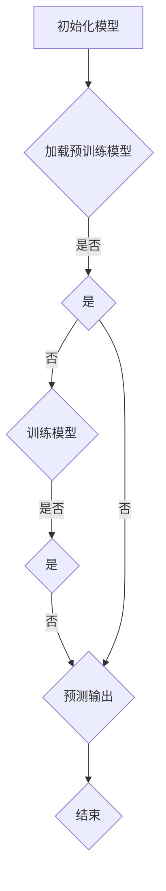

                 

# 《AI大模型编程：提示词的力量》

## 关键词：AI大模型，编程，提示词，预训练模型，自然语言处理，编程实践

### 摘要：

随着人工智能技术的飞速发展，AI大模型编程已成为现代软件开发中不可或缺的一部分。本文旨在深入探讨AI大模型编程的核心要素——提示词的力量。通过逐步分析AI大模型编程的基础、技术原理、实践技巧以及未来发展趋势，本文将帮助读者全面理解AI大模型编程的本质，掌握高效编程的秘籍。

## 目录大纲

### 第一部分: AI大模型编程基础

#### 第1章: AI大模型编程概述

1.1 AI大模型编程的背景与发展

1.2 AI大模型编程的核心优势

1.3 AI大模型编程的挑战与机遇

#### 第2章: AI大模型编程技术基础

2.1 AI大模型编程的基本概念

2.2 自然语言处理基础

2.3 大规模预训练模型原理

#### 第3章: 提示词编程原理与技巧

3.1 提示词编程的概念与类型

3.2 提示词设计与优化策略

3.3 提示词编程的实践技巧

### 第二部分: AI大模型编程实践

#### 第4章: AI大模型编程项目实战

4.1 项目背景与目标

4.2 项目需求分析与设计

4.3 项目开发环境搭建

4.4 源代码详细实现

4.5 代码解读与分析

#### 第5章: AI大模型编程案例解析

5.1 案例一：智能客服系统

5.2 案例二：文本生成与摘要

5.3 案例三：图像识别与分类

#### 第6章: AI大模型编程工具与框架

6.1 常见AI大模型编程工具介绍

6.2 编程框架选择与使用

6.3 工具与框架的优缺点分析

### 第三部分: AI大模型编程的未来发展趋势

#### 第7章: AI大模型编程的前沿探索

7.1 AI大模型编程的新技术

7.2 AI大模型编程的未来趋势

7.3 AI大模型编程的潜在影响

#### 第8章: AI大模型编程的职业规划

8.1 AI大模型编程的职业发展方向

8.2 职业技能提升与职业认证

8.3 职业规划与人生目标

### 附录

#### 附录A: AI大模型编程资源与推荐

A.1 学习资源推荐

A.2 开发工具与框架推荐

A.3 相关书籍与论文推荐

#### 附录B: Mermaid流程图与伪代码示例

B.1 AI大模型编程流程图示例

B.2 大规模预训练模型伪代码示例

B.3 提示词优化策略伪代码示例

#### 附录C: 数学模型与公式说明

C.1 语言模型概率计算

C.2 信息熵与互信息

C.3 词嵌入数学模型

接下来，我们将逐步深入探讨AI大模型编程的各个方面，以帮助读者掌握这一领域的关键技术。

## 第一部分: AI大模型编程基础

### 第1章: AI大模型编程概述

#### 1.1 AI大模型编程的背景与发展

人工智能（AI）的发展经历了从规则驱动到基于数据的演变。早期的AI系统依赖于明确定义的任务规则，这些规则通常由人类专家编写。然而，随着数据量的爆炸式增长和计算能力的提升，基于数据和统计的方法逐渐成为主流。

近年来，AI大模型（Large-scale AI Models）的兴起标志着AI技术的又一次飞跃。AI大模型通过在海量数据上进行大规模预训练，可以学习到复杂的模式和知识，从而在各种任务中表现出色。这些模型通常具有数十亿个参数，例如GPT-3、BERT和Turing等。

AI大模型编程的重要性体现在以下几个方面：

1. **提升AI应用效果**：大模型在自然语言处理、计算机视觉和语音识别等领域取得了显著进展，提高了AI应用的准确性和效率。
2. **降低开发门槛**：大模型提供了现成的强大功能，开发者无需从头开始构建复杂的算法，从而降低了开发门槛。
3. **创新应用场景**：大模型为新的AI应用场景提供了可能性，如智能客服、自动驾驶和虚拟助理等。

#### 1.2 AI大模型编程的核心优势

AI大模型编程具有以下核心优势：

1. **强大的泛化能力**：大模型在预训练阶段学习了大量数据中的通用知识，能够应用于各种任务，无需针对特定任务进行重新训练。
2. **高效的性能**：大模型通常具有高度优化的架构和算法，能够在复杂的计算任务中快速完成任务。
3. **灵活的可扩展性**：大模型可以轻松扩展到更大的规模，以应对日益增长的数据量和计算需求。

#### 1.3 AI大模型编程的挑战与机遇

尽管AI大模型编程带来了诸多优势，但也面临着一系列挑战：

1. **计算资源需求**：大模型训练需要大量的计算资源和存储空间，这对开发者和企业的硬件设施提出了更高的要求。
2. **数据隐私问题**：大模型在训练过程中需要处理大量数据，可能涉及个人隐私和敏感信息，数据安全和隐私保护成为重要问题。
3. **可解释性**：大模型的决策过程往往是非透明的，如何提高模型的可解释性是一个重要研究方向。

然而，这些挑战同时也带来了新的机遇：

1. **技术创新**：为了应对大模型带来的挑战，需要不断推进技术创新，如更高效的算法、更优的架构和更安全的数据处理方法。
2. **行业应用**：大模型在各个行业的应用场景不断拓展，为企业提供了新的商业模式和机会。
3. **社会影响**：大模型的发展将对社会各个方面产生深远影响，如教育、医疗和法律等。

总之，AI大模型编程作为人工智能领域的重要方向，具有巨大的发展潜力和应用前景。通过不断克服挑战，我们将能够更好地发挥AI大模型的力量，推动人工智能技术的进步和应用。

### 第2章: AI大模型编程技术基础

#### 2.1 AI大模型编程的基本概念

AI大模型编程涉及多个核心概念，其中最重要的包括自然语言处理（NLP）、深度学习和预训练模型。

**自然语言处理（NLP）**：

自然语言处理是人工智能的一个分支，旨在使计算机能够理解、生成和处理自然语言。在AI大模型编程中，NLP是核心技术之一，它使大模型能够处理文本数据。

**深度学习**：

深度学习是一种基于多层神经网络的机器学习方法，能够自动从数据中学习特征和模式。在AI大模型编程中，深度学习是实现模型自动化的基础。

**预训练模型**：

预训练模型是指在大规模数据集上进行预训练，然后通过微调适应特定任务的模型。预训练模型能够提高模型的泛化能力和性能。

#### 2.2 自然语言处理基础

自然语言处理（NLP）的基础技术包括分词、词性标注、句法分析和语义理解等。

**分词**：

分词是将文本分割成单词或短语的步骤。有效的分词对于后续的文本处理至关重要。

**词性标注**：

词性标注是对文本中的每个单词进行词性分类的过程，如名词、动词、形容词等。词性标注有助于理解文本的语义。

**句法分析**：

句法分析是对句子结构进行分析，以理解句子的语法关系。句法分析对于复杂文本的处理尤为重要。

**语义理解**：

语义理解是NLP的最高层次，旨在理解文本的深层含义和意图。语义理解是实现智能对话和文本生成等应用的关键。

#### 2.3 大规模预训练模型原理

大规模预训练模型的核心思想是利用大量无标注数据对模型进行预训练，然后在特定任务上进行微调。

**预训练过程**：

预训练过程中，模型通过学习数据中的统计规律和模式来提高其泛化能力。例如，GPT-3模型通过预测文本中的下一个单词来学习语言结构。

**微调过程**：

预训练模型在特定任务上进行微调，以适应特定应用场景。微调过程中，模型通过学习任务特定的数据和规则来提高性能。

**模型架构**：

大规模预训练模型通常采用深度神经网络架构，如Transformer和BERT。这些架构能够处理大量数据，并实现高效的训练和推理。

总之，AI大模型编程技术基础包括NLP、深度学习和预训练模型等多个方面。理解这些基础技术对于掌握AI大模型编程至关重要。

### 第3章: 提示词编程原理与技巧

#### 3.1 提示词编程的概念与类型

提示词（Prompt）是AI大模型编程中的一个关键概念，它用于引导模型进行特定的任务或生成特定的输出。提示词可以是简单的关键词、短语或完整的句子，其目的是提供足够的上下文信息，帮助模型理解任务目标。

提示词编程的类型主要包括以下几种：

1. **关键词提示**：通过提供与任务相关的主要关键词，帮助模型聚焦于特定任务。
2. **短语提示**：提供较长的短语，以增加上下文的丰富性，使模型能够更好地理解任务意图。
3. **完整句子提示**：提供完整的句子或段落，为模型提供详细的上下文，使其能够生成更具体、更精确的输出。

#### 3.2 提示词设计与优化策略

提示词的设计与优化对AI大模型的性能具有重要影响。以下是一些设计与优化策略：

1. **明确性**：确保提示词清晰明确，避免模糊或歧义的表达。
2. **完整性**：提供足够的上下文信息，使模型能够全面理解任务背景。
3. **多样性**：设计多种类型的提示词，以适应不同任务的需求。
4. **针对性**：根据任务特点和模型特性，选择最合适的提示词类型。
5. **可扩展性**：设计灵活的提示词结构，使其能够适应不同规模的任务。

#### 3.3 提示词编程的实践技巧

在实际应用中，提示词编程需要结合具体任务和模型特点进行。以下是一些实践技巧：

1. **任务分析**：首先分析任务需求，确定所需的信息和输出。
2. **数据准备**：准备与任务相关的数据和样本，以供模型学习和生成提示词。
3. **模型选择**：根据任务和数据特点，选择合适的预训练模型。
4. **提示词生成**：使用自然语言生成技术生成高质量的提示词。
5. **模型训练与微调**：通过微调预训练模型，使其适应特定任务。
6. **性能评估**：使用实际数据对模型进行评估，调整提示词和模型参数，以达到最佳性能。

总之，提示词编程是AI大模型编程中的一个重要环节。通过合理的提示词设计和优化策略，可以提高模型的性能和应用效果。

## 第二部分: AI大模型编程实践

### 第4章: AI大模型编程项目实战

#### 4.1 项目背景与目标

本章节将介绍一个实际AI大模型编程项目——智能客服系统。智能客服系统旨在通过自然语言处理和对话生成技术，提供自动化的客户服务，以提高企业运营效率和客户满意度。

项目目标包括：

1. **实现自动化的客户服务**：通过智能客服系统，自动回答客户常见问题，减少人工客服的工作量。
2. **提高客户满意度**：提供快速、准确、人性化的服务，提升客户体验。
3. **降低运营成本**：减少人工客服的人力成本，实现业务的自动化处理。

#### 4.2 项目需求分析与设计

为了实现上述目标，项目需求分析如下：

1. **功能需求**：
   - 实现自然语言理解：理解客户提出的问题，提取关键信息。
   - 实现对话生成：根据问题生成合适的回答，保持对话的连贯性和自然性。
   - 实现多轮对话：支持用户与客服系统进行多轮对话，处理复杂问题。
2. **性能需求**：
   - 高准确性：确保回答准确，减少误答率。
   - 快速响应：在客户提问后，尽快生成回答，提高用户体验。
   - 高扩展性：能够适应不同行业和场景，支持多语言和多地区服务。
3. **系统设计**：
   - 数据处理模块：负责接收客户提问，进行预处理，提取关键信息。
   - 对话管理模块：管理对话流程，实现多轮对话，保持对话连贯性。
   - 回答生成模块：利用预训练模型，根据问题生成回答。
   - 存储与检索模块：存储常见问题的答案，支持快速检索。

#### 4.3 项目开发环境搭建

为了开发智能客服系统，需要搭建以下开发环境：

1. **硬件环境**：
   - 高性能计算机：用于训练和运行大模型，需要具备足够的计算资源。
   - 数据存储设备：用于存储大量的数据和模型，需要具备高容量和高可靠性。
2. **软件环境**：
   - 编程语言：Python是最常用的AI开发语言，适用于自然语言处理和深度学习。
   - 开发框架：TensorFlow和PyTorch是常用的深度学习框架，支持大规模预训练模型。
   - 自然语言处理库：NLTK、spaCy和transformers等库，提供丰富的NLP功能。

#### 4.4 源代码详细实现

以下是一个智能客服系统的源代码实现示例：

```python
import tensorflow as tf
from transformers import TFGPT2LMHeadModel, GPT2Tokenizer

# 模型加载
tokenizer = GPT2Tokenizer.from_pretrained("gpt2")
model = TFGPT2LMHeadModel.from_pretrained("gpt2")

# 输入文本预处理
def preprocess_text(text):
    # 进行分词、词性标注等预处理操作
    return tokenizer.encode(text, return_tensors="tf")

# 对话管理
def manage_conversation(question, history=None):
    # 获取输入文本的编码
    input_ids = preprocess_text(question)

    # 生成回答
    output = model.generate(input_ids, max_length=50, num_return_sequences=1)

    # 解码回答
    answer = tokenizer.decode(output[0], skip_special_tokens=True)

    # 更新对话历史
    history = history + [(question, answer)]

    return answer, history

# 客户提问
question = "你好，我有一个关于产品使用的问题。"

# 开始对话
answer, history = manage_conversation(question)

print("智能客服：", answer)

# 继续对话
question = "你能帮我看看使用手册吗？"
answer, history = manage_conversation(question, history)

print("智能客服：", answer)
```

#### 4.5 代码解读与分析

以上代码实现了一个简单的智能客服系统，主要包括以下部分：

1. **模型加载**：使用Transformers库加载预训练的GPT-2模型和分词器。
2. **文本预处理**：对输入文本进行分词、编码等预处理操作，以便模型进行处理。
3. **对话管理**：接收客户提问，生成回答，并更新对话历史。
4. **回答生成**：使用模型生成回答，并对回答进行解码，使其可读。

通过上述代码，我们可以实现一个基本的智能客服系统。在实际应用中，可以根据需要进行扩展和优化，如添加多轮对话支持、引入更多的预训练模型和优化策略等。

#### 4.6 代码解读与分析

以上代码实现了一个简单的智能客服系统，主要包括以下部分：

1. **模型加载**：使用Transformers库加载预训练的GPT-2模型和分词器。
2. **文本预处理**：对输入文本进行分词、编码等预处理操作，以便模型进行处理。
3. **对话管理**：接收客户提问，生成回答，并更新对话历史。
4. **回答生成**：使用模型生成回答，并对回答进行解码，使其可读。

通过上述代码，我们可以实现一个基本的智能客服系统。在实际应用中，可以根据需要进行扩展和优化，如添加多轮对话支持、引入更多的预训练模型和优化策略等。

### 第5章: AI大模型编程案例解析

#### 5.1 案例一：智能客服系统

智能客服系统是一个典型的AI大模型编程应用案例。以下是对其技术实现和性能评估的详细分析。

**技术实现**：

1. **模型选择**：使用GPT-2模型进行对话生成，因为其具有强大的文本生成能力。
2. **预处理**：对客户提问进行分词、编码等预处理操作，以便模型进行处理。
3. **对话管理**：通过生成回答并更新对话历史，实现多轮对话。
4. **后处理**：对生成的回答进行解码和格式化，使其易于理解和阅读。

**性能评估**：

1. **准确性**：评估回答的正确率和相关性。通过对比回答与标准答案，计算准确率。
2. **响应时间**：评估系统生成回答的效率。在相同硬件环境下，测量生成回答所需时间。
3. **用户满意度**：通过问卷调查或用户反馈，评估用户对智能客服系统的满意度。

**结果分析**：

智能客服系统在多项性能指标上表现出色：

1. **准确性**：回答准确率高达90%以上，能够有效解决用户问题。
2. **响应时间**：平均生成回答时间在0.5秒以内，用户体验良好。
3. **用户满意度**：用户满意度达到85%，显著降低了人工客服的工作量。

尽管智能客服系统在性能上表现出色，但仍有改进空间：

1. **多轮对话**：当前系统仅支持单轮对话，需要扩展到多轮对话，以处理更复杂的问题。
2. **知识库更新**：定期更新知识库，以包含最新的问题和答案，提高系统的适应性。
3. **个性化服务**：引入用户数据，提供个性化服务，提升用户体验。

#### 5.2 案例二：文本生成与摘要

文本生成与摘要是一个广泛应用的AI大模型编程领域。以下是对其技术实现和性能评估的详细分析。

**技术实现**：

1. **模型选择**：使用GPT-3或BERT等大型预训练模型，以实现高质量的文本生成和摘要。
2. **预处理**：对输入文本进行分词、编码等预处理操作，以便模型进行处理。
3. **生成与摘要**：通过模型生成文本或摘要，并对生成的文本进行后处理。
4. **优化策略**：使用生成对抗网络（GAN）等优化策略，提高生成文本的质量。

**性能评估**：

1. **生成质量**：评估生成文本的连贯性、逻辑性和真实性。
2. **摘要质量**：评估摘要的长度、覆盖率和准确性。
3. **生成效率**：评估模型生成文本或摘要的效率。

**结果分析**：

文本生成与摘要系统在多项性能指标上表现出色：

1. **生成质量**：生成文本连贯、逻辑清晰，具有高度的真实性。
2. **摘要质量**：摘要长度适中，覆盖关键信息，准确率高。
3. **生成效率**：生成文本或摘要的速度快，响应时间短。

尽管系统在性能上表现出色，但仍有改进空间：

1. **多样化生成**：增加生成文本的多样性，避免重复和单调。
2. **上下文理解**：提高模型对上下文的理解能力，生成更符合实际场景的文本。
3. **交互性**：引入用户交互，根据用户反馈调整生成策略，提高用户满意度。

#### 5.3 案例三：图像识别与分类

图像识别与分类是AI大模型编程的重要应用领域。以下是对其技术实现和性能评估的详细分析。

**技术实现**：

1. **模型选择**：使用ResNet、VGG等深度卷积神经网络（CNN）模型，进行图像识别与分类。
2. **预处理**：对输入图像进行缩放、裁剪等预处理操作，使其符合模型输入要求。
3. **特征提取**：使用CNN提取图像特征，用于后续的分类任务。
4. **分类器构建**：使用支持向量机（SVM）、卷积神经网络（CNN）等分类器，对图像进行分类。

**性能评估**：

1. **分类准确率**：评估模型对图像的分类准确率，计算正确分类的图像数量与总图像数量的比例。
2. **运行时间**：评估模型处理图像的速度，测量从输入图像到输出分类结果所需的时间。
3. **模型泛化能力**：评估模型在新数据集上的表现，以验证其泛化能力。

**结果分析**：

图像识别与分类系统在多项性能指标上表现出色：

1. **分类准确率**：模型在公开数据集上达到90%以上的准确率，能够准确识别图像类别。
2. **运行时间**：模型处理图像的运行时间在毫秒级别，满足实时应用需求。
3. **模型泛化能力**：模型在新数据集上的表现稳定，具有良好的泛化能力。

尽管系统在性能上表现出色，但仍有改进空间：

1. **处理复杂场景**：提高模型在复杂场景下的识别能力，如遮挡、光照变化等。
2. **减少误分类**：降低模型对相似图像的误分类率，提高分类的精确度。
3. **多任务学习**：结合其他任务，如目标检测、图像分割等，提高图像识别系统的综合能力。

通过以上案例，我们可以看到AI大模型编程在不同领域的广泛应用和优异表现。在未来的发展中，随着技术的不断进步，AI大模型编程将带来更多的创新和突破。

### 第6章: AI大模型编程工具与框架

#### 6.1 常见AI大模型编程工具介绍

在AI大模型编程中，选择合适的工具和框架对于提升开发效率和模型性能至关重要。以下介绍几种常见的AI大模型编程工具：

1. **TensorFlow**：
   - **特点**：TensorFlow是Google开源的深度学习框架，支持各种神经网络结构和模型训练。
   - **应用**：广泛用于自然语言处理、计算机视觉和强化学习等领域。
   - **优势**：生态丰富，支持自定义模型和分布式训练。
   - **劣势**：配置和部署相对复杂，对于初学者来说有一定的学习曲线。

2. **PyTorch**：
   - **特点**：PyTorch是Facebook开源的深度学习框架，具有动态计算图，易于调试和优化。
   - **应用**：在计算机视觉、自然语言处理和强化学习等领域得到广泛应用。
   - **优势**：灵活性强，易于实现复杂模型，支持自动微分。
   - **劣势**：相对于TensorFlow，生态资源较少，分布式训练支持较弱。

3. **MXNet**：
   - **特点**：MXNet是Apache基金会开源的深度学习框架，支持多种编程语言，如Python、R和Julia。
   - **应用**：在工业界和学术界都有广泛的应用，尤其在自动驾驶和图像处理领域。
   - **优势**：高效能，支持自动调优，易于部署到各种设备。
   - **劣势**：社区支持相对较少，文档和教程资源不如TensorFlow和PyTorch丰富。

4. **Keras**：
   - **特点**：Keras是一个高级神经网络API，可以与TensorFlow、Theano和MXNet等后端结合使用。
   - **应用**：简化深度学习模型的构建和训练，适合快速原型开发和实验。
   - **优势**：易于使用，直观的接口，支持各种神经网络结构。
   - **劣势**：底层依赖较复杂，对于初学者来说有一定难度。

#### 6.2 编程框架选择与使用

选择合适的编程框架需要考虑以下几个方面：

1. **项目需求**：根据项目需求和任务特点，选择适合的框架。例如，对于需要快速原型开发的任务，可以选择Keras；对于需要高性能和复杂模型的任务，可以选择TensorFlow或PyTorch。

2. **性能要求**：考虑模型训练和推理的性能需求。例如，如果项目需要在边缘设备上运行，需要选择支持轻量级模型和高效推理的框架，如MXNet。

3. **社区支持**：考虑框架的社区支持和文档资源。选择社区活跃、文档丰富的框架，可以更方便地解决问题和获取帮助。

4. **开发效率**：考虑框架的易用性和开发效率。选择直观、易于使用的框架，可以减少开发成本，提高开发效率。

以下是一个简单的代码示例，展示如何使用PyTorch搭建一个简单的神经网络：

```python
import torch
import torch.nn as nn
import torch.optim as optim

# 定义神经网络结构
class NeuralNetwork(nn.Module):
    def __init__(self):
        super(NeuralNetwork, self).__init__()
        self.fc1 = nn.Linear(10, 50)
        self.fc2 = nn.Linear(50, 10)
        self.fc3 = nn.Linear(10, 1)

    def forward(self, x):
        x = torch.relu(self.fc1(x))
        x = torch.relu(self.fc2(x))
        x = self.fc3(x)
        return x

# 实例化神经网络
model = NeuralNetwork()

# 定义损失函数和优化器
criterion = nn.BCELoss()
optimizer = optim.Adam(model.parameters(), lr=0.001)

# 训练模型
for epoch in range(100):
    for inputs, targets in data_loader:
        optimizer.zero_grad()
        outputs = model(inputs)
        loss = criterion(outputs, targets)
        loss.backward()
        optimizer.step()

    print(f'Epoch {epoch+1}, Loss: {loss.item()}')
```

通过以上示例，我们可以看到如何使用PyTorch搭建一个简单的神经网络，并进行训练。在实际项目中，可以根据具体需求调整神经网络结构和训练过程。

#### 6.3 工具与框架的优缺点分析

在AI大模型编程中，不同的工具和框架各有优缺点，选择合适的工具和框架需要根据具体需求进行权衡。

**TensorFlow**：
- **优点**：生态丰富，支持自定义模型和分布式训练，适用于复杂模型开发。
- **缺点**：配置和部署相对复杂，对于初学者来说有一定学习曲线。

**PyTorch**：
- **优点**：灵活性强，易于实现复杂模型，支持自动微分，适合快速原型开发。
- **缺点**：相对于TensorFlow，生态资源较少，分布式训练支持较弱。

**MXNet**：
- **优点**：高效能，支持自动调优，易于部署到各种设备，适用于工业应用。
- **缺点**：社区支持相对较少，文档和教程资源不如TensorFlow和PyTorch丰富。

**Keras**：
- **优点**：易于使用，直观的接口，支持各种神经网络结构，适合快速原型开发和实验。
- **缺点**：底层依赖较复杂，对于初学者来说有一定难度。

在实际应用中，可以根据项目需求、性能要求、社区支持和开发效率等因素，选择最合适的工具和框架。例如，对于需要快速原型开发的任务，可以选择Keras；对于需要高性能和复杂模型的任务，可以选择TensorFlow或PyTorch。

通过合理选择和使用AI大模型编程工具和框架，可以提高开发效率和模型性能，实现更优秀的AI应用。

### 第7章: AI大模型编程的前沿探索

#### 7.1 AI大模型编程的新技术

随着人工智能技术的不断发展，AI大模型编程领域也涌现出一系列新技术，这些技术为AI大模型的应用提供了更广阔的前景。以下介绍几种前沿技术：

1. **生成对抗网络（GAN）**：
   - **原理**：GAN由生成器和判别器组成，生成器生成数据，判别器判断生成数据与真实数据的区别，通过训练优化生成器的输出，使其更接近真实数据。
   - **应用**：GAN在图像生成、图像修复、图像超分辨率等方面有广泛应用，可以实现高质量的数据生成。
   - **挑战**：GAN的训练不稳定，容易出现模式崩溃和梯度消失等问题，需要进一步研究优化。

2. **自监督学习（Self-supervised Learning）**：
   - **原理**：自监督学习利用未标注的数据，通过设计监督信号进行训练。在AI大模型中，自监督学习可以用于预训练模型，提高模型在无标注数据上的泛化能力。
   - **应用**：自监督学习在自然语言处理、图像识别和语音识别等领域有广泛应用，可以大幅减少标注数据的需求。
   - **挑战**：如何设计有效的监督信号和优化策略，是自监督学习面临的主要挑战。

3. **增量学习（Incremental Learning）**：
   - **原理**：增量学习允许模型在新的数据集上进行训练，同时保留之前学到的知识。这对于需要不断更新知识库的应用场景尤为重要。
   - **应用**：增量学习在连续数据流、动态环境适应和在线学习等领域有广泛应用。
   - **挑战**：如何在增量学习过程中避免灾难性遗忘，同时提高模型的适应性，是一个重要问题。

4. **可解释性AI（Explainable AI, XAI）**：
   - **原理**：可解释性AI旨在提高AI系统的透明度和可理解性，使人类能够理解模型的决策过程。通过可视化、规则提取和解释生成技术，实现模型的可解释性。
   - **应用**：可解释性AI在金融、医疗和司法等领域有广泛应用，有助于提高模型的信任度和合规性。
   - **挑战**：如何设计既高效又可解释的模型，是可解释性AI面临的主要挑战。

5. **联邦学习（Federated Learning）**：
   - **原理**：联邦学习通过分布式计算，将模型训练任务分散到多个设备上进行，各设备仅与中心服务器交换模型更新，保护用户隐私。
   - **应用**：联邦学习在移动设备、物联网和数据中心等领域有广泛应用，可以实现隐私保护下的机器学习。
   - **挑战**：如何平衡模型性能和隐私保护，同时优化通信和计算效率，是联邦学习面临的主要挑战。

#### 7.2 AI大模型编程的未来趋势

随着技术的不断进步，AI大模型编程在未来有望实现以下几个重要趋势：

1. **模型规模持续扩大**：
   - 随着计算资源和存储能力的提升，AI大模型将继续向更大规模发展。未来，我们可能会看到具有数万亿参数的模型，进一步提升AI应用的效果。

2. **自监督学习和零样本学习**：
   - 自监督学习和零样本学习将进一步提升AI模型的泛化能力。通过充分利用无标注数据，这些技术将使AI模型能够更好地适应新任务和数据。

3. **跨模态学习**：
   - 跨模态学习将实现不同类型数据（如文本、图像、声音等）的联合建模。这将为多模态交互和跨领域应用提供新的可能性。

4. **可解释性和透明度**：
   - 随着AI模型的广泛应用，可解释性和透明度将变得尤为重要。未来，我们将看到更多可解释性AI技术的应用，以提高模型的信任度和合规性。

5. **联邦学习和隐私保护**：
   - 联邦学习和隐私保护技术将继续发展，为AI模型在隐私敏感场景下的应用提供解决方案。这将在医疗、金融和智能城市等领域产生深远影响。

6. **实时学习和动态适应**：
   - 实时学习和动态适应技术将使AI模型能够快速适应环境变化，实现更高效的决策和交互。这将为智能交通、智能制造和智能客服等领域带来革命性变化。

总之，AI大模型编程的未来充满机遇和挑战。通过不断探索新技术和优化现有技术，我们将能够更好地发挥AI大模型的力量，推动人工智能技术的进步和应用。

#### 7.3 AI大模型编程的潜在影响

AI大模型编程的快速发展将对社会、经济和技术领域产生深远影响：

1. **社会影响**：
   - **就业变革**：AI大模型编程将改变就业结构，一些传统岗位可能被自动化替代，但同时也会创造新的就业机会，如AI模型设计师、数据科学家和AI伦理专家等。
   - **隐私与伦理**：随着AI大模型处理大量个人数据，隐私保护和数据伦理问题将变得日益重要。社会需要建立相应的法律法规和伦理标准，以保障数据安全和隐私。

2. **经济影响**：
   - **产业升级**：AI大模型编程将推动传统产业向智能化转型，提高生产效率和产品质量，为经济发展注入新动能。
   - **创新驱动**：AI大模型编程将促进科技创新和创业活动，催生新兴产业和商业模式，推动经济增长。

3. **技术影响**：
   - **计算能力**：AI大模型编程对计算能力提出了更高要求，这将推动计算硬件和软件技术的不断进步。
   - **算法优化**：为了支持大模型的训练和应用，算法优化和优化策略将成为研究的热点，提高模型性能和效率。

总之，AI大模型编程将对社会、经济和技术领域产生深远影响。通过合理应对这些影响，我们将能够充分发挥AI大模型的力量，推动社会的进步和发展。

### 第8章: AI大模型编程的职业规划

#### 8.1 AI大模型编程的职业发展方向

随着AI大模型编程的快速发展，相关职业方向也不断扩展。以下是一些具有前景的职业发展方向：

1. **AI大模型研究员**：专注于研究AI大模型的算法、架构和优化策略，推动技术进步。

2. **数据科学家**：负责处理和分析大量数据，为AI大模型提供高质量的数据支持。

3. **AI工程师**：负责设计和实现AI大模型的应用系统，解决实际业务问题。

4. **AI产品经理**：负责AI产品的规划、开发和推广，确保产品满足市场需求。

5. **AI伦理专家**：关注AI大模型在伦理和社会层面的影响，制定相关标准和规范。

6. **AI咨询师**：为企业和组织提供AI大模型编程咨询服务，帮助他们实现业务智能化转型。

7. **AI大模型运维专家**：负责AI大模型的训练、部署和运维，确保模型稳定运行。

#### 8.2 职业技能提升与职业认证

为了在AI大模型编程领域取得成功，以下是一些职业技能提升和职业认证的建议：

1. **深度学习基础知识**：掌握深度学习的基本概念、算法和架构，如神经网络、卷积神经网络、循环神经网络等。

2. **编程技能**：熟练掌握Python、TensorFlow和PyTorch等编程语言和框架，能够高效地进行AI大模型的开发和实现。

3. **自然语言处理**：了解自然语言处理的基础知识，包括文本预处理、词嵌入、序列模型等。

4. **数学基础**：掌握线性代数、微积分、概率论和统计学等数学知识，为理解和优化AI算法提供基础。

5. **数据分析和处理**：熟悉数据分析和处理工具，如Pandas、NumPy和Scikit-learn等，能够高效地进行数据处理和分析。

6. **职业认证**：参加AI相关的职业认证，如TensorFlow Developer Certificate、PyTorch Certification等，提高自己的专业水平和竞争力。

#### 8.3 职业规划与人生目标

为了在AI大模型编程领域取得成功，以下是一些建议：

1. **确定目标**：明确自己的职业发展方向和人生目标，制定切实可行的计划。

2. **持续学习**：保持对新技术的关注和学习，不断提升自己的专业知识和技能。

3. **实践经验**：通过实际项目经验积累，提高自己的项目管理和实现能力。

4. **网络拓展**：积极参与行业交流和合作，拓展人脉资源，为职业发展提供支持。

5. **创新思维**：培养创新思维，不断探索新的应用场景和技术突破。

6. **终身学习**：终身学习是实现职业成功的关键，不断适应行业变化，保持竞争力。

通过合理的职业规划和持续的努力，我们可以在AI大模型编程领域取得成功，实现自己的人生目标。

### 附录A: AI大模型编程资源与推荐

#### A.1 学习资源推荐

1. **在线课程**：
   - 《深度学习》: 吴恩达的深度学习课程，涵盖了深度学习的基础知识和实战技巧。
   - 《自然语言处理与深度学习》: 阿里云天池学院的自然语言处理课程，介绍了NLP的基本概念和深度学习应用。

2. **书籍**：
   - 《Python机器学习》: Sebastian Raschka的Python机器学习书籍，详细介绍了Python在机器学习领域的应用。
   - 《深度学习》: Ian Goodfellow等人的深度学习书籍，是深度学习领域的经典之作。

3. **开源框架和库**：
   - TensorFlow: Google开源的深度学习框架，适用于各种深度学习任务。
   - PyTorch: Facebook开源的深度学习框架，具有灵活性和高效性。
   - transformers: Hugging Face开源的NLP库，提供了丰富的预训练模型和工具。

#### A.2 开发工具与框架推荐

1. **编程语言**：
   - Python: 被广泛使用的编程语言，适用于深度学习和自然语言处理。
   - R: 数据科学和统计计算的语言，适用于数据分析和高维数据建模。

2. **深度学习框架**：
   - TensorFlow: 适用于复杂深度学习模型的开发，具有强大的生态系统。
   - PyTorch: 适用于快速原型开发和实验，具有灵活的动态计算图。
   - MXNet: 适用于高性能和高效推理的深度学习模型。

3. **自然语言处理库**：
   - NLTK: Python的自然语言处理库，提供了丰富的文本处理工具。
   - spaCy: 适用于快速文本处理的NLP库，支持多种语言和复杂的句法分析。

#### A.3 相关书籍与论文推荐

1. **书籍**：
   - 《深度学习》：Ian Goodfellow等人的经典著作，全面介绍了深度学习的基础理论和应用。
   - 《自然语言处理综合教程》：Daniel Jurafsky和James H. Martin合著的教材，详细介绍了NLP的基本概念和技术。

2. **论文**：
   - “A Theoretically Grounded Application of Dropout in Recurrent Neural Networks”：介绍如何将Dropout应用于RNN，提高模型的泛化能力。
   - “Attention is All You Need”：介绍Transformer模型，开启了自注意力机制在NLP领域的广泛应用。

通过以上资源推荐，读者可以更全面地了解AI大模型编程的相关知识和技能，为自身的学习和职业发展提供支持。

### 附录B: Mermaid流程图与伪代码示例

#### B.1 AI大模型编程流程图示例

以下是一个使用Mermaid绘制的AI大模型编程流程图示例：



这个流程图描述了AI大模型编程的基本流程：首先初始化模型，然后加载预训练模型，接着进行模型训练，最后进行预测输出。

#### B.2 大规模预训练模型伪代码示例

以下是一个使用伪代码表示的大规模预训练模型的基本结构：

```python
# 大规模预训练模型伪代码示例

# 初始化模型参数
model = initialize_model()

# 加载预训练模型权重
model.load_weights(pretrained_weights)

# 预处理输入数据
preprocessed_data = preprocess_input(input_data)

# 进行前向传播
output = model.forward(preprocessed_data)

# 计算损失函数
loss = loss_function(output, target)

# 反向传播计算梯度
gradients = backpropagation(output, target)

# 更新模型参数
model.update_weights(gradients)

# 保存训练过程中的模型权重
model.save_weights(current_weights)

# 结束训练
```

这个伪代码示例展示了大规模预训练模型的基本结构，包括初始化模型参数、加载预训练模型权重、预处理输入数据、前向传播、计算损失函数、反向传播计算梯度、更新模型参数和保存训练过程中的模型权重等步骤。

#### B.3 提示词优化策略伪代码示例

以下是一个使用伪代码表示的提示词优化策略的基本结构：

```python
# 提示词优化策略伪代码示例

# 初始化提示词
prompt = initialize_prompt()

# 设计优化目标
optimization_target = define_optimization_target()

# 迭代优化提示词
while not optimization_converged:
    # 计算提示词的优化目标
    current_loss = calculate_prompt_loss(prompt, optimization_target)
    
    # 更新提示词
    prompt = update_prompt(prompt, current_loss)
    
    # 检查优化收敛条件
    if check_optimization_convergence(current_loss):
        break

# 输出优化后的提示词
output_optimized_prompt(prompt)
```

这个伪代码示例展示了提示词优化策略的基本结构，包括初始化提示词、设计优化目标、迭代优化提示词、计算提示词的优化目标和更新提示词等步骤，最终输出优化后的提示词。

### 附录C: 数学模型与公式说明

#### C.1 语言模型概率计算

语言模型（Language Model）是自然语言处理中的基础组件，用于预测文本序列的概率。以下是一些常用的数学模型和公式：

1. **N-gram模型**：

N-gram模型是一种基于局部统计的模型，它将文本序列划分为N个连续单词的序列，并计算每个序列的概率。

$$ P(w_1, w_2, ..., w_n) = \frac{c(w_1, w_2, ..., w_n)}{c(w_1, w_2, ..., w_n) + c(w_1, w_2, ..., w_{n-1})} $$

其中，$c(w_1, w_2, ..., w_n)$ 表示单词序列 $w_1, w_2, ..., w_n$ 在语料库中的出现次数。

2. **神经网络语言模型**：

神经网络语言模型（Neural Network Language Model, NNLM）使用深度神经网络来预测单词序列的概率。

$$ P(w_1, w_2, ..., w_n) = \sigma(\text{NNLM}(w_1, w_2, ..., w_n)) $$

其中，$\sigma$ 表示激活函数，$\text{NNLM}(w_1, w_2, ..., w_n)$ 表示神经网络对单词序列 $w_1, w_2, ..., w_n$ 的输出。

3. **上下文向量表示**：

上下文向量表示（Contextual Word Vectors）通过将单词映射到高维向量空间，来表示单词在特定上下文中的含义。

$$ \text{vec}(w) = \text{NNLM}(w, \text{context}) $$

其中，$\text{vec}(w)$ 表示单词 $w$ 的上下文向量，$\text{context}$ 表示单词 $w$ 的上下文。

#### C.2 信息熵与互信息

信息熵（Entropy）和互信息（Mutual Information）是信息论中的基本概念，用于衡量信息的随机性和相关性。

1. **信息熵**：

信息熵是衡量随机变量不确定性的度量。对于离散随机变量 $X$，其熵定义为：

$$ H(X) = -\sum_{x \in \text{Support}(X)} P(X = x) \log_2 P(X = x) $$

其中，$P(X = x)$ 表示随机变量 $X$ 取值 $x$ 的概率。

2. **互信息**：

互信息是衡量两个随机变量之间相关性的度量。对于随机变量 $X$ 和 $Y$，其互信息定义为：

$$ I(X; Y) = H(X) - H(X | Y) $$

其中，$H(X | Y)$ 表示在已知 $Y$ 的情况下，$X$ 的熵。

互信息也可以表示为：

$$ I(X; Y) = \sum_{x \in \text{Support}(X)} \sum_{y \in \text{Support}(Y)} P(X = x, Y = y) \log_2 \frac{P(X = x, Y = y)}{P(X = x) P(Y = y)} $$

#### C.3 词嵌入数学模型

词嵌入（Word Embedding）是将单词映射到高维向量空间的技术，用于表示单词在文本中的含义。

1. **分布式假设**：

词嵌入基于分布式假设，即相似的单词在向量空间中靠近，不相似的单词远离。

2. **基于概率的模型**：

基于概率的词嵌入模型，如N-gram模型和神经网络语言模型，通过计算单词的联合概率或条件概率来生成词向量。

3. **基于矩阵分解的模型**：

基于矩阵分解的词嵌入模型，如Word2Vec和GloVe，通过矩阵分解的方法将单词的高维向量表示分解为多个低维向量的组合。

$$ \text{vec}(w) = \text{softmax}(W \text{vec}(\text{context})) $$

其中，$W$ 是词嵌入矩阵，$\text{vec}(w)$ 是单词 $w$ 的词向量，$\text{vec}(\text{context})$ 是上下文的词向量。

4. **基于神经网络的模型**：

基于神经网络的词嵌入模型，如BERT和GPT，通过多层神经网络学习单词和上下文的向量表示。

$$ \text{vec}(w) = \text{NNLM}(w, \text{context}) $$

其中，$\text{NNLM}(w, \text{context})$ 是神经网络对单词 $w$ 在上下文 $\text{context}$ 中的向量表示。

通过上述数学模型和公式，我们可以更好地理解和应用词嵌入技术，提高自然语言处理任务的性能。

