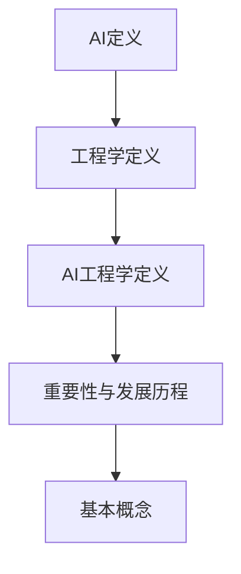
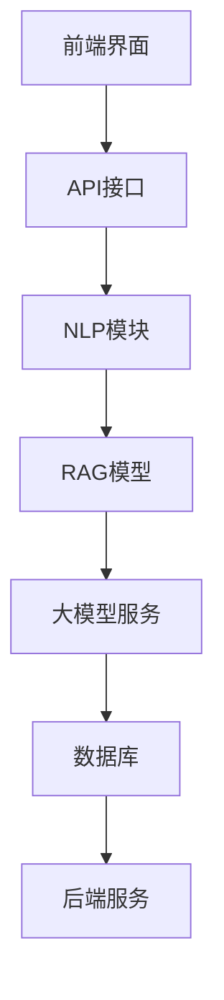
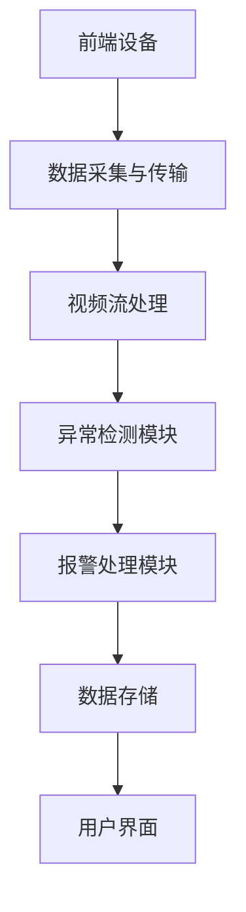
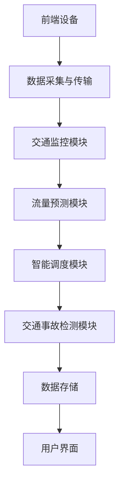

                 

### 文章标题

《AI工程学：大模型应用开发实战：RAG》

关键词：人工智能、AI工程学、大模型、RAG架构、自然语言处理、计算机视觉、强化学习、深度强化学习、多模态学习、应用开发、项目实战

摘要：本文旨在深入探讨AI工程学中的大模型应用开发，尤其是RAG（Read-Ask-Generate）架构的实战应用。文章将系统性地介绍AI工程学的基础知识、大模型原理、RAG架构解析以及RAG模型的开发流程。通过实战案例，本文将展示如何在实际项目中应用大模型和RAG架构，包括自然语言处理、计算机视觉和强化学习等多个领域。最后，本文将总结AI工程学项目实战中的关键技术和方法，并给出学习资源和未来研究方向。

## 《AI工程学：大模型应用开发实战：RAG》目录大纲

本文将分为三个主要部分：

### 第一部分：AI工程学基础

在这一部分中，我们将奠定AI工程学的基础，包括AI与工程学的联系、大模型原理以及RAG架构解析。

### 第二部分：大模型应用开发实战

这一部分将深入探讨大模型在自然语言处理、计算机视觉和强化学习等领域的应用开发实战。

### 第三部分：AI工程学项目实战

我们将通过几个典型的AI工程学项目实战案例，展示如何在实际环境中应用大模型和RAG架构。

### 附录

最后，我们将提供一些AI工程学常用的工具与资源，以及代码解读与分析，以便读者能够更好地理解和使用本文中介绍的技术。

让我们开始第一部分的学习之旅。

## 第一部分：AI工程学基础

### 第1章: AI与工程学的联系

在进入AI工程学的深入探讨之前，我们需要了解AI与工程学的紧密联系。AI（人工智能）是指由计算机系统执行的智能行为，而工程学则是一门应用科学，涉及设计、分析、制造和运营各种系统、机器和设备。AI工程学结合了这两个领域的知识，旨在开发、部署和维护AI系统，使其在现实世界中发挥作用。

#### 1.1 AI工程学的定义与重要性

AI工程学可以定义为将人工智能技术应用于实际问题的跨学科领域。它不仅涉及算法和数据分析，还包括硬件设计、软件架构、系统集成、数据管理和安全性等多个方面。AI工程学的重要性在于：

- **提高生产力**：通过自动化和智能化，AI工程学可以大幅提高生产效率和产品质量。
- **优化决策**：利用AI算法，工程学中的决策过程可以更加精准和高效。
- **创新应用**：AI工程学为传统工程领域带来了新的创新，如智能制造、智能交通和智能医疗等。

#### 1.2 AI工程学的发展历程

AI工程学的发展历程可以追溯到20世纪50年代，当时人工智能作为一门学科首次被提出。以下是一些重要的发展里程碑：

- **1956年**：达特茅斯会议标志着人工智能的正式诞生。
- **1980年代**：专家系统和机器学习开始广泛应用。
- **2006年**：深度学习革命性突破，神经网络重新受到关注。
- **2010年代**：大数据和云计算的兴起为AI工程学提供了强大的计算资源。
- **至今**：AI工程学在各个领域不断深入应用，如自动驾驶、语音识别和智能机器人等。

#### 1.3 AI工程学的基本概念

AI工程学涉及多个基本概念，包括：

- **机器学习**：通过数据训练模型，使其能够进行预测和决策。
- **神经网络**：模拟人脑神经元连接的网络结构，用于数据分析和模式识别。
- **深度学习**：多层神经网络，能够处理大量复杂数据。
- **数据预处理**：清洗、归一化和格式化数据，以供模型训练使用。
- **模型评估**：使用准确度、召回率、F1分数等指标评估模型性能。
- **系统集成**：将AI模型集成到现有系统中，实现实际应用。

### 总结

AI工程学是人工智能和工程学的结合体，它将AI技术应用于实际问题，通过设计、开发、部署和维护，实现智能化的系统解决方案。理解AI工程学的基础知识对于深入探讨大模型和RAG架构的应用至关重要。

#### Mermaid流程图



### 第2章: 大模型原理

大模型，顾名思义，是指规模庞大的机器学习模型，通常拥有数亿甚至数十亿个参数。这些模型通过大量数据进行训练，能够捕捉数据中的复杂模式和规律，从而实现高度精确的预测和决策。在本节中，我们将探讨大模型的概念、架构、训练与优化。

#### 2.1 大模型的概念

大模型的出现源于深度学习的快速发展。随着计算资源和数据量的增加，研究人员开始训练更加复杂的模型，这些模型通常被称为“大模型”。大模型的特点包括：

- **参数规模巨大**：拥有数亿甚至数十亿的参数。
- **数据依赖性强**：需要大量的训练数据来优化模型。
- **计算资源需求高**：训练大模型通常需要高性能计算设备和云计算资源。
- **表现能力强大**：大模型能够在各种复杂任务上表现出色，如自然语言处理、计算机视觉和强化学习等。

#### 2.2 大模型的架构

大模型的架构通常基于深度学习框架，如TensorFlow、PyTorch等。以下是大模型架构的基本组成部分：

- **输入层**：接收输入数据，如文本、图像或语音。
- **隐藏层**：多层神经网络结构，用于特征提取和模式识别。
- **输出层**：生成预测结果或决策。

大模型的架构通常包括以下几个层次：

1. **卷积神经网络（CNN）**：主要用于图像处理。
2. **循环神经网络（RNN）**：适用于序列数据处理，如自然语言。
3. **Transformer模型**：基于自注意力机制，广泛应用于自然语言处理和计算机视觉。

#### 2.3 大模型的训练与优化

大模型的训练与优化是一个复杂的过程，涉及到多个步骤和技巧。以下是训练大模型的一般流程：

1. **数据预处理**：清洗和格式化数据，确保数据质量。
2. **模型初始化**：初始化模型参数，选择合适的初始化方法。
3. **模型训练**：使用梯度下降算法和优化器调整模型参数。
4. **模型评估**：使用验证集或测试集评估模型性能。
5. **模型优化**：调整模型结构和超参数，提高模型性能。
6. **模型部署**：将训练好的模型部署到生产环境中。

在训练大模型时，以下技巧有助于提高模型性能：

- **数据增强**：通过随机裁剪、旋转、缩放等操作增加数据的多样性。
- **正则化**：防止模型过拟合，如L1正则化、L2正则化。
- **学习率调度**：动态调整学习率，以避免模型振荡。
- **批量归一化**：加速训练过程，提高模型稳定性。

#### 伪代码

下面是一个简单的伪代码示例，展示如何训练一个基于卷积神经网络（CNN）的大模型：

```plaintext
function train_large_model(data, labels, epochs, batch_size):
    for epoch in 1 to epochs:
        for batch in data:
            inputs, targets = batch
            optimizer.zero_grad()
            outputs = model(inputs)
            loss = loss_function(outputs, targets)
            loss.backward()
            optimizer.step()
            print(f"Epoch: {epoch}, Loss: {loss.item()}")
    return model
```

#### 总结

大模型是AI工程学中的重要组成部分，其巨大的参数规模和强大的表现能力使其在各种任务中表现出色。然而，训练和优化大模型需要大量的计算资源和技巧。理解大模型的概念和训练流程对于AI工程学的应用至关重要。

### 第3章: RAG架构解析

RAG（Read-Ask-Generate）架构是一种先进的AI模型架构，特别适用于复杂的问题回答和对话系统。RAG架构的核心思想是结合阅读、询问和生成三个步骤，以提供高质量、上下文相关的回答。在本节中，我们将详细介绍RAG架构的组成、核心组件以及应用场景。

#### 3.1 RAG架构简介

RAG架构由三个主要组件组成：阅读器（Reader）、询问器（Asker）和生成器（Generator）。这三个组件协同工作，以实现高效的问题回答。

- **阅读器（Reader）**：负责阅读和理解输入文本。阅读器通常是一个预训练的深度学习模型，如BERT、GPT等。
- **询问器（Asker）**：基于阅读器生成的上下文信息，生成一个问题，以获取更多信息。询问器可以使用查询嵌入（Query Embedding）和上下文嵌入（Context Embedding）进行交互。
- **生成器（Generator）**：使用阅读器和询问器提供的信息生成回答。生成器通常是一个序列到序列的模型，如Transformer或GPT。

RAG架构的工作流程如下：

1. **阅读器读取输入文本**：阅读器对输入文本进行编码，生成一个上下文表示。
2. **询问器生成问题**：询问器利用上下文表示生成一个问题。
3. **生成器生成回答**：生成器根据问题和上下文表示生成回答。

#### 3.2 RAG架构的核心组件

RAG架构的核心组件包括阅读器、询问器和生成器。下面分别介绍这三个组件：

- **阅读器（Reader）**：阅读器是一个负责理解和编码输入文本的模型。它可以是一个预训练的语言模型，如BERT或GPT，也可以是一个专门为特定任务设计的模型。阅读器的主要任务是提取输入文本的关键信息，并将其编码为一个固定长度的向量表示。

```latex
\text{Reader}(\text{Input Text}) \rightarrow \text{Context Vector}
```

- **询问器（Asker）**：询问器是基于阅读器生成的上下文表示，生成问题的模型。询问器可以通过交互式查询或基于规则的方法来生成问题。它通常使用查询嵌入（Query Embedding）和上下文嵌入（Context Embedding）进行交互，以提取上下文信息并生成问题。

```latex
\text{Ask}(\text{Context Vector}) \rightarrow \text{Question}
```

- **生成器（Generator）**：生成器是基于阅读器和询问器提供的信息，生成回答的模型。生成器通常是一个序列到序列的模型，如Transformer或GPT。它接收问题和上下文表示，并生成一个答案序列。

```latex
\text{Generate}(\text{Question}, \text{Context Vector}) \rightarrow \text{Answer Sequence}
```

#### 3.3 RAG架构的应用场景

RAG架构在各种应用场景中表现出色，以下是几个典型的应用场景：

- **问答系统**：RAG架构可以用于构建高效的问答系统，如智能客服、虚拟助手和智能搜索。通过阅读输入文本、生成问题和生成回答，RAG架构能够提供准确、上下文相关的答案。
- **对话系统**：RAG架构可以用于构建多轮对话系统，如聊天机器人。通过不断交互和更新上下文信息，RAG架构能够维持对话的连贯性和一致性。
- **知识图谱问答**：RAG架构可以与知识图谱结合，用于回答基于知识图谱的问题。通过阅读知识图谱、生成问题和生成回答，RAG架构能够提供权威、准确的答案。

#### 总结

RAG架构是一种先进的AI模型架构，特别适用于复杂的问题回答和对话系统。通过阅读、询问和生成三个步骤，RAG架构能够提供高质量、上下文相关的回答。理解RAG架构的组成和核心组件对于开发高效的AI应用至关重要。

### 第4章: RAG模型的开发流程

在本节中，我们将详细介绍RAG模型的开发流程，包括开发前的准备、数据处理、模型训练、评估与优化。通过这一过程，读者可以全面了解如何构建和部署一个高效的RAG模型。

#### 4.1 RAG模型开发前的准备

开发RAG模型前，需要进行充分的准备，包括以下几个方面：

- **硬件资源**：确保有足够的计算资源，如GPU或TPU，以支持大模型的训练。可以使用云计算平台，如Google Colab或AWS EC2，来获取高性能计算资源。
- **软件环境**：安装深度学习框架，如TensorFlow或PyTorch，以及相关的库和依赖项。配置好Python环境和相关的深度学习工具。
- **数据集**：准备用于训练和评估的数据集。数据集应该包含大量的问题和回答对，以保证模型的泛化能力。数据集可以从公共数据集，如SQuAD或WebQA，获取，也可以通过爬虫和人工标注获取。

- **预训练模型**：使用预训练的语言模型，如BERT或GPT，作为阅读器组件的基础。预训练模型已经在大规模数据上训练过，可以提取丰富的语言特征，提高模型的性能。

#### 4.2 RAG模型的数据处理

数据处理是RAG模型开发的重要环节，包括数据清洗、数据增强和格式化。以下是数据处理的主要步骤：

1. **数据清洗**：清洗数据集中的噪声和错误，如缺失值、重复值和异常值。使用正则表达式和文本清洗库（如Python的re和nltk）进行文本预处理，包括去除停用词、标点符号和进行词干提取等。
2. **数据增强**：通过数据增强技术增加数据的多样性，如随机替换词语、随机插入词语、随机删除词语等。数据增强有助于提高模型的泛化能力。
3. **格式化**：将问题、答案对转换为模型可以接受的格式。通常，问题作为查询输入，答案作为回答输出。可以使用预处理库（如TensorFlow的tf.keras.preprocessing.text）对文本进行分词、编码和序列化。

#### 4.3 RAG模型的训练

训练RAG模型是一个迭代的过程，涉及到多个步骤和技巧。以下是训练RAG模型的一般流程：

1. **模型定义**：定义RAG模型的结构，包括阅读器、询问器和生成器的网络架构。可以使用深度学习框架提供的API（如TensorFlow的tf.keras）定义模型。
2. **损失函数和优化器**：选择合适的损失函数和优化器。对于问答任务，常用的损失函数是交叉熵损失。优化器，如Adam或RMSprop，用于更新模型参数。
3. **训练循环**：在训练循环中，依次输入问题和答案对，并计算损失。使用反向传播算法更新模型参数。在每个迭代中，调整学习率、进行批量归一化和使用正则化技术，以提高模型的性能和稳定性。
4. **评估**：在训练过程中，使用验证集评估模型的性能。通过计算准确度、召回率、F1分数等指标，了解模型的泛化能力和优化空间。

#### 伪代码

下面是一个简单的伪代码示例，展示如何训练一个RAG模型：

```plaintext
function train_rag_model(data, labels, epochs, batch_size):
    for epoch in 1 to epochs:
        for batch in data:
            inputs, targets = batch
            model.zero_grad()
            outputs = model(inputs)
            loss = loss_function(outputs, targets)
            loss.backward()
            optimizer.step()
            print(f"Epoch: {epoch}, Loss: {loss.item()}")
        evaluate_model(model, validation_data)
    return model
```

#### 4.4 RAG模型的评估与优化

训练完成后，需要对RAG模型进行评估和优化，以提高模型的性能。以下是评估与优化的一些技巧：

1. **交叉验证**：使用交叉验证方法评估模型的泛化能力。通过将数据集划分为多个子集，轮流训练和验证模型，可以更准确地评估模型的性能。
2. **超参数调优**：调整模型的超参数，如学习率、批量大小和正则化强度，以找到最佳配置。可以使用网格搜索或随机搜索等方法进行超参数调优。
3. **模型集成**：使用多个模型的集成，如Bagging或Boosting，提高模型的稳定性和性能。
4. **模型压缩**：通过模型压缩技术，如剪枝、量化或知识蒸馏，减小模型的规模和计算量，以提高模型的部署效率。

#### 总结

RAG模型是现代AI问答系统的重要组成部分，其高效的阅读、询问和生成能力使其在各种应用中表现出色。通过开发前的准备、数据处理、模型训练和评估优化，我们可以构建和部署一个高效的RAG模型。理解RAG模型的开发流程对于实际应用AI技术至关重要。

### 自然语言处理应用开发

自然语言处理（NLP）是AI工程学中的重要领域，涉及文本分析、语言理解和生成。在本节中，我们将探讨如何使用RAG架构开发NLP应用，包括文本分类和文本生成。

#### 5.1 基于RAG的自然语言处理框架

RAG架构在NLP中具有广泛的应用，其核心组件——阅读器、询问器和生成器，可以高效地处理文本数据。以下是RAG在NLP中的应用框架：

1. **阅读器（Reader）**：使用预训练的语言模型（如BERT或GPT）对输入文本进行编码，提取关键信息。
2. **询问器（Asker）**：基于阅读器生成的上下文信息，生成特定的问题，以获取更多信息。例如，在文本分类任务中，询问器可以生成与类别相关的关键词或短语。
3. **生成器（Generator）**：根据问题和上下文信息生成回答。在文本生成任务中，生成器可以生成连贯的文本摘要或文章。

#### 5.2 文本分类应用开发

文本分类是NLP中的一个基本任务，旨在将文本分为不同的类别。基于RAG架构，我们可以开发一个高效的文本分类系统。以下是开发步骤：

1. **数据集准备**：准备用于训练和测试的文本数据集。数据集应包含不同类别的文本样本，如新闻分类、情感分析等。
2. **阅读器训练**：使用预训练的语言模型（如BERT）对文本进行编码，提取特征向量。
3. **类别查询生成**：询问器根据类别查询文本的特征向量，生成特定类别的问题或关键词。
4. **类别预测**：生成器根据类别查询和文本特征向量，预测文本的类别。
5. **模型评估**：使用准确度、召回率、F1分数等指标评估模型性能。

以下是一个简单的伪代码示例，展示如何实现基于RAG的文本分类：

```plaintext
function train_text_classification_model(data, labels):
    # 训练阅读器模型
    reader_model.train(data)
    
    # 生成类别查询
    for text in data:
        query = asker.generate_query(text, labels)
        
        # 预测类别
        predicted_label = generator.predict_label(query)
        
        # 计算损失并更新模型
        loss = loss_function(predicted_label, labels)
        loss.backward()
        optimizer.step()
        
    return reader_model, generator_model
```

#### 5.3 文本生成应用开发

文本生成是NLP中的另一个重要任务，旨在生成连贯、有意义的文本。基于RAG架构，我们可以开发一个高效的文本生成系统。以下是开发步骤：

1. **数据集准备**：准备用于训练和测试的文本数据集，如新闻文章、故事、对话等。
2. **阅读器训练**：使用预训练的语言模型（如GPT）对文本进行编码，提取特征向量。
3. **问题生成**：询问器根据文本特征向量生成问题，以引导生成器生成文本。
4. **文本生成**：生成器根据问题和上下文信息生成文本。
5. **模型评估**：使用BLEU、ROUGE等指标评估文本生成的质量。

以下是一个简单的伪代码示例，展示如何实现基于RAG的文本生成：

```plaintext
function generate_text(data, model):
    # 编码文本
    context_vector = reader_model.encode(data)
    
    # 生成问题
    question = asker.generate_question(context_vector)
    
    # 生成文本
    text = generator.generate_text(question, context_vector)
    
    return text
```

#### 总结

基于RAG架构的NLP应用开发提供了高效、灵活的文本处理解决方案。通过阅读器、询问器和生成器的协同工作，我们可以实现文本分类和文本生成等任务。理解RAG架构的NLP应用开发流程对于实际应用AI技术具有重要意义。

### 计算机视觉应用开发

计算机视觉是AI工程学的重要领域，涉及图像识别、目标检测、图像分类等任务。在本节中，我们将探讨如何使用RAG架构开发计算机视觉应用，重点介绍图像分类和目标检测。

#### 6.1 基于RAG的计算机视觉框架

RAG架构在计算机视觉中的应用同样具有优势，其核心组件——阅读器、询问器和生成器，可以高效地处理图像数据。以下是RAG在计算机视觉中的应用框架：

1. **阅读器（Reader）**：使用预训练的卷积神经网络（如ResNet或Inception）对输入图像进行编码，提取特征向量。
2. **询问器（Asker）**：基于阅读器生成的图像特征向量，生成特定的问题或关键词。例如，在目标检测任务中，询问器可以生成与目标类别相关的关键词。
3. **生成器（Generator）**：根据问题和图像特征向量，生成目标检测的结果或图像分类的标签。

#### 6.2 图像分类应用开发

图像分类是计算机视觉中的基本任务，旨在将图像分为不同的类别。基于RAG架构，我们可以开发一个高效的图像分类系统。以下是开发步骤：

1. **数据集准备**：准备用于训练和测试的图像数据集，如ImageNet、CIFAR-10等。
2. **阅读器训练**：使用预训练的卷积神经网络（如ResNet）对图像进行编码，提取特征向量。
3. **类别查询生成**：询问器根据类别查询图像的特征向量，生成特定类别的问题或关键词。
4. **类别预测**：生成器根据类别查询和图像特征向量，预测图像的类别。
5. **模型评估**：使用准确度、召回率、F1分数等指标评估模型性能。

以下是一个简单的伪代码示例，展示如何实现基于RAG的图像分类：

```plaintext
function train_image_classification_model(data, labels):
    # 训练阅读器模型
    reader_model.train(data)
    
    # 生成类别查询
    for image in data:
        query = asker.generate_query(image, labels)
        
        # 预测类别
        predicted_label = generator.predict_label(query)
        
        # 计算损失并更新模型
        loss = loss_function(predicted_label, labels)
        loss.backward()
        optimizer.step()
        
    return reader_model, generator_model
```

#### 6.3 目标检测应用开发

目标检测是计算机视觉中的关键任务，旨在识别图像中的多个目标并定位其位置。基于RAG架构，我们可以开发一个高效的目标检测系统。以下是开发步骤：

1. **数据集准备**：准备用于训练和测试的图像数据集，如COCO、Faster R-CNN等。
2. **阅读器训练**：使用预训练的卷积神经网络（如Faster R-CNN）对图像进行编码，提取特征向量。
3. **目标查询生成**：询问器根据目标特征向量，生成与目标类别相关的关键词。
4. **目标检测**：生成器根据目标查询和图像特征向量，检测图像中的目标并定位其位置。
5. **模型评估**：使用均值交并比（mAP）、精度、召回率等指标评估模型性能。

以下是一个简单的伪代码示例，展示如何实现基于RAG的目标检测：

```plaintext
function train_object_detection_model(data, labels):
    # 训练阅读器模型
    reader_model.train(data)
    
    # 生成目标查询
    for image in data:
        query = asker.generate_query(image, labels)
        
        # 检测目标
        detections = generator.detect_objects(query)
        
        # 计算损失并更新模型
        loss = loss_function(detections, labels)
        loss.backward()
        optimizer.step()
        
    return reader_model, generator_model
```

#### 总结

基于RAG架构的计算机视觉应用开发提供了高效、灵活的图像处理解决方案。通过阅读器、询问器和生成器的协同工作，我们可以实现图像分类和目标检测等任务。理解RAG架构的计算机视觉应用开发流程对于实际应用AI技术具有重要意义。

### 强化学习应用开发

强化学习是AI工程学中的一个重要分支，通过训练智能体在动态环境中做出最优决策，实现自主学习和智能行为。在本节中，我们将探讨如何使用RAG架构开发强化学习应用，包括环境建模与状态表示、行动策略设计和强化学习应用案例分析。

#### 7.1 基于RAG的强化学习框架

RAG架构在强化学习中的应用可以极大地提高智能体的决策能力和学习效率。RAG框架的核心组件——阅读器、询问器和生成器，可以协同工作，帮助智能体更好地理解和应对复杂环境。

1. **阅读器（Reader）**：负责读取和解析环境状态，生成状态表示。阅读器可以使用深度学习模型，如CNN或LSTM，从原始状态数据中提取关键特征。
2. **询问器（Asker）**：基于状态表示，生成问题以获取更多信息。询问器可以使用基于规则的策略或深度学习模型，如GPT，来生成问题。
3. **生成器（Generator）**：根据状态表示和问题，生成行动策略或决策。生成器可以使用基于策略的模型，如PPO或DQN，来生成行动策略。

#### 7.2 环境建模与状态表示

环境建模是强化学习的基础，状态表示的质量直接影响智能体的学习效果。在RAG框架中，环境建模与状态表示的步骤如下：

1. **环境定义**：定义强化学习环境，包括状态空间、动作空间和奖励机制。例如，在自动驾驶场景中，状态可以包括车辆位置、速度和周围环境信息，动作可以包括加速、减速或转向，奖励可以设置为安全行驶或完成任务的奖励。
2. **状态读取**：使用阅读器模型读取环境状态，并将其编码为向量表示。可以使用CNN提取图像特征，或使用LSTM处理序列数据。
3. **状态预处理**：对读取的状态进行预处理，包括数据归一化、缩放和去噪等。预处理有助于提高模型的学习效率和稳定性。

以下是一个简单的伪代码示例，展示如何使用RAG架构进行环境建模与状态表示：

```plaintext
function get_state_representation(environment):
    state = environment.get_state()
    state_vector = reader_model.encode(state)
    return state_vector
```

#### 7.3 行动策略设计

行动策略是强化学习中的核心组件，决定了智能体如何根据状态进行行动。在RAG框架中，行动策略设计包括以下步骤：

1. **问题生成**：询问器根据状态表示生成问题，以引导生成器生成行动策略。例如，在自动驾驶场景中，询问器可以生成“当前路段是否允许超车？”等问题。
2. **策略生成**：生成器根据状态表示和问题，生成行动策略。可以使用基于规则的策略或基于模型的策略，如Q网络或PPO。
3. **策略评估**：使用评估方法（如蒙特卡罗评估或时序差分学习）评估行动策略的效果，并根据评估结果调整策略。

以下是一个简单的伪代码示例，展示如何使用RAG架构进行行动策略设计：

```plaintext
function generate_action_policy(state, question):
    question_vector = asker.generate_question(state, question)
    action_vector = generator.generate_action(question_vector)
    return action_vector
```

#### 7.4 强化学习应用案例分析

为了更好地理解基于RAG的强化学习应用，我们来看一个实际案例：自动驾驶车辆的路径规划。

1. **环境建模**：自动驾驶环境包含车辆状态（如位置、速度、方向）、道路状态（如路况、车道线、交通信号）和动作空间（如加速、减速、转向）。
2. **状态表示**：使用RAG架构，阅读器模型从车辆和道路状态中提取特征，生成状态向量。
3. **行动策略**：询问器根据状态向量生成问题，如“当前车道是否有障碍物？”、“前方路况是否允许加速？”等。生成器根据问题和状态向量生成行动策略，决定车辆如何行驶。
4. **训练与评估**：使用强化学习算法（如PPO或DQN）训练智能体，通过不断与环境交互，优化行动策略。使用评估指标（如路径长度、安全性、效率）评估智能体的性能。

#### 总结

基于RAG架构的强化学习应用开发为智能体在复杂环境中的自主学习和决策提供了有效的方法。通过环境建模与状态表示、行动策略设计和强化学习应用案例分析，我们可以构建高效的强化学习系统。理解RAG架构在强化学习中的应用对于开发先进的人工智能系统具有重要意义。

### 深度强化学习应用开发

深度强化学习（DRL）结合了深度学习和强化学习的优势，使得智能体能够在复杂动态环境中进行高效学习。在本节中，我们将深入探讨DRL的基本概念，并详细介绍深度Q网络（DQN）和策略梯度（PG）的实战开发过程，以及模型的评估与优化。

#### 8.1 深度强化学习的基本概念

深度强化学习是强化学习的一个分支，它利用深度神经网络（DNN）来近似值函数或策略。DRL的核心目标是使智能体能够从环境中获取奖励信号，并通过策略迭代优化行为，从而在长期内实现累积奖励的最大化。DRL的基本组成部分包括：

- **智能体（Agent）**：执行动作、感知环境和获取奖励的实体。
- **环境（Environment）**：智能体执行动作并接收奖励的动态系统。
- **策略（Policy）**：智能体的行为策略，决定智能体如何选择动作。
- **值函数（Value Function）**：预测未来奖励的函数，用于评估不同动作的优劣。
- **模型（Model）**：用于近似值函数或策略的神经网络。

#### 8.2 深度Q网络（DQN）开发实战

DQN是一种经典的DRL算法，通过经验回放和目标网络来克服样本偏差和过度估计问题。以下是DQN的实战开发步骤：

1. **环境搭建**：定义强化学习环境，如Atari游戏或机器人模拟环境。选择一个合适的DRL框架，如DeepMind的DQN框架或OpenAI的Gym环境。
2. **模型定义**：定义DQN模型的结构，通常包括一个输入层、几个隐藏层和一个输出层。输出层的大小等于动作空间的大小，每个输出节点对应一个动作的Q值。
3. **经验回放**：实现经验回放机制，将智能体与环境交互的过程记录下来，存储在经验池中。经验回放有助于避免样本偏差，提高模型的鲁棒性。
4. **训练过程**：使用经验回放中的数据对DQN模型进行训练。每次迭代中，从经验池中随机抽取一批数据，计算目标Q值，并使用梯度下降算法更新模型参数。
5. **模型评估**：使用验证集或测试集评估DQN模型的性能。通过计算平均奖励、平均步数等指标，评估模型的稳定性和效果。

以下是一个简单的伪代码示例，展示如何实现DQN模型：

```plaintext
class DQN:
    def __init__(self, state_size, action_size):
        self.state_size = state_size
        self.action_size = action_size
        self.model = build_model()
        self.target_model = build_model()
        self.memory = deque(maxlen=2000)
        self.optimizer = optimizers.Adam(learning_rate=0.001)
        
    def remember(self, state, action, reward, next_state, done):
        self.memory.append((state, action, reward, next_state, done))
        
    def act(self, state, epsilon):
        if random.random() < epsilon:
            action = random.randrange(self.action_size)
        else:
            state_vector = np.reshape(state, [-1, self.state_size])
            action = self.model.predict(state_vector)[0]
        return action
    
    def replay(self, batch_size):
        batch = random.sample(self.memory, batch_size)
        states, actions, rewards, next_states, dones = zip(*batch)
        state_vectors = np.array(states)
        action_vectors = np.array(actions)
        reward_vectors = np.array(rewards)
        next_state_vectors = np.array(next_states)
        done_mask = np.array(dones)

        target_Q_values = self.target_model.predict(next_state_vectors)
        target_Q_values[done_mask] = 0
        target_Q_values = reward_vectors + (1 - done_mask) * target_Q_values

        with tf.GradientTape() as tape:
            Q_values = self.model.predict(state_vectors)
            Q_values = tf.reduce_sum(Q_values * action_vectors, axis=1)
            loss = tf.keras.losses.MSE(target_Q_values, Q_values)

        gradients = tape.gradient(loss, self.model.trainable_variables)
        self.optimizer.apply_gradients(zip(gradients, self.model.trainable_variables))
```

#### 8.3 策略梯度（PG）开发实战

策略梯度（PG）是一种基于策略的DRL算法，直接优化策略的期望回报。以下是PG的实战开发步骤：

1. **环境搭建**：与DQN类似，搭建强化学习环境，并定义动作空间和奖励机制。
2. **策略模型**：定义策略模型，通常是一个参数化的概率分布模型，如softmax或MLP（多层感知机）。
3. **策略优化**：使用策略梯度算法优化策略参数。每次迭代中，智能体根据当前策略选择动作，并更新策略参数以最大化累积奖励。
4. **模型评估**：使用验证集或测试集评估策略模型的效果。通过计算平均奖励、平均步数等指标，评估策略的稳定性和效果。

以下是一个简单的伪代码示例，展示如何实现策略梯度（PG）：

```plaintext
class PolicyGradient:
    def __init__(self, state_size, action_size, learning_rate=0.001):
        self.state_size = state_size
        self.action_size = action_size
        self.learning_rate = learning_rate
        self.model = build_policy_model()
        self.optimizer = optimizers.Adam(learning_rate=self.learning_rate)
        
    def predict_action_probs(self, state):
        state_vector = np.reshape(state, [-1, self.state_size])
        action_probs = self.model.predict(state_vector)
        return action_probs
    
    def update_policy(self, states, actions, rewards, next_states, dones):
        action_probs = self.predict_action_probs(states)
        returns = np.array(rewards)
        for i in range(len(actions)):
            if dones[i]:
                returns[i] = rewards[i]
            else:
                next_state_vector = np.reshape(next_states[i], [-1, self.state_size])
                next_action_probs = self.model.predict(next_state_vector)
                next_value = np.max(next_action_probs)
                returns[i] = rewards[i] + gamma * next_value
        
        with tf.GradientTape() as tape:
            loss = -np.sum(returns * tf.math.log(action_probs))
        
        gradients = tape.gradient(loss, self.model.trainable_variables)
        self.optimizer.apply_gradients(zip(gradients, self.model.trainable_variables))
```

#### 8.4 模型评估与优化

在DRL模型开发过程中，评估和优化是两个关键环节。以下是一些常用的评估与优化方法：

- **评估指标**：使用平均奖励、平均步数、成功率等指标评估模型性能。这些指标可以提供对模型效果的全局视图。
- **测试集**：使用独立的测试集评估模型的泛化能力。测试集应与训练集和验证集分离，以避免过拟合。
- **超参数调优**：通过网格搜索、随机搜索等超参数调优方法，找到最佳的超参数配置。超参数包括学习率、折扣因子、探索策略等。
- **模型压缩**：使用模型压缩技术（如剪枝、量化、知识蒸馏）减小模型的规模和计算量，提高部署效率。

#### 总结

深度强化学习（DRL）为智能体在复杂动态环境中的自主学习和决策提供了强大的工具。通过DQN和PG的实战开发，我们可以构建高效的DRL系统。理解DRL的基本概念、模型评估与优化方法对于开发先进的人工智能应用具有重要意义。

### 多模态学习应用开发

多模态学习是AI工程学中的一个重要方向，旨在利用不同类型的数据（如文本、图像、音频）来提高模型的性能和鲁棒性。在本节中，我们将探讨多模态学习的基本概念、多模态数据的融合方法以及多模态学习的应用场景和案例分析。

#### 9.1 多模态学习的基本概念

多模态学习通过整合来自不同模态的数据，实现更准确和全面的模型表现。以下是多模态学习的关键概念：

- **模态（Modality）**：指数据的类型，如文本（Text）、图像（Image）、音频（Audio）。
- **特征表示（Feature Representation）**：将不同模态的数据转换为可处理的特征表示。例如，使用卷积神经网络（CNN）处理图像，使用循环神经网络（RNN）处理文本。
- **数据融合（Data Fusion）**：将不同模态的数据进行整合，以提高模型的学习效果。数据融合方法包括特征级融合、决策级融合和模型级融合。
- **多模态模型（Multimodal Model）**：整合不同模态数据的多层神经网络模型，通过共享和独立的特征表示来学习不同模态之间的关联性。

#### 9.2 多模态数据的融合方法

多模态数据的融合方法可以分为以下几个层次：

1. **特征级融合**：在特征提取阶段，将不同模态的特征进行拼接或加权融合。这种方法简单有效，但可能无法捕捉模态之间的深层关联。
   
   伪代码示例：
   ```plaintext
   def feature_fusion(text_features, image_features):
       fused_features = np.concatenate((text_features, image_features), axis=1)
       return fused_features
   ```

2. **决策级融合**：在模型输出阶段，将不同模态的预测结果进行融合。这种方法可以在高层决策层面整合模态信息，提高模型的准确性。

   伪代码示例：
   ```plaintext
   def decision_fusion(text_prediction, image_prediction):
       fused_prediction = (text_prediction + image_prediction) / 2
       return fused_prediction
   ```

3. **模型级融合**：使用多个独立的模型分别处理不同模态的数据，然后将模型输出进行融合。这种方法可以捕捉不同模态之间的复杂关联，但计算成本较高。

   伪代码示例：
   ```plaintext
   def model_fusion(text_model, image_model):
       text_prediction = text_model.predict(text_data)
       image_prediction = image_model.predict(image_data)
       fused_prediction = (text_prediction + image_prediction) / 2
       return fused_prediction
   ```

#### 9.3 多模态学习的应用场景

多模态学习在多个应用场景中表现出色，以下是一些典型的应用场景：

- **情感分析**：结合文本和图像，情感分析可以更准确地识别用户情感。例如，在社交媒体分析中，结合用户评论和图像情感，可以更准确地判断用户情感状态。
- **医学诊断**：多模态学习可以整合医学影像（如X光、MRI）、患者文本记录和生物标志物，提高疾病诊断的准确性。
- **语音识别**：结合语音和文本信息，可以提高语音识别的准确性。例如，在会议记录中，结合语音转录和文本上下文，可以更准确地捕捉会议内容。
- **自动驾驶**：结合图像、激光雷达和语音，自动驾驶系统可以更准确地感知周围环境，提高行驶安全性。

#### 9.4 多模态学习应用案例分析

以下是一个多模态学习应用的案例：智能客服系统。

1. **数据集准备**：准备包含用户文本对话、图像和语音的多模态数据集。例如，用户提问的文本、对话中的图像以及语音录音。
2. **特征提取**：使用预训练的模型（如BERT、ResNet）分别提取文本、图像和语音的特征表示。
3. **数据融合**：使用特征级融合或决策级融合方法整合不同模态的特征。例如，将文本、图像和语音的特征进行拼接，或分别预测文本、图像和语音的情感，然后进行融合。
4. **模型训练**：使用多模态模型（如多任务学习模型、融合神经网络）进行训练。模型同时处理不同模态的数据，并在融合层进行预测。
5. **模型评估**：使用多模态数据集评估模型性能。通过计算准确度、召回率等指标，评估模型在不同模态数据融合下的表现。

以下是一个简单的伪代码示例，展示如何实现多模态学习的智能客服系统：

```plaintext
def prepare_data(text_data, image_data, audio_data):
    text_features = preprocess_text(text_data)
    image_features = preprocess_image(image_data)
    audio_features = preprocess_audio(audio_data)
    fused_features = feature_fusion(text_features, image_features, audio_features)
    return fused_features

def train_model(fused_features, labels):
    model = build_multimodal_model()
    model.compile(optimizer='adam', loss='binary_crossentropy', metrics=['accuracy'])
    model.fit(fused_features, labels, epochs=10, batch_size=32)
    return model

def predict(model, text_data, image_data, audio_data):
    fused_features = prepare_data(text_data, image_data, audio_data)
    prediction = model.predict(fused_features)
    return prediction
```

#### 总结

多模态学习通过整合不同类型的数据，提高了模型的性能和鲁棒性。理解多模态学习的基本概念、融合方法以及应用场景对于开发先进的人工智能应用具有重要意义。通过案例分析和伪代码示例，读者可以更好地理解多模态学习在实际应用中的实现过程。

### 智能客服系统项目实战

智能客服系统是AI工程学中一个典型的应用案例，通过结合大模型和RAG架构，可以实现高效、智能的客服服务。在本节中，我们将详细探讨智能客服系统的需求分析、系统架构设计、关键技术实现以及项目评估与优化。

#### 10.1 项目需求分析

智能客服系统的需求分析是项目成功的关键。以下是一些主要需求：

- **多渠道接入**：支持文本、语音、图像等多种渠道的客服请求。
- **自然语言理解**：通过NLP技术，理解用户的问题和意图，提供准确的回答。
- **智能回复**：基于大模型和RAG架构，生成高质量、个性化的客服回复。
- **情感识别**：识别用户的情感状态，提供适当的情绪响应。
- **上下文保持**：维持对话的连贯性，确保多轮对话的流畅性。
- **多语言支持**：支持多种语言，为全球用户提供服务。

#### 10.2 系统架构设计

智能客服系统的架构设计需要综合考虑功能需求和技术实现。以下是系统架构的组成部分：

1. **前端界面**：用户通过网页、移动应用或语音助手等前端界面发起客服请求。
2. **API接口**：提供RESTful API接口，供前端界面和后端系统进行通信。
3. **NLP模块**：负责文本预处理、情感识别和意图识别，将用户请求转换为结构化的数据。
4. **RAG模型**：基于RAG架构，阅读用户请求、生成问题和生成回复。
5. **大模型服务**：提供预训练的大模型服务，如BERT、GPT等，用于生成高质量的客服回复。
6. **数据库**：存储用户请求、回复和对话记录，用于数据分析和模型训练。
7. **后端服务**：处理用户请求、调用API接口和数据库，管理系统的整体运行。

以下是一个简化的系统架构图：



#### 10.3 关键技术实现

智能客服系统的关键技术实现包括以下几个方面：

1. **NLP模块**：使用NLP技术对用户请求进行预处理，包括分词、词性标注和实体识别。然后，使用意图识别模型识别用户的意图，如查询、投诉、咨询等。
2. **RAG模型**：使用预训练的RAG模型（如基于BERT的RAG模型）处理用户请求，生成问题并获取回答。RAG模型的工作流程如下：
   - 阅读用户请求，提取关键信息。
   - 生成问题，如“用户咨询了关于产品退换货的问题，我们可以提供哪些帮助？”。
   - 生成回答，如“您可以联系我们的客服电话：123456789，我们将为您提供详细的解答。”。
3. **大模型服务**：调用预训练的大模型服务（如GPT-3），生成高质量的客服回复。大模型服务可以根据上下文信息生成连贯、自然的回答，提高用户体验。
4. **数据库**：使用数据库（如MySQL、MongoDB）存储用户请求、回复和对话记录。数据库的设计需要考虑数据的持久性、查询效率和安全性。

#### 10.4 项目评估与优化

项目评估是确保智能客服系统稳定运行和持续改进的重要环节。以下是项目评估与优化的一些方法：

1. **功能测试**：对系统的各项功能进行测试，确保NLP模块、RAG模型和大模型服务正常运行。
2. **性能测试**：对系统的响应时间、吞吐量和并发处理能力进行测试，确保系统在高负载下仍能稳定运行。
3. **用户满意度调查**：通过用户满意度调查，了解用户对客服系统的体验和反馈，改进系统的功能和服务质量。
4. **对话质量分析**：对客服对话记录进行分析，识别常见问题和错误，优化RAG模型和回复策略。
5. **持续学习**：使用反馈数据和用户行为数据，对NLP模型和RAG模型进行持续学习和优化，提高系统的智能度和可靠性。

#### 总结

智能客服系统是AI工程学中的一个重要应用案例，通过结合大模型和RAG架构，可以实现高效、智能的客服服务。理解项目需求分析、系统架构设计、关键技术实现和项目评估与优化对于开发先进的人工智能系统具有重要意义。

### 智能安防监控系统项目实战

智能安防监控系统是AI工程学在公共安全领域的重要应用，通过结合大模型和RAG架构，可以实现实时监控、异常检测和智能报警等功能。在本节中，我们将详细探讨智能安防监控系统的需求分析、系统架构设计、关键技术实现以及项目评估与优化。

#### 11.1 项目需求分析

智能安防监控系统的需求分析主要包括以下几个方面：

- **实时监控**：实现对监控区域内实时的视频流监控，包括人员流动、车辆行驶等。
- **异常检测**：通过图像识别技术，检测监控区域内发生的异常事件，如人员滞留、非法入侵等。
- **智能报警**：在检测到异常事件时，系统自动发送报警信息，通知相关人员。
- **数据存储与回溯**：存储监控视频和报警记录，方便事后查看和分析。
- **跨平台支持**：支持多种设备接入，包括摄像头、门禁系统、报警器等。
- **用户交互**：提供用户友好的界面，方便用户查看监控视频、报警记录和系统设置。

#### 11.2 系统架构设计

智能安防监控系统的架构设计需要综合考虑功能需求和技术实现。以下是系统架构的组成部分：

1. **前端设备**：包括摄像头、门禁系统、报警器等，负责采集视频、图像和报警信息。
2. **数据采集与传输**：将前端设备采集到的数据传输到后端服务器，进行进一步处理和分析。
3. **视频流处理**：使用视频处理技术，对视频流进行解码、分割和特征提取。
4. **异常检测模块**：基于图像识别和深度学习算法，检测监控视频中的异常事件。
5. **报警处理模块**：在检测到异常事件时，自动发送报警信息，并记录报警日志。
6. **数据存储**：使用数据库存储监控视频、报警记录和用户设置。
7. **用户界面**：提供用户友好的界面，方便用户查看监控视频、报警记录和系统设置。

以下是一个简化的系统架构图：



#### 11.3 关键技术实现

智能安防监控系统的关键技术实现包括以下几个方面：

1. **视频流处理**：使用视频处理技术，对视频流进行解码、分割和特征提取。例如，使用OpenCV库进行视频流的处理，提取关键帧和运动目标。
2. **异常检测**：基于图像识别和深度学习算法，检测监控视频中的异常事件。可以使用RAG架构，阅读监控视频、生成问题和生成异常检测模型。例如，使用YOLO（You Only Look Once）算法进行目标检测，识别监控视频中的异常目标。
3. **报警处理**：在检测到异常事件时，系统自动发送报警信息。可以使用邮件、短信或APP推送等方式通知相关人员。例如，使用Twilio API发送短信报警。
4. **数据存储**：使用数据库存储监控视频、报警记录和用户设置。例如，使用MongoDB数据库存储监控视频和报警记录，使用Redis缓存用户设置。

以下是一个简单的伪代码示例，展示如何实现智能安防监控系统的关键技术：

```plaintext
def process_video_stream(video_stream):
    # 解码和分割视频流
    frames = video_stream.decode_and_split()

    # 提取特征
    features = []
    for frame in frames:
        feature = extract_features(frame)
        features.append(feature)

    # 检测异常
    anomalies = detect_anomalies(features)

    # 发送报警
    if anomalies:
        send_alarm_notification(anomalies)

def detect_anomalies(features):
    # 使用YOLO进行目标检测
    detections = yolo_detect(features)

    # 识别异常目标
    anomalies = []
    for detection in detections:
        if is_anomalous(detection):
            anomalies.append(detection)

    return anomalies

def send_alarm_notification(anomalies):
    # 使用Twilio API发送短信报警
    for anomaly in anomalies:
        message = "报警：检测到异常目标 {} 。".format(anomaly)
        twilio.send_sms(message, "目标电话号码")
```

#### 11.4 项目评估与优化

项目评估是确保智能安防监控系统稳定运行和持续改进的重要环节。以下是项目评估与优化的一些方法：

1. **性能测试**：对系统的响应时间、吞吐量和并发处理能力进行测试，确保系统在高负载下仍能稳定运行。
2. **异常检测精度**：通过实际监控数据对异常检测算法进行评估，计算检测精度、召回率和F1分数等指标。
3. **用户满意度调查**：通过用户满意度调查，了解用户对系统的体验和反馈，改进系统的功能和服务质量。
4. **模型优化**：使用反馈数据和监控视频对异常检测模型进行持续学习和优化，提高系统的检测精度。
5. **数据安全与隐私保护**：确保监控视频和报警记录的安全存储，遵守数据保护法规，保护用户隐私。

#### 总结

智能安防监控系统是AI工程学在公共安全领域的重要应用，通过结合大模型和RAG架构，可以实现实时监控、异常检测和智能报警等功能。理解项目需求分析、系统架构设计、关键技术实现和项目评估与优化对于开发先进的人工智能安防系统具有重要意义。

### 智能交通系统项目实战

智能交通系统是AI工程学在交通管理领域的重要应用，通过结合大模型和RAG架构，可以实现实时交通监控、流量预测和智能调度等功能。在本节中，我们将详细探讨智能交通系统的需求分析、系统架构设计、关键技术实现以及项目评估与优化。

#### 12.1 项目需求分析

智能交通系统的需求分析主要包括以下几个方面：

- **实时交通监控**：实现对交通流量的实时监控，包括车辆数量、行驶速度和交通拥堵情况。
- **流量预测**：通过历史交通数据和实时监控数据，预测未来一段时间内的交通流量，为交通调度提供依据。
- **智能调度**：根据交通流量预测结果，优化交通信号灯控制策略，提高道路通行效率。
- **交通事故检测**：通过图像识别技术，实时检测交通事故，快速报警并通知相关部门。
- **数据存储与回溯**：存储交通监控数据和调度记录，方便事后查看和分析。
- **多平台支持**：支持多种设备接入，包括交通监控摄像头、传感器和交通信号灯。

#### 12.2 系统架构设计

智能交通系统的架构设计需要综合考虑功能需求和技术实现。以下是系统架构的组成部分：

1. **前端设备**：包括交通监控摄像头、传感器和交通信号灯，负责采集交通数据。
2. **数据采集与传输**：将前端设备采集到的数据传输到后端服务器，进行进一步处理和分析。
3. **交通监控模块**：负责实时监控交通流量，包括车辆数量、行驶速度和交通拥堵情况。
4. **流量预测模块**：使用历史交通数据和实时监控数据，预测未来一段时间内的交通流量。
5. **智能调度模块**：根据交通流量预测结果，优化交通信号灯控制策略。
6. **交通事故检测模块**：使用图像识别技术，实时检测交通事故，并报警通知相关部门。
7. **数据存储**：使用数据库存储交通监控数据和调度记录。
8. **用户界面**：提供用户友好的界面，方便用户查看交通监控数据和调度记录。

以下是一个简化的系统架构图：



#### 12.3 关键技术实现

智能交通系统的关键技术实现包括以下几个方面：

1. **数据采集与传输**：使用物联网技术，将前端设备采集到的数据传输到后端服务器。例如，使用MQTT协议进行数据传输。
2. **交通监控模块**：使用图像识别和深度学习算法，实时监控交通流量。例如，使用YOLO算法进行目标检测，识别车辆和交通拥堵情况。
3. **流量预测模块**：使用时间序列分析和机器学习算法，预测未来一段时间内的交通流量。例如，使用ARIMA模型进行时间序列预测，结合历史数据和实时监控数据。
4. **智能调度模块**：使用优化算法和信号控制策略，优化交通信号灯控制。例如，使用遗传算法优化信号灯控制参数，提高道路通行效率。
5. **交通事故检测模块**：使用图像识别和异常检测算法，实时检测交通事故。例如，使用SVM算法进行异常检测，识别交通事故。
6. **数据存储**：使用数据库存储交通监控数据和调度记录。例如，使用MySQL数据库存储监控数据和调度策略。

以下是一个简单的伪代码示例，展示如何实现智能交通系统的关键技术：

```plaintext
def collect_traffic_data(sensor_data):
    # 解析传感器数据
    traffic_data = parse_sensor_data(sensor_data)

    # 传输数据到后端服务器
    send_data_to_server(traffic_data)

def monitor_traffic(traffic_data):
    # 使用YOLO进行目标检测
    detections = yolo_detect(traffic_data)

    # 识别交通拥堵
    congestion = detect_congestion(detections)

    # 返回交通监控结果
    return congestion

def predict_traffic_flow(traffic_data):
    # 使用ARIMA模型进行时间序列预测
    forecast = arima_predict(traffic_data)

    # 返回交通流量预测结果
    return forecast

def optimize_traffic_light(control_params):
    # 使用遗传算法优化信号灯控制参数
    optimized_params = genetic_algorithm(control_params)

    # 返回优化后的信号灯控制策略
    return optimized_params

def detect_road_accident(image_data):
    # 使用SVM进行异常检测
    anomaly = svm_detect(image_data)

    # 返回交通事故检测结果
    return anomaly
```

#### 12.4 项目评估与优化

项目评估是确保智能交通系统稳定运行和持续改进的重要环节。以下是项目评估与优化的一些方法：

1. **性能测试**：对系统的响应时间、吞吐量和并发处理能力进行测试，确保系统在高负载下仍能稳定运行。
2. **流量预测精度**：通过实际交通数据对流量预测算法进行评估，计算预测精度、均方误差等指标。
3. **智能调度效果**：通过交通流量数据和实际交通状况对比，评估智能调度策略的效果。
4. **用户满意度调查**：通过用户满意度调查，了解用户对系统的体验和反馈，改进系统的功能和服务质量。
5. **模型优化**：使用反馈数据和交通监控数据对流量预测和异常检测模型进行持续学习和优化，提高系统的预测精度和检测能力。

#### 总结

智能交通系统是AI工程学在交通管理领域的重要应用，通过结合大模型和RAG架构，可以实现实时交通监控、流量预测和智能调度等功能。理解项目需求分析、系统架构设计、关键技术实现和项目评估与优化对于开发先进的人工智能交通系统具有重要意义。

### 附录

#### 附录 A: AI工程学常用工具与资源

在本附录中，我们将介绍AI工程学中常用的工具与资源，帮助读者更好地理解和应用本文中介绍的技术。

##### A.1 深度学习框架

- TensorFlow：Google开发的开源深度学习框架，广泛用于各种AI任务。
- PyTorch：Facebook开发的开源深度学习框架，支持动态计算图和灵活的编程接口。

##### A.2 机器学习库

- Scikit-learn：Python的开源机器学习库，提供各种机器学习算法和工具。
- Keras：基于TensorFlow和Theano的开源深度学习库，简化了深度学习模型的搭建和训练。

##### A.3 数据处理工具

- Pandas：Python的数据分析库，用于数据清洗、转换和分析。
- NumPy：Python的数值计算库，用于高性能数据处理和数值计算。

##### A.4 项目管理工具

- Jira：用于项目管理、任务跟踪和协作的开源工具。
- Git：版本控制系统，用于代码管理和协作开发。

#### 附录 B: 代码解读与分析

在本附录中，我们将对本文中提到的几个关键代码片段进行解读和分析，帮助读者更好地理解相关技术的实现。

##### B.1 模型训练代码解析

以下是一个简单的模型训练代码示例，展示如何使用TensorFlow进行模型训练：

```python
import tensorflow as tf

# 定义模型结构
model = tf.keras.Sequential([
    tf.keras.layers.Dense(128, activation='relu', input_shape=(input_shape)),
    tf.keras.layers.Dropout(0.2),
    tf.keras.layers.Dense(num_classes, activation='softmax')
])

# 编译模型
model.compile(optimizer='adam',
              loss='categorical_crossentropy',
              metrics=['accuracy'])

# 训练模型
model.fit(x_train, y_train, batch_size=32, epochs=10, validation_split=0.2)
```

**解读**：
1. **模型定义**：使用`tf.keras.Sequential`定义模型结构，包括输入层、隐藏层和输出层。
2. **编译模型**：设置优化器、损失函数和评估指标，准备训练模型。
3. **训练模型**：使用`fit`方法训练模型，输入训练数据和标签，设置批量大小、迭代次数和验证比例。

##### B.2 模型评估代码解析

以下是一个简单的模型评估代码示例，展示如何使用Scikit-learn评估模型性能：

```python
from sklearn.metrics import accuracy_score, classification_report

# 预测标签
y_pred = model.predict(x_test)

# 转换预测标签为类别标签
y_pred = np.argmax(y_pred, axis=1)

# 计算准确度
accuracy = accuracy_score(y_test, y_pred)

# 打印分类报告
print(classification_report(y_test, y_pred))
```

**解读**：
1. **预测标签**：使用`predict`方法预测测试集的标签。
2. **转换预测标签**：将预测得到的概率分布转换为类别标签。
3. **计算准确度**：使用`accuracy_score`计算模型在测试集上的准确度。
4. **打印分类报告**：使用`classification_report`打印模型的分类报告，包括准确度、召回率和F1分数等指标。

##### B.3 应用案例代码解析

以下是一个简单的应用案例代码示例，展示如何使用RAG架构进行文本分类：

```python
from rag import Reader, Ask, Generate

# 定义阅读器、询问器和生成器
reader = Reader('path/to/reader_model')
asker = Ask('path/to/asker_model')
generator = Generate('path/to/generator_model')

# 加载数据集
data = load_data('path/to/data_file')

# 预处理数据
preprocessed_data = preprocess_data(data)

# 训练模型
reader.train(preprocessed_data)

# 生成问题
questions = asker.generate_questions(preprocessed_data)

# 生成回答
answers = generator.generate_answers(questions)

# 评估模型
evaluate_answers(answers, ground_truth)
```

**解读**：
1. **定义模型**：加载预训练的阅读器、询问器和生成器模型。
2. **加载数据**：加载训练和测试数据。
3. **预处理数据**：对数据进行预处理，包括分词、编码和格式化。
4. **训练模型**：使用训练数据训练阅读器模型。
5. **生成问题**：使用询问器生成问题。
6. **生成回答**：使用生成器生成回答。
7. **评估模型**：使用实际标签评估模型的性能。

#### 附录 C: AI工程学学习资源

为了帮助读者深入学习AI工程学的相关技术和理论，我们推荐以下学习资源：

- **书籍**：
  - 《深度学习》（Goodfellow, Bengio, Courville）
  - 《AI战争：机器智能如何重塑商业、医疗和我们的未来》（Martín-Fernández, Arturo）

- **在线课程**：
  - Coursera的《机器学习》课程
  - edX的《深度学习》课程

- **学术论文**：
  - arXiv：深度学习和人工智能领域的顶级学术论文数据库
  - NeurIPS、ICML、CVPR等国际会议的论文集

- **社交媒体与论坛**：
  - AI·自然语言处理：一个专注于自然语言处理技术的社区
  - Kaggle：一个数据科学竞赛平台，提供丰富的实践项目和资源

通过这些资源，读者可以不断拓展知识，深入了解AI工程学的最新发展和应用。

### 作者信息

作者：AI天才研究院/AI Genius Institute & 禅与计算机程序设计艺术 /Zen And The Art of Computer Programming

感谢您阅读本文，希望本文对您在AI工程学领域的探索和学习有所帮助。如果您有任何问题或建议，欢迎在评论区留言。期待与您共同进步！

