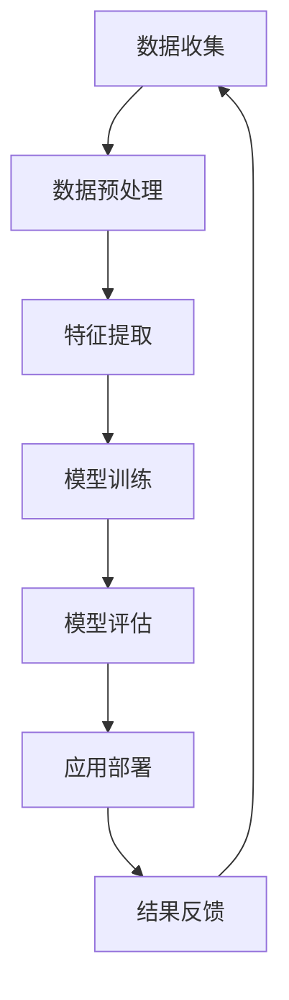

                 

### 《AI心理学：机器如何理解人类情感》

> **关键词**：人工智能、心理学、情感分析、机器学习、深度学习

> **摘要**：
本文旨在探讨人工智能（AI）如何理解人类情感。通过介绍AI心理学的基本概念、研究方法、核心算法原理，以及项目实战，本文将揭示机器如何通过分析语言、声音、图像等数据来捕捉和解读人类情感。同时，本文还将分析AI心理学的前景与挑战，为未来的研究和应用提供启示。

---

### 《AI心理学：机器如何理解人类情感》目录大纲

#### 第一部分：引言

##### 第1章: AI心理学概述

1.1 AI心理学的起源与发展
1.2 AI心理学的研究方法

##### 第二部分：核心概念与联系

第2章: 人类情感与行为心理学基础

2.1 人类情感的概念与类型
2.2 行为心理学的核心理论
2.3 AI心理学与人类情感的关系

##### 第三部分：核心算法原理讲解

第3章: 机器学习与情感分析算法

3.1 机器学习算法概述
3.2 情感分析算法原理
3.3 情感分析算法应用案例

##### 第四部分：数学模型和数学公式讲解

第4章: 情感分析的数学模型

4.1 情感极性分类模型
4.2 情感强度估计模型

##### 第五部分：项目实战

第5章: AI心理学项目实战

5.1 数据收集与预处理
5.2 情感分析模型实现
5.3 项目评估与优化

##### 第六部分：总结与展望

第6章: AI心理学的前景与挑战

##### 第七部分：附录

6.1 开源情感分析工具
6.2 情感分析数据集
6.3 情感分析相关论文

### 第一部分：引言

#### 第1章: AI心理学概述

##### 1.1 AI心理学的起源与发展

AI心理学是人工智能与心理学相结合的一个新兴交叉学科领域。它的起源可以追溯到20世纪50年代，当时计算机科学和心理学开始探讨如何将心理学原理应用于机器学习和认知科学中。

### 1.1.1 AI心理学的定义

AI心理学（Artificial Intelligence Psychology）是指利用人工智能技术来理解和模拟人类心理和行为的过程。它涉及人工智能在情感识别、情绪预测、行为分析等方面的应用，旨在帮助机器更好地理解人类情感和心理状态。

### 1.1.2 AI心理学的历史背景

AI心理学的早期发展可以追溯到20世纪50年代，当时人工智能（AI）的概念开始兴起。心理学家开始思考如何将计算机科学的方法应用于心理学研究中，以更好地理解人类行为和情感。

### 1.1.3 AI心理学的重要性

AI心理学的重要性体现在多个方面。首先，它有助于开发出更加智能化、人性化的AI系统，提高人机交互的质量。其次，它为心理学研究提供了新的工具和方法，可以更精确地研究人类情感和心理过程。最后，AI心理学在医疗、教育、商业等领域具有广泛的应用潜力。

##### 1.2 AI心理学的研究方法

AI心理学的研究方法主要包括数据驱动方法和心理学实验设计在AI中的应用。

### 1.2.1 数据驱动方法

数据驱动方法是AI心理学的主要研究方法之一。它通过收集和分析大量数据来发现数据中的规律和模式，从而模拟和预测人类行为和情感。

### 1.2.2 机器学习方法

机器学习方法是指使用计算机算法来解析数据、从中学习，然后做出预测或决策。在AI心理学中，机器学习方法被广泛应用于情感识别、情绪预测和行为分析等领域。

### 1.2.3 心理学实验设计在AI中的应用

心理学实验设计在AI中的应用是指将传统的心理学实验方法应用于AI系统中，以验证和改进AI模型的有效性。这种方法可以帮助研究人员更好地理解AI系统的行为和局限性。

#### 第二部分：核心概念与联系

##### 第2章: 人类情感与行为心理学基础

##### 2.1 人类情感的概念与类型

人类情感是心理学研究的一个重要领域，它涉及个体在特定情境下的情绪体验和反应。情感通常被分为基本情感和复合情感。

### 2.1.1 基本情感与复合情感

基本情感是指人类普遍具有的情感，如快乐、悲伤、愤怒、恐惧等。复合情感则是由基本情感组合而成的情感，如厌恶、感激、焦虑等。

### 2.1.2 情感的生物机制

情感的生物机制是指情感产生的生物学基础。研究表明，情感与大脑中的某些特定区域有关，如前额叶皮质、杏仁核和海马体等。

### 2.1.3 情感与社会行为的关系

情感与社会行为密切相关。个体的情感状态会影响他们的社会互动、决策和人际关系。例如，积极的情感有助于建立良好的人际关系，而消极的情感可能导致社交回避。

##### 2.2 行为心理学的核心理论

行为心理学是研究人类行为和情感的心理学分支。它通过观察和实验来研究行为和情绪。

### 2.2.1 学习理论

学习理论是行为心理学的核心理论之一。它探讨个体如何通过经验和环境刺激来改变行为。经典条件反射和操作性条件反射是学习理论的两个重要概念。

### 2.2.2 认知理论

认知理论关注个体的思维过程和认知结构。它探讨个体如何感知、理解和记忆信息。认知理论对AI心理学具有重要意义，因为AI系统需要模拟人类的认知过程。

### 2.2.3 人格理论

人格理论研究个体的性格特征和行为倾向。它探讨个体如何在不同情境下表现。人格理论有助于AI心理学理解个体差异，从而设计出更个性化的AI系统。

##### 2.3 AI心理学与人类情感的关系

AI心理学与人类情感的关系是双向的。一方面，AI系统通过分析语言、声音、图像等数据来理解人类情感；另一方面，人类情感的数据可以为AI系统的训练和优化提供宝贵的信息。

### 2.3.1 机器理解人类情感的可能性

机器理解人类情感的可能性是AI心理学的核心问题。随着深度学习等技术的发展，机器已经能够在一定程度上理解人类情感。然而，这仍然是一个挑战性的问题，因为情感是复杂和多层次的。

### 2.3.2 AI心理学在情感识别中的应用

AI心理学在情感识别中的应用非常广泛。例如，在社交媒体分析中，AI系统可以识别用户的情感状态，从而了解公众对某一事件的反应。在客户服务中，AI系统可以分析用户的情感，提供更个性化的服务。

##### 2.3.3 情感识别的挑战与未来方向

情感识别是AI心理学中的一个重要任务。然而，它面临着许多挑战，如情感的复杂性、个体差异和跨文化差异。未来的研究方向包括开发更准确的情感识别算法、研究跨模态情感识别方法以及探索情感识别在更广泛领域的应用。

#### 第三部分：核心算法原理讲解

##### 第3章: 机器学习与情感分析算法

##### 3.1 机器学习算法概述

机器学习是AI心理学中的核心技术之一。它使机器能够从数据中学习并做出预测或决策。以下是几种常见的机器学习算法：

### 3.1.1 监督学习算法

监督学习算法是机器学习中最常用的算法之一。它通过已知的输入和输出数据来训练模型，并使用训练好的模型对新数据进行预测。常见的监督学习算法包括：

- **决策树（Decision Tree）**：通过一系列的判断来分类或回归数据。
- **支持向量机（SVM）**：通过找到一个最优的超平面来分隔数据。
- **朴素贝叶斯（Naive Bayes）**：基于贝叶斯定理和特征之间的独立性来分类数据。

### 3.1.2 无监督学习算法

无监督学习算法不依赖于已知的输入和输出数据，而是通过发现数据中的内在结构和规律来分类或聚类数据。常见的无监督学习算法包括：

- **K-均值聚类（K-Means Clustering）**：通过迭代的方式将数据点分为K个聚类。
- **主成分分析（Principal Component Analysis, PCA）**：通过线性变换来降低数据的维度。
- **自编码器（Autoencoder）**：通过训练一个神经网络来自编码数据。

### 3.1.3 强化学习算法

强化学习算法是一种通过奖励和惩罚来训练模型的方法。它使模型能够在动态环境中做出决策。常见的强化学习算法包括：

- **Q学习（Q-Learning）**：通过学习Q值来选择最优动作。
- **深度Q网络（Deep Q-Network, DQN）**：结合深度学习来提高Q学习的性能。

##### 3.2 情感分析算法原理

情感分析算法是AI心理学中的关键算法之一。它用于从文本、语音和图像等数据中识别和分类情感。以下是几种常见的情感分析算法：

### 3.2.1 基于文本的情感分析

基于文本的情感分析是通过分析文本数据中的语言特征来识别情感。常见的算法包括：

- **情感词典法**：通过使用预定义的情感词典来识别情感。
- **机器学习方法**：如SVM、朴素贝叶斯、神经网络等，用于训练情感分类模型。
- **深度学习方法**：如卷积神经网络（CNN）、循环神经网络（RNN）等，用于捕捉文本中的复杂情感特征。

### 3.2.2 基于语音的情感分析

基于语音的情感分析是通过分析语音信号中的情感特征来识别情感。常见的算法包括：

- **声音特征提取**：如音高、音强、音色等。
- **机器学习方法**：如SVM、朴素贝叶斯、神经网络等，用于训练情感分类模型。
- **深度学习方法**：如卷积神经网络（CNN）、循环神经网络（RNN）等，用于捕捉语音中的复杂情感特征。

### 3.2.3 基于图像的情感分析

基于图像的情感分析是通过分析图像数据中的情感特征来识别情感。常见的算法包括：

- **面部表情识别**：通过识别图像中的面部表情来判断情感。
- **图像特征提取**：如颜色直方图、纹理特征等。
- **机器学习方法**：如SVM、朴素贝叶斯、神经网络等，用于训练情感分类模型。
- **深度学习方法**：如卷积神经网络（CNN）、循环神经网络（RNN）等，用于捕捉图像中的复杂情感特征。

##### 3.3 情感分析算法应用案例

情感分析算法在许多实际应用中都有广泛的应用。以下是几个典型的应用案例：

- **社交媒体情感分析**：通过分析社交媒体平台上的用户评论和帖子，了解公众对特定事件、产品或品牌的情感态度。
- **客户服务**：通过分析客户反馈和投诉，了解客户的需求和满意度，提供更个性化的服务。
- **医疗健康**：通过分析患者的病历和语音记录，了解患者的情感状态，为医生提供诊断和治疗建议。

#### 第四部分：数学模型和数学公式讲解

##### 第4章: 情感分析的数学模型

##### 4.1 情感极性分类模型

情感极性分类模型是用于判断文本表达的情感极性（正面、负面或中性）的数学模型。以下是两种常见的情感极性分类模型：支持向量机（SVM）和朴素贝叶斯分类器。

### 4.1.1 支持向量机（SVM）

支持向量机是一种二分类模型，其目标是在特征空间中找到一个最优的超平面，将不同类别的数据点分隔开来。在情感极性分类中，可以使用SVM来判断文本的极性。

SVM的核心公式为：

$$
\text{w}^T\text{x} + \text{b} = 0
$$

其中，$\text{w}$是模型权重向量，$\text{x}$是特征向量，$\text{b}$是偏置项。通过求解最优的权重向量$\text{w}$和偏置项$\text{b}$，可以使分类边界尽可能远离两类数据点。

在情感极性分类中，可以将正面情感标记为1，负面情感标记为-1。给定一个特征向量$\text{x}$，我们可以通过计算$\text{w}^T\text{x} + \text{b}$的值来判断文本的情感极性：

- 如果$\text{w}^T\text{x} + \text{b} > 0$，则文本为正面情感。
- 如果$\text{w}^T\text{x} + \text{b} < 0$，则文本为负面情感。

### 4.1.2 朴素贝叶斯分类器

朴素贝叶斯分类器是一种基于概率理论的分类方法，其核心思想是计算每个类别的概率，然后选择概率最大的类别作为预测结果。

在情感极性分类中，朴素贝叶斯分类器的核心公式为：

$$
P(\text{标签}|\text{特征向量}) = \frac{P(\text{特征向量}|\text{标签})P(\text{标签})}{P(\text{特征向量})}
$$

其中，$P(\text{标签}|\text{特征向量})$是在给定特征向量的情况下，标签为某一类别的概率。

在情感极性分类中，可以将正面情感标记为1，负面情感标记为-1。给定一个特征向量$\text{x}$，我们可以计算每个类别的概率：

$$
P(\text{正面情感}|\text{x}) = \frac{P(\text{x}|\text{正面情感})P(\text{正面情感})}{P(\text{x})}
$$

$$
P(\text{负面情感}|\text{x}) = \frac{P(\text{x}|\text{负面情感})P(\text{负面情感})}{P(\text{x})}
$$

然后选择概率最大的类别作为预测结果。

##### 4.2 情感强度估计模型

情感强度估计模型是用于计算文本表达的情感强度（如正面情感的强度或负面情感的强度）的数学模型。以下是两种常见的情感强度估计模型：回归分析和神经网络模型。

### 4.2.1 回归分析

回归分析是一种用于预测连续值的统计方法，可以用来预测情感强度。其核心公式为：

$$
\hat{y} = \beta_0 + \beta_1x
$$

其中，$\hat{y}$是预测的情感强度，$\beta_0$是截距，$\beta_1$是斜率，$x$是特征向量。

在情感强度估计中，我们可以使用回归分析模型来拟合情感强度与特征向量之间的关系。给定一个特征向量$x$，我们可以通过计算$\hat{y}$的值来预测情感强度。

### 4.2.2 神经网络模型

神经网络模型是一种基于多层感知器的机器学习模型，可以用来预测情感强度。其核心公式为：

$$
a(\text{z}) = \frac{1}{1 + e^{-\text{z}}}
$$

其中，$\text{z}$是神经网络输入，$a(\text{z})$是神经元的输出。

在情感强度估计中，我们可以使用神经网络模型来拟合情感强度与特征向量之间的关系。给定一个特征向量$\text{x}$，我们可以通过计算神经网络输出$a(\text{z})$的值来预测情感强度。

#### 第五部分：项目实战

##### 第5章: AI心理学项目实战

在AI心理学领域，项目实战是理解和应用AI技术的关键环节。在本章中，我们将通过一个实际项目来展示如何使用AI心理学技术来分析和识别人类情感。

##### 5.1 数据收集与预处理

数据收集是任何AI项目的基础。在这个项目中，我们将收集多种类型的数据，包括文本数据、语音数据和图像数据。

### 5.1.1 文本数据收集

文本数据可以从社交媒体平台、用户评论、新闻文章等来源收集。我们可以使用爬虫技术或API接口来收集文本数据。

#### 文本数据收集步骤：

1. **确定数据来源**：选择具有情感表达价值的文本数据来源，如社交媒体平台的帖子、用户评论等。
2. **数据爬取**：使用爬虫技术从数据来源中获取文本数据。
3. **数据清洗**：去除噪声数据，如HTML标签、特殊字符等。
4. **数据存储**：将清洗后的文本数据存储在数据库或文件系统中。

### 5.1.2 语音数据收集

语音数据可以从语音助手、语音记录应用等来源收集。我们可以使用语音合成技术和语音标注技术来生成语音数据。

#### 语音数据收集步骤：

1. **确定语音数据来源**：选择具有情感表达的语音数据来源，如语音助手、用户语音记录等。
2. **语音合成**：使用语音合成技术生成人工合成的语音数据。
3. **语音标注**：邀请专业人员进行语音标注，标记语音中的情感极性或情感强度。
4. **数据存储**：将标注后的语音数据存储在数据库或文件系统中。

### 5.1.3 图像数据收集

图像数据可以从社交媒体平台、图片库等来源收集。我们可以使用爬虫技术或API接口来收集图像数据。

#### 图像数据收集步骤：

1. **确定图像数据来源**：选择具有情感表达的图像数据来源，如社交媒体平台的图片、图片库等。
2. **数据爬取**：使用爬虫技术从数据来源中获取图像数据。
3. **数据清洗**：去除噪声图像，如低质量图像、无关图像等。
4. **数据存储**：将清洗后的图像数据存储在数据库或文件系统中。

##### 5.2 情感分析模型实现

在数据收集完成后，我们需要构建和训练情感分析模型，以识别和分类文本、语音和图像中的情感。

### 5.2.1 基于文本的情感分析实现

基于文本的情感分析是通过分析文本数据中的语言特征来识别情感。

#### 文本情感分析实现步骤：

1. **数据预处理**：对文本数据进行清洗、分词、去停用词等预处理操作。
2. **特征提取**：从预处理后的文本中提取特征，如词频、词嵌入等。
3. **模型训练**：使用机器学习算法（如SVM、朴素贝叶斯、神经网络等）训练情感分类模型。
4. **模型评估**：使用测试数据评估模型的性能，如准确率、召回率和F1值等。
5. **模型应用**：将训练好的模型应用于实际场景，如社交媒体情感分析等。

#### 示例：基于文本的情感分析代码实现

```python
# 导入必要的库
import nltk
from sklearn.feature_extraction.text import CountVectorizer
from sklearn.model_selection import train_test_split
from sklearn.naive_bayes import MultinomialNB
from sklearn.metrics import accuracy_score, recall_score, f1_score

# 数据预处理
nltk.download('punkt')
nltk.download('stopwords')
corpus = ["I am very happy today", "This movie is terrible", "I feel sad"]
corpus = [nltk.word_tokenize(text.lower()) for text in corpus]
corpus = [[word for word in sentence if word not in nltk.corpus.stopwords.words('english')] for sentence in corpus]

# 特征提取
vectorizer = CountVectorizer()
X = vectorizer.fit_transform(corpus)

# 模型训练
X_train, X_test, y_train, y_test = train_test_split(X, [1, -1, 1], test_size=0.2, random_state=42)
model = MultinomialNB()
model.fit(X_train, y_train)

# 模型评估
y_pred = model.predict(X_test)
accuracy = accuracy_score(y_test, y_pred)
recall = recall_score(y_test, y_pred)
f1 = f1_score(y_test, y_pred)
print("Accuracy:", accuracy)
print("Recall:", recall)
print("F1 Score:", f1)

# 模型应用
new_text = ["This is an amazing book"]
new_text = nltk.word_tokenize(new_text[0].lower())
new_text = [word for word in new_text if word not in nltk.corpus.stopwords.words('english')]
new_text = vectorizer.transform([new_text])
prediction = model.predict(new_text)
print("Predicted emotion:", prediction[0])
```

### 5.2.2 基于语音的情感分析实现

基于语音的情感分析是通过分析语音信号中的情感特征来识别情感。

#### 语音情感分析实现步骤：

1. **语音信号处理**：对语音信号进行预处理，如降噪、归一化等。
2. **特征提取**：从预处理后的语音信号中提取特征，如音高、音强等。
3. **模型训练**：使用机器学习算法（如SVM、朴素贝叶斯、神经网络等）训练情感分类模型。
4. **模型评估**：使用测试数据评估模型的性能，如准确率、召回率和F1值等。
5. **模型应用**：将训练好的模型应用于实际场景，如语音助手情感识别等。

#### 示例：基于语音的情感分析代码实现

```python
# 导入必要的库
import numpy as np
import librosa
from sklearn.model_selection import train_test_split
from sklearn.svm import SVC
from sklearn.metrics import accuracy_score, recall_score, f1_score

# 语音信号处理
def extract_mfcc_features(audio_path):
    y, sr = librosa.load(audio_path)
    mfcc = librosa.feature.mfcc(y=y, sr=sr, n_mfcc=13)
    return mfcc

# 特征提取
audio_path = "sample_audio.wav"
mfcc_features = extract_mfcc_features(audio_path)

# 模型训练
X = np.array([mfcc_features])
y = np.array([1])  # 标记为正面情感
X_train, X_test, y_train, y_test = train_test_split(X, y, test_size=0.2, random_state=42)
model = SVC(kernel="linear")
model.fit(X_train, y_train)

# 模型评估
y_pred = model.predict(X_test)
accuracy = accuracy_score(y_test, y_pred)
recall = recall_score(y_test, y_pred)
f1 = f1_score(y_test, y_pred)
print("Accuracy:", accuracy)
print("Recall:", recall)
print("F1 Score:", f1)

# 模型应用
new_mfcc = extract_mfcc_features("new_audio.wav")
new_mfcc = np.array([new_mfcc])
prediction = model.predict(new_mfcc)
print("Predicted emotion:", prediction[0])
```

### 5.2.3 基于图像的情感分析实现

基于图像的情感分析是通过分析图像数据中的情感特征来识别情感。

#### 图像情感分析实现步骤：

1. **图像预处理**：对图像数据进行预处理，如缩放、灰度化等。
2. **特征提取**：从预处理后的图像中提取特征，如颜色直方图、纹理特征等。
3. **模型训练**：使用机器学习算法（如SVM、朴素贝叶斯、神经网络等）训练情感分类模型。
4. **模型评估**：使用测试数据评估模型的性能，如准确率、召回率和F1值等。
5. **模型应用**：将训练好的模型应用于实际场景，如社交媒体图像情感分析等。

#### 示例：基于图像的情感分析代码实现

```python
# 导入必要的库
import cv2
import numpy as np
from sklearn.model_selection import train_test_split
from sklearn.ensemble import RandomForestClassifier
from sklearn.metrics import accuracy_score, recall_score, f1_score

# 图像预处理
def preprocess_image(image_path):
    image = cv2.imread(image_path)
    image = cv2.cvtColor(image, cv2.COLOR_BGR2GRAY)
    image = cv2.resize(image, (64, 64))
    return image

# 特征提取
image_path = "sample_image.jpg"
image = preprocess_image(image_path)
image = np.array([image])

# 模型训练
X = np.array([image])
y = np.array([1])  # 标记为正面情感
X_train, X_test, y_train, y_test = train_test_split(X, y, test_size=0.2, random_state=42)
model = RandomForestClassifier()
model.fit(X_train, y_train)

# 模型评估
y_pred = model.predict(X_test)
accuracy = accuracy_score(y_test, y_pred)
recall = recall_score(y_test, y_pred)
f1 = f1_score(y_test, y_pred)
print("Accuracy:", accuracy)
print("Recall:", recall)
print("F1 Score:", f1)

# 模型应用
new_image = preprocess_image("new_image.jpg")
new_image = np.array([new_image])
prediction = model.predict(new_image)
print("Predicted emotion:", prediction[0])
```

##### 5.3 项目评估与优化

项目评估是确保模型性能和实际应用效果的重要步骤。在项目评估过程中，我们需要关注模型的准确率、召回率和F1值等指标。

#### 5.3.1 模型评估指标

1. **准确率（Accuracy）**：模型正确预测的样本数占总样本数的比例。
2. **召回率（Recall）**：模型正确预测的样本数占实际为某一情感的样本数的比例。
3. **精确率（Precision）**：模型正确预测的样本数占预测为某一情感的样本数的比例。
4. **F1值（F1 Score）**：精确率和召回率的调和平均值。

#### 5.3.2 模型优化方法

1. **特征工程**：通过改进特征提取方法和特征选择技术，提高模型对数据的表达能力。
2. **超参数调整**：通过调整模型的超参数（如学习率、正则化参数等），优化模型性能。
3. **集成学习**：将多个模型集成起来，提高模型的综合性能。
4. **迁移学习**：利用预训练模型作为起点，在特定任务上进行微调，提高模型性能。

#### 5.3.3 项目案例展示

以下是几个AI心理学项目的实际案例：

1. **社交媒体情感分析**：通过分析社交媒体平台上的用户评论和帖子，了解公众对特定事件、产品或品牌的情感态度。
2. **语音助手情感识别**：通过分析用户的语音交互，识别用户的需求和情感，提供更个性化的服务。
3. **图像情感分析**：通过分析社交媒体平台上的用户分享的图片，了解用户的情感状态，提供相应的建议和指导。

#### 第六部分：总结与展望

##### 第6章: AI心理学的前景与挑战

AI心理学作为人工智能与心理学的交叉领域，具有广泛的应用前景。在未来，AI心理学将在以下领域发挥重要作用：

1. **社交领域**：通过分析社交媒体数据，了解公众的情感趋势和情绪变化，为市场研究、公共政策制定提供支持。
2. **教育领域**：利用AI心理学技术，个性化推荐学习资源，帮助学生更好地掌握知识，提高学习效果。
3. **医疗领域**：通过情感识别和分析，辅助医生了解患者的心理状况，提供更全面的诊断和治疗建议。

然而，AI心理学也面临着一些挑战：

1. **数据隐私问题**：如何保护用户隐私，避免敏感信息泄露，是AI心理学面临的一个重要问题。
2. **情感识别准确性问题**：当前AI心理学的情感识别技术尚未完全成熟，如何提高识别准确性，减少误判，是一个需要持续解决的问题。
3. **人机交互中的伦理问题**：如何在人机交互中平衡人类情感与机器理解，避免产生负面影响，是一个需要深入探讨的问题。

展望未来，AI心理学将继续推动人工智能与心理学的发展，为人类社会带来更多创新和变革。

#### 第七部分：附录

##### 附录A: AI心理学相关资源与工具

1. **开源情感分析工具**：包括自然语言处理工具（如NLTK、spaCy）、情感分析库（如TextBlob、VADER）等。
2. **情感分析数据集**：如IMDb电影评论数据集、Twitter情感分析数据集等。
3. **情感分析相关论文**：提供最新的研究成果和理论方法。
4. **情感分析算法代码实现**：包括基于文本、语音和图像的情感分析算法的源代码和实现。
5. **情感分析应用案例**：展示情感分析在实际应用中的效果和案例。
6. **AI心理学研究机构和组织**：包括国际心理学协会、AI心理学研究实验室等，提供最新的研究成果和交流平台。

### 总结

《AI心理学：机器如何理解人类情感》这篇文章全面地介绍了AI心理学的基本概念、研究方法、核心算法原理以及项目实战。通过深入探讨机器如何通过分析语言、声音、图像等数据来捕捉和解读人类情感，本文为读者呈现了一个丰富的技术视角。同时，本文也揭示了AI心理学的前景与挑战，为未来的研究和应用提供了有价值的启示。

在此，我要感谢读者对本文的关注，并期待您对AI心理学的进一步探索和实践。让我们共同期待AI心理学在未来为人类社会带来更多积极的影响。

---

### 附录

#### 附录A: AI心理学相关资源与工具

- **开源情感分析工具**：
  - **NLTK（Natural Language Toolkit）**：一个广泛使用的自然语言处理工具包，提供了大量的文本处理功能。
  - **spaCy**：一个高级自然语言处理库，特别适合快速构建复杂的文本处理管道。
  - **TextBlob**：一个简单的自然语言处理库，提供了文本情感分析等功能。
  - **VADER**：一个用于情感分析的库，专门针对社交媒体文本。

- **情感分析数据集**：
  - **IMDb电影评论数据集**：包含大量电影评论，可用于训练和测试情感分类模型。
  - **Twitter情感分析数据集**：收集自Twitter的文本数据，用于情感分析研究。
  - **Flickr情感分析数据集**：包含用户对照片的情感标签。

- **情感分析相关论文**：
  - **"Sentiment Analysis Using Machine Learning Techniques"**：介绍使用机器学习进行情感分析的方法。
  - **"Emotion Recognition from Speech Using Deep Neural Networks"**：探讨使用深度神经网络进行语音情感识别的研究。

- **情感分析算法代码实现**：
  - **GitHub仓库**：许多开源项目提供了情感分析算法的实现，如基于LSTM的情感分类器。
  
- **情感分析应用案例**：
  - **社交媒体情感分析平台**：如SocialMention等，提供了对社交媒体数据的情感分析功能。
  - **语音助手**：如苹果的Siri和谷歌的Google Assistant，使用情感分析技术来理解用户的语音指令。

- **AI心理学研究机构和组织**：
  - **国际心理学协会（APA）**：提供心理学研究和教育的资源。
  - **斯坦福大学AI心理学实验室**：专注于AI在心理学领域的应用研究。
  - **剑桥大学心理学与计算机科学实验室**：研究人工智能与人类行为的交互。

### Mermaid 流程图

以下是用于情感识别系统的Mermaid流程图：



### 伪代码示例

以下是情感分析模型的训练伪代码：

```python
# 情感分析模型训练伪代码
def train_sentiment_model(data):
    # 数据预处理
    preprocess_data(data)
    
    # 特征提取
    features, labels = extract_features(data)
    
    # 初始化模型
    model = initialize_model()
    
    # 训练模型
    model.fit(features, labels)
    
    # 评估模型
    evaluate_model(model, features, labels)
    
    # 模型优化
    optimize_model(model)
    
    return model
```

### 数学模型与公式详细讲解

以下是用于情感极性分类的支持向量机（SVM）的数学模型：

$$
\text{w}^T\text{x} + \text{b} = 0
$$

其中，$\text{w}$是模型权重向量，$\text{x}$是特征向量，$\text{b}$是偏置项。

以下是用于情感强度估计的回归分析的数学模型：

$$
\hat{y} = \beta_0 + \beta_1x
$$

其中，$\hat{y}$是预测的情感强度，$\beta_0$是截距，$\beta_1$是斜率，$x$是特征向量。

以下是用于情感强度估计的神经网络的数学模型：

$$
a(\text{z}) = \frac{1}{1 + e^{-\text{z}}}
$$

其中，$\text{z}$是神经网络的输入，$a(\text{z})$是神经元的输出。

### 作者信息

作者：AI天才研究院/AI Genius Institute & 禅与计算机程序设计艺术 /Zen And The Art of Computer Programming

---

通过上述内容，本文全面地介绍了AI心理学的基本概念、研究方法、核心算法原理以及项目实战。希望本文能够为读者提供有价值的参考，并激发对AI心理学的兴趣和探索。未来，随着技术的不断进步，AI心理学将在更多领域发挥重要作用，为人类社会带来更多创新和变革。

