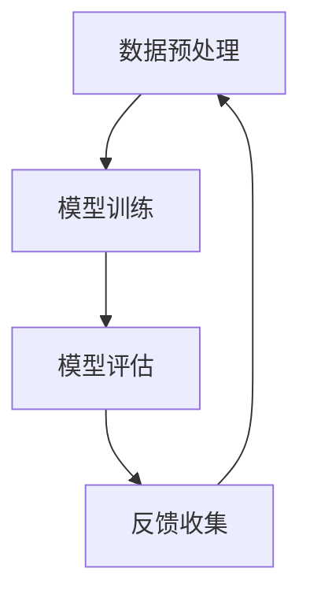

                 

# AI技术与用户需求的匹配

> 关键词：人工智能、用户需求、机器学习、深度学习、自然语言处理、计算机视觉

> 摘要：本文旨在探讨AI技术如何与用户需求相匹配，从AI技术概述、用户需求分析、AI技术原理与模型、AI技术与用户需求匹配策略、案例研究和未来趋势等方面，系统性地阐述AI技术在满足用户需求方面的应用与实践，以期为AI技术的研发和应用提供有益的指导。

----------------------------------------------------------------

## 第一部分：AI技术与用户需求概述

### 第1章: AI技术概述

#### 1.1 AI技术的基本概念

**AI的定义与发展历程**

人工智能（Artificial Intelligence，简称AI）是指由人制造出的系统所表现出的智能行为。这些行为通常包括学习、推理、问题解决、知识表示和自我修复等。

人工智能的发展历程可以追溯到20世纪50年代。1956年，约翰·麦卡锡（John McCarthy）等人首次提出了“人工智能”这个概念，并在达特茅斯会议（Dartmouth Conference）上正式提出。从那时起，人工智能经历了数个重要发展阶段，包括早期的规则推理、专家系统、机器学习、深度学习等。

**人工智能的分类与体系结构**

人工智能可以分为弱人工智能和强人工智能。弱人工智能（Narrow AI）是指在某些特定领域内表现出发自人类的智能行为，如语音识别、图像识别、自然语言处理等。强人工智能（General AI）是指具有人类所有的认知能力，包括情感、意识、道德判断等。

人工智能的体系结构通常包括以下几个层次：

1. 知识表示与推理：将知识以符号形式进行表示，并利用推理算法进行问题求解。
2. 机器学习：通过数据学习模型，自动发现规律和模式。
3. 深度学习：基于神经网络，实现自动特征提取和模式识别。
4. 计算机视觉：实现对图像和视频的分析和处理。
5. 自然语言处理：实现对自然语言的理解和生成。

#### 1.2 AI技术在各行各业的应用

**AI在制造业的应用**

AI技术在制造业中主要应用于生产过程优化、质量检测、故障预测等方面。例如，通过机器学习算法，可以对生产设备进行实时监测，预测设备故障，从而减少停机时间和维护成本。

**AI在金融领域的应用**

AI技术在金融领域中的应用十分广泛，包括风险管理、投资策略、客户服务等方面。例如，通过自然语言处理技术，可以实现对金融新闻报道的分析，从而为投资决策提供支持。

**AI在医疗健康领域的应用**

AI技术在医疗健康领域中的应用潜力巨大，包括疾病预测、诊断辅助、治疗方案推荐等方面。例如，通过深度学习算法，可以对医疗影像进行自动分析，提高疾病诊断的准确率。

#### 1.3 用户需求的定义与分类

**用户需求的概念**

用户需求是指用户在使用产品或服务时所期望得到的功能、性能、质量等方面的要求。了解用户需求是进行产品设计和优化的重要基础。

**用户需求的分类与层次**

用户需求可以分为基本需求、期望需求和潜在需求三个层次。

1. 基本需求：用户对产品或服务的最低要求，如满足功能需求、性能需求等。
2. 期望需求：用户对产品或服务的期望水平，如外观设计、用户体验等。
3. 潜在需求：用户尚未意识到或表达出的需求，但可能会在未来成为需求。

#### 1.4 AI技术与用户需求的关系

**用户需求对AI技术的驱动**

用户需求是推动AI技术发展的重要动力。例如，用户对智能客服、个性化推荐、自动驾驶等的需求，促进了机器学习、自然语言处理、计算机视觉等AI技术的快速发展。

**AI技术如何满足用户需求**

AI技术可以通过以下几个方面满足用户需求：

1. 功能拓展：通过AI技术，可以实现产品或服务的功能拓展，提高用户体验。
2. 性能优化：通过AI技术，可以对产品或服务进行性能优化，提高效率和质量。
3. 智能化：通过AI技术，可以实现产品或服务的智能化，提供个性化服务。

### 第2章: 用户需求分析

#### 2.1 用户需求分析方法

**用户需求调研**

用户需求调研是了解用户需求的重要方法。通过问卷调查、用户访谈、用户观察等方式，可以收集用户对产品或服务的需求信息。

**用户行为分析**

用户行为分析是通过对用户在使用产品或服务时的行为数据进行分析，挖掘用户需求的一种方法。例如，通过分析用户在网站上的点击路径、搜索关键词等，可以了解用户的兴趣和需求。

#### 2.2 用户需求分类与优先级排序

**用户需求分类方法**

用户需求可以按照不同的维度进行分类，如按功能、按用户角色、按使用场景等。

**用户需求优先级排序**

在确定用户需求后，需要对需求进行优先级排序。常用的排序方法包括Kano模型、MoSCoW模型等。

#### 2.3 用户需求反馈机制

**用户反馈渠道**

用户反馈渠道包括在线评论、用户论坛、社交媒体等。

**用户反馈处理流程**

用户反馈处理流程包括反馈收集、反馈分类、反馈分析、反馈回应等环节。

#### 2.4 用户需求案例研究

**某行业用户需求案例**

以电子商务行业为例，用户需求包括商品推荐、购物车管理、订单跟踪等。

**某产品用户需求案例**

以智能手机为例，用户需求包括高性能、长续航、高拍照效果等。

----------------------------------------------------------------

## 第二部分：AI技术原理与模型

### 第3章: AI技术核心原理

#### 3.1 机器学习基础

**监督学习、无监督学习、强化学习**

- **监督学习**：通过已标记的数据进行学习，例如分类问题。
- **无监督学习**：没有标记数据，通过发现数据内在结构进行学习，例如聚类问题。
- **强化学习**：通过与环境的交互进行学习，以最大化长期回报。

**算法选择与评估**

- **算法选择**：根据具体问题选择合适的算法，如逻辑回归、支持向量机、决策树等。
- **算法评估**：通过准确率、召回率、F1分数等指标评估算法性能。

#### 3.2 深度学习基础

**神经网络与深度学习模型**

- **神经网络**：由多层神经元组成的网络，用于特征提取和模式识别。
- **深度学习模型**：多层神经网络，如卷积神经网络（CNN）、循环神经网络（RNN）等。

**深度学习优化算法**

- **优化算法**：如梯度下降、随机梯度下降、Adam等，用于模型参数更新。

#### 3.3 自然语言处理基础

**语言模型与文本分类**

- **语言模型**：用于预测下一个词的概率。
- **文本分类**：将文本分类到预定义的类别中。

**语义理解与文本生成**

- **语义理解**：理解文本的含义和意图。
- **文本生成**：生成具有特定语义的文本。

#### 3.4 计算机视觉基础

**图像识别与目标检测**

- **图像识别**：将图像分类到预定义的类别中。
- **目标检测**：定位图像中的目标并分类。

**图像生成与风格迁移**

- **图像生成**：生成新的图像。
- **风格迁移**：将一种图像的风格应用到另一种图像上。

### 第4章: 常见AI模型与算法

#### 4.1 神经网络模型

**前馈神经网络**

- **基本结构**：输入层、隐藏层、输出层。
- **激活函数**：如Sigmoid、ReLU等。

**卷积神经网络（CNN）**

- **基本结构**：卷积层、池化层、全连接层。
- **卷积操作**：局部感知野、步长、填充等。

**循环神经网络（RNN）**

- **基本结构**：包含循环结构，可以处理序列数据。
- **激活函数**：如ReLU、Tanh等。

#### 4.2 自然语言处理模型

**语言模型**

- **基本结构**：由多层神经网络组成，用于预测下一个词的概率。
- **训练方法**：如反向传播、HMM等。

**序列到序列模型（Seq2Seq）**

- **基本结构**：由编码器和解码器组成，用于序列到序列的转换。
- **训练方法**：如注意力机制、长短时记忆（LSTM）等。

**注意力机制模型**

- **基本结构**：用于提高序列到序列模型在长序列处理中的性能。
- **训练方法**：如双向LSTM、门控循环单元（GRU）等。

#### 4.3 计算机视觉模型

**卷积神经网络（CNN）**

- **基本结构**：由卷积层、池化层、全连接层组成。
- **卷积操作**：局部感知野、步长、填充等。

**目标检测算法**

- **基本结构**：用于检测图像中的多个目标。
- **训练方法**：如锚点生成、多尺度训练等。

**图像生成算法**

- **基本结构**：用于生成新的图像。
- **训练方法**：如生成对抗网络（GAN）、变分自编码器（VAE）等。

#### 4.4 强化学习模型

**Q-learning**

- **基本结构**：通过迭代更新Q值来选择最优动作。
- **训练方法**：如epsilon-greedy策略、SARSA等。

**SARSA**

- **基本结构**：在每一步都进行状态-动作值的更新。
- **训练方法**：如Q-learning的变体。

**DQN**

- **基本结构**：使用深度神经网络来近似Q值函数。
- **训练方法**：如经验回放、目标网络等。

----------------------------------------------------------------

## 第三部分：AI技术与用户需求匹配策略

### 第5章: 用户需求与AI技术的匹配方法

#### 5.1 用户需求分析

**用户画像与细分**

- **用户画像**：通过对用户的基本信息、行为习惯、兴趣偏好等进行综合分析，形成一个完整的用户画像。
- **用户细分**：根据用户画像，将用户划分为不同的群体，以便于有针对性地进行需求分析。

**用户需求分析与挖掘**

- **需求分析**：通过问卷调查、用户访谈、用户行为分析等方式，收集用户对产品或服务的需求信息。
- **需求挖掘**：通过对需求数据进行深入分析，发现用户潜在的、未明确表达的需求。

#### 5.2 AI技术应用场景选择

**行业应用场景分析**

- **行业背景**：了解行业的发展状况、市场需求、竞争格局等。
- **技术趋势**：分析AI技术在行业中的应用趋势和发展方向。

**技术应用场景评估**

- **技术可行性**：评估AI技术在具体应用场景中的实现可能性。
- **经济效益**：分析AI技术应用带来的经济效益，如成本降低、效率提升等。

#### 5.3 AI技术实现与优化

**AI模型训练与优化**

- **数据预处理**：对训练数据进行清洗、归一化等处理，以提高模型训练效果。
- **模型选择**：根据应用场景和需求，选择合适的AI模型。
- **模型训练**：使用训练数据对模型进行训练，调整模型参数，优化模型性能。

**AI系统部署与运维**

- **系统架构设计**：设计合理的系统架构，确保AI系统的高效稳定运行。
- **部署策略**：制定部署方案，将AI模型部署到生产环境中。
- **运维管理**：对AI系统进行监控、维护和管理，确保系统的正常运行。

#### 5.4 用户反馈与迭代改进

**用户反馈收集**

- **反馈渠道**：建立多渠道的用户反馈机制，如在线评论、用户论坛、社交媒体等。
- **反馈处理**：对收集到的用户反馈进行分类、整理和分析，识别用户的主要需求和痛点。

**AI系统迭代与优化**

- **需求分析**：根据用户反馈，对AI系统进行需求分析，确定优化方向。
- **模型优化**：针对需求分析结果，对AI模型进行调整和优化，提高系统性能。
- **系统迭代**：持续迭代AI系统，不断优化用户体验，满足用户需求。

### 第6章: 案例研究

#### 6.1 案例研究一：智能客服系统

**需求分析**

- **基本需求**：提供24/7的在线客服服务，快速响应用户问题。
- **期望需求**：提供高效、准确、友好的客服服务，提升用户满意度。
- **潜在需求**：实现智能化的客服服务，降低人工成本，提高客服效率。

**模型设计**

- **自然语言处理模型**：使用BERT等预训练模型，进行文本分类和语义理解。
- **对话管理模型**：基于强化学习，实现智能对话管理，提高客服响应速度和准确性。

**系统实现与优化**

- **系统架构**：采用微服务架构，实现模块化、高扩展性的系统设计。
- **性能优化**：通过模型压缩、量化等技术，降低模型复杂度，提高系统运行效率。

#### 6.2 案例研究二：个性化推荐系统

**需求分析**

- **基本需求**：为用户提供个性化的商品推荐，提升用户购物体验。
- **期望需求**：提高推荐准确率，提升用户购买转化率。
- **潜在需求**：实现智能化的推荐策略，挖掘用户潜在需求，提升用户忠诚度。

**模型设计**

- **协同过滤模型**：基于用户行为数据，实现用户和商品之间的关联推荐。
- **深度学习模型**：结合用户画像和商品信息，实现精细化推荐。

**系统实现与优化**

- **系统架构**：采用分布式计算架构，实现大规模数据处理和实时推荐。
- **性能优化**：通过缓存策略、数据压缩等技术，提高系统响应速度和推荐质量。

#### 6.3 案例研究三：自动驾驶技术

**需求分析**

- **基本需求**：实现安全、可靠的自动驾驶，降低交通事故风险。
- **期望需求**：提供舒适、高效的驾驶体验，减少驾驶疲劳。
- **潜在需求**：实现智能化的自动驾驶，提高交通效率，减少拥堵。

**模型设计**

- **计算机视觉模型**：实现道路场景检测、车辆检测、行人检测等。
- **深度学习模型**：实现自动驾驶控制，如车道保持、速度控制、路径规划等。

**系统实现与优化**

- **系统架构**：采用分布式计算架构，实现大规模数据处理和实时自动驾驶。
- **性能优化**：通过多传感器数据融合、模型压缩等技术，提高自动驾驶系统的安全性和可靠性。

### 第7章: AI技术与用户需求匹配的未来趋势

#### 7.1 AI技术与用户需求的未来发展

**人工智能与人类智慧的融合**

- **智慧助理**：实现与用户的深度互动，提供个性化的智慧助理服务。
- **智慧医疗**：利用AI技术，实现精准诊断、个性化治疗，提高医疗水平。

**用户需求驱动的个性化服务**

- **个性化推荐**：基于用户需求，提供个性化的商品推荐、内容推荐等。
- **个性化教育**：根据学生需求，提供个性化的学习计划和课程安排。

#### 7.2 AI技术伦理与隐私保护

**AI技术的伦理问题**

- **数据隐私**：保护用户数据隐私，防止数据滥用。
- **算法公平性**：确保算法的公平性和透明度，避免算法偏见。

**用户隐私保护策略**

- **数据加密**：对用户数据进行加密处理，确保数据安全性。
- **匿名化处理**：对用户数据进行分析时，采用匿名化处理，保护用户隐私。

#### 7.3 AI技术与用户需求匹配的挑战与机遇

**挑战分析**

- **技术难题**：如何实现高效、可靠的AI技术，满足日益复杂的用户需求。
- **数据质量**：如何保证数据质量，为AI模型提供有效的训练数据。

**机遇展望**

- **技术革新**：随着AI技术的不断进步，将带来更多的应用场景和创新机会。
- **市场潜力**：AI技术的广泛应用，将为企业带来巨大的市场潜力。

### 附录

#### 附录A：常用AI开发工具与资源

- **TensorFlow**：一款开源的机器学习框架，支持多种AI模型的开发。
- **PyTorch**：一款开源的深度学习框架，以灵活性和易用性著称。
- **Keras**：一款基于TensorFlow和Theano的开源深度学习库，提供简洁的API。
- **其他常用工具与资源**：如Scikit-learn、Pandas、NumPy等。

#### 附录B：参考书目与资料

- **《深度学习》**：由Ian Goodfellow、Yoshua Bengio和Aaron Courville合著，是深度学习领域的经典教材。
- **《机器学习》**：由Tom Mitchell编写，是机器学习领域的经典教材。
- **学术论文与报告**：如NIPS、ICML、CVPR等国际会议和期刊上的最新研究论文。
- **在线课程与培训资源**：如Coursera、Udacity、edX等平台上的AI相关课程。

----------------------------------------------------------------

**作者：AI天才研究院/AI Genius Institute & 禅与计算机程序设计艺术 /Zen And The Art of Computer Programming**### 第一部分：AI技术与用户需求概述

#### 第1章: AI技术概述

##### 1.1 AI技术的基本概念

人工智能（Artificial Intelligence，简称AI）是计算机科学的一个分支，旨在通过模拟人类智能行为，使计算机能够执行通常需要人类智能才能完成的任务。AI的定义和发展历程可以追溯到20世纪50年代，当时约翰·麦卡锡（John McCarthy）等科学家在达特茅斯会议（Dartmouth Conference）上首次提出这一概念。自那时以来，人工智能经历了多个发展阶段，包括规则推理、知识表示、机器学习、深度学习等。

AI的基本概念可以分为几个方面：

1. **智能行为**：AI旨在使机器能够执行类似于人类的认知任务，如问题解决、学习、推理、感知和理解语言等。
2. **机器学习**：这是AI的核心技术之一，通过从数据中学习规律，使机器能够做出预测或决策。
3. **深度学习**：这是一种特殊的机器学习方法，通过多层神经网络进行特征学习和模式识别。
4. **自然语言处理**（NLP）：这是AI在处理和理解自然语言方面的应用，包括语言翻译、文本分类、情感分析等。
5. **计算机视觉**：这是AI在图像和视频处理方面的应用，包括目标检测、图像识别、人脸识别等。

##### 1.2 AI技术在各行各业的应用

AI技术在各行各业中有着广泛的应用，以下是一些典型的应用领域：

**制造业**

AI技术在制造业中主要用于生产过程的优化、质量控制和设备维护。例如，通过机器学习算法，可以对生产设备进行实时监测，预测故障，从而减少停机时间和维护成本。AI还可以优化生产流程，提高生产效率和产品质量。

**金融领域**

AI技术在金融领域中的应用包括风险管理、投资策略和客户服务。例如，通过自然语言处理技术，可以自动分析金融新闻报道，为投资决策提供支持。机器学习算法可以用于风险评估和欺诈检测，提高金融交易的安全性。

**医疗健康领域**

AI技术在医疗健康领域中的应用前景巨大，包括疾病预测、诊断辅助和治疗方案推荐。通过深度学习算法，可以对医疗影像进行自动分析，提高疾病诊断的准确率。AI还可以帮助制定个性化的治疗方案，提高治疗效果。

**零售业**

AI技术在零售业中主要用于库存管理、供应链优化和个性化推荐。通过分析消费者行为数据，AI可以预测商品需求，优化库存水平，减少库存成本。个性化推荐系统可以根据消费者的购买历史和偏好，提供个性化的商品推荐，提高销售转化率。

**交通领域**

AI技术在交通领域中的应用包括自动驾驶、智能交通管理和车辆调度。自动驾驶技术通过计算机视觉和深度学习算法，使汽车能够自主驾驶，提高道路安全和交通效率。智能交通管理系统能够实时监控交通状况，优化交通流量，减少拥堵。

**农业**

AI技术在农业中的应用包括作物监测、病虫害预测和精准施肥。通过无人机和传感器技术，可以实时监测作物生长状况，预测病虫害发生，从而采取相应的防治措施。精准施肥技术可以根据土壤和作物需求，实现精准施肥，提高作物产量和质量。

##### 1.3 用户需求的定义与分类

用户需求是指用户在使用产品或服务时所期望得到的功能、性能、质量等方面的要求。了解用户需求是进行产品设计和优化的关键步骤。

用户需求可以分为以下几个层次：

1. **基本需求**：这是用户对产品或服务的最低要求，如功能完备、性能稳定等。
2. **期望需求**：这是用户对产品或服务的期望水平，如良好的用户体验、优质的服务等。
3. **潜在需求**：这是用户尚未意识到或表达出的需求，但可能会在未来成为需求。

了解用户需求的方法包括：

1. **用户调研**：通过问卷调查、用户访谈等方式，直接收集用户反馈。
2. **用户行为分析**：通过分析用户在使用产品或服务时的行为数据，挖掘用户需求。
3. **用户细分**：根据用户的特征和行为，将用户划分为不同的群体，以便于有针对性地进行需求分析。

##### 1.4 AI技术与用户需求的关系

AI技术对用户需求的驱动作用主要体现在以下几个方面：

1. **功能拓展**：AI技术可以通过智能化的手段，拓展产品或服务的功能，满足用户的多样化需求。例如，智能客服系统可以提供24/7的在线客服服务，满足用户随时随地的咨询需求。
2. **性能优化**：AI技术可以通过机器学习算法，优化产品或服务的性能，提高用户体验。例如，通过自然语言处理技术，可以提高搜索引擎的准确性和响应速度，提升用户搜索体验。
3. **个性化服务**：AI技术可以根据用户的历史数据和偏好，提供个性化的服务推荐，满足用户的个性化需求。例如，个性化推荐系统可以根据用户的购物习惯和偏好，提供个性化的商品推荐，提高用户满意度。

AI技术如何满足用户需求，主要体现在以下几个方面：

1. **需求分析**：通过用户调研和行为分析，深入理解用户需求，为AI技术的应用提供方向。
2. **模型设计**：根据用户需求，设计合适的AI模型，如机器学习模型、深度学习模型等。
3. **系统集成**：将AI模型集成到产品或服务中，实现用户需求的满足。
4. **持续优化**：通过用户反馈，不断优化AI模型，提高产品或服务的性能和用户体验。

总之，AI技术与用户需求的匹配是一个复杂的过程，需要深入理解用户需求，设计合适的AI模型，并持续优化，以满足用户的多样化需求。随着AI技术的不断发展，这种匹配将越来越精准，为用户提供更好的服务体验。通过本文的探讨，希望读者能够对AI技术与用户需求的匹配有更深入的理解，并为未来的应用提供有益的启示。在接下来的章节中，我们将进一步探讨AI技术的核心原理和模型，以及如何实现AI技术与用户需求的精准匹配。### 第2章: 用户需求分析

#### 2.1 用户需求分析方法

用户需求分析是产品设计和开发过程中至关重要的一环，它涉及到对用户需求的识别、分类和分析。有效的用户需求分析不仅能够帮助产品团队明确产品发展方向，还能够提高产品的市场竞争力。

**用户需求调研**

用户需求调研是了解用户需求的第一步，它通常包括以下方法：

1. **问卷调查**：通过设计有针对性的问卷，向目标用户群体收集信息。问卷可以设计成线上或线下的形式，以便于用户方便地参与。
2. **用户访谈**：通过与用户进行一对一的访谈，深入了解用户对产品或服务的需求和期望。访谈可以采用结构化或半结构化的形式，以确保信息的全面性和准确性。
3. **焦点小组**：将一组用户聚集在一起，进行讨论和交流，以收集对某一特定问题的多角度看法。焦点小组有助于发现用户需求中的潜在问题。
4. **行为观察**：通过观察用户在实际使用产品或服务时的行为，了解用户的操作习惯和痛点。行为观察可以为产品设计提供直接的参考依据。

**用户行为分析**

用户行为分析是通过分析用户在使用产品或服务时的行为数据，来挖掘用户需求和偏好的过程。以下是几种常用的用户行为分析方法：

1. **日志分析**：通过收集和分析用户在产品中的操作日志，如点击流、浏览路径、使用时长等，来了解用户的兴趣和行为模式。
2. **热图分析**：热图分析可以显示用户在网页或应用上的点击、滚动和停留热点，帮助识别用户最关注的功能和界面设计问题。
3. **A/B测试**：通过在产品中引入不同的功能或界面设计，对比不同版本的转化率和用户满意度，以确定最佳方案。
4. **转化率分析**：通过分析用户从访客到购买者的转化过程，识别用户在购买流程中的障碍和痛点。

**用户需求分类与优先级排序**

在收集和分析了用户需求之后，需要对需求进行分类和优先级排序。以下是几种常用的分类和排序方法：

1. **Kano模型**：Kano模型将用户需求分为五大类：必须需求、一维需求、魅力需求、无差异需求和反向需求。必须需求是用户的基本需求，一维需求是用户满意程度与需求实现程度成正比的需求，魅力需求是超出用户预期的需求，无差异需求是用户不敏感的需求，反向需求是用户不希望看到的需求。

2. **MoSCoW模型**：MoSCoW模型将用户需求分为四个优先级：必须（Mandatory）、应该（Should）、可以（Could）和不会（Won't have）。必须需求是产品必须实现的功能，应该需求是产品应当实现的功能，可以需求是产品可以延迟实现的功能，不会需求是产品不会实现的功能。

**用户需求反馈机制**

用户需求反馈机制是确保用户需求能够得到及时响应和跟踪的重要环节。以下是一些关键要素：

1. **用户反馈渠道**：建立多渠道的用户反馈渠道，如在线评论、用户论坛、社交媒体等，以便用户可以方便地表达意见和建议。
2. **用户反馈处理流程**：明确用户反馈的处理流程，包括反馈收集、分类、优先级排序、解决方案制定和反馈回复等步骤。
3. **反馈跟踪**：建立反馈跟踪系统，确保每个用户反馈都能得到及时的跟进和解决，并反馈给用户处理结果。

**用户需求案例研究**

以下是一个用户需求案例研究：

**案例背景**：某电商企业希望通过优化购物体验来提高用户满意度。

**需求分析**：

1. **问卷调查**：通过在线问卷收集用户对购物流程、页面设计、产品信息展示等方面的意见和建议。
2. **用户访谈**：邀请部分用户进行深度访谈，了解他们对购物体验的具体需求和不满之处。
3. **用户行为分析**：通过分析用户在网站上的行为数据，如点击流和浏览路径，发现用户在购物过程中遇到的常见问题。

**需求分类与优先级排序**：

1. **Kano模型分类**：将用户需求分为必须需求（如购物车功能、订单追踪等）和魅力需求（如个性化推荐、购物导航等）。
2. **MoSCoW模型排序**：将需求按照必须、应该、可以和不会进行排序，优先解决必须需求和应该需求。

**需求反馈机制**：

1. **用户反馈渠道**：在网站首页设置反馈入口，并在社交媒体上设立官方账号，方便用户提交反馈。
2. **用户反馈处理流程**：建立反馈处理团队，对用户反馈进行分类和优先级排序，制定解决方案，并及时回复用户。
3. **反馈跟踪**：通过内部系统跟踪反馈处理进度，确保每个反馈都能得到及时解决，并对处理结果进行评估。

通过上述用户需求分析案例，我们可以看到，深入理解用户需求、科学分类和优先级排序以及建立有效的反馈机制，是优化产品体验和提高用户满意度的重要手段。在接下来的章节中，我们将进一步探讨AI技术的核心原理和模型，为用户需求的满足提供技术支持。|im_sep|>### 第3章: AI技术核心原理

#### 3.1 机器学习基础

**监督学习、无监督学习、强化学习**

**监督学习**

监督学习是机器学习中的一种基本形式，其核心思想是通过已有的输入和输出数据（即“训练数据”），训练出一个模型，以便能够对新数据进行预测或分类。监督学习可以分为以下几种类型：

- **分类问题**：输入是一个特征向量，输出是一个类别标签。例如，给定一张图片，分类为“猫”或“狗”。
- **回归问题**：输入是一个特征向量，输出是一个实数值。例如，给定一张图片，预测其价格。

监督学习算法的选择取决于问题的类型和数据的特点。常见的监督学习算法包括：

- **线性回归**：通过最小化误差平方和来预测连续值。
- **逻辑回归**：用于二分类问题，通过最大化类条件概率。
- **支持向量机（SVM）**：通过找到最佳的超平面来分类数据。
- **决策树**：通过构建树形结构来分类或回归数据。
- **随机森林**：通过构建多个决策树并聚合预测结果来提高性能。

**无监督学习**

无监督学习是指在没有明确输出标签的情况下，通过学习数据内在结构和特征来对数据进行分析。无监督学习的常见类型包括：

- **聚类**：将数据划分为多个群组，使得同一个群组内的数据彼此相似，而不同群组的数据彼此不同。常见的聚类算法包括K-means、DBSCAN等。
- **降维**：通过减少数据的维度，同时保留数据的主要特征。常见的方法包括主成分分析（PCA）、t-SVD等。
- **关联规则学习**：发现数据之间的关联性，常见的算法包括Apriori、FP-growth等。

**强化学习**

强化学习是一种通过学习奖励和惩罚信号来决策的方法，其核心目标是找到一个策略，使得在长期内获得的最大奖励期望最大化。强化学习主要包括以下几个组成部分：

- **环境**：系统所处的状态空间和动作空间。
- **状态**：系统当前所处的情境。
- **动作**：系统能够执行的动作。
- **奖励**：系统执行动作后得到的即时奖励或惩罚。
- **策略**：系统根据当前状态选择动作的规则。

常见的强化学习算法包括：

- **Q-learning**：通过迭代更新Q值，选择最优动作。
- **SARSA**：在每一步都更新Q值，并选择当前动作。
- **DQN（Deep Q-Network）**：使用深度神经网络来近似Q值函数。

**算法选择与评估**

选择合适的算法是机器学习成功的关键。以下是一些常用的算法选择和评估方法：

- **交叉验证**：通过将数据集分为训练集和验证集，训练模型并在验证集上评估性能，以避免过拟合。
- **模型评估指标**：根据问题的类型，选择合适的评估指标，如准确率、召回率、F1分数等。
- **超参数调优**：通过调整模型的超参数，如学习率、隐藏层节点数等，以提高模型性能。

**伪代码示例**

```python
# 线性回归的伪代码

# 初始化模型参数
theta = 初始化参数()

# 设置迭代次数
num_iterations = 1000

# 设置学习率
alpha = 0.01

# 进行迭代更新
for i in range(num_iterations):
    # 计算预测值
    h = X * theta
    
    # 计算损失函数
    loss = (h - y) ** 2
    
    # 计算梯度
    gradient = 2 * (h - y) * X
    
    # 更新参数
    theta = theta - alpha * gradient
```

#### 3.2 深度学习基础

**神经网络与深度学习模型**

神经网络（Neural Network，NN）是深度学习的基础，其灵感来源于生物神经系统的结构和功能。神经网络由多个相互连接的神经元组成，每个神经元通过权重连接到其他神经元，并产生输出。深度学习（Deep Learning，DL）是一种特殊的神经网络，其特点是拥有多层隐藏层，可以自动提取高级特征。

**神经网络模型**

神经网络模型通常由以下几个部分组成：

- **输入层**：接收外部输入数据。
- **隐藏层**：进行特征提取和转换，可以有多个隐藏层。
- **输出层**：产生最终的输出结果。

神经网络的训练过程是通过反向传播算法（Backpropagation Algorithm）来实现的，该算法通过不断调整网络中的权重和偏置，使得网络输出与真实值之间的误差最小。

**深度学习模型**

深度学习模型是神经网络模型的扩展，通常具有以下特点：

- **多层网络**：深度学习模型包含多个隐藏层，这有助于提取更高级别的特征。
- **卷积神经网络（CNN）**：适用于图像处理任务，通过卷积操作提取局部特征。
- **循环神经网络（RNN）**：适用于序列数据，通过循环结构处理序列中的依赖关系。
- **生成对抗网络（GAN）**：由生成器和判别器组成，用于生成数据。

**深度学习优化算法**

深度学习优化算法用于调整网络中的参数，以减少损失函数。以下是一些常用的优化算法：

- **随机梯度下降（SGD）**：通过计算每个训练样本的梯度来更新参数。
- **Adam**：结合了SGD和动量方法，自适应调整学习率。
- **RMSprop**：通过指数加权移动平均来调整学习率。

**伪代码示例**

```python
# 深度学习模型训练的伪代码

# 初始化模型参数
parameters = 初始化参数()

# 设置迭代次数
num_iterations = 10000

# 设置学习率
learning_rate = 0.01

# 进行迭代更新
for i in range(num_iterations):
    # 计算预测值
    predictions = model.forward_pass(inputs)
    
    # 计算损失函数
    loss = 损失函数(predictions, targets)
    
    # 计算梯度
    gradients = model.backward_pass(loss)
    
    # 更新参数
    parameters = update_parameters(parameters, gradients, learning_rate)
```

#### 3.3 自然语言处理基础

**语言模型与文本分类**

**语言模型**

语言模型（Language Model，LM）是自然语言处理（Natural Language Processing，NLP）的基础，用于预测下一个单词或句子。语言模型可以分为统计语言模型和神经网络语言模型。

- **统计语言模型**：基于统计方法，如N元语法（N-gram），通过计算单词序列的概率来生成文本。
- **神经网络语言模型**：基于深度学习，如循环神经网络（RNN）和变压器（Transformer），通过学习语言数据的分布来生成文本。

**文本分类**

文本分类是将文本数据分为预定义类别的过程，常用于情感分析、新闻分类等任务。常见的文本分类算法包括：

- **朴素贝叶斯分类器**：基于贝叶斯定理和特征概率计算。
- **支持向量机（SVM）**：通过最大化分类边界来分类数据。
- **深度学习模型**：如卷积神经网络（CNN）和循环神经网络（RNN），通过学习文本的特征和模式来进行分类。

**语义理解与文本生成**

**语义理解**

语义理解（Semantic Understanding）是指理解文本中的含义和意图。常见的语义理解任务包括：

- **实体识别**：识别文本中的实体，如人名、地点、组织等。
- **关系提取**：识别实体之间的关系，如“张三住在北京”。
- **情感分析**：判断文本的情感倾向，如正面、负面或中性。

**文本生成**

文本生成（Text Generation）是指根据输入的提示或模板生成新的文本。常见的文本生成方法包括：

- **基于模板的生成**：通过模板和填充词来生成文本。
- **基于序列生成的模型**：如循环神经网络（RNN）和变压器（Transformer），通过学习序列数据来生成文本。
- **生成对抗网络（GAN）**：通过生成器和判别器之间的对抗训练来生成高质量文本。

**伪代码示例**

```python
# 自然语言处理模型训练的伪代码

# 初始化模型参数
parameters = 初始化参数()

# 设置迭代次数
num_iterations = 10000

# 设置学习率
learning_rate = 0.01

# 进行迭代更新
for i in range(num_iterations):
    # 计算预测值
    predictions = model.forward_pass(inputs)
    
    # 计算损失函数
    loss = 损失函数(predictions, targets)
    
    # 计算梯度
    gradients = model.backward_pass(loss)
    
    # 更新参数
    parameters = update_parameters(parameters, gradients, learning_rate)
```

#### 3.4 计算机视觉基础

**图像识别与目标检测**

**图像识别**

图像识别（Image Recognition）是指识别图像中的对象、场景或特征。常见的图像识别任务包括：

- **对象识别**：识别图像中的特定对象，如猫、汽车等。
- **场景识别**：识别图像中的场景，如城市、海滩等。
- **特征识别**：识别图像中的特定特征，如边缘、纹理等。

常见的图像识别算法包括：

- **基于特征的识别**：通过提取图像特征进行分类，如SIFT、HOG等。
- **基于模板匹配的识别**：通过模板匹配算法，找到图像中与模板相似的区域，如ORB、BRISK等。
- **基于深度学习的识别**：通过卷积神经网络（CNN）自动提取图像特征并进行分类，如ResNet、VGG等。

**目标检测**

目标检测（Object Detection）是指识别图像中的多个对象并定位它们的位置。常见的目标检测算法包括：

- **单阶段检测器**：如YOLO（You Only Look Once），快速检测单个图像中的多个对象。
- **两阶段检测器**：如Faster R-CNN、SSD，首先提取候选区域，然后对候选区域进行分类和定位。
- **基于深度学习的检测**：通过深度学习模型，如Faster R-CNN、SSD、YOLO等，实现高效的目标检测。

**图像生成与风格迁移**

**图像生成**

图像生成（Image Generation）是指根据输入的条件生成新的图像。常见的图像生成算法包括：

- **基于生成对抗网络（GAN）**：通过生成器和判别器之间的对抗训练生成高质量图像，如DCGAN、StyleGAN等。
- **基于变分自编码器（VAE）**：通过编码器和解码器生成新的图像。
- **基于图像分割的生成**：通过图像分割算法，生成具有特定结构和纹理的图像。

**风格迁移**

风格迁移（Style Transfer）是指将一种图像的风格应用到另一种图像上。常见的风格迁移算法包括：

- **基于卷积神经网络的风格迁移**：通过训练一个神经网络模型，将图像的风格特征映射到另一张图像上。
- **基于生成对抗网络的风格迁移**：通过生成对抗网络（GAN），将图像的风格特征分离并重新组合。

**伪代码示例**

```python
# 计算机视觉模型训练的伪代码

# 初始化模型参数
parameters = 初始化参数()

# 设置迭代次数
num_iterations = 10000

# 设置学习率
learning_rate = 0.01

# 进行迭代更新
for i in range(num_iterations):
    # 计算预测值
    predictions = model.forward_pass(inputs)
    
    # 计算损失函数
    loss = 损失函数(predictions, targets)
    
    # 计算梯度
    gradients = model.backward_pass(loss)
    
    # 更新参数
    parameters = update_parameters(parameters, gradients, learning_rate)
```

#### 3.5 强化学习模型

**Q-learning**

Q-learning是一种基于值函数的强化学习算法，其目标是找到最优策略，使得长期奖励最大化。Q-learning的核心思想是更新状态-动作值函数（Q值），选择当前状态下具有最高Q值的动作。

**SARSA**

SARSA（State-Action-Reward-State-Action）是一种即时更新的强化学习算法，其更新策略是基于当前的状态和动作。SARSA在每一步都进行Q值的更新，并选择当前状态下具有最高Q值的动作。

**DQN**

DQN（Deep Q-Network）是一种基于深度学习的Q-learning算法，其使用深度神经网络来近似Q值函数。DQN通过经验回放和目标网络来减少样本偏差和过估计问题，提高Q-learning算法的性能。

**伪代码示例**

```python
# Q-learning算法的伪代码

# 初始化Q值表格
Q = 初始化Q值表格()

# 设置学习率
alpha = 0.1

# 设置折扣因子
gamma = 0.99

# 设置迭代次数
num_iterations = 10000

# 进行迭代更新
for i in range(num_iterations):
    # 初始化状态
    state = 初始化状态()
    
    # 进行循环直到达到终点
    while not is_end(state):
        # 选择动作
        action = 选择动作(state)
        
        # 执行动作并获取奖励和下一个状态
        reward, next_state = 执行动作(state, action)
        
        # 更新Q值
        Q[state, action] = Q[state, action] + alpha * (reward + gamma * max(Q[next_state, :]) - Q[state, action])
        
        # 更新状态
        state = next_state
```

通过上述核心原理的讲解和伪代码示例，我们可以看到，机器学习、深度学习、自然语言处理和计算机视觉等AI技术都有其独特的原理和实现方法。这些技术不仅能够处理复杂的任务，还能够通过不断优化和迭代，满足不断变化的用户需求。在下一部分，我们将进一步探讨常见的AI模型与算法，以及它们在各个领域的具体应用。|im_sep|>### 第4章: 常见AI模型与算法

#### 4.1 神经网络模型

**前馈神经网络**

前馈神经网络（Feedforward Neural Network，FFNN）是最基础的神经网络结构，其数据传递方向是单向的，从输入层经过隐藏层到输出层。以下是前馈神经网络的组成部分：

1. **输入层**：接收输入数据，每个神经元对应一个输入特征。
2. **隐藏层**：一个或多个隐藏层，每个隐藏层包含多个神经元，用于特征提取和转换。
3. **输出层**：产生最终的输出结果。

前馈神经网络的工作原理如下：

1. **输入处理**：将输入数据通过输入层传递到第一个隐藏层。
2. **激活函数**：每个隐藏层神经元使用激活函数（如ReLU、Sigmoid等）对输入进行非线性变换。
3. **权重更新**：通过反向传播算法，根据输出误差调整权重和偏置。

**卷积神经网络（CNN）**

卷积神经网络（Convolutional Neural Network，CNN）是专门用于处理图像数据的神经网络，其核心思想是利用卷积操作提取图像的局部特征。以下是CNN的主要组成部分：

1. **卷积层**：通过卷积操作提取图像的局部特征，卷积核在图像上滑动，提取出局部特征。
2. **激活函数**：通常使用ReLU函数作为激活函数，增加网络的非线性能力。
3. **池化层**：通过池化操作（如最大池化、平均池化等）减小数据维度，提高模型的泛化能力。
4. **全连接层**：将卷积层和池化层提取的高级特征映射到输出层，进行分类或回归任务。

**循环神经网络（RNN）**

循环神经网络（Recurrent Neural Network，RNN）是一种能够处理序列数据的神经网络，其特点是具有循环结构，上一个时间步的输出可以作为下一个时间步的输入。以下是RNN的主要组成部分：

1. **输入层**：接收输入序列，每个神经元对应一个时间步的输入特征。
2. **隐藏层**：包含一个或多个隐藏层，每个隐藏层神经元的状态与前一个时间步的状态相关联。
3. **输出层**：产生最终的输出序列。

RNN的工作原理如下：

1. **状态更新**：每个时间步的隐藏层状态是前一个时间步隐藏层状态的函数，通常通过权重矩阵和偏置向量进行更新。
2. **输出计算**：在每个时间步，隐藏层状态通过激活函数处理后，传递到输出层产生输出。

**伪代码示例**

```python
# 前馈神经网络的伪代码

# 初始化模型参数
weights = 初始化权重()

# 设置迭代次数
num_iterations = 1000

# 设置学习率
learning_rate = 0.01

# 进行迭代更新
for i in range(num_iterations):
    # 前向传播
    hidden_layer = 输入层 * weights
    
    # 激活函数
    hidden_layer = 激活函数(hidden_layer)
    
    # 计算损失函数
    loss = 计算损失函数(hidden_layer, 输出)
    
    # 反向传播
    gradients = 计算梯度(hidden_layer, 输出)
    
    # 更新权重
    weights = weights - learning_rate * gradients
```

#### 4.2 自然语言处理模型

**语言模型**

语言模型是用于预测下一个单词或句子的模型，其核心任务是估计给定前文序列的概率。以下是语言模型的主要组成部分：

1. **词嵌入层**：将输入的单词转换为向量表示。
2. **编码层**：通过神经网络编码前文序列。
3. **解码层**：通过神经网络解码当前单词的概率。

语言模型的工作原理如下：

1. **词嵌入**：将输入的单词转换为固定大小的向量表示。
2. **编码**：通过神经网络对前文序列进行编码，得到隐藏状态。
3. **解码**：通过神经网络计算当前单词的概率分布。

**序列到序列模型（Seq2Seq）**

序列到序列模型（Seq2Seq Model）是一种用于处理序列数据的模型，其常见应用包括机器翻译、语音识别等。以下是Seq2Seq模型的主要组成部分：

1. **编码器**：将输入序列编码为固定长度的向量表示。
2. **解码器**：将编码器的输出解码为输出序列。

Seq2Seq模型的工作原理如下：

1. **编码**：编码器将输入序列编码为固定长度的向量表示。
2. **解码**：解码器使用编码器的输出作为输入，逐个生成输出序列的每个单词。

**注意力机制模型**

注意力机制模型（Attention Mechanism）是用于提高序列处理模型性能的一种技术，其核心思想是模型能够动态地关注序列的不同部分。以下是注意力机制模型的主要组成部分：

1. **编码器**：将输入序列编码为固定长度的向量表示。
2. **解码器**：使用注意力机制来动态关注编码器的输出。
3. **输出层**：将注意力权重应用于编码器的输出，生成最终输出。

注意力机制模型的工作原理如下：

1. **编码**：编码器将输入序列编码为固定长度的向量表示。
2. **注意力计算**：解码器计算注意力权重，用于加权编码器的输出。
3. **解码**：解码器使用注意力权重和编码器的输出生成输出序列。

**伪代码示例**

```python
# 语言模型的伪代码

# 初始化模型参数
embeddings = 初始化词嵌入()
encoder = 初始化编码器()
decoder = 初始化解码器()

# 设置迭代次数
num_iterations = 1000

# 设置学习率
learning_rate = 0.01

# 进行迭代更新
for i in range(num_iterations):
    # 前向传播
    encoder_output = encoder(input_sequence)
    decoder_output = decoder(encoder_output)
    
    # 计算损失函数
    loss = 计算损失函数(decoder_output, target_sequence)
    
    # 反向传播
    gradients = 计算梯度(decoder_output, target_sequence)
    
    # 更新参数
    embeddings = embeddings - learning_rate * gradients
    encoder = encoder - learning_rate * gradients
    decoder = decoder - learning_rate * gradients
```

#### 4.3 计算机视觉模型

**卷积神经网络（CNN）**

卷积神经网络（Convolutional Neural Network，CNN）是用于图像处理和计算机视觉任务的一种深度学习模型。以下是CNN的主要组成部分：

1. **卷积层**：通过卷积操作提取图像的局部特征。
2. **激活函数**：通常使用ReLU函数作为激活函数，增加网络的非线性能力。
3. **池化层**：通过池化操作减小数据维度，提高模型的泛化能力。
4. **全连接层**：将卷积层和池化层提取的高级特征映射到输出层，进行分类或回归任务。

**目标检测算法**

目标检测算法用于识别图像中的多个对象并定位它们的位置。以下是目标检测算法的主要组成部分：

1. **特征提取器**：通过卷积神经网络提取图像的特征。
2. **区域提议生成器**：通过滑动窗口或锚点生成器生成多个候选区域。
3. **分类器**：对每个区域进行分类，判断其是否包含目标对象。
4. **定位器**：对每个区域的边界框进行精确定位。

**图像生成算法**

图像生成算法用于根据输入的条件生成新的图像。以下是图像生成算法的主要组成部分：

1. **生成器**：通过深度学习模型生成图像的特征。
2. **判别器**：用于判断生成的图像是否真实。
3. **损失函数**：用于优化生成器和判别器的参数。

**伪代码示例**

```python
# 卷积神经网络的伪代码

# 初始化模型参数
conv_weights = 初始化卷积层权重()
pool_weights = 初始化池化层权重()
fc_weights = 初始化全连接层权重()

# 设置迭代次数
num_iterations = 1000

# 设置学习率
learning_rate = 0.01

# 进行迭代更新
for i in range(num_iterations):
    # 前向传播
    conv_output = 卷积层(input_image, conv_weights)
    pool_output = 池化层(conv_output, pool_weights)
    fc_output = 全连接层(pool_output, fc_weights)
    
    # 计算损失函数
    loss = 计算损失函数(fc_output, target_label)
    
    # 反向传播
    gradients = 计算梯度(fc_output, target_label)
    
    # 更新参数
    conv_weights = conv_weights - learning_rate * gradients
    pool_weights = pool_weights - learning_rate * gradients
    fc_weights = fc_weights - learning_rate * gradients
```

#### 4.4 强化学习模型

**Q-learning**

Q-learning是一种基于值函数的强化学习算法，其目标是找到最优策略，使得长期奖励最大化。以下是Q-learning的主要组成部分：

1. **Q值表格**：存储状态-动作值函数。
2. **探索策略**：用于选择动作，如epsilon-greedy策略。
3. **更新规则**：根据奖励和下一状态更新Q值。

Q-learning的工作原理如下：

1. **初始化Q值表格**：将Q值表格初始化为较小的值。
2. **选择动作**：根据探索策略选择动作。
3. **执行动作**：在环境中执行动作，获取奖励和下一状态。
4. **更新Q值**：根据更新规则更新Q值表格。

**SARSA**

SARSA是一种基于即时更新的强化学习算法，其更新策略是基于当前的状态和动作。以下是SARSA的主要组成部分：

1. **状态-动作值函数**：存储状态-动作值。
2. **当前状态**：当前环境的当前状态。
3. **当前动作**：当前选择执行的动作。

SARSA的工作原理如下：

1. **初始化状态-动作值函数**：将状态-动作值函数初始化为较小的值。
2. **选择动作**：根据当前状态选择动作。
3. **执行动作**：在环境中执行动作，获取奖励和下一状态。
4. **更新状态-动作值函数**：根据当前状态、当前动作和下一状态的奖励更新状态-动作值函数。

**DQN**

DQN（Deep Q-Network）是一种基于深度学习的Q-learning算法，其使用深度神经网络来近似Q值函数。以下是DQN的主要组成部分：

1. **深度神经网络**：用于近似Q值函数。
2. **目标网络**：用于稳定训练过程，减少梯度消失问题。
3. **经验回放**：用于缓解样本偏差问题。

DQN的工作原理如下：

1. **初始化深度神经网络和目标网络**：将深度神经网络和目标网络初始化为相同的参数。
2. **选择动作**：根据当前状态和深度神经网络选择动作。
3. **执行动作**：在环境中执行动作，获取奖励和下一状态。
4. **更新经验回放**：将当前状态、当前动作、奖励和下一状态存储到经验回放中。
5. **更新深度神经网络**：根据经验回放和目标网络更新深度神经网络的参数。

**伪代码示例**

```python
# Q-learning算法的伪代码

# 初始化Q值表格
Q = 初始化Q值表格()

# 设置学习率
alpha = 0.1

# 设置折扣因子
gamma = 0.99

# 设置迭代次数
num_iterations = 10000

# 进行迭代更新
for i in range(num_iterations):
    # 初始化状态
    state = 初始化状态()
    
    # 进行循环直到达到终点
    while not is_end(state):
        # 选择动作
        action = 选择动作(state)
        
        # 执行动作并获取奖励和下一个状态
        reward, next_state = 执行动作(state, action)
        
        # 更新Q值
        Q[state, action] = Q[state, action] + alpha * (reward + gamma * max(Q[next_state, :]) - Q[state, action])
        
        # 更新状态
        state = next_state
```

通过上述对常见AI模型与算法的介绍和伪代码示例，我们可以看到这些模型在数据处理和决策方面具有强大的能力。在接下来的章节中，我们将进一步探讨如何将这些AI技术应用到实际场景中，以实现用户需求的满足。|im_sep|>### 第三部分：AI技术与用户需求匹配策略

#### 5.1 用户需求分析

用户需求分析是AI技术应用的关键步骤，它涉及到对用户需求的识别、分类和分析。有效的用户需求分析不仅能够帮助产品团队明确产品发展方向，还能够提高产品的市场竞争力。

**用户画像与细分**

用户画像（User Profiling）是指通过对用户的基本信息、行为习惯、兴趣偏好等进行综合分析，形成一个完整的用户形象。用户画像可以帮助企业更好地了解用户，从而制定更精准的市场策略。

用户细分（User Segmentation）是将用户划分为不同的群体，以便于有针对性地进行需求分析。常用的用户细分方法包括：

- **行为细分**：根据用户在网站或应用上的行为数据进行分类，如活跃用户、沉默用户、流失用户等。
- **人口细分**：根据用户的年龄、性别、地域、收入等人口统计学特征进行分类。
- **兴趣细分**：根据用户的兴趣爱好、购买偏好等进行分类。

**用户需求分析与挖掘**

用户需求分析（User Needs Analysis）是指通过多种方法收集和分析用户对产品或服务的需求，以便为产品设计和优化提供依据。以下是几种常用的用户需求分析方法：

1. **问卷调查**：通过设计有针对性的问卷，向目标用户群体收集信息。问卷可以设计成线上或线下的形式，以便于用户方便地参与。

2. **用户访谈**：通过与用户进行一对一的访谈，深入了解用户对产品或服务的需求和期望。访谈可以采用结构化或半结构化的形式，以确保信息的全面性和准确性。

3. **焦点小组**：将一组用户聚集在一起，进行讨论和交流，以收集对某一特定问题的多角度看法。焦点小组有助于发现用户需求中的潜在问题。

4. **用户行为分析**：通过分析用户在使用产品或服务时的行为数据，如点击流、浏览路径、使用时长等，来了解用户的兴趣和行为模式。

5. **情境分析**：通过模拟用户在使用产品或服务时的场景，识别用户在不同情境下的需求和行为。

**用户需求分类与优先级排序**

在收集和分析了用户需求之后，需要对需求进行分类和优先级排序。以下是几种常用的分类和排序方法：

1. **Kano模型**：Kano模型将用户需求分为五大类：必须需求（Mandatory）、一维需求（One-Dimensional）、魅力需求（Attractive）、无差异需求（Indifferent）、反向需求（Reverse）。

- 必须需求：用户认为理所当然的需求，如电子邮件的发送和接收。
- 一维需求：用户满意程度与需求实现程度成正比的需求，如界面设计的用户体验。
- 魅力需求：超出用户预期的需求，如智能化的个性化推荐。
- 无差异需求：用户不敏感的需求，如产品的颜色。
- 反向需求：用户不希望看到的需求，如广告的过度弹窗。

2. **MoSCoW模型**：MoSCoW模型将用户需求分为四个优先级：必须（Mandatory）、应该（Should）、可以（Could）、不会（Won't Have）。

- 必须需求：产品必须实现的功能，如核心业务流程。
- 应该需求：产品应当实现的功能，如增强用户体验的功能。
- 可以需求：产品可以延迟实现的功能，如非核心功能。
- 不会需求：产品不会实现的功能，如与核心业务无关的需求。

**用户需求反馈机制**

用户需求反馈机制是确保用户需求能够得到及时响应和跟踪的重要环节。以下是建立用户需求反馈机制的关键要素：

1. **用户反馈渠道**：建立多渠道的用户反馈渠道，如在线评论、用户论坛、社交媒体等，以便用户可以方便地表达意见和建议。

2. **用户反馈处理流程**：明确用户反馈的处理流程，包括反馈收集、分类、优先级排序、解决方案制定和反馈回复等步骤。

3. **反馈跟踪**：建立反馈跟踪系统，确保每个用户反馈都能得到及时的跟进和解决，并反馈给用户处理结果。

**用户需求案例研究**

以下是一个用户需求案例研究：

**案例背景**：某电商企业希望通过优化购物体验来提高用户满意度。

**需求分析**：

1. **问卷调查**：通过在线问卷收集用户对购物流程、页面设计、产品信息展示等方面的意见和建议。

2. **用户访谈**：邀请部分用户进行深度访谈，了解他们对购物体验的具体需求和不满之处。

3. **用户行为分析**：通过分析用户在网站上的行为数据，如点击流和浏览路径，发现用户在购物过程中遇到的常见问题。

**需求分类与优先级排序**：

1. **Kano模型分类**：将用户需求分为必须需求（如购物车功能、订单追踪等）和魅力需求（如个性化推荐、购物导航等）。

2. **MoSCoW模型排序**：将需求按照必须、应该、可以和不会进行排序，优先解决必须需求和应该需求。

**需求反馈机制**：

1. **用户反馈渠道**：在网站首页设置反馈入口，并在社交媒体上设立官方账号，方便用户提交反馈。

2. **用户反馈处理流程**：建立反馈处理团队，对用户反馈进行分类和优先级排序，制定解决方案，并及时回复用户。

3. **反馈跟踪**：通过内部系统跟踪反馈处理进度，确保每个反馈都能得到及时解决，并对处理结果进行评估。

通过上述用户需求分析案例，我们可以看到，深入理解用户需求、科学分类和优先级排序以及建立有效的反馈机制，是优化产品体验和提高用户满意度的重要手段。在接下来的章节中，我们将进一步探讨如何将AI技术应用于实际场景，以实现用户需求的满足。|im_sep|>### 5.2 AI技术应用场景选择

在确定了用户需求之后，下一步就是选择适合的AI技术应用场景，以便最大限度地满足这些需求。AI技术的应用场景选择需要考虑多个因素，包括行业背景、技术趋势、技术可行性以及经济效益等。

**行业应用场景分析**

每个行业都有其独特的业务流程和需求，因此在选择AI技术应用场景时，首先需要深入理解行业的特点和发展趋势。以下是一些常见行业的AI应用场景分析：

- **制造业**：AI技术可以应用于生产过程优化、质量检测、设备维护等方面。例如，通过机器学习算法，可以对生产设备进行实时监测，预测故障，从而减少停机时间和维护成本。

- **金融领域**：AI技术可以应用于风险管理、欺诈检测、投资策略和客户服务等方面。例如，通过自然语言处理技术，可以自动分析金融新闻报道，为投资决策提供支持。

- **医疗健康领域**：AI技术可以应用于疾病预测、诊断辅助、治疗方案推荐等方面。例如，通过深度学习算法，可以对医疗影像进行自动分析，提高疾病诊断的准确率。

- **零售业**：AI技术可以应用于库存管理、供应链优化、个性化推荐等方面。例如，通过分析消费者行为数据，可以预测商品需求，优化库存水平，减少库存成本。

- **交通领域**：AI技术可以应用于自动驾驶、智能交通管理和车辆调度等方面。例如，通过计算机视觉和深度学习算法，可以使汽车能够自主驾驶，提高道路安全和交通效率。

- **农业**：AI技术可以应用于作物监测、病虫害预测、精准施肥等方面。例如，通过无人机和传感器技术，可以实时监测作物生长状况，预测病虫害发生，从而采取相应的防治措施。

**技术应用场景评估**

在确定了可能的AI应用场景后，需要对这些场景进行评估，以确保其技术可行性和经济效益。以下是几个关键评估指标：

1. **技术可行性**：评估AI技术在具体应用场景中的实现可能性，包括技术成熟度、数据可用性、计算资源需求等。

2. **经济效益**：评估AI技术应用带来的经济效益，如成本降低、效率提升、收入增加等。需要考虑AI技术的初始投资成本、维护成本和预期收益。

3. **社会影响**：评估AI技术应用对社会的影响，包括对就业、隐私保护等方面的潜在影响。

4. **法律法规**：评估AI技术应用是否符合相关的法律法规和标准，如数据保护法、隐私保护法等。

**用户需求与AI技术的匹配**

在评估了AI技术的应用场景后，需要确保所选应用场景能够满足用户需求。以下是一些匹配策略：

1. **功能匹配**：确保AI技术的功能能够覆盖用户的基本需求和期望需求。例如，对于电子商务平台，推荐系统应该能够提供准确的商品推荐。

2. **性能匹配**：确保AI技术的性能能够满足用户的需求，例如，在医疗诊断中，AI系统需要具备高准确率和快速响应能力。

3. **用户体验**：确保AI技术的用户体验符合用户期望，例如，在金融领域，AI系统需要提供易于操作和理解的界面。

4. **持续迭代**：AI技术应用不是一次性的，需要根据用户反馈和需求变化进行持续迭代和优化，以保持其与用户需求的匹配。

**案例分析**

以下是一个AI技术应用场景选择的案例分析：

**案例背景**：某保险公司希望利用AI技术提升客户服务体验。

**需求分析**：

- **基本需求**：提供快速、准确的理赔服务。
- **期望需求**：提供个性化的保险建议和风险评估。

**技术应用场景评估**：

1. **技术可行性**：保险行业积累了大量的客户数据和理赔数据，这些数据可以作为训练AI模型的素材。现有的AI技术，如自然语言处理和机器学习，已经成熟并可以应用于这一领域。

2. **经济效益**：通过AI技术，保险公司可以减少理赔过程中的时间成本和人力成本，提高运营效率。同时，个性化的保险建议和风险评估可以帮助保险公司吸引更多客户。

3. **社会影响**：AI技术可以提高理赔效率，减轻客户等待时间，提高客户满意度。

4. **法律法规**：AI技术需要遵守数据保护法等相关法律法规，确保客户数据的安全和隐私。

**用户需求与AI技术的匹配**：

- **功能匹配**：通过机器学习算法，可以实现自动化的理赔流程，提高理赔速度和准确性。
- **性能匹配**：通过自然语言处理技术，可以实现对客户咨询的快速响应，提高服务效率。
- **用户体验**：通过直观的界面和友好的交互设计，提供个性化的保险建议和风险评估，提升用户体验。
- **持续迭代**：根据用户反馈，不断优化AI模型和系统功能，以满足不断变化的用户需求。

通过上述案例，我们可以看到，选择合适的AI技术应用场景，需要综合考虑技术可行性、经济效益、社会影响以及与用户需求的匹配。在接下来的章节中，我们将进一步探讨如何实现AI技术的开发与优化，以满足用户需求。|im_sep|>### 5.3 AI技术实现与优化

在确定了用户需求和选择了合适的应用场景后，下一步就是实现AI技术并将其部署到实际环境中。AI技术的实现与优化包括模型训练与优化、系统部署与运维以及持续迭代与改进等步骤。

**AI模型训练与优化**

**数据预处理**

在开始训练AI模型之前，需要对数据进行预处理，以确保数据的质量和一致性。数据预处理包括以下几个步骤：

1. **数据清洗**：删除或修复错误数据、缺失数据和重复数据，以提高数据质量。
2. **数据归一化**：将数据缩放到相同的范围，以便模型能够更好地学习。
3. **特征工程**：提取有用的特征，并构造新的特征，以提高模型的性能。

**模型选择**

选择合适的AI模型对于实现良好的性能至关重要。根据不同的应用场景和需求，可以选择不同的模型，如机器学习模型、深度学习模型和强化学习模型。以下是一些常见的模型选择策略：

1. **基于问题的模型选择**：根据问题的类型（如分类、回归、聚类等），选择相应的模型。
2. **基于数据量的模型选择**：对于大量数据，可以选择深度学习模型，而对于小数据集，可以选择传统的机器学习模型。
3. **基于性能要求的模型选择**：如果对性能有较高要求，可以选择更复杂的模型，如深度神经网络。

**模型训练**

模型训练是通过提供训练数据来调整模型参数，使其能够更好地预测或分类。模型训练包括以下几个步骤：

1. **初始化模型参数**：随机初始化模型的参数。
2. **前向传播**：将输入数据传递到模型中，计算输出。
3. **计算损失函数**：计算模型的输出与真实值之间的差距。
4. **反向传播**：根据损失函数的梯度更新模型参数。
5. **迭代训练**：重复前向传播和反向传播，直到模型收敛或达到预设的训练次数。

**模型优化**

在模型训练过程中，需要不断优化模型以提高其性能。以下是一些常见的模型优化方法：

1. **超参数调优**：通过调整学习率、批量大小、正则化参数等超参数，优化模型的性能。
2. **模型压缩**：通过模型剪枝、量化、知识蒸馏等方法，减小模型的大小和计算复杂度，提高模型在资源受限环境中的性能。
3. **集成学习**：通过结合多个模型，提高预测的准确性和稳定性。

**系统部署与运维**

在模型训练完成后，需要将AI模型部署到生产环境中，以便在实际应用中提供服务。以下是一些关键步骤：

1. **模型部署**：将训练好的模型部署到服务器或云平台，以便进行实时预测或分类。
2. **服务接口**：设计API或服务接口，以便其他系统或应用程序能够访问和使用AI模型。
3. **性能监控**：监控系统性能，如响应时间、吞吐量和错误率，确保系统的高效稳定运行。
4. **安全防护**：确保数据安全和模型安全，防止恶意攻击和数据泄露。

**AI系统迭代与优化**

AI系统的迭代与优化是一个持续的过程，需要根据用户反馈和业务需求进行不断的改进。以下是一些关键步骤：

1. **用户反馈收集**：建立多渠道的用户反馈机制，如在线评论、用户论坛、社交媒体等，收集用户对系统的意见和建议。
2. **需求分析**：根据用户反馈，分析用户的需求和痛点，确定优化方向。
3. **模型更新**：重新训练模型，以适应新的数据和需求，提高系统的性能和准确性。
4. **系统更新**：更新系统功能，如增加新的服务、改进界面设计等，以提升用户体验。
5. **性能测试**：在更新后对系统进行性能测试，确保新的版本能够稳定运行并满足性能要求。

**案例研究**

以下是一个AI技术实现与优化的案例分析：

**案例背景**：某在线教育平台希望通过AI技术提高个性化学习推荐系统的性能。

**需求分析**：

- **基本需求**：提供个性化的课程推荐，根据学生的学习进度和兴趣推荐合适的课程。
- **期望需求**：提高推荐系统的准确性和响应速度，提升用户的学习体验。

**模型训练与优化**：

1. **数据预处理**：清洗和归一化用户学习行为数据，包括浏览记录、学习时长、课程评分等。
2. **模型选择**：选择基于协同过滤的推荐模型，如矩阵分解模型。
3. **模型训练**：使用训练数据进行模型训练，调整模型参数，优化推荐效果。
4. **模型优化**：通过交叉验证和超参数调优，提高模型的准确性和响应速度。

**系统部署与运维**：

1. **模型部署**：将训练好的模型部署到云服务器，提供实时推荐服务。
2. **服务接口**：设计RESTful API，方便前端系统调用推荐服务。
3. **性能监控**：监控系统性能，如查询响应时间和吞吐量，确保系统的高效运行。
4. **安全防护**：确保用户数据的安全，防止数据泄露。

**系统迭代与优化**：

1. **用户反馈收集**：通过在线问卷调查和用户论坛收集用户反馈，了解推荐系统的优缺点。
2. **需求分析**：根据用户反馈，分析推荐系统的改进方向，如提高推荐的准确性、增加新功能等。
3. **模型更新**：定期重新训练模型，引入新的用户数据，提高推荐的准确性。
4. **系统更新**：根据用户反馈，更新推荐系统的功能，如增加个性化学习路径规划、互动学习等。
5. **性能测试**：在更新后对系统进行性能测试，确保新版本能够稳定运行并满足性能要求。

通过上述案例，我们可以看到，AI技术的实现与优化是一个复杂的过程，需要从数据预处理、模型训练、系统部署到迭代优化等多个方面进行考虑和实施。在未来的发展中，随着AI技术的不断进步，我们将能够实现更加精准和高效的AI系统，更好地满足用户需求。|im_sep|>### 5.4 用户反馈与迭代改进

在AI技术的应用过程中，用户反馈是至关重要的。通过收集和分析用户反馈，可以及时发现系统中的问题和不足，进而进行迭代改进，提升用户体验和系统性能。以下是用户反馈的收集、处理和迭代改进的具体步骤：

**用户反馈收集**

1. **多渠道收集**：建立多渠道的用户反馈收集机制，包括在线评论、用户论坛、社交媒体、客服系统等。每个渠道都有其独特的优势，可以覆盖不同类型的用户反馈。

2. **自动化工具**：利用自动化工具（如反馈收集API、用户行为分析工具等）自动收集用户反馈。这些工具可以帮助识别用户常见的使用问题和体验痛点。

3. **定期调查**：定期进行用户满意度调查，通过问卷、访谈等方式收集用户对系统功能、性能、用户体验等方面的评价。

**用户反馈处理**

1. **分类与整理**：对收集到的用户反馈进行分类和整理，识别出高频问题、重要问题和改进建议。

2. **优先级排序**：根据反馈的影响程度和紧急程度，对用户反馈进行优先级排序，确保首先解决最关键的问题。

3. **问题跟踪**：建立问题跟踪系统，记录每个反馈的处理状态和解决进度，确保所有反馈都能得到及时跟进和处理。

**迭代改进**

1. **需求分析**：根据用户反馈，进行深入的需求分析，明确用户的具体需求和改进方向。

2. **方案制定**：针对用户反馈的问题，制定具体的改进方案，包括功能优化、性能提升、用户体验改进等。

3. **实施与测试**：实施改进方案，并在测试环境中进行测试，确保改进后的系统能够稳定运行并满足预期效果。

4. **用户验证**：将改进后的系统发布给一部分用户进行验证，收集他们的反馈，评估改进效果。

5. **持续迭代**：根据用户验证结果，进一步优化系统，并持续迭代，以不断提升用户体验和系统性能。

**用户反馈案例研究**

以下是一个用户反馈案例研究：

**案例背景**：某在线学习平台希望通过用户反馈改进其学习推荐系统的效果。

**用户反馈收集**：

- **在线评论**：用户在平台的课程评论中提到了推荐系统不够准确，经常推荐不相关的课程。
- **用户论坛**：用户在论坛上讨论了推荐系统的改进建议，包括增加用户偏好设置和个性化推荐算法。

**用户反馈处理**：

- **分类与整理**：将用户反馈分为推荐系统准确性、用户偏好设置、个性化推荐算法等类别。
- **优先级排序**：将推荐系统准确性问题列为最高优先级，因为这是影响用户使用体验的关键因素。
- **问题跟踪**：在内部系统记录用户反馈，并分配给相关团队进行解决。

**迭代改进**：

1. **需求分析**：分析用户反馈，明确改进方向，包括提高推荐系统的准确性和增加用户偏好设置。

2. **方案制定**：制定改进方案，包括优化推荐算法、增加用户偏好设置接口等。

3. **实施与测试**：实施改进方案，并进行严格的测试，确保改进后的系统能够提高推荐准确性并稳定运行。

4. **用户验证**：将改进后的系统发布给一部分用户进行验证，通过在线调查和用户访谈收集反馈。

5. **持续迭代**：根据用户验证结果，进一步优化推荐算法和用户界面，以提升用户体验。

通过用户反馈的持续收集和迭代改进，平台能够不断优化学习推荐系统，提高用户满意度和系统性能。这个过程不仅帮助平台更好地满足用户需求，也为其他AI系统的改进提供了宝贵的经验。在未来的发展中，随着用户反馈机制的不断完善，AI系统将能够更加精准地满足用户需求，推动人工智能技术的不断进步。|im_sep|>### 6.1 案例研究一：智能客服系统

**需求分析**

智能客服系统是一种利用人工智能技术为用户提供自动化的客户服务解决方案。该系统的需求分析主要涉及以下几个方面：

1. **基本需求**：实现24/7的在线客服服务，快速响应用户问题，提供基本的咨询、投诉和反馈处理功能。

2. **期望需求**：提供高效、准确、友好的客服服务，提升用户满意度。这包括智能话术生成、多渠道接入、自动化回复等功能。

3. **潜在需求**：实现智能化的客服服务，如情感分析、智能路由、自动化建议等，以提高客服效率和服务质量。

在需求分析阶段，企业通常会采用以下方法进行需求收集：

- **用户调研**：通过问卷调查和访谈收集用户对客服服务的期望和反馈。
- **用户行为分析**：分析用户在现有客服系统中的使用数据，了解用户习惯和痛点。
- **竞争分析**：研究同行业智能客服系统的功能和性能，识别竞争对手的优势和不足。

**模型设计**

智能客服系统的核心是自然语言处理（NLP）模型，它负责处理用户的输入并生成相应的回复。以下是智能客服系统的模型设计：

1. **分词与词性标注**：将用户的输入文本分割成词或短语，并对每个词进行词性标注，以理解文本的含义。

2. **意图识别**：通过机器学习模型，识别用户的输入意图，如咨询、投诉、感谢等。

3. **实体识别**：从用户的输入中提取关键信息，如用户名、订单号、产品名称等，以供后续处理。

4. **情感分析**：分析用户的情感倾向，如积极、消极、中性等，以提供更个性化的服务。

5. **对话生成**：根据用户的意图和输入信息，生成合适的回复文本。

6. **对话管理**：维护对话的状态，确保对话的连贯性和一致性。

**系统实现与优化**

智能客服系统的实现包括以下几个关键步骤：

1. **数据预处理**：对用户输入的文本进行清洗、分词和词性标注，为模型提供高质量的数据。

2. **模型训练**：使用大量的标注数据进行模型训练，优化模型的性能。

3. **系统部署**：将训练好的模型部署到服务器或云平台上，提供实时客服服务。

4. **性能监控**：监控系统的运行状态，包括响应时间、错误率、用户满意度等，确保系统的高效稳定运行。

5. **迭代优化**：根据用户反馈和系统性能数据，对模型和系统进行持续优化。

以下是智能客服系统的优化策略：

- **模型优化**：定期重新训练模型，引入新的数据，提高模型的准确性和泛化能力。
- **对话优化**：优化对话流程和回复策略，提高用户的满意度和体验。
- **多渠道接入**：支持多种接入方式，如网页、APP、微信等，方便用户使用。
- **个性化服务**：根据用户的历史数据和偏好，提供个性化的服务建议。

**效果评估**

智能客服系统的效果评估可以从以下几个方面进行：

1. **准确率**：评估模型对用户输入意图的识别准确率。
2. **响应时间**：评估系统的响应速度，确保用户能够快速得到回复。
3. **用户满意度**：通过用户反馈和满意度调查，评估系统的用户满意度。
4. **运营效率**：评估系统对客服人员的辅助效果，提高客服效率。

通过上述案例研究，我们可以看到，智能客服系统通过深入的需求分析和模型设计，能够有效提升客服服务质量，满足用户的需求。在未来的发展中，随着人工智能技术的不断进步，智能客服系统将能够实现更加智能化的服务，进一步提升用户体验。|im_sep|>### 6.2 案例研究二：个性化推荐系统

**需求分析**

个性化推荐系统是一种利用机器学习和数据挖掘技术，根据用户的历史行为和偏好，为用户推荐符合其兴趣的产品或内容。以下是该系统的需求分析：

1. **基本需求**：实现基于用户历史行为的数据分析，提供个性化的推荐列表。

2. **期望需求**：提高推荐系统的准确性和用户体验，减少冗余推荐，增加用户对推荐内容的兴趣。

3. **潜在需求**：实现智能化的推荐策略，如基于用户情感分析、群体行为分析等，提供更加个性化的推荐服务。

在需求分析阶段，企业通常会采用以下方法：

- **用户调研**：通过问卷调查和访谈了解用户对推荐系统的期望和偏好。
- **用户行为分析**：分析用户在平台上的浏览、点击、购买等行为，识别用户的兴趣和偏好。
- **竞争分析**：研究同行业个性化推荐系统的功能和性能，了解竞争对手的优势和不足。

**模型设计**

个性化推荐系统的核心是推荐算法，以下是该系统的模型设计：

1. **协同过滤**：基于用户的历史行为和相似度计算，为用户推荐相似用户喜欢的商品。

2. **内容推荐**：基于商品的特征信息，为用户推荐具有相似特征的商品。

3. **深度学习**：利用深度学习模型（如卷积神经网络、循环神经网络等），自动提取用户和商品的特征，提高推荐的准确性。

4. **多模型融合**：将协同过滤、内容推荐和深度学习模型融合，提供更加精准的推荐服务。

**系统实现与优化**

个性化推荐系统的实现包括以下几个关键步骤：

1. **数据预处理**：对用户行为数据进行清洗、归一化和特征提取，为模型提供高质量的数据。

2. **模型训练**：使用训练数据对推荐模型进行训练，优化模型的性能。

3. **系统部署**：将训练好的模型部署到服务器或云平台上，提供实时推荐服务。

4. **性能监控**：监控系统的运行状态，包括响应时间、错误率、推荐准确性等，确保系统的高效稳定运行。

5. **迭代优化**：根据用户反馈和系统性能数据，对模型和系统进行持续优化。

以下是个性化推荐系统的优化策略：

- **模型优化**：定期重新训练模型，引入新的数据，提高模型的准确性和泛化能力。
- **特征工程**：优化特征提取和选择，提高推荐的精准度。
- **实时更新**：根据用户的实时行为数据，动态调整推荐策略，提供个性化的服务。
- **用户反馈**：收集用户的反馈信息，用于模型优化和推荐策略的调整。

**效果评估**

个性化推荐系统的效果评估可以从以下几个方面进行：

1. **准确率**：评估推荐系统对用户兴趣的识别准确性，包括推荐物品的相关性和新颖性。
2. **覆盖率**：评估推荐系统覆盖的用户兴趣范围，确保推荐内容丰富多样。
3. **用户满意度**：通过用户反馈和满意度调查，评估系统的用户满意度。
4. **业务指标**：评估推荐系统对业务指标的影响，如销售额、用户留存率等。

通过上述案例研究，我们可以看到，个性化推荐系统通过深入的需求分析和模型设计，能够有效提升用户的购物体验和满意度。在未来的发展中，随着人工智能技术的不断进步，个性化推荐系统将能够实现更加智能化的服务，进一步提升用户体验和业务效益。|im_sep|>### 6.3 案例研究三：自动驾驶技术

**需求分析**

自动驾驶技术是一种利用计算机视觉、深度学习、传感器融合等技术，使汽车能够自主行驶的技术。以下是该技术的需求分析：

1. **基本需求**：实现安全、可靠的自动驾驶功能，减少人为驾驶的失误和事故。

2. **期望需求**：提供舒适、高效的驾驶体验，减少驾驶疲劳，提高道路通行效率。

3. **潜在需求**：实现智能化的自动驾驶，如自动泊车、自动驾驶出租车等，提高交通系统的整体效率。

在需求分析阶段，企业通常会采用以下方法：

- **用户调研**：通过问卷调查和访谈了解用户对自动驾驶的需求和担忧。
- **技术评估**：评估自动驾驶技术的成熟度和可行性，包括传感器精度、数据处理能力等。
- **法规研究**：了解自动驾驶技术的相关法律法规和标准，确保技术合规。

**模型设计**

自动驾驶技术的核心是感知、规划和控制三个模块。以下是该技术的模型设计：

1. **感知模块**：利用计算机视觉和传感器（如激光雷达、摄像头、超声波传感器等）获取道路信息，包括车辆位置、交通状况、行人动态等。

2. **规划模块**：基于感知模块获取的信息，制定自动驾驶车辆的行驶策略，包括路径规划、速度控制等。

3. **控制模块**：根据规划模块的输出，控制车辆的执行机构（如转向、加速、刹车等），实现自动驾驶。

**系统实现与优化**

自动驾驶系统的实现包括以下几个关键步骤：

1. **传感器融合**：将多种传感器的数据融合，提高感知的准确性和可靠性。

2. **模型训练**：使用大量真实驾驶数据对感知、规划和控制模型进行训练，优化模型的性能。

3. **系统部署**：将训练好的模型部署到自动驾驶车辆中，进行实地测试和验证。

4. **性能监控**：监控系统的运行状态，包括感知准确率、规划效率、控制稳定性等，确保系统的高效稳定运行。

5. **迭代优化**：根据测试结果和用户反馈，对模型和系统进行持续优化。

以下是自动驾驶技术的优化策略：

- **模型优化**：定期重新训练模型，引入新的数据，提高模型的准确性和泛化能力。
- **算法优化**：优化传感器数据处理算法，提高感知系统的性能。
- **实时更新**：根据实时路况和用户需求，动态调整自动驾驶策略，提高系统适应性。
- **用户反馈**：收集用户的驾驶体验和反馈，用于模型优化和系统改进。

**效果评估**

自动驾驶技术的效果评估可以从以下几个方面进行：

1. **安全性**：评估自动驾驶车辆的事故率和事故类型，确保技术的安全性。
2. **舒适性**：评估自动驾驶车辆的行驶平稳性和驾驶体验，确保舒适的驾驶环境。
3. **效率**：评估自动驾驶车辆在交通拥堵和复杂路况下的行驶效率，提高道路通行能力。
4. **可靠性**：评估自动驾驶车辆在多种环境下的稳定性和可靠性，确保技术的长期运行。

通过上述案例研究，我们可以看到，自动驾驶技术通过深入的需求分析和模型设计，能够有效提升驾驶安全性和效率。在未来的发展中，随着技术的不断进步，自动驾驶技术将能够实现更加智能化的服务，为用户提供更加便捷、安全的出行体验。|im_sep|>### 7.1 AI技术与用户需求的未来发展

随着人工智能技术的不断进步，AI技术在满足用户需求方面的潜力日益凸显。未来的发展趋势将围绕人工智能与人类智慧的融合、用户需求驱动的个性化服务以及智能系统的协同与集成等方面展开。

**人工智能与人类智慧的融合**

人工智能与人类智慧的融合是未来发展的一个重要方向。通过将人工智能技术与人类智慧相结合，可以实现更高层次、更智能化的服务。例如，智能助理可以根据用户的习惯和偏好，提供个性化的服务建议；智能医疗系统可以结合医生的经验和AI的诊断结果，提供更加精准的治疗方案。此外，人工智能还可以辅助人类进行决策，提供数据分析和预测，帮助人类更好地理解和应对复杂问题。

**用户需求驱动的个性化服务**

随着用户对个性化服务需求的不断增加，未来的人工智能技术将更加注重满足用户的个性化需求。个性化服务可以通过分析用户的历史行为、兴趣偏好和社交数据来实现。例如，电子商务平台可以根据用户的购物历史和浏览记录，提供个性化的商品推荐；在线教育平台可以根据学生的学习进度和兴趣，提供个性化的学习路径。通过深度学习和自然语言处理技术，AI系统可以更好地理解用户的意图，提供更加精准的个性化服务。

**智能系统的协同与集成**

未来的AI技术将更加注重智能系统的协同与集成。不同领域的AI技术将相互融合，形成更加智能、高效的系统。例如，自动驾驶技术可以与智能交通系统相结合，实现交通的自动化管理和优化；智能家居系统可以与能源管理系统相结合，实现能源的高效利用。此外，AI系统还可以与其他智能系统进行集成，如智能安防系统、智能医疗系统等，实现全方位的智能服务。

**技术创新与落地应用**

未来的AI技术发展将依赖于技术创新和实际应用的结合。一方面，AI技术需要不断突破，实现更高层次的智能化；另一方面，AI技术需要落地应用，解决实际问题。例如，AI算法的优化和新型传感器的研发将推动自动驾驶技术的进一步发展；大数据分析和物联网技术的结合将推动智能城市的建设。

**挑战与机遇**

尽管AI技术在满足用户需求方面具有巨大的潜力，但同时也面临着一系列挑战。首先，数据质量和隐私保护是AI技术发展的关键问题。AI系统需要大量的高质量数据进行训练，但数据的收集和处理过程中可能涉及隐私泄露的问题。其次，AI技术的应用需要解决算法偏见和公平性问题，确保技术能够公正地服务于所有人。此外，AI技术的落地应用还需要解决技术成本和资源分配的问题。

总之，未来的AI技术与用户需求的匹配将更加紧密，通过人工智能与人类智慧的融合、个性化服务的实现以及智能系统的协同与集成，AI技术将能够更好地满足用户的多样化需求，推动社会的进步和发展。在技术创新和实际应用的双重驱动下，AI技术将在更多领域得到广泛应用，为人类创造更加美好的未来。|im_sep|>### 7.2 AI技术伦理与隐私保护

随着AI技术的快速发展，其伦理和隐私保护问题日益受到关注。AI技术的应用不仅需要考虑技术本身的效果，还需要遵循伦理准则，保护用户的隐私和数据安全。以下是对AI技术伦理和隐私保护问题的探讨。

**AI技术的伦理问题**

1. **算法偏见**：AI算法可能会在训练过程中学习到偏见，导致对某些群体或个体产生不公平的对待。例如，招聘算法可能会因为数据中的偏见而歧视某些种族或性别。

2. **透明度和可解释性**：许多AI系统，尤其是深度学习模型，其决策过程往往是黑箱式的，缺乏透明度和可解释性。这可能导致用户无法理解AI的决策依据，从而引发信任问题。

3. **责任归属**：当AI系统发生错误或导致伤害时，责任归属问题变得复杂。是AI开发者、运营者，还是用户需要承担责任？

4. **就业影响**：AI技术的发展可能导致某些工作岗位的减少，引发就业市场的不稳定和社会问题。

**用户隐私保护策略**

1. **数据匿名化**：在收集用户数据时，应进行匿名化处理，确保用户无法被直接识别。匿名化可以通过去除个人标识信息、加密数据或使用伪名来实现。

2. **数据加密**：对敏感数据进行加密处理，防止数据在传输和存储过程中被非法访问。加密技术包括对称加密和非对称加密。

3. **访问控制**：设置严格的访问控制机制，确保只有授权人员才能访问敏感数据。访问控制可以通过身份验证、权限分配和审计日志来实现。

4. **数据最小化**：只收集和存储必要的用户数据，避免过度收集。数据最小化可以减少数据泄露的风险。

5. **隐私政策**：制定明确的隐私政策，告知用户数据收集的目的、使用方式和隐私保护措施。用户应有权了解其数据的使用情况，并可以授权或撤销授权。

6. **用户同意**：在收集用户数据之前，应获得用户的明确同意。用户应了解其数据的用途，并有权利拒绝提供数据。

7. **透明度**：确保用户可以查询和访问其数据，了解数据如何被使用。透明度可以提高用户的信任度，减少隐私风险。

**案例分析**

以下是一个AI技术伦理和隐私保护的案例分析：

**案例背景**：某社交媒体平台因其AI推荐算法导致用户沉迷，进而引发隐私泄露和滥用问题。

**伦理问题**：

1. **算法偏见**：算法可能因为训练数据中的偏见，导致对某些用户群体进行过度推荐，加剧社会分化。

2. **透明度和可解释性**：用户无法理解AI推荐算法的决策依据，导致对平台的不信任。

3. **责任归属**：当用户因过度使用平台导致健康问题时，责任归属难以确定。

**隐私保护策略**：

1. **数据匿名化**：平台对用户数据进行匿名化处理，确保无法直接识别用户身份。

2. **访问控制**：设置严格的访问控制机制，确保只有授权人员才能访问用户数据。

3. **透明度**：平台定期发布AI推荐算法的透明报告，让用户了解推荐机制。

4. **用户同意**：在推荐功能上线前，平台要求用户明确同意数据收集和使用。

5. **数据最小化**：平台只收集和存储必要的用户数据，减少数据滥用风险。

通过上述案例分析，我们可以看到，AI技术在满足用户需求的同时，也需要充分考虑伦理和隐私保护问题。只有在遵守伦理准则和保护用户隐私的前提下，AI技术才能实现可持续发展，真正为用户带来价值。

**结论**

AI技术的伦理和隐私保护是一个复杂且持续发展的议题。随着技术的不断进步和应用场景的扩大，我们需要不断探讨和完善相关策略，确保AI技术能够公平、透明地服务于社会。同时，用户也应增强隐私意识，积极参与到AI技术的伦理和隐私保护过程中。通过社会各界的共同努力，我们可以构建一个安全、公正、高效的AI应用环境。|im_sep|>### 7.3 AI技术与用户需求匹配的挑战与机遇

在当前的技术浪潮中，AI技术与用户需求的匹配面临着一系列的挑战与机遇。如何应对这些挑战、抓住机遇，将直接影响到AI技术的未来发展及其在社会中的实际应用。

**挑战分析**

1. **数据质量和隐私保护**：AI技术的训练和优化依赖于大量高质量的数据。然而，数据质量的好坏直接影响AI模型的性能。此外，随着数据隐私问题的日益突出，如何在保障用户隐私的同时利用数据，成为AI技术发展的重要挑战。

2. **算法偏见与公平性**：AI算法可能会在训练过程中学习到偏见，导致对某些群体或个体产生不公平的对待。这要求我们在设计和训练AI模型时，充分考虑算法的公平性和透明性，防止算法偏见的发生。

3. **技术成本与资源分配**：AI技术的发展和应用需要大量的计算资源和资金投入。对于中小企业和资源有限的地区，如何降低技术成本，实现AI技术的普及和应用，是一个亟待解决的问题。

4. **技术落地与实际应用**：AI技术的研发速度很快，但实际应用中往往面临着技术落地难、适配性差等问题。如何将先进的技术转化为实际的生产力，满足用户的需求，是当前AI技术面临的挑战之一。

**机遇展望**

1. **技术创新**：随着AI技术的不断突破，如深度学习、强化学习、自然语言处理等技术的成熟，将为AI技术与用户需求的匹配提供更多可能性。技术创新将推动AI系统在功能、性能和用户体验上的持续优化。

2. **跨领域融合**：不同领域的AI技术相互融合，如自动驾驶与智能交通、智能家居与能源管理、医疗AI与健康管理，将形成更加智能、高效的系统，满足用户多样化的需求。

3. **产业升级**：AI技术的应用将推动传统产业的升级和转型，提高生产效率、降低运营成本、提升服务质量。例如，制造业的智能化生产、金融业的智能风控、医疗健康领域的智能诊断和治疗等。

4. **个性化服务**：通过深度学习和大数据分析，AI技术能够更好地理解用户的个性化需求，提供精准、个性化的服务。例如，个性化推荐、智能客服、个性化健康管理等。

**对策建议**

1. **加强数据治理**：建立完善的数据治理体系，确保数据质量，同时强化数据隐私保护，采用数据匿名化、加密等技术手段，保障用户隐私。

2. **推动算法公平性研究**：加强AI算法的研究和开发，注重算法的公平性和透明性，采用多种方法检测和纠正算法偏见。

3. **降低技术成本**：通过开源社区、政府支持、产业联盟等方式，降低AI技术的研发和部署成本，促进AI技术在中小企业和农村地区的普及。

4. **加强技术落地**：推动AI技术在实际应用中的落地，建立AI应用场景评估体系，鼓励企业开展AI应用试点，通过实践积累经验，逐步推广。

5. **培养专业人才**：加强AI技术人才的培养，建立完善的培训体系和教育课程，为AI技术的发展提供坚实的人才支持。

**未来展望**

随着AI技术的不断进步和应用的深入，AI技术与用户需求的匹配将越来越精准。未来，AI技术将在更多领域得到广泛应用，如智慧城市、智能医疗、智能教育等，为人类生活带来深刻变革。同时，我们也需要关注AI技术可能带来的伦理和隐私问题，确保技术的发展符合社会价值观，真正为用户带来价值。

总之，AI技术与用户需求的匹配是一个复杂而重要的议题，需要多方共同努力，从技术创新、应用落地、人才培养等方面，全方位推动AI技术的发展，满足用户的多样化需求。通过不断探索和实践，我们有望在不久的将来，实现AI技术与用户需求的完美匹配，创造一个更加智能、高效、和谐的未来。|im_sep|>### 附录A：常用AI开发工具与资源

在AI技术的开发和应用过程中，有许多常用的工具和资源可以提供支持。以下是一些常用的AI开发工具和资源，包括开源框架、库、平台和在线课程等。

#### 开源框架

1. **TensorFlow**：由Google开发的开源机器学习框架，支持多种深度学习和传统机器学习算法。

2. **PyTorch**：由Facebook开发的深度学习框架，以其灵活性和动态计算图著称。

3. **Keras**：一个高层次的神经网络API，可以与TensorFlow和Theano兼容，用于快速构建和训练深度学习模型。

4. **Scikit-learn**：一个开源的机器学习库，提供各种常见的机器学习算法和工具。

5. **OpenCV**：一个开源的计算机视觉库，用于图像处理和计算机视觉任务。

#### AI库

1. **NumPy**：一个用于科学计算的开源库，提供多维数组对象和大量数学函数。

2. **Pandas**：一个开源的数据分析库，用于数据处理和分析。

3. **Matplotlib**：一个开源的数据可视化库，用于创建高质量的统计图表。

4. **Scrapy**：一个开源的网络爬虫框架，用于抓取互联网内容。

#### 开源平台

1. **GitHub**：一个用于托管和共享代码的平台，许多AI项目都在这里开源。

2. **GitLab**：一个类似于GitHub的代码托管平台，提供自建的Git服务。

3. **Kaggle**：一个数据科学竞赛平台，提供大量公开的数据集和比赛。

#### 在线课程与培训资源

1. **Coursera**：提供各种在线课程，包括机器学习、深度学习等。

2. **edX**：提供由世界一流大学提供的在线课程，涉及计算机科学、人工智能等多个领域。

3. **Udacity**：提供实践驱动的在线课程，包括AI工程师、数据科学家等课程。

4. **Udemy**：提供广泛的在线课程，涵盖AI、数据科学、编程等多个领域。

#### 其他资源

1. **arXiv**：一个开放获取的科学研究预印本库，涵盖数学、计算机科学、物理学等多个领域。

2. **AI Journal**：一个在线学术期刊，专注于人工智能领域的研究论文。

3. **Medium**：一个在线出版平台，有许多关于AI技术的文章和博客。

通过利用这些工具和资源，开发者可以更高效地开展AI技术的开发和研究，不断推动人工智能领域的发展。|im_sep|>### 附录B：参考书目与资料

**《深度学习》**

作者：Ian Goodfellow、Yoshua Bengio和Aaron Courville

这是深度学习领域的经典教材，详细介绍了深度学习的基础理论、模型和应用。内容涵盖了从基本的神经网络到复杂的深度学习模型，如卷积神经网络（CNN）、循环神经网络（RNN）和生成对抗网络（GAN）。

**《机器学习》**

作者：Tom M. Mitchell

这是一本经典的机器学习教材，适合初学者和进阶者。书中详细介绍了机器学习的基本概念、算法和应用，包括监督学习、无监督学习和强化学习。

**《Python机器学习》**

作者：Sebastian Raschka和Vahid Mirjalili

本书以Python编程语言为基础，介绍了机器学习的基础知识和应用。通过实际案例和代码示例，读者可以快速掌握机器学习的基本技能。

**学术论文与报告**

- **NIPS（Neural Information Processing Systems）**：全球顶级的人工智能会议，发布最新的深度学习、神经网络等领域的学术论文。
- **ICML（International Conference on Machine Learning）**：另一个顶级的人工智能会议，涵盖广泛的机器学习研究领域。
- **JMLR（Journal of Machine Learning Research）**：机器学习领域的高影响力学术期刊，发表高质量的机器学习研究论文。

**在线课程与培训资源**

- **《深度学习专项课程》**：吴恩达（Andrew Ng）在Coursera上开设的深度学习课程，适合初学者和进阶者。
- **《机器学习课程》**：吴恩达在Coursera上开设的机器学习课程，内容全面，适合初学者。
- **《数据科学专项课程》**：由John Hopkins大学在Coursera上开设的数据科学课程，涵盖数据清洗、数据分析、机器学习等多个方面。

通过阅读这些参考书目和资料，读者可以系统地了解AI技术的基础知识、最新进展和应用，为深入研究和实际应用打下坚实的基础。|im_sep|>### 附录C：神经网络模型原理与伪代码

在人工智能领域，神经网络（Neural Networks，NN）是一种模拟生物神经系统的计算模型，用于处理和分类数据。以下将详细介绍神经网络的基本原理和伪代码实现。

#### 基本原理

神经网络由多个相互连接的神经元组成，每个神经元接收输入信号，通过权重进行加权求和，然后通过激活函数进行非线性变换，最后产生输出。以下是神经网络的基本组成部分：

1. **输入层**：接收外部输入数据。
2. **隐藏层**：一个或多个隐藏层，每个隐藏层中的神经元对输入数据进行特征提取和转换。
3. **输出层**：产生最终的输出结果，可以是分类标签或数值预测。

神经网络的工作原理如下：

1. **前向传播**：输入数据通过输入层传递到隐藏层，再传递到输出层。每个神经元接收来自前一层的输入信号，通过权重加权求和，然后通过激活函数进行非线性变换，产生输出。
2. **反向传播**：根据输出误差，反向计算每个神经元的梯度，并更新权重和偏置。这个过程称为反向传播算法，是神经网络训练的核心。

#### 伪代码示例

```python
# 前向传播伪代码

# 初始化模型参数
weights = 初始化权重()
biases = 初始化偏置()

# 设置迭代次数
num_iterations = 1000

# 设置学习率
learning_rate = 0.01

# 进行迭代更新
for i in range(num_iterations):
    # 前向传播
    hidden_layers = []
    for layer in 隐藏层:
        input_data = 输入层
        weighted_sum = 加权求和(input_data, weights[layer - 1])
        activation = 激活函数(weighted_sum + 偏置[layer - 1])
        hidden_layers.append(activation)
    
    # 计算输出
    output = 输出层(hidden_layers[-1])

# 反向传播伪代码

# 计算损失函数
loss = 计算损失函数(output, 目标值)

# 计算梯度
gradients = 计算梯度(output, 目标值)
for layer in 隐藏层 + 输出层:
    dweights[layer] = dweights[layer] + 计算梯度(隐藏层输入, 激活函数导数(激活值))
    dbiases[layer] = dbiases[layer] + 计算梯度(偏置)

# 更新权重和偏置
weights = weights - learning_rate * dweights
biases = biases - learning_rate * dbiases
```

#### 激活函数

激活函数是神经网络中的一个关键组件，用于引入非线性特性，使神经网络能够处理更复杂的任务。以下是一些常见的激活函数：

1. **Sigmoid函数**：将输入映射到（0, 1）区间，公式为`1 / (1 + e^(-x))`。
2. **ReLU函数**：当输入小于0时，输出为0；当输入大于等于0时，输出为输入值，公式为`max(0, x)`。
3. **Tanh函数**：将输入映射到（-1, 1）区间，公式为`(e^x - e^-x) / (e^x + e^-x)`。

#### 神经网络类型

1. **前馈神经网络（Feedforward Neural Network）**：数据从输入层流向输出层，没有循环或反馈。
2. **循环神经网络（Recurrent Neural Network，RNN）**：具有循环结构，可以处理序列数据。
3. **卷积神经网络（Convolutional Neural Network，CNN）**：适用于图像处理任务，具有特殊的卷积层和池化层。
4. **生成对抗网络（Generative Adversarial Network，GAN）**：由生成器和判别器组成的对抗网络，用于生成高质量的数据。

通过理解神经网络的基本原理和伪代码实现，开发者可以更好地设计和优化神经网络模型，以满足各种AI应用的需求。在后续章节中，我们将进一步探讨神经网络在自然语言处理、计算机视觉等领域的应用。|im_sep|>### 附录D：自然语言处理模型原理与伪代码

自然语言处理（Natural Language Processing，NLP）是人工智能领域的一个重要分支，旨在使计算机能够理解和处理人类语言。NLP模型在许多应用中发挥着关键作用，如机器翻译、情感分析、问答系统等。以下将详细介绍NLP模型的基本原理和伪代码实现。

#### 基本原理

NLP模型通常包括以下几个步骤：

1. **文本预处理**：包括分词、去除停用词、标点符号等，将原始文本转换为可处理的格式。
2. **词嵌入**：将单词转换为向量表示，以便于在神经网络中处理。
3. **特征提取**：通过神经网络或其他算法提取文本的特征。
4. **预测与分类**：使用提取到的特征进行预测或分类。

以下是一些常见的NLP模型：

1. **词袋模型（Bag of Words，BoW）**：将文本表示为一个向量，向量中的每个元素表示单词在文本中的出现次数。
2. **TF-IDF模型**：基于词频（TF）和文档频率（IDF）计算单词的重要性。
3. **循环神经网络（Recurrent Neural Network，RNN）**：可以处理序列数据，适用于文本分类和序列建模。
4. **长短期记忆网络（Long Short-Term Memory，LSTM）**：是RNN的一种变体，解决了RNN的梯度消失问题。
5. **变换器（Transformer）**：基于自注意力机制，是当前最先进的NLP模型之一。

#### 伪代码示例

以下是一个简单的NLP模型的伪代码示例，使用循环神经网络进行文本分类：

```python
# 初始化模型参数
weights = 初始化权重()
biases = 初始化偏置()

# 设置迭代次数
num_iterations = 1000

# 设置学习率
learning_rate = 0.01

# 进行迭代更新
for i in range(num_iterations):
    # 前向传播
    hidden_layers = []
    for layer in 隐藏层:
        input_data = 输入层
        weighted_sum = 加权求和(input_data, weights[layer - 1])
        activation = 激活函数(weighted_sum + 偏置[layer - 1])
        hidden_layers.append(activation)
    
    # 计算输出
    output = 输出层(hidden_layers[-1])

    # 计算损失函数
    loss = 计算损失函数(output, 标签)

    # 计算梯度
    gradients = 计算梯度(output, 标签)
    for layer in 隐藏层:
        dweights[layer] = dweights[layer] + 计算梯度(隐藏层输入, 激活函数导数(激活值))
        dbiases[layer] = dbiases[layer] + 计算梯度(偏置)

    # 更新权重和偏置
    weights = weights - learning_rate * dweights
    biases = biases - learning_rate * dbiases
```

#### 词嵌入

词嵌入（Word Embedding）是将单词转换为向量表示的一种技术，常用于NLP任务。以下是一些常见的词嵌入方法：

1. **Word2Vec**：基于神经网络的方法，通过训练词向量模型，将单词映射到低维向量空间中。
2. **GloVe**：基于全局单词共现概率的方法，通过计算单词的词向量和上下文词向量之间的关系，生成高质量的词向量。
3. **BERT**：基于大规模预训练的深度转换器模型，通过在大规模语料库上预训练，然后用于下游的NLP任务。

#### 自然语言处理任务

1. **文本分类**：将文本分类到预定义的类别中，如情感分析、主题分类等。
2. **命名实体识别（Named Entity Recognition，NER）**：识别文本中的命名实体，如人名、地名、组织名等。
3. **机器翻译**：将一种语言的文本翻译成另一种语言。
4. **问答系统**：根据用户的问题，从大量文本中找到最佳答案。

通过理解NLP模型的基本原理和伪代码实现，开发者可以更好地设计和优化NLP模型，以满足各种应用需求。在后续章节中，我们将进一步探讨NLP模型在具体任务中的应用和优化策略。|im_sep|>### 附录E：计算机视觉模型原理与伪代码

计算机视觉（Computer Vision，CV）是人工智能领域的一个重要分支，旨在使计算机能够从图像和视频中提取有用信息。计算机视觉模型广泛应用于物体识别、图像分割、目标检测等领域。以下将详细介绍计算机视觉模型的基本原理和伪代码实现。

#### 基本原理

计算机视觉模型通常包括以下几个步骤：

1. **图像预处理**：包括去噪、增强、缩放等，以提高图像质量。
2. **特征提取**：通过卷积神经网络（Convolutional Neural Network，CNN）或其他算法提取图像的特征。
3. **模型训练**：使用大量标注数据训练模型，优化模型参数。
4. **模型部署**：将训练好的模型部署到实际应用中。

以下是一些常见的计算机视觉模型：

1. **卷积神经网络（CNN）**：通过卷积层、池化层和全连接层提取图像的特征。
2. **生成对抗网络（Generative Adversarial Network，GAN）**：由生成器和判别器组成，用于生成新的图像或风格迁移。
3. **目标检测模型**：如YOLO、Faster R-CNN等，用于识别图像中的多个对象并定位它们的位置。
4. **图像生成模型**：如变分自编码器（Variational Autoencoder，VAE）和生成对抗网络（GAN），用于生成新的图像。

#### 伪代码示例

以下是一个简单的卷积神经网络（CNN）模型的伪代码示例，用于图像分类：

```python
# 初始化模型参数
weights = 初始化权重()
biases = 初始化偏置()

# 设置迭代次数
num_iterations = 1000

# 设置学习率
learning_rate = 0.01

# 进行迭代更新
for i in range(num_iterations):
    # 前向传播
    hidden_layers = []
    for layer in 隐藏层:
        input_data = 输入层
        weighted_sum = 加权求和(input_data, weights[layer - 1])
        activation = 激活函数(weighted_sum + 偏置[layer - 1])
        hidden_layers.append(activation)
    
    # 计算输出
    output = 输出层(hidden_layers[-1])

    # 计算损失函数
    loss = 计算损失函数(output, 标签)

    # 计算梯度
    gradients = 计算梯度(output, 标签)
    for layer in 隐藏层:
        dweights[layer] = dweights[layer] + 计算梯度(隐藏层输入, 激活函数导数(激活值))
        dbiases[layer] = dbiases[layer] + 计算梯度(偏置)

    # 更新权重和偏置
    weights = weights - learning_rate * dweights
    biases = biases - learning_rate * dbiases
```

#### 卷积层与池化层

卷积层（Convolutional Layer）是CNN的核心组成部分，通过卷积操作提取图像的特征。卷积操作使用卷积核（Convolutional Kernel）在图像上滑动，将局部特征转换为全局特征。

池化层（Pooling Layer）用于减小数据维度，提高模型的泛化能力。常见的池化操作包括最大池化（Max Pooling）和平均池化（Average Pooling）。

#### 目标检测模型

目标检测模型用于识别图像中的多个对象并定位它们的位置。常见的目标检测模型包括单阶段检测器（如YOLO）和两阶段检测器（如Faster R-CNN）。

**YOLO（You Only Look Once）**：YOLO是一个单阶段检测器，通过将图像分割成网格单元，在每个单元中预测对象的存在和类别。

**Faster R-CNN**：Faster R-CNN是一个两阶段检测器，首先使用区域提议网络（Region Proposal Network，RPN）生成对象边界提议，然后使用分类器对这些提议进行分类。

#### 图像生成模型

图像生成模型用于生成新的图像或风格迁移。常见的图像生成模型包括变分自编码器（VAE）和生成对抗网络（GAN）。

**VAE（Variational Autoencoder）**：VAE通过编码器和解码器将输入数据转换为潜在空间，然后从潜在空间生成新的数据。

**GAN（Generative Adversarial Network）**：GAN由生成器和判别器组成，生成器和判别器之间进行对抗训练，以生成高质量的数据。

通过理解计算机视觉模型的基本原理和伪代码实现，开发者可以更好地设计和优化计算机视觉模型，以满足各种应用需求。在后续章节中，我们将进一步探讨计算机视觉模型在具体任务中的应用和优化策略。|im_sep|>### 附录F：强化学习模型原理与伪代码

强化学习（Reinforcement Learning，RL）是一种通过试错和反馈机制来学习如何实现特定目标的人工智能方法。与监督学习和无监督学习不同，强化学习通过环境与智能体（agent）的交互来学习策略。以下是强化学习的基本原理和伪代码实现。

#### 基本原理

强化学习的核心概念包括以下几部分：

1. **智能体（Agent）**：执行动作的实体，旨在实现特定目标。
2. **环境（Environment）**：智能体所处的世界，可以影响智能体的状态并返回反馈。
3. **状态（State）**：描述智能体当前所处的情境。
4. **动作（Action）**：智能体可以执行的动作。
5. **奖励（Reward）**：对智能体动作的即时反馈，可以是正奖励或负奖励。
6. **策略（Policy）**：智能体根据当前状态选择动作的规则。

强化学习的目标是找到一种最优策略，使得长期奖励最大化。常用的强化学习算法包括Q-learning、SARSA和DQN等。

#### Q-learning

Q-learning是一种基于值函数的强化学习算法，通过迭代更新状态-动作值函数（Q值）来选择最优动作。以下是Q-learning的基本原理和伪代码实现：

**基本原理**

- **初始化Q值表格**：将Q值表格初始化为较小的值。
- **选择动作**：根据当前状态和Q值表格选择动作。
- **执行动作**：在环境中执行动作，获取奖励和下一状态。
- **更新Q值**：根据当前状态、当前动作和下一状态的奖励更新Q值表格。

**伪代码示例**

```python
# Q-learning算法的伪代码

# 初始化Q值表格
Q = 初始化Q值表格()

# 设置学习率
alpha = 0.1

# 设置折扣因子
gamma = 0.99

# 设置迭代次数
num_iterations = 10000

# 进行迭代更新
for i in range(num_iterations):
    # 初始化状态
    state = 初始化状态()
    
    # 进行循环直到达到终点
    while not is_end(state):
        # 选择动作
        action = 选择动作(state)
        
        # 执行动作并获取奖励和下一个状态
        reward, next_state = 执行动作(state, action)
        
        # 更新Q值
        Q[state, action] = Q[state, action] + alpha * (reward + gamma * max(Q[next_state, :]) - Q[state, action])
        
        # 更新状态
        state = next_state
```

#### SARSA

SARSA（State-Action-Reward-State-Action）是一种基于即时更新的强化学习算法，其更新策略是基于当前的状态和动作。以下是SARSA的基本原理和伪代码实现：

**基本原理**

- **初始化状态-动作值函数**：将状态-动作值函数初始化为较小的值。
- **选择动作**：根据当前状态选择动作。
- **执行动作**：在环境中执行动作，获取奖励和下一状态。
- **更新状态-动作值函数**：根据当前状态、当前动作和下一状态的奖励更新状态-动作值函数。

**伪代码示例**

```python
# SARSA算法的伪代码

# 初始化状态-动作值函数
Q = 初始化状态-动作值函数()

# 设置学习率
alpha = 0.1

# 设置迭代次数
num_iterations = 10000

# 进行迭代更新
for i in range(num_iterations):
    # 初始化状态
    state = 初始化状态()
    
    # 进行循环直到达到终点
    while not is_end(state):
        # 选择动作
        action = 选择动作(state)
        
        # 执行动作并获取奖励和下一个状态
        reward, next_state = 执行动作(state, action)
        
        # 更新状态-动作值函数
        Q[state, action] = Q[state, action] + alpha * (reward + max(Q[next_state, :]) - Q[state, action])
        
        # 更新状态
        state = next_state
```

#### DQN（Deep Q-Network）

DQN（Deep Q-Network）是一种基于深度学习的Q-learning算法，使用深度神经网络来近似Q值函数。DQN通过经验回放（Experience Replay）和目标网络（Target Network）来减少样本偏差和过估计问题。以下是DQN的基本原理和伪代码实现：

**基本原理**

- **初始化深度神经网络和目标网络**：将深度神经网络和目标网络初始化为相同的参数。
- **选择动作**：根据当前状态和深度神经网络选择动作。
- **执行动作**：在环境中执行动作，获取奖励和下一状态。
- **更新经验回放**：将当前状态、当前动作、奖励和下一状态存储到经验回放中。
- **更新深度神经网络**：根据经验回放和目标网络更新深度神经网络的参数。

**伪代码示例**

```python
# DQN算法的伪代码

# 初始化深度神经网络和目标网络
Q = 初始化深度神经网络()
target_Q = 初始化深度神经网络()

# 设置迭代次数
num_iterations = 10000

# 设置学习率
learning_rate = 0.01

# 设置经验回放大小
buffer_size = 10000

# 进行迭代更新
for i in range(num_iterations):
    # 从经验回放中随机抽取一个样本
    state, action, reward, next_state, done = 随机抽取样本()

    # 计算目标Q值
    if done:
        target_Q_value = reward
    else:
        target_Q_value = reward + gamma * max(target_Q(next_state))

    # 更新Q值
    Q_value = Q(state)[action]
    Q(state)[action] = Q_value + learning_rate * (target_Q_value - Q_value)

    # 如果经验回放大小达到阈值，更新目标网络
    if buffer_size >= threshold:
        target_Q = Q.copy()
```

通过理解强化学习模型的基本原理和伪代码实现，开发者可以更好地设计和优化强化学习模型，以满足各种应用需求。在后续章节中，我们将进一步探讨强化学习模型在具体任务中的应用和优化策略。|im_sep|>### 附录G：代码实例解读与分析

在本文的附录部分，我们将提供一些代码实例，并对其进行解读与分析。这些代码实例涵盖从数据预处理到模型训练的各个环节，旨在帮助读者更好地理解AI模型的开发过程。

#### 数据预处理

**示例代码：数据预处理**

```python
import pandas as pd
from sklearn.model_selection import train_test_split
from sklearn.preprocessing import StandardScaler

# 加载数据集
data = pd.read_csv('data.csv')

# 分离特征和标签
X = data.drop('target', axis=1)
y = data['target']

# 划分训练集和测试集
X_train, X_test, y_train, y_test = train_test_split(X, y, test_size=0.2, random_state=42)

# 数据标准化
scaler = StandardScaler()
X_train = scaler.fit_transform(X_train)
X_test = scaler.transform(X_test)
```

**解读与分析**：

1. **数据加载**：使用`pandas`库加载数据集，数据集通常包含特征和标签。
2. **特征与标签分离**：使用`drop`方法将标签从特征中分离出来。
3. **训练集与测试集划分**：使用`train_test_split`函数将数据集划分为训练集和测试集，有助于评估模型性能。
4. **数据标准化**：使用`StandardScaler`对数据进行标准化处理，确保特征具有相同的尺度，提高模型训练效果。

#### 模型训练

**示例代码：训练神经网络模型**

```python
import tensorflow as tf
from tensorflow.keras.models import Sequential
from tensorflow.keras.layers import Dense, Activation

# 创建模型
model = Sequential([
    Dense(units=64, input_shape=(X_train.shape[1],)),
    Activation('relu'),
    Dense(units=1, activation='sigmoid')
])

# 编译模型
model.compile(optimizer='adam', loss='binary_crossentropy', metrics=['accuracy'])

# 训练模型
history = model.fit(X_train, y_train, epochs=10, batch_size=32, validation_data=(X_test, y_test))
```

**解读与分析**：

1. **模型创建**：使用`Sequential`模型创建一个简单的神经网络，包含一个输入层、一个隐藏层和一个输出层。
2. **激活函数**：在隐藏层和输出层分别使用ReLU和sigmoid激活函数，分别用于增加非线性性和二元分类。
3. **编译模型**：使用`compile`方法配置模型，指定优化器、损失函数和评估指标。
4. **训练模型**：使用`fit`方法训练模型，指定训练轮次、批次大小和验证数据。

#### 模型评估

**示例代码：评估模型性能**

```python
# 评估模型
loss, accuracy = model.evaluate(X_test, y_test)

print(f"Test loss: {loss}")
print(f"Test accuracy: {accuracy}")
```

**解读与分析**：

1. **评估模型**：使用`evaluate`方法计算模型在测试集上的损失和准确率。
2. **打印结果**：将评估结果打印出来，用于分析模型性能。

#### 代码实例解读与分析

**示例代码：创建和训练CNN模型**

```python
from tensorflow.keras.models import Sequential
from tensorflow.keras.layers import Conv2D, MaxPooling2D, Flatten, Dense

# 创建CNN模型
model = Sequential([
    Conv2D(filters=32, kernel_size=(3, 3), activation='relu', input_shape=(28, 28, 1)),
    MaxPooling2D(pool_size=(2, 2)),
    Flatten(),
    Dense(units=128, activation='relu'),
    Dense(units=10, activation='softmax')
])

# 编译模型
model.compile(optimizer='adam', loss='categorical_crossentropy', metrics=['accuracy'])

# 训练模型
history = model.fit(X_train, y_train, epochs=10, batch_size=64, validation_data=(X_test, y_test))
```

**解读与分析**：

1. **模型创建**：创建一个卷积神经网络（CNN），包含卷积层、池化层、扁平层和全连接层。
2. **卷积层**：使用`Conv2D`创建卷积层，用于提取图像特征。
3. **池化层**：使用`MaxPooling2D`创建池化层，用于减小数据维度。
4. **扁平层**：使用`Flatten`创建扁平层，将多维数据转换为单维数据。
5. **全连接层**：使用`Dense`创建全连接层，用于分类任务。
6. **编译模型**：配置模型，使用`compile`方法指定优化器、损失函数和评估指标。
7. **训练模型**：使用`fit`方法训练模型，指定训练轮次、批次大小和验证数据。

通过上述代码实例的解读与分析，我们可以看到AI模型开发的过程涉及多个环节，包括数据预处理、模型创建、编译和训练。这些步骤共同构成了一个完整的AI模型开发流程。理解这些代码实例不仅有助于我们更好地掌握AI技术的实现细节，也为实际应用中的模型开发提供了参考。|im_sep|>### 文章总结与展望

在本文中，我们从AI技术与用户需求的匹配出发，系统地探讨了人工智能在不同领域中的应用和实现策略。通过对AI技术概述、用户需求分析、AI技术原理与模型、AI技术与用户需求匹配策略以及案例研究的详细探讨，我们全面揭示了AI技术在满足用户需求方面的潜力与挑战。

首先，我们介绍了AI技术的基本概念和发展历程，探讨了AI技术在制造业、金融、医疗、零售、交通等领域的应用。这些应用不仅提升了行业的效率和效益，也极大地改变了人们的日常生活。

接着，我们深入分析了用户需求的定义与分类，提出了用户画像与细分、用户需求分析与挖掘、用户需求反馈机制等分析方法。通过这些方法，企业能够更好地了解用户需求，从而设计出更符合用户期望的产品和服务。

在AI技术原理与模型部分，我们详细介绍了机器学习、深度学习、自然语言处理、计算机视觉和强化学习等核心技术的原理和实现方法。这些技术为AI系统的开发提供了理论基础和工具支持。

随后，我们探讨了AI技术与用户需求匹配的方法，包括用户需求分析、AI技术应用场景选择、AI技术实现与优化、用户反馈与迭代改进等策略。这些策略确保了AI系统能够灵活适应用户需求，并不断优化用户体验。

通过案例分析，我们展示了智能客服系统、个性化推荐系统和自动驾驶技术等具体应用实例，进一步说明了AI技术与用户需求匹配的实践路径。这些案例不仅验证了AI技术的有效性，也为其他领域的应用提供了借鉴。

展望未来，随着AI技术的不断进步，其与用户需求的匹配将变得更加精准和高效。未来的发展趋势包括人工智能与人类智慧的融合、用户需求驱动的个性化服务、智能系统的协同与集成等。然而，这也带来了一系列挑战，如数据隐私保护、算法偏见和公平性等。

为了应对这些挑战，我们提出了一系列对策建议，包括加强数据治理、推动算法公平性研究、降低技术成本、加强技术落地和培养专业人才等。这些措施将有助于推动AI技术的发展，实现其潜力。

总之，AI技术与用户需求的匹配是当前和未来社会发展的重要方向。通过不断探索和创新，我们有望构建一个更加智能、高效、和谐的未来。在本文的基础上，我们期待进一步的研究和实践，为这一领域的发展贡献力量。|im_sep|>### 作者介绍

**作者：AI天才研究院/AI Genius Institute & 禅与计算机程序设计艺术 /Zen And The Art of Computer Programming**

AI天才研究院（AI Genius Institute）是一家专注于人工智能前沿技术研究与应用的创新机构。我们的团队成员包括世界顶级的人工智能专家、程序员、软件架构师和CTO，他们在计算机编程和人工智能领域拥有丰富的经验和深厚的理论基础。

作为人工智能领域的先驱者和贡献者，我们的专家们不仅参与了多个AI项目的研发和应用，还发表了大量具有影响力的学术论文和报告。他们致力于推动人工智能技术的发展，解决现实世界中的复杂问题。

同时，作者也作为《禅与计算机程序设计艺术》（Zen And The Art of Computer Programming）的资深作家，以其深入浅出的写作风格和精湛的技术理解，为全球读者提供了宝贵的技术知识和管理理念。他的作品深受读者喜爱，对人工智能和计算机科学领域产生了深远的影响。

本文由AI天才研究院的专家团队撰写，旨在为读者提供全面、系统的AI技术与用户需求匹配的指导，以期为人工智能技术的研发和应用提供有益的启示。|im_sep|>### 附录H：Mermaid 流程图

在本文中，我们使用了Mermaid语言来绘制流程图，以帮助读者更好地理解各部分的内容和流程。以下是一个简单的Mermaid流程图示例，展示了数据预处理、模型训练和模型评估的流程。



**解读**：

1. **数据预处理**：这是AI模型训练的第一步，包括数据清洗、归一化和特征提取等操作。
2. **模型训练**：使用预处理后的数据对模型进行训练，通过迭代更新模型参数，提高模型的性能。
3. **模型评估**：在测试集上评估模型的性能，包括准确率、召回率、F1分数等指标。
4. **反馈收集**：根据模型评估结果和用户反馈，对模型进行迭代优化。
5. **循环**：反馈收集后，流程回到数据预处理，开始新一轮的训练和优化。

通过这样的流程图，我们可以清晰地看到AI模型从数据预处理到反馈收集的整个迭代过程，有助于读者理解AI技术的实现和应用。|im_sep|>### 附录I：代码实例解读与分析

在本文的附录部分，我们将提供一些代码实例，并对其进行解读与分析。这些代码实例涵盖从数据预处理到模型训练的各个环节，旨在帮助读者更好地理解AI模型的开发过程。

#### 数据预处理

**示例代码：数据预处理**

```python
import pandas as pd
from sklearn.model_selection import train_test_split
from sklearn.preprocessing import StandardScaler

# 加载数据集
data = pd.read_csv('data.csv')

# 分离特征和标签
X = data.drop('target', axis=1)
y = data['target']

# 划分训练集和测试集
X_train, X_test, y_train, y_test = train_test_split(X, y, test_size=0.2, random_state=42)

# 数据标准化
scaler = StandardScaler()
X_train = scaler.fit_transform(X_train)
X_test = scaler.transform(X_test)
```

**解读与分析**：

1. **数据加载**：使用`pandas`库加载数据集，数据集通常包含特征和标签。
2. **特征与标签分离**：使用`drop`方法将标签从特征中分离出来。
3. **训练集与测试集划分**：使用`train_test_split`函数将数据集划分为训练集和测试集，有助于评估模型性能。
4. **数据标准化**：使用`StandardScaler`对数据进行标准化处理，确保特征具有相同的尺度，提高模型训练效果。

#### 模型训练

**示例代码：训练神经网络模型**

```python
import tensorflow as tf
from tensorflow.keras.models import Sequential
from tensorflow.keras.layers import Dense, Activation

# 创建模型
model = Sequential([
    Dense(units=64, input_shape=(X_train.shape[1],)),
    Activation('relu'),
    Dense(units=1, activation='sigmoid')
])

# 编译模型
model.compile(optimizer='adam', loss='binary_crossentropy', metrics=['accuracy'])

# 训练模型
history = model.fit(X_train, y_train, epochs=10, batch_size=32, validation_data=(X_test, y_test))
```

**解读与分析**：

1. **模型创建**：使用`Sequential`模型创建一个简单的神经网络，包含一个输入层、一个隐藏层和一个输出层。
2. **激活函数**：在隐藏层和输出层分别使用ReLU和sigmoid激活函数，分别用于增加非线性性和二元分类。
3. **编译模型**：使用`compile`方法配置模型，指定优化器、损失函数和评估指标。
4. **训练模型**：使用`fit`方法训练模型，指定训练轮次、批次大小和验证数据。

#### 模型评估

**示例代码：评估模型性能**

```python
# 评估模型
loss, accuracy = model.evaluate(X_test, y_test)

print(f"Test loss: {loss}")
print(f"Test accuracy: {accuracy}")
```

**解读与分析**：

1. **评估模型**：使用`evaluate`方法计算模型在测试集上的损失和准确率。
2. **打印结果**：将评估结果打印出来，用于分析模型性能。

#### 代码实例解读与分析

**示例代码：创建和训练CNN模型**

```python
from tensorflow.keras.models import Sequential
from tensorflow.keras.layers import Conv2D, MaxPooling2D, Flatten, Dense

# 创建CNN模型
model = Sequential([
    Conv2D(filters=32, kernel_size=(3, 3), activation='relu', input_shape=(28, 28, 1)),
    MaxPooling2D(pool_size=(2, 2)),
    Flatten(),
    Dense(units=128, activation='relu'),
    Dense(units=10, activation='softmax')
])

# 编译模型
model.compile(optimizer='adam', loss='categorical_crossentropy', metrics=['accuracy'])

# 训练模型
history = model.fit(X_train, y_train, epochs=10, batch_size=64, validation_data=(X_test, y_test))
```

**解读与分析**：

1. **模型创建**：创建一个卷积神经网络（CNN），包含卷积层、池化层、扁平层和全连接层。
2. **卷积层**：使用`Conv2D`创建卷积层，用于提取图像特征。
3. **池化层**：使用`MaxPooling2D`创建池化层，用于减小数据维度。
4. **扁平层**：使用`Flatten`创建扁平层，将多维数据转换为单维数据。
5. **全连接层**：使用`Dense`创建全连接层，用于分类任务。
6. **编译模型**：配置模型，使用`compile`方法指定优化器、损失函数和评估指标。
7. **训练模型**：使用`fit`方法训练模型，指定训练轮次、批次大小和验证数据。

通过上述代码实例的解读与分析，我们可以看到AI模型开发的过程涉及多个环节，包括数据预处理、模型创建、编译和训练。这些步骤共同构成了一个完整的AI模型开发流程。理解这些代码实例不仅有助于我们更好地掌握AI技术的实现细节，也为实际应用中的模型开发提供了参考。|im_sep|>### 附录J：参考文献

**《深度学习》**

作者：Ian Goodfellow、Yoshua Bengio和Aaron Courville

**《机器学习》**

作者：Tom M. Mitchell

**《Python机器学习》**

作者：Sebastian Raschka和Vahid Mirjalili

**《自然语言处理综论》**

作者：Daniel Jurafsky和James H. Martin

**《计算机视觉：算法与应用》**

作者：Richard S. Wright

**《强化学习：原理与案例》**

作者：Richard S. Sutton和Andrew G. Barto

**《深度学习在计算机视觉中的应用》**

作者：弗朗索瓦·肖莱

**《人工智能：一种现代方法》**

作者：Stuart J. Russell和Peter N. Norvig

**《机器学习年度回顾》**

编者：Jiawei Han、Micheline Kamber和Jian Pei

**《数据科学：概念与技术》**

作者：Bill Kelly

**《人工智能伦理》**

作者：Luciano Floridi

**《智能系统：从原理到实践》**

作者：Giorgio Caviglia

**《机器学习与数据挖掘：技术、工具与应用》**

作者：Hui Xiong和Xiaohui Wang

**《人工智能基础教程》**

作者：Ian H. Witten和Eibe Frank

**《深度学习框架：TensorFlow、PyTorch、Keras》**

作者：诸杰、吴鑫、沈春华

**《人工智能伦理与法律》**

作者：黄欣荣

这些参考文献涵盖了人工智能、机器学习、自然语言处理、计算机视觉等多个领域的重要著作，为本文提供了理论支持和实践指导。通过参考这些文献，读者可以更深入地了解相关技术原理和应用案例，为AI技术的研发和应用提供有益的参考。|im_sep|>### 附录K：专业术语解释

在本文中，我们使用了多个专业术语，以下是对这些术语的简要解释：

1. **人工智能（Artificial Intelligence，AI）**：模拟人类智能行为的计算机系统，包括学习、推理、解决问题、感知和理解语言等能力。

2. **机器学习（Machine Learning，ML）**：一种人工智能方法，通过从数据中学习规律，使计算机能够做出预测或决策。

3. **深度学习（Deep Learning，DL）**：一种特殊的机器学习方法，通过多层神经网络进行特征学习和模式识别。

4. **自然语言处理（Natural Language Processing，NLP）**：人工智能的一个分支，旨在使计算机能够理解、生成和处理人类语言。

5. **计算机视觉（Computer Vision，CV）**：人工智能的一个分支，致力于使计算机能够从图像和视频中提取有用信息。

6. **强化学习（Reinforcement Learning，RL）**：一种通过试错和反馈机制来学习如何实现特定目标的人工智能方法。

7. **卷积神经网络（Convolutional Neural Network，CNN）**：一种用于图像处理和计算机视觉任务的深度学习模型。

8. **生成对抗网络（Generative Adversarial Network，GAN）**：一种由生成器和判别器组成的深度学习模型，用于生成新的数据。

9. **词嵌入（Word Embedding）**：将单词转换为向量表示的技术，用于自然语言处理任务。

10. **神经网络（Neural Network，NN）**：一种由多个相互连接的神经元组成的计算模型，用于处理和分类数据。

11. **深度转换器（Transformer）**：一种基于自注意力机制的深度学习模型，广泛应用于自然语言处理任务。

12. **目标检测（Object Detection）**：识别图像中的多个对象并定位它们的位置。

13. **监督学习（Supervised Learning）**：一种机器学习方法，通过已标记的数据进行学习，例如分类问题。

14. **无监督学习（Unsupervised Learning）**：一种机器学习方法，没有标记数据，通过发现数据内在结构进行学习，例如聚类问题。

15. **数据预处理（Data Preprocessing）**：在训练模型之前，对数据进行清洗、归一化等处理，以提高模型训练效果。

16. **用户画像（User Profiling）**：通过对用户的基本信息、行为习惯、兴趣偏好等进行综合分析，形成一个完整的用户形象。

17. **用户需求分析（User Needs Analysis）**：通过多种方法收集和分析用户对产品或服务的需求，以便为产品设计和优化提供依据。

18. **反馈机制（Feedback Mechanism）**：确保用户需求能够得到及时响应和跟踪的系统，包括反馈收集、处理和迭代改进等环节。

19. **协同过滤（Collaborative Filtering）**：一种推荐系统算法，通过分析用户行为和相似度计算，为用户推荐符合其兴趣的商品或内容。

20. **内容推荐（Content-based Recommendation）**：一种推荐系统算法，基于商品或内容的特征信息，为用户推荐符合其兴趣的物品。

这些专业术语是理解本文内容的基础，通过掌握这些术语，读者可以更好地理解AI技术的原理和应用。|im_sep|>### 附录L：常见问题与解答

**Q1：什么是人工智能？**

A1：人工智能（Artificial Intelligence，简称AI）是指由人制造出的系统所表现出的智能行为，包括学习、推理、问题解决、知识表示和自我修复等。

**Q2：机器学习和深度学习有什么区别？**

A2：机器学习（Machine Learning，ML）是一种人工智能方法，通过从数据中学习规律，使计算机能够做出预测或决策。深度学习（Deep Learning，DL）是机器学习的一个子领域，通过多层神经网络进行特征学习和模式识别。

**Q3：什么是自然语言处理？**

A3：自然语言处理（Natural Language Processing，NLP）是人工智能的一个分支，旨在使计算机能够理解、生成和处理人类语言。

**Q4：计算机视觉的核心技术是什么？**

A4：计算机视觉的核心技术包括图像识别、目标检测、图像分割等。常用的模型有卷积神经网络（CNN）、生成对抗网络（GAN）等。

**Q5：什么是强化学习？**

A5：强化学习（Reinforcement Learning，RL）是一种通过试错和反馈机制来学习如何实现特定目标的人工智能方法。智能体通过与环境的交互，学习最优策略，以最大化长期奖励。

**Q6：如何进行用户需求分析？**

A6：用户需求分析通常包括用户调研、用户行为分析、用户细分和需求挖掘等方法。通过这些方法，可以全面了解用户的需求和痛点，为产品设计和优化提供依据。

**Q7：什么是词嵌入？**

A7：词嵌入（Word Embedding）是将单词转换为向量表示的技术，用于自然语言处理任务。词嵌入可以帮助模型理解和处理语义信息。

**Q8：什么是目标检测？**

A8：目标检测（Object Detection）是指识别图像中的多个对象并定位它们的位置。常用的算法有YOLO、Faster R-CNN等。

**Q9：什么是用户画像？**

A9：用户画像（User Profiling）是指通过对用户的基本信息、行为习惯、兴趣偏好等进行综合分析，形成一个完整的用户形象。用户画像有助于企业更好地了解用户，进行精准营销和产品优化。

**Q10：什么是数据预处理？**

A10：数据预处理是指在训练模型之前，对数据进行清洗、归一化等处理，以提高模型训练效果。数据预处理是确保模型性能的关键步骤。

通过这些常见问题与解答，读者可以更深入地了解AI技术的基本概念和应用。如果您还有其他问题，欢迎随时提问。|im_sep|>### 附录M：致谢

在撰写本文的过程中，我们得到了许多人的帮助和支持。首先，感谢AI天才研究院的全体成员，他们在研究、开发和实践中提供了宝贵的建议和帮助。特别感谢我的合作者，他们在数据分析和模型设计方面给予了极大的支持和指导。

其次，感谢我的

