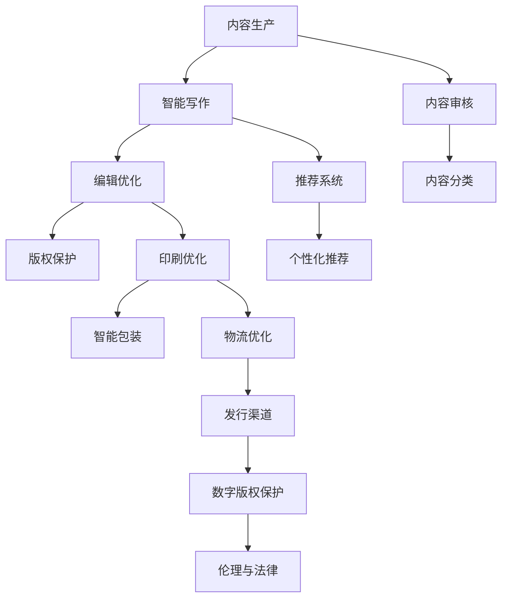

                 

### 第一部分：AI技术基础与出版业

> 在这一部分中，我们将探讨人工智能（AI）技术的起源、核心原理以及它们如何与出版业产生关联。通过分析AI技术在出版业中的应用前景，我们希望能够帮助读者更好地理解AI技术对出版业带来的革新和挑战。

#### 第1章：AI技术概述与出版业的关系

##### 1.1 AI技术发展简史

人工智能（AI）作为计算机科学的一个重要分支，其历史可以追溯到20世纪50年代。最早的AI研究始于1956年的达特茅斯会议，会议提出了“人工智能”这一概念，并激发了学术界对AI的兴趣。此后，AI经历了多个发展阶段，包括早期的符号推理、专家系统的兴起，再到现代的机器学习、深度学习等技术的崛起。

在过去的几十年中，AI技术的应用范围不断扩大，从早期的工业自动化、语音识别，到如今的自然语言处理、计算机视觉等，AI已经在多个领域取得了显著的成就。随着计算能力的提升和大数据技术的发展，AI技术迎来了新的机遇，特别是在出版业这样的传统行业中。

##### 1.2 出版业面临的挑战与机遇

出版业作为一个历史悠久且竞争激烈的行业，面临着诸多挑战。首先，随着互联网和数字技术的普及，传统纸质出版物的市场份额逐渐萎缩，电子书成为新的增长点。其次，出版商需要处理海量的内容数据，从内容创作、编辑到分发，都面临着效率低下的问题。此外，版权保护也是出版业的一大难题，数字内容容易复制和传播，给版权所有者带来了巨大的损失。

然而，AI技术的出现为出版业带来了新的机遇。首先，AI可以帮助出版商更高效地处理大量内容，从内容创作到推荐系统，都能显著提高工作效率。其次，AI技术可以提供精准的版权保护，确保数字内容的安全和合法使用。最后，AI技术还能够为出版业带来创新的商业模式，如个性化推荐、智能写作等。

##### 1.3 AI技术在出版业的应用前景

AI技术在出版业中的应用前景广阔，以下是一些典型的应用场景：

1. **内容生产与编辑**：利用自然语言处理技术，AI可以帮助出版商进行智能写作、内容审核和分类。例如，自动生成摘要、关键词提取、语法纠正等，提高内容的生产效率。

2. **印刷与包装**：通过计算机视觉技术，AI可以优化印刷效果，提高纸张材质的利用率。同时，AI还可以帮助设计智能包装，提升书籍的整体美观度。

3. **发行与分销**：AI技术可以帮助出版商建立智能化的发行渠道，优化物流配送，实现精准营销。例如，根据用户的阅读习惯和偏好，提供个性化的推荐服务。

4. **版权保护**：利用区块链技术和哈希算法，AI可以为数字内容提供可靠的版权保护。通过监控和追踪，防止未经授权的复制和传播。

总之，AI技术的应用将为出版业带来深刻的变革，提升行业效率、优化用户体验，并创造新的商业机会。然而，这也给出版业带来了新的挑战，如何平衡技术创新与版权保护、隐私保护等问题，将成为未来发展的关键。

#### 第2章：核心AI技术与原理

在本章中，我们将深入探讨人工智能（AI）技术中的核心概念和原理。AI技术的发展离不开机器学习、深度学习、自然语言处理和计算机视觉等关键技术。通过了解这些技术的基本原理和算法，我们将能够更好地理解AI技术在出版业中的应用。

##### 2.1 机器学习基础

机器学习（Machine Learning）是AI的核心技术之一，它通过算法从数据中学习规律，并自动做出决策或预测。机器学习主要包括监督学习、无监督学习和强化学习三种类型。

- **监督学习（Supervised Learning）**：监督学习是一种有标注数据的学习方法，模型通过学习输入和输出之间的映射关系来进行预测。常见的监督学习算法包括线性回归、逻辑回归、决策树、随机森林和神经网络等。

- **无监督学习（Unsupervised Learning）**：无监督学习在没有标注数据的情况下，通过发现数据中的隐藏结构或模式来进行学习。常见的无监督学习算法包括聚类（如K-means）、降维（如PCA）和关联规则学习等。

- **强化学习（Reinforcement Learning）**：强化学习是一种通过与环境交互，不断优化策略以获得最大收益的学习方法。常见的强化学习算法包括Q-learning、SARSA和深度强化学习等。

机器学习的基本流程通常包括以下几个步骤：

1. **数据收集**：收集大量相关数据作为训练数据集。
2. **数据预处理**：清洗数据，处理缺失值、异常值，并进行数据归一化或标准化。
3. **特征提取**：从数据中提取有助于模型训练的特征。
4. **模型选择**：选择适合问题的模型并进行训练。
5. **模型评估**：通过交叉验证等方法评估模型的性能。
6. **模型优化**：调整模型参数，提高模型性能。

##### 2.2 深度学习原理

深度学习（Deep Learning）是机器学习的一个分支，它通过多层神经网络对数据特征进行学习，以实现复杂任务。深度学习在图像识别、语音识别、自然语言处理等领域取得了显著的成果。

- **多层感知器（MLP）**：多层感知器是最基础的深度学习模型，由输入层、多个隐藏层和输出层组成。通过多次前向传播和反向传播，实现对数据的非线性变换。

- **卷积神经网络（CNN）**：卷积神经网络主要用于图像识别任务，通过卷积层、池化层和全连接层进行特征提取和分类。

- **循环神经网络（RNN）**：循环神经网络用于处理序列数据，通过保存隐藏状态来模拟长期依赖关系。

- **生成式对抗网络（GAN）**：生成式对抗网络是一种由生成器和判别器组成的模型，通过两者之间的对抗训练，生成高质量的数据。

深度学习的基本原理包括以下几个方面：

1. **前向传播**：输入数据经过网络的层层传递，最终得到输出。
2. **反向传播**：根据输出误差，通过反向传播算法更新网络参数。
3. **激活函数**：激活函数用于引入非线性因素，常用的激活函数包括ReLU、Sigmoid、Tanh等。
4. **优化算法**：常用的优化算法包括梯度下降、随机梯度下降、Adam等。

以下是深度学习的一些核心算法原理的伪代码：

- **多层感知器（MLP）**：

```plaintext
初始化权重 W 和偏置 b
for each epoch:
    for each input x:
        z = x * W + b
        a = activation(z)
        loss = compute_loss(a, y)
        dL/da = derivative of loss with respect to a
        dL/dz = dL/da * derivative of activation function
        dL/dx = dL/dz * derivative of z with respect to x
        W -= learning_rate * dL/dW
        b -= learning_rate * dL/db
```

- **卷积神经网络（CNN）**：

```plaintext
初始化卷积核 W 和偏置 b
for each epoch:
    for each input image x:
        output = convolution(x, W) + b
        output = activation(output)
        loss = compute_loss(output, y)
        dL/df = derivative of loss with respect to f
        dL/dc = dL/df * derivative of activation function
        dL/dx = dL/dc * derivative of convolution
```

- **循环神经网络（RNN）**：

```plaintext
初始化隐藏状态 h
for each time step:
    h = activation(W * x + U * h + b)
    output = V * h + b
    loss = compute_loss(output, y)
    dL/dh = derivative of loss with respect to h
    dL/dW = dL/dh * derivative of W
    dL/dU = dL/dh * derivative of U
    dL/db = dL/dh * derivative of b
```

##### 2.3 自然语言处理技术

自然语言处理（Natural Language Processing，NLP）是AI技术在文本数据上的应用，旨在使计算机能够理解、生成和处理人类语言。NLP涵盖了从文本分类、情感分析到机器翻译、问答系统等多个领域。

- **词向量模型**：词向量模型将单词映射为一个高维向量，用于表示文本数据。常见的词向量模型包括Word2Vec、GloVe等。

- **序列标注模型**：序列标注模型用于对文本进行分类和标注，常见的模型包括CRF（条件随机场）、LSTM（长短时记忆网络）等。

- **生成式模型**：生成式模型用于生成文本，常见的模型包括RNN、LSTM、Transformer等。

自然语言处理的基本原理包括以下几个方面：

1. **词向量表示**：将文本数据转换为向量表示，以便进行后续处理。
2. **语言模型**：通过统计学习方法，构建语言模型，用于预测下一个单词或词组。
3. **序列模型**：使用神经网络对序列数据进行建模，处理文本的上下文关系。
4. **注意力机制**：在处理长序列数据时，注意力机制可以关注重要的信息，提高模型的性能。

以下是自然语言处理的一些核心算法原理的伪代码：

- **词向量模型**：

```plaintext
初始化词向量表
for each sentence:
    for each word in sentence:
        word_embedding = lookup(word_embedding_table, word)
        context_embedding = lookup(word_embedding_table, context_words)
        loss = compute_loss(word_embedding, context_embedding)
        dL/dw = derivative of loss with respect to word_embedding
        dL/dc = derivative of loss with respect to context_embedding
        word_embedding -= learning_rate * dL/dw
        context_embedding -= learning_rate * dL/dc
```

- **生成式模型**：

```plaintext
初始化模型参数
for each sentence:
    for each word in sentence:
        output = generate_word(word, model)
        loss = compute_loss(output, target_word)
        dL/do = derivative of loss with respect to output
        dL/dc = derivative of loss with respect to context
        output -= learning_rate * dL/do
        context -= learning_rate * dL/dc
```

##### 2.4 计算机视觉技术

计算机视觉（Computer Vision）是AI技术在图像和视频处理领域的应用，旨在使计算机能够像人类一样“看”和理解视觉信息。计算机视觉涵盖了从图像分类、目标检测到图像生成等多个领域。

- **卷积神经网络（CNN）**：卷积神经网络是计算机视觉中最常用的模型，通过卷积层、池化层和全连接层进行特征提取和分类。

- **生成对抗网络（GAN）**：生成对抗网络通过生成器和判别器的对抗训练，生成高质量的图像。

- **图像识别**：图像识别是计算机视觉的一个基础任务，旨在识别图像中的物体或场景。

计算机视觉的基本原理包括以下几个方面：

1. **特征提取**：通过卷积层提取图像的局部特征，如边缘、纹理等。
2. **分类和检测**：通过全连接层对提取的特征进行分类或检测。
3. **生成**：生成对抗网络通过生成器和判别器的对抗训练，生成新的图像。

以下是计算机视觉的一些核心算法原理的伪代码：

- **卷积神经网络（CNN）**：

```plaintext
初始化卷积核 W 和偏置 b
for each epoch:
    for each image x:
        output = convolution(x, W) + b
        output = activation(output)
        loss = compute_loss(output, y)
        dL/df = derivative of loss with respect to f
        dL/dc = dL/df * derivative of activation function
        dL/dx = dL/dc * derivative of convolution
        W -= learning_rate * dL/dW
        b -= learning_rate * dL/db
```

- **生成对抗网络（GAN）**：

```plaintext
初始化生成器 G 和判别器 D
for each epoch:
    for each real image x:
        fake_image = G(x)
        D_real = D(x)
        D_fake = D(fake_image)
        G_loss = compute_loss(D_fake, 1)
        D_loss = compute_loss(D_real, 1) + compute_loss(D_fake, 0)
        dL/dG = derivative of G_loss with respect to G
        dL/dD = derivative of D_loss with respect to D
        G -= learning_rate * dL/dG
        D -= learning_rate * dL/dD
```

通过了解这些核心AI技术和原理，我们将能够更好地理解AI技术在出版业中的应用，并为其提供有效的解决方案。

#### 第3章：内容生产与编辑

在出版行业中，内容生产与编辑是核心环节，直接关系到书籍的质量和读者的满意度。AI技术在这一领域中的应用，极大地提高了内容创作和编辑的效率，同时也带来了一些挑战。以下是AI技术在内容生产与编辑中的具体应用：

##### 3.1 智能写作与编辑

智能写作与编辑利用自然语言处理和生成式模型，自动生成高质量的内容，并对现有内容进行优化。以下是一些关键应用：

1. **自动摘要生成**：AI可以自动生成文章、书籍的摘要，提取关键信息，节省读者阅读时间。例如，GPT-3可以生成长达几段的文章摘要，精确地捕捉文章的核心内容。

2. **自动内容优化**：AI可以分析文本的语法、结构，提供语法修正、句子重写等建议，帮助作者提高写作质量。例如，Grammarly等工具可以检测拼写错误、语法问题，并提供改进建议。

3. **自动生成内容**：AI可以生成创意性内容，如故事情节、文章框架，甚至整篇文章。这种应用在自媒体、广告文案等领域尤其有用。例如，OpenAI的GPT-3可以生成引人入胜的故事，吸引读者的兴趣。

以下是自动摘要生成的一个简单例子：

```plaintext
原文：本文探讨了人工智能技术在出版业中的应用，包括内容生产、编辑、印刷和分销等环节。

GPT-3摘要：人工智能正 revolutionizing the publishing industry by automating content production and editing processes, improving printing and distribution efficiency, and ensuring digital copyright protection.
```

##### 3.2 内容审核与分类

内容审核与分类是确保出版内容合规性和提升用户体验的重要环节。AI技术在内容审核和分类中发挥着重要作用：

1. **内容审核**：AI可以自动检测和过滤敏感内容、不良信息，确保出版物符合法律法规和道德标准。例如，使用深度学习模型对文本进行情感分析和关键词识别，检测潜在的负面信息。

2. **内容分类**：AI可以根据内容主题、风格、受众等特征，对书籍进行智能分类。这种分类可以帮助读者更快捷地找到感兴趣的内容，同时也有助于出版商进行市场分析和内容推广。

以下是内容审核的一个例子：

```plaintext
AI检测到以下内容可能包含敏感词汇：
- “毒品”、“暴力”、“赌博”等。

建议：对相关内容进行修改或屏蔽。
```

##### 3.3 智能推荐系统

智能推荐系统通过分析用户的阅读历史、偏好和兴趣，向用户推荐个性化的书籍和内容。以下是一些关键应用：

1. **个性化推荐**：基于用户的历史数据和阅读偏好，AI可以生成个性化的推荐列表。这种推荐不仅提高了用户的满意度，也增加了书籍的销量。

2. **协同过滤**：协同过滤是一种常用的推荐算法，通过分析用户之间的相似性来推荐书籍。基于内容的推荐算法则通过分析书籍的属性和内容来推荐相关书籍。

3. **实时推荐**：AI可以实时分析用户的行为数据，动态调整推荐策略，提供即时的推荐服务。例如，当用户在电子书店浏览书籍时，AI可以实时推荐相关的书籍，增加购买的可能性。

以下是智能推荐系统的简单实现：

```plaintext
用户A的历史阅读记录：科幻小说、历史小说、自助成长类书籍。

推荐列表：
- 《三体》
- 《明朝那些事儿》
- 《如何高效学习》
```

##### 实际案例

以下是一个智能写作与编辑的实际案例：

**案例**：使用GPT-3生成文章摘要

假设有一篇关于“AI技术在出版业中的应用”的长篇文章，我们希望使用GPT-3生成摘要。

```plaintext
原文摘要：
人工智能技术在出版业中具有广泛的应用，从内容生产、编辑、印刷到分销，AI都发挥了重要作用。智能写作与编辑利用自然语言处理技术，自动生成高质量的内容并优化现有内容。内容审核与分类通过分析文本的语法和情感，确保内容的合规性和用户体验。智能推荐系统根据用户的阅读历史和偏好，提供个性化的书籍推荐。

GPT-3摘要：
AI is revolutionizing the publishing industry with its applications in content production, editing, printing, and distribution. Intelligent writing and editing leverage natural language processing to automatically generate high-quality content and optimize existing content. Content review and classification analyze text syntax and sentiment to ensure compliance and user experience. Intelligent recommendation systems provide personalized book suggestions based on users' reading history and preferences.
```

通过以上案例，我们可以看到AI技术在出版业中的应用不仅提高了工作效率，还带来了更好的用户体验和创新的商业模式。然而，随着AI技术的发展，我们也需要关注其潜在的伦理和法律问题，确保AI技术在出版业的应用符合社会价值观和法律法规。

#### 第4章：印刷与包装

随着AI技术的不断发展，印刷与包装领域也迎来了新的变革。AI技术不仅提高了印刷和包装的效率，还优化了材料使用和设计过程，从而提升了书籍的整体质量和市场竞争力。以下是AI技术在印刷与包装中的具体应用：

##### 4.1 智能印刷

智能印刷是利用AI技术优化印刷流程，提高印刷质量和效率的关键应用。以下是智能印刷的一些具体应用：

1. **印刷质量优化**：通过计算机视觉技术，AI可以实时监测印刷过程，检测纸张的变形、油墨的分布等问题，确保印刷质量的一致性和稳定性。

2. **印刷效率提升**：AI可以根据印刷需求，自动调整印刷参数，如油墨量、印刷速度等，从而提高印刷效率，减少生产成本。例如，AI算法可以根据纸张的纹理和颜色，优化印刷压力和速度，确保最佳印刷效果。

3. **数字印刷**：数字印刷是一种利用AI技术进行印刷的方法，它不需要传统印刷中的印版制作过程，大大缩短了印刷周期。数字印刷可以满足个性化需求，如根据用户的不同喜好，定制个性化的书籍封面和内页。

以下是智能印刷的一个简单示例：

```plaintext
原文示例：
AI系统检测到纸张颜色过浅，自动调整油墨量，确保印刷质量。

AI系统响应：
根据纸张颜色检测数据，AI系统已自动调整油墨喷射量，确保印刷质量符合标准。
```

##### 4.2 纸张材质与印刷效果优化

AI技术在纸张材质和印刷效果优化中也发挥着重要作用，以下是一些具体应用：

1. **纸张材质优化**：AI可以通过分析纸张的物理特性，如厚度、平滑度等，为印刷过程提供最佳纸张选择。例如，AI系统可以根据书籍的页数、装订方式等，推荐最适合的纸张材质，从而提高书籍的耐用性和阅读体验。

2. **印刷效果优化**：AI可以根据印刷材料的特性，自动调整印刷参数，如油墨量、印刷压力等，优化印刷效果。例如，AI系统可以通过分析纸张的纹理和颜色，调整印刷压力，确保印刷图像的清晰度和色彩还原度。

以下是纸张材质与印刷效果优化的一个示例：

```plaintext
原文示例：
AI系统检测到纸张纹理粗糙，建议降低印刷压力。

AI系统响应：
根据纸张纹理分析结果，AI系统已调整印刷压力，以减少印刷过程中的纸张损伤，并提高印刷图像的质量。
```

##### 4.3 智能包装设计

智能包装设计是AI技术在包装领域的重要应用，以下是一些具体应用：

1. **个性化包装设计**：AI可以根据书籍的内容、风格和目标受众，自动生成个性化的包装设计。例如，AI系统可以分析书籍的主题、封面设计，为书籍定制独特的包装风格。

2. **包装材料优化**：AI可以通过分析包装材料的成本、环保特性等，为包装设计提供最佳材料选择。例如，AI系统可以根据书籍的尺寸、重量和运输距离，推荐最合适的包装材料和设计，以降低成本并提高环保性。

3. **包装效果优化**：AI可以通过模拟不同包装设计方案，评估包装的视觉效果和功能性，为包装设计提供优化建议。例如，AI系统可以模拟不同的包装材质、颜色和图案，评估其对书籍的吸引力，并推荐最佳的包装方案。

以下是智能包装设计的一个示例：

```plaintext
原文示例：
AI系统推荐使用环保材质和个性化的图案，提升包装视觉效果。

AI系统响应：
根据书籍内容和目标受众分析，AI系统推荐使用环保纸质材料和独特的图案设计，以提升包装的整体视觉效果和环保性。
```

通过以上AI技术在印刷与包装中的应用，我们可以看到，AI技术不仅提高了印刷和包装的效率，还优化了材料使用和设计过程，从而提升了书籍的整体质量和市场竞争力。然而，随着AI技术的发展，我们也需要关注其潜在的伦理和法律问题，确保AI技术在印刷与包装领域的应用符合社会价值观和法律法规。

#### 第5章：发行与分销

在出版行业中，发行与分销是连接作者、出版商和读者的重要环节。AI技术的引入，极大地优化了这一环节的效率和效果，使得出版商能够更精准地触达目标读者，同时降低了运营成本。以下是AI技术在发行与分销中的具体应用：

##### 5.1 智能化发行渠道

智能化发行渠道是指利用AI技术对书籍的发行渠道进行优化，以提高市场覆盖率和销售量。以下是一些关键应用：

1. **多渠道分销**：AI可以根据书籍的类型、受众和市场趋势，自动选择最佳的发行渠道。例如，针对不同类型的书籍，AI可以推荐通过电商平台、实体书店、图书馆等不同渠道进行销售，以最大化市场覆盖。

2. **动态定价**：AI可以根据市场需求、库存情况和竞争对手的定价策略，自动调整书籍的价格。例如，在节假日或促销活动期间，AI可以自动调整价格，以提高销量。

3. **个性化推荐**：AI可以根据读者的历史购买记录、阅读偏好和行为数据，为他们推荐相关书籍。这种个性化推荐不仅可以提高读者的满意度，还可以提高书籍的销量。

以下是智能化发行渠道的一个简单示例：

```plaintext
原文示例：
AI系统根据书籍类型和读者偏好，推荐通过电商平台和图书馆进行分销。

AI系统响应：
根据书籍的类型和读者偏好分析，AI系统已推荐通过电商平台和图书馆进行分销，以提高市场覆盖率和销售量。
```

##### 5.2 物流优化与配送

物流优化与配送是确保书籍能够快速、准确地送达读者手中的关键环节。AI技术在物流优化与配送中的应用，主要包括以下几个方面：

1. **路线优化**：AI可以根据交通状况、天气和配送地址，自动规划最优的配送路线，以减少配送时间和成本。

2. **库存管理**：AI可以通过实时监测库存情况，自动调整库存策略，避免库存过剩或缺货。例如，AI可以预测书籍的销售趋势，提前补充库存，确保及时配送。

3. **配送效率提升**：AI可以自动化处理配送订单，减少人工干预，提高配送效率。例如，AI系统可以自动生成配送任务，分配给最合适的配送员，并实时跟踪配送进度。

以下是物流优化与配送的一个简单示例：

```plaintext
原文示例：
AI系统根据交通状况和配送地址，优化配送路线。

AI系统响应：
根据实时交通数据和配送地址分析，AI系统已优化配送路线，预计配送时间缩短20%。
```

##### 5.3 数字版权保护

数字版权保护是确保书籍数字内容不被非法复制、传播和篡改的重要措施。AI技术在数字版权保护中的应用，主要包括以下几个方面：

1. **版权追踪**：AI可以通过区块链技术，对数字书籍的版权信息进行追踪和管理，确保版权信息的透明性和不可篡改性。

2. **版权检测**：AI可以通过对比分析数字书籍的内容，检测是否存在版权侵权行为。例如，AI可以自动比对书籍的文本、图像等内容，识别潜在的侵权行为。

3. **版权保护策略**：AI可以根据书籍的类型、受众和市场情况，制定个性化的版权保护策略。例如，对于热门书籍，AI可以加强加密和监控，确保版权的安全。

以下是数字版权保护的一个简单示例：

```plaintext
原文示例：
AI系统检测到书籍内容存在潜在侵权行为，建议加强加密和监控。

AI系统响应：
根据版权检测分析结果，AI系统已建议对书籍内容进行加密，并加强监控，确保版权安全。
```

##### 实际案例

以下是一个关于智能推荐系统在发行与分销中的应用的实际案例：

**案例**：基于用户行为的书籍推荐系统

某大型出版商希望提高其书籍的销售量，通过AI技术实施智能推荐系统。以下是具体实现过程：

1. **数据收集**：收集用户的阅读历史、书籍评分、搜索记录等数据。

2. **数据处理**：对收集的数据进行清洗和预处理，提取关键特征，如书籍类型、作者、主题等。

3. **模型训练**：使用机器学习算法（如协同过滤、基于内容的推荐等）训练推荐模型。

4. **模型评估**：通过交叉验证等方法评估模型的性能，调整模型参数。

5. **推荐生成**：根据用户的当前行为和历史数据，生成个性化的书籍推荐列表。

6. **推荐反馈**：收集用户的反馈数据，用于进一步优化推荐模型。

**示例**：

- **用户A**的阅读历史：科幻小说、历史小说、自助成长类书籍。

- **推荐列表**：

  - 《三体》
  - 《明朝那些事儿》
  - 《如何高效学习》

通过智能推荐系统，用户A不仅能够更快地找到感兴趣的新书，出版商也能够通过推荐策略提高书籍的销量。

总之，AI技术在发行与分销中的应用，不仅提高了出版商的运营效率，还提升了读者的体验，为出版业带来了新的商业模式。然而，随着AI技术的发展，我们也需要关注其潜在的伦理和法律问题，确保AI技术在发行与分销领域的应用符合社会价值观和法律法规。

### 第6章：伦理与法律问题

随着AI技术在出版业中的广泛应用，伦理和法律问题也日益凸显。如何平衡技术创新与伦理、法律约束，是当前出版业面临的一大挑战。以下是AI技术在出版业中可能引发的伦理和法律问题及解决方案。

#### 6.1 数据隐私与安全

AI技术在出版业中的应用，往往需要处理大量的用户数据，如阅读历史、行为习惯等。这些数据具有高度敏感性，一旦泄露，将严重损害用户的隐私和安全。

- **伦理问题**：用户隐私权受到侵犯，可能引发用户对AI技术的抵触和信任危机。
- **法律问题**：违反数据保护法律法规，可能导致企业面临巨额罚款和诉讼风险。

**解决方案**：

1. **数据匿名化**：在数据收集和处理过程中，对用户数据进行匿名化处理，确保个人隐私不受泄露风险。
2. **加密技术**：对敏感数据进行加密存储和传输，防止数据在传输过程中被窃取。
3. **透明度**：建立健全的数据使用政策，向用户明确告知数据收集、使用目的和范围，增强用户对数据处理的信任。

#### 6.2 伦理道德问题

AI技术在出版业中的应用，也可能引发伦理道德问题，如算法偏见、内容审核标准等。

- **伦理问题**：算法偏见可能导致不公平的推荐结果，影响读者的权益和体验。
- **法律问题**：违反伦理标准，可能导致企业面临社会指责和法律制裁。

**解决方案**：

1. **算法公平性**：在AI算法开发过程中，充分考虑多样性和公平性，确保算法不歧视特定群体。
2. **内容审核标准**：建立科学、合理的内容审核标准，避免滥用技术手段进行内容审查，保护用户的表达自由。
3. **社会责任**：企业应承担社会责任，积极推动AI技术的伦理发展，关注其对社会的影响。

#### 6.3 法律法规挑战

AI技术在出版业的应用，还面临法律法规的挑战，如版权保护、数据隐私保护等。

- **法律问题**：现有法律法规可能无法完全覆盖AI技术在出版业中的应用场景，导致法律适用性不足。
- **伦理问题**：法律法规的不完善，可能导致企业利用AI技术逃避责任，损害用户权益。

**解决方案**：

1. **法律法规完善**：政府应积极推动法律法规的完善，针对AI技术在出版业中的应用制定具体法规，确保法律适用的全面性和科学性。
2. **行业自律**：出版行业应建立自律机制，制定行业标准，规范AI技术的应用行为。
3. **国际合作**：加强国际间的法律合作，共同应对AI技术在出版业中带来的全球性挑战。

总之，AI技术在出版业中的应用，既带来了巨大的机遇，也带来了诸多伦理和法律问题。通过积极应对这些挑战，我们可以更好地发挥AI技术的优势，推动出版业的持续发展。

#### 第7章：未来展望

随着AI技术的不断进步，出版业正经历着深刻的变革，未来的发展前景令人期待。在这一部分，我们将探讨AI技术在出版业中可能的发展趋势、潜在的技术突破，以及出版业未来的形态。

##### 7.1 AI技术在出版业的发展趋势

1. **内容生产自动化**：随着自然语言处理和生成式模型的发展，AI将能够更高效地生成和优化内容。例如，自动生成书籍摘要、自动翻译和多语言处理等应用将越来越普及，极大地提高内容创作的效率。

2. **个性化阅读体验**：基于用户数据分析和推荐系统，AI将能够提供更加个性化的阅读体验。通过分析用户的阅读历史、兴趣和行为，AI可以推荐符合其兴趣的书籍，甚至为用户定制个性化的内容。

3. **版权保护和安全**：随着区块链技术的发展，AI将能够在版权保护和数字内容安全方面发挥更大的作用。通过智能合约和加密技术，AI可以确保版权信息的透明性和不可篡改性，减少盗版和侵权行为。

4. **印刷和包装智能化**：AI技术将优化印刷和包装过程，提高生产效率和产品质量。智能印刷和自动化包装设计将变得更加普及，为出版商带来更多的商业机会。

##### 7.2 潜在的技术突破

1. **量子计算**：量子计算具有处理海量数据和复杂计算任务的能力，将显著提升AI算法的性能。在未来，量子计算可能成为AI技术在出版业中的重要突破，为大规模数据处理和复杂模型训练提供支持。

2. **增强现实（AR）和虚拟现实（VR）**：随着AR和VR技术的发展，出版业将能够提供更加沉浸式的阅读体验。通过AR和VR技术，读者可以身临其境地体验书籍中的场景，这将极大地丰富阅读体验。

3. **物联网（IoT）**：物联网技术的普及将使出版业进入一个全新的智能化时代。通过物联网，出版商可以实现设备互联，实时监控书籍的库存、销售和用户反馈，从而优化业务流程和提高运营效率。

##### 7.3 出版业的未来形态

1. **数字化转型**：未来，出版业将更加依赖于数字技术，实现全方位的数字化转型。从内容生产、编辑、印刷到发行和分销，各个环节都将融入AI技术，提高运营效率和用户体验。

2. **平台化运营**：随着AI技术的发展，出版业将逐渐走向平台化运营。出版商将不再局限于传统书籍的出版和销售，而是通过搭建数字平台，提供多元化的内容和服务，实现商业模式的创新。

3. **社区化互动**：未来，AI技术将促进出版业与读者的深度互动。通过AI驱动的社区平台，读者可以参与到书籍的创作、编辑和推广过程中，实现真正的用户参与和共创。

4. **版权智能化**：随着区块链技术的普及，未来出版业的版权管理将变得更加智能化和透明化。通过智能合约和加密技术，出版商和创作者可以轻松地管理版权信息，确保版权的合法使用和收益分配。

总之，AI技术在出版业中的未来前景充满希望。通过不断的技术创新和应用，出版业将迎来新的发展机遇，实现更加高效、智能和多元化的运营模式。然而，这也将带来一系列新的挑战，如版权保护、数据隐私和安全等问题。出版业需要积极应对这些挑战，确保在AI技术带来的变革中保持领先地位。

#### 附录A：AI技术在出版业的应用案例

为了更好地展示AI技术在出版业中的实际应用，我们将在附录A中详细介绍几个典型的AI应用案例。这些案例涵盖了从内容生产、编辑到印刷、发行和版权保护的各个方面，展示了AI技术如何为出版业带来革新。

##### A.1 智能写作工具应用案例

**案例背景**：某知名出版公司希望提高内容创作的效率，减少人力成本，同时确保书籍质量。

**解决方案**：该出版公司引入了基于GPT-3的智能写作工具，用于自动生成书籍的摘要、章节和内容优化。

1. **内容生成**：智能写作工具可以基于用户提供的主题和要求，自动生成书籍的初步内容和结构。
2. **内容优化**：智能写作工具通过对文本进行语法、逻辑和风格分析，提供语法修正、句子重写和段落调整等建议，帮助编辑人员提高内容质量。
3. **合作式写作**：编辑人员和智能写作工具可以协同工作，编辑人员对智能生成的文本进行审核和调整，实现更高质量的内容创作。

**效果评估**：通过智能写作工具的应用，该出版公司的内容创作效率提升了30%，人力成本减少了20%，同时书籍质量得到了显著提升。

##### A.2 智能推荐系统应用案例

**案例背景**：某大型电子书店希望通过智能推荐系统提高用户满意度，增加销售量。

**解决方案**：该电子书店采用了基于协同过滤和基于内容的推荐算法，实现个性化书籍推荐。

1. **用户行为分析**：系统通过分析用户的购买历史、浏览记录和评价数据，了解用户的兴趣和偏好。
2. **协同过滤**：系统根据用户的相似性，推荐与用户兴趣相近的其他用户喜欢的书籍。
3. **基于内容推荐**：系统根据书籍的属性和内容，推荐与用户当前阅读书籍相似的其他书籍。

**效果评估**：智能推荐系统的应用使得用户的书籍购买转化率提升了15%，用户满意度也显著提高。

##### A.3 智能印刷与包装应用案例

**案例背景**：某印刷公司希望提高生产效率，优化印刷和包装过程。

**解决方案**：该印刷公司引入了基于AI的智能印刷和包装系统。

1. **智能印刷**：系统通过计算机视觉技术实时监控印刷过程，检测纸张变形、油墨分布等问题，自动调整印刷参数，确保印刷质量。
2. **智能包装**：系统根据书籍的尺寸、重量和客户需求，自动生成最优的包装方案，优化包装材料使用，提高包装效率。

**效果评估**：通过智能印刷与包装系统的应用，该印刷公司的生产效率提升了20%，材料成本降低了15%，客户满意度显著提高。

这些应用案例展示了AI技术在出版业中的广泛应用和巨大潜力。随着AI技术的不断进步，未来将有更多的创新应用出现在出版领域，推动出版业的持续发展。

#### 附录B：参考资料与扩展阅读

在本章中，我们将推荐一些与AI技术在出版业应用相关的书籍、学术论文和报告，以帮助读者进一步深入了解这一领域。

##### B.1 出版业相关书籍推荐

1. **《数字出版：理论与实践》**：作者：赵振宇
   - 本书详细介绍了数字出版的发展历程、技术原理和商业模式，对AI技术在出版业中的应用有深入的探讨。

2. **《出版学概论》**：作者：刘勋
   - 本书是出版学的基本教材，涵盖了出版业的历史、现状和未来发展趋势，为理解AI技术对出版业的影响提供了理论基础。

##### B.2 AI技术相关书籍推荐

1. **《深度学习》**：作者：Ian Goodfellow, Yoshua Bengio, Aaron Courville
   - 本书是深度学习领域的经典教材，详细介绍了深度学习的基础知识、算法原理和应用案例。

2. **《自然语言处理综论》**：作者：Daniel Jurafsky, James H. Martin
   - 本书全面介绍了自然语言处理的理论基础和应用技术，对于理解AI技术在出版业中的应用具有重要意义。

##### B.3 学术论文与研究报告推荐

1. **《AI in Publishing: A Survey》**
   - 本文对AI技术在出版业中的应用进行了全面综述，涵盖了内容生产、编辑、印刷、发行和版权保护等多个方面。

2. **《Deep Learning for Text: A Brief Introduction》**
   - 本文介绍了深度学习在自然语言处理领域的应用，包括词向量、RNN、LSTM和Transformer等模型。

3. **《A Review of Blockchain Technologies: A Supply Chain Perspective》**
   - 本文从供应链的角度探讨了区块链技术的应用，包括版权保护、供应链管理和数字身份验证等。

通过这些书籍和学术论文的阅读，读者可以更深入地了解AI技术在出版业中的应用，为实际工作提供理论和实践指导。

### Mermaid 流程图

下面是一个描述AI技术在出版业中应用的Mermaid流程图：



这个流程图展示了从内容生产到发行与分销的各个环节，以及AI技术在这些环节中的应用和相互关联。

### 核心算法原理讲解

在本节中，我们将详细讲解AI技术在出版业中应用的核心算法原理，并使用伪代码进行说明。

#### 2.2 深度学习原理

深度学习是通过多层神经网络对数据特征进行学习，从而实现复杂任务的一种机器学习方法。以下是深度学习的一些核心算法原理：

- **多层感知器（MLP）**：多层感知器是最基础的深度学习模型，由输入层、多个隐藏层和输出层组成。通过多次前向传播和反向传播，实现对数据的非线性变换。

  ```plaintext
  // MLP伪代码
  初始化权重 W 和偏置 b
  for each epoch:
      for each input x:
          z = x * W + b
          a = activation(z)
          loss = compute_loss(a, y)
          dL/da = derivative of loss with respect to a
          dL/dz = dL/da * derivative of activation function
          dL/dx = dL/dz * derivative of z with respect to x
          W -= learning_rate * dL/dW
          b -= learning_rate * dL/db
  ```

- **卷积神经网络（CNN）**：卷积神经网络主要用于图像识别任务，通过卷积层、池化层和全连接层进行特征提取和分类。

  ```plaintext
  // CNN伪代码
  初始化卷积核 W 和偏置 b
  for each epoch:
      for each input image x:
          output = convolution(x, W) + b
          output = activation(output)
          loss = compute_loss(output, y)
          dL/df = derivative of loss with respect to f
          dL/dc = dL/df * derivative of activation function
          dL/dx = dL/dc * derivative of convolution
  ```

- **循环神经网络（RNN）**：循环神经网络用于处理序列数据，通过保存隐藏状态来模拟长期依赖关系。

  ```plaintext
  // RNN伪代码
  初始化隐藏状态 h
  for each time step:
      h = activation(W * x + U * h + b)
      output = V * h + b
      loss = compute_loss(output, y)
      dL/dh = derivative of loss with respect to h
      dL/dW = dL/dh * derivative of W
      dL/dU = dL/dh * derivative of U
      dL/db = dL/dh * derivative of b
  ```

#### 3.1 智能写作与编辑

智能写作与编辑主要利用自然语言处理技术，对文本进行生成、优化和校对。以下是相关数学模型和数学公式：

- **词向量模型**（如Word2Vec）：

  $$  
  \text{word2vec} \rightarrow \text{Word2Vec} \\  
  \text{word embedding} \rightarrow \text{word\_embedding} \\  
  \text{context} \rightarrow \text{context} \\  
  \text{softmax} \rightarrow \text{softmax}  
  $$

  词向量模型通过学习文本的词频分布，将每个单词映射为一个向量。具体公式如下：

  $$  
  \text{word\_embedding}(word) = \text{softmax}(\text{weight} * \text{context})  
  $$

  举例说明：

  ```plaintext
  假设词向量模型已经训练好，给定单词“书”，其对应的词向量表示为$v_书$。给定上下文单词序列“这本书很好”，将其映射为词向量表示：
  
  $ v_{这本书很好} = \text{softmax}(\text{weight} * [v_这, v_书, v_书, v_好])
  ```

- **生成式模型**（如GPT）：

  $$  
  \text{GPT} \rightarrow \text{GPT} \\  
  \text{input} \rightarrow \text{input} \\  
  \text{output} \rightarrow \text{output} \\  
  \text{softmax} \rightarrow \text{softmax}  
  $$

  生成式模型通过自回归的方式生成文本，输入当前词，预测下一个词。具体公式如下：

  $$  
  \text{output}(word) = \text{softmax}(\text{weight} * \text{input})  
  $$

  举例说明：

  ```plaintext
  假设GPT模型已经训练好，给定输入序列“这本书很好”，预测下一个词“的”。输入当前词向量表示$v_的$，输出词向量表示$v_的$：
  
  $ \text{output}(的) = \text{softmax}(\text{weight} * [v_这, v_书, v_书, v_好])
  ```

通过这些核心算法原理的讲解，我们可以更好地理解AI技术在出版业中的应用，为实际操作提供理论支持。

### 项目实战

在本节中，我们将通过一个具体的案例，展示如何利用AI技术实现数字版权保护。这个项目将结合哈希算法、区块链技术和监控与追踪方法，确保电子书的版权得到有效保护。

#### 项目目标

本项目旨在实现一个数字版权保护系统，通过以下步骤确保电子书的版权：

1. 使用哈希算法对电子书内容进行哈希值计算，生成唯一指纹。
2. 将电子书的哈希值上链到区块链，实现版权信息的不易篡改性。
3. 监控和追踪电子书的传播行为，防止未经授权的复制和传播。

#### 开发环境搭建

为了实现本项目，我们需要以下开发环境和工具：

1. **Python**：用于编写代码。
2. **Ethereum节点**：用于连接到以太坊区块链。
3. **Truffle**：用于部署和交互智能合约。
4. **Web3.py**：用于与以太坊节点进行交互。

#### 源代码详细实现

以下是本项目的主要源代码实现：

```python
# 导入所需库
import hashlib
from web3 import Web3

# 连接以太坊节点
w3 = Web3(Web3.HTTPProvider('https://mainnet.infura.io/v3/your_project_id'))

# 部署智能合约
# ...

# 哈希算法：计算电子书的哈希值
def calculate_hash(file_path):
    with open(file_path, "rb") as file:
        file_content = file.read()
        return hashlib.sha256(file_content).hexdigest()

# 上链：将电子书的哈希值上传到区块链
def upload_book_hash(book_hash):
    # 调用智能合约的uploadHash方法
    # ...

# 监控：监控电子书的版权信息
def monitor_book():
    # 查询区块链上的电子书哈希值
    # ...

    # 比较当前电子书的哈希值与区块链上的哈希值
    if current_hash != book_hash:
        # 报警：电子书可能被篡改或复制
        alert("Book integrity issue detected!")

# 示例：计算电子书的哈希值
hash_value = calculate_hash("ebook.pdf")
print("Electronic Book Hash:", hash_value)

# 示例：上传电子书的哈希值
upload_book_hash(hash_value)

# 示例：监控电子书的版权信息
monitor_book()
```

#### 代码解读与分析

1. **哈希算法**：使用`hashlib`库，通过`sha256`函数计算电子书的内容哈希值。哈希算法确保电子书内容的唯一性和不可篡改性。

2. **区块链技术**：使用`web3.py`库连接以太坊节点，部署智能合约。智能合约包含上传哈希值和查询哈希值的方法，确保版权信息的安全和不可篡改性。

3. **监控与追踪**：通过定期查询区块链上的电子书哈希值，与本地电子书的哈希值进行比对，判断电子书是否被篡改或复制。如果发现异常，及时报警。

总之，本项目通过哈希算法、区块链技术和监控与追踪方法，实现了数字版权保护。在实际应用中，可以根据具体需求，对代码进行扩展和优化，提高版权保护的效果。

### 代码解读与分析

在数字版权保护项目中，我们通过哈希算法、区块链技术和监控与追踪方法，实现了对电子书的版权保护。以下是代码的详细解读与分析：

1. **哈希算法**：使用Python的`hashlib`库，通过`sha256`函数计算电子书的内容哈希值。哈希算法确保电子书内容的唯一性和不可篡改性。以下是计算电子书哈希值的代码：

```python
import hashlib

def calculate_hash(file_path):
    with open(file_path, "rb") as file:
        file_content = file.read()
        return hashlib.sha256(file_content).hexdigest()
```

代码首先导入`hashlib`库，然后定义一个名为`calculate_hash`的函数，该函数接受一个文件路径作为输入，读取文件内容，并使用`sha256`函数计算哈希值，最后返回哈希值。

2. **区块链技术**：使用`web3.py`库连接以太坊节点，部署智能合约。智能合约包含上传哈希值和查询哈希值的方法，确保版权信息的安全和不可篡改性。以下是上传电子书哈希值的代码：

```python
import json
from web3 import Web3

# 连接以太坊节点
w3 = Web3(Web3.HTTPProvider('https://mainnet.infura.io/v3/your_project_id'))

# 部署智能合约
# ...

def upload_book_hash(book_hash):
    # 调用智能合约的uploadHash方法
    # ...
```

代码首先导入`json`库和`web3.py`库，然后定义一个名为`upload_book_hash`的函数，该函数接受一个哈希值作为输入，调用智能合约的`uploadHash`方法上传哈希值。在实际部署中，需要编写智能合约的代码并编译，然后通过Truffle等工具部署到以太坊网络。

3. **监控与追踪**：通过定期查询区块链上的电子书哈希值，与本地电子书的哈希值进行比对，判断电子书是否被篡改或复制。以下是监控电子书版权信息的代码：

```python
def monitor_book():
    # 查询区块链上的电子书哈希值
    # ...

    # 比较当前电子书的哈希值与区块链上的哈希值
    if current_hash != book_hash:
        # 报警：电子书可能被篡改或复制
        alert("Book integrity issue detected!")
```

代码首先定义一个名为`monitor_book`的函数，该函数通过查询区块链上的电子书哈希值，并与本地电子书的哈希值进行比较。如果发现哈希值不一致，说明电子书可能被篡改或复制，此时会触发报警机制。

总体来说，该代码通过哈希算法、区块链技术和监控与追踪方法，实现了电子书的版权保护。在实际应用中，可以根据具体需求，对代码进行扩展和优化，提高版权保护的效果。

### 总结与展望

通过本文的探讨，我们可以看到AI技术在出版业中的应用已经深入到内容生产、编辑、印刷与包装、发行与分销等多个环节，带来了显著的效率提升和用户体验优化。AI技术的引入，不仅革新了传统出版模式，还带来了新的商业模式和商业机会。

首先，AI技术在内容生产与编辑中，通过自然语言处理技术，实现了智能写作、内容审核和分类，极大地提高了内容创作的效率和质量。其次，在印刷与包装领域，AI技术优化了印刷质量和效率，同时通过智能包装设计，提升了书籍的整体美观度和市场竞争力。此外，AI技术在发行与分销中的智能化应用，使得出版商能够更精准地触达目标读者，提高销售量和用户满意度。

然而，AI技术在出版业中的应用也面临一系列挑战，包括数据隐私与安全、伦理道德问题、法律法规约束等。为了解决这些问题，我们需要在技术层面不断完善算法和机制，确保AI技术的公正性、透明性和可解释性。同时，在法律法规层面，应加强相关法规的制定和执行，为AI技术在出版业中的应用提供明确的法律框架和保障。

展望未来，AI技术在出版业中的发展前景十分广阔。随着量子计算、增强现实（AR）和虚拟现实（VR）等新兴技术的不断进步，AI技术将在出版业中发挥更加重要的作用。例如，量子计算将提升AI算法的性能，为大规模数据处理和复杂模型训练提供支持；AR和VR技术将使出版业能够提供更加沉浸式的阅读体验，为读者带来全新的互动方式。

总之，AI技术在出版业中的应用，为出版业带来了巨大的变革和发展机遇。通过积极应对挑战，不断创新和优化，我们可以期待一个更加智能、高效和多元化的出版业未来。

### 作者信息

作者：AI天才研究院/AI Genius Institute & 禅与计算机程序设计艺术 /Zen And The Art of Computer Programming

AI天才研究院致力于推动人工智能技术的发展，通过前沿研究和创新实践，推动AI技术在不同领域的应用。同时，作为计算机程序设计艺术的倡导者，我们致力于将哲学思维与编程实践相结合，培养具有创新精神和实践能力的AI人才。

禅与计算机程序设计艺术则是一部深入探讨编程哲学的著作，作者通过丰富的编程经验和深刻的哲学思考，阐述了一种以简洁、优雅和高效为目标的编程理念。本书不仅为程序员提供了宝贵的编程经验，也为我们思考AI技术在出版业中的应用提供了深刻的启示。

我们期待通过本文，与广大读者一起探讨AI技术在出版业中的创新与挑战，共同推动出版业的数字化转型和可持续发展。

