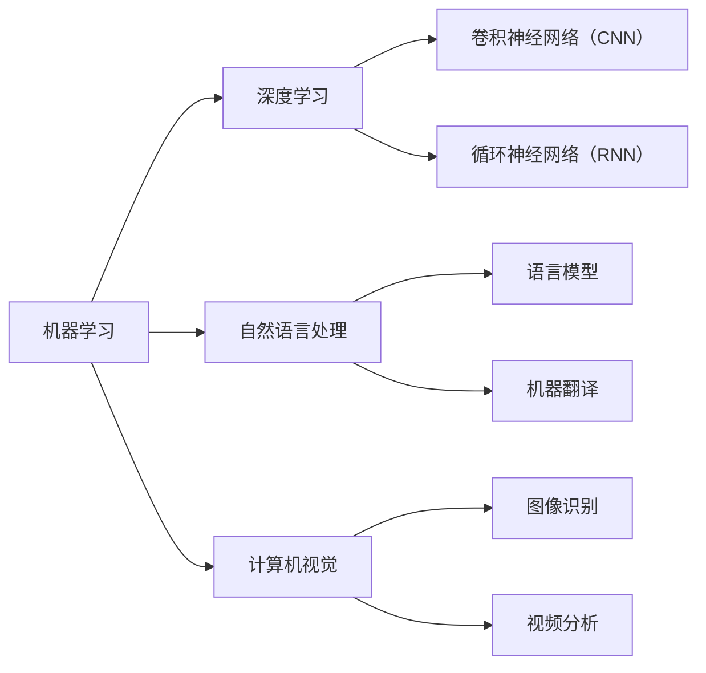
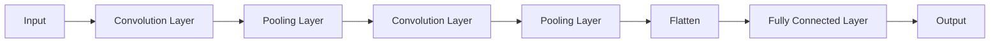
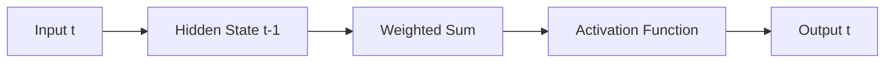
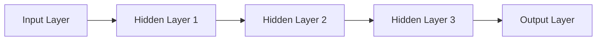
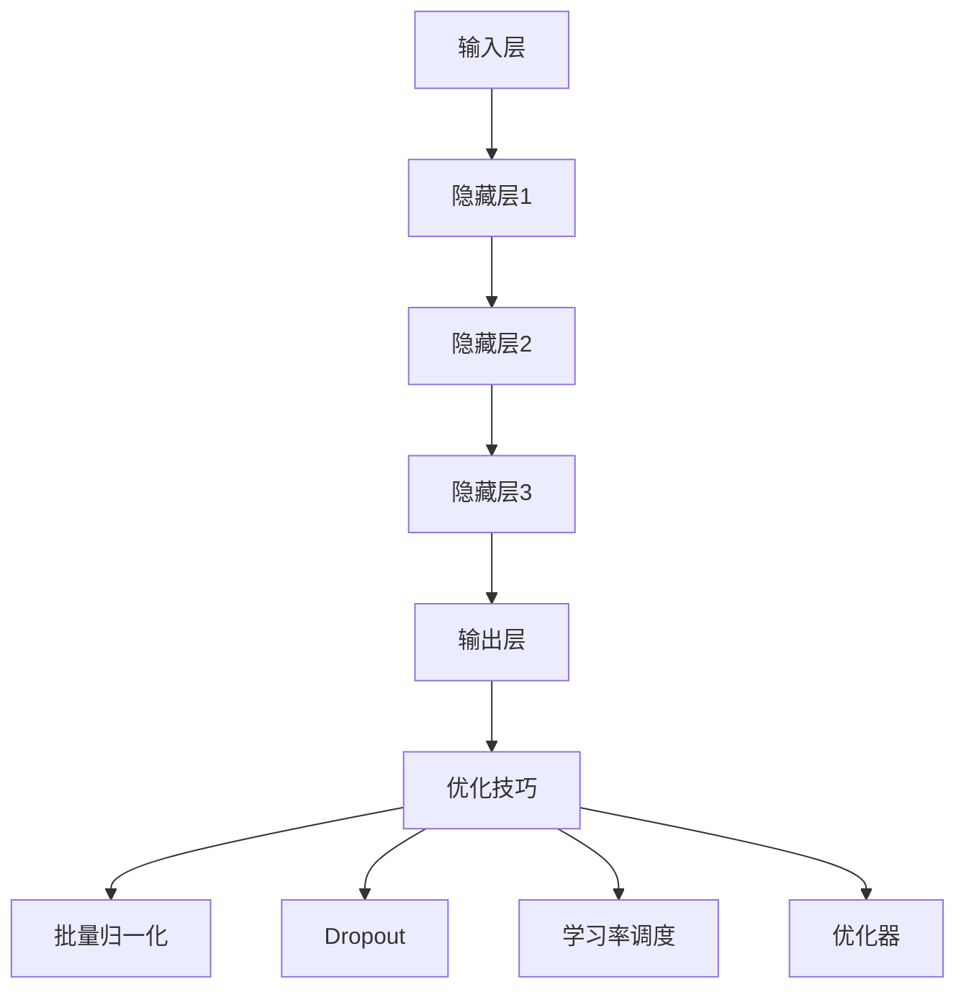
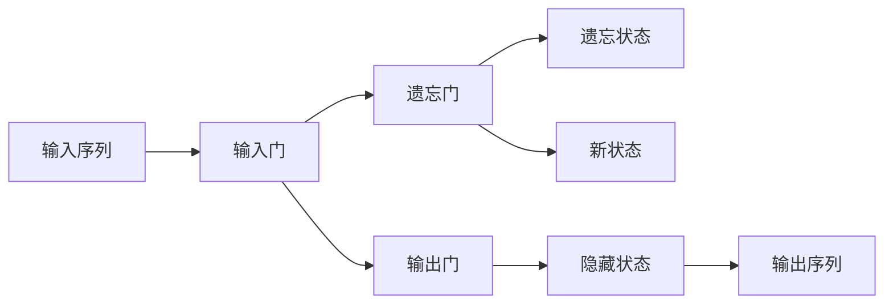
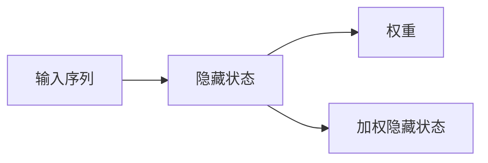

                 

### 引言

在当今科技飞速发展的时代，人工智能（AI）已经成为推动社会进步的重要力量。从无人驾驶汽车到智能客服，从精准医疗诊断到金融风险评估，AI技术的应用已经渗透到了我们生活的方方面面。本文将深入探讨AI技术在实际应用中的前景，通过逻辑清晰、结构紧凑的阐述，帮助读者全面了解AI技术的核心概念、发展历程、核心技术以及其在不同领域中的广泛应用和未来发展趋势。

文章将从以下几个部分展开：

1. **AI技术概述**：介绍AI的定义、发展历程和核心技术。
2. **机器学习基础**：讲解机器学习的基本概念、监督学习与无监督学习算法。
3. **深度学习原理与应用**：阐述深度学习的理论基础、神经网络结构和应用领域。
4. **自然语言处理技术**：介绍语言模型、序列模型和语言生成与翻译技术。
5. **AI技术在实际应用中的前景**：探讨AI在医疗、金融、零售、智能制造和交通物流等领域的应用。
6. **AI技术的未来发展**：分析AI技术的趋势与挑战、伦理与社会问题以及未来前景。

### 核心关键词

- 人工智能（AI）
- 机器学习
- 深度学习
- 自然语言处理
- 医疗
- 金融
- 零售
- 智能制造
- 交通物流
- 伦理与社会问题

### 摘要

本文系统地探讨了人工智能技术在实际应用中的前景。首先，通过介绍AI的定义、发展历程和核心技术，为读者构建了AI技术的基本框架。接着，深入讲解机器学习、深度学习和自然语言处理等核心技术，详细阐述了它们的基本概念、原理和应用。然后，本文重点探讨了AI技术在医疗、金融、零售、智能制造和交通物流等领域的实际应用案例，分析了AI技术在这些领域中的潜力和挑战。最后，本文展望了AI技术的未来发展，探讨了其趋势与挑战，以及面临的伦理与社会问题。通过本文的阅读，读者可以全面了解AI技术的现状和未来，为未来AI技术的发展和应用提供有益的参考。


----------------------------------------------------------------

## 第一部分：AI技术基础

### 第1章：AI技术概述

人工智能（Artificial Intelligence，简称AI）是计算机科学的一个重要分支，致力于研究如何构建智能机器，使其能够模拟、延伸和扩展人类的智能。AI技术的发展历程可以追溯到20世纪50年代，当时科学家们首次提出了“智能机器”的概念。经过几十年的发展，AI技术已经取得了显著的进展，并在各个领域展现出巨大的潜力。

### 1.1 AI的定义与历史

#### 1.1.1 AI的定义

人工智能可以理解为一种模拟人类智能行为的计算机系统。具体来说，AI技术包括以下几个方面的内容：

- **知识表示**：将人类的知识和经验转化为计算机可以理解和处理的形式。
- **问题求解**：利用算法和搜索策略解决复杂的问题。
- **推理与规划**：基于已有知识进行推理和制定行动计划。
- **学习与适应**：通过学习算法从数据中提取规律，并适应新的环境和任务。
- **感知与交互**：利用计算机视觉、语音识别等技术实现人与机器的交互。

#### 1.1.2 AI的发展历程

AI的发展历程可以分为以下几个阶段：

- **萌芽期（1956-1969）**：1956年，达特茅斯会议上正式提出了人工智能的概念。这一时期，AI研究主要集中在符号主义方法和推理算法上。
- **繁荣期（1970-1989）**：随着计算机性能的提升和算法的发展，AI技术取得了许多突破。专家系统和自然语言处理技术开始得到广泛应用。
- **低谷期（1990-2000）**：由于实际应用中的困难和计算资源的限制，AI研究进入了一个相对低潮的时期。
- **复兴期（2000至今）**：随着机器学习和深度学习技术的突破，AI技术再次迎来了快速发展。这一时期的AI技术更加注重数据和计算能力，取得了许多令人瞩目的成果。

#### 1.1.3 AI的关键驱动因素

AI技术的快速发展得益于以下几个关键驱动因素：

- **计算能力**：随着计算能力的不断提升，大型神经网络和复杂算法的运行变得更加高效。
- **大数据**：大量数据的积累为AI模型提供了丰富的训练素材，使得模型可以更准确地识别模式。
- **算法创新**：新的算法和模型不断涌现，如深度学习、强化学习等，为AI技术的应用提供了新的思路。
- **产业需求**：各个行业对智能化的需求推动了AI技术的发展和应用。

### 1.2 AI的核心技术概览

AI技术包括多个子领域，其中一些最为重要的核心技术包括：

- **机器学习**：机器学习是AI的核心技术之一，通过从数据中学习规律，实现预测和分类等任务。
- **深度学习**：深度学习是机器学习的一种重要分支，通过多层神经网络实现复杂的特征学习和模式识别。
- **自然语言处理**：自然语言处理旨在使计算机理解和处理人类语言，包括语言模型、机器翻译和文本分析等。
- **计算机视觉**：计算机视觉通过图像处理和机器学习技术，使计算机能够识别和理解图像和视频。

### 1.3 AI技术在实际应用中的价值

AI技术在各个领域都有广泛的应用，其价值体现在以下几个方面：

- **提高效率**：通过自动化和智能化，AI技术可以显著提高生产效率和服务质量。
- **优化决策**：基于数据和算法的分析，AI技术可以帮助企业和决策者做出更加明智的决策。
- **创造新业务模式**：AI技术可以推动业务创新，创造新的服务和产品，为企业带来竞争优势。
- **改善生活质量**：AI技术在医疗、教育、交通等领域的应用，为人们的生活带来更多便利和改善。

### 总结

本章对AI技术进行了概述，介绍了AI的定义、发展历程和核心技术，并探讨了AI技术在实际应用中的价值。接下来，我们将深入探讨机器学习、深度学习和自然语言处理等核心技术，为读者提供更详细的技术解析和应用实例。

#### 图表1：AI技术发展历程

```mermaid
gantt
    title AI技术发展历程

    section 萌芽期
    A1(1956) : "1956年，达特茅斯会议"
    A2(1969) : "早期符号主义方法研究"

    section 繁荣期
    B1(1970) : "专家系统与自然语言处理"
    B2(1989) : "早期机器学习方法"

    section 低谷期
    C1(1990) : "计算资源限制"

    section 复兴期
    D1(2000) : "大数据与深度学习"
    D2(至今) : "AI技术在各个领域的应用"
```

#### 图表2：AI核心技术概览



通过以上图表，我们可以更直观地理解AI技术的发展历程和核心技术。接下来，我们将继续探讨这些核心技术在后续章节中的具体应用。

## 第2章：机器学习基础

机器学习（Machine Learning，ML）是人工智能领域的一个重要分支，主要研究如何让计算机从数据中学习，从而进行预测和决策。机器学习的方法可以分为监督学习、无监督学习和强化学习。本章将详细介绍机器学习的基本概念、监督学习与无监督学习算法，并探讨机器学习在实际应用中的价值。

### 2.1 机器学习的基本概念

#### 2.1.1 什么是机器学习

机器学习是一种通过数据驱动的方式让计算机进行学习和预测的方法。具体来说，机器学习包括以下几个基本步骤：

1. **数据收集**：收集用于训练的数据集，这些数据可以是结构化的（如表格数据）、半结构化的（如文本数据）或非结构化的（如图像和视频数据）。
2. **数据预处理**：对收集到的数据进行处理，包括数据清洗、归一化、缺失值处理等，以提高数据的质量和模型的性能。
3. **特征选择**：从原始数据中选择对模型性能有显著影响的特征，以减少数据的维度和计算成本。
4. **模型训练**：使用选定的特征和算法对模型进行训练，以找到数据的规律和模式。
5. **模型评估**：通过测试集评估模型的性能，包括准确性、召回率、F1值等指标，以判断模型的好坏。
6. **模型部署**：将训练好的模型部署到实际应用中，进行预测和决策。

#### 2.1.2 机器学习的类型

根据训练数据的不同，机器学习可以分为以下几种类型：

1. **监督学习（Supervised Learning）**：监督学习是一种在有标签数据集上进行训练的方法。标签是已经知道的正确输出，模型通过学习这些标签来预测未知数据的输出。监督学习算法包括线性回归、决策树、支持向量机、神经网络等。
2. **无监督学习（Unsupervised Learning）**：无监督学习是在没有标签数据的情况下进行训练的方法。无监督学习的目标通常是发现数据中的结构和模式，如聚类分析和降维技术。常见的无监督学习算法包括K-means聚类、主成分分析（PCA）和自编码器等。
3. **半监督学习（Semi-supervised Learning）**：半监督学习结合了监督学习和无监督学习的特点，利用少量标签数据和大量无标签数据共同训练模型，以提高模型的性能。
4. **强化学习（Reinforcement Learning）**：强化学习是一种通过与环境的交互进行学习的方法。模型通过不断尝试和反馈，学习如何在环境中做出最优决策。强化学习在游戏、机器人控制和自动驾驶等领域有广泛的应用。

#### 2.1.3 机器学习的目标

机器学习的最终目标是使计算机能够自主地从数据中学习，并在新的数据上进行准确的预测和决策。具体来说，机器学习的目标包括以下几个方面：

1. **泛化能力**：模型应该能够将训练过程中学到的知识应用到新的、未见过的数据上。
2. **可解释性**：模型的学习过程应该是可解释的，以便人类能够理解模型的决策逻辑。
3. **高效性**：模型应该能够在合理的时间内完成训练和预测，以适应实际应用的需求。

### 2.2 监督学习算法

监督学习是最常用的机器学习方法之一，它通过有标签的数据集进行训练，目标是学习输入和输出之间的映射关系。以下是一些常见的监督学习算法：

#### 2.2.1 线性回归（Linear Regression）

线性回归是一种最简单的监督学习算法，用于预测连续值输出。其基本假设是输出变量Y可以由一个线性函数X的线性组合来表示，即：

$$Y = \beta_0 + \beta_1X_1 + \beta_2X_2 + ... + \beta_nX_n$$

其中，$\beta_0$是截距，$\beta_1$、$\beta_2$...$\beta_n$是系数，$X_1$、$X_2$...$X_n$是输入特征。

线性回归的伪代码如下：

```python
def linear_regression(X, Y):
    # 计算系数
    beta = (X'X)^-1 X'Y
    # 预测
    Y_pred = X * beta
    return Y_pred
```

#### 2.2.2 决策树（Decision Tree）

决策树是一种基于特征进行划分的监督学习算法，其基本思想是通过一系列的测试来将数据集划分为不同的区域，每个区域对应一个预测结果。决策树的构建过程包括以下几个步骤：

1. **选择最优特征**：选择具有最高信息增益或基尼不纯度减少的特征作为分割特征。
2. **划分数据集**：根据最优特征将数据集划分为子集。
3. **递归构建树**：对每个子集重复上述步骤，直到满足停止条件（如最大深度、最小样本量等）。

决策树的伪代码如下：

```python
def build_decision_tree(X, Y, max_depth):
    if stop_condition(X, Y):
        return leaf_node(Y)
    else:
        # 选择最优特征
        best_feature = select_best_feature(X, Y)
        # 创建树节点
        node = TreeNode(best_feature)
        # 划分数据集
        for value in unique_values(X[best_feature]):
            X_subset, Y_subset = split_data(X, Y, best_feature, value)
            # 递归构建子树
            node.children[value] = build_decision_tree(X_subset, Y_subset, max_depth - 1)
        return node
```

#### 2.2.3 支持向量机（Support Vector Machine，SVM）

支持向量机是一种基于最大化边缘的监督学习算法，用于分类问题。其基本思想是找到一个最优的超平面，使得分类边界到各个类别的最近点的距离最大。支持向量机包括线性SVM和核SVM两种类型：

1. **线性SVM**：线性SVM通过求解以下优化问题来找到最优超平面：

$$
\begin{aligned}
\min_{\beta, \beta_0} & \frac{1}{2} ||\beta||^2 \\
s.t. & y^{(i)}(\beta \cdot x^{(i)} + \beta_0) \geq 1, \forall i
\end{aligned}
$$

其中，$x^{(i)}$是输入特征，$y^{(i)}$是标签，$\beta$是系数向量，$\beta_0$是截距。

2. **核SVM**：当数据不能在原始空间线性可分时，可以使用核函数将数据映射到高维空间，从而找到最优超平面。核SVM的优化问题可以表示为：

$$
\begin{aligned}
\min_{\beta, \beta_0} & \frac{1}{2} ||\beta||^2 \\
s.t. & y^{(i)}(\beta \cdot \phi(x^{(i)}) + \beta_0) \geq 1, \forall i
\end{aligned}
$$

其中，$\phi(x^{(i)})$是核映射后的特征向量。

线性SVM和核SVM的伪代码如下：

```python
# 线性SVM
def linear_svm(X, Y):
    # 求解优化问题
    beta = solve_linear_optimization(X, Y)
    # 预测
    Y_pred = predict(X, beta)
    return Y_pred

# 核SVM
def kernel_svm(X, Y, kernel_function):
    # 求解优化问题
    beta = solve_kernel_optimization(X, Y, kernel_function)
    # 预测
    Y_pred = predict(X, beta)
    return Y_pred
```

#### 2.2.4 集成学习方法

集成学习方法是通过结合多个基学习器的优势，来提高模型性能的一种方法。常见的集成学习方法包括Bagging、Boosting和Stacking等：

1. **Bagging**：Bagging方法通过从训练集中有放回地随机抽取多个子集，对每个子集训练一个基学习器，然后通过投票或平均的方式得到最终预测结果。Bagging方法可以减少模型的方差，提高模型的泛化能力。

2. **Boosting**：Boosting方法通过关注训练集中被基学习器错误分类的样本，逐步调整各个基学习器的权重，从而提高整体模型的性能。常见的Boosting算法包括AdaBoost和XGBoost等。

3. **Stacking**：Stacking方法将多个基学习器作为弱学习器，使用它们对训练集进行预测，然后将这些预测作为新的特征集，再训练一个强学习器（通常是一个复杂的模型）来得到最终预测结果。

集成学习方法的核心思想是通过组合多个模型，来提高模型的性能和稳定性。集成学习方法在实际应用中具有广泛的应用，如分类、回归和异常检测等。

### 2.3 无监督学习算法

无监督学习是一种在没有标签数据的情况下进行训练的方法，其目标通常是发现数据中的隐含结构和模式。以下是一些常见的无监督学习算法：

#### 2.3.1 聚类分析（Cluster Analysis）

聚类分析是一种将数据集划分为多个群组的方法，使得属于同一群组的样本之间距离最小，不同群组之间的距离最大。常见的聚类算法包括K-means、层次聚类和DBSCAN等：

1. **K-means**：K-means算法通过随机初始化中心点，然后迭代更新中心点，使得每个样本分配到最近的中心点，直到收敛。K-means算法的伪代码如下：

```python
def k_means(X, K, max_iterations):
    # 初始化中心点
    centroids = initialize_centroids(X, K)
    for _ in range(max_iterations):
        # 分配样本到最近的中心点
        assignments = assign_samples_to_centroids(X, centroids)
        # 更新中心点
        centroids = update_centroids(X, assignments, K)
    return centroids
```

2. **层次聚类**：层次聚类是一种基于层次结构的方法，通过合并或分裂已有的簇来逐步构建聚类层次。层次聚类的伪代码如下：

```python
def hierarchical_clustering(X, distance_function):
    # 初始化所有样本为一个簇
    clusters = initialize_clusters(X)
    while number_of_clusters(clusters) > 1:
        # 计算最近簇
        closest_clusters = find_closest_clusters(clusters, distance_function)
        # 合并或分裂簇
        clusters = merge_or_split_clusters(clusters, closest_clusters)
    return clusters
```

3. **DBSCAN**：DBSCAN（Density-Based Spatial Clustering of Applications with Noise）算法是一种基于密度的聚类算法，它将具有足够密度和相邻性的样本划分为簇。DBSCAN的伪代码如下：

```python
def dbscan(X, min_points, distance_threshold):
    # 初始化标记
    labels = initialize_labels(X)
    for point in X:
        if labels[point] == -1:
            neighborhood = find_neighborhood(point, X, distance_threshold)
            if len(neighborhood) >= min_points:
                # 标记簇
                labels = expand_cluster(point, neighborhood, labels, X, distance_threshold, min_points)
    return labels
```

#### 2.3.2 主成分分析（Principal Component Analysis，PCA）

主成分分析是一种降维方法，通过将数据投影到新的正交坐标系上，提取主要成分，以减少数据的维度。PCA的伪代码如下：

```python
def pca(X, n_components):
    # 计算协方差矩阵
    cov_matrix = calculate_covariance_matrix(X)
    # 计算特征值和特征向量
    eigenvalues, eigenvectors = calculate_eigenvalues_eigenvectors(cov_matrix)
    # 选择主要成分
    principal_components = select_principal_components(eigenvalues, eigenvectors, n_components)
    # 投影数据
    X_pca = project_data(X, principal_components)
    return X_pca
```

#### 2.3.3 联合嵌入（Joint Embedding）

联合嵌入是一种将多个数据源中的实体映射到共同空间的方法，以发现实体之间的关系。常见的联合嵌入方法包括多视图学习（Multiview Learning）和图嵌入（Graph Embedding）等：

1. **多视图学习**：多视图学习通过将多个数据视图（如图像、文本和标签等）融合到共同空间中，以提取实体之间的关联。多视图学习的伪代码如下：

```python
def multiview_learning(X_views, embeddings, weights):
    # 计算联合嵌入
    X_joint = sum(w_i * e_i for w_i, e_i in zip(weights, embeddings))
    # 训练模型
    model = train_model(X_joint)
    # 预测
    Y_pred = predict(model, X_joint)
    return Y_pred
```

2. **图嵌入**：图嵌入通过将图中的节点映射到共同空间中，以保留节点之间的拓扑关系。常见的图嵌入方法包括节点相似性嵌入（Node Similarity Embedding）和图卷积网络（Graph Convolutional Network，GCN）等。图嵌入的伪代码如下：

```python
def graph_embedding(G, embedding_dimension):
    # 计算节点嵌入
    node_embeddings = compute_node_embeddings(G, embedding_dimension)
    # 训练模型
    model = train_model(node_embeddings)
    # 预测
    Y_pred = predict(model, node_embeddings)
    return Y_pred
```

### 2.4 机器学习在实际应用中的价值

机器学习技术在各个领域都有广泛的应用，其价值体现在以下几个方面：

1. **提高效率**：通过自动化和智能化，机器学习可以帮助企业提高生产效率和服务质量。例如，在零售业中，机器学习可以用于库存管理、需求预测和个性化推荐等。
2. **优化决策**：基于数据和算法的分析，机器学习可以帮助企业和决策者做出更加明智的决策。例如，在金融领域，机器学习可以用于风险评估、信用评分和投资组合优化等。
3. **创造新业务模式**：机器学习可以推动业务创新，创造新的服务和产品，为企业带来竞争优势。例如，在医疗领域，机器学习可以用于疾病诊断、药物研发和个性化医疗等。
4. **改善生活质量**：机器学习技术在医疗、教育、交通等领域的应用，为人们的生活带来更多便利和改善。例如，在交通领域，机器学习可以用于交通流量预测、自动驾驶和智能导航等。

### 总结

本章介绍了机器学习的基本概念、监督学习与无监督学习算法，并探讨了机器学习在实际应用中的价值。在接下来的章节中，我们将继续探讨深度学习和自然语言处理等核心技术，为读者提供更全面的技术解析和应用实例。


### 2.1 机器学习的基本概念

#### 2.1.1 什么是机器学习

机器学习是一种通过算法和统计模型，使计算机从数据中学习并做出预测或决策的技术。其核心思想是通过学习大量的数据，让计算机自己发现数据中的模式和规律，从而在没有明确编程指令的情况下，对未知数据进行合理的推断。

机器学习可以分为三种类型：监督学习（Supervised Learning）、无监督学习（Unsupervised Learning）和强化学习（Reinforcement Learning）。监督学习使用带有标签的数据集进行训练，目标是学习输入和输出之间的关系。无监督学习则在没有标签的情况下，寻找数据中的结构和模式。强化学习通过奖励机制，让计算机在环境中不断学习和优化行为。

机器学习的关键要素包括：

- **数据集**：作为机器学习的训练素材，数据集的质量直接影响到模型的性能。
- **特征工程**：特征是数据的基本描述，特征工程通过选择和构造有效的特征，提高模型的预测能力。
- **算法**：机器学习算法是实现学习过程的核心，包括线性回归、决策树、支持向量机、神经网络等。
- **模型评估**：通过测试集评估模型的性能，常用的评价指标包括准确率、召回率、F1值等。

#### 2.1.2 机器学习的类型

1. **监督学习**：监督学习是一种在有标签数据集上进行训练的方法。标签是已经知道的正确输出，模型通过学习这些标签来预测未知数据的输出。监督学习算法包括线性回归、逻辑回归、支持向量机、决策树、随机森林等。

2. **无监督学习**：无监督学习是在没有标签数据的情况下进行训练的方法。其目标通常是发现数据中的结构和模式，如聚类分析和降维技术。常见的无监督学习算法包括K-means聚类、主成分分析（PCA）和自编码器等。

3. **半监督学习**：半监督学习结合了监督学习和无监督学习的特点，利用少量标签数据和大量无标签数据共同训练模型，以提高模型的性能。

4. **强化学习**：强化学习是一种通过与环境的交互进行学习的方法。模型通过不断尝试和反馈，学习如何在环境中做出最优决策。强化学习在游戏、机器人控制和自动驾驶等领域有广泛的应用。

#### 2.1.3 机器学习的目标

机器学习的目标可以概括为以下几个方面：

- **泛化能力**：模型应该能够将训练过程中学到的知识应用到新的、未见过的数据上。这是评价一个模型好坏的重要标准。
- **可解释性**：模型的学习过程应该是可解释的，以便人类能够理解模型的决策逻辑。这对于提高模型的信任度和应用场景至关重要。
- **高效性**：模型应该能够在合理的时间内完成训练和预测，以适应实际应用的需求。高效性包括模型的计算效率和推理速度。

### 2.2 监督学习算法

监督学习是最常用的机器学习方法之一，它通过有标签的数据集进行训练，目标是学习输入和输出之间的映射关系。以下是一些常见的监督学习算法：

#### 2.2.1 线性回归（Linear Regression）

线性回归是一种最简单的监督学习算法，用于预测连续值输出。其基本假设是输出变量 \( Y \) 可以由一个线性函数 \( X \) 的线性组合来表示，即：

\[ Y = \beta_0 + \beta_1X_1 + \beta_2X_2 + ... + \beta_nX_n \]

其中， \( \beta_0 \) 是截距， \( \beta_1 \)、 \( \beta_2 \) ... \( \beta_n \) 是系数， \( X_1 \)、 \( X_2 \) ... \( X_n \) 是输入特征。

线性回归的伪代码如下：

```python
def linear_regression(X, Y):
    # 计算系数
    beta = (X'X)^-1 X'Y
    # 预测
    Y_pred = X * beta
    return Y_pred
```

#### 2.2.2 决策树（Decision Tree）

决策树是一种基于特征进行划分的监督学习算法，其基本思想是通过一系列的测试来将数据集划分为不同的区域，每个区域对应一个预测结果。决策树的构建过程包括以下几个步骤：

1. **选择最优特征**：选择具有最高信息增益或基尼不纯度减少的特征作为分割特征。
2. **划分数据集**：根据最优特征将数据集划分为子集。
3. **递归构建树**：对每个子集重复上述步骤，直到满足停止条件（如最大深度、最小样本量等）。

决策树的伪代码如下：

```python
def build_decision_tree(X, Y, max_depth):
    if stop_condition(X, Y):
        return leaf_node(Y)
    else:
        # 选择最优特征
        best_feature = select_best_feature(X, Y)
        # 创建树节点
        node = TreeNode(best_feature)
        # 划分数据集
        for value in unique_values(X[best_feature]):
            X_subset, Y_subset = split_data(X, Y, best_feature, value)
            # 递归构建子树
            node.children[value] = build_decision_tree(X_subset, Y_subset, max_depth - 1)
        return node
```

#### 2.2.3 支持向量机（Support Vector Machine，SVM）

支持向量机是一种基于最大化边缘的监督学习算法，用于分类问题。其基本思想是找到一个最优的超平面，使得分类边界到各个类别的最近点的距离最大。支持向量机包括线性SVM和核SVM两种类型：

1. **线性SVM**：线性SVM通过求解以下优化问题来找到最优超平面：

\[ 
\begin{aligned}
\min_{\beta, \beta_0} & \frac{1}{2} ||\beta||^2 \\
s.t. & y^{(i)}(\beta \cdot x^{(i)} + \beta_0) \geq 1, \forall i
\end{aligned}
\]

其中， \( x^{(i)} \) 是输入特征， \( y^{(i)} \) 是标签， \( \beta \) 是系数向量， \( \beta_0 \) 是截距。

2. **核SVM**：当数据不能在原始空间线性可分时，可以使用核函数将数据映射到高维空间，从而找到最优超平面。核SVM的优化问题可以表示为：

\[ 
\begin{aligned}
\min_{\beta, \beta_0} & \frac{1}{2} ||\beta||^2 \\
s.t. & y^{(i)}(\beta \cdot \phi(x^{(i)}) + \beta_0) \geq 1, \forall i
\end{aligned}
\]

其中， \( \phi(x^{(i)}) \) 是核映射后的特征向量。

线性SVM和核SVM的伪代码如下：

```python
# 线性SVM
def linear_svm(X, Y):
    # 求解优化问题
    beta = solve_linear_optimization(X, Y)
    # 预测
    Y_pred = predict(X, beta)
    return Y_pred

# 核SVM
def kernel_svm(X, Y, kernel_function):
    # 求解优化问题
    beta = solve_kernel_optimization(X, Y, kernel_function)
    # 预测
    Y_pred = predict(X, beta)
    return Y_pred
```

#### 2.2.4 集成学习方法

集成学习方法是通过结合多个基学习器的优势，来提高模型性能的一种方法。常见的集成学习方法包括Bagging、Boosting和Stacking等：

1. **Bagging**：Bagging方法通过从训练集中有放回地随机抽取多个子集，对每个子集训练一个基学习器，然后通过投票或平均的方式得到最终预测结果。Bagging方法可以减少模型的方差，提高模型的泛化能力。

2. **Boosting**：Boosting方法通过关注训练集中被基学习器错误分类的样本，逐步调整各个基学习器的权重，从而提高整体模型的性能。常见的Boosting算法包括AdaBoost和XGBoost等。

3. **Stacking**：Stacking方法将多个基学习器作为弱学习器，使用它们对训练集进行预测，然后将这些预测作为新的特征集，再训练一个强学习器（通常是一个复杂的模型）来得到最终预测结果。

集成学习方法的核心思想是通过组合多个模型，来提高模型的性能和稳定性。集成学习方法在实际应用中具有广泛的应用，如分类、回归和异常检测等。

### 2.3 无监督学习算法

无监督学习是一种在没有标签数据的情况下进行训练的方法，其目标通常是发现数据中的隐含结构和模式。以下是一些常见的无监督学习算法：

#### 2.3.1 聚类分析（Cluster Analysis）

聚类分析是一种将数据集划分为多个群组的方法，使得属于同一群组的样本之间距离最小，不同群组之间的距离最大。常见的聚类算法包括K-means、层次聚类和DBSCAN等：

1. **K-means**：K-means算法通过随机初始化中心点，然后迭代更新中心点，使得每个样本分配到最近的中心点，直到收敛。K-means算法的伪代码如下：

```python
def k_means(X, K, max_iterations):
    # 初始化中心点
    centroids = initialize_centroids(X, K)
    for _ in range(max_iterations):
        # 分配样本到最近的中心点
        assignments = assign_samples_to_centroids(X, centroids)
        # 更新中心点
        centroids = update_centroids(X, assignments, K)
    return centroids
```

2. **层次聚类**：层次聚类是一种基于层次结构的方法，通过合并或分裂已有的簇来逐步构建聚类层次。层次聚类的伪代码如下：

```python
def hierarchical_clustering(X, distance_function):
    # 初始化所有样本为一个簇
    clusters = initialize_clusters(X)
    while number_of_clusters(clusters) > 1:
        # 计算最近簇
        closest_clusters = find_closest_clusters(clusters, distance_function)
        # 合并或分裂簇
        clusters = merge_or_split_clusters(clusters, closest_clusters)
    return clusters
```

3. **DBSCAN**：DBSCAN（Density-Based Spatial Clustering of Applications with Noise）算法是一种基于密度的聚类算法，它将具有足够密度和相邻性的样本划分为簇。DBSCAN的伪代码如下：

```python
def dbscan(X, min_points, distance_threshold):
    # 初始化标记
    labels = initialize_labels(X)
    for point in X:
        if labels[point] == -1:
            neighborhood = find_neighborhood(point, X, distance_threshold)
            if len(neighborhood) >= min_points:
                # 标记簇
                labels = expand_cluster(point, neighborhood, labels, X, distance_threshold, min_points)
    return labels
```

#### 2.3.2 主成分分析（Principal Component Analysis，PCA）

主成分分析是一种降维方法，通过将数据投影到新的正交坐标系上，提取主要成分，以减少数据的维度。PCA的伪代码如下：

```python
def pca(X, n_components):
    # 计算协方差矩阵
    cov_matrix = calculate_covariance_matrix(X)
    # 计算特征值和特征向量
    eigenvalues, eigenvectors = calculate_eigenvalues_eigenvectors(cov_matrix)
    # 选择主要成分
    principal_components = select_principal_components(eigenvalues, eigenvectors, n_components)
    # 投影数据
    X_pca = project_data(X, principal_components)
    return X_pca
```

#### 2.3.3 联合嵌入（Joint Embedding）

联合嵌入是一种将多个数据源中的实体映射到共同空间的方法，以发现实体之间的关系。常见的联合嵌入方法包括多视图学习（Multiview Learning）和图嵌入（Graph Embedding）等：

1. **多视图学习**：多视图学习通过将多个数据视图（如图像、文本和标签等）融合到共同空间中，以提取实体之间的关联。多视图学习的伪代码如下：

```python
def multiview_learning(X_views, embeddings, weights):
    # 计算联合嵌入
    X_joint = sum(w_i * e_i for w_i, e_i in zip(weights, embeddings))
    # 训练模型
    model = train_model(X_joint)
    # 预测
    Y_pred = predict(model, X_joint)
    return Y_pred
```

2. **图嵌入**：图嵌入通过将图中的节点映射到共同空间中，以保留节点之间的拓扑关系。常见的图嵌入方法包括节点相似性嵌入（Node Similarity Embedding）和图卷积网络（Graph Convolutional Network，GCN）等。图嵌入的伪代码如下：

```python
def graph_embedding(G, embedding_dimension):
    # 计算节点嵌入
    node_embeddings = compute_node_embeddings(G, embedding_dimension)
    # 训练模型
    model = train_model(node_embeddings)
    # 预测
    Y_pred = predict(model, node_embeddings)
    return Y_pred
```

### 2.4 机器学习在实际应用中的价值

机器学习技术在各个领域都有广泛的应用，其价值体现在以下几个方面：

1. **提高效率**：通过自动化和智能化，机器学习可以帮助企业提高生产效率和服务质量。例如，在零售业中，机器学习可以用于库存管理、需求预测和个性化推荐等。

2. **优化决策**：基于数据和算法的分析，机器学习可以帮助企业和决策者做出更加明智的决策。例如，在金融领域，机器学习可以用于风险评估、信用评分和投资组合优化等。

3. **创造新业务模式**：机器学习可以推动业务创新，创造新的服务和产品，为企业带来竞争优势。例如，在医疗领域，机器学习可以用于疾病诊断、药物研发和个性化医疗等。

4. **改善生活质量**：机器学习技术在医疗、教育、交通等领域的应用，为人们的生活带来更多便利和改善。例如，在交通领域，机器学习可以用于交通流量预测、自动驾驶和智能导航等。

### 总结

本章介绍了机器学习的基本概念、监督学习与无监督学习算法，并探讨了机器学习在实际应用中的价值。在接下来的章节中，我们将继续探讨深度学习和自然语言处理等核心技术，为读者提供更全面的技术解析和应用实例。


## 第3章：深度学习原理与应用

深度学习（Deep Learning，DL）是机器学习的一种重要分支，它通过构建多层神经网络，从大量数据中自动提取复杂特征，从而实现高精度的预测和决策。深度学习在图像识别、语音识别、自然语言处理等领域取得了显著的突破，成为人工智能发展的核心技术之一。

### 3.1 深度学习的理论基础

#### 3.1.1 神经网络的基本结构

神经网络（Neural Network，NN）是深度学习的基础，其结构受到生物神经元网络的启发。一个简单的神经网络由以下几个部分组成：

1. **输入层**：接收外部输入信息。
2. **隐藏层**：对输入信息进行加工和处理，可以有多层。
3. **输出层**：输出结果。

在神经网络中，每个节点（神经元）都会接收来自前一层节点的输入，并通过激活函数进行处理，最后输出结果。一个简单的单层神经网络可以用以下数学公式表示：

\[ 
y = \sigma(\sum_{i=1}^{n} w_{i}x_{i} + b) 
\]

其中，\( y \) 是输出，\( \sigma \) 是激活函数，\( w_{i} \) 是权重，\( x_{i} \) 是输入，\( b \) 是偏置。

常见的激活函数包括：

- **Sigmoid函数**：\( \sigma(x) = \frac{1}{1 + e^{-x}} \)，将输入映射到（0,1）区间。
- **ReLU函数**：\( \sigma(x) = max(0, x) \)，简单且计算高效。
- **Tanh函数**：\( \sigma(x) = \frac{e^x - e^{-x}}{e^x + e^{-x}} \)，将输入映射到（-1,1）区间。

#### 3.1.2 反向传播算法

反向传播（Backpropagation）算法是深度学习训练的核心，它通过不断调整网络权重，使网络输出与真实值之间的误差最小。反向传播算法的基本思想是将输出误差反向传播到输入层，更新各层的权重和偏置。

反向传播算法的步骤如下：

1. **前向传播**：计算网络输出，并计算输出误差。
2. **后向传播**：计算各层的梯度，即误差对权重的导数。
3. **权重更新**：使用梯度下降法更新权重。

反向传播算法的伪代码如下：

```python
def backward_propagation(X, Y, model):
    # 前向传播
    output = forward_propagation(X, model)
    error = Y - output

    # 计算梯度
    gradients = compute_gradients(error, output, model)

    # 权重更新
    update_weights(model, gradients)

    return error
```

#### 3.1.3 深度学习的发展历程

深度学习的发展历程可以分为以下几个阶段：

1. **人工神经网络（1940s-1960s）**：神经网络的概念最早在1940年代由McCulloch和Pitts提出。1950年代，Hebb提出了基于突触连接的学习规则。
2. **深度学习的萌芽（1980s-1990s）**：1980年代，Rumelhart等人的工作使得多层神经网络训练成为可能。1986年，Rumelhart等人提出了反向传播算法。
3. **深度学习的崛起（2006年至今）**：2006年，Hinton等人提出了深度置信网络（Deep Belief Network，DBN），标志着深度学习进入一个新的阶段。2012年，AlexNet在ImageNet竞赛中取得突破性成绩，深度学习开始广泛应用。

### 3.2 神经网络的结构与优化

#### 3.2.1 深层神经网络

深层神经网络（Deep Neural Network，DNN）是指具有多个隐藏层的神经网络。深层神经网络能够学习更复杂的特征表示，从而在许多任务中取得更好的性能。

一个典型的深层神经网络包括以下几个层次：

1. **输入层**：接收外部输入，如图像、文本或音频数据。
2. **隐藏层**：对输入信息进行加工和处理，可以有多层。每层都会使用激活函数对输入进行非线性变换。
3. **输出层**：输出最终结果，如分类标签或数值预测。

#### 3.2.2 神经网络的优化技巧

为了提高深度学习模型的性能，需要对网络结构进行优化。以下是一些常见的优化技巧：

1. **批量归一化（Batch Normalization）**：批量归一化通过将每个批量的输入数据进行标准化，加速模型训练并提高模型的稳定性。
2. **Dropout**：Dropout是一种正则化方法，通过在训练过程中随机丢弃一部分神经元，减少过拟合现象。
3. **学习率调度**：学习率调度通过调整学习率来加速模型训练。常见的方法包括固定学习率、指数衰减学习率等。
4. **优化器**：优化器用于调整网络权重，常见的优化器包括梯度下降（Gradient Descent）、Adam等。

### 3.3 卷积神经网络（CNN）与循环神经网络（RNN）

#### 3.3.1 卷积神经网络（CNN）

卷积神经网络（Convolutional Neural Network，CNN）是一种专门用于处理图像数据的神经网络。CNN通过卷积操作从图像中提取特征，从而实现图像识别、图像分类等任务。

CNN的基本结构包括：

1. **卷积层**：卷积层通过卷积操作从输入图像中提取特征。卷积操作包括卷积核（Filter）和步长（Stride）等参数。
2. **池化层**：池化层通过降低数据维度，减少参数数量，提高计算效率。常见的池化方法包括最大池化和平均池化。
3. **全连接层**：全连接层将卷积层和池化层提取的特征进行整合，输出最终结果。

一个简单的CNN结构可以用以下Mermaid流程图表示：



#### 3.3.2 循环神经网络（RNN）

循环神经网络（Recurrent Neural Network，RNN）是一种能够处理序列数据的神经网络。RNN通过循环结构将当前状态与历史状态结合，实现序列建模。

RNN的基本结构包括：

1. **隐藏层**：隐藏层包含当前时刻的输入和前一时刻的隐藏状态。
2. **权重**：权重包括输入权重、隐藏权重和偏置。
3. **激活函数**：激活函数用于对输入和状态进行非线性变换。

一个简单的RNN结构可以用以下Mermaid流程图表示：



#### 3.3.3 神经网络在计算机视觉中的应用

神经网络在计算机视觉领域有广泛的应用，包括图像识别、目标检测、图像分割等。

1. **图像识别**：通过训练深度神经网络，对图像进行分类。常见的网络结构包括AlexNet、VGG、ResNet等。
2. **目标检测**：通过检测图像中的多个目标，并标注其位置和类别。常见的网络结构包括R-CNN、Fast R-CNN、Faster R-CNN等。
3. **图像分割**：通过将图像划分为不同的区域，实现图像的精细划分。常见的网络结构包括U-Net、DeepLab V3+等。

#### 3.3.4 神经网络在自然语言处理中的应用

神经网络在自然语言处理（Natural Language Processing，NLP）领域也有广泛的应用，包括语言模型、机器翻译、文本分类等。

1. **语言模型**：通过训练深度神经网络，生成自然语言中的概率分布。常见的网络结构包括循环神经网络（RNN）、长短期记忆网络（LSTM）、门控循环单元（GRU）等。
2. **机器翻译**：通过将源语言翻译成目标语言，实现跨语言的交流。常见的网络结构包括序列到序列（Seq2Seq）模型、注意力机制等。
3. **文本分类**：通过训练深度神经网络，对文本进行分类。常见的网络结构包括卷积神经网络（CNN）、文本嵌入等。

### 3.4 深度学习模型的训练策略

深度学习模型的训练是一个复杂的过程，需要选择合适的训练策略来提高模型的性能和收敛速度。以下是一些常见的训练策略：

1. **数据增强**：通过改变输入数据的方式，增加模型的泛化能力。常见的数据增强方法包括旋转、缩放、裁剪等。
2. **交叉验证**：通过将数据集划分为多个子集，交叉验证模型的性能。常见的交叉验证方法包括K折交叉验证等。
3. **早停（Early Stopping）**：在训练过程中，当验证集上的性能不再提高时，提前停止训练，避免过拟合。
4. **学习率调整**：通过调整学习率，加速模型训练并提高模型的性能。常见的学习率调整方法包括指数衰减、自适应调整等。

### 3.5 深度学习模型的应用案例

深度学习模型在各个领域都有广泛的应用，以下是一些具体的应用案例：

1. **医疗**：深度学习可以用于医疗影像分析、疾病预测、药物研发等。例如，通过训练深度神经网络，可以实现乳腺癌筛查、肺炎检测等。
2. **金融**：深度学习可以用于风险管理、欺诈检测、量化交易等。例如，通过分析金融数据，可以实现股票预测、风险控制等。
3. **零售**：深度学习可以用于客户行为分析、个性化推荐、供应链优化等。例如，通过分析用户数据，可以实现精准营销、库存优化等。
4. **交通**：深度学习可以用于自动驾驶、交通流量预测、智能交通管理等。例如，通过训练深度神经网络，可以实现自动驾驶汽车的路径规划、交通信号控制等。

### 3.6 深度学习模型的挑战与未来发展方向

尽管深度学习模型在许多任务中取得了显著的成果，但仍然面临着一些挑战：

1. **计算资源需求**：深度学习模型需要大量的计算资源和时间进行训练，这对硬件设备提出了更高的要求。
2. **数据隐私**：深度学习模型对数据有很强的依赖性，如何保护用户隐私成为了一个重要问题。
3. **模型解释性**：深度学习模型通常是一个“黑箱”，如何解释模型决策过程是一个亟待解决的问题。
4. **伦理与公平**：深度学习模型的应用需要遵循伦理原则，确保模型决策的公平性和透明性。

未来，深度学习模型的发展方向包括：

1. **更高效的算法**：通过改进算法，提高模型训练和推理的效率。
2. **跨学科研究**：与其他学科（如心理学、社会学等）的结合，为深度学习提供更丰富的理论和实践基础。
3. **小样本学习**：通过研究小样本学习算法，提高模型在数据稀缺情况下的性能。
4. **可解释性与透明性**：通过改进模型结构和算法，提高模型的可解释性和透明性。

### 总结

本章介绍了深度学习的理论基础、神经网络的结构与优化、卷积神经网络（CNN）与循环神经网络（RNN）的原理及应用，以及深度学习在实际应用中的案例和未来发展方向。在下一章中，我们将探讨自然语言处理技术，进一步揭示AI技术的前沿动态。


### 3.1 深度学习的理论基础

深度学习（Deep Learning，DL）是一种基于多层神经网络进行数据分析和建模的方法，其核心思想是通过多层的非线性变换，从原始数据中自动提取有代表性的特征，从而实现复杂任务的学习。以下将从神经网络的基本结构、反向传播算法以及深度学习的发展历程三个方面，对深度学习的理论基础进行详细阐述。

#### 3.1.1 神经网络的基本结构

神经网络（Neural Network，NN）是深度学习的基础，其结构受到生物神经元网络的启发。一个简单的神经网络由以下几个部分组成：

1. **输入层（Input Layer）**：接收外部输入信息，如数字、文本、图像等。
2. **隐藏层（Hidden Layers）**：对输入信息进行加工和处理，可以有一层或多层。隐藏层中的每个神经元都会接收来自前一层所有神经元的加权求和，并通过激活函数进行处理。
3. **输出层（Output Layer）**：输出最终结果，如分类标签、数值预测等。

一个简单的单层神经网络可以用以下数学公式表示：

\[ 
y = \sigma(\sum_{i=1}^{n} w_{i}x_{i} + b) 
\]

其中，\( y \) 是输出，\( \sigma \) 是激活函数，\( w_{i} \) 是权重，\( x_{i} \) 是输入，\( b \) 是偏置。

常见的激活函数包括：

- **Sigmoid函数**：\( \sigma(x) = \frac{1}{1 + e^{-x}} \)，将输入映射到（0,1）区间。
- **ReLU函数**：\( \sigma(x) = max(0, x) \)，简单且计算高效。
- **Tanh函数**：\( \sigma(x) = \frac{e^x - e^{-x}}{e^x + e^{-x}} \)，将输入映射到（-1,1）区间。

多层神经网络通过组合多个单层神经网络，形成深度神经网络，能够学习更复杂的特征表示。

#### 3.1.2 反向传播算法

反向传播（Backpropagation）算法是深度学习训练的核心，它通过不断调整网络权重，使网络输出与真实值之间的误差最小。反向传播算法的基本思想是将输出误差反向传播到输入层，更新各层的权重和偏置。

反向传播算法的步骤如下：

1. **前向传播**：计算网络输出，并计算输出误差。
2. **后向传播**：计算各层的梯度，即误差对权重的导数。
3. **权重更新**：使用梯度下降法更新权重。

反向传播算法的伪代码如下：

```python
def backward_propagation(X, Y, model):
    # 前向传播
    output = forward_propagation(X, model)
    error = Y - output

    # 计算梯度
    gradients = compute_gradients(error, output, model)

    # 权重更新
    update_weights(model, gradients)

    return error
```

其中，`forward_propagation`函数用于计算网络输出，`compute_gradients`函数用于计算梯度，`update_weights`函数用于更新权重。

#### 3.1.3 深度学习的发展历程

深度学习的发展历程可以分为以下几个阶段：

1. **人工神经网络（1940s-1960s）**：神经网络的概念最早在1940年代由McCulloch和Pitts提出。1950年代，Hebb提出了基于突触连接的学习规则。
2. **深度学习的萌芽（1980s-1990s）**：1980年代，Rumelhart等人的工作使得多层神经网络训练成为可能。1986年，Rumelhart等人提出了反向传播算法。
3. **深度学习的崛起（2006年至今）**：2006年，Hinton等人提出了深度置信网络（Deep Belief Network，DBN），标志着深度学习进入一个新的阶段。2012年，AlexNet在ImageNet竞赛中取得突破性成绩，深度学习开始广泛应用。

深度学习的发展与以下几个关键因素密切相关：

- **计算能力的提升**：随着计算能力的提升，深度学习模型可以处理更大规模的数据集和更复杂的任务。
- **大数据的积累**：大量数据的积累为深度学习模型提供了丰富的训练素材，使得模型可以更准确地识别模式。
- **算法创新**：新的算法和模型不断涌现，如深度卷积网络（CNN）、循环神经网络（RNN）等，为深度学习技术的应用提供了新的思路。

### 总结

本章介绍了深度学习的理论基础，包括神经网络的基本结构、反向传播算法以及深度学习的发展历程。通过本章的介绍，读者可以初步了解深度学习的基本概念和原理，为后续章节的深入学习打下基础。在下一章中，我们将探讨深度学习在实际应用中的具体技术，包括卷积神经网络（CNN）、循环神经网络（RNN）以及深度学习模型的应用策略。


### 3.2 神经网络的结构与优化

神经网络（Neural Network，NN）的结构对于其性能和效率具有决定性的影响。在深度学习中，神经网络通常包含多层结构，每一层都能够对输入数据进行加工和处理，从而逐步提取更高层次的特征。本节将详细介绍神经网络的结构和优化技巧，包括深度神经网络（Deep Neural Network，DNN）的层次、批量归一化（Batch Normalization）、Dropout技术以及学习率调度。

#### 3.2.1 深层神经网络

深层神经网络是指具有多个隐藏层的神经网络。与单层神经网络相比，深层神经网络能够学习更加复杂的特征表示，从而在许多任务中取得更好的性能。

一个典型的深层神经网络包括以下几个层次：

1. **输入层（Input Layer）**：接收外部输入信息，如图像、文本或音频数据。
2. **隐藏层（Hidden Layers）**：对输入信息进行加工和处理，可以有一层或多层。隐藏层中的每个神经元都会接收来自前一层所有神经元的加权求和，并通过激活函数进行处理。
3. **输出层（Output Layer）**：输出最终结果，如分类标签、数值预测等。

深层神经网络的结构可以用以下Mermaid流程图表示：



在实际应用中，深层神经网络可以通过增加层数或调整每层的神经元数量来优化模型的性能。

#### 3.2.2 批量归一化

批量归一化（Batch Normalization）是一种常用的优化技巧，通过在训练过程中对每个批量（batch）的输入数据进行标准化，提高模型的训练速度和稳定性。批量归一化的核心思想是将每个神经元的输入值缩放到一个小的范围，从而减少内部协变量转移（Internal Covariate Shift）问题，使网络更容易收敛。

批量归一化的过程可以分为以下几个步骤：

1. **归一化**：计算每个神经元输入值的均值和方差，然后将输入值缩放到均值为0、方差为1的标准正态分布。
2. **缩放和偏置**：通过乘以缩放因子（scale）和加上偏置因子（shift），恢复原始的输入值。

批量归一化的伪代码如下：

```python
def batch_normalization(X, mean, variance, scale, shift):
    X_hat = (X - mean) / sqrt(variance + 1e-8)
    X_norm = X_hat * scale + shift
    return X_norm
```

#### 3.2.3 Dropout技术

Dropout技术是一种正则化方法，通过在训练过程中随机丢弃一部分神经元，减少过拟合现象。Dropout的基本思想是在训练过程中随机屏蔽网络的一部分神经元，使其不参与前向传播和反向传播，从而减少网络对特定神经元的依赖。

Dropout技术的实现可以分为以下几个步骤：

1. **随机屏蔽**：在训练过程中，以一定的概率随机屏蔽网络中的神经元。
2. **前向传播**：对于被屏蔽的神经元，其输入和输出被设置为0。
3. **反向传播**：对于被屏蔽的神经元，其梯度也被设置为0。

Dropout技术的伪代码如下：

```python
def dropout(X, dropout_rate):
    mask = random_binary_matrix(X.shape, dropout_rate)
    X_dropout = X * mask
    return X_dropout
```

#### 3.2.4 学习率调度

学习率调度（Learning Rate Scheduling）是一种常用的优化技巧，通过调整学习率来加速模型训练并提高模型的性能。学习率调度的核心思想是在训练过程中动态调整学习率，以适应模型在不同阶段的变化。

常见的学习率调度方法包括：

1. **固定学习率**：在整个训练过程中保持学习率不变。
2. **指数衰减学习率**：学习率以指数形式衰减，如 \( learning\_rate = initial\_learning\_rate / (1 + decay)\)。
3. **学习率预热**：在训练开始阶段使用较小的学习率，逐渐增加学习率，以提高模型在早期阶段的收敛速度。

学习率调度的伪代码如下：

```python
def exponential_decay_learning_rate(initial_learning_rate, decay_rate, epoch):
    learning_rate = initial_learning_rate / (1 + decay_rate * epoch)
    return learning_rate
```

#### 3.2.5 优化器

优化器（Optimizer）是用于调整网络权重的算法，常见的优化器包括：

1. **梯度下降（Gradient Descent）**：通过计算梯度，以固定步长更新权重。
2. **随机梯度下降（Stochastic Gradient Descent，SGD）**：在每个训练样本上计算梯度，以减小方差。
3. **Adam优化器**：结合了SGD和Momentum的方法，适用于非平稳数据。

优化器的伪代码如下：

```python
def gradient_descent(weights, gradients, learning_rate):
    weights = weights - learning_rate * gradients
    return weights

def adam_optimizer(weights, gradients, learning_rate, beta1, beta2, epsilon):
    m = beta1 * m + (1 - beta1) * gradients
    v = beta2 * v + (1 - beta2) * (gradients ** 2)
    m_hat = m / (1 - beta1 ** epoch)
    v_hat = v / (1 - beta2 ** epoch)
    weights = weights - learning_rate * m_hat / (sqrt(v_hat) + epsilon)
    return weights
```

#### 3.2.6 总结

神经网络的结构与优化技术在深度学习模型中扮演着至关重要的角色。通过构建合适的神经网络结构，采用有效的优化技巧，可以提高模型的性能和收敛速度。在实际应用中，研究人员和开发者可以根据任务需求和数据特性，灵活选择和调整神经网络的结构和优化方法。

#### 图表3：神经网络结构优化流程



通过以上图表，我们可以更直观地理解神经网络的结构优化流程。接下来，我们将继续探讨深度学习在实际应用中的具体技术，包括卷积神经网络（CNN）、循环神经网络（RNN）以及深度学习模型的应用策略。

## 第4章：自然语言处理技术

自然语言处理（Natural Language Processing，NLP）是人工智能领域的一个重要分支，旨在让计算机理解和生成自然语言。NLP技术在文本分类、机器翻译、情感分析、问答系统等领域有广泛的应用。本章将深入探讨NLP技术的核心概念、基础算法以及最新进展。

### 4.1 语言模型与词嵌入

#### 4.1.1 语言模型

语言模型（Language Model，LM）是NLP的基础，用于预测文本中下一个词的概率。一个有效的语言模型需要理解词汇之间的关系和文本的上下文信息。

1. **N元语言模型**：N元语言模型是基于N个之前出现的词来预测当前词。N越大，模型对上下文的理解越强，但计算复杂度也越高。一个简单的N元语言模型可以用以下数学公式表示：

\[ 
P(w_n | w_{n-1}, w_{n-2}, ..., w_{n-N}) = \frac{C(w_n, w_{n-1}, ..., w_{n-N})}{C(w_{n-1}, w_{n-2}, ..., w_{n-N})} 
\]

其中，\( P(w_n | w_{n-1}, w_{n-2}, ..., w_{n-N}) \) 是给定前N-1个词预测第n个词的概率，\( C(w_n, w_{n-1}, ..., w_{n-N}) \) 是前N个词出现的次数。

2. **神经网络语言模型**：神经网络语言模型通过深度神经网络学习词汇的概率分布。一个简单的神经网络语言模型可以用以下结构表示：

\[ 
\begin{aligned}
h &= \sigma(W_1 [h_0, x_1, ..., x_{n-1}]) \\
p(x_n) &= \sigma(W_2 h) \\
\end{aligned}
\]

其中，\( h \) 是隐藏层状态，\( \sigma \) 是激活函数，\( W_1 \) 和 \( W_2 \) 是权重矩阵，\( h_0 \) 是初始隐藏状态，\( x_1, ..., x_{n-1} \) 是输入词向量。

#### 4.1.2 词嵌入

词嵌入（Word Embedding）是将词汇映射到连续向量空间的一种方法，使得词与词之间的相似性和关系可以通过向量之间的几何关系来表示。词嵌入技术在语言模型和序列模型中具有重要作用。

1. **基于计数的方法**：基于计数的方法通过统计词汇出现的频率或共现关系来学习词嵌入。常见的方法包括：

- **词袋模型（Bag-of-Words，BoW）**：词袋模型将文本表示为词汇的频率向量，忽略了词汇的顺序信息。

- **TF-IDF（Term Frequency-Inverse Document Frequency）**：TF-IDF通过词频和文档频次来调整词的权重，提高了词的重要性。

2. **基于神经网络的方法**：基于神经网络的方法通过训练深度神经网络来学习词汇的向量表示。常见的方法包括：

- **词嵌入层（Word Embedding Layer）**：词嵌入层将词汇映射到高维向量空间，通过预训练模型（如Word2Vec、GloVe）来初始化权重。

- **递归神经网络（Recurrent Neural Network，RNN）**：RNN通过隐藏状态记忆词汇的上下文信息，生成词汇的向量表示。

一个简单的词嵌入层的结构可以用以下Mermaid流程图表示：


### 4.2 序列模型与注意力机制

序列模型（Sequence Model）是处理序列数据的常用模型，能够捕捉词汇的顺序信息。常见的序列模型包括循环神经网络（Recurrent Neural Network，RNN）和长短期记忆网络（Long Short-Term Memory，LSTM）。

#### 4.2.1 循环神经网络（RNN）

循环神经网络（RNN）是一种能够处理序列数据的神经网络，其核心思想是使用隐藏状态来记忆序列的历史信息。RNN的基本结构可以用以下Mermaid流程图表示：


RNN通过递归连接隐藏状态，使得当前时刻的输出依赖于之前的隐藏状态。然而，RNN存在梯度消失和梯度爆炸问题，使得训练过程变得困难。

#### 4.2.2 长短期记忆网络（LSTM）

长短期记忆网络（LSTM）是RNN的一种改进，通过引入门控机制来解决梯度消失和梯度爆炸问题。LSTM的核心组件包括输入门、遗忘门和输出门，能够有效地记忆长期依赖信息。LSTM的基本结构可以用以下Mermaid流程图表示：



#### 4.2.3 注意力机制

注意力机制（Attention Mechanism）是一种用于捕捉序列中不同部分重要性的方法，能够提高模型对上下文信息的利用效率。注意力机制在机器翻译、文本分类和问答系统中取得了显著的性能提升。

注意力机制的基本思想是在每个时间步计算当前输入和隐藏状态之间的相似度，然后将相似度加权到隐藏状态上。一个简单的注意力机制可以用以下Mermaid流程图表示：



通过注意力机制，模型能够动态地调整对不同输入部分的关注程度，从而提高模型的性能。

### 4.3 语言生成与翻译

语言生成和翻译是NLP中的两个重要任务，通过序列模型和注意力机制可以实现高效的文本生成和机器翻译。

#### 4.3.1 语言生成

语言生成（Language Generation）是指根据输入的文本生成有意义的文本。一个简单的语言生成模型可以用以下结构表示：

\[ 
\begin{aligned}
h &= \text{LSTM}(x_1, x_2, ..., x_n) \\
p(x_{n+1} | x_1, x_2, ..., x_n, h) &= \text{softmax}(\text{Embedding}(x_{n+1}) \cdot h) \\
\end{aligned}
\]

其中，\( \text{LSTM} \) 是长短期记忆网络，\( \text{Embedding} \) 是词嵌入层，\( \text{softmax} \) 是概率分布函数。

#### 4.3.2 机器翻译

机器翻译（Machine Translation）是指将一种语言的文本翻译成另一种语言。一个简单的机器翻译模型可以用以下结构表示：

\[ 
\begin{aligned}
h_{\text{en}} &= \text{LSTM}(e_1, e_2, ..., e_n) \\
h_{\text{fr}} &= \text{LSTM}(f_1, f_2, ..., f_n) \\
p(f_{n+1} | f_1, f_2, ..., f_n, h_{\text{fr}}) &= \text{softmax}(\text{Attention}(h_{\text{en}}, h_{\text{fr}}) \cdot f_{n+1}) \\
\end{aligned}
\]

其中，\( \text{LSTM} \) 是长短期记忆网络，\( \text{Attention} \) 是注意力机制。

### 4.4 NLP技术在实际应用中的案例

自然语言处理技术在实际应用中取得了显著的成果，以下是一些具体的案例：

1. **文本分类**：文本分类（Text Classification）是指将文本数据自动分类到预定义的类别中。一个简单的文本分类模型可以用以下结构表示：

\[ 
\begin{aligned}
h &= \text{LSTM}(x_1, x_2, ..., x_n) \\
p(y | x_1, x_2, ..., x_n, h) &= \text{softmax}(\text{Fully Connected}(h)) \\
\end{aligned}
\]

其中，\( \text{LSTM} \) 是长短期记忆网络，\( \text{Fully Connected} \) 是全连接层。

2. **情感分析**：情感分析（Sentiment Analysis）是指自动识别文本中的情感倾向。一个简单的情感分析模型可以用以下结构表示：

\[ 
\begin{aligned}
h &= \text{LSTM}(x_1, x_2, ..., x_n) \\
p(\text{positive} | x_1, x_2, ..., x_n, h) &= \text{sigmoid}(\text{Fully Connected}(h)) \\
p(\text{negative} | x_1, x_2, ..., x_n, h) &= 1 - p(\text{positive} | x_1, x_2, ..., x_n, h) \\
\end{aligned}
\]

其中，\( \text{LSTM} \) 是长短期记忆网络，\( \text{sigmoid} \) 是Sigmoid函数。

3. **机器翻译**：机器翻译（Machine Translation）是指将一种语言的文本翻译成另一种语言。一个简单的机器翻译模型可以用以下结构表示：

\[ 
\begin{aligned}
h_{\text{en}} &= \text{LSTM}(e_1, e_2, ..., e_n) \\
h_{\text{fr}} &= \text{LSTM}(f_1, f_2, ..., f_n) \\
p(f_{n+1} | f_1, f_2, ..., f_n, h_{\text{fr}}) &= \text{softmax}(\text{Attention}(h_{\text{en}}, h_{\text{fr}}) \cdot f_{n+1}) \\
\end{aligned}
\]

其中，\( \text{LSTM} \) 是长短期记忆网络，\( \text{Attention} \) 是注意力机制。

### 4.5 总结

本章介绍了自然语言处理技术的核心概念、基础算法以及实际应用案例。通过理解语言模型、词嵌入、序列模型和注意力机制，读者可以更好地掌握NLP技术，并在实际应用中发挥其价值。在下一章中，我们将探讨AI技术在实际应用中的前景，进一步揭示AI技术的广泛应用和潜力。


### 4.1 语言模型与词嵌入

#### 4.1.1 语言模型

语言模型（Language Model，LM）是自然语言处理（NLP）的核心组件之一，它用于预测文本中下一个词的概率。语言模型在许多NLP任务中发挥着重要作用，如文本生成、机器翻译、语音识别等。以下是关于语言模型的基本概念和常见类型：

1. **N元语言模型**：
   N元语言模型（N-gram Language Model）是一种基于词汇序列的统计模型，它根据前N个词预测下一个词。常见的N值为1（一元模型）、2（二元模型）和3（三元模型）。N元语言模型的预测概率可以表示为：

   \[
   P(w_n | w_{n-1}, w_{n-2}, \ldots, w_{n-N}) = \frac{C(w_n, w_{n-1}, \ldots, w_{n-N})}{C(w_{n-1}, w_{n-2}, \ldots, w_{n-N})}
   \]

   其中，\( w_n \) 表示当前词，\( w_{n-1}, w_{n-2}, \ldots, w_{n-N} \) 表示前N个词，\( C(w_n, w_{n-1}, \ldots, w_{n-N}) \) 表示前N个词同时出现的次数，\( C(w_{n-1}, w_{n-2}, \ldots, w_{n-N}) \) 表示前N-1个词同时出现的次数。

2. **神经网络语言模型**：
   神经网络语言模型（Neural Network Language Model，NNLM）是基于深度神经网络的概率模型，它通过学习大量的文本数据来预测下一个词。一个简单的神经网络语言模型结构包括输入层、隐藏层和输出层。输入层接收词汇的嵌入向量，隐藏层通过非线性变换提取特征，输出层输出当前词的概率分布。神经网络语言模型的预测概率通常使用softmax函数进行计算。

#### 4.1.2 词嵌入

词嵌入（Word Embedding）是将词汇映射到连续向量空间的一种技术，它使得词汇的语义和语法关系可以通过向量之间的几何关系来表示。词嵌入在NLP任务中起到了关键作用，如文本分类、文本相似性计算和序列模型。以下是关于词嵌入的基本概念和常见类型：

1. **基于计数的方法**：
   基于计数的方法通过统计词汇在文本中的出现频率或共现关系来学习词嵌入向量。常见的方法包括词袋模型（Bag-of-Words，BoW）和词频-逆文档频率（TF-IDF）。

   - **词袋模型（BoW）**：词袋模型将文本表示为词汇的频率向量，忽略了词汇的顺序信息。词袋模型的词嵌入向量是词汇的频率向量。

   - **TF-IDF**：TF-IDF通过词频（Term Frequency，TF）和逆文档频率（Inverse Document Frequency，IDF）来调整词的权重。TF-IDF的词嵌入向量是词汇的TF-IDF向量。

2. **基于神经网络的方法**：
   基于神经网络的方法通过训练深度神经网络来学习词汇的向量表示。常见的方法包括Word2Vec、GloVe和BERT。

   - **Word2Vec**：Word2Vec是一种基于神经网络的词嵌入方法，它通过训练神经网络来预测词的上下文。Word2Vec包括连续词袋（Continuous Bag-of-Words，CBOW）和跳字模型（Skip-Gram）两种结构。

     - **连续词袋（CBOW）**：CBOW模型通过预测中心词的上下文词来学习词嵌入向量。

     - **跳字模型（Skip-Gram）**：Skip-Gram模型通过预测中心词的上下文词来学习词嵌入向量。

   - **GloVe**：GloVe（Global Vectors for Word Representation）是一种基于全局上下文信息的词嵌入方法，它通过优化单词与其上下文词汇的共现矩阵来学习词嵌入向量。

   - **BERT**：BERT（Bidirectional Encoder Representations from Transformers）是一种基于Transformer的预训练语言模型，它通过双向编码器来学习词汇的上下文表示。

#### 4.1.3 语言模型与词嵌入的关系

语言模型和词嵌入技术在NLP中相辅相成，共同提高文本处理的能力：

- **语言模型**：语言模型通过学习词汇之间的概率关系来预测下一个词。词嵌入技术为语言模型提供了有效的输入表示，使得模型能够更好地理解词汇的语义和语法关系。

- **词嵌入**：词嵌入技术将词汇映射到连续向量空间，使得词汇之间的相似性和关系可以通过向量之间的几何关系来表示。词嵌入为语言模型提供了丰富的词汇特征，提高了模型的预测准确性。

### 4.2 序列模型与注意力机制

序列模型（Sequence Model）是处理序列数据的常用模型，如时间序列分析、语音识别、自然语言处理等。序列模型能够捕捉序列中的时间依赖性，从而在预测和分类任务中取得良好的性能。以下是关于序列模型的基本概念和常见类型：

#### 4.2.1 循环神经网络（RNN）

循环神经网络（Recurrent Neural Network，RNN）是一种能够处理序列数据的神经网络，其核心思想是使用隐藏状态来记忆序列的历史信息。RNN通过递归连接隐藏状态，使得当前时刻的输出依赖于之前的隐藏状态。以下是关于RNN的基本概念：

1. **基本结构**：
   RNN的基本结构包括输入层、隐藏层和输出层。输入层接收序列中的每个元素，隐藏层通过递归连接保存历史信息，输出层生成最终的输出。

2. **递归连接**：
   RNN通过递归连接隐藏状态，使得当前时刻的隐藏状态 \( h_t \) 依赖于前一个时刻的隐藏状态 \( h_{t-1} \) 和当前输入 \( x_t \)。递归连接可以用以下公式表示：

   \[
   h_t = \sigma(W_h h_{t-1} + W_x x_t + b_h)
   \]

   其中，\( \sigma \) 是激活函数，\( W_h \) 是隐藏状态权重，\( W_x \) 是输入权重，\( b_h \) 是隐藏状态偏置。

3. **梯度消失和梯度爆炸**：
   RNN在训练过程中存在梯度消失和梯度爆炸问题，这使得训练过程变得困难。梯度消失和梯度爆炸是由于反向传播过程中，梯度在反向传播过程中逐渐减小或增大，导致网络难以收敛。

#### 4.2.2 长短期记忆网络（LSTM）

长短期记忆网络（Long Short-Term Memory，LSTM）是RNN的一种改进，通过引入门控机制来解决梯度消失和梯度爆炸问题。LSTM的核心组件包括输入门、遗忘门和输出门，能够有效地记忆长期依赖信息。以下是关于LSTM的基本概念：

1. **基本结构**：
   LSTM的基本结构包括输入门、遗忘门、输出门和记忆单元。输入门和遗忘门用于控制信息流入和流出记忆单元，输出门用于生成最终的输出。

2. **输入门**：
   输入门（Input Gate）用于控制新的信息是否流入记忆单元。输入门由三个门控层组成，分别是输入层、遗忘层和输入门层。输入门的公式如下：

   \[
   i_t = \sigma(W_i [h_{t-1}, x_t] + b_i)
   \]

   \[
   f_t = \sigma(W_f [h_{t-1}, x_t] + b_f)
   \]

   \[
   g_t = \tanh(W_g [h_{t-1}, x_t] + b_g)
   \]

   其中，\( i_t \)、\( f_t \) 和 \( g_t \) 分别是输入门、遗忘门和输入门层的激活值。

3. **遗忘门**：
   遗忘门（Forget Gate）用于控制旧的信息是否从记忆单元中遗忘。遗忘门由三个门控层组成，分别是遗忘层、输入门层和遗忘门层。遗忘门的公式如下：

   \[
   o_t = \sigma(W_o [h_{t-1}, x_t] + b_o)
   \]

   \[
   c_t = f_t \odot c_{t-1} + i_t \odot g_t
   \]

   其中，\( o_t \) 是输出门层的激活值，\( c_t \) 是记忆单元的激活值，\( \odot \) 表示元素乘法。

4. **输出门**：
   输出门（Output Gate）用于控制记忆单元的信息是否输出到下一层。输出门由两个门控层组成，分别是输出层和输入门层。输出门的公式如下：

   \[
   h_t = o_t \odot \tanh(c_t)
   \]

#### 4.2.3 注意力机制

注意力机制（Attention Mechanism）是一种用于捕捉序列中不同部分重要性的方法，它在机器翻译、文本分类和问答系统中取得了显著的性能提升。注意力机制的核心思想是动态调整模型对序列中不同部分的关注程度。以下是关于注意力机制的基本概念：

1. **软注意力**：
   软注意力（Soft Attention）是一种基于概率分布的注意力机制，它通过计算序列中每个元素与当前输出的相似度来生成注意力权重。软注意力可以用以下公式表示：

   \[
   a_t = \text{softmax}(W_a [h_{t-1}, h_t])
   \]

   \[
   h_t' = \sum_{i=1}^{n} a_t[i] h_i
   \]

   其中，\( a_t \) 是注意力权重，\( h_t \) 是当前隐藏状态，\( h_i \) 是序列中的第i个隐藏状态。

2. **硬注意力**：
   硬注意力（Hard Attention）是一种基于最大值的注意力机制，它直接选择序列中与当前输出最相似的元素。硬注意力可以用以下公式表示：

   \[
   a_t = \arg\max_i (W_a [h_{t-1}, h_i])
   \]

   \[
   h_t' = W_a [h_{t-1}, h_t]
   \]

#### 4.2.4 序列模型与注意力机制的结合

序列模型与注意力机制的结合可以有效地提高模型对序列数据的处理能力。以下是一个简单的序列模型与注意力机制的结合示例：

\[ 
\begin{aligned}
h_t &= \tanh(W_h [h_{t-1}, x_t] + b_h) \\
a_t &= \text{softmax}(W_a [h_{t-1}, h_t]) \\
h_t' &= \sum_{i=1}^{n} a_t[i] h_i \\
h_t &= \tanh(W_h' [h_t-1', h_t']) + b_h' \\
\end{aligned}
\]

其中，\( h_t \) 是当前隐藏状态，\( h_t' \) 是通过注意力机制加权后的隐藏状态，\( x_t \) 是当前输入。

### 4.3 语言生成与翻译

语言生成与翻译是NLP中的两个重要任务，它们都依赖于序列模型与注意力机制。以下是关于语言生成与翻译的基本概念：

#### 4.3.1 语言生成

语言生成（Language Generation）是指根据输入的文本生成有意义的文本。一个简单的语言生成模型可以用以下结构表示：

\[ 
\begin{aligned}
h_t &= \tanh(W_h [h_{t-1}, x_t] + b_h) \\
a_t &= \text{softmax}(W_a [h_{t-1}, h_t]) \\
p(y_t | x_1, x_2, \ldots, x_t, h_t) &= \text{softmax}(W_y h_t) \\
\end{aligned}
\]

其中，\( y_t \) 是生成的词，\( h_t \) 是当前隐藏状态，\( x_t \) 是当前输入，\( W_h \) 是隐藏状态权重，\( W_a \) 是注意力权重，\( W_y \) 是输出权重。

#### 4.3.2 机器翻译

机器翻译（Machine Translation）是指将一种语言的文本翻译成另一种语言。一个简单的机器翻译模型可以用以下结构表示：

\[ 
\begin{aligned}
h_{\text{en}} &= \tanh(W_h^{\text{en}} [h_{\text{en}, t-1}, x_{\text{en}, t}] + b_h^{\text{en}}) \\
h_{\text{fr}} &= \tanh(W_h^{\text{fr}} [h_{\text{fr}, t-1}, x_{\text{fr}, t}] + b_h^{\text{fr}}) \\
a_t &= \text{softmax}(W_a^{\text{fr}} [h_{\text{en}, t}, h_{\text{fr}, t}]) \\
p(y_t | x_1, x_2, \ldots, x_t, h_{\text{fr}, t}) &= \text{softmax}(W_y^{\text{fr}} h_{\text{fr}, t}) \\
\end{aligned}
\]

其中，\( h_{\text{en}} \) 和 \( h_{\text{fr}} \) 分别是英语和法语序列的隐藏状态，\( x_{\text{en}, t} \) 和 \( x_{\text{fr}, t} \) 分别是英语和法语序列的当前输入，\( W_h^{\text{en}} \) 和 \( W_h^{\text{fr}} \) 分别是英语和法语序列的隐藏状态权重，\( W_a^{\text{fr}} \) 是法语序列的注意力权重，\( W_y^{\text{fr}} \) 是法语序列的输出权重。

### 4.4 NLP技术在实际应用中的案例

自然语言处理技术在实际应用中取得了显著的成果，以下是一些具体的案例：

1. **文本分类**：
   文本分类是指将文本数据自动分类到预定义的类别中。一个简单的文本分类模型可以用以下结构表示：

   \[
   \begin{aligned}
   h_t &= \tanh(W_h [h_{t-1}, x_t] + b_h) \\
   p(y_t | x_1, x_2, \ldots, x_t, h_t) &= \text{softmax}(W_y h_t) \\
   \end{aligned}
   \]

   其中，\( y_t \) 是文本分类的结果，\( h_t \) 是当前隐藏状态，\( x_t \) 是当前输入，\( W_h \) 是隐藏状态权重，\( W_y \) 是输出权重。

2. **情感分析**：
   情感分析是指自动识别文本中的情感倾向。一个简单的情感分析模型可以用以下结构表示：

   \[
   \begin{aligned}
   h_t &= \tanh(W_h [h_{t-1}, x_t] + b_h) \\
   p(\text{positive} | x_1, x_2, \ldots, x_t, h_t) &= \text{sigmoid}(W_p h_t) \\
   p(\text{negative} | x_1, x_2, \ldots, x_t, h_t) &= 1 - p(\text{positive} | x_1, x_2, \ldots, x_t, h_t) \\
   \end{aligned}
   \]

   其中，\( p(\text{positive} | x_1, x_2, \ldots, x_t, h_t) \) 是文本为正情感的几率，\( p(\text{negative} | x_1, x_2, \ldots, x_t, h_t) \) 是文本为负情感的几率，\( W_p \) 是输出权重。

3. **机器翻译**：
   机器翻译是指将一种语言的文本翻译成另一种语言。一个简单的机器翻译模型可以用以下结构表示：

   \[
   \begin{aligned}
   h_{\text{en}} &= \tanh(W_h^{\text{en}} [h_{\text{en}, t-1}, x_{\text{en}, t}] + b_h^{\text{en}}) \\
   h_{\text{fr}} &= \tanh(W_h^{\text{fr}} [h_{\text{fr}, t-1}, x_{\text{fr}, t}] + b_h^{\text{fr}}) \\
   a_t &= \text{softmax}(W_a^{\text{fr}} [h_{\text{en}, t}, h_{\text{fr}, t}]) \\
   p(y_t | x_1, x_2, \ldots, x_t, h_{\text{fr}, t}) &= \text{softmax}(W_y^{\text{fr}} h_{\text{fr}, t}) \\
   \end{aligned}
   \]

   其中，\( h_{\text{en}} \) 和 \( h_{\text{fr}} \) 分别是英语和法语序列的隐藏状态，\( x_{\text{en}, t} \) 和 \( x_{\text{fr}, t} \) 分别是英语和法语序列的当前输入，\( W_h^{\text{en}} \) 和 \( W_h^{\text{fr}} \) 分别是英语和法语序列的隐藏状态权重，\( W_a^{\text{fr}} \) 是法语序列的注意力权重，\( W_y^{\text{fr}} \) 是法语序列的输出权重。

### 4.5 总结

本章介绍了自然语言处理技术的核心概念、基础算法以及实际应用案例。通过理解语言模型、词嵌入、序列模型和注意力机制，读者可以更好地掌握NLP技术，并在实际应用中发挥其价值。在下一章中，我们将探讨AI技术在实际应用中的前景，进一步揭示AI技术的广泛应用和潜力。

## 第5章：AI在医疗领域的应用

随着人工智能（AI）技术的快速发展，其在医疗领域的应用越来越广泛。AI技术可以辅助医生进行诊断、治疗规划、药物研发以及公共卫生管理，从而提高医疗服务的效率和质量。本章将详细探讨AI技术在医疗领域的实际应用，分析其在各个方面的潜力、挑战以及未来发展趋势。

### 5.1 AI在医疗诊断中的应用

#### 5.1.1 AI辅助诊断

AI技术在医疗诊断中的应用主要包括图像分析、基因组学和症状分析等方面。以下是一些具体的应用案例：

1. **医学图像分析**：
   AI技术可以用于分析医学图像，如X光、CT、MRI和超声等。通过深度学习模型，AI可以自动识别和分类图像中的病变区域，如肿瘤、骨折和感染等。例如，使用卷积神经网络（CNN）对医学图像进行分类和定位，可以实现肺癌的早期筛查和诊断。

   **示例**：CNN模型在肺癌筛查中的应用

   ```mermaid
   graph TD
       A[医学图像] --> B[CNN模型]
       B --> C[病变区域定位]
       C --> D[肿瘤分类]
   ```

2. **基因组学**：
   AI技术可以用于分析基因组数据，帮助医生了解患者的遗传背景和疾病风险。通过机器学习算法，AI可以预测疾病的发病风险，为个性化治疗提供依据。例如，使用随机森林算法分析基因组数据，预测个体患乳腺癌的风险。

   **示例**：基因组数据分析流程

   ```mermaid
   graph TD
       A[基因组数据] --> B[随机森林模型]
       B --> C[疾病风险预测]
   ```

3. **症状分析**：
   AI技术可以通过分析患者症状和历史记录，提供初步的诊断建议。例如，使用自然语言处理（NLP）技术分析患者的电子健康记录（EHR），AI可以识别症状模式，为医生提供诊断参考。

   **示例**：症状分析流程

   ```mermaid
   graph TD
       A[症状文本] --> B[NLP模型]
       B --> C[症状识别]
       C --> D[诊断建议]
   ```

#### 5.1.2 AI辅助诊断的优势

AI辅助诊断具有以下优势：

- **提高诊断准确性**：通过大量数据的训练，AI模型可以学习到复杂的疾病特征，从而提高诊断准确性。
- **减少医生工作负担**：AI可以帮助医生快速处理大量医学图像和数据，减少重复性工作，提高工作效率。
- **实现早期筛查**：AI技术可以用于早期筛查，如肺癌、乳腺癌等，有助于提高疾病的治愈率。

### 5.2 AI在药物研发中的应用

#### 5.2.1 药物分子设计

AI技术在药物分子设计中的应用主要基于分子模拟和机器学习算法。通过模拟分子与生物靶点的相互作用，AI可以预测新药分子的活性和副作用，从而加速药物研发过程。

1. **分子模拟**：
   AI技术可以用于模拟分子在生物体内的动态行为，预测分子的稳定性和生物活性。例如，使用量子力学模型（QM）和分子动力学模拟（MD），AI可以预测药物分子的稳定构象和与生物靶点的结合能力。

   **示例**：分子模拟流程

   ```mermaid
   graph TD
       A[药物分子] --> B[量子力学模型]
       B --> C[分子动力学模拟]
       C --> D[稳定构象预测]
   ```

2. **机器学习算法**：
   AI技术可以通过分析大量已有的药物分子数据，学习预测新药分子的生物活性。例如，使用支持向量机（SVM）和神经网络（NN），AI可以预测新药分子的结合亲和力和药效。

   **示例**：机器学习预测药物活性

   ```mermaid
   graph TD
       A[药物分子数据] --> B[SVM模型]
       B --> C[结合亲和力预测]
       C --> D[药效预测]
   ```

#### 5.2.2 AI在药物研发中的挑战

AI技术在药物研发中的应用面临以下挑战：

- **数据质量和完整性**：药物研发需要大量的高质量数据，但数据质量和完整性往往受到影响，给AI模型的训练和预测带来困难。
- **计算资源需求**：分子模拟和机器学习算法通常需要大量的计算资源，这对硬件设备提出了更高的要求。
- **药物研发周期**：虽然AI技术可以提高药物研发的效率，但药物从研发到上市仍需要较长时间，需要跨学科合作和持续的投入。

### 5.3 AI在公共卫生管理中的应用

#### 5.3.1 AI在公共卫生监测中的应用

AI技术在公共卫生监测中的应用主要包括疫情预测、流行病学研究和公共卫生决策支持。以下是一些具体的应用案例：

1. **疫情预测**：
   AI技术可以通过分析历史疫情数据和实时监测数据，预测疫情的传播趋势和影响范围。例如，使用时间序列分析和机器学习算法，AI可以预测流感疫情的爆发时间和流行强度。

   **示例**：疫情预测流程

   ```mermaid
   graph TD
       A[历史疫情数据] --> B[时间序列分析]
       B --> C[疫情预测模型]
       C --> D[预测结果]
   ```

2. **流行病学研究**：
   AI技术可以用于分析流行病数据，揭示疾病的传播规律和影响因素。例如，使用聚类分析和机器学习算法，AI可以识别疾病的传播路径和关键因素。

   **示例**：流行病学研究流程

   ```mermaid
   graph TD
       A[流行病数据] --> B[聚类分析]
       B --> C[传播路径识别]
       C --> D[影响因素分析]
   ```

3. **公共卫生决策支持**：
   AI技术可以用于辅助公共卫生决策，提高公共健康服务的效率和质量。例如，使用机器学习算法和优化技术，AI可以制定最优的疫苗接种策略和疫情控制措施。

   **示例**：公共卫生决策支持流程

   ```mermaid
   graph TD
       A[公共卫生数据] --> B[机器学习模型]
       B --> C[决策支持系统]
       C --> D[决策结果]
   ```

#### 5.3.2 AI在公共卫生管理中的挑战

AI技术在公共卫生管理中的应用面临以下挑战：

- **数据隐私**：公共卫生数据通常涉及个人隐私信息，如何保护数据隐私成为了一个重要问题。
- **模型解释性**：AI模型的决策过程通常是一个“黑箱”，如何解释模型决策过程，提高模型的透明性和可解释性是一个重要挑战。
- **跨学科合作**：AI技术在公共卫生管理中的应用需要跨学科合作，包括医学、公共卫生、计算机科学等领域的专家共同参与。

### 5.4 AI在医疗领域的未来发展

AI技术在医疗领域的应用前景广阔，未来将主要集中在以下几个方面：

1. **个性化医疗**：
   AI技术可以通过分析患者的遗传信息和生物数据，实现个性化诊断和治疗。例如，通过基因组分析和机器学习算法，AI可以为患者推荐个性化的治疗方案。

2. **智能辅助系统**：
   AI技术可以开发智能辅助系统，辅助医生进行诊断和治疗。例如，智能诊断系统可以帮助医生快速识别疾病，智能治疗系统可以帮助医生制定最优的治疗方案。

3. **健康大数据分析**：
   AI技术可以用于分析大量的健康数据，揭示疾病的流行趋势和影响因素，为公共卫生决策提供科学依据。

4. **伦理与法规**：
   随着AI技术在医疗领域的应用，相关的伦理和法规问题也越来越重要。如何确保AI技术在医疗领域的应用符合伦理和法规要求，是一个亟待解决的问题。

### 总结

AI技术在医疗领域的应用为提高医疗服务效率和质量带来了新的机遇。通过辅助诊断、药物研发和公共卫生管理，AI技术已经在医疗领域取得了显著的成果。然而，AI技术在医疗领域的应用也面临一些挑战，如数据隐私、模型解释性和跨学科合作等。未来，随着AI技术的不断发展和完善，AI在医疗领域的应用将更加广泛和深入，为人类健康带来更多的福祉。


### 5.1 AI在医疗诊断中的应用

#### 5.1.1 AI辅助诊断

AI辅助诊断是AI在医疗领域最重要的应用之一。通过深度学习和计算机视觉等技术，AI能够分析医学影像、基因组数据和症状信息，辅助医生进行诊断。以下是一些具体的应用案例：

1. **医学影像分析**：

   **应用案例**：深度学习模型在肺癌筛查中的应用

   - **背景**：肺癌是常见的恶性肿瘤，早期筛查是提高治愈率的关键。
   - **技术**：使用卷积神经网络（CNN）分析肺部CT图像，自动识别结节和肺癌。
   - **效果**：研究表明，AI辅助诊断在肺癌筛查中能够提高诊断准确性，减少误诊率。

     **Mermaid流程图**：

     ```mermaid
     graph TD
         A[CT图像] --> B[CNN模型]
         B --> C[结节识别]
         C --> D[肺癌分类]
     ```

2. **基因组分析**：

   **应用案例**：机器学习在乳腺癌风险评估中的应用

   - **背景**：乳腺癌是女性最常见的恶性肿瘤之一，早期发现和诊断对提高生存率至关重要。
   - **技术**：使用随机森林（Random Forest）算法分析基因组数据，预测个体患乳腺癌的风险。
   - **效果**：通过基因组数据分析，AI能够为医生提供更加准确的诊断依据，辅助个性化治疗。

     **Mermaid流程图**：

     ```mermaid
     graph TD
         A[基因组数据] --> B[随机森林模型]
         B --> C[风险评估]
     ```

3. **症状分析**：

   **应用案例**：自然语言处理（NLP）在症状识别中的应用

   - **背景**：电子健康记录（EHR）中包含大量患者症状信息，如何有效利用这些信息是提高诊断效率的关键。
   - **技术**：使用NLP技术分析EHR中的症状文本，自动识别和分类症状。
   - **效果**：通过症状分析，AI能够为医生提供初步的诊断建议，辅助临床决策。

     **Mermaid流程图**：

     ```mermaid
     graph TD
         A[症状文本] --> B[NLP模型]
         B --> C[症状识别]
         C --> D[诊断建议]
     ```

#### 5.1.2 AI辅助诊断的优势

AI辅助诊断具有以下优势：

1. **提高诊断准确性**：
   AI模型通过大量数据训练，能够学习到复杂的疾病特征，从而提高诊断准确性。例如，AI在肺癌筛查中能够更准确地识别早期病变。

2. **减少医生工作负担**：
   AI可以帮助医生快速处理大量医学影像和数据，减少重复性工作，提高工作效率。医生可以将更多精力投入到复杂的诊断和治疗方案制定上。

3. **实现早期筛查**：
   AI技术可以用于早期筛查，如肺癌、乳腺癌等，有助于提高疾病的治愈率。早期发现疾病，可以采取更加有效的治疗措施，减少疾病进展和并发症的发生。

#### 5.1.3 AI辅助诊断的挑战

尽管AI辅助诊断具有显著优势，但其在实际应用中仍面临以下挑战：

1. **数据质量和完整性**：
   AI模型的训练依赖于高质量的数据集，但医学数据往往存在缺失、噪声和不一致性等问题。如何确保数据质量和完整性是AI辅助诊断的重要问题。

2. **模型泛化能力**：
   AI模型需要具备良好的泛化能力，即能够在不同人群和数据集上表现良好。在实际应用中，模型的泛化能力可能受到数据分布、样本量等因素的影响。

3. **模型解释性**：
   AI模型的决策过程通常是一个“黑箱”，如何解释模型决策过程，提高模型的透明性和可解释性是一个重要挑战。医生和患者需要理解AI的诊断结果，从而做出合理的治疗决策。

4. **法律法规和伦理**：
   AI辅助诊断涉及患者隐私和医疗责任等问题，如何确保模型符合法律法规和伦理要求是关键。例如，如何处理患者数据，如何分配医疗责任等。

#### 5.1.4 AI辅助诊断的实际应用案例

以下是一些具体的AI辅助诊断实际应用案例：

1. **眼科疾病诊断**：
   AI技术可以用于分析眼底图像，识别糖尿病视网膜病变等眼科疾病。例如，谷歌的AI系统可以在数秒内分析一幅眼底图像，并提供诊断建议。

2. **皮肤疾病诊断**：
   AI技术可以用于分析皮肤病变图像，识别皮肤癌等疾病。例如，微软的AI系统通过分析皮肤病变图像，能够提供皮肤癌的诊断建议。

3. **心脏病诊断**：
   AI技术可以用于分析心电图（ECG）数据，识别心脏病等疾病。例如，斯坦福大学的研究团队开发的AI系统可以通过分析ECG数据，预测心脏病发作的风险。

### 5.2 AI在药物研发中的应用

#### 5.2.1 药物分子设计

AI技术在药物分子设计中的应用主要体现在分子模拟和机器学习算法两方面。以下是一些具体的应用案例：

1. **分子模拟**：

   **应用案例**：AI在药物分子稳定构象预测中的应用

   - **背景**：药物分子的构象稳定性对其生物活性至关重要。
   - **技术**：使用分子动力学（MD）模拟和量子力学（QM）模型，预测药物分子的稳定构象。
   - **效果**：通过AI辅助的分子模拟，可以快速筛选出具有潜在活性的药物分子。

     **Mermaid流程图**：

     ```mermaid
     graph TD
         A[药物分子] --> B[量子力学模型]
         B --> C[分子动力学模拟]
         C --> D[稳定构象预测]
     ```

2. **机器学习算法**：

   **应用案例**：AI在药物活性预测中的应用

   - **背景**：药物活性预测是药物研发的重要环节，能够加速新药研发进程。
   - **技术**：使用机器学习算法，如支持向量机（SVM）和神经网络（NN），预测药物分子的结合亲和力和药效。
   - **效果**：通过AI辅助的药物活性预测，可以快速筛选出具有潜在活性的药物分子，减少研发成本。

     **Mermaid流程图**：

     ```mermaid
     graph TD
         A[药物分子数据] --> B[SVM模型]
         B --> C[结合亲和力预测]
         C --> D[药效预测]
     ```

#### 5.2.2 AI在药物研发中的挑战

AI在药物研发中的应用面临以下挑战：

1. **数据量和质量**：
   药物研发需要大量的高质量数据，包括分子结构、生物活性数据等。然而，高质量数据的获取和整合是AI应用的一大挑战。

2. **计算资源需求**：
   分子模拟和机器学习算法通常需要大量的计算资源，这对硬件设备提出了更高的要求。

3. **算法可靠性**：
   AI模型需要在各种情况下保持稳定和可靠的预测能力，这对于算法的设计和验证提出了更高的要求。

4. **跨学科合作**：
   药物研发涉及多个学科，如化学、生物学、计算机科学等。跨学科合作是AI在药物研发中取得成功的关键。

### 5.3 AI在公共卫生管理中的应用

#### 5.3.1 AI在公共卫生监测中的应用

AI技术在公共卫生监测中的应用主要体现在疫情预测、流行病学研究和公共卫生决策支持等方面。以下是一些具体的应用案例：

1. **疫情预测**：

   **应用案例**：AI在流感疫情预测中的应用

   - **背景**：流感疫情具有周期性和突发性，预测疫情的发展趋势对公共卫生决策至关重要。
   - **技术**：使用时间序列分析和机器学习算法，如ARIMA模型和LSTM网络，预测流感的流行趋势。
   - **效果**：AI技术能够提前预测流感疫情的爆发，为公共卫生部门提供决策支持。

     **Mermaid流程图**：

     ```mermaid
     graph TD
         A[流感数据] --> B[时间序列分析]
         B --> C[LSTM模型]
         C --> D[疫情预测]
     ```

2. **流行病学研究**：

   **应用案例**：AI在传染病传播路径识别中的应用

   - **背景**：传染病传播路径的研究对于制定有效的控制措施至关重要。
   - **技术**：使用图神经网络（Graph Neural Network，GNN）和聚类分析，识别传染病的传播路径和关键节点。
   - **效果**：AI技术能够揭示传染病的传播规律，为公共卫生决策提供科学依据。

     **Mermaid流程图**：

     ```mermaid
     graph TD
         A[传染病数据] --> B[GNN模型]
         B --> C[传播路径识别]
     ```

3. **公共卫生决策支持**：

   **应用案例**：AI在疫苗接种策略优化中的应用

   - **背景**：疫苗接种是预防传染病的重要措施，如何制定最优的疫苗接种策略是公共卫生决策的关键。
   - **技术**：使用优化算法和机器学习模型，如遗传算法和随机森林，优化疫苗接种策略。
   - **效果**：AI技术能够根据疫情数据和接种效果，制定最优的疫苗接种策略，提高疫苗接种效率。

     **Mermaid流程图**：

     ```mermaid
     graph TD
         A[公共卫生数据] --> B[机器学习模型]
         B --> C[决策支持系统]
         C --> D[疫苗接种策略]
     ```

#### 5.3.2 AI在公共卫生管理中的挑战

AI在公共卫生管理中的应用面临以下挑战：

1. **数据隐私**：
   公共卫生数据通常涉及个人隐私信息，如何在保护隐私的同时有效利用数据是一个重要问题。

2. **算法解释性**：
   AI模型的决策过程通常是一个“黑箱”，如何解释模型决策过程，提高模型的透明性和可解释性是一个重要挑战。

3. **跨学科合作**：
   公共卫生管理涉及多个学科，如医学、公共卫生、计算机科学等。跨学科合作是AI在公共卫生管理中取得成功的关键。

### 5.4 AI在医疗领域的未来发展

AI在医疗领域的未来发展前景广阔，以下是一些主要方向：

1. **个性化医疗**：
   通过分析患者的遗传信息和生物数据，AI可以为患者提供个性化的诊断和治疗方案。

2. **智能辅助系统**：
   开发智能辅助系统，如智能诊断系统、智能治疗系统和智能护理系统，提高医疗服务的效率和质量。

3. **健康大数据分析**：
   利用大数据技术，AI可以分析大量的健康数据，揭示疾病的流行趋势和影响因素，为公共卫生决策提供科学依据。

4. **伦理与法规**：
   随着AI在医疗领域的应用，相关的伦理和法规问题将越来越重要。需要制定相应的法规和标准，确保AI技术在医疗领域的安全、有效和合规。

### 总结

AI技术在医疗领域的应用为提高医疗服务效率和质量带来了新的机遇。通过辅助诊断、药物研发和公共卫生管理，AI技术已经在医疗领域取得了显著的成果。然而，AI技术在医疗领域的应用也面临一些挑战，如数据隐私、算法解释性和跨学科合作等。未来，随着AI技术的不断发展和完善，AI在医疗领域的应用将更加广泛和深入，为人类健康带来更多的福祉。


### 5.2 AI在药物研发中的应用

#### 5.2.1 药物分子设计

AI技术在药物分子设计中的应用主要体现在分子模拟和机器学习算法两方面。以下是一些具体的应用案例：

1. **分子模拟**：

   **应用案例**：AI在药物分子构象优化中的应用

   - **背景**：药物分子的构象对其生物活性和稳定性有重要影响，优化分子构象是提高药物活性的关键。
   - **技术**：使用分子动力学（MD）模拟和量子力学（QM）模型，预测药物分子的稳定构象和反应路径。
   - **效果**：通过AI辅助的分子模拟，可以快速筛选出具有潜在活性的药物分子，减少研发成本。

     **Mermaid流程图**：

     ```mermaid
     graph TD
         A[药物分子] --> B[量子力学模型]
         B --> C[分子动力学模拟]
         C --> D[稳定构象预测]
     ```

2. **机器学习算法**：

   **应用案例**：AI在药物活性预测中的应用

   - **背景**：药物活性预测是药物研发的重要环节，能够加速新药研发进程。
   - **技术**：使用机器学习算法，如支持向量机（SVM）和神经网络（NN），预测药物分子的结合亲和力和药效。
   - **效果**：通过AI辅助的药物活性预测，可以快速筛选出具有潜在活性的药物分子，减少研发成本。

     **Mermaid流程图**：

     ```mermaid
     graph TD
         A[药物分子数据] --> B[SVM模型]
         B --> C[结合亲和力预测]
         C --> D[药效预测]
     ```

#### 5.2.2 AI在药物研发中的挑战

AI在药物研发中的应用面临以下挑战：

1. **数据质量和完整性**：
   药物研发需要大量的高质量数据，包括分子结构、生物活性数据等。然而，高质量数据的获取和整合是AI应用的一大挑战。

2. **计算资源需求**：
   分子模拟和机器学习算法通常需要大量的计算资源，这对硬件设备提出了更高的要求。

3. **算法可靠性**：
   AI模型需要在各种情况下保持稳定和可靠的预测能力，这对于算法的设计和验证提出了更高的要求。

4. **跨学科合作**：
   药物研发涉及多个学科，如化学、生物学、计算机科学等。跨学科合作是AI在药物研发中取得成功的关键。

#### 5.2.3 AI在药物研发中的实际应用案例

以下是一些具体的AI在药物研发中的实际应用案例：

1. **AI加速药物筛选**：

   **应用案例**：AI在药物筛选平台中的应用

   - **背景**：药物筛选是药物研发的关键步骤，需要从大量的候选分子中筛选出具有潜在活性的药物。
   - **技术**：使用机器学习算法，如深度学习模型和强化学习算法，对大量化合物进行活性预测和筛选。
   - **效果**：AI技术可以大幅提高药物筛选的效率和准确性，缩短药物研发周期。

     **Mermaid流程图**：

     ```mermaid
     graph TD
         A[化合物库] --> B[机器学习模型]
         B --> C[活性预测]
         C --> D[候选药物筛选]
     ```

2. **AI辅助药物合成**：

   **应用案例**：AI在药物合成路径预测中的应用

   - **背景**：药物合成路径的预测是药物研发中的一项重要任务，能够指导合成实验的设计。
   - **技术**：使用AI模型，如图神经网络（GNN）和生成对抗网络（GAN），预测药物合成路径和反应条件。
   - **效果**：AI技术可以优化药物合成路径，提高合成效率和产率。

     **Mermaid流程图**：

     ```mermaid
     graph TD
         A[药物分子] --> B[AI模型]
         B --> C[合成路径预测]
         C --> D[合成优化]
     ```

3. **AI优化药物剂量**：

   **应用案例**：AI在药物剂量优化中的应用

   - **背景**：药物剂量对治疗效果和副作用有重要影响，优化药物剂量是提高治疗效果的关键。
   - **技术**：使用机器学习算法，如回归分析和多目标优化算法，预测药物的最佳剂量。
   - **效果**：AI技术可以优化药物剂量，提高治疗效果和降低副作用。

     **Mermaid流程图**：

     ```mermaid
     graph TD
         A[患者数据] --> B[机器学习模型]
         B --> C[剂量预测]
         C --> D[剂量优化]
     ```

### 5.3 AI在药物研发中的未来发展趋势

随着AI技术的不断进步，其在药物研发中的应用前景广阔，未来发展趋势包括：

1. **个性化药物设计**：
   通过分析患者的遗传信息和生活习惯，AI可以为患者提供个性化的药物设计，提高治疗效果和降低副作用。

2. **自动化药物合成**：
   利用AI技术自动化药物合成过程，提高合成效率和降低成本。

3. **多模态数据整合**：
   结合基因组学、蛋白质组学和代谢组学等多模态数据，AI可以更全面地理解药物的作用机制，加速药物研发进程。

4. **实时药物监测**：
   通过AI技术实时监测药物在人体内的代谢和效果，为药物调整和优化提供实时数据支持。

5. **伦理与法规**：
   随着AI在药物研发中的广泛应用，相关的伦理和法规问题也将受到关注，需要制定相应的法规和标准，确保AI技术的安全和合规。

### 总结

AI技术在药物研发中的应用为提高药物研发效率和质量带来了新的机遇。通过分子模拟、机器学习算法和自动化合成等技术，AI已经在药物筛选、合成和剂量优化等方面取得了显著成果。然而，AI技术在药物研发中也面临一些挑战，如数据质量和完整性、计算资源需求以及跨学科合作等。未来，随着AI技术的不断发展和完善，AI在药物研发中的应用将更加广泛和深入，为人类健康带来更多福祉。


### 5.3 AI在公共卫生管理中的应用

#### 5.3.1 AI在公共卫生监测中的应用

AI技术在公共卫生监测中的应用主要体现在疫情预测、流行病学研究和公共卫生决策支持等方面。以下是一些具体的应用案例：

1. **疫情预测**：

   **应用案例**：AI在流感疫情预测中的应用

   - **背景**：流感疫情具有周期性和突发性，预测疫情的发展趋势对公共卫生决策至关重要。
   - **技术**：使用时间序列分析和机器学习算法，如ARIMA模型和LSTM网络，预测流感的流行趋势。
   - **效果**：AI技术能够提前预测流感疫情的爆发，为公共卫生部门提供决策支持。

     **Mermaid流程图**：

     ```mermaid
     graph TD
         A[流感数据] --> B[时间序列分析]
         B --> C[LSTM模型]
         C --> D[疫情预测]
     ```

2. **流行病学研究**：

   **应用案例**：AI在传染病传播路径识别中的应用

   - **背景**：传染病传播路径的研究对于制定有效的控制措施至关重要。
   - **技术**：使用图神经网络（Graph Neural Network，GNN）和聚类分析，识别传染病的传播路径和关键节点。
   - **效果**：AI技术能够揭示传染病的传播规律，为公共卫生决策提供科学依据。

     **Mermaid流程图**：

     ```mermaid
     graph TD
         A[传染病数据] --> B[GNN模型]
         B --> C[传播路径识别]
     ```

3. **公共卫生决策支持**：

   **应用案例**：AI在疫苗接种策略优化中的应用

   - **背景**：疫苗接种是预防传染病的重要措施，如何制定最优的疫苗接种策略是公共卫生决策的关键。
   - **技术**：使用优化算法和机器学习模型，如遗传算法和随机森林，优化疫苗接种策略。
   - **效果**：AI技术能够根据疫情数据和接种效果，制定最优的疫苗接种策略，提高疫苗接种效率。

     **Mermaid流程图**：

     ```mermaid
     graph TD
         A[公共卫生数据] --> B[机器学习模型]
         B --> C[决策支持系统]
         C --> D[疫苗接种策略]
     ```

#### 5.3.2 AI在公共卫生管理中的挑战

AI在公共卫生管理中的应用面临以下挑战：

1. **数据隐私**：
   公共卫生数据通常涉及个人隐私信息，如何在保护隐私的同时有效利用数据是一个重要问题。

2. **算法解释性**：
   AI模型的决策过程通常是一个“黑箱”，如何解释模型决策过程，提高模型的透明性和可解释性是一个重要挑战。

3. **跨学科合作**：
   公共卫生管理涉及多个学科，如医学、公共卫生、计算机科学等。跨学科合作是AI在公共卫生管理中取得成功的关键。

#### 5.3.3 AI在公共卫生管理中的实际应用案例

以下是一些具体的AI在公共卫生管理中的实际应用案例：

1. **疫情预测**：

   **应用案例**：AI在新冠病毒（COVID-19）疫情预测中的应用

   - **背景**：新冠病毒疫情在全球范围内迅速传播，准确预测疫情发展趋势对公共卫生决策至关重要。
   - **技术**：使用机器学习算法，如LSTM和GRU网络，结合历史疫情数据、人口流动数据和公共卫生措施，预测疫情发展趋势。
   - **效果**：AI技术能够提前预测疫情发展趋势，为公共卫生部门提供科学依据，指导防控措施。

     **Mermaid流程图**：

     ```mermaid
     graph TD
         A[疫情数据] --> B[LSTM模型]
         B --> C[GRU模型]
         C --> D[疫情预测]
     ```

2. **流行病学研究**：

   **应用案例**：AI在疟疾传播研究中的应用

   - **背景**：疟疾是一种严重的传染病，研究其传播规律对于制定防控策略至关重要。
   - **技术**：使用空间统计方法和机器学习算法，如GAM和GNN，分析疟疾的传播路径和影响因素。
   - **效果**：AI技术能够揭示疟疾的传播规律，为公共卫生决策提供科学依据，优化防控措施。

     **Mermaid流程图**：

     ```mermaid
     graph TD
         A[疟疾数据] --> B[GAM模型]
         B --> C[GNN模型]
         C --> D[传播路径分析]
     ```

3. **公共卫生决策支持**：

   **应用案例**：AI在公共卫生应急响应中的应用

   - **背景**：公共卫生应急响应需要快速、准确地处理大量信息，制定有效的应急措施。
   - **技术**：使用大数据分析和机器学习算法，如聚类分析和随机森林，分析疫情数据、公共卫生事件，提供决策支持。
   - **效果**：AI技术能够快速识别疫情和公共卫生事件，为公共卫生应急响应提供科学依据，优化应急措施。

     **Mermaid流程图**：

     ```mermaid
     graph TD
         A[疫情数据] --> B[大数据分析]
         B --> C[聚类分析]
         C --> D[应急响应决策]
     ```

### 5.4 AI在公共卫生管理中的未来发展趋势

随着AI技术的不断进步，其在公共卫生管理中的应用前景广阔，未来发展趋势包括：

1. **个性化公共卫生服务**：
   通过分析个体的健康数据和生活习惯，AI可以为个体提供个性化的公共卫生服务，提高公共卫生服务的精准性和有效性。

2. **智能公共卫生监测**：
   利用物联网和传感器技术，AI可以实时监测公共卫生数据，及时发现异常情况，为公共卫生决策提供实时支持。

3. **多模态数据整合**：
   结合基因组学、蛋白质组学和代谢组学等多模态数据，AI可以更全面地理解疾病的传播规律和影响因素，提高公共卫生监测和决策的准确性。

4. **公共卫生应急响应**：
   利用AI技术，可以快速响应公共卫生事件，制定有效的应急措施，提高公共卫生应急响应的速度和效率。

5. **伦理与法规**：
   随着AI在公共卫生管理中的广泛应用，相关的伦理和法规问题也将受到关注，需要制定相应的法规和标准，确保AI技术在公共卫生管理中的安全、有效和合规。

### 总结

AI技术在公共卫生管理中的应用为提高公共卫生服务的效率和质量带来了新的机遇。通过疫情预测、流行病学研究和公共卫生决策支持等技术，AI已经在公共卫生领域取得了显著成果。然而，AI技术在公共卫生管理中也面临一些挑战，如数据隐私、算法解释性和跨学科合作等。未来，随着AI技术的不断发展和完善，AI在公共卫生管理中的应用将更加广泛和深入，为公共卫生事业的发展提供强大的技术支持。


## 第6章：AI在金融行业的应用

随着人工智能（AI）技术的不断进步，其在金融行业的应用日益广泛。AI技术可以为金融行业带来诸多好处，包括提高风险管理能力、优化客户服务、增强交易效率以及实现智能投资等。本章将深入探讨AI技术在金融行业的具体应用，分析其潜在价值、面临挑战以及未来发展趋势。

### 6.1 AI在风险管理中的应用

#### 6.1.1 AI在信用评分中的应用

信用评分是金融机构评估借款人信用风险的重要手段。传统的信用评分方法主要依赖于借款人的信用历史、收入水平等静态数据。而AI技术，特别是机器学习和深度学习算法，可以通过分析大量动态数据，如社交网络活动、购物行为、金融交易记录等，提供更加精准的信用评分。

**核心算法原理讲解**：

- **监督学习算法**：使用信用评分模型，如逻辑回归和决策树，根据已有的信用评分数据训练模型，然后对新借款人进行评分预测。

  ```python
  # 伪代码：逻辑回归信用评分模型
  from sklearn.linear_model import LogisticRegression
  
  # 训练模型
  model = LogisticRegression()
  model.fit(X_train, y_train)
  
  # 预测
  credit_score = model.predict(X_test)
  ```

- **深度学习算法**：使用深度神经网络，如卷积神经网络（CNN）和循环神经网络（RNN），从复杂的动态数据中提取特征，提高信用评分的准确性。

  ```python
  # 伪代码：深度学习信用评分模型
  from tensorflow.keras.models import Sequential
  from tensorflow.keras.layers import Dense, LSTM
  
  # 构建模型
  model = Sequential()
  model.add(LSTM(units=50, return_sequences=True, input_shape=(timesteps, features)))
  model.add(Dense(units=1, activation='sigmoid'))
  
  # 编译模型
  model.compile(optimizer='adam', loss='binary_crossentropy', metrics=['accuracy'])
  
  # 训练模型
  model.fit(X_train, y_train, epochs=10, batch_size=32)
  
  # 预测
  credit_score = model.predict(X_test)
  ```

**举例说明**：

假设我们有一个借款人的数据集，包括收入水平、信用历史、社交网络活动等特征。通过训练机器学习模型或深度学习模型，我们可以预测该借款人的信用评分，从而决定是否批准其贷款申请。

#### 6.1.2 AI在欺诈检测中的应用

欺诈检测是金融行业的重要任务之一，AI技术可以通过分析交易行为和用户行为模式，识别潜在的欺诈行为。

**核心算法原理讲解**：

- **监督学习算法**：使用欺诈检测模型，如支持向量机（SVM）和随机森林，根据已有的欺诈案例数据进行训练，然后对新交易进行欺诈预测。

  ```python
  # 伪代码：SVM欺诈检测模型
  from sklearn.svm import SVC
  
  # 训练模型
  model = SVC(kernel='linear')
  model.fit(X_train, y_train)
  
  # 预测
  is_fraud = model.predict(X_test)
  ```

- **无监督学习算法**：使用聚类分析，如K-means，对交易行为进行聚类，识别异常交易行为。

  ```python
  # 伪代码：K-means欺诈检测模型
  from sklearn.cluster import KMeans
  
  # 训练模型
  kmeans = KMeans(n_clusters=3)
  kmeans.fit(X_train)
  
  # 预测
  cluster_labels = kmeans.predict(X_test)
  # 标记异常交易
  is_fraud = (cluster_labels == 0)
  ```

**举例说明**：

假设我们有一个交易数据集，包括交易金额、交易时间、交易地点等特征。通过训练SVM模型或K-means聚类模型，我们可以预测哪些交易是潜在的欺诈行为，从而采取相应的防范措施。

### 6.2 AI在客户服务中的应用

#### 6.2.1 AI在虚拟客服中的应用

虚拟客服（Chatbot）是金融行业提升客户服务体验的一种有效方式。AI技术可以通过自然语言处理（NLP）和机器学习算法，为用户提供实时、个性化的客户服务。

**核心算法原理讲解**：

- **对话管理**：使用对话管理算法，如策略网络和转换器网络，管理用户与虚拟客服的交互流程。

  ```python
  # 伪代码：对话管理模型
  from tensorflow.keras.models import Model
  from tensorflow.keras.layers import Input, Embedding, LSTM, Dense
  
  # 输入层
  input_text = Input(shape=(timesteps,))
  # 嵌入层
  embedded_text = Embedding(vocab_size, embedding_dim)(input_text)
  # LSTM层
  lstm_output = LSTM(units=50, return_sequences=True)(embedded_text)
  # 全连接层
  output = Dense(units=1, activation='sigmoid')(lstm_output)
  
  # 构建模型
  model = Model(inputs=input_text, outputs=output)
  model.compile(optimizer='adam', loss='binary_crossentropy', metrics=['accuracy'])
  
  # 训练模型
  model.fit(X_train, y_train, epochs=10, batch_size=32)
  
  # 预测
  response = model.predict(input_text)
  ```

- **情感分析**：使用情感分析算法，如支持向量机（SVM）和长短期记忆网络（LSTM），分析用户的情感倾向，提供更有针对性的服务。

  ```python
  # 伪代码：情感分析模型
  from sklearn.svm import SVC
  from sklearn.feature_extraction.text import TfidfVectorizer
  
  # 特征提取
  vectorizer = TfidfVectorizer()
  X_train_tfidf = vectorizer.fit_transform(X_train)
  X_test_tfidf = vectorizer.transform(X_test)
  
  # 训练模型
  model = SVC(kernel='linear')
  model.fit(X_train_tfidf, y_train)
  
  # 预测
  sentiment = model.predict(X_test_tfidf)
  ```

**举例说明**：

假设用户通过聊天机器人提问关于贷款利率的问题，聊天机器人可以通过情感分析和对话管理，理解用户的意图和情感，提供相应的答复。

#### 6.2.2 AI在个性化理财建议中的应用

AI技术可以通过分析用户的历史交易数据、风险偏好和财务目标，为用户提供个性化的理财建议。

**核心算法原理讲解**：

- **推荐系统**：使用协同过滤算法和基于内容的推荐算法，为用户推荐理财产品。

  ```python
  # 伪代码：协同过滤推荐系统
  from sklearn.neighbors import NearestNeighbors
  
  # 训练模型
  model = NearestNeighbors(n_neighbors=5)
  model.fit(X_train)
  
  # 预测
  recommendations = model.kneighbors(X_test, n_neighbors=5)
  ```

- **优化算法**：使用线性规划和遗传算法，为用户提供最优的理财组合。

  ```python
  # 伪代码：线性规划理财建议
  from scipy.optimize import linprog
  
  # 定义目标函数和约束条件
  objective = [1/x for x in X_train]
  constraints = [x >= 0 for x in X_train]
  
  # 最优化
  result = linprog(objective, constraints=constraints)
  optimal_portfolio = result.x
  ```

**举例说明**：

假设用户有特定的财务目标，如投资某一年度的退休基金，AI系统可以通过分析用户的历史交易数据和风险偏好，为用户推荐最优的资产配置方案。

### 6.3 AI在量化交易中的应用

量化交易（Quantitative Trading）是金融行业中的一种基于数学模型和算法的自动化交易方式。AI技术可以通过分析历史市场数据，预测市场趋势，实现自动化的交易策略。

**核心算法原理讲解**：

- **时间序列分析**：使用ARIMA模型和LSTM网络，预测市场价格的走势。

  ```python
  # 伪代码：LSTM市场预测模型
  from tensorflow.keras.models import Sequential
  from tensorflow.keras.layers import LSTM, Dense
  
  # 构建模型
  model = Sequential()
  model.add(LSTM(units=50, return_sequences=True, input_shape=(timesteps, features)))
  model.add(Dense(units=1))
  
  # 编译模型
  model.compile(optimizer='adam', loss='mean_squared_error')
  
  # 训练模型
  model.fit(X_train, y_train, epochs=100, batch_size=32)
  
  # 预测
  predicted_prices = model.predict(X_test)
  ```

- **机器学习策略**：使用机器学习算法，如随机森林和梯度提升树，构建交易策略。

  ```python
  # 伪代码：随机森林交易策略
  from sklearn.ensemble import RandomForestClassifier
  
  # 训练模型
  model = RandomForestClassifier(n_estimators=100)
  model.fit(X_train, y_train)
  
  # 预测
  trade_signals = model.predict(X_test)
  ```

**举例说明**：

假设交易系统根据历史市场数据，使用LSTM网络预测未来市场价格。当预测价格上升时，系统将发出买入信号；当预测价格下降时，系统将发出卖出信号。

### 总结

AI技术在金融行业的应用为金融机构带来了诸多好处，包括提高风险管理能力、优化客户服务和实现智能投资等。通过信用评分、欺诈检测、虚拟客服和量化交易等技术，AI已经在金融领域取得了显著成果。然而，AI技术在金融行业中也面临一些挑战，如数据隐私、算法解释性和合规性等。未来，随着AI技术的不断发展和完善，AI在金融行业的应用将更加广泛和深入，为金融行业的创新和发展提供强大的支持。


### 6.1 AI在风险管理中的应用

#### 6.1.1 AI在信用评分中的应用

信用评分是金融机构评估借款人信用风险的重要手段。传统的信用评分方法主要依赖于借款人的信用历史、收入水平等静态数据。而AI技术，特别是机器学习和深度学习算法，可以通过分析大量动态数据，如社交网络活动、购物行为、金融交易记录等，提供更加精准的信用评分。

**核心算法原理讲解**：

- **监督学习算法**：使用信用评分模型，如逻辑回归和决策树，根据已有的信用评分数据训练模型，然后对新借款人进行评分预测。

  ```python
  # 伪代码：逻辑回归信用评分模型
  from sklearn.linear

