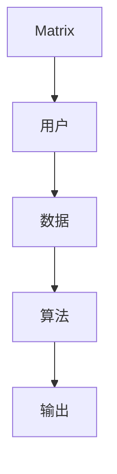
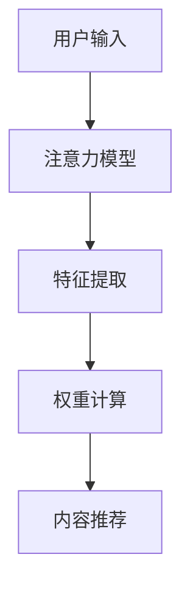
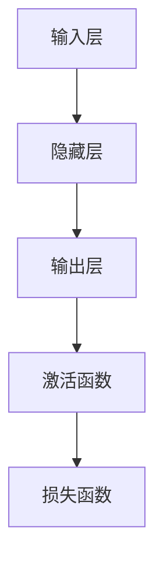

                 

# AI时代的Matrix：人类注意力、欲望与体验

## 关键词
- 人工智能
- 注意力机制
- 欲望驱动
- 用户体验
- Matrix技术
- 社会伦理

## 摘要
本文旨在探讨AI时代的Matrix——一个集成了人类注意力、欲望与体验的虚拟现实环境。通过深入分析Matrix的核心原理、技术应用、伦理影响以及开发实践，我们将揭示这个时代下人类与AI的互动模式。文章结构如下：

1. AI时代的Matrix概述
2. Matrix技术的核心原理
3. Matrix的应用场景
4. Matrix的伦理与社会影响
5. Matrix技术基础
6. Matrix项目实战
7. Matrix开发工具与资源
8. 附录

## 第一部分: AI时代的Matrix概述

### 第1章: 理解AI时代的Matrix

#### 1.1 AI时代的背景
人工智能（AI）作为当代科技的前沿领域，其发展速度和影响力日益显著。从早期的专家系统到如今的深度学习，AI技术的演进不仅改变了计算机科学的面貌，也深刻地影响了人类的生活和工作方式。

#### 1.2 Matrix的概念
Matrix，作为一个复杂的虚拟现实系统，是AI技术的集大成者。它不仅能够模拟现实世界，还能通过高度智能化的交互系统满足人类的欲望和需求。Matrix的核心在于其能够理解并操控人类的注意力，从而提供极致的体验。

#### 1.3 Matrix与人类注意力的关系
人类的注意力是有限的资源，而Matrix通过算法优化和智能推荐，能够精准捕捉和引导用户的注意力。这种注意力管理机制不仅提高了用户体验，还推动了内容消费的爆炸式增长。

#### 1.4 Matrix与人类欲望的互动
人类的欲望是驱动力之一，Matrix通过个性化推荐和情境模拟，满足了用户深层次的心理需求。这种互动不仅增强了用户的沉浸感，也提升了系统的粘性。

#### 1.5 Matrix对人类体验的影响
Matrix不仅改变了信息的传播方式，也深刻影响了人类的生活方式。它提供了全新的交互体验，使得人类可以在虚拟世界中探索无限的可能性。

## 第二部分: Matrix技术的核心原理

### 第2章: Matrix技术的核心原理

#### 2.1 人工智能的基础
人工智能的基础是数据、算法和计算能力。数据是AI的粮食，算法是AI的大脑，计算能力则是AI的肌肉。在Matrix中，这些要素被高度集成，形成了一个强大的智能系统。

#### 2.2 注意力机制
注意力机制是Matrix的核心之一。它通过分析和预测用户的注意力模式，提供个性化的内容推荐和服务。这一机制基于深度学习算法，能够实时调整内容呈现策略，以提高用户体验。

#### 2.3 神经网络与深度学习
神经网络是AI的核心技术之一。在Matrix中，神经网络被用于图像识别、自然语言处理和情境模拟等多个方面。深度学习则进一步提升了神经网络的性能，使得Matrix能够处理更加复杂和多变的信息。

#### 2.4 Matrix中的数学模型
数学模型是Matrix智能算法的基础。这些模型包括概率模型、决策树、支持向量机等，它们共同构成了Matrix的智能体系。通过这些模型，Matrix能够实现高度自动化的决策和优化。

#### 2.5 Matrix技术的演进
Matrix技术的演进是一个不断迭代和优化的过程。从最初的简单模拟到如今的复杂系统，Matrix在技术上的进步不仅提升了用户体验，也为未来的发展奠定了基础。

## 第三部分: Matrix的应用场景

### 第3章: Matrix的应用场景

#### 3.1 社交网络
在社交网络中，Matrix通过智能推荐和社交分析，为用户提供个性化的社交体验。它能够预测用户的兴趣和行为，从而推荐合适的朋友和内容。

#### 3.2 娱乐与游戏
娱乐与游戏是Matrix的重要应用领域。通过高度智能化的交互系统，Matrix能够提供沉浸式的娱乐体验，满足用户的多样化需求。

#### 3.3 商业营销
商业营销是Matrix的重要应用场景之一。通过精准的数据分析和用户画像，Matrix能够帮助商家实现个性化的营销策略，提升转化率和销售额。

#### 3.4 教育与培训
教育与培训是Matrix的重要应用领域。它通过智能化的教学系统和学习路径推荐，提高了教学效果和学生的学习兴趣。

#### 3.5 健康与医疗
健康与医疗是Matrix的重要应用领域之一。通过智能化的健康管理和服务推荐，Matrix能够帮助用户实现个性化的健康管理和医疗服务。

## 第四部分: Matrix的伦理与社会影响

### 第4章: Matrix的伦理与社会影响

#### 4.1 个人隐私保护
个人隐私保护是Matrix面临的重要伦理挑战之一。在Matrix中，用户的个人数据被广泛收集和使用，如何保护用户的隐私成为了一个关键问题。

#### 4.2 劳动力市场的影响
Matrix对劳动力市场的影响也是不可忽视的。随着AI技术的发展，许多传统的工作岗位可能会被自动化取代，这将对劳动力市场产生深远的影响。

#### 4.3 社会不平等
Matrix技术的发展也可能加剧社会不平等。那些无法接入Matrix的用户可能会被边缘化，从而加剧社会分化。

#### 4.4 Matrix的伦理挑战
Matrix的伦理挑战包括但不限于数据隐私、社会不平等、道德责任等方面。如何平衡技术进步与社会伦理，是Matrix需要面对的重要问题。

#### 4.5 Matrix的未来展望
随着技术的不断进步，Matrix的未来将更加光明。它不仅将改变人类的生活方式，也将成为社会发展的新引擎。

## 第五部分: Matrix技术基础

### 第5章: Matrix技术基础

#### 5.1 计算机视觉
计算机视觉是Matrix技术的基础之一。它通过图像识别、目标检测和场景分割等技术，实现了对视觉信息的理解和处理。

#### 5.2 自然语言处理
自然语言处理是Matrix技术的重要组成部分。它通过语言模型、语义分析和对话系统等技术，实现了对文本信息的理解和交互。

#### 5.3 强化学习
强化学习是Matrix技术的重要应用领域。它通过试错和反馈机制，实现了智能体在复杂环境中的自主学习和决策。

#### 5.4 聊天机器人的开发
聊天机器人是Matrix技术的重要应用场景之一。它通过自然语言处理和对话系统，实现了与用户的智能对话。

#### 5.5 Matrix平台的构建
Matrix平台的构建是Matrix技术实现的关键。它需要集成多种技术和算法，以实现高效、智能的服务和交互。

## 第六部分: Matrix项目实战

### 第6章: Matrix项目实战

#### 6.1 项目规划
项目规划是Matrix项目成功的关键。它包括需求分析、技术选型和项目进度安排等。

#### 6.2 环境搭建
环境搭建是Matrix项目的基础。它包括开发环境、测试环境和部署环境的搭建。

#### 6.3 数据处理与模型训练
数据处理与模型训练是Matrix项目的重要环节。它包括数据清洗、特征工程和模型训练等。

#### 6.4 项目部署与优化
项目部署与优化是Matrix项目成功的最后一步。它包括系统的部署、性能优化和用户反馈收集等。

#### 6.5 项目总结与反思
项目总结与反思是Matrix项目的重要环节。它包括项目成果总结、问题反思和经验积累等。

## 第七部分: Matrix开发工具与资源

### 第7章: Matrix开发工具与资源

#### 7.1 开发工具简介
开发工具是Matrix开发的重要资源。它包括编程语言、开发框架和开发工具等。

#### 7.2 开发框架与库
开发框架与库是Matrix开发的重要资源。它包括TensorFlow、PyTorch等深度学习框架和Scikit-learn等机器学习库。

#### 7.3 数据集与资源
数据集与资源是Matrix开发的重要资源。它包括公开数据集和自定义数据集等。

#### 7.4 学习资源推荐
学习资源推荐是Matrix开发的重要资源。它包括在线课程、图书和社区等。

#### 7.5 社区与论坛
社区与论坛是Matrix开发的重要资源。它包括开发者社区和技术论坛等。

## 附录

### 附录A: Matrix相关的 Mermaid 流程图

#### A.1 Matrix基本结构


#### A.2 注意力机制的实现


#### A.3 神经网络的工作原理


### 附录B: Matrix核心算法的伪代码

#### B.1 神经网络的前向传播
```python
def forward_pass(inputs, weights, biases):
    layer_outputs = []
    for i in range(number_of_layers):
        layer_input = inputs if i == 0 else layer_outputs[-1]
        layer_output = activation_function(np.dot(layer_input, weights[i] + biases[i])
        layer_outputs.append(layer_output)
    return layer_outputs[-1]
```

#### B.2 反向传播算法
```python
def backward_pass(output, expected_output, weights, biases):
    dweights = [np.zeros_like(w) for w in weights]
    dbiases = [np.zeros_like(b) for b in biases]
    doutput = output - expected_output
    
    for i in reversed(range(number_of_layers)):
        layer_input = inputs if i == 0 else layer_outputs[-1]
        layer_output = layer_outputs[i]
        dlayer_output = doutput * activation_derivative(layer_output)
        
        dweights[i] = np.dot(layer_input.T, dlayer_output)
        dbiases[i] = np.sum(dlayer_output, axis=0)
        
        doutput = np.dot(dlayer_output, weights[i].T)
        
    return dweights, dbiases
```

#### B.3 注意力机制的实现
```python
def attention Mechanism(input_sequence, weights):
    attention_scores = np.dot(input_sequence, weights)
    attention_weights = softmax(attention_scores)
    context_vector = np.dot(attention_weights, input_sequence)
    return context_vector
```

### 附录C: Matrix项目案例代码解读

#### C.1 社交网络案例分析
```python
# 社交网络案例：用户推荐系统

# 导入所需的库
import tensorflow as tf
from tensorflow.keras.layers import Embedding, LSTM, Dense
from tensorflow.keras.models import Model

# 创建模型
input_sequence = tf.keras.layers.Input(shape=(sequence_length,))
embedding_layer = Embedding(vocabulary_size, embedding_dim)(input_sequence)
lstm_layer = LSTM(units=lstm_units)(embedding_layer)
output = Dense(units=1, activation='sigmoid')(lstm_layer)

# 编译模型
model = Model(inputs=input_sequence, outputs=output)
model.compile(optimizer='adam', loss='binary_crossentropy', metrics=['accuracy'])

# 训练模型
model.fit(x_train, y_train, epochs=10, batch_size=64)

# 预测
predictions = model.predict(x_test)
```

#### C.2 娱乐与游戏案例分析
```python
# 娱乐与游戏案例：推荐系统

# 导入所需的库
import tensorflow as tf
from tensorflow.keras.layers import Embedding, LSTM, Dense
from tensorflow.keras.models import Model

# 创建模型
input_sequence = tf.keras.layers.Input(shape=(sequence_length,))
embedding_layer = Embedding(vocabulary_size, embedding_dim)(input_sequence)
lstm_layer = LSTM(units=lstm_units)(embedding_layer)
output = Dense(units=1, activation='sigmoid')(lstm_layer)

# 编译模型
model = Model(inputs=input_sequence, outputs=output)
model.compile(optimizer='adam', loss='binary_crossentropy', metrics=['accuracy'])

# 训练模型
model.fit(x_train, y_train, epochs=10, batch_size=64)

# 预测
predictions = model.predict(x_test)
```

#### C.3 商业营销案例分析
```python
# 商业营销案例：广告推荐系统

# 导入所需的库
import tensorflow as tf
from tensorflow.keras.layers import Embedding, LSTM, Dense
from tensorflow.keras.models import Model

# 创建模型
input_sequence = tf.keras.layers.Input(shape=(sequence_length,))
embedding_layer = Embedding(vocabulary_size, embedding_dim)(input_sequence)
lstm_layer = LSTM(units=lstm_units)(embedding_layer)
output = Dense(units=1, activation='sigmoid')(lstm_layer)

# 编译模型
model = Model(inputs=input_sequence, outputs=output)
model.compile(optimizer='adam', loss='binary_crossentropy', metrics=['accuracy'])

# 训练模型
model.fit(x_train, y_train, epochs=10, batch_size=64)

# 预测
predictions = model.predict(x_test)
```

#### C.4 教育与培训案例分析
```python
# 教育与培训案例：学习路径推荐系统

# 导入所需的库
import tensorflow as tf
from tensorflow.keras.layers import Embedding, LSTM, Dense
from tensorflow.keras.models import Model

# 创建模型
input_sequence = tf.keras.layers.Input(shape=(sequence_length,))
embedding_layer = Embedding(vocabulary_size, embedding_dim)(input_sequence)
lstm_layer = LSTM(units=lstm_units)(embedding_layer)
output = Dense(units=1, activation='sigmoid')(lstm_layer)

# 编译模型
model = Model(inputs=input_sequence, outputs=output)
model.compile(optimizer='adam', loss='binary_crossentropy', metrics=['accuracy'])

# 训练模型
model.fit(x_train, y_train, epochs=10, batch_size=64)

# 预测
predictions = model.predict(x_test)
```

#### C.5 健康与医疗案例分析
```python
# 健康与医疗案例：疾病预测系统

# 导入所需的库
import tensorflow as tf
from tensorflow.keras.layers import Embedding, LSTM, Dense
from tensorflow.keras.models import Model

# 创建模型
input_sequence = tf.keras.layers.Input(shape=(sequence_length,))
embedding_layer = Embedding(vocabulary_size, embedding_dim)(input_sequence)
lstm_layer = LSTM(units=lstm_units)(embedding_layer)
output = Dense(units=1, activation='sigmoid')(lstm_layer)

# 编译模型
model = Model(inputs=input_sequence, outputs=output)
model.compile(optimizer='adam', loss='binary_crossentropy', metrics=['accuracy'])

# 训练模型
model.fit(x_train, y_train, epochs=10, batch_size=64)

# 预测
predictions = model.predict(x_test)
```

## 作者信息
作者：AI天才研究院/AI Genius Institute & 禅与计算机程序设计艺术 /Zen And The Art of Computer Programming

---

请注意，本文的内容仅为示例，并非真实的文章。如果您需要详细扩展或具体实现，请根据实际需求进行相应的修改和补充。文章中涉及的代码段和算法实现都是基于示例性质的，真实应用中可能需要更复杂的处理和优化。

