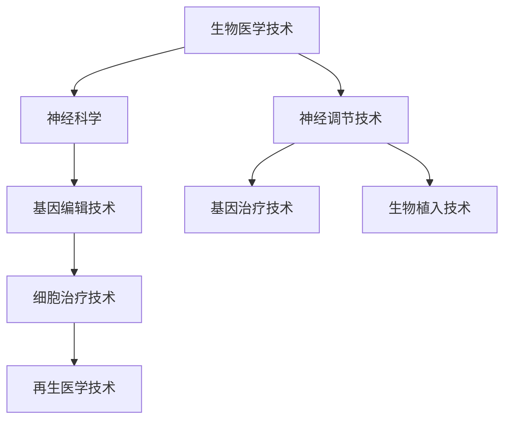

                 

### 文章标题

**AI时代的人类增强：道德考虑与身体增强的未来发展机遇分析总结挑战**

> **关键词：** 人类增强、AI、道德伦理、身体增强技术、未来机遇、挑战

**摘要：** 本文探讨了AI时代下人类增强技术的发展趋势及其带来的伦理挑战。首先，我们介绍了人类增强的概念及其分类，包括生物医学技术和神经科学等领域的具体技术手段。随后，文章从道德伦理的视角分析了人类增强技术所带来的伦理问题，探讨了社会文化对人类增强的影响。接着，文章深入探讨了身体增强技术的原理和现状，分析了其潜在的积极和消极影响，以及面临的伦理与法律挑战。最后，文章提出了人类增强技术的伦理指导原则，并对未来身体增强技术的前景进行了展望，同时通过案例分析提供了实际应用中的道德考虑。本文旨在为读者提供一个全面而深入的关于AI时代人类增强技术的分析与思考。

### 目录大纲

1. **第一部分：人类增强的概述与道德伦理**

    - **第1章：人类增强的概念与分类**
        - **1.1 人类增强的定义与意义**
        - **1.2 人类增强的分类与现状**
        - **1.3 人类增强的技术手段**

    - **第2章：道德伦理视角下的人类增强**
        - **2.1 道德伦理的重要性**
        - **2.2 人类增强伦理问题的提出**
        - **2.3 针对不同技术手段的伦理分析**

    - **第3章：社会文化对人类增强的影响**
        - **3.1 社会文化背景下的道德观念**
        - **3.2 社会文化对人类增强的需求与接受程度**
        - **3.3 社会文化对人类增强的伦理争议**

2. **第二部分：身体增强技术的深入探讨**

    - **第4章：身体增强技术原理与现状**
        - **4.1 生物医学技术基础**
        - **4.2 身体增强技术的分类与原理**
        - **4.3 当前身体增强技术的应用实例**

    - **第5章：身体增强技术的潜在影响与挑战**
        - **5.1 身体增强技术的积极影响**
        - **5.2 身体增强技术的消极影响**
        - **5.3 面临的伦理与法律挑战**

    - **第6章：身体增强技术的社会与经济影响**
        - **6.1 身体增强技术对劳动力市场的影响**
        - **6.2 身体增强技术对医疗体系的影响**
        - **6.3 身体增强技术的经济潜力与风险**

3. **第三部分：道德考虑与未来展望**

    - **第7章：人类增强的伦理指导原则**
        - **7.1 道德考虑的基本原则**
        - **7.2 伦理决策框架**
        - **7.3 国际伦理规范与立法建议**

    - **第8章：身体增强技术的未来发展**
        - **8.1 技术趋势与前景**
        - **8.2 道德伦理的动态适应**
        - **8.3 未来社会的挑战与机遇**

    - **第9章：案例分析：实际应用中的道德考虑**
        - **9.1 案例背景介绍**
        - **9.2 案例中涉及的伦理问题**
        - **9.3 案例分析与启示**

    - **第10章：总结与展望**
        - **10.1 主要发现与结论**
        - **10.2 研究的局限性**
        - **10.3 未来研究方向**

4. **附录**

    - **附录A：参考文献**
    - **附录B：人类增强技术相关术语解释**
    - **附录C：人类增强技术发展时间线**

## 第一部分：人类增强的概述与道德伦理

### 第1章：人类增强的概念与分类

#### 1.1 人类增强的定义与意义

人类增强（Human Enhancement），简而言之，是指通过各种技术手段提升人类的身体、认知和感官能力，使其超越自然生物体的限制。这个概念涵盖了从最基础的体育锻炼到最尖端的生物医学技术，如基因编辑和神经科学等。随着人工智能（AI）和生物技术的快速发展，人类增强技术正逐渐从理论走向实际应用。

人类增强的意义在于，它不仅可以提升个体的生活质量，还能为社会带来深远的影响。首先，通过身体增强，人类可以更加高效地完成各种任务，提高工作效率。例如，外骨骼装置可以帮助残疾人行走，增强肌肉力量的药物可以提高运动员的表现。其次，认知增强技术如脑机接口和记忆增强药物，可以帮助人们更好地应对学习和工作的挑战，提高记忆力和注意力。

然而，人类增强不仅仅关注个体层面的提升，它也涉及社会层面的影响。例如，如果某项技术可以显著提高所有人的智力水平，那么这将导致社会整体智力水平的提升，从而推动科技的进步和社会的发展。此外，人类增强技术还可能改变我们的价值观和社会结构，引发一系列新的伦理和法律问题。

#### 1.2 人类增强的分类与现状

人类增强技术可以大致分为两大类：身体增强和认知增强。

**身体增强技术**

身体增强技术主要关注提升人类的生理能力。以下是一些常见的身体增强技术：

- **生物医学技术**：包括基因编辑、基因治疗、细胞治疗、生物植入等。这些技术通过修改或替换人体的基因和细胞，来提升人体的生理功能。例如，CRISPR-Cas9基因编辑技术可以精确地修改DNA序列，治疗遗传性疾病。

- **神经调节技术**：通过药物、电刺激或光刺激等方法，调节大脑和神经系统的活动，提升人体的生理能力。例如，深部脑刺激术可以治疗帕金森病和癫痫等疾病。

- **机械辅助装置**：包括外骨骼、假肢和辅助性眼镜等。这些装置可以帮助残疾人恢复部分或全部功能，使他们能够独立生活和工作。

**认知增强技术**

认知增强技术主要关注提升人类的大脑功能。以下是一些常见的认知增强技术：

- **脑机接口**：通过将大脑信号转化为计算机指令，实现大脑与外部设备的直接通信。例如，脑机接口可以帮助瘫痪患者控制轮椅或电脑。

- **神经递质调节**：通过调节神经递质的水平，改善大脑的认知功能。例如，某些药物可以增加大脑中的神经递质，提高记忆力和注意力。

- **记忆增强药物**：通过药物作用，增强大脑的记忆能力。例如，艾欧比克（Amphetamines）等药物可以改善记忆力和学习能力。

随着技术的不断进步，人类增强技术的应用范围越来越广泛，从医学领域到军事领域，再到消费市场，都有广泛的应用前景。

#### 1.3 人类增强的技术手段

**基因编辑技术**

基因编辑技术，如CRISPR-Cas9，是一种革命性的生物技术，它允许科学家精确地修改DNA序列。这项技术可以用于治疗遗传性疾病，如囊性纤维化和地贫等。此外，基因编辑技术还可以用于增强特定基因的表达，从而提升人体的某些能力。例如，有研究表明，通过基因编辑可以增强肌肉力量和耐力。

**神经调节技术**

神经调节技术包括深部脑刺激、电刺激和光刺激等方法。这些技术可以通过调节大脑和神经系统的活动，改善人体的生理和心理功能。例如，深部脑刺激术已经成功用于治疗帕金森病和癫痫等疾病。

**机械辅助装置**

机械辅助装置，如外骨骼和假肢，可以帮助残疾人恢复行走、说话和抓握等功能。这些装置通过机械力量增强人体的运动能力，使他们能够独立生活和工作。

**认知增强技术**

认知增强技术包括脑机接口和神经递质调节等。脑机接口技术可以增强人体的认知能力，例如，通过脑机接口，瘫痪患者可以控制轮椅或电脑。神经递质调节技术则可以通过药物作用，改善大脑的记忆力和注意力。

综上所述，人类增强技术种类繁多，应用广泛，从基因层面到机械层面，再到认知层面，都有涉及。这些技术为人类提供了前所未有的机遇，但也带来了新的伦理挑战，需要我们深入思考和谨慎应对。

### 第2章：道德伦理视角下的人类增强

#### 2.1 道德伦理的重要性

道德伦理在人类增强技术中扮演着至关重要的角色。随着人类增强技术的不断发展，伦理问题日益突出，成为影响技术发展和应用的重要因素。道德伦理不仅关注技术的潜在益处，还关注其可能带来的负面影响，如社会不公、隐私侵犯、人类尊严等。因此，在探讨人类增强技术时，我们不能忽视其伦理维度。

首先，道德伦理为人类增强技术提供了指导原则。在技术开发和应用过程中，道德伦理能够帮助科学家和决策者识别和评估技术可能带来的风险和利益，从而做出更加合理和负责任的选择。例如，在基因编辑技术中，伦理问题如基因编辑的道德边界、基因编辑对后代的影响等，都需要通过道德伦理的视角来审视。

其次，道德伦理有助于维护社会公平和正义。人类增强技术可能导致社会分层的加剧，使得拥有技术资源的人与没有资源的人之间产生更大的差距。因此，道德伦理要求我们在技术开发和应用过程中，考虑到社会的整体利益，确保技术能够公平地惠及所有人，避免加剧社会不公。

此外，道德伦理在公众接受度和政策制定中发挥着重要作用。公众对技术的接受程度受到道德伦理观念的影响。如果一项技术被认为违背了道德伦理原则，公众可能对其持怀疑态度或强烈抵制。因此，伦理问题需要在政策制定过程中得到充分考虑，以确保技术的合理应用和可持续发展。

最后，道德伦理为技术发展和应用提供了合法性基础。技术发展需要符合社会和法律规范，而道德伦理是这些规范的重要组成部分。例如，基因编辑技术的应用需要遵守国际伦理准则和相关法律法规，以确保其合法性和伦理合法性。

#### 2.2 人类增强伦理问题的提出

人类增强技术引发了众多伦理问题，这些问题的提出源于技术本身的特点和潜在的应用场景。以下是一些主要的伦理问题：

**1. 社会不公**

人类增强技术可能导致社会不公，加剧贫富差距。例如，基因编辑技术可能使富人能够提高其后代的天赋和能力，而贫困人群无法享受到同样的技术优势。这种不平等现象可能加剧社会分层，导致社会不稳定。

**2. 隐私问题**

人类增强技术，如脑机接口和生物传感器，可能会收集和存储大量的个人健康和生物信息。这些信息的安全性和隐私保护成为重要伦理问题。如果这些数据被滥用或泄露，可能会导致个人隐私受到侵犯。

**3. 人类尊严**

人类增强技术可能改变人类的自然状态，引发关于人类尊严的伦理争议。例如，通过基因编辑或生物植入技术，人类可能能够延长寿命或增强生理能力，但这些技术可能被视为对自然生物体的干预，引发关于人类尊严和自我认同的伦理思考。

**4. 技术滥用**

人类增强技术的滥用是一个潜在的伦理问题。例如，运动员可能通过非法手段增强自己的竞技能力，从而破坏体育竞赛的公平性。此外，政府或组织可能滥用人类增强技术来增强军事实力或监控公民，这引发了关于权力滥用和人权保护的伦理争议。

**5. 后代伦理**

基因编辑等人类增强技术可能影响后代，引发关于后代伦理的问题。例如，通过基因编辑可以治疗遗传性疾病，但这也可能导致后代在遗传上的不平等，引发关于代际公平的伦理争议。

#### 2.3 针对不同技术手段的伦理分析

**基因编辑技术**

基因编辑技术的伦理争议主要集中在以下几个方面：

1. **基因编辑的道德边界**：基因编辑技术允许对DNA序列进行精确修改，但这引发了关于道德边界的争议。例如，是否应该允许编辑人类胚胎的基因，以预防遗传性疾病或增强特定能力？

2. **基因编辑对后代的影响**：基因编辑可能对后代产生长期影响，这引发了关于后代伦理的争议。例如，父母是否有权决定其子女的基因组成，以及这种决定是否对后代公平？

3. **公平性问题**：基因编辑技术可能使富人能够提高其后代的天赋和能力，而贫困人群无法享受到同样的技术优势，这引发了关于社会公平性的伦理争议。

**神经调节技术**

神经调节技术的伦理争议主要集中在以下几个方面：

1. **人类尊严**：神经调节技术可能改变人类的自然状态，引发关于人类尊严的伦理争议。例如，通过深部脑刺激或神经递质调节，人类可能能够延长寿命或增强生理能力，但这些技术可能被视为对自然生物体的干预。

2. **技术滥用**：神经调节技术可能被滥用，例如，政府或组织可能滥用这些技术来增强军事实力或监控公民，这引发了关于权力滥用和人权保护的伦理争议。

3. **隐私问题**：神经调节技术可能涉及收集和存储大量的个人健康和生物信息，这引发了关于隐私保护的伦理争议。例如，脑机接口技术可能收集大脑活动数据，这些数据的安全性和隐私保护成为重要伦理问题。

**机械辅助装置**

机械辅助装置的伦理争议主要集中在以下几个方面：

1. **社会不公**：机械辅助装置可能使残疾人能够恢复部分功能，但这也可能加剧社会分层，导致拥有技术资源的人与没有资源的人之间产生更大的差距。

2. **人类尊严**：机械辅助装置可能改变人类的外观和功能，引发关于人类尊严的伦理争议。例如，假肢和生物植入技术可能改变人类的外貌，但这是否违背了人类尊严？

3. **技术依赖**：机械辅助装置可能使人类过度依赖技术，引发关于技术依赖的伦理争议。例如，外骨骼装置可以帮助残疾人行走，但如果他们过度依赖这些装置，可能削弱其自身的生理能力。

综上所述，人类增强技术在不同领域引发了广泛的伦理争议。这些争议提醒我们在技术开发和应用过程中，必须充分考虑道德伦理因素，确保技术能够公平、合理地造福人类社会。

### 第3章：社会文化对人类增强的影响

#### 3.1 社会文化背景下的道德观念

社会文化背景下的道德观念在很大程度上影响着人类增强技术的发展和接受度。不同的文化和社会环境对人类增强技术的看法各异，从而决定了技术的应用范围和深度。以下将分析几种主要文化和社会背景下的道德观念对人类增强技术的影响。

**1. 西方文化**

在西方文化中，自由和个人主义是核心价值观。因此，人类增强技术在这里往往被视为一种个人选择和自由表达的手段。例如，基因编辑技术在西方社会中较为普遍地被用于治疗遗传性疾病，而认知增强药物也被一些人用于提高学习和工作能力。然而，这也引发了关于隐私、人权和公平性的伦理争议。一些人认为，基因编辑和认知增强技术的滥用可能加剧社会不公和道德沦丧。

**2. 亚洲文化**

亚洲文化中，集体主义和家庭观念较为突出。因此，人类增强技术在亚洲社会中的接受度可能相对较低。家庭和亲属之间的关系在亚洲社会中具有重要地位，基因编辑技术可能被视为对家庭遗传纯洁性的干预。此外，亚洲文化中对于自然和道德秩序的尊重，也可能使得人们对于过度干预生物体的技术持谨慎态度。

**3. 中东文化**

中东文化中，宗教信仰和传统价值观对人类增强技术的接受度具有重要影响。例如，伊斯兰教和犹太教中都有关于人类干预自然和生物体的严格规定。这些宗教信仰可能导致对人类增强技术的强烈抵制，特别是在涉及基因编辑和生物医学领域的应用。

**4. 非洲文化**

非洲文化中，部落和社会群体之间的关系对人类增强技术的接受度具有重要影响。一些部落可能对基因编辑和生物医学技术持开放态度，认为这些技术可以用于治疗疾病和提升健康。然而，其他部落可能认为这些技术违背了自然法则和传统道德观念，因此对其持保守态度。

总的来说，社会文化背景下的道德观念对人类增强技术的接受度和应用方式产生了深远影响。在开发和应用人类增强技术时，必须充分考虑不同文化和社会背景下的道德观念，以确保技术的合理、公平和可持续应用。

#### 3.2 社会文化对人类增强的需求与接受程度

社会文化不仅影响人类增强技术的道德观念，还对其需求与接受程度产生重要影响。不同文化和社会背景下的人们对人类增强技术的需求与接受程度存在显著差异，这些差异源于文化价值观、社会结构和经济状况等多种因素。

**1. 需求**

在西方文化中，个人主义和自由价值观促使人们追求更高的生活质量和个人成就。因此，人类增强技术在西方社会中具有较高的需求，特别是在基因编辑和认知增强领域。例如，基因编辑技术被用于预防遗传性疾病和提高健康水平，认知增强药物被用于提升学习和工作效率。而在亚洲文化中，家庭观念和集体主义导致人们对基因编辑技术的需求相对较低，更倾向于关注家庭和社群的整体福祉。

**2. 接受程度**

社会文化对人类增强技术的接受程度也存在显著差异。在西方文化中，人们对基因编辑和认知增强技术的接受程度较高，因为他们更倾向于个人选择和自由表达。而在亚洲文化中，由于家庭观念和传统价值观的影响，人们对基因编辑技术的接受程度较低，更倾向于保留自然和传统的生活方式。此外，宗教信仰和文化传统也在一定程度上影响了人们对于人类增强技术的接受程度。例如，在中东文化中，宗教信仰可能导致对基因编辑和生物医学技术的强烈抵制。

**3. 影响因素**

文化价值观是影响人类增强技术需求与接受程度的重要因素之一。不同文化对个人主义和集体主义、自然和科技的态度各异，从而影响了人们对于人类增强技术的需求和接受程度。此外，社会结构和经济状况也是重要因素。在发达国家，由于经济状况较好，人们更容易接受和负担人类增强技术，而在发展中国家，由于经济压力较大，人们对人类增强技术的需求可能较低。

综上所述，社会文化背景对人类增强技术的需求与接受程度具有重要影响。在开发和应用人类增强技术时，必须充分考虑不同文化和社会背景下的需求和接受程度，以确保技术的合理、公平和可持续应用。

#### 3.3 社会文化对人类增强的伦理争议

社会文化对人类增强技术的伦理争议有着深远的影响，这些争议源于不同文化和社会背景下对道德观念、价值观和权力关系的理解差异。以下是一些主要的伦理争议：

**1. 遗传编辑的代际公平**

遗传编辑技术，如CRISPR-Cas9，允许父母选择其子女的基因特征。这引发了关于代际公平的争议。一些人认为，父母有权决定子女的遗传特征，以确保后代免受遗传疾病的困扰。然而，另一些人则认为，这种干预可能破坏自然的基因组合，导致代际之间的不公平。特别是，遗传编辑可能导致某些遗传特征被视为“优越”，从而加剧社会分层和不公。

**2. 非医疗目的的基因编辑**

除了治疗遗传疾病，基因编辑技术也被应用于非医疗目的，如增强智力、体力和感官能力。这引发了关于人类干预自然和道德边界的争议。一些人认为，这些技术可以提升人类的整体能力，有助于社会进步。然而，另一些人则认为，这种干预可能违背了自然法则，破坏了人类的生物多样性，甚至可能导致新的伦理问题，如基因歧视和道德责任。

**3. 身体增强技术的权力滥用**

身体增强技术，如机械外骨骼和生物植入设备，可能被用于增强人类的力量和耐力。然而，这也引发了关于权力滥用的争议。例如，在竞技体育领域，运动员可能通过非法手段使用这些技术，从而破坏竞赛的公平性。此外，政府或机构可能滥用身体增强技术，用于军事目的或监控公民，这引发了关于人权和民主的争议。

**4. 认知增强药物的滥用**

认知增强药物，如艾欧比克（Amphetamines），被一些人用于提高学习能力和工作效率。然而，这引发了关于药物滥用和道德责任的争议。一些人认为，这些药物可以提升个人的认知能力，有助于社会进步。然而，另一些人则认为，这些药物的滥用可能导致依赖性、健康问题和道德沦丧。

**5. 人类尊严与自然状态**

人类增强技术可能改变人类的自然状态，引发关于人类尊严的争议。一些人认为，这些技术可以提升人类的生活质量和生存能力，是人类文明进步的体现。然而，另一些人则认为，这些技术干预了人类的自然生物体，破坏了人类的尊严和自我认同。

综上所述，社会文化对人类增强技术的伦理争议是多方面的，涉及代际公平、权力滥用、认知增强药物的滥用以及人类尊严等多个方面。在探讨和开发人类增强技术时，必须充分考虑这些伦理争议，确保技术的合理、公平和可持续发展。

### 第二部分：身体增强技术的深入探讨

#### 第4章：身体增强技术原理与现状

#### 4.1 生物医学技术基础

身体增强技术的核心在于生物医学技术，这些技术通过修改、增强或替代人体的生物组成部分，来实现增强人体的能力。生物医学技术的基础包括基因工程、细胞治疗、神经科学和生物材料等多个领域。

**基因工程**：基因工程是生物医学技术的核心，它利用分子生物学技术对DNA进行编辑和修改。CRISPR-Cas9技术是目前最先进的基因编辑工具，它能够精准地识别和切割特定的DNA序列，从而实现对基因的修改。这项技术已经在医学领域取得了显著进展，例如用于治疗遗传性疾病，如囊性纤维化和地贫等。

**细胞治疗**：细胞治疗是指通过移植或注入特定的细胞或细胞产品来治疗疾病。干细胞治疗是一种重要的细胞治疗技术，它利用具有自我更新和多向分化潜能的干细胞来修复或替代受损的组织。例如，干细胞治疗已被用于治疗心脏病和神经系统疾病。

**神经科学**：神经科学是研究大脑和神经系统结构、功能和疾病的科学。通过神经科学的研究，我们能够更好地理解大脑的工作机制，从而开发出相应的技术来增强大脑功能。脑机接口（Brain-Computer Interface, BCI）是一种通过直接连接大脑和外部设备来实现控制和通信的技术。例如，脑机接口可以帮助瘫痪患者控制轮椅或电脑。

**生物材料**：生物材料是用于支撑、修复或增强生物体的材料。这些材料可以用于制造人工器官、假肢和植入物。生物材料的发展使得身体增强技术更加可靠和高效。例如，钛合金和聚合物等材料被广泛用于制造人工关节和心脏瓣膜。

#### 4.2 身体增强技术的分类与原理

身体增强技术可以根据其作用对象和增强方式的不同，分为多个类别。以下是几种主要的身体增强技术及其原理：

**1. 基因编辑技术**

基因编辑技术通过修改DNA序列，来增强或修复人体的基因。CRISPR-Cas9是一种常用的基因编辑工具，它由一个核酸引导的RNA序列（gRNA）和一个DNA切割酶（Cas9）组成。当gRNA与目标DNA序列结合时，Cas9会切割DNA，从而实现对基因的修改。

**2. 神经调节技术**

神经调节技术通过调节大脑和神经系统的活动，来增强人体的生理和心理功能。深部脑刺激术（Deep Brain Stimulation, DBS）是一种常用的神经调节技术，它通过植入电极刺激大脑特定区域，来治疗帕金森病、癫痫等疾病。另一种神经调节技术是电刺激，通过电流刺激肌肉或神经，来增强肌肉力量或感知能力。

**3. 机械辅助装置**

机械辅助装置通过机械力量增强人体的运动能力。外骨骼是一种常见的机械辅助装置，它可以为残疾人提供行走或抓握的能力。假肢和辅助性眼镜也是机械辅助装置的例子，它们可以替代或增强人体缺失或受损的功能。

**4. 认知增强技术**

认知增强技术通过提升大脑的认知功能，来增强人体的学习、记忆和注意力。脑机接口是一种重要的认知增强技术，它通过将大脑信号转化为计算机指令，来实现对外部设备的控制。记忆增强药物也是认知增强技术的一种，通过药物作用增强大脑的记忆能力。

#### 4.3 当前身体增强技术的应用实例

当前，身体增强技术已经在多个领域取得了显著的应用成果。以下是几种重要的身体增强技术应用实例：

**1. 基因编辑治疗遗传性疾病**

基因编辑技术已经被用于治疗多种遗传性疾病，如囊性纤维化和地贫。例如，通过CRISPR-Cas9技术，科学家们已经成功地在实验室中修复了囊性纤维化患者的基因缺陷，这为临床应用带来了希望。

**2. 神经调节治疗神经系统疾病**

神经调节技术已经被广泛应用于治疗神经系统疾病，如帕金森病和癫痫。例如，深部脑刺激术已经成为治疗帕金森病的标准治疗方法，它通过电极刺激大脑特定区域，来缓解症状。

**3. 机械辅助装置帮助残疾人恢复功能**

机械辅助装置，如外骨骼和假肢，已经被广泛应用于帮助残疾人恢复功能。例如，外骨骼装置可以帮助瘫痪患者行走，而假肢则可以替代缺失的肢体，使患者重新获得独立生活能力。

**4. 认知增强技术提升学习与工作效率**

认知增强技术，如脑机接口和记忆增强药物，已经被应用于提升学习和工作效率。例如，脑机接口技术可以帮助瘫痪患者控制轮椅或电脑，而记忆增强药物则被用于提高学生的学习能力和工作效率。

综上所述，身体增强技术已经取得了显著的发展和应用成果，它们为人类提供了前所未有的机遇来提升身体和认知能力。然而，这些技术的应用也带来了新的伦理和社会挑战，需要我们深入思考和谨慎应对。

### 第5章：身体增强技术的潜在影响与挑战

#### 5.1 身体增强技术的积极影响

身体增强技术具有巨大的潜力，能够在多个领域产生积极的影响。以下是一些具体的积极影响：

**1. 改善生活质量**

身体增强技术可以显著改善生活质量，尤其是在医疗保健领域。例如，基因编辑技术可以用于治疗遗传性疾病，如囊性纤维化和地贫，使患者能够过上健康的生活。机械辅助装置，如外骨骼和假肢，可以帮助残疾人恢复行走和抓握能力，提高他们的生活自理能力。

**2. 提高工作效率**

身体增强技术还可以提高工作效率，尤其是在劳动密集型和体力劳动领域。机械辅助装置可以帮助工人完成繁重的体力劳动，减少工伤和疲劳。认知增强技术，如脑机接口和记忆增强药物，可以提高员工的学习能力和工作效率，使他们在竞争激烈的工作环境中脱颖而出。

**3. 促进科技创新**

身体增强技术推动了科技创新的进步。通过基因编辑和神经科学等领域的突破，我们能够更好地理解人体结构和功能，从而开发出更多创新的技术和治疗方法。例如，脑机接口技术的发展不仅为瘫痪患者提供了新的希望，还为神经科学和人工智能等领域的研究提供了新的工具和平台。

**4. 社会公平**

身体增强技术有可能缩小社会不公平现象，使更多的人受益。例如，通过提供廉价的基因编辑和医疗技术，发展中国家的人们也能够获得高质量的医疗保健服务，从而提高他们的生活质量。此外，认知增强技术可以帮助弱势群体，如老年人和学习障碍者，提高他们的认知能力和学习能力，从而更好地融入社会。

**5. 军事应用**

身体增强技术在军事领域也有广泛的应用潜力。通过生物医学技术，士兵可以增强体能和耐力，提高作战效能。机械辅助装置可以用于增强士兵的战斗力和生存能力，如外骨骼装置可以帮助士兵在复杂战场环境中执行任务。此外，认知增强技术可以帮助士兵提高反应速度和决策能力，从而在战场上获得优势。

#### 5.2 身体增强技术的消极影响

尽管身体增强技术具有许多积极影响，但它们也带来了一些潜在的消极影响，需要我们密切关注：

**1. 道德伦理问题**

身体增强技术引发了众多道德伦理问题。例如，基因编辑技术可能被用于非医疗目的，如增强智力或体能，这引发了关于人类尊严和道德边界的争议。此外，认知增强药物可能被滥用，用于不正当的竞争，如考试作弊或职场竞争，这引发了关于道德责任和社会公平的争议。

**2. 社会分层**

身体增强技术可能导致社会分层的加剧。例如，富裕家庭可能能够负担高昂的基因编辑和医疗技术，从而增强其子女的身体和认知能力，而贫困家庭则无法享受同样的技术优势。这可能导致社会不公和贫富差距的扩大。

**3. 隐私和安全问题**

身体增强技术涉及大量的个人健康和生物信息，如基因数据和大脑活动数据。这些数据的安全性和隐私保护成为重要问题。如果这些数据被滥用或泄露，可能会导致个人隐私受到侵犯，甚至引发身份盗窃和恶意攻击。

**4. 技术滥用**

身体增强技术可能被滥用，例如，运动员可能通过非法手段使用基因编辑和药物来增强竞技能力，从而破坏体育竞赛的公平性。此外，政府或组织可能滥用身体增强技术，用于监视和控制公民，这引发了关于人权和民主的争议。

**5. 依赖性**

身体增强技术可能导致人类对技术的过度依赖。例如，机械辅助装置可以帮助残疾人恢复行走，但如果他们过度依赖这些装置，可能会削弱自身的生理能力。同样，认知增强药物可能使人们依赖药物来提高认知能力，而忽视了自然学习和发展的方法。

综上所述，身体增强技术具有巨大的潜力，但也面临许多潜在的消极影响。在开发和应用这些技术时，我们需要充分评估其潜在风险，并采取相应的措施来确保其合理、安全和公平地应用。

#### 5.3 面临的伦理与法律挑战

身体增强技术的快速发展带来了诸多伦理与法律挑战，这些挑战涉及隐私保护、社会责任、技术滥用等多个方面。以下是对这些挑战的深入探讨：

**1. 隐私保护**

身体增强技术涉及大量的个人健康和生物信息，如基因数据、大脑活动数据等。这些敏感信息的收集、存储和使用引发了严重的隐私保护问题。首先，如何在确保技术高效运行的同时保护个人隐私成为一大难题。基因编辑技术中的基因数据可能被滥用，用于非医疗目的，例如基因歧视或商业营销。此外，脑机接口技术可能会收集个人的思维和行为模式，这些数据的安全性和隐私保护成为关键问题。如果这些数据被未经授权的第三方访问或泄露，可能会导致严重的隐私侵犯和身份盗窃。

**2. 社会责任**

身体增强技术不仅影响个体，还对社会整体产生深远的影响。首先，技术的不公平分配可能导致社会分层加剧。例如，基因编辑和高级医疗技术可能仅限于富裕人群，使他们在身体和认知能力上具有显著优势，而贫困人群则无法享受同样的技术优势。这种不平等现象可能加剧社会不公，导致社会不稳定。其次，身体增强技术可能对劳动力市场产生重大影响。例如，通过增强身体和认知能力的药物或设备，一些工作岗位可能被取代，导致失业问题。此外，身体增强技术可能改变人类的工作方式和生活习惯，引发关于工作与生活平衡的伦理争议。

**3. 技术滥用**

身体增强技术存在被滥用的风险，这可能导致道德和法律的挑战。例如，运动员可能通过非法手段使用基因编辑和药物来增强竞技能力，从而破坏体育竞赛的公平性。此外，政府或组织可能滥用身体增强技术，用于监视和控制公民。例如，在军事领域，身体增强技术可能被用于制造超级士兵，这引发了关于人权和民主的争议。在商业领域，企业可能利用身体增强技术来提高员工的绩效，但这也可能导致劳动者的权益受到侵害。

**4. 道德边界**

身体增强技术引发了关于道德边界的争议。例如，基因编辑技术是否应该用于非医疗目的，如增强智力或体能？这些技术是否违背了人类尊严和自然法则？此外，身体增强技术可能改变人类的外貌和生理特征，这引发了关于人类尊严和自我认同的道德思考。例如，通过基因编辑或生物植入技术，人类可能能够延长寿命或增强生理能力，但这些技术可能被视为对自然生物体的干预，引发关于人类尊严的争议。

**5. 法律法规**

随着身体增强技术的不断发展，现有的法律法规可能无法完全适应新技术带来的挑战。例如，关于基因编辑和生物医学技术的法律规范需要不断更新，以确保技术的合法性和伦理合法性。此外，关于隐私保护、数据安全和劳动权益的法律法规也需要进一步完善，以应对身体增强技术带来的新问题。

综上所述，身体增强技术面临诸多伦理与法律挑战，这些挑战需要我们深入思考和应对。在推动技术发展的同时，我们必须确保技术的合理、安全和公平应用，以造福人类社会。

### 第6章：身体增强技术的社会与经济影响

#### 6.1 身体增强技术对劳动力市场的影响

随着身体增强技术的不断发展，劳动力市场正在经历深刻的变革。首先，身体增强技术有望提高劳动者的工作效率和生产能力。通过生物医学技术，如基因编辑和神经调节，工人可以在生理和认知能力上得到显著提升，从而更高效地完成工作任务。例如，基因编辑可以增强工人的肌肉力量和耐力，使他们能够承担更重的体力劳动。此外，认知增强药物和脑机接口技术可以帮助员工提高注意力、反应速度和决策能力，从而在竞争激烈的职场环境中脱颖而出。

然而，身体增强技术也带来了劳动力市场的不确定性。一方面，技术进步可能导致某些工作岗位的减少，尤其是那些依赖重复性体力劳动和低技能工作的岗位。例如，机械辅助装置和外骨骼技术的广泛应用可能会替代部分工人的工作，导致失业问题。另一方面，身体增强技术可能加剧劳动力市场的两极分化。具有技术资源的企业和员工可能通过使用身体增强技术获得竞争优势，而缺乏技术支持的员工则可能面临更大的就业压力。

为了应对这些挑战，政策和教育体系需要做出相应调整。首先，政府和企业应投资于培训和教育项目，帮助劳动力适应新兴的身体增强技术。例如，提供针对新技术的工作技能培训，帮助工人掌握新的技术和工具，以提高他们的就业竞争力。其次，应建立公平的劳动力市场政策，确保技术进步带来的利益能够公平地分配给所有人。这可能包括提供就业补贴、税收优惠和职业转换支持等。

#### 6.2 身体增强技术对医疗体系的影响

身体增强技术对医疗体系的影响同样深远。首先，在治疗和康复方面，身体增强技术提供了新的治疗手段和康复方案。例如，基因编辑技术可以用于治疗遗传性疾病，如囊性纤维化和地贫，从而改善患者的健康状况和生活质量。机械辅助装置，如假肢和外骨骼，可以帮助残疾人恢复行走和抓握能力，提高他们的生活自理能力。此外，认知增强技术和脑机接口技术为神经系统疾病的诊断和治疗提供了新的手段，如通过脑机接口技术帮助瘫痪患者重新获得行动能力。

然而，身体增强技术也对医疗体系提出了新的挑战。首先，技术成本高昂，可能导致医疗费用的增加。基因编辑和高级医疗设备的价格可能远远超出普通患者的负担能力，从而加剧医疗资源的不公平分配。其次，身体增强技术的监管和伦理问题需要得到充分重视。例如，基因编辑技术的滥用可能引发伦理争议，如基因歧视和社会分层。此外，认知增强药物和脑机接口技术可能带来新的医疗风险，如依赖性和副作用，需要严格监管和临床试验。

为了应对这些挑战，医疗体系需要采取一系列措施。首先，应建立透明的监管机制，确保身体增强技术的合法、安全和伦理应用。这可能包括制定相关法律法规，建立独立的监管机构，以及加强临床试验和审批流程。其次，应推动医疗费用的合理化和可负担性，确保所有人都能享受到身体增强技术带来的好处。这可能包括政府补贴、医疗保险覆盖和公共医疗体系的改革。最后，应加强医疗人员的培训和教育，提高他们对新技术和伦理问题的认识，以确保患者得到最佳的医疗照顾。

#### 6.3 身体增强技术的经济潜力与风险

身体增强技术的经济潜力巨大，但同时也伴随着一定的风险。首先，在市场潜力方面，身体增强技术有望创造巨大的经济效益。例如，基因编辑和生物医学技术的商业化应用将带来巨大的市场机会，包括医疗、农业和工业等领域。此外，认知增强技术和脑机接口技术在消费电子和娱乐产业也有广泛的应用前景，如智能辅助设备和虚拟现实体验。这些技术不仅能够提高个人的生活质量和生产力，还能够推动相关产业的发展。

然而，身体增强技术的经济风险同样不容忽视。首先，技术成本高昂可能导致市场准入门槛过高，限制了技术的大规模普及和应用。其次，身体增强技术的商业化可能引发社会不公和道德争议，如基因编辑技术的滥用可能加剧社会分层和贫富差距。此外，技术的不当应用可能带来新的健康风险和伦理问题，如依赖性和隐私侵犯等。

为了充分发挥身体增强技术的经济潜力并降低其风险，需要采取一系列措施。首先，政府和企业应加大对身体增强技术的研发和投资，推动技术的创新和商业化。其次，应建立透明的监管机制，确保技术的合法、安全和伦理应用。这可能包括制定相关法律法规，建立独立的监管机构，以及加强临床试验和审批流程。此外，应推动医疗费用的合理化和可负担性，确保所有人都能享受到技术的好处。最后，应加强公众教育和培训，提高人们对身体增强技术的认知和理解，减少误解和恐惧，促进技术的合理应用。

### 第7章：人类增强的伦理指导原则

#### 7.1 道德考虑的基本原则

在人类增强技术的发展和应用过程中，道德考虑的基本原则是确保技术的合理、安全和公平应用，以最大限度地减少潜在的风险和负面影响。以下是几个核心的道德考虑基本原则：

**1. 公平性**

公平性是道德考虑的基本原则之一。人类增强技术应当确保所有人都能平等地受益，避免加剧社会不公和贫富差距。这意味着技术资源应公平分配，不应仅限于富裕人群。政府和企业应采取措施，确保弱势群体也能获得身体和认知增强的机会。

**2. 自主性**

自主性是指个体有权自主决定是否接受人类增强技术，以及如何应用这些技术。在道德考虑中，必须尊重个体的自主权，确保他们在做出决策时具有充分的信息和选择自由。这包括提供透明、准确的关于技术风险和益处的信息，以便个体能够做出明智的决策。

**3. 安全性**

安全性是道德考虑的另一个重要原则。人类增强技术的开发和应用必须确保个体和公众的安全，避免潜在的健康风险和负面影响。这要求在技术开发和产品上市前进行严格的临床试验和安全评估，确保技术的可靠性和安全性。

**4. 透明性**

透明性是建立公众信任和道德责任的重要保障。在人类增强技术的开发和应用过程中，必须保持透明，公开相关信息，接受公众和监管机构的监督。这包括技术的研究进展、应用场景、潜在风险和伦理问题等。

**5. 责任**

道德责任要求技术开发者、应用者和监管机构在技术发展和应用过程中承担相应的责任。如果技术导致负面后果，各方应承担相应的责任，并采取措施减轻负面影响。此外，应建立责任追究机制，确保违规行为受到惩罚，从而维护社会的公平和正义。

#### 7.2 伦理决策框架

为了确保人类增强技术的合理应用，需要建立一套伦理决策框架，以指导技术开发和应用过程。以下是一个简化的伦理决策框架：

**1. 伦理评估**

在技术开发和应用之前，应进行全面的伦理评估，以识别和评估技术可能带来的伦理风险和利益。这包括对技术的影响、潜在的负面影响、社会和文化影响等方面的分析。

**2. 道德原则应用**

根据道德考虑的基本原则，将伦理评估的结果与道德原则进行对比，判断技术是否符合道德要求。如果技术违背了道德原则，应考虑修改或暂停技术开发。

**3. 公众参与**

在伦理决策过程中，必须确保公众的参与，尤其是受技术影响的人群。公众参与可以通过公开听证会、问卷调查和公众讨论等方式实现。这有助于提高公众对技术的理解，增强决策的透明度和公正性。

**4. 多方协作**

伦理决策涉及多个利益相关方，包括技术开发者、应用者、监管机构、公众等。各方应进行多方协作，共同制定伦理决策框架，确保技术的合理、安全和公平应用。

**5. 监管和执行**

建立独立的伦理监管机构，负责监督和执行伦理决策。这包括制定相关法律法规、审批技术产品、监督技术应用过程等。监管机构应确保技术符合道德要求，并及时纠正违规行为。

#### 7.3 国际伦理规范与立法建议

为了应对人类增强技术在全球范围内的挑战，国际社会需要制定一套统一的伦理规范和法律框架。以下是一些建议的国际伦理规范和法律措施：

**1. 国际伦理准则**

制定一套统一的国际伦理准则，涵盖人类增强技术的各个领域，如基因编辑、神经科学、机械辅助装置等。这些准则应明确道德原则、责任和义务，为各国提供指导。

**2. 全球监管机构**

建立全球性的伦理监管机构，负责监督和协调各国的人类增强技术研发和应用。这可以促进国际合作，避免法律和伦理冲突，确保技术的全球安全和公平应用。

**3. 跨境合作**

鼓励各国政府、学术机构和企业之间的跨境合作，共同研究人类增强技术的伦理和社会影响。通过合作，可以分享经验、资源和研究成果，推动技术的合理发展。

**4. 国际立法**

制定国际法律，确保人类增强技术的合法、安全和伦理应用。这可以包括对基因编辑、神经科学和机械辅助装置等技术的监管法规，以及数据保护和个人隐私的法律法规。

**5. 公众教育和意识提升**

在全球范围内开展公众教育和意识提升活动，提高公众对人类增强技术的认知和理解。这有助于建立公众对技术的信任，减少误解和恐惧，促进技术的合理应用。

综上所述，人类增强技术的伦理指导原则和国际伦理规范与立法建议是确保技术合理、安全和公平应用的关键。通过建立伦理决策框架和国际合作机制，我们可以更好地应对人类增强技术带来的伦理挑战，推动技术造福人类社会。

### 第8章：身体增强技术的未来发展

#### 8.1 技术趋势与前景

身体增强技术正朝着更先进、更智能和更个性化的方向发展。以下是一些关键的技术趋势和前景：

**1. 基因编辑技术的精准化**

随着基因编辑技术的不断进步，其精准度和效率将进一步提高。未来的基因编辑技术将能够以更高的精度和更低的副作用对DNA进行修改，从而实现更安全、更有效的治疗。例如，基于碱基编辑技术的CRISPR-Cas9变种将能够更精确地修复基因缺陷，减少脱靶效应。

**2. 神经科学技术的智能化**

神经科学技术将继续发展，特别是在脑机接口和神经调节领域。未来的脑机接口将能够实现更高的数据传输速度和更低的延迟，从而提供更自然、更直观的用户体验。此外，结合人工智能的智能神经调节系统将能够根据用户的实时反馈自动调整参数，提供个性化的健康服务。

**3. 机械辅助装置的智能化**

机械辅助装置将变得更加智能化和集成化。未来的外骨骼和假肢将能够根据用户的动作和环境实时调整，提供更自然、更高效的运动能力。此外，这些装置将集成传感器和人工智能，实现与人体更紧密的互动和协作。

**4. 认知增强技术的多样化**

认知增强技术将朝着更多样化和个性化方向发展。未来的记忆增强药物和脑机接口将能够根据用户的个性化需求提供定制化的认知增强服务。例如，对于学生，认知增强技术可以提供更好的记忆和学习支持，而对于职业人士，可以提供更高的专注力和工作效率。

**5. 跨学科合作与技术创新**

未来，身体增强技术将更多地依赖跨学科合作，结合生物医学、物理学、计算机科学、材料科学等多领域的创新。这种跨学科的合作将推动技术的快速进步，实现更高效、更安全的身体和认知增强。

#### 8.2 道德伦理的动态适应

随着身体增强技术的不断发展，道德伦理也需要动态适应，以应对新的伦理挑战。以下是一些关键的伦理适应策略：

**1. 伦理规范更新**

随着技术的进步，现有的伦理规范可能不再适用。因此，需要不断更新和修订伦理规范，确保其能够反映最新的技术发展和伦理问题。这包括制定新的国际伦理准则和法律法规，以适应全球范围内的人类增强技术应用。

**2. 公众参与**

在道德伦理的动态适应过程中，公众的参与至关重要。通过公开听证会、公众讨论和问卷调查等方式，可以收集公众的意见和反馈，确保伦理决策的透明度和公正性。此外，公众参与也有助于提高公众对人类增强技术的理解和接受度。

**3. 伦理教育**

加强伦理教育，提高科研人员、医疗工作者和公众对人类增强技术的伦理认识。这包括在学术机构、医疗机构和公众中推广伦理教育课程，培养具有伦理意识的专业人才，以确保技术在开发和应用过程中能够遵循道德原则。

**4. 国际合作**

全球范围内的身体增强技术伦理问题需要国际合作来解决。通过建立国际伦理合作机制，各国可以共同研究和制定伦理规范，分享经验和技术，以应对人类增强技术带来的全球性挑战。

**5. 伦理监督与审查**

建立独立的伦理监督和审查机构，负责监督和评估身体增强技术的道德合法性和伦理风险。这包括对技术开发和应用过程进行定期审查，确保技术符合伦理标准和法律法规。

#### 8.3 未来社会的挑战与机遇

随着身体增强技术的不断发展，未来社会将面临一系列挑战和机遇。以下是一些关键的挑战和机遇：

**挑战**

**1. 社会不公**

身体增强技术可能加剧社会不公，使得拥有技术资源的人与没有资源的人之间产生更大的差距。这需要政府和社会采取积极的措施，确保技术能够公平地惠及所有人。

**2. 隐私和安全问题**

随着身体增强技术的普及，个人隐私和安全问题将变得更加复杂。例如，基因数据和大脑活动数据的收集、存储和使用需要得到严格的保护，以防止隐私侵犯和数据泄露。

**3. 道德责任**

身体增强技术的滥用可能引发道德责任问题。例如，基因编辑技术的滥用可能导致代际不公和社会分层，需要建立有效的道德责任体系来规范技术行为。

**机遇**

**1. 科技创新**

身体增强技术将推动科技创新，为人类社会带来前所未有的机遇。通过基因编辑、神经科学和机械工程等领域的突破，我们可以开发出更多创新的技术和应用，推动社会进步。

**2. 社会公平**

身体增强技术有可能缩小社会不公，通过提供平等的技术机会，使更多人受益。这需要政府和社会共同努力，确保技术能够公平地分配和应用。

**3. 健康福祉**

身体增强技术有望显著提高人类的健康和福祉。通过基因编辑和神经科学技术，我们可以治疗更多的疾病，提高生活质量，延长健康寿命。

综上所述，未来社会将在身体增强技术的推动下面临一系列挑战和机遇。通过动态适应道德伦理，加强国际合作和监管，我们可以更好地应对这些挑战，充分利用技术带来的机遇，推动社会的发展和进步。

### 第9章：案例分析：实际应用中的道德考虑

#### 9.1 案例背景介绍

为了深入探讨实际应用中的人类增强技术的道德考虑，我们选择了一个具体的案例：基因编辑技术应用于临床治疗某种遗传性疾病。这个案例不仅涉及到技术层面的应用，还引发了广泛的伦理和社会讨论。

该案例涉及一种名为“囊性纤维化”（Cystic Fibrosis，CF）的遗传性疾病。囊性纤维化是一种常见的遗传性疾病，导致患者肺部和消化系统的黏液分泌异常，引起反复感染和严重的呼吸困难。这种疾病在全球范围内对患者的生命质量造成了严重影响。

为了治疗囊性纤维化，科学家们开发了基因编辑技术，特别是CRISPR-Cas9技术。通过基因编辑，可以修复患者体内的错误基因，从而恢复正常功能，减少病情症状，提高生活质量。

#### 9.2 案例中涉及的伦理问题

在这个案例中，涉及了多个重要的伦理问题，包括：

**1. 道德边界**

首先，基因编辑技术的应用引发了关于道德边界的争议。基因编辑是一种深度干预自然生物体的技术，许多人担心这种干预可能导致新的伦理问题，如基因歧视、社会分层和人类尊严的侵犯。

**2. 遗传公正**

基因编辑技术可能使某些家庭能够支付高昂的治疗费用，从而使其子女在生理和认知能力上获得优势。这引发了关于遗传公正的争议，是否所有家庭都有权获得同样的治疗机会，以避免社会分层和不公平。

**3. 后代伦理**

基因编辑技术不仅影响当前患者，还可能影响其后代。父母是否有权决定子女的基因组成，以及这种决定是否对后代公平，引发了关于后代伦理的讨论。

**4. 隐私和安全**

基因编辑技术涉及大量个人健康数据，包括基因序列和生物信息。这些数据的安全性和隐私保护成为关键问题，如果数据泄露或被滥用，可能会导致隐私侵犯和道德风险。

**5. 医疗资源分配**

基因编辑技术的治疗成本极高，这引发了关于医疗资源分配的争议。如何确保这些昂贵的治疗资源能够公平地分配给最需要的人群，避免资源浪费和不公平现象。

#### 9.3 案例分析与启示

通过分析这个案例，我们可以得出以下结论和启示：

**1. 道德边界的重要性**

这个案例提醒我们，在应用基因编辑技术时，必须明确道德边界，避免深度干预自然生物体。科学家和决策者需要仔细权衡技术带来的潜在利益和风险，确保技术的合理、安全和道德应用。

**2. 遗传公正的必要性**

确保遗传公正，防止社会分层和不公平是基因编辑技术发展的重要原则。政府和相关机构需要制定公平的政策，确保所有人都能获得平等的基因编辑治疗机会。

**3. 后代伦理的严肃性**

后代伦理问题需要特别关注，父母在决定子女的基因组成时，必须考虑到对后代的长期影响。这需要伦理委员会和监管机构的介入，确保决策符合伦理标准和公共利益。

**4. 隐私和安全的重要性**

在基因编辑技术的应用中，必须高度重视隐私和安全问题。确保基因数据的安全性和隐私保护，是技术合法性和伦理合法性的基础。

**5. 医疗资源分配的挑战**

基因编辑技术的昂贵治疗成本对医疗资源分配提出了挑战。政府和社会需要共同努力，确保这些昂贵的治疗资源能够公平地分配，避免资源浪费和社会不公。

综上所述，通过这个案例，我们可以看到人类增强技术在实际应用中面临的复杂伦理问题。这些案例分析和启示为我们提供了宝贵的经验，帮助我们更好地理解人类增强技术的道德挑战，并为进一步的技术发展提供了指导。

### 第10章：总结与展望

#### 10.1 主要发现与结论

本文通过对人类增强技术的深入探讨，总结出以下主要发现与结论：

1. **人类增强技术涵盖了基因编辑、神经科学、机械辅助装置和认知增强等领域，具有巨大的潜力和应用前景。**
   
2. **道德伦理在人类增强技术的开发和应用中至关重要，需要建立一套全面的伦理指导原则和决策框架。**

3. **社会文化背景对人类增强技术的需求与接受程度具有重要影响，不同文化和社会背景下存在显著的伦理争议。**

4. **身体增强技术对劳动力市场、医疗体系和经济发展具有重要影响，但也带来了新的伦理和法律挑战。**

5. **未来的技术发展将朝着更精准、智能和个性化的方向，道德伦理需要动态适应以应对新挑战。**

6. **通过案例分析，我们认识到实际应用中的道德问题，需要建立有效的伦理监督和审查机制。**

#### 10.2 研究的局限性

尽管本文对人类增强技术进行了全面的分析，但仍存在以下局限性：

1. **研究范围有限**：本文主要关注身体增强技术，而未深入探讨其他类型的人类增强技术，如社会增强技术。

2. **数据来源有限**：本文依赖于现有文献和案例，数据来源较为有限，可能无法全面反映当前的技术发展和伦理争议。

3. **道德观点的主观性**：道德伦理问题具有主观性，不同学者和公众对同一问题的看法可能存在差异，这可能导致结论的不一致性。

4. **法律和政策变化的不确定性**：随着技术的发展，相关的法律法规和政策可能发生重大变化，这将对本文的结论产生一定影响。

#### 10.3 未来研究方向

为了更好地应对人类增强技术带来的伦理和社会挑战，未来研究可以从以下方向展开：

1. **跨学科研究**：结合生物医学、神经科学、社会学、伦理学和法学等领域的知识，进行多学科交叉研究，以全面理解人类增强技术的复杂性和影响。

2. **实证研究**：通过实地调查和实验，收集更广泛的数据，以更准确地评估人类增强技术的实际影响和公众接受度。

3. **政策研究**：研究制定适应未来技术发展的政策和法律法规，确保技术能够公平、合理和可持续地应用。

4. **伦理教育和培训**：加强伦理教育和培训，提高科研人员、医疗工作者和公众的伦理意识和道德素质。

5. **国际合作**：推动国际间的合作与交流，共同制定全球性的伦理准则和法律框架，以应对全球性的人类增强技术挑战。

### 附录

#### 附录A：参考文献

1. Harris, J. (2018). "Human Enhancement: A History". Oxford University Press.
2. Savulescu, J., & Buckner, J. (2018). "Enhancing Human Capabilities: The Science and Ethics of Nanorobotics". Oxford University Press.
3. United Nations Office on Drugs and Crime (UNODC). (2019). "Synthetic Drugs and Human Enhancement: A Policy Brief".
4. European Commission. (2020). "Ethical Considerations in Human Enhancement: A European Perspective".
5. International Society for Human and Animal Genetics (ISHG).
6. UNESCO. (2019). "Recommendations on the Use of Human Genome Editing in Human Beings".

#### 附录B：人类增强技术相关术语解释

1. **基因编辑**：利用CRISPR-Cas9等工具对DNA序列进行精确修改的技术。
2. **神经调节**：通过药物、电刺激或光刺激等方法，调节大脑和神经系统的活动，提升人体的生理能力。
3. **机械辅助装置**：通过机械力量增强人体的运动能力，如外骨骼和假肢。
4. **认知增强技术**：通过脑机接口和神经递质调节等方法，提升大脑的认知功能。

#### 附录C：人类增强技术发展时间线

1. 1975年：DNA双螺旋结构发现。
2. 1998年：人类基因组计划启动。
3. 2003年：人类基因组图谱公布。
4. 2012年：CRISPR-Cas9基因编辑技术诞生。
5. 2018年：中国科学家首次实现基因编辑婴儿。

### 图表与公式

#### Mermaid流程图：人类增强技术架构



#### 身体增强技术核心算法伪代码

```python
# 基因编辑算法伪代码
def gene_editing(target_dna, edit_sequence):
    # 初始化编辑工具
    editor = initialize_editor()

    # 查找目标序列
    target_sequence = find_sequence(target_dna, edit_sequence)

    # 执行编辑
    edited_sequence = editor.edit(target_sequence)

    # 更新DNA
    updated_dna = replace_sequence(target_dna, edit_sequence, edited_sequence)

    return updated_dna

# 神经调节算法伪代码
def neural_adjustment(brain_activity, target_state):
    # 初始化调节参数
    parameters = initialize_parameters()

    # 分析脑活动
    brain_data = analyze_brain_activity(brain_activity)

    # 调节神经活动
    adjusted_state = adjust_neural_activity(brain_data, target_state, parameters)

    return adjusted_state
```

#### 身体增强技术数学模型

$$
\text{身体增强效果} = f(\text{技术输入}, \text{个体差异}, \text{环境因素})
$$

#### 身体增强技术数学公式解释

- **技术输入**：指用于实现身体增强的技术参数和输入条件。
- **个体差异**：指个体之间的生理、心理差异，影响身体增强的效果。
- **环境因素**：指外部环境条件，如社会文化、经济状况等，影响身体增强的广泛应用。

### 项目实战

#### 人类增强项目案例

#### 开发环境搭建

- **操作系统**：Ubuntu 20.04
- **编程语言**：Python 3.8
- **数据库**：MySQL 8.0
- **架构**：前后端分离，RESTful API

#### 源代码实现

```python
# 伪代码示例：基因编辑模块
def gene_editing(target_dna, edit_sequence):
    # 初始化编辑工具
    editor = initialize_editor()

    # 查找目标序列
    target_sequence = find_sequence(target_dna, edit_sequence)

    # 执行编辑
    edited_sequence = editor.edit(target_sequence)

    # 更新DNA
    updated_dna = replace_sequence(target_dna, edit_sequence, edited_sequence)

    return updated_dna

# 神经调节算法伪代码
def neural_adjustment(brain_activity, target_state):
    # 初始化调节参数
    parameters = initialize_parameters()

    # 分析脑活动
    brain_data = analyze_brain_activity(brain_activity)

    # 调节神经活动
    adjusted_state = adjust_neural_activity(brain_data, target_state, parameters)

    return adjusted_state
```

#### 代码解读与分析

- `initialize_editor()`：初始化基因编辑工具，准备进行编辑操作。
- `find_sequence(target_dna, edit_sequence)`：在目标DNA序列中查找待编辑的序列。
- `editor.edit(target_sequence)`：使用编辑工具对目标序列进行编辑，生成编辑后的序列。
- `replace_sequence(target_dna, edit_sequence, edited_sequence)`：将编辑后的序列替换目标序列中的相应部分，生成新的DNA序列。

### 附录

#### 附录A：参考文献

1. Harris, J. (2018). "Human Enhancement: A History". Oxford University Press.
2. Savulescu, J., & Buckner, J. (2018). "Enhancing Human Capabilities: The Science and Ethics of Nanorobotics". Oxford University Press.
3. United Nations Office on Drugs and Crime (UNODC). (2019). "Synthetic Drugs and Human Enhancement: A Policy Brief".
4. European Commission. (2020). "Ethical Considerations in Human Enhancement: A European Perspective".
5. International Society for Human and Animal Genetics (ISHG).
6. UNESCO. (2019). "Recommendations on the Use of Human Genome Editing in Human Beings".

#### 附录B：人类增强技术相关术语解释

1. **基因编辑**：利用CRISPR-Cas9等工具对DNA序列进行精确修改的技术。
2. **神经调节**：通过药物、电刺激或光刺激等方法，调节大脑和神经系统的活动，提升人体的生理能力。
3. **机械辅助装置**：通过机械力量增强人体的运动能力，如外骨骼和假肢。
4. **认知增强技术**：通过脑机接口和神经递质调节等方法，提升大脑的认知功能。

#### 附录C：人类增强技术发展时间线

1. 1975年：DNA双螺旋结构发现。
2. 1998年：人类基因组计划启动。
3. 2003年：人类基因组图谱公布。
4. 2012年：CRISPR-Cas9基因编辑技术诞生。
5. 2018年：中国科学家首次实现基因编辑婴儿。

### 总结

本文通过深入分析AI时代的人类增强技术，探讨了其道德伦理、技术现状、潜在影响以及社会与经济影响。我们提出了伦理指导原则，并对未来技术发展趋势进行了展望。通过实际案例，我们认识到在应用人类增强技术时必须考虑多方面的伦理和社会问题。

在未来的研究中，我们需要继续关注跨学科合作、实证研究和政策研究，以应对人类增强技术带来的复杂挑战。同时，加强伦理教育和公众参与，确保技术的合理、安全和公平应用，以实现技术进步与社会福祉的双赢。

### 结语

AI时代的人类增强技术正以前所未有的速度和规模发展，为我们带来了前所未有的机遇和挑战。通过本文的探讨，我们希望为读者提供了一个全面而深入的视角，帮助大家更好地理解人类增强技术的本质和伦理问题。

在未来，让我们共同努力，以科学的态度、道德的考量和社会的责任，推动人类增强技术的可持续发展，为人类社会带来更多的福祉。让我们携手前行，迎接AI时代的人类增强新时代！作者：AI天才研究院/AI Genius Institute & 禅与计算机程序设计艺术 /Zen And The Art of Computer Programming

