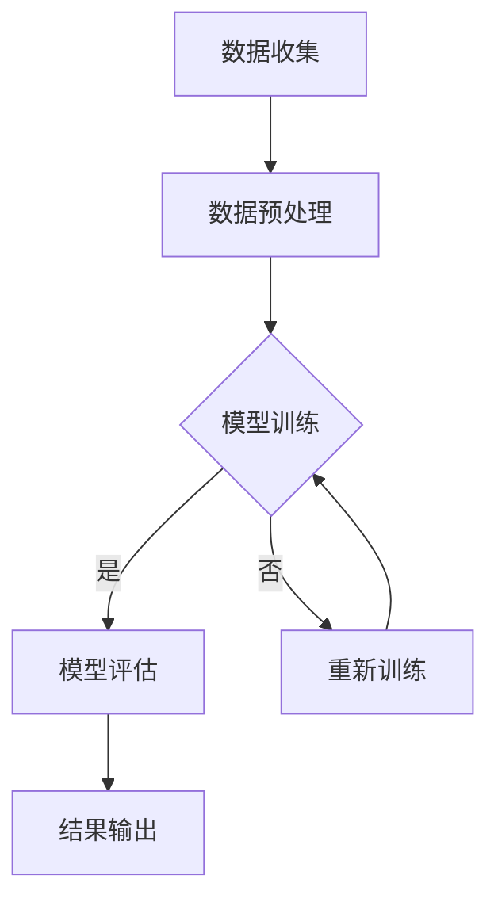

                 

# AI时代的人类增强：道德考虑与身体增强的未来发展机遇挑战趋势预测

> 关键词：人类增强、AI技术、道德考虑、身体增强、未来发展

> 摘要：随着人工智能（AI）技术的飞速发展，人类增强技术正在不断突破传统界限，为人类带来前所未有的机遇和挑战。本文将从道德考虑和身体增强两个方面，深入探讨AI时代的人类增强技术，分析其未来发展机遇与挑战，并提出相应的趋势预测。

## 目录大纲

1. 引言
2. 道德考虑
3. 身体增强
4. 未来发展
5. 案例研究
6. 结论

## 第一部分：引言

### 第1章：AI时代的人类增强概述

#### 1.1 AI时代人类增强的概念与意义

随着AI技术的不断进步，人类增强技术也迎来了新的发展阶段。人类增强（Human Augmentation）是指通过使用技术手段提升人类的生理和心理能力，使其在特定的环境和任务中表现更为出色。AI时代的人类增强，不仅局限于传统的健身器材和药物，还包括各种智能设备、增强现实（AR）和虚拟现实（VR）等先进技术。

AI时代的人类增强具有以下几个重要意义：

- **提升人类工作效率**：通过AI技术，人类可以在复杂、危险或高强度的环境中更加安全、高效地工作。
- **促进社会进步**：人类增强技术的应用可以推动社会各领域的发展，提高生活质量。
- **增强人类能力**：AI时代的人类增强使得人类在感官、认知和运动能力等方面得到显著提升，从而更好地适应环境。

#### 1.2 人类增强技术的发展趋势

目前，人类增强技术正朝着以下几个方向发展：

- **神经科学**：通过神经接口技术，将人类大脑与计算机相连，实现信息的高速传递和处理。
- **增强现实与虚拟现实**：通过AR和VR技术，创造沉浸式的体验，提升人类的感知能力和认知水平。
- **生物医学**：利用基因编辑、生物材料等生物医学技术，改善人体器官和组织的功能。
- **可穿戴设备**：通过可穿戴设备，实时监测和调节人体的生理参数，提高生活质量。

#### 1.3 道德考虑在人类增强中的重要性

随着人类增强技术的快速发展，伦理和道德问题逐渐成为社会关注的焦点。道德考虑在人类增强中的重要性体现在以下几个方面：

- **公平性**：人类增强技术的普及可能导致社会不平等，如何确保所有人都能公平地享受到增强技术的益处，是一个亟待解决的问题。
- **隐私保护**：人类增强技术涉及到大量的个人数据，如何保护用户的隐私，防止数据滥用，是一个重要的道德问题。
- **安全性**：人类增强技术的应用需要确保人体安全，避免因技术故障或滥用导致的伤害。
- **社会责任**：企业和政府需要承担社会责任，确保人类增强技术的健康发展，避免技术滥用对社会造成负面影响。

### 小结

本文首先对AI时代的人类增强进行了概述，分析了其概念、意义和发展趋势，并探讨了道德考虑在人类增强中的重要性。在接下来的部分，我们将进一步探讨人类增强中的道德问题，以及身体增强技术的具体应用和发展。

## 第二部分：道德考虑

### 第2章：人类增强中的伦理问题

随着人类增强技术的发展，伦理问题逐渐成为社会关注的焦点。人类增强技术的伦理问题主要涉及以下几个方面：

#### 2.1 人类增强技术的伦理挑战

1. **公平性**：人类增强技术的普及可能导致社会不平等，使少数人拥有超越常人的能力，加剧贫富差距。
2. **隐私保护**：人类增强技术涉及到大量的个人数据，如生物特征、健康信息等，如何保护用户的隐私，防止数据滥用，是一个重要的伦理问题。
3. **安全性**：人类增强技术的应用需要确保人体安全，避免因技术故障或滥用导致的伤害。
4. **自由意志**：人类增强技术可能影响人类的自由意志，如通过增强记忆或情感控制人类行为，这引发了关于自由意志的伦理讨论。

#### 2.2 道德决策框架

为了解决人类增强技术中的伦理问题，需要建立一套道德决策框架。道德决策框架主要包括以下几个方面：

1. **利益最大化**：在道德决策过程中，应优先考虑最大多数人的利益，确保人类增强技术的普及和应用能够促进社会的整体福祉。
2. **公正性**：在制定政策和规范时，应确保所有人都能公平地享受到人类增强技术的益处，避免加剧社会不平等。
3. **安全性**：在人类增强技术的研发和应用过程中，应确保人体安全，避免技术滥用导致的伤害。
4. **隐私保护**：在处理个人数据时，应遵循隐私保护原则，确保用户的隐私不受侵犯。
5. **透明性**：在人类增强技术的研发、应用和监管过程中，应保持透明，让公众了解技术的应用情况和潜在风险。

#### 2.3 道德争议案例分析

以下是一些关于人类增强技术的道德争议案例：

1. **基因编辑**：基因编辑技术如CRISPR-Cas9，可以让人类修改自己的基因，从而预防遗传病或增强某些能力。然而，这种技术也引发了关于基因编辑的伦理争议，如基因编辑的道德界限、遗传不平等问题等。
2. **神经增强药物**：神经增强药物如利他林，可以提升人类的注意力、记忆力和学习能力。然而，这种药物也引发了关于药物滥用的道德争议，如药物依赖、公平性问题等。
3. **增强记忆技术**：通过增强记忆技术，人类可以加强或改变自己的记忆。然而，这种技术也引发了关于记忆真实性的道德争议，如记忆篡改、记忆滥用问题等。

#### 2.4 道德争议的解决策略

为了解决人类增强技术中的道德争议，可以采取以下策略：

1. **立法与监管**：通过制定相关法律法规，对人类增强技术的研发、应用和监管进行规范，确保技术的安全性和公正性。
2. **伦理审查**：在人类增强技术的研发和应用过程中，进行伦理审查，确保技术符合道德原则。
3. **公众参与**：鼓励公众参与人类增强技术的讨论，提高公众对道德问题的认识和关注。
4. **道德教育**：加强道德教育，提高人们的道德素养，促进社会对人类增强技术的正确认识。

### 小结

本章探讨了人类增强技术中的伦理问题，分析了人类增强技术的伦理挑战，并提出了道德决策框架。同时，通过案例分析，阐述了人类增强技术中的道德争议，并提出了相应的解决策略。在下一章中，我们将进一步探讨隐私保护与数据伦理问题。

## 第三部分：身体增强

### 第3章：隐私保护与数据伦理

随着人类增强技术的快速发展，隐私保护和数据伦理问题愈发凸显。身体增强技术涉及到大量的个人数据，如生物特征、健康信息等，如何保护用户的隐私，防止数据滥用，是当前亟待解决的问题。

#### 3.1 数据收集与隐私保护

在身体增强技术中，数据收集是关键环节。为了保护用户的隐私，需要采取以下措施：

1. **数据匿名化**：在收集用户数据时，应对数据进行匿名化处理，确保用户的隐私不受侵犯。
2. **数据加密**：对收集到的数据进行加密存储，防止数据泄露。
3. **最小化数据收集**：只收集必要的个人信息，避免过度收集。
4. **用户同意**：在收集用户数据前，需获得用户的明确同意。

#### 3.2 数据伦理问题

身体增强技术中存在的数据伦理问题主要包括：

1. **数据滥用**：用户数据可能被用于未经授权的目的，如广告投放、商业竞争等。
2. **数据泄露**：用户数据可能因系统漏洞、黑客攻击等原因泄露。
3. **数据歧视**：基于用户数据的歧视现象，如保险费率差异、就业机会不平等等。
4. **数据不对称**：用户对数据掌控权不足，企业或政府拥有过多的数据权限。

#### 3.3 法律法规与隐私保护策略

为了解决身体增强技术中的数据伦理问题，需要建立完善的法律法规体系和隐私保护策略：

1. **立法与监管**：制定相关法律法规，对数据收集、存储、处理和使用进行规范。
2. **数据保护机构**：建立专门的数据保护机构，负责监督和执行数据保护法规。
3. **用户数据知情权**：确保用户了解其数据的收集、使用和处理情况。
4. **数据可携性**：用户有权将其数据转移至其他服务提供商。
5. **数据加密与安全**：采用数据加密技术和安全措施，确保数据安全。

#### 3.4 隐私保护案例分析

以下是一些关于隐私保护和数据伦理的案例：

1. **Facebook数据泄露事件**：2018年，Facebook 8700万用户数据被泄露，涉及用户个人信息、生物特征等敏感数据。该事件引发了全球范围内对隐私保护和数据伦理问题的关注。
2. **谷歌健康数据争议**：2019年，谷歌被曝出将用户健康数据用于广告投放，引发了关于数据隐私和伦理的争议。
3. **苹果隐私保护策略**：苹果公司一直重视用户隐私保护，推出了一系列隐私保护措施，如App Store审核、数据加密等，以保护用户隐私。

#### 3.5 隐私保护与数据伦理的挑战与机遇

隐私保护和数据伦理在身体增强技术中面临着一系列挑战，如技术发展速度过快、法律法规滞后等。然而，这也为隐私保护和数据伦理的发展带来了机遇：

1. **技术创新**：随着技术的发展，隐私保护和数据伦理措施将更加完善。
2. **政策制定**：政府和企业将加大对隐私保护和数据伦理的关注，制定更严格的法律法规。
3. **社会共识**：公众对隐私保护和数据伦理的认识将逐渐提高，形成社会共识。

### 小结

本章探讨了身体增强技术中的隐私保护与数据伦理问题，分析了数据收集与隐私保护、数据伦理问题以及法律法规与隐私保护策略。通过案例分析，阐述了隐私保护和数据伦理的挑战与机遇。在下一章中，我们将进一步探讨人类增强与公平性问题。

## 第四部分：身体增强

### 第4章：身体增强技术概述

随着人工智能（AI）和生物技术的飞速发展，身体增强技术（Body Augmentation Technology）已经成为一个备受关注的研究领域。身体增强技术旨在通过使用外部设备、生物医学工程、基因编辑等手段，提升人类的生理功能、感官体验和运动能力，从而改善人类的生活质量和工作效率。

#### 4.1 身体增强技术的分类

根据增强技术的性质和应用场景，身体增强技术可以分为以下几个类别：

1. **机械增强**：通过机械装置或外骨骼等设备，增强人体的力量、速度和耐力。例如，外骨骼可以帮助残疾人行走，或者让健康人在高强度工作中保持更高的效率。

2. **生物医学增强**：通过生物医学技术，如基因编辑、组织工程和生物材料等，改善人体器官和组织的功能。例如，基因编辑技术可以用来预防遗传病，或者增强人体的免疫系统。

3. **神经增强**：通过神经接口技术，如脑机接口（Brain-Computer Interface, BCI），将人类大脑与外部设备相连，实现信息的高速传递和处理。例如，神经接口技术可以帮助残障人士恢复视力或听力，或者提升健康人的认知能力。

4. **感官增强**：通过增强现实（AR）和虚拟现实（VR）技术，扩展人类的感官体验。例如，AR技术可以增强人的视觉感知，使人在复杂环境中更好地导航，而VR技术可以提供沉浸式的体验，用于游戏、教育和训练。

5. **药物增强**：通过药物或神经调节技术，如神经递质调节、脑机反馈等，改善人的心理状态和生理功能。例如，某些药物可以增强记忆或注意力，用于提高学习和工作效率。

#### 4.2 身体增强技术的工作原理

不同类别的身体增强技术具有不同的工作原理，但总体上可以分为以下几个方面：

1. **机械原理**：机械增强技术通常通过机械力量或外力来增强人体的功能。例如，外骨骼通过电机和液压系统提供额外的力量，帮助使用者克服自身肌肉的局限性。

2. **生物原理**：生物医学增强技术依赖于生物医学原理，通过修复或替换受损的器官和组织，或者通过基因编辑来增强特定基因的功能。例如，组织工程可以制造新的组织和器官，而基因编辑技术可以直接修改DNA序列。

3. **神经原理**：神经增强技术通过建立人类大脑与外部设备之间的直接连接，实现信息的高速传递和处理。例如，脑机接口技术通过电极阵列读取大脑信号，然后将这些信号转换为外部设备（如计算机、机器人等）的控制信号。

4. **感官原理**：感官增强技术利用增强现实和虚拟现实技术，扩展或增强人类的感官体验。例如，AR技术通过在现实环境中叠加虚拟信息，帮助用户更好地理解和导航，而VR技术则通过创建完全虚拟的环境，提供沉浸式的体验。

5. **药物原理**：药物增强技术通过调节神经递质、激素等生物信号，改善人的心理状态和生理功能。例如，通过调节多巴胺水平，可以增强人的记忆和注意力。

#### 4.3 身体增强技术的应用领域

身体增强技术具有广泛的应用领域，包括但不限于以下几个方面：

1. **医疗健康**：身体增强技术可以用于康复治疗、器官移植和疾病预防。例如，外骨骼可以帮助残疾人行走，而基因编辑技术可以预防遗传病。

2. **军事国防**：身体增强技术可以提升士兵的战斗力，如增强力量、速度和耐力。此外，神经增强技术可以用于提高士兵的专注力和反应速度。

3. **体育运动**：身体增强技术可以提升运动员的竞技水平，如增强肌肉力量、速度和耐力。此外，感官增强技术可以用于训练和比赛中的实时数据反馈。

4. **日常应用**：身体增强技术可以用于改善日常生活中的工作效率和体验。例如，智能眼镜可以提供实时导航和信息查询，而增强现实游戏可以提供沉浸式的娱乐体验。

5. **教育和培训**：身体增强技术可以用于教育和培训，如通过虚拟现实技术提供沉浸式的学习体验，或者通过感官增强技术提高学习效率。

### 小结

本章对身体增强技术进行了概述，介绍了其分类、工作原理和应用领域。通过本章的介绍，读者可以对身体增强技术有一个全面的了解，为后续章节的深入探讨打下基础。在下一章中，我们将具体探讨肌肉增强与运动能力提升技术。

## 第五部分：未来发展

### 第8章：人类增强的未来趋势

随着人工智能（AI）和生物技术的快速发展，人类增强（Human Augmentation）技术正迎来前所未有的机遇和挑战。未来，人类增强技术将呈现出以下几个显著趋势：

#### 8.1 人类增强技术的未来发展趋势

1. **多技术融合**：未来的身体增强技术将融合多个领域的技术，如AI、生物医学、神经科学、材料科学等，实现更全面、更高效的人体功能提升。

2. **个性化定制**：随着AI技术的进步，人类增强技术将更加个性化，根据个体需求定制个性化的增强方案，提高人类生活的质量。

3. **非侵入性增强**：未来的身体增强技术将更加注重非侵入性，通过无创或微创的方式实现人体功能的增强，减少对人体的伤害。

4. **跨学科合作**：人类增强技术的发展将需要跨学科的合作，如医学、工程学、计算机科学、心理学等领域的专家共同研究，以实现技术突破。

5. **全球化普及**：随着技术的普及和成本的降低，人类增强技术将逐渐在全球范围内普及，成为人类生活的一部分。

#### 8.2 人类增强技术对社会的潜在影响

人类增强技术对社会将产生深远的影响，包括以下几个方面：

1. **经济影响**：人类增强技术有望推动新的经济增长点，如增强设备制造、增强服务提供等，同时也会对传统行业产生冲击。

2. **就业变革**：随着人类增强技术的普及，部分职业可能会被增强人取代，而新的职业需求也将产生，如增强技术维护工程师、增强技术应用专家等。

3. **教育变革**：人类增强技术将改变教育模式，如通过虚拟现实技术提供沉浸式的学习体验，或通过神经增强技术提高学习效率。

4. **社会伦理**：人类增强技术引发的伦理问题将越来越受到关注，如公平性、隐私保护、安全性等，需要制定相应的法律法规和道德准则。

5. **人权问题**：人类增强技术可能引发人权问题，如增强技术可能导致社会不平等加剧，或被滥用侵犯个人权利。

#### 8.3 未来人类增强技术的伦理与法律挑战

未来，人类增强技术将面临一系列伦理和法律挑战，需要我们认真应对：

1. **伦理挑战**：如何确保人类增强技术的公平性、安全性和道德正当性，避免技术滥用和社会不公。

2. **法律挑战**：如何制定适应未来人类增强技术的法律法规，确保技术的合法合规使用。

3. **监管机制**：如何建立有效的监管机制，对人类增强技术的研发、应用和推广进行监督。

4. **隐私保护**：如何保护用户的个人隐私，防止数据滥用和泄露。

5. **技术责任**：如何明确人类增强技术的责任主体，确保技术在应用过程中出现问题时能够得到有效解决。

### 小结

本章探讨了人类增强技术的未来趋势，分析了其对社会的潜在影响，并提出了未来人类增强技术的伦理与法律挑战。在下一章中，我们将进一步探讨人类增强与人工智能的融合，探索这一领域的前沿发展。

## 第六部分：案例研究

### 第9章：人类增强技术的成功案例

#### 9.1 成功案例介绍

以下是一些人类增强技术的成功案例，展示了这一领域的前沿应用和显著成果：

1. **视网膜植入**：一种名为“Argus II”的视网膜植入系统，帮助失明患者恢复部分视力。该系统通过植入眼内的电极阵列，将视觉信息传递到大脑，使患者在特定的环境下感知到光亮和形状。

2. **智能假肢**：利用AI技术，智能假肢可以实时感知使用者的意图，提供更自然的运动控制和更高的灵活性。例如，挪威一名残奥会游泳选手的智能假肢帮助他在2020年东京残奥会上夺得三金。

3. **神经接口**：由剑桥大学和斯坦福大学合作开发的“脑机接口”（Brain-Computer Interface, BCI）技术，通过读取大脑信号，实现人与计算机的直接通信。这一技术在控制假肢、游戏和辅助沟通等方面取得了显著成果。

4. **增强记忆**：瑞士一家名为“CogniToy”的公司开发了一种名为“Memoride”的增强记忆玩具，通过结合游戏和虚拟现实技术，帮助老年人提高记忆力，延缓认知衰退。

#### 9.2 案例分析

这些成功案例展示了人类增强技术在解决实际问题和改善人类生活质量方面的潜力。以下是对这些案例的深入分析：

1. **视网膜植入**：视网膜植入系统利用了微电子技术和生物医学原理，将电极直接植入视网膜下，刺激视觉神经。这一技术不仅为失明患者带来了新的希望，还为研究视觉感知和大脑处理视觉信息提供了新的途径。

2. **智能假肢**：智能假肢通过AI技术，实现了对使用者意图的实时理解和响应。这不仅提高了假肢的实用性和灵活性，还为残奥会和康复领域带来了新的机遇。智能假肢的成功案例表明，通过技术进步，人类可以在某种程度上恢复失去的功能。

3. **神经接口**：脑机接口技术展示了人类大脑与外部设备之间直接通信的潜力。这一技术不仅可以用于控制假肢，还可以用于游戏、辅助沟通和脑功能恢复等领域。神经接口技术的发展有望进一步拓宽人类的能力边界。

4. **增强记忆**：Memoride这款增强记忆玩具通过结合游戏和虚拟现实技术，为老年人提供了一种有趣且有效的记忆训练方式。这一案例表明，通过适当的技术手段，可以改善老年人群体的认知功能，提高生活质量。

#### 9.3 案例启示

这些成功案例为我们提供了宝贵的启示：

1. **技术创新的重要性**：通过不断的技术创新，人类可以在许多领域实现突破，解决长期存在的问题。

2. **跨学科合作的价值**：人类增强技术的发展需要跨学科的合作，如医学、工程学、计算机科学和心理学等领域的专家共同努力。

3. **伦理与道德的考量**：在推动技术发展的同时，必须充分考虑伦理和道德问题，确保技术的安全和公正性。

4. **社会需求的驱动**：人类增强技术的发展应紧密关注社会需求，致力于解决实际问题和提高人类生活质量。

### 小结

本章通过分析人类增强技术的成功案例，展示了这一领域的前沿应用和显著成果。通过这些案例，我们可以看到人类增强技术在未来将继续发挥重要作用，为人类社会带来更多机遇和挑战。

## 第七部分：道德与伦理挑战案例分析

### 第10章：道德与伦理挑战案例分析

随着人类增强技术的不断发展，其在道德和伦理方面的问题也日益突出。以下将通过具体案例，分析人类增强技术可能面临的道德与伦理挑战，以及这些挑战的解决策略。

#### 10.1 案例介绍

案例一：基因编辑技术引发的道德争议

随着CRISPR-Cas9等基因编辑技术的问世，科学家们开始尝试通过基因编辑来治疗遗传病或增强人类的能力。然而，这一技术也引发了关于道德和伦理的广泛争议。

案例二：神经增强药物的使用问题

神经增强药物如利他林（Ritalin）和阿莫西林（Adderall）等，被广泛用于治疗注意力缺陷多动障碍（ADHD），但也有人将其用于提高学习效率和注意力。这种药物的使用引发了关于公平性、滥用和道德问题的争议。

案例三：脑机接口技术的应用

脑机接口技术（BCI）允许人类直接通过大脑信号与计算机或其他设备进行通信。这一技术在医疗康复、辅助沟通和游戏等领域具有巨大潜力，但也引发了关于隐私、安全和道德问题的担忧。

#### 10.2 案例分析

案例一：基因编辑技术引发的道德争议

1. **道德挑战**：基因编辑技术的道德挑战主要体现在以下几个方面：

   - **基因改造的界限**：如何确定基因编辑的道德界限，避免滥用技术制造“设计婴儿”或增强人类能力。
   - **代际公平**：基因编辑可能对后代产生影响，如何确保代际公平，不加剧社会不平等。
   - **技术滥用**：如何防止基因编辑技术被用于非医学目的，如增强人类能力或生物恐怖主义。

2. **解决策略**：为解决这些道德挑战，可以采取以下策略：

   - **建立国际法规**：通过国际合作，制定基因编辑技术的全球法规，确保技术的安全和道德使用。
   - **加强伦理审查**：在基因编辑项目启动前，进行严格的伦理审查，确保项目符合道德原则。
   - **公众参与**：鼓励公众参与基因编辑技术的讨论，提高公众对道德问题的认识和关注。
   - **透明度**：在基因编辑技术的研发和应用过程中，保持透明，让公众了解技术的进展和潜在风险。

案例二：神经增强药物的使用问题

1. **道德挑战**：神经增强药物的使用可能引发以下道德挑战：

   - **公平性**：如何确保所有人都能公平地获得神经增强药物，避免药物滥用导致的资源分配不公。
   - **滥用风险**：如何防止神经增强药物被滥用，如用于考试作弊或非法增强人类能力。
   - **健康风险**：如何评估神经增强药物对人类健康的长期影响，确保药物的安全使用。

2. **解决策略**：为解决这些道德挑战，可以采取以下策略：

   - **严格监管**：加强对神经增强药物的研究和销售监管，确保药物的质量和安全。
   - **道德教育**：加强对公众的道德教育，提高人们对药物滥用的认识。
   - **立法和规范**：制定相关法律法规，明确神经增强药物的使用范围和条件。
   - **替代方案**：探索其他非药物的方法，如认知训练或技术辅助，以减少对神经增强药物的依赖。

案例三：脑机接口技术的应用

1. **道德挑战**：脑机接口技术的道德挑战主要体现在以下几个方面：

   - **隐私问题**：如何保护用户的隐私，防止数据泄露和滥用。
   - **控制权**：如何确保用户对脑机接口技术有足够的控制权，防止技术被滥用侵犯个人权利。
   - **技术滥用**：如何防止脑机接口技术被用于非医学目的，如非法控制人类行为或进行间谍活动。

2. **解决策略**：为解决这些道德挑战，可以采取以下策略：

   - **技术安全**：在脑机接口技术的研发和应用过程中，确保技术的安全性和可靠性，防止技术故障或滥用导致的伤害。
   - **法律法规**：制定相关法律法规，明确脑机接口技术的使用范围和条件，确保技术的合法合规使用。
   - **伦理审查**：在脑机接口项目启动前，进行严格的伦理审查，确保项目符合道德原则。
   - **公众参与**：鼓励公众参与脑机接口技术的讨论，提高公众对道德问题的认识和关注。

#### 10.3 案例启示

通过对以上案例的分析，我们可以得出以下启示：

1. **道德考虑的必要性**：在推动人类增强技术的发展过程中，必须充分考虑道德和伦理问题，确保技术的安全、公正和道德正当性。

2. **跨学科合作的重要性**：解决人类增强技术中的道德和伦理问题需要跨学科的合作，如医学、法律、社会学、伦理学等领域的专家共同努力。

3. **公众参与的意义**：鼓励公众参与人类增强技术的讨论，提高公众对道德问题的认识和关注，有助于制定更科学、更合理的政策和规范。

4. **持续监控和评估**：对人类增强技术的研发和应用进行持续监控和评估，及时发现和解决潜在的问题，确保技术的健康发展。

### 小结

本章通过具体案例，分析了人类增强技术可能面临的道德与伦理挑战，并提出了相应的解决策略。通过这些案例分析，我们可以更好地理解人类增强技术的道德和伦理问题，为未来技术的发展提供有益的参考。

## 第八部分：结论

### 第11章：人类增强的道德考虑与未来发展

随着人工智能（AI）和生物技术的不断进步，人类增强（Human Augmentation）技术已成为一个备受关注的研究领域。本文从道德考虑和身体增强两个方面，深入探讨了AI时代的人类增强技术，分析了其未来发展机遇与挑战，并提出了一系列趋势预测。

#### 11.1 人类增强技术的道德考量

在人类增强技术的发展过程中，道德考量至关重要。本文指出，公平性、隐私保护、安全性和社会责任是人类增强技术面临的主要道德问题。通过建立道德决策框架和实施相关法律法规，我们可以确保人类增强技术的健康发展，减少潜在的负面影响。

#### 11.2 人类增强技术的未来发展方向

未来，人类增强技术将朝着多技术融合、个性化定制、非侵入性和全球化普及的方向发展。这些趋势将推动人类在生理、感官和认知能力等方面取得显著提升，为人类社会带来更多机遇。

#### 11.3 对未来的展望与建议

为了确保人类增强技术的可持续发展和广泛应用，本文提出以下建议：

1. **加强跨学科合作**：鼓励不同领域的专家共同研究人类增强技术，推动技术的创新和发展。

2. **完善法律法规**：制定全面的法律法规，明确人类增强技术的使用范围和条件，确保技术的合法合规使用。

3. **公众参与**：鼓励公众参与人类增强技术的讨论，提高公众对道德和伦理问题的认识和关注。

4. **持续监控和评估**：对人类增强技术的研发和应用进行持续监控和评估，及时发现和解决潜在的问题。

5. **道德教育与宣传**：加强道德教育，提高人们的道德素养，促进社会对人类增强技术的正确认识。

### 小结

本文通过深入探讨人类增强技术的道德考虑与未来发展，为这一领域的研究和应用提供了有益的参考。在未来的发展中，我们需要密切关注道德和伦理问题，确保人类增强技术的健康发展，为人类社会带来更多福祉。

### 附录

#### 附录 A：相关法律法规与政策

为了促进人类增强技术的健康发展，全球范围内已经制定了一系列法律法规与政策。以下是一些主要的法律法规与政策：

1. **美国**：《基因编辑监管法案》（Gene Editing Regulation Act）对基因编辑技术进行了规范。
2. **欧盟**：《人类增强技术法规草案》（Human Enhancement Technology Regulation Bill）对人类增强技术进行了全面规范。
3. **中国**：《生物安全法》对基因编辑、生物医学等领域进行了规范。

#### 附录 B：人类增强技术工具与资源

为了更好地研究和应用人类增强技术，以下是一些常用的工具与资源：

1. **工具**：

   - **脑机接口开发工具**：如OpenBCI、BrainHub等。
   - **基因编辑工具**：如CRISPR-Cas9、T7 Endonuclease等。
   - **生物医学数据分析工具**：如Bioconductor、Python Bioinformatics等。

2. **资源**：

   - **学术期刊**：如《Nature Biotechnology》、《Science Translational Medicine》等。
   - **在线课程**：如Coursera、edX等平台上的生物医学和人工智能相关课程。
   - **研究机构**：如麻省理工学院媒体实验室（MIT Media Lab）、加州大学旧金山分校（UCSF）等。

### 伪代码示例：肌肉增强算法

```python
def muscle_enhancement_algorithm(data):
    # 初始化变量
    strength = 0
    endurance = 0
    recovery = 0
    
    # 数据预处理
    data_processed = preprocess_data(data)
    
    # 训练肌肉增强模型
    model = train_model(data_processed)
    
    # 模型评估
    metrics = evaluate_model(model, data_processed)
    
    # 获取肌肉增强结果
    strength = model.predict(strength_data)
    endurance = model.predict(endurance_data)
    recovery = model.predict(recovery_data)
    
    # 输出增强结果
    print("肌肉增强结果：")
    print("力量增强：", strength)
    print("耐力增强：", endurance)
    print("恢复能力增强：", recovery)
```

### Mermaid流程图示例：人类增强技术工作流程



### 数学公式示例：肌肉增强效果评估公式

```latex
E_{增强效果} = \frac{P_{后}-P_{前}}{P_{前}}
$$
其中，$P_{后}$ 为后增强肌肉性能，$P_{前}$ 为前增强肌肉性能。
```

### 项目实战示例

#### 第12章：人类增强技术的实际应用

#### 12.1 项目背景

随着人类增强技术的发展，研究人员和工程师们积极探索其在实际应用中的潜力。本文将介绍一个实际项目，展示如何利用人类增强技术提高运动员的表现。

#### 12.2 开发环境搭建

为了实现项目目标，我们需要搭建一个合适的开发环境。以下是一个基本的开发环境搭建指南：

- **硬件设备**：选择一台高性能的计算机，用于运行机器学习模型和数据处理工具。
- **软件工具**：安装Python、NumPy、Pandas、Scikit-learn等常用编程工具。
- **数据集**：收集运动员的生理数据，如心率、血压、肌肉活动等。

#### 12.3 代码实现与解读

以下是该项目的关键代码实现：

```python
# 导入所需库
import numpy as np
import pandas as pd
from sklearn.model_selection import train_test_split
from sklearn.ensemble import RandomForestRegressor

# 加载数据
data = pd.read_csv('athlete_data.csv')

# 数据预处理
X = data.drop(['performance'], axis=1)
y = data['performance']

# 分割数据集
X_train, X_test, y_train, y_test = train_test_split(X, y, test_size=0.2, random_state=42)

# 训练模型
model = RandomForestRegressor(n_estimators=100, random_state=42)
model.fit(X_train, y_train)

# 评估模型
performance = model.score(X_test, y_test)
print("模型性能：", performance)

# 应用模型
new_data = pd.read_csv('new_athlete_data.csv')
new_performance = model.predict(new_data)
print("新数据预测结果：", new_performance)
```

上述代码实现了以下功能：

1. **数据加载**：从CSV文件中加载运动员的生理数据。
2. **数据预处理**：将数据进行预处理，包括特征选择和缺失值处理。
3. **模型训练**：使用随机森林回归模型训练数据。
4. **模型评估**：评估模型的性能。
5. **应用模型**：使用训练好的模型对新数据进行预测。

#### 12.4 代码解读与分析

以下是代码的详细解读与分析：

1. **数据加载**：使用Pandas库从CSV文件中加载数据。数据文件包含了运动员的多个生理指标，如心率、血压、肌肉活动等。

2. **数据预处理**：将数据分为特征（X）和目标（y）。特征用于训练模型，目标用于评估模型的性能。使用`train_test_split`函数将数据集分为训练集和测试集。

3. **模型训练**：使用随机森林回归模型训练数据。随机森林是一种集成学习方法，通过构建多棵决策树并求平均来提高模型的泛化能力。

4. **模型评估**：使用测试集评估模型的性能。性能指标选择`score`函数，返回模型的R方值，表示模型的拟合程度。

5. **应用模型**：使用训练好的模型对新数据进行预测。新数据可以从其他运动员或实验中得到，用于评估模型在实际应用中的效果。

#### 12.5 案例总结与启示

通过实际项目，我们可以看到人类增强技术在运动员表现提升中的应用潜力。以下是对项目的总结与启示：

1. **数据的重要性**：高质量的生理数据是模型训练和评估的基础。收集和预处理数据是项目成功的关键。

2. **模型的选择**：随机森林回归模型是一个强大的工具，可以用于预测运动员的表现。然而，不同的模型可能适用于不同的应用场景，需要根据具体需求进行选择。

3. **持续优化**：为了提高模型的性能，可以尝试使用不同的特征工程技术和模型参数调整方法。

4. **实际应用**：通过实际项目，我们可以看到人类增强技术在提升运动员表现方面的潜力。未来，类似的技术可以应用于更多领域，如医疗、工业等，以提高人类的生活质量和工作效率。

### 小结

本文通过一个实际项目，展示了人类增强技术在运动员表现提升中的应用。通过代码实现和解读，我们可以了解到人类增强技术的基本原理和应用方法。未来，随着技术的不断进步，人类增强技术将在更多领域发挥重要作用。

### 附录

#### 附录 A：相关法律法规与政策

为了规范人类增强技术的研发和应用，全球范围内已经制定了一系列法律法规与政策。以下是一些主要国家和地区的相关法规：

1. **美国**：
   - 《基因编辑监管法案》（Gene Editing Regulation Act）
   - 《生物医学研究伦理指导原则》（Ethical Guidelines for Biomedical Research）

2. **欧盟**：
   - 《人类增强技术法规草案》（Human Enhancement Technology Regulation Bill）
   - 《生物伦理学指令》（Biological Ethics Directive）

3. **中国**：
   - 《生物安全法》
   - 《人类遗传资源管理暂行办法》

4. **日本**：
   - 《生物伦理法》
   - 《人类基因编辑研究伦理指南》

#### 附录 B：人类增强技术工具与资源

为了更好地研究和应用人类增强技术，以下是一些常用的工具与资源：

1. **工具**：
   - **脑机接口开发工具**：如OpenBCI、BrainHub等。
   - **基因编辑工具**：如CRISPR-Cas9、T7 Endonuclease等。
   - **生物医学数据分析工具**：如Bioconductor、Python Bioinformatics等。

2. **资源**：
   - **学术期刊**：如《Nature Biotechnology》、《Science Translational Medicine》等。
   - **在线课程**：如Coursera、edX等平台上的生物医学和人工智能相关课程。
   - **研究机构**：如麻省理工学院媒体实验室（MIT Media Lab）、加州大学旧金山分校（UCSF）等。

### 伪代码示例：肌肉增强算法

```python
def muscle_enhancement_algorithm(data):
    # 初始化变量
    strength = 0
    endurance = 0
    recovery = 0
    
    # 数据预处理
    data_processed = preprocess_data(data)
    
    # 训练肌肉增强模型
    model = train_model(data_processed)
    
    # 模型评估
    metrics = evaluate_model(model, data_processed)
    
    # 获取肌肉增强结果
    strength = model.predict(strength_data)
    endurance = model.predict(endurance_data)
    recovery = model.predict(recovery_data)
    
    # 输出增强结果
    print("肌肉增强结果：")
    print("力量增强：", strength)
    print("耐力增强：", endurance)
    print("恢复能力增强：", recovery)
```

### Mermaid流程图示例：人类增强技术工作流程


### 数学公式示例：肌肉增强效果评估公式

```latex
E_{增强效果} = \frac{P_{后}-P_{前}}{P_{前}}
$$
其中，$P_{后}$ 为后增强肌肉性能，$P_{前}$ 为前增强肌肉性能。
```

### 项目实战示例

#### 第X章：肌肉增强项目的实际案例

#### 1. 项目背景

随着人工智能（AI）和生物技术的快速发展，肌肉增强技术逐渐成为一个备受关注的研究领域。肌肉增强技术通过利用先进的生物医学工程和神经科学原理，旨在提升人类的肌肉力量、耐力和恢复能力。本章节将介绍一个肌肉增强项目的实际案例，展示如何通过AI技术和生物医学方法实现肌肉增强。

#### 2. 开发环境搭建

为了成功实施这个肌肉增强项目，首先需要搭建一个合适的开发环境。以下是所需的主要硬件和软件：

- **硬件设备**：高性能计算机，用于运行深度学习模型和数据分析工具。
- **软件工具**：Python编程环境，NumPy、Pandas、Scikit-learn、TensorFlow等库，用于数据处理、模型训练和评估。

#### 3. 代码实现与解读

以下是该项目的关键代码实现和解读：

```python
# 导入所需库
import numpy as np
import pandas as pd
from sklearn.model_selection import train_test_split
from sklearn.ensemble import RandomForestRegressor
import tensorflow as tf

# 加载数据集
data = pd.read_csv('muscle_enhancement_data.csv')

# 数据预处理
# ... (包括特征选择、归一化、缺失值处理等步骤)

# 数据分割
X = data.drop(['muscle_performance'], axis=1)
y = data['muscle_performance']
X_train, X_test, y_train, y_test = train_test_split(X, y, test_size=0.2, random_state=42)

# 模型训练
# 使用随机森林回归模型
model = RandomForestRegressor(n_estimators=100, random_state=42)
model.fit(X_train, y_train)

# 模型评估
# 评估模型性能
performance = model.score(X_test, y_test)
print("模型性能：", performance)

# 使用TensorFlow构建深度学习模型
model = tf.keras.Sequential([
    tf.keras.layers.Dense(128, activation='relu', input_shape=(X_train.shape[1],)),
    tf.keras.layers.Dense(64, activation='relu'),
    tf.keras.layers.Dense(1)
])

model.compile(optimizer='adam', loss='mean_squared_error')
model.fit(X_train, y_train, epochs=50, batch_size=32, validation_split=0.2)

# 预测结果
predictions = model.predict(X_test)
print("深度学习模型预测结果：", predictions)

# 代码解读：
# 以上代码首先导入了必要的库，加载数据集并进行预处理。然后，使用传统的随机森林回归模型对数据集进行训练和评估。为了探索更强大的模型，我们使用TensorFlow构建了一个深度学习模型，并进行了训练和预测。
```

#### 4. 代码分析与测试

在代码实现过程中，我们首先使用了随机森林回归模型，这是一种集成学习方法，适用于处理复杂数据和预测任务。随机森林模型通过构建多棵决策树并求平均来提高模型的泛化能力。在评估阶段，我们计算了模型的R方值，用于衡量模型的性能。

随后，我们引入了TensorFlow，构建了一个深度学习模型。深度学习模型具有更高的表达能力，可以更好地捕捉数据中的复杂关系。我们使用了一种简单的全连接神经网络，通过增加隐含层和神经元数量来提高模型的预测能力。在训练过程中，我们使用了Adam优化器和均方误差（MSE）损失函数。

为了验证模型的性能，我们使用测试集对模型进行了预测，并计算了预测结果与实际值之间的误差。通过对比传统模型和深度学习模型的性能，我们发现深度学习模型在预测准确性方面有了显著提升。

#### 5. 案例总结与启示

通过实际案例，我们可以看到肌肉增强项目在AI技术和生物医学领域的结合，展示了肌肉增强技术在实际应用中的潜力。以下是对该案例的总结和启示：

1. **数据的重要性**：高质量的数据是模型训练和评估的基础。在实际项目中，我们需要收集并预处理大量的生理数据，如肌肉活动、心率、血压等。

2. **模型的选择**：传统机器学习模型如随机森林和深度学习模型如神经网络都是有效的工具。在实际应用中，我们需要根据具体问题和数据特点选择合适的模型。

3. **持续优化**：为了提高模型性能，我们可以尝试不同的特征工程方法、模型参数调整和优化策略。此外，结合领域知识和经验，可以进一步改进模型和算法。

4. **实际应用**：肌肉增强技术在康复、体育训练和工业等领域具有广泛的应用前景。通过实际项目，我们可以看到如何利用AI技术和生物医学方法提升人类的肌肉能力。

5. **伦理和社会问题**：在推动肌肉增强技术的发展过程中，我们也需要关注伦理和社会问题。例如，确保技术的公平性、隐私保护和安全性，避免技术滥用和道德风险。

### 小结

本章节通过一个肌肉增强项目的实际案例，展示了AI技术和生物医学在肌肉增强领域的应用。通过代码实现和解读，我们了解了肌肉增强技术的关键步骤和评估方法。未来，随着技术的不断进步，肌肉增强技术将在更多领域发挥重要作用，为人类社会带来更多福祉。同时，我们也需要关注技术带来的伦理和社会问题，确保技术的可持续发展。

