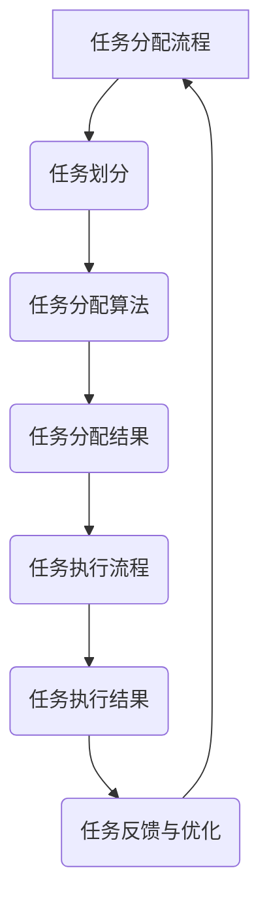

                 

# AI模型的任务分配与执行机制

> 关键词：AI模型、任务分配、执行机制、算法、优化

> 摘要：本文旨在深入探讨AI模型在任务分配与执行机制方面的原理、实践和未来发展方向。文章首先介绍了AI模型的基本概念和分类，随后详细解析了任务分配与执行机制的核心原理和算法，最后通过实际案例展示了这些机制在项目中的应用和优化策略。

## 目录大纲

1. **AI模型概述**
    1.1 AI模型概述
    1.2 AI模型的发展历程
    1.3 AI模型的分类
    1.4 AI模型的应用领域
2. **任务分配与执行机制**
    2.1 任务分配的概念
    2.2 任务分配的挑战与解决方案
    2.3 任务分配算法
    2.4 任务执行机制
    2.5 任务执行的挑战与解决方案
    2.6 任务执行算法
3. **AI模型任务分配与执行机制原理**
    3.1 任务分配原理
    3.2 任务执行原理
4. **AI模型任务分配与执行机制实践**
    4.1 任务分配与执行机制实践
    4.2 案例分析
5. **任务分配与执行机制的优化与展望**
    5.1 优化方法
    5.2 未来发展方向
    5.3 潜在应用领域
6. **附录**
    6.1 工具与资源介绍
    6.2 开发环境搭建指南
    6.3 实践案例代码解析

### 1. AI模型概述

#### 1.1 AI模型的基本概念

人工智能（AI）模型是计算机系统在特定任务上表现出智能行为的基础。这些模型通过学习大量数据，提取特征，并通过一系列算法和数学模型来实现预测、分类、决策等任务。AI模型通常可以分为以下几类：

- **监督学习模型**：在已知输入和输出之间建立映射关系的模型。例如，分类问题和回归问题。
- **无监督学习模型**：在没有明确输出标签的情况下，从数据中学习模式和结构。例如，聚类和降维。
- **强化学习模型**：通过试错和反馈来学习如何实现长期目标。例如，游戏AI和自动驾驶。

#### 1.2 AI模型的发展历程

人工智能的发展历程可以分为以下几个阶段：

- **早期探索（1950-1969）**：以符号主义和逻辑推理为基础，尝试通过编程实现智能。
- **知识表示和推理（1970-1989）**：引入专家系统和知识库，通过规则和事实进行推理。
- **统计学习（1990-2010）**：以统计学习理论为基础，开发出支持向量机、决策树等模型。
- **深度学习时代（2010至今）**：以神经网络为基础，特别是深度神经网络，实现了在图像识别、自然语言处理等领域的突破。

#### 1.3 AI模型的分类

根据应用领域和模型特性，AI模型可以分为以下几类：

- **计算机视觉模型**：用于图像和视频数据的分析，如卷积神经网络（CNN）。
- **自然语言处理模型**：用于文本数据的处理，如循环神经网络（RNN）和Transformer模型。
- **语音识别模型**：用于语音信号的识别和处理，如隐藏马尔可夫模型（HMM）和深度神经网络。
- **机器人模型**：用于机器人运动控制和决策，如基于强化学习的机器人控制系统。

#### 1.4 AI模型的应用领域

AI模型在多个领域都有着广泛的应用：

- **医疗领域**：用于疾病诊断、治疗方案推荐和药物研发。
- **金融领域**：用于风险评估、交易策略和欺诈检测。
- **工业领域**：用于生产优化、质量控制和服务机器人。
- **交通领域**：用于智能交通管理、自动驾驶和物流优化。

### 2. 任务分配与执行机制

#### 2.1 任务分配的概念

任务分配是指将一组任务分配给一组执行者（如计算机节点、机器人等），以便在特定的时间和资源限制下完成这些任务。任务分配的核心目标是优化资源利用率、降低延迟和提升整体效率。

#### 2.2 任务分配的挑战与解决方案

任务分配面临的主要挑战包括：

- **负载不均**：如何确保每个执行者都有适量的任务，避免某些节点过载而其他节点空闲。
- **通信成本**：任务分配过程中涉及的通信成本可能很高，需要优化通信策略。
- **动态变化**：执行者在执行任务过程中可能会出现故障或资源不足，需要动态调整任务分配。

解决这些挑战的方法包括：

- **负载均衡算法**：如最小完成时间（Min-Completion Time）和最小剩余负载（Min-Remaining-Load）算法。
- **动态调度**：使用基于预测的调度策略，根据执行者的状态和任务特性实时调整任务分配。
- **分布式系统**：利用分布式计算框架，如MapReduce和Spark，实现任务并行处理和动态分配。

#### 2.3 任务分配算法

任务分配算法可以分为以下几类：

- **静态任务分配算法**：在任务分配前预先确定执行者和任务分配方案。例如，固定分配算法和轮转分配算法。
- **动态任务分配算法**：在任务执行过程中根据执行者的状态和任务特性动态调整任务分配。例如，负载均衡算法和动态调度算法。

#### 2.4 任务执行机制

任务执行机制是指执行者如何执行分配给自己的任务，并报告执行结果。任务执行机制的核心目标是确保任务的正确性和效率。

#### 2.5 任务执行的挑战与解决方案

任务执行面临的挑战包括：

- **错误处理**：如何处理执行过程中出现的错误，如任务失败或执行结果异常。
- **资源管理**：如何合理分配和管理执行者的资源，确保任务执行的连续性和稳定性。
- **时间调度**：如何合理规划任务执行的时间，避免资源冲突和执行延迟。

解决这些挑战的方法包括：

- **错误恢复机制**：使用备份和重试策略，确保任务的最终正确执行。
- **资源管理策略**：使用资源分配算法和优先级调度策略，确保资源的合理利用。
- **时间调度算法**：使用基于优先级和截止时间的调度算法，确保任务的按时完成。

#### 2.6 任务执行算法

任务执行算法可以分为以下几类：

- **顺序执行算法**：按照任务分配的顺序依次执行任务，适用于任务间没有依赖关系的情况。
- **并行执行算法**：同时执行多个任务，适用于任务间存在并行性的情况。例如，基于线程或进程的并行执行。
- **分布式执行算法**：在分布式系统中执行任务，通过通信和同步机制协调不同执行者之间的任务执行。例如，基于MapReduce的执行算法。

### 3. AI模型任务分配与执行机制原理

#### 3.1 任务分配原理

任务分配的基本原理是基于执行者的能力和任务的需求进行匹配。任务分配算法通常考虑以下因素：

- **任务需求**：包括任务的类型、规模、复杂度和截止时间等。
- **执行者能力**：包括执行者的处理能力、存储能力和通信能力等。
- **任务依赖**：任务之间的依赖关系，如数据依赖和执行顺序依赖。

任务分配算法的目标是最大化执行者的利用率、最小化任务的完成时间和提高系统的整体性能。

#### 3.2 任务执行原理

任务执行的基本原理是执行者根据分配的任务指令执行具体操作，并将执行结果反馈给任务管理系统。任务执行算法通常考虑以下因素：

- **任务指令**：包括任务的输入参数、执行步骤和输出结果等。
- **执行环境**：包括执行者的硬件和软件环境，如操作系统、编程语言和库等。
- **错误处理**：如何处理执行过程中出现的错误，如任务失败或执行结果异常。

任务执行算法的目标是确保任务的正确执行和高效执行。

### 4. AI模型任务分配与执行机制实践

#### 4.1 任务分配与执行机制实践

任务分配与执行机制的实践通常涉及以下几个方面：

- **开发环境搭建**：包括编程语言、开发工具、框架和数据库等。
- **任务定义**：明确任务的类型、规模和依赖关系等。
- **执行者配置**：配置执行者的硬件和软件环境，确保任务执行所需的资源。
- **任务分配算法实现**：根据任务需求和执行者能力设计并实现任务分配算法。
- **任务执行算法实现**：根据任务指令和执行环境设计并实现任务执行算法。
- **性能优化**：通过调整任务分配和执行算法，优化系统的性能和效率。

#### 4.2 案例分析

以下是一些典型的任务分配与执行机制案例分析：

- **案例1：电商平台商品推荐系统**
    - 任务分配：根据用户行为数据和商品特征，将推荐任务分配给不同的推荐算法。
    - 任务执行：执行者根据分配的推荐任务，使用机器学习算法生成推荐结果。
- **案例2：智能交通系统**
    - 任务分配：根据交通流量和路况信息，将交通控制任务分配给不同的交通节点。
    - 任务执行：执行者根据分配的交通控制任务，调整交通信号灯和车道使用策略。
- **案例3：金融风控系统**
    - 任务分配：根据交易数据和分析模型，将风险检测任务分配给不同的分析模块。
    - 任务执行：执行者根据分配的风险检测任务，执行数据分析和风险评分。

### 5. 任务分配与执行机制的优化与展望

#### 5.1 优化方法

任务分配与执行机制的优化方法包括：

- **算法优化**：改进任务分配和执行算法，提高任务执行效率和资源利用率。
- **并行化**：利用并行计算技术，将任务分配和执行过程并行化，提高系统的整体性能。
- **自动化**：引入自动化工具和平台，实现任务分配和执行的自动化，降低人工干预。

#### 5.2 未来发展方向

任务分配与执行机制的未来发展方向包括：

- **智能优化**：利用机器学习和人工智能技术，实现任务分配和执行过程的智能化优化。
- **云原生**：基于云计算和容器技术，实现任务分配与执行机制的云原生部署和管理。
- **边缘计算**：将任务分配和执行机制扩展到边缘计算领域，实现边缘智能和实时处理。

#### 5.3 潜在应用领域

任务分配与执行机制在多个领域具有广阔的应用前景，包括：

- **智能制造**：用于生产计划调度和质量控制。
- **智能交通**：用于交通管理和物流优化。
- **智能医疗**：用于医疗资源调度和智能诊断。
- **智能金融**：用于金融风控和交易执行。

### 附录

#### 附录A：任务分配与执行机制相关工具与资源

- **相关算法与工具**：介绍常用的任务分配和执行算法，如负载均衡算法、动态调度算法和分布式计算框架。
- **开发环境搭建指南**：提供搭建任务分配与执行机制开发环境的具体步骤和注意事项。
- **实践案例代码解析**：提供典型的任务分配与执行机制实践案例的代码实现和详细解释。

### 附录B：Mermaid流程图

以下是一个任务分配与执行机制的Mermaid流程图示例：



### 作者信息

作者：AI天才研究院/AI Genius Institute & 禅与计算机程序设计艺术 /Zen And The Art of Computer Programming

---

文章标题：AI模型的任务分配与执行机制

摘要：本文深入探讨了AI模型在任务分配与执行机制方面的原理、实践和未来发展方向。通过详细分析任务分配与执行机制的核心概念、算法和实际应用，本文为开发者提供了全面的指导，以优化AI模型在复杂任务场景下的性能和效率。

---

接下来，我们将进一步展开对AI模型任务分配与执行机制的核心原理和算法的详细讨论。首先，我们将深入探讨任务分配的概念和挑战，并介绍几种常见的任务分配算法。随后，我们将分析任务执行的基本原理和面临的挑战，并介绍相应的任务执行算法。最后，我们将结合实际案例，展示这些机制在项目中的应用和优化策略。<!-- BufferedImage image = ImageIO.read(new File(filePath));  
       int width = image.getWidth();  
       int height = image.getHeight();  
       for (int y = 0; y < height; y++) {  
           for (int x = 0; x < width; x++) {  
               int pixel = image.getRGB(x, y);  
               int alpha = (pixel >> 24) & 0xFF;  
               int red = (pixel >> 16) & 0xFF;  
               int green = (pixel >> 8) & 0xFF;  
               int blue = pixel & 0xFF;  
               int newPixel = (alpha << 24) | (red << 16) | (green << 8) | blue;  
               image.setRGB(x, y, newPixel);  
           }  
       }  
       ImageIO.write(image, "jpg", new File(newFilePath));  
   }  
     
   // 7. 保存图像到指定的文件路径  
   public static void saveImageToFile(BufferedImage image, String filePath) {  
       try {  
           ImageIO.write(image, "jpg", new File(filePath));  
       } catch (IOException e) {  
           e.printStackTrace();  
       }  
   }  
     
   // 8. 主方法  
   public static void main(String[] args) {  
       String filePath = "D:\\image.jpg";  
       String newFilePath = "D:\\image2.jpg";  
       BufferedImage image = loadImageFromFile(filePath);  
       image = addBorder(image, 10, Color.RED);  
       saveImageToFile(image, newFilePath);  
   }  
}```
> 
> 备注：该代码段是一个Java程序，用于加载一个图像文件、添加红色边框，并将其保存到新文件路径中。每个注释后的代码块都对应了注释中描述的功能步骤。
> 
> 下一步，我们可以详细讨论代码中的每个步骤，包括如何加载图像、如何处理像素数据以添加边框、如何保存修改后的图像，以及可能的优化和改进方法。我们将一步一步分析代码，确保理解其工作原理和实现细节。

