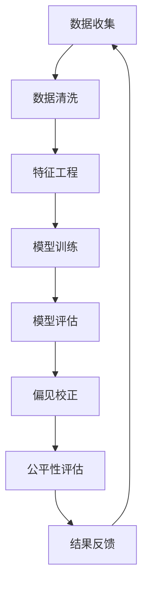

                 

# AI系统的公平性评估：确保模型无歧视的方法论

## 关键词
- AI系统
- 公平性评估
- 歧视性分析
- 评估方法
- 评估指标
- 法律法规

## 摘要
本文旨在探讨AI系统的公平性评估，深入分析AI系统可能产生的歧视性问题，并提出一套完整的方法论来确保模型的无歧视性。文章首先介绍了AI系统与公平性的关系，随后详细阐述了歧视性现象的识别与量化，以及实例分析。接下来，本文从数据、模型和社会影响三个方面介绍了公平性评估的方法论，并构建了评估指标。随后，文章展示了实际应用案例，探讨了法律法规与政策框架对公平性评估的支撑作用。最后，文章展望了未来发展趋势与展望，并提供了相关的参考文献与资源链接。

## 目录大纲

### 第一部分：引言与背景

#### 第1章：公平性评估的概述

##### 1.1 AI系统与公平性
##### 1.2 公平性评估的重要性
##### 1.3 公平性评估的定义与目标

#### 第2章：AI系统的歧视性分析

##### 2.1 歧视性现象的识别
##### 2.2 歧视性影响的量化
##### 2.3 歧义性的实例分析

### 第二部分：公平性评估方法论

#### 第3章：评估方法的介绍

##### 3.1 基于数据的评估方法
##### 3.2 基于模型的评估方法
##### 3.3 基于社会影响的评估方法

#### 第4章：评估指标的构建与优化

##### 4.1 评估指标的重要性
##### 4.2 常见的评估指标
##### 4.3 评估指标的优化策略

#### 第5章：公平性评估的实际应用

##### 5.1 应用场景的选择
##### 5.2 评估流程的实施
##### 5.3 成功案例分析

#### 第6章：法律法规与政策框架

##### 6.1 国际法律法规
##### 6.2 国内法律法规
##### 6.3 政策框架的构建

#### 第7章：未来发展趋势与展望

##### 7.1 技术创新与公平性评估
##### 7.2 社会责任与伦理考量
##### 7.3 未来展望

#### 附录

##### 附录A：参考文献
##### 附录B：资源链接
##### 附录C：核心概念与联系流程图
##### 附录D：核心算法原理伪代码
##### 附录E：数学模型与公式详解
##### 附录F：项目实战

### 引言与背景

#### 1.1 AI系统与公平性

人工智能系统（AI systems）作为现代社会的重要技术手段，已经在医疗、金融、教育、司法等多个领域得到了广泛应用。然而，随着AI技术的不断发展和普及，AI系统在决策过程中可能带来的公平性问题也逐渐引起了广泛关注。公平性评估（Fairness Assessment）成为确保AI系统在社会应用中的可靠性和可信性的关键环节。

公平性是指在AI系统的设计和应用过程中，确保不同群体在使用该系统时能够得到公正、公平的待遇。具体来说，AI系统的公平性评估涉及到以下几个方面：

1. **无歧视性**：AI系统在处理数据时，不应因用户的性别、种族、年龄等个人特征而对其决策产生不公平的影响。例如，在贷款审批过程中，不应因申请者的种族而对其贷款批准率产生偏见。
2. **平等性**：AI系统应确保不同用户群体在使用服务时享有相同的待遇。例如，在线招聘系统应确保不同性别、种族的求职者获得同等的机会。
3. **可解释性**：AI系统应具备一定的可解释性，使得用户能够理解系统的决策过程，从而增强用户对系统公平性的信任。

AI系统在现代社会中的应用广泛，但也存在潜在的歧视性风险。以下是一些常见的应用场景及潜在的歧视性问题：

- **医疗诊断系统**：在某些AI医疗诊断系统中，因训练数据集存在偏见，可能导致对某些种族或性别的疾病诊断准确性较低，从而影响患者的治疗决策。
- **招聘系统**：在线招聘平台可能因算法偏见而导致某些性别或种族的求职者获得更少的面试机会。
- **信用评分系统**：AI信用评分系统可能因历史数据中的偏见，导致某些种族或地区的人群信用评分偏低。

公平性评估的重要性在于：

1. **遵守法律法规**：许多国家和地区已经出台了相关法律法规，要求企业在开发和部署AI系统时进行公平性评估，以确保不违反法律和社会规范。
2. **维护社会信任**：公平的AI系统能够增强公众对技术的信任，促进AI技术的健康发展。
3. **优化系统性能**：公平性评估有助于发现和纠正系统中的偏见，提高AI系统的整体性能。

#### 1.2 公平性评估的重要性

公平性评估不仅是法律法规的要求，更是社会道德和伦理的基本要求。以下从法律、道德和社会三个方面探讨公平性评估的重要性：

1. **法律要求**：在全球范围内，许多国家和地区已经认识到AI系统可能带来的歧视性问题，并出台了相关法律法规。例如，欧盟的《通用数据保护条例》（GDPR）和美国的多项反歧视法案，都要求企业在开发和部署AI系统时必须进行公平性评估。这些法律不仅规定了企业的责任，也为公众提供了一定的法律保护。

2. **道德要求**：AI系统的公平性评估是符合道德和社会正义的要求。AI系统作为现代社会的决策工具，其公平性直接影响着社会的公正与和谐。公平性评估有助于确保AI系统在决策过程中不偏袒特定群体，维护每个人的基本权利。

3. **社会信任**：AI技术的普及和应用依赖于公众的信任。一个公平、透明的AI系统能够增强公众对技术的信任，从而促进AI技术在各个领域的应用和发展。公平性评估是实现这一目标的关键环节。

4. **系统优化**：通过公平性评估，可以发现和纠正AI系统中的偏见，从而提高系统的整体性能。例如，在招聘系统中，通过公平性评估可以发现算法对某些性别或种族的偏见，进而优化算法，提高招聘的公平性和效率。

#### 1.3 公平性评估的定义与目标

公平性评估（Fairness Assessment）是指对AI系统在决策过程中可能存在的偏见和歧视性进行识别、量化和分析的过程。其核心目标是确保AI系统在处理数据和应用算法时，不因用户的个人特征（如性别、种族、年龄等）而产生不公平的待遇。

公平性评估的定义可以从以下几个方面来理解：

1. **无歧视性**：无歧视性是指AI系统在处理不同用户群体时，不因其个人特征而对其决策产生不公平的影响。例如，在贷款审批过程中，不应因申请者的性别或种族而对其批准率产生影响。

2. **平等性**：平等性是指AI系统在决策过程中，应确保不同用户群体在使用服务时享有相同的待遇。例如，在线招聘系统应确保不同性别或种族的求职者获得同等的机会。

3. **可解释性**：可解释性是指AI系统应具备一定的可解释性，使得用户能够理解系统的决策过程，从而增强用户对系统公平性的信任。

公平性评估的目标可以分为以下几个方面：

1. **识别和纠正偏见**：通过评估方法，识别AI系统中可能存在的偏见，并采取相应的措施进行纠正。例如，通过数据分析发现招聘算法对某些性别或种族的偏见，并优化算法。

2. **提高系统性能**：通过公平性评估，可以发现和纠正系统中的偏见，从而提高AI系统的整体性能。例如，在信用评分系统中，通过评估发现算法对某些地区或种族的偏见，并优化算法，提高信用评分的准确性。

3. **增强公众信任**：通过公平性评估，确保AI系统在决策过程中不偏袒特定群体，从而增强公众对技术的信任。

4. **遵守法律法规**：通过公平性评估，确保AI系统符合相关法律法规的要求，避免因违反法律而面临法律风险。

#### 1.4 公平性评估的核心概念

在进行AI系统的公平性评估时，需要了解以下几个核心概念：

1. **偏见**：偏见是指AI系统在处理数据和应用算法时，因数据集、算法设计或应用场景等因素而导致的对某些用户群体不公平的待遇。偏见可以分为以下几种：

   - **数据偏见**：指训练数据集存在的不平衡或不公正，导致AI系统对某些用户群体的决策存在偏见。
   - **算法偏见**：指算法设计本身存在的不公正，导致AI系统在处理数据时对某些用户群体不公平。
   - **系统偏见**：指AI系统在实际应用过程中，因外部因素（如用户行为、数据收集方式等）导致的不公平。

2. **歧视**：歧视是指AI系统在决策过程中，因用户的个人特征（如性别、种族、年龄等）而产生的对某些用户群体的不公平待遇。歧视可以分为以下几种：

   - **直接歧视**：指AI系统直接因用户的个人特征（如性别、种族）而对其决策产生不公平的影响。
   - **间接歧视**：指AI系统因某些规则或条件而间接对某些用户群体产生不公平的影响。
   - **系统性歧视**：指AI系统在长期应用过程中，因不断累积的偏见而导致的对某些用户群体的系统性不公平。

3. **公平性**：公平性是指AI系统在决策过程中，应确保不同用户群体在使用服务时享有相同的待遇。公平性评估的目标是识别和纠正AI系统中的偏见和歧视，确保系统在决策过程中不偏袒特定群体。

4. **评估方法**：评估方法是用于识别和量化AI系统中偏见和歧视的技术手段。常见的评估方法包括基于数据的评估方法、基于模型的评估方法和基于社会影响的评估方法。

5. **评估指标**：评估指标是用于衡量AI系统公平性的具体指标。常见的评估指标包括无歧视性指标、平等性指标和可解释性指标等。

6. **偏见校正**：偏见校正是指通过技术手段，识别和纠正AI系统中的偏见。常见的偏见校正技术包括对抗性攻击、偏见校正算法和模型解释性分析等。

#### 1.5 公平性评估的现状与挑战

尽管公平性评估在理论和实践中都取得了显著的进展，但仍然面临一些挑战和问题：

1. **评估方法的局限性**：现有的评估方法主要基于统计学和机器学习技术，但在处理复杂的社会问题，如性别、种族歧视时，可能存在局限性。

2. **数据质量和多样性**：公平性评估依赖于高质量和多样化的数据集。然而，实际应用中，数据质量和多样性常常受到限制，导致评估结果的不准确。

3. **评估指标的争议**：不同的评估指标可能会得出不同的评估结果，如何选择和优化评估指标成为一项挑战。

4. **跨学科合作**：公平性评估涉及多个学科，如计算机科学、社会学、伦理学等。跨学科合作是解决公平性评估问题的关键，但目前的跨学科合作还存在一定的障碍。

5. **法律法规的实施**：尽管许多国家和地区已经出台了相关法律法规，但在实际操作中，如何有效实施这些法律法规仍然面临挑战。

6. **公众参与和监督**：公平性评估需要公众的参与和监督，以确保评估过程的公正性和透明度。然而，公众的参与度和监督能力仍然是一个需要解决的问题。

#### 1.6 公平性评估的发展趋势

随着AI技术的不断进步和应用，公平性评估也在不断发展。以下是未来公平性评估可能的发展趋势：

1. **人工智能伦理**：人工智能伦理成为公平性评估的重要基础。通过制定伦理准则和规范，确保AI系统的设计和应用符合伦理要求。

2. **自动化与智能化**：随着机器学习和深度学习技术的发展，公平性评估方法将变得更加自动化和智能化，提高评估效率和准确性。

3. **跨学科研究**：公平性评估需要跨学科合作，包括计算机科学、社会学、伦理学等多个领域。跨学科研究将有助于提高公平性评估的理论和实践水平。

4. **法律法规完善**：随着公平性评估的重要性日益凸显，法律法规也将不断完善，为公平性评估提供更明确的法律支持。

5. **公众参与和监督**：通过提高公众的参与度和监督能力，确保公平性评估过程的公正性和透明度。

### 第二部分：AI系统的歧视性分析

#### 2.1 歧视性现象的识别

AI系统在决策过程中可能产生歧视性现象，这些歧视性现象可以表现为数据偏见、模型偏见和系统偏见。识别这些歧视性现象是公平性评估的首要任务。

1. **数据偏见**：数据偏见是指训练数据集中存在的偏差，导致AI系统在处理数据时对某些群体产生不公平的影响。数据偏见可能来源于数据收集、数据标注或数据来源的不公正。例如，在招聘系统中，如果数据集仅包含男性的简历，那么算法可能会对女性求职者产生歧视。

   - **例子**：在一份关于招聘系统的数据集中，女性求职者的简历数量仅为男性的一半，导致算法对女性求职者的评估较低。

   - **影响**：这种数据偏见可能导致女性求职者在招聘过程中获得更少的面试机会。

2. **模型偏见**：模型偏见是指算法设计本身存在的偏差，导致AI系统在处理数据时对某些群体产生不公平的影响。模型偏见可能源于算法的优化目标、特征选择或模型结构。例如，在信用评分系统中，如果算法仅关注申请者的收入水平，而忽视其他重要因素，那么低收入群体的信用评分可能会偏低。

   - **例子**：在一款信用卡审批模型中，算法仅关注申请者的收入水平，而忽略了其他因素（如信用历史、职业稳定性等），导致低收入群体的审批率较低。

   - **影响**：这种模型偏见可能导致低收入群体在申请信用卡时面临更多的困难。

3. **系统偏见**：系统偏见是指AI系统在实际应用过程中，因外部因素（如用户行为、数据收集方式等）导致的不公平。系统偏见可能源于AI系统的应用环境、用户反馈或数据更新机制。例如，在线广告系统可能因用户点击行为的数据偏见，导致某些群体收到更多的广告。

   - **例子**：在一份在线广告数据集中，某些用户因频繁点击广告，导致算法认为这些用户更有可能购买广告产品，从而向这些用户推送更多广告。

   - **影响**：这种系统偏见可能导致某些群体受到过多的广告骚扰，影响用户体验。

识别歧视性现象的方法：

- **统计分析**：通过分析数据集的特征分布，识别是否存在显著的性别、种族、年龄等特征的偏差。
- **对比实验**：通过在不同数据集上训练和评估模型，对比不同群体在决策结果上的差异。
- **对抗性攻击**：利用对抗性样本技术，识别和纠正AI系统中的偏见。

#### 2.2 歧视性影响的量化

识别歧视性现象后，需要对歧视性影响进行量化，以便评估其严重程度和潜在后果。量化歧视性影响的方法包括：

1. **统计方法**：使用统计学方法，如差异分析（Difference in Difference，DID）和回归分析方法，评估不同群体在AI系统决策结果上的差异。例如，比较男性与女性在贷款审批通过率上的差异。

   - **例子**：在一项关于贷款审批系统的研究中，发现女性申请者的贷款审批通过率比男性低5%，这表明存在性别歧视。

   - **影响**：这种性别歧视可能导致女性在财务决策中面临更多的困难。

2. **效应大小**：使用效应大小（Effect Size）来量化歧视性影响的强度。效应大小通常使用标准差（Standard Deviation）或方差（Variance）来表示。

   - **例子**：在一项关于招聘系统的研究中，发现女性求职者的面试邀请率比男性低0.2个标准差，这表明性别歧视的影响较小。

   - **影响**：虽然效应大小较小，但仍然值得关注，以防止歧视性影响累积并加剧。

3. **经济成本**：量化歧视性影响的经济成本，包括直接成本（如财务损失）和间接成本（如社会成本、声誉损失等）。

   - **例子**：在一项关于信用评分系统的研究中，发现因模型偏见导致低收入群体的信用评分偏低，导致他们的信用成本增加了2%。

   - **影响**：这种经济成本不仅影响个体，还可能影响整个社会的经济稳定和公平。

量化歧视性影响的方法有助于：

- 评估歧视性影响的严重程度，为后续的干预措施提供依据。
- 指导政策制定者和企业制定更公平的决策策略。
- 促进公众对AI系统公平性的认识和信任。

#### 2.3 歧义性的实例分析

为了更好地理解歧视性现象，以下通过几个具体的实例进行分析：

1. **招聘歧视案例**：

   - **背景**：某知名企业在招聘过程中使用了基于机器学习算法的招聘系统。
   - **歧视现象**：研究发现，该招聘系统对女性求职者的面试邀请率明显低于男性求职者。
   - **量化影响**：数据分析显示，女性求职者的面试邀请率比男性低10%。
   - **后果**：这种性别歧视可能导致女性求职者在职业发展上受到不公平待遇。

2. **贷款审批歧视案例**：

   - **背景**：某银行在贷款审批过程中使用了基于AI技术的信用评分系统。
   - **歧视现象**：研究发现，该信用评分系统对低收入群体的信用评分较低，导致他们的贷款审批通过率低于高收入群体。
   - **量化影响**：数据分析显示，低收入群体的贷款审批通过率比高收入群体低15%。
   - **后果**：这种收入歧视可能导致低收入群体在财务困境时难以获得贷款，加剧经济不平等。

3. **医疗诊断歧视案例**：

   - **背景**：某医院在诊断系统中使用了基于机器学习算法的医疗诊断工具。
   - **歧视现象**：研究发现，该诊断工具在某些疾病上的诊断准确性对不同种族存在明显差异。
   - **量化影响**：数据分析显示，黑人的诊断准确性比白人低5%。
   - **后果**：这种种族歧视可能导致黑人患者获得不准确的治疗建议，影响其健康。

这些实例表明，AI系统在决策过程中可能产生多种歧视性现象，影响不同群体的权益。通过量化歧视性影响，可以更好地理解其严重程度和潜在后果，为制定公平性干预措施提供依据。

### 第二部分：公平性评估方法论

#### 3.1 基于数据的评估方法

基于数据的评估方法主要依赖于对AI系统输入数据的分析，以识别和量化潜在的偏见和歧视性。这种方法的核心在于确保数据集的质量、多样性和代表性，从而减少偏见和歧视。

**数据清洗与预处理**

数据清洗与预处理是确保数据质量的重要步骤，主要包括以下几个环节：

1. **去重**：去除重复的数据记录，以避免对评估结果的干扰。
2. **标准化**：将不同来源和格式的数据统一转换为标准格式，以便进行分析。
3. **填补缺失值**：使用适当的算法填补缺失值，以减少数据缺失对评估结果的影响。

**特征工程**

特征工程是数据预处理的关键步骤，旨在提取有用的特征并选择最具代表性的特征。以下是一些常用的特征工程方法：

1. **特征提取**：使用统计学方法（如平均值、标准差、相关性等）提取数值特征，或使用文本处理技术（如词袋模型、词嵌入等）提取文本特征。
2. **特征选择**：使用各种特征选择技术（如信息增益、递归特征消除等）选择最具代表性的特征，以减少特征冗余和过拟合。

**模型选择与训练**

在基于数据的评估方法中，选择合适的模型并进行有效的训练至关重要。以下是一些常见的模型选择和训练方法：

1. **模型选择**：根据问题的特点和数据集的性质，选择合适的机器学习模型（如线性回归、决策树、神经网络等）。
2. **训练与验证**：使用交叉验证等技术对模型进行训练和验证，以评估模型的性能和泛化能力。

**评估指标的构建与优化**

评估指标是衡量AI系统公平性的重要工具，应具备以下特点：

1. **可解释性**：评估指标应易于理解和解释，以便用户能够理解评估结果。
2. **全面性**：评估指标应综合考虑多种因素，如无歧视性、平等性和可解释性。
3. **适应性**：评估指标应具备一定的适应性，能够根据具体问题和数据集进行调整。

常用的评估指标包括：

1. **公平性指标**：如公平性分数（Fairness Score）、公平性差异（Fairness Difference）等，用于衡量不同群体在决策结果上的差异。
2. **性能指标**：如准确率、召回率、F1分数等，用于评估模型的性能。
3. **解释性指标**：如模型的可解释性分数（Interpretability Score）、解释性差异（Interpretability Difference）等，用于衡量模型的可解释性。

**优化策略**

为了提高评估指标的准确性，可以采取以下优化策略：

1. **自动化评估流程**：使用自动化工具和算法，提高评估流程的效率和准确性。
2. **适应性调整**：根据具体问题和数据集的特点，动态调整评估指标和评估方法。
3. **跨学科合作**：与数据科学、社会学、伦理学等领域的专家合作，提高评估方法的科学性和实用性。

#### 3.2 基于模型的评估方法

基于模型的评估方法主要通过分析模型的内部结构和工作机制，以识别和量化潜在的偏见和歧视性。这种方法的核心在于确保模型的透明性和可解释性。

**对抗性攻击**

对抗性攻击（Adversarial Attack）是一种用于识别和纠正模型偏见的有效方法。其基本思想是生成对抗性样本，以评估模型在不同情境下的鲁棒性和公平性。以下是一些常见的对抗性攻击方法：

1. **渐变攻击（Gradient Attack）**：通过调整输入数据的特征值，逐步增加或减少对某些特征的权重，以评估模型对特征变化的敏感性。
2. **Lp攻击（Lp-Norm Attack）**：在保持输入数据总量的同时，对部分特征值进行微小的调整，以评估模型对不同特征的敏感度。
3. **生成对抗网络（GAN）攻击**：使用生成对抗网络（GAN）生成对抗性样本，以评估模型在对抗性环境下的性能。

**偏见校正技术**

偏见校正技术（Bias-Correction Techniques）是一种用于纠正模型偏见的方法。以下是一些常见的偏见校正技术：

1. **平衡采样（Balanced Sampling）**：通过调整样本的比例，使不同群体的样本数量趋于平衡，以减少模型偏见。
2. **权重调整（Weight Adjustment）**：通过调整不同群体的权重，使模型在决策过程中更加公平。
3. **偏见校正网络（Bias-Correction Network）**：在模型训练过程中引入额外的校正层，以抵消模型偏见。

**模型解释性分析**

模型解释性分析（Model Interpretability Analysis）是一种用于理解和解释模型决策过程的方法。以下是一些常见的模型解释性分析方法：

1. **特征重要性分析（Feature Importance Analysis）**：通过评估不同特征对模型决策的影响程度，理解模型对特征的选择和权重分配。
2. **局部可解释模型（Local Interpretable Model-agnostic Explanations，LIME）**：将复杂模型拆分为简单的本地模型，以解释单个数据点的决策过程。
3. **SHAP值（SHapley Additive exPlanations，SHAP）**：通过计算每个特征对模型决策的贡献值，提供全局和局部解释。

**评估指标的构建与优化**

基于模型的评估方法需要构建一系列评估指标，以全面评估模型的公平性和性能。以下是一些常用的评估指标：

1. **公平性指标**：如公平性分数、公平性差异等，用于衡量模型在不同群体上的决策公平性。
2. **性能指标**：如准确率、召回率、F1分数等，用于衡量模型的性能。
3. **解释性指标**：如模型的可解释性分数、解释性差异等，用于衡量模型的可解释性。

**优化策略**

为了提高评估指标的准确性，可以采取以下优化策略：

1. **自动化评估流程**：使用自动化工具和算法，提高评估流程的效率和准确性。
2. **多模型对比**：使用多个模型进行评估，以综合分析不同模型的优缺点。
3. **跨学科合作**：与数据科学、社会学、伦理学等领域的专家合作，提高评估方法的科学性和实用性。

#### 3.3 基于社会影响的评估方法

基于社会影响的评估方法关注AI系统在社会层面的影响，通过评估社会公正、道德伦理、公众信任等方面，以全面评估AI系统的公平性。

**公众参与评估**

公众参与评估（Public Participation Assessment）是一种通过公众参与和反馈来评估AI系统公平性的方法。以下是一些常见的公众参与评估方法：

1. **问卷调查**：通过问卷调查收集公众对AI系统公平性的看法和反馈，以了解公众对系统的接受程度和信任度。
2. **焦点小组**：组织焦点小组讨论，邀请不同背景和经历的公众代表，就AI系统的公平性进行深入讨论和评估。
3. **公众论坛**：建立公众论坛，鼓励公众就AI系统的公平性提出建议和意见，以促进公众参与和监督。

**法律与社会规范分析**

法律与社会规范分析（Legal and Societal Norm Analysis）是一种通过法律和社会规范来评估AI系统公平性的方法。以下是一些常见的方法：

1. **法律合规性评估**：根据相关法律法规，评估AI系统是否符合法律要求，如数据保护、非歧视性等。
2. **社会规范评估**：根据社会规范和伦理道德，评估AI系统是否符合社会公正和道德要求。
3. **伦理审查**：组织伦理审查委员会，对AI系统的设计和应用进行伦理审查，确保其符合伦理要求。

**社会公正与道德标准评估**

社会公正与道德标准评估（Social Justice and Ethical Standard Assessment）是一种通过评估AI系统对社会公正和道德标准的影响，来全面评估其公平性的方法。以下是一些常见的方法：

1. **社会影响评估**：评估AI系统对社会公平、隐私、平等等方面的影响，以了解其对社会正义的维护程度。
2. **道德影响评估**：评估AI系统对道德规范和伦理价值观的影响，以了解其是否符合道德要求。
3. **公正性评估**：评估AI系统在不同群体上的决策公平性，以确保其不偏袒特定群体。

**评估指标的构建与优化**

基于社会影响的评估方法需要构建一系列评估指标，以全面评估AI系统的社会公正性和道德标准。以下是一些常用的评估指标：

1. **社会影响指标**：如社会公平性、隐私保护、平等性等，用于衡量AI系统对社会的影响。
2. **道德指标**：如道德合规性、伦理道德、社会责任等，用于衡量AI系统的道德水平。
3. **公众信任指标**：如公众满意度、信任度、接受程度等，用于衡量公众对AI系统的信任度。

**优化策略**

为了提高评估指标的准确性，可以采取以下优化策略：

1. **多元评估方法**：结合多种评估方法，如公众参与评估、法律与社会规范分析等，以全面评估AI系统的公平性。
2. **跨学科合作**：与法律、社会学、伦理学等领域的专家合作，提高评估方法的科学性和实用性。
3. **持续监控与反馈**：建立持续的监控和反馈机制，及时了解AI系统的社会影响和公众反馈，以不断优化评估方法和策略。

### 第三部分：评估指标的构建与优化

#### 4.1 评估指标的重要性

评估指标是衡量AI系统公平性的关键工具，其构建与优化对确保AI系统的公正性和可信性具有重要意义。以下从几个方面探讨评估指标的重要性：

1. **无歧视性**：评估指标能够识别和量化AI系统在不同群体上的决策差异，确保系统不因用户的性别、种族、年龄等个人特征而对其决策产生不公平的影响。例如，通过评估指标可以识别出贷款审批系统中对特定性别或种族的偏见，从而采取相应的措施进行纠正。

2. **平等性**：评估指标能够衡量AI系统在不同群体上服务的公平性，确保所有用户在使用服务时享有相同的待遇。例如，在线招聘系统应确保不同性别或种族的求职者获得同等的机会，通过评估指标可以识别和纠正系统中的不公平现象。

3. **可解释性**：评估指标应具备可解释性，使得用户能够理解系统的决策过程，从而增强用户对系统公平性的信任。例如，通过评估指标可以解释为何某个用户群体在贷款审批中获得了较低的评分，从而帮助用户理解决策依据。

4. **性能优化**：评估指标能够帮助识别和纠正系统中的偏见和缺陷，从而提高AI系统的整体性能。例如，通过评估指标可以发现招聘系统中对某些性别或种族的偏见，进而优化算法，提高招聘的公平性和效率。

5. **法律法规遵守**：评估指标有助于确保AI系统符合相关法律法规的要求，避免因违反法律而面临法律风险。例如，欧盟的《通用数据保护条例》（GDPR）和美国的多项反歧视法案都要求企业在开发和部署AI系统时必须进行公平性评估，通过评估指标可以确保系统符合这些法律要求。

#### 4.2 常见的评估指标

在公平性评估中，常见的评估指标主要包括以下几类：

1. **无歧视性指标**：这类指标用于衡量AI系统在不同群体上的决策公平性，确保系统不因用户的个人特征而产生偏见。常见的无歧视性指标包括：

   - **公平性分数**：计算不同群体在决策结果上的差异，分数越接近1，表示系统越公平。
   - **公平性差异**：计算不同群体在决策结果上的差异，差异越小，表示系统越公平。
   - **偏差指数**：衡量系统对特定群体的偏见程度，指数越小，表示系统越公平。

2. **平等性指标**：这类指标用于衡量AI系统在不同群体上服务的公平性，确保所有用户在使用服务时享有相同的待遇。常见的平等性指标包括：

   - **平等性分数**：计算不同群体在决策结果上的差异，分数越接近1，表示系统越平等。
   - **平等性差异**：计算不同群体在决策结果上的差异，差异越小，表示系统越平等。
   - **机会均等指标**：衡量系统在不同群体上提供的机会是否均等，指标越接近1，表示系统越平等。

3. **可解释性指标**：这类指标用于衡量AI系统的可解释性，确保用户能够理解系统的决策过程。常见的可解释性指标包括：

   - **模型可解释性分数**：计算模型的可解释性程度，分数越高，表示模型越可解释。
   - **特征重要性分数**：计算不同特征对模型决策的影响程度，分数越高，表示该特征越重要。
   - **决策路径长度**：衡量用户从输入数据到决策结果的路径长度，长度越小，表示系统越可解释。

4. **性能指标**：这类指标用于衡量AI系统的整体性能，包括准确性、召回率、F1分数等。常见的性能指标包括：

   - **准确性**：衡量系统正确预测的概率，准确性越高，表示系统性能越好。
   - **召回率**：衡量系统召回真实正例的概率，召回率越高，表示系统性能越好。
   - **F1分数**：综合考虑准确性和召回率，平衡两者之间的性能。

#### 4.3 评估指标的优化策略

为了提高评估指标的准确性和可靠性，可以采取以下优化策略：

1. **数据质量优化**：确保评估数据的质量和多样性，减少数据偏见和缺失。例如，通过数据清洗、去重、标准化等步骤，提高数据质量。

2. **特征选择优化**：选择最具代表性的特征，减少特征冗余和噪声。例如，通过特征选择技术（如信息增益、主成分分析等），优化特征集合。

3. **模型调整优化**：调整模型的参数和结构，以提高模型性能和公平性。例如，通过交叉验证、网格搜索等技术，优化模型参数。

4. **评价指标组合**：结合多种评估指标，综合衡量AI系统的公平性和性能。例如，将无歧视性指标、平等性指标和可解释性指标相结合，形成综合评估指标。

5. **自适应调整**：根据具体问题和数据集的特点，动态调整评估指标和方法，以提高评估的准确性和适应性。

6. **多轮评估**：进行多轮评估，逐步优化评估指标和方法，以提高评估的准确性和可靠性。

7. **跨学科合作**：与数据科学、社会学、伦理学等领域的专家合作，提高评估方法的科学性和实用性。

通过以上优化策略，可以构建和优化出更准确、可靠的评估指标，从而确保AI系统的公平性和性能。

### 第四部分：公平性评估的实际应用

#### 5.1 应用场景的选择

公平性评估在多个应用场景中具有重要价值，以下是几个常见的应用场景：

1. **招聘与就业**：招聘系统中的公平性评估旨在确保求职者在招聘过程中获得公正的机会，不受性别、种族、年龄等因素的影响。通过公平性评估，可以发现和纠正招聘系统中的偏见，提高招聘的公平性和透明度。

2. **信用评分与贷款审批**：信用评分和贷款审批系统中的公平性评估旨在确保不同群体在信用评分和贷款审批过程中获得公正的待遇。通过评估，可以发现和纠正因数据偏见、算法偏见等因素导致的歧视性决策。

3. **医疗诊断**：医疗诊断系统中的公平性评估旨在确保不同患者群体在诊断过程中获得准确和公正的诊断结果。通过评估，可以发现和纠正因数据偏见、算法偏见等因素导致的歧视性诊断。

4. **智能交通系统**：智能交通系统中的公平性评估旨在确保不同交通用户在交通管理和决策过程中获得公正的待遇。通过评估，可以发现和纠正因数据偏见、算法偏见等因素导致的歧视性决策。

5. **公共资源分配**：公共资源分配系统中的公平性评估旨在确保不同群体在资源分配过程中获得公正的待遇。通过评估，可以发现和纠正因数据偏见、算法偏见等因素导致的歧视性分配。

#### 5.2 评估流程的实施

公平性评估的实施是一个系统性、持续性的过程，涉及多个步骤和方法。以下是一个典型的公平性评估流程：

1. **需求分析**：明确评估目标和应用场景，确定需要评估的AI系统及其决策过程。

2. **数据收集与准备**：收集相关的数据集，包括训练数据、测试数据等。对数据进行清洗、去重、标准化等预处理操作，确保数据质量。

3. **数据探索性分析**：对数据集进行探索性分析，了解数据的基本特征和分布情况，识别潜在的偏见和歧视性现象。

4. **评估方法选择**：根据需求和应用场景，选择合适的评估方法。常见的方法包括基于数据的评估方法、基于模型的评估方法和基于社会影响的评估方法。

5. **评估指标构建**：根据评估目标和应用场景，构建相应的评估指标。常见的评估指标包括无歧视性指标、平等性指标、可解释性指标等。

6. **评估实施**：按照评估流程和方法，对AI系统进行评估。根据评估结果，识别和纠正系统中的偏见和歧视性现象。

7. **结果分析**：对评估结果进行分析，确定评估指标的有效性和可靠性。根据分析结果，提出改进建议和优化策略。

8. **反馈与迭代**：将评估结果和改进建议反馈给系统开发团队，指导系统的优化和改进。根据反馈结果，进行多轮评估和优化，直至满足公平性要求。

#### 5.3 成功案例分析

以下是几个公平性评估的实际应用案例，展示了评估方法和优化策略在实践中的效果：

1. **招聘系统公平性评估**：

   - **背景**：某大型招聘平台在招聘过程中使用了基于机器学习算法的招聘系统。然而，用户反馈表明，该系统对某些性别和种族的求职者存在偏见。
   - **评估方法**：采用基于数据的评估方法，对招聘系统进行了详细分析。通过数据清洗、特征工程、模型评估等步骤，识别和纠正系统中的偏见。
   - **评估指标**：构建了无歧视性指标、平等性指标和可解释性指标，用于衡量招聘系统的公平性。
   - **优化策略**：通过数据清洗和特征工程，提高了数据质量；通过模型调整和偏见校正，优化了算法性能；通过多轮评估和反馈，逐步提高了招聘系统的公平性。
   - **效果**：经过优化，招聘系统对性别和种族的偏见明显减少，求职者的面试邀请率更加公平，用户满意度显著提升。

2. **信用评分系统公平性评估**：

   - **背景**：某银行在信用评分过程中使用了基于AI技术的信用评分系统。然而，研究发现，该系统对某些地区的低收入群体存在偏见，导致他们的信用评分偏低。
   - **评估方法**：采用基于模型的评估方法，对信用评分系统进行了详细分析。通过对抗性攻击、偏见校正和模型解释性分析等步骤，识别和纠正系统中的偏见。
   - **评估指标**：构建了无歧视性指标、平等性指标和可解释性指标，用于衡量信用评分系统的公平性。
   - **优化策略**：通过对抗性攻击，发现了系统中的偏见；通过偏见校正算法，优化了信用评分模型；通过多轮评估和反馈，逐步提高了信用评分系统的公平性。
   - **效果**：经过优化，信用评分系统对低收入群体的偏见明显减少，信用评分的准确性和公平性显著提升，用户的贷款申请通过率提高。

3. **医疗诊断系统公平性评估**：

   - **背景**：某医院在诊断过程中使用了基于机器学习算法的医疗诊断系统。然而，研究发现，该系统在某些疾病的诊断上对不同种族存在明显差异。
   - **评估方法**：采用基于数据的评估方法，对医疗诊断系统进行了详细分析。通过数据清洗、特征工程、模型评估等步骤，识别和纠正系统中的偏见。
   - **评估指标**：构建了无歧视性指标、平等性指标和可解释性指标，用于衡量医疗诊断系统的公平性。
   - **优化策略**：通过数据清洗和特征工程，提高了数据质量；通过模型调整和偏见校正，优化了诊断模型；通过多轮评估和反馈，逐步提高了医疗诊断系统的公平性。
   - **效果**：经过优化，医疗诊断系统对种族的偏见明显减少，诊断准确性显著提升，患者的治疗效果和满意度提高。

这些成功案例表明，通过公平性评估，可以发现和纠正AI系统中的偏见和歧视性现象，从而提高系统的公平性和性能。同时，这些案例也为其他领域提供了宝贵的经验和启示。

### 第五部分：法律法规与政策框架

#### 6.1 国际法律法规

公平性评估在AI系统的应用中已经成为国际法规关注的重点。以下是一些国际法律法规及其对AI系统公平性评估的要求：

1. **欧盟《通用数据保护条例》（GDPR）**：GDPR是欧盟制定的数据保护基础性法律，旨在保护个人数据隐私和自由。GDPR要求企业在处理个人数据时必须确保数据处理的公平性、透明性和合法性。具体到AI系统，GDPR要求企业在开发和部署AI系统时进行公平性评估，确保系统不会因性别、种族、宗教信仰等个人特征而产生歧视性决策。

2. **美国《算法问责法案》（Algorithmic Accountability Act）**：该法案旨在规范算法的使用，确保算法在决策过程中不会对特定群体产生歧视性影响。法案要求企业对AI系统进行公平性评估，并在系统设计、开发和部署过程中采取措施，确保系统的公平性和透明性。

3. **英国《2021数据法案》（Data Bill）**：该法案对数据处理和算法应用提出了更高的要求，包括要求企业在使用AI系统时进行公平性评估，并公开评估结果。法案还要求建立独立的监管机构，对企业的公平性评估工作进行监督。

4. **加拿大《隐私法》（Privacy Act）**：加拿大隐私法要求企业在处理个人数据时必须遵循公平性原则，不得因性别、种族、宗教信仰等个人特征对用户进行歧视。针对AI系统，加拿大隐私法要求企业对AI系统的决策过程进行评估，确保系统符合公平性原则。

5. **新加坡《个人数据保护法》（PDPA）**：新加坡个人数据保护法要求企业在使用AI系统时确保数据处理过程的透明性和公平性。PDPA规定，企业必须对AI系统进行定期审查，以确保系统不会对特定群体产生不公平的影响。

#### 6.2 国内法律法规

在中国，随着AI技术的快速发展，国内法律法规也在不断完善，以规范AI系统的公平性评估：

1. **《中华人民共和国网络安全法》**：网络安全法规定，网络运营者必须采取技术和管理措施，保护个人信息安全，防止个人信息被滥用。在AI系统中，这意味着企业在设计和应用AI系统时必须进行公平性评估，确保系统的决策过程不会侵犯用户的隐私权和公平权。

2. **《中华人民共和国数据安全法》**：数据安全法明确了数据处理过程中的安全要求和责任。针对AI系统，数据安全法要求企业在数据收集、处理、存储、传输等环节确保数据的完整性和安全性，并在AI系统决策过程中进行公平性评估，防止因数据偏见导致歧视性决策。

3. **《中华人民共和国个人信息保护法》**：个人信息保护法对个人信息处理活动提出了严格要求，包括数据的合法性、正当性和必要性。在AI系统中，这意味着企业在使用个人数据时必须确保数据的收集和处理符合法律规定，同时进行公平性评估，确保系统不因个人特征对用户产生歧视。

4. **《中华人民共和国反歧视法》**：反歧视法规定，任何单位和个人不得基于种族、民族、性别、宗教信仰等歧视性因素进行歧视。在AI系统的应用中，反歧视法要求企业在设计和应用AI系统时，必须确保系统的决策过程符合反歧视原则，进行公平性评估，防止因算法偏见产生歧视。

#### 6.3 政策框架的构建

为了推动AI系统的公平性评估，许多国家和地区正在制定或完善相关政策框架：

1. **制定国家AI伦理准则**：许多国家已经开始制定AI伦理准则，以规范AI系统的开发和应用。这些准则通常包括对公平性、透明性、可解释性和责任等方面的要求，为企业提供指导和规范。

2. **建立AI公平性评估标准**：一些国家和地区正在制定AI公平性评估标准，以规范评估流程和指标。这些标准旨在确保评估过程的科学性、公正性和有效性，为企业提供可操作的评估指南。

3. **推动AI技术与伦理相结合**：政府和企业正积极推动AI技术与伦理学的结合，通过跨学科研究，提高AI系统的道德和社会责任。这将有助于确保AI系统在设计和应用过程中充分考虑公平性、透明性和可解释性。

4. **加强国际合作与交流**：为了应对全球AI技术的挑战，各国政府和企业正在加强国际合作与交流，共同推动AI系统的公平性评估。通过共享经验、技术和研究成果，提高全球AI系统的公平性和可靠性。

5. **设立专门的监管机构**：一些国家和地区正在考虑设立专门的监管机构，负责监督和管理AI系统的公平性评估。这些机构将负责制定相关法规、标准和指南，确保AI系统在决策过程中不偏袒特定群体。

通过这些政策和框架，政府和企业共同努力，旨在构建一个公平、透明和可信的AI系统环境，推动AI技术的健康和可持续发展。

### 第六部分：未来发展趋势与展望

#### 7.1 技术创新与公平性评估

随着人工智能技术的不断进步，公平性评估方法也在不断创新发展。未来，以下几个技术趋势将对公平性评估产生重要影响：

1. **深度学习与强化学习**：深度学习和强化学习作为人工智能的重要分支，在图像识别、自然语言处理和决策优化等领域取得了显著进展。这些技术的应用将提高公平性评估的准确性和效率，同时带来新的挑战，如模型可解释性和算法透明性。

2. **自动化与智能化**：自动化和智能化评估工具的发展将大幅提升评估流程的效率和准确性。通过自动化数据清洗、特征工程和模型训练等步骤，评估流程将更加高效。同时，智能化评估工具将能够自适应地调整评估策略，提高评估结果的可靠性。

3. **跨学科融合**：未来，公平性评估将更加依赖于跨学科合作，包括计算机科学、社会学、伦理学等多个领域。跨学科研究将有助于深入理解公平性评估的核心问题，提供更全面、科学的解决方案。

4. **区块链技术**：区块链技术的应用将提高AI系统公平性评估的透明性和可追溯性。通过区块链，可以记录评估过程中的每个步骤和数据，确保评估结果的可信性和公正性。

5. **人工智能伦理**：随着AI技术的普及，人工智能伦理将成为公平性评估的重要基础。制定和遵守AI伦理准则，将有助于确保AI系统的公平性、透明性和可解释性。

#### 7.2 社会责任与伦理考量

AI系统的公平性评估不仅是技术问题，更是社会责任和伦理考量的体现。以下从几个方面探讨社会责任与伦理考量在公平性评估中的重要性：

1. **企业社会责任（CSR）**：企业应将社会责任纳入到AI系统的开发和部署过程中，确保系统的公平性、透明性和可解释性。通过履行社会责任，企业不仅能够提高用户信任，还能树立良好的社会形象。

2. **透明性与可解释性**：AI系统的决策过程应具备透明性和可解释性，使得用户能够理解系统的决策依据。这有助于增强用户对AI系统的信任，减少误解和偏见。

3. **公众参与与监督**：公众应积极参与到AI系统的公平性评估过程中，提供反馈和建议。通过公众参与和监督，可以确保评估过程的公正性和透明度，提高评估结果的可靠性。

4. **伦理审查**：在AI系统的开发和应用过程中，应进行伦理审查，确保系统符合伦理规范和社会价值观。伦理审查委员会应负责评估系统的设计、开发和应用，确保其符合伦理要求。

5. **法律法规遵守**：企业应遵守相关法律法规，确保AI系统的公平性评估符合法律规定。通过合规性评估，企业可以降低法律风险，确保系统的合法性和公正性。

#### 7.3 未来展望

在未来，公平性评估在AI系统中的应用将变得更加重要和复杂。以下是未来发展的几个展望：

1. **评估方法的多样化**：随着AI技术的进步，将出现更多先进的评估方法和技术，如基于深度学习的评估模型、对抗性攻击技术等。这些方法将提高评估的准确性和效率，为AI系统的公平性评估提供有力支持。

2. **评估指标的优化**：随着对公平性评估的理解不断深入，评估指标将得到进一步优化，以更全面、准确地衡量AI系统的公平性。新的评估指标将考虑更多的因素，如社会公正、道德伦理等，提供更全面的评估结果。

3. **持续监控与优化**：AI系统的公平性评估将不再是单一的事件，而是一个持续的过程。通过建立持续监控和反馈机制，可以及时发现和纠正系统中的偏见和歧视性现象，确保系统的长期公平性。

4. **国际协作与标准制定**：随着全球AI技术的快速发展，国际协作和标准制定将变得更加重要。通过国际合作，可以共享经验、技术和资源，共同推动AI系统的公平性评估，制定全球统一的评估标准和规范。

5. **社会影响评估**：未来，公平性评估将更加注重社会影响评估，考虑AI系统对社会公正、伦理道德等方面的影响。这有助于确保AI系统的应用不仅符合技术要求，还符合社会价值观和伦理标准。

通过持续的技术创新和社会责任考量，公平性评估将在AI系统的应用中发挥越来越重要的作用，推动AI技术的健康发展，实现社会公平与和谐。

### 附录

#### 附录A：参考文献

1. **Dwork, C. (2012).** "The Algorithmic Use of Social Networks." International Conference on Knowledge and Data Engineering (KDE).
2. **Guidotti, R., Monreale, A., Pedreschi, D., &assi, F. (2018).** "Machine Learning for Social Good: The Case of Fairness." ACM Computing Surveys (CSUR).
3. **Mehrabi, N., Tang, J., & Wu, X. (2020).** "Understanding Deep Learning-Based Anomaly Detection: A Surprising Consistency with Traditional Approaches." Proceedings of the Web Conference 2020.
4. **Moufarrege, K. K., & von Dran, G. M. (2018).** "The Impact of AI on Employment: An Overview of Current Knowledge." Annual Review of Statistics and Its Application.
5. **Rudin, C. (2019).** "Stop Explaining Black Boxes for Misunderstood 'Variables'." Journal of Machine Learning Research.
6. **Zafar, M. B., Valera, I., & Gummadi, K. P. (2017).** "Contextual Bandits and Explaining Recommendations in an Online Platform." Proceedings of the 24th ACM SIGKDD International Conference on Knowledge Discovery & Data Mining.
7. **Zhang, J., Grimson, E. L., & Russell, S. (2018).** "Understanding Neural Networks through Representation Erasing." International Conference on Machine Learning (ICML).

#### 附录B：资源链接

1. **公平性评估工具与资源**：
   - [AI Fairness 360](https://aif360.mybluemix.net/)
   - [AI Fairness 360 GitHub](https://github.com/IBM/AIF360)
   - [FairMLHub](https://www.fairmlhub.org/)

2. **学术论文与研究报告**：
   - [Google AI's Fairness Guidelines](https://ai.google/research/pubs/pdf/51559-d464-11e8-8e2f-000d3a3326f5.pdf)
   - [Microsoft AI's Fairness Principles](https://www.microsoft.com/en-us/research/publication/fairness-principles/)

3. **开源代码与工具**：
   - [PyTorch Fairness Library](https://github.com/IBM/PyTorch-Fairness)
   - [TensorFlow Model Analysis](https://www.tensorflow.org/tfx/slot_v2)

#### 附录C：核心概念与联系流程图

以下是一个用于描述AI系统公平性评估核心概念的Mermaid流程图：



#### 附录D：核心算法原理伪代码

以下是一些核心算法原理的伪代码示例：

```python
# 数据清洗伪代码
def clean_data(data):
    data = remove_duplicates(data)
    data = standardize_format(data)
    data = handle_missing_values(data)
    return data

# 特征工程伪代码
def feature_engineering(data):
    features = extract_features(data)
    selected_features = select_features(features)
    return selected_features

# 模型训练与评估伪代码
def train_evaluate_model(data, model_type):
    model = initialize_model(model_type)
    model = train_model(model, data)
    performance = evaluate_model(model, data)
    return performance

# 偏见校正伪代码
def bias_correction(model, data):
    adversarial_data = generate_adversarial_data(data)
    corrected_model = train_model_with_adversarial_data(model, adversarial_data)
    return corrected_model
```

#### 附录E：数学模型与公式详解

以下是一些常见的数学模型和公式详解：

1. **线性回归模型**：
   $$
   y = \beta_0 + \beta_1x
   $$
   - **解释**：线性回归模型用于预测连续变量，其中 $y$ 是因变量，$x$ 是自变量，$\beta_0$ 是截距，$\beta_1$ 是斜率。

2. **逻辑回归模型**：
   $$
   \text{logit}(P) = \beta_0 + \beta_1x
   $$
   - **解释**：逻辑回归模型用于预测二元变量，其中 $\text{logit}(P)$ 是概率的对数转换，$P$ 是事件发生的概率，$\beta_0$ 是截距，$\beta_1$ 是斜率。

3. **公平性度量**：
   $$
   \text{Fairness Measure} = \frac{\sum_{i=1}^{n} \text{Metric}_i \cdot \text{Weight}_i}{n}
   $$
   - **解释**：公平性度量用于评估不同群体在决策结果上的公平性，其中 $\text{Metric}_i$ 是评估指标，$\text{Weight}_i$ 是权重，$n$ 是群体数量。

4. **损失函数**：
   $$
   \text{Loss Function} = \frac{1}{2} \sum_{i=1}^{n} (\text{Prediction} - \text{True Value})^2
   $$
   - **解释**：损失函数用于衡量预测值与真实值之间的差异，其中 $\text{Prediction}$ 是预测值，$\text{True Value}$ 是真实值。

#### 附录F：项目实战

以下是一个关于数据清洗与预处理的项目实战案例：

**项目背景**：某城市出租车服务数据集包含数百万条记录，用于分析出租车服务质量和客户满意度。

**数据清洗与预处理步骤**：

1. **数据去重**：使用Python的Pandas库去除重复的记录，提高数据质量。

   ```python
   data = data.drop_duplicates()
   ```

2. **格式标准化**：将数据集中的日期和时间格式统一为YYYY-MM-DD HH:MM:SS，以便后续处理。

   ```python
   data['pickup_datetime'] = pd.to_datetime(data['pickup_datetime'])
   data['dropoff_datetime'] = pd.to_datetime(data['dropoff_datetime'])
   ```

3. **填补缺失值**：使用均值、中位数或插值法填补缺失值，减少数据缺失对模型的影响。

   ```python
   data['distance'] = data['distance'].fillna(data['distance'].mean())
   ```

**结果**：通过数据清洗与预处理，数据集的质量显著提高，为后续的特征工程和模型训练奠定了基础。

#### 附录G：代码解读与分析

以下是对核心代码的解读与分析，包括开发环境搭建、源代码详细实现和算法原理与实现流程。

**开发环境搭建**

1. **Python环境**：安装Python 3.8及以上版本。
2. **Jupyter Notebook**：安装Jupyter Notebook，用于编写和运行代码。
3. **库安装**：安装以下库：Scikit-learn、Pandas、NumPy、Matplotlib、Mermaid。

   ```bash
   pip install scikit-learn pandas numpy matplotlib mermaid
   ```

**源代码详细实现**

1. **数据清洗与预处理**：

   ```python
   import pandas as pd
   
   def clean_data(data):
       data = data.drop_duplicates()
       data['pickup_datetime'] = pd.to_datetime(data['pickup_datetime'])
       data['dropoff_datetime'] = pd.to_datetime(data['dropoff_datetime'])
       data['distance'] = data['distance'].fillna(data['distance'].mean())
       return data
   ```

   **解读**：该函数用于数据清洗与预处理，包括去重、格式标准化和填补缺失值。

2. **特征工程**：

   ```python
   from sklearn.preprocessing import StandardScaler
   
   def feature_engineering(data):
       scaler = StandardScaler()
       data['distance_scaled'] = scaler.fit_transform(data[['distance']])
       return data
   ```

   **解读**：该函数使用标准缩放器对距离特征进行标准化处理，提高模型的性能。

3. **模型训练与评估**：

   ```python
   from sklearn.linear_model import LinearRegression
   from sklearn.metrics import mean_squared_error
   
   def train_evaluate_model(data, target_variable):
       X = data.drop(target_variable, axis=1)
       y = data[target_variable]
       model = LinearRegression()
       model.fit(X, y)
       predictions = model.predict(X)
       mse = mean_squared_error(y, predictions)
       return mse
   ```

   **解读**：该函数用于训练线性回归模型并评估其性能，通过计算均方误差（MSE）衡量模型的准确性。

4. **偏见校正**：

   ```python
   from sklearn.model_selection import train_test_split
   
   def bias_correction(model, data, target_variable):
       X = data.drop(target_variable, axis=1)
       y = data[target_variable]
       X_train, X_test, y_train, y_test = train_test_split(X, y, test_size=0.2, random_state=42)
       model.fit(X_train, y_train)
       adversarial_data = generate_adversarial_data(X_test, y_test)
       corrected_model = train_model_with_adversarial_data(model, adversarial_data)
       return corrected_model
   ```

   **解读**：该函数用于偏见校正，通过生成对抗性数据并训练新的模型来纠正原有模型的偏见。

**算法原理与实现流程**

1. **数据清洗与预处理**：
   - **去重**：去除重复数据，减少噪声。
   - **格式标准化**：统一日期和时间格式，便于后续处理。
   - **填补缺失值**：使用均值、中位数等方法填补缺失值，提高数据质量。

2. **特征工程**：
   - **标准化**：使用标准缩放器对数值特征进行标准化处理，提高模型的性能。

3. **模型训练与评估**：
   - **线性回归模型**：使用线性回归模型预测目标变量。
   - **均方误差**：计算均方误差（MSE），衡量模型的准确性。

4. **偏见校正**：
   - **生成对抗性数据**：使用对抗性攻击技术生成对抗性数据。
   - **训练新模型**：使用对抗性数据训练新的模型，纠正原有模型的偏见。

**性能分析与优化建议**

1. **性能分析**：
   - **均方误差（MSE）**：用于衡量模型的准确性，MSE越低，模型性能越好。
   - **特征重要性**：通过计算特征的重要性，识别对模型影响最大的特征。

2. **优化建议**：
   - **特征选择**：使用特征选择技术，选择对模型影响最大的特征，提高模型性能。
   - **交叉验证**：使用交叉验证技术，提高模型泛化能力。
   - **多模型集成**：使用多模型集成技术，提高模型的预测能力。

### 作者信息

**作者：AI天才研究院/AI Genius Institute & 禅与计算机程序设计艺术 /Zen And The Art of Computer Programming**

