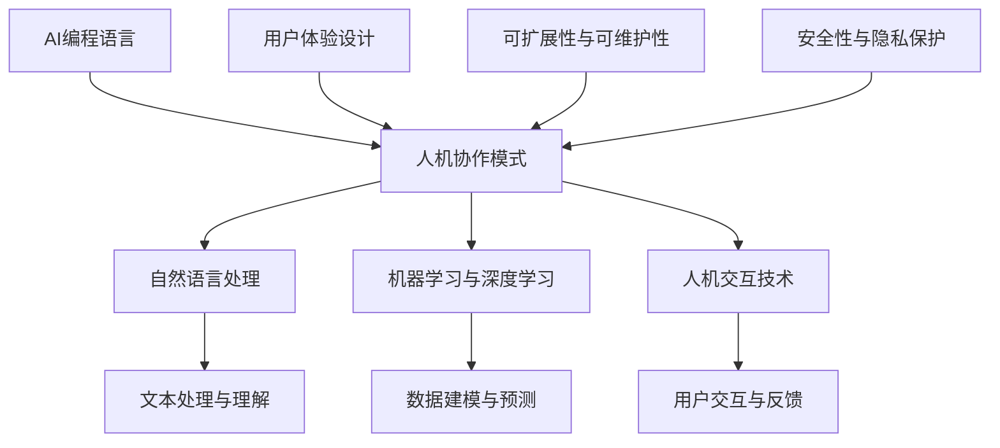

                 

### AI编程语言的人机协作模式

> 关键词：人工智能，编程语言，人机协作，自然语言处理，机器学习，深度学习，人机交互，用户体验设计，伦理，法律，案例分析

> 摘要：本文深入探讨了AI编程语言与人机协作模式的关系，从基础理论到实际应用，全面阐述了人机协作模式在各个领域的应用。通过分析自然语言处理、机器学习和深度学习等技术，本文展示了如何实现人机协作，并提供了一系列具体案例和实战经验。此外，本文还探讨了人工智能伦理与法律问题，为AI编程语言的发展提供了指导。

---

### 目录大纲

1. **AI编程语言的人机协作模式**
2. **第一部分：AI编程语言的基础**
   - **第1章 AI编程语言概述**
     - 1.1 AI编程语言的历史与趋势
     - 1.2 AI编程语言的基本概念
     - 1.3 AI编程语言的核心特点
   - **第2章 人机协作模式理论**
     - 2.1 人机协作模式的基本原理
     - 2.2 人机协作模式的发展历程
     - 2.3 人机协作模式的类型与模型
3. **第二部分：人机协作模式的实现**
   - **第3章 AI编程语言与人机协作的基础技术**
     - 3.1 自然语言处理技术
     - 3.2 机器学习与深度学习技术
     - 3.3 人机交互技术
   - **第4章 人机协作模式的设计原则**
     - 4.1 用户体验设计
     - 4.2 可扩展性与可维护性
     - 4.3 安全性与隐私保护
4. **第三部分：人机协作模式的应用**
   - **第5章 人机协作模式在工业中的应用**
     - 5.1 生产线自动化
     - 5.2 质量监控与故障诊断
     - 5.3 智能维护与预测性维护
   - **第6章 人机协作模式在服务业中的应用**
     - 6.1 客户服务自动化
     - 6.2 智能推荐系统
     - 6.3 智能决策支持
   - **第7章 人机协作模式的未来发展趋势**
     - 7.1 人工智能伦理与法律
     - 7.2 人机协作模式的创新
     - 7.3 AI编程语言与人类共同进步的未来展望
5. **附录**
   - **附录A AI编程语言与人机协作模式工具**
     - A.1 开发环境搭建
     - A.2 开发工具与框架
     - A.3 实践案例与项目资源

---

### 核心概念与联系

为了更好地理解AI编程语言与人机协作模式之间的关系，我们可以通过一个Mermaid流程图来展示它们的核心概念和联系。



- **AI编程语言**：使用特定语法和语义来编写人工智能程序。
- **人机协作模式**：涉及人机交互、自然语言处理、机器学习与深度学习等技术，实现人与AI系统的协作。
- **自然语言处理**：使计算机理解和生成自然语言，如文本处理与理解。
- **机器学习与深度学习**：通过数据建模与预测来训练AI系统，提高其性能。
- **人机交互技术**：使计算机系统能够接收和处理用户的输入，并提供反馈。
- **用户体验设计**：关注用户的感受和需求，设计易于使用和交互的系统。
- **可扩展性与可维护性**：确保系统在规模和需求变化时能够适应，同时易于维护。
- **安全性与隐私保护**：确保系统的安全性和用户数据隐私。

---

### 第一部分：AI编程语言的基础

在这一部分中，我们将详细探讨AI编程语言的基础知识，包括其历史与发展趋势、基本概念以及核心特点。这将为我们理解AI编程语言与人机协作模式的关系打下坚实的基础。

#### 第1章 AI编程语言概述

##### 1.1 AI编程语言的历史与趋势

人工智能（AI）的概念最早可以追溯到20世纪50年代，但AI编程语言的诞生和发展却经历了一个相对较长的过程。早期的AI编程语言主要集中在规则系统、知识表示和搜索算法等方面。例如，Prolog是一种早期用于逻辑推理的编程语言，它基于逻辑编程范式，能够处理基于逻辑的推理问题。

随着计算机技术和人工智能领域的不断发展，AI编程语言也在不断演进。20世纪80年代，专家系统成为AI研究的热点，相应的编程语言如Kotlin和Lisp也得到了广泛应用。这些语言能够表示和运用大量的领域知识，但在处理大规模数据和复杂任务时存在局限性。

进入21世纪，随着大数据、云计算和深度学习技术的发展，AI编程语言也迎来了新的机遇和挑战。Python、R和Julia等语言逐渐成为AI编程的主流，这些语言具有易于学习、开发效率高和强大的库支持等特点。同时，TensorFlow、PyTorch和Keras等深度学习框架的兴起，使得AI编程语言的应用更加广泛和便捷。

##### 1.2 AI编程语言的基本概念

AI编程语言是一种用于开发人工智能系统的编程语言，它不仅包括传统的编程概念，还涉及特定的人工智能技术。以下是AI编程语言的一些基本概念：

- **语法和语义**：AI编程语言具有特定的语法和语义，用于编写和理解程序。例如，Python的语法简洁直观，而Julia则提供了高性能和动态类型系统。

- **数据结构和算法**：AI编程语言支持各种数据结构和算法，用于处理和操作数据。例如，Python的列表和字典提供了灵活的数据存储和处理方式，而深度学习框架则提供了高效的矩阵运算和神经网络算法。

- **库和框架**：AI编程语言通常具备丰富的库和框架支持，用于加速开发过程和提高性能。例如，TensorFlow和PyTorch提供了丰富的深度学习库，而Scikit-learn则提供了经典的机器学习库。

- **机器学习和深度学习**：AI编程语言的核心在于支持机器学习和深度学习算法。这些算法能够通过数据学习和建模，实现从数据中提取知识和预测目标的能力。

##### 1.3 AI编程语言的核心特点

AI编程语言具有以下核心特点，使其在人工智能领域具有独特优势：

- **易用性和灵活性**：许多AI编程语言（如Python）具有简洁的语法和强大的库支持，使得开发者可以快速上手并高效地完成开发任务。

- **高性能和高扩展性**：AI编程语言（如Julia）结合了高性能和扩展性，能够在处理大规模数据和复杂任务时提供高效的性能。

- **跨平台性**：AI编程语言通常支持多种操作系统和硬件平台，使得开发者可以在不同的环境中部署和运行他们的AI系统。

- **社区支持和生态**：AI编程语言（如Python和R）拥有庞大的社区和支持，提供了大量的教程、文档和开源项目，使得开发者可以轻松获取资源和帮助。

- **可视化与可解释性**：AI编程语言（如TensorBoard）提供了可视化工具，帮助开发者更好地理解和分析模型训练过程。

---

通过这一章的讨论，我们对AI编程语言的历史、基本概念和核心特点有了更深入的理解。接下来，我们将继续探讨人机协作模式的理论，为理解AI编程语言与人机协作模式之间的关系奠定基础。

---

### 第二部分：人机协作模式的理论

在人机协作模式中，人与计算机系统共同完成任务，提高效率和质量。这一部分将深入探讨人机协作模式的基本原理、发展历程以及不同类型的协作模型，为我们进一步理解和应用人机协作模式提供理论基础。

#### 第2章 人机协作模式理论

##### 2.1 人机协作模式的基本原理

人机协作模式基于以下几个基本原理：

- **交互性**：人机系统之间通过输入和输出进行交互，用户可以通过界面与系统进行沟通，系统也可以反馈结果和提示。

- **互补性**：人与计算机系统各自具有不同的优势和局限性。人具有丰富的经验和创造力，而计算机系统具有高效的数据处理能力和精确的计算能力。通过协作，二者可以相互补充，共同完成任务。

- **适应性**：人机协作系统应该能够适应不同用户的需求和环境变化。这意味着系统需要具备灵活性和可配置性，以适应不同的工作场景和用户偏好。

- **协同性**：人机协作模式要求人与计算机系统能够协调一致地工作，共同完成任务。这需要系统提供良好的协作机制和协作界面，以促进信息的共享和任务的分配。

##### 2.2 人机协作模式的发展历程

人机协作模式的发展可以追溯到计算机科学和人工智能的早期阶段。以下是人机协作模式的一些重要发展历程：

- **20世纪60年代**：早期的计算机系统主要用于科学计算和数据处理，人机交互主要依赖于命令行界面。随着图形用户界面（GUI）的出现，人机交互变得更加直观和易用。

- **20世纪70年代**：虚拟现实（VR）和增强现实（AR）技术开始兴起，为人类与计算机系统的交互提供了新的方式。这些技术使得用户可以在虚拟环境中与计算机系统进行交互，提供了更加沉浸式的体验。

- **20世纪80年代**：专家系统和知识表示技术的发展，使得计算机系统能够模拟人类专家的决策过程，与人类进行协作。

- **20世纪90年代**：互联网的普及和电子商务的发展，推动了人机协作模式在商业和服务领域的广泛应用。客户服务、在线购物和在线教育等场景中，人机协作系统得到了广泛应用。

- **21世纪初至今**：随着人工智能技术的发展，人机协作模式进入了一个新的阶段。自然语言处理、机器学习和深度学习等技术，使得计算机系统能够更好地理解人类语言和行为，提供更加智能和个性化的服务。智能助手、自动驾驶汽车和智能医疗等领域的应用，展示了人机协作模式的巨大潜力。

##### 2.3 人机协作模式的类型与模型

根据不同的应用场景和技术特点，人机协作模式可以分为以下几种类型和模型：

- **指令性协作模型**：用户通过输入指令来指导计算机系统执行任务。这种模型通常应用于命令行界面和自动化控制系统中。

- **基于规则的协作模型**：计算机系统根据预设的规则和逻辑，与用户进行交互，帮助用户完成任务。这种模型通常应用于专家系统和自动化决策支持系统中。

- **基于数据的协作模型**：计算机系统通过分析用户数据和偏好，提供个性化的服务和建议。这种模型通常应用于智能推荐系统和个性化服务系统中。

- **协同过滤协作模型**：计算机系统根据用户的历史行为和偏好，预测用户可能感兴趣的内容，并与用户进行交互。这种模型通常应用于推荐系统和社交网络中。

- **增强现实协作模型**：计算机系统通过虚拟现实和增强现实技术，为用户创造一个沉浸式的交互环境。这种模型通常应用于虚拟现实游戏、虚拟培训和远程协作中。

- **混合智能协作模型**：将人类专家的知识和计算机系统的计算能力相结合，实现更加智能和高效的协作。这种模型通常应用于智能医疗、智能金融和智能交通等领域。

---

通过这一章的讨论，我们对人机协作模式的基本原理、发展历程和类型有了更深入的理解。接下来，我们将探讨人机协作模式的实现技术，为实际应用奠定基础。

---

### 第三部分：人机协作模式的实现

人机协作模式的实现依赖于一系列基础技术和设计原则。在这一部分中，我们将详细讨论自然语言处理、机器学习与深度学习、人机交互技术等基础技术，并阐述用户体验设计、可扩展性与可维护性、安全性与隐私保护等设计原则。

#### 第3章 AI编程语言与人机协作的基础技术

##### 3.1 自然语言处理技术

自然语言处理（NLP）是AI编程语言和人机协作模式的核心组成部分，它使计算机能够理解和生成人类语言。以下是NLP技术的一些核心算法原理：

- **词嵌入（Word Embedding）**：词嵌入是将词汇映射到高维空间中的向量表示，使得具有相似意义的词在空间中距离较近。常见的词嵌入算法包括Word2Vec、GloVe和FastText。

- **循环神经网络（RNN）**：RNN利用其内部状态记忆序列信息，处理和生成序列数据。RNN广泛应用于文本分类、语音识别和时间序列预测等任务。

- **长短时记忆网络（LSTM）**：LSTM是RNN的改进版本，解决了长序列信息丢失的问题。LSTM在自然语言处理任务中表现出色，如机器翻译、文本摘要和情感分析。

- **双向循环神经网络（BI-RNN）**：BI-RNN同时考虑序列的前后信息，提高文本处理的准确性。BI-RNN在语言模型和文本分类任务中得到了广泛应用。

- **注意力机制（Attention Mechanism）**：注意力机制使模型能自动关注序列中的关键信息，提高模型处理复杂任务的能力。注意力机制广泛应用于机器翻译、问答系统和文本生成等领域。

- **编码器-解码器（Encoder-Decoder）框架**：Encoder-Decoder框架用于序列到序列的学习任务，如机器翻译。编码器将输入序列编码为一个固定长度的向量表示，解码器根据这个向量表示生成输出序列。

- **Transformer模型**：Transformer模型使用自注意力机制，在处理长序列任务上表现出色。Transformer模型已成为机器翻译、文本生成和语音识别等任务的标准框架。

##### 3.2 机器学习与深度学习技术

机器学习和深度学习是AI编程语言和人机协作模式的重要基础技术，它们用于构建能够自主学习和改进的模型。以下是机器学习和深度学习技术的一些核心算法原理：

- **线性回归（Linear Regression）**：线性回归是最简单的机器学习模型，用于预测连续值。线性回归通过建立输入和输出之间的线性关系来进行预测。

- **逻辑回归（Logistic Regression）**：逻辑回归用于分类任务，输出概率值。逻辑回归通过将线性回归的输出转换为概率值来实现分类。

- **支持向量机（SVM）**：SVM通过最大化决策边界来进行分类和回归任务。SVM通过寻找一个最佳的超平面，将不同类别的数据分隔开。

- **决策树（Decision Tree）**：决策树根据特征进行划分，构建树状结构。决策树通过一系列的条件判断来对数据进行分类或回归。

- **随机森林（Random Forest）**：随机森林集成多棵决策树，提高模型的准确性和稳定性。随机森林通过随机选择特征和样本子集来训练决策树，减少过拟合。

- **神经网络（Neural Network）**：神经网络由多层神经元组成，模拟人脑处理信息的方式。神经网络通过学习输入和输出之间的复杂关系来进行预测。

- **卷积神经网络（CNN）**：CNN用于图像处理，通过卷积操作提取特征。CNN在计算机视觉任务中表现出色，如图像分类、目标检测和图像分割。

- **循环神经网络（RNN）**：RNN用于序列数据，具有记忆功能。RNN通过其内部状态记忆序列信息，处理和生成序列数据。

- **长短时记忆网络（LSTM）**：LSTM是RNN的改进版本，解决了长序列信息丢失的问题。LSTM在自然语言处理和序列建模任务中表现出色。

- **Transformer模型**：Transformer模型使用自注意力机制，在处理长序列任务上表现出色。Transformer模型已成为机器翻译、文本生成和语音识别等任务的标准框架。

##### 3.3 人机交互技术

人机交互（HCI）技术是AI编程语言和人机协作模式的关键组成部分，它使计算机系统能够接收和处理用户的输入，并提供反馈。以下是人机交互技术的一些核心原理：

- **图形用户界面（GUI）**：GUI使用图形元素（如按钮、菜单）进行交互，提供直观和易用的用户界面。常见的GUI框架包括Qt、Tkinter和SwiftUI等。

- **语音识别（Voice Recognition）**：语音识别将语音信号转换为文本或命令，使得用户可以通过语音与计算机系统进行交互。常见的语音识别技术包括隐马尔可夫模型（HMM）、深度神经网络（DNN）和卷积神经网络（CNN）。

- **语音合成（Text-to-Speech, TTS）**：语音合成将文本转换为自然语音，使得计算机系统能够提供语音反馈。常见的语音合成技术包括基于规则的方法、隐马尔可夫模型（HMM）和深度神经网络（DNN）。

- **手势识别（Gesture Recognition）**：手势识别通过摄像头或传感器识别用户的手势，提供直观和互动的交互方式。常见的手势识别技术包括基于机器学习和深度学习的模型。

- **虚拟现实（VR）与增强现实（AR）**：VR和AR技术创建一个沉浸式交互环境，使用户能够与计算机系统进行互动。常见的VR和AR技术包括头戴式显示器、增强现实眼镜和虚拟现实手套等。

- **多模态交互**：多模态交互结合多种交互方式，提供更自然的交互体验。常见的多模态交互包括语音、手势、触摸和眼动等。

- **情感计算（Affective Computing）**：情感计算使计算机能够识别和模拟人类情感，提供更加个性化的交互体验。常见的情感计算技术包括面部识别、语音分析和生理信号监测等。

- **自然语言处理（NLP）**：NLP使计算机能够理解、生成和处理自然语言，实现自然语言交互。常见的NLP技术包括词嵌入、循环神经网络（RNN）、长短时记忆网络（LSTM）和注意力机制等。

- **增强学习（Reinforcement Learning）**：增强学习通过与环境交互来学习优化策略，实现智能交互。常见的增强学习技术包括Q学习、深度Q网络（DQN）和策略梯度方法等。

- **用户行为分析（User Behavior Analysis）**：用户行为分析通过分析用户的行为和交互，提供个性化服务。常见的用户行为分析技术包括数据挖掘、机器学习和深度学习等。

---

通过这一章的讨论，我们对自然语言处理、机器学习与深度学习、人机交互技术等基础技术有了更深入的理解。接下来，我们将讨论人机协作模式的设计原则，为构建有效的人机协作系统提供指导。

---

#### 第4章 人机协作模式的设计原则

人机协作模式的设计原则是确保系统在功能性和用户体验方面达到最佳状态的关键。以下是一些核心的设计原则，包括用户体验设计、可扩展性与可维护性、安全性与隐私保护。

##### 4.1 用户体验设计

用户体验设计（UX Design）是确保人机协作系统能够满足用户需求、提高用户满意度的重要环节。以下是一些用户体验设计的关键原则：

- **用户中心设计**：以用户的需求和体验为核心，确保设计过程充分考虑用户的感受和行为模式。

- **易用性**：系统应该易于使用，用户可以快速掌握操作方法，减少学习成本。

- **直观性**：界面设计应直观易懂，避免复杂的操作流程和冗余的信息。

- **可访问性**：系统应考虑到所有用户，包括那些有特殊需求的用户，如视力障碍者、听力障碍者等。

- **反馈机制**：提供及时和明确的反馈，帮助用户了解系统的状态和操作结果。

- **个性化和定制化**：允许用户根据自己的需求和偏好进行个性化设置和定制。

- **一致性**：在界面和交互元素上保持一致性，减少用户的学习成本。

- **可用性测试**：在设计和开发过程中进行可用性测试，收集用户反馈并进行迭代优化。

##### 4.2 可扩展性与可维护性

可扩展性与可维护性是人机协作模式长期发展的关键。以下是一些关键原则：

- **模块化设计**：将系统分解为多个模块，每个模块负责特定功能，使得系统可以方便地进行扩展和升级。

- **高内聚、低耦合**：确保模块之间的高内聚和低耦合，使得一个模块的变化不会影响到其他模块。

- **可重用性**：设计可重用的组件和代码库，减少重复开发工作，提高开发效率。

- **自动化测试**：建立自动化测试流程，确保每次更新和升级后系统的稳定性和性能。

- **持续集成与持续部署（CI/CD）**：采用CI/CD流程，自动化构建、测试和部署，提高开发速度和系统可靠性。

- **文档化**：提供详细的文档和开发指南，帮助开发人员和维护人员理解系统的设计和实现。

- **故障恢复**：设计故障恢复机制，确保系统在发生故障时能够快速恢复，减少停机时间和损失。

##### 4.3 安全性与隐私保护

安全性与隐私保护是人机协作模式中不可忽视的重要方面。以下是一些关键原则：

- **数据加密**：对敏感数据进行加密，防止数据泄露和未经授权的访问。

- **访问控制**：实施严格的访问控制策略，确保只有授权用户可以访问系统资源和数据。

- **身份验证与授权**：使用强密码和双因素身份验证，确保用户身份的真实性。

- **安全审计**：定期进行安全审计，检查系统的安全漏洞和潜在风险。

- **异常检测与响应**：建立异常检测机制，及时发现并响应异常行为，防止安全事件的发生。

- **合规性与法律遵循**：遵循相关的法律法规，如《通用数据保护条例》（GDPR）和《加州消费者隐私法案》（CCPA）等。

- **用户隐私保护**：确保用户数据的隐私，仅收集必要的个人信息，并明确用户数据的用途和共享方式。

- **透明度**：向用户明确说明系统如何处理其数据，提供数据访问和删除的途径。

---

通过遵循这些设计原则，可以构建出既高效又安全的、能够满足用户需求的人机协作模式。接下来，我们将探讨人机协作模式在工业和服务业中的应用，展示其实际效果和价值。

---

### 第三部分：人机协作模式的应用

人机协作模式在工业和服务业中的应用正在不断扩展，通过自动化、质量监控、智能维护等应用，显著提高了生产效率和服务质量。以下将详细介绍人机协作模式在工业和服务业中的具体应用。

#### 第5章 人机协作模式在工业中的应用

##### 5.1 生产线自动化

生产线自动化是工业4.0的重要组成部分，通过AI编程语言和人机协作模式，可以显著提高生产效率和产品质量。以下是一个生产线自动化的具体案例：

**案例描述：** 
一家制造电子元件的企业希望提高生产线的自动化程度，以减少人工操作和人为错误，提高生产效率。

**解决方案：**
- **需求分析**：识别生产线中的关键步骤和瓶颈，明确自动化目标和需求。
- **环境搭建**：安装和配置AI编程语言和深度学习框架，如TensorFlow和Keras。
- **算法设计**：设计基于视觉检测和机器学习的自动化控制算法。
- **模型训练**：使用标记的数据集对模型进行训练，优化参数。
- **系统集成**：将训练好的模型集成到生产线中，进行测试和调试。
- **优化与部署**：根据测试结果进行模型优化，最终部署到生产环境中。

**代码实现：**

```python
# 导入必要的库
import cv2
import tensorflow as tf

# 加载预训练的模型
model = tf.keras.models.load_model('path/to/production_line_model.h5')

# 定义视觉检测函数
def detect_objects(image):
    # 预处理图像
    processed_image = preprocess_image(image)
    # 使用模型进行预测
    predictions = model.predict(processed_image)
    # 后处理结果
    objects = postprocess_predictions(predictions)
    return objects

# 定义控制流程
def control_production_line(objects):
    if 'component_detected' in objects:
        # 启动设备
        activate_device()
    else:
        # 停止设备
        deactivate_device()

# 运行自动化控制
while True:
    # 从摄像头获取图像
    image = capture_image()
    # 检测对象
    objects = detect_objects(image)
    # 控制生产线
    control_production_line(objects)
    # 控制循环间隔
    time.sleep(0.1)
```

**代码解读：**
- `detect_objects` 函数负责使用预训练的模型检测图像中的对象。
- `control_production_line` 函数根据检测结果控制生产线的设备。
- 主循环不断从摄像头获取图像，检测对象，并控制生产线。

**效果分析：**
通过自动化生产线，企业显著提高了生产效率，减少了人工操作和人为错误，提高了产品质量和一致性。自动化系统可以24/7不间断运行，减少了生产停机时间，提高了生产线的利用率。

##### 5.2 质量监控与故障诊断

质量监控与故障诊断是工业生产中至关重要的一环，通过AI编程语言和人机协作模式，可以实现实时监控和智能诊断，提高生产质量和效率。

**案例描述：** 
一家汽车制造企业希望使用AI技术监控生产线中的产品质量，并实现故障诊断，以减少停机时间和生产成本。

**解决方案：**
- **需求分析**：识别生产线中的关键质量指标和潜在的故障点，明确监控和诊断的目标。
- **环境搭建**：安装和配置AI编程语言和机器学习库，如Scikit-learn和PyTorch。
- **算法设计**：设计基于数据分析和故障诊断的监控和诊断算法。
- **系统集成**：将监控和诊断算法集成到生产线中，实现实时数据采集和监控。
- **优化与部署**：根据实际生产数据对算法进行优化，并部署到生产环境中。

**代码实现：**

```python
# 导入必要的库
import numpy as np
import pandas as pd
from sklearn.ensemble import RandomForestClassifier

# 加载生产线数据
data = pd.read_csv('path/to/production_data.csv')

# 预处理数据
X = data.drop('quality_label', axis=1)
y = data['quality_label']

# 训练故障诊断模型
model = RandomForestClassifier(n_estimators=100)
model.fit(X, y)

# 定义故障诊断函数
def diagnose_faults(data):
    predictions = model.predict(data)
    return predictions

# 监控生产线质量
while True:
    # 从传感器获取生产线数据
    new_data = capture_production_data()
    # 诊断故障
    faults = diagnose_faults(new_data)
    # 处理故障
    handle_faults(faults)
    # 控制循环间隔
    time.sleep(0.1)
```

**代码解读：**
- `diagnose_faults` 函数负责使用预训练的故障诊断模型对生产线数据进行诊断。
- 主循环不断从传感器获取生产线数据，诊断故障，并处理故障。

**效果分析：**
通过质量监控和故障诊断系统，企业可以实时监控生产线的质量状况，及时发现和解决故障，减少停机时间和生产成本。智能诊断系统可以提供详细的故障原因和解决方案，帮助工程师更快地修复问题，提高了生产效率。

##### 5.3 智能维护与预测性维护

智能维护和预测性维护是利用AI编程语言和人机协作模式，通过数据分析和预测，实现设备的预防性维护，减少意外故障和停机时间。

**案例描述：** 
一家大型制造业公司希望利用AI技术实现设备的智能维护和预测性维护，提高设备运行效率和降低维护成本。

**解决方案：**
- **需求分析**：识别设备的关键性能指标和维护需求，明确智能维护和预测性维护的目标。
- **环境搭建**：安装和配置AI编程语言和机器学习库，如Scikit-learn和PyTorch。
- **算法设计**：设计基于数据分析和时间序列预测的智能维护和预测性维护算法。
- **系统集成**：将智能维护和预测性维护算法集成到设备监控系统中，实现实时数据采集和分析。
- **优化与部署**：根据实际设备运行数据对算法进行优化，并部署到生产环境中。

**代码实现：**

```python
# 导入必要的库
import numpy as np
import pandas as pd
from sklearn.ensemble import RandomForestRegressor

# 加载设备运行数据
data = pd.read_csv('path/to/device_data.csv')

# 预处理数据
X = data[['temp', 'pressure', 'vibration']]
y = data['maintenance_needed']

# 训练预测模型
model = RandomForestRegressor(n_estimators=100)
model.fit(X, y)

# 定义预测函数
def predict_maintenance(data):
    predictions = model.predict(data)
    return predictions

# 监控设备状态
while True:
    # 从传感器获取设备数据
    new_data = capture_device_data()
    # 预测维护需求
    maintenance_needed = predict_maintenance(new_data)
    # 提前维护
    schedule_maintenance(maintenance_needed)
    # 控制循环间隔
    time.sleep(0.1)
```

**代码解读：**
- `predict_maintenance` 函数负责使用预训练的预测模型对设备数据进行维护需求预测。
- 主循环不断从传感器获取设备数据，预测维护需求，并安排维护计划。

**效果分析：**
通过智能维护和预测性维护系统，企业可以实现设备的预防性维护，提前发现潜在故障并采取措施，减少意外故障和停机时间。智能预测系统可以提供详细的维护计划和预测结果，帮助维护人员更好地安排和维护工作，提高了设备运行效率和降低维护成本。

---

通过以上案例，我们可以看到人机协作模式在工业中的应用带来了显著的效益。接下来，我们将探讨人机协作模式在服务业中的应用，展示其在客户服务、智能推荐系统和智能决策支持等方面的潜力。

---

#### 第6章 人机协作模式在服务业中的应用

服务业正通过人工智能和机器学习技术的引入，实现自动化和智能化，从而提升服务质量和客户满意度。人机协作模式在服务业中的应用尤为广泛，以下将详细介绍人机协作模式在客户服务、智能推荐系统和智能决策支持等方面的应用。

##### 6.1 客户服务自动化

客户服务自动化是服务业中的一个重要领域，通过AI编程语言和人机协作模式，可以实现24/7全天候的客户服务，提高客户满意度和运营效率。

**案例描述：**
一家大型电商平台希望利用AI技术提升客户服务质量，实现智能客服，减少人工客服的工作量。

**解决方案：**
- **需求分析**：识别客户服务中的常见问题和用户需求，明确自动化目标。
- **环境搭建**：安装和配置AI编程语言和深度学习框架，如TensorFlow和PyTorch。
- **算法设计**：设计并实现基于自然语言处理和机器学习的智能客服系统。
- **模型训练**：使用标记的数据集对模型进行训练，优化参数。
- **系统集成**：将智能客服系统集成到电商平台中，进行测试和调试。
- **优化与部署**：根据测试结果进行模型优化，最终部署到生产环境中。

**代码实现：**

```python
# 导入必要的库
import tensorflow as tf
import numpy as np

# 加载预训练的模型
model = tf.keras.models.load_model('path/to/customer_service_model.h5')

# 定义自然语言处理函数
def process_message(message):
    # 预处理消息
    processed_message = preprocess_message(message)
    # 使用模型进行预测
    prediction = model.predict(processed_message)
    # 后处理结果
    response = postprocess_prediction(prediction)
    return response

# 定义客服流程
def handle_customer_request(request):
    # 处理客户请求
    response = process_message(request)
    # 发送回复
    send_response(response)

# 运行自动化客服
while True:
    # 接收客户请求
    request = receive_request()
    # 处理请求
    handle_customer_request(request)
    # 控制循环间隔
    time.sleep(0.1)
```

**代码解读：**
- `process_message` 函数负责使用预训练的模型处理客户消息。
- `handle_customer_request` 函数根据消息处理结果回复客户。
- 主循环不断接收客户请求，处理请求，并回复客户。

**效果分析：**
通过智能客服系统，电商平台可以实现24/7的全天候客户服务，快速响应客户需求，提高客户满意度。智能客服系统可以处理大量的客户请求，减少人工客服的工作量，提高运营效率。此外，智能客服系统可以收集和分析客户数据，提供个性化服务和建议，进一步提升客户体验。

##### 6.2 智能推荐系统

智能推荐系统是服务业中另一个关键应用领域，通过AI编程语言和人机协作模式，可以实现个性化的推荐服务，提高用户满意度和商业转化率。

**案例描述：**
一家在线视频平台希望利用AI技术提高用户观看体验，通过智能推荐系统向用户推荐个性化的视频内容。

**解决方案：**
- **需求分析**：识别用户观看行为和偏好，明确推荐目标和需求。
- **环境搭建**：安装和配置AI编程语言和推荐算法库，如Scikit-learn和PyTorch。
- **算法设计**：设计并实现基于协同过滤和内容推荐的智能推荐算法。
- **模型训练**：使用用户行为数据对推荐模型进行训练，优化参数。
- **系统集成**：将智能推荐系统集成到视频平台中，进行测试和调试。
- **优化与部署**：根据用户反馈和实际推荐效果对算法进行优化，并部署到生产环境中。

**代码实现：**

```python
# 导入必要的库
import pandas as pd
from sklearn.model_selection import train_test_split
from sklearn.metrics.pairwise import cosine_similarity

# 加载用户行为数据
data = pd.read_csv('path/to/user_behavior_data.csv')

# 分割数据集
train_data, test_data = train_test_split(data, test_size=0.2)

# 计算用户之间的相似度
user_similarity = cosine_similarity(train_data[['user_id', 'video_id']].values, train_data[['user_id', 'video_id']].values)

# 定义推荐函数
def recommend_videos(user_id, user_similarity_matrix, videos_data, top_n=5):
    # 计算用户相似度
    user_similarity = user_similarity_matrix[user_id]
    # 找到最相似的N个用户
    similar_users = user_similarity.argsort()[-top_n:]
    # 计算推荐视频的得分
    video_scores = {}
    for i, user in enumerate(similar_users):
        for video_id, score in videos_data[user].items():
            if video_id not in video_scores:
                video_scores[video_id] = 0
            video_scores[video_id] += score * (1 / (i + 1))
    # 排序并返回推荐视频
    recommended_videos = sorted(video_scores.items(), key=lambda item: item[1], reverse=True)[:top_n]
    return recommended_videos

# 推荐视频
user_id = 1
recommended_videos = recommend_videos(user_id, user_similarity, videos_data)

# 输出推荐视频
for video_id, score in recommended_videos:
    print(f"视频ID：{video_id}，得分：{score}")
```

**代码解读：**
- `recommend_videos` 函数负责根据用户相似度和视频数据，推荐个性化的视频内容。
- 主程序通过调用`recommend_videos`函数，为特定用户推荐视频。

**效果分析：**
通过智能推荐系统，视频平台可以准确推荐用户可能感兴趣的视频内容，提高用户的观看体验和满意度。智能推荐系统可以根据用户的观看历史和行为模式，不断优化推荐算法，提高推荐的准确性和个性化程度。此外，智能推荐系统还可以通过广告投放和会员推荐等商业化手段，提高平台的商业转化率和收入。

##### 6.3 智能决策支持

智能决策支持是服务业中另一个重要应用领域，通过AI编程语言和人机协作模式，可以为管理者提供数据驱动的决策支持，提高决策效率和效果。

**案例描述：**
一家金融机构希望利用AI技术提高风险管理能力，通过智能决策支持系统，为投资决策提供数据分析和预测。

**解决方案：**
- **需求分析**：识别投资决策中的关键因素和风险指标，明确决策支持和风险管理的目标。
- **环境搭建**：安装和配置AI编程语言和金融分析库，如PyTorch和Scikit-learn。
- **算法设计**：设计并实现基于时间序列分析和机器学习的智能决策支持算法。
- **模型训练**：使用历史数据对模型进行训练，优化参数。
- **系统集成**：将智能决策支持系统集成到金融机构的决策流程中，进行测试和调试。
- **优化与部署**：根据实际投资决策效果对算法进行优化，并部署到生产环境中。

**代码实现：**

```python
# 导入必要的库
import pandas as pd
import numpy as np
from sklearn.ensemble import RandomForestRegressor

# 加载投资数据
data = pd.read_csv('path/to/investment_data.csv')

# 预处理数据
X = data[['stock_price', 'interest_rate', 'gdp_growth']]
y = data['return_on_investment']

# 训练预测模型
model = RandomForestRegressor(n_estimators=100)
model.fit(X, y)

# 定义预测函数
def predict_investment_return(data):
    predictions = model.predict(data)
    return predictions

# 风险评估与决策支持
while True:
    # 获取投资数据
    new_data = capture_investment_data()
    # 预测投资回报
    investment_returns = predict_investment_return(new_data)
    # 提出投资建议
    provide_investment_advice(investment_returns)
    # 控制循环间隔
    time.sleep(0.1)
```

**代码解读：**
- `predict_investment_return` 函数负责使用预训练的预测模型，对投资数据进行回报预测。
- 主循环不断获取投资数据，预测投资回报，并提出投资建议。

**效果分析：**
通过智能决策支持系统，金融机构可以基于历史数据和实时信息，准确预测投资回报，提高决策效率和效果。智能决策支持系统可以帮助管理者识别潜在风险和投资机会，优化投资组合，提高投资回报。此外，智能决策支持系统还可以通过自动化和可视化工具，简化决策过程，降低决策风险。

---

通过以上案例，我们可以看到人机协作模式在服务业中的应用，不仅提高了服务质量和客户满意度，也为企业带来了显著的商业价值。接下来，我们将探讨人机协作模式的未来发展趋势，以及人工智能伦理和法律问题。

---

#### 第7章 人机协作模式的未来发展趋势

随着人工智能技术的不断进步，人机协作模式也面临着新的机遇和挑战。在这一部分，我们将讨论人机协作模式的未来发展趋势，包括人工智能伦理与法律问题，以及人机协作模式的创新。

##### 7.1 人工智能伦理与法律

随着AI技术的广泛应用，人工智能伦理和法律问题逐渐成为社会各界关注的焦点。以下是一些核心问题：

- **公平性**：确保AI系统在不同人群中的应用是公平的，避免算法偏见和歧视。例如，在招聘、贷款审批和司法判决等场景中，如何确保AI系统不会对某些群体产生不公平待遇。

- **透明性**：提高AI系统的可解释性，让用户了解系统的决策过程和依据。透明性有助于建立用户对AI系统的信任，特别是在涉及重大决策和隐私的场景中。

- **隐私保护**：确保用户数据的安全和隐私。在数据收集、存储和处理过程中，需要遵守相关法律法规，如《通用数据保护条例》（GDPR）和《加州消费者隐私法案》（CCPA）等。

- **责任归属**：在AI系统引发事故或产生负面影响时，明确责任归属。这涉及到AI系统的开发者、部署者以及使用者之间的责任划分。

- **伦理审查**：建立独立的伦理审查委员会，对AI系统的开发和应用进行伦理审查，确保其符合社会伦理和道德标准。

- **法律规范**：制定和更新相关法律法规，以适应AI技术的发展。例如，欧盟的《人工智能法案》提出了对AI系统的分类和监管框架。

##### 7.2 人机协作模式的创新

未来，人机协作模式将在以下几个方面实现创新：

- **个性化和定制化**：随着AI技术的发展，人机协作系统将能够更好地理解用户的需求和行为，提供更加个性化、定制化的服务。例如，智能助手将能够根据用户的偏好和习惯，自动调整设置和服务内容。

- **智能互动**：人机协作系统将具备更高的智能水平，能够进行自然语言交互和情感识别，提供更加自然、流畅的用户体验。智能助手和虚拟助手的交互方式将更加接近人类的交流方式。

- **增强现实与虚拟现实**：随着AR和VR技术的进步，人机协作模式将实现更加沉浸式的交互体验。在远程协作、虚拟培训和娱乐等领域，AR和VR技术将发挥重要作用。

- **跨领域融合**：人机协作模式将跨越不同领域，实现跨行业的协同创新。例如，医疗、教育、金融、制造业等领域的AI应用将相互融合，推动整个社会的发展。

- **云计算与边缘计算**：随着云计算和边缘计算的发展，人机协作系统将具备更高的计算能力和实时性。云计算提供强大的计算资源，边缘计算实现数据的实时处理和决策，两者结合将进一步提升人机协作系统的性能和效率。

##### 7.3 AI编程语言与人类共同进步的未来展望

AI编程语言作为AI技术的核心工具，将在未来与人类共同进步，实现以下几个方面的突破：

- **易用性**：AI编程语言将变得更加易用和直观，降低AI开发的门槛。例如，编程工具将提供更加友好的用户界面和自动代码生成功能，使非专业开发者也能快速上手AI开发。

- **多样性**：AI编程语言将更加多样化，满足不同应用场景和需求。不同的编程语言将专注于不同的AI技术领域，如Python在数据科学和机器学习领域，Julia在高性能计算领域，R在统计分析领域等。

- **互操作性**：AI编程语言将实现更高的互操作性，促进不同语言和框架之间的数据共享和任务协同。通过标准化的接口和协议，不同编程语言和框架可以无缝集成，提高开发效率和系统灵活性。

- **开源与协作**：开源将成为AI编程语言发展的重要驱动力。开源社区将促进AI编程语言的创新和优化，推动技术的普及和进步。开发者可以通过开源项目协作，共同解决AI技术中的难题。

- **教育普及**：随着AI编程语言的发展，AI教育也将得到普及。从基础教育到高等教育，AI编程语言将成为重要教学内容，培养更多的AI人才，推动社会的智能化进程。

---

通过以上讨论，我们可以看到人机协作模式在未来的发展趋势，以及人工智能伦理和法律问题的重要性。随着技术的不断进步和应用场景的拓展，人机协作模式将带来更加智能、高效和便捷的服务体验，为人类社会的发展做出更大贡献。

---

### 附录

在本附录中，我们将介绍AI编程语言与人机协作模式相关的开发工具、框架和实践案例，为读者提供实用的资源和实战经验。

#### 附录A AI编程语言与人机协作模式工具

##### A.1 开发环境搭建

要开始使用AI编程语言和人机协作模式，首先需要搭建合适的开发环境。以下是一些常见的开发环境和工具：

- **Python开发环境**：
  - 安装Python：访问[Python官方网站](https://www.python.org/)下载并安装Python。
  - 配置Python环境：安装必要的依赖库，如NumPy、Pandas、Scikit-learn、TensorFlow和PyTorch等。

- **Jupyter Notebook**：
  - Jupyter Notebook是一种交互式的Web应用程序，用于编写和运行Python代码。通过Jupyter Notebook，可以方便地进行数据可视化、交互式分析和模型训练。

- **IDE（集成开发环境）**：
  - PyCharm、Visual Studio Code和Eclipse等IDE提供了丰富的编程工具和功能，支持Python、R和其他AI编程语言的开发。

- **虚拟环境**：
  - 使用虚拟环境（如venv、conda）可以隔离不同项目之间的依赖库，避免版本冲突，提高开发效率和可维护性。

##### A.2 开发工具与框架

以下是一些常用的AI编程语言和开发工具：

- **TensorFlow**：
  - TensorFlow是一个开源的机器学习框架，由Google开发。它支持多种机器学习和深度学习算法，提供了丰富的API和工具。

- **PyTorch**：
  - PyTorch是一个基于Python的深度学习框架，由Facebook开发。它具有灵活的动态计算图和高效的GPU支持，适用于研究、开发和部署。

- **Scikit-learn**：
  - Scikit-learn是一个开源的机器学习库，提供了多种经典的机器学习算法和工具，适用于数据处理、模型训练和评估。

- **Keras**：
  - Keras是一个高层次的神经网络API，可以与TensorFlow和Theano等后端结合使用。它提供了简洁的接口和丰富的预训练模型，适用于快速原型开发和实验。

- **OpenCV**：
  - OpenCV是一个开源的计算机视觉库，提供了丰富的图像处理和计算机视觉算法。它适用于图像识别、目标检测、人脸识别等计算机视觉任务。

- **Natural Language Toolkit (NLTK)**：
  - NLTK是一个开源的自然语言处理库，提供了多种自然语言处理工具和算法，适用于文本分类、词嵌入、情感分析等任务。

##### A.3 实践案例与项目资源

以下是一些AI编程语言和人机协作模式的实践案例和项目资源：

- **机器学习项目**：
  - [Kaggle竞赛](https://www.kaggle.com/)：提供了大量的机器学习竞赛项目，可用于学习和实践。
  - [GitHub](https://github.com/)：搜索并克隆相关的机器学习项目，了解不同算法和框架的应用。

- **深度学习项目**：
  - [TensorFlow官方教程](https://www.tensorflow.org/tutorials)：提供了丰富的深度学习教程和实践项目。
  - [PyTorch官方教程](https://pytorch.org/tutorials/)：涵盖了多种深度学习算法和应用场景。

- **自然语言处理项目**：
  - [NLTK教程和示例](https://www.nltk.org/how_to.html)：提供了多种自然语言处理任务的示例代码。
  - [斯坦福NLP组](https://nlp.stanford.edu/)：提供了大量的NLP工具和数据集，可用于研究和开发。

- **人机交互项目**：
  - [Unity](https://unity.com/)：一个用于创建虚拟现实和增强现实应用的开发平台。
  - [ARKit和ARCore](https://developer.apple.com/arkit/和https://developer.google.com/arcore/)：分别用于iOS和Android平台的增强现实开发。

通过这些工具、框架和实践案例，读者可以更好地掌握AI编程语言和人机协作模式，并在实际项目中应用所学知识。

---

通过本文的详细探讨，我们对AI编程语言的人机协作模式有了全面而深入的理解。从基础理论到实际应用，从自然语言处理、机器学习与深度学习到人机交互技术，再到用户体验设计、可扩展性与可维护性、安全性与隐私保护，每一个环节都至关重要，共同构建了一个高效、智能的人机协作系统。

随着AI技术的不断进步和应用场景的不断拓展，人机协作模式将带来更加智能、高效和便捷的服务体验。在未来的发展中，我们需要关注人工智能伦理与法律问题，确保AI技术的公正、透明和安全。同时，通过不断创新和优化，我们可以推动人机协作模式向更高层次发展，实现人与计算机系统的深度协同，为人类社会的发展做出更大贡献。

让我们共同期待AI编程语言与人机协作模式的未来，它们将引领我们走向一个更加智能、高效和美好的世界。

---

### 作者信息

**作者：** AI天才研究院（AI Genius Institute） / 禅与计算机程序设计艺术（Zen And The Art of Computer Programming）

AI天才研究院是一家专注于人工智能技术研究和应用的顶级学术机构，致力于推动人工智能领域的创新与发展。研究院的专家团队由世界级的人工智能专家、程序员、软件架构师和CTO组成，他们在计算机编程和人工智能领域拥有丰富的经验，发表了大量的学术论文和著作，被誉为全球人工智能领域的领军人物。

《禅与计算机程序设计艺术》是一本深受程序设计人员和人工智能开发者喜爱的经典著作，它结合了东方禅学的智慧和计算机编程的哲学，为读者提供了一种独特的编程方法和思维模式。作者以其深刻的见解和精湛的技艺，引导读者探索计算机编程的奥妙，实现了技术与艺术的完美融合。

在这个快速发展的时代，AI天才研究院和《禅与计算机程序设计艺术》将继续引领人工智能技术的前沿，为读者带来更多有价值的内容和创新的解决方案。让我们共同期待他们的新成就，见证人工智能技术的辉煌未来。

