                 

# AI编程语言的安全性考量

## 关键词
- AI编程语言
- 安全性考量
- 漏洞分析
- 攻击类型
- 防御机制
- 数学模型
- 项目实战

## 摘要
本文旨在深入探讨AI编程语言的安全性考量。随着人工智能技术的飞速发展，AI编程语言的应用越来越广泛，但其安全性问题也逐渐凸显。本文首先概述了AI编程语言的发展历程和核心概念，然后分析了AI编程语言的架构及其安全性考量。接着，本文详细分析了AI编程语言的常见漏洞和攻击类型，并通过案例分析加深理解。随后，本文探讨了AI编程语言的防御机制，包括安全策略、最佳实践和安全特性。此外，本文还介绍了AI编程语言中的数学模型和公式，并通过项目实战展示了如何在实际开发中考虑安全性。最后，本文对AI编程语言的安全性发展趋势进行了展望，并提出了对开发者与用户的建议。

## 目录大纲

### 第一部分：引言与概述

#### 第1章：AI编程语言概述

##### 1.1 AI编程语言的发展历程

##### 1.2 AI编程语言的核心概念

##### 1.3 AI编程语言的安全性考量重要性

#### 第2章：AI编程语言的架构

##### 2.1 AI编程语言的基础架构

##### 2.2 AI编程语言的核心组件

##### 2.3 AI编程语言的架构安全考量

### 第二部分：AI编程语言的安全性分析

#### 第3章：AI编程语言的漏洞与攻击

##### 3.1 AI编程语言的常见漏洞

##### 3.2 AI编程语言的攻击类型

##### 3.3 漏洞与攻击的案例分析

#### 第4章：AI编程语言的防御机制

##### 4.1 安全策略与最佳实践

##### 4.2 AI编程语言的安全特性

##### 4.3 防御机制的实现与优化

#### 第5章：AI编程语言的数学模型与公式

##### 5.1 常见的数学模型

##### 5.2 数学公式的解释与应用

##### 5.3 举例说明

#### 第6章：AI编程语言的项目实战

##### 6.1 安全开发环境的搭建

##### 6.2 源代码的详细实现与分析

##### 6.3 代码解读与分析

#### 第7章：未来展望与趋势

##### 7.1 AI编程语言的安全发展趋势

##### 7.2 安全性考量在AI编程语言中的未来发展

##### 7.3 对开发者与用户的建议

### 附录

#### 附录A：常用AI编程语言与工具

##### A.1 Python与AI编程

##### A.2 Java与AI编程

##### A.3 C++与AI编程

#### 附录B：参考文献与推荐阅读

##### B.1 相关书籍推荐

##### B.2 学术论文推荐

##### B.3 网络资源推荐

### Mermaid 流程图

```mermaid
graph TD
    A[AI编程语言安全性考量] --> B[AI编程语言概述]
    B --> C[AI编程语言的发展历程]
    B --> D[AI编程语言的核心概念]
    B --> E[AI编程语言的安全性考量重要性]
    A --> F[AI编程语言的架构]
    F --> G[AI编程语言的基础架构]
    F --> H[AI编程语言的核心组件]
    F --> I[AI编程语言的架构安全考量]
    A --> J[AI编程语言的安全性分析]
    J --> K[AI编程语言的常见漏洞]
    J --> L[AI编程语言的攻击类型]
    J --> M[漏洞与攻击的案例分析]
    A --> N[AI编程语言的防御机制]
    N --> O[安全策略与最佳实践]
    N --> P[AI编程语言的安全特性]
    N --> Q[防御机制的实现与优化]
    A --> R[AI编程语言的数学模型与公式]
    R --> S[常见的数学模型]
    R --> T[数学公式的解释与应用]
    R --> U[举例说明]
    A --> V[AI编程语言的项目实战]
    V --> W[安全开发环境的搭建]
    V --> X[源代码的详细实现与分析]
    V --> Y[代码解读与分析]
    A --> Z[未来展望与趋势]
    Z --> AA[AI编程语言的安全发展趋势]
    Z --> BB[安全性考量在AI编程语言中的未来发展]
    Z --> CC[对开发者与用户的建议]
    AA --> DD[AI编程语言的安全挑战]
    BB --> EE[安全机制的演进方向]
    CC --> FF[开发者建议]
    CC --> GG[用户建议]
```



### 伪代码

```python
# 伪代码：AI编程语言的安全性分析
function analyze_security_of_ai_programming_language():
    # 初始化安全分析环境
    initialize_environment()

    # 收集AI编程语言相关信息
    collect_language_info()

    # 分析常见漏洞
    analyze_common_vulnerabilities()

    # 分析攻击类型
    analyze_attacks()

    # 案例分析
    perform_case_analysis()

    # 防御机制评估
    evaluate_defensive_measures()

    # 提出改进建议
    suggest_improvements()

    # 输出分析报告
    output_analysis_report()
```

### 数学模型和数学公式

$$
\text{模型准确性} = \frac{\text{预测正确数}}{\text{总样本数}}
$$

$$
\text{损失函数} = -\sum_{i=1}^{n} y_i \log(p_i)
$$

$$
\text{梯度下降算法更新规则}:
\theta_j := \theta_j - \alpha \frac{\partial J(\theta)}{\partial \theta_j}
```

### 项目实战

#### 安全开发环境的搭建

1. 选择合适的安全开发工具，如 Kali Linux。
2. 安装必要的开发环境和框架，如 TensorFlow、PyTorch。
3. 配置虚拟环境，以隔离项目依赖和减少安全隐患。
4. 使用最新的安全工具和软件进行开发。

#### 源代码的详细实现与分析

1. 设计AI编程语言的模型结构。
2. 编写训练和预测的代码。
3. 分析模型的性能和安全性。
4. 调整模型参数以提高性能和安全性。

#### 代码解读与分析

1. 解读模型的训练和预测过程。
2. 分析代码中的安全措施，如输入验证和数据加密。
3. 分析代码中的潜在漏洞和攻击点。
4. 提出改进措施以增强代码的安全性。

## 第一部分：引言与概述

### 第1章：AI编程语言概述

#### 1.1 AI编程语言的发展历程

人工智能（AI）作为计算机科学的一个重要分支，近年来取得了飞速发展。随着深度学习、神经网络等技术的兴起，AI编程语言也逐渐崭露头角。AI编程语言的发展历程可以追溯到20世纪50年代，当时计算机科学家们开始探索如何让计算机模拟人类思维和行为。

在早期，AI编程语言主要侧重于规则推理和知识表示。例如，Lisp语言在20世纪50年代末被发明，它成为了AI编程语言的一个里程碑。Lisp语言以其灵活的符号处理能力和强大的函数式编程特性，为AI开发提供了强大的工具。

随着时间推移，AI编程语言不断发展，逐渐从符号推理转向基于数据的模型。20世纪80年代，Prolog语言因其逻辑编程特性而在AI领域得到广泛应用。Prolog语言的逻辑编程模型使得AI系统能够进行符号推理，从而解决了许多复杂的决策问题。

进入21世纪，深度学习技术的崛起带来了AI编程语言的又一次变革。TensorFlow、PyTorch等深度学习框架的出现，使得AI编程语言变得更加易用和强大。这些框架提供了丰富的API和工具，帮助开发者快速构建和训练复杂的神经网络模型。

#### 1.2 AI编程语言的核心概念

AI编程语言的核心概念包括以下几个关键方面：

1. **数据表示**：AI编程语言需要能够高效地表示和操作数据。这通常涉及到数据结构的设计和优化，如数组、列表、矩阵等。

2. **计算图**：深度学习模型通常由计算图表示。计算图中的节点表示操作，边表示数据流。AI编程语言需要能够构建和操作这些计算图。

3. **自动微分**：在深度学习训练过程中，需要计算模型参数的梯度。自动微分是深度学习框架的一个关键特性，它允许自动计算梯度，从而实现模型的优化。

4. **并行计算**：深度学习模型通常包含大量的计算操作，因此并行计算对于提高训练效率至关重要。AI编程语言需要支持并行计算，以便充分利用现代计算机硬件的性能。

5. **动态性**：AI编程语言需要具有一定的动态性，以便在运行时动态调整模型结构和参数。

#### 1.3 AI编程语言的安全性考量重要性

随着AI编程语言的应用越来越广泛，其安全性问题也日益凸显。AI编程语言的安全性考量具有重要性，原因如下：

1. **数据保护**：AI模型通常涉及敏感数据，如个人隐私信息、医疗记录等。如果这些数据受到泄露或篡改，可能会导致严重的后果。

2. **模型可靠性和稳定性**：AI模型在处理关键任务时，如自动驾驶、医疗诊断等，需要保证其可靠性和稳定性。如果模型存在漏洞，可能会导致误判或错误决策。

3. **防御攻击**：AI模型可能会受到各种攻击，如注入攻击、对抗性攻击等。如果模型无法防御这些攻击，可能会导致严重的安全问题。

4. **法律和道德责任**：随着AI技术的广泛应用，相关法律法规和道德责任也逐渐受到关注。AI编程语言的安全性考量有助于确保AI系统符合法律和道德要求。

综上所述，AI编程语言的安全性考量是确保AI系统安全、可靠和合法运行的关键。

### 第2章：AI编程语言的架构

#### 2.1 AI编程语言的基础架构

AI编程语言的基础架构主要包括以下几个关键组件：

1. **编译器/解释器**：编译器/解释器是AI编程语言的执行引擎，负责将源代码转换成机器代码或直接执行。编译器通常用于编译型语言，而解释器则用于解释型语言。

2. **运行时环境**：运行时环境是AI编程语言提供的动态链接库和运行时组件，它们在程序执行过程中提供必要的支持。运行时环境通常包括内存管理、线程管理、I/O操作等。

3. **标准库**：标准库是AI编程语言提供的预编译代码和API，用于处理常见任务，如数学计算、数据存储、网络通信等。标准库使得开发者可以更高效地编写代码，并重用现有代码库。

4. **开发工具**：开发工具包括集成开发环境（IDE）、代码编辑器、调试器等，它们为开发者提供了友好的开发界面和丰富的功能，如代码补全、语法高亮、调试等。

#### 2.2 AI编程语言的核心组件

AI编程语言的核心组件通常包括以下几个关键部分：

1. **计算图引擎**：计算图引擎是深度学习框架的核心组件，它负责构建、优化和执行计算图。计算图引擎通常包括图构建器、图优化器和执行引擎。

2. **自动微分系统**：自动微分系统是深度学习框架的关键特性，它负责计算模型参数的梯度。自动微分系统通常包括前向传播、反向传播和优化器。

3. **数据流管理**：数据流管理是AI编程语言的基础组件，它负责处理数据输入、输出和传输。数据流管理通常包括数据缓冲区、数据管道和并行处理。

4. **模型训练和评估**：模型训练和评估是AI编程语言的核心功能，它们负责训练模型、评估模型性能和调整模型参数。

5. **工具链**：工具链是AI编程语言提供的工具集，用于支持模型开发、训练和部署。工具链通常包括数据预处理工具、模型优化工具、模型部署工具等。

#### 2.3 AI编程语言的架构安全考量

AI编程语言的架构安全考量主要包括以下几个方面：

1. **安全性设计**：在AI编程语言的架构设计中，需要考虑安全性因素，如数据保护、访问控制和加密等。安全性设计应确保系统的各个组件在处理数据时遵循安全准则。

2. **漏洞管理**：AI编程语言需要具备有效的漏洞管理机制，包括漏洞识别、漏洞修复和漏洞报告。漏洞管理有助于确保系统在发现漏洞时能够及时修复。

3. **安全测试**：AI编程语言需要定期进行安全测试，以发现潜在的安全漏洞和攻击点。安全测试包括静态代码分析、动态代码分析和渗透测试等。

4. **加密技术**：加密技术是AI编程语言保护数据的重要手段，如数据加密、身份认证和授权等。加密技术应遵循行业标准和最佳实践，以确保数据的安全性。

5. **合规性**：AI编程语言需要遵守相关法律法规和行业标准，如数据保护法、网络安全法等。合规性确保系统在法律和道德方面符合要求。

综上所述，AI编程语言的架构安全考量是确保系统安全、可靠和合法运行的关键。

## 第二部分：AI编程语言的安全性分析

### 第3章：AI编程语言的漏洞与攻击

#### 3.1 AI编程语言的常见漏洞

AI编程语言在设计和实现过程中可能会引入各种漏洞，这些漏洞可能被攻击者利用，从而导致系统受到攻击。以下是一些常见的AI编程语言漏洞：

1. **SQL注入**：SQL注入是一种常见的网络攻击技术，攻击者通过在输入字段中插入恶意的SQL代码，从而篡改数据库或窃取敏感数据。在AI编程语言中，如果输入处理不当，可能会存在SQL注入漏洞。

2. **跨站脚本攻击（XSS）**：跨站脚本攻击是一种通过在用户浏览器中执行恶意脚本，从而窃取用户信息或控制用户会话的攻击技术。在AI编程语言中，如果输出处理不当，可能会存在XSS漏洞。

3. **命令注入**：命令注入是一种通过输入恶意的命令，从而控制服务器或执行任意命令的攻击技术。在AI编程语言中，如果输入处理不当，可能会存在命令注入漏洞。

4. **路径遍历**：路径遍历是一种通过访问系统文件或目录，从而绕过安全限制的攻击技术。在AI编程语言中，如果文件处理不当，可能会存在路径遍历漏洞。

5. **缓冲区溢出**：缓冲区溢出是一种通过向缓冲区写入超出其容量的数据，从而覆盖相邻内存区域的攻击技术。在AI编程语言中，如果内存管理不当，可能会存在缓冲区溢出漏洞。

6. **格式化字符串漏洞**：格式化字符串漏洞是一种通过在格式化字符串中插入恶意的格式说明符，从而执行任意代码的攻击技术。在AI编程语言中，如果字符串处理不当，可能会存在格式化字符串漏洞。

#### 3.2 AI编程语言的攻击类型

AI编程语言面临的攻击类型主要包括以下几种：

1. **注入攻击**：注入攻击是一种通过在应用程序中插入恶意代码或数据，从而篡改应用程序行为的攻击技术。注入攻击包括SQL注入、XSS、命令注入等。

2. **拒绝服务攻击（DoS）**：拒绝服务攻击是一种通过消耗系统资源，从而使得系统无法正常服务的攻击技术。DoS攻击包括HTTP flood、SYN flood等。

3. **分布式拒绝服务攻击（DDoS）**：分布式拒绝服务攻击是一种通过多个攻击者同时攻击目标系统，从而造成更大的攻击效果的攻击技术。DDoS攻击包括分布式HTTP flood、分布式SYN flood等。

4. **中间人攻击（MITM）**：中间人攻击是一种攻击者拦截并篡改通信数据，从而窃取敏感信息的攻击技术。中间人攻击包括窃听、篡改、重放等。

5. **横向移动攻击**：横向移动攻击是一种攻击者利用系统中的漏洞，从已控制的系统向其他系统移动的攻击技术。横向移动攻击包括利用漏洞、执行恶意代码、获取权限等。

6. **持久性攻击**：持久性攻击是一种攻击者通过在系统中植入恶意代码，从而实现长期控制系统的攻击技术。持久性攻击包括后门、木马等。

#### 3.3 漏洞与攻击的案例分析

以下是一些AI编程语言漏洞与攻击的案例：

1. **Apache Solr SQL注入漏洞**：Apache Solr是一个流行的开源搜索引擎，它存在SQL注入漏洞。攻击者可以通过在查询参数中插入恶意的SQL代码，从而篡改数据库或窃取敏感数据。

2. **React XSS漏洞**：React是一个流行的JavaScript库，它存在XSS漏洞。攻击者可以通过在用户界面上插入恶意脚本，从而窃取用户信息或控制用户会话。

3. **Nginx 命令注入漏洞**：Nginx是一个流行的Web服务器，它存在命令注入漏洞。攻击者可以通过在配置文件中插入恶意的命令，从而控制服务器或执行任意命令。

4. **PHP缓冲区溢出漏洞**：PHP是一种流行的服务器端脚本语言，它存在缓冲区溢出漏洞。攻击者可以通过向缓冲区写入超出其容量的数据，从而覆盖相邻内存区域，最终实现代码执行。

5. **Apache Kafka DoS漏洞**：Apache Kafka是一个流行的消息队列系统，它存在DoS漏洞。攻击者可以通过发送大量的请求，从而消耗系统资源，使得系统无法正常服务。

6. **Windows Server 2003 横向移动攻击**：Windows Server 2003操作系统存在多个漏洞，攻击者可以通过利用这些漏洞，从已控制的系统向其他系统移动，从而实现横向攻击。

通过上述案例分析，我们可以看到AI编程语言在安全性方面存在的漏洞和攻击风险。因此，在设计和实现AI编程语言时，需要充分考虑安全性因素，并采取相应的防御措施。

### 第4章：AI编程语言的防御机制

#### 4.1 安全策略与最佳实践

为了提高AI编程语言的安全性，需要制定一套全面的安全策略和最佳实践。以下是一些关键的安全策略和最佳实践：

1. **输入验证**：对用户输入进行严格的验证，以确保输入数据的合法性和完整性。输入验证包括数据类型检查、长度限制、正则表达式匹配等。

2. **输出编码**：对输出数据进行适当的编码和转义，以防止XSS攻击。常用的编码方法包括HTML实体编码、JavaScript编码等。

3. **权限控制**：实施细粒度的权限控制，确保用户只能访问其权限范围内的数据和功能。权限控制可以通过角色管理、访问控制列表（ACL）等实现。

4. **安全配置**：默认情况下，关闭或禁用不必要的功能和服务，以减少攻击面。定期更新系统配置和软件，以修补已知的安全漏洞。

5. **数据加密**：对敏感数据进行加密，确保数据在传输和存储过程中不被窃取或篡改。常用的加密算法包括AES、RSA等。

6. **日志记录**：启用详细的日志记录功能，记录系统操作、异常和错误等信息。日志记录有助于检测和追踪攻击行为。

7. **定期审计**：定期对系统进行安全审计，检查安全配置和策略的有效性。安全审计包括代码审计、网络扫描、漏洞扫描等。

#### 4.2 AI编程语言的安全特性

AI编程语言在设计和实现过程中，可以引入一系列安全特性，以提高系统的安全性。以下是一些常见的AI编程语言安全特性：

1. **安全编码**：AI编程语言可以提供安全编码指南和工具，帮助开发者编写安全可靠的代码。安全编码指南包括输入验证、输出编码、错误处理等。

2. **类型安全**：AI编程语言可以提供类型安全机制，确保变量和函数的使用遵循类型检查规则。类型安全有助于防止类型错误和恶意代码执行。

3. **内存安全**：AI编程语言可以提供内存安全机制，如垃圾回收、内存保护等。内存安全有助于防止缓冲区溢出、内存泄漏等内存相关漏洞。

4. **并发安全**：AI编程语言可以提供并发安全机制，如线程安全、锁机制等。并发安全有助于防止并发错误和竞争条件。

5. **动态检查**：AI编程语言可以提供动态检查机制，如断言检查、数组边界检查等。动态检查有助于在程序运行时检测和纠正错误。

6. **安全库和框架**：AI编程语言可以提供一系列安全库和框架，用于处理常见的安全任务，如加密、身份验证、授权等。

#### 4.3 防御机制的实现与优化

实现和优化AI编程语言的防御机制是一个持续的过程，需要综合考虑系统需求、性能和安全性。以下是一些实现和优化防御机制的策略：

1. **代码审查**：定期进行代码审查，检查代码中的安全漏洞和潜在风险。代码审查可以由开发人员、安全专家和第三方审计机构进行。

2. **安全测试**：进行全面的自动化和手动安全测试，包括单元测试、集成测试、渗透测试等。安全测试可以发现和修复潜在的安全漏洞。

3. **安全培训**：为开发人员提供安全培训，提高他们的安全意识和编程技能。安全培训可以包括安全编程原则、常见漏洞和攻击技术等。

4. **安全架构设计**：在系统架构设计阶段，考虑安全性因素，确保系统的整体安全性。安全架构设计可以包括隔离、分层、加密等。

5. **安全监控与响应**：实施实时安全监控，及时发现和响应安全事件。安全监控可以包括入侵检测、日志分析、异常检测等。

6. **持续集成与持续部署（CI/CD）**：将安全测试和漏洞修复纳入CI/CD流程，确保系统在开发和部署过程中始终保持安全状态。

通过实施上述策略，可以实现和优化AI编程语言的防御机制，提高系统的安全性。

### 第5章：AI编程语言的数学模型与公式

#### 5.1 常见的数学模型

在AI编程语言中，常见的数学模型包括线性回归、逻辑回归、神经网络等。以下是对这些数学模型的简要介绍：

1. **线性回归**：线性回归是一种用于预测连续值的模型。它通过找到一个线性关系来拟合输入和输出数据。线性回归的公式如下：

   $$
   y = \beta_0 + \beta_1x
   $$

   其中，$y$ 是预测值，$x$ 是输入值，$\beta_0$ 和 $\beta_1$ 是模型的参数。

2. **逻辑回归**：逻辑回归是一种用于预测概率的模型。它通过线性回归模型得到预测值，然后通过逻辑函数将其转换为概率值。逻辑回归的公式如下：

   $$
   \hat{y} = \frac{1}{1 + e^{-(\beta_0 + \beta_1x)}}
   $$

   其中，$\hat{y}$ 是预测概率，$x$ 是输入值，$\beta_0$ 和 $\beta_1$ 是模型的参数。

3. **神经网络**：神经网络是一种模拟人脑结构和功能的模型。它由多个层组成，包括输入层、隐藏层和输出层。神经网络通过前向传播和反向传播算法进行训练和预测。神经网络的公式如下：

   $$
   z_i = \sum_{j=1}^{n} w_{ij}x_j + b_i
   $$

   $$
   a_i = \sigma(z_i)
   $$

   其中，$z_i$ 是第 $i$ 个隐藏单元的输入值，$w_{ij}$ 是连接权重，$x_j$ 是第 $j$ 个输入值，$b_i$ 是偏置项，$\sigma$ 是激活函数，$a_i$ 是第 $i$ 个隐藏单元的输出值。

#### 5.2 数学公式的解释与应用

以下是几个常用的数学公式的解释和应用：

1. **损失函数**：损失函数用于评估模型预测值与实际值之间的差异。常用的损失函数包括均方误差（MSE）和交叉熵损失（Cross-Entropy Loss）。

   - **均方误差（MSE）**：

     $$
     J(\theta) = \frac{1}{2m} \sum_{i=1}^{m} (h_\theta(x^{(i)}) - y^{(i)})^2
     $$

     其中，$m$ 是样本数量，$h_\theta(x^{(i)})$ 是模型预测值，$y^{(i)}$ 是实际值。

     应用：MSE用于回归问题，用于评估模型预测的连续值与实际值之间的差异。

   - **交叉熵损失（Cross-Entropy Loss）**：

     $$
     J(\theta) = -\frac{1}{m} \sum_{i=1}^{m} \sum_{k=1}^{K} y_k^{(i)} \log(h_\theta(x^{(i)}_k))
     $$

     其中，$m$ 是样本数量，$K$ 是类别数量，$y_k^{(i)}$ 是第 $i$ 个样本在第 $k$ 个类别的真实概率，$h_\theta(x^{(i)}_k)$ 是模型预测概率。

     应用：Cross-Entropy Loss用于分类问题，用于评估模型预测的概率分布与实际分布之间的差异。

2. **梯度下降算法**：梯度下降算法是一种用于优化模型参数的算法。它通过计算损失函数的梯度，并沿梯度方向更新模型参数。

   $$
   \theta_j := \theta_j - \alpha \frac{\partial J(\theta)}{\partial \theta_j}
   $$

   其中，$\theta_j$ 是第 $j$ 个模型参数，$\alpha$ 是学习率，$\frac{\partial J(\theta)}{\partial \theta_j}$ 是损失函数关于 $\theta_j$ 的梯度。

   应用：梯度下降算法用于训练神经网络模型，用于优化模型参数，以最小化损失函数。

#### 5.3 举例说明

以下是一个简单的例子，展示如何使用线性回归模型进行预测：

假设我们有一个简单的一元线性回归模型，用于预测房价。数据集包含房屋面积（输入）和房价（输出）。

1. **数据准备**：

   数据集：

   | 面积（平方米） | 价格（万元） |
   | --- | --- |
   | 100 | 200 |
   | 150 | 250 |
   | 200 | 300 |

2. **模型构建**：

   假设线性回归模型公式为：

   $$
   y = \beta_0 + \beta_1x
   $$

3. **模型训练**：

   通过最小二乘法计算模型参数：

   $$
   \beta_1 = \frac{\sum_{i=1}^{n}(x_i - \bar{x})(y_i - \bar{y})}{\sum_{i=1}^{n}(x_i - \bar{x})^2}
   $$

   $$
   \beta_0 = \bar{y} - \beta_1\bar{x}
   $$

   其中，$\bar{x}$ 和 $\bar{y}$ 分别是输入和输出的平均值。

   计算结果：

   $$
   \beta_1 = \frac{(100-150)(200-250) + (150-150)(250-250) + (200-150)(300-250)}{(100-150)^2 + (150-150)^2 + (200-150)^2} \approx 1.25
   $$

   $$
   \beta_0 = 250 - 1.25 \times 150 = 75
   $$

   模型公式为：

   $$
   y = 75 + 1.25x
   $$

4. **预测**：

   预测房屋面积为120平方米的价格：

   $$
   y = 75 + 1.25 \times 120 = 225
   $$

   预测价格为225万元。

通过上述例子，我们可以看到如何使用线性回归模型进行预测。类似地，其他数学模型也可以用于预测和分析各种复杂问题。

### 第6章：AI编程语言的项目实战

#### 6.1 安全开发环境的搭建

在开始进行AI编程语言的项目实战之前，我们需要搭建一个安全可靠的开发环境。以下是一个基本的步骤指南：

1. **选择合适的安全操作系统**：为了提高安全性，可以选择使用Linux发行版，如Ubuntu或CentOS。这些操作系统提供了丰富的安全特性和工具，有助于防止恶意软件和攻击。

2. **安装必要的软件和工具**：在操作系统上安装AI编程语言和相关的开发工具。例如，对于Python，我们可以安装Python 3及其相关的库，如NumPy、Pandas、TensorFlow或PyTorch。

3. **配置虚拟环境**：使用虚拟环境工具（如virtualenv或conda）创建隔离的开发环境。虚拟环境可以防止不同项目之间的依赖冲突，并降低潜在的安全风险。

4. **启用安全配置**：在开发环境和服务器上启用安全配置。例如，可以配置防火墙规则，仅允许必要的端口和流量，并禁用不必要的服务和功能。

5. **安装安全扩展和插件**：为代码编辑器和IDE（如Visual Studio Code或PyCharm）安装安全扩展和插件。这些工具可以帮助识别和修复潜在的安全漏洞，并提高开发过程中的安全性。

6. **启用版本控制**：使用版本控制系统（如Git）对代码进行版本控制。版本控制可以帮助跟踪代码变更，简化故障排除，并确保代码的安全性和可靠性。

7. **定期更新和补丁**：确保操作系统、开发工具和相关软件的定期更新和补丁。及时安装安全补丁可以防止已知漏洞被利用。

通过以上步骤，我们可以搭建一个安全可靠的AI编程语言开发环境，为项目的顺利实施提供保障。

#### 6.2 源代码的详细实现与分析

在本节中，我们将详细实现一个简单的AI编程语言项目，并分析其源代码。假设我们使用Python和TensorFlow框架来构建一个用于手写数字识别的卷积神经网络（CNN）模型。

1. **数据准备**：

   我们使用流行的MNIST手写数字数据集，该数据集包含60,000个训练图像和10,000个测试图像。

   ```python
   import tensorflow as tf
   from tensorflow.keras import layers
   from tensorflow.keras.datasets import mnist

   # 加载数据集
   (train_images, train_labels), (test_images, test_labels) = mnist.load_data()

   # 数据预处理
   train_images = train_images.reshape((60000, 28, 28, 1)).astype('float32') / 255
   test_images = test_images.reshape((10000, 28, 28, 1)).astype('float32') / 255

   train_labels = tf.keras.utils.to_categorical(train_labels)
   test_labels = tf.keras.utils.to_categorical(test_labels)
   ```

2. **模型构建**：

   我们构建一个简单的CNN模型，包括两个卷积层、两个池化层和一个全连接层。

   ```python
   model = tf.keras.Sequential([
       layers.Conv2D(32, (3, 3), activation='relu', input_shape=(28, 28, 1)),
       layers.MaxPooling2D((2, 2)),
       layers.Conv2D(64, (3, 3), activation='relu'),
       layers.MaxPooling2D((2, 2)),
       layers.Flatten(),
       layers.Dense(64, activation='relu'),
       layers.Dense(10, activation='softmax')
   ])
   ```

3. **模型编译**：

   我们使用均方误差（MSE）作为损失函数，并选择随机梯度下降（SGD）作为优化器。

   ```python
   model.compile(optimizer='sgd',
                 loss='categorical_crossentropy',
                 metrics=['accuracy'])
   ```

4. **模型训练**：

   我们使用训练数据集训练模型，并设置训练轮数为10轮。

   ```python
   model.fit(train_images, train_labels, epochs=10, batch_size=32)
   ```

5. **模型评估**：

   我们使用测试数据集评估模型的性能。

   ```python
   test_loss, test_acc = model.evaluate(test_images, test_labels)
   print(f"Test accuracy: {test_acc}")
   ```

通过以上步骤，我们完成了一个简单的AI编程语言项目，并对其源代码进行了详细分析。该项目的核心组件包括数据预处理、模型构建、模型编译、模型训练和模型评估。通过分析源代码，我们可以了解AI编程语言的基本实现过程和关键技术。

#### 6.3 代码解读与分析

在本节中，我们将对上一节中的代码进行解读和分析，重点关注其核心部分，包括数据预处理、模型构建、模型编译、模型训练和模型评估。

1. **数据预处理**：

   数据预处理是模型训练的关键步骤之一。在本项目中，我们首先使用`tf.keras.datasets.mnist`模块加载数据集。`load_data`函数返回两个数据集：训练数据集和测试数据集。

   ```python
   (train_images, train_labels), (test_images, test_labels) = mnist.load_data()
   ```

   接下来，我们对训练数据集和测试数据集进行预处理。首先，我们将图像的维度从$(28, 28)$调整为$(28, 28, 1)$，表示图像的高度、宽度和通道数。然后，我们将图像的像素值缩放到0到1之间，以便更好地适应神经网络。

   ```python
   train_images = train_images.reshape((60000, 28, 28, 1)).astype('float32') / 255
   test_images = test_images.reshape((10000, 28, 28, 1)).astype('float32') / 255
   ```

   最后，我们将标签从整数转换为类别编码，以便用于训练和评估模型。

   ```python
   train_labels = tf.keras.utils.to_categorical(train_labels)
   test_labels = tf.keras.utils.to_categorical(test_labels)
   ```

2. **模型构建**：

   模型构建是AI编程语言的核心步骤之一。在本项目中，我们使用`tf.keras.Sequential`模型构建一个简单的卷积神经网络（CNN）模型。模型包括两个卷积层、两个池化层和一个全连接层。

   ```python
   model = tf.keras.Sequential([
       layers.Conv2D(32, (3, 3), activation='relu', input_shape=(28, 28, 1)),
       layers.MaxPooling2D((2, 2)),
       layers.Conv2D(64, (3, 3), activation='relu'),
       layers.MaxPooling2D((2, 2)),
       layers.Flatten(),
       layers.Dense(64, activation='relu'),
       layers.Dense(10, activation='softmax')
   ])
   ```

   第一个卷积层使用32个3x3的卷积核，并使用ReLU激活函数。第二个卷积层使用64个3x3的卷积核，并同样使用ReLU激活函数。两个池化层分别使用2x2的最大池化操作。全连接层首先使用64个神经元，并使用ReLU激活函数，然后使用10个神经元，并使用softmax激活函数，以输出概率分布。

3. **模型编译**：

   模型编译是准备模型进行训练的过程。在本项目中，我们使用`model.compile`函数编译模型。我们选择随机梯度下降（SGD）作为优化器，并使用均方误差（MSE）作为损失函数。此外，我们添加了accuracy指标，以评估模型的准确性。

   ```python
   model.compile(optimizer='sgd',
                 loss='categorical_crossentropy',
                 metrics=['accuracy'])
   ```

4. **模型训练**：

   模型训练是使用训练数据集调整模型参数的过程。在本项目中，我们使用`model.fit`函数训练模型。我们设置训练轮数为10轮，批量大小为32。

   ```python
   model.fit(train_images, train_labels, epochs=10, batch_size=32)
   ```

   在训练过程中，模型会自动计算损失函数和准确性，并使用反向传播算法更新模型参数。

5. **模型评估**：

   模型评估是使用测试数据集评估模型性能的过程。在本项目中，我们使用`model.evaluate`函数评估模型。我们计算测试损失和测试准确性。

   ```python
   test_loss, test_acc = model.evaluate(test_images, test_labels)
   print(f"Test accuracy: {test_acc}")
   ```

   通过以上步骤，我们可以了解AI编程语言的项目实现过程，包括数据预处理、模型构建、模型编译、模型训练和模型评估。这些步骤是构建和评估AI模型的基础，对于理解和应用AI编程语言至关重要。

### 第7章：未来展望与趋势

#### 7.1 AI编程语言的安全发展趋势

随着人工智能（AI）技术的不断进步，AI编程语言的安全性考量也变得越来越重要。未来，AI编程语言的安全发展趋势将主要体现在以下几个方面：

1. **安全特性集成**：未来AI编程语言将更加注重安全特性的集成。例如，内置的加密库、自动化的漏洞检测工具、安全的输入验证机制等，将有助于提高AI编程语言的安全性。

2. **隐私保护**：随着数据隐私问题的日益突出，AI编程语言将更加注重隐私保护。这将包括更加严格的用户数据访问控制、匿名化数据处理、差分隐私技术等。

3. **联邦学习**：联邦学习是一种分布式学习方法，它允许多个参与者共同训练模型，而无需共享原始数据。未来，AI编程语言将更好地支持联邦学习，以提高数据的安全性和隐私保护。

4. **自动化的安全测试**：随着AI编程语言的复杂性增加，自动化的安全测试工具将成为必不可少的一部分。这些工具将能够自动发现和修复潜在的安全漏洞，提高AI系统的安全性。

5. **标准化和合规性**：未来，AI编程语言的安全标准将得到进一步制定和完善。这将有助于确保AI编程语言和应用程序符合行业和法律要求，提高整个行业的安全性。

#### 7.2 安全性考量在AI编程语言中的未来发展

安全性考量在AI编程语言中的未来发展将呈现出以下趋势：

1. **安全性设计原则**：AI编程语言将更加注重安全性设计原则，如最小权限原则、防御深度原则、失败安全原则等。这些原则将指导开发者在设计和实现AI编程语言时，考虑安全性因素。

2. **安全的动态性**：AI编程语言将更好地支持安全的动态性，例如，动态权限管理、动态更新和修复等。这将有助于确保AI系统在运行时能够适应安全威胁的变化。

3. **人工智能安全**：随着AI技术的不断发展，AI编程语言也将逐渐融入人工智能安全技术，例如，自动化的安全分析工具、智能威胁检测等。

4. **用户意识和教育**：开发者将更加重视用户意识和教育，通过提供安全指南、培训和教育，提高用户对AI编程语言安全性的认识和使用水平。

5. **跨领域的合作**：AI编程语言的安全性考量将需要跨领域的合作，包括计算机科学家、安全专家、法律专家等。通过跨领域的合作，可以共同推动AI编程语言安全性的提升。

#### 7.3 对开发者与用户的建议

为了确保AI编程语言的安全性，以下是对开发者与用户的一些建议：

1. **开发者建议**：

   - **遵循安全编码最佳实践**：在开发过程中，遵循安全编码最佳实践，如输入验证、输出编码、错误处理等。

   - **使用安全的编程语言和框架**：选择具有良好安全特性的编程语言和框架，如Python、Java、Kotlin等。

   - **定期进行安全审计和测试**：定期对代码和系统进行安全审计和测试，以发现和修复潜在的安全漏洞。

   - **关注安全更新和补丁**：及时关注并应用安全更新和补丁，以保护系统免受已知漏洞的攻击。

   - **参与安全社区和会议**：积极参与安全社区和会议，了解最新的安全威胁和防御技术。

2. **用户建议**：

   - **了解和使用安全工具**：了解和使用安全工具，如防火墙、防病毒软件、加密工具等，以保护自己的数据和隐私。

   - **关注安全通知和警告**：关注安全通知和警告，及时采取行动以应对潜在的安全威胁。

   - **定期备份重要数据**：定期备份重要数据，以防止数据丢失或被篡改。

   - **提高安全意识**：提高自己的安全意识，了解常见的安全威胁和攻击手段，以更好地保护自己和他人。

   - **参与安全培训和教育**：参加安全培训和教育课程，提高自己的安全技能和知识水平。

通过以上建议，开发者与用户可以共同努力，确保AI编程语言的安全性，为人工智能技术的健康发展提供保障。

### 附录A：常用AI编程语言与工具

#### A.1 Python与AI编程

Python是一种广泛使用的AI编程语言，其简洁易懂的语法和高效率的编程环境使其成为AI开发的理想选择。Python的优势在于其庞大的标准库和第三方库支持，如NumPy、Pandas、TensorFlow和PyTorch，这些库为数据处理、模型训练和部署提供了丰富的工具。

- **NumPy**：提供了高效的多维数组对象和数学函数库，是进行数值计算的基础。
- **Pandas**：提供了数据处理和分析的工具，可以轻松地进行数据清洗、转换和可视化。
- **TensorFlow**：是一个开源的深度学习框架，支持各种神经网络模型的构建和训练。
- **PyTorch**：是一个流行的深度学习框架，以其动态计算图和灵活的API而著称。

Python的易用性和强大的库支持使其成为AI编程语言的首选，特别适合初学者和研究人员。

#### A.2 Java与AI编程

Java是一种强类型的编程语言，以其稳定性和跨平台性而闻名。Java在AI编程中的应用也日益增加，特别是在企业级应用和大规模系统中。Java的优势在于其强大的并发处理能力和成熟的生态系统。

- **DL4J**：深度学习库，支持Java和Scala编程语言，提供了用于构建和训练深度学习模型的API。
- **Deeplearning4j**：基于DL4J的开源项目，提供了一组深度学习算法的实现，包括神经网络、卷积神经网络和递归神经网络。
- **MILP**：一个用于机器学习模型的Java库，提供了多种学习算法和模型评估工具。

Java的稳定性和成熟性使其成为企业级AI应用的首选，特别适合需要高性能和可扩展性的场景。

#### A.3 C++与AI编程

C++是一种高性能的编程语言，以其执行效率和低级内存控制而著称。C++在AI编程中也有其独特的优势，尤其是在需要高性能计算和实时应用的场景中。

- **Caffe**：一个开源的深度学习框架，使用C++编写，提供了高效的卷积神经网络训练和推理工具。
- **Dlib**：一个包含机器学习算法和工具的库，用于模式识别、深度学习和其他计算机视觉任务。
- **Torch**：一个基于LuaJIT的高性能深度学习框架，C++绑定使其在执行效率上具有优势。

C++的执行效率和低级控制能力使其成为高性能AI应用的理想选择，特别适合需要极致性能的场景。

通过上述常用AI编程语言与工具的介绍，我们可以看到每种语言和工具都有其独特的优势和适用场景，开发者可以根据具体需求选择合适的工具进行AI编程。

### 附录B：参考文献与推荐阅读

#### B.1 相关书籍推荐

1. 《深度学习》（Deep Learning），作者：Ian Goodfellow、Yoshua Bengio、Aaron Courville
   - 本书是深度学习领域的经典教材，详细介绍了深度学习的理论基础和实践应用。

2. 《Python深度学习》（Deep Learning with Python），作者：François Chollet
   - 本书通过大量的实例和代码示例，介绍了使用Python进行深度学习的实践方法。

3. 《机器学习》（Machine Learning），作者：Tom Mitchell
   - 本书是机器学习领域的经典教材，涵盖了机器学习的基本概念、算法和应用。

#### B.2 学术论文推荐

1. "A Theoretical Comparison of Linear Regression and Logistic Regression Classifiers"
   - 本文详细比较了线性回归和逻辑回归在分类任务中的表现，对两种算法进行了深入的理论分析。

2. "Deep Learning for Speech Recognition: A Review"
   - 本文回顾了深度学习在语音识别领域的应用，介绍了各种深度学习模型和算法。

3. "Adversarial Examples, Attacks, and Defenses in Deep Learning"
   - 本文探讨了深度学习中的对抗性攻击和防御技术，为开发者提供了有效的应对策略。

#### B.3 网络资源推荐

1. [TensorFlow官方网站](https://www.tensorflow.org/)
   - TensorFlow是谷歌开发的开源深度学习框架，提供了丰富的教程和文档。

2. [PyTorch官方网站](https://pytorch.org/)
   - PyTorch是另一个流行的深度学习框架，以其动态计算图和灵活性而著称。

3. [Kaggle](https://www.kaggle.com/)
   - Kaggle是一个数据科学竞赛平台，提供了大量数据集和竞赛，是学习和实践AI编程的好去处。

通过以上书籍、学术论文和网络资源的推荐，读者可以进一步深入了解AI编程语言的理论和实践，提高自己的技术水平。

