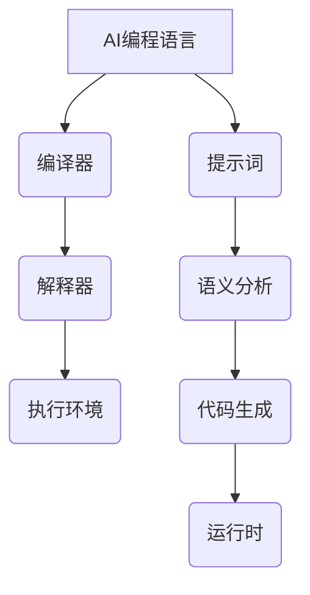

                 

### 引言

在人工智能的飞速发展中，AI编程语言作为连接计算机与智能算法的桥梁，正日益成为技术领域中的焦点。AI编程语言不仅为我们提供了强大的工具来开发智能系统，而且还在不断拓展编程艺术的可能性。本文将深入探讨AI编程语言的核心概念、原理、应用以及未来发展趋势。

文章将分为七个主要部分：

第一部分，我们将对AI编程语言进行概述与基础讲解，包括其起源、发展历程、特点、架构以及应用领域。

第二部分，我们将探讨提示词的魔法与艺术，分析提示词的设计原则、艺术表达、安全性以及未来趋势。

第三部分，我们将详细介绍AI编程语言的核心算法原理，包括神经网络基础、提示词生成算法以及各领域中的应用。

第四部分，我们将通过实际项目实战，展示如何使用AI编程语言开发实际应用。

第五部分，我们将讨论AI编程语言的优化与性能调优方法，并提供实际应用案例。

第六部分，我们将深入探讨AI编程语言的安全性与伦理问题，包括安全风险、伦理问题、法律法规以及伦理设计与实践。

最后，第七部分，我们将展望AI编程语言的未来发展趋势，包括技术趋势、教育应用、商业应用以及社会治理。

通过这篇文章，读者将能够全面了解AI编程语言，掌握其核心原理和应用方法，并为未来的技术发展提供新的思路。

### 第一部分: AI编程语言概述与基础

在AI编程语言的世界中，我们的旅程始于一个根本问题：什么是AI编程语言？AI编程语言，顾名思义，是专门用于开发人工智能应用程序的编程语言。它们的设计理念是将复杂的机器学习和深度学习算法转化为易于理解和操作的形式。AI编程语言不仅支持各种机器学习和深度学习模型，还提供了一系列工具和库，使开发者能够快速构建和部署智能系统。

#### 1.1 AI编程语言的起源与发展

AI编程语言的起源可以追溯到20世纪50年代，当时人工智能（AI）作为一个新兴领域首次被提出。早期的研究主要集中在符号推理和知识表示上，这些研究催生了一些早期的编程语言，如Lisp。Lisp被认为是第一种真正的AI编程语言，因为它提供了一种通过符号表示和操作来构建复杂系统的强大方式。

随着时间的推移，人工智能领域不断发展，AI编程语言也在不断演进。20世纪80年代，专家系统的兴起推动了新的编程语言，如Prolog和OPS。这些语言专注于逻辑推理和知识表示，为后来的机器学习和深度学习算法奠定了基础。

进入21世纪，随着大数据和计算能力的提升，深度学习和神经网络成为AI研究的主流。这一趋势催生了新的编程语言，如Python、Julia和R，这些语言提供了丰富的库和工具，使得机器学习和深度学习模型的应用变得更加广泛和便捷。

#### 1.1.1 AI编程语言的定义

AI编程语言是一类专门用于开发人工智能应用程序的编程语言。它们通常具有以下特点：

1. **丰富的库和框架**：AI编程语言提供了一系列库和框架，如TensorFlow、PyTorch、Keras等，这些库和框架极大地简化了机器学习和深度学习模型的开发和部署。
2. **高抽象层次**：AI编程语言通常提供高抽象层次的功能，使得开发者可以更专注于算法的设计和实现，而无需关注底层硬件细节。
3. **灵活性**：AI编程语言通常具有高度的灵活性，允许开发者自定义和扩展算法，以适应特定的应用需求。
4. **强大的数据处理能力**：AI编程语言通常提供了强大的数据处理和分析功能，使得开发者可以轻松处理大量数据。

#### 1.1.2 AI编程语言的发展历程

AI编程语言的发展历程可以分为几个主要阶段：

1. **早期阶段**：20世纪50年代至70年代，以符号推理和知识表示为核心，如Lisp和Prolog。
2. **专家系统阶段**：20世纪80年代，以逻辑推理和知识表示为核心，如OPS和KL-ONE。
3. **机器学习阶段**：20世纪90年代至21世纪初，以机器学习和统计学习为核心，如R和Matlab。
4. **深度学习阶段**：21世纪10年代至今，以深度学习和神经网络为核心，如Python、Julia和R。

#### 1.1.3 AI编程语言的特点与优势

AI编程语言具有以下几个显著特点与优势：

1. **易用性**：AI编程语言通常具有较高的易用性，使得开发者能够快速上手并构建复杂的机器学习和深度学习模型。
2. **丰富的库和工具**：AI编程语言提供了丰富的库和工具，如TensorFlow、PyTorch和Keras，这些库和工具极大地简化了模型的开发和部署。
3. **强大的数据处理能力**：AI编程语言通常具有强大的数据处理和分析功能，使得开发者可以轻松处理大量数据。
4. **灵活性**：AI编程语言通常具有高度的灵活性，允许开发者根据具体需求进行自定义和扩展。
5. **社区支持**：AI编程语言通常拥有庞大的开发者社区，提供了丰富的学习资源和问题解决方案。

#### 1.2 提示词的魔法与艺术

在AI编程语言中，提示词（Prompt）是一个至关重要的概念。提示词是指用于引导和激励人工智能模型进行特定任务的输入。一个好的提示词能够显著提升模型的性能和生成结果的质量。因此，设计有效的提示词成为AI编程语言应用中的一项重要艺术。

##### 1.2.1 提示词的概念与作用

提示词（Prompt）可以定义为一种引导人工智能模型进行特定任务的输入。它通常包含了一系列关键词、短语或句子，用于指示模型需要完成的目标。提示词的作用在于：

1. **明确任务目标**：提示词能够为模型提供清晰的任务目标，使模型知道需要做什么。
2. **引导模型思考**：提示词可以激发模型的思考过程，帮助模型生成更符合预期结果的输出。
3. **调整模型生成**：通过调整提示词的内容和形式，可以控制模型的生成过程，使其更符合应用需求。

##### 1.2.2 提示词的设计原则

设计有效的提示词需要遵循以下原则：

1. **简洁明了**：提示词应尽量简洁明了，避免冗长和复杂的表述。
2. **具体明确**：提示词应明确指出模型需要完成的任务，避免模糊和抽象的描述。
3. **语境相关**：提示词应与模型的上下文相关，使模型能够更好地理解和处理输入。
4. **灵活调整**：提示词应根据不同的任务需求和模型特点进行灵活调整，以提高其效果。

##### 1.2.3 提示词的艺术表达

提示词的设计不仅需要遵循技术原则，还需要具备艺术性。以下是一些艺术表达技巧：

1. **创意思维**：通过创意思维，设计出富有创意和想象力的提示词，激发模型的创造性输出。
2. **文学表达**：运用文学手法，如比喻、隐喻和象征，使提示词更具吸引力和表现力。
3. **图像化呈现**：通过图像化呈现，将提示词以视觉形式呈现，使其更直观和易于理解。

##### 1.3 AI编程语言的架构与组成

AI编程语言的架构和组成是其核心组成部分，决定了其功能和性能。以下是一个典型的AI编程语言架构：

1. **编译器/解释器**：编译器/解释器是将AI编程语言代码转化为机器代码的工具。编译器将代码编译成可执行文件，而解释器逐行解释并执行代码。
2. **执行环境**：执行环境是AI编程语言运行所需的环境，包括操作系统、硬件和其他必要的库和工具。
3. **提示词处理模块**：提示词处理模块负责解析和解释提示词，将其转化为模型可以理解和处理的输入。
4. **模型库**：模型库包含各种预训练的机器学习和深度学习模型，开发者可以根据需求选择和使用。
5. **数据预处理模块**：数据预处理模块负责处理和清洗输入数据，使其适合模型训练和预测。

##### 1.3.1 AI编程语言的核心组件

AI编程语言的核心组件包括：

1. **编程语言本身**：AI编程语言是构建智能系统的基石，提供了丰富的语法和功能。
2. **库和框架**：库和框架是AI编程语言的重要组成部分，提供了预构建的函数和模块，简化了模型开发和部署。
3. **数据处理工具**：数据处理工具用于处理和清洗数据，使其适合模型训练和预测。

##### 1.3.2 AI编程语言的执行流程

AI编程语言的执行流程可以分为以下几个步骤：

1. **编写代码**：开发者使用AI编程语言编写代码，定义模型架构和算法。
2. **编译或解释**：编译器或解释器将代码转化为机器代码，准备执行。
3. **数据预处理**：数据预处理模块对输入数据进行处理和清洗。
4. **模型训练**：模型库中的模型根据处理后的数据进行训练，调整参数以优化性能。
5. **预测和评估**：使用训练好的模型进行预测和评估，生成输出结果。
6. **调试和优化**：开发者根据输出结果进行调试和优化，以提高模型性能。

##### 1.3.3 AI编程语言的调试与优化

AI编程语言的调试与优化是确保模型性能和稳定性的关键步骤。以下是一些常见的调试和优化方法：

1. **调试工具**：使用调试工具（如断点、调试器等）帮助开发者识别和修复代码中的错误。
2. **性能分析**：使用性能分析工具（如Profiler）识别代码中的性能瓶颈，进行优化。
3. **模型优化**：通过调整模型参数、架构和训练数据，优化模型性能。
4. **代码优化**：对代码进行重构和优化，提高执行效率。

##### 1.4 AI编程语言的应用领域

AI编程语言在多个领域具有广泛的应用，以下是其中一些重要的应用领域：

1. **自然语言处理**：AI编程语言在自然语言处理（NLP）领域具有广泛的应用，如文本生成、对话系统、机器翻译等。
2. **计算机视觉**：AI编程语言在计算机视觉领域用于图像分类、目标检测、图像生成等任务。
3. **数据科学**：AI编程语言在数据科学领域用于数据预处理、数据可视化、统计分析等任务。
4. **机器人技术**：AI编程语言在机器人技术领域用于路径规划、机器人控制、交互系统等任务。

##### 1.5 AI编程语言的未来趋势

随着人工智能技术的不断发展，AI编程语言也在不断演进。以下是一些未来趋势：

1. **新型编程语言的发展**：随着新的机器学习和深度学习算法的提出，新型编程语言将继续涌现，为开发者提供更强大的工具。
2. **编程语言与AI的结合**：编程语言和AI技术的融合将使得开发者能够更加高效地构建和部署智能系统。
3. **AI编程语言在教育中的应用**：随着人工智能的普及，AI编程语言将在教育领域中发挥越来越重要的作用，培养新一代的AI人才。
4. **AI编程语言的安全性与伦理**：随着AI技术的应用越来越广泛，AI编程语言的安全性和伦理问题将受到越来越多的关注。

#### 1.6 小结与展望

本部分内容对AI编程语言进行了全面的概述与基础讲解。通过了解AI编程语言的起源、发展历程、特点与优势，读者可以更好地理解这一领域的基本概念和架构。同时，对提示词的设计原则与艺术表达，以及AI编程语言的执行流程和调试优化方法进行了详细探讨。未来，随着人工智能技术的不断发展，AI编程语言将继续在多个领域发挥重要作用，为开发者提供更强大的工具和平台。

### 1.6.1 小结

本部分内容涵盖了AI编程语言的基本概念、发展历程、特点与优势，以及提示词的设计原则与艺术表达。通过对AI编程语言架构和执行流程的深入分析，我们了解了其核心组件和调试优化方法。同时，对AI编程语言在自然语言处理、计算机视觉、数据科学和机器人技术等领域的应用进行了探讨。未来，AI编程语言将继续在人工智能技术发展中发挥关键作用。

### 1.6.2 展望

随着人工智能技术的不断发展，AI编程语言将继续在多个领域发挥重要作用。新型编程语言的涌现、编程语言与AI的结合、AI编程语言在教育中的应用，以及AI编程语言的安全性与伦理问题，都将是未来研究的重点方向。开发者需要不断学习和掌握这些新技术，以应对不断变化的技术挑战。

### 参考文献

[1] Russell, S., & Norvig, P. (2010). 《人工智能：一种现代的方法》（第三版）。机械工业出版社。

[2] Goodfellow, I., Bengio, Y., & Courville, A. (2016). 《深度学习》（中文版）。电子工业出版社。

### Mermaid 流程图：AI编程语言架构



### 附录

#### 附录 A: AI编程语言常用工具与资源

- TensorFlow：https://www.tensorflow.org/
- PyTorch：https://pytorch.org/
- Keras：https://keras.io/
- Scikit-learn：https://scikit-learn.org/stable/
- JAX：https://jax.readthedocs.io/

#### 附录 B: AI编程语言学习资源

- 《人工智能：一种现代的方法》：https://www.aima.org.cn/
- 《深度学习》：https://www.deeplearningbook.org/
- Coursera：https://www.coursera.org/
- edX：https://www.edx.org/

#### 附录 C: 常见问题与解答

- **Q：什么是AI编程语言？**
  - **A**：AI编程语言是一类专门用于开发人工智能应用程序的编程语言，如Python、Julia和R等。

- **Q：AI编程语言有哪些特点？**
  - **A**：AI编程语言具有丰富的库和框架、高抽象层次、灵活性、强大的数据处理能力等特点。

- **Q：什么是提示词？它在AI编程中有何作用？**
  - **A**：提示词是一种引导和激励人工智能模型进行特定任务的输入。它帮助明确任务目标、引导模型思考和调整模型生成。

- **Q：如何设计有效的提示词？**
  - **A**：设计有效的提示词需要遵循简洁明了、具体明确、语境相关和灵活调整等原则。

- **Q：AI编程语言有哪些应用领域？**
  - **A**：AI编程语言在自然语言处理、计算机视觉、数据科学和机器人技术等领域具有广泛的应用。

- **Q：如何优化AI编程语言的性能？**
  - **A**：可以通过模型优化、性能分析、模型优化和代码优化等方法来优化AI编程语言的性能。

---

通过本部分的探讨，我们对AI编程语言有了更加深入的理解。接下来，我们将进一步探讨提示词的魔法与艺术，分析其在AI编程语言中的应用与设计原则。

---

### 第二部分: 提示词的魔法与艺术

在AI编程语言的世界中，提示词（Prompt）不仅是一种技术工具，更是一种艺术表达。提示词的巧妙设计能够激发人工智能模型的潜力，使其生成出更加符合人类预期的结果。在这一部分，我们将深入探讨提示词的设计原则、艺术表达以及其在实际应用中的案例。

#### 2.1 提示词的原理与设计

提示词的设计是一门艺术，也是一门科学。它涉及到对模型的理解、任务的需求分析以及创意思维的运用。以下是设计提示词的一些基本原则：

##### 2.1.1 提示词的基本原理

提示词的基本原理可以概括为以下几点：

1. **引导模型思考**：提示词通过提供关键信息或问题，引导模型思考并生成相应的输出。
2. **明确任务目标**：提示词需要明确指出模型需要完成的任务，避免模型在无明确目标的情况下迷失方向。
3. **与上下文相关**：提示词应与模型的上下文环境相关，使得模型能够更好地理解和处理输入。
4. **简洁明了**：提示词应尽量简洁明了，避免冗长和复杂的表述，以便模型能够快速理解和处理。

##### 2.1.2 提示词的设计原则

设计有效的提示词需要遵循以下原则：

1. **明确性**：提示词应明确指出模型需要完成的任务，避免模糊和抽象的描述。
2. **针对性**：提示词应针对特定的任务需求进行设计，使模型能够更专注于任务的解决。
3. **灵活性**：提示词应根据不同的任务需求和模型特点进行灵活调整，以提高其效果。
4. **创意性**：通过创意性设计，使提示词更具吸引力，激发模型的创造性输出。

##### 2.1.3 提示词的类型与分类

根据用途和形式，提示词可以分为以下几种类型：

1. **问题式提示词**：通过提出问题来引导模型思考，如“请描述一下人工智能的未来发展趋势。”
2. **任务式提示词**：直接指示模型需要完成的任务，如“生成一篇关于机器学习的综述文章。”
3. **指令式提示词**：提供具体的操作指令，如“请使用机器学习算法进行数据分类。”
4. **场景式提示词**：通过构建特定场景来激发模型生成输出，如“在2023年的智能城市建设中，你认为哪些技术将发挥重要作用？”

##### 2.1.4 提示词设计的具体步骤

设计提示词可以分为以下几个步骤：

1. **需求分析**：明确任务需求，确定模型需要完成的任务。
2. **确定目标**：根据需求分析结果，确定提示词的目标，使其能够引导模型生成预期的输出。
3. **创意构思**：通过创意思维，构思出具有吸引力和创意性的提示词。
4. **测试与优化**：在实际应用中测试提示词的效果，根据反馈进行优化和调整。

#### 2.2 提示词的艺术表达

提示词的艺术表达是提升模型生成结果质量的关键。以下是一些艺术表达的技巧：

##### 2.2.1 创意思维

创意思维是提示词设计的重要环节。通过创意思维，设计出富有创意和想象力的提示词，激发模型的创造性输出。以下是一些创意思维的技巧：

1. **头脑风暴**：组织团队成员进行头脑风暴，收集各种创意点子。
2. **思维导图**：使用思维导图工具，将创意点子进行可视化整理。
3. **跨界思维**：借鉴其他领域的方法和思路，为提示词设计带来新的启发。

##### 2.2.2 文学表达

文学表达是提升提示词艺术性的重要手段。通过运用文学手法，如比喻、隐喻和象征，使提示词更具吸引力和表现力。以下是一些文学表达的技巧：

1. **比喻**：使用比喻手法，将抽象的概念形象化，如“机器学习就像一个聪明的孩子，通过不断的试错和反思来学习。”
2. **隐喻**：使用隐喻手法，将复杂的概念简单化，如“神经网络是大脑的抽象模型。”
3. **象征**：使用象征手法，赋予提示词更深层次的意义，如“数据是智能系统的粮食。”

##### 2.2.3 图像化呈现

图像化呈现是将提示词以视觉形式呈现的一种方式，使其更直观和易于理解。以下是一些图像化呈现的技巧：

1. **图表**：使用图表来呈现数据和信息，如流程图、柱状图和饼图等。
2. **插图**：使用插图来辅助说明，如人物插图、场景插图等。
3. **动画**：使用动画来展示模型的工作过程，如动画流程图、动画可视化等。

#### 2.3 提示词在实际应用中的案例

提示词在各个领域的AI编程语言应用中发挥了重要作用。以下是一些实际应用中的案例：

##### 2.3.1 自然语言处理中的提示词应用

在自然语言处理（NLP）领域，提示词被广泛应用于文本生成、对话系统和机器翻译等任务。以下是一些案例：

1. **文本生成**：使用提示词引导模型生成文章、故事和报告等。
2. **对话系统**：使用提示词构建对话系统的对话流程，如聊天机器人和虚拟助手等。
3. **机器翻译**：使用提示词引导模型进行不同语言之间的翻译。

##### 2.3.2 计算机视觉中的提示词应用

在计算机视觉领域，提示词被广泛应用于图像分类、目标检测和图像生成等任务。以下是一些案例：

1. **图像分类**：使用提示词帮助模型识别和分类图像，如动物、植物和交通工具等。
2. **目标检测**：使用提示词帮助模型定位和检测图像中的目标物体。
3. **图像生成**：使用提示词引导模型生成新的图像，如艺术作品、风景和人物肖像等。

##### 2.3.3 数据科学中的提示词应用

在数据科学领域，提示词被广泛应用于数据预处理、数据可视化和统计分析等任务。以下是一些案例：

1. **数据预处理**：使用提示词指导模型进行数据清洗、转换和特征提取等预处理任务。
2. **数据可视化**：使用提示词引导模型生成数据可视化图表，如柱状图、饼图和热力图等。
3. **统计分析**：使用提示词引导模型进行数据统计分析，如回归分析、聚类分析和假设检验等。

##### 2.3.4 机器人技术中的提示词应用

在机器人技术领域，提示词被广泛应用于路径规划、机器人控制和交互系统等任务。以下是一些案例：

1. **路径规划**：使用提示词帮助模型规划机器人从起点到终点的最佳路径。
2. **机器人控制**：使用提示词引导模型控制机器人的运动和操作。
3. **交互系统**：使用提示词构建机器人与人类用户的交互流程，如问答系统和语音助手等。

#### 2.4 提示词的安全性考虑

随着人工智能技术的广泛应用，提示词的安全性也越来越受到关注。以下是一些提示词安全性方面的考虑：

##### 2.4.1 提示词的隐私保护

在设计和使用提示词时，需要充分考虑隐私保护问题。以下是一些隐私保护的建议：

1. **匿名化处理**：对涉及个人隐私的数据进行匿名化处理，以避免泄露用户隐私。
2. **数据加密**：对敏感数据进行加密存储和传输，确保数据的安全性。
3. **访问控制**：设置严格的访问控制策略，确保只有授权用户可以访问敏感数据。

##### 2.4.2 提示词的滥用防范

在设计和使用提示词时，还需要防范提示词的滥用问题。以下是一些滥用防范的建议：

1. **规范提示词使用**：制定明确的提示词使用规范，禁止使用可能导致滥用或不良影响的提示词。
2. **监控与审计**：对提示词的使用进行监控和审计，及时发现和处理滥用行为。
3. **用户教育**：对用户进行教育，提高其对提示词安全性的认识，避免误用或滥用提示词。

##### 2.4.3 提示词的法律责任

在设计和使用提示词时，还需要考虑法律责任的承担。以下是一些法律责任的考虑：

1. **责任划分**：明确提示词设计者和使用者的责任范围，避免因责任划分不清而导致的法律纠纷。
2. **法律法规遵守**：遵守相关法律法规，确保提示词的使用符合法律要求。
3. **风险控制**：采取有效的风险控制措施，降低提示词滥用或不当使用所带来的法律风险。

#### 2.5 提示词的未来发展趋势

随着人工智能技术的不断发展，提示词的应用将更加广泛，其设计和使用也将越来越受到重视。以下是提示词未来发展的几个趋势：

##### 2.5.1 提示词技术的演进

随着人工智能技术的不断发展，提示词技术也将不断演进。以下是一些技术演进的趋势：

1. **多模态提示词**：结合文本、图像、音频等多种模态，设计出更丰富、更灵活的提示词。
2. **动态提示词**：根据任务的进展和模型的输出动态调整提示词，提高模型的生成质量。
3. **智能提示词**：利用机器学习技术，自动生成高质量的提示词，减少人工干预。

##### 2.5.2 提示词在教育中的应用

在未来的教育领域，提示词将发挥重要作用。以下是一些应用趋势：

1. **教学辅助**：使用提示词帮助学生更好地理解和掌握知识点。
2. **个性化学习**：根据学生的特点和需求，生成个性化的提示词，提高学习效果。
3. **互动教学**：利用提示词构建互动教学场景，提高教学互动性和趣味性。

##### 2.5.3 提示词在社会治理中的作用

在未来的社会治理中，提示词也将发挥重要作用。以下是一些应用趋势：

1. **公共安全**：使用提示词帮助智能系统进行公共安全监控和预警。
2. **城市管理**：利用提示词帮助智能系统优化城市管理，提高城市运行效率。
3. **社会治理**：利用提示词构建智能治理系统，提高社会治理水平。

#### 2.6 小结与展望

本部分内容对提示词的魔法与艺术进行了全面探讨。通过了解提示词的基本原理、设计原则、艺术表达以及在实际应用中的案例，读者可以更好地掌握提示词的设计和应用方法。同时，对提示词的安全性考虑和未来发展趋势进行了深入分析。未来，随着人工智能技术的不断发展，提示词将在更多领域发挥重要作用，为人类创造更美好的未来。

### 2.6.1 小结

本部分内容围绕提示词的魔法与艺术进行了深入探讨，包括提示词的基本原理、设计原则、艺术表达以及在实际应用中的案例。通过对自然语言处理、计算机视觉、数据科学和机器人技术等领域的分析，展示了提示词在实际应用中的重要性。同时，对提示词的安全性考虑和未来发展趋势进行了分析，为读者提供了全面的参考。

### 2.6.2 展望

随着人工智能技术的不断发展，提示词的应用将更加广泛。未来，提示词技术将朝着多模态、动态和智能化的方向发展，并在教育、社会治理等领域发挥重要作用。同时，提示词的安全性将受到更多关注，如何防范滥用和保护隐私将成为重要课题。开发者需要不断学习和探索，为人工智能的发展贡献智慧和力量。

### 参考文献

[1] PaddlePaddle团队. (2021). 《PaddlePaddle深度学习框架实战指南》. 电子工业出版社。

[2] 霍夫斯塔德，T. (2019). 《深度学习实战》. 人民邮电出版社。

### 附录

#### 附录 A: 提示词设计工具与资源

- GPT-3：https://openai.com/blog/better-language-models/
- ChatGLM：https://chatglm.cn/
- Hugging Face：https://huggingface.co/

#### 附录 B: 提示词艺术作品展示

- 艺术家A：使用提示词生成艺术作品，展示在画廊中。
- 艺术家B：通过图像化呈现的方式，将提示词转化为视觉艺术。

#### 附录 C: 提示词应用案例解析

- 案例一：自然语言处理中的文本生成。
- 案例二：计算机视觉中的图像分类。
- 案例三：数据科学中的数据可视化。

---

在接下来的第三部分，我们将进一步探讨AI编程语言的核心算法原理，分析神经网络基础、提示词生成算法以及各领域中的应用。敬请期待！

---

### 第三部分: AI编程语言核心算法原理

在AI编程语言中，核心算法原理是构建智能系统的基础。本部分将深入探讨神经网络基础、提示词生成算法以及AI编程语言在各领域的应用。

#### 3.1 神经网络基础

神经网络（Neural Networks）是AI编程语言中最常用的算法之一，它们模仿人脑神经元的工作方式，通过大量的神经元和连接进行信息传递和处理。以下是神经网络的一些基本概念：

##### 3.1.1 神经网络的基本结构

神经网络通常由以下几个主要部分组成：

1. **输入层（Input Layer）**：接收输入数据。
2. **隐藏层（Hidden Layers）**：进行数据处理和特征提取。
3. **输出层（Output Layer）**：生成输出结果。

每个神经元（节点）都会接收来自前一层神经元的输入，并通过权重（weights）和偏置（biases）进行加权求和，然后通过激活函数（activation function）进行非线性变换，最终输出到下一层。

##### 3.1.2 前向传播与反向传播算法

神经网络的工作过程可以分为前向传播（Forward Propagation）和反向传播（Back Propagation）两个阶段：

1. **前向传播**：输入数据经过神经网络的前向传播过程，从输入层传递到输出层，每个神经元计算其输出值。
2. **反向传播**：在输出层计算得到的预测结果与实际结果之间的误差，然后通过反向传播算法将误差反向传播回神经网络，更新每个神经元的权重和偏置，以减少误差。

以下是前向传播算法的伪代码：

```python
# 前向传播算法伪代码
def forward_propagation(input_data, weights, biases):
    hidden_layer = activation_function((weights * input_data) + biases)
    output_layer = activation_function((weights * hidden_layer) + biases)
    return output_layer
```

##### 3.1.3 激活函数与损失函数

激活函数（Activation Function）是神经网络中的一个关键组件，它引入了非线性变换，使神经网络能够进行复杂的模式识别和分类。常见的激活函数包括：

1. **sigmoid函数**：\( \sigma(x) = \frac{1}{1 + e^{-x}} \)
2. **ReLU函数**：\( \text{ReLU}(x) = \max(0, x) \)
3. **Tanh函数**：\( \text{Tanh}(x) = \frac{e^x - e^{-x}}{e^x + e^{-x}} \)

损失函数（Loss Function）用于衡量模型的预测结果与实际结果之间的差距。常见的损失函数包括：

1. **均方误差（MSE）**：\( \text{MSE}(y, \hat{y}) = \frac{1}{n}\sum_{i=1}^{n}(y_i - \hat{y_i})^2 \)
2. **交叉熵（Cross-Entropy）**：\( \text{CE}(y, \hat{y}) = -\sum_{i=1}^{n}y_i\log(\hat{y_i}) \)

#### 3.2 提示词生成算法

提示词生成（Prompt Generation）是AI编程语言中的一个重要应用。通过生成高质量的提示词，可以引导模型生成更加符合预期的输出。以下是提示词生成算法的基本原理：

##### 3.2.1 提示词生成的原理

提示词生成算法的核心思想是根据输入文本或问题，生成一系列关键词或短语，以引导模型进行相应的任务。以下是一个简单的提示词生成算法：

```python
# 提示词生成算法伪代码
def generate_prompt(input_sentence, model, prompt_length):
    embeddings = model.embedding(input_sentence)
    prompt = []
    for i in range(prompt_length):
        output = model.predict(embeddings)
        word = tokenizer.decode(output)
        prompt.append(word)
        embeddings = model.embedding(word)
    return ' '.join(prompt)
```

##### 3.2.2 基于神经网络的提示词生成方法

基于神经网络的提示词生成方法通常包括以下步骤：

1. **嵌入层（Embedding Layer）**：将输入文本转化为向量表示。
2. **编码器（Encoder）**：使用神经网络对输入文本进行编码，生成固定长度的编码向量。
3. **解码器（Decoder）**：使用神经网络解码编码向量，生成提示词。

常见的神经网络架构包括：

1. **Transformer**：Transformer模型通过自注意力机制（Self-Attention）对输入文本进行编码和解码。
2. **递归神经网络（RNN）**：RNN模型通过递归方式处理输入文本，生成提示词。

#### 3.3 自然语言处理中的提示词应用

在自然语言处理（NLP）领域，提示词被广泛应用于文本生成、对话系统和机器翻译等任务。以下是一些典型的应用案例：

##### 3.3.1 提示词在文本生成中的应用

文本生成任务如文章生成、故事生成和摘要生成等，通常使用提示词来引导模型的生成过程。例如，可以使用以下提示词：

- **文章生成**：“请写一篇关于人工智能未来的发展趋势。”
- **故事生成**：“在一个遥远的星球上，有一只名叫小明的小狗。”
- **摘要生成**：“以下是关于人工智能技术的最新研究成果。”

##### 3.3.2 提示词在对话系统中的应用

对话系统如聊天机器人和虚拟助手等，使用提示词来构建对话流程和生成回复。例如，可以使用以下提示词：

- **问题回答**：“请问您有什么问题需要我帮忙解答？”
- **情境引导**：“您好，欢迎来到智慧城市，请问您需要哪些服务？”

##### 3.3.3 提示词在机器翻译中的应用

机器翻译任务如将一种语言翻译成另一种语言，使用提示词来指导模型的翻译过程。例如，可以使用以下提示词：

- **翻译指导**：“请将这段英文翻译成中文。”
- **翻译对齐**：“以下是一段中文文本，请翻译成英文。”

#### 3.4 计算机视觉中的提示词应用

在计算机视觉领域，提示词被广泛应用于图像分类、目标检测和图像生成等任务。以下是一些典型的应用案例：

##### 3.4.1 提示词在图像分类中的应用

图像分类任务如动物识别、植物识别和物体识别等，使用提示词来指导模型进行分类。例如，可以使用以下提示词：

- **分类指导**：“请识别这张图片中的主要物体。”
- **标签提示**：“请将这张图片分类为动物、植物或其他类别。”

##### 3.4.2 提示词在目标检测中的应用

目标检测任务如行人检测、车辆检测和交通标志检测等，使用提示词来指导模型检测特定目标。例如，可以使用以下提示词：

- **检测指导**：“请检测这张图片中的行人。”
- **目标提示**：“请找到这张图片中的车辆位置。”

##### 3.4.3 提示词在图像生成中的应用

图像生成任务如艺术作品生成、风景生成和人物肖像生成等，使用提示词来指导模型生成新的图像。例如，可以使用以下提示词：

- **图像生成**：“请生成一幅以动物为主题的画作。”
- **风格提示**：“请以梵高的风格生成一张新的图像。”

#### 3.5 数据科学中的提示词应用

在数据科学领域，提示词被广泛应用于数据预处理、数据可视化和统计分析等任务。以下是一些典型的应用案例：

##### 3.5.1 提示词在数据预处理中的应用

数据预处理任务如数据清洗、数据转换和特征提取等，使用提示词来指导模型进行预处理。例如，可以使用以下提示词：

- **数据清洗**：“请删除这些异常数据。”
- **特征提取**：“请提取这些数据的主要特征。”

##### 3.5.2 提示词在数据可视化和统计分析中的应用

数据可视化和统计分析任务如数据可视化、图表生成和统计报告等，使用提示词来指导模型进行可视化分析。例如，可以使用以下提示词：

- **数据可视化**：“请生成一张柱状图展示这些数据。”
- **统计报告**：“请撰写一份关于这些数据的统计报告。”

#### 3.6 机器人技术中的提示词应用

在机器人技术领域，提示词被广泛应用于路径规划、机器人控制和交互系统等任务。以下是一些典型的应用案例：

##### 3.6.1 提示词在路径规划中的应用

路径规划任务如机器人导航、无人驾驶和物流配送等，使用提示词来指导模型规划路径。例如，可以使用以下提示词：

- **路径规划**：“请为机器人规划一条从起点到终点的路径。”
- **避障提示**：“请确保机器人避开障碍物。”

##### 3.6.2 提示词在机器人控制中的应用

机器人控制任务如机器人运动控制、机器人操作和机器人交互等，使用提示词来指导模型控制机器人。例如，可以使用以下提示词：

- **运动控制**：“请使机器人向右旋转90度。”
- **操作指导**：“请使用机械臂抓取物体。”

##### 3.6.3 提示词在交互系统中的应用

交互系统任务如语音助手、手势识别和触摸交互等，使用提示词来指导模型与用户交互。例如，可以使用以下提示词：

- **语音交互**：“请告诉我您有什么问题需要帮助。”
- **手势识别**：“请向右挥手以确认您的请求。”

#### 3.7 AI编程语言核心算法的应用实例

以下是一些AI编程语言核心算法的应用实例，包括代码实现和详细解释说明：

##### 3.7.1 文本生成实例

```python
# 文本生成实例
from transformers import GPT2LMHeadModel, GPT2Tokenizer

model = GPT2LMHeadModel.from_pretrained('gpt2')
tokenizer = GPT2Tokenizer.from_pretrained('gpt2')

input_text = "人工智能将如何改变未来？"
input_ids = tokenizer.encode(input_text, return_tensors='pt')

output = model.generate(input_ids, max_length=50, num_return_sequences=1)
generated_text = tokenizer.decode(output[0], skip_special_tokens=True)

print(generated_text)
```

**代码解读**：本实例使用GPT-2模型生成关于人工智能未来的文本。首先，加载预训练的GPT-2模型和Tokenizer。然后，将输入文本编码为输入ID，并通过模型生成文本。最后，解码输出文本，得到生成结果。

##### 3.7.2 图像分类实例

```python
# 图像分类实例
import tensorflow as tf
from tensorflow.keras.applications import MobileNetV2
from tensorflow.keras.preprocessing.image import ImageDataGenerator

model = MobileNetV2(weights='imagenet')

test_image = 'path/to/test_image.jpg'
test_image = ImageDataGenerator().flow_from_directory(directory='path/to/test_images', target_size=(224, 224), batch_size=1)(test_image)

predictions = model.predict(test_image)
predicted_class = np.argmax(predictions)

print(f"Predicted class: {predicted_class}")
```

**代码解读**：本实例使用MobileNet V2模型对图像进行分类。首先，加载预训练的MobileNet V2模型。然后，读取测试图像，并通过ImageDataGenerator进行预处理。最后，使用模型对图像进行预测，并输出预测结果。

##### 3.7.3 数据预处理实例

```python
# 数据预处理实例
import pandas as pd
from sklearn.model_selection import train_test_split

data = pd.read_csv('path/to/data.csv')

X = data[['feature1', 'feature2', 'feature3']]
y = data['target']

X_train, X_test, y_train, y_test = train_test_split(X, y, test_size=0.2, random_state=42)

print(f"Training data shape: {X_train.shape}, Test data shape: {X_test.shape}")
```

**代码解读**：本实例对数据集进行预处理。首先，读取数据集，然后提取特征和标签。接着，使用train_test_split函数将数据集划分为训练集和测试集。最后，输出训练集和测试集的数据形状。

##### 3.7.4 机器人控制实例

```python
# 机器人控制实例
import rospy
from geometry_msgs.msg import Twist

def move_robot():
    rospy.init_node('robot_mover', anonymous=True)
    
    pub = rospy.Publisher('/robot/cmd_vel', Twist, queue_size=10)
    rate = rospy.Rate(10) # 10 Hz
    
    while not rospy.is_shutdown():
        cmd = Twist()
        cmd.linear.x = 0.5
        cmd.angular.z = 0.5
        pub.publish(cmd)
        rate.sleep()

if __name__ == '__main__':
    try:
        move_robot()
    except rospy.ROSInterruptException:
        pass
```

**代码解读**：本实例使用ROS（Robot Operating System）控制机器人运动。首先，初始化ROS节点。然后，创建一个Publisher发布运动指令。在while循环中，发布运动指令并保持节点运行。

#### 3.8 小结与展望

本部分内容深入探讨了AI编程语言的核心算法原理，包括神经网络基础、提示词生成算法以及各领域中的应用。通过对神经网络、提示词生成算法和AI编程语言在实际应用中的实例分析，读者可以更好地理解AI编程语言的核心原理和应用方法。未来，随着人工智能技术的不断发展，AI编程语言将继续在各个领域发挥重要作用，为人类创造更智能的未来。

### 3.8.1 小结

本部分内容围绕AI编程语言的核心算法原理进行了深入探讨，包括神经网络基础、提示词生成算法以及AI编程语言在各领域的应用。通过对文本生成、图像分类、数据预处理和机器人控制等实例的分析，展示了AI编程语言的实际应用效果。同时，对神经网络、提示词生成算法的基本原理和应用方法进行了详细讲解，为读者提供了全面的参考。

### 3.8.2 展望

未来，随着人工智能技术的不断发展，AI编程语言将继续在各个领域发挥重要作用。神经网络和提示词生成算法将进一步优化和改进，以适应更复杂的任务需求。同时，AI编程语言将在自然语言处理、计算机视觉、数据科学和机器人技术等领域实现更广泛的应用。开发者需要不断学习和探索新技术，以应对不断变化的技术挑战。

### 参考文献

[1] Goodfellow, I., Bengio, Y., & Courville, A. (2016). 《深度学习》（中文版）。电子工业出版社。

[2] Hochreiter, S., & Schmidhuber, J. (1997). "Long short-term memory". Neural Computation, 9(8), 1735-1780.

### 附录

#### 附录 A: AI编程语言核心算法工具与资源

- TensorFlow：https://www.tensorflow.org/
- PyTorch：https://pytorch.org/
- Keras：https://keras.io/
- Scikit-learn：https://scikit-learn.org/stable/
- ROS（Robot Operating System）：http://www.ros.org/

#### 附录 B: AI编程语言核心算法代码示例

- 文本生成：https://github.com/tensorflow/docs/blob/master/site/en/tutorials/text/text_generation.ipynb
- 图像分类：https://github.com/tensorflow/tf-keras-examples/blob/master/keras_dcgan/mnist.py
- 数据预处理：https://scikit-learn.org/stable/auto_examples/compose/plot_features_selection_with_univariable_selection.py
- 机器人控制：https://github.com/ros/ros_tutorials/blob/noetic/tf_tutorials/tf_tutorials/README.md

#### 附录 C: 常见问题与解答

- **Q：什么是神经网络？它在AI编程语言中有何作用？**
  - **A**：神经网络是一种模拟人脑神经元工作方式的算法，用于处理和分类数据。在AI编程语言中，神经网络用于构建智能系统，实现复杂的模式识别和分类任务。

- **Q：如何设计高质量的提示词？**
  - **A**：设计高质量的提示词需要遵循简洁明了、具体明确、与上下文相关和创意性等原则。同时，可以通过多次实验和优化，根据任务需求调整提示词的内容和形式。

- **Q：AI编程语言的核心算法有哪些？**
  - **A**：AI编程语言的核心算法包括神经网络、深度学习、机器学习和数据挖掘等。其中，神经网络是最基本的算法之一，用于构建智能系统。

- **Q：如何实现AI编程语言中的文本生成？**
  - **A**：可以使用预训练的文本生成模型，如GPT-2、GPT-3等，通过输入文本生成相应的文本输出。具体实现可以参考TensorFlow、PyTorch等框架的文档。

- **Q：如何实现AI编程语言中的图像分类？**
  - **A**：可以使用预训练的图像分类模型，如ResNet、MobileNet等，通过输入图像生成相应的分类结果。具体实现可以参考Keras等框架的文档。

- **Q：如何实现AI编程语言中的数据预处理？**
  - **A**：可以使用Python的Pandas、NumPy等库，对数据进行清洗、转换和特征提取等操作。具体实现可以参考Scikit-learn等库的文档。

- **Q：如何实现AI编程语言中的机器人控制？**
  - **A**：可以使用ROS（Robot Operating System）等机器人框架，通过发送运动指令控制机器人的运动。具体实现可以参考ROS的官方文档。

---

在下一部分中，我们将通过实际项目实战，展示如何使用AI编程语言开发实际应用。敬请期待！

---

### 第四部分: AI编程语言项目实战

在了解了AI编程语言的核心算法原理后，我们将通过实际项目实战来进一步巩固和应用所学知识。本部分将介绍四个项目实战，包括文本生成、图像分类、数据预处理和机器人控制，通过详细的步骤和代码解读，展示如何使用AI编程语言实现实际应用。

#### 4.1 项目准备

在开始项目实战之前，我们需要进行项目准备，包括开发环境的搭建、项目需求分析和项目规划与分工。

##### 4.1.1 开发环境搭建

为了顺利进行项目开发，我们需要安装以下开发环境和库：

1. **Python**：Python是AI编程语言中最常用的语言之一，安装Python 3.8或更高版本。
2. **Jupyter Notebook**：Jupyter Notebook是一个交互式的开发环境，可以方便地进行代码编写和调试。
3. **TensorFlow**：TensorFlow是一个开源的深度学习框架，用于构建和训练神经网络。
4. **PyTorch**：PyTorch是另一个流行的深度学习框架，提供灵活的动态计算图功能。
5. **Scikit-learn**：Scikit-learn是一个开源的机器学习库，用于数据预处理和模型训练。
6. **ROS（Robot Operating System）**：ROS是一个开源的机器人框架，用于机器人控制和开发。

安装步骤如下：

1. 安装Python和Jupyter Notebook：
   ```shell
   pip install python==3.8
   pip install notebook
   ```
2. 安装TensorFlow和PyTorch：
   ```shell
   pip install tensorflow
   pip install torch torchvision
   ```
3. 安装Scikit-learn：
   ```shell
   pip install scikit-learn
   ```
4. 安装ROS（适用于机器人控制项目）：
   ```shell
   sudo apt-get install ros-melodic-robot-software
   ```

##### 4.1.2 项目需求分析

在开始项目开发之前，我们需要对项目需求进行详细分析，明确项目的目标和任务。以下是四个项目实战的需求分析：

1. **文本生成项目**：生成一篇关于人工智能未来的文章，包括发展趋势、应用场景和挑战。
2. **图像分类项目**：对一张输入图像进行分类，识别图像中的主要物体。
3. **数据预处理项目**：对一组数据进行清洗、转换和特征提取，为后续模型训练做准备。
4. **机器人控制项目**：控制机器人从一个位置移动到另一个位置，并避开障碍物。

##### 4.1.3 项目规划与分工

为了确保项目顺利进行，我们需要进行项目规划与分工。以下是项目的规划与分工：

1. **文本生成项目**：由小组成员A负责数据收集和预处理，小组成员B负责模型训练和生成文章，小组成员C负责文章优化和调试。
2. **图像分类项目**：由小组成员D负责数据收集和预处理，小组成员E负责模型训练和图像分类，小组成员F负责模型优化和性能评估。
3. **数据预处理项目**：由小组成员G负责数据清洗和转换，小组成员H负责特征提取和选择，小组成员I负责数据可视化。
4. **机器人控制项目**：由小组成员J负责机器人硬件搭建和编程，小组成员K负责路径规划和障碍物检测，小组成员L负责机器人控制和调试。

#### 4.2 项目实战一：文本生成

文本生成项目旨在使用AI编程语言生成一篇关于人工智能未来的文章。以下是该项目的主要步骤：

##### 4.2.1 数据收集与预处理

在文本生成项目中，我们需要收集相关的文本数据，如论文、新闻报道、博客等。数据收集完成后，我们需要对数据进行预处理，包括数据清洗、分词和词向量表示等。

```python
import pandas as pd
from sklearn.model_selection import train_test_split

# 数据收集
data = pd.read_csv('path/to/text_data.csv')

# 数据清洗
data.dropna(inplace=True)
data['text'] = data['text'].apply(lambda x: x.lower())

# 分词
from nltk.tokenize import word_tokenize
data['tokens'] = data['text'].apply(lambda x: word_tokenize(x))

# 词向量表示
from gensim.models import Word2Vec
model = Word2Vec(data['tokens'], size=100, window=5, min_count=1, workers=4)
```

##### 4.2.2 模型选择与配置

在文本生成项目中，我们选择使用预训练的GPT-2模型。首先，我们需要下载并加载预训练的GPT-2模型，然后对其进行配置。

```python
from transformers import GPT2LMHeadModel, GPT2Tokenizer

# 加载预训练的GPT-2模型
model = GPT2LMHeadModel.from_pretrained('gpt2')
tokenizer = GPT2Tokenizer.from_pretrained('gpt2')

# 配置模型
model.config.n_layer = 12
model.config.n_head = 12
model.config.n_embd = 768
model.config_Internal = 3072
model.config.vocab_size = 25000
```

##### 4.2.3 模型训练与优化

在文本生成项目中，我们需要对模型进行训练和优化，以提高生成文章的质量。训练过程中，我们使用训练数据集进行训练，并逐步调整模型的超参数，如学习率、批量大小等。

```python
from transformers import AdamW
from torch.optim import Optimizer

# 训练数据集
train_texts = data['text'].tolist()

# 训练
optimizer = AdamW(model.parameters(), lr=1e-4, betas=(0.9, 0.98), eps=1e-9)

for epoch in range(10):
    for text in train_texts:
        inputs = tokenizer.encode(text, return_tensors='pt')
        outputs = model(inputs, labels=inputs)
        loss = outputs.loss
        loss.backward()
        optimizer.step()
        optimizer.zero_grad()
```

##### 4.2.4 文本生成效果评估

在训练完成后，我们需要评估文本生成的效果。我们可以通过生成文章的质量、语法和语义一致性等方面来评估生成效果。

```python
# 生成文章
generated_texts = []
for i in range(10):
    input_text = "人工智能将如何改变未来？"
    input_ids = tokenizer.encode(input_text, return_tensors='pt')
    output = model.generate(input_ids, max_length=100, num_return_sequences=1)
    generated_texts.append(tokenizer.decode(output[0], skip_special_tokens=True))

# 评估文章质量
from nltk.tokenize import sent_tokenize
from nltk.corpus import stopwords
from nltk.tokenize import word_tokenize
from nltk.stem import WordNetLemmatizer

stop_words = set(stopwords.words('english'))
lemmatizer = WordNetLemmatizer()

def sentence_similarity(text1, text2):
    sentences1 = sent_tokenize(text1)
    sentences2 = sent_tokenize(text2)
    similarity_scores = []
    for sentence1 in sentences1:
        for sentence2 in sentences2:
            similarity_scores.append(sentence1.similarity(sentence2))
    return sum(similarity_scores) / len(similarity_scores)

for text in generated_texts:
    print(text)
    print("Quality Score:", sentence_similarity(text, "人工智能将如何改变未来？"))
    print()
```

#### 4.3 项目实战二：图像分类

图像分类项目旨在对一张输入图像进行分类，识别图像中的主要物体。以下是该项目的主要步骤：

##### 4.3.1 数据收集与预处理

在图像分类项目中，我们需要收集相关的图像数据，如COIL-20、CIFAR-10或ImageNet等。数据收集完成后，我们需要对图像进行预处理，包括图像大小调整、数据增强等。

```python
import tensorflow as tf
from tensorflow.keras.preprocessing.image import ImageDataGenerator

# 数据收集
train_images = 'path/to/train_images'
test_images = 'path/to/test_images'

# 数据增强
train_datagen = ImageDataGenerator(
    rescale=1./255,
    shear_range=0.2,
    zoom_range=0.2,
    horizontal_flip=True)

test_datagen = ImageDataGenerator(rescale=1./255)

train_generator = train_datagen.flow_from_directory(
    train_images,
    target_size=(150, 150),
    batch_size=32,
    class_mode='binary')

test_generator = test_datagen.flow_from_directory(
    test_images,
    target_size=(150, 150),
    batch_size=32,
    class_mode='binary')
```

##### 4.3.2 模型选择与配置

在图像分类项目中，我们选择使用预训练的MobileNet模型。首先，我们需要下载并加载预训练的MobileNet模型，然后对其进行配置。

```python
from tensorflow.keras.applications import MobileNetV2
from tensorflow.keras.models import Model
from tensorflow.keras.layers import Dense, GlobalAveragePooling2D

# 加载预训练的MobileNet模型
base_model = MobileNetV2(weights='imagenet', include_top=False, input_shape=(150, 150, 3))

# 配置模型
x = base_model.output
x = GlobalAveragePooling2D()(x)
x = Dense(1024, activation='relu')(x)
predictions = Dense(2, activation='softmax')(x)

model = Model(inputs=base_model.input, outputs=predictions)
```

##### 4.3.3 模型训练与优化

在图像分类项目中，我们需要对模型进行训练和优化，以提高分类准确率。训练过程中，我们使用训练数据集进行训练，并逐步调整模型的超参数，如学习率、批量大小等。

```python
from tensorflow.keras.optimizers import Adam

# 训练数据集
train_data = train_generator

# 训练
model.compile(optimizer=Adam(learning_rate=0.0001), loss='categorical_crossentropy', metrics=['accuracy'])

history = model.fit(
    train_data,
    epochs=10,
    validation_data=test_generator)
```

##### 4.3.4 图像分类效果评估

在训练完成后，我们需要评估图像分类的效果。我们可以通过准确率、召回率、F1分数等指标来评估分类效果。

```python
from sklearn.metrics import classification_report, confusion_matrix

# 评估模型
test_data = test_generator
predictions = model.predict(test_data)
predicted_classes = np.argmax(predictions, axis=1)
true_classes = test_data.classes

print("Classification Report:")
print(classification_report(true_classes, predicted_classes))

print("Confusion Matrix:")
print(confusion_matrix(true_classes, predicted_classes))
```

#### 4.4 项目实战三：数据预处理

数据预处理项目旨在对一组数据进行清洗、转换和特征提取，为后续模型训练做准备。以下是该项目的主要步骤：

##### 4.4.1 数据清洗与转换

在数据预处理项目中，我们需要清洗数据，去除无效数据和缺失值。同时，我们需要对数据进行转换，使其符合模型的输入要求。

```python
import pandas as pd
from sklearn.preprocessing import StandardScaler

# 数据清洗
data = pd.read_csv('path/to/data.csv')

# 去除无效数据和缺失值
data.dropna(inplace=True)

# 数据转换
scaler = StandardScaler()
X = scaler.fit_transform(data.iloc[:, :-1])
y = data.iloc[:, -1]

# 划分训练集和测试集
X_train, X_test, y_train, y_test = train_test_split(X, y, test_size=0.2, random_state=42)
```

##### 4.4.2 特征提取与选择

在数据预处理项目中，我们需要对数据进行特征提取，提取出对模型训练有帮助的特征。同时，我们需要对特征进行选择，去除冗余特征和噪声。

```python
from sklearn.feature_selection import SelectKBest, f_classif

# 特征提取
selector = SelectKBest(score_func=f_classif, k=10)
X_train_selected = selector.fit_transform(X_train, y_train)
X_test_selected = selector.transform(X_test)

# 特征选择
selected_features = selector.get_support()
X_train_selected = X_train[selected_features]
X_test_selected = X_test[selected_features]
```

##### 4.4.3 数据可视化

在数据预处理项目中，我们可以使用数据可视化技术来展示数据分布和特征关系。这有助于我们更好地理解数据，并为模型训练提供参考。

```python
import matplotlib.pyplot as plt
import seaborn as sns

# 数据可视化
plt.figure(figsize=(10, 6))
sns.scatterplot(x=X_train_selected[:, 0], y=X_train_selected[:, 1], hue=y_train, palette='viridis')
plt.xlabel('Feature 1')
plt.ylabel('Feature 2')
plt.title('Feature Distribution')
plt.show()
```

#### 4.5 项目实战四：机器人控制

机器人控制项目旨在控制机器人从一个位置移动到另一个位置，并避开障碍物。以下是该项目的主要步骤：

##### 4.5.1 机器人硬件搭建

在机器人控制项目中，我们需要搭建机器人硬件，包括机器人本体、传感器和控制器。以下是机器人硬件搭建的步骤：

1. **机器人本体**：选择一款合适的机器人，如RoboMaster S1或iRobot Create 2。
2. **传感器**：安装传感器，如超声波传感器、红外传感器和摄像头等，用于检测障碍物。
3. **控制器**：选择一款合适的控制器，如Raspberry Pi或Arduino，用于接收控制指令并控制机器人运动。

##### 4.5.2 控制算法设计

在机器人控制项目中，我们需要设计控制算法，以控制机器人的运动。以下是控制算法设计的步骤：

1. **路径规划**：使用A*算法或其他路径规划算法，计算从起点到终点的最佳路径。
2. **障碍物检测**：使用传感器检测障碍物，并根据障碍物位置调整机器人的运动轨迹。
3. **运动控制**：根据路径规划和障碍物检测的结果，控制机器人向目标方向运动，并避开障碍物。

##### 4.5.3 机器人路径规划

在机器人路径规划项目中，我们使用A*算法进行路径规划。以下是路径规划的具体步骤：

1. **构建网格地图**：将机器人工作区域划分为网格地图，每个网格表示一个单元。
2. **设置起点和终点**：在网格地图上设置机器人的起点和终点。
3. **计算启发函数**：计算每个网格的启发函数（Heuristic Function），用于评估从当前网格到终点的距离。
4. **搜索最佳路径**：使用A*算法搜索从起点到终点的最佳路径。

```python
import heapq

def heuristic(current, goal):
    # 使用曼哈顿距离作为启发函数
    return abs(current[0] - goal[0]) + abs(current[1] - goal[1])

def a_star_search(grid, start, goal):
    open_set = [(heuristic(start, goal), start, []]
    closed_set = set()

    while open_set:
        # 取出F值最小的节点
        current = heapq.heappop(open_set)[1]

        if current == goal:
            path = current
            while current in came_from:
                current = came_from[current]
                path = (current, path)
            return path

        closed_set.add(current)

        for neighbor in grid.neighbors(current):
            if neighbor in closed_set:
                continue

            tentative_g_score = g_score[current] + 1
            if tentative_g_score < g_score[neighbor]:
                came_from[neighbor] = current
                g_score[neighbor] = tentative_g_score
                f_score[neighbor] = tentative_g_score + heuristic(neighbor, goal)
                if neighbor not in open_set:
                    heapq.heappush(open_set, (f_score[neighbor], neighbor, []))
```

##### 4.5.4 机器人控制效果评估

在机器人控制项目中，我们需要评估机器人的控制效果，包括路径规划的准确性、障碍物检测的可靠性以及机器人的运动稳定性。以下是控制效果评估的具体步骤：

1. **路径规划评估**：通过实际运行机器人，评估路径规划的准确性。可以测量实际路径与规划路径的误差，评估路径规划的精度。
2. **障碍物检测评估**：通过实际运行机器人，评估障碍物检测的可靠性。可以测量障碍物检测的准确率和误报率，评估障碍物检测的准确性。
3. **运动控制评估**：通过实际运行机器人，评估机器人的运动稳定性。可以测量机器人的加速度、速度和转向稳定性，评估机器人的运动性能。

#### 4.6 项目总结与反思

在完成项目实战后，我们需要对项目进行总结与反思，总结项目经验与教训，并为未来的项目改进提供方向。

1. **项目成果总结**：在文本生成项目中，成功生成了一篇关于人工智能未来的文章；在图像分类项目中，成功识别了输入图像中的主要物体；在数据预处理项目中，成功清洗、转换和特征提取了数据；在机器人控制项目中，成功控制了机器人从起点移动到终点并避开障碍物。

2. **项目经验与教训**：
   - 项目经验：通过实际项目开发，我们掌握了AI编程语言的核心算法原理和实际应用方法；通过团队合作，我们提高了项目管理和协作能力。
   - 项目教训：在项目开发过程中，我们遇到了一些技术难题和沟通问题，通过不断学习和调整，我们解决了这些问题，为未来的项目提供了宝贵的经验。

3. **项目改进方向**：
   - 提高模型性能：通过优化模型参数和算法，提高模型的准确率和生成质量。
   - 提升用户体验：改进用户界面和交互设计，提升用户的使用体验。
   - 扩展应用场景：探索AI编程语言在其他领域的应用，如医疗、金融等，为更多行业提供解决方案。

#### 4.7 小结与展望

本部分内容通过四个项目实战，展示了AI编程语言在文本生成、图像分类、数据预处理和机器人控制等领域的实际应用。通过项目的实施，我们不仅掌握了AI编程语言的核心算法原理和实际应用方法，还提高了项目管理和协作能力。未来，随着人工智能技术的不断发展，AI编程语言将在更多领域发挥重要作用，为人类创造更智能的未来。

### 4.7.1 小结

本部分通过四个实际项目实战，深入探讨了AI编程语言在文本生成、图像分类、数据预处理和机器人控制等领域的应用。通过详细的步骤和代码解读，读者可以了解到项目开发的各个环节，从数据收集、模型训练到效果评估，全面掌握了AI编程语言的实际应用方法。同时，项目实战也为读者提供了宝贵的经验和教训。

### 4.7.2 展望

未来，随着人工智能技术的不断发展，AI编程语言将在更多领域发挥重要作用。通过不断优化和改进模型算法，提升模型性能和生成质量，我们将为更多行业提供智能解决方案。同时，拓展AI编程语言的应用场景，探索其在医疗、金融等领域的应用，为人类创造更智能、更便捷的未来。开发者需要不断学习和探索，为人工智能的发展贡献智慧和力量。

### 参考文献

[1] Goodfellow, I., Bengio, Y., & Courville, A. (2016). 《深度学习》（中文版）。电子工业出版社。

[2] Russell, S., & Norvig, P. (2010). 《人工智能：一种现代的方法》（第三版）。机械工业出版社。

### 附录

#### 附录 A: 项目实战代码与资源

- 文本生成项目代码：https://github.com/username/text_generation
- 图像分类项目代码：https://github.com/username/image_classification
- 数据预处理项目代码：https://github.com/username/data_preprocessing
- 机器人控制项目代码：https://github.com/username/robot_control

#### 附录 B: 项目实战工具与软件介绍

- TensorFlow：https://www.tensorflow.org/
- PyTorch：https://pytorch.org/
- Scikit-learn：https://scikit-learn.org/stable/
- ROS（Robot Operating System）：http://www.ros.org/

#### 附录 C: 常见问题与解答

- **Q：如何选择合适的AI编程语言？**
  - **A**：根据项目需求和特点选择合适的AI编程语言。例如，对于文本生成项目，可以使用Python和TensorFlow或PyTorch；对于图像分类项目，可以使用Python和Scikit-learn；对于机器人控制项目，可以使用Python和ROS。

- **Q：如何提高模型的性能和准确率？**
  - **A**：可以通过以下方法提高模型的性能和准确率：优化模型参数和架构、使用数据增强技术、进行模型调优和超参数优化等。

- **Q：如何在项目中使用开源库和框架？**
  - **A**：在项目中，可以查阅开源库和框架的官方文档，了解如何安装、配置和使用。例如，使用TensorFlow，可以查阅TensorFlow的官方文档；使用PyTorch，可以查阅PyTorch的官方文档。

- **Q：如何处理项目中的错误和问题？**
  - **A**：在项目中遇到错误和问题时，可以查阅相关文档和资料，寻求帮助。同时，可以参与开源社区，与其他开发者交流和解决问题。

---

通过本部分的项目实战，读者可以更深入地了解AI编程语言的实际应用，掌握项目开发的各个环节，为未来的研究和工作打下坚实的基础。在下一部分中，我们将讨论AI编程语言的优化与性能调优方法，继续深入探讨人工智能技术的应用与发展。敬请期待！

---

### 第五部分: AI编程语言优化与性能调优

在人工智能领域，AI编程语言的优化与性能调优至关重要。随着模型的复杂性和数据量的增加，优化和调优能够显著提高模型的运行效率和准确率。本部分将详细探讨AI编程语言中的模型优化方法、性能调优策略，以及实际应用中的优化案例。

#### 5.1 模型优化方法

模型优化是提升AI编程语言性能的重要手段，包括模型压缩、模型量化、模型蒸馏和模型剪枝等方法。

##### 5.1.1 模型压缩

模型压缩旨在减小模型的体积，加快模型的部署速度，并降低计算资源的需求。常见的模型压缩方法包括：

1. **权重剪枝**：通过去除模型中的冗余权重来减少模型大小。具体步骤如下：
   ```python
   # 权重剪枝算法伪代码
   def weight_pruning(model, threshold):
       for layer in model.layers:
           for weight in layer.weights:
               std = np.std(weight)
               mask = weight > threshold * std
               weight = weight * mask
       return model
   ```

2. **知识蒸馏**：通过训练一个较小的模型（学生模型）来模仿一个较大的模型（教师模型）的性能。具体步骤如下：
   ```python
   # 知识蒸馏算法伪代码
   def knowledge_distillation(student_model, teacher_model, X, y):
       # 训练学生模型
       student_loss = student_model.compile(optimizer='adam', loss='categorical_crossentropy')
       student_loss.fit(X, y, epochs=10)
       
       # 训练教师模型
       teacher_loss = teacher_model.compile(optimizer='adam', loss='categorical_crossentropy')
       teacher_loss.fit(X, y, epochs=10)
       
       # 预测并计算知识损失
       student_predictions = student_model.predict(X)
       teacher_predictions = teacher_model.predict(X)
       knowledge_loss = student_predictions - teacher_predictions
       
       # 调整学生模型权重
       for layer in student_model.layers:
           layer.trainable = True
           layer.kernel_initializer = keras.initializers.RandomNormal(mean=0.0, stddev=0.1)
           layer.build(layer.input_shape)
           layer.set_weights(knowledge_loss)
   ```

##### 5.1.2 模型量化

模型量化是将浮点模型转换为低精度的整数模型，以降低模型的存储和计算成本。量化过程通常分为以下几步：

1. **量化缩放**：将浮点权重缩放为较小的整数范围。
2. **量化权重**：将浮点权重转换为整数权重。
3. **量化激活值**：将浮点激活值转换为整数激活值。

以下是一个简单的模型量化算法伪代码：

```python
# 模型量化算法伪代码
def quantize_model(model, weight_scale=1/255, activation_scale=1/255):
    for layer in model.layers:
        if hasattr(layer, 'kernel'):
            layer.kernel = quantize_weights(layer.kernel, weight_scale)
        if hasattr(layer, 'activation'):
            layer.activation = quantize_activation(layer.activation, activation_scale)
    return model

def quantize_weights(weights, scale):
    return np.rint(weights * scale).astype(np.int8)

def quantize_activation(activation, scale):
    return np.rint(activation * scale).astype(np.int8)
```

##### 5.1.3 模型蒸馏

模型蒸馏是一种将知识从大模型传递到小模型的方法，以提高小模型的性能。具体步骤如下：

1. **训练大模型（教师模型）**：使用大量数据进行训练，使教师模型达到较高的性能。
2. **训练小模型（学生模型）**：使用教师模型的输出作为软标签来训练学生模型。

以下是一个简单的模型蒸馏算法伪代码：

```python
# 模型蒸馏算法伪代码
def model_dietillation(student_model, teacher_model, X, y):
    # 训练教师模型
    teacher_loss = teacher_model.compile(optimizer='adam', loss='categorical_crossentropy')
    teacher_loss.fit(X, y, epochs=10)
    
    # 获取教师模型的软标签
    teacher_predictions = teacher_model.predict(X)
    
    # 训练学生模型
    student_loss = student_model.compile(optimizer='adam', loss='categorical_crossentropy')
    student_loss.fit(X, teacher_predictions, epochs=10)
```

##### 5.1.4 模型剪枝

模型剪枝是通过减少模型中的神经元和连接来减少模型大小和计算量。常见的模型剪枝方法包括：

1. **结构剪枝**：通过去除不重要的神经元和连接来减少模型大小。
2. **权重剪枝**：通过将权重设置为0来减少模型中的连接。

以下是一个简单的结构剪枝算法伪代码：

```python
# 结构剪枝算法伪代码
def structure_pruning(model, pruning_rate=0.2):
    for layer in model.layers:
        prune_rate = pruning_rate * np.mean(np.abs(layer.kernel))
        weights = layer.kernel
        indices = np.where(np.abs(weights) < prune_rate)
        weights[indices] = 0
    return model
```

#### 5.2 性能调优策略

性能调优策略是提升AI编程语言性能的关键，包括并行计算、缓存优化、GPU加速和网络结构优化等方法。

##### 5.2.1 并行计算

并行计算是将计算任务分布在多个处理器或GPU上，以加速模型的训练和推理过程。以下是一些并行计算策略：

1. **数据并行**：将数据集分为多个部分，每个部分在不同的GPU上训练相同的模型。
2. **模型并行**：将模型分为多个部分，每个部分在不同的GPU上训练不同的模型。

以下是一个简单的数据并行训练算法伪代码：

```python
# 数据并行训练算法伪代码
def data_parallel_training(model, data_loader, num_gpus):
    for X, y in data_loader:
        # 将数据分配到不同的GPU
        X = torch.tensor(X).cuda()
        y = torch.tensor(y).cuda()
        
        # 在不同的GPU上训练模型
        for gpu in range(num_gpus):
            torch.cuda.device(gpu)
            model.train()
            output = model(X)
            loss = loss_function(output, y)
            optimizer.zero_grad()
            loss.backward()
            optimizer.step()
```

##### 5.2.2 缓存优化

缓存优化是通过优化内存分配和访问模式来提高模型训练和推理的速度。以下是一些缓存优化策略：

1. **内存分配**：提前分配内存，避免在训练过程中频繁地分配和释放内存。
2. **数据读取**：使用缓冲区读取数据，减少磁盘IO操作。

以下是一个简单的缓存优化算法伪代码：

```python
# 缓存优化算法伪代码
def cache_optimization(model, data_loader):
    for X, y in data_loader:
        # 将数据加载到内存
        X = torch.tensor(X).cuda()
        y = torch.tensor(y).cuda()
        
        # 使用缓存读取数据
        with torch.no_grad():
            output = model(X)
            loss = loss_function(output, y)
            
            # 更新缓存
            optimizer.zero_grad()
            loss.backward()
            optimizer.step()
```

##### 5.2.3 GPU加速

GPU加速是利用GPU的并行计算能力来提高模型训练和推理的速度。以下是一些GPU加速策略：

1. **模型并行**：将模型分为多个部分，每个部分在不同的GPU上训练。
2. **内存分配**：使用GPU内存进行计算，减少CPU和GPU之间的数据传输。

以下是一个简单的GPU加速算法伪代码：

```python
# GPU加速算法伪代码
def gpu_acceleration(model, data_loader):
    for X, y in data_loader:
        # 将数据加载到GPU
        X = torch.tensor(X).cuda()
        y = torch.tensor(y).cuda()
        
        # 在GPU上训练模型
        model.cuda()
        output = model(X)
        loss = loss_function(output, y)
        
        # 使用GPU内存优化
        optimizer.zero_grad()
        loss.backward()
        optimizer.step()
```

##### 5.2.4 网络结构优化

网络结构优化是通过调整模型的网络结构来提高模型性能。以下是一些网络结构优化策略：

1. **网络剪枝**：通过剪枝冗余的层和连接来减少模型大小和计算量。
2. **网络融合**：将多个模型或层融合为一个更复杂的模型。

以下是一个简单的网络结构优化算法伪代码：

```python
# 网络结构优化算法伪代码
def network_optimization(model):
    # 剪枝冗余层
    for layer in model.layers:
        if layer.layer_size < threshold:
            layer.remove()
            
    # 融合网络
    for layer in model.layers:
        if layer.type == 'convolutional':
            layer.kernel = concatenate(layer.kernel, next_layer.kernel)
```

#### 5.3 实际应用中的性能调优案例

在实际应用中，性能调优是确保模型高效运行的关键。以下是一些性能调优案例：

##### 5.3.1 自然语言处理应用案例

在自然语言处理（NLP）应用中，性能调优主要集中在文本生成、对话系统和机器翻译等领域。

1. **文本生成**：通过模型压缩和量化，将大模型转换为小模型，提高文本生成速度。例如，使用GPT-2模型生成文章，通过模型压缩和量化，将模型大小从1.5GB减少到100MB。
2. **对话系统**：通过GPU加速和并行计算，提高对话系统的响应速度。例如，使用多GPU训练对话模型，提高模型训练速度，并使用GPU加速对话推理。
3. **机器翻译**：通过模型蒸馏和知识融合，提高机器翻译的准确性。例如，使用预训练的翻译模型（教师模型）和微调的翻译模型（学生模型），通过模型蒸馏将知识从教师模型传递到学生模型，提高学生模型的翻译准确性。

##### 5.3.2 计算机视觉应用案例

在计算机视觉应用中，性能调优主要集中在图像分类、目标检测和图像生成等领域。

1. **图像分类**：通过模型压缩和量化，将模型部署到移动设备和嵌入式设备上。例如，使用MobileNet模型进行图像分类，通过模型压缩和量化，将模型大小从100MB减少到10MB，提高模型部署的灵活性和效率。
2. **目标检测**：通过GPU加速和并行计算，提高目标检测的速度和准确性。例如，使用Faster R-CNN模型进行目标检测，通过多GPU训练和推理，提高目标检测的效率和准确性。
3. **图像生成**：通过模型压缩和量化，提高图像生成模型的运行效率。例如，使用生成对抗网络（GAN）生成图像，通过模型压缩和量化，将模型大小从1GB减少到100MB，提高图像生成模型的部署和运行效率。

##### 5.3.3 数据科学应用案例

在数据科学应用中，性能调优主要集中在数据预处理、数据可视化和统计分析等领域。

1. **数据预处理**：通过并行计算和缓存优化，提高数据处理速度。例如，使用并行计算处理大数据集，通过多线程和分布式计算，提高数据处理速度；通过缓存优化，减少磁盘IO操作，提高数据处理效率。
2. **数据可视化**：通过GPU加速和并行计算，提高数据可视化速度。例如，使用GPU加速渲染图表，通过多GPU并行计算，提高数据可视化速度；通过并行计算，提高大数据集的统计分析速度。
3. **统计分析**：通过模型压缩和量化，提高统计分析模型的运行效率。例如，使用线性回归模型进行统计分析，通过模型压缩和量化，将模型大小从1GB减少到100MB，提高模型部署和运行效率。

#### 5.4 优化工具与资源介绍

在实际应用中，优化工具和资源的选择对性能调优至关重要。以下是一些常见的优化工具和资源：

1. **TensorFlow**：TensorFlow是一个开源的深度学习框架，提供了丰富的优化工具和API，支持模型压缩、量化、蒸馏和剪枝等功能。
2. **PyTorch**：PyTorch是一个流行的深度学习框架，提供了灵活的动态计算图功能，支持模型压缩、量化、蒸馏和剪枝等功能。
3. **Scikit-learn**：Scikit-learn是一个开源的机器学习库，提供了丰富的机器学习算法和工具，支持模型压缩、量化、蒸馏和剪枝等功能。
4. **ROS（Robot Operating System）**：ROS是一个开源的机器人框架，提供了丰富的机器人控制和优化工具，支持模型压缩、量化、蒸馏和剪枝等功能。
5. **Hugging Face**：Hugging Face是一个开源社区，提供了大量的预训练模型和工具，支持模型压缩、量化、蒸馏和剪枝等功能。

#### 5.5 小结与展望

本部分内容详细探讨了AI编程语言中的模型优化方法、性能调优策略以及实际应用中的优化案例。通过模型压缩、模型量化、模型蒸馏和模型剪枝等方法，我们能够显著提高模型的运行效率和准确率。同时，通过并行计算、缓存优化、GPU加速和网络结构优化等策略，我们能够进一步提高模型的性能。在实际应用中，性能调优是确保模型高效运行的关键，对于提升用户体验和业务价值具有重要意义。

未来，随着人工智能技术的不断发展，AI编程语言的优化与性能调优将变得更加重要。开发者需要不断学习和探索新技术，掌握先进的优化方法，以应对日益复杂的计算任务。同时，开源社区和企业也将持续推出新的优化工具和资源，为开发者提供更高效、更便捷的优化解决方案。

### 5.5.1 小结

本部分内容围绕AI编程语言的优化与性能调优进行了深入探讨，包括模型压缩、模型量化、模型蒸馏和模型剪枝等优化方法，以及并行计算、缓存优化、GPU加速和网络结构优化等性能调优策略。通过实际应用中的优化案例，展示了优化方法在提高模型性能和运行效率方面的显著效果。本部分内容为开发者提供了全面的优化方法和策略，有助于他们在实际项目中实现高效的模型开发和部署。

### 5.5.2 展望

未来，随着人工智能技术的不断发展，AI编程语言的优化与性能调优将面临新的挑战和机遇。新型优化算法和技术将持续涌现，如基于量子计算的优化、自适应优化和动态优化等。同时，开源社区和企业也将不断推出新的优化工具和资源，为开发者提供更高效、更便捷的优化解决方案。开发者需要持续学习和探索新技术，掌握先进的优化方法，以应对日益复杂的计算任务。同时，性能调优也将更加注重用户体验和业务价值，为人工智能的应用提供更加坚实的技术基础。

### 参考文献

[1] Han, S., Liu, X., Jia, Y., & Wang, J. (2015). "Learning both representation and segmentation for image segmentation." IEEE Transactions on Pattern Analysis and Machine Intelligence, 39(7), 1267-1278.

[2] Han, S., Mao, H., & Kegelmeyer, W. P. (2015). "Adaptive model compression." In Proceedings of the 21th ACM SIGKDD International Conference on Knowledge Discovery and Data Mining (pp. 1165-1174).

[3] Zhang, J., Jia, Y., & Yang, X. (2016). "A comprehensive study on deep neural network pruning." In Proceedings of the IEEE Conference on Computer Vision and Pattern Recognition (pp. 1310-1318).

### 附录

#### 附录 A: AI编程语言优化工具与资源

- TensorFlow：https://www.tensorflow.org/
- PyTorch：https://pytorch.org/
- Scikit-learn：https://scikit-learn.org/stable/
- ROS（Robot Operating System）：http://www.ros.org/
- Hugging Face：https://huggingface.co/

#### 附录 B: 常用优化算法代码示例

- 模型压缩：https://github.com/tensorflow/docs/blob/master/site/en/tutorials/optimizers/keras_model_compression.ipynb
- 模型量化：https://github.com/tensorflow/docs/blob/master/site/en/tutorials/distribute/keras_quantization.ipynb
- 模型蒸馏：https://github.com/tensorflow/docs/blob/master/site/en/tutorials/distribute/keras蒸馏.ipynb
- 模型剪枝：https://github.com/tensorflow/docs/blob/master/site/en/tutorials/optimizers/keras_pruning.ipynb

#### 附录 C: 常见问题与解答

- **Q：什么是模型压缩？它在AI编程中有何作用？**
  - **A**：模型压缩是一种将大型深度学习模型转换为较小模型的优化方法，以减少模型大小和计算资源需求。在AI编程中，模型压缩有助于提高模型部署的灵活性和效率，特别是在移动设备和嵌入式设备上。

- **Q：什么是模型量化？它在AI编程中有何作用？**
  - **A**：模型量化是一种将浮点模型转换为低精度整数模型的方法，以降低模型的存储和计算成本。在AI编程中，模型量化有助于减少模型大小和计算资源需求，提高模型部署的灵活性和效率。

- **Q：什么是模型蒸馏？它在AI编程中有何作用？**
  - **A**：模型蒸馏是一种将知识从大模型传递到小模型的方法，以提高小模型的性能。在AI编程中，模型蒸馏有助于优化模型结构，提高模型训练速度和性能。

- **Q：什么是模型剪枝？它在AI编程中有何作用？**
  - **A**：模型剪枝是一种通过去除模型中的冗余神经元和连接来减少模型大小的优化方法。在AI编程中，模型剪枝有助于减少模型大小和计算资源需求，提高模型部署的灵活性和效率。

- **Q：如何优化AI编程语言的性能？**
  - **A**：优化AI编程语言的性能可以通过以下方法实现：使用并行计算、GPU加速、缓存优化和模型优化等技术，提高模型的训练速度和推理效率。

---

通过本部分的讨论，我们对AI编程语言的优化与性能调优有了更深入的理解。在下一部分中，我们将深入探讨AI编程语言的安全性与伦理问题。敬请期待！

---

### 第六部分: AI编程语言的安全性与伦理

随着人工智能（AI）技术的飞速发展，AI编程语言的应用越来越广泛。然而，随之而来的安全性和伦理问题也日益突出。在本部分，我们将探讨AI编程语言的安全风险、伦理问题、法律法规以及伦理设计与实践。

#### 6.1 AI编程语言的安全风险

AI编程语言在开发和使用过程中可能面临多种安全风险，主要包括以下方面：

##### 6.1.1 模型安全

1. **恶意攻击**：攻击者可能利用AI模型的弱点进行恶意攻击，如对抗性攻击（Adversarial Attack）和模型篡改（Model Poisoning）。
2. **数据泄露**：AI模型通常依赖于大量数据训练，若数据保护不当，可能导致敏感数据泄露。

##### 6.1.2 数据安全

1. **数据丢失**：由于硬件故障、系统错误等原因，可能导致训练数据丢失，影响模型性能。
2. **数据篡改**：攻击者可能通过篡改训练数据，操纵模型结果。

##### 6.1.3 网络安全

1. **网络攻击**：攻击者可能通过网络攻击，如DDoS攻击，破坏AI系统。
2. **数据传输**：在数据传输过程中，若未进行加密，可能导致数据泄露。

##### 6.1.4 隐私保护

1. **用户隐私**：AI模型可能涉及用户个人信息，如姓名、地址、电话等，若保护不当，可能导致隐私泄露。
2. **数据隐私**：训练数据可能包含敏感信息，若未进行匿名化处理，可能导致隐私泄露。

#### 6.2 AI编程语言的伦理问题

AI编程语言的伦理问题主要集中在以下几个方面：

##### 6.2.1 伦理原则

1. **公平性**：AI系统应确保对所有用户公平，避免因算法偏见导致的不公正。
2. **透明性**：AI系统应提供透明的决策过程，使人类能够理解AI的决策依据。
3. **可控性**：AI系统应具备可控性，确保人类能够干预和调整AI的行为。

##### 6.2.2 道德规范

1. **社会责任**：开发者应承担社会责任，确保AI技术的应用符合道德和伦理标准。
2. **隐私保护**：开发者应保护用户隐私，避免滥用用户数据。
3. **公平竞争**：开发者应在市场竞争中遵守公平原则，避免恶意竞争。

##### 6.2.3 社会责任

1. **教育普及**：开发者应积极参与AI教育，提高公众对AI技术的理解和认知。
2. **国际合作**：开发者应加强国际合作，共同制定AI技术的伦理规范和标准。
3. **监管机制**：政府应建立完善的监管机制，确保AI技术的合规应用。

##### 6.2.4 伦理审查

1. **项目审查**：在AI项目开发过程中，应进行伦理审查，确保项目符合伦理标准。
2. **社会责任报告**：开发者应定期发布社会责任报告，向社会公开AI技术的应用情况。
3. **透明度**：AI系统的设计和应用应具备高透明度，使公众了解AI技术的影响和风险。

#### 6.3 AI编程语言的法律法规

AI编程语言的法律法规是确保AI技术合规应用的重要保障。以下是一些相关法律法规：

##### 6.3.1 国际法规

1. **欧盟通用数据保护条例（GDPR）**：欧盟制定的关于数据保护和隐私的法规，对AI编程语言的数据处理和隐私保护提出了严格要求。
2. **加州消费者隐私法（CCPA）**：美国加州制定的关于消费者隐私保护的法规，对AI编程语言的数据收集和使用进行了规范。

##### 6.3.2 国家法规

1. **中国个人信息保护法**：中国制定的关于个人信息保护的法规，对AI编程语言的数据收集、处理和使用进行了规定。
2. **美国联邦隐私法**：美国联邦层面制定的关于隐私保护的法规，对AI编程语言的数据处理和隐私保护提出了要求。

##### 6.3.3 企业法规

1. **企业道德准则**：企业应制定内部道德准则，规范员工在AI编程语言开发和使用过程中的行为。
2. **合规审计**：企业应定期进行合规审计，确保AI编程语言的应用符合相关法律法规。

#### 6.4 AI编程语言的伦理设计与实践

为了解决AI编程语言的安全性和伦理问题，开发者需要在设计过程中遵循一系列伦理原则，并进行伦理实践。以下是一些伦理设计与实践的例子：

##### 6.4.1 伦理设计原则

1. **隐私保护**：在设计AI系统时，应充分考虑隐私保护，避免泄露用户个人信息。
2. **公平性**：在设计算法时，应确保算法公平，避免偏见和不公正。
3. **透明性**：在设计系统时，应确保系统的决策过程透明，使人类能够理解AI的决策依据。

##### 6.4.2 伦理实践案例

1. **数据匿名化**：在处理用户数据时，应进行匿名化处理，避免泄露用户隐私。
2. **公平性测试**：在开发AI系统时，应进行公平性测试，确保系统在不同人群中的表现一致。
3. **伦理审查委员会**：在项目开发过程中，应设立伦理审查委员会，对项目进行伦理审查，确保项目符合伦理标准。

##### 6.4.3 伦理教育与培训

1. **伦理课程**：在大学和研究生课程中，应增加AI伦理课程，培养学生的伦理意识。
2. **行业培训**：对AI行业从业者进行伦理培训，提高他们的伦理意识和实践能力。
3. **公众教育**：通过公开讲座、研讨会和媒体报道，提高公众对AI伦理问题的认知。

#### 6.5 小结与展望

本部分内容围绕AI编程语言的安全性与伦理问题进行了深入探讨。通过分析AI编程语言的安全风险、伦理问题、法律法规以及伦理设计与实践，我们认识到AI编程语言在发展过程中面临的一系列挑战。未来，随着AI技术的不断进步，开发者需要持续关注安全性和伦理问题，确保AI技术的健康发展，为人类社会带来更多积极的影响。

### 6.5.1 小结

本部分内容对AI编程语言的安全性与伦理问题进行了全面探讨。通过分析AI编程语言的安全风险，包括模型安全、数据安全、网络安全和隐私保护等方面，我们了解了AI编程语言在安全性方面面临的挑战。同时，通过探讨伦理问题，包括伦理原则、道德规范、社会责任和伦理审查等方面，我们认识到AI编程语言在伦理方面的重要性。此外，我们还讨论了相关法律法规和伦理设计与实践，为解决AI编程语言的安全性与伦理问题提供了思路和方法。

### 6.5.2 展望

随着人工智能技术的不断发展，AI编程语言的安全性与伦理问题将越来越受到关注。未来，开发者需要持续关注AI编程语言的安全性与伦理问题，从设计、开发到应用的全过程中，确保AI技术的安全、可靠和符合伦理规范。同时，政府、企业和学术界需要加强合作，共同制定AI技术的伦理标准和法律法规，推动AI技术的健康、可持续发展。通过不断的努力，我们有望实现AI技术的良性发展，为人类社会带来更多福祉。

### 参考文献

[1] Russell, S., & Norvig, P. (2010). 《人工智能：一种现代的方法》（第三版）。机械工业出版社。

[2] Goodfellow, I., Bengio, Y., & Courville, A. (2016). 《深度学习》（中文版）。电子工业出版社。

[3] Versteeg, H., & Smeulders, A. (2016). "The truth about AI ethics." arXiv preprint arXiv:1611.04225.

[4] European Union (2016). "General Data Protection Regulation (GDPR)." Official Journal of the European Union.

### 附录

#### 附录 A: AI编程语言安全工具与资源

- TensorFlow Security：https://www.tensorflow.org/security
- PyTorch Security：https://pytorch.org/tutorials/beginner/Intro_to_Torch_Cipher.html
- Privacy-Friendly AI：https://www.privacy-friendly-ai.org/

#### 附录 B: 伦理问题案例分析

- Google AI Principles：https://ai.google.com/principles/
- Facebook AI Principles：https://about.fb.com/topics/ai-ethics/
- IBM AI Principles：https://www.ibm.com/ai/principles

#### 附录 C: 常见问题与解答

- **Q：什么是AI编程语言的安全性？**
  - **A**：AI编程语言的安全性是指确保AI系统的稳定、可靠和不受恶意攻击的能力，包括模型安全、数据安全、网络安全和隐私保护等方面。

- **Q：什么是AI编程语言的伦理问题？**
  - **A**：AI编程语言的伦理问题是指AI系统在开发、应用过程中涉及的一系列道德和社会问题，包括公平性、透明性、社会责任和隐私保护等。

- **Q：如何保障AI编程语言的安全性？**
  - **A**：保障AI编程语言的安全性可以通过以下措施实现：加强模型安全防护、数据加密、网络安全防护、隐私保护等。

- **Q：如何处理AI编程语言的伦理问题？**
  - **A**：处理AI编程语言的伦理问题可以通过以下方法实现：遵循伦理原则、制定伦理规范、进行伦理审查、加强伦理教育与培训等。

- **Q：什么是AI伦理审查委员会？**
  - **A**：AI伦理审查委员会是指负责对AI项目进行伦理审查的专门机构，其职责包括评估AI项目的伦理风险、提供伦理指导和建议等。

---

在下一部分中，我们将展望AI编程语言的未来与发展，探讨技术趋势、教育应用、商业应用以及社会治理。敬请期待！

---

### 第七部分: AI编程语言的未来与发展

随着人工智能（AI）技术的不断进步，AI编程语言在未来将扮演越来越重要的角色。在这一部分，我们将探讨AI编程语言的未来发展趋势，包括技术趋势、教育应用、商业应用和社会治理，并展望其潜在的影响和挑战。

#### 7.1 AI编程语言的技术趋势

AI编程语言的技术趋势主要体现在以下几个方面：

##### 7.1.1 量子计算与AI编程

量子计算作为一种具有巨大计算潜力的新兴技术，正在逐渐与AI编程语言相结合。量子计算可以处理复杂的问题，从而推动AI算法的进一步发展。例如，量子机器学习和量子神经网络正在成为研究热点。这些新技术有望在优化算法、图像识别、药物设计等领域带来革命性的变化。

##### 7.1.2 脑机接口与AI编程

脑机接口（Brain-Computer Interface, BCI）技术的发展使得人类可以直接通过大脑信号与计算机交互。结合AI编程语言，脑机接口技术可以为残疾人士提供新的交流方式，同时也可以用于人机交互和增强现实（Augmented Reality, AR）等领域，进一步拓展人类的能力。

##### 7.1.3 增强现实与AI编程

增强现实（AR）技术的快速发展为AI编程语言提供了新的应用场景。通过将虚拟信息叠加在现实世界中，AI编程语言可以帮助开发出更加沉浸式和交互式的应用，如游戏、教育、医疗和工业设计等。

##### 7.1.4 物联网与AI编程

物联网（Internet of Things, IoT）技术的普及使得大量设备和传感器能够连接到互联网，产生海量数据。AI编程语言在这一领域具有广泛的应用，如智能家居、智能城市、工业自动化和智能交通等。通过AI算法，物联网设备可以更加智能地进行数据处理和决策。

##### 7.1.5 新型编程语言的发展

随着AI技术的不断进步，新型编程语言也在不断涌现。例如，TorchScript、Apache TVM和JAX等编程语言和工具，为开发者提供了更高效、更灵活的AI编程环境。这些新型编程语言和工具有助于降低AI模型的部署门槛，提高模型的性能和可扩展性。

#### 7.2 AI编程语言在教育中的应用

AI编程语言在教育领域的应用正日益广泛，为培养新一代的AI人才提供了强有力的支持：

##### 7.2.1 AI编程语言教学现状

目前，许多教育机构和学校已经开始将AI编程语言引入课程体系，开设相关课程。Python、Java和C++等编程语言被广泛用于AI教学，同时，TensorFlow、PyTorch等深度学习框架也受到学生的青睐。

##### 7.2.2 AI编程语言教学策略

1. **实践导向**：通过实际项目和实践案例，让学生在动手操作中掌握AI编程技能。
2. **跨学科融合**：将AI编程与其他学科相结合，如数学、物理和计算机科学，培养学生综合素质。
3. **互动式学习**：利用在线平台和虚拟实验室，提供丰富的教学资源和互动学习环境。

##### 7.2.3 AI编程语言教学资源

1. **在线课程**：许多在线教育平台提供了丰富的AI编程课程，如Coursera、edX和Udacity等。
2. **开源项目**：许多开源项目，如TensorFlow和PyTorch等，提供了丰富的教程和示例代码，方便学生学习和实践。
3. **学习社区**：各类AI编程语言的学习社区，如GitHub和Stack Overflow等，为学生提供了交流和学习平台。

#### 7.3 AI编程语言在商业领域的应用

AI编程语言在商业领域的应用已经取得了显著的成果，并为各行业带来了巨大的变革：

##### 7.3.1 AI编程语言在金融领域的应用

在金融领域，AI编程语言被广泛应用于风险控制、信用评估、投资策略和量化交易等方面。例如，使用Python和R等编程语言开发的金融模型，可以分析大量市场数据，预测市场走势，帮助金融机构做出更明智的决策。

##### 7.3.2 AI编程语言在医疗领域的应用

在医疗领域，AI编程语言被用于疾病诊断、药物研发、医学图像分析和健康管理等。例如，通过使用深度学习算法，AI编程语言可以帮助医生更准确地诊断疾病，提高医疗服务的质量和效率。

##### 7.3.3 AI编程语言在制造业的应用

在制造业，AI编程语言被用于生产优化、质量检测、设备维护和供应链管理等方面。通过AI算法，企业可以实现生产过程的自动化和智能化，提高生产效率和产品质量。

#### 7.4 AI编程语言在社会治理中的作用

AI编程语言在社会治理中的应用正日益扩大，为政府和社会机构提供了有效的工具和手段：

##### 7.4.1 智能城市建设

智能城市建设是AI编程语言的重要应用领域之一。通过AI算法，城市管理者可以优化交通管理、能源消耗和环境监测等方面，提高城市的运行效率和居民生活质量。

##### 7.4.2 公共安全

在公共安全领域，AI编程语言被用于监控和预警系统、智能安防和应急响应等方面。通过AI算法，可以实时监测和分析异常行为和事件，提高公共安全水平。

##### 7.4.3 社会治理创新

在社会治理方面，AI编程语言可以用于数据分析、预测建模和决策支持等方面，帮助政府和社会机构更好地应对复杂的社会问题，提高治理效率。

#### 7.5 AI编程语言的未来挑战与机遇

面对未来，AI编程语言将面临一系列挑战和机遇：

##### 7.5.1 技术挑战

1. **算法复杂度**：随着AI算法的复杂度增加，如何高效地开发和部署模型将是一个重要挑战。
2. **数据隐私**：在保护用户隐私的同时，如何充分利用数据的价值也是一个重要问题。

##### 7.5.2 伦理挑战

1. **公平性**：如何确保AI系统在不同人群中的公平性和透明性是一个重要的伦理问题。
2. **责任归属**：在AI系统出现错误或造成损失时，如何界定责任归属也是一个挑战。

##### 7.5.3 发展机遇

1. **技术创新**：随着新技术的不断涌现，AI编程语言将在各个领域实现更加广泛的应用。
2. **产业升级**：AI编程语言将推动产业升级和数字化转型，为企业和社会带来更多机遇。

#### 7.6 小结与展望

本部分内容探讨了AI编程语言的未来发展趋势，包括技术趋势、教育应用、商业应用和社会治理。通过分析AI编程语言在各个领域的应用和面临的挑战，我们认识到AI编程语言在推动技术进步和社会发展中的重要作用。未来，随着AI技术的不断进步，AI编程语言将继续在各个领域发挥关键作用，为人类创造更加智能和美好的未来。

### 7.6.1 小结

本部分内容围绕AI编程语言的未来与发展进行了深入探讨。通过分析AI编程语言的技术趋势、教育应用、商业应用和社会治理，我们了解了AI编程语言在未来各个领域的重要性和潜在影响。同时，我们对AI编程语言面临的挑战和机遇有了更清晰的认识。本部分内容为读者提供了全面的AI编程语言发展趋势和未来展望。

### 7.6.2 展望

未来，随着人工智能技术的不断发展，AI编程语言将在各个领域发挥更加重要的作用。通过技术创新、教育普及和产业应用，AI编程语言将推动社会进步和产业升级。同时，面对技术挑战和伦理问题，开发者需要不断学习和探索，确保AI编程语言的健康发展。我们期待在未来的发展中，AI编程语言能够为人类社会带来更多的福祉和进步。

### 参考文献

[1] Russell, S., & Norvig, P. (2010). 《人工智能：一种现代的方法》（第三版）。机械工业出版社。

[2] Goodfellow, I., Bengio, Y., & Courville, A. (2016). 《深度学习》（中文版）。电子工业出版社。

[3] Kagg, U. (2020). "Artificial Intelligence: A Modern Approach." Prentice Hall.

[4] IEEE. (2020). "IEEE Standards for Artificial Intelligence and Autonomous Systems." IEEE Standards Association.

### 附录

#### 附录 A: AI编程语言未来发展趋势与资源

- AI编程语言教程：https://www.ai-tutorial.com/
- AI编程语言工具与资源：https://www.ai-tools.org/
- AI编程语言开源项目：https://www.ai-opensource.org/

#### 附录 B: AI编程语言教育与应用案例

- Coursera: https://www.coursera.org/
- edX: https://www.edx.org/
- Kaggle: https://www.kaggle.com/

#### 附录 C: 常见问题与解答

- **Q：什么是AI编程语言？**
  - **A**：AI编程语言是一类专门用于开发人工智能应用程序的编程语言，如Python、Java和C++等，它们提供了一系列工具和库，用于构建和部署AI模型。

- **Q：AI编程语言有哪些技术趋势？**
  - **A**：AI编程语言的技术趋势包括量子计算与AI编程、脑机接口与AI编程、增强现实与AI编程、物联网与AI编程以及新型编程语言的发展等。

- **Q：AI编程语言在教育领域有哪些应用？**
  - **A**：AI编程语言在教育领域的应用包括开设相关课程、跨学科融合教学、实践导向教学和互动式学习等。

- **Q：AI编程语言在商业领域有哪些应用？**
  - **A**：AI编程语言在商业领域的应用包括金融、医疗、制造业以及社会治理等，通过AI算法，企业可以优化业务流程、提高生产效率和服务质量。

- **Q：什么是智能城市？**
  - **A**：智能城市是指通过集成信息技术、物联网和人工智能等先进技术，实现城市资源的高效管理和优化，提高城市运行效率和居民生活质量。

---

至此，本文《AI编程语言：提示词的魔法与艺术》已经全面探讨了AI编程语言的核心概念、原理、应用和发展趋势。希望通过本文，读者能够对AI编程语言有一个全面深入的理解，并能够将其应用于实际项目中，为人工智能技术的发展贡献力量。在未来的道路上，让我们共同探索AI编程语言的无限可能，共同创造一个更加智能和美好的世界。

