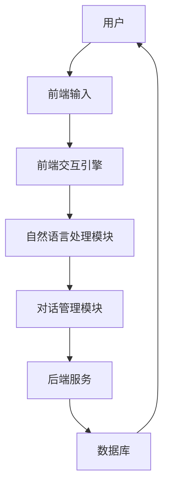

                 

# 《AI聊天机器人提升用户互动》

## 关键词

- AI聊天机器人
- 用户互动
- 自然语言处理
- 对话管理
- 个性化推荐
- 行为分析

## 摘要

随着人工智能技术的飞速发展，AI聊天机器人逐渐成为提升用户体验和互动的重要工具。本文将探讨AI聊天机器人的基本概念、架构、核心技术，以及在各个行业中的应用，同时分析其未来发展趋势和面临的伦理法规问题，旨在为读者提供一份全面的技术指南。

## 目录大纲

### 第一部分：AI聊天机器人概述

#### 第1章：AI聊天机器人基本概念  
- 1.1 AI聊天机器人的定义与作用
- 1.2 AI聊天机器人发展历程
- 1.3 AI聊天机器人技术核心

#### 第2章：AI聊天机器人的架构与分类  
- 2.1 AI聊天机器人的基本架构
- 2.2 AI聊天机器人的分类
- 2.3 常见的聊天机器人平台

### 第二部分：AI聊天机器人核心技术

#### 第3章：自然语言处理技术  
- 3.1 语言模型
- 3.2 命名实体识别
- 3.3 情感分析

#### 第4章：对话管理技术  
- 4.1 对话状态跟踪
- 4.2 对话流程设计
- 4.3 对话生成技术

#### 第5章：用户互动提升技术  
- 5.1 个性化推荐
- 5.2 用户行为分析
- 5.3 互动体验优化

### 第三部分：AI聊天机器人在行业中的应用

#### 第6章：电商行业AI聊天机器人应用  
- 6.1 电商行业AI聊天机器人的优势
- 6.2 电商行业AI聊天机器人的典型应用场景
- 6.3 电商行业AI聊天机器人的案例解析

#### 第7章：金融行业AI聊天机器人应用  
- 7.1 金融行业AI聊天机器人的特点
- 7.2 金融行业AI聊天机器人的主要应用场景
- 7.3 金融行业AI聊天机器人的案例解析

#### 第8章：教育行业AI聊天机器人应用  
- 8.1 教育行业AI聊天机器人的优势
- 8.2 教育行业AI聊天机器人的应用场景
- 8.3 教育行业AI聊天机器人的案例解析

### 第四部分：AI聊天机器人的未来发展趋势

#### 第9章：AI聊天机器人的未来发展方向  
- 9.1 人工智能与聊天机器人的融合
- 9.2 跨领域聊天机器人的发展
- 9.3 聊天机器人在社会生活中的应用

#### 第10章：AI聊天机器人的伦理与法规问题  
- 10.1 AI聊天机器人的伦理问题
- 10.2 AI聊天机器人的法规监管
- 10.3 AI聊天机器人行业的健康发展

#### 第11章：总结与展望  
- 11.1 AI聊天机器人发展总结
- 11.2 AI聊天机器人发展趋势预测
- 11.3 对AI聊天机器人行业的建议

### 附录

#### 附录A：AI聊天机器人开发工具与环境配置  
- 附录B：常用API接口调用说明
- 附录C：AI聊天机器人项目实战代码示例及解析
- 附录D：参考文献与推荐阅读

## 第一部分：AI聊天机器人概述

### 第1章：AI聊天机器人基本概念

#### 1.1 AI聊天机器人的定义与作用

AI聊天机器人，即通过人工智能技术实现自动对话的虚拟助手，它们可以模拟人类的对话方式，与用户进行交流，提供信息查询、服务支持、情感互动等功能。AI聊天机器人是人工智能与自然语言处理技术相结合的产物，通过深度学习和大数据分析，实现对自然语言的理解和生成。

AI聊天机器人在现代企业中扮演着重要的角色。首先，它们可以提供24/7的在线服务，降低企业的人力成本，提高服务效率。其次，聊天机器人可以处理大量的用户请求，减轻客服人员的工作负担。此外，通过聊天机器人，企业可以更好地了解用户需求，进行精准营销，提升用户体验。

#### 1.2 AI聊天机器人发展历程

AI聊天机器人的发展历程可以追溯到20世纪50年代，当时的人工智能研究者开始尝试使用计算机模拟人类的对话过程。早期的聊天机器人如ELIZA，虽然功能简单，但为后来的发展奠定了基础。

进入21世纪，随着互联网和移动设备的普及，AI聊天机器人得到了广泛应用。2008年，IBM的沃森在电视节目《危险边缘》中战胜了两位人类冠军，标志着人工智能技术的重大突破。随后，越来越多的企业和研究机构开始投入AI聊天机器人的研发。

近年来，深度学习和自然语言处理技术的进步，使得AI聊天机器人的对话能力和用户体验显著提升。例如，苹果的Siri、亚马逊的Alexa、微软的Cortana等智能助手，已经成为人们日常生活的一部分。

#### 1.3 AI聊天机器人技术核心

AI聊天机器人的技术核心主要包括自然语言处理（NLP）、对话管理、用户行为分析等。

自然语言处理（NLP）是AI聊天机器人理解用户输入和生成回复的关键技术。NLP涉及语言模型、命名实体识别、情感分析等多个子领域。通过NLP技术，聊天机器人可以理解用户的意图和情感，提供针对性的回复。

对话管理则负责协调整个对话过程，包括对话状态跟踪、对话流程设计、对话生成等。对话管理需要结合用户的上下文信息，设计合理的对话流程，确保对话的连贯性和自然性。

用户行为分析通过对用户的行为数据进行挖掘和分析，了解用户的需求和偏好，为聊天机器人提供个性化的服务。用户行为分析技术包括个性化推荐、行为预测等。

### 第2章：AI聊天机器人的架构与分类

#### 2.1 AI聊天机器人的基本架构

AI聊天机器人的基本架构包括前端、后端和中间件三部分。

前端主要承担用户交互的功能，包括用户输入界面、聊天界面等。前端通常使用HTML、CSS、JavaScript等技术实现。

后端是AI聊天机器人的核心，负责处理用户输入、生成回复、执行任务等。后端通常使用Python、Java、C++等编程语言，结合自然语言处理和对话管理技术实现。

中间件提供聊天机器人与外部系统的集成，包括数据库、API接口等。中间件负责数据存储、查询、同步等操作。

#### 2.2 AI聊天机器人的分类

AI聊天机器人根据不同的分类标准，可以划分为多种类型。

按应用领域划分，聊天机器人可以分为通用聊天机器人和专用聊天机器人。通用聊天机器人具有广泛的对话能力，可以应对多种场景，如Siri、Alexa等。专用聊天机器人则专注于特定领域，如电商聊天机器人、金融聊天机器人等。

按技术实现方式划分，聊天机器人可以分为基于规则和基于机器学习的聊天机器人。基于规则的聊天机器人通过预定义的规则进行对话管理，实现简单但灵活性较低。基于机器学习的聊天机器人则通过深度学习和自然语言处理技术，实现更智能的对话。

按交互方式划分，聊天机器人可以分为文本聊天机器人和语音聊天机器人。文本聊天机器人主要通过文本进行交互，如微信聊天机器人、QQ聊天机器人等。语音聊天机器人则通过语音识别和语音合成技术，实现语音交互，如苹果的Siri、亚马逊的Alexa等。

#### 2.3 常见的聊天机器人平台

目前，市场上存在多种聊天机器人平台，为开发者提供便捷的工具和资源。

Facebook Messenger是微信的聊天机器人平台，支持多种编程语言，提供丰富的API接口和SDK。

Slack是Slack的聊天机器人平台，为企业内部通讯和协作提供支持，具有高度可定制性。

Microsoft Bot Framework是微软的聊天机器人开发平台，支持多种编程语言，提供跨平台部署的能力。

腾讯云开发者平台提供QQ聊天机器人的开发工具和资源，支持微信聊天机器人的开发。

这些平台为开发者提供了丰富的工具和资源，使得开发聊天机器人变得更加简单和高效。

## 第二部分：AI聊天机器人核心技术

### 第3章：自然语言处理技术

#### 3.1 语言模型

语言模型是自然语言处理的基础，它通过统计方法或机器学习算法，学习自然语言的规律和特征，生成可能的文本序列。语言模型的核心任务是预测下一个单词或词组，为对话生成提供基础。

常见的语言模型有N-gram模型、循环神经网络（RNN）模型、长短时记忆网络（LSTM）模型、卷积神经网络（CNN）模型、Transformer模型等。其中，Transformer模型由于其并行化和自注意力机制，在生成文本序列方面表现尤为出色。

语言模型概率计算公式如下：

$$
P(w_n | w_1, w_2, ..., w_{n-1}) = \frac{P(w_1, w_2, ..., w_n)}{P(w_1, w_2, ..., w_{n-1})}
$$

其中，$w_n$表示下一个单词或词组，$w_1, w_2, ..., w_{n-1}$表示前一个或多个单词或词组。

#### 3.2 命名实体识别

命名实体识别（Named Entity Recognition，NER）是自然语言处理中的一个重要任务，旨在识别文本中的命名实体，如人名、地名、组织名、时间等。NER对于信息抽取、知识图谱构建等应用具有重要意义。

命名实体识别通常采用基于规则、基于统计和基于机器学习的方法。基于规则的方法通过预定义的规则进行实体识别，实现简单但灵活性较低。基于统计的方法通过统计学习方法，如条件随机场（CRF）、支持向量机（SVM）等，对实体进行识别。基于机器学习的方法通过深度学习模型，如卷积神经网络（CNN）、长短时记忆网络（LSTM）等，实现更复杂的实体识别。

#### 3.3 情感分析

情感分析（Sentiment Analysis）是自然语言处理中的一个重要任务，旨在分析文本中的情感倾向，如正面、负面、中性等。情感分析对于市场调研、舆情分析、社交媒体监控等应用具有重要意义。

情感分析通常采用基于规则、基于统计和基于机器学习的方法。基于规则的方法通过预定义的规则进行情感分析，实现简单但灵活性较低。基于统计的方法通过统计学习方法，如支持向量机（SVM）、朴素贝叶斯（NB）等，对情感进行分类。基于机器学习的方法通过深度学习模型，如卷积神经网络（CNN）、长短时记忆网络（LSTM）等，实现更复杂的情感分析。

### 第4章：对话管理技术

#### 4.1 对话状态跟踪

对话状态跟踪是对话管理的关键环节，它负责记录和更新对话过程中的各种状态信息，如用户意图、上下文信息、对话历史等。通过对话状态跟踪，对话系统能够理解用户的意图，并生成合适的回复。

对话状态跟踪通常采用基于规则、基于统计和基于机器学习的方法。基于规则的方法通过预定义的规则进行状态跟踪，实现简单但灵活性较低。基于统计的方法通过统计学习方法，如条件随机场（CRF）、支持向量机（SVM）等，对状态进行跟踪。基于机器学习的方法通过深度学习模型，如卷积神经网络（CNN）、长短时记忆网络（LSTM）等，实现更复杂的状态跟踪。

#### 4.2 对话流程设计

对话流程设计是确保对话系统能够顺利进行的关键，它包括对话开始、对话中间和对话结束三个阶段。对话流程设计需要考虑用户的意图、上下文信息和对话系统的能力，设计合理的对话流程。

对话流程设计通常采用基于规则和基于机器学习的方法。基于规则的方法通过预定义的对话流程进行设计，实现简单但灵活性较低。基于机器学习的方法通过深度学习模型，如递归神经网络（RNN）、长短时记忆网络（LSTM）等，根据用户的输入和上下文信息自动生成对话流程。

#### 4.3 对话生成技术

对话生成技术是确保对话系统能够生成自然、合理的对话回复的关键。对话生成技术包括基于模板的对话生成和基于机器学习的对话生成。

基于模板的对话生成通过预定义的模板和规则，生成对话回复。这种方法实现简单，但对话生成的灵活性和自然性有限。

基于机器学习的对话生成通过深度学习模型，如递归神经网络（RNN）、长短时记忆网络（LSTM）、转换器（Transformer）等，根据用户的输入和上下文信息生成对话回复。这种方法生成对话的自然性和灵活性较高。

### 第5章：用户互动提升技术

#### 5.1 个性化推荐

个性化推荐是提升用户互动的重要技术之一，它通过分析用户的历史行为和偏好，为用户推荐感兴趣的内容、产品或服务。个性化推荐技术包括协同过滤、基于内容的推荐、基于模型的推荐等。

协同过滤方法通过分析用户之间的相似性，为用户推荐其他用户喜欢的商品。基于内容的推荐方法通过分析商品的属性和用户的历史行为，为用户推荐具有相似属性的商品。基于模型的推荐方法通过构建用户和商品之间的隐语义模型，为用户推荐符合其偏好的商品。

#### 5.2 用户行为分析

用户行为分析是了解用户需求和行为的重要手段，它通过分析用户在系统中的行为数据，如点击、浏览、购买等，挖掘用户的兴趣和需求。用户行为分析技术包括数据采集、数据存储、数据分析等。

数据采集是用户行为分析的基础，通过Web前端埋点、日志分析等方式，收集用户在系统中的行为数据。数据存储是将采集到的行为数据进行存储和管理，常用的数据存储技术包括关系型数据库、NoSQL数据库等。数据分析是通过数据挖掘和机器学习算法，分析用户行为数据，提取用户兴趣和需求。

#### 5.3 互动体验优化

互动体验优化是提升用户满意度和忠诚度的重要手段，它通过分析用户反馈和行为数据，优化系统的交互界面和功能设计。互动体验优化技术包括用户体验分析、用户界面优化、功能优化等。

用户体验分析是了解用户对系统使用感受的重要手段，通过用户调研、用户反馈等方式，收集用户对系统的使用体验。用户界面优化是根据用户体验分析的结果，优化系统的交互界面，提高用户使用的便捷性和舒适度。功能优化是根据用户行为数据和用户需求，优化系统的功能设计，提高系统的实用性和易用性。

## 第三部分：AI聊天机器人在行业中的应用

### 第6章：电商行业AI聊天机器人应用

#### 6.1 电商行业AI聊天机器人的优势

电商行业AI聊天机器人具有以下优势：

1. 提高客户服务质量：AI聊天机器人可以实时回答客户的问题，提高客户服务质量，减少客户等待时间。

2. 降低人力成本：AI聊天机器人可以替代人工客服，降低企业的人力成本。

3. 提高运营效率：AI聊天机器人可以处理大量的客户请求，提高运营效率，降低运营成本。

4. 精准推荐商品：AI聊天机器人可以通过分析用户行为和偏好，精准推荐商品，提高销售额。

5. 提升用户购物体验：AI聊天机器人可以提供个性化的购物建议，提升用户购物体验。

#### 6.2 电商行业AI聊天机器人的典型应用场景

电商行业AI聊天机器人的典型应用场景包括：

1. 客户咨询与支持：AI聊天机器人可以实时回答客户的问题，如商品详情、订单状态、退换货政策等。

2. 购物助手：AI聊天机器人可以作为购物助手，为用户提供商品推荐、购物导航等服务。

3. 库存管理：AI聊天机器人可以实时监控库存情况，提醒库存不足或过多，优化库存管理。

4. 营销推广：AI聊天机器人可以通过分析用户行为和偏好，精准推送营销信息，提高营销效果。

5. 用户行为分析：AI聊天机器人可以分析用户行为数据，挖掘用户需求，为产品优化和营销策略提供支持。

#### 6.3 电商行业AI聊天机器人的案例解析

以某大型电商平台为例，该平台引入AI聊天机器人后，取得了显著的效果：

1. 客户满意度提高：AI聊天机器人能够快速响应用户咨询，解决用户问题，客户满意度显著提高。

2. 人力成本降低：AI聊天机器人替代了一部分人工客服，降低了人力成本。

3. 销售额提升：AI聊天机器人通过精准推荐商品，提高了销售额。

4. 库存管理优化：AI聊天机器人实时监控库存情况，优化了库存管理，降低了库存成本。

5. 用户互动提升：AI聊天机器人提供了个性化的购物建议，提升了用户购物体验。

### 第7章：金融行业AI聊天机器人应用

#### 7.1 金融行业AI聊天机器人的特点

金融行业AI聊天机器人具有以下特点：

1. 高度安全：金融行业涉及大量的敏感信息和资金交易，AI聊天机器人需要确保用户数据和交易的安全性。

2. 实时性：金融行业对实时性要求较高，AI聊天机器人需要能够实时响应用户的请求和交易。

3. 专业性：金融行业涉及复杂的金融知识和规则，AI聊天机器人需要具备专业的金融知识和技能。

4. 可定制化：金融行业不同企业的业务需求和场景各异，AI聊天机器人需要具备高度的可定制化能力。

#### 7.2 金融行业AI聊天机器人的主要应用场景

金融行业AI聊天机器人的主要应用场景包括：

1. 客户服务与支持：AI聊天机器人可以提供24/7的在线服务，解答客户的问题，提供交易指导。

2. 投资顾问：AI聊天机器人可以根据用户的风险偏好和投资目标，为用户提供个性化的投资建议。

3. 财务顾问：AI聊天机器人可以提供财务规划、税务筹划等服务，为用户提供专业的财务建议。

4. 信贷审批：AI聊天机器人可以自动化信贷审批流程，提高审批效率和准确性。

5. 风险管理：AI聊天机器人可以通过实时监控市场和交易数据，预警风险，提供风险管理建议。

#### 7.3 金融行业AI聊天机器人的案例解析

以某知名金融集团为例，该集团引入AI聊天机器人后，取得了显著的效果：

1. 客户满意度提高：AI聊天机器人提供了24/7的在线服务，解答客户的问题，客户满意度显著提高。

2. 人力成本降低：AI聊天机器人替代了一部分人工客服和投资顾问，降低了人力成本。

3. 投资效率提升：AI聊天机器人通过分析用户的风险偏好和投资目标，为用户提供个性化的投资建议，提高了投资效率。

4. 风险管理能力提升：AI聊天机器人通过实时监控市场和交易数据，预警风险，提供了有效的风险管理支持。

5. 业务创新：AI聊天机器人提供了新的服务模式和业务场景，推动了金融集团的业务创新。

### 第8章：教育行业AI聊天机器人应用

#### 8.1 教育行业AI聊天机器人的优势

教育行业AI聊天机器人具有以下优势：

1. 个性化教育：AI聊天机器人可以根据学生的学习进度和兴趣，提供个性化的教学内容和学习建议。

2. 互动性增强：AI聊天机器人可以实时与学生互动，提高学生的学习积极性和参与度。

3. 教师辅助：AI聊天机器人可以协助教师进行教学任务，如布置作业、批改作业、解答学生疑问等。

4. 知识库建设：AI聊天机器人可以构建庞大的知识库，为学生提供丰富的学习资源。

5. 成本效益：AI聊天机器人可以替代一部分人力，降低教育成本。

#### 8.2 教育行业AI聊天机器人的应用场景

教育行业AI聊天机器人的应用场景包括：

1. 在线辅导：AI聊天机器人可以为学生提供在线辅导服务，解答学生的疑问。

2. 自动作业批改：AI聊天机器人可以自动批改学生的作业，提供即时反馈。

3. 智能推荐：AI聊天机器人可以根据学生的学习数据和兴趣，推荐合适的学习内容和资源。

4. 教学辅助：AI聊天机器人可以协助教师进行教学任务，如布置作业、监控学生学习进度等。

5. 学生管理：AI聊天机器人可以管理学生的出勤、成绩等，提供学生数据支持。

#### 8.3 教育行业AI聊天机器人的案例解析

以某知名在线教育平台为例，该平台引入AI聊天机器人后，取得了显著的效果：

1. 提高学习效率：AI聊天机器人提供了个性化的学习内容和资源，提高了学生的学习效率。

2. 降低教师负担：AI聊天机器人替代了一部分教学任务，如布置作业、批改作业等，降低了教师的负担。

3. 提升学生互动：AI聊天机器人提供了实时互动功能，提高了学生的学习积极性和参与度。

4. 优化学习体验：AI聊天机器人提供了智能推荐和个性化教育服务，优化了学生的学习体验。

5. 成本效益显著：AI聊天机器人降低了人力成本，提高了平台的运营效率。

## 第四部分：AI聊天机器人的未来发展趋势

### 第9章：AI聊天机器人的未来发展方向

#### 9.1 人工智能与聊天机器人的融合

随着人工智能技术的不断进步，AI聊天机器人的对话能力将得到进一步提升。未来，人工智能与聊天机器人将深度融合，实现更智能、更自然的对话体验。例如，通过深度学习和迁移学习，聊天机器人可以更好地理解复杂语境和多模态信息。

#### 9.2 跨领域聊天机器人的发展

当前，AI聊天机器人主要应用于特定领域，如电商、金融、教育等。未来，随着技术的进步和应用场景的拓展，跨领域的聊天机器人将成为趋势。跨领域聊天机器人可以跨越不同行业和领域的边界，提供更广泛的服务。

#### 9.3 聊天机器人在社会生活中的应用

随着AI聊天机器人技术的成熟，它们将在社会生活中的各个方面得到广泛应用。例如，在医疗、交通、智能家居等领域，AI聊天机器人将提供便捷的服务，提高人们的生活质量。同时，AI聊天机器人也将成为社会管理和服务的重要工具，助力智慧城市建设。

### 第10章：AI聊天机器人的伦理与法规问题

#### 10.1 AI聊天机器人的伦理问题

AI聊天机器人的应用引发了诸多伦理问题，如隐私保护、数据安全、公平性等。未来，需要建立一套完整的伦理规范，确保AI聊天机器人的应用符合道德和法律要求。

#### 10.2 AI聊天机器人的法规监管

随着AI聊天机器人技术的快速发展，各国政府和国际组织纷纷出台相关法规，规范其应用。例如，欧盟的《通用数据保护条例》（GDPR）对用户数据保护提出了严格要求。未来，需要加强国际合作，建立全球统一的法规框架，确保AI聊天机器人的健康发展。

#### 10.3 AI聊天机器人行业的健康发展

为促进AI聊天机器人行业的健康发展，需要从政策、技术、教育等多个方面进行综合治理。首先，政府应制定相关政策，鼓励技术创新和应用。其次，企业和研究机构应加强技术研发，提高AI聊天机器人的对话能力和用户体验。此外，教育机构应加强相关人才的培养，为行业输送高素质的人才。

### 第11章：总结与展望

#### 11.1 AI聊天机器人发展总结

自AI聊天机器人问世以来，它们在多个领域取得了显著成果，提高了用户体验和效率。未来，随着人工智能技术的进步和应用场景的拓展，AI聊天机器人将在更广泛的领域发挥重要作用。

#### 11.2 AI聊天机器人发展趋势预测

未来，AI聊天机器人将朝着更智能、更自然、更跨领域的方向发展。随着技术的进步和法规的完善，AI聊天机器人将在社会生活中发挥更大的作用。

#### 11.3 对AI聊天机器人行业的建议

为促进AI聊天机器人行业的健康发展，建议政府、企业和研究机构加强合作，制定相关政策，鼓励技术创新和应用。同时，应加强人才培养，为行业输送高素质的人才。此外，应关注伦理和法规问题，确保AI聊天机器人的应用符合道德和法律要求。

## 附录

### 附录A：AI聊天机器人开发工具与环境配置

#### 附录B：常用API接口调用说明

#### 附录C：AI聊天机器人项目实战代码示例及解析

#### 附录D：参考文献与推荐阅读

## 核心概念与联系

### AI聊天机器人架构



### 对话生成算法伪代码

```python
def generate_conversation(user_input):
    # 1. 将用户输入转换为词向量
    input_vector = convert_to_vector(user_input)

    # 2. 使用语言模型生成候选回复
    candidate_responses = language_model.generate(input_vector)

    # 3. 根据对话状态和用户输入选择最佳回复
    best_response = select_best_response(candidate_responses, dialog_state)

    # 4. 更新对话状态
    update_dialog_state(best_response)

    # 5. 返回最佳回复
    return best_response
```

### 语言模型概率计算

$$
P(w_n | w_1, w_2, ..., w_{n-1}) = \frac{P(w_1, w_2, ..., w_n)}{P(w_1, w_2, ..., w_{n-1})}
$$

### 项目实战

#### 实战一：搭建聊天机器人环境

1. 安装Python环境
2. 安装TensorFlow库
3. 配置聊天机器人所需的数据集
4. 编写聊天机器人代码框架

#### 实战二：实现简单的对话功能

1. 编写用户输入处理代码
2. 实现基于语言模型的对话生成功能
3. 编写对话状态跟踪代码
4. 部署聊天机器人至服务器

#### 实战三：优化聊天机器人互动体验

1. 集成用户行为分析模块
2. 实现个性化推荐功能
3. 针对用户反馈进行对话优化
4. 对聊天机器人进行持续迭代与优化

### 代码解读与分析

#### 聊天机器人源代码解析

1. 用户输入处理模块：解析用户输入，提取关键信息。
2. 语言模型模块：利用预训练的语言模型生成候选回复。
3. 对话管理模块：根据对话状态和用户输入选择最佳回复。
4. 数据存储与查询模块：存储对话记录和用户信息，支持查询和统计分析。

#### 代码分析与改进建议

1. 优化代码结构，提高可维护性。
2. 使用更先进的对话管理算法，提升对话质量。
3. 集成更多的用户行为分析工具，提供更个性化的服务。
4. 定期更新和维护聊天机器人，确保其与最新技术保持同步。

