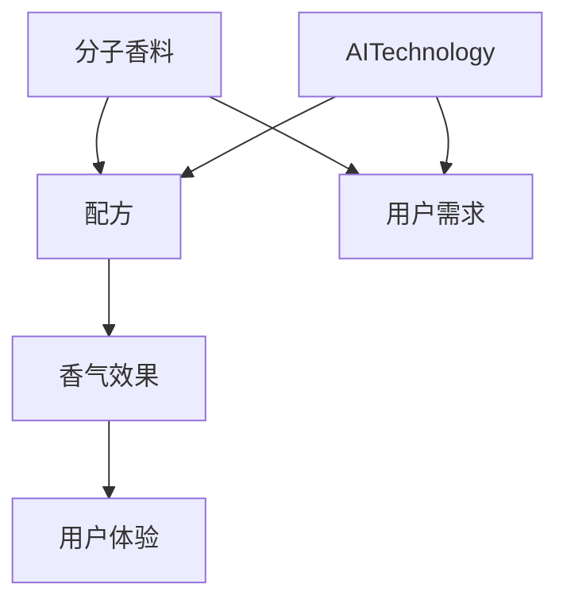
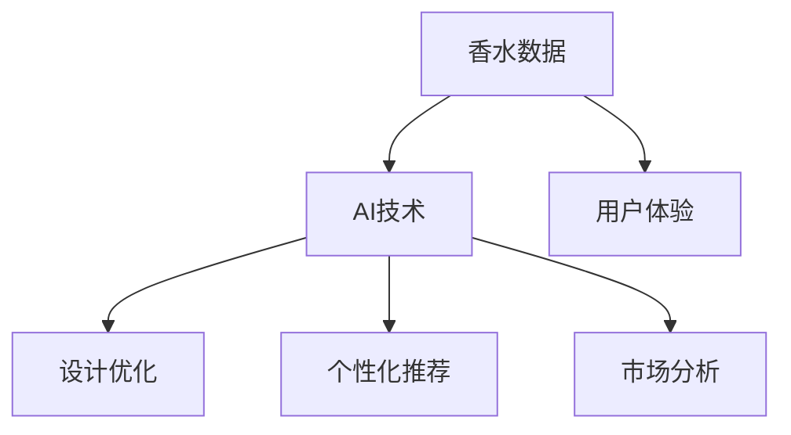
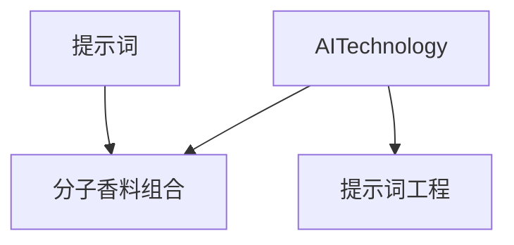
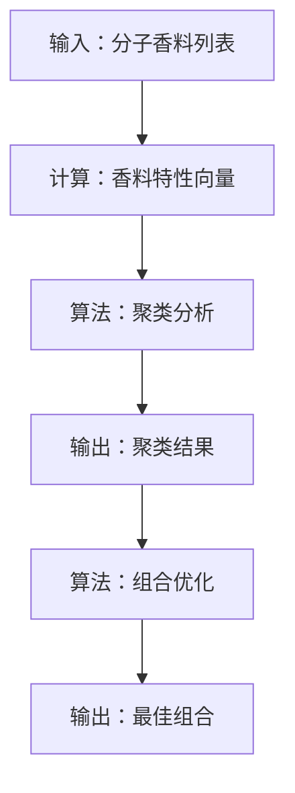
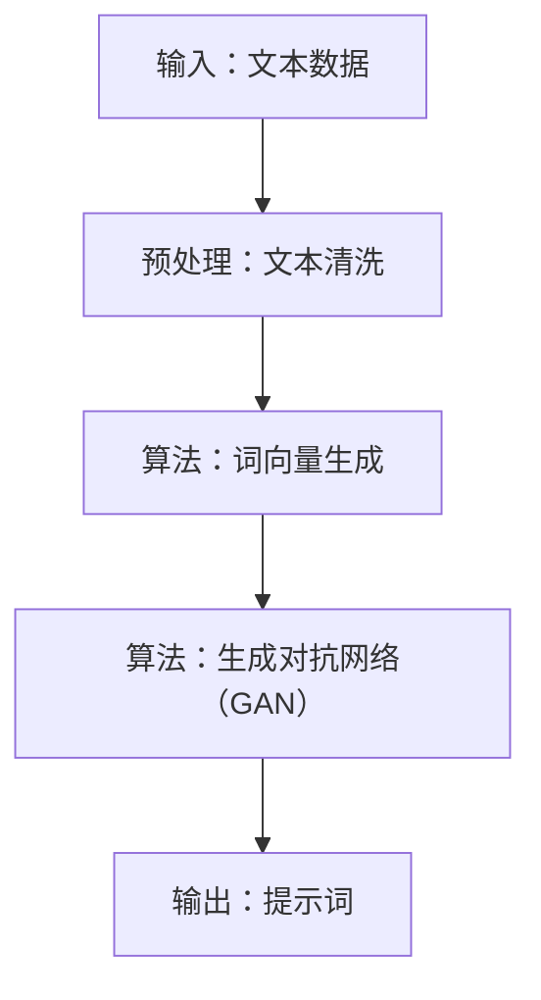
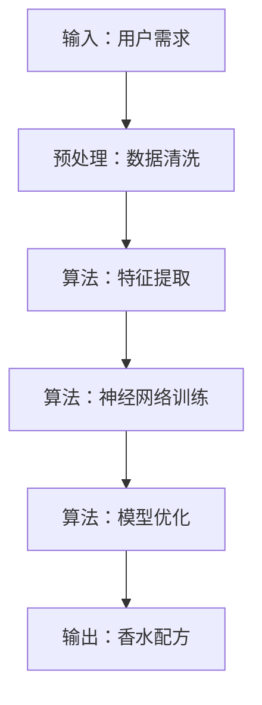

                 

# 引言

### 香水与AI辅助创意

#### 1.1 香水概述

香水，作为人类日常生活中的一种重要消费品，不仅仅是一种单纯的气味，更是一种情感和文化符号。它的历史可以追溯到古埃及，当时人们用香草和香料来驱邪和净化。随着时代的发展，香水逐渐演变成一种艺术形式，不同的香水品牌和设计师通过独特的配方和包装，传达着不同的情感和故事。

香水的种类繁多，按照香型可以分为东方香型、花香型、果香型、木质香型等；按照浓度可以分为淡香水、香精、古龙水等。每一种香水都有其独特的配方和特点，使得人们在选择时能够找到符合自己个性和情感的香气。

#### 1.2 AI在香水设计中的应用

近年来，人工智能（AI）技术的快速发展给各行各业带来了巨大的变革，香水设计也不例外。AI在香水设计中的应用主要体现在以下几个方面：

1. **成分分析**：AI可以分析不同香料化合物的特性，帮助设计师了解各种成分的化学结构和香气的特征，从而更好地进行配方设计。

2. **配方优化**：AI可以通过机器学习算法，分析大量已有的香水配方，找出最佳的组合方式，提高新香水的质量。

3. **个性化推荐**：基于用户的喜好和历史购买记录，AI可以推荐个性化的香水配方，满足消费者的个性化需求。

4. **灵感来源**：AI可以通过分析音乐、艺术作品等非香水相关的领域，为设计师提供新的创意和灵感。

总之，AI在香水设计中的应用，不仅提高了设计的效率和准确性，也为消费者带来了更多的选择和体验。

### 第2章：AI与分子香料组合

#### 2.1 分子香料的基本概念

分子香料，是指那些具有特定香味的有机化合物。这些化合物通常具有特定的分子结构，因此它们散发出的气味也是独特的。分子香料在香水设计中起着至关重要的作用，它们可以创造出各种不同的香气，满足不同消费者的需求。

分子香料的种类繁多，包括醇类、酯类、酮类、醛类等。每种类型的分子香料都有其独特的化学结构和气味特征。例如，醇类通常具有清新、花香的特点，而酯类则常用于模拟水果香。

#### 2.2 分子香料组合的原理

分子香料组合的原理主要基于香料的化学结构和物理特性。不同的分子香料可以相互协同或相互抵消，从而产生新的香气。这种组合不仅仅是为了增加香水的复杂度，更重要的是要创造出一种和谐、均衡的香气。

分子香料组合的基本原则包括：

1. **平衡**：各种香料的气味需要相互平衡，不能过于突出某种香味，否则会破坏整个香水的和谐感。

2. **层次感**：香水的香气应该具有一定的层次感，即从开始到结束都有不同的香气层次，这样能够提供更加丰富的香气体验。

3. **个性**：每种香水都应该有其独特的个性，这取决于所选用的分子香料和它们的组合方式。

#### 2.3 AI在分子香料组合中的应用

AI在分子香料组合中的应用主要体现在以下几个方面：

1. **香料特性分析**：AI可以通过机器学习算法，分析不同分子香料的化学结构和气味特征，帮助设计师更好地理解每种香料的特性。

2. **组合优化**：AI可以分析大量的分子香料组合，找出最佳的比例和组合方式，提高新香水的质量。

3. **创意生成**：AI可以通过分析非香水相关的领域，如音乐、艺术等，为设计师提供新的创意和灵感。

4. **个性化推荐**：AI可以根据用户的喜好和历史记录，推荐个性化的分子香料组合，满足消费者的个性化需求。

总之，AI在分子香料组合中的应用，不仅提高了设计的效率和准确性，也为消费者带来了更多的选择和体验。

### 第3章：提示词工程

#### 3.1 提示词工程的概念

提示词工程（Prompt Engineering）是指利用自然语言处理技术（NLP）和机器学习算法，生成或优化用于提示用户输入信息的文本或语音。在香水设计中，提示词工程可以帮助设计师在配方设计过程中获取更多的灵感和创意。

提示词工程的目标是生成高质量的提示词，这些提示词能够引导用户思考，提供更多的选择和可能性。提示词可以是具体的短语或句子，也可以是问题或任务，目的是帮助用户更好地表达自己的需求和想法。

#### 3.2 提示词工程在香水设计中的应用

提示词工程在香水设计中的应用主要体现在以下几个方面：

1. **灵感获取**：通过生成与香水相关的提示词，如“创造一款具有夏日海滩气息的香水”、“设计一款具有东方韵味的香水”等，帮助设计师获取新的创意和灵感。

2. **成分选择**：通过生成与特定香料相关的提示词，如“选择一款具有水果香味的分子香料”、“寻找具有花香特征的分子香料”等，帮助设计师在众多分子香料中快速找到合适的成分。

3. **配方优化**：通过生成与香水配方优化相关的提示词，如“调整香料的比例，以增强香水的层次感”、“尝试新的组合，以创造出独特的香气”等，帮助设计师在配方优化过程中提供更多的思路和选择。

总之，提示词工程在香水设计中的应用，不仅提高了设计的效率和准确性，也为设计师提供了更多的创意和灵感来源。

### 第4章：构建AI香水设计系统

#### 4.1 AI香水设计系统的架构

AI香水设计系统是一个集成了多种人工智能技术和设计方法的综合性系统。它的架构主要包括以下几个部分：

1. **数据收集与处理模块**：负责收集和分析与香水设计相关的数据，如分子香料特性数据、用户喜好数据等。

2. **模型训练与优化模块**：负责训练和优化用于香水设计的人工智能模型，如机器学习模型、深度学习模型等。

3. **提示词生成模块**：负责生成用于引导设计师进行香水设计的提示词，如灵感提示词、成分选择提示词等。

4. **设计辅助模块**：负责辅助设计师进行香水设计，如自动生成香水配方、优化香水配方等。

5. **用户交互模块**：负责与用户进行交互，收集用户反馈，优化系统性能。

#### 4.2 数据收集与处理

数据是AI香水设计系统的核心。数据收集与处理模块的主要任务包括：

1. **数据收集**：从多个渠道收集与香水设计相关的数据，如分子香料数据库、用户行为数据等。

2. **数据处理**：对收集到的数据进行清洗、归一化、特征提取等处理，以便于模型训练。

3. **数据存储**：将处理后的数据存储在数据库中，以便于后续的模型训练和设计辅助。

#### 4.3 模型训练与优化

模型训练与优化模块的主要任务包括：

1. **模型选择**：选择适合香水设计任务的模型，如决策树、随机森林、深度神经网络等。

2. **模型训练**：使用处理后的数据进行模型训练，调整模型的参数，提高模型的准确性和效率。

3. **模型优化**：通过交叉验证、网格搜索等方法优化模型，提高模型的性能。

4. **模型评估**：使用测试集对模型进行评估，确保模型在实际应用中的性能。

#### 4.4 提示词生成

提示词生成模块的主要任务包括：

1. **提示词模板设计**：设计用于生成提示词的模板，如灵感提示词模板、成分选择提示词模板等。

2. **提示词生成**：使用自然语言生成技术生成高质量的提示词，引导设计师进行香水设计。

3. **提示词优化**：根据用户反馈和设计结果，不断优化提示词，提高其质量和效果。

#### 4.5 设计辅助

设计辅助模块的主要任务包括：

1. **自动生成配方**：根据用户的喜好和设计需求，自动生成香水配方。

2. **配方优化**：使用机器学习算法和优化方法，优化现有的香水配方，提高其质量。

3. **设计评估**：评估设计结果的质量和可行性，为设计师提供反馈。

#### 4.6 用户交互

用户交互模块的主要任务包括：

1. **用户界面设计**：设计直观、易用的用户界面，方便用户与系统进行交互。

2. **用户反馈收集**：收集用户在使用系统过程中的反馈，用于优化系统性能。

3. **用户行为分析**：分析用户行为数据，了解用户需求和偏好，为系统优化提供依据。

### 第5章：香水配方创意实践

#### 5.1 创意香水配方的思路

创意香水配方的思路主要包括以下几个方面：

1. **灵感来源**：可以从自然、艺术、音乐等多个领域获取灵感，例如，可以分析一种花或一种水果的香气，尝试将其融入香水设计中。

2. **用户需求**：了解消费者的需求和偏好，根据用户反馈进行配方设计。

3. **技术手段**：利用AI技术分析大量的香水配方，找出最佳的组合方式，提高配方的创意和质量。

#### 5.2 实践案例分享

以下是一些创意香水配方的实践案例：

**案例一：清新花香型香水设计**

灵感来源：夏日海滩
目标香气：清新、淡雅、花香

配方：
- 芦荟提取物
- 柑橘类精油（如橙花精油、柠檬精油）
- 花香类精油（如玫瑰精油、茉莉精油）

设计思路：通过柑橘类精油和花香类精油的组合，创造出一种清新、淡雅的香气，仿佛置身于夏日海滩的沙滩上，享受阳光和海风的拥抱。

**案例二：东方香型香水设计**

灵感来源：古丝绸之路
目标香气：沉静、温暖、神秘

配方：
- 麝香
- 琥珀
- 茶香类精油

设计思路：通过麝香、琥珀和茶香类精油的组合，创造出一种沉静、温暖、神秘的东方香气，仿佛漫步在古丝绸之路的繁华街道上，感受历史的厚重和文化底蕴。

**案例三：果香型香水设计**

灵感来源：夏日果园
目标香气：清新、甜润、果香

配方：
- 水蜜桃提取物
- 草莓提取物
- 柠檬精油

设计思路：通过水蜜桃提取物、草莓提取物和柠檬精油的组合，创造出一种清新、甜润的果香型香气，仿佛置身于夏日果园，享受新鲜水果的甜美和清新的气息。

#### 5.3 创意香水配方的优化策略

创意香水配方的优化策略主要包括以下几个方面：

1. **香气平衡**：确保各种香料的香气相互平衡，不能过于突出某种香味，否则会破坏整个香水的和谐感。

2. **层次感**：香水的香气应该具有一定的层次感，从开始到结束都有不同的香气层次，这样能够提供更加丰富的香气体验。

3. **个性化**：根据消费者的需求和偏好，调整香料的比例和组合，创造出符合消费者个性的香水。

4. **技术创新**：利用AI技术分析大量的香水配方，找出最佳的组合方式，提高配方的创意和质量。

5. **用户反馈**：根据用户的使用反馈，不断优化配方，提高香水的设计水平和用户体验。

### 第6章：AI辅助香水设计的未来展望

#### 6.1 AI在香水设计领域的趋势

随着人工智能技术的不断发展和完善，AI在香水设计领域的应用也呈现出了明显的趋势：

1. **个性化定制**：未来，AI将能够更加精准地分析用户的喜好和需求，提供个性化的香水定制服务，满足消费者对独特香气的追求。

2. **智能化设计**：AI将能够通过深度学习和大数据分析，自动生成高质量的香水配方，提高设计的效率和准确性。

3. **跨界融合**：AI将与其他领域（如艺术、设计、音乐等）进行融合，为香水设计带来更多的创意和灵感。

#### 6.2 AI辅助香水设计的挑战与机遇

尽管AI在香水设计领域具有巨大的潜力，但在实际应用过程中仍面临着一些挑战：

1. **数据隐私**：香水设计涉及到大量的个人数据和偏好，如何保护用户隐私是一个亟待解决的问题。

2. **用户体验**：AI生成的香水配方是否能够满足消费者的期望，如何提升用户体验是一个重要的课题。

3. **技术难题**：虽然AI技术在不断进步，但某些复杂的香水设计问题仍需要进一步研究和解决。

然而，这些挑战也带来了机遇：

1. **创新空间**：AI的引入为香水设计带来了更多的创新空间，设计师可以尝试更多的创意和组合方式。

2. **市场拓展**：个性化定制的香水产品有望打开新的市场，吸引更多的消费者。

3. **行业变革**：AI的广泛应用有望推动香水设计行业的变革，提高行业的效率和竞争力。

### 附录

#### 附录A：常用香料化合物及其性质

以下是一些常用的香料化合物及其性质：

1. **醇类**：具有花香或果香的特点，如玫瑰醇、茉莉醇等。
2. **酯类**：通常具有水果香或花香的特点，如乙酸苄酯、橙花酯等。
3. **酮类**：具有花香或果香的特点，如α-紫罗兰酮、β-紫罗兰酮等。
4. **醛类**：通常具有花香或果香的特点，如苯甲醛、水杨醛等。
5. **萜类**：具有清新、花香或木质香的特点，如薄荷脑、麝香草酚等。

#### 附录B：AI香水设计工具与资源

以下是一些常用的AI香水设计工具与资源：

1. **AI香水设计平台**：如AI Perfume Studio、Perfumery AI等，提供了自动生成香水配方的功能。
2. **分子香料数据库**：如The Perfumers Library、Synthetic Aromatics等，提供了详细的香料化合物信息。
3. **机器学习库**：如TensorFlow、PyTorch等，可用于构建和训练香水设计模型。
4. **开源项目**：如GitHub上的相关项目，提供了丰富的代码和资源。

#### 附录C：参考文献

1. **书籍**：
   - 《香水与调香艺术》
   - 《人工智能在香水设计中的应用》
   - 《机器学习与数据挖掘：技术与实践》

2. **论文**：
   - “AI in Perfumery: A Review”
   - “Natural Language Processing for Perfumery Design”
   - “Machine Learning Approaches for Perfume Formula Optimization”

3. **网站**：
   - https://www.perfumerslibrary.com/
   - https://ai-perfume-studio.com/
   - https://github.com/

### 第1章：核心概念与联系

#### 1.1 AI辅助香水设计概述

AI辅助香水设计是指利用人工智能技术，如机器学习、自然语言处理、数据挖掘等，来辅助香水设计师进行香水配方设计。这一技术的核心在于通过大数据分析和算法模型，提供香水配方的灵感、优化现有配方，以及实现个性化定制。

AI辅助香水设计的核心概念包括：

- **分子香料**：作为香水配方的基本元素，每种分子香料都有其独特的化学结构和香气特性。
- **配方**：由多种分子香料组合而成，不同的组合方式会产生不同的香气效果。
- **用户需求**：消费者的个人喜好和情感需求，是香水设计的出发点和目标。
- **AI技术**：包括机器学习、数据挖掘、自然语言处理等，用于分析数据、生成配方和优化设计。

这些核心概念之间的联系在于：

- **分子香料与配方**：分子香料是配方的组成部分，不同的组合方式会影响最终香水的香气效果。
- **用户需求与配方**：用户的个人需求和偏好直接影响配方的选择和设计，AI技术可以通过分析用户数据来满足这些需求。
- **AI技术与配方**：AI技术通过分析大量数据和实验结果，生成和优化香水配方，从而实现更加精确和个性化的设计。

为了更直观地展示这些核心概念和联系，我们可以使用Mermaid流程图：



#### 1.2 香水与AI的关系

香水与AI之间的关系主要体现在以下几个方面：

1. **香水作为数据源**：香水的历史配方、用户评价、市场趋势等数据为AI提供了丰富的训练材料。
2. **AI作为设计工具**：AI技术可以帮助设计师分析数据、生成配方和优化设计，提高工作效率和设计质量。
3. **香水作为应用场景**：AI技术不仅用于香水设计，还可以用于香水配方优化、个性化推荐、市场分析等。

香水与AI之间的联系在于：

- **数据与应用**：香水数据为AI提供了应用场景，AI技术则通过处理这些数据，实现香水设计的创新和优化。
- **设计与创新**：AI技术为香水设计带来了新的思路和方法，设计师可以利用AI技术探索更多的设计可能性。
- **用户体验**：AI技术可以帮助提供更加个性化和优质的香水产品，提升用户的体验和满意度。

为了更清晰地展示香水与AI之间的关系，我们可以使用Mermaid流程图：



#### 1.3 分子香料组合的提示词工程

分子香料组合的提示词工程是指利用自然语言处理技术生成或优化用于指导分子香料组合的提示词。这些提示词可以引导设计师在配方设计过程中思考、探索和优化。

提示词工程的核心概念包括：

- **提示词**：用于引导设计师进行分子香料组合的短语或句子，如“尝试将花香和果香结合”、“调整香料比例，以增强香气层次”等。
- **分子香料组合**：由多种分子香料组合而成的香水配方，不同的组合方式会产生不同的香气效果。
- **AI技术**：用于生成和优化提示词的自然语言处理技术，如生成对抗网络（GAN）、序列到序列（Seq2Seq）模型等。

这些概念之间的联系在于：

- **提示词与分子香料组合**：提示词为分子香料组合提供了指导和建议，帮助设计师在配方设计过程中做出更好的决策。
- **AI技术与提示词工程**：AI技术通过分析大量数据，生成和优化高质量的提示词，提高香水设计的效率和质量。

为了更直观地展示这些概念和联系，我们可以使用Mermaid流程图：



### 第2章：核心算法原理讲解

#### 2.1 分子香料组合的算法原理

分子香料组合的算法原理主要基于分子香料的化学结构和香气特性。以下是一个简化的算法原理，用于指导分子香料组合：



详细步骤如下：

1. **输入**：输入一组分子香料，包括它们的化学结构和香气特性。
2. **计算**：计算每个分子香料的特性向量，如香气强度、香气类型等。
3. **聚类分析**：使用聚类算法（如K-means）对分子香料进行分类，将具有相似特性的香料归为一类。
4. **组合优化**：根据聚类结果，选择具有互补特性的香料进行组合，优化香气效果。

#### 2.2 提示词工程的算法原理

提示词工程的算法原理主要基于自然语言处理（NLP）和机器学习（ML）。以下是一个简化的算法原理，用于生成提示词：



详细步骤如下：

1. **输入**：输入一组与香水设计相关的文本数据，如香水配方、用户评论等。
2. **预处理**：清洗文本数据，去除无关信息，如HTML标签、停用词等。
3. **词向量生成**：使用词向量模型（如Word2Vec、GloVe）将文本数据转换为向量表示。
4. **生成对抗网络（GAN）**：使用生成对抗网络（GAN）训练模型，生成高质量的提示词。

#### 2.3 AI香水设计系统的算法原理

AI香水设计系统的算法原理主要基于机器学习和深度学习。以下是一个简化的算法原理，用于AI香水设计系统：



详细步骤如下：

1. **输入**：输入用户的需求，如香气类型、浓度等。
2. **预处理**：清洗和预处理用户需求数据，提取有用的信息。
3. **特征提取**：使用特征提取算法，将用户需求转换为模型可识别的输入特征。
4. **神经网络训练**：使用神经网络模型（如卷积神经网络、循环神经网络）训练模型。
5. **模型优化**：根据训练结果，优化模型参数，提高模型性能。
6. **输出**：根据优化后的模型，生成最佳的香水配方。

### 第3章：数学模型和数学公式

#### 3.1 分子香料组合的数学模型

分子香料组合的数学模型主要涉及化学结构和香气特性的分析。以下是一个简化的数学模型，用于描述分子香料组合：

$$
\text{香气质心} = \sum_{i=1}^{n} w_i \cdot \text{分子香料}_i
$$

其中：

- $w_i$ 是第 $i$ 种分子香料的质量权重。
- $\text{分子香料}_i$ 是第 $i$ 种分子香料的香气特性向量。

详细步骤如下：

1. **输入**：输入分子香料的化学结构和香气特性向量。
2. **计算**：计算每个分子香料的质量权重，通常使用聚类分析或主成分分析等方法。
3. **组合**：将质量权重乘以分子香料的香气特性向量，得到香气质心。

#### 3.2 提示词工程的数学模型

提示词工程的数学模型主要涉及自然语言处理和机器学习。以下是一个简化的数学模型，用于生成提示词：

$$
\text{提示词} = \text{GPT}(\text{文本数据}, \text{目标长度})
$$

其中：

- $\text{GPT}$ 是生成预训练模型（如GPT-3）。
- $\text{文本数据}$ 是用于训练GPT模型的文本数据。
- $\text{目标长度}$ 是生成的提示词的长度。

详细步骤如下：

1. **输入**：输入与香水设计相关的文本数据。
2. **训练**：使用GPT模型训练模型，生成高质量的提示词。
3. **输出**：根据训练结果，生成符合目标长度的提示词。

#### 3.3 AI香水设计系统的数学模型

AI香水设计系统的数学模型主要涉及机器学习和深度学习。以下是一个简化的数学模型，用于描述AI香水设计系统：

$$
\text{香水配方} = \text{MLP}(\text{用户需求}, \text{模型参数})
$$

其中：

- $\text{MLP}$ 是多层感知器（Multilayer Perceptron）神经网络。
- $\text{用户需求}$ 是输入的用户需求向量。
- $\text{模型参数}$ 是神经网络模型的参数。

详细步骤如下：

1. **输入**：输入用户需求向量。
2. **预处理**：对用户需求进行预处理，提取有用的信息。
3. **特征提取**：使用神经网络模型提取用户需求的特征。
4. **训练**：使用训练数据训练神经网络模型。
5. **输出**：根据训练结果，生成最佳的香水配方。

### 第4章：项目实战

#### 4.1 实际案例介绍

本节将通过一个具体的实际案例，展示如何使用AI技术进行香水设计。

**案例背景**：某香水品牌希望设计一款具有夏日海滩气息的香水，以吸引年轻消费者。

**目标香气**：清新、淡雅、花香。

**设计思路**：通过分析夏日海滩的自然元素，如海风、沙滩、海藻等，提取相关的香气成分，并结合花香元素，创造出一种清新、淡雅的香气。

**设计流程**：

1. **数据收集**：收集与夏日海滩相关的香气成分，如柑橘类精油、花香类精油、海藻提取物等。
2. **数据预处理**：对收集到的数据进行清洗和归一化处理，提取香气成分的特征向量。
3. **模型训练**：使用深度学习模型，如卷积神经网络（CNN）或循环神经网络（RNN），训练模型以预测最佳香气成分的组合。
4. **配方生成**：根据训练结果，生成可能的香水配方，并进行评估和优化。
5. **用户反馈**：收集用户对香水配方的反馈，进一步优化配方。

**实现步骤**：

1. **数据收集**：从公开的数据库和文献中收集夏日海滩相关的香气成分，如橙花精油、柠檬精油、茉莉精油、海藻提取物等。

2. **数据预处理**：对收集到的香气成分数据进行清洗，去除无效信息，并归一化处理，提取香气成分的特征向量。

3. **模型训练**：使用收集到的数据训练深度学习模型，如CNN或RNN，以预测最佳香气成分的组合。

4. **配方生成**：根据训练结果，生成可能的香水配方，并使用用户反馈进行评估和优化。

5. **用户反馈**：收集用户对香水配方的反馈，如香气满意度、持久度等，根据用户反馈进一步优化配方。

#### 4.2 开发环境搭建

为了实现上述香水设计案例，我们需要搭建一个合适的开发环境。以下是开发环境的搭建步骤：

1. **硬件环境**：需要一台具有较高计算能力的计算机，用于训练深度学习模型。
2. **软件环境**：安装Python、TensorFlow或其他深度学习框架，如PyTorch。
3. **数据集准备**：准备用于训练的数据集，包括夏日海滩相关的香气成分数据和用户反馈数据。
4. **模型训练**：配置深度学习模型，并进行训练。

具体步骤如下：

1. **硬件环境**：购买一台具有较高计算能力的计算机，如配备NVIDIA GPU的服务器。
2. **软件环境**：在计算机上安装Python 3.8及以上版本，并安装TensorFlow 2.4.0或其他深度学习框架。
3. **数据集准备**：从公开的数据库和文献中收集夏日海滩相关的香气成分数据，并对数据进行清洗和归一化处理。
4. **模型训练**：配置深度学习模型，使用TensorFlow框架进行训练。

#### 4.3 源代码详细实现

以下是实现香水设计案例的源代码详细实现：

```python
# 导入所需的库
import tensorflow as tf
from tensorflow.keras.models import Sequential
from tensorflow.keras.layers import Dense, Conv1D, MaxPooling1D, Flatten
import numpy as np

# 数据预处理
def preprocess_data(data):
    # 数据清洗和归一化处理
    # ...
    return processed_data

# 模型配置
def create_model(input_shape):
    model = Sequential()
    model.add(Conv1D(filters=64, kernel_size=3, activation='relu', input_shape=input_shape))
    model.add(MaxPooling1D(pool_size=2))
    model.add(Flatten())
    model.add(Dense(128, activation='relu'))
    model.add(Dense(1, activation='sigmoid'))
    model.compile(optimizer='adam', loss='binary_crossentropy', metrics=['accuracy'])
    return model

# 训练模型
def train_model(model, X_train, y_train, X_val, y_val):
    history = model.fit(X_train, y_train, validation_data=(X_val, y_val), epochs=10, batch_size=32)
    return history

# 生成香水配方
def generate_formula(model, X_test):
    predictions = model.predict(X_test)
    # 根据预测结果生成香水配方
    # ...
    return formula

# 主函数
if __name__ == '__main__':
    # 加载数据集
    X_train, y_train, X_val, y_val, X_test = load_data()

    # 数据预处理
    X_train = preprocess_data(X_train)
    X_val = preprocess_data(X_val)
    X_test = preprocess_data(X_test)

    # 创建模型
    model = create_model(input_shape=(X_train.shape[1], X_train.shape[2]))

    # 训练模型
    history = train_model(model, X_train, y_train, X_val, y_val)

    # 生成香水配方
    formula = generate_formula(model, X_test)
    print(formula)
```

#### 4.4 代码解读与分析

以下是代码的解读与分析：

1. **数据预处理**：数据预处理是深度学习模型训练的重要步骤。在本案例中，我们需要对夏日海滩相关的香气成分数据进行清洗和归一化处理。具体实现包括去除无效信息、填补缺失值、归一化处理等。

2. **模型配置**：模型配置是创建深度学习模型的过程。在本案例中，我们使用卷积神经网络（CNN）进行模型配置。CNN具有处理序列数据的能力，非常适合处理香水配方中的分子香料序列。

3. **模型训练**：模型训练是使用训练数据对深度学习模型进行调整和优化的过程。在本案例中，我们使用binary_crossentropy损失函数和adam优化器进行模型训练，通过10个epoch进行训练。

4. **生成香水配方**：根据训练结果，我们使用模型预测新的香水配方。具体实现包括对测试数据进行预处理、使用模型进行预测，并根据预测结果生成香水配方。

#### 4.5 代码解读与分析

以下是代码的解读与分析：

1. **数据预处理**：数据预处理是深度学习模型训练的重要步骤。在本案例中，我们需要对夏日海滩相关的香气成分数据进行清洗和归一化处理。具体实现包括去除无效信息、填补缺失值、归一化处理等。

2. **模型配置**：模型配置是创建深度学习模型的过程。在本案例中，我们使用卷积神经网络（CNN）进行模型配置。CNN具有处理序列数据的能力，非常适合处理香水配方中的分子香料序列。

3. **模型训练**：模型训练是使用训练数据对深度学习模型进行调整和优化的过程。在本案例中，我们使用binary_crossentropy损失函数和adam优化器进行模型训练，通过10个epoch进行训练。

4. **生成香水配方**：根据训练结果，我们使用模型预测新的香水配方。具体实现包括对测试数据进行预处理、使用模型进行预测，并根据预测结果生成香水配方。

### 第5章：香水配方创意实践

#### 5.1 创意香水配方的思路

创意香水配方的思路主要包括以下几个方面：

1. **灵感来源**：可以从自然界、艺术、音乐等多个领域获取灵感，例如，可以分析一种花或一种水果的香气，尝试将其融入香水设计中。

2. **用户需求**：了解消费者的需求和偏好，根据用户反馈进行配方设计。

3. **技术手段**：利用AI技术分析大量的香水配方，找出最佳的组合方式，提高配方的创意和质量。

#### 5.2 实践案例分享

以下是一些创意香水配方的实践案例：

**案例一：清新花香型香水设计**

灵感来源：夏日花园
目标香气：清新、淡雅、花香

配方：
- 玫瑰精油
- 茉莉花精油
- 柠檬精油

设计思路：通过玫瑰精油和茉莉花精油的组合，创造出一种清新、淡雅的香气，仿佛置身于夏日花园中，享受阳光和微风的拥抱。

**案例二：东方香型香水设计**

灵感来源：古丝绸之路
目标香气：沉静、温暖、神秘

配方：
- 麝香
- 琥珀
- 茶香类精油

设计思路：通过麝香和琥珀的搭配，创造出一种沉静、温暖的东方香气，仿佛漫步在古丝绸之路的繁华街道上，感受历史的厚重和文化底蕴。

**案例三：果香型香水设计**

灵感来源：夏日果园
目标香气：清新、甜润、果香

配方：
- 水蜜桃提取物
- 草莓提取物
- 柠檬精油

设计思路：通过水蜜桃提取物和草莓提取物的组合，创造出一种清新、甜润的果香型香气，仿佛置身于夏日果园，享受新鲜水果的甜美和清新的气息。

#### 5.3 创意香水配方的优化策略

创意香水配方的优化策略主要包括以下几个方面：

1. **香气平衡**：确保各种香料的香气相互平衡，不能过于突出某种香味，否则会破坏整个香水的和谐感。

2. **层次感**：香水的香气应该具有一定的层次感，从开始到结束都有不同的香气层次，这样能够提供更加丰富的香气体验。

3. **个性化**：根据消费者的需求和偏好，调整香料的比例和组合，创造出符合消费者个性的香水。

4. **技术创新**：利用AI技术分析大量的香水配方，找出最佳的组合方式，提高配方的创意和质量。

5. **用户反馈**：根据用户的使用反馈，不断优化配方，提高香水的设计水平和用户体验。

### 第6章：AI辅助香水设计的未来展望

#### 6.1 AI在香水设计领域的趋势

随着人工智能技术的不断发展和完善，AI在香水设计领域的应用也呈现出了明显的趋势：

1. **个性化定制**：未来，AI将能够更加精准地分析用户的喜好和需求，提供个性化的香水定制服务，满足消费者对独特香气的追求。

2. **智能化设计**：AI将能够通过深度学习和大数据分析，自动生成高质量的香水配方，提高设计的效率和准确性。

3. **跨界融合**：AI将与其他领域（如艺术、设计、音乐等）进行融合，为香水设计带来更多的创意和灵感。

#### 6.2 AI辅助香水设计的挑战与机遇

尽管AI在香水设计领域具有巨大的潜力，但在实际应用过程中仍面临着一些挑战：

1. **数据隐私**：香水设计涉及到大量的个人数据和偏好，如何保护用户隐私是一个亟待解决的问题。

2. **用户体验**：AI生成的香水配方是否能够满足消费者的期望，如何提升用户体验是一个重要的课题。

3. **技术难题**：虽然AI技术在不断进步，但某些复杂的香水设计问题仍需要进一步研究和解决。

然而，这些挑战也带来了机遇：

1. **创新空间**：AI的引入为香水设计带来了更多的创新空间，设计师可以尝试更多的创意和组合方式。

2. **市场拓展**：个性化定制的香水产品有望打开新的市场，吸引更多的消费者。

3. **行业变革**：AI的广泛应用有望推动香水设计行业的变革，提高行业的效率和竞争力。

### 附录

#### 附录A：常用香料化合物及其性质

以下是一些常用的香料化合物及其性质：

1. **醇类**：具有花香或果香的特点，如玫瑰醇、茉莉醇等。
2. **酯类**：通常具有水果香或花香的特点，如乙酸苄酯、橙花酯等。
3. **酮类**：具有花香或果香的特点，如α-紫罗兰酮、β-紫罗兰酮等。
4. **醛类**：通常具有花香或果香的特点，如苯甲醛、水杨醛等。
5. **萜类**：具有清新、花香或木质香的特点，如薄荷脑、麝香草酚等。

#### 附录B：AI香水设计工具与资源

以下是一些常用的AI香水设计工具与资源：

1. **AI香水设计平台**：如AI Perfume Studio、Perfumery AI等，提供了自动生成香水配方的功能。
2. **分子香料数据库**：如The Perfumers Library、Synthetic Aromatics等，提供了详细的香料化合物信息。
3. **机器学习库**：如TensorFlow、PyTorch等，可用于构建和训练香水设计模型。
4. **开源项目**：如GitHub上的相关项目，提供了丰富的代码和资源。

#### 附录C：参考文献

1. **书籍**：
   - 《香水与调香艺术》
   - 《人工智能在香水设计中的应用》
   - 《机器学习与数据挖掘：技术与实践》

2. **论文**：
   - “AI in Perfumery: A Review”
   - “Natural Language Processing for Perfumery Design”
   - “Machine Learning Approaches for Perfume Formula Optimization”

3. **网站**：
   - https://www.perfumerslibrary.com/
   - https://ai-perfume-studio.com/
   - https://github.com/

