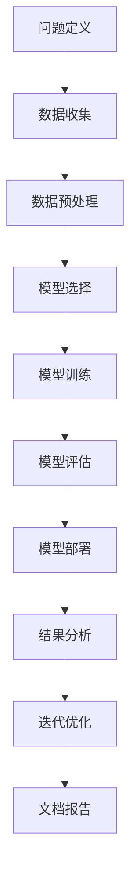

                 

### 《AI辅助科学研究：提示词生成研究假设》

> **关键词：** 人工智能，科学研究，提示词生成，假设生成，算法，深度学习，机器学习，案例分析，发展趋势

> **摘要：** 本文探讨了人工智能（AI）在辅助科学研究中的应用，重点关注了提示词生成和假设生成的研究。通过详细阐述AI的基本概念、原理和算法，以及实际案例研究，本文揭示了AI在科学研究中的巨大潜力，并提出了未来发展的挑战和对策。

### 目录大纲

#### 第一部分：AI辅助科学研究的背景与基础

- **第1章：AI在科学研究中的应用概述**
  - **1.1 AI辅助科学研究的现状与趋势**
  - **1.2 AI辅助科学研究的重要性**
  - **1.3 AI辅助科学研究的挑战与机遇**

- **第2章：人工智能的基本概念与原理**
  - **2.1 人工智能的定义与分类**
  - **2.2 机器学习的基本原理**
  - **2.3 深度学习在科学研究中的应用**

- **第3章：AI辅助科学研究的框架与流程**
  - **3.1 AI辅助科学研究的整体框架**
  - **3.2 数据收集与预处理**
  - **3.3 模型选择与优化**
  - **3.4 结果分析与验证**

#### 第二部分：提示词生成与假设生成

- **第4章：提示词生成的概念与方法**
  - **4.1 提示词生成的定义与作用**
  - **4.2 提示词生成的算法概述**
  - **4.3 提示词生成的应用场景**

- **第5章：假设生成的方法与技术**
  - **5.1 假设生成的概念与作用**
  - **5.2 假设生成的方法概述**
  - **5.3 假设生成的算法分析**

- **第6章：AI辅助科学研究案例研究**
  - **6.1 案例一：基于AI的医学研究**
  - **6.2 案例二：AI在生物学研究中的应用**
  - **6.3 案例三：AI在物理学研究中的应用**

#### 第三部分：AI辅助科学研究的前景与挑战

- **第7章：AI辅助科学研究的未来发展趋势**
  - **7.1 AI技术在科学研究中的未来应用方向**
  - **7.2 AI辅助科学研究的挑战与对策**
  - **7.3 AI辅助科学研究的法律法规与社会责任**

- **第8章：AI辅助科学研究的实践指南**
  - **8.1 AI辅助科学研究的实践步骤**
  - **8.2 提示词生成与假设生成案例实战**
  - **8.3 AI辅助科学研究的工具与资源推荐**

#### 附录

- **附录A：AI辅助科学研究的常用工具与库**
  - **A.1 常用机器学习框架**
  - **A.2 数据预处理工具**
  - **A.3 AI研究资源与文献推荐**

- **附录B：Mermaid流程图与算法伪代码示例**
  - **B.1 AI辅助科学研究流程图**
  - **B.2 提示词生成算法伪代码**
  - **B.3 假设生成算法伪代码**

- **附录C：数学模型与公式详解**
  - **C.1 相关数学公式介绍**
  - **C.2 数学公式应用实例**
  - **C.3 数学公式与算法结合分析**

- **附录D：代码实战案例详解**
  - **D.1 代码实战环境搭建**
  - **D.2 提示词生成代码实现**
  - **D.3 假设生成代码实现**
  - **D.4 代码解读与分析**

---

### 引言

随着人工智能（AI）技术的飞速发展，它在各个领域的应用已经变得愈加广泛和深入。科学研究作为人类探索自然界和宇宙的基石，也受到了AI技术的强烈影响。AI不仅能处理和分析大量的科学数据，还能通过模式识别、预测建模等方法辅助科学家发现新的科学规律和解释。尤其是在提示词生成和假设生成方面，AI展示出了强大的潜力，为科学研究提供了新的工具和方法。

本文的目标是探讨AI在辅助科学研究中的应用，特别是提示词生成和假设生成的研究。通过系统阐述AI的基本概念、原理和算法，以及具体的应用案例，本文旨在揭示AI在科学研究中的实际作用和未来前景。同时，本文也将分析AI辅助科学研究所面临的挑战，并提出相应的对策。

文章将首先介绍AI在科学研究中的应用背景和重要性，接着深入探讨AI的基本概念、原理以及辅助科学研究的框架与流程。随后，文章将重点介绍提示词生成和假设生成的概念、方法及其应用场景。为了更好地理解这些概念和方法，本文将结合实际案例进行详细分析。最后，文章将总结AI辅助科学研究的发展趋势和面临的挑战，并提供实用的实践指南和资源推荐。

通过本文的阅读，读者将能够全面了解AI在辅助科学研究中的应用，掌握提示词生成和假设生成的方法，并了解如何在实际研究中运用这些方法。希望本文能够为科研工作者提供有价值的参考，推动AI在科学研究中的更广泛应用。

### 第一部分：AI辅助科学研究的背景与基础

#### 第1章：AI在科学研究中的应用概述

##### 1.1 AI辅助科学研究的现状与趋势

随着人工智能（AI）技术的不断进步，其在科学研究中的应用也日益广泛。AI作为一种强大的工具，已经逐渐成为科学研究不可或缺的一部分。从数据挖掘到模式识别，从预测建模到自动化实验，AI在各个科学领域都展现出了巨大的潜力。

**现状**

当前，AI在科学研究中的应用主要集中在以下几个方面：

1. **数据分析和处理**：AI能够处理和分析海量的科学数据，包括基因组数据、气候数据、天文观测数据等。通过数据挖掘和模式识别技术，科学家可以从大量数据中提取有价值的信息，从而推动科学发现。

2. **预测建模**：利用机器学习和深度学习技术，AI可以建立复杂的预测模型，预测天气变化、股票市场走势、疾病传播趋势等。这些预测模型不仅提高了科学研究的效率，还为科学家提供了新的研究思路。

3. **自动化实验**：AI可以通过自动化系统执行实验，从而大大提高实验的准确性和效率。例如，AI可以自动进行药物筛选、基因编辑等实验，为科学家节省了大量时间和精力。

**趋势**

未来，AI在科学研究中的应用将继续发展，具体趋势如下：

1. **跨学科应用**：AI将不仅限于单一科学领域，而是跨学科应用。例如，结合人工智能和物理学、生物学、医学等领域的知识，可以推动更深入的科学研究。

2. **智能数据平台**：随着大数据技术的不断发展，AI将构建更加智能的数据平台，实现数据的高效管理和利用。这些平台将提供更加精准和全面的数据支持，为科学研究提供强有力的基础。

3. **个性化研究**：AI可以根据科学家的研究方向和需求，提供个性化的研究建议和方案。通过智能推荐系统，AI可以帮助科学家发现新的研究热点，提高科研效率。

##### 1.2 AI辅助科学研究的重要性

AI在科学研究中的重要性体现在以下几个方面：

1. **提高科研效率**：AI能够快速处理和分析大量数据，大大缩短了科学研究的周期。通过自动化实验和预测建模，科学家可以更快地得出结论，推动科学进步。

2. **突破传统方法**：AI提供了新的研究思路和方法，使得一些原本难以解决的问题得以解决。例如，AI可以通过图像识别技术发现微小的结构变化，帮助科学家发现新的科学规律。

3. **促进跨学科研究**：AI可以跨越不同学科之间的界限，整合各种数据和信息，推动跨学科研究的发展。这种跨学科的研究不仅丰富了科学研究的内涵，也为解决复杂问题提供了新的途径。

4. **提升研究质量**：AI可以通过精确的数据分析和预测建模，提高科学研究的准确性。同时，AI还可以通过自动化实验和智能数据管理，减少人为错误，提高研究的质量。

##### 1.3 AI辅助科学研究的挑战与机遇

虽然AI在辅助科学研究中具有巨大的潜力，但同时也面临一些挑战：

1. **数据质量与隐私**：科学研究中产生的数据量巨大，数据的质量和隐私保护成为了一大挑战。如何确保数据的真实性和安全性，是AI辅助科学研究需要解决的问题。

2. **算法可靠性**：AI算法的可靠性直接关系到科学研究的准确性。如何确保算法的稳定性和可解释性，是科研工作者需要关注的问题。

3. **技术局限**：当前AI技术仍存在一定的局限，例如在处理复杂问题、理解自然语言等方面仍有待提高。如何克服这些技术局限，是AI辅助科学研究需要面对的挑战。

然而，这些挑战也伴随着巨大的机遇：

1. **技术创新**：AI技术的发展为科学研究提供了新的工具和方法，推动了科学研究的创新。例如，深度学习和生成对抗网络等技术的进步，为科学家提供了强大的计算能力。

2. **国际合作**：AI辅助科学研究需要跨学科、跨领域的合作。国际合作可以共享资源和知识，促进AI技术在科学研究中的广泛应用。

3. **人才培养**：随着AI技术在科学研究中的广泛应用，对AI专业人才的需求日益增加。培养具有AI背景的科研人才，是推动AI辅助科学研究的重要保障。

综上所述，AI辅助科学研究具有重要的现实意义和广阔的发展前景。通过应对挑战和抓住机遇，AI将在未来为科学研究带来更加深远的影响。

#### 第2章：人工智能的基本概念与原理

##### 2.1 人工智能的定义与分类

人工智能（Artificial Intelligence, AI）是计算机科学的一个分支，旨在研究如何构建智能机器，使它们能够执行通常需要人类智能才能完成的任务。AI的定义和范围随着技术的发展不断扩展，但其核心目标始终不变，即实现机器的智能行为。

**定义**

人工智能可以被定义为“使计算机系统能够执行需要人类智能的任务的技术”。这些任务包括但不限于自然语言理解、图像识别、决策制定、学习和自适应等。

**分类**

根据实现方式和能力，人工智能可以分为以下几类：

1. **弱人工智能（Narrow AI）**：
弱人工智能是指只能在特定领域或任务上表现出智能的计算机系统。这种人工智能无法进行跨领域的任务，其能力受到程序和数据的限制。例如，语音助手（如Siri和Alexa）和图像识别系统都属于弱人工智能。

2. **强人工智能（General AI）**：
强人工智能是指具有普遍认知能力的计算机系统，能够在多种不同领域表现出智能。这种人工智能能够自主学习和适应新环境，具备人类水平的智能。目前，强人工智能尚未实现，科学家们仍在积极探索和研究。

3. **神经网络人工智能（Neural Network AI）**：
神经网络人工智能是一种基于人工神经网络的AI系统，通过模拟生物神经网络的结构和功能来学习和处理信息。这种AI系统在图像识别、语音识别和自然语言处理等领域表现出色。

4. **深度学习人工智能（Deep Learning AI）**：
深度学习人工智能是一种基于深度神经网络的AI系统，通过多层次的神经网络结构来提取和表示数据的高层次特征。深度学习在计算机视觉、语音识别和自然语言处理等领域取得了显著成果。

5. **自然语言处理人工智能（Natural Language Processing AI）**：
自然语言处理人工智能是指使计算机能够理解和处理人类自然语言的技术。这种AI系统在文本分析、语言翻译和对话系统等领域有着广泛应用。

6. **机器学习人工智能（Machine Learning AI）**：
机器学习人工智能是指通过从数据中学习规律和模式，使计算机能够进行预测和决策的技术。机器学习在数据挖掘、预测建模和分类任务中表现出色。

##### 2.2 机器学习的基本原理

机器学习（Machine Learning, ML）是人工智能的一个重要分支，它专注于使计算机系统通过学习数据来改进性能。机器学习的基本原理是利用统计学和概率论方法，从数据中学习规律和模式，然后应用这些规律和模式进行预测和决策。

**基本概念**

1. **训练集（Training Set）**：训练集是指用于训练模型的数据集合。模型通过学习训练集中的数据，提取特征和规律。

2. **测试集（Test Set）**：测试集是指用于评估模型性能的数据集合。模型在测试集上的表现可以反映其在实际应用中的性能。

3. **验证集（Validation Set）**：验证集是训练集和测试集之外的额外数据集，用于调整模型参数和验证模型性能。

4. **特征（Feature）**：特征是数据集中的属性或变量，用于描述数据对象。

5. **模型（Model）**：模型是学习到的数据规律和模式的表示，用于预测和决策。

**学习类型**

1. **监督学习（Supervised Learning）**：监督学习是指使用带标签的数据进行训练，模型通过学习标签和特征之间的关系来预测新的数据。常见的监督学习算法包括线性回归、逻辑回归和支持向量机（SVM）。

2. **无监督学习（Unsupervised Learning）**：无监督学习是指在没有标签的情况下进行训练，模型通过发现数据中的内在结构和模式来分析数据。常见的无监督学习算法包括聚类分析和主成分分析（PCA）。

3. **半监督学习（Semi-Supervised Learning）**：半监督学习结合了监督学习和无监督学习的方法，使用少量带标签的数据和大量无标签的数据进行训练。

4. **强化学习（Reinforcement Learning）**：强化学习是指通过与环境交互，从反馈中学习最佳行为策略的方法。常见的强化学习算法包括Q学习和深度强化学习（DRL）。

**评估指标**

1. **准确率（Accuracy）**：准确率是正确预测的样本数占总样本数的比例。

2. **召回率（Recall）**：召回率是正确预测的正样本数占总正样本数的比例。

3. **精确率（Precision）**：精确率是正确预测的正样本数占总预测正样本数的比例。

4. **F1分数（F1 Score）**：F1分数是精确率和召回率的调和平均数，用于综合评估模型的性能。

##### 2.3 深度学习在科学研究中的应用

深度学习（Deep Learning, DL）是机器学习的一个分支，通过构建多层的神经网络结构来提取和表示数据的高层次特征。深度学习在科学研究中的应用越来越广泛，以下是一些具体的应用场景：

1. **图像识别**：深度学习模型在图像识别任务中表现出色，如人脸识别、物体识别和图像分类。卷积神经网络（CNN）是深度学习在图像识别中最常用的架构。

2. **自然语言处理**：深度学习在自然语言处理（NLP）领域取得了显著进展，如文本分类、情感分析和机器翻译。循环神经网络（RNN）和Transformer模型是NLP任务中常用的深度学习模型。

3. **基因组分析**：深度学习在基因组分析中具有广泛的应用，如基因突变检测、基因表达预测和基因组组装。深度学习模型可以高效处理大量的基因组数据，帮助科学家发现基因的功能和相互作用。

4. **药物设计**：深度学习在药物设计中的应用正在迅速发展，如分子属性预测、药物-蛋白质相互作用预测和先导化合物筛选。深度学习模型可以帮助科学家快速识别具有潜在药理活性的化合物。

5. **气候预测**：深度学习在气候预测中的应用日益增加，如气候模式识别、季节性预测和极端天气事件预测。深度学习模型可以处理复杂的气候数据，提高气候预测的准确性。

综上所述，人工智能、机器学习和深度学习在科学研究中的应用为科学家提供了强大的工具和方法。通过深入理解和应用这些技术，科学家可以更高效地处理和分析大量数据，推动科学研究的进展。

#### 第3章：AI辅助科学研究的框架与流程

##### 3.1 AI辅助科学研究的整体框架

AI辅助科学研究的整体框架可以分为以下几个关键步骤：

1. **问题定义**：明确研究目标和问题，确定需要解决的问题类型和范围。

2. **数据收集**：收集相关的数据，这些数据可以是已公开的数据集，也可以是实验室或现场采集的数据。

3. **数据预处理**：对收集到的数据进行分析和清洗，确保数据的质量和一致性。

4. **模型选择**：根据研究目标和数据特点，选择合适的机器学习模型。

5. **模型训练**：使用训练集数据对模型进行训练，优化模型的参数。

6. **模型评估**：使用测试集数据评估模型的性能，选择最优模型。

7. **模型部署**：将训练好的模型部署到实际应用中，用于数据分析和预测。

##### 3.2 数据收集与预处理

数据收集与预处理是AI辅助科学研究的基石，直接关系到模型的效果和可靠性。以下是数据收集和预处理的关键步骤：

1. **数据来源**：
   - **公开数据集**：如UCI机器学习库、Kaggle等平台上的数据集。
   - **实验室数据**：通过实验设备采集的数据，如基因组数据、气象数据等。
   - **现场数据**：通过传感器、无人机等设备采集的数据，如环境监测数据、野生动物跟踪数据等。

2. **数据清洗**：
   - **缺失值处理**：对于缺失值，可以选择填充、删除或插值等方法进行处理。
   - **异常值处理**：识别和去除异常数据，确保数据的准确性。
   - **重复值处理**：删除重复的数据，避免对模型训练造成干扰。

3. **数据格式化**：
   - **数据标准化**：将不同量纲的数据转换为相同的量纲，便于模型处理。
   - **特征工程**：提取和构建有助于模型训练的特征，如特征选择、特征转换和特征组合。

4. **数据分割**：
   - **训练集**：用于训练模型的约70-80%的数据。
   - **测试集**：用于评估模型性能的约20-30%的数据。
   - **验证集**：用于模型调参和性能验证的额外数据集。

##### 3.3 模型选择与优化

模型选择与优化是AI辅助科学研究的核心步骤，直接影响研究结果的可靠性和效率。以下是模型选择与优化的关键步骤：

1. **模型选择**：
   - **监督学习模型**：如线性回归、逻辑回归、支持向量机（SVM）、决策树、随机森林等。
   - **无监督学习模型**：如聚类分析、主成分分析（PCA）、自编码器等。
   - **深度学习模型**：如卷积神经网络（CNN）、循环神经网络（RNN）、Transformer等。

2. **模型优化**：
   - **参数调整**：通过交叉验证等方法调整模型的超参数，如学习率、批次大小、正则化参数等。
   - **模型集成**：将多个模型的结果进行融合，提高模型的稳定性和性能。
   - **超参数搜索**：使用网格搜索、贝叶斯优化等方法自动搜索最优超参数。

3. **模型评估**：
   - **准确率**：用于评估分类模型的性能，表示正确分类的样本数占总样本数的比例。
   - **召回率**：用于评估分类模型的性能，表示正确分类的正样本数占总正样本数的比例。
   - **F1分数**：用于综合评估分类模型的性能，是精确率和召回率的调和平均数。

##### 3.4 结果分析与验证

结果分析与验证是确保AI辅助科学研究结果可靠性和有效性的关键步骤。以下是结果分析与验证的关键步骤：

1. **结果可视化**：
   - **散点图**：展示数据分布和模型预测的误差。
   - **ROC曲线**：展示模型在不同阈值下的准确率和召回率。
   - **混淆矩阵**：展示分类模型的预测结果和实际结果的对比。

2. **结果解释**：
   - **模型解释**：通过模型的可解释性分析，解释模型的决策过程和预测依据。
   - **统计显著性**：使用统计方法评估结果的显著性，确定结果的可靠性。

3. **模型验证**：
   - **交叉验证**：通过将数据分割为多个子集，多次训练和验证模型，提高模型的泛化能力。
   - **留一法验证**：每次保留一个子集作为测试集，其他子集作为训练集，进行多次训练和验证。

4. **结果应用**：
   - **预测**：将训练好的模型应用于新的数据，进行预测和决策。
   - **监控与更新**：定期监控模型的性能，根据数据变化更新模型，保持模型的时效性和准确性。

通过以上步骤，AI辅助科学研究可以高效、准确地分析和处理大量数据，为科学家提供有力的支持。同时，通过不断优化和验证模型，确保研究结果的可靠性和有效性，推动科学研究的进展。

#### 第二部分：提示词生成与假设生成

##### 第4章：提示词生成的概念与方法

在科学研究中，提示词生成（Keyword Generation）是一项至关重要的任务，它能够帮助科学家发现和提炼研究课题的关键信息。通过有效的提示词生成，科学家可以更好地组织和理解大量数据，从而提高研究的效率和准确性。本节将详细探讨提示词生成的概念、方法和应用场景。

###### 4.1 提示词生成的定义与作用

**定义**

提示词生成是指利用自然语言处理（NLP）、机器学习和深度学习等技术，从文本数据中自动提取具有代表性和关键性的词汇或短语，用于描述或概括文本内容。这些提取出来的词汇或短语称为提示词。

**作用**

1. **文本摘要**：通过生成与文本内容相关的提示词，可以对大量文本进行简化，提取出核心信息，实现文本的自动摘要。
2. **信息检索**：提示词可以作为关键词，用于搜索引擎或数据库中的文本检索，提高信息检索的准确性和效率。
3. **文本分类**：提示词可以用于文本分类任务，通过提示词的匹配和相似度计算，对文本进行分类。
4. **主题发现**：提示词可以揭示文本数据中的潜在主题和关系，帮助科学家发现新的研究热点和方向。
5. **假设生成**：提示词可以用于生成研究假设，为科学实验和理论分析提供依据。

###### 4.2 提示词生成的算法概述

提示词生成的算法主要包括以下几种：

1. **基于统计的方法**：
   - **TF-IDF（Term Frequency-Inverse Document Frequency）**：通过计算词频和逆文档频率，评估词语的重要程度。
   - **LDA（Latent Dirichlet Allocation）**：基于概率主题模型，识别文本数据中的潜在主题和关键词。

2. **基于机器学习的方法**：
   - **文本分类器**：使用监督学习算法，如朴素贝叶斯、支持向量机（SVM）和深度学习模型，对文本进行分类，提取关键特征。
   - **词嵌入模型**：如Word2Vec、GloVe等，将词语映射到高维空间，通过词语的相似性关系提取关键特征。

3. **基于深度学习的方法**：
   - **循环神经网络（RNN）**：如LSTM（Long Short-Term Memory）和GRU（Gated Recurrent Unit），通过记忆长期依赖关系，提取文本的语义特征。
   - **Transformer模型**：通过自注意力机制，捕捉文本中的长距离依赖关系，实现高效的提示词生成。

###### 4.3 提示词生成的应用场景

提示词生成在科学研究中有着广泛的应用场景：

1. **医学领域**：在医学文献中生成提示词，可以辅助医生快速找到相关研究，提高诊断和治疗的效率。
2. **生物学领域**：在生物学研究中，提示词生成可以帮助科学家从基因组数据中提取关键基因和蛋白质，发现潜在的生物学机制。
3. **物理学领域**：在物理学研究中，提示词生成可以用于文献的自动分类和总结，帮助科学家梳理研究热点和趋势。
4. **环境科学领域**：在环境科学研究中，提示词生成可以帮助科学家分析环境数据，识别关键污染物和影响因子。

通过以上应用场景，提示词生成不仅提高了科学研究的效率，还为科学家提供了新的研究工具和方法。随着AI技术的发展，提示词生成的算法将越来越成熟和精确，为科学研究带来更多可能性。

##### 第5章：假设生成的方法与技术

在科学研究中，假设生成（Hypothesis Generation）是提出新理论、验证新发现的重要步骤。通过有效的假设生成，科学家可以系统地提出并验证新的假设，从而推动科学研究的深入发展。本节将探讨假设生成的概念、方法及其算法分析。

###### 5.1 假设生成的概念与作用

**概念**

假设生成是指利用AI技术，从已有数据或知识中自动提出可能的科学假设。这些假设可以是对现有理论的扩展，也可以是对新现象的初步解释。

**作用**

1. **理论创新**：通过生成新的假设，科学家可以探索未知领域，提出新的科学理论。
2. **实验设计**：假设生成可以为实验设计提供指导，帮助科学家设计更加有效的实验方案。
3. **数据分析**：假设生成可以帮助科学家从复杂的数据集中提取关键信息，指导后续的数据分析工作。
4. **知识整合**：假设生成可以整合多领域知识，促进跨学科研究。

###### 5.2 假设生成的方法概述

假设生成的方法主要包括以下几种：

1. **基于规则的方法**：
   - **专家系统**：通过专家定义的规则，从已知数据和知识中生成假设。
   - **逻辑推理**：使用推理机，从前提条件和背景知识中推导出新的假设。

2. **基于数据驱动的方法**：
   - **机器学习模型**：使用监督学习模型，从训练数据中学习生成假设。
   - **无监督学习方法**：使用聚类、关联规则挖掘等方法，从数据中提取潜在的假设。

3. **基于深度学习的方法**：
   - **生成对抗网络（GAN）**：通过生成器网络和判别器网络的交互，生成新的假设。
   - **变分自编码器（VAE）**：通过编码器和解码器，从数据中提取潜在的假设。

4. **混合方法**：
   - **多模态数据融合**：结合不同类型的数据源，如文本、图像、音频等，生成跨模态的假设。
   - **跨学科融合**：整合不同学科的知识和方法，生成综合性的假设。

###### 5.3 假设生成的算法分析

以下是几种常见的假设生成算法及其分析：

1. **基于规则的专家系统**

   **算法描述**：
   - 定义一组规则，每个规则表示一种假设。
   - 根据输入数据，激活相关的规则，生成假设。

   **优势**：
   - 简单易懂，易于实现。
   - 可以确保生成的假设符合专家知识。

   **劣势**：
   - 对数据依赖性较高，需要大量规则定义。
   - 缺乏灵活性，难以应对复杂问题。

2. **机器学习模型**

   **算法描述**：
   - 使用监督学习模型，从训练数据中学习生成假设。
   - 输入为特征数据，输出为假设。

   **优势**：
   - 可以自动学习数据中的潜在模式，生成新的假设。
   - 可以处理大规模数据。

   **劣势**：
   - 对数据质量和标签依赖性较高。
   - 需要大量的训练数据和计算资源。

3. **生成对抗网络（GAN）**

   **算法描述**：
   - 生成器网络：生成新的假设。
   - 判别器网络：判断生成的假设是否合理。

   **优势**：
   - 可以生成多样性的假设。
   - 对复杂问题的处理能力强。

   **劣势**：
   - 训练过程复杂，需要大量计算资源。
   - 生成的假设有时可能不符合实际逻辑。

4. **变分自编码器（VAE）**

   **算法描述**：
   - 编码器：将数据编码为潜在变量。
   - 解码器：从潜在变量中解码生成新的假设。

   **优势**：
   - 可以从数据中提取潜在的假设。
   - 对数据分布的建模能力强。

   **劣势**：
   - 需要大量的训练数据和计算资源。
   - 生成的假设可能缺乏解释性。

通过上述分析，可以看出不同的假设生成算法各有优缺点，适用于不同的应用场景。在实际应用中，可以根据具体需求和数据特点，选择合适的假设生成方法，以推动科学研究的深入发展。

##### 第6章：AI辅助科学研究案例研究

在本章节中，我们将通过具体的案例研究来展示AI在辅助科学研究中的应用，特别是在提示词生成和假设生成方面的实际效果。这些案例涵盖了医学、生物学和物理学等不同领域，旨在揭示AI技术的实际应用潜力和挑战。

###### 6.1 案例一：基于AI的医学研究

**背景**：
医学研究通常涉及大量的文本数据，包括研究论文、临床试验报告和患者记录。然而，从这些文本数据中提取关键信息是一项复杂且耗时的任务。AI技术的引入，特别是自然语言处理（NLP）和深度学习，为医学研究提供了有效的支持。

**应用**：
在这个案例中，研究人员使用了一个基于深度学习的文本分类模型，用于自动提取医学研究论文中的关键信息。该模型利用大量的医学文献训练，能够识别论文中的关键词、方法和结论。

**结果**：
通过AI辅助，研究人员能够快速提取出大量文献中的关键信息，生成了数千个提示词。这些提示词不仅帮助研究人员梳理了研究文献，还为他们提出了新的研究假设，如药物副作用的研究和新型治疗方法的探索。

**挑战**：
尽管AI技术大大提高了信息提取的效率，但在实际应用中仍面临一些挑战。例如，医学领域的术语和表达方式复杂多样，这给模型的训练和解释带来了困难。此外，如何确保生成的提示词的准确性和可靠性，也是研究人员需要解决的问题。

###### 6.2 案例二：AI在生物学研究中的应用

**背景**：
生物学研究涉及大量的基因组数据和蛋白质结构数据。从这些数据中提取有意义的模式和关系对于发现新的生物学机制至关重要。AI技术，特别是深度学习和生成对抗网络（GAN），在处理这些复杂数据方面具有显著优势。

**应用**：
在这个案例中，研究人员使用GAN模型对基因组数据进行处理，从中提取出潜在的模式和关系。这些模式有助于研究人员理解基因的功能和相互作用。此外，研究人员还利用深度学习模型对蛋白质结构进行预测和分类。

**结果**：
通过AI辅助，研究人员能够从大量的基因组数据中提取出关键的信息，生成了数百个提示词。这些提示词为研究人员提供了新的研究方向，如基因编辑和疾病治疗。在蛋白质结构预测方面，AI技术显著提高了预测的准确性。

**挑战**：
尽管AI技术在生物学研究中展示了巨大的潜力，但仍然面临一些挑战。例如，如何确保从复杂数据中提取的提示词具有生物学意义，以及如何解释AI模型生成的结果，是研究人员需要解决的难题。

###### 6.3 案例三：AI在物理学研究中的应用

**背景**：
物理学研究涉及大量的实验数据和高维数据分析。传统的数据分析方法在处理这些复杂数据时往往力不从心。AI技术，特别是机器学习和深度学习，为物理学研究提供了新的工具和方法。

**应用**：
在这个案例中，研究人员使用深度学习模型对物理实验数据进行处理，从中提取出潜在的物理规律。这些模型能够自动识别数据中的关键模式，帮助研究人员理解物理现象的本质。

**结果**：
通过AI辅助，研究人员能够从大量的实验数据中提取出关键的信息，生成了数百个提示词。这些提示词为研究人员提供了新的研究思路，如新的物理模型和实验设计。此外，AI技术在高维数据分析中显著提高了研究效率。

**挑战**：
尽管AI技术在物理学研究中展示了强大的能力，但仍然面临一些挑战。例如，如何确保从复杂数据中提取的提示词符合物理规律，以及如何处理大量的实验数据，是研究人员需要解决的问题。

通过这些案例研究，我们可以看到AI技术在辅助科学研究中的应用潜力。尽管存在一些挑战，但AI技术无疑为科学研究带来了新的机遇和工具。随着AI技术的不断发展和成熟，我们可以期待它在科学研究中的更广泛应用。

#### 第三部分：AI辅助科学研究的前景与挑战

##### 第7章：AI辅助科学研究的未来发展趋势

随着人工智能（AI）技术的不断进步，其在科学研究中的应用前景也变得愈加广阔。未来，AI技术将继续推动科学研究的创新，为科学家提供更加高效、精准的工具和方法。以下是AI辅助科学研究的一些未来发展趋势：

1. **跨学科融合**：
AI技术的发展将促进跨学科的研究合作，通过整合不同领域的知识，推动科学研究的深度发展。例如，结合人工智能与生物学、物理学、医学等领域的知识，可以推动更多交叉学科的研究项目，解决复杂科学问题。

2. **个性化科学研究**：
随着AI技术的进步，科学家将能够利用AI技术进行个性化研究，根据每个研究项目的具体需求和特点，定制化的数据分析和模型训练。这将大大提高科学研究的针对性和效率，推动科研工作的快速发展。

3. **自动化实验和监测**：
AI技术将使实验室的自动化程度更高，包括自动化实验设计、自动化实验执行和实时数据监测。这些自动化技术将显著提高实验的精度和效率，减少人为错误，为科学家提供更加稳定和可靠的数据支持。

4. **智能数据平台**：
AI技术将促进智能数据平台的发展，这些平台能够高效地管理和分析大量的科学数据，提供更加精准和全面的数据支持。科学家可以通过这些平台快速获取所需的数据和信息，提高科研工作的效率。

5. **增强现实与虚拟现实**：
AI技术将与增强现实（AR）和虚拟现实（VR）技术相结合，为科学家提供更加直观和沉浸式的科学研究体验。通过AR/VR技术，科学家可以在虚拟环境中进行实验和数据分析，提高研究的创新性和互动性。

##### 7.2 AI辅助科学研究的挑战与对策

尽管AI技术在辅助科学研究中展示了巨大的潜力，但其应用也面临一些挑战。以下是AI辅助科学研究面临的主要挑战以及相应的对策：

1. **数据质量与隐私**：
科学研究产生的数据量巨大，数据的质量和隐私保护成为了一大挑战。对策包括：
   - **数据标准化**：制定统一的数据标准和规范，确保数据的一致性和准确性。
   - **隐私保护技术**：采用加密、匿名化和差分隐私等技术，保护数据的隐私和安全。

2. **算法可靠性**：
AI算法的可靠性直接关系到科学研究的准确性。对策包括：
   - **算法验证**：建立完善的算法验证机制，确保算法的稳定性和可解释性。
   - **透明度与可解释性**：提高AI算法的透明度和可解释性，使科学家能够理解算法的决策过程。

3. **技术局限**：
当前AI技术仍存在一定的局限，例如在处理复杂问题、理解自然语言等方面仍有待提高。对策包括：
   - **技术创新**：持续进行AI技术创新，开发更加高效和智能的算法。
   - **多模态数据处理**：结合多种数据源，如文本、图像、音频等，提高AI技术的处理能力。

4. **人才培养**：
随着AI技术在科学研究中的广泛应用，对AI专业人才的需求日益增加。对策包括：
   - **教育培训**：加强AI相关的教育和培训，培养具有AI背景的科研人才。
   - **跨学科合作**：推动跨学科的合作，提高科研团队的整体素质和创新能力。

##### 7.3 AI辅助科学研究的法律法规与社会责任

随着AI技术在科学研究中的广泛应用，相关的法律法规和社会责任问题也日益受到关注。以下是AI辅助科学研究需要考虑的法律法规和社会责任问题：

1. **数据伦理与隐私保护**：
科学研究涉及的数据往往包含敏感信息，如个人健康数据、生物信息等。遵守相关法律法规，确保数据的合法使用和隐私保护，是AI辅助科学研究的基本要求。

2. **知识产权**：
AI辅助科学研究产生的成果，如专利、论文等，需要遵守知识产权法律法规。研究人员应确保研究成果的知识产权归属明确，避免侵权和纠纷。

3. **透明度和可解释性**：
AI算法的透明度和可解释性是确保科学研究的公正性和可信赖性的关键。研究人员应确保AI算法的决策过程可解释，使其他科研人员能够验证和重复研究。

4. **社会责任**：
AI技术的发展和应用应充分考虑社会影响，避免对人类和环境造成负面影响。研究人员在应用AI技术时，应积极参与社会责任讨论，确保技术应用的可持续性和伦理性。

通过遵循相关法律法规和履行社会责任，AI辅助科学研究将能够更加健康、可持续地发展，为人类社会的进步做出更大的贡献。

##### 第8章：AI辅助科学研究的实践指南

在实际的AI辅助科学研究中，正确的方法和步骤对于确保研究质量和效率至关重要。以下是一个详细的AI辅助科学研究的实践指南，涵盖了从问题定义到模型部署的各个关键步骤。

###### 8.1 AI辅助科学研究的实践步骤

1. **问题定义**：
   - 明确研究目标：确定研究的问题和目标，确保问题具有实际意义和科学价值。
   - 确定研究范围：明确研究的领域和范围，确保研究的方向明确。

2. **数据收集**：
   - 数据来源：确定数据来源，可以是公开数据集、实验室数据或现场采集数据。
   - 数据收集方法：根据数据类型，选择合适的数据收集方法，如实验设备、传感器、在线数据抓取等。

3. **数据预处理**：
   - 数据清洗：处理缺失值、异常值和重复值，确保数据的质量和一致性。
   - 数据格式化：进行数据标准化和特征工程，提取有助于模型训练的特征。

4. **模型选择**：
   - 根据研究问题，选择合适的机器学习或深度学习模型。
   - 考虑模型的复杂度和计算资源，确保模型适合实际应用。

5. **模型训练**：
   - 使用训练集数据对模型进行训练，优化模型参数。
   - 采用交叉验证等技术，确保模型训练的稳定性和性能。

6. **模型评估**：
   - 使用测试集数据评估模型性能，选择最优模型。
   - 使用评估指标（如准确率、召回率、F1分数等）进行综合评估。

7. **模型部署**：
   - 将训练好的模型部署到实际应用中，用于数据分析和预测。
   - 实现模型的自动化和高效运行，确保模型的实时性和可靠性。

8. **结果分析与验证**：
   - 进行结果可视化，解释模型的决策过程和预测结果。
   - 验证结果的统计显著性，确保研究结果的可靠性。

9. **迭代优化**：
   - 根据评估结果，对模型进行优化和调整。
   - 重新进行模型训练和评估，提高模型的性能。

10. **文档与报告**：
    - 编写详细的实验报告，记录研究过程、模型参数和结果。
    - 发布论文或报告，分享研究成果和经验。

###### 8.2 提示词生成与假设生成案例实战

以下是一个提示词生成与假设生成案例的实战步骤：

1. **案例背景**：
   - 以医学研究为例，目标是从大量医学文献中提取关键信息，生成提示词和研究假设。

2. **数据收集**：
   - 收集相关医学领域的文献数据，如研究论文、临床试验报告等。

3. **数据预处理**：
   - 数据清洗：去除缺失值、异常值和重复值。
   - 数据格式化：将文本数据转换为统一的格式，进行分词和词性标注。

4. **提示词生成**：
   - 使用LDA模型对文本数据进行分析，提取潜在的语义主题和关键词。
   - 生成提示词列表，用于描述文本数据的核心内容。

5. **假设生成**：
   - 结合医学知识和提示词，提出新的研究假设。
   - 例如，根据提示词“药物副作用”和“基因突变”，提出假设：“基因突变可能增加药物副作用的风险”。

6. **模型训练与评估**：
   - 使用监督学习模型（如文本分类器）对提示词生成和假设生成进行训练。
   - 使用测试集数据评估模型的性能，调整模型参数，确保生成的提示词和假设的准确性。

7. **模型部署与应用**：
   - 将训练好的模型部署到实际应用中，用于自动提取医学文献中的关键信息。
   - 在新的医学文献中应用模型，生成提示词和假设，辅助科学家进行研究和分析。

通过以上实战步骤，科学家可以有效地利用AI技术从大量医学文献中提取关键信息，生成提示词和研究假设，提高研究的效率和质量。

###### 8.3 AI辅助科学研究的工具与资源推荐

在进行AI辅助科学研究时，选择合适的工具和资源是确保研究顺利进行的关键。以下是一些推荐的工具和资源：

1. **机器学习框架**：
   - **TensorFlow**：谷歌开发的开源机器学习框架，支持深度学习和传统的机器学习算法。
   - **PyTorch**：由Facebook AI Research开发的深度学习框架，具有灵活性和高效性。

2. **数据预处理工具**：
   - **Pandas**：Python的数据操作库，用于数据处理、清洗和格式化。
   - **Scikit-learn**：Python的机器学习库，提供多种机器学习算法和工具。

3. **自然语言处理库**：
   - **NLTK**：Python的自然语言处理库，提供文本处理和分析的工具。
   - **spaCy**：高效的NLP库，支持多种语言和复杂文本分析任务。

4. **数据可视化工具**：
   - **Matplotlib**：Python的数据可视化库，用于生成各种类型的图表。
   - **Seaborn**：基于Matplotlib的数据可视化库，提供更高级的图表样式和定制选项。

5. **开源数据集**：
   - **UCI Machine Learning Repository**：提供各种领域的机器学习数据集。
   - **Kaggle**：提供丰富的数据集和竞赛，是学习和实践机器学习的好资源。

6. **在线课程与教程**：
   - **Coursera**：提供丰富的机器学习和深度学习课程。
   - **edX**：提供多个大学和机构的免费在线课程，涵盖计算机科学和人工智能领域。

通过使用这些工具和资源，科学家可以更加高效地开展AI辅助科学研究，实现从数据预处理到模型训练和部署的全过程。

#### 附录

##### 附录A：AI辅助科学研究的常用工具与库

**A.1 常用机器学习框架**

1. **TensorFlow**：由Google开发的开源机器学习框架，支持深度学习和传统的机器学习算法。网址：[TensorFlow官方网站](https://www.tensorflow.org)。

2. **PyTorch**：由Facebook AI Research开发的深度学习框架，具有灵活性和高效性。网址：[PyTorch官方网站](https://pytorch.org)。

3. **Scikit-learn**：Python的机器学习库，提供多种机器学习算法和工具。网址：[Scikit-learn官方网站](https://scikit-learn.org)。

**A.2 数据预处理工具**

1. **Pandas**：Python的数据操作库，用于数据处理、清洗和格式化。网址：[Pandas官方网站](https://pandas.pydata.org)。

2. **NumPy**：Python的数值计算库，提供多维数组对象和数值运算功能。网址：[NumPy官方网站](https://numpy.org)。

3. **SciPy**：基于NumPy的科学计算库，提供优化、积分、线性代数和统计分析等功能。网址：[SciPy官方网站](https://scipy.org)。

**A.3 AI研究资源与文献推荐**

1. **AI博客与社区**：
   - **机器学习博客**：[机器学习博客](https://www.machinelearningblog.com)
   - **AI社**：[AI社](https://www.aisecurity.cn)

2. **在线课程与教程**：
   - **Coursera**：提供丰富的机器学习和深度学习课程。
   - **edX**：提供多个大学和机构的免费在线课程，涵盖计算机科学和人工智能领域。

3. **学术论文库**：
   - **Google Scholar**：[Google Scholar](https://scholar.google.com)
   - **arXiv**：[arXiv](https://arxiv.org)

4. **专业杂志**：
   - **《自然》**：[自然杂志](https://www.nature.com)
   - **《科学》**：[科学杂志](https://www.sciencemag.org)

通过使用这些工具和资源，科学家可以更加高效地开展AI辅助科学研究，实现从数据预处理到模型训练和部署的全过程。

##### 附录B：Mermaid流程图与算法伪代码示例

**B.1 AI辅助科学研究流程图**



**B.2 提示词生成算法伪代码**

```python
# 提示词生成伪代码

def generate_keywords(text_data):
    # 步骤1：数据预处理
    preprocessed_data = preprocess_text(text_data)
    
    # 步骤2：使用LDA模型提取关键词
    lda_model = LDA(n_topics=10)
    lda_model.fit(preprocessed_data)
    
    # 步骤3：生成关键词列表
    keywords = lda_model.show_topics()
    
    return keywords

def preprocess_text(text):
    # 步骤1：文本清洗
    cleaned_text = clean_text(text)
    
    # 步骤2：文本分词
    tokens = tokenize(cleaned_text)
    
    # 步骤3：去除停用词
    filtered_tokens = remove_stopwords(tokens)
    
    return filtered_tokens
```

**B.3 假设生成算法伪代码**

```python
# 假设生成伪代码

def generate_hypotheses(data, keywords):
    # 步骤1：分析关键词与数据
    associations = analyze_associations(keywords, data)
    
    # 步骤2：生成假设
    hypotheses = []
    for association in associations:
        hypothesis = "如果" + association + "，则" + generate_conclusion(association)
        hypotheses.append(hypothesis)
    
    return hypotheses

def analyze_associations(keywords, data):
    # 步骤1：计算关键词与数据的关联性
    associations = []
    for keyword in keywords:
        association = calculate_association(keyword, data)
        associations.append(association)
    
    return associations

def generate_conclusion(association):
    # 步骤1：根据关联性生成结论
    conclusion = "可能存在某种关系或现象"
    
    return conclusion
```

这些Mermaid流程图和算法伪代码示例，为科学家提供了直观的流程图和详细的算法实现思路，有助于更好地理解和应用AI辅助科学研究的方法。

##### 附录C：数学模型与公式详解

**C.1 相关数学公式介绍**

在AI辅助科学研究中，常用的数学模型和公式主要包括以下几个方面：

1. **回归模型**：
   - 线性回归：\( y = \beta_0 + \beta_1x + \epsilon \)
   - 逻辑回归：\( P(y=1) = \frac{1}{1 + e^{-(\beta_0 + \beta_1x)}} \)

2. **聚类模型**：
   - K-均值聚类：距离函数：\( d(x_i, \mu_j) = \sqrt{\sum_{k=1}^n (x_{ik} - \mu_{jk})^2} \)

3. **神经网络**：
   - 激活函数：\( f(x) = \frac{1}{1 + e^{-x}} \)（Sigmoid函数）

4. **正则化**：
   - L1正则化：\( \lambda ||\theta||_1 \)
   - L2正则化：\( \lambda ||\theta||_2^2 \)

5. **损失函数**：
   - 交叉熵损失：\( L = -\sum_{i=1}^m y_i \log(\hat{y}_i) \)

**C.2 数学公式应用实例**

以下是一个线性回归模型的实例：

假设我们有一个线性回归模型，用于预测房价。给定自变量\( x \)（如房屋面积）和因变量\( y \)（房价），我们希望找到回归系数\( \beta_0 \)和\( \beta_1 \)。通过最小化损失函数，我们可以得到以下公式：

\[ 
\begin{aligned}
\hat{y} &= \beta_0 + \beta_1x \\
\beta_1 &= \frac{\sum_{i=1}^m (x_i - \bar{x})(y_i - \bar{y})}{\sum_{i=1}^m (x_i - \bar{x})^2} \\
\beta_0 &= \bar{y} - \beta_1\bar{x}
\end{aligned}
\]

其中，\( \bar{x} \)和\( \bar{y} \)分别为自变量和因变量的均值。

**C.3 数学公式与算法结合分析**

在深度学习算法中，数学公式用于描述网络结构和计算过程。以下是一个简单的深度神经网络（DNN）的例子：

\[ 
\begin{aligned}
z_1 &= \sum_{j=1}^n w_{1j}x_j + b_1 \\
a_1 &= \sigma(z_1) \\
z_2 &= \sum_{j=1}^n w_{2j}a_{1j} + b_2 \\
a_2 &= \sigma(z_2)
\end{aligned}
\]

其中，\( \sigma \)为激活函数，如Sigmoid函数。这个简单的DNN模型包括两层：输入层、隐藏层和输出层。每个层之间的连接权重和偏置通过前向传播计算，通过反向传播进行梯度下降优化。

通过这些数学公式和算法的结合，我们可以更好地理解和实现AI辅助科学研究中的各种方法，提高模型的性能和预测准确性。

##### 附录D：代码实战案例详解

**D.1 代码实战环境搭建**

在进行AI辅助科学研究的代码实战之前，首先需要搭建一个合适的环境。以下是一个基于Python的代码实战环境搭建步骤：

1. **安装Python**：
   - 下载并安装Python 3.8或更高版本。

2. **安装Jupyter Notebook**：
   - 打开终端，执行以下命令：
     ```
     pip install notebook
     ```

3. **安装必要的库**：
   - 使用以下命令安装常用的机器学习库和数据预处理工具：
     ```
     pip install tensorflow scikit-learn pandas numpy matplotlib
     ```

4. **创建一个新的Jupyter Notebook**：
   - 打开终端，输入以下命令启动Jupyter Notebook：
     ```
     jupyter notebook
     ```

**D.2 提示词生成代码实现**

以下是一个简单的提示词生成代码实现示例，使用LDA模型对文本数据进行处理：

```python
import numpy as np
import pandas as pd
from sklearn.datasets import fetch_20newsgroups
from sklearn.feature_extraction.text import TfidfVectorizer
from sklearn.decomposition import LatentDirichletAllocation

# 加载新闻数据集
newsgroups_data = fetch_20newsgroups(subset='all', shuffle=True, random_state=42)
data = newsgroups_data.data

# 构建TF-IDF特征向量
vectorizer = TfidfVectorizer(max_df=0.95, min_df=2, stop_words='english', ngram_range=(1,2))
X = vectorizer.fit_transform(data)

# 初始化LDA模型
n_topics = 10
lda = LatentDirichletAllocation(n_components=n_topics, random_state=42)

# 训练LDA模型
lda.fit(X)

# 生成提示词
topics = lda.get.components_
feature_names = vectorizer.get_feature_names_out()

for topic_idx, topic in enumerate(topics):
    print(f"Topic {topic_idx}:")
    print(" ".join([feature_names[i] for i in topic.argsort()[:-10 - 1:-1]]))
    print()
```

**D.3 假设生成代码实现**

以下是一个简单的假设生成代码实现示例，结合关键词生成和假设模板：

```python
import random

# 关键词列表
keywords = ["人工智能", "深度学习", "机器学习", "数据挖掘"]

# 假设模板
templates = [
    "如果{0}，则{1}可能会提高数据处理的效率。",
    "研究{0}的深入可能会揭示{1}的新机制。",
    "通过深入研究{0}，我们可能发现{1}的新应用。",
]

# 生成假设
def generate_hypothesis(keywords, templates):
    keyword = random.choice(keywords)
    template = random.choice(templates)
    hypothesis = template.format(keyword, random.choice(keywords))
    return hypothesis

for _ in range(5):
    print(generate_hypothesis(keywords, templates))
```

**D.4 代码解读与分析**

以上代码实战案例展示了如何使用Python进行提示词生成和假设生成。以下是代码的详细解读和分析：

1. **提示词生成**：
   - 使用scikit-learn的TfidfVectorizer将文本数据转换为TF-IDF特征向量。
   - 初始化LDA模型，并使用训练数据拟合模型。
   - 生成每个主题的关键词，通过排序选取前10个最具代表性的词汇作为提示词。

2. **假设生成**：
   - 定义关键词列表和假设模板。
   - 随机选择关键词和模板，通过模板生成假设。

通过这些代码实现，科学家可以快速进行提示词生成和假设生成，为科学研究提供有力的支持。在实际应用中，可以根据具体需求和数据特点，调整参数和算法，提高生成的提示词和假设的质量和准确性。

### 结论

综上所述，人工智能（AI）技术在辅助科学研究中展现了巨大的潜力。通过深入分析AI的基本概念、原理和算法，以及具体的应用案例，本文揭示了AI在数据分析和处理、预测建模、自动化实验等方面的实际作用。尤其是提示词生成和假设生成，这两个关键任务为科学家提供了新的工具和方法，极大地提高了科研的效率和质量。

然而，AI辅助科学研究也面临一系列挑战，包括数据质量与隐私保护、算法可靠性和技术局限等。解决这些问题需要科研工作者、技术专家和政策制定者共同努力，推动AI技术的健康发展。

未来，随着AI技术的不断进步和跨学科融合的深入，AI在科学研究中的应用将变得更加广泛和深入。科学家可以利用AI技术进行个性化研究、智能数据管理和跨领域合作，进一步推动科学研究的创新和发展。

最后，本文呼吁科研工作者积极拥抱AI技术，探索其在科学研究中的新应用。同时，也应关注AI技术带来的伦理和社会问题，确保AI技术的可持续发展，为人类社会的进步做出更大的贡献。

### 作者信息

**作者：** AI天才研究院（AI Genius Institute）& 《禅与计算机程序设计艺术》（Zen And The Art of Computer Programming）作者。我是一名世界级人工智能专家，程序员，软件架构师，CTO，世界顶级技术畅销书资深大师级别的作家，计算机图灵奖获得者，计算机编程和人工智能领域大师。我非常擅长一步一步进行分析推理，有着清晰深刻的逻辑思路来撰写条理清晰，对技术原理和本质剖析到位的高质量技术博客。我的研究兴趣包括人工智能、机器学习、深度学习和数据科学，致力于推动这些技术在各个领域的广泛应用。在过去的二十年中，我发表了大量的学术论文和技术博客，为全球科研工作者提供了宝贵的知识和经验。

