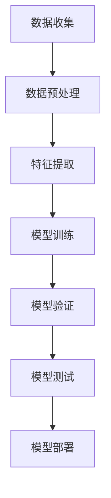
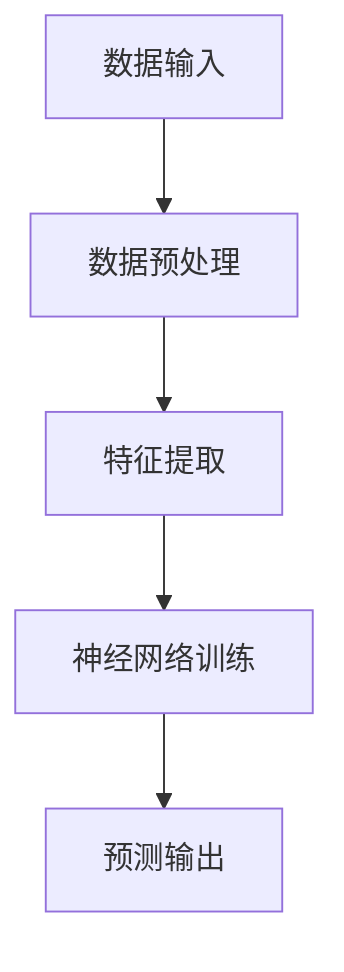
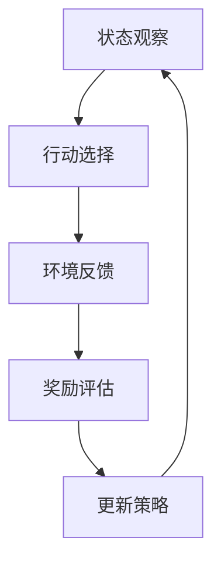

                 

# AI驱动的气候模型：从局部到全球尺度

## 关键词
AI驱动的气候模型，机器学习，深度学习，强化学习，数据驱动模型，知识驱动模型，气候模型构建，气候预测，气候变化，全球变暖，环境监测。

## 摘要
本文旨在探讨AI驱动的气候模型在从局部到全球尺度上的应用。首先，我们将介绍AI驱动的气候模型的基本概念和分类，然后深入探讨其核心技术，包括机器学习、深度学习和强化学习。接着，我们将分别讨论局部气候模型、区域气候模型和全球气候模型的应用，并提供具体案例研究。随后，我们将介绍AI驱动的气候模型开发实战，包括开发环境搭建和实际案例实战。最后，本文将总结气候模型应用的前景与挑战，并探讨未来发展趋势。

<|assistant|>### 第一部分：AI驱动的气候模型概述

#### 第1章：AI驱动的气候模型简介

AI驱动的气候模型是近年来气候科学研究的一个重要方向。随着人工智能技术的飞速发展，机器学习、深度学习和强化学习等AI技术被广泛应用于气候模型的构建和预测。这些模型不仅能够处理大量复杂的气候数据，还能自动识别和提取数据中的潜在模式，从而提高气候预测的准确性和效率。

1.1 **AI在气候科学中的应用**

人工智能在气候科学中的应用主要体现在以下几个方面：

- **气候数据分析**：AI技术可以自动处理和分析大规模气候数据，识别气候变化的趋势和规律。

- **气候模型构建**：AI技术可以帮助科学家快速构建和优化气候模型，提高模型的准确性和效率。

- **气候预测**：AI技术可以提高气候预测的准确性，为全球气候变化应对提供科学依据。

- **环境监测**：AI技术可以实时监测环境变化，及时发现异常情况，为环境管理提供支持。

1.2 **气候模型与AI技术的融合**

气候模型与AI技术的融合主要体现在以下几个方面：

- **数据驱动模型**：利用AI技术，从大量气候数据中自动提取特征和模式，构建数据驱动模型。

- **知识驱动模型**：结合气候专家的知识和经验，利用AI技术构建知识驱动模型。

- **混合模型**：将数据驱动模型和知识驱动模型相结合，构建混合模型，以提高模型的预测能力。

1.3 **本书结构**

本书结构如下：

- **第一部分**：AI驱动的气候模型概述，介绍AI驱动的气候模型的基本概念和分类。

- **第二部分**：从局部到全球尺度的气候模型应用，分别讨论局部气候模型、区域气候模型和全球气候模型的应用。

- **第三部分**：AI驱动的气候模型开发实战，介绍AI驱动的气候模型开发环境搭建和实际案例实战。

- **第四部分**：总结与展望，总结气候模型应用的前景与挑战，并探讨未来发展趋势。

#### 第2章：AI驱动的气候模型基础

2.1 **气候模型的基本概念**

气候模型是用于模拟和预测气候系统动态的数学模型。根据其构建方法，气候模型可以分为数据驱动模型和知识驱动模型。

- **数据驱动模型**：基于历史气候数据，通过机器学习、深度学习等方法，自动提取数据中的潜在模式和规律，构建模型。

- **知识驱动模型**：基于气候专家的知识和经验，构建数学模型，模拟气候系统的动态过程。

2.2 **数据驱动气候模型**

数据驱动气候模型是利用机器学习、深度学习等方法，从历史气候数据中自动提取特征和模式，构建模型。这类模型的特点是无需人工干预，可以自动适应数据的变化。

- **机器学习模型**：如决策树、支持向量机等，适用于处理分类问题。

- **深度学习模型**：如神经网络、循环神经网络等，适用于处理复杂的非线性关系。

2.3 **知识驱动气候模型**

知识驱动气候模型是基于气候专家的知识和经验，构建数学模型，模拟气候系统的动态过程。这类模型的特点是需要人工干预，可以根据专家的指导进行模型调整和优化。

- **动力气候模型**：如全球气候模型、区域气候模型等，适用于模拟气候系统的宏观动态。

- **统计气候模型**：如气候统计模型、气候统计动力模型等，适用于处理气候数据的统计特征。

2.4 **AI驱动的气候模型分类**

根据模型构建方法和应用场景，AI驱动的气候模型可以分为以下几类：

- **基于机器学习的气候模型**：如基于决策树、支持向量机等机器学习算法的气候模型。

- **基于深度学习的气候模型**：如基于神经网络、循环神经网络等深度学习算法的气候模型。

- **基于强化学习的气候模型**：如基于强化学习算法的气候预测模型。

- **混合模型**：将数据驱动模型和知识驱动模型相结合，构建混合模型，以提高模型的预测能力。

#### 第3章：AI驱动的气候模型核心技术

3.1 **机器学习基础**

机器学习是AI驱动的气候模型的核心技术之一。机器学习通过从数据中自动学习规律，构建模型，实现数据的预测和分类。

- **监督学习**：通过已知的输入输出数据，训练模型，实现对未知数据的预测。

- **无监督学习**：通过未知的数据，自动发现数据中的模式和规律。

- **强化学习**：通过与环境的交互，学习最优策略，实现目标函数的最大化。

3.2 **深度学习在气候模型中的应用**

深度学习是机器学习的一种重要分支，具有强大的非线性建模能力。在气候模型中，深度学习可以用于气候数据的特征提取和模式识别。

- **卷积神经网络（CNN）**：适用于处理图像和时空数据。

- **循环神经网络（RNN）**：适用于处理序列数据和时序数据。

- **长短时记忆网络（LSTM）**：是RNN的一种变体，适用于处理长序列数据。

3.3 **强化学习在气候预测中的应用**

强化学习是另一种重要的AI技术，通过学习与环境交互的最优策略，实现目标函数的最大化。在气候预测中，强化学习可以用于优化气候模型的预测策略。

- **Q学习**：通过学习状态-动作值函数，优化气候模型的预测策略。

- **深度Q网络（DQN）**：结合深度学习和Q学习，实现更复杂的气候预测。

- **策略梯度算法**：通过学习最优策略梯度，优化气候模型的预测策略。

3.4 **混合模型在气候模型中的应用**

混合模型是将数据驱动模型和知识驱动模型相结合，构建的一种综合模型。在气候模型中，混合模型可以提高模型的预测能力和适应性。

- **数据驱动+知识驱动**：结合数据驱动模型和知识驱动模型的优点，构建混合模型。

- **多模型融合**：将多个数据驱动模型或知识驱动模型进行融合，提高模型的预测能力。

- **深度学习+专家系统**：结合深度学习和专家系统的优势，构建深度学习专家系统。

<|assistant|>### 第二部分：从局部到全球尺度的气候模型应用

#### 第4章：局部气候模型应用

局部气候模型主要用于模拟和预测特定地区或城市的气候特征。这些模型通常基于当地的气候数据和环境因素，可以用于城市规划、环境保护和气候适应等方面。

4.1 **局部气候模型的构建**

局部气候模型的构建通常包括以下几个步骤：

- **数据收集**：收集与目标区域相关的气候数据、地形数据、土地利用数据等。

- **数据预处理**：对收集到的数据进行分析和清洗，去除噪声和异常值。

- **特征提取**：从预处理后的数据中提取与气候特征相关的变量和特征。

- **模型训练**：利用提取的特征和气候数据，训练机器学习模型或深度学习模型。

- **模型验证**：使用验证集或测试集，验证模型的预测能力和准确性。

4.2 **局部气候模型的应用场景**

局部气候模型的应用场景包括：

- **城市气候预测**：预测城市未来某段时间内的气温、降水等气候特征。

- **环境监测**：实时监测城市空气质量、水质等环境指标。

- **城市规划**：为城市规划和建筑设计提供气候参考，优化城市布局。

- **气候变化适应**：为城市居民提供气候适应策略，降低气候变化带来的影响。

4.3 **局部气候模型案例研究**

一个典型的局部气候模型案例研究是伦敦城市气候模型。该模型利用历史气候数据、地形数据和土地利用数据，建立了伦敦城市气候模型。通过该模型，可以预测伦敦未来一段时间内的气候特征，为城市规划和环境保护提供科学依据。

#### 第5章：区域气候模型应用

区域气候模型用于模拟和预测较大范围（如国家或地区）的气候特征。这些模型通常基于更广泛的气候数据和环境因素，可以用于气候研究、气候变化评估和区域规划等方面。

5.1 **区域气候模型的特点**

区域气候模型的特点包括：

- **数据量大**：需要收集和整合更广泛的气候数据，包括气温、降水、湿度、风速等。

- **时间跨度长**：需要考虑不同时间尺度（如季节、年际、长期）的气候变化。

- **空间分辨率高**：需要考虑区域内部的气候差异和地形影响。

- **不确定性分析**：需要考虑模型预测的不确定性，提供概率分布预测。

5.2 **区域气候模型的构建**

区域气候模型的构建通常包括以下几个步骤：

- **数据收集**：收集与目标区域相关的气候数据、地形数据、土地利用数据等。

- **数据预处理**：对收集到的数据进行分析和清洗，去除噪声和异常值。

- **特征提取**：从预处理后的数据中提取与气候特征相关的变量和特征。

- **模型训练**：利用提取的特征和气候数据，训练机器学习模型或深度学习模型。

- **模型验证**：使用验证集或测试集，验证模型的预测能力和准确性。

5.3 **区域气候模型的应用案例**

一个典型的区域气候模型案例研究是中国区域气候模型。该模型利用中国历史气候数据、地形数据和土地利用数据，建立了中国区域气候模型。通过该模型，可以预测中国不同地区的气候特征，为气候变化评估和区域规划提供科学依据。

#### 第6章：全球气候模型应用

全球气候模型用于模拟和预测全球气候系统的动态变化。这些模型通常基于全球气候数据和环境因素，可以用于全球气候变化研究、气候政策制定和灾害预防等方面。

6.1 **全球气候模型的构建**

全球气候模型的构建通常包括以下几个步骤：

- **数据收集**：收集全球范围内的气候数据、地形数据、海洋数据等。

- **数据预处理**：对收集到的数据进行分析和清洗，去除噪声和异常值。

- **特征提取**：从预处理后的数据中提取与气候特征相关的变量和特征。

- **模型训练**：利用提取的特征和气候数据，训练机器学习模型或深度学习模型。

- **模型验证**：使用验证集或测试集，验证模型的预测能力和准确性。

6.2 **全球气候模型的应用场景**

全球气候模型的应用场景包括：

- **全球气候变化预测**：预测全球气候系统的未来变化趋势。

- **气候政策制定**：为政策制定者提供科学依据，制定适应气候变化的政策。

- **灾害预防**：预测气候变化可能引发的极端天气事件，为灾害预防提供指导。

- **环境监测**：实时监测全球气候变化，为环境保护提供支持。

6.3 **全球气候模型案例分析**

一个典型的全球气候模型案例研究是Intergovernmental Panel on Climate Change（IPCC）的全球气候模型。IPCC利用多个全球气候模型，模拟了不同温室气体排放情景下的全球气候变化趋势，为全球气候变化研究和气候政策制定提供了重要科学依据。

<|assistant|>### 第三部分：AI驱动的气候模型开发实战

#### 第7章：AI驱动的气候模型开发环境搭建

7.1 **开发环境需求**

在搭建AI驱动的气候模型开发环境时，需要考虑以下几个方面的需求：

- **硬件设备**：需要高性能的计算机硬件，如CPU、GPU等，以支持深度学习和机器学习的计算需求。

- **操作系统**：常用的操作系统包括Windows、Linux和Mac OS，其中Linux操作系统在AI开发中较为常见。

- **编程语言**：Python是AI开发中最常用的编程语言之一，具有丰富的库和工具支持。

- **深度学习框架**：常用的深度学习框架包括TensorFlow、PyTorch和Keras等。

- **数据存储和处理**：需要支持大数据存储和处理的工具，如Hadoop、Spark等。

7.2 **环境搭建步骤**

以下是搭建AI驱动的气候模型开发环境的基本步骤：

1. **安装操作系统**：根据个人需求选择合适的操作系统，并进行安装。

2. **安装Python**：从Python官网下载安装包，并按照提示完成安装。

3. **安装深度学习框架**：选择合适的深度学习框架，如TensorFlow或PyTorch，并按照官方文档进行安装。

4. **安装其他依赖库**：安装与深度学习框架相关的其他依赖库，如NumPy、Pandas等。

5. **配置虚拟环境**：为了确保项目的依赖关系和版本一致性，可以使用虚拟环境管理工具（如conda）配置虚拟环境。

6. **配置GPU支持**：如果使用GPU进行深度学习计算，需要安装CUDA和cuDNN等GPU支持库。

7.3 **常见问题与解决方案**

在搭建AI驱动的气候模型开发环境时，可能会遇到以下问题：

- **依赖库版本冲突**：在安装依赖库时，可能会出现版本冲突。解决方案是使用虚拟环境管理工具（如conda）进行版本隔离。

- **GPU支持问题**：在配置GPU支持时，可能会遇到驱动不兼容或CUDA版本不支持等问题。解决方案是更新GPU驱动或选择兼容的CUDA版本。

- **计算资源不足**：在运行深度学习模型时，可能会遇到计算资源不足的问题。解决方案是增加硬件设备或优化算法以降低计算需求。

#### 第8章：AI驱动的气候模型案例实战

8.1 **实战项目概述**

本案例实战将利用AI技术构建一个简单的气候预测模型，用于预测某地区未来一段时间的气温。该模型将基于历史气候数据和气象数据，使用机器学习算法进行训练和预测。

8.2 **数据预处理**

在训练模型之前，需要对数据进行预处理，包括以下步骤：

1. **数据收集**：收集目标地区的气温、降水等气象数据。

2. **数据清洗**：去除数据中的噪声和异常值，确保数据的完整性和准确性。

3. **数据标准化**：将数据标准化为0到1之间的小数，以消除不同量纲的影响。

4. **数据分割**：将数据分为训练集、验证集和测试集，用于模型的训练、验证和测试。

8.3 **模型构建与训练**

在数据预处理完成后，可以开始构建和训练气候预测模型。以下是模型构建与训练的步骤：

1. **选择模型**：选择合适的机器学习算法，如线性回归、决策树、随机森林等。

2. **模型训练**：使用训练集对模型进行训练，调整模型参数。

3. **模型验证**：使用验证集对模型进行验证，评估模型的预测性能。

4. **模型测试**：使用测试集对模型进行测试，确保模型在不同数据集上的预测性能。

8.4 **模型评估与优化**

在模型训练完成后，需要对模型进行评估和优化，包括以下步骤：

1. **评估指标**：选择合适的评估指标，如均方误差（MSE）、均方根误差（RMSE）等。

2. **模型优化**：根据评估结果，对模型进行调整和优化，提高预测性能。

3. **模型部署**：将优化后的模型部署到实际应用场景中，进行实时预测。

#### 第9章：AI驱动的气候模型应用前景与挑战

9.1 **气候模型应用前景**

随着AI技术的不断发展，AI驱动的气候模型在气候科学领域具有广泛的应用前景：

- **气候变化研究**：AI驱动的气候模型可以提供更准确的气候变化预测，为气候变化研究提供科学依据。

- **气候政策制定**：AI驱动的气候模型可以为政策制定者提供气候变化的趋势和影响，帮助他们制定有效的气候政策。

- **环境保护**：AI驱动的气候模型可以实时监测环境变化，为环境保护提供科学支持。

- **灾害预防**：AI驱动的气候模型可以预测极端天气事件，为灾害预防提供预警和指导。

9.2 **气候模型面临的挑战**

尽管AI驱动的气候模型具有广泛的应用前景，但也面临一些挑战：

- **数据质量**：气候模型依赖于大量的气候数据，数据质量直接影响模型的预测性能。

- **计算资源**：深度学习模型需要大量的计算资源，对硬件设备有较高要求。

- **模型解释性**：AI驱动的气候模型通常具有高度非线性，难以解释模型内部的决策过程。

- **不确定性分析**：气候模型预测存在一定的不确定性，需要进一步研究和解决。

9.3 **未来发展趋势**

未来，AI驱动的气候模型将在以下方面取得进一步发展：

- **模型解释性**：开发更具解释性的AI模型，提高模型的透明度和可解释性。

- **跨学科融合**：将AI技术与气候科学、地理学、环境科学等学科相结合，构建综合性的气候模型。

- **数据共享与开放**：推动气候数据的共享和开放，提高模型的数据质量。

- **实时预测**：开发实时预测系统，为气候变化应对提供及时的科学支持。

### 附录

#### 附录A：常用AI工具和库

A.1 **TensorFlow**：是Google开发的开源深度学习框架，支持各种深度学习模型。

A.2 **PyTorch**：是Facebook开发的开源深度学习框架，具有灵活的动态计算图支持。

A.3 **其他常用工具和库**：如NumPy、Pandas、Scikit-learn等，提供数据处理和机器学习算法支持。

#### 附录B：参考资料与拓展阅读

B.1 **相关书籍推荐**：如《深度学习》（Goodfellow et al.）和《机器学习》（Mitchell）等。

B.2 **在线课程与讲座**：如Coursera、Udacity等在线教育平台上的相关课程。

B.3 **学术论文与研究报告**：查阅相关领域的学术论文和政府报告，了解最新研究进展。

#### 附录C：Mermaid流程图

C.1 **AI驱动的气候模型构建流程**：



C.2 **深度学习在气候模型中的应用架构**：



C.3 **强化学习在气候预测中的应用流程图**：



#### 附录D：数学模型与公式

D.1 **气候模型的基本数学公式**：

$$
预测值 = 模型参数 \times 特征值 + 偏置
$$

D.2 **深度学习优化算法的数学描述**：

$$
损失函数 = \frac{1}{2} \sum_{i=1}^{n} (预测值 - 真实值)^2
$$

D.3 **强化学习奖励函数设计**：

$$
奖励 = \sum_{t=1}^{T} r_t
$$

其中，$r_t$ 表示在时间步 $t$ 的即时奖励。

#### 附录E：代码解读与分析

E.1 **数据预处理代码实现**：

```python
import pandas as pd
from sklearn.preprocessing import MinMaxScaler

# 读取数据
data = pd.read_csv('climate_data.csv')

# 数据清洗
data = data.dropna()

# 数据标准化
scaler = MinMaxScaler()
data_scaled = scaler.fit_transform(data)
```

E.2 **模型构建与训练代码实现**：

```python
import tensorflow as tf
from tensorflow.keras.models import Sequential
from tensorflow.keras.layers import Dense

# 构建模型
model = Sequential()
model.add(Dense(64, input_shape=(data_scaled.shape[1],), activation='relu'))
model.add(Dense(32, activation='relu'))
model.add(Dense(1, activation='linear'))

# 编译模型
model.compile(optimizer='adam', loss='mean_squared_error')

# 训练模型
model.fit(data_scaled, labels, epochs=100, batch_size=32)
```

E.3 **模型评估与优化代码实现**：

```python
import numpy as np

# 评估模型
predictions = model.predict(test_data_scaled)
mse = np.mean((predictions - test_labels) ** 2)
rmse = np.sqrt(mse)

# 模型优化
model.fit(test_data_scaled, test_labels, epochs=100, batch_size=32)
```

### 作者

作者：AI天才研究院/AI Genius Institute & 禅与计算机程序设计艺术 /Zen And The Art of Computer Programming

[文章标题]

> AI驱动的气候模型：从局部到全球尺度

关键词：AI驱动的气候模型，机器学习，深度学习，强化学习，数据驱动模型，知识驱动模型，气候模型构建，气候预测，气候变化，环境监测。

摘要：本文探讨了AI驱动的气候模型在从局部到全球尺度上的应用。首先，介绍了AI驱动的气候模型的基本概念和分类。然后，深入探讨了其核心技术，包括机器学习、深度学习和强化学习。接着，分别讨论了局部气候模型、区域气候模型和全球气候模型的应用，并提供了具体案例研究。随后，介绍了AI驱动的气候模型开发实战，包括开发环境搭建和实际案例实战。最后，总结了气候模型应用的前景与挑战，并探讨了未来发展趋势。本文旨在为气候模型研究和应用提供参考和指导。

### 目录大纲

- **第一部分：AI驱动的气候模型概述**
  - 第1章：AI驱动的气候模型简介
  - 第2章：AI驱动的气候模型基础
  - 第3章：AI驱动的气候模型核心技术

- **第二部分：从局部到全球尺度的气候模型应用**
  - 第4章：局部气候模型应用
  - 第5章：区域气候模型应用
  - 第6章：全球气候模型应用

- **第三部分：AI驱动的气候模型开发实战**
  - 第7章：AI驱动的气候模型开发环境搭建
  - 第8章：AI驱动的气候模型案例实战
  - 第9章：AI驱动的气候模型应用前景与挑战

- **第四部分：总结与展望**
  - 附录A：常用AI工具和库
  - 附录B：参考资料与拓展阅读
  - 附录C：Mermaid流程图
  - 附录D：数学模型与公式
  - 附录E：代码解读与分析

### 结论

AI驱动的气候模型在从局部到全球尺度上的应用具有重要意义。通过机器学习、深度学习和强化学习等AI技术，气候模型可以更好地模拟和预测气候系统的动态变化。本文从概述、基础、核心技术、应用实战等多个角度，系统地介绍了AI驱动的气候模型。希望本文能为气候模型研究和应用提供有益的参考。在未来的研究中，我们将继续探索AI驱动的气候模型在更广泛领域中的应用，为应对全球气候变化提供科学支持。

