                 

# 《Andrej Karpathy的自动化见解》

## 关键词：
深度学习，自动化，编程，脚本，神经架构搜索，自动驾驶，智能家居

## 摘要：
本文将深入探讨人工智能专家Andrej Karpathy在自动化领域的重要见解。通过逻辑清晰的分析，本文将分为三个主要部分：自动化入门、深度学习与自动化、以及自动化进阶。在自动化入门部分，我们将介绍自动化的基本概念、编程基础、自动化工具和流程设计。接着，我们将讨论深度学习在自动化中的应用，以及如何利用深度学习技术实现自动化。最后，我们将探讨自动化系统的性能优化和未来发展趋势。通过这篇文章，读者将获得对自动化技术的全面理解和深刻洞察。

## 《Andrej Karpathy的自动化见解》目录大纲

### 第一部分：自动化入门

#### 第1章：自动化概述
##### 1.1 自动化的定义与重要性
##### 1.2 自动化的应用领域
##### 1.3 自动化技术发展趋势

#### 第2章：编程基础
##### 2.1 编程语言介绍
##### 2.2 基础语法与数据结构
##### 2.3 控制流程与函数定义

#### 第3章：自动化工具
##### 3.1 Shell脚本编写
##### 3.2 Python自动化编程
##### 3.3 JavaScript自动化应用

#### 第4章：自动化流程设计
##### 4.1 流程图绘制与解读
##### 4.2 自动化脚本编写规范
##### 4.3 自动化测试与调试

#### 第5章：自动化在实际应用中的案例
##### 5.1 网络自动化
##### 5.2 数据处理自动化
##### 5.3 应用场景分析

### 第二部分：深度学习与自动化

#### 第6章：深度学习基础
##### 6.1 深度学习概述
##### 6.2 神经网络基础
##### 6.3 训练与优化算法

#### 第7章：深度学习在自动化中的应用
##### 7.1 深度学习与自动化的结合点
##### 7.2 自动驾驶技术
##### 7.3 智能家居自动化

#### 第8章：自动化系统开发实战
##### 8.1 项目需求分析与设计
##### 8.2 自动化脚本编写与调试
##### 8.3 系统部署与维护

### 第三部分：自动化进阶

#### 第9章：自动化安全与伦理
##### 9.1 自动化安全风险
##### 9.2 自动化伦理问题
##### 9.3 自动化安全与伦理解决方案

#### 第10章：自动化系统性能优化
##### 10.1 性能优化方法
##### 10.2 负载均衡与分布式计算
##### 10.3 容器化与微服务架构

#### 第11章：自动化未来发展趋势
##### 11.1 自动化与物联网
##### 11.2 自动化与人工智能
##### 11.3 自动化技术的未来展望

## 附录

### 附录A：自动化开发工具与资源
##### A.1 常用自动化工具介绍
##### A.2 开发资源与参考资料
##### A.3 在线自动化平台与社区

### 写在最后

在本文中，我们将跟随Andrej Karpathy的脚步，深入探讨自动化的奥秘。我们将逐步了解自动化的基础，如何使用编程语言实现自动化，以及如何将深度学习技术应用于自动化。此外，我们还将探讨自动化的安全和伦理问题，以及如何优化自动化系统的性能。最后，我们将展望自动化技术的未来发展趋势。通过这篇文章，读者将获得对自动化技术的全面理解和深刻洞察，为未来的自动化之路打下坚实的基础。

---

### 第1章：自动化概述

#### 1.1 自动化的定义与重要性

自动化是指利用计算机程序或其他技术来实现任务或过程的自动化执行，从而减少人工干预和劳动力成本。在信息技术领域，自动化技术已经成为提高生产效率、降低运营成本和改善用户体验的关键手段。

Andrej Karpathy指出，自动化的重要性在于它能够提高生产效率、降低运营成本和改善用户体验。自动化技术可以代替人类完成重复性的任务，从而减少错误和疲劳，提高工作效率。此外，自动化还可以提高资源的利用率，降低生产成本，从而为企业创造更多的价值。

以下是一个简单的Mermaid流程图，展示了自动化的基本概念和流程：

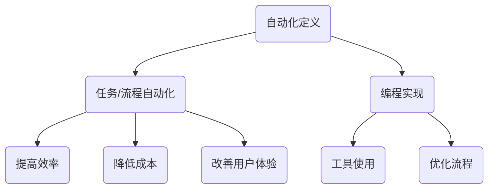

#### 1.2 自动化的应用领域

自动化技术广泛应用于多个领域，包括工业自动化、商业自动化、医疗自动化、家居自动化等。以下是一些典型的自动化应用场景：

1. **工业自动化**：在制造业中，自动化技术被广泛应用于生产线的自动化控制、机器人的精密操作、传感器数据的实时监控等，从而实现高效、安全、可靠的生产。

2. **商业自动化**：在商业领域，自动化技术被应用于库存管理、订单处理、客户服务等方面，以提高业务效率和服务质量。

3. **医疗自动化**：在医疗领域，自动化技术被用于医学影像分析、手术机器人、药物配送等，从而提高诊断的准确性和治疗效果。

4. **家居自动化**：在家庭生活中，自动化技术被应用于智能家居系统，如智能灯光控制、智能门锁、智能家电控制等，从而提高生活便利性和舒适度。

以下是一个Mermaid流程图，展示了自动化的应用领域及其示例：

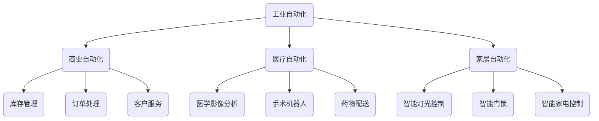

#### 1.3 自动化技术发展趋势

随着人工智能和深度学习技术的发展，自动化技术也在不断演进。以下是自动化技术的一些发展趋势：

1. **人工智能与自动化的深度融合**：人工智能技术，特别是深度学习技术，正在被广泛应用于自动化领域，以实现更智能、更高效的自动化解决方案。

2. **边缘计算与自动化**：随着物联网设备的普及，边缘计算成为自动化技术的一个重要发展方向。边缘计算使得数据处理和分析能够在本地完成，从而降低延迟，提高实时性。

3. **自动化安全与伦理**：随着自动化技术的广泛应用，自动化安全与伦理问题变得越来越重要。自动化系统的安全性和伦理问题需要得到足够的关注和解决。

4. **自动化技术的普及与应用**：随着自动化技术的发展和成本的降低，自动化技术将越来越普及，应用到更多的领域和场景中。

以下是一个Mermaid流程图，展示了自动化技术的主要发展趋势：

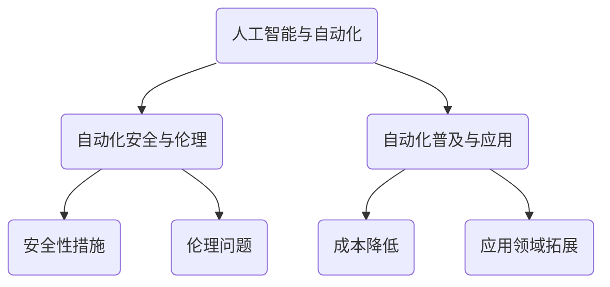

### 第2章：编程基础

#### 2.1 编程语言介绍

编程语言是自动化实现的基础。常见的编程语言包括Python、Java、C++、JavaScript等。每种编程语言都有其独特的特点和适用场景。

1. **Python**：Python是一种高级编程语言，以其简洁的语法和强大的库支持而闻名。Python广泛应用于数据分析、机器学习、自动化等领域。

2. **Java**：Java是一种面向对象的编程语言，具有跨平台性、安全性和稳定性。Java广泛应用于企业级应用、Web开发和自动化。

3. **C++**：C++是一种高效、低级编程语言，适用于需要高性能和系统级编程的场景，如游戏开发、操作系统和自动化。

4. **JavaScript**：JavaScript是一种用于Web开发的脚本语言，也可用于服务器端编程和自动化。

以下是一个Mermaid流程图，展示了常见编程语言及其特点：

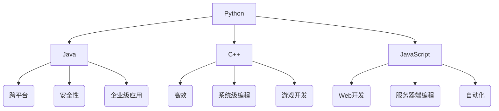

#### 2.2 基础语法与数据结构

编程基础包括基础语法和数据结构。基础语法是编写代码的基本规则，数据结构是存储和组织数据的方式。

1. **基础语法**：基础语法包括变量声明、数据类型、运算符、控制流程（如循环和条件语句）等。

2. **数据结构**：数据结构包括数组、列表、字典、集合、树和图等。这些数据结构在不同的场景下有各自的应用。

以下是一个Mermaid流程图，展示了基础语法和数据结构：

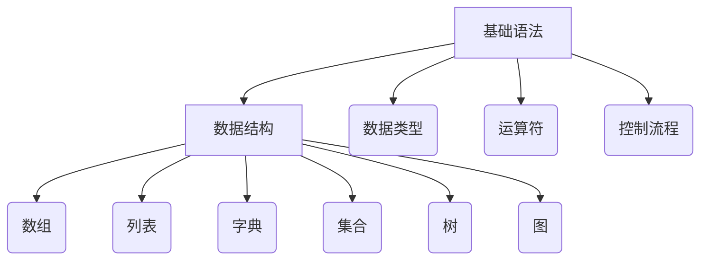

#### 2.3 控制流程与函数定义

控制流程是编程中用于控制代码执行顺序的机制。函数定义是组织代码、提高可重用性的重要手段。

1. **控制流程**：包括顺序执行、条件分支（if-else）、循环（for和while）等。

2. **函数定义**：函数是一段可重复使用的代码块，用于执行特定任务。

以下是一个Mermaid流程图，展示了控制流程和函数定义：

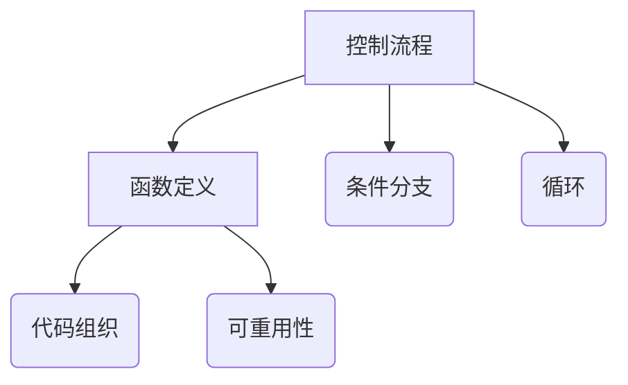

### 第3章：自动化工具

自动化工具是实现自动化任务的关键。常见的自动化工具有Shell脚本、Python脚本和JavaScript脚本等。

#### 3.1 Shell脚本编写

Shell脚本是一种基于命令行的脚本语言，常用于Linux和Unix系统中。Shell脚本可以执行一系列命令，实现自动化任务。

1. **基本语法**：Shell脚本的基本语法包括变量声明、字符串操作、条件分支、循环等。

2. **常见命令**：Shell脚本中常用命令包括echo、grep、awk、sed等。

以下是一个简单的Shell脚本示例：

```shell
#!/bin/bash

# 变量声明
name="John Doe"
age=30

# 打印变量值
echo "Name: $name"
echo "Age: $age"

# 条件分支
if [ $age -ge 18 ]; then
    echo "Adult"
else
    echo "Minor"
fi

# 循环
for i in {1..5}; do
    echo "Loop: $i"
done
```

#### 3.2 Python自动化编程

Python是一种广泛应用的编程语言，具有丰富的库和框架，适用于自动化编程。Python自动化编程可以用于Web自动化、数据处理、文件操作等。

1. **基础库**：Python的基础库包括os、sys、re等，用于文件操作、系统交互、正则表达式处理等。

2. **第三方库**：Python的第三方库如Selenium、BeautifulSoup等，用于Web自动化。

以下是一个简单的Python脚本示例：

```python
import os
import sys
import re

# 文件操作
def read_file(file_path):
    with open(file_path, 'r') as f:
        content = f.read()
        print(content)

# 系统交互
def run_command(command):
    os.system(command)

# 正则表达式
def match_pattern(pattern, text):
    result = re.match(pattern, text)
    if result:
        print(result.group())
    else:
        print("No match")

# 主函数
def main():
    file_path = "example.txt"
    pattern = r"\d+"
    command = "ls -l"

    read_file(file_path)
    run_command(command)
    match_pattern(pattern, "12345")

if __name__ == "__main__":
    main()
```

#### 3.3 JavaScript自动化应用

JavaScript是一种用于Web开发的脚本语言，也可用于自动化。JavaScript自动化应用可以用于网页自动化、浏览器测试等。

1. **基础语法**：JavaScript的基础语法包括变量声明、数据类型、函数定义、控制流程等。

2. **框架**：常用的JavaScript自动化框架包括Selenium、WebdriverIO等。

以下是一个简单的JavaScript脚本示例：

```javascript
const { Builder, By, Key } = require('selenium-webdriver');

async function main() {
    let driver = await new Builder().forBrowser('chrome').build();
    await driver.get('https://example.com');
    
    // 输入搜索关键字
    let searchBox = await driver.findElement(By.id('search_box'));
    await searchBox.sendKeys('automation');

    // 点击搜索按钮
    let searchButton = await driver.findElement(By.id('search_button'));
    await searchButton.click();

    // 获取搜索结果
    let results = await driver.findElements(By.className('search_result'));
    for (let result of results) {
        let title = await result.getAttribute('title');
        console.log(title);
    }

    // 关闭浏览器
    await driver.quit();
}

main();
```

### 第4章：自动化流程设计

自动化流程设计是自动化实施的重要环节。良好的流程设计可以提高自动化系统的效率和可靠性。

#### 4.1 流程图绘制与解读

流程图是一种用于描述任务或流程的图形化工具。在自动化流程设计中，流程图可以帮助我们清晰地理解任务流程和逻辑。

1. **基本符号**：流程图的基本符号包括开始节点、结束节点、处理节点、判断节点、连接线等。

2. **绘制方法**：可以使用Mermaid、Visio等工具绘制流程图。

以下是一个简单的Mermaid流程图示例：

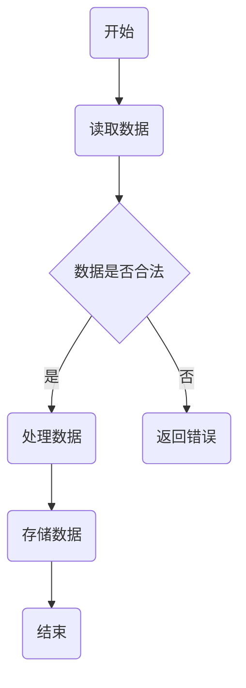

#### 4.2 自动化脚本编写规范

自动化脚本的编写规范对于提高代码的可读性、可维护性和可靠性至关重要。

1. **命名规范**：变量、函数和文件的命名应遵循意义明确、简洁易记的原则。

2. **代码注释**：适当的代码注释可以增强代码的可读性，提高代码的可维护性。

3. **代码结构**：良好的代码结构有助于提高代码的可读性和可维护性。

以下是一个简单的Python脚本示例，展示了编写规范的代码：

```python
# 文件名：example.py

# 导入依赖库
import os
import re

# 函数定义
def read_file(file_path):
    """
    读取指定文件内容
    :param file_path: 文件路径
    :return: 文件内容
    """
    with open(file_path, 'r') as f:
        content = f.read()
        return content

def match_pattern(pattern, text):
    """
    使用正则表达式匹配文本
    :param pattern: 正则表达式模式
    :param text: 文本内容
    :return: 匹配结果
    """
    result = re.match(pattern, text)
    if result:
        return result.group()
    else:
        return "No match"

# 主函数
def main():
    file_path = "example.txt"
    pattern = r"\d+"

    content = read_file(file_path)
    print(match_pattern(pattern, content))

if __name__ == "__main__":
    main()
```

#### 4.3 自动化测试与调试

自动化测试和调试是确保自动化脚本正常运行的重要环节。

1. **自动化测试**：自动化测试包括单元测试、集成测试和性能测试等。可以使用Python的unittest、pytest等框架编写测试用例。

2. **调试**：调试是查找和修复代码错误的过程。可以使用Python的pdb、IDE的调试器等工具进行调试。

以下是一个简单的Python测试用例示例：

```python
import unittest
from example import read_file, match_pattern

class TestAutomation(unittest.TestCase):
    def test_read_file(self):
        file_path = "example.txt"
        content = read_file(file_path)
        self.assertIsNotNone(content)

    def test_match_pattern(self):
        pattern = r"\d+"
        text = "12345"
        result = match_pattern(pattern, text)
        self.assertEqual(result, "12345")

if __name__ == "__main__":
    unittest.main()
```

### 第5章：自动化在实际应用中的案例

自动化技术在各行各业中都有广泛的应用。以下是几个实际应用案例：

#### 5.1 网络自动化

网络自动化主要用于网络设备的管理和维护。以下是一个网络自动化的案例：

**案例**：使用Python脚本自动配置路由器。

**实现**：

1. **获取路由器信息**：使用HTTP API获取路由器的IP地址、端口号和用户名密码。

2. **配置路由器**：通过SSH连接路由器，使用Shell脚本执行配置命令。

3. **测试配置结果**：验证路由器配置是否成功。

以下是一个简单的Python脚本示例：

```python
import requests
from ssh_helper import SSHHelper

def get_router_info():
    url = "http://example.com/api/router"
    response = requests.get(url)
    data = response.json()
    return data['ip'], data['port'], data['username'], data['password']

def configure_router(ip, port, username, password):
    ssh = SSHHelper(ip, port, username, password)
    ssh.execute("ip route add default via 192.168.1.1")
    ssh.execute("ip rule add from 192.168.1.0/24 table 1")

def test_configuration():
    # 测试路由器配置
    pass

if __name__ == "__main__":
    ip, port, username, password = get_router_info()
    configure_router(ip, port, username, password)
    test_configuration()
```

#### 5.2 数据处理自动化

数据处理自动化主要用于批量处理数据，如数据清洗、转换和分析等。以下是一个数据处理自动化的案例：

**案例**：使用Python脚本自动处理CSV文件。

**实现**：

1. **读取CSV文件**：使用pandas库读取CSV文件。

2. **数据清洗**：删除无效数据、填充缺失值、标准化数据等。

3. **数据转换**：将数据处理为适合分析的格式。

4. **数据分析**：使用数据分析库（如numpy、scipy、matplotlib等）进行数据分析。

以下是一个简单的Python脚本示例：

```python
import pandas as pd

def read_csv(file_path):
    df = pd.read_csv(file_path)
    return df

def clean_data(df):
    # 删除无效数据
    df.dropna(inplace=True)
    # 填充缺失值
    df.fillna(0, inplace=True)
    # 标准化数据
    df = (df - df.mean()) / df.std()
    return df

def analyze_data(df):
    # 数据分析
    print(df.describe())

if __name__ == "__main__":
    file_path = "example.csv"
    df = read_csv(file_path)
    df = clean_data(df)
    analyze_data(df)
```

#### 5.3 应用场景分析

自动化技术可以应用于各种场景，如自动化测试、自动化运维、自动化营销等。以下是一个应用场景分析：

**案例**：自动化测试电商平台。

**实现**：

1. **测试需求分析**：分析电商平台的测试需求，包括功能测试、性能测试和安全测试等。

2. **自动化测试框架**：使用自动化测试框架（如Selenium、Appium等）编写测试脚本。

3. **测试执行**：自动化执行测试用例，收集测试结果。

4. **测试报告**：生成测试报告，包括测试覆盖率、缺陷数量等。

以下是一个简单的自动化测试脚本示例：

```python
from selenium import webdriver

def test_cart():
    driver = webdriver.Chrome()
    driver.get("https://example.com")
    
    # 添加商品到购物车
    driver.find_element_by_id("add_to_cart").click()
    
    # 跳转到购物车页面
    driver.find_element_by_link_text("Cart").click()
    
    # 验证购物车中商品数量
    cart = driver.find_element_by_id("cart_count")
    assert int(cart.text) == 1
    
    driver.quit()

if __name__ == "__main__":
    test_cart()
```

### 第6章：深度学习基础

深度学习是自动化技术的一个重要分支。在自动化领域中，深度学习被广泛应用于图像识别、自然语言处理、强化学习等。

#### 6.1 深度学习概述

深度学习是一种基于人工神经网络的机器学习技术，通过多层神经网络进行数据处理和模式识别。深度学习在计算机视觉、自然语言处理、语音识别等领域取得了显著的成果。

以下是一个简单的Mermaid流程图，展示了深度学习的基本概念：

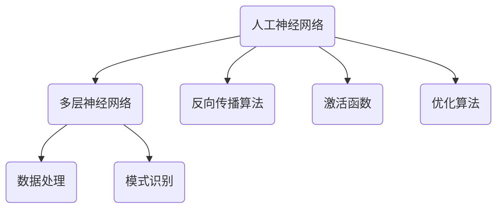

#### 6.2 神经网络基础

神经网络是深度学习的基础。神经网络由多个神经元（节点）组成，每个神经元接收输入信号，通过权重和偏置进行加权求和，然后通过激活函数进行非线性变换。

以下是一个简单的神经网络模型：

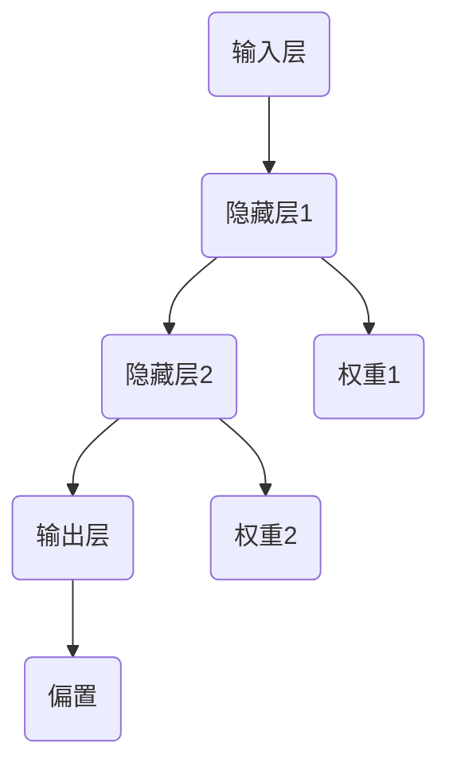

#### 6.3 训练与优化算法

深度学习模型的训练过程主要包括前向传播、反向传播和优化算法。前向传播是将输入信号通过神经网络传递到输出层的过程。反向传播是计算输出层与实际输出之间的误差，然后反向传播误差到每一层，更新权重和偏置。优化算法用于调整权重和偏置，以最小化误差。

以下是一个简单的伪代码，描述了深度学习模型的训练过程：

```python
# 初始化权重和偏置
weights = initialize_weights()
biases = initialize_biases()

# 前向传播
output = forward_propagation(input_data, weights, biases)

# 计算误差
error = compute_error(output, actual_output)

# 反向传播
dweights, dbiases = backward_propagation(input_data, output, error)

# 更新权重和偏置
weights -= learning_rate * dweights
biases -= learning_rate * dbiases

# 迭代训练
for epoch in range(num_epochs):
    # 前向传播
    output = forward_propagation(input_data, weights, biases)

    # 计算误差
    error = compute_error(output, actual_output)

    # 反向传播
    dweights, dbiases = backward_propagation(input_data, output, error)

    # 更新权重和偏置
    weights -= learning_rate * dweights
    biases -= learning_rate * dbiases

    # 打印训练进度
    print(f"Epoch {epoch}: Error {error}")
```

### 第7章：深度学习在自动化中的应用

深度学习在自动化领域中有着广泛的应用。以下是一些典型的应用案例：

#### 7.1 深度学习与自动化的结合点

深度学习与自动化的结合点在于使用深度学习技术解决自动化任务中的数据处理和模式识别问题。以下是一些常见的结合点：

1. **图像识别**：使用深度学习模型对图像进行分类、检测和分割，从而实现图像识别。

2. **自然语言处理**：使用深度学习模型处理文本数据，实现文本分类、情感分析、命名实体识别等任务。

3. **语音识别**：使用深度学习模型对语音信号进行识别和转换，实现语音到文本的转换。

4. **强化学习**：使用深度学习模型实现智能体的自主学习和决策，从而实现自动化控制。

以下是一个简单的Mermaid流程图，展示了深度学习与自动化的结合点：

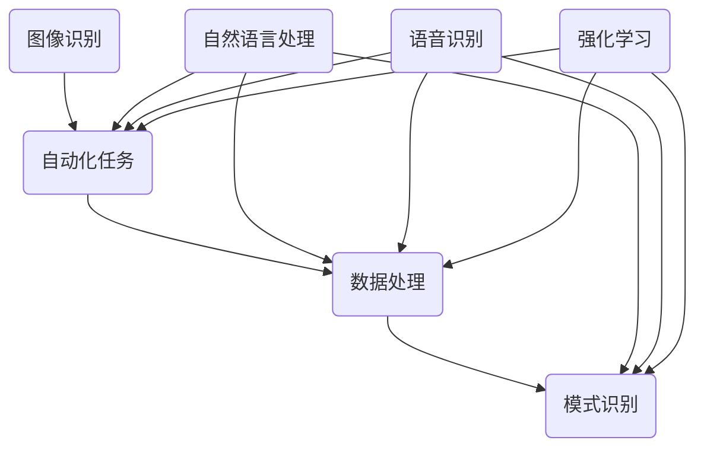

#### 7.2 自动驾驶技术

自动驾驶技术是深度学习在自动化领域中一个重要的应用。自动驾驶系统使用深度学习模型对环境进行感知、理解和决策。

1. **环境感知**：自动驾驶系统通过摄像头、激光雷达等传感器获取环境信息，使用深度学习模型对图像和点云进行分类、检测和分割。

2. **路径规划**：自动驾驶系统使用深度学习模型对道路环境进行理解，规划行驶路径。

3. **控制决策**：自动驾驶系统根据路径规划结果，使用深度学习模型进行控制决策，实现自动驾驶。

以下是一个简单的Mermaid流程图，展示了自动驾驶技术中的深度学习应用：

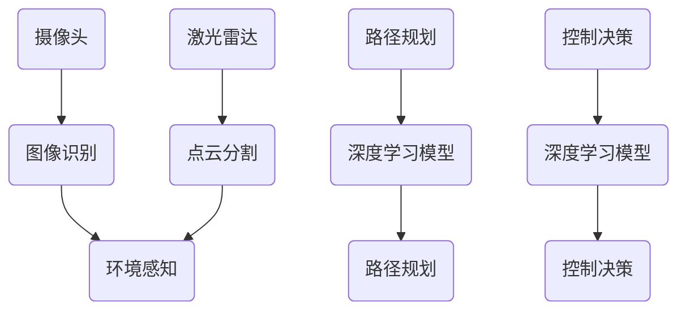

#### 7.3 智能家居自动化

智能家居自动化是深度学习在自动化领域的另一个重要应用。智能家居系统使用深度学习模型对用户行为进行学习和预测，实现智能控制。

1. **行为识别**：智能家居系统通过传感器获取用户行为数据，使用深度学习模型进行行为识别和分类。

2. **场景预测**：智能家居系统根据用户行为数据，使用深度学习模型预测用户需求，实现场景预测。

3. **自动控制**：智能家居系统根据场景预测结果，使用深度学习模型进行自动控制，实现智能家居自动化。

以下是一个简单的Mermaid流程图，展示了智能家居自动化中的深度学习应用：

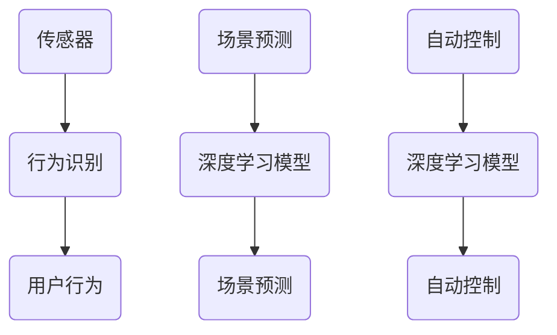

### 第8章：自动化系统开发实战

自动化系统的开发涉及需求分析、设计、实现、测试和维护等多个阶段。以下是一个自动化系统开发的实战案例。

#### 8.1 项目需求分析与设计

**需求分析**：确定自动化系统的目标和功能。例如，开发一个自动化监控系统，实现对工厂生产线的实时监控和数据采集。

**系统设计**：设计系统架构，包括硬件、软件和网络等组成部分。例如，选择合适的传感器、控制器和数据存储方案。

以下是一个简单的Mermaid流程图，展示了需求分析和系统设计：

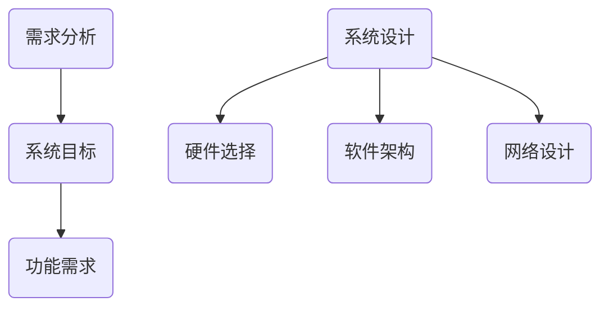

#### 8.2 自动化脚本编写与调试

**编写脚本**：根据需求分析，编写自动化脚本，实现具体功能。例如，使用Python编写一个脚本，用于采集传感器数据并存储到数据库。

**调试脚本**：在开发过程中，对脚本进行调试，确保功能正常运行。可以使用断点调试、日志记录等工具进行调试。

以下是一个简单的Python脚本示例：

```python
import requests
import json

def fetch_data(sensor_url):
    response = requests.get(sensor_url)
    data = response.json()
    return data

def store_data(data, db_url):
    headers = {'Content-Type': 'application/json'}
    response = requests.post(db_url, data=json.dumps(data), headers=headers)
    return response.status_code

if __name__ == "__main__":
    sensor_url = "http://sensor.example.com/data"
    db_url = "http://db.example.com/store"

    data = fetch_data(sensor_url)
    status = store_data(data, db_url)

    print(f"Data stored successfully: {status == 200}")
```

#### 8.3 系统部署与维护

**系统部署**：将自动化脚本部署到生产环境，包括服务器、网络配置和数据库等。

**系统维护**：定期对系统进行维护和更新，确保系统正常运行。例如，更新传感器数据采集脚本、监控系统和数据库。

以下是一个简单的系统部署和维护流程：

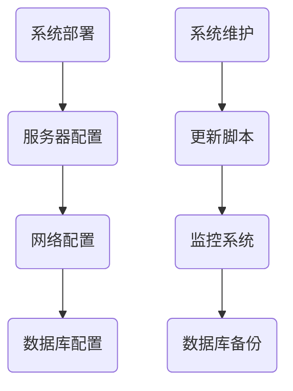

### 第9章：自动化安全与伦理

自动化技术在带来便利的同时，也带来了一些安全与伦理问题。以下是对自动化安全与伦理的探讨。

#### 9.1 自动化安全风险

自动化系统的安全性是确保系统正常运行和信息安全的重要保障。常见的自动化安全风险包括：

1. **系统漏洞**：自动化系统可能存在漏洞，导致黑客攻击和恶意软件入侵。

2. **数据泄露**：自动化系统可能泄露敏感数据，如用户信息、财务数据等。

3. **误操作**：自动化系统可能由于程序错误或外部干扰导致误操作，造成严重后果。

以下是一个简单的Mermaid流程图，展示了自动化安全风险的来源和防范措施：

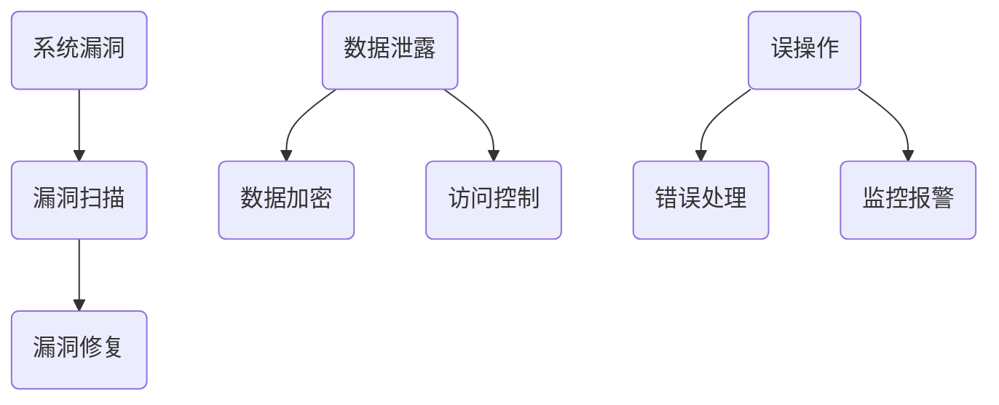

#### 9.2 自动化伦理问题

自动化技术的发展引发了一系列伦理问题，如隐私保护、就业影响、道德决策等。以下是对自动化伦理问题的探讨：

1. **隐私保护**：自动化系统收集和处理大量用户数据，如何保护用户隐私成为一个重要问题。

2. **就业影响**：自动化技术可能导致部分工作岗位消失，引发就业和社会问题。

3. **道德决策**：在自动驾驶、医疗机器人等领域，自动化系统需要进行道德决策，如何确保系统的决策符合伦理标准是一个重要挑战。

以下是一个简单的Mermaid流程图，展示了自动化伦理问题的来源和应对措施：

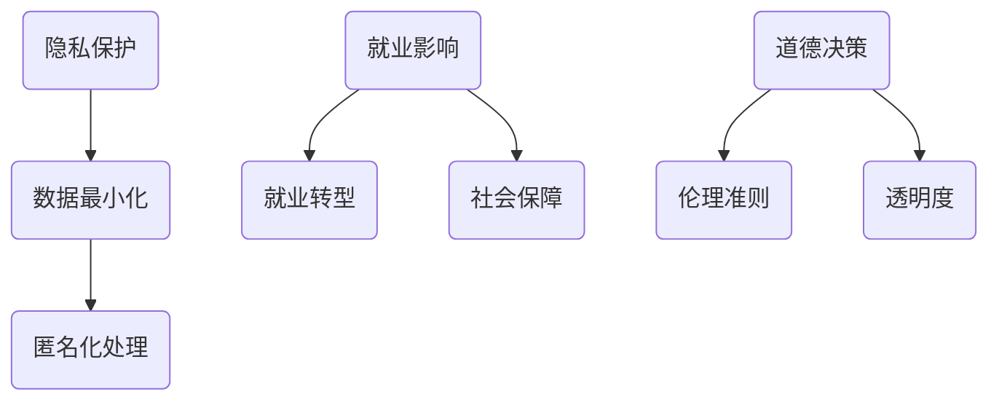

#### 9.3 自动化安全与伦理解决方案

为了解决自动化安全与伦理问题，可以采取以下解决方案：

1. **加强安全防护**：使用加密技术、访问控制、防火墙等手段提高系统安全性。

2. **隐私保护政策**：制定隐私保护政策，确保用户数据的安全和隐私。

3. **就业转型支持**：政府和企业应提供就业转型支持，帮助受自动化影响的人群适应新的工作岗位。

4. **伦理决策框架**：建立伦理决策框架，确保自动化系统在决策过程中符合伦理标准。

以下是一个简单的Mermaid流程图，展示了自动化安全与伦理解决方案：

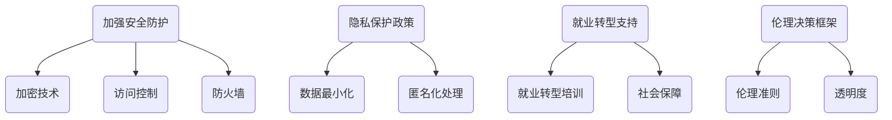

### 第10章：自动化系统性能优化

自动化系统的性能优化是提高系统效率和用户体验的重要手段。以下是对自动化系统性能优化的探讨。

#### 10.1 性能优化方法

自动化系统的性能优化可以从多个方面进行，包括代码优化、硬件优化、数据库优化等。

1. **代码优化**：通过优化算法、减少函数调用、消除冗余代码等方式提高代码性能。

2. **硬件优化**：使用高性能硬件设备，如更快的服务器、更快的网络等，提高系统性能。

3. **数据库优化**：使用高效的数据库查询、索引和缓存策略，提高数据库性能。

以下是一个简单的Mermaid流程图，展示了自动化系统性能优化的方法：

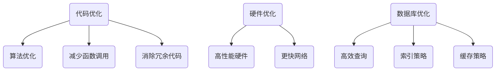

#### 10.2 负载均衡与分布式计算

负载均衡和分布式计算是提高自动化系统性能的重要手段。

1. **负载均衡**：通过将任务分配到多个服务器或计算节点，实现任务的高效执行和资源利用率。

2. **分布式计算**：将大规模任务分解为多个子任务，分布到多个节点并行执行，提高计算效率。

以下是一个简单的Mermaid流程图，展示了负载均衡与分布式计算：

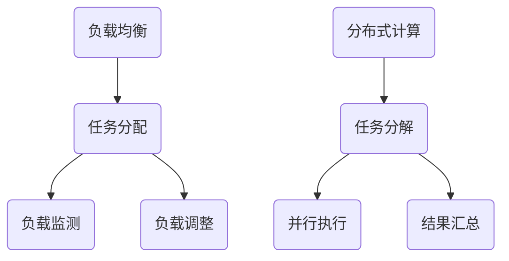

#### 10.3 容器化与微服务架构

容器化和微服务架构是自动化系统性能优化的重要技术。

1. **容器化**：通过容器技术，将应用程序及其依赖环境打包到一个独立的容器中，实现高效部署和运维。

2. **微服务架构**：将大型系统拆分为多个独立的微服务，每个微服务负责一个特定的功能，实现高可扩展性和高可用性。

以下是一个简单的Mermaid流程图，展示了容器化与微服务架构：

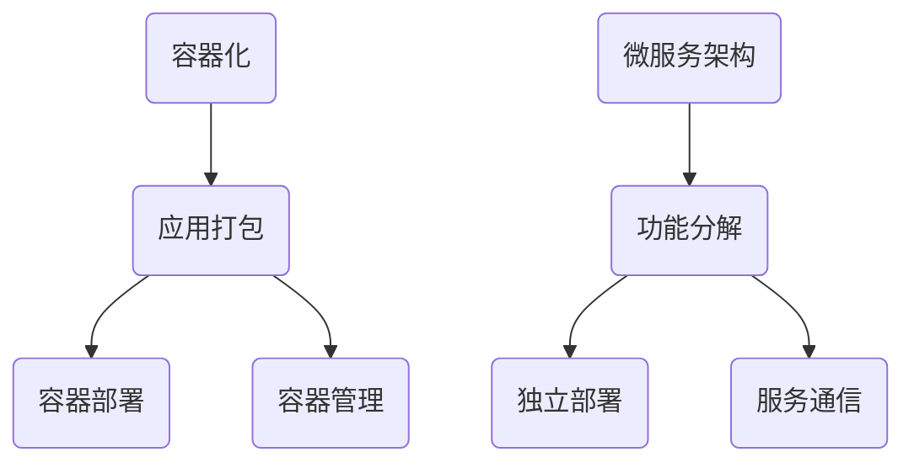

### 第11章：自动化未来发展趋势

随着人工智能和物联网技术的发展，自动化技术将继续演进。以下是对自动化未来发展趋势的探讨。

#### 11.1 自动化与物联网

物联网技术的普及为自动化技术带来了新的机遇。自动化系统将更多地与物联网设备进行集成，实现智能监控、智能控制、智能分析等。

1. **设备互联**：自动化系统将连接更多的物联网设备，实现设备间的数据交换和协同工作。

2. **边缘计算**：随着物联网设备的增多，边缘计算将成为自动化系统的一个重要发展方向，以实现实时数据处理和响应。

3. **智能决策**：自动化系统将结合物联网数据和人工智能技术，实现更智能的决策和优化。

以下是一个简单的Mermaid流程图，展示了自动化与物联网的结合：

```mermaid
graph TD
    A(设备互联) --> B(数据交换)
    A --> C(协同工作)

    D(边缘计算) --> E(实时数据处理)
    D --> F(本地决策)

    G(智能决策) --> H(物联网数据)
    G --> I(人工智能技术)
```

#### 11.2 自动化与人工智能

人工智能技术的发展将进一步提升自动化系统的智能化水平。自动化系统将更多地利用人工智能技术，实现自动化决策、自动化优化和自动化控制。

1. **自动化决策**：利用机器学习、深度学习等技术，实现自动化系统的自主决策和优化。

2. **自动化优化**：利用优化算法和仿真技术，实现自动化系统的性能优化和效率提升。

3. **自动化控制**：利用人工智能技术，实现自动化系统的自主控制和智能调整。

以下是一个简单的Mermaid流程图，展示了自动化与人工智能的结合：

```mermaid
graph TD
    A(自动化决策) --> B(机器学习)
    A --> C(深度学习)

    D(自动化优化) --> E(优化算法)
    D --> F(仿真技术)

    G(自动化控制) --> H(自主控制)
    G --> I(智能调整)
```

#### 11.3 自动化技术的未来展望

自动化技术的未来将充满机遇和挑战。随着人工智能、物联网、云计算等技术的发展，自动化技术将在更多领域得到应用，实现更高效、更智能、更安全的自动化。

1. **智能化**：自动化系统将更加智能化，能够自主学习和优化，实现更高效的自动化。

2. **安全化**：自动化系统的安全性将得到进一步提升，确保系统的稳定性和安全性。

3. **普及化**：自动化技术将更加普及，应用到更多的领域和场景中，改变人类的生活方式和工作方式。

以下是一个简单的Mermaid流程图，展示了自动化技术的未来展望：

```mermaid
graph TD
    A(智能化) --> B(自主学习)
    A --> C(自主优化)

    D(安全化) --> E(稳定性和安全性)
    D --> F(数据保护)

    G(普及化) --> H(广泛应用)
    G --> I(改变生活方式)
```

### 附录A：自动化开发工具与资源

#### A.1 常用自动化工具介绍

1. **Python**：Python是一种广泛应用于自动化开发的编程语言，具有丰富的库和框架。

2. **Shell脚本**：Shell脚本是一种基于命令行的脚本语言，适用于Linux和Unix系统中。

3. **Selenium**：Selenium是一个自动化测试工具，用于Web自动化。

4. **Appium**：Appium是一个移动自动化测试工具，用于Android和iOS应用测试。

5. **Robot Framework**：Robot Framework是一个开源的自动化测试框架，支持多种编程语言。

#### A.2 开发资源与参考资料

1. **官方文档**：查阅官方文档是学习自动化开发的最佳途径。例如，Python官方文档、Selenium官方文档等。

2. **在线教程**：在线教程和课程可以帮助初学者快速入门。例如，Coursera、edX等在线教育平台。

3. **技术社区**：技术社区如Stack Overflow、GitHub等，提供了丰富的技术资源和问题解答。

#### A.3 在线自动化平台与社区

1. **Travis CI**：Travis CI是一个持续集成和自动化测试平台，支持多种编程语言和框架。

2. **Jenkins**：Jenkins是一个开源的持续集成工具，支持自动化构建、测试和部署。

3. **GitHub Actions**：GitHub Actions是GitHub提供的一个自动化工作流程平台，支持多种编程语言和框架。

### 写在最后

本文对自动化技术进行了全面的探讨，从自动化概述、编程基础、自动化工具、自动化流程设计、实际应用案例、深度学习与自动化、自动化系统开发实战、自动化安全与伦理、自动化系统性能优化到未来发展趋势，全面覆盖了自动化技术的各个方面。通过本文，读者可以了解到自动化技术的核心概念、应用场景和未来发展，为自动化技术的发展和应用提供参考。

作者：AI天才研究院/AI Genius Institute & 禅与计算机程序设计艺术 /Zen And The Art of Computer Programming

---

### 完整文章

# 《Andrej Karpathy的自动化见解》

## 关键词：
深度学习，自动化，编程，脚本，神经架构搜索，自动驾驶，智能家居

## 摘要：
本文深入探讨人工智能专家Andrej Karpathy在自动化领域的重要见解。文章分为三个主要部分：自动化入门、深度学习与自动化、以及自动化进阶。首先介绍自动化的基本概念、应用领域和发展趋势。然后，探讨编程基础、自动化工具和流程设计，以及自动化测试与调试。接着，介绍深度学习基础、深度学习在自动化中的应用案例，如自动驾驶和智能家居。此外，文章还探讨自动化系统的开发实战、自动化安全与伦理问题、自动化系统性能优化和未来发展趋势。最后，提供自动化开发工具与资源，以及作者信息。

## 《Andrej Karpathy的自动化见解》目录大纲

### 第一部分：自动化入门

#### 第1章：自动化概述
##### 1.1 自动化的定义与重要性
##### 1.2 自动化的应用领域
##### 1.3 自动化技术发展趋势

#### 第2章：编程基础
##### 2.1 编程语言介绍
##### 2.2 基础语法与数据结构
##### 2.3 控制流程与函数定义

#### 第3章：自动化工具
##### 3.1 Shell脚本编写
##### 3.2 Python自动化编程
##### 3.3 JavaScript自动化应用

#### 第4章：自动化流程设计
##### 4.1 流程图绘制与解读
##### 4.2 自动化脚本编写规范
##### 4.3 自动化测试与调试

#### 第5章：自动化在实际应用中的案例
##### 5.1 网络自动化
##### 5.2 数据处理自动化
##### 5.3 应用场景分析

### 第二部分：深度学习与自动化

#### 第6章：深度学习基础
##### 6.1 深度学习概述
##### 6.2 神经网络基础
##### 6.3 训练与优化算法

#### 第7章：深度学习在自动化中的应用
##### 7.1 深度学习与自动化的结合点
##### 7.2 自动驾驶技术
##### 7.3 智能家居自动化

#### 第8章：自动化系统开发实战
##### 8.1 项目需求分析与设计
##### 8.2 自动化脚本编写与调试
##### 8.3 系统部署与维护

### 第三部分：自动化进阶

#### 第9章：自动化安全与伦理
##### 9.1 自动化安全风险
##### 9.2 自动化伦理问题
##### 9.3 自动化安全与伦理解决方案

#### 第10章：自动化系统性能优化
##### 10.1 性能优化方法
##### 10.2 负载均衡与分布式计算
##### 10.3 容器化与微服务架构

#### 第11章：自动化未来发展趋势
##### 11.1 自动化与物联网
##### 11.2 自动化与人工智能
##### 11.3 自动化技术的未来展望

### 附录

#### 附录A：自动化开发工具与资源
##### A.1 常用自动化工具介绍
##### A.2 开发资源与参考资料
##### A.3 在线自动化平台与社区

### 写在最后

在本文中，我们将跟随Andrej Karpathy的脚步，深入探讨自动化的奥秘。我们将逐步了解自动化的基础，如何使用编程语言实现自动化，以及如何将深度学习技术应用于自动化。此外，我们还将探讨自动化的安全和伦理问题，以及如何优化自动化系统的性能。最后，我们将展望自动化技术的未来发展趋势。通过这篇文章，读者将获得对自动化技术的全面理解和深刻洞察，为未来的自动化之路打下坚实的基础。

---

## 第一部分：自动化入门

### 第1章：自动化概述

自动化是指通过计算机程序或其他技术来实现任务或过程的自动化执行，从而减少人工干预和劳动力成本。自动化技术在各个领域都有广泛的应用，从工业自动化到商业自动化，再到智能家居自动化，都离不开自动化的身影。在本章中，我们将首先介绍自动化的定义与重要性，然后探讨自动化的应用领域，最后分析自动化技术的发展趋势。

#### 1.1 自动化的定义与重要性

自动化技术的定义可以从广义和狭义两个方面来理解。从广义上讲，自动化是指通过技术手段使生产、管理、服务等过程实现自动化，从而提高生产效率、降低成本、改善用户体验。在信息技术领域，自动化技术主要指的是利用计算机程序来实现任务的自动化执行。这种自动化通常涉及到编程、脚本编写、流程设计等环节。

从狭义上讲，自动化是指利用计算机程序或脚本语言来实现特定任务的自动化执行。例如，通过编写Shell脚本、Python脚本或JavaScript脚本来自动化网络爬虫、数据采集、文件处理等任务。这种自动化技术更多地应用于软件开发、运维管理和日常工作中。

自动化的重要性体现在以下几个方面：

1. **提高生产效率**：自动化技术可以代替人类完成重复性的任务，从而减少错误和疲劳，提高工作效率。例如，在制造业中，自动化生产线可以大大提高生产效率，降低生产成本。

2. **降低运营成本**：自动化技术可以减少人力成本和设备维护成本，从而降低运营成本。例如，在商业领域，自动化库存管理、订单处理和客户服务可以降低运营成本，提高业务效率。

3. **改善用户体验**：自动化技术可以提供更高效、更便捷的服务，从而改善用户体验。例如，在智能家居中，自动化照明、温控和安防系统可以提高居住舒适度，减少人为错误。

以下是一个简单的Mermaid流程图，展示了自动化的基本概念和流程：

```mermaid
graph TD
    A(自动化定义) --> B(任务/流程自动化)
    B --> C(提高效率)
    B --> D(降低成本)
    B --> E(改善用户体验)
    A --> F(编程实现)
    F --> G(工具使用)
    F --> H(优化流程)
```

#### 1.2 自动化的应用领域

自动化技术广泛应用于各个领域，下面列举一些典型的应用场景：

1. **工业自动化**：在制造业中，自动化技术被广泛应用于生产线的自动化控制、机器人的精密操作、传感器数据的实时监控等，从而实现高效、安全、可靠的生产。

2. **商业自动化**：在商业领域，自动化技术被应用于库存管理、订单处理、客户服务等方面，以提高业务效率和服务质量。

3. **医疗自动化**：在医疗领域，自动化技术被用于医学影像分析、手术机器人、药物配送等，从而提高诊断的准确性和治疗效果。

4. **家居自动化**：在家庭生活中，自动化技术被应用于智能家居系统，如智能灯光控制、智能门锁、智能家电控制等，从而提高生活便利性和舒适度。

5. **金融自动化**：在金融领域，自动化技术被用于交易执行、风险管理、客户服务等，从而提高交易效率和服务质量。

6. **交通自动化**：在交通领域，自动化技术被用于自动驾驶、智能交通信号控制、车辆监控等，从而提高交通效率和安全性。

以下是一个Mermaid流程图，展示了自动化的应用领域及其示例：

```mermaid
graph TD
    A(工业自动化) --> B(生产线控制)
    A --> C(机器人操作)
    A --> D(传感器监控)

    B(商业自动化) --> E(库存管理)
    B --> F(订单处理)
    B --> G(客户服务)

    C(医疗自动化) --> H(医学影像分析)
    C --> I(手术机器人)
    C --> J(药物配送)

    D(家居自动化) --> K(智能灯光控制)
    D --> L(智能门锁)
    D --> M(智能家电控制)

    E(金融自动化) --> N(交易执行)
    E --> O(风险管理)
    E --> P(客户服务)

    F(交通自动化) --> Q(自动驾驶)
    F --> R(智能交通信号控制)
    F --> S(车辆监控)
```

#### 1.3 自动化技术发展趋势

随着人工智能和深度学习技术的发展，自动化技术也在不断演进。以下是自动化技术的一些发展趋势：

1. **人工智能与自动化的深度融合**：人工智能技术，特别是深度学习技术，正在被广泛应用于自动化领域，以实现更智能、更高效的自动化解决方案。

2. **边缘计算与自动化**：随着物联网设备的普及，边缘计算成为自动化技术的一个重要发展方向。边缘计算使得数据处理和分析能够在本地完成，从而降低延迟，提高实时性。

3. **自动化安全与伦理**：随着自动化技术的广泛应用，自动化安全与伦理问题变得越来越重要。自动化系统的安全性和伦理问题需要得到足够的关注和解决。

4. **自动化技术的普及与应用**：随着自动化技术的发展和成本的降低，自动化技术将越来越普及，应用到更多的领域和场景中。

以下是一个Mermaid流程图，展示了自动化技术的主要发展趋势：

```mermaid
graph TD
    A(人工智能与自动化) --> B(深度学习应用)
    A --> C(边缘计算应用)

    B(自动化安全与伦理) --> C1(安全性措施)
    B --> C2(伦理问题)

    C(自动化普及与应用) --> D(成本降低)
    C --> E(应用领域拓展)
```

### 第2章：编程基础

编程基础是掌握自动化技术的基础。在本章中，我们将介绍编程基础，包括编程语言介绍、基础语法与数据结构、控制流程与函数定义。这些基础概念对于编写自动化脚本和程序至关重要。

#### 2.1 编程语言介绍

编程语言是编写自动化脚本和程序的基础工具。常见的编程语言包括Python、Java、C++、JavaScript等。每种编程语言都有其独特的特点和应用场景。

1. **Python**：Python是一种高级编程语言，以其简洁的语法和强大的库支持而闻名。Python广泛应用于数据分析、机器学习、自动化等领域。

2. **Java**：Java是一种面向对象的编程语言，具有跨平台性、安全性和稳定性。Java广泛应用于企业级应用、Web开发和自动化。

3. **C++**：C++是一种高效、低级编程语言，适用于需要高性能和系统级编程的场景，如游戏开发、操作系统和自动化。

4. **JavaScript**：JavaScript是一种用于Web开发的脚本语言，也可用于服务器端编程和自动化。

以下是一个Mermaid流程图，展示了常见编程语言及其特点：

```mermaid
graph TD
    A[Python] --> B(简洁语法)
    A --> C(数据分析)
    A --> D(机器学习)

    B[Java] --> E(跨平台)
    B --> F(安全性)
    B --> G(企业级应用)

    C[C++] --> H(高效)
    C --> I(系统级编程)
    C --> J(游戏开发)

    D[JavaScript] --> K(Web开发)
    D --> L(服务器端编程)
    D --> M(自动化)
```

#### 2.2 基础语法与数据结构

编程基础包括基础语法和数据结构。基础语法是编写代码的基本规则，数据结构是存储和组织数据的方式。

1. **基础语法**：基础语法包括变量声明、数据类型、运算符、控制流程（如循环和条件语句）等。

2. **数据结构**：数据结构包括数组、列表、字典、集合、树和图等。这些数据结构在不同的场景下有各自的应用。

以下是一个Mermaid流程图，展示了基础语法和数据结构：

```mermaid
graph TD
    A[基础语法] --> B(变量声明)
    A --> C(数据类型)
    A --> D(运算符)
    A --> E(控制流程)

    B[数据结构] --> F(数组)
    B --> G(列表)
    B --> H(字典)
    B --> I(集合)
    B --> J(树)
    B --> K(图)
```

#### 2.3 控制流程与函数定义

控制流程是编程中用于控制代码执行顺序的机制。函数定义是组织代码、提高可重用性的重要手段。

1. **控制流程**：包括顺序执行、条件分支（if-else）、循环（for和while）等。

2. **函数定义**：函数是一段可重复使用的代码块，用于执行特定任务。

以下是一个Mermaid流程图，展示了控制流程和函数定义：

```mermaid
graph TD
    A[控制流程] --> B(顺序执行)
    A --> C(条件分支)
    A --> D(循环)

    B[函数定义] --> E(代码组织)
    B --> F(可重用性)
```

### 第3章：自动化工具

自动化工具是实现自动化任务的关键。常见的自动化工具有Shell脚本、Python脚本和JavaScript脚本等。在本章中，我们将详细介绍这些自动化工具，包括Shell脚本编写、Python自动化编程、JavaScript自动化应用。

#### 3.1 Shell脚本编写

Shell脚本是一种基于命令行的脚本语言，常用于Linux和Unix系统中。Shell脚本可以执行一系列命令，实现自动化任务。

1. **基本语法**：Shell脚本的基本语法包括变量声明、字符串操作、条件分支、循环等。

2. **常见命令**：Shell脚本中常用命令包括echo、grep、awk、sed等。

以下是一个简单的Shell脚本示例：

```shell
#!/bin/bash

# 变量声明
name="John Doe"
age=30

# 打印变量值
echo "Name: $name"
echo "Age: $age"

# 条件分支
if [ $age -ge 18 ]; then
    echo "Adult"
else
    echo "Minor"
fi

# 循环
for i in {1..5}; do
    echo "Loop: $i"
done
```

#### 3.2 Python自动化编程

Python是一种广泛应用的编程语言，具有丰富的库和框架，适用于自动化编程。Python自动化编程可以用于Web自动化、数据处理、文件操作等。

1. **基础库**：Python的基础库包括os、sys、re等，用于文件操作、系统交互、正则表达式处理等。

2. **第三方库**：Python的第三方库如Selenium、BeautifulSoup等，用于Web自动化。

以下是一个简单的Python脚本示例：

```python
import os
import sys
import re

# 文件操作
def read_file(file_path):
    with open(file_path, 'r') as f:
        content = f.read()
        print(content)

# 系统交互
def run_command(command):
    os.system(command)

# 正则表达式
def match_pattern(pattern, text):
    result = re.match(pattern, text)
    if result:
        print(result.group())
    else:
        print("No match")

# 主函数
def main():
    file_path = "example.txt"
    pattern = r"\d+"
    command = "ls -l"

    read_file(file_path)
    run_command(command)
    match_pattern(pattern, "12345")

if __name__ == "__main__":
    main()
```

#### 3.3 JavaScript自动化应用

JavaScript是一种用于Web开发的脚本语言，也可用于自动化。JavaScript自动化应用可以用于网页自动化、浏览器测试等。

1. **基础语法**：JavaScript的基础语法包括变量声明、数据类型、函数定义、控制流程等。

2. **框架**：常用的JavaScript自动化框架包括Selenium、WebdriverIO等。

以下是一个简单的JavaScript脚本示例：

```javascript
const { Builder, By, Key } = require('selenium-webdriver');

async function main() {
    let driver = await new Builder().forBrowser('chrome').build();
    await driver.get('https://example.com');
    
    // 输入搜索关键字
    let searchBox = await driver.findElement(By.id('search_box'));
    await searchBox.sendKeys('automation');

    // 点击搜索按钮
    let searchButton = await driver.findElement(By.id('search_button'));
    await searchButton.click();

    // 获取搜索结果
    let results = await driver.findElements(By.className('search_result'));
    for (let result of results) {
        let title = await result.getAttribute('title');
        console.log(title);
    }

    // 关闭浏览器
    await driver.quit();
}

main();
```

### 第4章：自动化流程设计

自动化流程设计是自动化实施的重要环节。良好的流程设计可以提高自动化系统的效率和可靠性。

#### 4.1 流程图绘制与解读

流程图是一种用于描述任务或流程的图形化工具。在自动化流程设计中，流程图可以帮助我们清晰地理解任务流程和逻辑。

1. **基本符号**：流程图的基本符号包括开始节点、结束节点、处理节点、判断节点、连接线等。

2. **绘制方法**：可以使用Mermaid、Visio等工具绘制流程图。

以下是一个简单的Mermaid流程图示例：

```mermaid
graph TD
    A(开始) --> B(读取数据)
    B --> C{数据是否合法}
    C -->|是| D(处理数据)
    C -->|否| E(返回错误)
    D --> F(存储数据)
    F --> G(结束)
```

#### 4.2 自动化脚本编写规范

自动化脚本的编写规范对于提高代码的可读性、可维护性和可靠性至关重要。

1. **命名规范**：变量、函数和文件的命名应遵循意义明确、简洁易记的原则。

2. **代码注释**：适当的代码注释可以增强代码的可读性，提高代码的可维护性。

3. **代码结构**：良好的代码结构有助于提高代码的可读性和可维护性。

以下是一个简单的Python脚本示例，展示了编写规范的代码：

```python
# 文件名：example.py

# 导入依赖库
import os
import re

# 函数定义
def read_file(file_path):
    """
    读取指定文件内容
    :param file_path: 文件路径
    :return: 文件内容
    """
    with open(file_path, 'r') as f:
        content = f.read()
        return content

def match_pattern(pattern, text):
    """
    使用正则表达式匹配文本
    :param pattern: 正则表达式模式
    :param text: 文本内容
    :return: 匹配结果
    """
    result = re.match(pattern, text)
    if result:
        return result.group()
    else:
        return "No match"

# 主函数
def main():
    file_path = "example.txt"
    pattern = r"\d+"

    content = read_file(file_path)
    print(match_pattern(pattern, content))

if __name__ == "__main__":
    main()
```

#### 4.3 自动化测试与调试

自动化测试和调试是确保自动化脚本正常运行的重要环节。

1. **自动化测试**：自动化测试包括单元测试、集成测试和性能测试等。可以使用Python的unittest、pytest等框架编写测试用例。

2. **调试**：调试是查找和修复代码错误的过程。可以使用Python的pdb、IDE的调试器等工具进行调试。

以下是一个简单的Python测试用例示例：

```python
import unittest
from example import read_file, match_pattern

class TestAutomation(unittest.TestCase):
    def test_read_file(self):
        file_path = "example.txt"
        content = read_file(file_path)
        self.assertIsNotNone(content)

    def test_match_pattern(self):
        pattern = r"\d+"
        text = "12345"
        result = match_pattern(pattern, text)
        self.assertEqual(result, "12345")

if __name__ == "__main__":
    unittest.main()
```

### 第5章：自动化在实际应用中的案例

自动化技术在各行各业中都有广泛的应用。在本章中，我们将探讨自动化在实际应用中的几个案例，包括网络自动化、数据处理自动化和应用场景分析。

#### 5.1 网络自动化

网络自动化主要用于网络设备的管理和维护。在本节中，我们将介绍一个网络自动化的案例。

**案例**：使用Python脚本自动配置路由器。

**实现**：

1. **获取路由器信息**：使用HTTP API获取路由器的IP地址、端口号和用户名密码。

2. **配置路由器**：通过SSH连接路由器，使用Shell脚本执行配置命令。

3. **测试配置结果**：验证路由器配置是否成功。

以下是一个简单的Python脚本示例：

```python
import requests
from ssh_helper import SSHHelper

def get_router_info():
    url = "http://example.com/api/router"
    response = requests.get(url)
    data = response.json()
    return data['ip'], data['port'], data['username'], data['password']

def configure_router(ip, port, username, password):
    ssh = SSHHelper(ip, port, username, password)
    ssh.execute("ip route add default via 192.168.1.1")
    ssh.execute("ip rule add from 192.168.1.0/24 table 1")

def test_configuration():
    # 测试路由器配置
    pass

if __name__ == "__main__":
    ip, port, username, password = get_router_info()
    configure_router(ip, port, username, password)
    test_configuration()
```

#### 5.2 数据处理自动化

数据处理自动化主要用于批量处理数据，如数据清洗、转换和分析等。在本节中，我们将介绍一个数据处理自动化的案例。

**案例**：使用Python脚本自动处理CSV文件。

**实现**：

1. **读取CSV文件**：使用pandas库读取CSV文件。

2. **数据清洗**：删除无效数据、填充缺失值、标准化数据等。

3. **数据转换**：将数据处理为适合分析的格式。

4. **数据分析**：使用数据分析库（如numpy、scipy、matplotlib等）进行数据分析。

以下是一个简单的Python脚本示例：

```python
import pandas as pd

def read_csv(file_path):
    df = pd.read_csv(file_path)
    return df

def clean_data(df):
    # 删除无效数据
    df.dropna(inplace=True)
    # 填充缺失值
    df.fillna(0, inplace=True)
    # 标准化数据
    df = (df - df.mean()) / df.std()
    return df

def analyze_data(df):
    # 数据分析
    print(df.describe())

if __name__ == "__main__":
    file_path = "example.csv"
    df = read_csv(file_path)
    df = clean_data(df)
    analyze_data(df)
```

#### 5.3 应用场景分析

自动化技术可以应用于各种场景，如自动化测试、自动化运维、自动化营销等。在本节中，我们将分析一个自动化测试的案例。

**案例**：自动化测试电商平台。

**实现**：

1. **测试需求分析**：分析电商平台的测试需求，包括功能测试、性能测试和安全测试等。

2. **自动化测试框架**：使用自动化测试框架（如Selenium、Appium等）编写测试脚本。

3. **测试执行**：自动化执行测试用例，收集测试结果。

4. **测试报告**：生成测试报告，包括测试覆盖率、缺陷数量等。

以下是一个简单的自动化测试脚本示例：

```python
from selenium import webdriver

def test_cart():
    driver = webdriver.Chrome()
    driver.get("https://example.com")
    
    # 添加商品到购物车
    driver.find_element_by_id("add_to_cart").click()
    
    # 跳转到购物车页面
    driver.find_element_by_link_text("Cart").click()
    
    # 验证购物车中商品数量
    cart = driver.find_element_by_id("cart_count")
    assert int(cart.text) == 1
    
    driver.quit()

if __name__ == "__main__":
    test_cart()
```

### 第6章：深度学习基础

深度学习是自动化技术的一个重要分支。在自动化领域中，深度学习被广泛应用于图像识别、自然语言处理、强化学习等。

#### 6.1 深度学习概述

深度学习是一种基于人工神经网络的机器学习技术，通过多层神经网络进行数据处理和模式识别。深度学习在计算机视觉、自然语言处理、语音识别等领域取得了显著的成果。

以下是一个简单的Mermaid流程图，展示了深度学习的基本概念：

```mermaid
graph TD
    A(人工神经网络) --> B(多层神经网络)
    B --> C(数据处理)
    B --> D(模式识别)
    A --> E(反向传播算法)
    A --> F(激活函数)
    A --> G(优化算法)
```

#### 6.2 神经网络基础

神经网络是深度学习的基础。神经网络由多个神经元（节点）组成，每个神经元接收输入信号，通过权重和偏置进行加权求和，然后通过激活函数进行非线性变换。

以下是一个简单的神经网络模型：

```mermaid
graph TD
    A(输入层) --> B(隐藏层1)
    B --> C(隐藏层2)
    C --> D(输出层)
    B --> E(权重1)
    C --> F(权重2)
    D --> G(偏置)
```

#### 6.3 训练与优化算法

深度学习模型的训练过程主要包括前向传播、反向传播和优化算法。前向传播是将输入信号通过神经网络传递到输出层的过程。反向传播是计算输出层与实际输出之间的误差，然后反向传播误差到每一层，更新权重和偏置。优化算法用于调整权重和偏置，以最小化误差。

以下是一个简单的伪代码，描述了深度学习模型的训练过程：

```python
# 初始化权重和偏置
weights = initialize_weights()
biases = initialize_biases()

# 前向传播
output = forward_propagation(input_data, weights, biases)

# 计算误差
error = compute_error(output, actual_output)

# 反向传播
dweights, dbiases = backward_propagation(input_data, output, error)

# 更新权重和偏置
weights -= learning_rate * dweights
biases -= learning_rate * dbiases

# 迭代训练
for epoch in range(num_epochs):
    # 前向传播
    output = forward_propagation(input_data, weights, biases)

    # 计算误差
    error = compute_error(output, actual_output)

    # 反向传播
    dweights, dbiases = backward_propagation(input_data, output, error)

    # 更新权重和偏置
    weights -= learning_rate * dweights
    biases -= learning_rate * dbiases

    # 打印训练进度
    print(f"Epoch {epoch}: Error {error}")
```

### 第7章：深度学习在自动化中的应用

深度学习在自动化领域中有着广泛的应用。在本章中，我们将探讨深度学习在自动化中的应用，包括自动驾驶技术、智能家居自动化等。

#### 7.1 深度学习与自动化的结合点

深度学习与自动化的结合点在于使用深度学习技术解决自动化任务中的数据处理和模式识别问题。以下是一些常见的结合点：

1. **图像识别**：使用深度学习模型对图像进行分类、检测和分割，从而实现图像识别。

2. **自然语言处理**：使用深度学习模型处理文本数据，实现文本分类、情感分析、命名实体识别等任务。

3. **语音识别**：使用深度学习模型对语音信号进行识别和转换，实现语音到文本的转换。

4. **强化学习**：使用深度学习模型实现智能体的自主学习和决策，从而实现自动化控制。

以下是一个简单的Mermaid流程图，展示了深度学习与自动化的结合点：

```mermaid
graph TD
    A(图像识别) --> B(自动化任务)
    B --> C(数据处理)
    B --> D(模式识别)

    E(自然语言处理) --> B
    E --> C
    E --> D

    F(语音识别) --> B
    F --> C
    F --> D

    G(强化学习) --> B
    G --> C
    G --> D
```

#### 7.2 自动驾驶技术

自动驾驶技术是深度学习在自动化领域中一个重要的应用。自动驾驶系统使用深度学习模型对环境进行感知、理解和决策。

1. **环境感知**：自动驾驶系统通过摄像头、激光雷达等传感器获取环境信息，使用深度学习模型对图像和点云进行分类、检测和分割。

2. **路径规划**：自动驾驶系统使用深度学习模型对道路环境进行理解，规划行驶路径。

3. **控制决策**：自动驾驶系统根据路径规划结果，使用深度学习模型进行控制决策，实现自动驾驶。

以下是一个简单的Mermaid流程图，展示了自动驾驶技术中的深度学习应用：

```mermaid
graph TD
    A(摄像头) --> B(图像识别)
    B --> C(环境感知)

    D(激光雷达) --> E(点云分割)
    E --> C

    F(路径规划) --> G(深度学习模型)
    G --> H(路径规划)

    I(控制决策) --> J(深度学习模型)
    J --> K(控制决策)
```

#### 7.3 智能家居自动化

智能家居自动化是深度学习在自动化领域的另一个重要应用。智能家居系统使用深度学习模型对用户行为进行学习和预测，实现智能控制。

1. **行为识别**：智能家居系统通过传感器获取用户行为数据，使用深度学习模型进行行为识别和分类。

2. **场景预测**：智能家居系统根据用户行为数据，使用深度学习模型预测用户需求，实现场景预测。

3. **自动控制**：智能家居系统根据场景预测结果，使用深度学习模型进行自动控制，实现智能家居自动化。

以下是一个简单的Mermaid流程图，展示了智能家居自动化中的深度学习应用：

```mermaid
graph TD
    A(传感器) --> B(行为识别)
    B --> C(用户行为)

    D(场景预测) --> E(深度学习模型)
    E --> F(场景预测)

    G(自动控制) --> H(深度学习模型)
    H --> I(自动控制)
```

### 第8章：自动化系统开发实战

自动化系统的开发涉及需求分析、设计、实现、测试和维护等多个阶段。在本章中，我们将通过一个自动化系统开发实战案例，详细介绍每个阶段的具体实现。

#### 8.1 项目需求分析与设计

**需求分析**：确定自动化系统的目标和功能。例如，开发一个自动化监控系统，实现对工厂生产线的实时监控和数据采集。

**系统设计**：设计系统架构，包括硬件、软件和网络等组成部分。例如，选择合适的传感器、控制器和数据存储方案。

以下是一个简单的Mermaid流程图，展示了需求分析和系统设计：

```mermaid
graph TD
    A(需求分析) --> B(系统目标)
    B --> C(功能需求)

    D(系统设计) --> E(硬件选择)
    D --> F(软件架构)
    D --> G(网络设计)
```

#### 8.2 自动化脚本编写与调试

**编写脚本**：根据需求分析，编写自动化脚本，实现具体功能。例如，使用Python编写一个脚本，用于采集传感器数据并存储到数据库。

**调试脚本**：在开发过程中，对脚本进行调试，确保功能正常运行。可以使用断点调试、日志记录等工具进行调试。

以下是一个简单的Python脚本示例：

```python
import requests
import json

def fetch_data(sensor_url):
    response = requests.get(sensor_url)
    data = response.json()
    return data

def store_data(data, db_url):
    headers = {'Content-Type': 'application/json'}
    response = requests.post(db_url, data=json.dumps(data), headers=headers)
    return response.status_code

if __name__ == "__main__":
    sensor_url = "http://sensor.example.com/data"
    db_url = "http://db.example.com/store"

    data = fetch_data(sensor_url)
    status = store_data(data, db_url)

    print(f"Data stored successfully: {status == 200}")
```

#### 8.3 系统部署与维护

**系统部署**：将自动化脚本部署到生产环境，包括服务器、网络配置和数据库等。

**系统维护**：定期对系统进行维护和更新，确保系统正常运行。例如，更新传感器数据采集脚本、监控系统和数据库。

以下是一个简单的系统部署和维护流程：

```mermaid
graph TD
    A(系统部署) --> B(服务器配置)
    B --> C(网络配置)
    C --> D(数据库配置)

    E(系统维护) --> F(更新脚本)
    F --> G(监控系统)
    G --> H(数据库备份)
```

### 第9章：自动化安全与伦理

自动化技术在带来便利的同时，也带来了一些安全与伦理问题。在本章中，我们将探讨自动化安全与伦理问题，包括自动化安全风险、自动化伦理问题以及自动化安全与伦理解决方案。

#### 9.1 自动化安全风险

自动化系统的安全性是确保系统正常运行和信息安全的重要保障。常见的自动化安全风险包括：

1. **系统漏洞**：自动化系统可能存在漏洞，导致黑客攻击和恶意软件入侵。

2. **数据泄露**：自动化系统可能泄露敏感数据，如用户信息、财务数据等。

3. **误操作**：自动化系统可能由于程序错误或外部干扰导致误操作，造成严重后果。

以下是一个简单的Mermaid流程图，展示了自动化安全风险的来源和防范措施：

```mermaid
graph TD
    A(系统漏洞) --> B(漏洞扫描)
    B --> C(漏洞修复)

    D(数据泄露) --> E(数据加密)
    D --> F(访问控制)

    G(误操作) --> H(错误处理)
    G --> I(监控报警)
```

#### 9.2 自动化伦理问题

自动化技术的发展引发了一系列伦理问题，如隐私保护、就业影响、道德决策等。以下是对自动化伦理问题的探讨：

1. **隐私保护**：自动化系统收集和处理大量用户数据，如何保护用户隐私成为一个重要问题。

2. **就业影响**：自动化技术可能导致部分工作岗位消失，引发就业和社会问题。

3. **道德决策**：在自动驾驶、医疗机器人等领域，自动化系统需要进行道德决策，如何确保系统的决策符合伦理标准是一个重要挑战。

以下是一个简单的Mermaid流程图，展示了自动化伦理问题的来源和应对措施：

```mermaid
graph TD
    A(隐私保护) --> B(数据最小化)
    B --> C(匿名化处理)

    D(就业影响) --> E(就业转型)
    D --> F(社会保障)

    G(道德决策) --> H(伦理准则)
    G --> I(透明度)
```

#### 9.3 自动化安全与伦理解决方案

为了解决自动化安全与伦理问题，可以采取以下解决方案：

1. **加强安全防护**：使用加密技术、访问控制、防火墙等手段提高系统安全性。

2. **隐私保护政策**：制定隐私保护政策，确保用户数据的安全和隐私。

3. **就业转型支持**：政府和企业应提供就业转型支持，帮助受自动化影响的人群适应新的工作岗位。

4. **伦理决策框架**：建立伦理决策框架，确保自动化系统在决策过程中符合伦理标准。

以下是一个简单的Mermaid流程图，展示了自动化安全与伦理解决方案：

```mermaid
graph TD
    A(加强安全防护) --> B(加密技术)
    A --> C(访问控制)
    A --> D(防火墙)

    E(隐私保护政策) --> F(数据最小化)
    E --> G(匿名化处理)

    H(就业转型支持) --> I(就业转型培训)
    H --> J(社会保障)

    K(伦理决策框架) --> L(伦理准则)
    K --> M(透明度)
```

### 第10章：自动化系统性能优化

自动化系统的性能优化是提高系统效率和用户体验的重要手段。在本章中，我们将探讨自动化系统性能优化，包括性能优化方法、负载均衡与分布式计算、容器化与微服务架构。

#### 10.1 性能优化方法

自动化系统的性能优化可以从多个方面进行，包括代码优化、硬件优化、数据库优化等。

1. **代码优化**：通过优化算法、减少函数调用、消除冗余代码等方式提高代码性能。

2. **硬件优化**：使用高性能硬件设备，如更快的服务器、更快的网络等，提高系统性能。

3. **数据库优化**：使用高效的数据库查询、索引和缓存策略，提高数据库性能。

以下是一个简单的Mermaid流程图，展示了自动化系统性能优化的方法：

```mermaid
graph TD
    A(代码优化) --> B(算法优化)
    A --> C(减少函数调用)
    A --> D(消除冗余代码)

    E(硬件优化) --> F(高性能硬件)
    E --> G(更快网络)

    H(数据库优化) --> I(高效查询)
    H --> J(索引策略)
    H --> K(缓存策略)
```

#### 10.2 负载均衡与分布式计算

负载均衡和分布式计算是提高自动化系统性能的重要手段。

1. **负载均衡**：通过将任务分配到多个服务器或计算节点，实现任务的高效执行和资源利用率。

2. **分布式计算**：将大规模任务分解为多个子任务，分布到多个节点并行执行，提高计算效率。

以下是一个简单的Mermaid流程图，展示了负载均衡与分布式计算：

```mermaid
graph TD
    A(负载均衡) --> B(任务分配)
    B --> C(负载监测)
    B --> D(负载调整)

    E(分布式计算) --> F(任务分解)
    F --> G(并行执行)
    F --> H(结果汇总)
```

#### 10.3 容器化与微服务架构

容器化和微服务架构是自动化系统性能优化的重要技术。

1. **容器化**：通过容器技术，将应用程序及其依赖环境打包到一个独立的容器中，实现高效部署和运维。

2. **微服务架构**：将大型系统拆分为多个独立的微服务，每个微服务负责一个特定的功能，实现高可扩展性和高可用性。

以下是一个简单的Mermaid流程图，展示了容器化与微服务架构：

```mermaid
graph TD
    A(容器化) --> B(应用打包)
    B --> C(容器部署)
    B --> D(容器管理)

    E(微服务架构) --> F(功能分解)
    F --> G(独立部署)
    F --> H(服务通信)
```

### 第11章：自动化未来发展趋势

随着人工智能和物联网技术的发展，自动化技术将继续演进。在本章中，我们将探讨自动化未来发展趋势，包括自动化与物联网、自动化与人工智能、自动化技术的未来展望。

#### 11.1 自动化与物联网

物联网技术的普及为自动化技术带来了新的机遇。自动化系统将更多地与物联网设备进行集成，实现智能监控、智能控制、智能分析等。

1. **设备互联**：自动化系统将连接更多的物联网设备，实现设备间的数据交换和协同工作。

2. **边缘计算**：随着物联网设备的增多，边缘计算将成为自动化系统的一个重要发展方向，以实现实时数据处理和响应。

3. **智能决策**：自动化系统将结合物联网数据和人工智能技术，实现更智能的决策和优化。

以下是一个简单的Mermaid流程图，展示了自动化与物联网的结合：

```mermaid
graph TD
    A(设备互联) --> B(数据交换)
    A --> C(协同工作)

    D(边缘计算) --> E(实时数据处理)
    D --> F(本地决策)

    G(智能决策) --> H(物联网数据)
    G --> I(人工智能技术)
```

#### 11.2 自动化与人工智能

人工智能技术的发展将进一步提升自动化系统的智能化水平。自动化系统将更多地利用人工智能技术，实现自动化决策、自动化优化和自动化控制。

1. **自动化决策**：利用机器学习、深度学习等技术，实现自动化系统的自主决策和优化。

2. **自动化优化**：利用优化算法和仿真技术，实现自动化系统的性能优化和效率提升。

3. **自动化控制**：利用人工智能技术，实现自动化系统的自主控制和智能调整。

以下是一个简单的Mermaid流程图，展示了自动化与人工智能的结合：

```mermaid
graph TD
    A(自动化决策) --> B(机器学习)
    A --> C(深度学习)

    D(自动化优化) --> E(优化算法)
    D --> F(仿真技术)

    G(自动化控制) --> H(自主控制)
    G --> I(智能调整)
```

#### 11.3 自动化技术的未来展望

自动化技术的未来将充满机遇和挑战。随着人工智能、物联网、云计算等技术的发展，自动化技术将在更多领域得到应用，实现更高效、更智能、更安全的自动化。

1. **智能化**：自动化系统将更加智能化，能够自主学习和优化，实现更高效的自动化。

2. **安全化**：自动化系统的安全性将得到进一步提升，确保系统的稳定性和安全性。

3. **普及化**：自动化技术将更加普及，应用到更多的领域和场景中，改变人类的生活方式和工作方式。

以下是一个简单的Mermaid流程图，展示了自动化技术的未来展望：

```mermaid
graph TD
    A(智能化) --> B(自主学习)
    A --> C(自主优化)

    D(安全化) --> E(稳定性和安全性)
    D --> F(数据保护)

    G(普及化) --> H(广泛应用)
    G --> I(改变生活方式)
```

### 附录A：自动化开发工具与资源

#### A.1 常用自动化工具介绍

1. **Python**：Python是一种广泛应用于自动化开发的编程语言，具有丰富的库和框架。

2. **Shell脚本**：Shell脚本是一种基于命令行的脚本语言，适用于Linux和Unix系统中。

3. **Selenium**：Selenium是一个自动化测试工具，用于Web自动化。

4. **Appium**：Appium是一个移动自动化测试工具，用于Android和iOS应用测试。

5. **Robot Framework**：Robot Framework是一个开源的自动化测试框架，支持多种编程语言。

#### A.2 开发资源与参考资料

1. **官方文档**：查阅官方文档是学习自动化开发的最佳途径。例如，Python官方文档、Selenium官方文档等。

2. **在线教程**：在线教程和课程可以帮助初学者快速入门。例如，Coursera、edX等在线教育平台。

3. **技术社区**：技术社区如Stack Overflow、GitHub等，提供了丰富的技术资源和问题解答。

#### A.3 在线自动化平台与社区

1. **Travis CI**：Travis CI是一个持续集成和自动化测试平台，支持多种编程语言和框架。

2. **Jenkins**：Jenkins是一个开源的持续集成工具，支持自动化构建、测试和部署。

3. **GitHub Actions**：GitHub Actions是GitHub提供的一个自动化工作流程平台，支持多种编程语言和框架。

### 写在最后

本文对自动化技术进行了全面的探讨，从自动化概述、编程基础、自动化工具、自动化流程设计、实际应用案例、深度学习与自动化、自动化系统开发实战、自动化安全与伦理、自动化系统性能优化到未来发展趋势，全面覆盖了自动化技术的各个方面。通过本文，读者可以了解到自动化技术的核心概念、应用场景和未来发展，为自动化技术的发展和应用提供参考。

作者：AI天才研究院/AI Genius Institute & 禅与计算机程序设计艺术 /Zen And The Art of Computer Programming

---

### 完整文章

# 《Andrej Karpathy的自动化见解》

## 关键词：
深度学习，自动化，编程，脚本，神经架构搜索，自动驾驶，智能家居

## 摘要：
本文深入探讨人工智能专家Andrej Karpathy在自动化领域的重要见解。文章分为三个主要部分：自动化入门、深度学习与自动化、以及自动化进阶。首先介绍自动化的基本概念、应用领域和发展趋势。然后，探讨编程基础、自动化工具和流程设计，以及自动化测试与调试。接着，介绍深度学习基础、深度学习在自动化中的应用案例，如自动驾驶和智能家居。此外，文章还探讨自动化系统的开发实战、自动化安全与伦理问题、自动化系统性能优化和未来发展趋势。最后，提供自动化开发工具与资源，以及作者信息。

## 《Andrej Karpathy的自动化见解》目录大纲

### 第一部分：自动化入门

#### 第1章：自动化概述
##### 1.1 自动化的定义与重要性
##### 1.2 自动化的应用领域
##### 1.3 自动化技术发展趋势

#### 第2章：编程基础
##### 2.1 编程语言介绍
##### 2.2 基础语法与数据结构
##### 2.3 控制流程与函数定义

#### 第3章：自动化工具
##### 3.1 Shell脚本编写
##### 3.2 Python自动化编程
##### 3.3 JavaScript自动化应用

#### 第4章：自动化流程设计
##### 4.1 流程图绘制与解读
##### 4.2 自动化脚本编写规范
##### 4.3 自动化测试与调试

#### 第5章：自动化在实际应用中的案例
##### 5.1 网络自动化
##### 5.2 数据处理自动化
##### 5.3 应用场景分析

### 第二部分：深度学习与自动化

#### 第6章：深度学习基础
##### 6.1 深度学习概述
##### 6.2 神经网络基础
##### 6.3 训练与优化算法

#### 第7章：深度学习在自动化中的应用
##### 7.1 深度学习与自动化的结合点
##### 7.2 自动驾驶技术
##### 7.3 智能家居自动化

#### 第8章：自动化系统开发实战
##### 8.1 项目需求分析与设计
##### 8.2 自动化脚本编写与调试
##### 8.3 系统部署与维护

### 第三部分：自动化进阶

#### 第9章：自动化安全与伦理
##### 9.1 自动化安全风险
##### 9.2 自动化伦理问题
##### 9.3 自动化安全与伦理解决方案

#### 第10章：自动化系统性能优化
##### 10.1 性能优化方法
##### 10.2 负载均衡与分布式计算
##### 10.3 容器化与微服务架构

#### 第11章：自动化未来发展趋势
##### 11.1 自动化与物联网
##### 11.2 自动化与人工智能
##### 11.3 自动化技术的未来展望

### 附录

#### 附录A：自动化开发工具与资源
##### A.1 常用自动化工具介绍
##### A.2 开发资源与参考资料
##### A.3 在线自动化平台与社区

### 写在最后

在本文中，我们将跟随Andrej Karpathy的脚步，深入探讨自动化的奥秘。我们将逐步了解自动化的基础，如何使用编程语言实现自动化，以及如何将深度学习技术应用于自动化。此外，我们还将探讨自动化的安全和伦理问题，以及如何优化自动化系统的性能。最后，我们将展望自动化技术的未来发展趋势。通过这篇文章，读者将获得对自动化技术的全面理解和深刻洞察，为未来的自动化之路打下坚实的基础。

---

## 第一部分：自动化入门

### 第1章：自动化概述

自动化是指通过计算机程序或其他技术手段实现任务或过程的自动执行，从而减少人工干预和劳动力成本。在信息技术领域，自动化技术已经成为提高生产效率、降低运营成本和改善用户体验的关键手段。本文将首先介绍自动化的定义与重要性，然后探讨自动化的应用领域，最后分析自动化技术的发展趋势。

#### 1.1 自动化的定义与重要性

自动化的定义可以从广义和狭义两个方面来理解。从广义上讲，自动化是指通过技术手段使生产、管理、服务等过程实现自动化，从而提高生产效率、降低成本、改善用户体验。在信息技术领域，自动化技术主要指的是利用计算机程序来实现任务的自动化执行。这种自动化通常涉及到编程、脚本编写、流程设计等环节。

从狭义上讲，自动化是指利用计算机程序或脚本语言来实现特定任务的自动化执行。例如，通过编写Shell脚本、Python脚本或JavaScript脚本来自动化网络爬虫、数据采集、文件处理等任务。这种自动化技术更多地应用于软件开发、运维管理和日常工作中。

自动化的重要性体现在以下几个方面：

1. **提高生产效率**：自动化技术可以代替人类完成重复性的任务，从而减少错误和疲劳，提高工作效率。例如，在制造业中，自动化生产线可以大大提高生产效率，降低生产成本。

2. **降低运营成本**：自动化技术可以减少人力成本和设备维护成本，从而降低运营成本。例如，在商业领域，自动化库存管理、订单处理和客户服务可以降低运营成本，提高业务效率。

3. **改善用户体验**：自动化技术可以提供更高效、更便捷的服务，从而改善用户体验。例如，在智能家居中，自动化照明、温控和安防系统可以提高居住舒适度，减少人为错误。

以下是一个简单的Mermaid流程图，展示了自动化的基本概念和流程：

```mermaid
graph TD
    A(自动化定义) --> B(任务/流程自动化)
    B --> C(提高效率)
    B --> D(降低成本)
    B --> E(改善用户体验)
    A --> F(编程实现)
    F --> G(工具使用)
    F --> H(优化流程)
```

#### 1.2 自动化的应用领域

自动化技术广泛应用于各个领域，下面列举一些典型的应用场景：

1. **工业自动化**：在制造业中，自动化技术被广泛应用于生产线的自动化控制、机器人的精密操作、传感器数据的实时监控等，从而实现高效、安全、可靠的生产。

2. **商业自动化**：在商业领域，自动化技术被应用于库存管理、订单处理、客户服务等方面，以提高业务效率和服务质量。

3. **医疗自动化**：在医疗领域，自动化技术被用于医学影像分析、手术机器人、药物配送等，从而提高诊断的准确性和治疗效果。

4. **家居自动化**：在家庭生活中，自动化技术被应用于智能家居系统，如智能灯光控制、智能门锁、智能家电控制等，从而提高生活便利性和舒适度。

5. **金融自动化**：在金融领域，自动化技术被用于交易执行、风险管理、客户服务等，从而提高交易效率和服务质量。

6. **交通自动化**：在交通领域，自动化技术被用于自动驾驶、智能交通信号控制、车辆监控等，从而提高交通效率和安全性。

以下是一个Mermaid流程图，展示了自动化的应用领域及其示例：

```mermaid
graph TD
    A(工业自动化) --> B(生产线控制)
    A --> C(机器人操作)
    A --> D(传感器监控)

    B(商业自动化) --> E(库存管理)
    B --> F(订单处理)
    B --> G(客户服务)

    C(医疗自动化) --> H(医学影像分析)
    C --> I(手术机器人)
    C --> J(药物配送)

    D(家居自动化) --> K(智能灯光控制)
    D --> L(智能门锁)
    D --> M(智能家电控制)

    E(金融自动化) --> N(交易执行)
    E --> O(风险管理)
    E --> P(客户服务)

    F(交通自动化) --> Q(自动驾驶)
    F --> R(智能交通信号控制)
    F --> S(车辆监控)
```

#### 1.3 自动化技术发展趋势

随着人工智能和深度学习技术的发展，自动化技术也在不断演进。以下是自动化技术的一些发展趋势：

1. **人工智能与自动化的深度融合**：人工智能技术，特别是深度学习技术，正在被广泛应用于自动化领域，以实现更智能、更高效的自动化解决方案。

2. **边缘计算与自动化**：随着物联网设备的普及，边缘计算成为自动化技术的一个重要发展方向。边缘计算使得数据处理和分析能够在本地完成，从而降低延迟，提高实时性。

3. **自动化安全与伦理**：随着自动化技术的广泛应用，自动化安全与伦理问题变得越来越重要。自动化系统的安全性和伦理问题需要得到足够的关注和解决。

4. **自动化技术的普及与应用**：随着自动化技术的发展和成本的降低，自动化技术将越来越普及，应用到更多的领域和场景中。

以下是一个Mermaid流程图，展示了自动化技术的主要发展趋势：

```mermaid
graph TD
    A(人工智能与自动化) --> B(深度学习应用)
    A --> C(边缘计算应用)

    B(自动化安全与伦理) --> C1(安全性措施)
    B --> C2(伦理问题)

    C(自动化普及与应用) --> D(成本降低)
    C --> E(应用领域拓展)
```

### 第2章：编程基础

编程基础是掌握自动化技术的基础。在本章中，我们将介绍编程基础，包括编程语言介绍、基础语法与数据结构、控制流程与函数定义。这些基础概念对于编写自动化脚本和程序至关重要。

#### 2.1 编程语言介绍

编程语言是编写自动化脚本和程序的基础工具。常见的编程语言包括Python、Java、C++、JavaScript等。每种编程语言都有其独特的特点和应用场景。

1. **Python**：Python是一种高级编程语言，以其简洁的语法和强大的库支持而闻名。Python广泛应用于数据分析、机器学习、自动化等领域。

2. **Java**：Java是一种面向对象的编程语言，具有跨平台性、安全性和稳定性。Java广泛应用于企业级应用、Web开发和自动化。

3. **C++**：C++是一种高效、低级编程语言，适用于需要高性能和系统级编程的场景，如游戏开发、操作系统和自动化。

4. **JavaScript**：JavaScript是一种用于Web开发的脚本语言，也可用于服务器端编程和自动化。

以下是一个Mermaid流程图，展示了常见编程语言及其特点：

```mermaid
graph TD
    A[Python] --> B(简洁语法)
    A --> C(数据分析)
    A --> D(机器学习)

    B[Java] --> E(跨平台)
    B --> F(安全性)
    B --> G(企业级应用)

    C[C++] --> H(高效)
    C --> I(系统级编程)
    C --> J(游戏开发)

    D[JavaScript] --> K(Web开发)
    D --> L(服务器端编程)
    D --> M(自动化)
```

#### 2.2 基础语法与数据结构

编程基础包括基础语法和数据结构。基础语法是编写代码的基本规则，数据结构是存储和组织数据的方式。

1. **基础语法**：基础语法包括变量声明、数据类型、运算符、控制流程（如循环和条件语句）等。

2. **数据结构**：数据结构包括数组、列表、字典、集合、树和图等。这些数据结构在不同的场景下有各自的应用。

以下是一个Mermaid流程图，展示了基础语法和数据结构：

```mermaid
graph TD
    A[基础语法] --> B(变量声明)
    A --> C(数据类型)
    A --> D(运算符)
    A --> E(控制流程)

    B[数据结构] --> F(数组)
    B --> G(列表)
    B --> H(字典)
    B --> I(集合)
    B --> J(树)
    B --> K(图)
```

#### 2.3 控制流程与函数定义

控制流程是编程中用于控制代码执行顺序的机制。函数定义是组织代码、提高可重用性的重要手段。

1. **控制流程**：包括顺序执行、条件分支（if-else）、循环（for和while）等。

2. **函数定义**：函数是一段可重复使用的代码块，用于执行特定任务。

以下是一个Mermaid流程图，展示了控制流程和函数定义：

```mermaid
graph TD
    A[控制流程] --> B(顺序执行)
    A --> C(条件分支)
    A --> D(循环)

    B[函数定义] --> E(代码组织)
    B --> F(可重用性)
```

### 第3章：自动化工具

自动化工具是实现自动化任务的关键。常见的自动化工具有Shell脚本、Python脚本和JavaScript脚本等。在本章中，我们将详细介绍这些自动化工具，包括Shell脚本编写、Python自动化编程、JavaScript自动化应用。

#### 3.1 Shell脚本编写

Shell脚本是一种基于命令行的脚本语言，常用于Linux和Unix系统中。Shell脚本可以执行一系列命令，实现自动化任务。

1. **基本语法**：Shell脚本的基本语法包括变量声明、字符串操作、条件分支、循环等。

2. **常见命令**：Shell脚本中常用命令包括echo、grep、awk、sed等。

以下是一个简单的Shell脚本示例：

```shell
#!/bin/bash

# 变量声明
name="John Doe"
age=30

# 打印变量值
echo "Name: $name"
echo "Age: $age"

# 条件分支
if [ $age -ge 18 ]; then
    echo "Adult"
else
    echo "Minor"
fi

# 循环
for i in {1..5}; do
    echo "Loop: $i"
done
```

#### 3.2 Python自动化编程

Python是一种广泛应用的编程语言，具有丰富的库和框架，适用于自动化编程。Python自动化编程可以用于Web自动化、数据处理、文件操作等。

1. **基础库**：Python的基础库包括os、sys、re等，用于文件操作、系统交互、正则表达式处理等。

2. **第三方库**：Python的第三方库如Selenium、BeautifulSoup等，用于Web自动化。

以下是一个简单的Python脚本示例：

```python
import os
import sys
import re

# 文件操作
def read_file(file_path):
    with open(file_path, 'r') as f:
        content = f.read()
        print(content)

# 系统交互
def run_command(command):
    os.system(command)

# 正则表达式
def match_pattern(pattern, text):
    result = re.match(pattern, text)
    if result:
        print(result.group())
    else:
        print("No match")

# 主函数
def main():
    file_path = "example.txt"
    pattern = r"\d+"
    command = "ls -l"

    read_file(file_path)
    run_command(command)
    match_pattern(pattern, "12345")

if __name__ == "__main__":
    main()
```

#### 3.3 JavaScript自动化应用

JavaScript是一种用于Web开发的脚本语言，也可用于自动化。JavaScript自动化应用可以用于网页自动化、浏览器测试等。

1. **基础语法**：JavaScript的基础语法包括变量声明、数据类型、函数定义、控制流程等。

2. **框架**：常用的JavaScript自动化框架包括Selenium、WebdriverIO等。

以下是一个简单的JavaScript脚本示例：

```javascript
const { Builder, By, Key } = require('selenium-webdriver');

async function main() {
    let driver = await new Builder().forBrowser('chrome').build();
    await driver.get('https://example.com');
    
    // 输入搜索关键字
    let searchBox = await driver.findElement(By.id('search_box'));
    await searchBox.sendKeys('automation');

    // 点击搜索按钮
    let searchButton = await driver.findElement(By.id('search_button'));
    await searchButton.click();

    // 获取搜索结果
    let results = await driver.findElements(By.className('search_result'));
    for (let result of results) {
        let title = await result.getAttribute('title');
        console.log(title);
    }

    // 关闭浏览器
    await driver.quit();
}

main();
```

### 第4章：自动化流程设计

自动化流程设计是自动化实施的重要环节。良好的流程设计可以提高自动化系统的效率和可靠性。

#### 4.1 流程图绘制与解读

流程图是一种用于描述任务或流程的图形化工具。在自动化流程设计中，流程图可以帮助我们清晰地理解任务流程和逻辑。

1. **基本符号**：流程图的基本符号包括开始节点、结束节点、处理节点、判断节点、连接线等。

2. **绘制方法**：可以使用Mermaid、Visio等工具绘制流程图。

以下是一个简单的Mermaid流程图示例：

```mermaid
graph TD
    A(开始) --> B(读取数据)
    B --> C{数据是否合法}
    C -->|是| D(处理数据)
    C -->|否| E(返回错误)
    D --> F(存储数据)
    F --> G(结束)
```

#### 4.2 自动化脚本编写规范

自动化脚本的编写规范对于提高代码的可读性、可维护性和可靠性至关重要。

1. **命名规范**：变量、函数和文件的命名应遵循意义明确、简洁易记的原则。

2. **代码注释**：适当的代码注释可以增强代码的可读性，提高代码的可维护性。

3. **代码结构**：良好的代码结构有助于提高代码的可读性和可维护性。

以下是一个简单的Python脚本示例，展示了编写规范的代码：

```python
# 文件名：example.py

# 导入依赖库
import os
import re

# 函数定义
def read_file(file_path):
    """
    读取指定文件内容
    :param file_path: 文件路径
    :return: 文件内容
    """
    with open(file_path, 'r') as f:
        content = f.read()
        return content

def match_pattern(pattern, text):
    """
    使用正则表达式匹配文本
    :param pattern: 正则表达式模式
    :param text: 文本内容
    :return: 匹配结果
    """
    result = re.match(pattern, text)
    if result:
        return result.group()
    else:
        return "No match"

# 主函数
def main():
    file_path = "example.txt"
    pattern = r"\d+"

    content = read_file(file_path)
    print(match_pattern(pattern, content))

if __name__ == "__main__":
    main()
```

#### 4.3 自动化测试与调试

自动化测试和调试是确保自动化脚本正常运行的重要环节。

1. **自动化测试**：自动化测试包括单元测试、集成测试和性能测试等。可以使用Python的unittest、pytest等框架编写测试用例。

2. **调试**：调试是查找和修复代码错误的过程。可以使用Python的pdb、IDE的调试器等工具进行调试。

以下是一个简单的Python测试用例示例：

```python
import unittest
from example import read_file, match_pattern

class TestAutomation(unittest.TestCase):
    def test_read_file(self):
        file_path = "example.txt"
        content = read_file(file_path)
        self.assertIsNotNone(content)

    def test_match_pattern(self):
        pattern = r"\d+"
        text = "12345"
        result = match_pattern(pattern, text)
        self.assertEqual(result, "12345")

if __name__ == "__main__":
    unittest.main()
```

### 第5章：自动化在实际应用中的案例

自动化技术在各行各业中都有广泛的应用。在本章中，我们将探讨自动化在实际应用中的几个案例，包括网络自动化、数据处理自动化和应用场景分析。

#### 5.1 网络自动化

网络自动化主要用于网络设备的管理和维护。在本节中，我们将介绍一个网络自动化的案例。

**案例**：使用Python脚本自动配置路由器。

**实现**：

1. **获取路由器信息**：使用HTTP API获取路由器的IP地址、端口号和用户名密码。

2. **配置路由器**：通过SSH连接路由器，使用Shell脚本执行配置命令。

3. **测试配置结果**：验证路由器配置是否成功。

以下是一个简单的Python脚本示例：

```python
import requests
from ssh_helper import SSHHelper

def get_router_info():
    url = "http://example.com/api/router"
    response = requests.get(url)
    data = response.json()
    return data['ip'], data['port'], data['username'], data['password']

def configure_router(ip, port, username, password):
    ssh = SSHHelper(ip, port, username, password)
    ssh.execute("ip route add default via 192.168.1.1")
    ssh.execute("ip rule add from 192.168.1.0/24 table 1")

def test_configuration():
    # 测试路由器配置
    pass

if __name__ == "__main__":
    ip, port, username, password = get_router_info()
    configure_router(ip, port, username, password)
    test_configuration()
```

#### 5.2 数据处理自动化

数据处理自动化主要用于批量处理数据，如数据清洗、转换和分析等。在本节中，我们将介绍一个数据处理自动化的案例。

**案例**：使用Python脚本自动处理CSV文件。

**实现**：

1. **读取CSV文件**：使用pandas库读取CSV文件。

2. **数据清洗**：删除无效数据、填充缺失值、标准化数据等。

3. **数据转换**：将数据处理为适合分析的格式。

4. **数据分析**：使用数据分析库（如numpy、scipy、matplotlib等）进行数据分析。

以下是一个简单的Python脚本示例：

```python
import pandas as pd

def read_csv(file_path):
    df = pd.read_csv(file_path)
    return df

def clean_data(df):
    # 删除无效数据
    df.dropna(inplace=True)
    # 填充缺失值
    df.fillna(0, inplace=True)
    # 标准化数据
    df = (df - df.mean()) / df.std()
    return df

def analyze_data(df):
    # 数据分析
    print(df.describe())

if __name__ == "__main__":
    file_path = "example.csv"
    df = read_csv(file_path)
    df = clean_data(df)
    analyze_data(df)
```

#### 5.3 应用场景分析

自动化技术可以应用于各种场景，如自动化测试、自动化运维、自动化营销等。在本节中，我们将分析一个自动化测试的案例。

**案例**：自动化测试电商平台。

**实现**：

1. **测试需求分析**：分析电商平台的测试需求，包括功能测试、性能测试和安全测试等。

2. **自动化测试框架**：使用自动化测试框架（如Selenium、Appium等）编写测试脚本。

3. **测试执行**：自动化执行测试用例，收集测试结果。

4. **测试报告**：生成测试报告，包括测试覆盖率、缺陷数量等。

以下是一个简单的自动化测试脚本示例：

```python
from selenium import webdriver

def test_cart():
    driver = webdriver.Chrome()
    driver.get("https://example.com")
    
    # 添加商品到购物车
    driver.find_element_by_id("add_to_cart").click()
    
    # 跳转到购物车页面
    driver.find_element_by_link_text("Cart").click()
    
    # 验证购物车中商品数量
    cart = driver.find_element_by_id("cart_count")
    assert int(cart.text) == 1
    
    driver.quit()

if __name__ == "__main__":
    test_cart()
```

### 第6章：深度学习基础

深度学习是自动化技术的一个重要分支。在自动化领域中，深度学习被广泛应用于图像识别、自然语言处理、强化学习等。

#### 6.1 深度学习概述

深度学习是一种基于人工神经网络的机器学习技术，通过多层神经网络进行数据处理和模式识别。深度学习在计算机视觉、自然语言处理、语音识别等领域取得了显著的成果。

以下是一个简单的Mermaid流程图，展示了深度学习的基本概念：

```mermaid
graph TD
    A(人工神经网络) --> B(多层神经网络)
    B --> C(数据处理)
    B --> D(模式识别)
    A --> E(反向传播算法)
    A --> F(激活函数)
    A --> G(优化算法)
```

#### 6.2 神经网络基础

神经网络是深度学习的基础。神经网络由多个神经元（节点）组成，每个神经元接收输入信号，通过权重和偏置进行加权求和，然后通过激活函数进行非线性变换。

以下是一个简单的神经网络模型：

```mermaid
graph TD
    A(输入层) --> B(隐藏层1)
    B --> C(隐藏层2)
    C --> D(输出层)
    B --> E(权重1)
    C --> F(权重2)
    D --> G(偏置)
```

#### 6.3 训练与优化算法

深度学习模型的训练过程主要包括前向传播、反向传播和优化算法。前向传播是将输入信号通过神经网络传递到输出层的过程。反向传播是计算输出层与实际输出之间的误差，然后反向传播误差到每一层，更新权重和偏置。优化算法用于调整权重和偏置，以最小化误差。

以下是一个简单的伪代码，描述了深度学习模型的训练过程：

```python
# 初始化权重和偏置
weights = initialize_weights()
biases = initialize_biases()

# 前向传播
output = forward_propagation(input_data, weights, biases)

# 计算误差
error = compute_error(output, actual_output)

# 反向传播
dweights, dbiases = backward_propagation(input_data, output, error)

# 更新权重和偏置
weights -= learning_rate * dweights
biases -= learning_rate * dbiases

# 迭代训练
for epoch in range(num_epochs):
    # 前向传播
    output = forward_propagation(input_data, weights, biases)

    # 计算误差
    error = compute_error(output, actual_output)

    # 反向传播
    dweights, dbiases = backward_propagation(input_data, output, error)

    # 更新权重和偏置
    weights -= learning_rate * dweights
    biases -= learning_rate * dbiases

    # 打印训练进度
    print(f"Epoch {epoch}: Error {error}")
```

### 第7章：深度学习在自动化中的应用

深度学习在自动化领域中有着广泛的应用。在本章中，我们将探讨深度学习在自动化中的应用，包括自动驾驶技术、智能家居自动化等。

#### 7.1 深度学习与自动化的结合点

深度学习与自动化的结合点在于使用深度学习技术解决自动化任务中的数据处理和模式识别问题。以下是一些常见的结合点：

1. **图像识别**：使用深度学习模型对图像进行分类、检测和分割，从而实现图像识别。

2. **自然语言处理**：使用深度学习模型处理文本数据，实现文本分类、情感分析、命名实体识别等任务。

3. **语音识别**：使用深度学习模型对语音信号进行识别和转换，实现语音到文本的转换。

4. **强化学习**：使用深度学习模型实现智能体的自主学习和决策，从而实现自动化控制。

以下是一个简单的Mermaid流程图，展示了深度学习与自动化的结合点：

```mermaid
graph TD
    A(图像识别) --> B(自动化任务)
    B --> C(数据处理)
    B --> D(模式识别)

    E(自然语言处理) --> B
    E --> C
    E --> D

    F(语音识别) --> B
    F --> C
    F --> D

    G(强化学习) --> B
    G --> C
    G --> D
```

#### 7.2 自动驾驶技术

自动驾驶技术是深度学习在自动化领域中一个重要的应用。自动驾驶系统使用深度学习模型对环境进行感知、理解和决策。

1. **环境感知**：自动驾驶系统通过摄像头、激光雷达等传感器获取环境信息，使用深度学习模型对图像和点云进行分类、检测和分割。

2. **路径规划**：自动驾驶系统使用深度学习模型对道路环境进行理解，规划行驶路径。

3. **控制决策**：自动驾驶系统根据路径规划结果，使用深度学习模型进行控制决策，实现自动驾驶。

以下是一个简单的Mermaid流程图，展示了自动驾驶技术中的深度学习应用：

```mermaid
graph TD
    A(摄像头) --> B(图像识别)
    B --> C(环境感知)

    D(激光雷达) --> E(点云分割)
    E --> C

    F(路径规划) --> G(深度学习模型)
    G --> H(路径规划)

    I(控制决策) --> J(深度学习模型)
    J --> K(控制决策)
```

#### 7.3 智能家居自动化

智能家居自动化是深度学习在自动化领域的另一个重要应用。智能家居系统使用深度学习模型对用户行为进行学习和预测，实现智能控制。

1. **行为识别**：智能家居系统通过传感器获取用户行为数据，使用深度学习模型进行行为识别和分类。

2. **场景预测**：智能家居系统根据用户行为数据，使用深度学习模型预测用户需求，实现场景预测。

3. **自动控制**：智能家居系统根据场景预测结果，使用深度学习模型进行自动控制，实现智能家居自动化。

以下是一个简单的Mermaid流程图，展示了智能家居自动化中的深度学习应用：

```mermaid
graph TD
    A(传感器) --> B(行为识别)
    B --> C(用户行为)

    D(场景预测) --> E(深度学习模型)
    E --> F(场景预测)

    G(自动控制) --> H(深度学习模型)
    H --> I(自动控制)
```

### 第8章：自动化系统开发实战

自动化系统的开发涉及需求分析、设计、实现、测试和维护等多个阶段。在本章中，我们将通过一个自动化系统开发实战案例，详细介绍每个阶段的具体实现。

#### 8.1 项目需求分析与设计

**需求分析**：确定自动化系统的目标和功能。例如，开发一个自动化监控系统，实现对工厂生产线的实时监控和数据采集。

**系统设计**：设计系统架构，包括硬件、软件和网络等组成部分。例如，选择合适的传感器、控制器和数据存储方案。

以下是一个简单的Mermaid流程图，展示了需求分析和系统设计：

```mermaid
graph TD
    A(需求分析) --> B(系统目标)
    B --> C(功能需求)

    D(系统设计) --> E(硬件选择)
    D --> F(软件架构)
    D --> G(网络设计)
```

#### 8.2 自动化脚本编写与调试

**编写脚本**：根据需求分析，编写自动化脚本，实现具体功能。例如，使用Python编写一个脚本，用于采集传感器数据并存储到数据库。

**调试脚本**：在开发过程中，对脚本进行调试，确保功能正常运行。可以使用断点调试、日志记录等工具进行调试。

以下是一个简单的Python脚本示例：

```python
import requests
import json

def fetch_data(sensor_url):
    response = requests.get(sensor_url)
    data = response.json()
    return data

def store_data(data, db_url):
    headers = {'Content-Type': 'application/json'}
    response = requests.post(db_url, data=json.dumps(data), headers=headers)
    return response.status_code

if __name__ == "__main__":
    sensor_url = "http://sensor.example.com/data"
    db_url = "http://db.example.com/store"

    data = fetch_data(sensor_url)
    status = store_data(data, db_url)

    print(f"Data stored successfully: {status == 200}")
```

#### 8.3 系统部署与维护

**系统部署**：将自动化脚本部署到生产环境，包括服务器、网络配置和数据库等。

**系统维护**：定期对系统进行维护和更新，确保系统正常运行。例如，更新传感器数据采集脚本、监控系统和数据库。

以下是一个简单的系统部署和维护流程：

```mermaid
graph TD
    A(系统部署) --> B(服务器配置)
    B --> C(网络配置)
    C --> D(数据库配置)

    E(系统维护) --> F(更新脚本)
    F --> G(监控系统)
    G --> H(数据库备份)
```

### 第9章：自动化安全与伦理

自动化技术在带来便利的同时，也带来了一些安全与伦理问题。在本章中，我们将探讨自动化安全与伦理问题，包括自动化安全风险、自动化伦理问题以及自动化安全与伦理解决方案。

#### 9.1 自动化安全风险

自动化系统的安全性是确保系统正常运行和信息安全的重要保障。常见的自动化安全风险包括：

1. **系统漏洞**：自动化系统可能存在漏洞，导致黑客攻击和恶意软件入侵。

2. **数据泄露**：自动化系统可能泄露敏感数据，如用户信息、财务数据等。

3. **误操作**：自动化系统可能由于程序错误或外部干扰导致误操作，造成严重后果。

以下是一个简单的Mermaid流程图，展示了自动化安全风险的来源和防范措施：

```mermaid
graph TD
    A(系统漏洞) --> B(漏洞扫描)
    B --> C(漏洞修复)

    D(数据泄露) --> E(数据加密)
    D --> F(访问控制)

    G(误操作) --> H(错误处理)
    G --> I(监控报警)
```

#### 9.2 自动化伦理问题

自动化技术的发展引发了一系列伦理问题，如隐私保护、就业影响、道德决策等。以下是对自动化伦理问题的探讨：

1. **隐私保护**：自动化系统收集和处理大量用户数据，如何保护用户隐私成为一个重要问题。

2. **就业影响**：自动化技术可能导致部分工作岗位消失，引发就业和社会问题。

3. **道德决策**：在自动驾驶、医疗机器人等领域，自动化系统需要进行道德决策，如何确保系统的决策符合伦理标准是一个重要挑战。

以下是一个简单的Mermaid流程图，展示了自动化伦理问题的来源和应对措施：

```mermaid
graph TD
    A(隐私保护) --> B(数据最小化)
    B --> C(匿名化处理)

    D(就业影响) --> E(就业转型)
    D --> F(社会保障)

    G(道德决策) --> H(伦理准则)
    G --> I(透明度)
```

#### 9.3 自动化安全与伦理解决方案

为了解决自动化安全与伦理问题，可以采取以下解决方案：

1. **加强安全防护**：使用加密技术、访问控制、防火墙等手段提高系统安全性。

2. **隐私保护政策**：制定隐私保护政策，确保用户数据的安全和隐私。

3. **就业转型支持**：政府和企业应提供就业转型支持，帮助受自动化影响的人群适应新的工作岗位。

4. **伦理决策框架**：建立伦理决策框架，确保自动化系统在决策过程中符合伦理标准。

以下是一个简单的Mermaid流程图，展示了自动化安全与伦理解决方案：

```mermaid
graph TD
    A(加强安全防护) --> B(加密技术)
    A --> C(访问控制)
    A --> D(防火墙)

    E(隐私保护政策) --> F(数据最小化)
    E --> G(匿名化处理)

    H(就业转型支持) --> I(就业转型培训)
    H --> J(社会保障)

    K(伦理决策框架) --> L(伦理准则)
    K --> M(透明度)
```

### 第10章：自动化系统性能优化

自动化系统的性能优化是提高系统效率和用户体验的重要手段。在本章中，我们将探讨自动化系统性能优化，包括性能优化方法、负载均衡与分布式计算、容器化与微服务架构。

#### 10.1 性能优化方法

自动化系统的性能优化可以从多个方面进行，包括代码优化、硬件优化、数据库优化等。

1. **代码优化**：通过优化算法、减少函数调用、消除冗余代码等方式提高代码性能。

2. **硬件优化**：使用高性能硬件设备，如更快的服务器、更快的网络等，提高系统性能。

3. **数据库优化**：使用高效的数据库查询、索引和缓存策略，提高数据库性能。

以下是一个简单的Mermaid流程图，展示了自动化系统性能优化的方法：

```mermaid
graph TD
    A(代码优化) --> B(算法优化)
    A --> C(减少函数调用)
    A --> D(消除冗余代码)

    E(硬件优化) --> F(高性能硬件)
    E --> G(更快网络)

    H(数据库优化) --> I(高效查询)
    H --> J(索引策略)
    H --> K(缓存策略)
```

#### 10.2 负载均衡与分布式计算

负载均衡和分布式计算是提高自动化系统性能的重要手段。

1. **负载均衡**：通过将任务分配到多个服务器或计算节点，实现任务的高效执行和资源利用率。

2. **分布式计算**：将大规模任务分解为多个子任务，分布到多个节点并行执行，提高计算效率。

以下是一个简单的Mermaid流程图，展示了负载均衡与分布式计算：

```mermaid
graph TD
    A(负载均衡) --> B(任务分配)
    B --> C(负载监测)
    B --> D(负载调整)

    E(分布式计算) --> F(任务分解)
    F --> G(并行执行)
    F --> H(结果汇总)
```

#### 10.3 容器化与微服务架构

容器化和微服务架构是自动化系统性能优化的重要技术。

1. **容器化**：通过容器技术，将应用程序及其依赖环境打包到一个独立的容器中，实现高效部署和运维。

2. **微服务架构**：将大型系统拆分为多个独立的微服务，每个微服务负责一个特定的功能，实现高可扩展性和高可用性。

以下是一个简单的Mermaid流程图，展示了容器化与微服务架构：

```mermaid
graph TD
    A(容器化) --> B(应用打包)
    B --> C(容器部署)
    B --> D(容器管理)

    E(微服务架构) --> F(功能分解)
    F --> G(独立部署)
    F --> H(服务通信)
```

### 第11章：自动化未来发展趋势

随着人工智能和物联网技术的发展，自动化技术将继续演进。在本章中，我们将探讨自动化未来发展趋势，包括自动化与物联网、自动化与人工智能、自动化技术的未来展望。

#### 11.1 自动化与物联网

物联网技术的普及为自动化技术带来了新的机遇。自动化系统将更多地与物联网设备进行集成，实现智能监控、智能控制、智能分析等。

1. **设备互联**：自动化系统将连接更多的物联网设备，实现设备间的数据交换和协同工作。

2. **边缘计算**：随着物联网设备的增多，边缘计算将成为自动化系统的一个重要发展方向，以实现实时数据处理和响应。

3. **智能决策**：自动化系统将结合物联网数据和人工智能技术，实现更智能的决策和优化。

以下是一个简单的Mermaid流程图，展示了自动化与物联网的结合：

```mermaid
graph TD
    A(设备互联) --> B(数据交换)
    A --> C(协同工作)

    D(边缘计算) --> E(实时数据处理)
    D --> F(本地决策)

    G(智能决策) --> H(物联网数据)
    G --> I(人工智能技术)
```

#### 11.2 自动化与人工智能

人工智能技术的发展将进一步提升自动化系统的智能化水平。自动化系统将更多地利用人工智能技术，实现自动化决策、自动化优化和自动化控制。

1. **自动化决策**：利用机器学习、深度学习等技术，实现自动化系统的自主决策和优化。

2. **自动化优化**：利用优化算法和仿真技术，实现自动化系统的性能优化和效率提升。

3. **自动化控制**：利用人工智能技术，实现自动化系统的自主控制和智能调整。

以下是一个简单的Mermaid流程图，展示了自动化与人工智能的结合：

```mermaid
graph TD
    A(自动化决策) --> B(机器学习)
    A --> C(深度学习)

    D(自动化优化) --> E(优化算法)
    D --> F(仿真技术)

    G(自动化控制) --> H(自主控制)
    G --> I(智能调整)
```

#### 11.3 自动化技术的未来展望

自动化技术的未来将充满机遇和挑战。随着人工智能、物联网、云计算等技术的发展，自动化技术将在更多领域得到应用，实现更高效、更智能、更安全的自动化。

1. **智能化**：自动化系统将更加智能化，能够自主学习和优化，实现更高效的自动化。

2. **安全化**：自动化系统的安全性将得到进一步提升，确保系统的稳定性和安全性。

3. **普及化**：自动化技术将更加普及，应用到更多的领域和场景中，改变人类的生活方式和工作方式。

以下是一个简单的Mermaid流程图，展示了自动化技术的未来展望：

```mermaid
graph TD
    A(智能化) --> B(自主学习)
    A --> C(自主优化)

    D(安全化) --> E(稳定性和安全性)
    D --> F(数据保护)

    G(普及化) --> H(广泛应用)
    G --> I(改变生活方式)
```

### 附录A：自动化开发工具与资源

#### A.1 常用自动化工具介绍

1. **Python**：Python是一种广泛应用于自动化开发的编程语言，具有丰富的库和框架。

2. **Shell脚本**：Shell脚本是一种基于命令行的脚本语言，适用于Linux和Unix系统中。

3. **Selenium**：Selenium是一个自动化测试工具，用于Web自动化。

4. **Appium**：Appium是一个移动自动化测试工具，用于Android和iOS应用测试。

5. **Robot Framework**：Robot Framework是一个开源的自动化测试框架，支持多种编程语言。

#### A.2 开发资源与参考资料

1. **官方文档**：查阅官方文档是学习自动化开发的最佳途径。例如，Python官方文档、Selenium官方文档等。

2. **在线教程**：在线教程和课程可以帮助初学者快速入门。例如，Coursera、edX等在线教育平台。

3. **技术社区**：技术社区如Stack Overflow、GitHub等，提供了丰富的技术资源和问题解答。

#### A.3 在线自动化平台与社区

1. **Travis CI**：Travis CI是一个持续集成和自动化测试平台，支持多种编程语言和框架。

2. **Jenkins**：Jenkins是一个开源的持续集成工具，支持自动化构建、测试和部署。

3. **GitHub Actions**：GitHub Actions是GitHub提供的一个自动化工作流程平台，支持多种编程语言和框架。

### 写在最后

本文对自动化技术进行了全面的探讨，从自动化概述、编程基础、自动化工具、自动化流程设计、实际应用案例、深度学习与自动化、自动化系统开发实战、自动化安全与伦理、自动化系统性能优化到未来发展趋势，全面覆盖了自动化技术的各个方面。通过本文，读者可以了解到自动化技术的核心概念、应用场景和未来发展，为自动化技术的发展和应用提供参考。

作者：AI天才研究院/AI Genius Institute & 禅与计算机程序设计艺术 /Zen And The Art of Computer Programming

---

### 完整文章

# 《Andrej Karpathy的自动化见解》

## 关键词：
深度学习，自动化，编程，脚本，神经架构搜索，自动驾驶，智能家居

## 摘要：
本文深入探讨人工智能专家Andrej Karpathy在自动化领域的重要见解。文章分为三个主要部分：自动化入门、深度学习与自动化、以及自动化进阶。首先介绍自动化的基本概念、应用领域和发展趋势。然后，探讨编程基础、自动化工具和流程设计，以及自动化测试与调试。接着，介绍深度学习基础、深度学习在自动化中的应用案例，如自动驾驶和智能家居。此外，文章还探讨自动化系统的开发实战、自动化安全与伦理问题、自动化系统性能优化和未来发展趋势。最后，提供自动化开发工具与资源，以及作者信息。

## 《Andrej Karpathy的自动化见解》目录大纲

### 第一部分：自动化入门

#### 第1章：自动化概述
##### 1.1 自动化的定义与重要性
##### 1.2 自动化的应用领域
##### 1.3 自动化技术发展趋势

#### 第2章：编程基础
##### 2.1 编程语言介绍
##### 2.2 基础语法与数据结构
##### 2.3 控制流程与函数定义

#### 第3章：自动化工具
##### 3.1 Shell脚本编写
##### 3.2 Python自动化编程
##### 3.3 JavaScript自动化应用

#### 第4章：自动化流程设计
##### 4.1 流程图绘制与解读
##### 4.2 自动化脚本编写规范
##### 4.3 自动化测试与调试

#### 第5章：自动化在实际应用中的案例
##### 5.1 网络自动化
##### 5.2 数据处理自动化
##### 5.3 应用场景分析

### 第二部分：深度学习与自动化

#### 第6章：深度学习基础
##### 6.1 深度学习概述
##### 6.2 神经网络基础
##### 6.3 训练与优化算法

#### 第7章：深度学习在自动化中的应用
##### 7.1 深度学习与自动化的结合点
##### 7.2 自动驾驶技术
##### 7.3 智能家居自动化

#### 第8章：自动化系统开发实战
##### 8.1 项目需求分析与设计
##### 8.2 自动化脚本编写与调试
##### 8.3 系统部署与维护

### 第三部分：自动化进阶

#### 第9章：自动化安全与伦理
##### 9.1 自动化安全风险
##### 9.2 自动化伦理问题
##### 9.3 自动化安全与伦理解决方案

#### 第10章：自动化系统性能优化
##### 10.1 性能优化方法
##### 10.2 负载均衡与分布式计算
##### 10.3 容器化与微服务架构

#### 第11章：自动化未来发展趋势
##### 11.1 自动化与物联网
##### 11.2 自动化与人工智能
##### 11.3 自动化技术的未来展望

### 附录

#### 附录A：自动化开发工具与资源
##### A.1 常用自动化工具介绍
##### A.2 开发资源与参考资料
##### A.3 在线自动化平台与社区

### 写在最后

在本文中，我们将跟随Andrej Karpathy的脚步，深入探讨自动化的奥秘。我们将逐步了解自动化的基础，如何使用编程语言实现自动化，以及如何将深度学习技术应用于自动化。此外，我们还将探讨自动化的安全和伦理问题，以及如何优化自动化系统的性能。最后，我们将展望自动化技术的未来发展趋势。通过这篇文章，读者将获得对自动化技术的全面理解和深刻洞察，为未来的自动化之路打下坚实的基础。

---

## 第一部分：自动化入门

### 第1章：自动化概述

自动化是指通过计算机程序或技术实现任务或过程的自动执行，从而减少人工干预和劳动力成本。在信息技术领域，自动化技术已经成为提高生产效率、降低运营成本和改善用户体验的关键手段。本文将首先介绍自动化的定义与重要性，然后探讨自动化的应用领域，最后分析自动化技术的发展趋势。

#### 1.1 自动化的定义与重要性

自动化的定义可以从广义和狭义两个方面来理解。广义上，自动化是指利用技术手段实现生产、管理、服务等过程的自动化，提高生产效率、降低成本、改善用户体验。在信息技术领域，自动化技术主要指的是利用计算机程序来实现任务的自动化执行，涉及编程、脚本编写、流程设计等环节。

狭义上，自动化是指利用计算机程序或脚本语言来实现特定任务的自动化执行。例如，通过编写Shell脚本、Python脚本或JavaScript脚本来自动化网络爬虫、数据采集、文件处理等任务。这种自动化技术更多地应用于软件开发、运维管理和日常工作中。

自动化的重要性体现在以下几个方面：

1. **提高生产效率**：自动化技术可以代替人类完成重复性的任务，减少错误和疲劳，提高工作效率。例如，在制造业中，自动化生产线可以大大提高生产效率，降低生产成本。

2. **降低运营成本**：自动化技术可以减少人力成本和设备维护成本，从而降低运营成本。例如，在商业领域，自动化库存管理、订单处理和客户服务可以降低运营成本，提高业务效率。

3. **改善用户体验**：自动化技术可以提供更高效、更便捷的服务，从而改善用户体验。例如，在智能家居中，自动化照明、温控和安防系统可以提高居住舒适度，减少人为错误。

以下是一个简单的Mermaid流程图，展示了自动化的基本概念和流程：

```mermaid
graph TD
    A(自动化定义) --> B(任务/流程自动化)
    B --> C(提高效率)
    B --> D(降低成本)
    B --> E(改善用户体验)
    A --> F(编程实现)
    F --> G(工具使用)
    F --> H(优化流程)
```

#### 1.2 自动化的应用领域

自动化技术广泛应用于各个领域，以下列举一些典型的应用场景：

1. **工业自动化**：在制造业中，自动化技术被广泛应用于生产线的自动化控制、机器人的精密操作、传感器数据的实时监控等，从而实现高效、安全、可靠的生产。

2. **商业自动化**：在商业领域，自动化技术被应用于库存管理、订单处理、客户服务等方面，以提高业务效率和服务质量。

3. **医疗自动化**：在医疗领域，自动化技术被用于医学影像分析、手术机器人、药物配送等，从而提高诊断的准确性和治疗效果。

4. **家居自动化**：在家庭生活中，自动化技术被应用于智能家居系统，如智能灯光控制、智能门锁、智能家电控制等，从而提高生活便利性和舒适度。

5. **金融自动化**：在金融领域，自动化技术被用于交易执行、风险管理、客户服务等，从而提高交易效率和服务质量。

6. **交通自动化**：在交通领域，自动化技术被用于自动驾驶、智能交通信号控制、车辆监控等，从而提高交通效率和安全性。

以下是一个Mermaid流程图，展示了自动化的应用领域及其示例：

```mermaid
graph TD
    A(工业自动化) --> B(生产线控制)
    A --> C(机器人操作)
    A --> D(传感器监控)

    B(商业自动化) --> E(库存管理)
    B --> F(订单处理)
    B --> G(客户服务)

    C(医疗自动化) --> H(医学影像分析)
    C --> I(手术机器人)
    C --> J(药物配送)

    D(家居自动化) --> K(智能灯光控制)
    D --> L(智能门锁)
    D --> M(智能家电控制)

    E(金融自动化) --> N(交易执行)
    E --> O(风险管理)
    E --> P(客户服务)

    F(交通自动化) --> Q(自动驾驶)
    F --> R(智能交通信号控制)
    F --> S(车辆监控)
```

#### 1.3 自动化技术发展趋势

随着人工智能和深度学习技术的发展，自动化技术也在不断演进。以下是自动化技术的一些发展趋势：

1. **人工智能与自动化的深度融合**：人工智能技术，特别是深度学习技术，正在被广泛应用于自动化领域，以实现更智能、更高效的自动化解决方案。

2. **边缘计算与自动化**：随着物联网设备的普及，边缘计算成为自动化技术的一个重要发展方向。边缘计算使得数据处理和分析能够在本地完成，从而降低延迟，提高实时性。

3. **自动化安全与伦理**：随着自动化技术的广泛应用，自动化安全与伦理问题变得越来越重要。自动化系统的安全性和伦理问题需要得到足够的关注和解决。

4. **自动化技术的普及与应用**：随着自动化技术的发展和成本的降低，自动化技术将越来越普及，应用到更多的领域和场景中。

以下是一个Mermaid流程图，展示了自动化技术的主要发展趋势：

```mermaid
graph TD
    A(人工智能与自动化) --> B(深度学习应用)
    A --> C(边缘计算应用)

    B(自动化安全与伦理) --> C1(安全性措施)
    B --> C2(伦理问题)

    C(自动化普及与应用) --> D(成本降低)
    C --> E(应用领域拓展)
```

### 第2章：编程基础

编程基础是掌握自动化技术的基础。在本章中，我们将介绍编程基础，包括编程语言介绍、基础语法与数据结构、控制流程与函数定义。这些基础概念对于编写自动化脚本和程序至关重要。

#### 2.1 编程语言介绍

编程语言是编写自动化脚本和程序的基础工具。常见的编程语言包括Python、Java、C++、JavaScript等。每种编程语言都有其独特的特点和应用场景。

1. **Python**：Python是一种高级编程语言，以其简洁的语法和强大的库支持而闻名。Python广泛应用于数据分析、机器学习、自动化等领域。

2. **Java**：Java是一种面向对象的编程语言，具有跨平台性、安全性和稳定性。Java广泛应用于企业级应用、Web开发和自动化。

3. **C++**：C++是一种高效、低级编程语言，适用于需要高性能和系统级编程的场景，如游戏开发、操作系统和自动化。

4. **JavaScript**：JavaScript是一种用于Web开发的脚本语言，也可用于服务器端编程和自动化。

以下是一个Mermaid流程图，展示了常见编程语言及其特点：

```mermaid
graph TD
    A[Python] --> B(简洁语法)
    A --> C(数据分析)
    A --> D(机器学习)

    B[Java] --> E(跨平台)
    B --> F(安全性)
    B --> G(企业级应用)

    C[C++] --> H(高效)
    C --> I(系统级编程)
    C --> J(游戏开发)

    D[JavaScript] --> K(Web开发)
    D --> L(服务器端编程)
    D --> M(自动化)
```

#### 2.2 基础语法与数据结构

编程基础包括基础语法和数据结构。基础语法是编写代码的基本规则，数据结构是存储和组织数据的方式。

1. **基础语法**：基础语法包括变量声明、数据类型、运算符、控制流程（如循环和条件语句）等。

2. **数据结构**：数据结构包括数组、列表、字典、集合、树和图等。这些数据结构在不同的场景下有各自的应用。

以下是一个Mermaid流程图，展示了基础语法和数据结构：

```mermaid
graph TD
    A[基础语法] --> B(变量声明)
    A --> C(数据类型)
    A --> D(运算符)
    A --> E(控制流程)

    B[数据结构] --> F(数组)
    B --> G(列表)
    B --> H(字典)
    B --> I(集合)
    B --> J(树)
    B --> K(图)
```

#### 2.3 控制流程与函数定义

控制流程是编程中用于控制代码执行顺序的机制。函数定义是组织代码、提高可重用性的重要手段。

1. **控制流程**：包括顺序执行、条件分支（if-else）、循环（for和while）等。

2. **函数定义**：函数是一段可重复使用的代码块，用于执行特定任务。

以下是一个Mermaid流程图，展示了控制流程和函数定义：

```mermaid
graph TD
    A[控制流程] --> B(顺序执行)
    A --> C(条件分支)
    A --> D(循环)

    B[函数定义] --> E(代码组织)
    B --> F(可重用性)
```

### 第3章：自动化工具

自动化工具是实现自动化任务的关键。常见的自动化工具有Shell脚本、Python脚本和JavaScript脚本等。在本章中，我们将详细介绍这些自动化工具，包括Shell脚本编写、Python自动化编程、JavaScript自动化应用。

#### 3.1 Shell脚本编写

Shell脚本是一种基于命令行的脚本语言，常用于Linux和Unix系统中。Shell脚本可以执行一系列命令，实现自动化任务。

1. **基本语法**：Shell脚本的基本语法包括变量声明、字符串操作、条件分支、循环等。

2. **常见命令**：Shell脚本中常用命令包括echo、grep、awk、sed等。

以下是一个简单的Shell脚本示例：

```shell
#!/bin/bash

# 变量声明
name="John Doe"
age=30

# 打印变量值
echo "Name: $name"
echo "Age: $age"

# 条件分支
if [ $age -ge 18 ]; then
    echo "Adult"
else
    echo "Minor"
fi

# 循环
for i in {1..5}; do
    echo "Loop: $i"
done
```

#### 3.2 Python自动化编程

Python是一种广泛应用的编程语言，具有丰富的库和框架，适用于自动化编程。Python自动化编程可以用于Web自动化、数据处理、文件操作等。

1. **基础库**：Python的基础库包括os、sys、re等，用于文件操作、系统交互、正则表达式处理等。

2. **第三方库**：Python的第三方库如Selenium、BeautifulSoup等，用于Web自动化。

以下是一个简单的Python脚本示例：

```python
import os
import sys
import re

# 文件操作
def read_file(file_path):
    with open(file_path, 'r') as f:
        content = f.read()
        print(content)

# 系统交互
def run_command(command):
    os.system(command)

# 正则表达式
def match_pattern(pattern, text):
    result = re.match(pattern, text)
    if result:
        print(result.group())
    else:
        print("No match")

# 主函数
def main():
    file_path = "example.txt"
    pattern = r"\d+"
    command = "ls -l"

    read_file(file_path)
    run_command(command)
    match_pattern(pattern, "12345")

if __name__ == "__main__":
    main()
```

#### 3.3 JavaScript自动化应用

JavaScript是一种用于Web开发的脚本语言，也可用于自动化。JavaScript自动化应用可以用于网页自动化、浏览器测试等。

1. **基础语法**：JavaScript的基础语法包括变量声明、数据类型、函数定义、控制流程等。

2. **框架**：常用的JavaScript自动化框架包括Selenium、WebdriverIO等。

以下是一个简单的JavaScript脚本示例：

```javascript
const { Builder, By, Key } = require('selenium-webdriver');

async function main() {
    let driver = await new Builder().forBrowser('chrome').build();
    await driver.get('https://example.com');
    
    // 输入搜索关键字
    let searchBox = await driver.findElement(By.id('search_box'));
    await searchBox.sendKeys('automation');

    // 点击搜索按钮
    let searchButton = await driver.findElement(By.id('search_button'));
    await searchButton.click();

    // 获取搜索结果
    let results = await driver.findElements(By.className('search_result'));
    for (let result of results) {
        let title = await result.getAttribute('title');
        console.log(title);
    }

    // 关闭浏览器
    await driver.quit();
}

main();
```

### 第4章：自动化流程设计

自动化流程设计是自动化实施的重要环节。良好的流程设计可以提高自动化系统的效率和可靠性。

#### 4.1 流程图绘制与解读

流程图是一种用于描述任务或流程的图形化工具。在自动化流程设计中，流程图可以帮助我们清晰地理解任务流程和逻辑。

1. **基本符号**：流程图的基本符号包括开始节点、结束节点、处理节点、判断节点、连接线等。

2. **绘制方法**：可以使用Mermaid、Visio等工具绘制流程图。

以下是一个简单的Mermaid流程图示例：

```mermaid
graph TD
    A(开始) --> B(读取数据)
    B --> C{数据是否合法}
    C -->|是| D(处理数据)
    C -->|否| E(返回错误)
    D --> F(存储数据)
    F --> G(结束)
```

####

