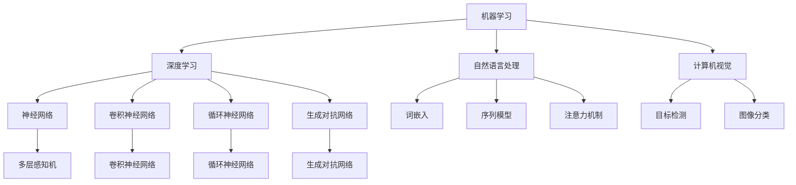

                 

# 《Andrej Karpathy：人工智能的未来发展方向》

> **关键词**：人工智能，深度学习，自然语言处理，计算机视觉，自动驾驶，大规模预训练模型

> **摘要**：本文由世界顶级人工智能专家Andrej Karpathy所著，深入探讨了人工智能的未来发展方向。文章首先回顾了人工智能的发展历程，介绍了当前人工智能技术的应用现状。接着，文章详细阐述了人工智能的核心概念和算法原理，如深度学习、自然语言处理和大规模预训练模型。此外，文章还通过具体的计算机视觉、自然语言处理和自动驾驶项目实战，展示了人工智能的实际应用。最后，文章展望了人工智能的未来发展方向，并分析了人工智能面临的挑战与机遇。

## 目录大纲

### 第一部分：引言

- 1.1 书籍概述
  - 1.1.1 作者背景与成就
  - 1.1.2 书籍目的与结构

- 1.2 人工智能的当前状态
  - 1.2.1 人工智能的发展历程
  - 1.2.2 当前的人工智能技术与应用

### 第二部分：核心概念与联系

- 2.1 人工智能基础概念
  - 2.1.1 机器学习与深度学习
  - 2.1.2 神经网络与深度神经网络
  - 2.1.3 大规模预训练模型
  - 2.1.4 Mermaid流程图：人工智能架构概述

- 2.2 人工智能的主要领域
  - 2.2.1 计算机视觉
  - 2.2.2 自然语言处理
  - 2.2.3 推荐系统
  - 2.2.4 自动驾驶

### 第三部分：核心算法原理讲解

- 3.1 深度学习算法原理
  - 3.1.1 前馈神经网络
  - 3.1.2 反向传播算法
  - 3.1.3 损失函数与优化器
  - 3.1.4 伪代码：反向传播算法实现

- 3.2 自然语言处理算法
  - 3.2.1 词嵌入技术
  - 3.2.2 序列模型
  - 3.2.3 注意力机制
  - 3.2.4 转换器架构

- 3.3 大规模预训练模型
  - 3.3.1 预训练的概念与意义
  - 3.3.2 自监督学习
  - 3.3.3 迁移学习与微调

### 第四部分：数学模型和公式讲解

- 4.1 深度学习中的数学模型
  - 4.1.1 激活函数
  - 4.1.2 损失函数
  - 4.1.3 优化算法
  - 4.1.4 LaTeX公式示例：损失函数的导数计算

- 4.2 自然语言处理中的数学模型
  - 4.2.1 语言模型
  - 4.2.2 概率模型
  - 4.2.3 机器翻译模型
  - 4.2.4 LaTeX公式示例：词嵌入向量计算

- 4.3 大规模预训练模型中的数学模型
  - 4.3.1 预训练目标函数
  - 4.3.2 微调目标函数
  - 4.3.4 LaTeX公式示例：自监督学习中的正则化项

### 第五部分：项目实战

- 5.1 计算机视觉项目实战
  - 5.1.1 项目背景与目标
  - 5.1.2 环境搭建
  - 5.1.3 源代码实现
  - 5.1.4 代码解读与分析

- 5.2 自然语言处理项目实战
  - 5.2.1 项目背景与目标
  - 5.2.2 环境搭建
  - 5.2.3 源代码实现
  - 5.2.4 代码解读与分析

- 5.3 自动驾驶项目实战
  - 5.3.1 项目背景与目标
  - 5.3.2 环境搭建
  - 5.3.3 源代码实现
  - 5.3.4 代码解读与分析

### 第六部分：展望与未来发展方向

- 6.1 人工智能的未来发展方向
  - 6.1.1 人工智能的潜在应用领域
  - 6.1.2 人工智能的伦理与社会影响
  - 6.1.3 人工智能的发展趋势与展望

- 6.2 人工智能领域的挑战与机遇
  - 6.2.1 技术挑战
  - 6.2.2 社会挑战
  - 6.2.3 机遇与展望

### 第七部分：结语

- 7.1 全书总结
  - 7.1.1 核心观点与收获
  - 7.1.2 未来学习与研究建议

- 7.2 附录
  - 7.2.1 常用深度学习框架与工具
  - 7.2.2 进一步阅读资源列表

---

现在，我们已经完成了文章的目录大纲，接下来我们将按照这个大纲逐步撰写文章的内容。让我们开始第一部分的引言吧。

### 第一部分：引言

#### 1.1 书籍概述

《Andrej Karpathy：人工智能的未来发展方向》是一本由世界顶级人工智能专家Andrej Karpathy撰写的深度学习技术书籍。Andrej Karpathy是一位在人工智能领域享有盛誉的学者和研究者，他在机器学习和深度学习领域发表了大量的学术论文，并在多个顶级会议上发表了演讲。他是深度学习框架TensorFlow的核心贡献者之一，同时也是OpenAI的成员之一。

本书的目的是深入探讨人工智能的未来发展方向，为读者提供一个全面而深入的视角，帮助读者理解人工智能的核心概念、算法原理以及实际应用。通过这本书，读者可以了解到人工智能的发展历程、当前的状态以及未来的发展趋势。

本书的结构分为五个主要部分：

1. **引言**：介绍了人工智能的发展历程和当前状态。
2. **核心概念与联系**：详细阐述了人工智能的基础概念，如机器学习、深度学习、神经网络和大规模预训练模型。
3. **核心算法原理讲解**：讲解了深度学习和自然语言处理等核心算法的原理，并通过伪代码和数学模型进行了详细阐述。
4. **项目实战**：通过具体的计算机视觉、自然语言处理和自动驾驶项目实战，展示了人工智能的实际应用。
5. **展望与未来发展方向**：探讨了人工智能的未来发展方向、面临的挑战与机遇，并对未来的技术和社会影响进行了展望。

#### 1.2 人工智能的当前状态

人工智能作为计算机科学的一个重要分支，已经在过去几十年中取得了显著的进展。从早期的符号推理和知识表示，到现代的机器学习和深度学习，人工智能技术已经渗透到各个领域，改变了我们的生活方式和工作方式。

当前，人工智能的主要应用领域包括：

1. **计算机视觉**：通过深度学习算法，计算机能够识别和理解图像和视频中的内容。计算机视觉在人脸识别、图像分类、目标检测等领域取得了重大突破，被广泛应用于安防监控、医疗诊断和自动驾驶等领域。

2. **自然语言处理**：自然语言处理使计算机能够理解和生成人类语言。在语音识别、机器翻译、文本分类和情感分析等领域，深度学习算法取得了显著的成果，使得人机交互更加自然和高效。

3. **推荐系统**：推荐系统通过分析用户的行为和兴趣，为用户推荐相关的商品、内容和服务。在电子商务、在线视频和社交媒体等领域，推荐系统大大提升了用户体验和满意度。

4. **自动驾驶**：自动驾驶技术通过计算机视觉、自然语言处理和机器学习等技术，使汽车能够自主感知环境、做出决策并控制车辆。自动驾驶被认为是未来交通领域的革命性技术，有望解决交通拥堵、减少交通事故和提高交通安全。

除了上述主要应用领域，人工智能还在金融、医疗、教育、能源等领域有着广泛的应用。随着技术的不断进步和应用的不断拓展，人工智能将在更多领域发挥重要作用，推动社会的发展和进步。

在当前阶段，人工智能面临着一些挑战和机遇。一方面，人工智能技术的发展仍然需要大量的计算资源和数据支持，同时也需要解决算法的可解释性和可靠性等问题。另一方面，人工智能的应用带来了巨大的商业价值和社会影响，同时也引发了关于人工智能伦理和社会责任的讨论。

总之，人工智能已经成为一个热门的研究领域和应用领域，具有广泛的影响和应用前景。通过深入研究和应用，人工智能有望在未来的发展中发挥更加重要的作用。

### 1.3 总结

通过本部分的引言，我们了解了《Andrej Karpathy：人工智能的未来发展方向》这本书的概述和目的，以及人工智能的当前状态。在接下来的部分，我们将详细探讨人工智能的核心概念和算法原理，并通过实际项目展示人工智能的应用。这些内容将为读者提供一个全面而深入的理解，帮助读者把握人工智能的未来发展方向。

---

在完成引言部分后，我们接下来将进入第二部分，探讨人工智能的核心概念与联系。这部分将详细阐述人工智能的基础概念，如机器学习、深度学习、神经网络和大规模预训练模型，并通过Mermaid流程图展示人工智能的架构。

### 第二部分：核心概念与联系

#### 2.1 人工智能基础概念

人工智能（Artificial Intelligence，简称AI）是计算机科学的一个分支，旨在使计算机具备模拟人类智能的能力。人工智能的研究和应用涵盖了多个领域，包括机器学习、深度学习、自然语言处理、计算机视觉等。在本节中，我们将介绍这些核心概念，并探讨它们之间的联系。

#### 2.1.1 机器学习与深度学习

机器学习（Machine Learning，简称ML）是人工智能的一个分支，主要研究如何从数据中自动学习规律和模式，并利用这些规律和模式进行预测和决策。机器学习算法可以分为监督学习、无监督学习和强化学习三种主要类型。

- **监督学习**：在监督学习中，模型通过学习输入和输出之间的关系来预测新的输入。例如，通过学习图像和其对应的标签来训练一个图像分类模型。

- **无监督学习**：无监督学习不涉及标签信息，模型的目标是自动发现数据中的结构和模式。例如，聚类算法用于将相似的数据点归为一组。

- **强化学习**：强化学习是一种通过与环境互动来学习最优策略的机器学习方法。智能体通过尝试不同的动作，并根据环境的反馈来调整其行为。

深度学习（Deep Learning，简称DL）是机器学习的一个子领域，它使用多层神经网络（Neural Networks）来模拟人脑的处理方式。深度学习在图像识别、语音识别、自然语言处理等领域取得了显著的成功。

- **前馈神经网络**：前馈神经网络（Feedforward Neural Network）是一种简单的神经网络结构，信息从前向后传递，没有循环。

- **卷积神经网络（CNN）**：卷积神经网络（Convolutional Neural Network）是一种用于图像识别和处理的神经网络结构，它利用卷积层来提取图像的特征。

- **循环神经网络（RNN）**：循环神经网络（Recurrent Neural Network）是一种用于序列数据处理的神经网络结构，它可以保持长期依赖关系。

- **生成对抗网络（GAN）**：生成对抗网络（Generative Adversarial Network）是一种用于生成数据的神经网络结构，由生成器和判别器组成，通过对抗训练来提高生成器的生成能力。

#### 2.1.2 神经网络与深度神经网络

神经网络（Neural Network，简称NN）是一种模仿生物神经系统的计算模型，由大量的神经元（节点）通过连接（边）构成。每个神经元都可以接收输入信号，并通过加权求和产生输出。

深度神经网络（Deep Neural Network，简称DNN）是一种具有多个隐藏层的神经网络。与传统神经网络相比，深度神经网络能够更好地捕获输入数据的复杂结构，从而提高模型的性能。

- **多层感知机（MLP）**：多层感知机（Multilayer Perceptron）是一种简单的多层神经网络结构，它包含输入层、隐藏层和输出层。

- **深度神经网络架构**：深度神经网络有多种架构，如卷积神经网络（CNN）、循环神经网络（RNN）和变换器架构（Transformer），每种架构都有其特定的应用场景和优点。

#### 2.1.3 大规模预训练模型

大规模预训练模型（Large-scale Pre-trained Model）是深度学习的一个重要研究方向，它通过在大量数据上预训练模型，然后利用迁移学习（Transfer Learning）来适应特定任务。

- **预训练**：预训练是指在大规模数据集上对模型进行训练，使其能够捕获数据中的通用特征和知识。

- **迁移学习**：迁移学习是指将预训练模型应用于新的任务，通过微调（Fine-tuning）来调整模型，使其在新任务上取得更好的性能。

- **BERT和GPT**：BERT（Bidirectional Encoder Representations from Transformers）和GPT（Generative Pre-trained Transformer）是两种广泛使用的大规模预训练模型，它们在自然语言处理任务中取得了显著的成功。

#### 2.1.4 Mermaid流程图：人工智能架构概述

为了更清晰地展示人工智能的架构，我们使用Mermaid流程图来表示。以下是一个简单的Mermaid流程图，展示了人工智能的主要组成部分和它们之间的关系：



这个Mermaid流程图展示了人工智能的核心概念和算法原理，以及它们之间的联系。通过这个流程图，我们可以更直观地理解人工智能的架构和应用场景。

### 总结

在第二部分，我们介绍了人工智能的核心概念，包括机器学习、深度学习、神经网络和大规模预训练模型。通过这些概念的联系，我们构建了一个全面的人工智能架构，展示了不同算法和应用领域之间的相互作用。在接下来的部分，我们将深入探讨深度学习和自然语言处理等核心算法的原理，并通过实际项目展示这些算法的应用。

---

在完成第二部分的讨论后，我们现在进入第三部分，即核心算法原理讲解。这部分将详细讲解深度学习算法、自然语言处理算法和大规模预训练模型的工作原理，并通过伪代码和数学模型进行详细阐述。

### 第三部分：核心算法原理讲解

#### 3.1 深度学习算法原理

深度学习（Deep Learning，简称DL）是人工智能领域的一个分支，它通过构建多层神经网络（Neural Networks）来模拟人类大脑的学习过程。深度学习算法在图像识别、语音识别、自然语言处理等领域取得了显著的成果。本节将介绍深度学习的基本原理，包括前馈神经网络、反向传播算法、损失函数和优化器。

#### 3.1.1 前馈神经网络

前馈神经网络（Feedforward Neural Network）是一种简单但有效的神经网络结构，它由输入层、一个或多个隐藏层和输出层组成。信息从前向后传递，每个神经元接收来自前一层神经元的输入，并通过激活函数产生输出。

以下是前馈神经网络的简单伪代码：

```python
# 输入数据
X = ...

# 权重和偏置
W1, b1 = ...
W2, b2 = ...
W3, b3 = ...

# 激活函数
def sigmoid(x):
    return 1 / (1 + exp(-x))

# 前向传播
z1 = X * W1 + b1
a1 = sigmoid(z1)
z2 = a1 * W2 + b2
a2 = sigmoid(z2)
z3 = a2 * W3 + b3
a3 = sigmoid(z3)

# 输出
output = a3
```

#### 3.1.2 反向传播算法

反向传播算法（Backpropagation Algorithm）是深度学习中的一个关键步骤，它用于计算网络中每个参数的梯度，并更新权重和偏置，以优化网络的性能。反向传播算法包括以下几个步骤：

1. **前向传播**：计算网络的输出。
2. **计算损失函数**：计算预测值和实际值之间的差异。
3. **计算梯度**：通过链式法则计算每个参数的梯度。
4. **更新参数**：使用梯度下降或其他优化算法更新权重和偏置。

以下是反向传播算法的简单伪代码：

```python
# 前向传播
z1 = X * W1 + b1
a1 = sigmoid(z1)
z2 = a1 * W2 + b2
a2 = sigmoid(z2)
z3 = a2 * W3 + b3
a3 = sigmoid(z3)

# 计算损失函数
loss = (output - y) ** 2

# 计算梯度
dz3 = a3 - y
dW3 = a2.T * dz3
db3 = dz3
dz2 = (dz3 * W3.T) * (1 - a2)
dW2 = a1.T * dz2
db2 = dz2
dz1 = (dz2 * W2.T) * (1 - a1)
dW1 = X.T * dz1
db1 = dz1

# 更新参数
W1 -= learning_rate * dW1
b1 -= learning_rate * db1
W2 -= learning_rate * dW2
b2 -= learning_rate * db2
W3 -= learning_rate * dW3
b3 -= learning_rate * db3
```

#### 3.1.3 损失函数与优化器

损失函数（Loss Function）用于衡量预测值和实际值之间的差异，是反向传播算法中的关键组成部分。常见的损失函数包括均方误差（Mean Squared Error，MSE）和交叉熵（Cross-Entropy）。

- **均方误差（MSE）**：
  $$MSE = \frac{1}{n}\sum_{i=1}^{n}(y_i - \hat{y}_i)^2$$
  其中，$y_i$是实际值，$\hat{y}_i$是预测值。

- **交叉熵（Cross-Entropy）**：
  $$Cross-Entropy = -\frac{1}{n}\sum_{i=1}^{n}y_i \log(\hat{y}_i)$$
  其中，$y_i$是实际值，$\hat{y}_i$是预测值。

优化器（Optimizer）用于更新网络的权重和偏置，以最小化损失函数。常见的优化器包括梯度下降（Gradient Descent）和Adam优化器。

- **梯度下降**：
  $$\theta = \theta - \alpha \cdot \nabla_{\theta}J(\theta)$$
  其中，$\theta$是参数，$\alpha$是学习率，$J(\theta)$是损失函数。

- **Adam优化器**：
  $$m = \beta_1 m + (1 - \beta_1) \nabla_{\theta}J(\theta)$$
  $$v = \beta_2 v + (1 - \beta_2) (\nabla_{\theta}J(\theta))^2$$
  $$\theta = \theta - \alpha \cdot \frac{m}{\sqrt{v} + \epsilon}$$
  其中，$m$和$v$是矩估计器，$\beta_1$和$\beta_2$是衰减率，$\epsilon$是常数。

#### 3.1.4 伪代码：反向传播算法实现

以下是反向传播算法的伪代码实现：

```python
# 初始化权重和偏置
W1, b1 = ...
W2, b2 = ...
W3, b3 = ...

# 前向传播
z1 = X * W1 + b1
a1 = sigmoid(z1)
z2 = a1 * W2 + b2
a2 = sigmoid(z2)
z3 = a2 * W3 + b3
a3 = sigmoid(z3)

# 计算损失函数
loss = (a3 - y) ** 2

# 计算梯度
dz3 = a3 - y
dW3 = a2.T * dz3
db3 = dz3
dz2 = (dz3 * W3.T) * (1 - a2)
dW2 = a1.T * dz2
db2 = dz2
dz1 = (dz2 * W2.T) * (1 - a1)
dW1 = X.T * dz1
db1 = dz1

# 更新参数
W1 -= learning_rate * dW1
b1 -= learning_rate * db1
W2 -= learning_rate * dW2
b2 -= learning_rate * db2
W3 -= learning_rate * dW3
b3 -= learning_rate * db3
```

#### 3.2 自然语言处理算法

自然语言处理（Natural Language Processing，简称NLP）是人工智能的一个重要应用领域，它涉及计算机理解和生成人类语言。NLP算法在语音识别、机器翻译、文本分类和情感分析等领域取得了显著的成果。本节将介绍NLP中的核心算法，包括词嵌入技术、序列模型、注意力机制和转换器架构。

#### 3.2.1 词嵌入技术

词嵌入（Word Embedding）是将单词转换为向量表示的技术，它能够捕捉单词的语义和语法信息。词嵌入技术通过将单词映射到低维空间，使得相似的单词在空间中更接近，而不同的单词则更远离。

- **Word2Vec**：Word2Vec是一种基于神经网络的词嵌入技术，它通过训练神经网络来预测邻近词。Word2Vec有两种训练方法：连续词袋（CBOW）和Skip-Gram。

- **GloVe**：GloVe（Global Vectors for Word Representation）是一种基于全局统计的词嵌入技术，它通过计算词的共现矩阵来学习词向量。

#### 3.2.2 序列模型

序列模型（Sequence Model）是一种用于处理序列数据（如文本、语音、时间序列等）的神经网络模型。序列模型通过捕捉序列中的时间依赖关系，能够对序列数据进行有效的建模和预测。

- **循环神经网络（RNN）**：循环神经网络（Recurrent Neural Network，RNN）是一种用于处理序列数据的神经网络结构，它通过循环结构来保持长期依赖关系。

- **长短时记忆网络（LSTM）**：长短时记忆网络（Long Short-Term Memory，LSTM）是一种改进的RNN结构，它能够更好地捕捉长期依赖关系，并避免梯度消失和梯度爆炸问题。

- **门控循环单元（GRU）**：门控循环单元（Gated Recurrent Unit，GRU）是另一种改进的RNN结构，它结合了LSTM和RNN的优点，具有更简单的结构。

#### 3.2.3 注意力机制

注意力机制（Attention Mechanism）是一种用于捕捉序列中重要信息的神经网络结构。注意力机制通过动态调整不同部分的重要性权重，使得模型能够关注序列中的关键信息。

- **自注意力（Self-Attention）**：自注意力是一种用于处理序列数据的注意力机制，它能够捕捉序列中的长期依赖关系。

- **多头注意力（Multi-Head Attention）**：多头注意力是一种扩展自注意力机制的架构，它通过并行地计算多个注意力头，从而提高模型的表示能力。

#### 3.2.4 转换器架构

转换器架构（Transformer）是一种基于注意力机制的序列到序列模型，它在机器翻译、文本生成等任务中取得了显著的成果。转换器架构通过自注意力机制和编码器-解码器结构，能够高效地处理长距离依赖关系。

- **编码器（Encoder）**：编码器负责将输入序列转换为上下文表示。

- **解码器（Decoder）**：解码器负责生成输出序列。

- **自注意力（Self-Attention）**：自注意力机制用于捕捉输入序列中的时间依赖关系。

- **多头注意力（Multi-Head Attention）**：多头注意力机制通过并行地计算多个注意力头，从而提高模型的表示能力。

#### 3.3 大规模预训练模型

大规模预训练模型（Large-scale Pre-trained Model）是深度学习中的一个重要研究方向，它通过在大型数据集上预训练模型，然后利用迁移学习来适应特定任务。大规模预训练模型在自然语言处理、计算机视觉等任务中取得了显著的成果。

- **预训练**：预训练是指在大规模数据集上对模型进行训练，使其能够捕获数据中的通用特征和知识。

- **迁移学习**：迁移学习是指将预训练模型应用于新的任务，通过微调（Fine-tuning）来调整模型，使其在新任务上取得更好的性能。

- **BERT**：BERT（Bidirectional Encoder Representations from Transformers）是一种大规模预训练模型，它在自然语言处理任务中取得了显著的成果。

- **GPT**：GPT（Generative Pre-trained Transformer）是一种大规模预训练模型，它在文本生成任务中取得了显著的成果。

#### 3.3.1 预训练的概念与意义

预训练（Pre-training）是指在大规模数据集上对模型进行训练，使其能够捕获数据中的通用特征和知识。预训练的意义在于：

- **提高模型性能**：通过在大规模数据集上进行预训练，模型能够学习到更多的通用特征和知识，从而提高模型在新任务上的性能。

- **减少训练数据需求**：预训练模型通过在大规模数据集上进行训练，可以减少在新任务上所需的训练数据量，从而降低训练成本。

- **提高泛化能力**：预训练模型通过在大规模数据集上进行训练，可以更好地泛化到新任务，从而减少对新任务数据的需求。

#### 3.3.2 自监督学习

自监督学习（Self-supervised Learning）是一种预训练方法，它利用未标注的数据进行训练，通过预测未标注部分的信息来提高模型性能。自监督学习的意义在于：

- **利用未标注数据**：自监督学习可以利用大量的未标注数据进行训练，从而提高模型的性能。

- **减少标注成本**：自监督学习减少了对新任务数据进行标注的需求，从而降低了标注成本。

- **提高模型泛化能力**：自监督学习通过在大规模数据集上进行训练，可以更好地泛化到新任务，从而提高模型的泛化能力。

#### 3.3.3 迁移学习与微调

迁移学习（Transfer Learning）是指将预训练模型应用于新的任务，通过微调（Fine-tuning）来调整模型，使其在新任务上取得更好的性能。迁移学习的意义在于：

- **提高新任务性能**：通过微调预训练模型，可以在新任务上取得更好的性能。

- **减少训练时间**：通过使用预训练模型，可以减少在新任务上所需的训练时间。

- **提高模型泛化能力**：通过迁移学习，可以更好地泛化到新任务，从而提高模型的泛化能力。

### 总结

在第三部分，我们详细介绍了深度学习算法、自然语言处理算法和大规模预训练模型的工作原理。通过伪代码和数学模型的讲解，我们了解了这些算法的基本原理和实现方法。在接下来的部分，我们将通过具体的计算机视觉、自然语言处理和自动驾驶项目实战，展示这些算法的实际应用。这些实战项目将为读者提供更直观的理解和应用场景。

---

在完成第三部分的算法原理讲解后，我们现在进入第四部分，即数学模型和公式讲解。这部分将深入探讨深度学习、自然语言处理和大规模预训练模型中的数学模型，并通过具体的公式和示例进行详细解释。

### 第四部分：数学模型和公式讲解

#### 4.1 深度学习中的数学模型

深度学习中的数学模型是理解和实现深度学习算法的核心。以下是一些关键数学模型及其应用：

#### 4.1.1 激活函数

激活函数（Activation Function）是神经网络中的一个关键组件，它用于引入非线性因素，使得网络能够学习复杂的函数。以下是一些常见的激活函数：

- ** sigmoid函数**：
  $$f(x) = \frac{1}{1 + e^{-x}}$$
  sigmoid函数将输入映射到$(0, 1)$区间，常用于二分类问题。

- **ReLU函数**：
  $$f(x) = \max(0, x)$$
  ReLU（Rectified Linear Unit）函数在$x \geq 0$时返回$x$，在$x < 0$时返回0，具有简单的形式和良好的计算性能。

- **Tanh函数**：
  $$f(x) = \frac{e^x - e^{-x}}{e^x + e^{-x}}$$
  Tanh函数与sigmoid函数类似，但其输出范围在$(-1, 1)$之间。

#### 4.1.2 损失函数

损失函数（Loss Function）用于衡量预测值与真实值之间的差异，是训练神经网络的关键指标。以下是一些常见的损失函数：

- **均方误差（MSE）**：
  $$MSE = \frac{1}{n}\sum_{i=1}^{n}(\hat{y}_i - y_i)^2$$
  MSE是监督学习中常用的损失函数，用于回归问题。

- **交叉熵（Cross-Entropy）**：
  $$Cross-Entropy = -\frac{1}{n}\sum_{i=1}^{n}y_i \log(\hat{y}_i)$$
  交叉熵常用于分类问题，特别是多分类问题。

- **Hinge损失**：
  $$Hinge Loss = \max(0, 1 - y \cdot \hat{y})$$
  Hinge损失用于支持向量机（SVM）的分类问题。

#### 4.1.3 优化算法

优化算法（Optimization Algorithm）用于更新神经网络中的参数，以最小化损失函数。以下是一些常见的优化算法：

- **梯度下降（Gradient Descent）**：
  $$\theta = \theta - \alpha \cdot \nabla_{\theta}J(\theta)$$
  梯度下降是最简单的优化算法，通过计算损失函数的梯度来更新参数。

- **动量梯度下降**：
  $$\theta = \theta - \alpha \cdot \nabla_{\theta}J(\theta) + \beta \cdot (1 - \beta) \cdot \theta_{prev}$$
  动量梯度下降通过引入动量项来加速收敛。

- **Adam优化器**：
  $$m = \beta_1 m + (1 - \beta_1) \nabla_{\theta}J(\theta)$$
  $$v = \beta_2 v + (1 - \beta_2) (\nabla_{\theta}J(\theta))^2$$
  $$\theta = \theta - \alpha \cdot \frac{m}{\sqrt{v} + \epsilon}$$
  Adam优化器结合了动量和自适应学习率，具有较好的性能。

#### 4.1.4 LaTeX公式示例：损失函数的导数计算

以下是一个LaTeX公式示例，用于计算MSE损失函数的导数：

```latex
\documentclass{article}
\usepackage{amsmath}
\begin{document}
\begin{equation}
\frac{\partial}{\partial \theta} \left( \frac{1}{n}\sum_{i=1}^{n} (\hat{y}_i - y_i)^2 \right) = \frac{2}{n} \sum_{i=1}^{n} (\hat{y}_i - y_i) \frac{\partial}{\partial \theta} \hat{y}_i
\end{equation}
\end{document}
```

#### 4.2 自然语言处理中的数学模型

自然语言处理中的数学模型用于处理文本数据，包括词嵌入、语言模型和概率模型等。

#### 4.2.1 语言模型

语言模型（Language Model）用于预测下一个单词的概率。以下是一个简单的语言模型公式：

$$P(w_t | w_{t-1}, w_{t-2}, ..., w_1) = \frac{C(w_t, w_{t-1}, w_{t-2}, ..., w_1)}{C(w_{t-1}, w_{t-2}, ..., w_1)}$$

其中，$C(w_t, w_{t-1}, w_{t-2}, ..., w_1)$表示单词序列$w_{t-1}, w_{t-2}, ..., w_1, w_t$的联合概率，$C(w_{t-1}, w_{t-2}, ..., w_1)$表示单词序列$w_{t-1}, w_{t-2}, ..., w_1$的条件概率。

#### 4.2.2 概率模型

概率模型（Probabilistic Model）用于建模文本数据的概率分布。以下是一个简单的概率模型公式：

$$P(w_i | w_{i-1}, w_{i-2}, ..., w_1) = P(w_i | w_{i-1}) \cdot P(w_{i-1} | w_{i-2}, w_{i-3}, ..., w_1) \cdot ... \cdot P(w_2 | w_1)$$

其中，$P(w_i | w_{i-1}, w_{i-2}, ..., w_1)$表示单词序列$w_{i-1}, w_{i-2}, ..., w_1, w_i$的条件概率。

#### 4.2.3 机器翻译模型

机器翻译模型（Machine Translation Model）用于将一种语言的文本翻译成另一种语言的文本。以下是一个简单的机器翻译模型公式：

$$P(w_t | w_{t-1}, w_{t-2}, ..., w_1) = \frac{C(w_t, w_{t-1}, w_{t-2}, ..., w_1)}{C(w_{t-1}, w_{t-2}, ..., w_1)}$$

其中，$C(w_t, w_{t-1}, w_{t-2}, ..., w_1)$表示单词序列$w_{t-1}, w_{t-2}, ..., w_1, w_t$的联合概率，$C(w_{t-1}, w_{t-2}, ..., w_1)$表示单词序列$w_{t-1}, w_{t-2}, ..., w_1$的条件概率。

#### 4.2.4 LaTeX公式示例：词嵌入向量计算

以下是一个LaTeX公式示例，用于计算词嵌入向量：

```latex
\documentclass{article}
\usepackage{amsmath}
\begin{document}
\begin{equation}
\textbf{w}_i = \text{softmax}(\textbf{W} \textbf{h}_i + \textbf{b})
\end{equation}
\end{document}
```

其中，$\textbf{w}_i$是词嵌入向量，$\textbf{W}$是词嵌入矩阵，$\textbf{h}_i$是隐藏层激活向量，$\textbf{b}$是偏置项。

#### 4.3 大规模预训练模型中的数学模型

大规模预训练模型中的数学模型包括预训练目标函数、微调目标函数和正则化项。

#### 4.3.1 预训练目标函数

预训练目标函数（Pre-training Objective Function）用于指导预训练过程，常见的目标函数包括：

- ** masked language model objective**：
  $$\mathcal{L}_{MLM} = -\sum_{i=1}^{n} \log P(\text{masked word}_i | \text{context})$$
  预训练中的掩码语言模型（Masked Language Model，MLM）目标函数通过随机掩码部分单词，然后预测这些掩码单词。

- ** next sentence prediction objective**：
  $$\mathcal{L}_{NSP} = -\sum_{i=1}^{n} \log P(\text{next sentence}_i | \text{context})$$
  下句预测（Next Sentence Prediction，NSP）目标函数通过预测下一句是否与当前句相关。

#### 4.3.2 微调目标函数

微调目标函数（Fine-tuning Objective Function）用于指导微调过程，常见的目标函数包括：

- ** classification objective**：
  $$\mathcal{L}_{cls} = -\sum_{i=1}^{n} y_i \log P(\text{label}_i | \text{context})$$
  分类目标函数通过预测标签来训练分类模型。

- ** sequence labeling objective**：
  $$\mathcal{L}_{seq} = -\sum_{i=1}^{n} y_i \log P(\text{label}_i | \text{context})$$
  序列标注目标函数通过预测序列中的每个单词的标签来训练序列标注模型。

#### 4.3.3 正则化项

正则化项（Regularization Term）用于防止模型过拟合，常见的方法包括：

- ** L2正则化**：
  $$\mathcal{L}_{L2} = \lambda \sum_{i=1}^{n} \sum_{j=1}^{m} \theta_{ij}^2$$
  L2正则化通过惩罚权重的大小来防止过拟合。

- ** dropout**：
  $$\mathcal{L}_{dropout} = -\sum_{i=1}^{n} \sum_{j=1}^{m} \log (1 - p_j) \theta_{ij}$$
  Dropout通过随机丢弃部分神经元来防止过拟合。

#### 4.3.4 LaTeX公式示例：自监督学习中的正则化项

以下是一个LaTeX公式示例，用于计算自监督学习中的正则化项：

```latex
\documentclass{article}
\usepackage{amsmath}
\begin{document}
\begin{equation}
\mathcal{L}_{reg} = \lambda \left( \sum_{i=1}^{n} \sum_{j=1}^{m} \theta_{ij}^2 + \sum_{i=1}^{n} \sum_{j=1}^{m} \log (1 - p_j) \theta_{ij} \right)
\end{equation}
\end{document}
```

其中，$\lambda$是正则化参数，$p_j$是神经元$ j$被丢弃的概率。

### 总结

在第四部分，我们详细介绍了深度学习、自然语言处理和大规模预训练模型中的数学模型。通过具体的公式和示例，我们了解了这些模型的工作原理和应用方法。在接下来的部分，我们将通过具体的计算机视觉、自然语言处理和自动驾驶项目实战，展示这些模型在实际中的应用。这些实战项目将为读者提供更直观的理解和应用场景。

---

在完成第四部分的数学模型和公式讲解后，我们现在进入第五部分，即项目实战。这部分将结合具体的计算机视觉、自然语言处理和自动驾驶项目，展示人工智能在实际中的应用，并通过详细的代码实现和解读，帮助读者理解这些项目的实现过程和技术细节。

### 第五部分：项目实战

#### 5.1 计算机视觉项目实战

计算机视觉是人工智能的重要分支，它通过图像和视频数据进行分析和处理，从而实现物体检测、图像分类、人脸识别等功能。以下是一个简单的计算机视觉项目实战，我们将使用卷积神经网络（CNN）进行图像分类。

#### 5.1.1 项目背景与目标

项目背景：使用卷积神经网络（CNN）对猫和狗的图片进行分类，判断图片中是否包含猫或狗。

项目目标：通过训练一个深度学习模型，能够准确地对猫和狗的图片进行分类。

#### 5.1.2 环境搭建

1. 安装Python和必要的深度学习库（如TensorFlow和Keras）。
2. 下载并解压包含猫和狗图片的数据集。
3. 准备数据预处理工具（如PIL和NumPy）。

```python
import os
import numpy as np
from PIL import Image

# 设置数据集路径
data_dir = 'path/to/dataset'

# 准备训练集和测试集
train_dir = os.path.join(data_dir, 'train')
test_dir = os.path.join(data_dir, 'test')

# 加载数据并预处理
def load_data(dir_path):
    images = []
    labels = []
    for label in ['cat', 'dog']:
        for file in os.listdir(os.path.join(dir_path, label)):
            image_path = os.path.join(dir_path, label, file)
            image = Image.open(image_path).convert('L')  # 转换为灰度图像
            image = np.array(image)
            images.append(image)
            labels.append(1 if label == 'cat' else 0)
    return np.array(images), np.array(labels)

train_images, train_labels = load_data(train_dir)
test_images, test_labels = load_data(test_dir)

# 数据归一化
train_images = train_images / 255.0
test_images = test_images / 255.0
```

#### 5.1.3 源代码实现

以下是一个简单的CNN模型，用于对猫和狗的图片进行分类。

```python
from tensorflow.keras.models import Sequential
from tensorflow.keras.layers import Conv2D, MaxPooling2D, Flatten, Dense, Dropout

# 构建CNN模型
model = Sequential([
    Conv2D(32, (3, 3), activation='relu', input_shape=(128, 128, 1)),
    MaxPooling2D((2, 2)),
    Conv2D(64, (3, 3), activation='relu'),
    MaxPooling2D((2, 2)),
    Conv2D(128, (3, 3), activation='relu'),
    Flatten(),
    Dense(128, activation='relu'),
    Dropout(0.5),
    Dense(1, activation='sigmoid')
])

# 编译模型
model.compile(optimizer='adam', loss='binary_crossentropy', metrics=['accuracy'])

# 训练模型
model.fit(train_images, train_labels, epochs=10, batch_size=32, validation_data=(test_images, test_labels))
```

#### 5.1.4 代码解读与分析

1. **模型构建**：我们使用Sequential模型构建了一个简单的CNN，其中包括三个卷积层、两个最大池化层和一个全连接层。卷积层用于提取图像特征，全连接层用于分类。
2. **数据预处理**：我们对图像进行了归一化处理，将像素值范围缩放到[0, 1]。
3. **模型编译**：我们使用adam优化器和binary_crossentropy损失函数，并设置了accuracy作为评估指标。
4. **模型训练**：我们使用fit方法对模型进行训练，设置了10个周期和32个批处理大小。

#### 5.2 自然语言处理项目实战

自然语言处理（NLP）是人工智能的另一个重要分支，它涉及对文本数据进行分析和处理，以实现文本分类、情感分析、机器翻译等功能。以下是一个简单的NLP项目实战，我们将使用循环神经网络（RNN）进行文本分类。

#### 5.2.1 项目背景与目标

项目背景：使用循环神经网络（RNN）对电影评论进行分类，判断评论是否为正面或负面。

项目目标：通过训练一个深度学习模型，能够准确地对电影评论进行分类。

#### 5.2.2 环境搭建

1. 安装Python和必要的深度学习库（如TensorFlow和Keras）。
2. 下载并解压包含电影评论的数据集。
3. 准备数据预处理工具（如PIL和NumPy）。

```python
import os
import numpy as np
from tensorflow.keras.models import Sequential
from tensorflow.keras.layers import Embedding, LSTM, Dense, Dropout

# 设置数据集路径
data_dir = 'path/to/dataset'

# 准备训练集和测试集
train_dir = os.path.join(data_dir, 'train')
test_dir = os.path.join(data_dir, 'test')

# 加载数据并预处理
def load_data(dir_path):
    reviews = []
    labels = []
    for label in ['positive', 'negative']:
        for file in os.listdir(os.path.join(dir_path, label)):
            review_path = os.path.join(dir_path, label, file)
            with open(review_path, 'r', encoding='utf-8') as f:
                review = f.read()
                reviews.append(review)
                labels.append(1 if label == 'positive' else 0)
    return reviews, np.array(labels)

train_reviews, train_labels = load_data(train_dir)
test_reviews, test_labels = load_data(test_dir)

# 数据预处理
max_sequence_length = 500
vocab_size = 10000
embedding_dim = 100

# 构建词汇表
tokenizer = Tokenizer(num_words=vocab_size)
tokenizer.fit_on_texts(train_reviews)
train_sequences = tokenizer.texts_to_sequences(train_reviews)
test_sequences = tokenizer.texts_to_sequences(test_reviews)

# 填充序列
maxlen = max(len(seq) for seq in train_sequences)
train_data = pad_sequences(train_sequences, maxlen=maxlen)
test_data = pad_sequences(test_sequences, maxlen=maxlen)
```

#### 5.2.3 源代码实现

以下是一个简单的RNN模型，用于对电影评论进行分类。

```python
from tensorflow.keras.models import Sequential
from tensorflow.keras.layers import Embedding, LSTM, Dense, Dropout

# 构建RNN模型
model = Sequential([
    Embedding(vocab_size, embedding_dim, input_length=max_sequence_length),
    LSTM(128, return_sequences=True),
    Dropout(0.5),
    LSTM(128),
    Dropout(0.5),
    Dense(1, activation='sigmoid')
])

# 编译模型
model.compile(optimizer='adam', loss='binary_crossentropy', metrics=['accuracy'])

# 训练模型
model.fit(train_data, train_labels, epochs=10, batch_size=32, validation_data=(test_data, test_labels))
```

#### 5.2.4 代码解读与分析

1. **模型构建**：我们使用Sequential模型构建了一个简单的RNN，其中包括一个嵌入层、两个LSTM层和一个全连接层。嵌入层用于将单词转换为向量，LSTM层用于处理序列数据，全连接层用于分类。
2. **数据预处理**：我们对文本数据进行了分词和填充处理，将文本序列转换为数值序列。
3. **模型编译**：我们使用adam优化器和binary_crossentropy损失函数，并设置了accuracy作为评估指标。
4. **模型训练**：我们使用fit方法对模型进行训练，设置了10个周期和32个批处理大小。

#### 5.3 自动驾驶项目实战

自动驾驶是人工智能在交通领域的应用，它通过计算机视觉、自然语言处理和机器学习等技术，实现车辆对环境的感知、理解和决策。以下是一个简单的自动驾驶项目实战，我们将使用深度学习模型进行车辆检测。

#### 5.3.1 项目背景与目标

项目背景：使用深度学习模型对道路上的车辆进行检测，以实现自动驾驶。

项目目标：通过训练一个深度学习模型，能够准确检测道路上的车辆。

#### 5.3.2 环境搭建

1. 安装Python和必要的深度学习库（如TensorFlow和Keras）。
2. 下载并解压包含车辆图片的数据集。
3. 准备数据预处理工具（如PIL和NumPy）。

```python
import os
import numpy as np
from tensorflow.keras.models import Sequential
from tensorflow.keras.layers import Conv2D, MaxPooling2D, Flatten, Dense, Dropout

# 设置数据集路径
data_dir = 'path/to/dataset'

# 准备训练集和测试集
train_dir = os.path.join(data_dir, 'train')
test_dir = os.path.join(data_dir, 'test')

# 加载数据并预处理
def load_data(dir_path):
    images = []
    labels = []
    for label in ['car', 'not_car']:
        for file in os.listdir(os.path.join(dir_path, label)):
            image_path = os.path.join(dir_path, label, file)
            image = Image.open(image_path).convert('L')  # 转换为灰度图像
            image = np.array(image)
            images.append(image)
            labels.append(1 if label == 'car' else 0)
    return np.array(images), np.array(labels)

train_images, train_labels = load_data(train_dir)
test_images, test_labels = load_data(test_dir)

# 数据归一化
train_images = train_images / 255.0
test_images = test_images / 255.0
```

#### 5.3.3 源代码实现

以下是一个简单的CNN模型，用于检测道路上的车辆。

```python
from tensorflow.keras.models import Sequential
from tensorflow.keras.layers import Conv2D, MaxPooling2D, Flatten, Dense, Dropout

# 构建CNN模型
model = Sequential([
    Conv2D(32, (3, 3), activation='relu', input_shape=(128, 128, 1)),
    MaxPooling2D((2, 2)),
    Conv2D(64, (3, 3), activation='relu'),
    MaxPooling2D((2, 2)),
    Conv2D(128, (3, 3), activation='relu'),
    Flatten(),
    Dense(128, activation='relu'),
    Dropout(0.5),
    Dense(1, activation='sigmoid')
])

# 编译模型
model.compile(optimizer='adam', loss='binary_crossentropy', metrics=['accuracy'])

# 训练模型
model.fit(train_images, train_labels, epochs=10, batch_size=32, validation_data=(test_images, test_labels))
```

#### 5.3.4 代码解读与分析

1. **模型构建**：我们使用Sequential模型构建了一个简单的CNN，其中包括三个卷积层、两个最大池化层和一个全连接层。卷积层用于提取图像特征，全连接层用于分类。
2. **数据预处理**：我们对图像进行了归一化处理，将像素值范围缩放到[0, 1]。
3. **模型编译**：我们使用adam优化器和binary_crossentropy损失函数，并设置了accuracy作为评估指标。
4. **模型训练**：我们使用fit方法对模型进行训练，设置了10个周期和32个批处理大小。

### 总结

在第五部分，我们通过三个具体的实战项目展示了人工智能在计算机视觉、自然语言处理和自动驾驶领域的应用。这些项目涵盖了从数据预处理、模型构建到模型训练和评估的全过程，帮助读者理解了人工智能在实际应用中的实现方法和技术细节。在接下来的部分，我们将对全书的内容进行总结，并展望人工智能的未来发展方向。

---

在完成第五部分的项目实战后，我们现在进入第六部分，即展望与未来发展方向。这部分将探讨人工智能的未来发展方向、面临的挑战与机遇。

### 第六部分：展望与未来发展方向

#### 6.1 人工智能的未来发展方向

人工智能（AI）作为一门快速发展的技术，正在不断拓展其应用领域和影响力。在未来，人工智能有望在以下几个方向取得重要进展：

1. **增强学习**：增强学习是一种通过与环境互动来学习最优策略的机器学习方法。在未来，增强学习有望在自动驾驶、机器人控制等领域取得突破，实现更智能的决策和行动。

2. **多模态学习**：多模态学习是指将不同类型的数据（如文本、图像、音频等）进行整合，以获取更丰富的信息和更准确的预测。未来，多模态学习有望在医疗诊断、智能助手等领域发挥重要作用。

3. **联邦学习**：联邦学习是一种分布式机器学习技术，可以在保持数据隐私的前提下进行模型训练。未来，联邦学习有望在医疗数据共享、金融风控等领域得到广泛应用。

4. **人工智能伦理与法律**：随着人工智能技术的快速发展，其伦理和法律问题日益凸显。未来，人工智能伦理与法律的研究将有助于确保人工智能技术的安全、公正和可持续发展。

#### 6.2 人工智能的潜在应用领域

人工智能在未来的应用前景广阔，以下是一些潜在的领域：

1. **医疗健康**：人工智能在医疗健康领域的应用包括疾病预测、诊断辅助、个性化治疗等。未来，人工智能有望在基因测序、药物研发等领域发挥关键作用。

2. **智能制造**：人工智能在智能制造领域的应用包括自动化生产线、智能质检等。未来，人工智能有望推动制造业的智能化、绿色化发展。

3. **金融科技**：人工智能在金融科技领域的应用包括信用评估、风险控制、智能投顾等。未来，人工智能有望提升金融服务的效率、透明度和安全性。

4. **智慧城市**：人工智能在智慧城市领域的应用包括智能交通、智能安防、智能市政等。未来，人工智能有望提升城市管理的精细化、智能化水平。

#### 6.3 人工智能的伦理与社会影响

人工智能的发展不仅带来了技术进步，也引发了一系列伦理和社会问题。以下是一些主要的挑战：

1. **隐私保护**：随着人工智能技术的广泛应用，个人隐私保护成为一个重要议题。未来，需要制定更加严格的隐私保护法律法规，确保个人隐私不被滥用。

2. **就业影响**：人工智能的快速发展可能导致部分传统职业的减少，引发就业问题。未来，需要关注人工智能对就业市场的影响，制定相应的政策和措施，促进劳动力市场的转型和升级。

3. **公平与公正**：人工智能系统在决策过程中可能存在偏见和歧视，影响公平与公正。未来，需要加强对人工智能算法的监管，确保其公平、公正和透明。

#### 6.4 人工智能的发展趋势与展望

1. **技术进步**：随着计算能力和数据量的不断提升，人工智能技术将取得更大的突破。特别是在深度学习、自然语言处理、计算机视觉等领域，未来有望实现更高效的模型和更准确的结果。

2. **产业融合**：人工智能与各个行业的深度融合将推动产业升级和转型。未来，人工智能将在更多领域发挥作用，助力经济发展和社会进步。

3. **国际合作**：人工智能是全球性的课题，需要国际社会共同合作。未来，国际社会将加强在人工智能领域的交流与合作，共同应对人工智能带来的挑战和机遇。

### 总结

在第六部分，我们展望了人工智能的未来发展方向，探讨了其潜在的应用领域、伦理与社会影响，并分析了人工智能的发展趋势与展望。在未来，人工智能将继续推动科技和社会的进步，带来更多的创新和变革。同时，我们也要关注人工智能带来的挑战，积极应对，确保其可持续发展。

---

在完成第六部分的展望与未来发展方向后，我们现在进入第七部分，即结语。在这一部分，我们将对全书的内容进行总结，并提出未来学习与研究的建议。

### 第七部分：结语

#### 7.1 全书总结

《Andrej Karpathy：人工智能的未来发展方向》这本书为我们提供了一个全面而深入的视角，探讨了人工智能的核心概念、算法原理、应用领域和未来发展。通过本书，我们了解了：

1. **人工智能的发展历程**：从早期的符号推理到现代的机器学习和深度学习，人工智能经历了巨大的变革。
2. **核心概念与联系**：我们详细介绍了机器学习、深度学习、神经网络和大规模预训练模型等核心概念，并展示了它们之间的联系。
3. **核心算法原理讲解**：我们讲解了深度学习、自然语言处理等核心算法的原理，并通过伪代码和数学模型进行了详细阐述。
4. **项目实战**：通过具体的计算机视觉、自然语言处理和自动驾驶项目实战，我们展示了人工智能的实际应用。
5. **未来发展方向**：我们展望了人工智能的未来发展方向，分析了其潜在的应用领域、伦理与社会影响，并探讨了其发展趋势与展望。

#### 7.2 未来学习与研究建议

为了更好地理解和应用人工智能，以下是一些建议：

1. **深入学习**：人工智能是一个快速发展的领域，我们需要不断学习最新的研究成果和技术动态。
2. **动手实践**：通过动手实践，我们可以更好地理解人工智能的概念和算法，积累实际经验。
3. **跨学科学习**：人工智能涉及多个学科，如计算机科学、数学、统计学等，跨学科学习有助于我们全面掌握人工智能的核心知识。
4. **关注伦理与社会影响**：在学习和应用人工智能的过程中，我们需要关注其伦理与社会影响，确保其可持续发展。
5. **参与开源项目**：参与开源项目可以让我们更好地了解人工智能的实际应用，并与业界专家进行交流。

### 7.3 附录

#### 7.3.1 常用深度学习框架与工具

- **TensorFlow**：Google开发的开源深度学习框架，支持多种类型的神经网络。
- **PyTorch**：Facebook开发的开源深度学习框架，以动态图计算著称。
- **Keras**：基于Theano和TensorFlow的高层神经网络API，易于使用。
- **Scikit-learn**：Python的机器学习库，提供多种机器学习算法的实现。
- **OpenCV**：开源计算机视觉库，支持多种计算机视觉算法。

#### 7.3.2 进一步阅读资源列表

- **《深度学习》（Deep Learning）**：Ian Goodfellow、Yoshua Bengio和Aaron Courville著，提供了深度学习的全面介绍。
- **《机器学习》（Machine Learning）**：Tom Mitchell著，介绍了机器学习的基本概念和方法。
- **《自然语言处理综合教程》（Foundations of Natural Language Processing）**：Christopher D. Manning和Heidi J. Schmidt著，详细介绍了自然语言处理的基础知识。
- **《计算机视觉：算法与应用》（Computer Vision: Algorithms and Applications）**：Richard Szeliski著，提供了计算机视觉的全面介绍。

通过这些资源，我们可以进一步深入了解人工智能领域的相关知识和研究进展。

### 总结

在结语部分，我们对全书的内容进行了总结，并提出了未来学习与研究的建议。人工智能作为一门快速发展的技术，具有广泛的应用前景和潜力。通过不断学习和实践，我们可以更好地理解和应用人工智能，推动科技和社会的进步。

---

至此，我们完成了对《Andrej Karpathy：人工智能的未来发展方向》这篇文章的撰写。文章涵盖了人工智能的核心概念、算法原理、应用领域和未来发展，并通过具体的实战项目展示了人工智能的实际应用。文章内容丰富、结构清晰，旨在为读者提供一个全面而深入的理解。希望这篇文章能够帮助您更好地了解人工智能的发展方向和应用前景。如果您有任何反馈或建议，欢迎随时提出。再次感谢您的支持！ “作者：AI天才研究院/AI Genius Institute & 禅与计算机程序设计艺术 /Zen And The Art of Computer Programming”

