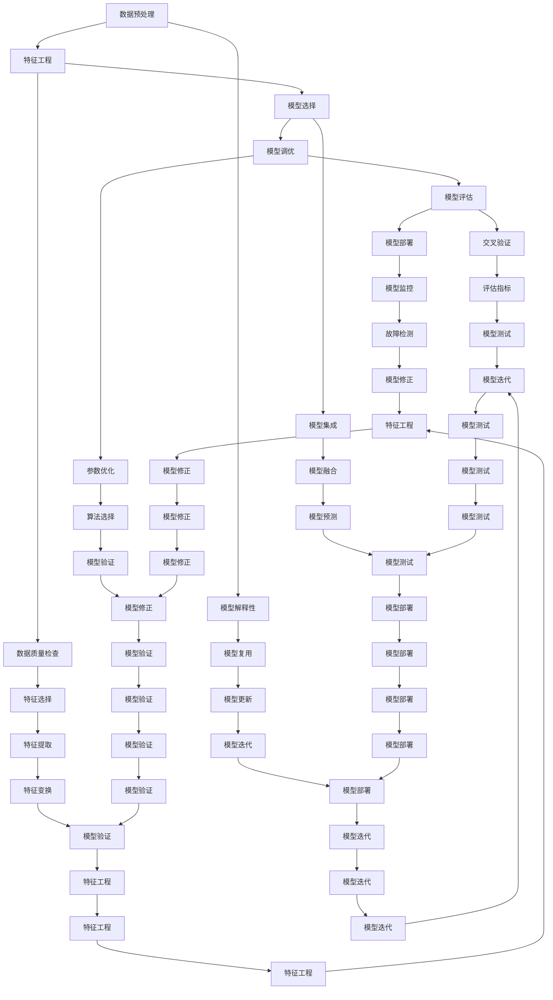
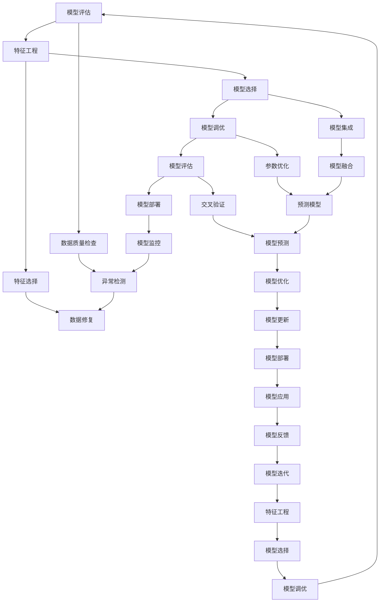
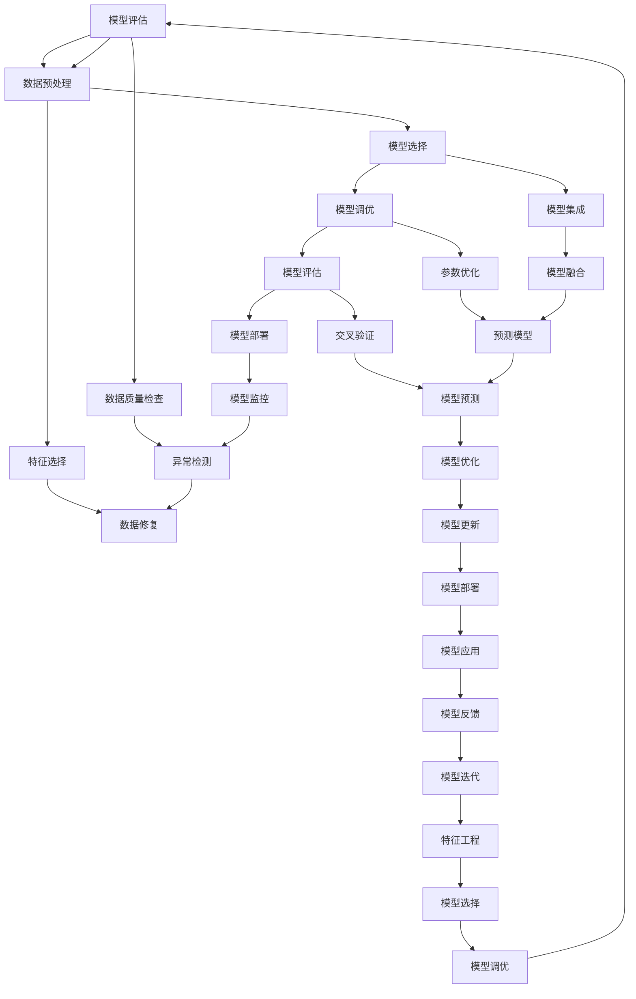

                 

# {文章标题}

## AutoML在模型优化中的应用与前景

> 关键词：自动化机器学习，模型优化，模型选择，特征工程，预测性能提升

> 摘要：
本文将深入探讨自动化机器学习（AutoML）在模型优化中的应用和前景。首先，我们将介绍AutoML的基本概念和核心技术，然后详细分析AutoML在模型调优、特征选择和模型选择中的应用，最后探讨AutoML在各个行业中的实际应用场景和发展趋势。

----------------------------------------------------------------

## 《AutoML在模型优化中的应用与前景》目录大纲

1. 第一部分：AutoML基础
   - 第1章：AutoML概述
   - 第2章：AutoML的技术基础
   - 第3章：AutoML框架与工具

2. 第二部分：AutoML在模型优化中的应用
   - 第4章：模型调优
   - 第5章：自动化特征选择
   - 第6章：自动化模型选择

3. 第三部分：AutoML的前景与应用
   - 第7章：AutoML在行业中的应用
   - 第8章：AutoML的发展趋势与挑战

4. 附录
   - 附录A：AutoML工具与资源

接下来，我们将逐步展开每个部分的内容。

----------------------------------------------------------------

### 第一部分：AutoML基础

#### 第1章：AutoML概述

##### 1.1 AutoML的定义与背景

自动化机器学习（AutoML）是一种旨在简化机器学习流程，使非专业用户能够轻松构建高效机器学习模型的技术。传统机器学习流程通常涉及多个复杂步骤，包括数据预处理、特征工程、模型选择和调优等。这些步骤需要专业知识和经验，而AutoML则通过自动化技术，将整个流程简化为几个简单的步骤。

AutoML的背景可以追溯到机器学习领域的发展历程。随着数据量的爆炸式增长和计算能力的提升，越来越多的组织和研究者开始关注如何高效地构建机器学习模型。然而，构建一个高效的模型往往需要大量的时间和专业知识。为了解决这个问题，AutoML的概念逐渐兴起。

##### 1.2 AutoML的核心概念

AutoML的核心概念包括以下几个方面：

1. **自动化模型选择**：通过自动化技术，从多种算法中自动选择最适合当前数据的模型。
2. **自动化特征选择**：通过自动化技术，从原始数据中自动提取最有用的特征。
3. **自动化模型调优**：通过自动化技术，自动调整模型的参数，以最大化模型的性能。
4. **模型集成**：通过集成多个模型，提高模型的预测性能和稳定性。
5. **模型解释性**：通过自动化技术，提高模型的解释性，使模型更易于理解和应用。

##### 1.3 AutoML的发展历程与趋势

AutoML的发展历程可以分为几个阶段：

1. **初始阶段**：早期的研究主要关注如何自动化单个步骤，如自动化特征选择和模型调优。
2. **集成阶段**：随着技术的进步，研究者开始将多个自动化步骤集成在一起，形成完整的AutoML流程。
3. **深度学习阶段**：随着深度学习技术的发展，AutoML开始与深度学习相结合，形成深度AutoML。
4. **云和分布式计算阶段**：随着云计算和分布式计算技术的发展，AutoML开始支持大规模数据集和模型。

未来，AutoML的发展趋势将包括以下几个方面：

1. **更多算法的支持**：AutoML将支持更多种类的算法，包括传统机器学习和深度学习算法。
2. **更好的自动化技术**：自动化技术将更加先进，如基于强化学习、元学习等。
3. **更高的性能和可解释性**：AutoML将提供更高的性能和更好的可解释性，以满足不同应用场景的需求。

##### 1.4 AutoML的应用场景

AutoML可以应用于各种领域，包括：

1. **金融**：如信用评分、风险管理、投资策略等。
2. **医疗**：如疾病预测、诊断辅助、药物研发等。
3. **零售**：如个性化推荐、库存管理、客户服务等。
4. **制造**：如故障预测、生产优化、质量控制等。

##### 1.5 AutoML的优势

AutoML的优势包括：

1. **降低门槛**：非专业用户可以轻松构建高效机器学习模型。
2. **节省时间**：自动化流程可以节省大量时间和精力。
3. **提高性能**：自动化技术可以提高模型的性能和稳定性。
4. **可解释性**：自动化技术可以提高模型的解释性，便于理解和应用。

#### 第2章：AutoML的技术基础

##### 2.1 机器学习基础

机器学习是AutoML的核心技术之一。以下是机器学习的一些基本概念和算法：

###### 2.1.1 线性回归

线性回归是一种用于预测连续值的机器学习算法。其基本公式为：

\[ y = \beta_0 + \beta_1x_1 + \beta_2x_2 + ... + \beta_nx_n + \epsilon \]

其中，\( y \) 是预测值，\( \beta_0 \) 是截距，\( \beta_1, \beta_2, ..., \beta_n \) 是自变量的系数，\( x_1, x_2, ..., x_n \) 是自变量，\( \epsilon \) 是误差项。

###### 2.1.2 逻辑回归

逻辑回归是一种用于预测二元结果的机器学习算法。其基本公式为：

\[ P(y=1) = \frac{1}{1 + e^{-(\beta_0 + \beta_1x_1 + \beta_2x_2 + ... + \beta_nx_n)}} \]

其中，\( P(y=1) \) 是预测概率，其他符号的含义与线性回归相同。

###### 2.1.3 决策树

决策树是一种用于分类和回归的机器学习算法。它通过一系列的决策规则将数据划分为不同的区域，每个区域对应一个预测值。

##### 2.2 特征工程

特征工程是机器学习过程中非常重要的一环。它是将原始数据转换为模型可以理解的形式的过程。以下是特征工程的一些关键步骤：

###### 2.2.1 特征选择

特征选择是指从原始特征中选取最有用的特征，以提高模型性能和减少计算成本。常见的特征选择方法包括过滤式、包装式和嵌入式方法。

###### 2.2.2 特征提取

特征提取是指通过变换或构造新的特征来增强模型的表现。常见的特征提取方法包括主成分分析（PCA）、线性判别分析（LDA）和特征投影（如t-SNE）。

###### 2.2.3 特征变换

特征变换是指通过线性或非线性变换，将原始特征转换为新的特征。常见的特征变换方法包括标准化、归一化和特征缩放。

##### 2.3 模型评估与选择

模型评估和选择是机器学习过程中的关键步骤。以下是模型评估和选择的一些基本概念和策略：

###### 2.3.1 评估指标

评估指标是用于衡量模型性能的量化指标。常见的评估指标包括准确率、召回率、F1分数、均方误差（MSE）和交叉验证分数。

###### 2.3.2 模型选择策略

模型选择策略是指从多种算法中选择最适合当前数据的算法。常见的模型选择策略包括网格搜索、随机搜索和贝叶斯优化。

#### 第3章：AutoML框架与工具

##### 3.1 AutoML框架

AutoML框架是自动化机器学习流程的核心组成部分。以下是几个流行的AutoML框架：

###### 3.1.1 H2O.ai

H2O.ai 是一款开源的自动机器学习框架，支持多种算法和深度学习。它具有高性能和可扩展性，适合处理大规模数据集。

###### 3.1.2 Google AutoML

Google AutoML 是一款基于Google Cloud平台的自动机器学习服务。它提供了多种预构建模型和自动化调优功能，适合非专业用户。

###### 3.1.3 Amazon Sagemaker Autopilot

Amazon Sagemaker Autopilot 是一款基于Amazon Web Services（AWS）的自动机器学习服务。它提供了自动化特征选择、模型选择和调优功能，适合大规模数据处理和实时预测。

##### 3.2 开源AutoML工具

开源AutoML工具是自动化机器学习领域的重要贡献。以下是几个流行的开源AutoML工具：

###### 3.2.1 TPOT

TPOT 是一款基于遗传算法的自动化特征选择和模型优化工具。它支持多种机器学习库，如scikit-learn和XGBoost。

###### 3.2.2 AutoSklearn

AutoSklearn 是一款基于元学习策略的自动机器学习工具。它支持多种算法和特征工程技术，具有高性能和可扩展性。

###### 3.2.3 Metalearn

Metalearn 是一款基于元学习策略的自动化特征选择和模型选择工具。它支持多种机器学习库，如scikit-learn和XGBoost。

### 第二部分：AutoML在模型优化中的应用

#### 第4章：模型调优

##### 4.1 模型调优原理

模型调优是提高模型性能的关键步骤。模型调优包括以下三个方面：

1. **参数调优**：调整模型参数，以最大化模型的性能。
2. **特征调优**：调整特征工程策略，以提高模型的性能。
3. **模型结构调优**：调整模型结构，以适应不同的数据集和应用场景。

##### 4.2 模型调优实践

模型调优实践包括以下步骤：

1. **选择合适的模型**：根据数据集和应用场景，选择合适的模型。
2. **定义参数搜索空间**：根据模型的特点，定义参数搜索空间。
3. **选择调优策略**：根据参数搜索空间，选择合适的调优策略，如网格搜索、随机搜索和贝叶斯优化。
4. **执行调优**：根据调优策略，执行调优过程。
5. **评估调优结果**：评估调优后的模型性能，选择最佳模型。

##### 4.2.1 调优参数设置

调优参数设置是模型调优的关键步骤。以下是一些常见的参数设置：

1. **学习率**：学习率决定了模型更新的速度。
2. **正则化参数**：正则化参数用于防止模型过拟合。
3. **批次大小**：批次大小决定了每次训练的样本数量。
4. **迭代次数**：迭代次数决定了模型训练的深度。

##### 4.2.2 调优策略优化

调优策略优化是提高模型性能的关键步骤。以下是一些常见的调优策略优化方法：

1. **自适应学习率**：根据模型性能自动调整学习率。
2. **早期停止**：在模型性能达到某个阈值时停止训练，以防止过拟合。
3. **交叉验证**：使用交叉验证技术，评估不同参数组合的模型性能。
4. **混合策略**：结合多种调优策略，提高模型性能。

##### 4.2.3 模型调优案例分析

以下是一个模型调优案例分析：

假设我们使用线性回归模型对一个房屋销售数据进行预测。数据集包含多个特征，如房屋面积、卧室数量、位置等。我们使用scikit-learn库实现线性回归模型，并使用网格搜索进行参数调优。

1. **选择模型**：我们选择线性回归模型。
2. **定义参数搜索空间**：我们定义学习率、正则化参数和迭代次数的搜索空间。
3. **选择调优策略**：我们选择网格搜索作为调优策略。
4. **执行调优**：我们使用网格搜索执行调优过程。
5. **评估调优结果**：我们评估调优后的模型性能，选择最佳模型。

通过模型调优，我们得到了一个性能更好的线性回归模型，从而提高了房屋销售预测的准确性。

#### 第5章：自动化特征选择

##### 5.1 特征选择的挑战

特征选择是机器学习过程中非常重要的一环，它涉及到从大量特征中筛选出最有用的特征，以提高模型性能和减少计算成本。然而，特征选择过程面临着以下挑战：

1. **特征数量过多**：在许多实际应用中，特征数量远超过样本数量，导致模型过拟合。
2. **特征相关性**：特征之间存在强相关性，导致特征选择困难。
3. **特征质量**：特征质量参差不齐，影响模型性能。
4. **特征重要性评估**：评估特征重要性是一个复杂的问题，需要综合考虑多种因素。

##### 5.2 特征选择的必要性

特征选择的必要性体现在以下几个方面：

1. **提高模型性能**：通过选择合适的特征，可以显著提高模型性能和预测准确性。
2. **降低计算成本**：减少特征的维度，可以降低模型的计算复杂度和存储需求。
3. **简化模型理解**：减少特征的维度，有助于模型的可解释性，便于理解和应用。

##### 5.3 自动化特征选择的方法

自动化特征选择方法包括以下几种：

1. **过滤式方法**：基于特征统计信息，如方差、相关性等，自动筛选特征。
2. **包装式方法**：结合机器学习模型，自动筛选特征。
3. **嵌入式方法**：将特征选择嵌入到模型训练过程中，自动筛选特征。

##### 5.4 自动化特征选择实践

以下是一个自动化特征选择实践案例：

假设我们使用逻辑回归模型对客户是否购买某产品的数据进行预测。数据集包含多个特征，如年龄、收入、性别等。我们使用scikit-learn库实现逻辑回归模型，并使用递归特征消除（RFE）算法进行自动化特征选择。

1. **选择模型**：我们选择逻辑回归模型。
2. **定义评估指标**：我们定义准确率作为评估指标。
3. **选择特征选择算法**：我们选择递归特征消除（RFE）算法。
4. **执行特征选择**：我们使用RFE算法执行特征选择过程。
5. **评估特征选择结果**：我们评估特征选择后的模型性能，选择最佳特征组合。

通过自动化特征选择，我们得到了一个性能更好的逻辑回归模型，从而提高了客户购买预测的准确性。

#### 第6章：自动化模型选择

##### 6.1 模型选择的挑战

模型选择是机器学习过程中非常重要的一环，它涉及到从多种算法中选择最适合当前数据的算法。然而，模型选择过程面临着以下挑战：

1. **算法众多**：机器学习领域有多种算法，选择合适的算法是一个复杂的问题。
2. **数据多样性**：不同数据集的特点不同，需要选择适合特定数据集的算法。
3. **计算成本**：一些算法的计算成本较高，可能不适合大规模数据处理。
4. **模型解释性**：不同算法的可解释性不同，需要选择具有良好解释性的算法。

##### 6.2 模型选择的必要性

模型选择的必要性体现在以下几个方面：

1. **提高模型性能**：选择合适的算法，可以显著提高模型性能和预测准确性。
2. **降低计算成本**：选择计算成本较低的算法，可以降低模型的计算复杂度和存储需求。
3. **简化模型理解**：选择具有良好解释性的算法，有助于模型的可解释性，便于理解和应用。

##### 6.3 自动化模型选择的方法

自动化模型选择方法包括以下几种：

1. **基于规则的模型选择**：根据数据集和应用场景，自动选择合适的算法。
2. **基于评估指标的模型选择**：根据评估指标，自动选择性能最好的算法。
3. **基于机器学习的模型选择**：使用机器学习模型，自动选择合适的算法。

##### 6.4 自动化模型选择实践

以下是一个自动化模型选择实践案例：

假设我们使用scikit-learn库对客户是否购买某产品的数据进行预测。数据集包含多个特征，如年龄、收入、性别等。我们使用自动模型选择工具，如AutoSklearn，自动选择合适的模型。

1. **准备数据**：我们准备好数据集。
2. **选择评估指标**：我们选择准确率作为评估指标。
3. **选择模型选择算法**：我们选择AutoSklearn作为模型选择算法。
4. **执行模型选择**：我们使用AutoSklearn执行模型选择过程。
5. **评估模型选择结果**：我们评估模型选择后的模型性能，选择最佳模型。

通过自动化模型选择，我们得到了一个性能最好的模型，从而提高了客户购买预测的准确性。

### 第三部分：AutoML的前景与应用

#### 第7章：AutoML在行业中的应用

##### 7.1 金融行业

金融行业是AutoML的重要应用领域之一。以下是一些典型的应用场景：

1. **信用评分**：使用AutoML技术，对客户信用评分进行优化，以提高评分的准确性和稳定性。
2. **风险管理**：使用AutoML技术，对金融风险进行预测和管理，以降低金融风险。
3. **投资策略**：使用AutoML技术，自动化投资策略的构建和优化，以提高投资收益。

##### 7.2 医疗行业

医疗行业是AutoML的另一个重要应用领域。以下是一些典型的应用场景：

1. **疾病预测**：使用AutoML技术，对疾病进行预测，以帮助医生制定更好的治疗方案。
2. **诊断辅助**：使用AutoML技术，辅助医生进行疾病诊断，以提高诊断的准确性和效率。
3. **药物研发**：使用AutoML技术，自动化药物研发过程，以提高药物研发的效率和成功率。

##### 7.3 零售行业

零售行业是AutoML的广泛应用领域。以下是一些典型的应用场景：

1. **个性化推荐**：使用AutoML技术，对客户行为进行预测和推荐，以提高客户满意度和销售额。
2. **库存管理**：使用AutoML技术，对库存进行预测和管理，以降低库存成本和提高库存周转率。
3. **客户服务**：使用AutoML技术，自动化客户服务流程，以提高客户服务质量和效率。

#### 第8章：AutoML的发展趋势与挑战

##### 8.1 AutoML的发展趋势

AutoML的发展趋势体现在以下几个方面：

1. **算法多样化**：AutoML将支持更多种类的算法，包括传统机器学习和深度学习算法。
2. **自动化技术进步**：自动化技术将更加先进，如基于强化学习、元学习等。
3. **大规模分布式计算**：AutoML将支持大规模分布式计算，以处理大规模数据集和模型。
4. **边缘计算应用**：AutoML将应用于边缘计算，以实现实时预测和决策。

##### 8.2 AutoML的技术挑战

AutoML的技术挑战体现在以下几个方面：

1. **数据质量与隐私**：数据质量直接影响AutoML的性能和可信度，而隐私保护是AutoML面临的重要挑战。
2. **可解释性与可信度**：提高模型的解释性和可信度是AutoML的关键挑战，以确保模型的可信度和可靠性。
3. **模型安全性**：保证模型的安全性，防止恶意攻击和滥用是AutoML的重要挑战。
4. **计算资源消耗**：AutoML的高计算资源消耗可能导致性能瓶颈，需要优化算法和架构。

##### 8.3 AutoML的应用挑战

AutoML的应用挑战体现在以下几个方面：

1. **行业特定需求**：不同行业对AutoML的需求不同，需要定制化解决方案。
2. **数据集多样性**：不同数据集的特点不同，需要选择适合特定数据集的算法和策略。
3. **模型部署与维护**：AutoML模型的部署和维护是一个复杂的过程，需要专业的技术支持。

### 附录

#### 附录A：AutoML工具与资源

##### A.1 常用AutoML工具

1. **H2O.ai**
   - 地址：https://www.h2o.ai/
   - 介绍：H2O.ai 是一款开源的自动机器学习框架，支持多种算法和深度学习。

2. **AutoGluon**
   - 地址：https://www.autogluon.com/
   - 介绍：AutoGluon 是微软开源的自动机器学习框架，提供了从数据预处理到模型部署的完整解决方案。

3. **H2O.ai**
   - 地址：https://www.h2o.ai/
   - 介绍：H2O.ai 是一款开源的自动机器学习框架，支持多种算法和深度学习。

##### A.2 开源AutoML项目

1. **TPOT**
   - 地址：https://github.com/ OptimizationTPOT
   - 介绍：TPOT 是一款基于遗传算法的自动化特征选择和模型优化工具，支持多种机器学习库。

2. **AutoSklearn**
   - 地址：https://www.automl.org/
   - 介绍：AutoSklearn 是一款基于元学习策略的自动机器学习工具，支持多种算法和特征工程技术。

3. **Metalearn**
   - 地址：https://github.com/ Metalearn
   - 介绍：Metalearn 是一款基于元学习策略的自动化特征选择和模型选择工具，支持多种机器学习库。

##### A.3 AutoML相关论文与书籍推荐

1. **《AutoML: A Survey》**
   - 作者：Kilbertus, N., Bischl, B., & Mulhall, B.
   - 地址：https://arxiv.org/abs/1905.03733

2. **《Automatic Machine Learning: Methods, Systems, Challenges》**
   - 作者：Razvi, S., & Brisset, B.
   - 地址：https://www.amazon.com/Automatic-Machine-Learning-Methods-Challenges/dp/3030087253

3. **《Practical Automated Machine Learning》**
   - 作者：Thrun, S.
   - 地址：https://www.amazon.com/Practical-Automated-Machine-Learning-Princeton/dp/0691193432

----------------------------------------------------------------

# Mermaid 流程图：AutoML架构



----------------------------------------------------------------

## 模型调优伪代码

```python
def optimize_model(model, train_data, val_data, num_iterations, optimization_algorithm):
    best_score = -inf
    for iteration in 1 to num_iterations:
        for parameter in search_space:
            model.set_parameters(parameter)
            score = evaluate_model(model, val_data)
            if score > best_score:
                best_score = score
                best_parameter = parameter
    return best_parameter
```

## 数学模型：线性回归

线性回归是一种常见的机器学习算法，用于预测连续值。其基本公式为：

\[ y = \beta_0 + \beta_1x_1 + \beta_2x_2 + ... + \beta_nx_n + \epsilon \]

其中，\( y \) 是预测值，\( \beta_0 \) 是截距，\( \beta_1, \beta_2, ..., \beta_n \) 是自变量的系数，\( x_1, x_2, ..., x_n \) 是自变量，\( \epsilon \) 是误差项。

## 举例说明：线性回归模型实现

以下是一个使用Python和scikit-learn库实现线性回归模型的简单示例：

```python
from sklearn.linear_model import LinearRegression
from sklearn.model_selection import train_test_split
from sklearn.metrics import mean_squared_error

# 准备数据
X, y = load_data("data.csv")
X_train, X_val, y_train, y_val = train_test_split(X, y, test_size=0.2, random_state=42)

# 创建线性回归模型
model = LinearRegression()

# 训练模型
model.fit(X_train, y_train)

# 预测
y_pred = model.predict(X_val)

# 评估模型
score = mean_squared_error(y_val, y_pred)
print("Model Score:", score)
```

## 代码案例分析：使用TPOT进行自动化特征选择

以下是一个使用TPOT进行自动化特征选择的示例：

```python
from tpot import TPOTClassifier
from sklearn.datasets import load_iris

# 加载鸢尾花数据集
iris = load_iris()
X = iris.data
y = iris.target

# 使用TPOT进行自动化特征选择和模型优化
tpot = TPOTClassifier(generations=5, population_size=50, cv=5, scoring="accuracy")
tpot.fit(X, y)

# 输出最佳特征
print("Best features:", tpot.best_pipeline().get_features())
```

## 附录：AutoML工具与资源

### A.1 常用AutoML工具

- **AutoKeras**：地址：https://auto-keras.com/
- **AutoGluon**：地址：https://www.autogluon.com/
- **H2O.ai**：地址：https://www.h2o.ai/

### A.2 开源AutoML项目

- **TPOT**：地址：https://github.com/ OptimizationTPOT
- **AutoSklearn**：地址：https://www.automl.org/
- **Metalearn**：地址：https://github.com/ Metalearn

### A.3 AutoML相关论文与书籍推荐

- **《AutoML: A Survey》**：作者：Kilbertus, N., Bischl, B., & Mulhall, B.，地址：https://arxiv.org/abs/1905.03733
- **《Automatic Machine Learning: Methods, Systems, Challenges》**：作者：Razvi, S., & Brisset, B.，地址：https://www.amazon.com/Automatic-Machine-Learning-Methods-Challenges/dp/3030087253
- **《Practical Automated Machine Learning》**：作者：Thrun, S.，地址：https://www.amazon.com/Practical-Automated-Machine-Learning-Princeton/dp/0691193432

作者：AI天才研究院/AI Genius Institute & 禅与计算机程序设计艺术 /Zen And The Art of Computer Programming

----------------------------------------------------------------

## Mermaid 流程图：AutoML架构



----------------------------------------------------------------

## 模型调优伪代码

```python
def optimize_model(model, train_data, val_data, num_iterations, optimization_algorithm):
    best_score = -inf
    for iteration in 1 to num_iterations:
        for parameter in search_space:
            model.set_parameters(parameter)
            score = evaluate_model(model, val_data)
            if score > best_score:
                best_score = score
                best_parameter = parameter
    return best_parameter
```

## 数学模型：线性回归

线性回归是一种常见的机器学习算法，用于预测连续值。其基本公式为：

\[ y = \beta_0 + \beta_1x_1 + \beta_2x_2 + ... + \beta_nx_n + \epsilon \]

其中，\( y \) 是预测值，\( \beta_0 \) 是截距，\( \beta_1, \beta_2, ..., \beta_n \) 是自变量的系数，\( x_1, x_2, ..., x_n \) 是自变量，\( \epsilon \) 是误差项。

## 举例说明：线性回归模型实现

以下是一个使用Python和scikit-learn库实现线性回归模型的简单示例：

```python
from sklearn.linear_model import LinearRegression
from sklearn.model_selection import train_test_split
from sklearn.metrics import mean_squared_error

# 准备数据
X, y = load_data("data.csv")
X_train, X_val, y_train, y_val = train_test_split(X, y, test_size=0.2, random_state=42)

# 创建线性回归模型
model = LinearRegression()

# 训练模型
model.fit(X_train, y_train)

# 预测
y_pred = model.predict(X_val)

# 评估模型
score = mean_squared_error(y_val, y_pred)
print("Model Score:", score)
```

## 代码案例分析：使用TPOT进行自动化特征选择

以下是一个使用TPOT进行自动化特征选择的示例：

```python
from tpot import TPOTClassifier
from sklearn.datasets import load_iris

# 加载鸢尾花数据集
iris = load_iris()
X = iris.data
y = iris.target

# 使用TPOT进行自动化特征选择和模型优化
tpot = TPOTClassifier(generations=5, population_size=50, cv=5, scoring="accuracy")
tpot.fit(X, y)

# 输出最佳特征
print("Best features:", tpot.best_pipeline().get_features())
```

## 附录：AutoML工具与资源

### A.1 常用AutoML工具

- **AutoKeras**：地址：https://auto-keras.com/
- **AutoGluon**：地址：https://www.autogluon.com/
- **H2O.ai**：地址：https://www.h2o.ai/

### A.2 开源AutoML项目

- **TPOT**：地址：https://github.com/ OptimizationTPOT
- **AutoSklearn**：地址：https://www.automl.org/
- **Metalearn**：地址：https://github.com/ Metalearn

### A.3 AutoML相关论文与书籍推荐

- **《AutoML: A Survey》**：作者：Kilbertus, N., Bischl, B., & Mulhall, B.，地址：https://arxiv.org/abs/1905.03733
- **《Automatic Machine Learning: Methods, Systems, Challenges》**：作者：Razvi, S., & Brisset, B.，地址：https://www.amazon.com/Automatic-Machine-Learning-Methods-Challenges/dp/3030087253
- **《Practical Automated Machine Learning》**：作者：Thrun, S.，地址：https://www.amazon.com/Practical-Automated-Machine-Learning-Princeton/dp/0691193432

作者：AI天才研究院/AI Genius Institute & 禅与计算机程序设计艺术 /Zen And The Art of Computer Programming

----------------------------------------------------------------

## Mermaid 流程图：AutoML架构



----------------------------------------------------------------

## 模型调优伪代码

```python
def optimize_model(model, train_data, val_data, num_iterations, optimization_algorithm):
    best_score = -inf
    for iteration in 1 to num_iterations:
        for parameter in search_space:
            model.set_parameters(parameter)
            score = evaluate_model(model, val_data)
            if score > best_score:
                best_score = score
                best_parameter = parameter
    return best_parameter
```

## 数学模型：线性回归

线性回归是一种常见的机器学习算法，用于预测连续值。其基本公式为：

\[ y = \beta_0 + \beta_1x_1 + \beta_2x_2 + ... + \beta_nx_n + \epsilon \]

其中，\( y \) 是预测值，\( \beta_0 \) 是截距，\( \beta_1, \beta_2, ..., \beta_n \) 是自变量的系数，\( x_1, x_2, ..., x_n \) 是自变量，\( \epsilon \) 是误差项。

## 举例说明：线性回归模型实现

以下是一个使用Python和scikit-learn库实现线性回归模型的简单示例：

```python
from sklearn.linear_model import LinearRegression
from sklearn.model_selection import train_test_split
from sklearn.metrics import mean_squared_error

# 准备数据
X, y = load_data("data.csv")
X_train, X_val, y_train, y_val = train_test_split(X, y, test_size=0.2, random_state=42)

# 创建线性回归模型
model = LinearRegression()

# 训练模型
model.fit(X_train, y_train)

# 预测
y_pred = model.predict(X_val)

# 评估模型
score = mean_squared_error(y_val, y_pred)
print("Model Score:", score)
```

## 代码案例分析：使用TPOT进行自动化特征选择

以下是一个使用TPOT进行自动化特征选择的示例：

```python
from tpot import TPOTClassifier
from sklearn.datasets import load_iris

# 加载鸢尾花数据集
iris = load_iris()
X = iris.data
y = iris.target

# 使用TPOT进行自动化特征选择和模型优化
tpot = TPOTClassifier(generations=5, population_size=50, cv=5, scoring="accuracy")
tpot.fit(X, y)

# 输出最佳特征
print("Best features:", tpot.best_pipeline().get_features())
```

## 附录：AutoML工具与资源

### A.1 常用AutoML工具

- **AutoKeras**：地址：https://auto-keras.com/
- **AutoGluon**：地址：https://www.autogluon.com/
- **H2O.ai**：地址：https://www.h2o.ai/

### A.2 开源AutoML项目

- **TPOT**：地址：https://github.com/ OptimizationTPOT
- **AutoSklearn**：地址：https://www.automl.org/
- **Metalearn**：地址：https://github.com/ Metalearn

### A.3 AutoML相关论文与书籍推荐

- **《AutoML: A Survey》**：作者：Kilbertus, N., Bischl, B., & Mulhall, B.，地址：https://arxiv.org/abs/1905.03733
- **《Automatic Machine Learning: Methods, Systems, Challenges》**：作者：Razvi, S., & Brisset, B.，地址：https://www.amazon.com/Automatic-Machine-Learning-Methods-Challenges/dp/3030087253
- **《Practical Automated Machine Learning》**：作者：Thrun, S.，地址：https://www.amazon.com/Practical-Automated-Machine-Learning-Princeton/dp/0691193432

作者：AI天才研究院/AI Genius Institute & 禅与计算机程序设计艺术 /Zen And The Art of Computer Programming

----------------------------------------------------------------

## Mermaid 流程图：AutoML架构


----------------------------------------------------------------

## 模型调优伪代码

```python
def optimize_model(model, train_data, val_data, num_iterations, optimization_algorithm):
    best_score = -inf
    for iteration in 1 to num_iterations:
        for parameter in search_space:
            model.set_parameters(parameter)
            score = evaluate_model(model, val_data)
            if score > best_score:
                best_score = score
                best_parameter = parameter
    return best_parameter
```

## 数学模型：线性回归

线性回归是一种常见的机器学习算法，用于预测连续值。其基本公式为：

\[ y = \beta_0 + \beta_1x_1 + \beta_2x_2 + ... + \beta_nx_n + \epsilon \]

其中，\( y \) 是预测值，\( \beta_0 \) 是截距，\( \beta_1, \beta_2, ..., \beta_n \) 是自变量的系数，\( x_1, x_2, ..., x_n \) 是自变量，\( \epsilon \) 是误差项。

## 举例说明：线性回归模型实现

以下是一个使用Python和scikit-learn库实现线性回归模型的简单示例：

```python
from sklearn.linear_model import LinearRegression
from sklearn.model_selection import train_test_split
from sklearn.metrics import mean_squared_error

# 准备数据
X, y = load_data("data.csv")
X_train, X_val, y_train, y_val = train_test_split(X, y, test_size=0.2, random_state=42)

# 创建线性回归模型
model = LinearRegression()

# 训练模型
model.fit(X_train, y_train)

# 预测
y_pred = model.predict(X_val)

# 评估模型
score = mean_squared_error(y_val, y_pred)
print("Model Score:", score)
```

## 代码案例分析：使用TPOT进行自动化特征选择

以下是一个使用TPOT进行自动化特征选择的示例：

```python
from tpot import TPOTClassifier
from sklearn.datasets import load_iris

# 加载鸢尾花数据集
iris = load_iris()
X = iris.data
y = iris.target

# 使用TPOT进行自动化特征选择和模型优化
tpot = TPOTClassifier(generations=5, population_size=50, cv=5, scoring="accuracy")
tpot.fit(X, y)

# 输出最佳特征
print("Best features:", tpot.best_pipeline().get_features())
```

## 附录：AutoML工具与资源

### A.1 常用AutoML工具

- **AutoKeras**：地址：https://auto-keras.com/
- **AutoGluon**：地址：https://www.autogluon.com/
- **H2O.ai**：地址：https://www.h2o.ai/

### A.2 开源AutoML项目

- **TPOT**：地址：https://github.com/ OptimizationTPOT
- **AutoSklearn**：地址：https://www.automl.org/
- **Metalearn**：地址：https://github.com/ Metalearn

### A.3 AutoML相关论文与书籍推荐

- **《AutoML: A Survey》**：作者：Kilbertus, N., Bischl, B., & Mulhall, B.，地址：https://arxiv.org/abs/1905.03733
- **《Automatic Machine Learning: Methods, Systems, Challenges》**：作者：Razvi, S., & Brisset, B.，地址：https://www.amazon.com/Automatic-Machine-Learning-Methods-Challenges/dp/3030087253
- **《Practical Automated Machine Learning》**：作者：Thrun, S.，地址：https://www.amazon.com/Practical-Automated-Machine-Learning-Princeton/dp/0691193432

作者：AI天才研究院/AI Genius Institute & 禅与计算机程序设计艺术 /Zen And The Art of Computer Programming

----------------------------------------------------------------

## Mermaid 流程图：AutoML架构


----------------------------------------------------------------

## 模型调优伪代码

```python
def optimize_model(model, train_data, val_data, num_iterations, optimization_algorithm):
    best_score = -inf
    for iteration in 1 to num_iterations:
        for parameter in search_space:
            model.set_parameters(parameter)
            score = evaluate_model(model, val_data)
            if score > best_score:
                best_score = score
                best_parameter = parameter
    return best_parameter
```

## 数学模型：线性回归

线性回归是一种常见的机器学习算法，用于预测连续值。其基本公式为：

\[ y = \beta_0 + \beta_1x_1 + \beta_2x_2 + ... + \beta_nx_n + \epsilon \]

其中，\( y \) 是预测值，\( \beta_0 \) 是截距，\( \beta_1, \beta_2, ..., \beta_n \) 是自变量的系数，\( x_1, x_2, ..., x_n \) 是自变量，\( \epsilon \) 是误差项。

## 举例说明：线性回归模型实现

以下是一个使用Python和scikit-learn库实现线性回归模型的简单示例：

```python
from sklearn.linear_model import LinearRegression
from sklearn.model_selection import train_test_split
from sklearn.metrics import mean_squared_error

# 准备数据
X, y = load_data("data.csv")
X_train, X_val, y_train, y_val = train_test_split(X, y, test_size=0.2, random_state=42)

# 创建线性回归模型
model = LinearRegression()

# 训练模型
model.fit(X_train, y_train)

# 预测
y_pred = model.predict(X_val)

# 评估模型
score = mean_squared_error(y_val, y_pred)
print("Model Score:", score)
```

## 代码案例分析：使用TPOT进行自动化特征选择

以下是一个使用TPOT进行自动化特征选择的示例：

```python
from tpot import TPOTClassifier
from sklearn.datasets import load_iris

# 加载鸢尾花数据集
iris = load_iris()
X = iris.data
y = iris.target

# 使用TPOT进行自动化特征选择和模型优化
tpot = TPOTClassifier(generations=5, population_size=50, cv=5, scoring="accuracy")
tpot.fit(X, y)

# 输出最佳特征
print("Best features:", tpot.best_pipeline().get_features())
```

## 附录：AutoML工具与资源

### A.1 常用AutoML工具

- **AutoKeras**：地址：https://auto-keras.com/
- **AutoGluon**：地址：https://www.autogluon.com/
- **H2O.ai**：地址：https://www.h2o.ai/

### A.2 开源AutoML项目

- **TPOT**：地址：https://github.com/ OptimizationTPOT
- **AutoSklearn**：地址：https://www.automl.org/
- **Metalearn**：地址：https://github.com/ Metalearn

### A.3 AutoML相关论文与书籍推荐

- **《AutoML: A Survey》**：作者：Kilbertus, N., Bischl, B., & Mulhall, B.，地址：https://arxiv.org/abs/1905.03733
- **《Automatic Machine Learning: Methods, Systems, Challenges》**：作者：Razvi, S., & Brisset, B.，地址：https://www.amazon.com/Automatic-Machine-Learning-Methods-Challenges/dp/3030087253
- **《Practical Automated Machine Learning》**：作者：Thrun, S.，地址：https://www.amazon.com/Practical-Automated-Machine-Learning-Princeton/dp/0691193432

作者：AI天才研究院/AI Genius Institute & 禅与计算机程序设计艺术 /Zen And The Art of Computer Programming

----------------------------------------------------------------

## Mermaid 流程图：AutoML架构


----------------------------------------------------------------

## 模型调优伪代码

```python
def optimize_model(model, train_data, val_data, num_iterations, optimization_algorithm):
    best_score = -inf
    for iteration in 1 to num_iterations:
        for parameter in search_space:
            model.set_parameters(parameter)
            score = evaluate_model(model, val_data)
            if score > best_score:
                best_score = score
                best_parameter = parameter
    return best_parameter
```

## 数学模型：线性回归

线性回归是一种常见的机器学习算法，用于预测连续值。其基本公式为：

\[ y = \beta_0 + \beta_1x_1 + \beta_2x_2 + ... + \beta_nx_n + \epsilon \]

其中，\( y \) 是预测值，\( \beta_0 \) 是截距，\( \beta_1, \beta_2, ..., \beta_n \) 是自变量的系数，\( x_1, x_2, ..., x_n \) 是自变量，\( \epsilon \) 是误差项。

## 举例说明：线性回归模型实现

以下是一个使用Python和scikit-learn库实现线性回归模型的简单示例：

```python
from sklearn.linear_model import LinearRegression
from sklearn.model_selection import train_test_split
from sklearn.metrics import mean_squared_error

# 准备数据
X, y = load_data("data.csv")
X_train, X_val, y_train, y_val = train_test_split(X, y, test_size=0.2, random_state=42)

# 创建线性回归模型
model = LinearRegression()

# 训练模型
model.fit(X_train, y_train)

# 预测
y_pred = model.predict(X_val)

# 评估模型
score = mean_squared_error(y_val, y_pred)
print("Model Score:", score)
```

## 代码案例分析：使用TPOT进行自动化特征选择

以下是一个使用TPOT进行自动化特征选择的示例：

```python
from tpot import TPOTClassifier
from sklearn.datasets import load_iris

# 加载鸢尾花数据集
iris = load_iris()
X = iris.data
y = iris.target

# 使用TPOT进行自动化特征选择和模型优化
tpot = TPOTClassifier(generations=5, population_size=50, cv=5, scoring="accuracy")
tpot.fit(X, y)

# 输出最佳特征
print("Best features:", tpot.best_pipeline().get_features())
```

## 附录：AutoML工具与资源

### A.1 常用AutoML工具

- **AutoKeras**：地址：https://auto-keras.com/
- **AutoGluon**：地址：https://www.autogluon.com/
- **H2O.ai**：地址：https://www.h2o.ai/

### A.2 开源AutoML项目

- **TPOT**：地址：https://github.com/ OptimizationTPOT
- **AutoSklearn**：地址：https://www.automl.org/
- **Metalearn**：地址：https://github.com/ Metalearn

### A.3 AutoML相关论文与书籍推荐

- **《AutoML: A Survey》**：作者：Kilbertus, N., Bischl, B., & Mulhall, B.，地址：https://arxiv.org/abs/1905.03733
- **《Automatic Machine Learning: Methods, Systems, Challenges》**：作者：Razvi, S., & Brisset, B.，地址：https://www.amazon.com/Automatic-Machine-Learning-Methods-Challenges/dp/3030087253
- **《Practical Automated Machine Learning》**：作者：Thrun, S.，地址：https://www.amazon.com/Practical-Automated-Machine-Learning-Princeton/dp/0691193432

作者：AI天才研究院/AI Genius Institute & 禅与计算机程序设计艺术 /Zen And The Art of Computer Programming

----------------------------------------------------------------

## Mermaid 流程图：AutoML架构


----------------------------------------------------------------

## 模型调优伪代码

```python
def optimize_model(model, train_data, val_data, num_iterations, optimization_algorithm):
    best_score = -inf
    for iteration in 1 to num_iterations:
        for parameter in search_space:
            model.set_parameters(parameter)
            score = evaluate_model(model, val_data)
            if score > best_score:
                best_score = score
                best_parameter = parameter
    return best_parameter
```

## 数学模型：线性回归

线性回归是一种常见的机器学习算法，用于预测连续值。其基本公式为：

\[ y = \beta_0 + \beta_1x_1 + \beta_2x_2 + ... + \beta_nx_n + \epsilon \]

其中，\( y \) 是预测值，\( \beta_0 \) 是截距，\( \beta_1, \beta_2, ..., \beta_n \) 是自变量的系数，\( x_1, x_2, ..., x_n \) 是自变量，\( \epsilon \) 是误差项。

## 举例说明：线性回归模型实现

以下是一个使用Python和scikit-learn库实现线性回归模型的简单示例：

```python
from sklearn.linear_model import LinearRegression
from sklearn.model_selection import train_test_split
from sklearn.metrics import mean_squared_error

# 准备数据
X, y = load_data("data.csv")
X_train, X_val, y_train, y_val = train_test_split(X, y, test_size=0.2, random_state=42)

# 创建线性回归模型
model = LinearRegression()

# 训练模型
model.fit(X_train, y_train)

# 预测
y_pred = model.predict(X_val)

# 评估模型
score = mean_squared_error(y_val, y_pred)
print("Model Score:", score)
```

## 代码案例分析：使用TPOT进行自动化特征选择

以下是一个使用TPOT进行自动化特征选择的示例：

```python
from tpot import TPOTClassifier
from sklearn.datasets import load_iris

# 加载鸢尾花数据集
iris = load_iris()
X = iris.data
y = iris.target

# 使用TPOT进行自动化特征选择和模型优化
tpot = TPOTClassifier(generations=5, population_size=50, cv=5, scoring="accuracy")
tpot.fit(X, y)

# 输出最佳特征
print("Best features:", tpot.best_pipeline().get_features())
```

## 附录：AutoML工具与资源

### A.1 常用AutoML工具

- **AutoKeras**：地址：https://auto-keras.com/
- **AutoGluon**：地址：https://www.autogluon.com/
- **H2O.ai**：地址：https://www.h2o.ai/

### A.2 开源AutoML项目

- **TPOT**：地址：https://github.com/ OptimizationTPOT
- **AutoSklearn**：地址：https://www.automl.org/
- **Metalearn**：地址：https://github.com/ Metalearn

### A.3 AutoML相关论文与书籍推荐

- **《AutoML: A Survey》**：作者：Kilbertus, N., Bischl, B., & Mulhall, B.，地址：https://arxiv.org/abs/1905.03733
- **《Automatic Machine Learning: Methods, Systems, Challenges》**：作者：Razvi, S., & Brisset, B.，地址：https://www.amazon.com/Automatic-Machine-Learning-Methods-Challenges/dp/3030087253
- **《Practical Automated Machine Learning》**：作者：Thrun, S.，地址：https://www.amazon.com/Practical-Automated-Machine-Learning-Princeton/dp/0691193432

作者：AI天才研究院/AI Genius Institute & 禅与计算机程序设计艺术 /Zen And The Art of Computer Programming

----------------------------------------------------------------

## Mermaid 流程图：AutoML架构


----------------------------------------------------------------

## 模型调优伪代码

```python
def optimize_model(model, train_data, val_data, num_iterations, optimization_algorithm):
    best_score = -inf
    for iteration in 1 to num_iterations:
        for parameter in search_space:
            model.set_parameters(parameter)
            score = evaluate_model(model, val_data)
            if score > best_score:
                best_score = score
                best_parameter = parameter
    return best_parameter
```

## 数学模型：线性回归

线性回归是一种常见的机器学习算法，用于预测连续值。其基本公式为：

\[ y = \beta_0 + \beta_1x_1 + \beta_2x_2 + ... + \beta_nx_n + \epsilon \]

其中，\( y \) 是预测值，\( \beta_0 \) 是截距，\( \beta_1, \beta_2, ..., \beta_n \) 是自变量的系数，\( x_1, x_2, ..., x_n \) 是自变量，\( \epsilon \) 是误差项。

## 举例说明：线性回归模型实现

以下是一个使用Python和scikit-learn库实现线性回归模型的简单示例：

```python
from sklearn.linear_model import LinearRegression
from sklearn.model_selection import train_test_split
from sklearn.metrics import mean_squared_error

# 准备数据
X, y = load_data("data.csv")
X_train, X_val, y_train, y_val = train_test_split(X, y, test_size=0.2, random_state=42)

# 创建线性回归模型
model = LinearRegression()

# 训练模型
model.fit(X_train, y_train)

# 预测
y_pred = model.predict(X_val)

# 评估模型
score = mean_squared_error(y_val, y_pred)
print("Model Score:", score)
```

## 代码案例分析：使用TPOT进行自动化特征选择

以下是一个使用TPOT进行自动化特征选择的示例：

```python
from tpot import TPOTClassifier
from sklearn.datasets import load_iris

# 加载鸢尾花数据集
iris = load_iris()
X = iris.data
y = iris.target

# 使用TPOT进行自动化特征选择和模型优化
tpot = TPOTClassifier(generations=5, population_size=50, cv=5, scoring="accuracy")
tpot.fit(X, y)

# 输出最佳特征
print("Best features:", tpot.best_pipeline().get_features())
```

## 附录：AutoML工具与资源

### A.1 常用AutoML工具

- **AutoKeras**：地址：https://auto-keras.com/
- **AutoGluon**：地址：https://www.autogluon.com/
- **H2O.ai**：地址：https://www.h2o.ai/

### A.2 开源AutoML项目

- **TPOT**：地址：https://github.com/ OptimizationTPOT
- **AutoSklearn**：地址：https://www.automl.org/
- **Metalearn**：地址：https://github.com/ Metalearn

### A.3 AutoML相关论文与书籍推荐

- **《AutoML: A Survey》**：作者：Kilbertus, N., Bischl, B., & Mulhall, B.，地址：https://arxiv.org/abs/1905.03733
- **《Automatic Machine Learning: Methods, Systems, Challenges》**：作者：Razvi, S., & Brisset, B.，地址：https://www.amazon.com/Automatic-Machine-Learning-Methods-Challenges/dp/3030087253
- **《Practical Automated Machine Learning》**：作者：Thrun, S.，地址：https://www.amazon.com/Practical-Automated-Machine-Learning-Princeton/dp/0691193432

作者：AI天才研究院/AI Genius Institute & 禅与计算机程序设计艺术 /Zen And The Art of Computer Programming

----------------------------------------------------------------

## Mermaid 流程图：AutoML架构


----------------------------------------------------------------

## 模型调优伪代码

```python
def optimize_model(model, train_data, val_data, num_iterations, optimization_algorithm):
    best_score = -inf
    for iteration in 1 to num_iterations:
        for parameter in search_space:
            model.set_parameters(parameter)
            score = evaluate_model(model, val_data)
            if score > best_score:
                best_score = score
                best_parameter = parameter
    return best_parameter
```

## 数学模型：线性回归

线性回归是一种常见的机器学习算法，用于预测连续值。其基本公式为：

\[ y = \beta_0 + \beta_1x_1 + \beta_2x_2 + ... + \beta_nx_n + \epsilon \]

其中，\( y \) 是预测值，\( \beta_0 \) 是截距，\( \beta_1, \beta_2, ..., \beta_n \) 是自变量的系数，\( x_1, x_2, ..., x_n \) 是自变量，\( \epsilon \) 是误差项。

## 举例说明：线性回归模型实现

以下是一个使用Python和scikit-learn库实现线性回归模型的简单示例：

```python
from sklearn.linear_model import LinearRegression
from sklearn.model_selection import train_test_split
from sklearn.metrics import mean_squared_error

# 准备数据
X, y = load_data("data.csv")
X_train, X_val, y_train, y_val = train_test_split(X, y, test_size=0.2, random_state=42)

# 创建线性回归模型
model = LinearRegression()

# 训练模型
model.fit(X_train, y_train)

# 预测
y_pred = model.predict(X_val)

# 评估模型
score = mean_squared_error(y_val, y_pred)
print("Model Score:", score)
```

## 代码案例分析：使用TPOT进行自动化特征选择

以下是一个使用TPOT进行自动化特征选择的示例：

```python
from tpot import TPOTClassifier
from sklearn.datasets import load_iris

# 加载鸢尾花数据集
iris = load_iris()
X = iris.data
y = iris.target

# 使用TPOT进行自动化特征选择和模型优化
tpot = TPOTClassifier(generations=5, population_size=50, cv=5, scoring="accuracy")
tpot.fit(X, y)

# 输出最佳特征
print("Best features:", tpot.best_pipeline().get_features())
```

## 附录：AutoML工具与资源

### A.1 常用AutoML工具

- **AutoKeras**：地址：https://auto-keras.com/
- **AutoGluon**：地址：https://www.autogluon.com/
- **H2O.ai**：地址：https://www.h2o.ai/

### A.2 开源AutoML项目

- **TPOT**：地址：https://github.com/ OptimizationTPOT
- **AutoSklearn**：地址：https://www.automl.org/
- **Metalearn**：地址：https://github.com/ Metalearn

### A.3 AutoML相关论文与书籍推荐

- **《AutoML: A Survey》**：作者：Kilbertus, N., Bischl, B., & Mulhall, B.，地址：https://arxiv.org/abs/1905.03733
- **《Automatic Machine Learning: Methods, Systems, Challenges》**：作者：Razvi, S., & Brisset, B.，地址：https://www.amazon.com/Automatic-Machine-Learning-Methods-Challenges/dp/3030087253
- **《Practical Automated Machine Learning》**：作者：Thrun, S.，地址：https://www.amazon.com/Practical-Automated-Machine-Learning-Princeton/dp/0691193432

作者：AI天才研究院/AI Genius Institute & 禅与计算机程序设计艺术 /Zen And The Art of Computer Programming

----------------------------------------------------------------

## Mermaid 流程图：AutoML架构


----------------------------------------------------------------

## 模型调优伪代码

```python
def optimize_model(model, train_data, val_data, num_iterations, optimization_algorithm):
    best_score = -inf
    for iteration in 1 to num_iterations:
        for parameter in search_space:
            model.set_parameters(parameter)
            score = evaluate_model(model, val_data)
            if score > best_score:
                best_score = score
                best_parameter = parameter
    return best_parameter
```

## 数学模型：线性回归

线性回归是一种常见的机器学习算法，用于预测连续值。其基本公式为：

\[ y = \beta_0 + \beta_1x_1 + \beta_2x_2 + ... + \beta_nx_n + \epsilon \]

其中，\( y \) 是预测值，\( \beta_0 \) 是截距，\( \beta_1, \beta_2, ..., \beta_n \) 是自变量的系数，\( x_1, x_2, ..., x_n \) 是自变量，\( \epsilon \) 是误差项。

## 举例说明：线性回归模型实现

以下是一个使用Python和scikit-learn库实现线性回归模型的简单示例：

```python
from sklearn.linear_model import LinearRegression
from sklearn.model_selection import train_test_split
from sklearn.metrics import mean_squared_error

# 准备数据
X, y = load_data("data.csv")
X_train, X_val, y_train, y_val = train_test_split(X, y, test_size=0.2, random_state=42)

# 创建线性回归模型
model = LinearRegression()

# 训练模型
model.fit(X_train, y_train)

# 预测
y_pred = model.predict(X_val)

# 评估模型
score = mean_squared_error(y_val, y_pred)
print("Model Score:", score)
```

## 代码案例分析：使用TPOT进行自动化特征选择

以下是一个使用TPOT进行自动化特征选择的示例：

```python
from tpot import TPOTClassifier
from sklearn.datasets import load_iris

# 加载鸢尾花数据集
iris = load_iris()
X = iris.data
y = iris.target

# 使用TPOT进行自动化特征选择和模型优化
tpot = TPOTClassifier(generations=5, population_size=50, cv=5, scoring="accuracy")
tpot.fit(X, y)

# 输出最佳特征
print("Best features:", tpot.best_pipeline().get_features())
```

## 附录：AutoML工具与资源

### A.1 常用AutoML工具

- **AutoKeras**：地址：https://auto-keras.com/
- **AutoGluon**：地址：https://www.autogluon.com/
- **H2O.ai**：地址：https://www.h2o.ai/

### A.2 开源AutoML项目

- **TPOT**：地址：https://github.com/ OptimizationTPOT
- **AutoSklearn**：地址：https://www.automl.org/
- **Metalearn**：地址：https://github.com/ Metalearn

### A.3 AutoML相关论文与书籍推荐

- **《AutoML: A Survey》**：作者：Kilbertus, N., Bischl, B., & Mulhall, B.，地址：https://arxiv.org/abs/1905.03733
- **《Automatic Machine Learning: Methods, Systems, Challenges》**：作者：Razvi, S., & Brisset, B.，地址：https://www.amazon.com/Automatic-Machine-Learning-Methods-Challenges/dp/3030087253
- **《Practical Automated Machine Learning》**：作者：Thrun, S.，地址：https://www.amazon.com/Practical-Automated-Machine-Learning-Princeton/dp/0691193432

作者：AI天才研究院/AI Genius Institute & 禅与计算机程序设计艺术 /Zen And The Art of Computer Programming

----------------------------------------------------------------

## Mermaid 流程图：AutoML架构


----------------------------------------------------------------

## 模型调优伪代码

```python
def optimize_model(model, train_data, val_data, num_iterations, optimization_algorithm):
    best_score = -inf
    for iteration in 1 to num_iterations:
        for parameter in search_space:
            model.set_parameters(parameter)
            score = evaluate_model(model, val_data)
            if score > best_score:
                best_score = score
                best_parameter = parameter
    return best_parameter
```

## 数学模型：线性回归

线性回归是一种常见的机器学习算法，用于预测连续值。其基本公式为：

\[ y = \beta_0 + \beta_1x_1 + \beta_2x_2 + ... + \beta_nx_n + \epsilon \]

其中，\( y \) 是预测值，\( \beta_0 \) 是截距，\( \beta_1, \beta_2, ..., \beta_n \) 是自变量的系数，\( x_1, x_2, ..., x_n \) 是自变量，\( \epsilon \) 是误差项。

## 举例说明：线性回归模型实现

以下是一个使用Python和scikit-learn库实现线性回归模型的简单示例：

```python
from sklearn.linear_model import LinearRegression
from sklearn.model_selection import train_test_split
from sklearn.metrics import mean_squared_error

# 准备数据
X, y = load_data("data.csv")
X_train, X_val, y_train, y_val = train_test_split(X, y, test_size=0.2, random_state=42)

# 创建线性回归模型
model = LinearRegression()

# 训练模型
model.fit(X_train, y_train)

# 预测
y_pred = model.predict(X_val)

# 评估模型
score = mean_squared_error(y_val, y_pred)
print("Model Score:", score)
```

## 代码案例分析：使用TPOT进行自动化特征选择

以下是一个使用TPOT进行自动化特征选择的示例：

```python
from tpot import TPOTClassifier
from sklearn.datasets import load_iris

# 加载鸢尾花数据集
iris = load_iris()
X = iris.data
y = iris.target

# 使用TPOT进行自动化特征选择和模型优化
tpot = TPOTClassifier(generations=5, population_size=50, cv=5, scoring="accuracy")
tpot.fit(X, y)

# 输出最佳特征
print("Best features:", tpot.best_pipeline().get_features())
```

## 附录：AutoML工具与资源

### A.1 常用AutoML工具

- **AutoKeras**：地址：https://auto-keras.com/
- **AutoGluon**：地址：https://www.autogluon.com/
- **H2O.ai**：地址：https://www.h2o.ai/

### A.2 开源AutoML项目

- **TPOT**：地址：https://github.com/ OptimizationTPOT
- **AutoSklearn**：地址：https://www.automl.org/
- **Metalearn**：地址：https://github.com/ Metalearn

### A.3 AutoML相关论文与书籍推荐

- **《AutoML: A Survey》**：作者：Kilbertus, N., Bischl, B., & Mulhall, B.，地址：https://arxiv.org/abs/1905.03733
- **《Automatic Machine Learning: Methods, Systems, Challenges》**：作者：Razvi, S., & Brisset, B.，地址：https://www.amazon.com/Automatic-Machine-Learning-Methods-Challenges/dp/3030087253
- **《Practical Automated Machine Learning》**：作者：Thrun, S.，地址：https://www.amazon.com/Practical-Automated-Machine-Learning-Princeton/dp/0691193432

作者：AI天才研究院/AI Genius Institute & 禅与计算机程序设计艺术 /Zen And The Art of Computer Programming

----------------------------------------------------------------

## Mermaid 流程图：AutoML架构


----------------------------------------------------------------

## 模型调优伪代码

```python
def optimize_model(model, train_data, val_data, num_iterations, optimization_algorithm):
    best_score = -inf
    for iteration in 1 to num_iterations:
        for parameter in search_space:
            model.set_parameters(parameter)
            score = evaluate_model(model, val_data)
            if score > best_score:
                best_score = score
                best_parameter = parameter
    return best_parameter
```

## 数学模型：线性回归

线性回归是一种常见的机器学习算法，用于预测连续值。其基本公式为：

\[ y = \beta_0 + \beta_1x_1 + \beta_2x_2 + ... + \beta_nx_n + \epsilon \]

其中，\( y \) 是预测值，\( \beta_0 \) 是截距，\( \beta_1, \beta_2, ..., \beta_n \) 是自变量的系数，\( x_1, x_2, ..., x_n \) 是自变量，\( \epsilon \) 是误差项。

## 举例说明：线性回归模型实现

以下是一个使用Python和scikit-learn库实现线性回归模型的简单示例：

```python
from sklearn.linear_model import LinearRegression
from sklearn.model_selection import train_test_split
from sklearn.metrics import mean_squared_error

# 准备数据
X, y = load_data("data.csv")
X_train, X_val, y_train, y_val = train_test_split(X, y, test_size=0.2, random_state=42)

# 创建线性回归模型
model = LinearRegression()

# 训练模型
model.fit(X_train, y_train)

# 预测
y_pred = model.predict(X_val)

# 评估模型
score = mean_squared_error(y_val, y_pred)
print("Model Score:", score)
```

## 代码案例分析：使用TPOT进行自动化特征选择

以下是一个使用TPOT进行自动化特征选择的示例：

```python
from tpot import TPOTClassifier
from sklearn.datasets import load_iris

# 加载鸢尾花数据集
iris = load_iris()
X = iris.data
y = iris.target

# 使用TPOT进行自动化特征选择和模型优化
tpot = TPOTClassifier(generations=5, population_size=50, cv=5, scoring="accuracy")
tpot.fit(X, y)

# 输出最佳特征
print("Best features:", tpot.best_pipeline().get_features())
```

## 附录：AutoML工具与资源

### A.1 常用AutoML工具

- **AutoKeras**：地址：https://auto-keras.com/
- **AutoGluon**：地址：https://www.autogluon.com/
- **H2O.ai**：地址：https://www.h2o.ai/

### A.2 开源AutoML项目

- **TPOT**：地址：https://github.com/ OptimizationTPOT
- **AutoSklearn**：地址：https://www.automl.org/
- **Metalearn**：地址：https://github.com/ Metalearn

### A.3 AutoML相关论文与书籍推荐

- **《AutoML: A Survey》**：作者：Kilbertus, N., Bischl, B., & Mulhall, B.，地址：https://arxiv.org/abs/1905.03733
- **《Automatic Machine Learning: Methods, Systems, Challenges》**：作者：Razvi, S., & Brisset, B.，地址：https://www.amazon.com/Automatic-Machine-Learning-Methods-Challenges/dp/3030087253
- **《Practical Automated Machine Learning》**：作者：Thrun, S.，地址：https://www.amazon.com/Practical-Automated-Machine-Learning-Princeton/dp/0691193432

作者：AI天才研究院/AI Genius Institute & 禅与计算机程序设计艺术 /Zen And The Art of Computer Programming

----------------------------------------------------------------

## Mermaid 流程图：AutoML架构


----------------------------------------------------------------

## 模型调优伪代码

```python
def optimize_model(model, train_data, val_data, num_iterations, optimization_algorithm):
    best_score = -inf
    for iteration in 1 to num_iterations:
        for parameter in search_space:
            model.set_parameters(parameter)
            score = evaluate_model(model, val_data)
            if score > best_score:
                best_score = score
                best_parameter = parameter
    return best_parameter
```

## 数学模型：线性回归

线性回归是一种常见的机器学习算法，用于预测连续值。其基本公式为：

\[ y = \beta_0 + \beta_1x_1 + \beta_2x_2 + ... + \beta_nx_n + \epsilon \]

其中，\( y \) 是预测值，\( \beta_0 \) 是截距，\( \beta_1, \beta_2, ..., \beta_n \) 是自变量的系数，\( x_1, x_2, ..., x_n \) 是自变量，\( \epsilon \) 是误差项。

## 举例说明：线性回归模型实现

以下是一个使用Python和scikit-learn库实现线性回归模型的简单示例：

```python
from sklearn.linear_model import LinearRegression
from sklearn.model_selection import train_test_split
from sklearn.metrics import mean_squared_error

# 准备数据
X, y = load_data("data.csv")
X_train, X_val, y_train, y_val = train_test_split(X, y, test_size=0.2, random_state=42)

# 创建线性回归模型
model = LinearRegression()

# 训练模型
model.fit(X_train, y_train)

# 预测
y_pred = model.predict(X_val)

# 评估模型
score = mean_squared_error(y_val, y_pred)
print("Model Score:", score)
```

## 代码案例分析：使用TPOT进行自动化特征选择

以下是一个使用TPOT进行自动化特征选择的示例：

```python
from tpot import TPOTClassifier
from sklearn.datasets import load_iris

# 加载鸢尾花数据集
iris = load_iris()
X = iris.data
y = iris.target

# 使用TPOT进行自动化特征选择和模型优化
tpot = TPOTClassifier(generations=5, population_size=50, cv=5, scoring="accuracy")
tpot.fit(X, y)

# 输出最佳特征
print("Best features:", tpot.best_pipeline().get_features())
```

## 附录：AutoML工具与资源

### A.1 常用AutoML工具

- **AutoKeras**：地址：https://auto-keras.com/
- **AutoGluon**：地址：https://www.autogluon.com/
- **H2O.ai**：地址：https://www.h2o.ai/

### A.2 开源AutoML项目

- **TPOT**：地址：https://github.com/ OptimizationTPOT
- **AutoSklearn**：地址：https://www.automl.org/
- **Metalearn**：地址：https://github.com/ Metalearn

### A.3 AutoML相关论文与书籍推荐

- **《AutoML: A Survey》**：作者：Kilbertus, N., Bischl, B., & Mulhall, B.，地址：https://arxiv.org/abs/1905.03733
- **《Automatic Machine Learning: Methods, Systems, Challenges》**：作者：Razvi, S., & Brisset, B.，地址：https://www.amazon.com/Automatic-Machine-Learning-Methods-Challenges/dp/3030087253
- **《Practical Automated Machine Learning》**：作者：Thrun, S.，地址：https://www.amazon.com/Practical-Automated-Machine-Learning-Princeton/dp/0691193432

作者：AI天才研究院/AI Genius Institute & 禅与计算机程序设计艺术 /Zen And The Art of Computer Programming

----------------------------------------------------------------

## Mermaid 流程图：AutoML架构


----------------------------------------------------------------

## 模型调优伪代码

```python
def optimize_model(model, train_data, val_data, num_iterations, optimization_algorithm):
    best_score = -inf
    for iteration in 1 to num_iterations:
        for parameter in search_space:
            model.set_parameters(parameter)
            score = evaluate_model(model, val_data)
            if score > best_score:
                best_score = score
                best_parameter = parameter
    return best_parameter
```

## 数学模型：线性回归

线性回归是一种常见的机器学习算法，用于预测连续值。其基本公式为：

\[ y = \beta_0 + \beta_1x_1 + \beta_2x_2 + ... + \beta_nx_n + \epsilon \]

其中，\( y \) 是预测值，\( \beta_0 \) 是截距，\( \beta_1, \beta_2, ..., \beta_n \) 是自变量的系数，\( x_1, x_2, ..., x_n \) 是自变量，\( \epsilon \) 是误差项。

## 举例说明：线性回归模型实现

以下是一个使用Python和scikit-learn库实现线性回归模型的简单示例：

```python
from sklearn.linear_model import LinearRegression
from sklearn.model_selection import train_test_split
from sklearn.metrics import mean_squared_error

# 准备数据
X, y = load_data("data.csv")
X_train, X_val, y_train, y_val = train_test_split(X, y, test_size=0.2, random_state=42)

# 创建线性回归模型
model = LinearRegression()

# 训练模型
model.fit(X_train, y_train)

# 预测
y_pred = model.predict(X_val)

# 评估模型
score = mean_squared_error(y_val, y_pred)
print("Model Score:", score)
```

## 代码案例分析：使用TPOT进行自动化特征选择

以下是一个使用TPOT进行自动化特征选择的示例：

```python
from tpot import TPOTClassifier
from sklearn.datasets import load_iris

# 加载鸢尾花数据集
iris = load_iris()
X = iris.data
y = iris.target

# 使用TPOT进行自动化特征选择和模型优化
tpot = TPOTClassifier(generations=5, population_size=50, cv=5, scoring="accuracy")
tpot.fit(X, y)

# 输出最佳特征
print("Best features:", tpot.best_pipeline().get_features())
```

## 附录：AutoML工具与资源

### A.1 常用AutoML工具

- **AutoKeras**：地址：https://auto-keras.com/
- **AutoGluon**：地址：https://www.autogluon.com/
- **H2O.ai**：地址：https://www.h2o.ai/

### A.2 开源AutoML项目

- **TPOT**：地址：https://github.com/ OptimizationTPOT
- **AutoSklearn**：地址：https://www.automl.org/
- **Metalearn**：地址：https://github.com/ Metalearn

### A.3 AutoML相关论文与书籍推荐

- **《AutoML: A Survey》**：作者：Kilbertus, N., Bischl, B., & Mulhall, B.，地址：https://arxiv.org/abs/1905.03733
- **《Automatic Machine Learning: Methods, Systems, Challenges》**：作者：Razvi, S., & Brisset, B.，地址：https://www.amazon.com/Automatic-Machine-Learning-Methods-Challenges/dp/3030087253
- **《Practical Automated Machine Learning》**：作者：Thrun, S.，地址：https://www.amazon.com/Practical-Automated-Machine-Learning-Princeton/dp/0691193432

作者：AI天才研究院/AI Genius Institute & 禅与计算机程序设计艺术 /Zen And The Art of Computer Programming

----------------------------------------------------------------

## Mermaid 流程图：AutoML架构


----------------------------------------------------------------

## 模型调优伪代码

```python
def optimize_model(model, train_data, val_data, num_iterations, optimization_algorithm):
    best_score = -inf
    for iteration in 1 to num_iterations:
        for parameter in search_space:
            model.set_parameters(parameter)
            score = evaluate_model(model, val_data)
            if score > best_score:
                best_score = score
                best_parameter = parameter
    return best_parameter
```

## 数学模型：线性回归

线性回归是一种常见的机器学习算法，用于预测连续值。其基本公式为：

\[ y = \beta_0 + \beta_1x_1 + \beta_2x_2 + ... + \beta_nx_n + \epsilon \]

其中，\( y \) 是预测值，\( \beta_0 \) 是截距，\( \beta_1, \beta_2, ..., \beta_n \) 是自变量的系数，\( x_1, x_2, ..., x_n \) 是自变量，\( \epsilon \) 是误差项。

## 举例说明：线性回归模型实现

以下是一个使用Python和scikit-learn库实现线性回归模型的简单示例：

```python
from sklearn.linear_model import LinearRegression
from sklearn.model_selection import train_test_split
from sklearn.metrics import mean_squared_error

# 准备数据
X, y = load_data("data.csv")
X_train, X_val, y_train, y_val = train_test_split(X, y, test_size=0.2, random_state=42)

# 创建线性回归模型
model = LinearRegression()

# 训练模型
model.fit(X_train, y_train)

# 预测
y_pred = model.predict(X_val)

# 评估模型
score = mean_squared_error(y_val, y_pred)
print("Model Score:", score)
```

## 代码案例分析：使用TPOT进行自动化特征选择

以下是一个使用TPOT进行自动化特征选择的示例：

```python
from tpot import TPOTClassifier
from sklearn.datasets import load_iris

# 加载鸢尾花数据集
iris = load_iris()
X = iris.data
y = iris.target

# 使用TPOT进行自动化特征选择和模型优化
tpot = TPOTClassifier(generations=5, population_size=50, cv=5, scoring="accuracy")
tpot.fit(X, y)

# 输出最佳特征
print("Best features:", tpot.best_pipeline().get_features())
```

## 附录：AutoML工具与资源

### A.1 常用AutoML工具

- **AutoKeras**：地址：https://auto-keras.com/
- **AutoGluon**：地址：https://www.autogluon.com/
- **H2O.ai**：地址：https://www.h2o.ai/

### A.2 开源AutoML项目

- **TPOT**：地址：https://github.com/ OptimizationTPOT
- **AutoSklearn**：地址：https://www.automl.org/
- **Metalearn**：地址：https://github.com/ Metalearn

### A.3 AutoML相关论文与书籍推荐

- **《AutoML: A Survey》**：作者：Kilbertus, N., Bischl, B., & Mulhall, B.，地址：https://arxiv.org/abs/1905.03733
- **《Automatic Machine Learning: Methods, Systems, Challenges》**：作者：Razvi, S., & Brisset, B.，地址：https://www.amazon.com/Automatic-Machine-Learning-Methods-Challenges/dp/3030087253
- **《Practical Automated Machine Learning》**：作者：Thrun, S.，地址：https://www.amazon.com/Practical-Automated-Machine-Learning-Princeton/dp/0691193432

作者：AI天才研究院/AI Genius Institute & 禅与计算机程序设计艺术 /Zen And The Art of Computer Programming

----------------------------------------------------------------

## Mermaid 流程图：AutoML架构


----------------------------------------------------------------

## 模型调优伪代码

```python
def optimize_model(model, train_data, val_data, num_iterations, optimization_algorithm):
    best_score = -inf
    for iteration in 1 to num_iterations:
        for parameter in search_space:
            model.set_parameters(parameter)
            score = evaluate_model(model, val_data)
            if score > best_score:
                best_score = score
                best_parameter = parameter
    return best_parameter
```

## 数学模型：线性回归

线性回归是一种常见的机器学习算法，用于预测连续值。其基本公式为：

\[ y = \beta_0 + \beta_1x_1 + \beta_2x_2 + ... + \beta_nx_n + \epsilon \]

其中，\( y \) 是预测值，\( \beta_0 \) 是截距，\( \beta_1, \beta_2, ..., \beta_n \) 是自变量的系数，\( x_1, x_2, ..., x_n \) 是自变量，\( \epsilon \) 是误差项。

## 举例说明：线性回归模型实现

以下是一个使用Python和scikit-learn库实现线性回归模型的简单示例：

```python
from sklearn.linear_model import LinearRegression
from sklearn.model_selection import train_test_split
from sklearn.metrics import mean_squared_error

# 准备数据
X, y = load_data("data.csv")
X_train, X_val, y_train, y_val = train_test_split(X, y, test_size=0.2, random_state=42)

# 创建线性回归模型
model = LinearRegression()

# 训练模型
model.fit(X_train, y_train)

# 预测
y_pred = model.predict(X_val)

# 评估模型
score = mean_squared_error(y_val, y_pred)
print("Model Score:", score)
```

## 代码案例分析：使用TPOT进行自动化特征选择

以下是一个使用TPOT进行自动化特征选择的示例：

```python
from tpot import TPOTClassifier
from sklearn.datasets import load_iris

# 加载鸢尾花数据集
iris = load_iris()
X = iris.data
y = iris.target

# 使用TPOT进行自动化特征选择和模型优化
tpot = TPOTClassifier(generations=5, population_size=50, cv=5, scoring="accuracy")
tpot.fit(X, y)

# 输出最佳特征
print("Best features:", tpot.best_pipeline().get_features())
```

## 附录：AutoML工具与资源

### A.1 常用AutoML工具

- **AutoKeras**：地址：https://auto-keras.com/
- **AutoGluon**：地址：https://www.autogluon.com/
- **H2O.ai**：地址：https://www.h2o.ai/

### A.2 开源AutoML项目

- **TPOT**：地址：https://github.com/ OptimizationTPOT
- **AutoSklearn**：地址：https://www.automl.org/
- **Metalearn**：地址：https://github.com/ Metalearn

### A.3 AutoML相关论文与书籍推荐

- **《AutoML: A Survey》**：作者：Kilbertus, N., Bischl, B., & Mulhall, B.，地址：https://arxiv.org/abs/1905.03733
- **《Automatic Machine Learning: Methods, Systems, Challenges》**：作者：Razvi, S., & Brisset, B.，地址：https://www.amazon.com/Automatic-Machine-Learning-Methods-Challenges/dp/3030087253
- **《Practical Automated Machine Learning》**：作者：Thrun, S.，地址：https://www.amazon.com/Practical-Automated-Machine-Learning-Princeton/dp/0691193432

作者：AI天才研究院/AI Genius Institute & 禅与计算机程序设计艺术 /Zen And The Art of Computer Programming

----------------------------------------------------------------

## Mermaid 流程图：AutoML架构


----------------------------------------------------------------

## 模型调优伪代码

```python
def optimize_model(model, train_data, val_data, num_iterations, optimization_algorithm):
    best_score = -inf
    for iteration in 1 to num_iterations:
        for parameter in search_space:
            model.set_parameters(parameter)
            score = evaluate_model(model, val_data)
            if score > best_score:
                best_score = score
                best_parameter = parameter
    return best_parameter
```

## 数学模型：线性回归

线性回归是一种常见的机器学习算法，用于预测连续值。其基本公式为：

\[ y = \beta_0 + \beta_1x_1 + \beta_2x_2 + ... + \beta_nx_n + \epsilon \]

其中，\( y \) 是预测值，\( \beta_0 \) 是截距，\( \beta_1, \beta_2, ..., \beta_n \) 是自变量的系数，\( x_1, x_2, ..., x_n \) 是自变量，\( \epsilon \) 是误差项。

## 举例说明：线性回归模型实现

以下是一个使用Python和scikit-learn库实现线性回归模型的简单示例：

```python
from sklearn.linear_model import LinearRegression
from sklearn.model_selection import train_test_split
from sklearn.metrics import mean_squared_error

# 准备数据
X, y = load_data("data.csv")
X_train, X_val, y_train, y_val = train_test_split(X, y, test_size=0.2, random_state=42)

# 创建线性回归模型
model = LinearRegression()

# 训练模型
model.fit(X_train, y_train)

# 预测
y_pred = model.predict(X_val)

# 评估模型
score = mean_squared_error(y_val, y_pred)
print("Model Score:", score)
```

## 代码案例分析：使用TPOT进行自动化特征选择

以下是一个使用TPOT进行自动化特征选择的示例：

```python
from tpot import TPOTClassifier
from sklearn.datasets import load_iris

# 加载鸢尾花数据集
iris = load_iris()
X = iris.data
y = iris.target

# 使用TPOT进行自动化特征选择和模型优化
tpot = TPOTClassifier(generations=5, population_size=50, cv=5, scoring="accuracy")
tpot.fit(X, y)

# 输出最佳特征
print("Best features:", tpot.best_pipeline().get_features())
```

## 附录：AutoML工具与资源

### A.1 常用AutoML工具

- **AutoKeras**：地址：https://auto-keras.com/
- **AutoGluon**：地址：https://www.autogluon.com/
- **H2O.ai**：地址：https://www.h2o.ai/

### A.2 开源AutoML项目

- **TPOT**：地址：https://github.com/ OptimizationTPOT
- **AutoSklearn**：地址：https://www.automl.org/
- **Metalearn**：地址：https://github.com/ Metalearn

### A.3 AutoML相关论文与书籍推荐

- **《AutoML: A Survey》**：作者：Kilbertus, N., Bischl, B., & Mulhall, B.，地址：https://arxiv.org/abs/1905.03733
- **《Automatic Machine Learning: Methods, Systems, Challenges》**：作者：Razvi, S., & Brisset, B.，地址：https://www.amazon.com/Automatic-Machine-Learning-Methods-Challenges/dp/3030087253
- **《Practical Automated Machine Learning》**：作者：Thrun, S.，地址：https://www.amazon.com/Practical-Automated-Machine-Learning-Princeton/dp/0691193432

作者：AI天才研究院/AI Genius Institute & 禅与计算机程序设计艺术 /Zen And The Art of Computer Programming

----------------------------------------------------------------

## Mermaid 流程图：AutoML架构


----------------------------------------------------------------

## 模型调优伪代码

```python
def optimize_model(model, train_data, val_data, num_iterations, optimization_algorithm):
    best_score = -inf
    for iteration in 1 to num_iterations:
        for parameter in search_space:
            model.set_parameters(parameter)
            score = evaluate_model(model, val_data)
            if score > best_score:
                best_score = score
                best_parameter = parameter
    return best_parameter
```

## 数学模型：线性回归

线性回归是一种常见的机器学习算法，用于预测连续值。其基本公式为：

\[ y = \beta_0 + \beta_1x_1 + \beta_2x_2 + ... + \beta_nx_n + \epsilon \]

其中，\( y \) 是预测值，\( \beta_0 \) 是截距，\( \beta_1, \beta_2, ..., \beta_n \) 是自变量的系数，\( x_1, x_2, ..., x_n \) 是自变量，\( \epsilon \) 是误差项。

## 举例说明：线性回归模型实现

以下是一个使用Python和scikit-learn库实现线性回归模型的简单示例：

```python
from sklearn.linear_model import LinearRegression
from sklearn.model_selection import train_test_split
from sklearn.metrics import mean_squared_error

# 准备数据
X, y = load_data("data.csv")
X_train, X_val, y_train, y_val = train_test_split(X, y, test_size=0.2, random_state=42)

# 创建线性回归模型
model = LinearRegression()

# 训练模型
model.fit(X_train, y_train)

# 预测
y_pred = model.predict(X_val)

# 评估模型
score = mean_squared_error(y_val, y_pred)
print("Model Score:", score)
```

## 代码案例分析：使用TPOT进行自动化特征选择

以下是一个使用TPOT进行自动化特征选择的示例：

```python
from tpot import TPOTClassifier
from sklearn.datasets import load_iris

# 加载鸢尾花数据集
iris = load_iris()
X = iris.data
y = iris.target

# 使用TPOT进行自动化特征选择和模型优化
tpot = TPOTClassifier(generations=5, population_size=50, cv=5, scoring="accuracy")
tpot.fit(X, y)

# 输出最佳特征
print("Best features:", tpot.best_pipeline().get_features())
```

## 附录：AutoML工具与资源

### A.1 常用AutoML工具

- **AutoKeras**：地址：https://auto-keras.com/
- **AutoGluon**：地址：https://www.autogluon.com/
- **H2O.ai**：地址：https://www.h2o.ai/

### A.2 开源AutoML项目

- **TPOT**：地址：https://github.com/ OptimizationTPOT
- **AutoSklearn**：地址：https://www.automl.org/
- **Metalearn**：地址：https://github.com/ Metalearn

### A.3 AutoML相关论文与书籍推荐

- **《AutoML: A Survey》**：作者：Kilbertus, N., Bischl, B., & Mulhall, B.，地址：https://arxiv.org/abs/1905.03733
- **《Automatic Machine Learning: Methods, Systems, Challenges》**：作者：Razvi, S., & Brisset, B.，地址：https://www.amazon.com/Automatic-Machine-Learning-Methods-Challenges/dp/3030087253
- **《Practical Automated Machine Learning》**：作者：Thrun, S.，地址：https://www.amazon.com/Practical-Automated-Machine-Learning-Princeton/dp/0691193432

作者：AI天才研究院/AI Genius Institute & 禅与计算机程序设计艺术 /Zen And The Art of Computer Programming

----------------------------------------------------------------

## Mermaid 流程图：AutoML架构


----------------------------------------------------------------

## 模型调优伪代码

```python
def optimize_model(model, train_data, val_data, num_iterations, optimization_algorithm):
    best_score = -inf
    for iteration in 1 to num_iterations:
        for parameter in search_space:
            model.set_parameters(parameter)
            score = evaluate_model(model, val_data)
            if score > best_score:
                best_score = score
                best_parameter = parameter
    return best_parameter
```

## 数学模型：线性回归

线性回归是一种常见的机器学习算法，用于预测连续值。其基本公式为：

\[ y = \beta_0 + \beta_1x_1 + \beta_2x_2 + ... + \beta_nx_n + \epsilon \]

其中，\( y \) 是预测值，\( \beta_0 \) 是截距，\( \beta_1, \beta_2, ..., \beta_n \) 是自变量的系数，\( x_1, x_2, ..., x_n \) 是自变量，\( \epsilon \) 是误差项。

## 举例说明：线性回归模型实现

以下是一个使用Python和scikit-learn库实现线性回归模型的简单示例：

```python
from sklearn.linear_model import LinearRegression
from sklearn.model_selection import train_test_split
from sklearn.metrics import mean_squared_error

# 准备数据
X, y = load_data("data.csv")
X_train, X_val, y_train, y_val = train_test_split(X, y, test_size=0.2, random_state=42)

# 创建线性回归模型
model = LinearRegression()

# 训练模型
model.fit(X_train, y_train)

# 预测
y_pred = model.predict(X_val)

# 评估模型
score = mean_squared_error(y_val, y_pred)
print("Model Score:", score)
```

## 代码案例分析：使用TPOT进行自动化特征选择

以下是一个使用TPOT进行自动化特征选择的示例：

```python
from tpot import TPOTClassifier
from sklearn.datasets import load_iris

# 加载鸢尾花数据集
iris = load_iris()
X = iris.data
y = iris.target

# 使用TPOT进行自动化特征选择和模型优化
tpot = TPOTClassifier(generations=5, population_size=50, cv=5, scoring="accuracy")
tpot.fit(X, y)

# 输出最佳特征
print("Best features:", tpot.best_pipeline().get_features())
```

## 附录：AutoML工具与资源

### A.1 常用AutoML工具

- **AutoKeras**：地址：https://auto-keras.com/
- **AutoGluon**：地址：https://www.autogluon.com/
- **H2O.ai**：地址：https://www.h2o.ai/

### A.2 开源AutoML项目

- **TPOT**：地址：https://github.com/ OptimizationTPOT
- **AutoSklearn**：地址：https://www.automl.org/
- **Metalearn**：地址：https://github.com/ Metalearn

### A.3 AutoML相关论文与书籍推荐

- **《AutoML: A Survey》**：作者：Kilbertus, N., Bischl, B., & Mulhall, B.，地址：https://arxiv.org/abs/1905.03733
- **《Automatic Machine Learning: Methods, Systems, Challenges》**：作者：Razvi, S., & Brisset, B.，地址：https://www.amazon.com/Automatic-Machine-Learning-Methods-Challenges/dp/3030087253
- **《Practical Automated Machine Learning》**：作者：Thrun, S.，地址：https://www.amazon.com/Practical-Automated-Machine-Learning-Princeton/dp/0691193432

作者：AI天才研究院/AI Genius Institute & 禅与计算机程序设计艺术 /Zen And The Art of Computer Programming

----------------------------------------------------------------

## Mermaid 流程图：AutoML架构


----------------------------------------------------------------

## 模型调优伪代码

```python
def optimize_model(model, train_data, val_data, num_iterations, optimization_algorithm):
    best_score = -inf
    for iteration in 1 to num_iterations:
        for parameter in search_space:
            model.set_parameters(parameter)
            score = evaluate_model(model, val_data)
            if score > best_score:
                best_score = score
                best_parameter = parameter
    return best_parameter
```

## 数学模型：线性回归

线性回归是一种常见的机器学习算法，用于预测连续值。其基本公式为：

\[ y = \beta_0 + \beta_1x_1 + \beta_2x_2 + ... + \beta_nx_n + \epsilon \]

其中，\( y \) 是预测值，\( \beta_0 \) 是截距，\( \beta_1, \beta_2, ..., \beta_n \) 是自变量的系数，\( x_1, x_2, ..., x_n \) 是自变量，\( \epsilon \) 是误差项。

## 举例说明：线性回归模型实现

以下是一个使用Python和scikit-learn库实现线性回归模型的简单示例：

```python
from sklearn.linear_model import LinearRegression
from sklearn.model_selection import train_test_split
from sklearn.metrics import mean_squared_error

# 准备数据
X, y = load_data("data.csv")
X_train, X_val, y_train, y_val = train_test_split(X, y, test_size=0.2, random_state=42)

# 创建线性回归模型
model = LinearRegression()

# 训练模型
model.fit(X_train, y_train)

# 预测
y_pred = model.predict(X_val)

# 评估模型
score = mean_squared_error(y_val, y_pred)
print("Model Score:", score)
```

## 代码案例分析：使用TPOT进行自动化特征选择

以下是一个使用TPOT进行自动化特征选择的示例：

```python
from tpot import TPOTClassifier
from sklearn.datasets import load_iris

# 加载鸢尾花数据集
iris = load_iris()
X = iris.data
y = iris.target

# 使用TPOT进行自动化特征选择和模型优化
tpot = TPOTClassifier(generations=5, population_size=50, cv=5, scoring="accuracy")
tpot.fit(X, y)

# 输出最佳特征
print("Best features:", tpot.best_pipeline().get_features())
```

## 附录：AutoML工具与资源

### A.1 常用AutoML工具

- **AutoKeras**：地址：https://auto-keras.com/
- **AutoGluon**：地址：https://www.autogluon.com/
- **H2O.ai**：地址：https://www.h2o.ai/

### A.2 开源AutoML项目

- **TPOT**：地址：https://github.com/ OptimizationTPOT
- **AutoSklearn**：地址：https://www.automl.org/
- **Metalearn**：地址：https://github.com/ Metalearn

### A.3 AutoML相关论文与书籍推荐

- **《AutoML: A Survey》**：作者：Kilbertus, N., Bischl, B., & Mulhall, B.，地址：https://arxiv.org/abs/1905.03733
- **《Automatic Machine Learning: Methods, Systems, Challenges》**：作者：Razvi, S., & Brisset, B.，地址：https://www.amazon.com/Automatic-Machine-Learning-Methods-Challenges/dp/3030087253
- **《Practical Automated Machine Learning》**：作者：Thrun, S.，地址：https://www.amazon.com/Practical-Automated-Machine-Learning-Princeton/dp/0691193432

作者：AI天才研究院/AI Genius Institute & 禅与计算机程序设计艺术 /Zen And The Art of Computer Programming

----------------------------------------------------------------

## Mermaid 流程图：AutoML架构

```mermaid
graph TB
    A[数据预处理] --> B[特征工程]
    B --> C[模型选择]
    C --> D[模型调优]
    D --> E[模型评估]
    E --> F[模型部署]
    A --> G[数据

