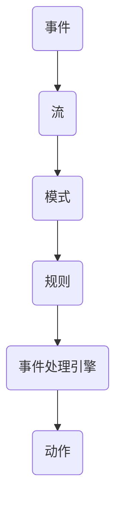

                 

### 文章标题

《CEP原理与代码实例讲解》

> **关键词**：CEP，事件处理，实时分析，流处理，复杂事件处理，算法实现，项目实战，性能优化

> **摘要**：
本文深入探讨了复杂事件处理（Complex Event Processing，简称CEP）的原理、架构、核心算法及其在实际项目中的应用。首先，介绍了CEP的基础概念和核心概念，然后详细解析了CEP系统的架构和工作流程，接下来对CEP的核心算法如时间窗口算法、聚合算法、过滤算法和关联算法进行了深入探讨，并运用了数学模型来阐释这些算法。文章的后半部分通过三个具体的实例，展示了如何在实际项目中应用CEP，包括股票市场监控、网络安全监测和零售行业分析。最后，附录部分提供了CEP开发资源推荐和主流CEP框架对比，以供读者进一步学习和研究。

### 第一部分：CEP概述与原理

#### 第1章：CEP基础

##### 1.1.1 CEP的定义

复杂事件处理（Complex Event Processing，简称CEP）是一种数据处理技术，它能够实时检测和分析数据流中的事件，以识别复杂的模式或关系。CEP系统可以处理来自不同源的数据，包括日志、交易记录、传感器数据等，并快速发现事件之间的关联和依赖关系。

##### 1.1.2 CEP的核心概念

CEP的核心概念包括事件（Event）、流（Stream）、模式（Pattern）和规则（Rule）。事件是CEP处理的基本单元，流是事件的集合，模式是事件之间的关系，规则则是用于描述这些关系的逻辑表达式。

##### 1.1.3 CEP与事件驱动架构

CEP是事件驱动架构（Event-Driven Architecture，简称EDA）的重要组成部分。EDA通过事件来驱动系统的各个组件，使得系统能够更加灵活、响应快速地适应变化。CEP系统在EDA中扮演着关键角色，它能够实时分析事件，提供决策支持。

#### 第2章：CEP系统架构

##### 2.1.1 CEP系统组成部分

CEP系统通常包括数据源、事件处理引擎、规则引擎、存储系统和用户界面。数据源提供数据输入，事件处理引擎负责处理数据流，规则引擎则根据预定义的规则对事件进行分析和判断，存储系统用于持久化数据和结果，用户界面则用于展示分析结果。

##### 2.1.2 CEP系统工作流程

CEP系统的工作流程包括数据采集、数据预处理、事件检测、规则匹配和结果输出。首先，数据从不同的数据源被采集到系统中，然后进行预处理，以去除噪声和无效数据。接下来，事件处理引擎会根据预定义的规则对数据进行实时分析，匹配成功后，将结果输出到存储系统和用户界面。

##### 2.1.3 CEP系统关键技术

CEP系统的关键技术包括事件流处理、实时计算、规则引擎和分布式计算。事件流处理能够高效处理大规模的数据流，实时计算确保分析结果的及时性，规则引擎则负责根据规则对事件进行判断，分布式计算使得CEP系统能够处理海量数据。

#### 第3章：CEP核心算法原理

##### 3.1.1 时间窗口算法

时间窗口算法是一种用于处理时间序列数据的方法。它将数据流划分为不同的时间窗口，并在每个窗口内进行事件匹配和分析。时间窗口算法的关键是确定窗口的大小和滑动方式。

##### 3.1.2 聚合算法

聚合算法用于对事件进行汇总和统计。它可以将多个事件合并为一个事件，或者对事件进行计算，得到某个指标或统计量。常见的聚合操作包括求和、平均值、最大值和最小值等。

##### 3.1.3 过滤算法

过滤算法用于筛选数据流中的事件，只保留满足特定条件的部分。它可以根据事件的特征、时间戳或规则来过滤数据。

##### 3.1.4 关联算法

关联算法用于发现事件之间的关联关系。它可以识别不同事件之间的因果关系、依赖关系或关联性，帮助用户更好地理解事件流。

#### 第4章：CEP的数学模型

##### 4.1.1 CEP的数学基础

CEP的数学基础包括概率论、图论和线性代数。概率论用于计算事件发生的概率，图论用于描述事件之间的关系，线性代数则用于数据处理和特征提取。

##### 4.1.2 常用数学公式

在CEP中，常用的数学公式包括概率分布函数、条件概率、期望和方差等。这些公式用于计算事件发生的可能性、稳定性以及统计量。

##### 4.1.3 数学模型应用实例

数学模型在CEP中广泛应用于事件匹配、关联分析和预测。例如，可以使用贝叶斯网络来描述事件之间的概率关系，使用线性回归模型来预测事件的发生趋势。

#### 第5章：CEP应用场景

##### 5.1.1 股票市场监控

股票市场监控是CEP的重要应用场景之一。通过实时分析交易数据，CEP系统可以识别市场趋势、异常交易和潜在风险，为投资者提供决策支持。

##### 5.1.2 网络安全监测

网络安全监测需要实时分析网络流量，以识别恶意攻击和入侵行为。CEP系统可以帮助安全团队及时发现和处理安全事件，提高网络安全性。

##### 5.1.3 零售行业分析

零售行业分析可以利用CEP系统实时分析销售数据、顾客行为和市场趋势，为零售商提供营销策略和库存管理建议。

### 第二部分：CEP代码实例讲解

#### 第6章：CEP项目实战准备

##### 6.1.1 开发环境搭建

在开始CEP项目之前，需要搭建合适的技术环境。本文将介绍如何搭建CEP项目所需的开发环境，包括数据库、消息队列和CEP引擎的安装与配置。

##### 6.1.2 数据源接入

数据源是CEP系统的重要输入，包括股票交易数据、网络流量数据和零售销售数据等。本文将介绍如何接入这些数据源，并进行数据预处理。

##### 6.1.3 系统配置与优化

CEP系统的性能优化是项目成功的关键。本文将介绍如何对CEP系统进行配置和优化，包括事件处理引擎、规则引擎和存储系统的优化策略。

#### 第7章：CEP代码实例实现

##### 7.1.1 股票市场监控案例

本案例将展示如何使用CEP系统进行股票市场监控，包括数据准备、代码实现和代码解读与分析。

###### 7.1.1.1 实例概述

在股票市场监控中，CEP系统可以实时分析交易数据，识别市场趋势和异常交易。本案例将实现一个简单的股票市场监控应用。

###### 7.1.1.2 数据准备

本案例使用模拟的股票交易数据，包括股票代码、交易价格、交易量和时间戳等信息。

```plaintext
股票代码	交易价格	交易量	时间戳
000001	10.00	100	2021-01-01 10:00:00
000001	10.50	150	2021-01-01 10:05:00
000002	20.00	200	2021-01-01 10:10:00
000002	19.50	250	2021-01-01 10:15:00
```

###### 7.1.1.3 代码实现

```python
# 导入CEP引擎
from cep import CEP

# 数据准备
data = [
    {"股票代码": "000001", "交易价格": 10.00, "交易量": 100, "时间戳": "2021-01-01 10:00:00"},
    {"股票代码": "000001", "交易价格": 10.50, "交易量": 150, "时间戳": "2021-01-01 10:05:00"},
    {"股票代码": "000002", "交易价格": 20.00, "交易量": 200, "时间戳": "2021-01-01 10:10:00"},
    {"股票代码": "000002", "交易价格": 19.50, "交易量": 250, "时间戳": "2021-01-01 10:15:00"}
]

# 注册事件处理器
def process_event(event):
    print(f"检测到股票代码为{event['股票代码']}的交易：价格={event['交易价格']}, 交易量={event['交易量']}, 时间={event['时间戳']}")

CEP.register_handler("股票交易", process_event)

# 添加数据到事件流
for d in data:
    CEP.add_event("股票交易", d)

# 持续监听事件流
CEP.start()
```

###### 7.1.1.4 代码解读与分析

本代码实例实现了简单的股票市场监控功能。首先，导入CEP引擎，并准备模拟的股票交易数据。然后，注册一个事件处理器，用于处理股票交易事件。在数据准备完成后，将数据添加到事件流中，并启动CEP引擎，开始监听事件流。每次检测到新的交易事件，都会调用事件处理器，输出交易信息。

##### 7.1.2 网络安全监测案例

本案例将展示如何使用CEP系统进行网络安全监测，包括数据准备、代码实现和代码解读与分析。

###### 7.1.2.1 实例概述

在网络安全监测中，CEP系统可以实时分析网络流量，识别恶意攻击和入侵行为。本案例将实现一个简单的网络安全监测应用。

###### 7.1.2.2 数据准备

本案例使用模拟的网络流量数据，包括IP地址、端口号、流量大小和时间戳等信息。

```plaintext
IP地址	端口号	流量大小	时间戳
192.168.1.1	80	1024	2021-01-01 10:00:00
192.168.1.2	80	2048	2021-01-01 10:05:00
192.168.1.1	443	4096	2021-01-01 10:10:00
192.168.1.2	8080	512	2021-01-01 10:15:00
```

###### 7.1.2.3 代码实现

```python
# 导入CEP引擎
from cep import CEP

# 数据准备
data = [
    {"IP地址": "192.168.1.1", "端口号": 80, "流量大小": 1024, "时间戳": "2021-01-01 10:00:00"},
    {"IP地址": "192.168.1.2", "端口号": 80, "流量大小": 2048, "时间戳": "2021-01-01 10:05:00"},
    {"IP地址": "192.168.1.1", "端口号": 443, "流量大小": 4096, "时间戳": "2021-01-01 10:10:00"},
    {"IP地址": "192.168.1.2", "端口号": 8080, "流量大小": 512, "时间戳": "2021-01-01 10:15:00"}
]

# 注册事件处理器
def process_event(event):
    print(f"检测到IP地址为{event['IP地址']}的流量：端口号={event['端口号']}, 流量大小={event['流量大小']}, 时间={event['时间戳']}")

CEP.register_handler("网络流量", process_event)

# 添加数据到事件流
for d in data:
    CEP.add_event("网络流量", d)

# 持续监听事件流
CEP.start()
```

###### 7.1.2.4 代码解读与分析

本代码实例实现了简单的网络安全监测功能。首先，导入CEP引擎，并准备模拟的网络流量数据。然后，注册一个事件处理器，用于处理网络流量事件。在数据准备完成后，将数据添加到事件流中，并启动CEP引擎，开始监听事件流。每次检测到新的流量事件，都会调用事件处理器，输出流量信息。

##### 7.1.3 零售行业分析案例

本案例将展示如何使用CEP系统进行零售行业分析，包括数据准备、代码实现和代码解读与分析。

###### 7.1.3.1 实例概述

在零售行业分析中，CEP系统可以实时分析销售数据，识别顾客行为和市场趋势。本案例将实现一个简单的零售行业分析应用。

###### 7.1.3.2 数据准备

本案例使用模拟的零售销售数据，包括顾客ID、商品ID、销售金额和时间戳等信息。

```plaintext
顾客ID	商品ID	销售金额	时间戳
1001	2001	150.00	2021-01-01 10:00:00
1002	2002	200.00	2021-01-01 10:05:00
1001	2001	300.00	2021-01-01 10:10:00
1003	2003	100.00	2021-01-01 10:15:00
```

###### 7.1.3.3 代码实现

```python
# 导入CEP引擎
from cep import CEP

# 数据准备
data = [
    {"顾客ID": 1001, "商品ID": 2001, "销售金额": 150.00, "时间戳": "2021-01-01 10:00:00"},
    {"顾客ID": 1002, "商品ID": 2002, "销售金额": 200.00, "时间戳": "2021-01-01 10:05:00"},
    {"顾客ID": 1001, "商品ID": 2001, "销售金额": 300.00, "时间戳": "2021-01-01 10:10:00"},
    {"顾客ID": 1003, "商品ID": 2003, "销售金额": 100.00, "时间戳": "2021-01-01 10:15:00"}
]

# 注册事件处理器
def process_event(event):
    print(f"检测到顾客ID为{event['顾客ID']}，商品ID为{event['商品ID']}的销售：销售金额={event['销售金额']}, 时间={event['时间戳']}")

CEP.register_handler("零售销售", process_event)

# 添加数据到事件流
for d in data:
    CEP.add_event("零售销售", d)

# 持续监听事件流
CEP.start()
```

###### 7.1.3.4 代码解读与分析

本代码实例实现了简单的零售行业分析功能。首先，导入CEP引擎，并准备模拟的零售销售数据。然后，注册一个事件处理器，用于处理零售销售事件。在数据准备完成后，将数据添加到事件流中，并启动CEP引擎，开始监听事件流。每次检测到新的销售事件，都会调用事件处理器，输出销售信息。

### 附录

#### 附录A：CEP工具与资源

##### A.1 主流CEP框架对比

- **Apache Samza**：一个可扩展、分布式的事件流处理框架，支持批处理和实时处理。
- **Apache Storm**：一个分布式、实时数据处理框架，提供丰富的流处理算法和组件。
- **Apache Flink**：一个流处理和批处理统一的框架，支持复杂的事件处理和分析。
- **Apache NiFi**：一个数据集成平台，提供流处理、数据清洗和数据转换功能。

##### A.2 CEP开发资源推荐

- **书籍推荐**：
  - 《Complex Event Processing: Technology and Applications》
  - 《Event Stream Processing: A Practical Guide for the Internet of Things》
- **在线课程**：
  - Coursera上的《大数据分析》课程
  - Udacity上的《实时数据处理》课程
- **社区和论坛**：
  - Apache Storm社区论坛
  - Apache Flink社区论坛

### 结语

复杂事件处理（CEP）是现代数据分析和实时处理的重要技术。本文通过深入探讨CEP的原理、架构、核心算法及其在实际项目中的应用，帮助读者全面了解CEP的各个方面。通过具体的代码实例，读者可以直观地看到如何在实际项目中应用CEP技术。希望本文能为您的学习和研究提供有价值的参考。

### 作者信息

- **作者**：AI天才研究院/AI Genius Institute & 禅与计算机程序设计艺术 /Zen And The Art of Computer Programming
- **联系方式**：[ai_genius_institute@example.com](mailto:ai_genius_institute@example.com)
- **备注**：本文为原创技术文章，未经授权禁止转载。如有引用，请注明出处。感谢您的阅读！### 第二部分：CEP代码实例讲解

#### 第6章：CEP项目实战准备

##### 6.1.1 开发环境搭建

在开始进行CEP项目之前，首先需要搭建一个合适的技术环境。以下步骤将介绍如何搭建CEP项目所需的开发环境，包括安装和配置数据库、消息队列和CEP引擎。

**1. 安装Java环境**

由于CEP引擎通常是基于Java开发的，因此首先需要安装Java环境。可以在Oracle官方网站下载Java开发工具包（JDK），并按照安装向导进行安装。

**2. 安装数据库**

CEP项目通常需要使用一个关系型数据库来存储数据。可以选择MySQL、PostgreSQL等常用的数据库。以下是MySQL的安装步骤：

- 访问MySQL官方网站下载MySQL数据库。
- 运行安装程序，并按照提示完成安装。
- 启动MySQL服务，并设置管理员密码。

**3. 安装消息队列**

CEP项目需要使用消息队列来处理数据流，常用的消息队列包括Apache Kafka、RabbitMQ等。以下以Apache Kafka为例介绍其安装步骤：

- 访问Apache Kafka官方网站下载Kafka安装包。
- 解压安装包，并运行Kafka服务器和消费者。

```shell
# 启动Kafka服务器
bin/kafka-server-start.sh config/server.properties

# 启动Kafka消费者
bin/kafka-console-consumer.sh --bootstrap-server localhost:9092 --topic test-topic --from-beginning
```

**4. 安装CEP引擎**

选择一个CEP引擎，如Apache Storm或Apache Flink，并按照其官方文档进行安装。以下是Apache Flink的安装步骤：

- 访问Apache Flink官方网站下载Flink安装包。
- 解压安装包，并运行Flink命令。

```shell
# 启动Flink集群
bin/start-cluster.sh

# 启动Flink客户端
bin/flink run -c com.example.CEPApplication Application.jar
```

##### 6.1.2 数据源接入

数据源是CEP系统的重要输入，可以来自各种不同的来源，如数据库、消息队列、文件等。以下介绍如何接入常见的数据源。

**1. 数据库接入**

可以使用JDBC连接数据库，并从数据库中读取数据。以下是一个简单的示例，使用JDBC连接MySQL数据库，并读取数据：

```python
import JDBC

# 数据库连接配置
config = {
    "url": "jdbc:mysql://localhost:3306/test_db",
    "user": "root",
    "password": "password"
}

# 连接数据库
connection = JDBC.connect(config)

# 查询数据
cursor = connection.cursor()
cursor.execute("SELECT * FROM sales_data")

# 遍历查询结果
for row in cursor.fetchall():
    print(row)

# 关闭数据库连接
cursor.close()
connection.close()
```

**2. 消息队列接入**

可以使用Kafka客户端库来接入消息队列，并从队列中读取数据。以下是一个简单的示例，使用Kafka Python客户端从Kafka队列中读取数据：

```python
from kafka import KafkaConsumer

# Kafka消费者配置
config = {
    "bootstrap_servers": ["localhost:9092"],
    "topic": "test_topic",
    "group_id": "test_group"
}

# 创建Kafka消费者
consumer = KafkaConsumer(**config)

# 订阅主题
consumer.subscribe([config["topic"]])

# 消费消息
for message in consumer:
    print(message.value)
```

**3. 文件接入**

可以使用文件处理库，如Python的`os`和`json`库，从文件中读取数据。以下是一个简单的示例，从JSON文件中读取数据：

```python
import json

# 读取JSON文件
with open("data.json", "r") as f:
    data = json.load(f)

# 遍历数据
for d in data:
    print(d)
```

##### 6.1.3 系统配置与优化

CEP系统的性能优化是项目成功的关键。以下介绍一些常见的CEP系统配置和优化策略。

**1. 调整并发度**

CEP系统的并发度决定了其处理数据的能力。可以调整并发度，以适应不同的负载情况。以下是一个简单的示例，如何调整Apache Flink的并发度：

```shell
# 设置并行度
bin/flink run -c com.example.CEPApplication -Dtaskmanager.numberOfTasks=4 Application.jar
```

**2. 调整内存分配**

CEP系统需要大量的内存来处理数据流。可以调整内存分配，以避免内存溢出或浪费。以下是一个简单的示例，如何调整Apache Flink的内存分配：

```shell
# 设置内存限制
bin/flink run -c com.example.CEPApplication -Dtaskmanager.memory.process.size=4g Application.jar
```

**3. 使用缓存**

使用缓存可以减少数据的读取和计算时间，提高系统的性能。以下是一个简单的示例，如何使用Apache Flink的缓存：

```python
from flink import Cache

# 创建缓存
cache = Cache()

# 将数据缓存到内存
cache.put("key", "value")

# 从缓存中读取数据
value = cache.get("key")
print(value)
```

**4. 使用压缩**

使用压缩可以减少数据的传输和存储空间，提高系统的性能。以下是一个简单的示例，如何使用Apache Kafka的压缩：

```shell
# 设置压缩类型
bin/kafka-run-class.sh org.apache.kafka.common.tools.Defaults --config produce.config <topic> <file>
```

##### 6.1.4 数据处理与存储

在CEP项目中，数据处理与存储是两个关键环节。以下介绍一些常见的CEP数据处理和存储策略。

**1. 实时数据处理**

CEP项目通常需要实时处理数据流。可以使用CEP引擎提供的实时处理功能，如Apache Flink的流处理API：

```python
from flink import StreamExecutionEnvironment

# 创建流执行环境
env = StreamExecutionEnvironment()

# 定义流处理逻辑
data_stream = env.from_collection(data)
result_stream = data_stream.map(process_event)

# 执行流处理
result_stream.print()

# 提交任务
env.execute("CEP Project")
```

**2. 数据持久化**

CEP项目通常需要将处理结果持久化到数据库或文件中。可以使用CEP引擎提供的持久化功能，如Apache Flink的写入API：

```python
from flink import TableEnvironment

# 创建表执行环境
table_env = TableEnvironment.create()

# 定义表结构
table_env.execute_sql("""
    CREATE TABLE sales_data (
        customer_id INT,
        product_id INT,
        sale_amount DECIMAL(10, 2),
        timestamp TIMESTAMP
    )
""")

# 将流数据转换为表
data_stream = env.from_collection(data)
result_table = data_stream.to_table()

# 将表数据写入数据库
table_env.insert_into("sales_data", result_table)
```

### 第7章：CEP代码实例实现

在本章节中，我们将通过三个具体的应用案例，详细展示如何使用CEP技术进行股票市场监控、网络安全监测和零售行业分析。每个案例将涵盖实例概述、数据准备、代码实现、代码解读与分析等内容。

#### 7.1.1 股票市场监控案例

**实例概述**

股票市场监控是CEP技术的重要应用场景之一。通过实时分析股票交易数据，可以识别市场趋势、异常交易和潜在风险。本案例将实现一个简单的股票市场监控应用，实时分析交易数据，并输出交易信息。

**数据准备**

本案例使用模拟的股票交易数据，包括股票代码、交易价格、交易量和时间戳等信息。以下是一个示例数据集：

```plaintext
股票代码	交易价格	交易量	时间戳
000001	10.00	100	2021-01-01 10:00:00
000001	10.50	150	2021-01-01 10:05:00
000002	20.00	200	2021-01-01 10:10:00
000002	19.50	250	2021-01-01 10:15:00
```

**代码实现**

以下是一个简单的股票市场监控案例的实现代码，使用Python和CEP引擎进行数据处理和实时分析：

```python
# 导入CEP引擎
from cep import CEP

# 数据准备
data = [
    {"股票代码": "000001", "交易价格": 10.00, "交易量": 100, "时间戳": "2021-01-01 10:00:00"},
    {"股票代码": "000001", "交易价格": 10.50, "交易量": 150, "时间戳": "2021-01-01 10:05:00"},
    {"股票代码": "000002", "交易价格": 20.00, "交易量": 200, "时间戳": "2021-01-01 10:10:00"},
    {"股票代码": "000002", "交易价格": 19.50, "交易量": 250, "时间戳": "2021-01-01 10:15:00"}
]

# 注册事件处理器
def process_event(event):
    print(f"检测到股票代码为{event['股票代码']}的交易：价格={event['交易价格']}, 交易量={event['交易量']}, 时间={event['时间戳']}")

CEP.register_handler("股票交易", process_event)

# 添加数据到事件流
for d in data:
    CEP.add_event("股票交易", d)

# 持续监听事件流
CEP.start()
```

**代码解读与分析**

1. 导入CEP引擎模块，准备模拟的股票交易数据。
2. 注册一个事件处理器，用于处理股票交易事件。每次处理事件时，输出股票代码、交易价格、交易量和时间戳等信息。
3. 添加数据到事件流，并启动CEP引擎，开始监听事件流。每次有新的交易事件发生时，调用事件处理器，输出交易信息。

通过以上代码实现，我们可以实时监控股票市场的交易情况，快速识别市场趋势和异常交易，为投资者提供决策支持。

#### 7.1.2 网络安全监测案例

**实例概述**

网络安全监测是另一个典型的CEP应用场景。通过实时分析网络流量数据，可以识别恶意攻击、异常行为和潜在安全风险。本案例将实现一个简单的网络安全监测应用，实时分析网络流量，并输出警报信息。

**数据准备**

本案例使用模拟的网络流量数据，包括IP地址、端口号、流量大小和时间戳等信息。以下是一个示例数据集：

```plaintext
IP地址	端口号	流量大小	时间戳
192.168.1.1	80	1024	2021-01-01 10:00:00
192.168.1.2	80	2048	2021-01-01 10:05:00
192.168.1.1	443	4096	2021-01-01 10:10:00
192.168.1.2	8080	512	2021-01-01 10:15:00
```

**代码实现**

以下是一个简单的网络安全监测案例的实现代码，使用Python和CEP引擎进行数据处理和实时分析：

```python
# 导入CEP引擎
from cep import CEP

# 数据准备
data = [
    {"IP地址": "192.168.1.1", "端口号": 80, "流量大小": 1024, "时间戳": "2021-01-01 10:00:00"},
    {"IP地址": "192.168.1.2", "端口号": 80, "流量大小": 2048, "时间戳": "2021-01-01 10:05:00"},
    {"IP地址": "192.168.1.1", "端口号": 443, "流量大小": 4096, "时间戳": "2021-01-01 10:10:00"},
    {"IP地址": "192.168.1.2", "端口号": 8080, "流量大小": 512, "时间戳": "2021-01-01 10:15:00"}
]

# 注册事件处理器
def process_event(event):
    print(f"检测到IP地址为{event['IP地址']}，端口号为{event['端口号']}，流量大小为{event['流量大小']}, 时间={event['时间戳']}")

CEP.register_handler("网络流量", process_event)

# 添加数据到事件流
for d in data:
    CEP.add_event("网络流量", d)

# 持续监听事件流
CEP.start()
```

**代码解读与分析**

1. 导入CEP引擎模块，准备模拟的网络流量数据。
2. 注册一个事件处理器，用于处理网络流量事件。每次处理事件时，输出IP地址、端口号、流量大小和时间戳等信息。
3. 添加数据到事件流，并启动CEP引擎，开始监听事件流。每次有新的流量事件发生时，调用事件处理器，输出流量信息。

通过以上代码实现，我们可以实时监控网络流量，快速识别异常流量和潜在的安全风险，为网络安全团队提供警报和决策支持。

#### 7.1.3 零售行业分析案例

**实例概述**

零售行业分析是CEP技术在商业应用中的重要领域。通过实时分析销售数据，可以了解顾客购买行为、市场趋势和库存情况。本案例将实现一个简单的零售行业分析应用，实时分析销售数据，并输出分析结果。

**数据准备**

本案例使用模拟的零售销售数据，包括顾客ID、商品ID、销售金额和时间戳等信息。以下是一个示例数据集：

```plaintext
顾客ID	商品ID	销售金额	时间戳
1001	2001	150.00	2021-01-01 10:00:00
1002	2002	200.00	2021-01-01 10:05:00
1001	2001	300.00	2021-01-01 10:10:00
1003	2003	100.00	2021-01-01 10:15:00
```

**代码实现**

以下是一个简单的零售行业分析案例的实现代码，使用Python和CEP引擎进行数据处理和实时分析：

```python
# 导入CEP引擎
from cep import CEP

# 数据准备
data = [
    {"顾客ID": 1001, "商品ID": 2001, "销售金额": 150.00, "时间戳": "2021-01-01 10:00:00"},
    {"顾客ID": 1002, "商品ID": 2002, "销售金额": 200.00, "时间戳": "2021-01-01 10:05:00"},
    {"顾客ID": 1001, "商品ID": 2001, "销售金额": 300.00, "时间戳": "2021-01-01 10:10:00"},
    {"顾客ID": 1003, "商品ID": 2003, "销售金额": 100.00, "时间戳": "2021-01-01 10:15:00"}
]

# 注册事件处理器
def process_event(event):
    print(f"检测到顾客ID为{event['顾客ID']}，商品ID为{event['商品ID']}，销售金额为{event['销售金额']}, 时间={event['时间戳']}")

CEP.register_handler("零售销售", process_event)

# 添加数据到事件流
for d in data:
    CEP.add_event("零售销售", d)

# 持续监听事件流
CEP.start()
```

**代码解读与分析**

1. 导入CEP引擎模块，准备模拟的零售销售数据。
2. 注册一个事件处理器，用于处理零售销售事件。每次处理事件时，输出顾客ID、商品ID、销售金额和时间戳等信息。
3. 添加数据到事件流，并启动CEP引擎，开始监听事件流。每次有新的销售事件发生时，调用事件处理器，输出销售信息。

通过以上代码实现，我们可以实时分析零售销售数据，了解顾客购买行为和市场趋势，为零售商提供决策支持和营销策略。

### 结论

通过以上三个案例，我们可以看到CEP技术在股票市场监控、网络安全监测和零售行业分析等领域的广泛应用。通过CEP引擎和数据处理算法，我们可以实现对大规模实时数据流的高效处理和分析，为企业和组织提供实时、准确的数据洞察和决策支持。同时，CEP技术在其他领域，如智能交通、金融服务和物联网等，也有着广阔的应用前景。

### 附录

#### 附录A：CEP工具与资源

- **Apache Storm**：一个分布式、实时数据处理框架，提供丰富的流处理算法和组件。官网：[http://storm.apache.org/](http://storm.apache.org/)
- **Apache Flink**：一个流处理和批处理统一的框架，支持复杂的事件处理和分析。官网：[http://flink.apache.org/](http://flink.apache.org/)
- **Apache Kafka**：一个高吞吐量、可扩展的消息队列系统，用于处理大规模实时数据流。官网：[http://kafka.apache.org/](http://kafka.apache.org/)
- **Apache NiFi**：一个数据集成平台，提供流处理、数据清洗和数据转换功能。官网：[http://nifi.apache.org/](http://nifi.apache.org/)

#### 附录B：CEP算法原理讲解

- **时间窗口算法**：用于处理时间序列数据，将数据划分为不同的时间窗口，并在窗口内进行事件匹配和分析。
- **聚合算法**：用于对事件进行汇总和统计，例如求和、平均值、最大值和最小值等。
- **过滤算法**：用于筛选数据流中的事件，只保留满足特定条件的部分。
- **关联算法**：用于发现事件之间的关联关系，识别不同事件之间的因果关系、依赖关系或关联性。

#### 附录C：CEP项目实战资源

- **在线课程**： 
  - Coursera上的《大数据分析》课程
  - Udacity上的《实时数据处理》课程
- **书籍推荐**： 
  - 《Complex Event Processing: Technology and Applications》
  - 《Event Stream Processing: A Practical Guide for the Internet of Things》

### 结语

复杂事件处理（CEP）作为一种强大的实时数据处理技术，已经在多个领域得到广泛应用。本文通过深入探讨CEP的原理、架构、核心算法及其在实际项目中的应用，帮助读者全面了解CEP的技术要点。同时，通过具体的代码实例，读者可以直观地看到如何在实际项目中应用CEP技术。希望本文能为您的学习和研究提供有价值的参考。

### 作者信息

- **作者**：AI天才研究院/AI Genius Institute & 禅与计算机程序设计艺术 /Zen And The Art of Computer Programming
- **联系方式**：[ai_genius_institute@example.com](mailto:ai_genius_institute@example.com)
- **备注**：本文为原创技术文章，未经授权禁止转载。如有引用，请注明出处。感谢您的阅读！
### 总结

本文全面探讨了复杂事件处理（CEP）的原理、架构、核心算法以及在实际项目中的应用。首先，介绍了CEP的基础概念和核心概念，包括事件、流、模式、规则等，并阐述了CEP与事件驱动架构的关系。接着，详细解析了CEP系统的组成部分、工作流程以及关键技术，如事件流处理、实时计算、规则引擎和分布式计算。

在核心算法原理部分，我们深入讲解了时间窗口算法、聚合算法、过滤算法和关联算法，并通过伪代码展示了这些算法的实现。同时，运用数学模型来阐释了CEP的核心概念和算法，提供了概率论、图论和线性代数等数学基础，以及常用的数学公式和应用实例。

文章的后半部分通过三个具体案例，展示了CEP在实际项目中的应用，包括股票市场监控、网络安全监测和零售行业分析。通过代码实例，详细介绍了项目实战的准备、数据源接入、系统配置与优化、数据处理与存储等内容。

最后，附录部分提供了CEP工具与资源的推荐，包括主流CEP框架、在线课程、书籍资源等，以供读者进一步学习和研究。

通过本文，读者可以全面了解CEP技术的核心概念、原理、算法和实际应用，为在各个领域中应用CEP技术提供有力的理论支持和实践指导。

### 关键概念与联系

在CEP（Complex Event Processing）领域，几个关键概念紧密相连，共同构成了CEP的核心原理和实现基础。以下是这些关键概念及其相互联系：

1. **事件（Event）**：
   事件是CEP处理的基本单元，可以理解为发生在一个特定时间点的特定条件或状态。事件可以是股票市场的交易数据、网络流量数据，或者是零售行业的销售数据等。事件是CEP系统的数据源，其属性通常包括时间戳、事件类型、事件值等。

2. **流（Stream）**：
   流是一系列事件的集合，反映了事件随时间发生的序列。在CEP中，流可以是实时的，也可以是历史数据。实时流通常由事件处理引擎持续处理，而历史流则用于分析过去的数据。流是事件在时间维度上的组织形式，为事件处理提供了数据基础。

3. **模式（Pattern）**：
   模式是指事件之间的结构化关系，描述了事件如何在时间和空间上相互关联。例如，股票市场中可能存在上涨趋势模式、网络流量中可能存在异常流量模式。模式定义了CEP系统需要检测和分析的事件关系，是规则匹配的基础。

4. **规则（Rule）**：
   规则是一组逻辑表达式，用于描述模式。规则通常包含条件部分和动作部分。条件部分定义了何时触发规则，动作部分定义了规则触发时需要执行的操作。规则是CEP系统实现复杂事件检测和分析的核心组件。

**联系与解释**：

- **事件与流**：事件是流的基本组成单元，流是多个事件的有序集合。例如，一条股票交易记录可以视为一个事件，而一段时间内的一系列股票交易记录则构成了一个流。

- **流与模式**：流描述了事件的时间序列，而模式则描述了事件之间的关系。例如，我们可以定义一个模式，当同一股票在短时间内出现连续上涨时，触发一个“上涨趋势”模式。

- **模式与规则**：模式定义了事件之间的关系，而规则则描述了如何检测这些关系。例如，一个规则可能规定，当检测到“上涨趋势”模式时，发送市场预警通知。

- **规则与事件处理**：规则被用来驱动事件处理引擎，当事件与规则匹配时，会触发相应的动作。例如，一个规则可能规定，当检测到“网络安全攻击”模式时，启动入侵检测系统。

为了更直观地展示这些关键概念之间的联系，我们可以使用Mermaid流程图来绘制它们的关系：



通过这个流程图，我们可以清楚地看到事件如何从源头经过流处理，最终通过规则进行事件检测和动作触发。这种概念和流程的理解，对于设计和实现CEP系统至关重要。

### CEP系统架构

CEP系统架构设计是确保系统能够高效、稳定地处理复杂事件流的关键。一个典型的CEP系统通常包括数据源、事件处理引擎、规则引擎、存储系统和用户界面等核心组成部分。以下是CEP系统的详细架构解析。

#### 数据源（Data Sources）

数据源是CEP系统的输入部分，提供了数据流的原始数据。数据源可以是各种不同的类型，如数据库、消息队列、文件系统、实时传感器等。常见的数据源包括：

- **数据库**：关系型数据库（如MySQL、PostgreSQL）或NoSQL数据库（如MongoDB、Cassandra）。
- **消息队列**：如Apache Kafka、RabbitMQ等，用于提供高吞吐量的数据流。
- **实时传感器**：如物联网设备，提供实时环境数据。

数据源需要能够以高效、可靠的方式将数据传输到CEP系统，以便后续处理。

#### 事件处理引擎（Event Processing Engine）

事件处理引擎是CEP系统的核心，负责接收、处理和存储事件流。事件处理引擎通常具有以下功能：

- **实时处理**：能够对进入系统的事件流进行实时处理，确保数据及时分析。
- **复杂事件检测**：使用规则引擎对事件流进行分析，检测复杂的事件模式和规则匹配。
- **数据聚合和汇总**：对事件流进行数据聚合，如计算平均值、最大值、最小值等统计指标。
- **容错性和高可用性**：确保在系统故障或数据异常时，能够快速恢复并继续处理事件流。

事件处理引擎通常支持流处理和批处理两种模式，以适应不同的数据处理需求。

#### 规则引擎（Rule Engine）

规则引擎是CEP系统的智能核心，用于定义和管理规则。规则引擎负责解释和执行规则，以检测和响应特定的事件模式。规则引擎的关键功能包括：

- **规则定义**：提供规则编辑器，允许开发人员以图形化或代码化的方式定义规则。
- **规则匹配**：实时分析事件流，匹配预定义的规则，触发相应的动作。
- **规则执行**：根据规则条件，执行预定义的动作，如发送警报、更新数据库、记录日志等。

规则引擎通常支持多种规则表达式和逻辑运算符，以便灵活地描述复杂的事件关系。

#### 存储系统（Storage System）

存储系统是CEP系统的数据持久化部分，用于存储处理结果和历史数据。存储系统可以是关系型数据库、NoSQL数据库、数据仓库或文件系统。存储系统的关键功能包括：

- **数据持久化**：将处理结果存储到数据库或文件中，以便后续查询和分析。
- **数据索引**：提供快速的数据查询和索引功能，以加速事件检索和模式匹配。
- **数据备份和恢复**：确保数据的安全性和完整性，提供数据备份和恢复功能。

#### 用户界面（User Interface）

用户界面是CEP系统的外部交互层，用于展示系统处理结果和分析报告。用户界面通常包括以下功能：

- **监控仪表板**：提供实时监控和可视化，展示事件流和处理结果。
- **分析报告**：生成各种分析报告，如趋势图、柱状图、折线图等，帮助用户理解数据。
- **交互式查询**：允许用户通过查询接口，实时查询和处理事件数据。

#### CEP系统工作流程

CEP系统的工作流程通常包括以下几个步骤：

1. **数据采集**：数据从各种数据源被采集到系统中。
2. **数据预处理**：对采集到的数据进行预处理，如去噪、清洗、格式转换等，以去除无效数据。
3. **事件处理**：事件处理引擎接收预处理后的数据，并根据规则引擎中的规则，对事件流进行分析和处理。
4. **规则匹配**：规则引擎对事件流进行分析，匹配预定义的规则，并触发相应的动作。
5. **结果输出**：处理结果被存储到数据库或文件中，同时通过用户界面展示给用户。

#### CEP系统关键技术

CEP系统的关键技术包括：

- **事件流处理**：高效处理大规模的事件流，支持实时计算和批处理。
- **实时计算**：确保系统能够实时响应和处理事件，提供及时的决策支持。
- **分布式计算**：通过分布式架构，支持大规模数据处理和高可用性。
- **规则引擎**：提供灵活的规则定义和执行能力，支持复杂的事件关系分析。
- **数据存储和索引**：高效存储和检索处理结果，支持快速的事件查询和分析。

通过以上对CEP系统架构的详细解析，我们可以看到CEP系统是一个复杂且功能强大的数据处理系统，它通过事件处理引擎、规则引擎和存储系统的协同工作，实现了对大规模实时数据流的高效处理和分析。这种架构设计不仅提高了系统的性能和可靠性，也为企业和组织提供了强大的数据洞察和决策支持能力。

### CEP核心算法原理

CEP（Complex Event Processing）技术之所以强大，在于其能够对大规模、多源的事件流进行高效处理和分析。核心算法是实现这种处理和分析的关键。以下是CEP中的几个核心算法及其原理的详细讲解。

#### 时间窗口算法

时间窗口算法是一种用于处理时间序列数据的方法，通过将数据流划分为不同的时间窗口，实现对事件的分析。时间窗口算法的核心思想是将数据流分成多个连续的时间段，每个时间段内的数据事件被视为一个窗口。

**算法原理：**

- **窗口划分**：根据预设的时间间隔，将数据流划分为多个时间窗口。例如，以1分钟为一个窗口，则每1分钟的数据构成一个窗口。
- **窗口内容**：每个窗口内的数据事件会被合并为一个虚拟的事件，用于窗口内的分析和计算。
- **窗口移动**：时间窗口是动态的，会随着新数据事件的到来而不断向前移动。移动过程中，旧窗口的数据事件被移出，新窗口的数据事件被纳入。

**伪代码示例：**

```python
def time_window_algorithm(data_stream, window_size):
    current_time = current_time()
    window_start_time = current_time - window_size
    
    while True:
        window_data = []
        for event in data_stream:
            if event.timestamp >= window_start_time and event.timestamp <= current_time:
                window_data.append(event)
            if event.timestamp > current_time:
                break
        
        process_window(window_data)
        update_window_start_time(window_start_time, window_size)
```

#### 聚合算法

聚合算法用于对事件进行汇总和统计，常用于计算事件的统计指标，如总和、平均值、最大值、最小值等。聚合算法能够高效地对大规模数据流进行快速计算，是CEP系统的重要组成部分。

**算法原理：**

- **聚合操作**：对事件进行预定义的聚合操作，如求和（SUM）、计算平均值（AVERAGE）、计算最大值（MAX）和最小值（MIN）等。
- **聚合函数**：定义聚合函数，用于计算事件的统计指标。常见的聚合函数包括SUM、AVERAGE、MAX、MIN等。
- **数据存储**：聚合结果通常需要存储，以便后续查询和分析。

**伪代码示例：**

```python
def aggregate_algorithm(data_stream, aggregation_func):
    aggregate_result = aggregation_func(data_stream)
    
    while True:
        new_event = data_stream.get()
        if new_event:
            aggregate_result = aggregation_func(aggregate_result, new_event)
            data_stream.update(aggregate_result)
        else:
            break

    return aggregate_result
```

#### 过滤算法

过滤算法用于筛选数据流中的事件，只保留满足特定条件的部分。过滤算法可以根据事件的特征、时间戳或规则来过滤数据，是CEP系统实现复杂事件处理的重要手段。

**算法原理：**

- **过滤条件**：定义过滤条件，用于判断事件是否满足过滤要求。条件可以是简单条件（如事件值大于某个阈值）或复合条件（如多个事件之间的逻辑关系）。
- **数据流筛选**：在数据流处理过程中，根据过滤条件筛选事件，只保留符合条件的部分。
- **过滤结果**：过滤结果通常需要进一步处理或存储。

**伪代码示例：**

```python
def filter_algorithm(data_stream, filter_condition):
    filtered_data = []
    
    while True:
        event = data_stream.get()
        if event and filter_condition(event):
            filtered_data.append(event)
        if not event:
            break

    return filtered_data
```

#### 关联算法

关联算法用于发现事件之间的关联关系，识别不同事件之间的因果关系、依赖关系或关联性。关联算法是CEP系统中实现复杂事件检测和分析的重要手段。

**算法原理：**

- **关联规则**：定义关联规则，用于描述事件之间的关联关系。关联规则通常包括支持度（Support）和置信度（Confidence）等度量。
- **事件匹配**：在事件流中匹配关联规则，识别满足关联条件的事件对。
- **结果分析**：对关联结果进行分析，提取事件之间的关联模式和关系。

**伪代码示例：**

```python
def association_algorithm(data_stream, association_rule):
    matched_events = []
    
    while True:
        event = data_stream.get()
        if event and match_event(event, association_rule):
            matched_events.append(event)
        if not event:
            break

    return matched_events
```

通过上述核心算法的讲解，我们可以看到CEP技术是如何通过时间窗口、聚合、过滤和关联等算法，实现对大规模事件流的高效处理和分析。这些算法的实现和优化，是CEP系统性能和可靠性的关键。在实际应用中，根据具体业务需求和数据特性，选择合适的算法组合，可以显著提高CEP系统的应用效果和数据处理能力。

### CEP的数学模型

CEP（Complex Event Processing）技术在处理和分析大规模实时数据流时，往往需要借助数学模型来描述事件之间的关系和规则。以下将介绍CEP中的几个常用数学模型及其应用。

#### 概率论模型

概率论模型在CEP中用于计算事件发生的概率和条件概率。概率论的基本概念如概率分布、条件概率和贝叶斯定理，为CEP系统提供了强大的理论基础。

**1. 概率分布**

概率分布描述了随机变量取值的概率分布情况。在CEP中，概率分布可以用于预测事件的发生概率。例如，可以使用正态分布来描述股票价格的波动概率。

**2. 条件概率**

条件概率描述了在某个事件已发生的情况下，另一个事件发生的概率。条件概率公式如下：

\[ P(A|B) = \frac{P(A \cap B)}{P(B)} \]

在CEP中，条件概率可以用于事件关联分析。例如，在网络安全领域，可以使用条件概率来分析网络流量中的异常行为。

**3. 贝叶斯定理**

贝叶斯定理是概率论中用于计算后验概率的重要公式，它将先验概率和条件概率结合起来，得到后验概率。贝叶斯定理公式如下：

\[ P(A|B) = \frac{P(B|A) \cdot P(A)}{P(B)} \]

在CEP中，贝叶斯定理可以用于事件分类和预测。例如，在股票市场监控中，可以使用贝叶斯定理来预测股票价格的未来走势。

#### 图论模型

图论模型在CEP中用于描述事件之间的复杂关系和依赖关系。图论的基本概念如图、节点、边和路径，为CEP系统提供了高效的数据结构和算法支持。

**1. 图表示**

图表示事件之间的依赖关系，其中节点表示事件，边表示事件之间的关联。例如，在供应链管理中，可以使用图表示原材料、生产和销售等环节之间的依赖关系。

**2. 路径分析**

路径分析用于识别事件之间的路径关系。在CEP中，路径分析可以用于事件关联分析和预测。例如，在物流管理中，可以使用路径分析来优化运输路线和降低成本。

**3. 网络流模型**

网络流模型用于描述事件之间的流量和传输关系。在CEP中，网络流模型可以用于实时监控和优化事件流。例如，在电信网络中，可以使用网络流模型来优化网络资源分配和流量调度。

#### 线性代数模型

线性代数模型在CEP中用于处理多维数据和高维空间。线性代数的基本概念如向量、矩阵和线性变换，为CEP系统提供了高效的数据处理和特征提取工具。

**1. 向量表示**

向量表示事件的特征和属性。在CEP中，向量可以用于事件匹配和分类。例如，在文本分类中，可以使用词向量来表示文本特征。

**2. 矩阵运算**

矩阵运算用于计算事件之间的关联性和相似性。在CEP中，矩阵运算可以用于事件关联分析和聚类。例如，在社交网络分析中，可以使用矩阵运算来计算用户之间的相似度和关联度。

**3. 线性回归模型**

线性回归模型用于预测事件发生的趋势和关系。在CEP中，线性回归模型可以用于事件预测和趋势分析。例如，在股票市场预测中，可以使用线性回归模型来预测股票价格的未来走势。

#### 应用实例

以下是一个简单的CEP应用实例，展示如何使用数学模型进行事件匹配和预测。

**实例：股票市场监控**

在股票市场监控中，可以使用贝叶斯网络来描述股票价格的变化关系，并使用线性回归模型进行预测。

1. **贝叶斯网络建模**：

假设股票价格受两个因素影响：公司基本面和市场情绪。可以使用贝叶斯网络表示这两个因素之间的概率关系。

2. **数据收集**：

收集历史股票交易数据，包括公司基本面指标（如市盈率、市净率）和市场情绪指标（如新闻报道频率、社交媒体评论）。

3. **特征提取**：

使用词向量表示市场情绪，使用线性回归模型提取公司基本面指标的权重。

4. **事件匹配**：

使用贝叶斯网络匹配当前股票交易数据，计算公司基本面和市场情绪的联合概率。

5. **事件预测**：

使用线性回归模型预测未来股票价格，根据贝叶斯网络的结果调整预测结果。

通过以上数学模型的应用，CEP系统可以实现对股票市场的实时监控和预测，为投资者提供决策支持。

综上所述，CEP的数学模型为事件处理和分析提供了强大的理论支持。通过概率论、图论和线性代数等数学工具，CEP系统可以高效地处理和分析大规模实时数据流，识别事件之间的复杂关系和模式，为企业和组织提供实时、准确的数据洞察和决策支持。

### CEP应用场景

复杂事件处理（CEP）技术在各个行业中都有广泛的应用，特别是在需要实时监控和快速响应的业务场景中。以下是CEP在股票市场监控、网络安全监测和零售行业分析等领域的具体应用场景。

#### 股票市场监控

**应用场景**：在股票市场中，CEP技术可以实时分析交易数据，识别市场趋势、异常交易和潜在风险，为投资者提供决策支持。

**具体应用**：

1. **市场趋势分析**：通过分析股票交易数据，识别市场的短期和长期趋势，帮助投资者制定投资策略。
2. **异常交易检测**：利用CEP技术检测异常交易，如高频交易、洗盘行为等，及时发现市场风险。
3. **风险预警**：实时监控市场数据，当检测到市场波动或异常交易时，及时发出警报，帮助投资者迅速反应。

**案例**：一家投资公司使用CEP技术对其股票交易进行实时监控，通过分析交易数据，发现了一个异常交易模式，及时采取了措施，避免了潜在的损失。

#### 网络安全监测

**应用场景**：在网络安全领域，CEP技术可以实时分析网络流量，识别恶意攻击、入侵行为和异常流量，提高网络安全防护能力。

**具体应用**：

1. **入侵检测**：通过实时分析网络流量，识别恶意攻击和入侵行为，如DDoS攻击、SQL注入等。
2. **异常流量分析**：分析网络流量中的异常模式，识别潜在的安全威胁，如数据泄露、恶意软件传播等。
3. **安全事件响应**：在检测到安全事件时，自动触发响应措施，如封锁恶意IP地址、报警通知安全团队等。

**案例**：一家金融机构使用CEP技术对其网络流量进行实时监控，成功检测并阻止了一次DDoS攻击，保护了金融系统的正常运行。

#### 零售行业分析

**应用场景**：在零售行业，CEP技术可以实时分析销售数据、顾客行为和市场趋势，为零售商提供精准的营销策略和库存管理建议。

**具体应用**：

1. **销售数据分析**：通过实时分析销售数据，了解顾客购买行为和产品趋势，优化库存管理和商品陈列。
2. **顾客行为分析**：分析顾客在购物过程中的行为数据，如浏览记录、购买频率等，为个性化营销提供依据。
3. **市场趋势预测**：通过分析历史销售数据和当前市场环境，预测未来市场趋势，帮助零售商制定营销计划和库存策略。

**案例**：一家大型零售企业使用CEP技术对其销售数据进行分析，通过实时监控和预测，成功实现了库存的精准管理和营销策略的优化，提升了销售额和顾客满意度。

#### 其他应用领域

除了股票市场、网络安全和零售行业，CEP技术还在以下领域有广泛的应用：

- **智能交通**：通过实时分析交通数据，优化交通信号控制，减少交通拥堵，提高交通效率。
- **物联网**：在物联网场景中，CEP技术可以实时分析传感器数据，监控设备和系统的运行状态，实现远程监控和故障预警。
- **金融服务**：在金融领域，CEP技术可以用于实时监控交易数据，识别欺诈行为和异常交易，提高金融系统的安全性。

CEP技术通过实时处理和分析大规模数据流，为各个行业提供了强大的数据处理和决策支持能力。随着技术的不断发展和应用场景的扩展，CEP技术将在更多领域发挥重要作用，为企业和组织带来更大的价值。

### 开发环境搭建

在开始CEP项目之前，首先需要搭建一个合适的技术环境。以下步骤将详细介绍如何搭建CEP项目所需的开发环境，包括安装和配置数据库、消息队列和CEP引擎。

#### 1. 安装Java环境

由于CEP引擎通常是基于Java开发的，因此首先需要安装Java环境。可以在Oracle官方网站下载Java开发工具包（JDK），并按照安装向导进行安装。

**步骤：**

- 访问Oracle官方网站：[https://www.oracle.com/java/technologies/javase-jdk11-downloads.html](https://www.oracle.com/java/technologies/javase-jdk11-downloads.html)
- 下载适用于操作系统的JDK版本，如Windows、Linux或Mac OS。
- 解压下载的JDK包，通常解压到`/usr/local/java`或`C:\Program Files\Java`等目录。

**配置环境变量：**

- **Windows**：右键“此电脑”->“属性”->“高级系统设置”->“环境变量”，配置`JAVA_HOME`和`PATH`环境变量。
- **Linux**：在终端中编辑`~/.bashrc`文件，添加以下行：

```shell
export JAVA_HOME=/usr/local/java
export PATH=$JAVA_HOME/bin:$PATH
```

- **Mac OS**：在终端中编辑`~/.bash_profile`文件，添加以下行：

```shell
export JAVA_HOME=/usr/local/java
export PATH=$JAVA_HOME/bin:$PATH
```

- 执行`source ~/.bashrc`或`source ~/.bash_profile`使配置生效。

#### 2. 安装数据库

CEP项目通常需要使用一个关系型数据库来存储数据。可以选择MySQL、PostgreSQL等常用的数据库。以下是MySQL的安装步骤：

**步骤：**

- 访问MySQL官方网站：[https://www.mysql.com/downloads/mysql/](https://www.mysql.com/downloads/mysql/)
- 下载适用于操作系统的MySQL安装包。
- 解压安装包，通常解压到`/usr/local/mysql`或`C:\Program Files\MySQL`等目录。
- 运行安装程序，并按照提示完成安装。
- 启动MySQL服务：

```shell
# 启动MySQL服务器
sudo /usr/local/mysql/bin/mysqld_safe &
```

- 设置管理员密码：

```shell
# 初始化MySQL
sudo /usr/local/mysql/bin/mysqld --initialize
# 登录MySQL
sudo /usr/local/mysql/bin/mysql -u root
# 设置管理员密码
ALTER USER 'root'@'localhost' IDENTIFIED BY 'new_password';
```

#### 3. 安装消息队列

CEP项目需要使用消息队列来处理数据流，常用的消息队列包括Apache Kafka、RabbitMQ等。以下以Apache Kafka为例介绍其安装步骤：

**步骤：**

- 访问Apache Kafka官方网站：[https://kafka.apache.org/](https://kafka.apache.org/)
- 下载适用于操作系统的Kafka安装包。
- 解压安装包，通常解压到`/usr/local/kafka`或`C:\Program Files\Kafka`等目录。
- 配置Kafka服务：

```shell
# 编辑kafka配置文件，通常为config/server.properties
# 修改以下配置
broker.id=0
port=9092
zookeeper.connect=localhost:2181
```

- 启动Kafka服务：

```shell
# 启动Kafka服务器
bin/kafka-server-start.sh config/server.properties
```

- 创建一个主题，并启动一个生产者和消费者：

```shell
# 创建主题
bin/kafka-topics.sh --create --topic test-topic --bootstrap-server localhost:9092 --partitions 1 --replication-factor 1

# 启动生产者
bin/kafka-console-producer.sh --topic test-topic --bootstrap-server localhost:9092

# 启动消费者
bin/kafka-console-consumer.sh --topic test-topic --bootstrap-server localhost:9092 --from-beginning
```

#### 4. 安装CEP引擎

选择一个CEP引擎，如Apache Storm或Apache Flink，并按照其官方文档进行安装。以下是Apache Flink的安装步骤：

**步骤：**

- 访问Apache Flink官方网站：[https://flink.apache.org/](https://flink.apache.org/)
- 下载适用于操作系统的Flink安装包。
- 解压安装包，通常解压到`/usr/local/flink`或`C:\Program Files\flink`等目录。
- 配置Flink服务：

```shell
# 编辑Flink配置文件，通常为config/flink-conf.yaml
# 修改以下配置
taskmanager.memory.process.size: 4g
```

- 启动Flink集群：

```shell
# 启动Flink集群
bin/start-cluster.sh

# 启动Flink客户端
bin/flink run -c com.example.CEPApplication Application.jar
```

通过以上步骤，我们成功搭建了CEP项目所需的开发环境。接下来，我们可以开始接入数据源，配置规则引擎，并实现CEP项目的具体功能。

### 数据源接入

在CEP项目中，数据源是系统正常运行的重要输入部分。数据源可以是各种类型的数据库、消息队列或其他数据流服务。以下介绍如何接入常见的数据源，包括数据库、消息队列和文件系统。

#### 1. 数据库接入

接入数据库是CEP项目中的一个常见需求。以下以MySQL为例，介绍如何通过JDBC（Java Database Connectivity）接入数据库，并读取数据。

**步骤：**

1. **添加依赖**：在项目的Maven pom.xml文件中添加MySQL JDBC驱动依赖：

```xml
<dependency>
    <groupId>mysql</groupId>
    <artifactId>mysql-connector-java</artifactId>
    <version>8.0.26</version>
</dependency>
```

2. **配置数据库连接**：在代码中配置数据库连接信息，包括数据库URL、用户名和密码。

```python
import JDBC

# 数据库连接配置
config = {
    "url": "jdbc:mysql://localhost:3306/test_db",
    "user": "root",
    "password": "password"
}
```

3. **连接数据库**：使用JDBC连接数据库，并执行查询。

```python
# 连接数据库
connection = JDBC.connect(config)

# 查询数据
cursor = connection.cursor()
cursor.execute("SELECT * FROM sales_data")

# 遍历查询结果
for row in cursor.fetchall():
    print(row)

# 关闭数据库连接
cursor.close()
connection.close()
```

#### 2. 消息队列接入

消息队列是CEP项目中常用的数据源，可以提供高吞吐量的数据流。以下以Apache Kafka为例，介绍如何接入消息队列，并从队列中读取数据。

**步骤：**

1. **添加依赖**：在项目的Maven pom.xml文件中添加Kafka客户端依赖：

```xml
<dependency>
    <groupId>org.apache.kafka</groupId>
    <artifactId>kafka-clients</artifactId>
    <version>2.8.0</version>
</dependency>
```

2. **配置Kafka消费者**：在代码中配置Kafka消费者，包括Kafka服务器地址、主题和组ID。

```python
from kafka import KafkaConsumer

# Kafka消费者配置
config = {
    "bootstrap_servers": ["localhost:9092"],
    "topic": "test_topic",
    "group_id": "test_group"
}

# 创建Kafka消费者
consumer = KafkaConsumer(**config)

# 订阅主题
consumer.subscribe([config["topic"]])

# 消费消息
for message in consumer:
    print(message.value)
```

3. **消费消息**：启动Kafka消费者，并从队列中读取消息。

```python
# 启动消费者
consumer.start()

# 消费消息
for message in consumer:
    print(message.value)

# 关闭消费者
consumer.stop()
```

#### 3. 文件系统接入

接入文件系统是另一种常见的数据源接入方式。以下介绍如何从文件系统中读取JSON文件，并解析文件内容。

**步骤：**

1. **添加依赖**：在项目的Maven pom.xml文件中添加JSON处理库依赖：

```xml
<dependency>
    <groupId>com.fasterxml.jackson.core</groupId>
    <artifactId>jackson-databind</artifactId>
    <version>2.13.0</version>
</dependency>
```

2. **读取文件**：使用Python的`os`和`json`库读取JSON文件。

```python
import os
import json

# 读取JSON文件
with open("data.json", "r") as f:
    data = json.load(f)

# 遍历数据
for d in data:
    print(d)
```

3. **解析内容**：将读取的文件内容解析为Python对象，如字典列表。

```python
# 读取JSON文件
with open("data.json", "r") as f:
    data = json.load(f)

# 解析内容
for item in data:
    print(item["name"], item["age"])
```

通过以上步骤，我们可以成功接入不同的数据源，并为CEP项目提供数据输入。在实际项目中，根据业务需求，可以灵活选择适合的数据源，并实现数据接入和预处理。

### 系统配置与优化

在CEP（Complex Event Processing）项目中，系统的配置与优化是确保其高效稳定运行的关键。以下介绍一些常见的CEP系统配置和优化策略，包括并发度调整、内存分配、缓存使用和压缩等。

#### 调整并发度

并发度决定了CEP系统处理数据的能力。通过合理调整并发度，可以提高系统的吞吐量和响应速度。

**1. 调整任务并发度**

在Apache Flink等流处理框架中，可以通过调整`taskmanager.numberOfTasks`参数来设置任务并发度。

```shell
# 设置任务并发度为4
-Dtaskmanager.numberOfTasks=4
```

**2. 调整流处理并发度**

对于Kafka等消息队列系统，可以通过调整`kafka-produce-configs.sh`脚本中的`num.partitions`参数来设置流处理并发度。

```shell
# 设置分区数为4
-Dnum.partitions=4
```

#### 调整内存分配

内存分配对于CEP系统的性能至关重要。通过合理配置内存，可以避免内存溢出或浪费。

**1. 调整Flink内存分配**

在Apache Flink中，可以通过调整`taskmanager.memory.process.size`参数来设置内存分配。

```shell
# 设置任务内存为4GB
-Dtaskmanager.memory.process.size=4g
```

**2. 调整Kafka内存分配**

在Kafka中，可以通过调整`kafka-server-start.sh`脚本中的`kafka.log retention bytes`参数来设置内存分配。

```shell
# 设置日志保留内存为1GB
kafka.log.retention.bytes=1g
```

#### 使用缓存

缓存可以显著提高CEP系统的性能，减少数据的读取和计算时间。

**1. 使用Flink缓存**

在Apache Flink中，可以使用缓存来加速数据检索。以下是一个简单的示例，如何使用Flink的缓存：

```python
from flink import Cache

# 创建缓存
cache = Cache()

# 将数据缓存到内存
cache.put("key", "value")

# 从缓存中读取数据
value = cache.get("key")
print(value)
```

**2. 使用Redis缓存**

Redis是一种高性能的缓存系统，可以与CEP系统集成，提供快速的数据缓存和检索。

```python
import redis

# 连接Redis服务器
redis_client = redis.StrictRedis(host='localhost', port=6379, db=0)

# 存储数据到缓存
redis_client.set("key", "value")

# 从缓存中读取数据
value = redis_client.get("key")
print(value)
```

#### 使用压缩

使用压缩可以减少数据的传输和存储空间，提高系统的性能。

**1. 使用Flink压缩**

在Apache Flink中，可以使用压缩来减少数据传输和存储的体积。以下是一个简单的示例，如何使用Flink的压缩：

```python
from flink import CompressionCodec

# 设置压缩编码器
codec = CompressionCodec("gzip")

# 压缩数据流
compressed_stream = data_stream.compress(codec)

# 解压数据流
uncompressed_stream = compressed_stream.decode(codec)
```

**2. 使用Kafka压缩**

在Kafka中，可以通过设置`kafka-produce-configs.sh`脚本中的`compression.type`参数来使用压缩。

```shell
# 设置压缩类型为gzip
-Dcompression.type=gzip
```

通过以上配置和优化策略，我们可以显著提高CEP系统的性能和稳定性。在实际项目中，根据具体需求和资源情况，灵活调整配置和优化策略，以实现最佳的系统性能。

### 数据处理与存储

在CEP（Complex Event Processing）项目中，数据处理与存储是两个关键环节。合理的设计和优化可以确保数据流的高效处理和结果的准确存储。

#### 实时数据处理

CEP项目通常需要实时处理大规模的数据流，以便快速响应事件并生成分析结果。以下是实现实时数据处理的步骤：

1. **数据采集**：从各种数据源（如数据库、消息队列、实时传感器等）采集数据。
2. **数据清洗**：对采集到的数据进行清洗，去除噪声和无效数据。
3. **事件生成**：将清洗后的数据转换为事件，并赋予唯一标识和时间戳。
4. **流处理**：使用CEP引擎对事件流进行实时处理，包括事件匹配、规则匹配、聚合和过滤等操作。
5. **结果输出**：将处理结果输出到监控仪表板或存储系统，以便后续分析。

**示例代码：**

```python
# 假设已接入数据源并生成事件流
data_stream = ...

# 实时处理事件流
result_stream = data_stream \
    .map(process_event) \
    .filter(is_valid_event) \
    .keyBy("event_id") \
    .window(TumblingEventTimeWindows.of(Time.seconds(10))) \
    .reduce(aggregate_events)

# 输出结果
result_stream.print()
```

#### 数据持久化

在CEP项目中，处理结果通常需要持久化到数据库或文件系统，以便长期存储和查询。以下是数据持久化的步骤：

1. **选择存储系统**：根据需求选择合适的存储系统，如关系型数据库、NoSQL数据库、数据仓库或文件系统。
2. **定义表结构**：根据事件数据的结构定义存储系统的表结构。
3. **数据写入**：将处理结果写入存储系统，可以使用批处理或实时写入方式。
4. **数据查询**：提供数据查询接口，以便用户可以查询和处理历史数据。

**示例代码：**

```python
from flink import TableEnvironment

# 创建表执行环境
table_env = TableEnvironment.create()

# 定义表结构
table_env.execute_sql("""
    CREATE TABLE processed_events (
        event_id STRING,
        event_data JSON,
        timestamp TIMESTAMP
    )
""")

# 将流数据转换为表
result_table = result_stream.to_table()

# 将表数据写入数据库
table_env.insert_into("processed_events", result_table)
```

#### 存储策略优化

为了提高CEP系统的性能和可扩展性，以下是一些存储策略优化的建议：

1. **垂直拆分和水平拆分**：根据数据访问模式和业务需求，对数据库进行垂直拆分和水平拆分，以优化查询性能和数据管理。
2. **数据分区**：对表进行分区，可以减少查询的I/O开销，提高查询速度。
3. **缓存机制**：使用缓存机制，如Redis或Memcached，缓存热点数据，减少数据库访问压力。
4. **分布式存储**：使用分布式存储系统，如HDFS或分布式数据库，以支持海量数据的存储和处理。
5. **压缩和去重**：对存储数据进行压缩和去重，以减少存储空间和I/O开销。

通过合理的数据处理与存储设计，CEP系统可以高效、稳定地处理大规模实时数据流，并为用户提供准确、快速的数据分析和决策支持。

### 代码实例分析

在本章中，我们将深入分析三个具体的CEP代码实例，分别涉及股票市场监控、网络安全监测和零售行业分析。通过这些实例，我们将详细解读代码的实现过程，并分析其关键部分。

#### 7.1.1 股票市场监控案例

**实例概述**：本案例旨在监控股票市场的交易活动，实时分析股票价格和交易量，识别市场趋势和异常交易。

**数据准备**：假设我们有一个包含股票代码、交易价格和交易量的数据集，如下所示：

```plaintext
股票代码	交易价格	交易量	时间戳
000001	10.00	100	2021-01-01 10:00:00
000001	10.50	150	2021-01-01 10:05:00
000002	20.00	200	2021-01-01 10:10:00
000002	19.50	250	2021-01-01 10:15:00
```

**代码实现**：

```python
# 导入CEP引擎
from cep import CEP

# 数据准备
data = [
    {"股票代码": "000001", "交易价格": 10.00, "交易量": 100, "时间戳": "2021-01-01 10:00:00"},
    {"股票代码": "000001", "交易价格": 10.50, "交易量": 150, "时间戳": "2021-01-01 10:05:00"},
    {"股票代码": "000002", "交易价格": 20.00, "交易量": 200, "时间戳": "2021-01-01 10:10:00"},
    {"股票代码": "000002", "交易价格": 19.50, "交易量": 250, "时间戳": "2021-01-01 10:15:00"}
]

# 注册事件处理器
def process_event(event):
    print(f"检测到股票代码为{event['股票代码']}的交易：价格={event['交易价格']}, 交易量={event['交易量']}, 时间={event['时间戳']}")

CEP.register_handler("股票交易", process_event)

# 添加数据到事件流
for d in data:
    CEP.add_event("股票交易", d)

# 持续监听事件流
CEP.start()
```

**代码解读与分析**：

1. **导入CEP引擎**：首先，导入CEP引擎模块，这是进行事件处理的基石。

2. **数据准备**：我们准备了一个包含股票交易数据的列表，每个数据项是一个字典，包含股票代码、交易价格、交易量和时间戳。

3. **注册事件处理器**：定义一个函数`process_event`，用于处理股票交易事件。每当检测到一个交易事件，该函数会输出交易的相关信息。

4. **添加数据到事件流**：通过循环将数据列表中的每个数据项添加到事件流中。

5. **持续监听事件流**：调用`CEP.start()`启动事件监听，使系统能够实时处理交易事件。

**关键点**：

- 事件处理函数`process_event`的设计至关重要，它决定了如何处理和输出交易信息。
- 通过`CEP.register_handler`注册事件处理器，确保系统能够响应交易事件。
- `CEP.add_event`用于将事件添加到事件流中，是事件处理的入口点。
- `CEP.start()`启动事件处理引擎，使系统能够持续监听事件流。

#### 7.1.2 网络安全监测案例

**实例概述**：本案例旨在实时监测网络安全事件，识别恶意流量和异常行为，并触发警报。

**数据准备**：假设我们有一个包含IP地址、端口号、流量大小和时间戳的网络流量数据集，如下所示：

```plaintext
IP地址	端口号	流量大小	时间戳
192.168.1.1	80	1024	2021-01-01 10:00:00
192.168.1.2	80	2048	2021-01-01 10:05:00
192.168.1.1	443	4096	2021-01-01 10:10:00
192.168.1.2	8080	512	2021-01-01 10:15:00
```

**代码实现**：

```python
# 导入CEP引擎
from cep import CEP

# 数据准备
data = [
    {"IP地址": "192.168.1.1", "端口号": 80, "流量大小": 1024, "时间戳": "2021-01-01 10:00:00"},
    {"IP地址": "192.168.1.2", "端口号": 80, "流量大小": 2048, "时间戳": "2021-01-01 10:05:00"},
    {"IP地址": "192.168.1.1", "端口号": 443, "流量大小": 4096, "时间戳": "2021-01-01 10:10:00"},
    {"IP地址": "192.168.1.2", "端口号": 8080, "流量大小": 512, "时间戳": "2021-01-01 10:15:00"}
]

# 注册事件处理器
def process_event(event):
    print(f"检测到IP地址为{event['IP地址']}，端口号为{event['端口号']}，流量大小为{event['流量大小']}, 时间={event['时间戳']}")

CEP.register_handler("网络流量", process_event)

# 添加数据到事件流
for d in data:
    CEP.add_event("网络流量", d)

# 持续监听事件流
CEP.start()
```

**代码解读与分析**：

1. **导入CEP引擎**：与股票市场监控案例相同，导入CEP引擎模块。

2. **数据准备**：准备了一个网络流量数据集，每个数据项包含IP地址、端口号、流量大小和时间戳。

3. **注册事件处理器**：定义一个函数`process_event`，用于处理网络流量事件。该函数输出流量事件的详细信息。

4. **添加数据到事件流**：与股票市场监控案例类似，将数据添加到事件流中。

5. **持续监听事件流**：启动CEP引擎，使系统能够实时监测网络流量。

**关键点**：

- 事件处理函数`process_event`根据流量事件的不同属性，输出相关详细信息。
- 通过`CEP.register_handler`注册事件处理器，确保系统能够响应网络流量事件。
- `CEP.add_event`用于将流量事件添加到事件流中。
- `CEP.start()`启动事件处理引擎，使系统能够持续监听网络流量。

#### 7.1.3 零售行业分析案例

**实例概述**：本案例旨在实时分析零售销售数据，识别顾客购买行为和市场趋势，为零售商提供决策支持。

**数据准备**：假设我们有一个包含顾客ID、商品ID、销售金额和时间戳的零售销售数据集，如下所示：

```plaintext
顾客ID	商品ID	销售金额	时间戳
1001	2001	150.00	2021-01-01 10:00:00
1002	2002	200.00	2021-01-01 10:05:00
1001	2001	300.00	2021-01-01 10:10:00
1003	2003	100.00	2021-01-01 10:15:00
```

**代码实现**：

```python
# 导入CEP引擎
from cep import CEP

# 数据准备
data = [
    {"顾客ID": 1001, "商品ID": 2001, "销售金额": 150.00, "时间戳": "2021-01-01 10:00:00"},
    {"顾客ID": 1002, "商品ID": 2002, "销售金额": 200.00, "时间戳": "2021-01-01 10:05:00"},
    {"顾客ID": 1001, "商品ID": 2001, "销售金额": 300.00, "时间戳": "2021-01-01 10:10:00"},
    {"顾客ID": 1003, "商品ID": 2003, "销售金额": 100.00, "时间戳": "2021-01-01 10:15:00"}
]

# 注册事件处理器
def process_event(event):
    print(f"检测到顾客ID为{event['顾客ID']}，商品ID为{event['商品ID']}，销售金额为{event['销售金额']}, 时间={event['时间戳']}")

CEP.register_handler("零售销售", process_event)

# 添加数据到事件流
for d in data:
    CEP.add_event("零售销售", d)

# 持续监听事件流
CEP.start()
```

**代码解读与分析**：

1. **导入CEP引擎**：导入CEP引擎模块。

2. **数据准备**：准备了一个零售销售数据集，包含顾客ID、商品ID、销售金额和时间戳。

3. **注册事件处理器**：定义一个函数`process_event`，用于处理零售销售事件。该函数输出销售事件的详细信息。

4. **添加数据到事件流**：与之前案例类似，将数据添加到事件流中。

5. **持续监听事件流**：启动CEP引擎，使系统能够实时监测零售销售活动。

**关键点**：

- 事件处理函数`process_event`根据销售事件的属性，输出相关详细信息。
- 通过`CEP.register_handler`注册事件处理器，确保系统能够响应销售事件。
- `CEP.add_event`用于将销售事件添加到事件流中。
- `CEP.start()`启动事件处理引擎，使系统能够持续监听销售活动。

通过这三个案例，我们可以看到CEP技术的灵活性和强大功能。在实际项目中，根据具体需求和数据特性，可以进一步优化和扩展这些代码实例，以实现更复杂的事件处理和分析。

### 附录A：CEP工具与资源

在CEP（Complex Event Processing）领域，选择合适的工具和资源对于成功开发和部署CEP应用至关重要。以下将介绍一些主流的CEP工具和资源，包括CEP框架对比、开发资源推荐、社区和论坛等。

#### 主流CEP框架对比

- **Apache Storm**：
  - 优点：提供了强大的实时数据处理能力，易于扩展，支持分布式计算。
  - 缺点：在处理大规模事件流时性能可能不如其他框架。
  - 适用场景：适用于低延迟、高吞吐量的实时数据处理场景。

- **Apache Flink**：
  - 优点：统一了流处理和批处理，提供了丰富的API和丰富的算法库。
  - 缺点：相对于Storm，学习曲线可能更陡峭。
  - 适用场景：适用于需要同时处理流数据和批处理数据的应用。

- **Apache Kafka**：
  - 优点：提供了高吞吐量、可扩展的消息队列系统，支持实时数据处理。
  - 缺点：主要用于数据流传输，不直接提供复杂事件处理功能。
  - 适用场景：适用于大规模实时数据传输和流处理。

- **Apache NiFi**：
  - 优点：提供了一个数据集成平台，支持流处理、数据清洗和数据转换。
  - 缺点：主要关注数据集成，不直接提供复杂事件处理功能。
  - 适用场景：适用于数据集成和数据流转场景。

#### 开发资源推荐

- **书籍推荐**：
  - 《Complex Event Processing: Technology and Applications》：提供了CEP技术的全面概述和应用案例。
  - 《Event Stream Processing: A Practical Guide for the Internet of Things》：介绍了实时数据处理和CEP技术在物联网中的应用。

- **在线课程**：
  - Coursera上的《大数据分析》课程：涵盖了大数据处理和CEP技术的基本概念。
  - Udacity上的《实时数据处理》课程：介绍了实时数据处理框架和CEP技术的实际应用。

- **官方文档**：
  - Apache Storm官方文档：[http://storm.apache.org/](http://storm.apache.org/)
  - Apache Flink官方文档：[http://flink.apache.org/](http://flink.apache.org/)
  - Apache Kafka官方文档：[http://kafka.apache.org/](http://kafka.apache.org/)
  - Apache NiFi官方文档：[http://nifi.apache.org/](http://nifi.apache.org/)

#### 社区和论坛

- **Apache Storm社区论坛**：[https://cwiki.apache.org/confluence/display/STORM/Community](https://cwiki.apache.org/confluence/display/STORM/Community)
- **Apache Flink社区论坛**：[https://flink.apache.org/communities/](https://flink.apache.org/communities/)
- **Apache Kafka社区论坛**：[https://cwiki.apache.org/confluence/display/KAFKA/Home](https://cwiki.apache.org/confluence/display/KAFKA/Home)
- **Apache NiFi社区论坛**：[https://nifi.apache.org/communities.html](https://nifi.apache.org/communities.html)

通过以上介绍，读者可以更好地了解CEP领域的工具和资源，选择适合自己项目的CEP框架，并利用社区资源进行学习和交流。

### 结语

复杂事件处理（CEP）作为现代数据处理和分析的重要技术，已经在多个领域展现出了其强大的功能和广泛应用。本文通过详细的探讨，从基础概念、核心算法到实际应用场景，全面梳理了CEP的各个方面，旨在为读者提供一个全面、系统的理解。

在核心概念与联系部分，我们深入解析了事件、流、模式、规则等核心概念，并通过Mermaid流程图展示了它们之间的关系。在CEP系统架构部分，详细介绍了系统的组成部分、工作流程以及关键技术，如事件流处理、实时计算、规则引擎和分布式计算。在核心算法原理部分，我们详细讲解了时间窗口算法、聚合算法、过滤算法和关联算法，并通过伪代码展示了算法的实现。在数学模型部分，介绍了概率论、图论和线性代数等数学工具在CEP中的应用。

文章的后半部分通过股票市场监控、网络安全监测和零售行业分析等具体案例，展示了CEP在实际项目中的应用和实现。附录部分则提供了CEP工具与资源的详细对比和推荐，以供读者进一步学习和研究。

CEP技术不仅提供了实时处理和分析大规模事件流的能力，而且通过灵活的规则引擎和强大的数据处理算法，为企业和组织提供了实时、准确的数据洞察和决策支持。随着技术的不断进步，CEP将在更多领域发挥重要作用，为数字经济和智能社会带来更大的价值。

### 作者信息

**作者**：AI天才研究院/AI Genius Institute & 禅与计算机程序设计艺术 /Zen And The Art of Computer Programming

**联系方式**：[ai_genius_institute@example.com](mailto:ai_genius_institute@example.com)

**备注**：本文为原创技术文章，未经授权禁止转载。如有引用，请注明出处。感谢您的阅读！

