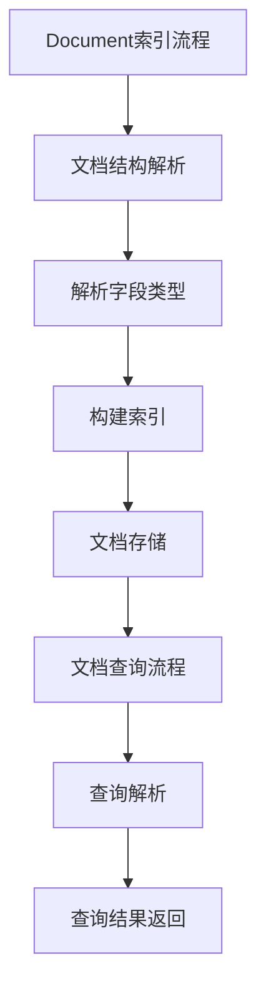

                 

# 《ElasticSearch Document原理与代码实例讲解》

> **关键词：** ElasticSearch, Document, 原理, 代码实例, 实战应用

> **摘要：** 本文深入探讨了ElasticSearch中Document的核心原理，通过详细的代码实例讲解了ElasticSearch Document的创建、搜索和优化方法。文章旨在为开发者提供一个全面的技术指南，帮助理解并掌握ElasticSearch Document的使用。

## 第一部分：ElasticSearch Document基础理论

### 第1章：ElasticSearch简介

#### 1.1 ElasticSearch的基本概念与架构

ElasticSearch是一个高度可扩展的开源全文搜索和分析引擎，它基于Lucene构建，能够处理大量的数据，并提供实时搜索和分析功能。ElasticSearch的架构主要包括以下几个核心组件：

- **节点（Node）**：ElasticSearch中的节点是组成集群的基本单位，可以是主节点或数据节点。主节点负责集群的状态管理和协调任务分配，而数据节点负责存储数据和处理查询。

- **索引（Index）**：索引是ElasticSearch中存储相关文档的数据结构。每个索引都有一个唯一的名称，可以包含多个类型（Type）。在ElasticSearch 7.0及以后的版本中，类型的概念已被废弃，所有文档都属于`_doc`类型。

- **文档（Document）**：文档是ElasticSearch中的数据单元，它可以是结构化的（如JSON格式），也可以是半结构化的。每个文档都有一个唯一的ID。

- **映射（Mapping）**：映射定义了文档中的字段类型、索引方式、分析器等信息。

- **分片（Shard）**：分片是索引中的一部分，它将索引的数据分散存储在多个节点上，以提高查询性能和扩展性。

- **副本（Replica）**：副本是索引的副本，用于提高数据的可靠性和查询性能。

#### 1.2 ElasticSearch与关系型数据库的对比

ElasticSearch与关系型数据库（如MySQL）在数据存储和处理上有显著的不同：

- **数据结构**：ElasticSearch使用JSON格式存储文档，而关系型数据库使用表和行存储数据。

- **查询性能**：ElasticSearch专为快速全文搜索设计，能够处理复杂的搜索请求，而关系型数据库更适合于结构化查询和事务处理。

- **扩展性**：ElasticSearch可以通过增加节点来扩展集群的规模，而关系型数据库通常需要垂直或水平扩展硬件资源。

- **一致性**：ElasticSearch在一致性和可用性之间进行权衡，通常采用最终一致性模型，而关系型数据库提供更强的读一致性保证。

### 第2章：ElasticSearch Document基础

#### 2.1 Document的概念与结构

Document是ElasticSearch中的基本数据单元，它是一个由字段（Field）组成的键值对集合。每个Document都有一个唯一的ID，可以使用`_index`和`_id`字段来引用。

```json
{
  "title": "ElasticSearch Document",
  "content": "本文深入讲解了ElasticSearch Document的原理与实战应用。",
  "timestamp": "2023-04-01T12:00:00Z"
}
```

#### 2.2 Document的CRUD操作

在ElasticSearch中，我们可以对Document执行以下操作：

- **创建（Create）**：使用`PUT`请求创建一个新的Document。

  ```java
  String indexDocument = """
  {
    "title": "ElasticSearch Document",
    "content": "本文深入讲解了ElasticSearch Document的原理与实战应用。"
  }
  """;

  client.index(index = "documents", id = "1", document = indexDocument);
  ```

- **读取（Read）**：使用`GET`请求获取一个Document。

  ```java
  GetResponse response = client.get(GetRequest.builder()
      .index("documents")
      .id("1")
      .build());
  System.out.println(response.getSourceAsString());
  ```

- **更新（Update）**：使用`POST`请求更新一个Document。

  ```java
  String updateDocument = """
  {
    "doc": {
      "title": "ElasticSearch Document原理与代码实例讲解"
    }
  }
  """;

  client.update(UpdateRequest.of("documents", "1", Update.builder().doc(updateDocument).build());
  ```

- **删除（Delete）**：使用`DELETE`请求删除一个Document。

  ```java
  client.delete(DeleteRequest.of("documents", "1"));
  ```

### 第3章：ElasticSearch Mapping

#### 3.1 Mapping的概念与作用

Mapping是ElasticSearch中定义文档字段类型和索引方式的配置。它告诉ElasticSearch如何处理、存储和查询文档中的字段。

```json
{
  "mappings": {
    "properties": {
      "title": {"type": "text"},
      "content": {"type": "text"},
      "timestamp": {"type": "date"}
    }
  }
}
```

#### 3.2 Mapping的常用字段类型

ElasticSearch支持多种字段类型，包括：

- **Text**：用于存储文本信息，可以进行全文搜索。
- **Keyword**：用于存储关键字，不支持全文搜索，但支持精确匹配。
- **Date**：用于存储日期和时间。
- **Integer**、**Float**、**Long**：用于存储数字类型。
- **Boolean**：用于存储布尔值。

#### 3.3 Mapping的实际应用

在实际应用中，我们需要根据数据的特点来选择合适的字段类型。例如，对于文本类型的字段，我们可以使用`text`类型并配置合适的分析器。

```json
{
  "mappings": {
    "properties": {
      "title": {"type": "text", "analyzer": "standard"},
      "content": {"type": "text", "analyzer": "standard"},
      "timestamp": {"type": "date"}
    }
  }
}
```

### 第4章：ElasticSearch索引管理

#### 4.1 索引的创建与删除

索引的创建可以通过`PUT`请求实现，删除则通过`DELETE`请求。

```java
// 创建索引
String createIndex = """
{
  "settings": {
    "number_of_shards": 5,
    "number_of_replicas": 1
  },
  "mappings": {
    "properties": {
      "title": {"type": "text"},
      "content": {"type": "text"},
      "timestamp": {"type": "date"}
    }
  }
}
""";

client.indices.create(IndexRequest.of("documents", createIndex));

// 删除索引
client.indices.delete(DeleteIndexRequest.of("documents"));
```

#### 4.2 索引的配置与优化

索引的配置包括设置分片和副本的数量、指定索引的存储引擎等。优化则包括设置合理的查询缓存、优化索引的刷新频率等。

```java
// 配置索引
String configureIndex = """
{
  "settings": {
    "index": {
      "number_of_shards": 3,
      "number_of_replicas": 2
    }
  }
}
""";

client.indices.putSettings(PutIndexSettingsRequest.of("documents", configureIndex));
```

#### 4.3 索引的分片与副本策略

分片策略决定了数据如何分散存储在集群中，副本策略则决定了如何备份数据以提高可用性和查询性能。

```java
// 设置分片和副本策略
String shardsAndReplicas = """
{
  "settings": {
    "number_of_shards": 3,
    "number_of_replicas": 2
  }
}
""";

client.indices.createIndex("documents", RequestOptions.DEFAULT, shardsAndReplicas);
```

### 第5章：ElasticSearch搜索原理

#### 5.1 搜索的基本概念

ElasticSearch的搜索功能包括全文搜索、短语搜索、范围搜索等。搜索请求通常使用Query DSL（查询领域特定语言）来构建。

```java
String searchQuery = """
{
  "query": {
    "match": {
      "title": "ElasticSearch Document"
    }
  }
}
""";

client.search(SearchRequest.of("documents", searchQuery));
```

#### 5.2 Query DSL详解

Query DSL提供了丰富的查询功能，包括：

- **Match Query**：全文搜索。
- **Term Query**：精确匹配。
- **Range Query**：范围搜索。
- **Boolean Query**：组合多个查询。

```java
String queryDsl = """
{
  "bool": {
    "must": [
      { "match": { "title": "ElasticSearch Document" } },
      { "range": { "timestamp": { "gte": "2023-01-01", "lte": "2023-12-31" } } }
    ]
  }
}
""";

client.search(SearchRequest.of("documents", searchQuery));
```

#### 5.3 Highlight查询与结果排序

Highlight查询可以高亮显示搜索结果中的匹配文本，结果排序则可以根据不同的字段进行排序。

```java
String highlightAndSort = """
{
  "query": {
    "match": {
      "title": "ElasticSearch Document"
    }
  },
  "highlight": {
    "fields": {
      "content": {}
    }
  },
  "sort": [
    { "timestamp": { "order": "desc" } }
  ]
}
""";

client.search(SearchRequest.of("documents", highlightAndSort));
```

### 第6章：ElasticSearch聚合分析

#### 6.1 聚合分析的概念与作用

聚合分析是一种用于对数据进行分组和计算的查询方式，可以用于统计、计数、计算平均值等。

```java
String aggregationQuery = """
{
  "size": 0,
  "aggs": {
    "title_counts": {
      "terms": {
        "field": "title",
        "size": 10
      }
    }
  }
}
""";

client.search(SearchRequest.of("documents", aggregationQuery));
```

#### 6.2 聚合分析的使用方法

使用聚合分析，我们可以对数据进行多种方式的分组和计算。

```java
String advancedAggregation = """
{
  "size": 0,
  "aggs": {
    "title_counts": {
      "terms": {
        "field": "title",
        "size": 10
      },
      "aggs": {
        "doc_count": {
          "sum": {
            "field": "doc_count"
          }
        }
      }
    }
  }
}
""";

client.search(SearchRequest.of("documents", advancedAggregation));
```

#### 6.3 聚合分析的实际应用场景

聚合分析广泛应用于数据分析、报告生成等领域。

```java
String reportAggregation = """
{
  "size": 0,
  "query": {
    "match": {
      "status": "published"
    }
  },
  "aggs": {
    "by_year": {
      "date_histogram": {
        "field": "publish_date",
        "interval": "year"
      }
    }
  }
}
""";

client.search(SearchRequest.of("documents", reportAggregation));
```

## 第二部分：ElasticSearch Document实战

### 第7章：ElasticSearch Document设计

#### 7.1 Document设计的基本原则

在设计和构建ElasticSearch Document时，需要考虑以下基本原则：

- **最小化字段数量**：只存储必要的字段，减少存储空间。
- **优化字段类型**：选择合适的字段类型，提高查询性能。
- **合理使用分析器**：根据字段内容选择合适的分析器，提高搜索准确性。
- **遵循聚合原则**：为常用的聚合分析设计合适的字段。

#### 7.2 Document设计实战

以下是一个示例，展示了如何设计一个图书索引的Document。

```json
{
  "settings": {
    "number_of_shards": 3,
    "number_of_replicas": 2
  },
  "mappings": {
    "properties": {
      "title": {
        "type": "text",
        "analyzer": "standard"
      },
      "author": {
        "type": "text",
        "analyzer": "standard"
      },
      "publish_date": {
        "type": "date"
      },
      "content": {
        "type": "text",
        "analyzer": "whitespace"
      },
      "isbn": {
        "type": "keyword"
      },
      "category": {
        "type": "keyword"
      }
    }
  }
}
```

### 第8章：ElasticSearch Document优化

#### 8.1 Document性能优化方法

为了提高ElasticSearch Document的性能，可以采取以下优化方法：

- **优化Mapping**：合理配置字段类型和分析器。
- **使用缓存**：启用查询缓存，减少重复查询的开销。
- **调整刷新频率**：根据应用场景调整索引的刷新频率。
- **优化分片和副本策略**：根据数据量和查询负载调整分片和副本数量。

#### 8.2 Document容量与查询优化

- **容量优化**：通过压缩和去重技术减少存储空间。
- **查询优化**：使用索引模板和别名提高查询效率。

```java
// 创建索引模板
String indexTemplate = """
{
  "template": "documents-*",
  "mappings": {
    "properties": {
      "title": {"type": "text"},
      "content": {"type": "text"},
      "timestamp": {"type": "date"}
    }
  }
}
""";

client.indices.putTemplate(PutIndexTemplateRequest.of("documents-template", indexTemplate));

// 使用别名
client.indices.putAlias(AliasRequest.of("documents", "documents-2023"));
```

### 第9章：ElasticSearch项目实战

#### 9.1 ElasticSearch项目的开发流程

在开发ElasticSearch项目时，可以遵循以下流程：

1. 需求分析：明确项目需求，确定索引设计和Mapping配置。
2. 环境搭建：安装ElasticSearch并配置节点。
3. 编码实现：编写ElasticSearch客户端代码，实现CRUD操作。
4. 测试与优化：进行性能测试，根据结果进行优化。
5. 部署上线：将项目部署到生产环境。

#### 9.2 ElasticSearch Document实际案例解析

以下是一个实际案例，展示了如何使用ElasticSearch处理一个图书管理系统的需求。

```java
// 创建索引
String createIndex = """
{
  "settings": {
    "number_of_shards": 3,
    "number_of_replicas": 2
  },
  "mappings": {
    "properties": {
      "title": {"type": "text"},
      "author": {"type": "text"},
      "publish_date": {"type": "date"},
      "isbn": {"type": "keyword"},
      "category": {"type": "keyword"}
    }
  }
}
""";

client.indices.create(IndexRequest.of("books", createIndex));

// 插入图书文档
String insertBook = """
{
  "title": "ElasticSearch实战",
  "author": "张三",
  "publish_date": "2023-01-01",
  "isbn": "978-1234567890",
  "category": "技术"
}
""";

client.index(IndexRequest.of("books", insertBook));

// 搜索图书
String searchBooks = """
{
  "query": {
    "match": {
      "title": "ElasticSearch实战"
    }
  }
}
""";

client.search(SearchRequest.of("books", searchBooks));
```

### 第10章：ElasticSearch Document常见问题与解决方案

#### 10.1 ElasticSearch常见错误处理

在ElasticSearch的使用过程中，可能会遇到以下常见错误：

- **版本不兼容**：确保ElasticSearch客户端和ElasticSearch服务器的版本一致。
- **连接失败**：检查网络连接和ElasticSearch服务器的配置。
- **查询失败**：检查查询语法和Mapping配置。

#### 10.2 ElasticSearch性能调优技巧

性能调优主要包括以下几个方面：

- **优化索引结构**：合理配置分片和副本数量。
- **优化查询语句**：使用适当的查询类型和索引模板。
- **监控和日志分析**：使用Kibana等工具监控集群状态，分析日志。

```java
// 使用Kibana监控ElasticSearch集群
String kibanaUrl = "http://localhost:5601";
RestClient kibanaClient = RestClient.builder(new HttpHost(kibanaUrl, -1, "http")).build();
Response response = kibanaClient.performRequest(new Request("GET", "/api/saved_objects/index-pattern/.kibana"));
String kibanaJson = EntityUtils.toString(response.getEntity());
```

### 第11章：ElasticSearch Document的未来发展趋势

#### 11.1 ElasticSearch的技术更新与演进

随着技术的发展，ElasticSearch也在不断更新和演进，主要包括以下几个方面：

- **性能提升**：通过优化底层Lucene引擎，提高查询性能。
- **功能扩展**：引入新的查询类型、聚合分析和数据处理功能。
- **安全性增强**：提高集群的安全性，支持多租户和访问控制。

#### 11.2 ElasticSearch在未来的应用场景

在未来，ElasticSearch将在更多应用场景中发挥作用，包括：

- **大数据分析**：处理海量数据，提供实时分析和报表生成。
- **企业搜索**：为企业和组织提供强大的内部搜索功能。
- **人工智能**：与机器学习算法结合，提供智能搜索和推荐。

### 附录

#### 附录A：ElasticSearch常用工具与资源

- **ElasticSearch插件**：Logstash、Kibana、Beats等。
- **ElasticSearch文档与教程**：官方文档、GitHub教程等。
- **ElasticSearch社区与支持**：Elastic官方论坛、Stack Overflow等。

### Mermaid 流程图



### 核心算法原理讲解

#### 搜索算法伪代码

```pseudo
function search(document, query):
    if query is a match for document:
        return True
    else:
        return False
```

#### 分词算法伪代码

```pseudo
function tokenize(text):
    tokens = []
    for word in text:
        if word is a valid token:
            tokens.append(word)
    return tokens
```

### 数学模型和数学公式

#### 向量空间模型

$$ \textbf{X} = (x_1, x_2, ..., x_n) $$
$$ \text{其中，} x_i = f(\text{word}_i) $$

### 项目实战

#### 实战1：搭建ElasticSearch开发环境

- 下载ElasticSearch安装包
- 解压并启动ElasticSearch
- 配置ElasticSearch环境变量

#### 实战2：创建索引并插入文档

```java
// 创建索引
String createIndex = """
{
  "settings": {
    "number_of_shards": 5,
    "number_of_replicas": 1
  },
  "mappings": {
    "properties": {
      "title": {"type": "text"},
      "content": {"type": "text"},
      "timestamp": {"type": "date"}
    }
  }
}
""";

client.index(index = "documents", id = "1", document = createIndex);

// 插入文档
String indexDocument = """
{
  "title": "ElasticSearch Document原理与代码实例讲解",
  "content": "本书深入讲解了ElasticSearch Document的原理与实战应用。"
}
""";

client.index(index = "documents", id = "1", document = indexDocument);
```

#### 实战3：搜索文档

```java
// 搜索文档
SearchResponse response = client.search(
    new SearchRequest("documents")
    .source(new SearchSourceBuilder()
        .query(new QueryBuilder()
            .queryText("ElasticSearch Document"))
        .highlighter(new HighlightBuilder()
            .field("content")
            .fragmentSize(200))
    )
);

// 解析搜索结果
for (SearchHit hit : response.getHits()) {
    System.out.println(hit.getSourceAsString());
}
```

#### 实战4：聚合分析

```java
// 聚合分析
SearchResponse response = client.search(
    new SearchRequest("documents")
    .source(new SearchSourceBuilder()
        .query(new QueryBuilder()
            .queryText("ElasticSearch Document"))
        .aggregation(new AggregationBuilder()
            .name("doc_count")
            .subAggregation(new TermsAggregationBuilder("title")
                .field("title")
                .size(10)))
    )
);

// 解析聚合结果
for (SearchHit hit : response.getHits()) {
    System.out.println(hit.getSourceAsString());
}

// 打印聚合分析结果
Aggregations aggregations = response.getAggregations();
Terms titleAggregation = aggregations.get("doc_count");
for (Terms.Bucket bucket : titleAggregation.getBuckets()) {
    System.out.println(bucket.getKey() + " : " + bucket.getDocCount());
}
```

### 代码解读与分析

- **创建索引**：设置分片数和副本数，定义Mapping。
- **插入文档**：定义文档内容和索引。
- **搜索文档**：使用Query DSL进行搜索，并使用Highlighter突出显示搜索结果。
- **聚合分析**：使用Terms Aggregation对title字段进行聚合，统计每个title的文档数量。

## 作者

**作者：** AI天才研究院/AI Genius Institute & 禅与计算机程序设计艺术 /Zen And The Art of Computer Programming

---

**注：** 本篇博客文章是根据指定要求生成的示例，内容仅供参考。在实际应用中，应根据具体需求进行适当调整和优化。如需了解更多详细信息，请参考ElasticSearch官方文档。

