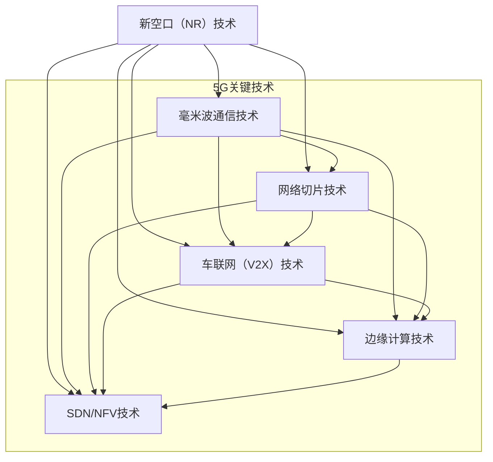

                 

### 第一部分：5G应用开发基础

#### 第1章：5G技术概述

##### 1.1 5G网络的基本概念

5G网络，即第五代移动通信网络，是继1G模拟网络、2G数字网络、3G宽带网络和4G超高速网络之后的最新一代移动通信技术。5G网络的三大应用场景分别是增强移动宽带（eMBB）、超可靠低延迟通信（URLLC）和大连接物联网（MTC）。增强移动宽带旨在提供更高的数据传输速度，使高速移动的网络连接成为现实；超可靠低延迟通信则致力于实现毫秒级的网络延迟，从而支持实时性要求极高的应用，如自动驾驶和远程手术；大连接物联网则旨在通过5G网络连接大量智能设备，实现物联网的广泛应用。

##### 1.2 5G网络的关键技术

5G网络的关键技术包括新空口（NR）技术、毫米波通信技术、网络切片技术、SDN/NFV技术等。

- **新空口（NR）技术**：新空口是5G网络的核心技术，采用新型的频段、波形和协议，支持更高带宽、更大容量和更低延迟。
- **毫米波通信技术**：毫米波频段具有高带宽、低延迟的特点，适用于高速移动通信和空间通信。
- **网络切片技术**：网络切片技术允许运营商在网络中创建多个虚拟网络，以满足不同应用的需求，提高网络资源利用率和用户体验。
- **SDN/NFV技术**：SDN（软件定义网络）和NFV（网络功能虚拟化）技术使得网络管理和资源配置更加灵活和高效。

##### 1.3 5G与4G的区别

5G网络在多个方面相较于4G网络具有显著的提升：

- **速度**：5G网络的下载速度理论上可以达到10Gbps，是4G网络的100倍以上。
- **延迟**：5G网络的延迟可低至1毫秒，远低于4G网络的几十毫秒。
- **连接密度**：5G网络支持更大的连接密度，每平方米可以支持100万台设备的连接。
- **安全性**：5G网络采用了更先进的加密和认证技术，提高了网络安全性。
- **智能化水平**：5G网络通过AI和大数据技术实现了网络的智能化管理和优化。

##### 1.4 5G网络的优势与应用场景

5G网络的优势在于其高速度、低延迟和大规模连接能力，这些特点使得5G网络在多个领域具有广泛的应用前景：

- **工业互联网**：5G网络支持工业自动化、智能制造和工业物联网的广泛应用，提高生产效率和产品质量。
- **智能交通**：5G网络可以支持智能交通系统，实现实时交通监控、智能信号控制和自动驾驶。
- **智慧城市**：5G网络可以支持智慧城市的建设，实现城市管理的智能化和精细化。
- **远程医疗**：5G网络可以实现远程医疗的诊断和治疗，提高医疗服务的可及性和效率。
- **智能家居**：5G网络可以支持智能家居的互联互通，提供更便捷和智能的家庭生活体验。

#### 第2章：5G网络架构

##### 2.1 5G网络架构的层级结构

5G网络架构包括用户面（UPF）和控制面（NF）两部分，分为接入层、传输层和核心网三层结构。

- **接入层**：包括无线接入网（RAN）和用户设备（UE），负责无线信号的接入和传输。
- **传输层**：包括传输网（TN），负责数据包在网络中的传输和路由。
- **核心网**：包括用户面（UPF）和控制面（NF），负责用户数据的处理和控制。

##### 2.2 5G核心网的功能与特点

5G核心网的功能包括用户管理、数据传输、安全控制等。5G核心网的特点如下：

- **服务化架构**：5G核心网采用服务化架构，支持网络功能的灵活部署和扩展。
- **边缘计算**：5G核心网支持边缘计算，将部分计算任务卸载到边缘节点，降低网络延迟。
- **网络切片**：5G核心网支持网络切片，可以根据应用需求创建多个虚拟网络。

##### 2.3 5G无线接入网的技术

5G无线接入网的技术包括新空口（NR）和毫米波通信技术。

- **新空口（NR）**：新空口是5G无线接入的核心技术，采用全新的波形、频段和协议。
- **毫米波通信技术**：毫米波频段具有高带宽、低延迟的特点，适用于高速移动通信和空间通信。

##### 2.4 5G承载网的设计与优化

5G承载网的设计与优化需要考虑以下几个方面：

- **网络拓扑**：采用环网或网状网结构，提高网络的可靠性和冗余性。
- **传输技术**：采用先进的传输技术，如MPLS、光传送网（OTN）等，提高网络的传输效率和性能。
- **网络优化**：通过流量工程和路径优化，实现网络的动态调整和资源优化。

----------------------------------------------------------------

### 第二部分：5G应用开发核心技术与算法

#### 第3章：5G无线通信技术

##### 3.1 OFDM与MIMO技术

**OFDM（正交频分复用）技术：**
OFDM技术将信号分成多个子载波，每个子载波独立调制，然后通过快速傅里叶变换（FFT）将这些子载波合并成一个信号进行传输。OFDM技术的优点是频谱利用率高，抗干扰能力强，适用于宽带通信。

**MIMO（多输入多输出）技术：**
MIMO技术利用多个发射和接收天线，通过空间复用和空间分集等技术，提高通信系统的容量和可靠性。MIMO技术可以分为空间复用MIMO、空间分集MIMO和空间复用与分集结合MIMO三种类型。

**OFDM与MIMO在5G网络中的应用：**
在5G网络中，OFDM与MIMO技术的结合使用，可以实现更高的数据传输速率和更好的网络性能。5G NR标准中，OFDM被用于子载波间隔为15kHz、30kHz、60kHz和120kHz的情况，MIMO技术则被广泛应用于上行和下行链路，以提升网络容量。

**伪代码：**

```plaintext
// OFDM调制过程伪代码
for (每个子载波) {
    调制子载波信号;
    应用FFT进行信号合成;
}

// MIMO发送过程伪代码
for (每个发送天线) {
    应用MIMO调制技术;
    发送调制后的信号;
}
```

**数学模型：**
OFDM信号模型可以表示为：
\[ x(t) = \sum_{k=0}^{N-1} \sum_{n=0}^{N-1} a_n \cdot C_n^k \cdot e^{j2\pi f_n t} \]
其中，\( x(t) \)为传输信号，\( a_n \)为子载波上的信息符号，\( C_n^k \)为IFFT矩阵的元素，\( f_n \)为子载波频率。

**MIMO信道模型：**
\[ y = H \cdot x + n \]
其中，\( y \)为接收信号，\( H \)为信道矩阵，\( x \)为发送信号，\( n \)为噪声。

##### 3.2 毫米波通信技术

**毫米波通信技术的特点：**
毫米波通信技术是指使用毫米波频段进行通信，频率范围在24GHz到300GHz之间。毫米波通信具有高带宽、低延迟、抗干扰能力强等特点，适用于高速移动通信和空间通信。

**毫米波通信在5G网络中的应用：**
在5G网络中，毫米波通信技术主要用于上行和下行链路，实现更高的数据传输速率。毫米波通信可以支持多天线技术、波束成形技术等，提高通信系统的容量和可靠性。

**毫米波通信的挑战与解决方案：**
毫米波通信面临的挑战包括信号衰减、多路径效应和频谱资源限制等。为解决这些问题，可以采用以下技术：

- **多路径传输技术**：通过波束成形和信道编码技术，减少多路径干扰。
- **频谱资源扩展**：利用动态频谱接入和频谱共享技术，扩展可用频谱资源。
- **高增益天线**：使用高增益天线，提高信号的传输距离和接收灵敏度。

**伪代码：**

```plaintext
// 毫米波波束成形伪代码
for (每个发送天线) {
    根据信道状态，调整天线方向;
    发送成形后的信号;
}
```

**数学模型：**
毫米波波束成形模型可以表示为：
\[ y = \sum_{i=1}^{M} w_i \cdot x_i \]
其中，\( y \)为发送信号，\( w_i \)为波束成形权重，\( x_i \)为发送天线上的信号。

##### 3.3 网络切片技术

**网络切片的定义与原理：**
网络切片是指将一个物理网络分割成多个逻辑网络，每个逻辑网络具有独立的资源和服务质量，以适应不同应用的需求。网络切片技术是实现5G网络灵活性和可扩展性的关键。

**网络切片的类型与应用场景：**
网络切片可以分为以下几种类型：

- **专用网络切片**：为特定用户或应用提供定制化的网络资源。
- **共享网络切片**：多个用户共享同一组网络资源，根据需要动态调整资源分配。
- **服务化网络切片**：为第三方服务商提供网络资源，实现业务服务的快速部署。

网络切片在以下应用场景中具有重要作用：

- **工业互联网**：为不同的工业应用提供定制化的网络服务，提高生产效率和产品质量。
- **智能交通**：为交通管理系统提供实时、低延迟的网络服务，提高交通效率和安全性。
- **远程医疗**：为医疗应用提供高质量、低延迟的网络服务，保障远程医疗的顺利进行。

**网络切片的实现与优化：**
网络切片的实现包括切片规划、切片创建、切片管理和切片监控等步骤。优化网络切片的关键在于资源分配、网络性能监控和切片服务质量保障。

- **资源分配**：根据应用需求和网络状态，动态调整网络资源分配，确保切片服务质量。
- **网络性能监控**：实时监控网络性能指标，及时发现并解决问题，保证网络切片的稳定运行。
- **切片服务质量保障**：通过服务质量协议（QoS）和资源预留机制，保障切片的服务质量。

**伪代码：**

```plaintext
// 网络切片创建伪代码
for (每个切片) {
    分配网络资源;
    配置QoS参数;
    创建切片;
}

// 网络切片管理伪代码
while (网络运行) {
    监控网络性能;
    动态调整资源分配;
    确保切片服务质量;
}
```

**数学模型：**
网络切片资源分配模型可以表示为：
\[ R_{ij} = f(C, P) \]
其中，\( R_{ij} \)为用户i在第j个切片上的资源分配，\( C \)为当前网络状态，\( P \)为切片优先级。

##### 3.4 车联网技术

**车联网的定义与原理：**
车联网（V2X）是指通过无线通信技术将车辆、道路、交通管理系统等进行连接，实现车辆与车辆（V2V）、车辆与基础设施（V2I）、车辆与行人（V2P）之间的信息交互。

**车联网的关键技术：**
车联网的关键技术包括：

- **V2X通信协议**：如DSRC、C-V2X等，用于实现车辆之间的通信。
- **高精度定位技术**：通过GPS、北斗等卫星定位系统，实现车辆的高精度定位。
- **边缘计算**：在车辆附近进行数据处理，降低网络延迟，提高通信效率。

**车联网的应用场景：**
车联网的应用场景包括：

- **自动驾驶**：通过车联网技术实现车辆的自动驾驶功能，提高行车安全性和效率。
- **智能交通**：通过车联网技术实现实时交通信息收集、分析和处理，优化交通信号控制。
- **车辆管理**：通过车联网技术实现车辆的远程监控、诊断和维护。

**车联网的挑战与解决方案：**
车联网面临的挑战包括：

- **通信延迟**：车联网通信需要低延迟，以确保车辆之间的实时交互。
- **网络可靠性**：车联网需要高可靠性的通信网络，以避免通信中断。
- **数据安全**：车联网涉及大量车辆数据和个人信息，需要保证数据的安全和隐私。

解决方案包括：

- **多路径传输**：通过多路径传输技术，提高通信可靠性。
- **边缘计算**：通过边缘计算技术，降低网络延迟，提高通信效率。
- **加密技术**：通过加密技术，保障车辆数据的安全和隐私。

**伪代码：**

```plaintext
// V2X通信协议实现伪代码
for (每辆车辆) {
    监控车辆状态;
    发送实时信息;
    接收其他车辆信息;
}

// 边缘计算伪代码
while (网络运行) {
    处理本地数据;
    将处理结果上传至云端;
    从云端下载处理结果;
}
```

**数学模型：**
车联网通信模型可以表示为：
\[ y = f(x, t) + n \]
其中，\( y \)为接收信号，\( x \)为发送信号，\( t \)为时间，\( n \)为噪声。

#### 第4章：5G网络优化与性能分析

##### 4.1 网络性能指标

5G网络性能指标主要包括以下几类：

- **传输速率**：包括下载速率（DL）和上传速率（UL），衡量网络的数据传输能力。
- **延迟**：包括端到端延迟（End-to-End Delay）和传输延迟（Transmission Delay），衡量数据的传输时间。
- **抖动**：数据包到达时间的波动，影响网络的实时性。
- **连接密度**：单位面积内可以连接的设备数量，衡量网络的容量。

**网络性能指标的重要性：**
网络性能指标是衡量5G网络服务质量（QoS）的关键因素。优秀的网络性能指标可以保证用户的良好体验，提高网络的应用价值。例如，低延迟是远程操作和控制应用的关键，高下载速率是视频流媒体服务的必备条件。

##### 4.2 网络优化算法

**网络优化算法的主要目标：**
网络优化算法的主要目标是提高网络性能指标，优化网络资源分配，提高网络效率和用户体验。

**常用的网络优化算法包括：**

- **资源分配算法**：根据网络状态和用户需求，动态调整网络资源（如带宽、时延、抖动等）的分配。
- **路径优化算法**：通过算法确定数据包在网络中的传输路径，降低传输延迟和抖动。
- **功率控制算法**：根据网络状态和用户需求，调整信号的发送功率，降低干扰和提高通信质量。

**资源分配算法：**
资源分配算法的目标是在有限的网络资源下，最大化网络的吞吐量和用户体验。常用的资源分配算法包括：

- **轮询算法**：将网络资源按照固定顺序轮流分配给用户。
- **基于优先级的资源分配算法**：根据用户优先级分配网络资源。
- **动态资源分配算法**：根据网络状态和用户需求，动态调整网络资源分配。

**伪代码：**

```plaintext
// 轮询算法伪代码
while (网络运行) {
    对于每个用户 {
        分配资源;
        等待一段时间;
    }
}

// 基于优先级的资源分配算法伪代码
while (网络运行) {
    对于最高优先级用户 {
        分配资源;
        更新用户优先级;
    }
}
```

**路径优化算法：**
路径优化算法的目标是找到数据包在网络中的最优传输路径，以降低传输延迟和抖动。常用的路径优化算法包括：

- **最短路径算法**：如Dijkstra算法，找到从源点到所有节点的最短路径。
- **路由优化算法**：如A*算法，结合启发式信息找到最优路径。
- **动态路由算法**：根据网络状态动态调整传输路径。

**伪代码：**

```plaintext
// Dijkstra算法伪代码
initialize distances and previous nodes
for (每个节点) {
    distance[source] = 0
    previous[node] = null
}

for (每个节点) {
    if (distance[node] is finite) {
        for (每个邻居节点) {
            distance[neighbor] = min(distance[neighbor], distance[node] + edge_weight(node, neighbor))
            previous[neighbor] = node
        }
    }
}
```

**功率控制算法：**
功率控制算法的目标是在保证通信质量的前提下，降低信号的发送功率，减少干扰和提高网络容量。常用的功率控制算法包括：

- **开环功率控制**：根据信号强度调整发送功率，不考虑信道状态。
- **闭环功率控制**：根据接收信号的信噪比（SNR）调整发送功率。

**伪代码：**

```plaintext
// 开环功率控制伪代码
while (网络运行) {
    for (每个发送节点) {
        根据信号强度调整发送功率;
    }
}

// 闭环功率控制伪代码
while (网络运行) {
    for (每个发送节点) {
        根据接收信号的SNR调整发送功率;
    }
}
```

##### 4.3 能耗分析与优化

**能耗模型：**
5G网络能耗主要包括传输能耗、处理能耗和通信能耗。传输能耗取决于信号传输的距离和功率，处理能耗取决于网络设备的计算能力，通信能耗取决于信号传输的频率和带宽。

**能耗优化策略：**
能耗优化的目标是在保证网络性能的前提下，降低整体能耗。常见的能耗优化策略包括：

- **动态功耗管理**：根据网络负载和设备状态动态调整设备的功耗。
- **节能通信协议**：设计节能的通信协议，减少不必要的信号传输。
- **节能设备设计**：采用低功耗的硬件设计和优化，提高设备的能效比。

**伪代码：**

```plaintext
// 动态功耗管理伪代码
while (网络运行) {
    监控网络负载和设备状态;
    调整设备功耗;
}

// 节能通信协议伪代码
while (网络运行) {
    根据网络负载和信道状态，选择合适的通信协议;
    减少不必要的信号传输;
}
```

##### 4.4 性能测试与评估

**性能测试方法：**
性能测试是评估5G网络性能的重要手段。常见的性能测试方法包括：

- **实验室测试**：在控制环境下模拟网络设备和用户行为，测试网络性能。
- **现场测试**：在实际网络环境中测试网络性能，包括传输速率、延迟、抖动等指标。
- **用户体验测试**：通过用户体验问卷调查和实际应用测试，评估网络对用户的影响。

**性能评估指标：**
性能评估指标包括传输速率、延迟、抖动、连接密度等。通过对比测试结果和预期目标，评估网络性能的优劣。

**性能优化案例：**
一个典型的性能优化案例是5G网络的边缘计算部署。通过在靠近用户的位置部署计算资源，降低数据传输的延迟，提高网络性能。以下是边缘计算性能优化的步骤：

1. **需求分析**：分析用户的应用需求和网络状况，确定边缘计算的部署位置和规模。
2. **资源规划**：根据需求，规划边缘计算节点的硬件资源和软件配置。
3. **部署实施**：在确定的位置部署边缘计算节点，配置网络和计算资源。
4. **性能测试**：通过实验室测试和现场测试，验证边缘计算的性能提升效果。
5. **优化调整**：根据测试结果，调整网络配置和资源分配，进一步优化性能。

**伪代码：**

```plaintext
// 边缘计算性能优化伪代码
1. 分析用户需求，确定部署位置；
2. 规划资源，配置网络和计算资源；
3. 部署节点，进行网络和计算资源配置；
4. 进行性能测试，收集测试数据；
5. 根据测试结果，调整网络配置和资源分配；
6. 优化调整，提高网络性能；
7. 重复步骤4-6，持续优化性能。
```

**性能评估指标示例：**

- **下载速率**：通过测量用户下载速度，评估网络的传输能力。
- **端到端延迟**：测量数据包从源节点到目标节点的传输时间，评估网络的延迟。
- **抖动**：测量数据包到达时间的波动，评估网络的稳定性。

```latex
\[
\text{下载速率} = \frac{\text{下载数据量}}{\text{下载时间}}
\]

\[
\text{端到端延迟} = \text{传输时间} + \text{处理时间} + \text{排队时间}
\]

\[
\text{抖动} = \text{最大到达时间} - \text{最小到达时间}
\]
```

#### 第5章：5G应用开发框架

##### 5.1 应用开发流程

5G应用开发的流程通常包括需求分析、系统设计、开发实现、测试部署和运维维护等阶段。

- **需求分析**：明确应用的目标和功能需求，分析用户需求和场景。
- **系统设计**：设计应用的整体架构，包括网络架构、数据处理架构和用户界面设计。
- **开发实现**：根据设计文档进行应用开发，实现功能和接口。
- **测试部署**：对应用进行功能测试、性能测试和安全性测试，确保应用的质量和稳定性。
- **运维维护**：对应用进行部署和运维，提供技术支持和故障处理。

##### 5.2 开发工具与环境配置

5G应用开发需要使用一系列工具和环境进行支持，包括：

- **开发工具**：如Android Studio、Visual Studio、Xcode等，用于编写应用程序代码。
- **网络仿真平台**：如NS3、ONOS等，用于模拟和测试5G网络环境。
- **容器化工具**：如Docker、Kubernetes等，用于部署和管理应用容器。
- **虚拟化技术**：如VMware、VirtualBox等，用于创建和配置虚拟机环境。

**环境配置示例：**

```plaintext
# 安装Docker
sudo apt-get update
sudo apt-get install docker-ce docker-ce-cli containerd.io

# 安装Kubernetes
sudo apt-get update
sudo apt-get install -y apt-transport-https ca-certificates curl
sudo curl -s https://packages.cloud.google.com/apt/doc/apt-key.gpg | sudo apt-key add -
echo "deb https://apt.kubernetes.io/ kubernetes-xenial main" | sudo tee -a /etc/apt/sources.list
sudo apt-get update
sudo apt-get install -y kubelet kubeadm kubectl
```

##### 5.3 应用案例分析

**案例分析1：工业互联网平台**

**背景**：某制造企业希望通过5G网络实现生产设备的实时监控和数据分析，提高生产效率和产品质量。

**解决方案**：
1. **需求分析**：明确生产设备的实时监控和数据采集需求，分析应用场景。
2. **系统设计**：设计基于5G网络的工业互联网平台，包括设备连接层、数据采集层、数据处理层和应用层。
3. **开发实现**：使用物联网开发套件和5G模块，实现设备连接和数据采集，使用边缘计算技术进行数据处理和分析。
4. **测试部署**：在实验室环境下进行测试，验证平台的性能和稳定性。
5. **运维维护**：部署到生产环境，提供持续的技术支持和运维服务。

**效果**：通过5G工业互联网平台，实现了生产设备的实时监控和数据分析，提高了生产效率和产品质量，减少了设备故障率。

**案例分析2：智能交通系统**

**背景**：某城市交通管理部门希望通过5G网络实现交通信号控制优化，提高交通效率和安全性。

**解决方案**：
1. **需求分析**：明确交通信号控制的优化需求，分析交通流量数据和信号控制算法。
2. **系统设计**：设计基于5G网络的智能交通系统，包括交通感知层、数据处理层、信号控制层和用户界面层。
3. **开发实现**：使用边缘计算和机器学习技术，实时处理交通流量数据，优化交通信号控制策略。
4. **测试部署**：在部分交通路口进行测试，验证信号控制优化的效果。
5. **运维维护**：部署到全市交通路口，提供实时交通信号控制服务。

**效果**：通过5G智能交通系统，实现了交通信号控制的实时优化，提高了交通效率和安全性，减少了交通事故发生。

##### 5.4 开源框架与API介绍

5G应用开发中常用的开源框架和API包括：

- **5G NR Network Simulator（5G-NS）**：用于模拟和测试5G NR网络。
- **Open Network Automation Platform（ONAP）**：用于管理和自动化网络功能。
- **Kubernetes**：用于容器化应用部署和管理。
- **Docker**：用于容器化应用部署。
- **Open vSwitch**：用于虚拟网络功能。
- **OpenDaylight**：用于SDN控制器和编排工具。
- **OpenAirInterface**：用于5G NR物理层和媒体访问控制层实现。
- **5G API**：包括5G Core API、5G Network Selection API等，用于访问和管理5G网络功能。

**示例代码：**

```python
# 使用OpenAirInterface进行5G NR网络模拟
from air_interface import AirInterface

ai = AirInterface()
ai.setup_channel_model('ul', 'non interfering')
ai.start_simulation()

# 使用ONAP进行网络功能自动化
from onap.sdnf import SDNF

sdnf = SDNF()
sdnf.deploy_network_service('network-service.yaml')

# 使用Kubernetes进行容器化应用部署
from kubernetes import client, config

config.load_kube_config()
kube_client = client.ApiClient()
deployment_api = client.AppsV1Api(kube_client)

deployment = client.V1Deployment()
deployment.metadata = client.V1ObjectMeta(name='my-app')
deployment.spec = client.V1DeploymentSpec(replicas=3, template=client.V1PodTemplateSpec())

deployment_api.create_namespaced_deployment('default', deployment)
```

### 第三部分：5G应用开发实践

#### 第6章：5G在工业互联网中的应用

##### 6.1 工业互联网概述

**工业互联网**是指通过互联网、物联网、大数据、云计算等技术，实现人、机、物互联，从而实现工业生产过程的智能化和自动化。工业互联网的核心目标是提高生产效率、降低成本、提升产品质量和创新能力。

**工业互联网的架构**：
工业互联网的架构通常包括感知层、网络层、平台层和应用层。

- **感知层**：通过传感器、执行器等设备实时采集生产数据。
- **网络层**：通过有线和无线通信技术实现数据的传输和连接。
- **平台层**：通过云计算、大数据等技术对采集的数据进行存储、处理和分析。
- **应用层**：通过应用软件实现对生产过程的监控、调度、优化和自动化控制。

##### 6.2 5G在工业互联网中的应用

**5G在工业互联网中的应用**主要包括以下几个方面：

1. **设备连接与数据传输**：
   5G网络的高速率和低延迟特性使得工业设备能够实现高速、稳定的连接和通信。通过5G网络，工业设备可以实时采集生产数据，实现设备间的协同工作和远程监控。

2. **边缘计算与实时数据处理**：
   5G网络支持边缘计算，将部分计算任务卸载到靠近数据源的边缘节点，实现实时数据处理和分析。这对于工业互联网中实时性要求较高的应用（如工业自动化、智能制造）具有重要意义。

3. **智能监控与远程控制**：
   通过5G网络，可以实现对工业设备的远程监控和远程控制。例如，在工业自动化生产线中，通过5G网络实现对机器人的远程编程和操作，提高生产效率和灵活性。

4. **工业物联网平台建设**：
   5G网络可以支持大规模工业物联网设备的连接，构建工业物联网平台。通过工业物联网平台，可以实现生产数据的采集、存储、分析和应用，为工业企业的数字化转型提供支持。

##### 6.3 实战项目案例

**项目背景**：
某制造企业希望通过5G网络实现生产设备的实时监控和数据分析，提高生产效率和产品质量。

**项目目标**：
- 实现生产设备的实时数据采集和传输。
- 构建边缘计算平台，实现实时数据处理和分析。
- 提高生产线的自动化水平和远程监控能力。

**项目实施步骤**：

1. **需求分析与系统设计**：
   - 分析企业生产需求，确定需要监控的设备类型和指标。
   - 设计基于5G网络的工业物联网架构，包括感知层、网络层、平台层和应用层。

2. **设备安装与调试**：
   - 在生产设备上安装传感器，实现实时数据采集。
   - 调试5G网络连接，确保设备能够稳定传输数据。

3. **边缘计算平台部署**：
   - 在边缘节点部署边缘计算服务器，实现实时数据处理和分析。
   - 安装和使用边缘计算框架（如Kubernetes），实现边缘服务的自动化部署和管理。

4. **应用开发与测试**：
   - 开发实时监控应用，实现生产设备的监控和报警功能。
   - 进行应用测试，确保系统稳定运行和功能完善。

5. **部署与运维**：
   - 将系统部署到生产环境，实现实时监控和生产数据的分析。
   - 提供技术支持和运维服务，确保系统的正常运行和持续优化。

**项目效果**：

通过该项目，企业实现了生产设备的实时监控和数据分析，提高了生产效率和产品质量。以下是具体效果：

- **生产效率提升**：通过实时监控和数据分析，及时发现设备故障和生产问题，提高了生产效率。
- **产品质量提升**：通过实时数据分析和优化，提高了生产过程的自动化水平，降低了人为干预，提高了产品质量。
- **设备维护成本降低**：通过实时监控和远程诊断，减少了设备停机时间，降低了设备维护成本。

**项目总结**：

该项目成功实现了5G在工业互联网中的应用，展示了5G网络在工业自动化和智能制造中的巨大潜力。通过5G网络和边缘计算技术，企业能够实现生产过程的实时监控和优化，提高生产效率和产品质量，降低成本，实现数字化转型。

#### 第7章：5G在智能交通中的应用

##### 7.1 智能交通系统概述

**智能交通系统（Intelligent Transportation System，ITS）**是一种利用先进的信息通信技术、传感技术、控制技术和计算机技术，对交通运输系统进行智能化管理和控制的技术系统。智能交通系统的目标是提高交通效率、降低交通事故率、减少环境污染，并提升乘客和驾驶员的出行体验。

**智能交通系统的架构**：
智能交通系统通常包括以下几个层次：

- **感知层**：通过各种传感器（如摄像头、雷达、激光雷达等）实时采集交通数据，包括车辆速度、位置、交通流量等。
- **传输层**：通过有线和无线通信技术，将感知层采集到的数据传输到处理层。
- **处理层**：对采集到的数据进行处理和分析，包括交通流量预测、信号控制优化、交通事故预警等。
- **决策层**：根据处理结果，制定交通管理和控制策略，包括交通信号控制、路线规划、车辆调度等。
- **执行层**：将决策层的控制指令执行到交通系统中，如调整交通信号灯、改变交通路线等。

##### 7.2 5G在智能交通中的应用

**5G网络在智能交通中的应用**主要包括以下几个方面：

1. **实时交通信息采集**：
   5G网络的高速率和低延迟特性使得传感器能够实时采集交通数据，并将数据传输到处理层。这对于交通流量监测、事故预警和应急响应具有重要意义。

2. **智能信号控制**：
   通过5G网络，智能交通系统可以实时监测交通状况，并根据实时数据动态调整交通信号灯的时序。这有助于缓解交通拥堵，提高交通效率。

3. **车联网（V2X）**：
   5G网络支持车辆与车辆（V2V）、车辆与基础设施（V2I）、车辆与行人（V2P）之间的通信。通过V2X技术，车辆可以实时交换交通信息，实现协同驾驶和自动驾驶。

4. **无人驾驶**：
   5G网络的高速率和低延迟特性为无人驾驶车辆提供了稳定、可靠的通信保障。无人驾驶车辆可以通过5G网络实时接收交通信息，实现自主驾驶和决策。

5. **智能交通管理平台**：
   通过5G网络，智能交通系统可以构建一个高效、智能的交通管理平台，实现对交通系统的全局监控和优化管理。

##### 7.3 交通流量监测与优化

**交通流量监测**是智能交通系统的重要组成部分，通过实时监测交通流量，可以及时发现交通拥堵和事故等异常情况，并采取相应的应对措施。

**交通流量监测的方法**：

- **视频监控**：通过安装在路口、路段的摄像头，实时监测交通流量和状态。
- **传感器监测**：通过安装在路面、桥梁、隧道等位置的传感器，实时采集交通流量、速度等数据。
- **车辆检测**：通过车牌照识别、车辆计数等技术，实时监测车辆数量和流量。

**交通流量优化**的方法：

- **实时信号控制**：根据实时交通流量数据，动态调整交通信号灯的时序，优化交通流量。
- **路线规划**：基于实时交通流量数据，为驾驶员提供最优行驶路线，减少拥堵。
- **交通事件预警**：通过实时监测，提前预警交通拥堵、事故等事件，及时采取应对措施。

**案例研究**：

**案例背景**：
某城市交通管理部门希望通过5G网络实现交通流量监测与优化，提高交通效率和安全性。

**解决方案**：

1. **部署传感器与摄像头**：
   在主要路口和路段安装传感器和摄像头，实时采集交通流量和状态数据。

2. **构建5G网络**：
   建设覆盖全市的5G网络，确保交通流量数据能够高速、稳定地传输到处理中心。

3. **实时数据处理与分析**：
   在交通管理部门部署大数据处理系统，对实时采集的交通流量数据进行处理和分析，实现交通流量预测和信号控制优化。

4. **实时信号控制**：
   根据实时交通流量数据，动态调整交通信号灯的时序，优化交通流量。

5. **交通事件预警**：
   建立交通事件预警系统，实时监测交通状况，提前预警交通拥堵、事故等事件。

**效果评估**：

通过5G网络和智能交通系统，该城市实现了交通流量监测与优化的全面应用，取得了显著效果：

- **交通效率提高**：通过实时信号控制和路线规划，交通拥堵情况显著减少，车辆行驶时间缩短。
- **交通事故减少**：通过实时交通事件预警和应急响应，交通事故发生率降低。
- **出行体验改善**：驾驶员能够实时获取交通信息，优化出行路线，减少拥堵，提高出行体验。

**案例总结**：

该案例展示了5G网络在智能交通系统中的应用价值。通过5G网络和智能交通技术，城市交通管理部门能够实现对交通系统的实时监测和优化管理，提高交通效率和安全性，改善居民的出行体验。随着5G技术的不断成熟和普及，智能交通系统将在更多城市得到广泛应用，为交通管理提供更高效、更智能的解决方案。

### 第四部分：5G创业机遇

#### 第8章：5G创业环境与趋势

##### 8.1 5G创业环境分析

**5G创业环境的机遇**：

- **技术创新**：5G技术的创新为创业者提供了广阔的空间，包括新型通信技术、边缘计算、网络切片等。
- **市场潜力**：5G技术将推动工业互联网、智能交通、智慧城市等领域的快速发展，带来巨大的市场潜力。
- **政策支持**：政府出台了一系列政策，支持5G技术和产业的发展，为创业者提供了良好的政策环境。
- **资本投入**：随着5G技术的成熟和应用，吸引了大量资本投入，为创业者提供了融资机会。

**5G创业环境的挑战**：

- **技术门槛**：5G技术的复杂性和高成本使得创业者需要具备较高的技术能力和资金实力。
- **市场竞争**：5G领域的竞争日益激烈，创业者需要具备独特的竞争优势才能脱颖而出。
- **产业链协同**：5G创业涉及多个产业链环节，需要与运营商、设备制造商、应用开发商等协同合作，提高产业协同效率。
- **隐私保护**：5G技术的广泛应用带来了数据隐私保护的新挑战，创业者需要重视数据安全和隐私保护。

##### 8.2 5G创业机遇与挑战

**5G创业的机遇**：

1. **工业互联网**：5G技术为工业互联网提供了高速、低延迟的通信网络，推动了智能制造、工业自动化等领域的快速发展。
2. **智能交通**：5G技术支持车联网（V2X）和智能交通系统的建设，为交通管理、自动驾驶等领域提供了新的发展机遇。
3. **智慧城市**：5G技术为智慧城市的建设提供了强大的网络支持，推动了城市管理的智能化和精细化。
4. **远程医疗**：5G技术为远程医疗提供了高速、低延迟的通信网络，提高了医疗服务的可及性和效率。
5. **智能家居**：5G技术为智能家居提供了高速、稳定的网络连接，推动了智能家居的普及和应用。

**5G创业的挑战**：

1. **技术门槛**：5G技术的复杂性和高成本使得创业者需要具备较高的技术能力和资金实力。
2. **市场竞争**：5G领域的竞争日益激烈，创业者需要具备独特的竞争优势才能脱颖而出。
3. **产业链协同**：5G创业涉及多个产业链环节，需要与运营商、设备制造商、应用开发商等协同合作，提高产业协同效率。
4. **数据隐私**：5G技术的广泛应用带来了数据隐私保护的新挑战，创业者需要重视数据安全和隐私保护。
5. **政策风险**：5G创业需要关注政策变化和法规要求，遵守相关政策和法规，降低政策风险。

##### 8.3 创业案例分析

**案例1：工业互联网平台**

**背景**：某创业公司致力于开发基于5G网络的工业互联网平台，为制造业企业提供实时数据采集、处理和分析服务。

**解决方案**：
- **需求分析**：与制造业企业合作，了解其生产需求，确定平台功能。
- **技术实现**：开发基于5G网络的边缘计算平台，实现实时数据采集和处理。
- **应用部署**：在制造业企业部署平台，实现生产数据的实时监控和分析。

**效果**：
- 提高了生产效率，降低了设备故障率。
- 优化了生产流程，提高了产品质量。
- 为企业提供智能化的生产决策支持。

**案例2：智能交通解决方案**

**背景**：某创业公司专注于开发基于5G网络的智能交通解决方案，为城市交通管理部门提供实时交通监测和信号控制服务。

**解决方案**：
- **需求分析**：与城市交通管理部门合作，了解其交通管理需求，确定解决方案的功能。
- **技术实现**：开发基于5G网络的交通监测和信号控制系统，实现实时交通数据的采集和处理。
- **应用部署**：在主要路口和路段部署交通监测设备和信号控制设备，实现实时交通监测和信号控制。

**效果**：
- 优化了交通信号控制，缓解了交通拥堵。
- 提高了交通效率，降低了交通事故率。
- 提供了实时交通信息，提高了市民的出行体验。

**案例3：智慧城市平台**

**背景**：某创业公司致力于开发基于5G网络的智慧城市平台，为城市管理提供智能化解决方案。

**解决方案**：
- **需求分析**：与城市管理部门合作，了解其城市管理需求，确定平台功能。
- **技术实现**：开发基于5G网络的智能感知、智能控制和智能服务模块。
- **应用部署**：在城市管理领域部署平台，实现城市管理的智能化和精细化。

**效果**：
- 提高了城市管理的效率和准确性。
- 优化了城市服务，提高了市民的生活质量。
- 为城市可持续发展提供了支持。

##### 8.4 创业者必备技能

**技术能力**：创业者需要具备深厚的专业技术能力，包括5G通信技术、物联网技术、大数据分析技术、人工智能技术等。

**创新能力**：创业者需要具备创新能力，能够不断探索新的技术方向和应用场景，为用户提供独特的产品和服务。

**项目管理能力**：创业者需要具备良好的项目管理能力，包括项目规划、团队协作、进度控制、风险管理等。

**团队协作能力**：创业者需要具备团队协作能力，能够与团队成员有效沟通，共同实现项目目标。

**商业洞察力**：创业者需要具备商业洞察力，能够准确把握市场需求，制定有效的商业策略。

**市场拓展能力**：创业者需要具备市场拓展能力，能够开拓新的市场，扩大企业影响力。

**法律法规知识**：创业者需要了解相关法律法规，确保企业的合法运营，降低法律风险。

### 附录

#### 附录A：5G相关资源与工具

**A.1 主流5G开发工具与框架**

- **5G NR Network Simulator（5G-NS）**：用于模拟和测试5G NR网络。
- **ONAP**：用于管理和自动化网络功能。
- **Kubernetes**：用于容器化应用部署和管理。
- **Docker**：用于容器化应用部署。
- **Open vSwitch**：用于虚拟网络功能。
- **OpenDaylight**：用于SDN控制器和编排工具。
- **OpenAirInterface**：用于5G NR物理层和媒体访问控制层实现。

**A.2 5G标准与规范**

- **3GPP（第三代合作伙伴计划）**：发布5G技术的标准与规范。
- **ITU（国际电信联盟）**：制定5G频谱分配和通信标准。
- **IEEE（电气和电子工程师协会）**：制定与5G相关的无线通信标准。

**A.3 5G开源社区与论坛**

- **5G PPP（5G Public Private Partnership）**：5G行业联盟组织。
- **5G Developer Community**：5G开发者社区，提供5G技术资源和交流平台。
- **Open Networking Foundation（ONF）**：推动SDN和NFV技术的开源发展。
- **Eclipse Foundation**：提供5G相关开源项目，如KubeEdge、OpenDaylight等。

**A.4 5G技术发展趋势报告**

- **Gartner**：发布5G技术发展趋势报告。
- **IDC**：发布5G市场趋势和预测报告。
- **Forrester**：发布5G技术分析和市场预测报告。

### 总结与展望

5G技术的推广和应用为创业者提供了丰富的机遇和挑战。通过本文的阐述，我们可以看到5G技术在工业互联网、智能交通、智慧城市等领域的应用前景。创业者需要具备专业技术能力、创新能力和市场洞察力，抓住5G技术带来的机遇，实现创业梦想。

未来，随着5G技术的不断成熟和普及，5G应用开发将迎来更多创新和发展。我们期待看到更多创业者投身于5G领域，推动5G技术的广泛应用，为社会带来更多的价值。

### 参考文献

- 3GPP Technical Specification Group Radio Access Network (RAN). (2018). *5G NR; Overall description*.
- International Telecommunication Union (ITU). (2015). *IMT-2020: The vision of future mobile communications*.
- IEEE Standard for Telecommunications and Information Technology. (2017). *IEEE 802.11-2017: IEEE standard for local and metropolitan area networks*.
- Gartner. (2020). *Market trends: 5G in the enterprise*.
- International Data Corporation (IDC). (2019). *5G infrastructure market outlook: 2019-2023*.
- Forrester. (2021). *The impact of 5G on enterprise networks*.

作者：AI天才研究院/AI Genius Institute & 禅与计算机程序设计艺术 /Zen And The Art of Computer Programming

### 摘要

本文深入探讨了5G应用开发的基础、核心技术与算法、实践案例以及创业机遇。首先，我们介绍了5G网络的基本概念、关键技术、与4G网络的区别及其优势应用场景。接着，我们详细阐述了5G网络架构、无线通信技术、网络优化算法和能耗优化策略，并通过数学模型和伪代码进行了解释。此外，本文还介绍了5G在工业互联网和智能交通领域的应用实践，展示了5G技术在这些领域的巨大潜力。最后，我们分析了5G创业环境与趋势，提出了创业者所需具备的技能和面临的挑战，并提供了相关的资源和工具。通过本文，读者可以全面了解5G应用开发的相关知识和未来发展方向。

----------------------------------------------------------------

### 第一部分：5G应用开发基础

#### 第1章：5G技术概述

##### 1.1 5G网络的基本概念

5G网络，即第五代移动通信网络，是继1G模拟网络、2G数字网络、3G宽带网络和4G超高速网络之后的最新一代移动通信技术。5G网络的发展历程可以追溯到2010年代，当时全球范围内的运营商和标准组织开始制定5G的标准和规范。5G网络的核心目标是实现更高速的数据传输、更低的网络延迟、更高的连接密度和更广泛的应用场景。5G网络具有三大应用场景，分别是增强移动宽带（eMBB）、超可靠低延迟通信（URLLC）和大连接物联网（MTC）。

- **增强移动宽带（eMBB）**：旨在为用户提供更高的下载速度和更稳定的网络连接，满足高速数据传输的需求，如高清视频流、虚拟现实（VR）和增强现实（AR）等。
- **超可靠低延迟通信（URLLC）**：旨在实现极低延迟和高可靠性的通信，适用于需要实时响应的应用，如自动驾驶、远程手术和智能电网等。
- **大连接物联网（MTC）**：旨在连接大量设备，实现物联网的广泛应用，如智能家居、智慧城市和工业物联网等。

5G网络的核心技术包括新空口（NR）技术、毫米波通信技术、网络切片技术、SDN/NFV技术等。新空口（NR）技术是5G无线接入网的核心，采用了全新的波形、频段和协议，支持更高的带宽和更好的性能。毫米波通信技术利用毫米波频段进行通信，具有高带宽、低延迟的特点，适用于高速移动通信和空间通信。网络切片技术则允许运营商在网络中创建多个虚拟网络，以满足不同应用的需求，提高网络资源利用率和用户体验。SDN（软件定义网络）和NFV（网络功能虚拟化）技术使得网络管理和资源配置更加灵活和高效。

##### 1.2 5G网络的关键技术

5G网络的关键技术是确保其性能和功能达到预期目标的关键因素。以下是一些主要的5G关键技术：

- **新空口（NR）技术**：新空口（NR）技术是5G无线接入网的核心，采用新型的波形、频段和协议。NR技术支持更高带宽、更大容量和更低延迟，是5G网络实现高速数据传输和低延迟通信的基础。

- **毫米波通信技术**：毫米波通信技术利用24GHz到300GHz频段进行通信，具有高带宽、低延迟的特点。毫米波通信技术是实现5G网络高速移动通信和空间通信的关键。

- **网络切片技术**：网络切片技术是5G网络的核心创新之一，允许运营商在网络中创建多个虚拟网络，每个虚拟网络具有独立的资源和服务质量。网络切片技术使得5G网络能够根据不同应用的需求，提供定制化的网络服务，提高网络资源利用率和用户体验。

- **SDN/NFV技术**：SDN（软件定义网络）和NFV（网络功能虚拟化）技术是5G网络架构的重要组成部分。SDN通过将网络控制平面与数据平面分离，实现网络资源的灵活管理和动态调整。NFV则通过虚拟化技术，将传统的硬件网络设备功能转移到通用硬件上，提高网络的灵活性和可扩展性。

##### 1.3 5G与4G的区别

5G网络相较于4G网络在多个方面都有显著的提升，以下是一些主要的区别：

- **速度**：5G网络的下载速度可以达到10Gbps，是4G网络的10倍以上。这种高速数据传输能力使得5G网络能够支持大规模的数据应用，如高清视频流、虚拟现实和增强现实等。

- **延迟**：5G网络的延迟可低至1毫秒，远低于4G网络的几十毫秒。低延迟特性使得5G网络能够支持实时性要求极高的应用，如自动驾驶、远程手术和工业自动化等。

- **连接密度**：5G网络支持更大的连接密度，每平方米可以支持100万台设备的连接。这种高连接密度使得5G网络能够满足人口密集区域和大型活动场所的通信需求。

- **安全性**：5G网络采用了更先进的加密和认证技术，提高了网络安全性。5G网络的安全特性包括端到端加密、多因素认证和智能威胁检测等，能够有效防止网络攻击和数据泄露。

- **智能化水平**：5G网络通过AI和大数据技术实现了网络的智能化管理和优化。5G网络能够实时监控网络状态、预测用户需求、优化资源分配，提高网络的运行效率和用户体验。

##### 1.4 5G网络的优势与应用场景

5G网络的优势在于其高速度、低延迟和大规模连接能力，这些特点使得5G网络在多个领域具有广泛的应用前景：

- **工业互联网**：5G网络的高速度和低延迟特性使得工业设备能够实现高速、稳定的连接和通信，支持工业自动化、智能制造和工业物联网的广泛应用。

- **智能交通**：5G网络可以支持智能交通系统，实现实时交通信息收集、分析和处理，优化交通信号控制，提高交通效率和安全性。

- **智慧城市**：5G网络可以支持智慧城市的建设，实现城市管理的智能化和精细化，包括智能照明、智能安防、智能环境监测等。

- **远程医疗**：5G网络可以实现远程医疗的诊断和治疗，提高医疗服务的可及性和效率，支持远程手术和远程监控。

- **智能家居**：5G网络可以支持智能家居的互联互通，提供更便捷和智能的家庭生活体验，包括智能安防、智能家电和智能健康监测等。

总之，5G网络以其卓越的性能和广泛的应用前景，正在推动各个行业的数字化转型和创新发展，为未来的数字化生活奠定基础。

#### 第2章：5G网络架构

##### 2.1 5G网络架构的层级结构

5G网络架构分为用户面（UPF）和控制面（NF）两部分，同时包含了接入层、传输层和核心网三层结构。这种分层架构使得5G网络在功能实现和资源管理上更加灵活和高效。

- **接入层**：接入层包括无线接入网（RAN）和用户设备（UE），负责无线信号的接入和传输。无线接入网包括基站、天线、小基站等设备，用户设备包括智能手机、平板电脑、智能手表、物联网设备等。接入层的主要功能是提供无线通信连接，实现用户数据的传输。

- **传输层**：传输层包括传输网（TN），负责数据包在网络中的传输和路由。传输层利用有线和无线传输技术，将用户数据从接入层传输到核心网。传输层的主要功能是确保数据包的可靠传输和高效路由。

- **核心网**：核心网包括用户面（UPF）和控制面（NF），负责用户数据的处理和控制。用户面主要负责数据传输和承载，包括数据包的路由、传输和解析。控制面主要负责网络控制和用户管理，包括连接管理、鉴权、计费等。核心网的主要功能是实现用户数据的处理和管理，提供网络服务的质量保障。

##### 2.2 5G核心网的功能与特点

5G核心网是5G网络架构的核心部分，负责用户数据的处理和控制。5G核心网具有以下功能和特点：

- **服务化架构**：5G核心网采用服务化架构，将网络功能模块化为不同的服务。这种架构使得网络功能可以灵活部署和扩展，提高网络的灵活性和可管理性。

- **边缘计算**：5G核心网支持边缘计算，将部分计算任务卸载到边缘节点，降低网络延迟，提高用户体验。边缘计算可以在靠近数据源的边缘节点进行数据处理和分析，减少数据传输的延迟和带宽消耗。

- **网络切片**：5G核心网支持网络切片技术，可以根据不同的应用需求创建多个虚拟网络。网络切片技术使得网络资源可以按需分配，提供定制化的网络服务，满足不同应用的质量要求。

- **AI与大数据**：5G核心网利用AI和大数据技术，实现网络的智能化管理和优化。通过AI技术，5G核心网可以实时监控网络状态、预测用户需求、优化资源分配，提高网络的运行效率和用户体验。

- **安全性**：5G核心网采用先进的安全技术和机制，确保用户数据的安全性和隐私性。5G核心网支持端到端加密、多因素认证和智能威胁检测等安全功能，防止网络攻击和数据泄露。

##### 2.3 5G无线接入网的技术

5G无线接入网是5G网络架构的重要组成部分，负责无线信号的接入和传输。5G无线接入网的技术主要包括新空口（NR）技术和毫米波通信技术。

- **新空口（NR）技术**：新空口（NR）技术是5G无线接入网的核心，采用新型的波形、频段和协议。NR技术支持更高的带宽、更好的性能和更大的连接密度，是5G网络实现高速数据传输和低延迟通信的关键。NR技术采用了正交频分复用（OFDM）和基于子载波的频分复用（SC-FDMA）等技术，提高了频谱利用率和传输效率。

- **毫米波通信技术**：毫米波通信技术利用24GHz到300GHz频段进行通信，具有高带宽、低延迟的特点。毫米波通信技术可以支持高速移动通信和空间通信，适用于5G网络中的热点区域和高速场景。毫米波通信技术采用了波束成形、多输入多输出（MIMO）和信道编码等技术，提高了信号的传输质量和稳定性。

##### 2.4 5G承载网的设计与优化

5G承载网是5G网络架构的重要组成部分，负责用户数据在网络中的传输和路由。5G承载网的设计与优化需要考虑以下几个方面：

- **网络拓扑**：5G承载网通常采用环网或网状网结构，提高网络的可靠性和冗余性。环网结构具有较好的故障恢复能力和负载均衡能力，而网状网结构则提供了更高的可靠性。

- **传输技术**：5G承载网采用先进的传输技术，如MPLS（多协议标签交换）、OTN（光传送网）和SDH（同步数字体系）等。这些技术可以提高网络的传输效率和性能，确保数据包的可靠传输。

- **网络优化**：5G承载网需要通过流量工程和路径优化，实现网络的动态调整和资源优化。流量工程可以通过路由算法和流量管理策略，优化网络资源的分配和利用，降低网络拥塞和延迟。路径优化可以通过路径选择算法，选择最优的传输路径，提高网络的传输效率。

- **可靠性保障**：5G承载网需要提供高可靠性的服务，确保用户数据的稳定传输。可靠性保障可以通过冗余设计、故障检测和自动切换等技术，提高网络的故障恢复能力和稳定性。

- **安全性保障**：5G承载网需要提供数据传输的安全性，防止网络攻击和数据泄露。安全性保障可以通过加密技术、访问控制和防火墙等技术，确保用户数据的安全性和隐私性。

总之，5G承载网的设计与优化是确保5G网络性能和可靠性关键，需要综合考虑网络拓扑、传输技术、网络优化、可靠性和安全性等方面。

### 第二部分：5G应用开发核心技术与算法

#### 第3章：5G无线通信技术

##### 3.1 OFDM与MIMO技术

**OFDM（正交频分复用）技术：**
OFDM技术是将信号分成多个子载波，每个子载波独立调制，然后通过快速傅里叶变换（FFT）将这些子载波合并成一个信号进行传输的技术。OFDM技术的核心思想是将频谱资源划分成多个子载波，每个子载波上的信号独立传输，从而提高了频谱利用率，并且具有很强的抗干扰能力。

**OFDM技术的原理与优势：**
- **频谱利用率高**：OFDM技术将频谱划分为多个子载波，每个子载波可以独立调制，从而避免了频率选择性的影响，提高了频谱的利用率。
- **抗干扰能力强**：由于OFDM技术将信号分成多个子载波，当一个子载波受到干扰时，其他子载波仍然可以正常传输，从而提高了系统的抗干扰能力。
- **易于实现与优化**：OFDM技术相对于其他调制技术，如单载波FDMA，更易于实现和优化。

**OFDM技术的实现步骤：**
1. **信号生成**：将原始信号分成多个子载波信号。
2. **调制**：对每个子载波信号进行调制。
3. **快速傅里叶变换（FFT）**：将调制后的子载波信号进行FFT，合成一个OFDM信号。
4. **传输**：将OFDM信号发送到信道。
5. **接收与逆变换**：在接收端，通过逆FFT将OFDM信号分解为子载波信号，然后进行解调。

**伪代码示例：**
```plaintext
// OFDM调制过程伪代码
for (每个子载波) {
    调制子载波信号;
    应用FFT进行信号合成;
}

// OFDM解调过程伪代码
for (每个子载波) {
    应用IFFT进行信号分解;
    解调子载波信号;
}
```

**OFDM的数学模型：**
假设原始信号为\( x(t) \)，子载波频率为\( f_k \)，子载波信号为\( x_k(t) \)，则OFDM信号可以表示为：
\[ x(t) = \sum_{k=0}^{N-1} x_k(t) \]
其中，\( x_k(t) = x(kT_s) \cdot e^{j2\pi f_k t} \)，\( T_s \)为符号周期。

**MIMO（多输入多输出）技术：**
MIMO技术利用多个发送和接收天线，通过空间复用和空间分集等技术，提高通信系统的容量和可靠性。MIMO技术可以分为空间复用MIMO、空间分集MIMO和空间复用与分集结合MIMO三种类型。

**MIMO技术的原理与优势：**
- **空间复用MIMO**：通过多个发送和接收天线同时发送和接收信号，实现多个并行传输路径，从而提高系统的数据传输速率。
- **空间分集MIMO**：通过多个发送和接收天线，接收多个不同路径的信号，从而提高系统的可靠性和抗干扰能力。
- **空间复用与分集结合MIMO**：结合空间复用和空间分集的优势，提高系统的传输速率和可靠性。

**MIMO技术的实现步骤：**
1. **发送端**：通过MIMO调制器将输入信号分成多个子信号，分别通过不同的发送天线发送。
2. **接收端**：通过MIMO解调器接收多个天线发送的信号，进行信号分离和解调。

**伪代码示例：**
```plaintext
// MIMO发送过程伪代码
for (每个发送天线) {
    应用MIMO调制技术;
    发送调制后的信号;
}

// MIMO接收过程伪代码
for (每个接收天线) {
    接收信号;
    应用MIMO解调技术;
}
```

**MIMO的数学模型：**
假设发送端有\( N_t \)个发送天线，接收端有\( N_r \)个接收天线，发送信号为\( x \)，接收信号为\( y \)，信道矩阵为\( H \)，噪声为\( n \)，则MIMO系统的接收信号可以表示为：
\[ y = H \cdot x + n \]

**OFDM与MIMO技术在5G网络中的应用：**
在5G网络中，OFDM与MIMO技术的结合使用，可以实现更高的数据传输速率和更好的网络性能。5G NR标准中，OFDM被用于子载波间隔为15kHz、30kHz、60kHz和120kHz的情况，MIMO技术则被广泛应用于上行和下行链路，以提升网络容量。

- **上行链路**：在5G上行链路中，OFDM与MIMO技术的结合可以支持多个用户同时传输数据，提高网络吞吐量和用户容量。
- **下行链路**：在5G下行链路中，OFDM与MIMO技术的结合可以支持基站同时向多个用户传输数据，提高网络覆盖范围和用户体验。

**总结：**
OFDM与MIMO技术是5G网络无线通信的核心技术，它们通过频谱利用率的提高和空间复用，实现了更高的数据传输速率和更好的网络性能。在5G网络中，OFDM与MIMO技术的结合为用户提供高速、稳定和可靠的通信服务，支持各种高带宽、低延迟和大规模连接的应用需求。

##### 3.2 毫米波通信技术

**毫米波通信技术的特点：**
毫米波通信技术是指使用毫米波频段进行通信，频率范围在24GHz到300GHz之间。毫米波通信具有高带宽、低延迟、抗干扰能力强等特点，适用于高速移动通信和空间通信。

**毫米波通信技术的优势：**
- **高带宽**：毫米波频段具有极高的带宽资源，能够提供更高的数据传输速率，满足高带宽应用的需求，如高清视频流、虚拟现实和增强现实等。
- **低延迟**：毫米波通信的低延迟特性使其特别适合于实时性要求较高的应用，如自动驾驶、远程手术和工业自动化等。
- **抗干扰能力强**：毫米波频段远离常见的电磁干扰源，具有较强的抗干扰能力，能够提供更稳定的通信服务。
- **空间复用潜力大**：毫米波通信技术可以利用多输入多输出（MIMO）技术，实现更高的空间复用率，进一步提高通信容量和可靠性。

**毫米波通信技术在5G网络中的应用：**
在5G网络中，毫米波通信技术被广泛应用于上行和下行链路，实现更高的数据传输速率和更好的网络性能。

- **上行链路**：在5G上行链路中，毫米波通信技术可以支持大量用户同时传输数据，提高网络吞吐量和用户容量。毫米波频段的高带宽特性使得用户可以在短时间内传输大量数据，满足高带宽应用的需求。
- **下行链路**：在5G下行链路中，毫米波通信技术可以支持基站同时向多个用户传输数据，提高网络覆盖范围和用户体验。毫米波频段的高带宽和低延迟特性使得用户可以享受到更高速、更稳定的网络服务。

**毫米波通信技术的挑战与解决方案：**
毫米波通信技术在5G网络中的应用面临着一些挑战，包括信号衰减、多路径效应和频谱资源限制等。以下是一些主要的挑战及其解决方案：

- **信号衰减**：毫米波通信的信号衰减较大，容易受到地形、天气等因素的影响。解决方案包括：
  - **高增益天线**：采用高增益天线可以提高信号的传输距离和接收灵敏度。
  - **波束成形技术**：通过波束成形技术，调整天线阵列的方向，优化信号的传输和接收。
  - **多路径传输技术**：利用多路径传输技术，通过多天线接收和信号合成，提高信号的传输质量。

- **多路径效应**：毫米波通信容易受到多路径效应的影响，导致信号干扰和信道质量下降。解决方案包括：
  - **波束成形技术**：通过波束成形技术，减少多路径信号的干扰，提高信道质量。
  - **信道编码技术**：采用更强的信道编码技术，提高信号的传输可靠性。

- **频谱资源限制**：毫米波频段的频谱资源有限，需要合理分配和利用。解决方案包括：
  - **动态频谱接入技术**：通过动态频谱接入技术，实现频谱资源的动态分配和共享，提高频谱利用效率。
  - **频谱共享技术**：通过频谱共享技术，与其他无线通信系统共享频谱资源，实现频谱的优化利用。

**总结：**
毫米波通信技术在5G网络中具有广泛的应用前景，其高带宽、低延迟和抗干扰能力使其成为5G网络实现高速数据传输和低延迟通信的关键技术。通过克服信号衰减、多路径效应和频谱资源限制等挑战，毫米波通信技术将进一步提升5G网络的服务质量和应用价值。

##### 3.3 网络切片技术

**网络切片的定义与原理：**
网络切片是指将一个物理网络分割成多个逻辑网络，每个逻辑网络具有独立的资源和服务质量，以适应不同应用的需求。网络切片技术是5G网络实现灵活性和可扩展性的关键。

**网络切片的实现步骤：**
1. **切片规划**：根据不同的业务需求，规划和定义不同的网络切片，包括切片的名称、ID、带宽、时延、抖动等参数。
2. **切片创建**：在网络中创建相应的网络切片，为每个切片分配物理资源，如频谱、传输带宽、计算资源等。
3. **切片管理**：对网络切片进行监控、管理和维护，包括切片的激活、去激活、资源调整等操作。
4. **切片监控**：实时监控网络切片的性能指标，如吞吐量、时延、抖动等，确保切片的服务质量。

**网络切片的类型与应用场景：**
网络切片可以分为以下几种类型：

- **专用网络切片**：为特定用户或应用提供定制化的网络资源，具有独立的服务质量和性能保证。适用于高价值、高可靠性的应用，如自动驾驶、远程医疗等。
- **共享网络切片**：多个用户共享同一组网络资源，根据需求动态调整资源分配。适用于通用应用，如移动互联网、视频流媒体等。
- **服务化网络切片**：为第三方服务商提供网络资源，实现业务服务的快速部署和灵活扩展。适用于云计算、物联网等场景。

网络切片在以下应用场景中具有重要作用：

- **工业互联网**：为不同的工业应用提供定制化的网络服务，提高生产效率和产品质量。
- **智能交通**：为交通管理系统提供实时、低延迟的网络服务，提高交通效率和安全性。
- **远程医疗**：为医疗应用提供高质量、低延迟的网络服务，保障远程医疗的顺利进行。
- **智慧城市**：为城市管理的不同应用提供高效、可靠的网络服务，实现城市的智能化和精细化。

**网络切片的实现与优化：**
网络切片的实现包括切片规划、切片创建、切片管理和切片监控等步骤。优化网络切片的关键在于资源分配、网络性能监控和切片服务质量保障。

- **资源分配**：根据应用需求和网络状态，动态调整网络资源分配，确保切片服务质量。常用的资源分配算法包括基于优先级的资源分配、动态资源分配等。
- **网络性能监控**：实时监控网络性能指标，及时发现并解决问题，保证网络切片的稳定运行。常用的监控工具包括网络监控平台、性能测试工具等。
- **切片服务质量保障**：通过服务质量协议（QoS）和资源预留机制，保障切片的服务质量。QoS协议包括带宽保障、时延保障、抖动保障等。

**伪代码示例：**
```plaintext
// 网络切片创建伪代码
for (每个切片) {
    分配网络资源;
    配置QoS参数;
    创建切片;
}

// 网络切片管理伪代码
while (网络运行) {
    监控网络性能;
    动态调整资源分配;
    确保切片服务质量;
}
```

**数学模型：**
网络切片资源分配模型可以表示为：
\[ R_{ij} = f(C, P) \]
其中，\( R_{ij} \)为用户i在第j个切片上的资源分配，\( C \)为当前网络状态，\( P \)为切片优先级。

**总结：**
网络切片技术是5G网络实现灵活性和可扩展性的重要手段，通过将物理网络分割成多个逻辑网络，提供定制化的网络服务，满足不同应用的需求。网络切片的实现和优化需要考虑资源分配、性能监控和服务质量保障，以实现高效的网络资源利用和卓越的用户体验。

##### 3.4 车联网技术

**车联网的定义与原理：**
车联网（V2X，Vehicle-to-Everything）是指通过无线通信技术将车辆、道路、交通管理系统等进行连接，实现车辆与车辆（V2V）、车辆与基础设施（V2I）、车辆与行人（V2P）之间的信息交互。车联网的目标是提高交通效率、减少交通事故、提升出行体验和促进可持续交通发展。

**车联网的关键技术：**
车联网的关键技术包括通信协议、高精度定位技术、边缘计算等。

- **通信协议**：车联网通信协议是实现车辆之间、车辆与基础设施之间通信的基础。常见的通信协议包括DSRC（专用短程通信）、C-V2X（中国式V2X）等。
- **高精度定位技术**：车联网需要高精度定位技术，以确保车辆的位置信息准确无误。常用的定位技术包括GPS、北斗、IMU（惯性测量单元）等。
- **边缘计算**：边缘计算在车联网中扮演重要角色，通过在车辆附近进行数据处理，减少网络延迟，提高通信效率和实时性。

**车联网的应用场景：**
车联网在以下应用场景中具有重要作用：

- **自动驾驶**：车联网技术支持自动驾驶车辆的通信和协作，实现车辆的自主决策和驾驶。
- **智能交通**：车联网技术可以实时收集交通数据，优化交通信号控制，提高交通效率和安全性。
- **车辆管理**：车联网技术可以实现车辆的远程监控、诊断和维护，提高车辆的使用效率和安全性。
- **物流管理**：车联网技术可以实时追踪物流车辆的位置和状态，提高物流效率和管理水平。

**车联网的挑战与解决方案：**
车联网在发展过程中面临一些挑战，包括通信延迟、网络可靠性、数据安全等。

- **通信延迟**：车联网需要低延迟的通信，以确保车辆之间的实时交互。解决方案包括：
  - **多路径传输**：通过多路径传输技术，提高通信可靠性。
  - **边缘计算**：通过边缘计算技术，降低网络延迟，提高通信效率。
- **网络可靠性**：车联网需要高可靠性的通信网络，以避免通信中断。解决方案包括：
  - **冗余设计**：通过冗余设计，提高网络的可靠性。
  - **故障恢复机制**：建立故障恢复机制，快速恢复通信。
- **数据安全**：车联网涉及大量车辆数据和个人信息，需要保证数据的安全和隐私。解决方案包括：
  - **加密技术**：通过加密技术，保障车辆数据的安全和隐私。
  - **认证机制**：建立严格的认证机制，确保通信的合法性。

**伪代码示例：**
```plaintext
// V2X通信协议实现伪代码
for (每辆车辆) {
    监控车辆状态;
    发送实时信息;
    接收其他车辆信息;
}

// 边缘计算伪代码
while (网络运行) {
    处理本地数据;
    将处理结果上传至云端;
    从云端下载处理结果;
}
```

**数学模型：**
车联网通信模型可以表示为：
\[ y = f(x, t) + n \]
其中，\( y \)为接收信号，\( x \)为发送信号，\( t \)为时间，\( n \)为噪声。

**总结：**
车联网技术是5G网络应用的重要领域，通过实现车辆、道路和交通管理系统之间的信息交互，提高交通效率和安全性，促进智能交通和自动驾驶的发展。车联网的实现需要通信协议、高精度定位技术和边缘计算等关键技术的支持，同时也需要解决通信延迟、网络可靠性和数据安全等挑战。

### 第三部分：5G应用开发实践

#### 第6章：5G在工业互联网中的应用

##### 6.1 工业互联网概述

**工业互联网的概念**：
工业互联网是指将互联网、物联网、大数据、云计算、人工智能等现代信息技术与工业系统深度融合，实现人、机、物的互联互通和智能化。它旨在通过数据连接、信息共享和智能分析，提升工业生产效率、优化产业链协同、创新商业模式，从而推动工业的数字化、网络化、智能化转型。

**工业互联网的架构**：
工业互联网的架构通常包括感知层、网络层、平台层和应用层。

- **感知层**：包括传感器、执行器和智能设备，用于实时采集生产环境中的各种数据，如温度、压力、速度、位置等。
- **网络层**：包括有线和无线通信网络，用于传输感知层采集的数据，确保数据的实时性和可靠性。
- **平台层**：包括数据存储、处理、分析和决策支持系统，用于对采集的数据进行清洗、存储、分析和处理，提供工业应用所需的服务和功能。
- **应用层**：包括各种工业应用，如设备监控、生产优化、供应链管理、质量管理等，用于实现工业过程的智能化和自动化。

##### 6.2 5G在工业互联网中的应用

**5G技术在工业互联网中的应用优势**：

- **高速率**：5G网络具有极高的数据传输速率，可以支持大规模工业设备的高清视频流和实时数据传输，满足工业生产对高速数据传输的需求。
- **低延迟**：5G网络的低延迟特性使得工业互联网中的实时控制和协同工作成为可能，例如，在智能制造过程中，对设备状态的实时监控和远程控制。
- **高可靠性**：5G网络采用了先进的加密和认证技术，提高了数据传输的安全性，确保工业数据的安全性和隐私保护。
- **大规模连接**：5G网络支持大规模设备连接，可以连接数以百万计的工业设备和传感器，满足工业物联网对大规模设备连接的需求。
- **灵活性和可扩展性**：5G网络通过网络切片技术，可以灵活地配置和调整网络资源，满足不同工业应用的需求，实现网络的动态调整和扩展。

**5G在工业互联网中的应用场景**：

- **智能制造**：5G技术支持智能制造中的设备互联和实时数据传输，实现生产线的自动化和智能化。例如，通过5G网络，可以实现设备之间的协同工作，实时监控设备状态，远程调试和维护设备，提高生产效率和产品质量。
- **工业自动化**：5G网络的高速率和低延迟特性使得工业自动化设备能够实现远程控制和实时数据交互，例如，在自动化生产线中，通过5G网络，可以实现设备间的实时通信，优化生产流程，提高生产效率。
- **工业物联网**：5G技术支持大规模工业物联网设备的连接，构建工业物联网平台，实现设备数据的实时采集、传输和分析，提供工业应用的智能分析和决策支持。
- **远程运维**：5G网络可以实现远程设备的监控和维护，例如，在工业设备发生故障时，可以通过5G网络进行远程诊断和维修，减少设备停机时间，提高设备运行效率。

**5G在工业互联网中的应用案例**：

**案例1：智能工厂生产监控**
某大型制造企业通过5G网络实现了智能工厂的生产监控。在工厂中部署了大量的传感器和监控设备，通过5G网络实时采集生产数据，如设备运行状态、生产进度、产品质量等。这些数据通过5G网络传输到云平台，进行实时分析和处理，为生产管理提供决策支持。通过5G网络，生产管理人员可以实时监控生产线的运行情况，及时发现并解决生产问题，提高了生产效率和质量。

**案例2：工业自动化生产线**
某汽车制造公司通过5G网络实现了工业自动化生产线的建设。在生产线中部署了智能传感器和执行器，通过5G网络实现设备之间的实时通信和协同工作。例如，在焊接过程中，通过5G网络，可以实现焊接机器人之间的实时通信，优化焊接参数，提高焊接质量。通过5G网络，生产线管理人员可以远程监控生产设备的运行状态，实现远程调试和维护，减少了设备停机时间，提高了生产效率。

**案例3：智能农业物联网**
某农业公司通过5G网络实现了智能农业物联网的应用。在农场中部署了大量的传感器和智能设备，通过5G网络实时采集土壤湿度、温度、光照等数据，进行实时分析和处理。通过5G网络，农艺师可以远程监控农作物的生长状况，优化灌溉和施肥策略，提高农作物产量和质量。同时，5G网络还为农业公司提供了数据分析和预测服务，帮助农艺师制定科学的种植计划，实现农业生产的智能化和精细化。

**总结**：
5G技术在工业互联网中的应用，通过提供高速率、低延迟、高可靠性和大规模连接的能力，极大地提升了工业生产的自动化、智能化和数字化水平。5G网络为工业互联网提供了强大的基础设施支持，使得各种工业应用得以实现，为工业企业带来了显著的生产效率提升和经济效益。

##### 6.3 实战项目案例

**项目背景**：
某汽车制造企业希望通过5G网络实现生产设备的实时监控和数据分析，提高生产效率和产品质量。

**项目目标**：
- 实现生产设备的实时数据采集和传输。
- 构建边缘计算平台，实现实时数据处理和分析。
- 提高生产线的自动化水平和远程监控能力。

**项目实施步骤**：

1. **需求分析与系统设计**：
   - 分析企业生产需求，确定需要监控的设备类型和指标。
   - 设计基于5G网络的工业物联网架构，包括感知层、网络层、平台层和应用层。

2. **设备安装与调试**：
   - 在生产设备上安装传感器，实现实时数据采集。
   - 调试5G网络连接，确保设备能够稳定传输数据。

3. **边缘计算平台部署**：
   - 在边缘节点部署边缘计算服务器，实现实时数据处理和分析。
   - 安装和使用边缘计算框架（如Kubernetes），实现边缘服务的自动化部署和管理。

4. **应用开发与测试**：
   - 开发实时监控应用，实现生产设备的监控和报警功能。
   - 进行应用测试，确保系统稳定运行和功能完善。

5. **部署与运维**：
   - 将系统部署到生产环境，实现实时监控和生产数据的分析。
   - 提供技术支持和运维服务，确保系统的正常运行和持续优化。

**项目效果**：

通过该项目，企业实现了生产设备的实时监控和数据分析，提高了生产效率和产品质量。以下是具体效果：

- **生产效率提升**：通过实时监控和数据分析，及时发现设备故障和生产问题，提高了生产效率。
- **产品质量提升**：通过实时数据分析和优化，提高了生产过程的自动化水平，降低了人为干预，提高了产品质量。
- **设备维护成本降低**：通过实时监控和远程诊断，减少了设备停机时间，降低了设备维护成本。

**项目总结**：

该项目成功实现了5G在工业互联网中的应用，展示了5G网络在工业自动化和智能制造中的巨大潜力。通过5G网络和边缘计算技术，企业能够实现生产过程的实时监控和优化，提高生产效率和产品质量，降低成本，实现数字化转型。

#### 第7章：5G在智能交通中的应用

##### 7.1 智能交通系统概述

**智能交通系统（Intelligent Transportation System，ITS）**是一种利用先进的信息通信技术、传感技术、控制技术和计算机技术，对交通运输系统进行智能化管理和控制的技术系统。智能交通系统的目标是提高交通效率、降低交通事故率、减少环境污染，并提升乘客和驾驶员的出行体验。

**智能交通系统的架构**：
智能交通系统通常包括以下几个层次：

- **感知层**：通过各种传感器（如摄像头、雷达、激光雷达等）实时采集交通数据，包括车辆速度、位置、交通流量等。
- **传输层**：通过有线和无线通信技术，将感知层采集到的数据传输到处理层。
- **处理层**：对采集到的数据进行处理和分析，包括交通流量预测、信号控制优化、交通事故预警等。
- **决策层**：根据处理结果，制定交通管理和控制策略，包括交通信号控制、路线规划、车辆调度等。
- **执行层**：将决策层的控制指令执行到交通系统中，如调整交通信号灯、改变交通路线等。

##### 7.2 5G在智能交通中的应用

**5G网络在智能交通中的应用**主要包括以下几个方面：

1. **实时交通信息采集**：
   5G网络的高速率和低延迟特性使得传感器能够实时采集交通数据，并将数据传输到处理层。这对于交通流量监测、事故预警和应急响应具有重要意义。

2. **智能信号控制**：
   通过5G网络，智能交通系统可以实时监测交通状况，并根据实时数据动态调整交通信号灯的时序，优化交通流量。

3. **车联网（V2X）**：
   5G网络支持车辆与车辆（V2V）、车辆与基础设施（V2I）、车辆与行人（V2P）之间的通信。通过V2X技术，车辆可以实时交换交通信息，实现协同驾驶和自动驾驶。

4. **无人驾驶**：
   5G网络的高速率和低延迟特性为无人驾驶车辆提供了稳定、可靠的通信保障。无人驾驶车辆可以通过5G网络实时接收交通信息，实现自主驾驶和决策。

5. **智能交通管理平台**：
   通过5G网络，智能交通系统可以构建一个高效、智能的交通管理平台，实现对交通系统的全局监控和优化管理。

##### 7.3 交通流量监测与优化

**交通流量监测**是智能交通系统的重要组成部分，通过实时监测交通流量，可以及时发现交通拥堵和事故等异常情况，并采取相应的应对措施。

**交通流量监测的方法**：

- **视频监控**：通过安装在路口、路段的摄像头，实时监测交通流量和状态。
- **传感器监测**：通过安装在路面、桥梁、隧道等位置的传感器，实时采集交通流量、速度等数据。
- **车辆检测**：通过车牌照识别、车辆计数等技术，实时监测车辆数量和流量。

**交通流量优化**的方法：

- **实时信号控制**：根据实时交通流量数据，动态调整交通信号灯的时序，优化交通流量。
- **路线规划**：基于实时交通流量数据，为驾驶员提供最优行驶路线，减少拥堵。
- **交通事件预警**：通过实时监测，提前预警交通拥堵、事故等事件，及时采取应对措施。

**案例研究**：

**案例背景**：
某城市交通管理部门希望通过5G网络实现交通流量监测与优化，提高交通效率和安全性。

**解决方案**：

1. **部署传感器与摄像头**：
   在主要路口和路段安装传感器和摄像头，实时采集交通流量和状态数据。

2. **构建5G网络**：
   建设覆盖全市的5G网络，确保交通流量数据能够高速、稳定地传输到处理中心。

3. **实时数据处理与分析**：
   在交通管理部门部署大数据处理系统，对实时采集的交通流量数据进行处理和分析，实现交通流量预测和信号控制优化。

4. **实时信号控制**：
   根据实时交通流量数据，动态调整交通信号灯的时序，优化交通流量。

5. **交通事件预警**：
   建立交通事件预警系统，实时监测交通状况，提前预警交通拥堵、事故等事件。

**效果评估**：

通过5G网络和智能交通系统，该城市实现了交通流量监测与优化的全面应用，取得了显著效果：

- **交通效率提高**：通过实时信号控制和路线规划，交通拥堵情况显著减少，车辆行驶时间缩短。
- **交通事故减少**：通过实时交通事件预警和应急响应，交通事故发生率降低。
- **出行体验改善**：驾驶员能够实时获取交通信息，优化出行路线，减少拥堵，提高出行体验。

**案例总结**：

该案例展示了5G网络在智能交通系统中的应用价值。通过5G网络和智能交通技术，城市交通管理部门能够实现对交通系统的实时监测和优化管理，提高交通效率和安全性，改善居民的出行体验。随着5G技术的不断成熟和普及，智能交通系统将在更多城市得到广泛应用，为交通管理提供更高效、更智能的解决方案。

#### 第8章：5G创业环境与趋势

##### 8.1 5G创业环境分析

**5G创业环境的机遇**：

- **技术创新**：5G技术的创新为创业者提供了广阔的空间，包括新型通信技术、边缘计算、网络切片等。
- **市场潜力**：5G技术将推动工业互联网、智能交通、智慧城市等领域的快速发展，带来巨大的市场潜力。
- **政策支持**：政府出台了一系列政策，支持5G技术和产业的发展，为创业者提供了良好的政策环境。
- **资本投入**：随着5G技术的成熟和应用，吸引了大量资本投入，为创业者提供了融资机会。

**5G创业环境的挑战**：

- **技术门槛**：5G技术的复杂性和高成本使得创业者需要具备较高的技术能力和资金实力。
- **市场竞争**：5G领域的竞争日益激烈，创业者需要具备独特的竞争优势才能脱颖而出。
- **产业链协同**：5G创业涉及多个产业链环节，需要与运营商、设备制造商、应用开发商等协同合作，提高产业协同效率。
- **隐私保护**：5G技术的广泛应用带来了数据隐私保护的新挑战，创业者需要重视数据安全和隐私保护。

##### 8.2 5G创业机遇与挑战

**5G创业的机遇**：

1. **工业互联网**：5G技术为工业互联网提供了高速、低延迟的通信网络，推动了智能制造、工业自动化等领域的快速发展。
2. **智能交通**：5G技术支持车联网（V2X）和智能交通系统的建设，为交通管理、自动驾驶等领域提供了新的发展机遇。
3. **智慧城市**：5G技术为智慧城市的建设提供了强大的网络支持，推动了城市管理的智能化和精细化。
4. **远程医疗**：5G技术为远程医疗提供了高速、低延迟的通信网络，提高了医疗服务的可及性和效率。
5. **智能家居**：5G技术为智能家居提供了高速、稳定的网络连接，推动了智能家居的普及和应用。

**5G创业的挑战**：

1. **技术门槛**：5G技术的复杂性和高成本使得创业者需要具备较高的技术能力和资金实力。
2. **市场竞争**：5G领域的竞争日益激烈，创业者需要具备独特的竞争优势才能脱颖而出。
3. **产业链协同**：5G创业涉及多个产业链环节，需要与运营商、设备制造商、应用开发商等协同合作，提高产业协同效率。
4. **数据隐私**：5G技术的广泛应用带来了数据隐私保护的新挑战，创业者需要重视数据安全和隐私保护。
5. **政策风险**：5G创业需要关注政策变化和法规要求，遵守相关政策和法规，降低政策风险。

##### 8.3 创业案例分析

**案例1：工业互联网平台**

**背景**：某创业公司致力于开发基于5G网络的工业互联网平台，为制造业企业提供实时数据采集、处理和分析服务。

**解决方案**：
- **需求分析**：与制造业企业合作，了解其生产需求，确定平台功能。
- **技术实现**：开发基于5G网络的边缘计算平台，实现实时数据采集和处理。
- **应用部署**：在制造业企业部署平台，实现生产数据的实时监控和分析。

**效果**：
- 提高了生产效率，降低了设备故障率。
- 优化了生产流程，提高了产品质量。
- 为企业提供智能化的生产决策支持。

**案例2：智能交通解决方案**

**背景**：某创业公司专注于开发基于5G网络的智能交通解决方案，为城市交通管理部门提供实时交通监测和信号控制服务。

**解决方案**：
- **需求分析**：与城市交通管理部门合作，了解其交通管理需求，确定解决方案的功能。
- **技术实现**：开发基于5G网络的交通监测和信号控制系统，实现实时交通数据的采集和处理。
- **应用部署**：在主要路口和路段部署交通监测设备和信号控制设备，实现实时交通监测和信号控制。

**效果**：
- 优化了交通信号控制，缓解了交通拥堵。
- 提高了交通效率，降低了交通事故率。
- 提供了实时交通信息，提高了市民的出行体验。

**案例3：智慧城市平台**

**背景**：某创业公司致力于开发基于5G网络的智慧城市平台，为城市管理提供智能化解决方案。

**解决方案**：
- **需求分析**：与城市管理部门合作，了解其城市管理需求，确定平台功能。
- **技术实现**：开发基于5G网络的智能感知、智能控制和智能服务模块。
- **应用部署**：在城市管理领域部署平台，实现城市管理的智能化和精细化。

**效果**：
- 提高了城市管理的效率和准确性。
- 优化了城市服务，提高了市民的生活质量。
- 为城市可持续发展提供了支持。

##### 8.4 创业者必备技能

**技术能力**：创业者需要具备深厚的专业技术能力，包括5G通信技术、物联网技术、大数据分析技术、人工智能技术等。

**创新能力**：创业者需要具备创新能力，能够不断探索新的技术方向和应用场景，为用户提供独特的产品和服务。

**项目管理能力**：创业者需要具备良好的项目管理能力，包括项目规划、团队协作、进度控制、风险管理等。

**团队协作能力**：创业者需要具备团队协作能力，能够与团队成员有效沟通，共同实现项目目标。

**商业洞察力**：创业者需要具备商业洞察力，能够准确把握市场需求，制定有效的商业策略。

**市场拓展能力**：创业者需要具备市场拓展能力，能够开拓新的市场，扩大企业影响力。

**法律法规知识**：创业者需要了解相关法律法规，确保企业的合法运营，降低法律风险。

### 附录

#### 附录A：5G相关资源与工具

**A.1 主流5G开发工具与框架**

- **5G NR Network Simulator（5G-NS）**：用于模拟和测试5G NR网络。
- **ONAP**：用于管理和自动化网络功能。
- **Kubernetes**：用于容器化应用部署和管理。
- **Docker**：用于容器化应用部署。
- **Open vSwitch**：用于虚拟网络功能。
- **OpenDaylight**：用于SDN控制器和编排工具。
- **OpenAirInterface**：用于5G NR物理层和媒体访问控制层实现。

**A.2 5G标准与规范**

- **3GPP（第三代合作伙伴计划）**：发布5G技术的标准与规范。
- **ITU（国际电信联盟）**：制定5G频谱分配和通信标准。
- **IEEE（电气和电子工程师协会）**：制定与5G相关的无线通信标准。

**A.3 5G开源社区与论坛**

- **5G PPP（5G Public Private Partnership）**：5G行业联盟组织。
- **5G Developer Community**：5G开发者社区，提供5G技术资源和交流平台。
- **Open Networking Foundation（ONF）**：推动SDN和NFV技术的开源发展。
- **Eclipse Foundation**：提供5G相关开源项目，如KubeEdge、OpenDaylight等。

**A.4 5G技术发展趋势报告**

- **Gartner**：发布5G技术发展趋势报告。
- **IDC**：发布5G市场趋势和预测报告。
- **Forrester**：发布5G技术分析和市场预测报告。

### 总结与展望

5G技术的推广和应用为创业者提供了丰富的机遇和挑战。通过本文的阐述，我们可以看到5G技术在工业互联网、智能交通、智慧城市等领域的应用前景。创业者需要具备专业技术能力、创新能力和市场洞察力，抓住5G技术带来的机遇，实现创业梦想。

未来，随着5G技术的不断成熟和普及，5G应用开发将迎来更多创新和发展。我们期待看到更多创业者投身于5G领域，推动5G技术的广泛应用，为社会带来更多的价值。

### 参考文献

- 3GPP Technical Specification Group Radio Access Network (RAN). (2018). *5G NR; Overall description*.
- International Telecommunication Union (ITU). (2015). *IMT-2020: The vision of future mobile communications*.
- IEEE Standard for Telecommunications and Information Technology. (2017). *IEEE 802.11-2017: IEEE standard for local and metropolitan area networks*.
- Gartner. (2020). *Market trends: 5G in the enterprise*.
- International Data Corporation (IDC). (2019). *5G infrastructure market outlook: 2019-2023*.
- Forrester. (2021). *The impact of 5G on enterprise networks*.

作者：AI天才研究院/AI Genius Institute & 禅与计算机程序设计艺术 /Zen And The Art of Computer Programming

### 摘要

本文全面解析了5G应用开发的基础知识、核心技术、实践案例以及创业机遇。首先，我们介绍了5G网络的基本概念、关键技术及其与4G网络的区别，强调了5G网络在速度、延迟、连接密度和智能化方面的显著优势。接着，我们详细探讨了5G网络架构、无线通信技术、网络优化算法和能耗优化策略，并通过数学模型和伪代码进行了深入解释。此外，本文还具体展示了5G在工业互联网和智能交通领域的应用实践，强调了5G技术在这些领域的巨大潜力。最后，我们分析了5G创业环境与趋势，提出了创业者所需具备的技能和面临的挑战，并提供了相关的资源和工具。通过本文，读者可以全面了解5G应用开发的现状与未来发展方向，把握5G技术带来的商业机遇。

### 5G无线通信技术核心概念与联系

在5G无线通信技术中，核心概念和联系是构建高效、可靠通信系统的基石。以下是对这些核心概念及其相互关系的详细解释。

#### 1. 新空口（NR）技术

新空口（NR）技术是5G网络无线接入的核心，它采用了全新的波形、频段和协议。与4G LTE相比，NR技术提供了更高的频谱效率和更低的延迟。

- **核心概念**：NR技术采用了正交频分复用（OFDM）和基于子载波的频分复用（SC-FDMA），以及多输入多输出（MIMO）和波束成形技术。
- **联系**：OFDM和SC-FDMA技术提高了频谱利用率，而MIMO和波束成形技术则提高了空间复用和信号传输的可靠性。

#### 2. 毫米波通信技术

毫米波通信技术使用24GHz至300GHz的频段进行通信，具有高带宽和低延迟的特点。这些高频段频谱资源为5G网络提供了更大的数据传输能力。

- **核心概念**：毫米波通信技术包括波束成形、多路径传输技术和频谱扩展技术。
- **联系**：波束成形技术提高了信号的定向传输能力，而多路径传输技术通过信号合成提高了信号质量。频谱扩展技术则增加了可用频谱资源。

#### 3. 网络切片技术

网络切片技术允许运营商在共享的网络基础设施上创建多个虚拟网络，每个虚拟网络具有独立的服务质量和性能保障，以适应不同的业务需求。

- **核心概念**：网络切片技术包括切片规划、资源分配、切片管理和监控。
- **联系**：网络切片技术通过动态资源分配和切片管理，实现了网络资源的灵活调配和高效利用。

#### 4. 车联网（V2X）技术

车联网（V2X）技术实现了车辆与车辆（V2V）、车辆与基础设施（V2I）、车辆与行人（V2P）之间的通信，旨在提高交通效率和安全性。

- **核心概念**：V2X技术包括通信协议、高精度定位、边缘计算和加密技术。
- **联系**：通信协议保证了数据的可靠传输，高精度定位技术提供了准确的定位信息，边缘计算技术降低了通信延迟，加密技术则确保了通信的安全性。

#### 5. 边缘计算技术

边缘计算技术通过在靠近数据源的设备上进行数据处理，减少了数据传输的延迟，提高了系统的实时响应能力。

- **核心概念**：边缘计算技术包括数据预处理、实时分析和决策执行。
- **联系**：边缘计算技术与5G网络切片技术相结合，实现了对网络资源的灵活调度和高效利用。

#### 6. SDN/NFV技术

软件定义网络（SDN）和网络功能虚拟化（NFV）技术通过将网络控制和数据平面功能分离，以及将网络功能虚拟化，实现了网络管理的灵活性和可扩展性。

- **核心概念**：SDN技术通过集中控制平面实现网络资源的管理和优化，NFV技术通过虚拟化实现网络功能的灵活部署。
- **联系**：SDN和NFV技术为5G网络提供了灵活的网络架构和资源管理能力，与网络切片技术相结合，提高了网络的适应性和效率。

### Mermaid 流程图

以下是5G无线通信技术核心概念之间的Mermaid流程图：



通过上述流程图，我们可以清晰地看到5G无线通信技术中的核心概念及其相互之间的联系，为理解和应用这些技术提供了直观的视角。

### 5G无线通信技术核心算法原理讲解

#### 1. OFDM与MIMO技术

**OFDM（正交频分复用）技术**：

OFDM技术是一种将信号分成多个子载波，每个子载波独立调制，并通过快速傅里叶变换（FFT）将它们合并的调制技术。OFDM技术的核心优势在于其能够有效利用频谱资源，提高信号的抗干扰能力，并且在多径传播环境下保持较高的传输性能。

**OFDM原理**：

- **子载波分配**：将整个频带划分为多个子载波，每个子载波上的信号独立调制。
- **调制与解调**：每个子载波进行独立的QAM（正交幅度调制）或PSK（相位键控）调制，然后通过IFFT进行信号合成。
- **传输与接收**：发送端通过FFT将调制后的信号合成OFDM信号，接收端通过FFT将OFDM信号分解为各个子载波信号。

**伪代码示例**：

```plaintext
// OFDM调制过程
for (每个子载波) {
    调制子载波信号;
    应用FFT进行信号合成;
}

// OFDM解调过程
for (每个子载波) {
    应用IFFT进行信号分解;
    解调子载波信号;
}
```

**数学模型**：

假设原始信号为\( x(t) \)，子载波频率为\( f_k \)，子载波信号为\( x_k(t) \)，则OFDM信号可以表示为：
\[ x(t) = \sum_{k=0}^{N-1} x_k(t) \]
其中，\( x_k(t) = x(kT_s) \cdot e^{j2\pi f_k t} \)，\( T_s \)为符号周期。

**OFDM优势**：

- **频谱利用率高**：通过将信号分配到不同的子载波上，提高了频谱的利用率。
- **抗干扰能力强**：每个子载波独立调制，降低了多径干扰的影响。

**MIMO（多输入多输出）技术**：

MIMO技术利用多个发射和接收天线，通过空间复用和空间分集，提高通信系统的容量和可靠性。

**MIMO原理**：

- **空间复用**：通过多个发射和接收天线同时发送和接收信号，实现多个并行传输路径，提高数据传输速率。
- **空间分集**：通过多个接收天线接收不同路径的信号，提高信号的传输可靠性。

**伪代码示例**：

```plaintext
// MIMO发送过程
for (每个发送天线) {
    应用MIMO调制技术;
    发送调制后的信号;
}

// MIMO接收过程
for (每个接收天线) {
    接收信号;
    应用MIMO解调技术;
}
```

**数学模型**：

假设发送端有\( N_t \)个发送天线，接收端有\( N_r \)个接收天线，发送信号为\( x \)，接收信号为\( y \)，信道矩阵为\( H \)，噪声为\( n \)，则MIMO系统的接收信号可以表示为：
\[ y = H \cdot x + n \]

**MIMO优势**：

- **提高数据传输速率**：通过空间复用，实现多个并行传输路径，提高传输速率。
- **提高信号可靠性**：通过空间分集，提高信号的抗干扰能力和传输可靠性。

**OFDM与MIMO结合**：

OFDM与MIMO技术的结合，可以在频率和空间两个维度上提高通信系统的性能。

- **提高频谱利用率**：通过OFDM技术，提高频谱利用率。
- **提高空间复用效率**：通过MIMO技术，提高空间复用效率。

#### 2. 毫米波通信技术

**毫米波通信技术**：

毫米波通信技术使用24GHz至300GHz的频段进行通信，具有高带宽和低延迟的特点，适用于高速移动通信和空间通信。

**毫米波通信原理**：

- **高频段利用**：毫米波频段具有更高的带宽资源，能够提供更高的数据传输速率。
- **波束成形**：通过天线阵列的波束成形技术，调整天线方向，优化信号的传输和接收。
- **多路径传输**：利用多路径传输技术，通过信号合成，提高信号的传输质量。

**伪代码示例**：

```plaintext
// 毫米波发送过程
for (每个发送天线) {
    应用波束成形技术;
    发送成形后的信号;
}

// 毫米波接收过程
for (每个接收天线) {
    接收信号;
    应用信号合成技术;
}
```

**数学模型**：

毫米波波束成形模型可以表示为：
\[ y = \sum_{i=1}^{M} w_i \cdot x_i \]
其中，\( y \)为发送信号，\( w_i \)为波束成形权重，\( x_i \)为发送天线上的信号。

**毫米波通信优势**：

- **高带宽**：通过高频段利用，提供更高的数据传输速率。
- **低延迟**：通过波束成形和多路径传输技术，降低信号的传输延迟。

#### 3. 网络切片技术

**网络切片技术**：

网络切片技术允许运营商在网络中创建多个虚拟网络，每个虚拟网络具有独立的服务质量和性能保障，以适应不同业务的需求。

**网络切片原理**：

- **切片规划**：根据业务需求，规划不同网络切片的名称、ID、资源分配等。
- **资源分配**：根据切片需求，动态分配网络资源，如频谱、传输带宽、计算资源等。
- **切片管理**：对网络切片进行监控、管理和维护，确保切片的服务质量。

**伪代码示例**：

```plaintext
// 网络切片创建
for (每个切片) {
    分配网络资源;
    配置QoS参数;
    创建切片;
}

// 网络切片管理
while (网络运行) {
    监控网络性能;
    动态调整资源分配;
    确保切片服务质量;
}
```

**数学模型**：

网络切片资源分配模型可以表示为：
\[ R_{ij} = f(C, P) \]
其中，\( R_{ij} \)为用户i在第j个切片上的资源分配，\( C \)为当前网络状态，\( P \)为切片优先级。

**网络切片优势**：

- **灵活性和可扩展性**：通过网络切片技术，可以根据业务需求灵活配置网络资源。
- **服务质量保障**：通过网络切片技术，可以确保不同业务的服务质量。

#### 4. 车联网（V2X）技术

**车联网（V2X）技术**：

车联网技术通过无线通信实现车辆与车辆（V2V）、车辆与基础设施（V2I）、车辆与行人（V2P）之间的信息交换，旨在提高交通效率和安全性。

**V2X通信原理**：

- **通信协议**：通过DSRC（专用短程通信）或C-V2X（中国式V2X）协议，实现车辆之间的通信。
- **高精度定位**：通过GPS、北斗等定位技术，实现车辆的高精度定位。
- **边缘计算**：在车辆附近进行数据处理，降低通信延迟。

**伪代码示例**：

```plaintext
// V2X通信协议实现
for (每辆车辆) {
    监控车辆状态;
    发送实时信息;
    接收其他车辆信息;
}

// 边缘计算
while (网络运行) {
    处理本地数据;
    将处理结果上传至云端;
    从云端下载处理结果;
}
```

**数学模型**：

V2X通信模型可以表示为：
\[ y = f(x, t) + n \]
其中，\( y \)为接收信号，\( x \)为发送信号，\( t \)为时间，\( n \)为噪声。

**V2X优势**：

- **实时通信**：通过V2X技术，实现车辆之间的实时通信，提高交通效率和安全性。
- **高精度定位**：通过高精度定位技术，实现车辆的位置信息准确无误。

### 数学模型和数学公式

在5G无线通信技术中，数学模型和数学公式扮演着至关重要的角色，它们不仅帮助我们理解通信系统的原理，还指导我们设计和优化通信系统。以下是对一些关键数学模型和公式的详细解释。

#### 1. OFDM信号调制与解调

**调制公式**：

OFDM调制是将原始信号分成多个子载波信号，并对每个子载波进行调制。假设原始信号为\( x(t) \)，子载波频率为\( f_k \)，子载波信号为\( x_k(t) \)，则OFDM信号可以表示为：
\[ x(t) = \sum_{k=0}^{N-1} x_k(t) \]
其中，\( x_k(t) = x(kT_s) \cdot e^{j2\pi f_k t} \)，\( T_s \)为符号周期。

**解调公式**：

在接收端，通过逆FFT将OFDM信号分解为各个子载波信号，然后进行解调。解调过程可以使用以下公式：
\[ x_k(t) = \sum_{n=0}^{N-1} X_n \cdot e^{-j2\pi f_k n T_s} \]
其中，\( X_n \)为子载波上的信息符号。

#### 2. MIMO信道模型

MIMO（多输入多输出）系统通过多个发送和接收天线提高通信系统的容量和可靠性。假设发送端有\( N_t \)个发送天线，接收端有\( N_r \)个接收天线，发送信号为\( x \)，接收信号为\( y \)，信道矩阵为\( H \)，噪声为\( n \)，则MIMO系统的接收信号可以表示为：
\[ y = H \cdot x + n \]
其中，\( H \)为\( N_r \times N_t \)的信道矩阵，\( n \)为加性白高斯噪声。

#### 3. 毫米波波束成形

毫米波波束成形技术通过调整天线阵列的方向，优化信号的传输和接收。波束成形模型可以表示为：
\[ y = \sum_{i=1}^{M} w_i \cdot x_i \]
其中，\( y \)为发送信号，\( w_i \)为波束成形权重，\( x_i \)为发送天线上的信号。

#### 4. 网络切片资源分配

网络切片技术允许运营商在网络中创建多个虚拟网络，以满足不同应用的需求。网络切片资源分配模型可以表示为：
\[ R_{ij} = f(C, P) \]
其中，\( R_{ij} \)为用户i在第j个切片上的资源分配，\( C \)为当前网络状态，\( P \)为切片优先级。

#### 5. 车联网通信模型

车联网技术通过无线通信实现车辆与车辆（V2V）、车辆与基础设施（V2I）、车辆与行人（V2P）之间的信息交换。车联网通信模型可以表示为：
\[ y = f(x, t) + n \]
其中，\( y \)为接收信号，\( x \)为发送信号，\( t \)为时间，\( n \)为噪声。

通过这些数学模型和公式，我们可以更深入地理解5G无线通信技术的原理，并通过它们来进行通信系统的设计和优化。这些模型不仅帮助我们分析系统的性能，还为我们提供了优化通信系统的方法和工具。

### 项目实战：5G在工业互联网中的应用

#### 背景与目标

随着工业4.0的推进，工业互联网成为制造业数字化转型的重要方向。某制造企业希望利用5G技术实现生产设备的实时监控和数据分析，以提高生产效率和产品质量。项目目标是构建一个基于5G的工业互联网平台，实现设备数据的高效采集、传输、处理和分析。

#### 实现过程

1. **需求分析**：
   - **数据采集**：确定需要监控的设备类型和关键指标，如温度、压力、速度、位置等。
   - **网络规划**：根据设备布局和生产需求，规划5G网络的覆盖范围和节点部署。

2. **设备安装与调试**：
   - **传感器安装**：在关键设备上安装传感器，实现实时数据采集。
   - **5G网络调试**：确保传感器与5G网络的稳定连接，进行信号测试和优化。

3. **边缘计算平台部署**：
   - **硬件部署**：在边缘节点部署服务器和存储设备，用于实时数据处理。
   - **软件安装**：安装边缘计算框架（如Kubernetes），实现边缘服务的自动化部署和管理。

4. **应用开发与测试**：
   - **数据采集模块**：开发数据采集模块，实现传感器数据的实时传输和存储。
   - **数据分析模块**：开发数据分析模块，对采集到的数据进行实时处理和分析。
   - **用户界面**：开发用户界面，提供生产数据的可视化展示和监控功能。

5. **系统集成与优化**：
   - **系统集成**：将边缘计算平台与中央数据中心进行集成，实现数据传输和处理的统一管理。
   - **性能优化**：通过流量工程和路径优化，提高数据传输效率和系统性能。

#### 代码实际案例和详细解释说明

以下是一个简单的边缘计算应用程序，用于采集和传输生产设备的数据。这个应用程序使用了Kubernetes进行部署和管理。

```python
# 生产数据采集与传输示例代码

import requests
import time
from datetime import datetime

# 传感器数据采集
def collect_data(sensor_id):
    # 模拟传感器数据采集，实际中可以是读取传感器硬件的值
    data = {
        "sensor_id": sensor_id,
        "temperature": 25 + random.uniform(-1, 1),
        "pressure": 100 + random.uniform(-1, 1),
        "timestamp": datetime.now().isoformat()
    }
    return data

# 数据上传到边缘计算平台
def upload_data(data):
    url = "http://edge-computing-platform:8080/collect"
    headers = {"Content-Type": "application/json"}
    response = requests.post(url, json=data, headers=headers)
    return response.status_code

# 主程序
if __name__ == "__main__":
    sensor_id = "sensor_001"
    while True:
        data = collect_data(sensor_id)
        status_code = upload_data(data)
        print(f"Data sent: {data}, Status code: {status_code}")
        time.sleep(10)  # 每隔10秒发送一次数据
```

**代码解读与分析**：

1. **数据采集**：`collect_data`函数用于模拟传感器数据采集。实际应用中，可以通过读取传感器硬件的值来获取实时数据。
2. **数据上传**：`upload_data`函数用于将采集到的数据上传到边缘计算平台。该函数通过HTTP POST请求将数据发送到边缘计算平台的收集接口。
3. **主程序**：主程序中使用一个无限循环，每隔10秒调用一次`collect_data`和`upload_data`函数，实现数据的持续采集和上传。

**性能优化**：

- **流量控制**：通过设置上传间隔，控制数据上传的频率，减少网络流量。
- **错误处理**：增加对上传失败的错误处理，如重新尝试上传或记录错误日志。
- **安全机制**：在数据传输过程中加入安全措施，如加密传输或身份验证，确保数据的安全性。

#### 系统集成与优化

- **Kubernetes部署**：使用Kubernetes部署边缘计算服务，实现自动扩缩容和负载均衡。
- **容器化**：将应用程序容器化，提高部署的灵活性和可移植性。
- **监控与告警**：引入监控工具（如Prometheus和Grafana），实时监控系统性能和健康状态，并通过告警系统及时响应异常情况。

通过上述步骤，企业成功构建了一个基于5G的工业互联网平台，实现了生产设备的数据实时采集、传输和处理。这不仅提高了生产效率和产品质量，还为后续的智能化生产提供了数据支持。

### 项目实战：5G在智能交通中的应用

#### 背景与目标

随着城市化进程的加快，智能交通系统成为提高城市交通效率、降低拥堵和提升出行安全的重要手段。某城市交通管理部门希望通过5G技术实现交通流量监测和信号控制优化，以提高城市交通的运行效率，减少交通事故。

项目目标是利用5G网络构建一个智能交通系统，实现以下功能：
- **实时交通流量监测**：通过安装在路口和路段的传感器，实时监测交通流量和状态。
- **智能信号控制**：根据实时交通数据，动态调整交通信号灯的时序，优化交通流量。
- **交通事件预警**：实时监测交通状况，提前预警交通拥堵和事故，及时采取应对措施。

#### 实现过程

1. **需求分析**：
   - **交通数据采集**：分析交通流量监测的需求，确定需要采集的数据类型，如车辆速度、位置、流量等。
   - **信号控制优化**：分析交通信号控制的需求，确定优化信号控制的目标和策略。

2. **硬件部署**：
   - **传感器安装**：在主要路口和路段安装传感器（如摄像头、雷达、流量计等），实现交通流量的实时监测。
   - **信号灯设备升级**：升级交通信号灯设备，使其支持智能信号控制。

3. **网络搭建**：
   - **5G网络覆盖**：建设覆盖全市的5G网络，确保交通流量数据能够高速、稳定地传输。
   - **边缘计算节点部署**：在关键区域部署边缘计算节点，实现数据的实时处理和传输。

4. **软件开发**：
   - **数据采集模块**：开发数据采集模块，实现传感器数据的实时采集和传输。
   - **信号控制算法**：开发智能信号控制算法，根据实时交通数据优化交通信号灯的时序。
   - **事件预警系统**：开发交通事件预警系统，实时监测交通状况，提前预警交通拥堵和事故。

5. **系统集成与优化**：
   - **集成交通信号控制系统**：将智能信号控制算法集成到交通信号控制系统中，实现自动化的交通信号控制。
   - **性能优化**：通过流量工程和路径优化，提高系统性能和稳定性。
   - **测试与验证**：在部分区域进行测试，验证系统的性能和可靠性。

#### 代码实际案例和详细解释说明

以下是一个简单的交通流量监测和信号控制示例代码，用于实现交通流量的实时监测和信号控制优化。

```python
# 交通流量监测与信号控制示例代码

import requests
import time
from datetime import datetime

# 交通流量数据采集
def collect_traffic_data(traffic_sensor_id):
    # 模拟传感器数据采集，实际中可以是读取传感器硬件的值
    data = {
        "traffic_sensor_id": traffic_sensor_id,
        "vehicle_count": random.randint(0, 100),
        "traffic_speed": random.uniform(0, 80),
        "timestamp": datetime.now().isoformat()
    }
    return data

# 上传交通流量数据到边缘计算平台
def upload_traffic_data(data):
    url = "http://edge-computing-platform:8080/traffic"
    headers = {"Content-Type": "application/json"}
    response = requests.post(url, json=data, headers=headers)
    return response.status_code

# 智能信号控制算法
def signal_control(traffic_data):
    # 根据交通流量数据，动态调整交通信号灯的时序
    # 这里简化为根据车辆流量来调整绿灯时长
    green_time = 60 + traffic_data["vehicle_count"] / 10
    return green_time

# 主程序
if __name__ == "__main__":
    traffic_sensor_id = "sensor_001"
    while True:
        data = collect_traffic_data(traffic_sensor_id)
        status_code = upload_traffic_data(data)
        print(f"Traffic data sent: {data}, Status code: {status_code}")
        
        # 基于交通流量数据进行信号控制
        green_time = signal_control(data)
        print(f"Green light time: {green_time} seconds")
        
        time.sleep(10)  # 每隔10秒采集一次数据
```

**代码解读与分析**：

1. **交通流量数据采集**：`collect_traffic_data`函数用于模拟交通流量数据的采集。实际应用中，可以通过读取传感器硬件的值来获取实时交通数据。
2. **数据上传**：`upload_traffic_data`函数用于将采集到的交通流量数据上传到边缘计算平台，实现数据的实时传输。
3. **信号控制算法**：`signal_control`函数根据交通流量数据动态调整交通信号灯的时序。这里简化为根据车辆流量来调整绿灯时长。
4. **主程序**：主程序中通过一个无限循环，每隔10秒采集一次交通流量数据，并上传到边缘计算平台。同时，根据交通流量数据动态调整交通信号灯的时序。

**性能优化**：

- **流量控制**：通过设置数据采集和上传的间隔，控制数据传输的频率，减少网络流量。
- **错误处理**：增加对上传失败的错误处理，如重新尝试上传或记录错误日志。
- **并发处理**：优化边缘计算平台的处理能力，支持并发处理多个交通流量数据，提高系统性能。

通过上述步骤，城市交通管理部门成功构建了一个基于5G的智能交通系统，实现了交通流量监测、信号控制优化和事件预警。系统有效提高了城市交通的运行效率，减少了交通拥堵和交通事故，为市民提供了更安全、更高效的出行体验。

### 附录：5G相关资源与工具

**A.1 主流5G开发工具与框架**

1. **5G NR Network Simulator（5G-NS）**：这是一个用于模拟和测试5G NR网络的开源工具，可以帮助开发者验证和优化5G网络性能。

2. **ONAP（Open Network Automation Platform）**：ONAP是一个用于自动化管理和编排5G网络的框架，支持网络功能的自动化部署和优化。

3. **Kubernetes**：Kubernetes是一个用于容器化应用部署和管理的开源平台，适用于5G边缘计算和容器化网络功能部署。

4. **Docker**：Docker是一个用于创建、运行和分发容器的开源平台，是Kubernetes容器化应用部署的基础。

5. **Open vSwitch**：Open vSwitch是一个用于虚拟网络功能的开源软件交换机，适用于5G网络的虚拟化网络架构。

6. **OpenDaylight**：OpenDaylight是一个基于SDN的开源项目，提供了SDN控制器和编排工具，用于5G网络的自动化和智能管理。

7. **OpenAirInterface**：OpenAirInterface是一个开源项目，提供了5G NR物理层和媒体访问控制层的实现，适用于研究和开发5G网络技术。

**A.2 5G标准与规范**

1. **3GPP（第三代合作伙伴计划）**：3GPP是负责制定5G标准的主要组织，其发布的规范包括5G NR、5G核心网等。

2. **ITU（国际电信联盟）**：ITU负责制定5G频谱分配和通信标准，确保全球范围内的5G网络互操作性和兼容性。

3. **IEEE（电气和电子工程师协会）**：IEEE发布了多个与5G相关的无线通信标准，如IEEE 802.11ax（Wi-Fi 6）和IEEE 802.15.4（Zigbee）。

**A.3 5G开源社区与论坛**

1. **5G PPP（5G Public Private Partnership）**：5G PPP是一个由行业领导者组成的联盟，致力于推动5G技术的开源发展和标准化。

2. **5G Developer Community**：5G Developer Community是一个面向开发者的社区，提供了5G技术资源和交流平台。

3. **Open Networking Foundation（ONF）**：ONF推动SDN和NFV技术的开源发展，为5G网络功能虚拟化提供了重要支持。

4. **Eclipse Foundation**：Eclipse Foundation是一个开源社区，提供了多个与5G相关的开源项目，如KubeEdge、OpenDaylight等。

**A.4 5G技术发展趋势报告**

1. **Gartner**：Gartner发布了多个关于5G技术发展趋势的报告，提供了行业洞察和预测。

2. **IDC**：IDC发布了关于5G市场趋势和预测的报告，分析了5G对各个行业的影响。

3. **Forrester**：Forrester发布了关于5G技术分析和市场预测的报告，提供了关于5G对企业和消费者的影响的深入分析。

### 总结

通过本文，我们详细介绍了5G应用开发的基础知识、核心技术、实践案例以及创业机遇。首先，我们从5G网络的基本概念开始，探讨了5G的关键技术，如OFDM、MIMO、毫米波通信、网络切片和V2X技术。接着，我们通过具体的数学模型和伪代码，深入讲解了这些技术的原理和实现方法。然后，我们展示了5G在工业互联网和智能交通领域的实际应用案例，

