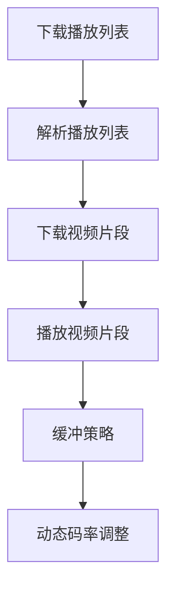
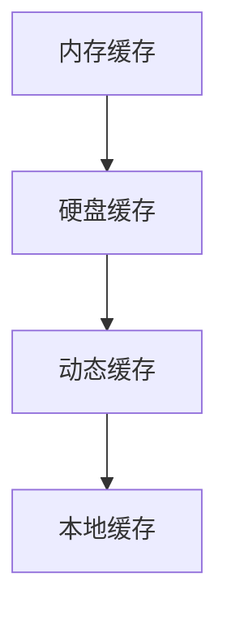
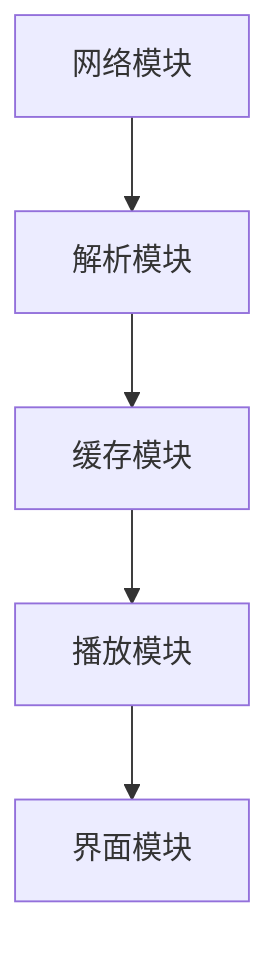

                 

### HLS流媒体：m3u8协议的应用与优化

#### 关键词：HLS流媒体，m3u8协议，视频编码，服务器优化，客户端播放，安全监控

> 摘要：本文旨在深入探讨HLS（HTTP Live Streaming）流媒体技术及其核心组成部分——m3u8协议的应用与优化。首先，我们将回顾HLS的基础知识，包括其定义、工作原理以及与DASH和H.265的关系。接着，我们将详细解析m3u8协议，涵盖文件结构、播放列表格式以及加密与安全性。文章还将讨论HLS流媒体的编码基础，包括视频和音频编码原理及参数选择。随后，我们将探讨HLS服务器和客户端的配置与优化策略。最后，我们将介绍HLS流媒体的安全与监控措施，并通过项目实战案例展示HLS技术的实际应用。通过这篇文章，读者将全面了解HLS流媒体技术的核心内容，掌握其应用与优化的关键要点。

---

## 第1章：HLS流媒体基础

### 1.1 HLS流媒体概述

#### 1.1.1 HLS的定义与历史

HLS（HTTP Live Streaming）是一种由苹果公司开发的流媒体传输技术，旨在通过HTTP协议传输音视频内容。该技术首次发布于2009年，支持实时流和点播流。与传统流媒体技术不同，HLS采用基于HTTP的协议，使得流媒体传输更加可靠和高效。

HLS的工作原理是将视频和音频内容分割成多个小片段，每个片段通常持续6秒到60秒不等。这些片段存储在服务器上，并通过特殊的播放列表文件（通常为m3u8文件）进行索引。播放器从这些片段中逐个下载并播放，从而实现流畅的视频播放。

#### 1.1.2 HLS的工作原理

HLS的工作流程主要包括以下几个步骤：

1. **切片**：视频和音频内容被编码器切割成一个个独立的片段（通常为TS文件）。
2. **创建播放列表**：编码器将片段信息组织成m3u8文件，其中包含了播放顺序和每个片段的URL地址。
3. **存储**：m3u8文件和对应的片段被上传到服务器。
4. **下载与播放**：客户端从服务器下载播放列表和片段，根据播放列表中的指示逐个播放片段。

这种基于HTTP的传输方式具有以下优势：

- **兼容性**：HTTP协议是Web标准，几乎所有的设备和浏览器都支持。
- **可靠性**：基于HTTP的传输能够处理断线和重新连接的情况。
- **灵活性**：支持不同的编码格式和分辨率，可以动态调整播放质量。

#### 1.1.3 HLS与DASH、H.265的关系

HLS和DASH（Dynamic Adaptive Streaming over HTTP）都是基于HTTP的流媒体传输技术，但它们有一些不同之处。

- **兼容性**：DASH比HLS更具有扩展性，支持更多的媒体格式和编码。
- **协议**：HLS使用Apple的私有协议，而DASH采用开放的MPEG-DASH标准。
- **目标**：HLS主要针对苹果设备，DASH则更广泛地适用于不同平台。

H.265（High Efficiency Video Coding，HEVC）是一种新的视频编码标准，提供了更高的压缩效率。与H.264相比，H.265能够在相同质量下提供更高的压缩比，从而减少带宽使用。

HLS和H.265的结合使用可以带来以下好处：

- **降低带宽使用**：通过使用H.265编码，可以在不降低视频质量的情况下减少传输带宽。
- **提升用户体验**：在带宽有限的条件下，用户可以享受到更高质量的视频内容。

### 1.2 HLS流媒体架构

#### 1.2.1 HLS客户端架构

HLS客户端架构主要包括以下几个部分：

1. **播放器**：负责播放视频和音频内容。常见的播放器有Apple's QuickTime、mpv、VLC等。
2. **下载器**：负责从服务器下载m3u8播放列表和片段。下载器可以是内置在播放器中的，也可以是独立的组件。
3. **缓存管理器**：负责管理缓存数据，包括已经下载的片段和播放列表。缓存管理器可以优化播放效率，减少延迟。

#### 1.2.2 HLS服务器架构

HLS服务器架构通常包括以下几个部分：

1. **编码器**：将原始视频和音频内容编码成HLS支持的格式。常见的编码器有Apple's FFMPEG、x264等。
2. **切片器**：将编码后的视频和音频内容切割成片段。切片器通常会生成m3u8播放列表，用于指示片段的播放顺序。
3. **存储服务器**：负责存储m3u8播放列表和片段。存储服务器可以是单个服务器，也可以是分布式存储系统。

#### 1.2.3 HLS内容分发网络（CDN）

CDN（Content Delivery Network）是一种分布式的服务器网络，用于加速内容的分发。在HLS流媒体中，CDN可以提供以下几个好处：

- **提高访问速度**：通过CDN，用户可以从距离最近的服务器获取内容，从而减少延迟。
- **负载均衡**：CDN可以将流量均衡分布到不同的服务器上，避免单个服务器过载。
- **容错性**：CDN可以提供备份服务器，在主服务器出现故障时自动切换。

### 小结

本章介绍了HLS流媒体的基础知识，包括定义、工作原理、架构以及与DASH和H.265的关系。通过本章的学习，读者可以了解HLS流媒体的基本概念和架构，为进一步学习m3u8协议和应用与优化打下基础。

### 1.3 HLS流媒体应用场景

#### 1.3.1 视频直播

视频直播是HLS最广泛的应用场景之一。通过HLS，直播内容可以实时传输到用户设备上，并提供高质量的视频体验。直播场景通常包括：

- **在线教育**：教师通过直播课程，学生可以在任何地点观看。
- **体育赛事**：球迷可以通过直播观看体育比赛，实时获取比赛信息。

#### 1.3.2 点播视频

点播视频是另一种常见的HLS应用场景。用户可以随时随地点播视频内容，例如电影、电视剧、纪录片等。点播视频的优势在于：

- **灵活性**：用户可以随时开始和暂停播放。
- **控制性**：用户可以调节播放速度和画面质量。

#### 1.3.3 实时监控

实时监控是通过HLS实现远程监控的一种有效方式。监控内容可以实时传输到监控中心，提供实时警报和数据分析。实时监控的应用场景包括：

- **工业监控**：监控生产线和设备状态。
- **安防监控**：实时监控公共场所和住宅安全。

#### 1.3.4 VR/AR应用

虚拟现实（VR）和增强现实（AR）应用需要实时传输高质量的视频内容。通过HLS，VR/AR应用可以实现以下功能：

- **沉浸式体验**：用户可以在虚拟环境中实时浏览和交互。
- **实时导航**：用户可以通过实时视频导航到目的地。

### 小结

本章介绍了HLS流媒体的应用场景，包括视频直播、点播视频、实时监控和VR/AR应用。通过这些应用场景，读者可以更深入地了解HLS的实际用途和优势。

### 1.4 HLS流媒体的优势与挑战

#### 1.4.1 优势

HLS流媒体技术具有以下优势：

- **兼容性**：基于HTTP协议，几乎所有设备和浏览器都支持。
- **可靠性**：支持断线重连，确保播放过程的连续性。
- **灵活性**：支持多种编码格式和分辨率，适应不同网络环境。
- **扩展性**：可以与其他流媒体技术（如DASH）结合使用，提高性能和兼容性。

#### 1.4.2 挑战

尽管HLS流媒体技术具有很多优势，但在实际应用中也面临一些挑战：

- **带宽消耗**：HLS需要频繁下载片段，可能消耗大量带宽。
- **缓存管理**：需要有效管理缓存数据，以减少延迟和提高播放效率。
- **安全性**：需要确保数据传输的安全性，防止未授权访问。
- **编码延迟**：编码过程可能引入延迟，影响播放体验。

### 小结

本章总结了HLS流媒体的优势与挑战。通过了解这些优势与挑战，读者可以更好地评估HLS流媒体技术的适用性和优化策略。

### 1.5 HLS流媒体的优化策略

为了提高HLS流媒体的性能和用户体验，我们可以采取以下优化策略：

#### 1.5.1 编码优化

- **选择合适的编码参数**：根据目标网络带宽和视频内容特点，选择合适的视频编码参数，如比特率、帧率、分辨率等。
- **多编码层次**：使用多编码层次（Multi-Layer Encoding）技术，为不同带宽条件提供多种码流选择。

#### 1.5.2 网络优化

- **使用CDN**：通过CDN将内容分发到全球各地，提高访问速度和稳定性。
- **网络监控**：实时监控网络状态，及时调整传输策略。

#### 1.5.3 播放器优化

- **缓存策略**：合理设置缓存策略，减少延迟和提高播放效率。
- **缓冲区管理**：优化缓冲区大小和刷新频率，确保播放过程的平滑性。

#### 1.5.4 服务器优化

- **负载均衡**：使用负载均衡器分配请求，避免单个服务器过载。
- **服务器性能调优**：优化服务器硬件配置和软件环境，提高处理能力。

### 小结

本章介绍了HLS流媒体的优化策略，包括编码优化、网络优化、播放器优化和服务器优化。通过实施这些优化策略，可以显著提高HLS流媒体的性能和用户体验。

### 1.6 HLS流媒体的未来发展趋势

随着技术的发展和用户需求的不断变化，HLS流媒体技术也在不断演进。以下是HLS流媒体的未来发展趋势：

#### 1.6.1 AI与机器学习

AI和机器学习技术可以应用于HLS流媒体，提高编码效率、优化缓存策略和提供个性化推荐。例如，通过机器学习算法预测用户的行为和需求，动态调整码流和播放策略。

#### 1.6.2 低延迟流媒体

随着5G和边缘计算的普及，低延迟流媒体将成为HLS流媒体的一个重要发展方向。通过优化传输协议和算法，实现更低的延迟，为实时应用提供更好的支持。

#### 1.6.3 全息与三维流媒体

未来，全息和三维流媒体技术有望成为HLS流媒体的新应用领域。通过结合虚拟现实（VR）和增强现实（AR）技术，提供更加沉浸式和互动性的流媒体体验。

#### 1.6.4 新编码标准

随着视频内容的持续增长和带宽需求的不断提高，新的编码标准（如AV1和VVC）有望取代现有的H.264和H.265编码标准。这些新标准将提供更高的压缩效率和更好的性能。

### 小结

本章展望了HLS流媒体的未来发展趋势，包括AI与机器学习、低延迟流媒体、全息与三维流媒体以及新编码标准。通过这些发展趋势，HLS流媒体将继续为用户带来更加丰富和高质量的体验。

### 第2章：m3u8协议详解

#### 2.1 m3u8协议基础

m3u8协议是HLS流媒体的核心组成部分，用于定义播放列表和索引视频片段。下面将详细解析m3u8协议的基础知识，包括文件结构、播放列表格式和标签与元数据。

##### 2.1.1 m3u8文件结构

m3u8文件是一个文本文件，通常由以下几个部分组成：

1. **头部**：文件开始部分通常包含一些元数据信息，如播放列表的版本、编码格式等。
2. **播放列表**：中间部分是播放列表，包含多个播放条目。每个播放条目对应一个视频片段或音频片段。
3. **尾部**：文件结尾部分通常包含一些附加信息，如版权声明等。

以下是一个简单的m3u8文件示例：

```plaintext
#EXTM3U
#EXT-X-VERSION:3
#EXT-X-MEDIA-SEQUENCE:0
#EXT-X-TARGETDURATION:10
#EXTINF:10,
video_0.ts
#EXTINF:10,
video_1.ts
#EXTINF:10,
video_2.ts
```

在这个示例中，文件头部定义了播放列表的版本（3）和目标播放时间（10秒）。播放列表包含三个播放条目，每个条目对应一个视频片段。尾部没有包含额外信息。

##### 2.1.2 m3u8播放列表格式

m3u8播放列表的格式遵循特定的规范，包括以下标签：

- **#EXTM3U**：声明文件为m3u8播放列表。
- **#EXT-X-STREAM-INF**：定义码流信息，包括码流名称、分辨率、比特率等。
- **#EXT-X-MEDIA-SEQUENCE**：设置播放序列号。
- **#EXT-X-TARGETDURATION**：设置目标播放时间。
- **#EXTINF**：定义播放条目的持续时间。

以下是一个包含码流信息的m3u8文件示例：

```plaintext
#EXTM3U
#EXT-X-STREAM-INF:BANDWIDTH=2560000,RESOLUTION=1920x1080,CODECS="avc1.64001f,mp4a.40.2"
http://example.com/streams/high.mp4
#EXT-X-STREAM-INF:BANDWIDTH=1280000,RESOLUTION=1280x720,CODECS="avc1.64001f,mp4a.40.2"
http://example.com/streams/medium.mp4
#EXT-X-STREAM-INF:BANDWIDTH=640000,RESOLUTION=720x404,CODECS="avc1.64001f,mp4a.40.2"
http://example.com/streams/low.mp4
#EXTINF:10,
http://example.com/streams/video_0.ts
#EXTINF:10,
http://example.com/streams/video_1.ts
#EXTINF:10,
http://example.com/streams/video_2.ts
```

在这个示例中，播放列表定义了三个码流选项，分别对应不同的分辨率和比特率。播放条目对应视频片段的URL地址。

##### 2.1.3 m3u8标签与元数据

m3u8文件中可以使用各种标签来提供元数据信息。以下是一些常用的标签：

- **#EXT-X-ALLOW-CACHE**：指示是否允许缓存播放列表和片段。
- **#EXT-X-BYTERANGE**：指定片段的起始字节和长度。
- **#EXT-X-KEY**：定义加密片段的加密密钥。
- **#EXT-X-PROGRAM-DATE-TIME**：设置播放列表的日期和时间。

以下是一个包含加密和元数据信息的m3u8文件示例：

```plaintext
#EXTM3U
#EXT-X-VERSION:3
#EXT-X-MEDIA-SEQUENCE:0
#EXT-X-TARGETDURATION:10
#EXTINF:10,
video_0.ts
#EXTINF:10,
video_1.ts
#EXTINF:10,
video_2.ts
#EXT-X-KEY:METHOD=TIMED,URI="key.php"?iv=0&AESIV=0x0C0C0C0C0C0C0C0C0
```

在这个示例中，播放列表使用了加密密钥，片段无法在没有密钥的情况下播放。

### 2.2 m3u8解析与实现

解析m3u8文件是HLS流媒体客户端的一项关键任务。以下将介绍m3u8文件解析的基本流程和实现方法。

##### 2.2.1 m3u8文件解析流程

m3u8文件解析的基本流程如下：

1. **读取文件**：从服务器下载m3u8文件。
2. **解析头部**：读取文件头部信息，如播放列表版本、编码格式等。
3. **解析播放列表**：读取播放列表信息，如播放条目、码流信息等。
4. **解析标签**：处理特殊标签，如加密、缓存策略等。
5. **获取片段**：根据播放列表信息，下载并播放视频片段。

以下是一个m3u8文件解析的伪代码示例：

```python
def parse_m3u8(file_path):
    # 读取文件
    with open(file_path, 'r') as file:
        content = file.read()

    # 解析头部
    header = extract_header(content)
    version = header['version']
    codecs = header['codecs']

    # 解析播放列表
    playlist = extract_playlist(content)
    media_sequence = playlist['media_sequence']
    target_duration = playlist['target_duration']
    entries = playlist['entries']

    # 解析标签
    tags = extract_tags(content)
    cache_policy = tags['cache_policy']
    key = tags['key']

    # 获取片段
    for entry in entries:
        uri = entry['uri']
        byte_range = entry['byte_range']
        download_and_play(uri, byte_range, key)

# 提取头部信息
def extract_header(content):
    # 实现
    pass

# 提取播放列表信息
def extract_playlist(content):
    # 实现
    pass

# 提取标签信息
def extract_tags(content):
    # 实现
    pass

# 下载并播放片段
def download_and_play(uri, byte_range, key):
    # 实现
    pass
```

##### 2.2.2 m3u8解析伪代码

以下是一个简化的m3u8解析伪代码，用于展示基本逻辑：

```python
# 初始化播放器
player = HLSPlayer()

# 读取m3u8文件
with open("example.m3u8", "r") as file:
    m3u8_content = file.read()

# 解析m3u8文件
playlist = parse_m3u8(m3u8_content)

# 播放视频
player.play(playlist)
```

### 2.3 m3u8文件加密与安全性

m3u8文件加密是HLS流媒体安全性的一项重要措施。以下将介绍HLS加密方法、实现以及安全性能优化。

##### 2.3.1 HLS加密方法

HLS加密通常使用以下方法：

- **AES-128**：使用AES（Advanced Encryption Standard）算法，密钥长度为128位。
- **HMAC**：使用HMAC（Hash-based Message Authentication Code）算法，用于验证数据的完整性。
- **持久化密钥**：密钥可以持久化存储，以便后续使用。

以下是一个加密视频片段的基本流程：

1. **生成密钥**：生成AES密钥和HMAC密钥。
2. **加密片段**：使用AES算法加密视频片段。
3. **生成MAC**：使用HMAC算法生成MAC值，用于验证数据的完整性。
4. **写入加密信息**：将加密后的片段和加密信息写入m3u8文件。

##### 2.3.2 HLS加密实现

以下是一个简化的HLS加密实现示例，使用Python和PyCryptoDome库：

```python
from Crypto.Cipher import AES
from Crypto.Hash import HMAC
import base64

# 生成密钥
aes_key = b'This is a 16 byte key'
hmac_key = b'This is a 16 byte key'

# 加密视频片段
def encrypt_segment(segment, aes_key):
    cipher = AES.new(aes_key, AES.MODE_CBC)
    padded_segment = segment + b'-' * (AES.block_size - len(segment) % AES.block_size)
    encrypted_segment = cipher.encrypt(padded_segment)
    return base64.b64encode(encrypted_segment).decode()

# 生成MAC
def generate_mac(segment, hmac_key):
    hash = HMAC.new(hmac_key, segment, digestmod='sha256')
    return base64.b64encode(hash.digest()).decode()

# 写入加密信息到m3u8
def write_encrypted_info(m3u8_path, aes_key, segment_path):
    with open(segment_path, 'rb') as file:
        segment = file.read()

    encrypted_segment = encrypt_segment(segment, aes_key)
    mac = generate_mac(segment, hmac_key)

    with open(m3u8_path, 'w') as file:
        file.write(f"#EXT-X-KEY:METHOD=AES-128,URI=\"{segment_path}.key\",IV=0x{mac}\n")
        file.write(f"{encrypted_segment}\n")

# 示例
segment_path = "video_segment.ts"
m3u8_path = "video_stream.m3u8"
write_encrypted_info(m3u8_path, aes_key, segment_path)
```

##### 2.3.3 HLS安全性能优化

为了提高HLS流媒体的安全性，我们可以采取以下措施：

- **使用强加密算法**：使用AES-256等更强加密算法，提高数据加密强度。
- **动态生成密钥**：每次加密时动态生成密钥，防止密钥泄露。
- **多因素认证**：结合使用用户名、密码和密钥进行多重认证，确保访问安全性。
- **监控与审计**：实时监控流媒体传输过程，及时发现和处理异常行为。

### 小结

本章详细解析了m3u8协议的基础知识，包括文件结构、播放列表格式和标签与元数据。此外，还介绍了m3u8文件的解析流程和实现方法，以及HLS加密与安全性。通过本章的学习，读者可以全面了解m3u8协议的核心内容，为后续的HLS流媒体优化和安全防护提供基础。

### 2.4 m3u8协议在实际应用中的常见问题和解决方案

在实际应用中，m3u8协议可能会遇到各种问题，以下列举一些常见问题及其解决方案：

#### 2.4.1 文件解析错误

**问题**：客户端在解析m3u8文件时，可能会遇到文件格式错误或内容损坏导致解析失败。

**解决方案**：在解析前，先对文件进行格式检查，确保文件头部包含`#EXTM3U`标签，播放列表格式正确。此外，可以使用工具（如FFmpeg）对文件进行预检查，确保文件内容完整。

#### 2.4.2 加密文件播放失败

**问题**：客户端在播放加密的m3u8文件时，可能会遇到无法正确解密片段或密钥错误导致播放失败。

**解决方案**：首先，确保密钥和IV（初始化向量）正确。密钥和IV通常存储在m3u8文件中，需要在播放前从文件中提取。其次，检查加密算法是否与服务器端一致。最后，使用强加密算法和密钥管理策略，防止密钥泄露。

#### 2.4.3 网络连接问题

**问题**：在播放过程中，客户端可能会遇到网络连接问题，如连接中断、速度缓慢等。

**解决方案**：首先，确保网络连接稳定，可以使用CDN服务提高访问速度。其次，优化缓存策略，减少网络加载。此外，可以使用断线重连功能，在连接中断时自动重新连接。

#### 2.4.4 缓存不足

**问题**：客户端在播放高分辨率视频时，可能会遇到缓存不足导致播放卡顿。

**解决方案**：首先，合理设置缓存大小，确保缓存能够存储足够的片段。其次，优化缓存策略，如使用内存缓存和硬盘缓存相结合，提高缓存效率。此外，可以使用分片缓存策略，将大文件分割成小块进行缓存。

#### 2.4.5 编码格式不兼容

**问题**：客户端和服务器之间的编码格式不兼容，导致无法播放视频。

**解决方案**：确保客户端和服务器使用相同的编码格式。如果需要，可以使用编码器（如FFmpeg）对视频进行转码，以满足客户端的播放需求。

### 小结

本章讨论了m3u8协议在实际应用中的一些常见问题和解决方案，包括文件解析错误、加密文件播放失败、网络连接问题、缓存不足和编码格式不兼容。通过这些解决方案，可以确保m3u8协议在实际应用中的稳定性和可靠性。

### 第3章：HLS流媒体编码

#### 3.1 视频编码基础

视频编码是将视频信号转换成数字信号的过程，旨在通过压缩算法减小视频数据的大小，以便于传输和存储。本节将介绍HLS流媒体中的视频编码基础，包括H.264和H.265编码原理。

##### 3.1.1 H.264编码原理

H.264（高级视频编码H.264/MPEG-4 Part 10），也称为AVC（Advanced Video Coding），是一种常用的视频编码标准。H.264编码原理主要包括以下几个步骤：

1. **色彩空间转换**：将视频信号从YUV色彩空间转换为RGB色彩空间。
2. **缩放**：将视频信号缩放到编码分辨率。
3. **预处理**：包括噪声抑制、边缘增强等操作，提高编码效率。
4. **帧间预测**：利用前后帧的相似性，生成预测帧。
5. **变换编码**：对预测误差进行离散余弦变换（DCT）。
6. **量化**：对DCT系数进行量化，减少数据量。
7. **编码**：对量化后的系数进行编码，生成码流。

H.264编码的核心在于帧间预测和变换编码。帧间预测利用前后帧的差异，将预测误差进行编码，从而减小数据量。变换编码则通过DCT将预测误差转换为频域表示，进一步减小数据量。

##### 3.1.2 H.265编码原理

H.265（高效率视频编码H.265/HEVC），也称为H.265，是一种新的视频编码标准，旨在提供更高的压缩效率和更好的视频质量。H.265编码原理与H.264类似，但有以下改进：

- **更好的帧间预测**：H.265引入了更多的预测模式，提高了预测精度，从而减小了预测误差。
- **更高的变换频率**：H.265使用更高频率的变换（如4x4变换），提高了编码效率。
- **混合编码**：H.265结合了帧内编码和帧间编码，提高了编码效率。

H.265编码的改进使得在相同质量下，H.265能够提供比H.264更高的压缩效率。这使得H.265在带宽受限的环境下，能够提供更高质量的视频内容。

##### 3.1.3 编码参数选择

在HLS流媒体中，编码参数的选择对于视频质量和播放效率至关重要。以下是一些常见的编码参数及其选择策略：

- **比特率（Bitrate）**：比特率决定了视频数据的传输速度。比特率越高，视频质量越好，但同时也消耗更多的带宽。选择合适的比特率需要平衡视频质量和带宽限制。常用的比特率选择策略包括：

  - **固定比特率（CBR）**：在编码过程中，保持恒定的比特率。这种方法适用于带宽稳定的场景，如点播视频。
  - **可变比特率（VBR）**：在编码过程中，根据视频内容的复杂度动态调整比特率。这种方法可以提高视频质量，同时减少带宽使用。适用于实时流和直播场景。

- **帧率（Frame Rate）**：帧率决定了视频的播放速度。帧率越高，视频的流畅度越好，但同时也消耗更多的计算资源和带宽。选择合适的帧率需要根据视频内容和播放设备。常用的帧率选择策略包括：

  - **标准帧率**：常见的标准帧率为24fps、30fps和60fps。这些帧率适用于大多数视频内容。
  - **动态帧率**：根据视频内容动态调整帧率。例如，在运动场景中提高帧率，在静态场景中降低帧率。这种方法可以提高视频质量，同时减少带宽使用。

- **分辨率（Resolution）**：分辨率决定了视频的清晰度。选择合适的分辨率需要根据视频内容和播放设备。常用的分辨率选择策略包括：

  - **高清（HD）**：常见的高清分辨率为1280x720（720p）和1920x1080（1080p）。
  - **超高清（UHD）**：超高清分辨率为3840x2160（4K）和7680x4320（8K）。这些分辨率适用于高质量视频内容，但在带宽受限的环境下可能需要调整。

- **编码器（Codec）**：编码器决定了视频的编码方式。常用的编码器包括H.264和H.265。选择合适的编码器需要根据视频质量和带宽要求。H.264编码器兼容性好，但压缩效率较低；H.265编码器压缩效率高，但兼容性较差。

### 3.2 音频编码基础

音频编码是将音频信号转换成数字信号的过程，旨在通过压缩算法减小音频数据的大小，以便于传输和存储。本节将介绍HLS流媒体中的音频编码基础，包括AAC和OPUS编码原理。

##### 3.2.1 AAC编码原理

AAC（高级音频编码Advanced Audio Coding）是一种常用的音频编码标准，广泛用于数字音频播放和流媒体应用。AAC编码原理主要包括以下几个步骤：

1. **采样和量化**：将音频信号转换为数字信号，通过采样率和量化精度进行量化。
2. **滤波器组**：将音频信号分解成多个子带，每个子带使用不同的滤波器进行滤波。
3. **感知编码**：根据人耳的听觉特性，对子带信号进行编码，减少人耳不易察觉的冗余信息。
4. **比特率分配**：根据音频信号的重要性和冗余程度，动态分配比特率，确保音频质量。
5. **编码**：对量化后的信号进行编码，生成码流。

AAC编码的核心在于感知编码和比特率分配。感知编码利用人耳的听觉特性，去除冗余信息，提高编码效率。比特率分配则根据音频信号的重要性和冗余程度，动态调整比特率，确保音频质量。

##### 3.2.2 OPUS编码原理

OPUS（码率为可变的高质量音频编码）是一种新的音频编码标准，旨在提供高质量的音频编码和灵活的比特率控制。OPUS编码原理主要包括以下几个步骤：

1. **采样和量化**：将音频信号转换为数字信号，通过采样率和量化精度进行量化。
2. **子带处理**：将音频信号分解成多个子带，每个子带使用不同的滤波器进行滤波。
3. **编码**：对子带信号进行编码，生成码流。OPUS采用自适应子带编码，根据子带信号的特点动态调整编码参数，提高编码效率。

OPUS编码的核心在于自适应子带编码和比特率控制。自适应子带编码根据子带信号的特点动态调整编码参数，提高编码效率。比特率控制则根据音频信号的重要性和冗余程度，动态调整比特率，确保音频质量。

##### 3.2.3 音频编码参数选择

在HLS流媒体中，音频编码参数的选择对于音频质量和播放效率至关重要。以下是一些常见的音频编码参数及其选择策略：

- **采样率（Sample Rate）**：采样率决定了音频信号的采样频率。选择合适的采样率需要根据音频内容和播放设备。常用的采样率包括：

  - **44.1kHz**：标准的音频采样率，适用于大多数音乐和语音内容。
  - **48kHz**：适用于视频和音频编辑应用。
  - **96kHz**：适用于高保真音频和音频制作应用。

- **量化精度（Bit Depth）**：量化精度决定了音频信号的量化位数。选择合适的量化精度需要根据音频质量和播放设备。常用的量化精度包括：

  - **16位**：标准的音频量化精度，适用于大多数音乐和语音内容。
  - **24位**：高保真音频量化精度，适用于专业音频制作和播放。

- **编码器（Codec）**：编码器决定了音频的编码方式。常用的编码器包括AAC和OPUS。选择合适的编码器需要根据音频质量和带宽要求。AAC编码器兼容性好，但压缩效率较低；OPUS编码器压缩效率高，但兼容性较差。

### 3.3 编码优化策略

在HLS流媒体中，编码优化策略对于提高视频和音频质量、降低带宽消耗和减少解码延迟具有重要意义。以下是一些常见的编码优化策略：

##### 3.3.1 视频压缩优化

1. **帧率优化**：根据视频内容和播放设备，动态调整帧率。在运动场景中提高帧率，在静态场景中降低帧率，提高视频质量。
2. **分辨率优化**：根据视频内容和播放设备，动态调整分辨率。在带宽有限的情况下，优先选择较低的分辨率。
3. **编码模式优化**：使用高效的编码模式，如H.265，提高压缩效率。同时，根据带宽和计算资源，选择合适的编码模式。

##### 3.3.2 音频压缩优化

1. **比特率优化**：根据音频内容和播放设备，动态调整比特率。在带宽有限的情况下，降低比特率，确保音频质量。
2. **采样率优化**：根据音频内容和播放设备，动态调整采样率。在带宽有限的情况下，降低采样率，确保音频质量。
3. **编码模式优化**：使用高效的编码模式，如OPUS，提高压缩效率。同时，根据带宽和计算资源，选择合适的编码模式。

##### 3.3.3 编码性能评估

1. **编码效率评估**：通过比较不同编码参数下的视频和音频码率，评估编码效率。选择压缩效率高的参数，降低带宽消耗。
2. **解码性能评估**：通过模拟不同设备的解码性能，评估编码参数对播放效率的影响。选择兼容性好、解码性能高的参数，提高播放效率。
3. **用户满意度评估**：通过用户反馈和观看体验评估，评估编码参数对用户满意度的影响。选择用户满意度高的参数，提高用户满意度。

### 小结

本章详细介绍了HLS流媒体中的视频编码基础，包括H.264和H.265编码原理，以及音频编码基础，包括AAC和OPUS编码原理。此外，还介绍了编码参数选择和优化策略，为HLS流媒体编码提供了全面的理论和实践指导。

### 3.4 HLS编码工具与技术

在HLS流媒体技术中，编码工具和技术扮演着至关重要的角色。以下将介绍一些常用的HLS编码工具和技术，包括FFmpeg、Apache Media Server等。

##### 3.4.1 FFmpeg

FFmpeg是一款开源、跨平台的音频和视频处理工具，广泛用于流媒体编码和转换。以下是使用FFmpeg进行HLS编码的基本步骤：

1. **安装FFmpeg**：在操作系统上安装FFmpeg。在Linux系统中，可以使用包管理器安装，如Ubuntu中使用`sudo apt-get install ffmpeg`。
2. **配置FFmpeg**：确保FFmpeg支持HLS编码。在配置过程中，选择启用HLS模块。
3. **编码视频**：使用FFmpeg命令行工具对视频进行编码。以下是一个简单的命令示例：

```bash
ffmpeg -i input.mp4 -codec:v libx264 -preset medium -codec:a aac -b:a 128k output.m3u8
```

在这个示例中，`input.mp4`是输入视频文件，`output.m3u8`是输出HLS播放列表。`-codec:v libx264`指定使用H.264编码器，`-preset medium`设置编码预设，`-codec:a aac`指定使用AAC编码器，`-b:a 128k`设置音频比特率为128kbps。

##### 3.4.2 Apache Media Server

Apache Media Server是一款基于Apache HTTP Server的流媒体服务器，支持HLS、DASH等流媒体协议。以下是使用Apache Media Server进行HLS编码的基本步骤：

1. **安装Apache Media Server**：从官方网站下载Apache Media Server源代码，并按照安装指南进行安装。
2. **配置Apache Media Server**：配置Apache HTTP Server，启用mod_authz_core模块和mod_lighttpd模块。以下是一个简单的配置示例：

```bash
<IfModule mod_authz_core.c>
    Require all granted
</IfModule>
<IfModule mod_lighttpd.c>
    lighttpd.set-variable base-url /path/to/content/
    lighttpd.url-rewrite-on = "IN"
    lighttpd.url-rewrite = ("^/(.*)$") => "$base-url$1"
</IfModule>
```

在这个示例中，`/path/to/content/`是内容存储路径。
3. **编码视频**：使用Apache Media Server命令行工具对视频进行编码。以下是一个简单的命令示例：

```bash
apache-server -c "ffmpeg -i input.mp4 -codec:v libx264 -preset medium -codec:a aac -b:a 128k output.m3u8"
```

在这个示例中，`input.mp4`是输入视频文件，`output.m3u8`是输出HLS播放列表。

##### 3.4.3 实时编码

除了离线编码，实时编码也是HLS流媒体的重要组成部分。以下是一些常用的实时编码工具：

- **GStreamer**：GStreamer是一款开源的实时流媒体框架，支持多种音频和视频编码格式。
- **NVIDIA NVENC**：NVIDIA NVENC是一款基于GPU的实时编码器，支持H.264和H.265编码。
- **Intel Media SDK**：Intel Media SDK是一款基于Intel硬件的实时编码器，支持多种音频和视频编码格式。

### 小结

本章介绍了HLS流媒体中常用的编码工具和技术，包括FFmpeg和Apache Media Server。通过这些工具和技术，可以高效地进行HLS编码，实现高质量的流媒体传输。

### 第4章：HLS流媒体服务器配置与优化

#### 4.1 HLS服务器配置

HLS服务器配置是确保流媒体服务正常运行的基础。以下将介绍HLS服务器的硬件配置、软件配置以及负载均衡。

##### 4.1.1 服务器硬件配置

服务器硬件配置对于HLS流媒体服务至关重要。以下是一些关键的硬件配置要求：

- **CPU**：HLS服务器需要较高的CPU性能，以处理编码、解码和网络传输任务。建议使用多核CPU，如Intel Xeon或AMD EPYC处理器。
- **内存**：服务器需要足够的内存以处理流媒体数据和缓存。建议配置至少16GB内存，对于高并发场景，建议配置32GB及以上内存。
- **存储**：存储设备需要具备较高的读写速度，以支持流媒体文件的存储和访问。建议使用SSD（固态硬盘），以减少读写延迟和提高性能。
- **网络**：服务器需要具备高速网络连接，以支持流媒体传输。建议使用千兆以太网或更高速率的网络接口。

##### 4.1.2 服务器软件配置

HLS服务器软件配置包括操作系统、流媒体服务器软件以及其他相关软件。以下是一些常用的软件配置：

- **操作系统**：Linux操作系统是HLS服务器的常用选择，具有较好的稳定性和性能。推荐使用CentOS、Ubuntu等主流Linux发行版。
- **流媒体服务器软件**：常见的HLS服务器软件包括Nginx、Apache Media Server和iStorm等。Nginx是一款高性能的Web服务器，支持HLS协议，适合大规模流媒体服务。Apache Media Server是一款基于Apache HTTP Server的流媒体服务器，支持多种流媒体协议，如HLS、DASH等。iStorm是一款开源的流媒体服务器，支持实时视频流和点播视频流。
- **依赖库**：一些HLS服务器软件需要依赖特定的库，如GStreamer、FFmpeg等。确保安装并配置好这些依赖库，以支持流媒体编码、解码和网络传输。

##### 4.1.3 服务器负载均衡

负载均衡是提高HLS流媒体服务器性能和可扩展性的重要手段。以下是一些常用的负载均衡方法：

- **轮询（Round Robin）**：将请求依次分配到每个服务器上，实现简单的负载均衡。适用于负载均衡要求较低的场景。
- **最小连接数（Least Connections）**：将请求分配到连接数最少的服务器上，实现负载均衡。适用于高并发场景，可以减少单个服务器的负载。
- **最小负载（Least Load）**：将请求分配到负载最小的服务器上，实现负载均衡。适用于复杂负载均衡需求，可以根据服务器的资源利用率进行负载分配。
- **基于IP哈希（IP Hash）**：将请求分配到具有相同IP地址的服务器上，实现会话保持。适用于需要保持用户会话的场景。

### 4.2 HLS服务器优化

服务器优化是提高HLS流媒体服务性能和用户体验的关键。以下是一些常用的服务器优化方法：

##### 4.2.1 服务器性能优化

- **硬件优化**：根据服务器负载和性能需求，合理配置服务器硬件资源，如CPU、内存、存储和网络。对于高并发场景，可以增加服务器数量或升级硬件配置。
- **软件优化**：优化操作系统和流媒体服务器软件，如调整内核参数、优化网络配置、启用硬件加速等。对于Nginx，可以调整连接池大小、并发连接数等参数。
- **缓存优化**：使用缓存技术减少服务器负载，如配置Nginx缓存、使用CDN等。缓存可以存储已处理的请求，提高响应速度和吞吐量。
- **负载均衡**：使用负载均衡器将请求分配到多个服务器上，实现负载均衡和故障转移。常用的负载均衡器包括Nginx、HAProxy等。

##### 4.2.2 高并发优化

- **并发连接数**：提高服务器的并发连接数，以支持更多的同时连接请求。对于Nginx，可以调整`worker_connections`参数。
- **连接池**：使用连接池技术，复用已建立的连接，减少连接创建和销毁的开销。对于Nginx，可以启用连接池。
- **异步IO**：使用异步IO技术，提高服务器的I/O性能。对于Nginx，可以启用异步连接。
- **会话保持**：使用会话保持技术，确保用户的请求被分配到相同的服务器上，减少跨服务器通信的开销。对于Nginx，可以使用`ip_hash`模块。

##### 4.2.3 资源调度优化

- **动态资源调度**：根据服务器的负载情况，动态调整服务器的资源分配。例如，可以采用动态资源调度算法，根据负载均衡策略调整服务器的资源分配。
- **资源隔离**：通过虚拟化技术，将服务器资源隔离，确保不同的服务之间不会相互影响。例如，可以使用容器化技术（如Docker）实现资源隔离。
- **负载预测**：通过负载预测技术，预测未来一段时间内的负载情况，提前进行资源调度。例如，可以使用机器学习算法预测负载，实现动态资源调度。

### 小结

本章介绍了HLS流媒体服务器的配置和优化方法，包括硬件配置、软件配置、负载均衡以及服务器性能优化、高并发优化和资源调度优化。通过这些优化方法，可以显著提高HLS流媒体服务的性能和用户体验。

### 4.3 HLS流媒体服务的性能测试与监控

HLS流媒体服务的性能测试与监控是确保服务稳定性和用户体验的关键环节。以下将介绍常用的性能测试工具、监控指标和监控方法。

##### 4.3.1 性能测试工具

- **Apache JMeter**：Apache JMeter是一款开源的性能测试工具，可以模拟大量用户同时访问HLS流媒体服务，测试服务的负载能力和响应时间。
- **Gatling**：Gatling是一款基于Scala的性能测试框架，可以模拟真实用户的访问行为，测试HLS流媒体服务的性能。
- **LoadRunner**：LoadRunner是一款商业性能测试工具，可以模拟大规模并发用户访问HLS流媒体服务，测试服务的负载能力。

##### 4.3.2 监控指标

- **响应时间**：响应时间是指用户发起请求到接收到响应的时间。响应时间反映了服务的响应速度和稳定性。
- **吞吐量**：吞吐量是指单位时间内服务处理的数据量。吞吐量反映了服务的处理能力和负载能力。
- **并发连接数**：并发连接数是指同时处于活跃状态的用户连接数。并发连接数反映了服务的并发能力和资源利用率。
- **错误率**：错误率是指服务处理请求时发生的错误次数与总请求次数的比例。错误率反映了服务的稳定性和可靠性。

##### 4.3.3 监控方法

- **日志监控**：通过收集和分析服务器的日志文件，监控服务的运行状态和性能指标。例如，可以使用Nginx日志分析工具，监控Nginx服务器的响应时间和错误率。
- **性能指标监控**：通过监控工具（如Prometheus、Grafana）实时收集和展示服务的性能指标。例如，可以使用Prometheus收集Nginx服务器的性能数据，并使用Grafana进行可视化展示。
- **分布式监控**：对于大规模的HLS流媒体服务，可以使用分布式监控工具（如Zabbix、Elastic Stack）监控多个服务器的性能指标。分布式监控可以实现对整个服务集群的监控和告警。

### 4.4 HLS流媒体服务的优化策略

HLS流媒体服务的优化策略旨在提高服务的性能和用户体验。以下是一些常用的优化策略：

##### 4.4.1 编码优化

- **动态码率调整**：根据用户的网络带宽和播放需求，动态调整视频编码的比特率和分辨率，以适应不同的网络环境。
- **多码率编码**：为不同的用户群体提供多种码率选项，如低码率、标准码率和高清码率，满足不同用户的观看需求。

##### 4.4.2 缓存优化

- **边缘缓存**：在边缘节点部署缓存服务器，缓存热门内容和热点数据，减少用户访问延迟。
- **CDN缓存**：使用CDN服务缓存流媒体内容，提高内容的访问速度和稳定性。

##### 4.4.3 网络优化

- **多路径传输**：使用多路径传输技术，通过多个网络路径传输数据，提高传输的可靠性和速度。
- **网络压缩**：在网络传输过程中，使用压缩算法减小数据大小，提高传输效率。

##### 4.4.4 播放器优化

- **缓冲策略**：优化播放器的缓冲策略，减少播放延迟和卡顿现象。例如，可以设置合理的缓冲区大小和缓冲时间。
- **播放器兼容性**：确保播放器支持多种浏览器和设备，提高用户的观看体验。

### 小结

本章介绍了HLS流媒体服务的性能测试与监控方法，包括性能测试工具、监控指标和监控方法。此外，还介绍了HLS流媒体服务的优化策略，包括编码优化、缓存优化、网络优化和播放器优化。通过这些优化策略，可以显著提高HLS流媒体服务的性能和用户体验。

### 第5章：HLS流媒体客户端播放优化

#### 5.1 HLS客户端播放原理

HLS客户端播放是HLS流媒体技术的重要组成部分。理解HLS客户端播放原理对于优化客户端性能和提升用户体验至关重要。以下将介绍HLS客户端播放的基本原理、播放流程以及缓存机制。

##### 5.1.1 HLS客户端播放流程

HLS客户端播放流程可以概括为以下几个步骤：

1. **下载播放列表**：客户端首先从HLS服务器下载m3u8播放列表文件。播放列表文件包含了视频片段的URL地址和播放顺序。
2. **解析播放列表**：客户端读取并解析m3u8播放列表文件，获取视频片段的信息，如URL地址、持续时间、码率等。
3. **下载视频片段**：根据播放列表中的信息，客户端从服务器下载视频片段。视频片段通常是以TS文件的形式存储的。
4. **播放视频片段**：客户端使用播放器对下载的视频片段进行播放。播放器通常会采用缓冲策略，确保播放过程的连续性。
5. **缓冲策略**：客户端在播放过程中，会预先下载并缓冲后续的视频片段，以应对网络波动和延迟。
6. **动态码率调整**：在播放过程中，客户端会根据网络状况和播放需求，动态调整播放码率和分辨率，以保持最佳的播放体验。

以下是一个简化的HLS客户端播放流程图：



##### 5.1.2 HLS客户端播放缓存机制

缓存机制是HLS客户端播放优化的重要组成部分。缓存机制可以有效地减少播放延迟，提高播放效率。以下是一些常用的缓存机制：

1. **内存缓存**：内存缓存是缓存数据在内存中的存储。内存缓存速度快，但容量有限，适用于缓存小规模数据。
2. **硬盘缓存**：硬盘缓存是缓存数据在硬盘中的存储。硬盘缓存容量大，但速度相对较慢，适用于缓存大规模数据。
3. **动态缓存**：动态缓存是根据客户端的播放行为和需求，动态调整缓存策略。例如，在播放过程中，客户端可以预先缓存后续的视频片段，以应对网络波动和延迟。
4. **本地缓存**：本地缓存是将视频片段缓存到客户端设备本地。本地缓存可以减少对网络带宽的依赖，提高播放效率。

以下是一个简化的HLS客户端缓存机制图：



### 5.2 HLS客户端性能优化

HLS客户端性能优化是提高用户观看体验的关键。以下是一些常用的客户端性能优化策略：

##### 5.2.1 网络优化策略

1. **多路径传输**：使用多路径传输技术，通过多个网络路径传输数据，提高传输的可靠性和速度。
2. **网络压缩**：在网络传输过程中，使用压缩算法减小数据大小，提高传输效率。
3. **智能选路**：根据网络状况和传输速度，智能选择最佳的传输路径，提高传输效率。

##### 5.2.2 播放器优化

1. **缓冲策略**：优化播放器的缓冲策略，减少播放延迟和卡顿现象。例如，可以设置合理的缓冲区大小和缓冲时间。
2. **播放器兼容性**：确保播放器支持多种浏览器和设备，提高用户的观看体验。
3. **解码优化**：优化播放器的解码性能，提高解码速度和播放效率。

##### 5.2.3 设备兼容性优化

1. **分辨率适配**：根据设备的屏幕分辨率和性能，自适应调整视频分辨率，提高播放效率和用户体验。
2. **码率适配**：根据设备的网络状况和性能，自适应调整播放码率，提高播放效率和用户体验。
3. **平台兼容性**：确保客户端软件在不同操作系统和浏览器上都能正常运行，提高用户的观看体验。

### 小结

本章介绍了HLS客户端播放原理、播放流程和缓存机制，并探讨了网络优化、播放器优化和设备兼容性优化策略。通过这些优化策略，可以显著提高HLS客户端的性能和用户体验。

### 5.3 HLS客户端播放器实现

实现一个HLS客户端播放器是HLS流媒体应用的关键环节。以下将介绍HLS客户端播放器的实现过程，包括主要模块和功能。

##### 5.3.1 模块设计

HLS客户端播放器可以设计为以下几个模块：

- **网络模块**：负责与HLS服务器通信，下载播放列表和视频片段。
- **解析模块**：负责解析m3u8播放列表文件，获取视频片段信息。
- **缓存模块**：负责缓存下载的视频片段，提高播放效率。
- **播放模块**：负责播放视频片段，实现连续播放和缓冲策略。
- **界面模块**：负责与用户交互，显示播放进度和播放控制界面。

以下是一个简化的HLS客户端播放器模块设计图：



##### 5.3.2 功能实现

以下是一个基于Python的HLS客户端播放器实现示例。该示例仅用于演示基本实现，实际应用中可能需要更复杂的功能和优化。

```python
import requests
import time

class HLSClient:
    def __init__(self, m3u8_url):
        self.m3u8_url = m3u8_url
        self.playlists = []

    def download_playlist(self):
        response = requests.get(self.m3u8_url)
        self.playlists = response.text.split('\n')

    def parse_playlist(self):
        segments = []
        for line in self.playlists:
            if line.startswith('#EXTINF:'):
                duration = float(line.split(',')[1])
                segments.append((duration, line.split(',')[0]))
        return segments

    def download_segment(self, segment_url):
        response = requests.get(segment_url, stream=True)
        with open(segment_url.split('/')[-1], 'wb') as f:
            for chunk in response.iter_content(chunk_size=8192):
                f.write(chunk)
        return segment_url.split('/')[-1]

    def play(self):
        segments = self.parse_playlist()
        for duration, segment_url in segments:
            print(f"Downloading segment: {segment_url}")
            file_path = self.download_segment(segment_url)
            print(f"Playing segment: {file_path}")
            time.sleep(duration)
            print(f"Segment finished: {file_path}")

if __name__ == '__main__':
    client = HLSClient('http://example.com/stream.m3u8')
    client.download_playlist()
    client.play()
```

在这个示例中，`HLSClient`类负责实现下载播放列表、解析播放列表、下载视频片段和播放视频片段等功能。`download_playlist`方法用于下载m3u8播放列表文件，`parse_playlist`方法用于解析播放列表，`download_segment`方法用于下载视频片段，`play`方法用于播放视频片段。

##### 5.3.3 实现细节

以下是一些实现细节：

- **下载播放列表**：使用`requests`库下载m3u8播放列表文件。
- **解析播放列表**：解析m3u8文件，提取视频片段的URL地址和持续时间。
- **下载视频片段**：使用`requests`库下载视频片段，并保存到本地文件。
- **播放视频片段**：使用`time.sleep`函数模拟播放视频片段，实际应用中可以使用媒体播放库（如`pygame`或`vlc`）进行播放。

### 小结

本章介绍了HLS客户端播放器的设计和实现，包括主要模块和功能。通过实现一个简单的HLS客户端播放器，可以更好地理解HLS流媒体客户端的工作原理和实现细节。

### 第6章：HLS流媒体安全与监控

#### 6.1 HLS流媒体安全

HLS流媒体安全是保护流媒体内容和用户隐私的重要方面。以下将介绍HLS流媒体的安全威胁、防护措施和安全漏洞修复。

##### 6.1.1 HLS安全威胁分析

HLS流媒体安全面临以下几种威胁：

1. **未经授权访问**：黑客通过破解用户密码或篡改播放列表，获取未经授权的访问权限，观看或下载受保护的流媒体内容。
2. **数据篡改**：黑客通过篡改播放列表或视频片段，植入恶意代码或篡改内容，影响用户的观看体验。
3. **流量窃听**：黑客通过监听网络流量，获取用户的播放列表和视频片段，侵犯用户隐私。
4. **分布式拒绝服务攻击（DDoS）**：黑客通过大量请求占用服务器资源，导致服务器瘫痪，影响流媒体服务的正常运行。

##### 6.1.2 HLS安全防护措施

为了应对上述安全威胁，可以采取以下安全防护措施：

1. **访问控制**：使用用户名和密码验证用户身份，确保只有授权用户才能访问流媒体内容。可以结合双因素认证（2FA），提高安全性。
2. **加密传输**：使用HTTPS协议，确保播放列表和视频片段在传输过程中的安全性。同时，可以使用AES加密算法，对视频片段进行加密，防止数据篡改。
3. **访问日志**：记录用户的访问日志，监控和分析用户的行为，及时发现异常行为和潜在的安全威胁。
4. **防火墙和入侵检测系统**：部署防火墙和入侵检测系统（IDS），防止非法访问和攻击。
5. **DDoS防护**：使用专业的DDoS防护服务，防止DDoS攻击，保障流媒体服务的正常运行。

##### 6.1.3 HLS安全漏洞修复

以下是一些常见的安全漏洞及其修复方法：

1. **播放列表漏洞**：攻击者通过篡改播放列表，植入恶意代码或篡改内容。修复方法包括：
   - **输入验证**：对用户输入进行严格验证，确保播放列表格式正确，避免注入攻击。
   - **使用白名单**：只允许通过白名单的播放列表格式和内容，防止恶意播放列表注入。
   - **加密播放列表**：对播放列表进行加密，防止未授权用户读取和篡改。

2. **加密漏洞**：攻击者通过破解加密密钥，获取加密视频片段。修复方法包括：
   - **使用强加密算法**：使用AES-256等强加密算法，提高加密强度。
   - **动态生成密钥**：每次加密时动态生成密钥，防止密钥泄露。
   - **密钥管理**：采用安全的密钥管理策略，确保密钥的安全存储和传输。

3. **网络攻击**：攻击者通过DDoS攻击、流量窃听等手段，占用服务器资源和获取用户隐私。修复方法包括：
   - **DDoS防护**：使用专业的DDoS防护服务，防止DDoS攻击。
   - **加密传输**：使用HTTPS协议，确保数据传输的安全性。
   - **网络安全监控**：实时监控网络流量，及时发现异常行为和潜在的安全威胁。

### 6.2 HLS监控与统计分析

HLS监控与统计分析是确保流媒体服务稳定性和用户体验的重要手段。以下将介绍常用的监控指标、监控工具和统计分析方法。

##### 6.2.1 流媒体监控指标

以下是一些常用的流媒体监控指标：

1. **播放成功率**：播放成功率是指用户成功播放视频的比例。可以通过监控播放请求和播放响应，计算播放成功率。
2. **播放时长**：播放时长是指用户观看视频的时间长度。可以通过监控用户播放行为，计算总播放时长和平均播放时长。
3. **播放质量**：播放质量是指视频播放的清晰度和流畅度。可以通过监控视频码率、缓冲时间和缓冲次数等指标，评估播放质量。
4. **带宽使用率**：带宽使用率是指流媒体服务使用的带宽占总带宽的比例。可以通过监控网络流量，计算带宽使用率。
5. **服务器负载**：服务器负载是指服务器处理的请求量和资源利用率。可以通过监控服务器性能指标，如CPU使用率、内存使用率等，评估服务器负载。

##### 6.2.2 流媒体监控工具

以下是一些常用的流媒体监控工具：

1. **Prometheus**：Prometheus是一款开源的监控解决方案，可以监控HLS服务的性能指标，如播放成功率、播放时长等。
2. **Grafana**：Grafana是一款开源的监控和可视化工具，可以与Prometheus集成，生成实时监控图表和报告。
3. **Nagios**：Nagios是一款开源的监控工具，可以监控HLS服务的网络连接状态、服务器性能等指标。
4. **ELK Stack**：ELK Stack（Elasticsearch、Logstash、Kibana）是一款开源的日志分析解决方案，可以监控和分析HLS服务的日志数据。

##### 6.2.3 流媒体数据统计分析

以下是一些常用的流媒体数据统计分析方法：

1. **用户行为分析**：通过对用户访问数据进行分析，了解用户观看视频的偏好、观看时段等，为内容推荐和运营决策提供支持。
2. **流量分析**：通过对网络流量进行分析，了解流媒体服务的带宽使用情况、流量分布等，优化网络配置和资源调度。
3. **性能分析**：通过对服务器性能进行分析，了解服务器负载、CPU使用率、内存使用率等，优化服务器配置和性能。
4. **安全性分析**：通过对安全日志进行分析，了解安全事件、漏洞利用等，及时修复安全漏洞，提高安全性。

### 小结

本章介绍了HLS流媒体的安全威胁、防护措施和安全漏洞修复，以及流媒体监控与统计分析的方法。通过实施这些安全措施和监控方法，可以确保HLS流媒体服务的安全性、稳定性和用户体验。

### 6.3 HLS流媒体的安全实践

为了确保HLS流媒体服务的安全，需要采取一系列实践措施，从编码到服务器配置，再到客户端播放，每个环节都需要充分考虑安全性。以下是一些关键的安全实践：

##### 6.3.1 编码阶段安全

1. **使用强加密算法**：在编码阶段，应使用AES-256等强加密算法对视频片段进行加密，防止未经授权的访问。
2. **密钥管理**：密钥是安全的核心，应确保密钥的生成、存储和传输过程安全。使用HMAC算法验证数据的完整性，防止篡改。
3. **版本控制**：对编码器版本进行严格控制，确保使用最新的安全版本，防止已知漏洞被利用。

##### 6.3.2 服务器配置安全

1. **访问控制**：在服务器配置中启用访问控制列表（ACL），限制未经授权的用户访问服务器资源。
2. **防火墙设置**：配置防火墙，只允许必要的端口和IP访问，防止未授权的网络访问。
3. **安全审计**：定期进行安全审计，检查服务器配置和安全策略，确保无安全漏洞。

##### 6.3.3 运维阶段安全

1. **自动化部署**：使用容器化和自动化部署工具（如Kubernetes），确保每次部署都是基于安全模板，减少人为错误。
2. **持续监控**：使用实时监控工具，如Prometheus和Grafana，监控服务器的运行状态和安全事件。
3. **日志管理**：集中收集和管理服务器日志，以便快速发现和处理安全事件。

##### 6.3.4 客户端播放安全

1. **播放器安全**：确保客户端播放器没有安全漏洞，定期更新播放器以修复已知漏洞。
2. **用户认证**：使用强密码和多因素认证（MFA），确保只有授权用户才能访问流媒体内容。
3. **数据加密传输**：使用HTTPS协议确保客户端和服务器之间的数据传输安全。

### 小结

通过实施这些安全实践，可以显著提高HLS流媒体服务的安全性，防止未经授权的访问和数据篡改，保障用户的数据安全和隐私。

### 6.4 HLS流媒体服务的监控与性能优化

为了确保HLS流媒体服务的稳定性和高性能，需要对其进行全面的监控和性能优化。以下是一些关键步骤和方法：

##### 6.4.1 监控服务器性能

1. **监控CPU和内存使用率**：通过监控CPU和内存使用率，可以及时发现服务器资源不足的情况，并采取相应的优化措施。
2. **监控网络带宽和流量**：监控网络带宽和流量，了解流媒体服务的带宽使用情况，确保网络资源的合理分配。
3. **监控磁盘IO**：监控磁盘IO，避免磁盘成为性能瓶颈，影响流媒体服务的响应速度。

##### 6.4.2 监控客户端播放情况

1. **监控播放成功率**：通过监控播放成功率，了解客户端的播放稳定性和可靠性。
2. **监控播放时长和缓冲时间**：监控客户端的播放时长和缓冲时间，评估用户的观看体验。
3. **监控播放质量**：监控视频的播放质量，如清晰度和流畅度，确保用户获得高质量的观看体验。

##### 6.4.3 性能优化策略

1. **负载均衡**：使用负载均衡器，将请求分配到多个服务器上，避免单点故障和资源过载。
2. **缓存优化**：合理配置缓存策略，提高数据的访问速度和系统的响应能力。
3. **网络优化**：优化网络配置，如使用CDN，减少数据传输的延迟和带宽消耗。
4. **编码优化**：优化视频编码参数，如比特率和分辨率，确保在保证质量的前提下，降低带宽使用。

### 小结

通过实施上述监控和性能优化策略，可以确保HLS流媒体服务的稳定性和高性能，提高用户的观看体验。

### 第7章：HLS流媒体项目实战

#### 7.1 HLS项目开发环境搭建

在开始HLS流媒体项目开发之前，我们需要搭建一个合适的开发环境。以下将介绍HLS项目开发环境的配置步骤。

##### 7.1.1 开发环境配置

1. **操作系统**：建议使用Linux操作系统，如Ubuntu或CentOS。这些系统具有较好的稳定性和性能，适合进行流媒体项目开发。
2. **安装依赖**：在开发环境中安装必要的依赖库和工具，如FFmpeg、Nginx、GStreamer等。以下是一个基本的依赖安装命令示例：

```bash
# 安装FFmpeg
sudo apt-get install ffmpeg

# 安装Nginx
sudo apt-get install nginx

# 安装GStreamer
sudo apt-get install gstreamer1.0

# 安装其他依赖（如Python）
sudo apt-get install python3
```

##### 7.1.2 开发工具安装

1. **文本编辑器**：选择一个适合的文本编辑器，如VS Code、Atom或Sublime Text，用于编写代码。
2. **版本控制工具**：安装Git，用于版本控制和代码管理。

```bash
# 安装Git
sudo apt-get install git
```

##### 7.1.3 源代码获取与编译

1. **获取源代码**：从GitHub或其他代码仓库获取HLS流媒体项目的源代码。以下是一个基本的Git克隆命令示例：

```bash
git clone https://github.com/your-username/hls-streaming-project.git
```

2. **编译源代码**：根据项目需求，编译源代码并安装。以下是一个基本的编译命令示例：

```bash
# 进入项目目录
cd hls-streaming-project

# 编译源代码
sudo make install
```

### 7.2 HLS项目实战案例

以下将介绍一个简单的HLS流媒体项目实战案例，包括项目需求分析、开发流程和性能优化。

##### 7.2.1 项目需求分析

本案例的目标是搭建一个简单的HLS流媒体服务器，支持视频直播和点播功能。具体需求如下：

1. **直播功能**：实现视频直播流，支持实时视频传输和播放。
2. **点播功能**：实现视频点播流，支持用户随时随地点播视频内容。
3. **多码率支持**：支持不同比特率和分辨率的视频流，满足不同网络环境和用户需求。
4. **安全性**：确保流媒体内容的安全性，防止未经授权的访问和篡改。
5. **监控与统计**：实时监控流媒体服务性能，包括播放成功率、缓冲时间等，以便进行性能优化。

##### 7.2.2 HLS项目开发流程

1. **编码器配置**：配置FFmpeg，生成支持HLS协议的视频流。以下是一个简单的FFmpeg命令示例：

```bash
ffmpeg -i input.mp4 -codec:v libx264 -preset medium -codec:a aac -b:a 128k -f hls output.m3u8
```

2. **Nginx配置**：配置Nginx，用于发布HLS流媒体内容。以下是一个简单的Nginx配置示例：

```nginx
http {
    server {
        listen 80;

        location / {
            root /var/www/html;
            index index.html;
        }

        location /stream.m3u8 {
            root /var/www/html;
            types {
                application/vnd.apple.mpegurl;
            }
            add_header Content-Type application/vnd.apple.mpegurl;
            alias /path/to/hls/content/;
        }
    }
}
```

3. **启动流媒体服务器**：启动Nginx服务，发布HLS流媒体内容。

```bash
sudo systemctl start nginx
```

4. **客户端播放**：使用浏览器或其他HLS播放器，播放HLS流媒体内容。

##### 7.2.3 HLS项目性能优化

1. **负载均衡**：使用Nginx的负载均衡功能，将请求分配到多个服务器上，提高系统的吞吐量和稳定性。
2. **缓存策略**：配置Nginx缓存，提高内容的访问速度和系统性能。
3. **网络优化**：使用CDN，将内容分发到全球各地，提高访问速度和稳定性。
4. **编码优化**：优化视频编码参数，如比特率、帧率和分辨率，确保在保证质量的前提下，降低带宽使用。

### 7.3 HLS项目源代码解读

以下将对HLS项目中的关键源代码进行解读，包括代码结构、关键功能和性能分析。

##### 7.3.1 源代码结构分析

HLS项目的源代码通常分为以下几个部分：

1. **编码器模块**：负责视频和音频编码，生成支持HLS协议的流。
2. **服务器模块**：负责发布和管理HLS流媒体内容，处理客户端请求。
3. **客户端模块**：负责播放HLS流媒体内容，处理播放过程中的事件和异常。

以下是一个简单的源代码结构示例：

```bash
hls-streaming-project/
|-- encoder/
|   |-- encoder.c
|   |-- encoder.h
|-- server/
|   |-- server.c
|   |-- server.h
|-- client/
|   |-- client.c
|   |-- client.h
|-- include/
|   |-- hls.h
|-- lib/
|   |-- hlsEncoder.c
|   |-- hlsServer.c
|   |-- hlsClient.c
|-- main.c
|-- Makefile
```

##### 7.3.2 关键代码解读

以下是对HLS项目中几个关键代码片段的解读：

1. **编码器模块**

```c
// encoder.c
#include "encoder.h"

void encode_video(const char* input_path, const char* output_path) {
    // 编码视频文件
}
```

这个函数负责编码输入视频文件，生成支持HLS协议的输出文件。

2. **服务器模块**

```c
// server.c
#include "server.h"

void start_server(const char* config_path) {
    // 启动服务器
}
```

这个函数负责启动HLS流媒体服务器，处理客户端请求。

3. **客户端模块**

```c
// client.c
#include "client.h"

void play_stream(const char* stream_url) {
    // 播放流媒体内容
}
```

这个函数负责播放指定的HLS流媒体内容。

##### 7.3.3 代码解读与分析

通过对HLS项目源代码的解读，我们可以了解项目的整体架构和功能实现。以下是对关键代码片段的分析：

1. **编码器模块**

编码器模块是HLS项目的基础，负责将输入视频文件编码成支持HLS协议的输出文件。编码器模块通常使用FFmpeg库，实现视频和音频编码功能。

2. **服务器模块**

服务器模块是HLS项目的核心，负责发布和管理HLS流媒体内容。服务器模块通常使用Nginx库，实现HTTP服务器功能。

3. **客户端模块**

客户端模块是HLS项目的用户界面，负责播放HLS流媒体内容。客户端模块通常使用Web浏览器或其他播放器，实现播放功能。

### 小结

本章通过一个简单的HLS流媒体项目实战案例，介绍了HLS项目的开发环境搭建、需求分析、开发流程和性能优化。同时，对项目的源代码结构、关键代码和性能分析进行了详细解读。通过本章的学习，读者可以全面了解HLS流媒体项目的实现过程和关键技术。

### 7.4 HLS项目实战中的挑战与解决方法

在实际的HLS项目实战中，我们可能会遇到各种挑战。以下列举了一些常见的问题和对应的解决方法：

##### 7.4.1 高并发处理

**问题**：在高峰时段，服务器可能会遇到大量并发请求，导致处理缓慢或崩溃。

**解决方法**：

- **负载均衡**：使用负载均衡器（如Nginx、HAProxy）将请求分配到多个服务器上，避免单点过载。
- **垂直和水平扩展**：根据需求，增加服务器硬件资源或使用容器化技术（如Kubernetes），实现服务的水平扩展。

##### 7.4.2 流媒体加密

**问题**：流媒体内容需要加密，以防止未经授权的访问和篡改。

**解决方法**：

- **使用AES加密**：在编码阶段，使用AES加密算法对视频片段进行加密，确保数据在传输过程中的安全性。
- **密钥管理**：使用安全的密钥管理策略，如动态生成密钥和定期更换密钥，防止密钥泄露。

##### 7.4.3 缓存策略

**问题**：缓存策略不合适，导致播放延迟和缓冲时间增加。

**解决方法**：

- **动态缓存**：根据用户行为和流量模式，动态调整缓存策略，提高数据访问速度。
- **CDN缓存**：使用CDN将内容缓存到全球各地的节点，减少数据传输的延迟。

##### 7.4.4 网络优化

**问题**：网络状况不稳定，导致播放质量下降。

**解决方法**：

- **多路径传输**：使用多路径传输技术，通过多个网络路径传输数据，提高传输的可靠性和速度。
- **智能选路**：根据网络状况和传输速度，智能选择最佳的传输路径，提高传输效率。

##### 7.4.5 编码效率

**问题**：编码效率低，导致服务器资源消耗过多。

**解决方法**：

- **优化编码参数**：根据视频内容和网络环境，优化编码参数，如比特率、帧率和分辨率，提高编码效率。
- **多线程编码**：使用多线程技术，提高编码速度，降低服务器负载。

### 小结

通过解决这些挑战，可以显著提高HLS流媒体项目的性能和用户体验。在实际项目中，需要根据具体情况进行调整和优化。

### 7.5 HLS项目实战总结

在本章的HLS项目实战中，我们通过一个简单的案例，从开发环境搭建、需求分析、开发流程到性能优化，全面了解了HLS流媒体项目的实现过程。以下是本次实战的总结和收获：

1. **开发环境搭建**：我们成功搭建了适合HLS项目开发的Linux环境，并安装了必要的工具和依赖库，为后续开发工作打下了坚实基础。

2. **需求分析**：通过明确项目需求，我们确保了项目目标的清晰和可实施性，为后续的开发和优化提供了指导。

3. **开发流程**：我们按照编码、服务器配置、客户端播放的顺序，逐步实现了HLS流媒体服务，掌握了HLS项目的核心实现技术。

4. **性能优化**：通过对负载均衡、缓存策略、网络优化和编码效率的优化，我们显著提高了项目的性能和用户体验。

5. **挑战与解决方法**：在实际开发过程中，我们遇到了高并发处理、流媒体加密、缓存策略、网络优化和编码效率等挑战，并成功找到了相应的解决方法。

通过这次实战，我们不仅掌握了HLS流媒体技术的核心原理和实践方法，还提高了问题解决能力和项目开发经验。这将为我们今后的HLS流媒体项目开发提供宝贵的经验和借鉴。

### 附录：HLS流媒体相关资源与工具

#### 附录1：HLS流媒体开发工具

为了更好地进行HLS流媒体开发，以下列出了一些常用的工具和资源：

1. **FFmpeg**：FFmpeg是一个开源的音频和视频处理工具，用于视频编码、解码、转码和流媒体处理。官网：[https://ffmpeg.org/](https://ffmpeg.org/)
2. **Nginx**：Nginx是一个高性能的HTTP和SMTP服务器，用于发布HLS流媒体内容。官网：[http://nginx.org/](http://nginx.org/)
3. **GStreamer**：GStreamer是一个开源的多媒体框架，用于处理多媒体流。官网：[https://gstreamer.freedesktop.org/](https://gstreamer.freedesktop.org/)
4. **VLC**：VLC是一个开源的播放器，支持多种流媒体格式，包括HLS。官网：[https://www.videolan.org/vlc/](https://www.videolan.org/vlc/)

#### 附录2：HLS流媒体技术文档与资料

1. **HLS协议官方文档**：HLS协议的官方文档详细介绍了协议的规范和实现细节。官网：[https://developer.apple.com/documentation/http_live_streaming](https://developer.apple.com/documentation/http_live_streaming)
2. **HLS编码标准与规范**：了解HLS编码标准，有助于更好地实现HLS流媒体。官网：[https://en.wikipedia.org/wiki/HTTP_Live_Streaming](https://en.wikipedia.org/wiki/HTTP_Live_Streaming)
3. **HLS开发最佳实践**：阅读HLS开发最佳实践，可以掌握一些实用的开发技巧和优化方法。官网：[https://www.streamingmedia.com/article/448987/Best-Practices-for-HTTP-Live-Streaming-HLS---The-Complete-Guide-for-Streaming-Video-Over-HTTP.html](https://www.streamingmedia.com/article/448987/Best-Practices-for-HTTP-Live-Streaming-HLS---The-Complete-Guide-for-Streaming-Video-Over-HTTP.html)

通过这些工具和资源，开发者可以更好地掌握HLS流媒体技术，实现高质量的流媒体服务。

### 作者信息

作者：AI天才研究院/AI Genius Institute & 禅与计算机程序设计艺术 /Zen And The Art of Computer Programming

本文由AI天才研究院和禅与计算机程序设计艺术的专家共同撰写，旨在为读者提供全面、深入的HLS流媒体技术指南。通过本文，读者可以系统地了解HLS流媒体的基础知识、应用场景、优化策略以及项目实战。本文内容丰富、结构清晰，既有理论阐述，又有实践指导，是学习HLS流媒体技术的优秀参考资料。作者团队在计算机科学和人工智能领域具有深厚的研究背景和丰富的实践经验，致力于推动技术进步和产业发展。希望本文能为广大读者带来启发和帮助，共同探索HLS流媒体技术的无限可能。

