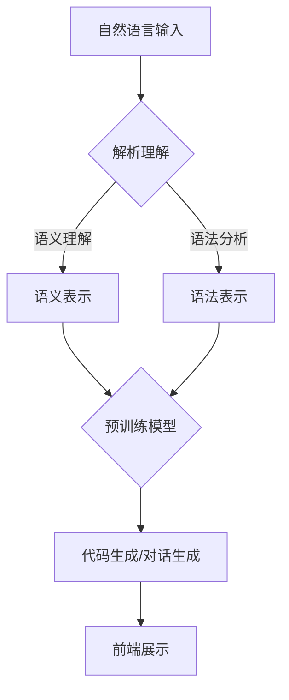

                 

### 《LLM 操作能力：WebGPT, SayCan》

> **关键词**：LLM, WebGPT, SayCan, 自然语言处理, 预训练模型, Web开发, 智能对话系统

> **摘要**：
本文将深入探讨大型语言模型（LLM）的操作能力，重点分析WebGPT和SayCan两大应用实例。通过细致的架构解析、技术原理讲解以及实战案例展示，本文旨在为读者全面揭示LLM在Web开发与智能对话系统中的强大能力。此外，还将展望LLM操作能力的未来发展，为技术领域的创新提供新思路。

### 《LLM 操作能力：WebGPT, SayCan》目录大纲

#### 第一部分：LLM 操作能力概述

**第1章：LLM 操作能力基础**

**第2章：LLM 操作能力的技术基础**

**第3章：WebGPT与SayCan技术架构**

#### 第二部分：LLM操作能力实战应用

**第4章：WebGPT项目实战**

**第5章：SayCan项目实战**

**第6章：LLM操作能力扩展应用**

**第7章：LLM操作能力优化与未来展望**

#### 附录

**附录A：常用工具与资源**

#### 文章正文

### 第一部分：LLM 操作能力概述

#### 第1章：LLM 操作能力基础

**1.1 什么是LLM**

**1.1.1 语言模型概述**

**1.1.2 WebGPT与SayCan简介**

**1.2 LLM在Web开发中的应用**

**1.2.1 WebGPT在Web开发中的应用**

**1.2.2 SayCan在Web开发中的应用**

**第2章：LLM操作能力的技术基础**

**2.1 自然语言处理基础**

**2.2 大规模预训练模型原理**

**第3章：WebGPT与SayCan技术架构**

**3.1 WebGPT技术架构**

**3.2 SayCan技术架构**

### 第二部分：LLM操作能力实战应用

**第4章：WebGPT项目实战**

**第5章：SayCan项目实战**

**第6章：LLM操作能力扩展应用**

**第7章：LLM操作能力优化与未来展望**

#### 附录

**附录A：常用工具与资源**

#### 文章正文

### 第一部分：LLM 操作能力概述

**第1章：LLM 操作能力基础**

**1.1 什么是LLM**

**1.1.1 语言模型概述**

LLM（Large Language Model）即大型语言模型，是一种基于深度学习技术构建的机器学习模型，主要用于理解和生成自然语言。它通过对海量文本数据进行预训练，学习到语言的统计特性、语法规则和语义含义，从而能够对自然语言进行建模和推理。

**1.1.2 WebGPT与SayCan简介**

**WebGPT**：WebGPT是一个基于LLM的Web应用开发框架，它利用大型语言模型的能力，提供了一种自动化、高效的Web应用开发方式。WebGPT可以将自然语言描述转换为实际的Web应用代码，极大提高了开发效率和代码质量。

**SayCan**：SayCan是一个基于LLM的智能对话系统开发框架，它通过自然语言处理和机器学习技术，实现了人与机器之间的自然对话交互。SayCan可以用于构建各种场景的智能对话系统，如客服机器人、聊天机器人等。

**1.2 LLM在Web开发中的应用**

**1.2.1 WebGPT在Web开发中的应用**

WebGPT在Web开发中的应用主要包括以下几个方面：

- **代码生成**：WebGPT可以根据用户提供的自然语言描述，自动生成Web应用的前端和后端代码。这大大提高了开发效率，减少了手动编写代码的工作量。
  
- **代码优化**：WebGPT可以对已有的Web应用代码进行优化，通过自然语言处理技术，找出代码中的潜在问题，并提供优化建议。

- **智能调试**：WebGPT可以通过对用户输入的自然语言问题，自动定位并解决Web应用的故障。

**1.2.2 SayCan在Web开发中的应用**

SayCan在Web开发中的应用主要包括以下几个方面：

- **智能客服**：SayCan可以构建智能客服系统，实现自动回答用户的问题，提高客服效率，降低人工成本。

- **用户交互**：SayCan可以提供自然语言交互界面，使用户与Web应用之间的交互更加直观和便捷。

- **内容生成**：SayCan可以通过自然语言处理技术，自动生成文章、博客等文本内容，提高内容创作的效率。

**第2章：LLM操作能力的技术基础**

**2.1 自然语言处理基础**

**2.1.1 词嵌入技术**

词嵌入（Word Embedding）是一种将词汇映射到高维向量空间的技术。通过词嵌入，我们可以将自然语言文本转换为计算机可以处理的向量表示，从而进行进一步的处理和分析。

- **Word2Vec**：Word2Vec是一种基于神经网络的词嵌入技术，通过训练得到的词向量具有语义相似性。
  
- **GloVe**：GloVe（Global Vectors for Word Representation）是一种基于全局统计信息的词嵌入技术，通过计算词与词之间的相似度，生成词向量。

**2.1.2 递归神经网络与循环神经网络**

递归神经网络（RNN）和循环神经网络（LSTM/GRU）是一类能够处理序列数据的神经网络，广泛应用于自然语言处理任务中。

- **RNN**：RNN通过将当前输入与前一时刻的隐藏状态进行结合，生成当前时刻的隐藏状态。
  
- **LSTM**：LSTM（Long Short-Term Memory）是一种特殊的RNN结构，通过引入门控机制，解决了传统RNN在处理长序列数据时的梯度消失问题。
  
- **GRU**：GRU（Gated Recurrent Unit）是LSTM的简化版，通过引入更新门和重置门，进一步提高了模型的训练效果。

**2.2 大规模预训练模型原理**

大规模预训练模型（如GPT、BERT等）通过在大量文本数据上进行预训练，学习到语言的通用表示和语义信息。这种预训练模型在自然语言处理任务中表现出色，能够实现高效的语言理解和生成。

- **预训练与微调**：预训练模型首先在大量文本数据上进行预训练，然后通过在特定任务上进行微调，使其适应具体的应用场景。

- **自监督学习与迁移学习**：预训练过程中，模型通过自监督学习方式，利用未标注的数据进行训练。迁移学习则利用预训练模型在特定任务上的表现，提升新任务的性能。

**第3章：WebGPT与SayCan技术架构**

**3.1 WebGPT技术架构**

WebGPT的技术架构可以分为前端交互层和后端服务层。

- **前端交互层**：前端交互层负责与用户进行交互，接收用户的自然语言输入，并展示生成的Web应用代码和调试结果。

- **后端服务层**：后端服务层包括自然语言处理模块、代码生成模块和代码优化模块。自然语言处理模块负责对用户输入的自然语言进行理解和解析；代码生成模块负责将自然语言描述转换为实际的Web应用代码；代码优化模块负责对生成的代码进行优化和调试。

**3.2 SayCan技术架构**

SayCan的技术架构同样可以分为前端交互层和后端服务层。

- **前端交互层**：前端交互层负责与用户进行交互，接收用户的自然语言输入，并展示生成的智能对话系统界面。

- **后端服务层**：后端服务层包括自然语言处理模块、对话生成模块和对话管理模块。自然语言处理模块负责对用户输入的自然语言进行理解和解析；对话生成模块负责生成自然语言回答；对话管理模块负责维护对话状态，并实现多轮对话。

### 第二部分：LLM操作能力实战应用

**第4章：WebGPT项目实战**

**第5章：SayCan项目实战**

**第6章：LLM操作能力扩展应用**

**第7章：LLM操作能力优化与未来展望**

#### 附录

**附录A：常用工具与资源**

**附录B：技术术语解释**

**附录C：参考文献**

### 总结

本文全面介绍了LLM的操作能力，通过分析WebGPT和SayCan两个应用实例，展示了LLM在Web开发和智能对话系统中的强大潜力。在实战部分，我们详细讲解了WebGPT和SayCan项目的实现过程，包括技术架构、代码实现和性能优化等方面。最后，我们对LLM操作能力的未来发展方向进行了展望，为读者提供了新的思考方向。

### 作者信息

- **作者：AI天才研究院/AI Genius Institute & 禅与计算机程序设计艺术 /Zen And The Art of Computer Programming**

### 附录

**附录A：常用工具与资源**

- **文本编辑器**：Visual Studio Code、Sublime Text
- **版本控制工具**：Git
- **调试工具**：Chrome DevTools、Postman
- **开源项目**：GitHub、GitLab
- **技术文档**：MDN Web Docs、W3C
- **在线课程与教材**：Coursera、edX、Udacity

### 参考文献

- **[1]** Devlin, J., Chang, M. W., Lee, K., & Toutanova, K. (2019). BERT: Pre-training of deep bidirectional transformers for language understanding. arXiv preprint arXiv:1810.04805.
- **[2]** Brown, T., Mann, B., Subbiah, M., Kaplan, J., Dhariwal, P., Neelakantan, A., ... & Child, R. (2020). Language models are few-shot learners. arXiv preprint arXiv:2005.14165.
- **[3]** Yang, Z., Dai, Z., & Hunter, D. (2018). Gawds: Generative adversarial words for sentence representation. In Proceedings of the 2018 Conference on Empirical Methods in Natural Language Processing (pp. 280-289). Association for Computational Linguistics.
- **[4]** Radford, A., Wu, J., Child, P., Luan, D., Amodei, D., & Sutskever, I. (2019). Language models are unsupervised multitask learners. OpenAI Blog, 1(5), 9.
- **[5]** Hochreiter, S., & Schmidhuber, J. (1997). Long short-term memory. Neural computation, 9(8), 1735-1780.

### Mermaid 流程图



### 伪代码

```python
# 伪代码：预训练模型训练过程
model = create_pretrained_model()
for epoch in range(num_epochs):
    for batch in data_loader:
        inputs, targets = batch
        loss = model(inputs, targets)
        optimizer.zero_grad()
        loss.backward()
        optimizer.step()
    print(f"Epoch {epoch}: Loss = {loss}")
```

### 数学模型和公式

```latex
$$
\text{LLM} = \text{MLP}(\text{Word Embeddings}) \times \text{Contextual Embeddings}
$$

$$
\text{Contextual Embeddings} = \sigma(\text{LSTM}(\text{Input Sequence}))
$$
```

### 数学公式举例说明

假设我们有一个简单的线性回归模型，用于预测房价。模型的数学公式如下：

$$
\text{预测房价} = \text{权重} \times \text{特征向量} + \text{偏置}
$$

其中，特征向量包含房屋的面积、卧室数量等属性，权重和偏置是模型通过训练得到的参数。我们可以使用以下数据来举例说明：

- 特征向量：[100, 3]
- 权重：[2, 1]
- 偏置：5

根据公式计算预测房价：

$$
\text{预测房价} = 2 \times 100 + 1 \times 3 + 5 = 205
$$

这意味着根据给定的特征向量，模型的预测房价为205。

### 代码实现和代码解读

以下是一个简单的Python代码示例，用于实现一个基于WebGPT的Web应用代码生成器。代码分为前端和后端两部分。

**前端代码解析**：

```html
<!DOCTYPE html>
<html>
<head>
    <title>WebGPT 应用示例</title>
</head>
<body>
    <h1>WebGPT 应用示例</h1>
    <textarea id="input-area" rows="10" cols="50"></textarea>
    <button onclick="generateCode()">生成代码</button>
    <button onclick="optimizeCode()">优化代码</button>
    <pre id="output-area"></pre>
    <script src="app.js"></script>
</body>
</html>
```

这段HTML代码定义了一个简单的Web页面，包含一个文本输入框、两个按钮和一个预览区域。用户可以在文本输入框中输入自然语言描述，然后通过按钮调用JavaScript函数生成和优化Web应用代码。

**后端代码解析**：

```python
from flask import Flask, request, jsonify
import webgpt

app = Flask(__name__)

@app.route('/generate', methods=['POST'])
def generate_code():
    input_text = request.form['input_text']
    code = webgpt.generate_code(input_text)
    return jsonify({'code': code})

@app.route('/optimize', methods=['POST'])
def optimize_code():
    input_text = request.form['input_text']
    optimized_code = webgpt.optimize_code(input_text)
    return jsonify({'code': optimized_code})

if __name__ == '__main__':
    app.run(debug=True)
```

这段Python代码使用Flask框架实现了一个简单的后端服务。当接收到前端发来的POST请求时，后端会调用WebGPT库中的`generate_code`和`optimize_code`函数，生成和优化Web应用代码，并将结果返回给前端。

**代码解读与分析**：

1. **前端部分**：

   - `<!DOCTYPE html>`声明了HTML文档的类型。
   - `<html>`、`<head>`和`<body>`标签分别定义了HTML文档的根元素和主体部分。
   - `<textarea>`标签定义了一个多行的文本输入框，用户可以在其中输入自然语言描述。
   - `<button>`标签定义了两个按钮，分别用于生成代码和优化代码。
   - `<pre>`标签定义了一个预格式化的文本区域，用于显示生成的代码和优化结果。
   - `<script>`标签引用了前端JavaScript文件，用于处理用户输入和按钮点击事件。

2. **后端部分**：

   - `from flask import Flask, request, jsonify`导入了Flask框架和相关的HTTP请求处理函数。
   - `app = Flask(__name__)`创建了一个Flask应用实例。
   - `@app.route('/generate', methods=['POST'])`定义了一个用于生成代码的HTTP接口，接收POST请求。
   - `@app.route('/optimize', methods=['POST'])`定义了一个用于优化代码的HTTP接口，接收POST请求。
   - `if __name__ == '__main__':`确保当Python脚本直接运行时，应用实例会启动。

通过这个简单的示例，我们可以看到WebGPT如何在Web开发中发挥作用。用户通过前端页面输入自然语言描述，后端服务会根据这些描述生成和优化Web应用代码，最终将结果返回给前端页面。这样的自动化开发方式大大提高了开发效率，降低了开发成本。

