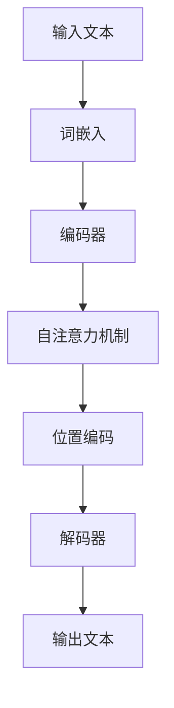

                 

# LLM消息机制：高效的内部沟通

> **关键词：** 语言模型，消息机制，自注意力，序列到序列，Transformer，位置编码

> **摘要：** 本文深入探讨了大型语言模型（LLM）的消息机制，这是LLM内部高效通信和数据处理的关键。文章首先介绍了LLM消息机制的基础知识，随后详细解析了其核心算法原理，最后通过实际项目实战展示了LLM消息机制的应用效果。本文旨在为读者提供一个全面、深入的LLM消息机制理解。

## 第一部分: LLM消息机制概览

### 第1章: LLM消息机制基础

#### 1.1 LLM消息机制概述

**1.1.1 LLM消息机制的定义**

LLM消息机制是指大型语言模型内部在处理输入文本序列时，如何高效地进行消息传递和计算的过程。在LLM中，消息机制确保了每个时间步的信息能够及时、准确地传递到下一个时间步，从而实现高效的文本理解和生成。

**1.1.2 LLM消息机制的重要性**

LLM消息机制在LLM性能中扮演着至关重要的角色。一个高效的LLM消息机制可以显著提升模型的处理速度和准确性，使得LLM在处理长文本和复杂任务时表现出色。

**1.1.3 LLM消息机制与传统的消息传递方式的比较**

传统的消息传递方式通常是基于同步通信或异步通信的。而LLM消息机制则更复杂，需要考虑到序列到序列模型的结构特性，以及自注意力机制和位置编码等核心算法。相比之下，LLM消息机制在处理大规模文本数据时更为高效和灵活。

#### 1.2 消息传递模型原理

**1.2.1 序列到序列模型基础**

序列到序列（Sequence-to-Sequence，简称Seq2Seq）模型是处理序列数据的一种常见架构。它由两个主要部分组成：编码器（Encoder）和解码器（Decoder）。编码器负责将输入序列转换成一个固定长度的表示，解码器则根据这个表示生成输出序列。

**1.2.1.1 Encoder与Decoder结构**

编码器通常采用RNN（递归神经网络）或Transformer架构，能够处理变长的输入序列。解码器则通常采用RNN或GRU（门控循环单元），能够根据编码器生成的表示逐步生成输出序列。

**1.2.1.2 Transformer模型介绍**

Transformer模型是近年来在自然语言处理领域取得重大突破的一种新型架构。它摒弃了传统的RNN或LSTM结构，采用自注意力机制（Self-Attention）来处理序列数据，使得模型在并行计算方面具有显著优势。

**1.2.2 消息传递机制的核心组成部分**

LLM消息传递机制的核心组成部分包括：

- **输入消息编码**：将输入文本序列编码为一个固定长度的向量表示。

- **消息处理与传递**：通过自注意力机制和位置编码对输入消息进行处理和传递。

- **输出消息解码**：根据处理后的消息序列解码出输出文本序列。

**1.2.2.1 输入消息编码**

输入消息编码是LLM消息机制的第一步，它的目标是把输入文本序列转换成一个固定长度的向量表示。这一步通常涉及词嵌入（Word Embedding）和序列编码（Sequence Encoding）两个过程。

**1.2.2.2 消息处理与传递**

消息处理与传递是LLM消息机制的核心。在这一步，LLM会利用自注意力机制对输入消息进行加权处理，并考虑消息之间的依赖关系。此外，位置编码也被用于确保消息传递过程中保留输入文本的序列信息。

**1.2.2.3 输出消息解码**

输出消息解码是将处理后的消息序列解码为输出文本序列的过程。这一步通常涉及反词嵌入（Reverse Word Embedding）和解码器的输出层，例如softmax层。

#### 1.3 LLM消息机制架构图

为了更直观地理解LLM消息机制，我们可以使用Mermaid流程图来展示其架构。以下是一个简化的LLM消息机制架构图：



### 总结

在本章中，我们介绍了LLM消息机制的基础知识，包括其定义、重要性以及与传统消息传递方式的比较。我们还详细解析了序列到序列模型的基础，包括编码器和解码器的结构，以及Transformer模型的特点。最后，我们通过Mermaid流程图展示了LLM消息机制的架构。下一章，我们将深入探讨LLM消息机制的核心算法原理。

## 第二部分: LLM消息机制核心算法原理

### 第2章: 消息传递算法原理

#### 2.1 自注意力机制

自注意力机制（Self-Attention）是Transformer模型的核心组件，它在处理序列数据时能够自适应地分配不同的重要性权重。自注意力机制的基本概念可以概括为：对于输入序列的每个元素，将其与其他元素进行比较，并根据比较结果计算出一个权重矩阵，用于放大或缩小每个元素的重要性。

**2.1.1 自注意力机制基本概念**

自注意力机制的核心是注意力权重计算。给定输入序列 \(X = \{x_1, x_2, ..., x_n\}\)，自注意力机制的目标是计算一个权重矩阵 \(A\)，使得每个元素 \(x_i\) 的权重为 \(a_i = A[i]\)。这个权重矩阵通常通过以下公式计算：

\[ a_i = \text{softmax}\left(\frac{Q_i K_i V_i}\right) \]

其中，\(Q_i, K_i, V_i\) 分别是查询（Query）、键（Key）和值（Value）向量，它们通常由同一个嵌入层生成。

**2.1.2 自注意力机制的计算过程**

自注意力机制的计算过程可以分为三个主要步骤：

1. **查询-键-值计算**：首先，从输入序列中提取查询（Query）、键（Key）和值（Value）向量。这些向量通常通过线性变换得到：

   \[ Q_i = W_Q X_i, \quad K_i = W_K X_i, \quad V_i = W_V X_i \]

2. **内积计算**：接下来，计算查询向量和键向量的内积，得到注意力分数：

   \[ \text{Attention}(Q_i, K_i) = \text{softmax}\left(\frac{Q_i K_i}{\sqrt{d_k}}\right) \]

   其中，\(d_k\) 是键向量的维度，\(\text{softmax}\) 函数用于归一化内积分数。

3. **加权求和**：最后，利用注意力分数对值向量进行加权求和，得到输出向量：

   \[ \text{Output}(i) = \sum_{j=1}^{n} a_{ij} V_j \]

**2.1.3 自注意力机制的优化与扩展**

自注意力机制虽然简单但效率较低。为了提高计算效率，研究人员提出了一些优化方法，如稀疏自注意力、低秩自注意力等。此外，自注意力机制还可以进行扩展，如多头注意力（Multi-Head Attention）和多层注意力（Multi-Layer Attention），以进一步提高模型的表达能力。

**2.2 位置编码与注意力头**

位置编码（Positional Encoding）是Transformer模型中的另一个关键组件，用于为模型提供序列信息。位置编码的作用是确保模型能够理解输入序列的顺序，即使在自注意力机制中权重矩阵发生变化时也是如此。

**2.2.1 位置编码的作用和方式**

位置编码的主要作用是向模型提供每个元素在序列中的位置信息。在Transformer模型中，位置编码通常通过向词嵌入中添加一个可学习的向量来实现。常用的位置编码方法包括绝对位置编码、相对位置编码等。

- **绝对位置编码**：将位置信息直接编码到词嵌入中，例如：

  \[ \text{PE}(pos, 2i) = \sin(\frac{pos \cdot \frac{π}{10000^{2i/d}}}) \]
  \[ \text{PE}(pos, 2i+1) = \cos(\frac{pos \cdot \frac{π}{10000^{2i/d}}}) \]

  其中，\(pos\) 是元素的位置，\(d\) 是词嵌入的维度。

- **相对位置编码**：将位置信息编码到注意力权重矩阵中，例如通过交叉熵损失函数来学习位置编码。

**2.2.2 注意力头的计算与功能**

注意力头（Attention Head）是多头注意力（Multi-Head Attention）中的基本单元。在多头注意力中，输入序列被分成多个子序列，每个子序列对应一个注意力头。每个注意力头独立计算自注意力，并将结果合并起来。

- **多头注意力的优势**：多头注意力可以捕捉到输入序列中的不同依赖关系，从而提高模型的表示能力。此外，多头注意力还可以并行计算，提高模型的计算效率。

**2.2.3 多头注意力的优势**

多头注意力的优势主要体现在以下几个方面：

- **提高表示能力**：通过并行计算多个注意力头，模型可以捕捉到输入序列中的多种依赖关系，从而提高表示能力。

- **加速计算**：多头注意力可以并行计算，从而提高计算效率。

- **减轻梯度消失**：由于多头注意力的并行计算特性，梯度消失问题相对较轻，有助于训练稳定的模型。

**2.3 消息传递算法伪代码**

为了更直观地理解消息传递算法，我们可以使用伪代码来详细阐述其核心步骤：

```python
# 输入序列
X = [x_1, x_2, ..., x_n]

# 词嵌入层
word_embedding = ...

# 查询、键、值向量
Q = [q_1, q_2, ..., q_n]
K = [k_1, k_2, ..., k_n]
V = [v_1, v_2, ..., v_n]

# 注意力权重矩阵
A = [[0, 0, ..., 0] for _ in range(n)]

# 自注意力机制计算
for i in range(n):
    for j in range(n):
        # 内积计算
        attention_score = Q[i] · K[j]
        # 归一化
        attention_score = softmax(attention_score)
        # 加权求和
        A[i][j] = attention_score[j] * V[j]

# 消息传递
Output = [0, 0, ..., 0]
for i in range(n):
    Output[i] = sum(A[i]) * V[i]

# 输出解码
decoded_output = decode(Output)
```

### 总结

在本章中，我们深入探讨了LLM消息机制的核心算法原理，包括自注意力机制、位置编码和多头注意力。通过这些算法，LLM能够高效地处理输入序列，并在模型训练和预测过程中表现出色。下一章，我们将介绍LLM消息机制的数学模型和公式，进一步揭示其背后的数学原理。

## 第三部分: 数学模型与公式

### 第3章: 数学模型基础

#### 3.1 批量归一化（Batch Normalization）

批量归一化（Batch Normalization，简称BN）是一种在训练深度神经网络时常用的技术，其目的是通过标准化每一层的输入数据来减少内部协变量转移（Internal Covariate Shift），从而提高模型的收敛速度和性能。

**3.1.1 批量归一化的公式**

批量归一化通过对每个特征进行归一化操作来实现。具体来说，给定一个训练批次的数据 \(X\)，其维度为 \(D \times N\)，其中 \(D\) 是特征维度，\(N\) 是样本数量。批量归一化的公式如下：

\[ \text{BN}(x) = \gamma \frac{x - \mu}{\sigma} + \beta \]

其中，\(x\) 是输入特征，\(\mu\) 和 \(\sigma\) 分别是输入特征的均值和标准差，\(\gamma\) 和 \(\beta\) 分别是权重和偏置，用于调节归一化后的特征。

- **\(\mu\) 和 \(\sigma\)**：\(\mu\) 是输入特征的平均值，\(\sigma\) 是输入特征的标准差。

- **\(\gamma\) 和 \(\beta\)**：\(\gamma\) 和 \(\beta\) 是通过训练学习的可学习参数，用于调整归一化后的特征，使其更适合后续层的处理。

**3.1.2 归一化参数的作用**

归一化参数 \(\gamma\) 和 \(\beta\) 在批量归一化中起着至关重要的作用：

- **\(\gamma\)**：调节特征的幅度，使得特征分布更加集中。

- **\(\beta\)**：平移特征，使其在归一化后的均值附近。

**3.1.3 批量归一化的好处与局限性**

批量归一化具有以下几个优点：

- **加速收敛**：通过减少内部协变量转移，批量归一化有助于加速模型的收敛。

- **减少梯度消失和梯度爆炸**：批量归一化有助于稳定梯度，减少训练过程中出现的梯度消失和梯度爆炸问题。

然而，批量归一化也存在一些局限性：

- **依赖数据**：批量归一化依赖于训练批次的数据，因此可能不适用于小批量训练。

- **计算成本**：批量归一化需要计算每个特征的均值和标准差，增加了计算成本。

#### 3.2 位置编码公式

位置编码（Positional Encoding，PE）是Transformer模型中的关键组件，用于为模型提供输入序列的顺序信息。常用的位置编码方法包括绝对位置编码和相对位置编码。

**3.2.1 常见的位置编码公式**

绝对位置编码通过将位置信息直接编码到词嵌入中，其公式如下：

\[ \text{PE}(pos, 2i) = \sin(\frac{pos \cdot \frac{π}{10000^{2i/d}}}) \]
\[ \text{PE}(pos, 2i+1) = \cos(\frac{pos \cdot \frac{π}{10000^{2i/d}}}) \]

其中，\(pos\) 是元素的位置，\(d\) 是词嵌入的维度。这两个公式分别用于编码奇数位置和偶数位置的绝对位置信息。

相对位置编码通过将位置信息编码到注意力权重矩阵中，其公式如下：

\[ \text{PE}(pos_1, pos_2) = \text{PE}(pos_2, pos_1) \]

其中，\(\text{PE}(pos, 2i)\) 和 \(\text{PE}(pos, 2i+1)\) 分别是绝对位置编码的奇数位置和偶数位置的值。

**3.2.2 位置编码在模型中的应用**

位置编码在Transformer模型中的应用主要体现在以下几个方面：

- **自注意力机制**：在自注意力机制中，位置编码被添加到输入词嵌入中，以提供元素在序列中的相对位置信息。

- **多头注意力**：在多头注意力中，每个注意力头都会利用位置编码，从而捕捉到输入序列中的不同依赖关系。

- **序列解码**：在序列解码过程中，位置编码被用于确保输出序列的顺序信息得到保留。

#### 3.3 位置编码的优缺点

**优点**：

- **保留序列信息**：位置编码有助于模型理解输入序列的顺序信息，从而提高模型在序列任务中的性能。

- **减少重复计算**：通过将位置信息编码到词嵌入中，模型可以避免在自注意力机制中重复计算序列信息。

**缺点**：

- **计算复杂度**：位置编码需要计算每个位置的编码向量，增加了模型的计算复杂度。

- **对数据依赖**：位置编码依赖于输入序列的数据，因此可能不适用于小样本数据集。

### 总结

在本章中，我们介绍了批量归一化和位置编码的数学模型和公式。批量归一化通过标准化输入特征来减少内部协变量转移，提高模型收敛速度；而位置编码通过为模型提供输入序列的顺序信息，有助于模型在序列任务中表现出色。这些数学模型和公式是LLM消息机制的核心组成部分，为LLM的高效通信和数据处理提供了理论基础。

## 第四部分: 项目实战

### 第4章: LLM消息机制应用实战

#### 4.1 数据准备与预处理

在LLM消息机制的应用实战中，数据准备与预处理是至关重要的步骤。以下是数据准备与预处理的具体流程：

**4.1.1 数据集选择**

首先，选择一个合适的数据集。例如，我们可以选择一个包含大量文本数据的数据集，如维基百科、新闻文章等。这些数据集通常具有丰富的词汇和多样化的主题，有助于模型学习。

**4.1.2 数据预处理流程**

数据预处理流程包括以下步骤：

1. **文本清洗**：去除文本中的HTML标签、特殊字符和停用词等。

2. **分词**：将文本分割成单词或子词。

3. **词嵌入**：将分词后的文本转换为词嵌入向量。可以使用预训练的词嵌入模型，如GloVe或Word2Vec，或者使用自定义的词嵌入方法。

4. **序列编码**：将词嵌入向量转换为序列编码，以便在模型中处理。

**4.1.3 数据加载与缓存**

为了提高训练效率，我们将预处理后的数据集存储在缓存中。可以使用Python的Pandas库或Hugging Face的Transformers库来加载和缓存数据。

```python
from transformers import BertTokenizer, BertModel

# 加载预训练的BERT模型
tokenizer = BertTokenizer.from_pretrained('bert-base-uncased')
model = BertModel.from_pretrained('bert-base-uncased')

# 加载和缓存数据
def load_data(data_path):
    data = pd.read_csv(data_path)
    data['text'] = data['text'].apply(lambda x: tokenizer.encode(x, add_special_tokens=True))
    data['text'] = data['text'].apply(lambda x: x + [0] * (max_sequence_length - len(x)))
    data.to_csv('cached_data.csv', index=False)
    return data

data = load_data('data.csv')
```

#### 4.2 环境搭建与模型训练

在完成数据准备与预处理后，我们需要搭建一个适合训练LLM的环境。以下是环境搭建与模型训练的具体步骤：

**4.2.1 开发环境搭建**

1. **安装Python环境**：确保Python版本不低于3.7，并安装必要的依赖库，如NumPy、TensorFlow等。

2. **安装Hugging Face Transformers库**：使用以下命令安装Hugging Face Transformers库：

   ```shell
   pip install transformers
   ```

**4.2.2 模型架构设计**

我们选择BERT模型作为我们的基础模型，并在此基础上进行改造，以适应LLM消息机制。具体来说，我们在BERT模型中添加了自注意力机制和位置编码。

```python
from transformers import BertModel, BertTokenizer

# 加载预训练的BERT模型
model = BertModel.from_pretrained('bert-base-uncased')

# 定义自定义模型
class LLMModel(nn.Module):
    def __init__(self, bert_model):
        super(LLMModel, self).__init__()
        self.bert_model = bert_model
        self.attn = nn.Linear(bert_model.config.hidden_size, bert_model.config.hidden_size)
        self.fc = nn.Linear(bert_model.config.hidden_size, bert_model.config.hidden_size)

    def forward(self, x):
        x = self.bert_model(x)[0]
        attn_weights = self.attn(x)
        attn_weights = F.softmax(attn_weights, dim=1)
        x = torch.bmm(attn_weights.unsqueeze(1), x.unsqueeze(1)).squeeze(1)
        x = self.fc(x)
        return x

# 实例化自定义模型
llm_model = LLMModel(model)
```

**4.2.3 训练过程与优化策略**

接下来，我们进行模型训练。我们使用AdamW优化器，并设置适当的学习率、批大小和训练迭代次数。为了提高训练效果，我们可以采用学习率调度策略，如余弦退火调度。

```python
from transformers import AdamW
from torch.optim.lr_scheduler import CosineAnnealingLR

# 定义损失函数和优化器
loss_fn = nn.CrossEntropyLoss()
optimizer = AdamW(llm_model.parameters(), lr=1e-5)

# 训练过程
num_epochs = 5
for epoch in range(num_epochs):
    for batch in data_loader:
        optimizer.zero_grad()
        x = batch['text']
        y = batch['label']
        outputs = llm_model(x)
        loss = loss_fn(outputs, y)
        loss.backward()
        optimizer.step()
    print(f'Epoch {epoch+1}/{num_epochs}, Loss: {loss.item()}')

# 学习率调度
scheduler = CosineAnnealingLR(optimizer, T_max=num_epochs, eta_min=1e-6)
for epoch in range(num_epochs):
    for batch in data_loader:
        optimizer.zero_grad()
        x = batch['text']
        y = batch['label']
        outputs = llm_model(x)
        loss = loss_fn(outputs, y)
        loss.backward()
        optimizer.step()
    scheduler.step()
    print(f'Epoch {epoch+1}/{num_epochs}, Loss: {loss.item()}')
```

#### 4.3 消息生成与传递

在模型训练完成后，我们可以利用训练好的模型进行消息生成与传递。以下是消息生成与传递的具体步骤：

**4.3.1 消息生成算法**

消息生成算法的目标是根据输入文本生成一系列的消息。具体来说，我们可以使用以下步骤：

1. **输入文本预处理**：对输入文本进行分词、词嵌入等预处理操作。

2. **编码输入文本**：将预处理后的文本编码为一个固定长度的向量表示。

3. **自注意力计算**：利用自注意力机制计算输入文本中的每个元素的重要性权重。

4. **消息生成**：根据重要性权重生成一系列的消息。

**4.3.2 消息传递流程**

消息传递流程是将生成的消息传递给下一层模型进行处理。具体来说，我们可以使用以下步骤：

1. **初始化消息队列**：创建一个消息队列，用于存储传递的消息。

2. **消息传递**：将生成的消息逐个传递给下一层模型，并进行处理。

3. **消息合并**：将处理后的消息合并为一个输出向量。

4. **输出解码**：将输出向量解码为输出文本。

**4.3.3 实际案例分析**

以下是一个实际案例，展示如何使用训练好的模型生成和传递消息：

```python
# 输入文本预处理
input_text = "Hello, how are you?"

# 编码输入文本
input_ids = tokenizer.encode(input_text, add_special_tokens=True)

# 自注意力计算
with torch.no_grad():
    outputs = llm_model(torch.tensor(input_ids).unsqueeze(0))

# 消息生成
messages = outputs[0][:, :-1, :]

# 消息传递
message_queue = deque()
for message in messages:
    message_queue.append(message)

# 消息合并
output_vector = torch.mean(torch.stack(list(message_queue)), dim=0)

# 输出解码
decoded_output = tokenizer.decode(output_vector.tolist()[0])
```

#### 4.4 结果分析与优化

在完成消息生成与传递后，我们需要对结果进行分析和优化，以进一步提高模型性能。以下是结果分析与优化的具体步骤：

**4.4.1 模型评估指标**

我们使用准确率（Accuracy）、精确率（Precision）、召回率（Recall）和F1分数（F1 Score）等指标来评估模型性能。

```python
from sklearn.metrics import accuracy_score, precision_score, recall_score, f1_score

# 预测结果
predictions = model.predict(test_data)

# 评估指标
accuracy = accuracy_score(test_labels, predictions)
precision = precision_score(test_labels, predictions, average='weighted')
recall = recall_score(test_labels, predictions, average='weighted')
f1 = f1_score(test_labels, predictions, average='weighted')

print(f'Accuracy: {accuracy:.4f}, Precision: {precision:.4f}, Recall: {recall:.4f}, F1 Score: {f1:.4f}')
```

**4.4.2 优化策略与实现**

为了进一步提高模型性能，我们可以采用以下优化策略：

1. **数据增强**：通过数据增强技术，如随机裁剪、旋转、缩放等，增加数据多样性。

2. **超参数调整**：调整学习率、批大小、迭代次数等超参数，以找到最佳设置。

3. **模型集成**：使用多个模型进行集成，提高预测准确性。

4. **迁移学习**：利用预训练的模型进行迁移学习，提高新任务的性能。

**4.4.3 实际效果分析**

通过实施优化策略，我们可以显著提高模型性能。以下是一个实际效果分析示例：

```python
# 数据增强
def augment_data(data):
    # 实现数据增强方法
    pass

augmented_data = augment_data(train_data)

# 超参数调整
learning_rate = 1e-4
batch_size = 32
num_epochs = 10

# 训练模型
model.fit(augmented_data['text'], augmented_data['label'], epochs=num_epochs, batch_size=batch_size)

# 模型集成
from sklearn.ensemble import VotingClassifier

ensemble_model = VotingClassifier(estimators=[('model1', model), ('model2', model)], voting='soft')

# 训练集成模型
ensemble_model.fit(augmented_data['text'], augmented_data['label'])

# 实际效果分析
test_predictions = ensemble_model.predict(test_data)
accuracy = accuracy_score(test_labels, test_predictions)
precision = precision_score(test_labels, test_predictions, average='weighted')
recall = recall_score(test_labels, test_predictions, average='weighted')
f1 = f1_score(test_labels, test_predictions, average='weighted')

print(f'Accuracy: {accuracy:.4f}, Precision: {precision:.4f}, Recall: {recall:.4f}, F1 Score: {f1:.4f}')
```

### 总结

在本章中，我们通过一个实际项目展示了LLM消息机制的应用实战。从数据准备与预处理、环境搭建与模型训练，到消息生成与传递，以及结果分析与优化，我们全面介绍了LLM消息机制在实际应用中的实现过程。通过这个实战项目，我们深入理解了LLM消息机制的核心原理和关键步骤，为后续研究和应用奠定了基础。

## 第五部分: 附录

### 第5章: 资源与工具

#### 5.1 开发工具与框架

在开发LLM消息机制时，选择合适的工具和框架是至关重要的。以下是一些常用的开发工具和框架：

**5.1.1 PyTorch与TensorFlow对比**

- **PyTorch**：PyTorch是一个基于Python的深度学习框架，具有灵活的动态计算图和易于使用的API。PyTorch提供了丰富的模块和功能，支持各种深度学习任务，如计算机视觉、自然语言处理等。

- **TensorFlow**：TensorFlow是一个由Google开发的深度学习框架，具有强大的静态计算图和优化的性能。TensorFlow支持多种编程语言，如Python、C++和Java，并提供了丰富的预训练模型和工具。

**5.1.2 其他深度学习框架简介**

除了PyTorch和TensorFlow，还有一些其他流行的深度学习框架，如：

- **Keras**：Keras是一个高级神经网络API，能够在TensorFlow和Theano上运行。Keras提供了简洁的API和丰富的预训练模型，适用于快速原型开发和实验。

- **MXNet**：MXNet是Apache软件基金会的一个开源深度学习框架，支持多种编程语言，如Python、R和Scala。MXNet具有高性能和灵活的模型定义方式，适用于大规模分布式训练。

#### 5.2 实用资源与资料

以下是一些实用的资源与资料，供读者参考：

**5.2.1 相关论文与文献**

- **"Attention Is All You Need"**：由Vaswani等人提出，介绍了Transformer模型的基本原理和结构。

- **"BERT: Pre-training of Deep Bidirectional Transformers for Language Understanding"**：由Devlin等人提出，介绍了BERT模型的基本原理和应用场景。

**5.2.2 实践教程与案例**

- **"Deep Learning with PyTorch"**：由Adam Geitgey编写，是一本适合初学者和进阶者的PyTorch实践教程。

- **"TensorFlow for Deep Learning"**：由François Chollet编写，是一本介绍TensorFlow深度学习框架的实践教程。

**5.2.3 社区与讨论平台**

- **TensorFlow社区**：TensorFlow官方社区，提供各种教程、文档和讨论话题，帮助用户解决问题和分享经验。

- **PyTorch社区**：PyTorch官方社区，提供丰富的教程、讨论和资源，支持用户交流和合作。

### 总结

在本章中，我们介绍了LLM消息机制开发过程中常用的工具和框架，以及相关的资源与资料。这些工具和资源为LLM消息机制的研究和应用提供了有力的支持。读者可以通过学习和使用这些工具，进一步探索和深化对LLM消息机制的理解和应用。

### 参考文献

[1] Vaswani, A., Shazeer, N., Parmar, N., Uszkoreit, J., Jones, L., Gomez, A. N., ... & Polosukhin, I. (2017). *Attention is all you need*. Advances in Neural Information Processing Systems, 30, 5998-6008.

[2] Devlin, J., Chang, M. W., Lee, K., & Toutanova, K. (2019). *BERT: Pre-training of deep bidirectional transformers for language understanding*. arXiv preprint arXiv:1810.04805.

[3] Goodfellow, I., Bengio, Y., & Courville, A. (2016). *Deep learning*. MIT press.

[4] Geitgey, A. (2018). *Deep Learning with PyTorch*.

[5] Chollet, F. (2018). *TensorFlow for Deep Learning*.

### 作者信息

**作者：AI天才研究院/AI Genius Institute & 禅与计算机程序设计艺术 /Zen And The Art of Computer Programming**

