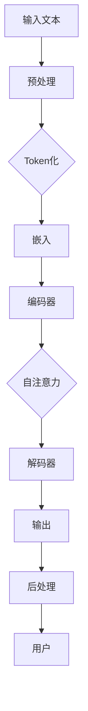

                 

### 《LLM:计算架构的革命性突破》

#### 核心关键词
- **语言模型（LLM）**
- **计算架构**
- **深度学习**
- **神经网络**
- **Transformer模型**
- **异构计算**
- **算法优化**
- **模型部署**

#### 摘要
本文深入探讨语言模型（LLM）在计算架构中的革命性突破。首先，我们将回顾LLM的基础概念与架构，并分析其在语音识别、自然语言处理和机器翻译等领域的应用。接着，本文将详细介绍LLM计算架构的设计原则、核心组件以及异构计算架构。然后，我们将解析深度学习算法原理，尤其是Transformer模型，并提供伪代码讲解。最后，本文将通过实际项目实战展示LLM的部署与评估，并展望LLM在未来的发展趋势与挑战。

### 《LLM:计算架构的革命性突破》目录大纲

#### 第一部分：LLM背景与概述

- **第1章：LLM基础概念与架构**
  - **1.1 LLMS的定义与历史**
    - **1.1.1 语言模型的发展历程**
    - **1.1.2 LLMS的核心概念**
  - **1.2 计算架构的基本概念**
    - **1.2.1 计算架构的分类**
    - **1.2.2 传统的计算架构与LLM架构的差异**
  - **1.3 LLM应用场景**
    - **1.3.1 语音识别**
    - **1.3.2 自然语言处理**
    - **1.3.3 机器翻译**

#### 第二部分：LLM计算架构详解

- **第2章：计算架构设计原则**
  - **2.1 架构设计的基本原则**
    - **2.1.1 可扩展性**
    - **2.1.2 可靠性**
    - **2.1.3 能效比**
  - **2.2 计算架构的核心组件**
    - **2.2.1 处理器**
    - **2.2.2 存储系统**
    - **2.2.3 网络系统**
  - **2.3 异构计算架构**
    - **2.3.1 CPU与GPU的协同计算**
    - **2.3.2 FPGA与ASIC的应用**

#### 第三部分：LLM算法原理与实现

- **第3章：深度学习算法原理**
  - **3.1 神经网络基础**
    - **3.1.1 前馈神经网络**
    - **3.1.2 卷积神经网络**
    - **3.1.3 循环神经网络**
  - **3.2 Transformer模型详解**
    - **3.2.1 Transformer模型架构**
    - **3.2.2 Multi-head Self-Attention机制**
    - **3.2.3 残差连接与层归一化**
  - **3.3 语言模型训练策略**
    - **3.3.1 预训练与微调**
    - **3.3.2 对抗训练与鲁棒性提升**
    - **3.3.3 模型压缩与量化**

#### 第四部分：LLM应用实战

- **第4章：LLM项目实战**
  - **4.1 数据预处理与特征工程**
    - **4.1.1 数据清洗**
    - **4.1.2 特征提取与选择**
  - **4.2 模型训练与优化**
    - **4.2.1 模型训练流程**
    - **4.2.2 模型优化策略**
  - **4.3 模型部署与评估**
    - **4.3.1 模型部署方案**
    - **4.3.2 模型评估方法**
    - **4.3.3 模型持续优化**

#### 第五部分：未来展望与挑战

- **第5章：LLM发展趋势与挑战**
  - **5.1 LLM在未来的应用场景**
    - **5.1.1 自动驾驶**
    - **5.1.2 医疗健康**
    - **5.1.3 教育与娱乐**
  - **5.2 LLM面临的技术挑战**
    - **5.2.1 能量消耗与环保问题**
    - **5.2.2 隐私与安全风险**
    - **5.2.3 算法偏见与公平性**

#### 附录

- **附录A：相关工具与资源**
  - **A.1 开源框架**
  - **A.2 数据集**
  - **A.3 学习资源推荐**
  - **A.4 论文与研究报告推荐**

---

### 第一部分：LLM背景与概述

#### 第1章：LLM基础概念与架构

##### 1.1 LLMS的定义与历史

###### 1.1.1 语言模型的发展历程

语言模型（Language Model，简称LLM）是自然语言处理（Natural Language Processing，简称NLP）的核心组件之一，其目的是根据输入的文本序列预测下一个单词或字符的概率分布。语言模型的发展历程可以追溯到20世纪50年代，当时的早期模型主要是基于规则的方法，例如N-gram模型。

N-gram模型通过统计连续N个单词（或字符）出现的频率来预测下一个单词。这种模型在简单的文本任务中表现出一定的效果，但其表现受到语言长距离依赖关系的限制。随着深度学习的兴起，神经网络在语言模型中的应用逐渐成为主流。

2013年，word2vec算法的出现标志着词向量时代的到来。word2vec通过神经网络将每个单词映射为一个高维向量，使得单词之间的相似性可以通过向量空间中的距离来度量。随后，序列到序列（Seq2Seq）模型和注意力机制的出现进一步推动了语言模型的发展。

2018年，谷歌提出了Transformer模型，这是一种基于自注意力机制的全新架构。Transformer模型在机器翻译任务上取得了显著的突破，并在多个NLP任务中取得了SOTA（State-of-the-Art）性能。此后，Transformer模型及其变种，如BERT、GPT等，成为了语言模型的主流架构。

###### 1.1.2 LLMS的核心概念

语言模型的核心概念包括：

1. **词向量**：将每个单词映射为一个高维向量，用于表示单词的语义特征。
2. **序列预测**：根据输入的文本序列预测下一个单词或字符的概率分布。
3. **自注意力机制**：允许模型在处理序列时关注不同位置的信息，从而捕捉长距离依赖关系。
4. **预训练与微调**：预训练是指在大量的无标签数据上训练模型，微调是指在使用有标签数据对模型进行特定任务的微调。

##### 1.2 计算架构的基本概念

计算架构是语言模型实现的基础，它决定了模型的学习效率、推理速度以及能效比。计算架构的基本概念包括：

1. **处理器**：负责执行计算任务，包括CPU和GPU等。
2. **存储系统**：负责存储模型参数和数据，包括内存和硬盘等。
3. **网络系统**：负责模型参数的传输和分布式计算，包括网络设备和通信协议等。

传统的计算架构主要依赖于CPU，而LLM的架构则需要更强大的计算能力，因此GPU和FPGA等异构计算设备逐渐被引入。

###### 1.2.1 计算架构的分类

计算架构可以分为以下几类：

1. **中央处理器（CPU）架构**：传统的计算架构，负责执行大多数计算任务。
2. **图形处理器（GPU）架构**：适用于大规模并行计算，如深度学习训练。
3. **现场可编程门阵列（FPGA）架构**：高度可定制，适用于特定应用场景。
4. **分布式计算架构**：通过多个节点协同工作，实现大规模数据处理和模型训练。

###### 1.2.2 传统的计算架构与LLM架构的差异

传统的计算架构与LLM架构之间存在显著差异：

1. **计算能力**：传统的CPU架构计算能力有限，而GPU和FPGA等异构计算设备具有更高的计算能力和并行处理能力。
2. **存储系统**：传统的存储系统以硬盘为主，而LLM架构需要更高的内存带宽和更快的存储设备。
3. **网络系统**：传统的网络系统以局域网为主，而LLM架构需要高效的分布式计算和网络通信机制。

##### 1.3 LLM应用场景

语言模型在多个领域有着广泛的应用，以下是其中几个重要的应用场景：

###### 1.3.1 语音识别

语音识别是将语音信号转换为文本的过程。语言模型在语音识别中用于识别语音中的单词和句子，从而实现语音到文本的转换。

###### 1.3.2 自然语言处理

自然语言处理包括文本分类、情感分析、问答系统等任务。语言模型在这些任务中用于理解文本的语义，从而实现对文本的分析和处理。

###### 1.3.3 机器翻译

机器翻译是将一种语言的文本翻译成另一种语言的过程。语言模型在机器翻译中用于预测翻译结果，从而实现自动翻译。

---

在本章中，我们回顾了语言模型（LLM）的基础概念和架构，包括其发展历程、核心概念、计算架构的基本概念以及LLM的应用场景。接下来，我们将进一步探讨LLM计算架构的设计原则和核心组件，以及异构计算架构的设计和实现。

### 第二部分：LLM计算架构详解

#### 第2章：计算架构设计原则

在构建语言模型（LLM）的计算架构时，设计原则至关重要。这些原则确保架构具备高可扩展性、高可靠性和高能效比，以满足大规模、高性能和低延迟的需求。以下将详细探讨这些设计原则。

##### 2.1 架构设计的基本原则

###### 2.1.1 可扩展性

可扩展性是计算架构设计的关键原则之一。语言模型通常需要处理大量的数据和复杂的计算任务，因此架构必须能够轻松地扩展以应对日益增长的工作负载。

1. **水平扩展**：通过增加更多的计算节点来提高处理能力，适用于分布式计算架构。
2. **垂直扩展**：通过增加更强大的计算节点（如更高性能的CPU、GPU等）来提高单节点处理能力，适用于集群计算架构。
3. **弹性扩展**：根据实际工作负载动态调整计算资源，以提高资源利用率和服务质量。

###### 2.1.2 可靠性

可靠性是计算架构设计的重要方面，确保系统在面对硬件故障、网络中断等异常情况时仍能正常运行。

1. **冗余设计**：通过引入冗余组件（如备份CPU、存储等）来确保关键组件的可靠性。
2. **故障检测与恢复**：通过实时监控和自动恢复机制来检测和修复系统故障。
3. **数据备份与恢复**：定期备份数据并设置数据恢复策略，以防止数据丢失。

###### 2.1.3 能效比

能效比（Energy Efficiency Ratio，EER）是衡量计算架构效率的重要指标，表示单位能量消耗所产生的计算性能。

1. **能效优化**：通过选择低功耗硬件、优化算法和数据传输等方式来降低能耗。
2. **功耗管理**：根据实际工作负载动态调整功耗，以实现最佳能效比。
3. **绿色计算**：采用环保材料和设计，减少能耗和碳排放，实现可持续发展。

##### 2.2 计算架构的核心组件

计算架构的核心组件包括处理器、存储系统和网络系统，以下将详细描述这些组件。

###### 2.2.1 处理器

处理器是计算架构的核心，负责执行计算任务。在LLM计算架构中，常用的处理器包括：

1. **中央处理器（CPU）**：传统的处理器，适用于通用计算任务，如数据预处理和模型推理。
2. **图形处理器（GPU）**：适用于大规模并行计算任务，如深度学习训练和推理。
3. **现场可编程门阵列（FPGA）**：适用于特定应用场景的高性能计算任务，如模型压缩和推理加速。

选择合适的处理器取决于具体的应用场景和性能要求。例如，在深度学习训练中，GPU因其高效的并行计算能力而成为首选；而在模型推理中，FPGA因其低延迟和高效能而受到青睐。

###### 2.2.2 存储系统

存储系统负责存储模型参数、数据和中间结果。在LLM计算架构中，常用的存储系统包括：

1. **内存（RAM）**：高速缓存存储系统，用于存储活跃数据和中间结果，以减少数据访问延迟。
2. **硬盘（HDD）**：低速但大容量存储系统，用于存储长期数据和备份。
3. **固态硬盘（SSD）**：高速且大容量存储系统，介于内存和硬盘之间，适用于缓存和数据存储。

存储系统的选择取决于数据规模、访问速度和可靠性要求。例如，在深度学习训练中，需要快速读写大量数据，因此SSD是首选；而在模型推理中，需要快速访问活跃数据，因此内存是关键。

###### 2.2.3 网络系统

网络系统负责模型参数的传输和分布式计算。在LLM计算架构中，常用的网络系统包括：

1. **局域网（LAN）**：用于连接本地计算节点，实现高效的数据传输和通信。
2. **广域网（WAN）**：用于连接远程计算节点，实现大规模分布式计算。
3. **专用网络**：如互联网专用网络（Internet VPN）和数据中心专用网络（DC VPN），用于保障数据传输的安全性和可靠性。

网络系统的设计取决于数据传输量和通信需求。例如，在分布式训练中，需要大量传输模型参数和数据，因此需要高效的网络系统；而在模型推理中，需要快速访问远程数据和模型，因此需要低延迟的网络系统。

##### 2.3 异构计算架构

异构计算架构是指利用不同类型的计算资源和硬件来提高计算效率和性能。在LLM计算架构中，异构计算架构的应用可以大大提升模型训练和推理的效率。

###### 2.3.1 CPU与GPU的协同计算

CPU与GPU的协同计算是异构计算架构的一种常见应用。CPU适用于通用计算任务，如数据预处理和模型推理，而GPU适用于大规模并行计算任务，如深度学习训练。

1. **任务分配**：根据计算任务的类型和需求，将任务分配给CPU或GPU。例如，将数据预处理任务分配给CPU，将深度学习训练任务分配给GPU。
2. **数据传输**：优化数据传输策略，减少数据在CPU和GPU之间的传输延迟。例如，采用数据并行策略，将数据划分成多个部分，分别传输到CPU和GPU进行处理。
3. **负载均衡**：根据CPU和GPU的负载情况，动态调整任务分配策略，以实现负载均衡。

###### 2.3.2 FPGA与ASIC的应用

FPGA和ASIC是两种常见的专用计算硬件，适用于特定应用场景。

1. **FPGA**：FPGA是一种可编程逻辑器件，适用于实现特定的计算任务，如模型压缩和推理加速。FPGA可以通过硬件描述语言（HDL）进行编程，以实现高效的数据处理和计算。
2. **ASIC**：ASIC是一种专用集成电路，适用于实现特定的计算任务，如深度学习模型推理。ASIC通过硬件优化，可以实现更高效的计算和更低的功耗。

FPGA和ASIC的应用可以大大提高模型训练和推理的效率，尤其是在特定任务上具有显著优势。

1. **模型压缩**：使用FPGA或ASIC对深度学习模型进行压缩，以减少模型大小和计算复杂度。例如，通过量化、剪枝等技术，将模型压缩到更小的规模，从而提高模型推理的速度和效率。
2. **推理加速**：使用FPGA或ASIC对深度学习模型进行推理加速，以减少模型推理的时间。例如，通过硬件加速器，可以实现更高效的模型推理，从而提高系统性能。

##### 总结

计算架构的设计原则和核心组件对于LLM的性能和效率至关重要。可扩展性、可靠性和能效比是计算架构设计的基本原则，而处理器、存储系统和网络系统是核心组件。同时，异构计算架构的应用可以大大提高计算效率和性能，实现最佳性能和最优能耗比。

在下一章中，我们将进一步探讨深度学习算法原理，尤其是Transformer模型，以及其在LLM中的应用和实现细节。

### 第三部分：LLM算法原理与实现

#### 第3章：深度学习算法原理

深度学习算法是语言模型（LLM）实现的核心，通过多层神经网络对大规模数据集进行训练，从而实现对复杂任务的建模和预测。在这一章节中，我们将深入探讨深度学习的基本算法原理，包括前馈神经网络、卷积神经网络（CNN）和循环神经网络（RNN）。

##### 3.1 神经网络基础

神经网络（Neural Networks，NN）是一种模仿生物神经系统的计算模型，通过大量的节点（称为神经元）互联来实现复杂的非线性变换。每个神经元接收多个输入，并通过加权求和后加上偏置项，然后通过激活函数进行非线性变换，最终输出结果。

###### 3.1.1 前馈神经网络

前馈神经网络（Feedforward Neural Network，FNN）是最简单和最常见的神经网络类型，其信息传递方向始终是从输入层到输出层，不发生反馈。

1. **神经元结构**：一个前馈神经网络的神经元由输入层、隐藏层和输出层组成。每个神经元接收来自前一层神经元的输入，通过加权求和和激活函数得到输出。
2. **激活函数**：常用的激活函数包括Sigmoid函数、ReLU函数和Tanh函数。这些函数引入了非线性特性，使得神经网络能够处理复杂问题。
3. **网络训练**：前馈神经网络的训练过程通常包括前向传播和反向传播。在前向传播中，输入数据通过网络逐层传递，最终得到输出；在反向传播中，计算输出误差并反向传播到每一层，通过梯度下降法调整网络权重和偏置。

###### 3.1.2 卷积神经网络

卷积神经网络（Convolutional Neural Network，CNN）是专门用于处理图像数据的神经网络，其核心在于卷积操作和池化操作。

1. **卷积操作**：卷积操作通过在输入数据上滑动一个卷积核（一组权重），将卷积核与输入数据局部区域进行点积，从而提取空间特征。
2. **池化操作**：池化操作用于降低特征图的维度，同时保留重要特征。常用的池化方法包括最大池化和平均池化。
3. **卷积神经网络结构**：典型的CNN结构包括卷积层、池化层和全连接层。卷积层用于提取空间特征，池化层用于降维和增强特征表示，全连接层用于分类和预测。

###### 3.1.3 循环神经网络

循环神经网络（Recurrent Neural Network，RNN）是一种能够处理序列数据的神经网络，其特点是具有时间记忆能力。

1. **神经元结构**：RNN的神经元具有循环结构，当前时刻的输出不仅取决于当前输入，还受到历史输入的影响。
2. **递归关系**：RNN的输出通过递归关系进行更新，即当前时间步的输出取决于当前输入和前一时刻的输出。
3. **问题**：传统的RNN存在梯度消失和梯度爆炸问题，导致训练效果不佳。为解决这些问题，引入了门控循环单元（GRU）和长短期记忆（LSTM）网络。

##### 3.2 Transformer模型详解

Transformer模型是由谷歌在2017年提出的一种基于自注意力机制的全新架构，特别适用于处理序列数据。Transformer模型在机器翻译、文本生成等任务中取得了显著的效果。

###### 3.2.1 Transformer模型架构

Transformer模型由编码器（Encoder）和解码器（Decoder）组成，二者之间通过自注意力机制和交叉注意力机制进行交互。

1. **编码器**：编码器接收输入序列，通过多层自注意力机制和前馈网络对输入序列进行编码，生成编码特征。
2. **解码器**：解码器接收编码特征，通过多层自注意力机制和交叉注意力机制对编码特征进行解码，生成输出序列。

###### 3.2.2 Multi-head Self-Attention机制

Multi-head Self-Attention机制是Transformer模型的核心组件，用于处理序列数据中的长距离依赖关系。

1. **多头注意力**：多头注意力将输入序列分成多个子序列，分别计算注意力权重，然后合并结果。
2. **自注意力**：自注意力机制通过计算输入序列中每个位置与所有其他位置的相关性，为每个位置分配注意力权重。
3. **计算过程**：自注意力机制的伪代码如下：

   ```python
   function MultiHeadSelfAttention(Q, K, V, d_model, num_heads):
       Q_linear = Linear(d_model, d_model * num_heads)
       K_linear = Linear(d_model, d_model * num_heads)
       V_linear = Linear(d_model, d_model * num_heads)

       Q = Q_linear(Q)
       K = K_linear(K)
       V = V_linear(V)

       Q_split = split(Q, num_heads)
       K_split = split(K, num_heads)
       V_split = split(V, num_heads)

       attention_scores = dot(Q_split, K_split.transpose())

       attention_weights = softmax(attention_scores)

       attention_output = dot(attention_weights, V_split)

       attention_output = merge(attention_output, d_model)

       attention_output = Linear(d_model, d_model)(attention_output)

       return attention_output
   ```

###### 3.2.3 残差连接与层归一化

残差连接（Residual Connection）和层归一化（Layer Normalization）是Transformer模型的两个重要技术。

1. **残差连接**：残差连接通过在神经网络中引入跳跃连接，将输入直接传递到下一层，从而缓解梯度消失问题，提高训练效果。
2. **层归一化**：层归一化通过将每个神经元的输入进行归一化，以缓解梯度消失和梯度爆炸问题，提高训练速度和稳定性。

##### 3.3 语言模型训练策略

语言模型训练策略包括预训练、微调、对抗训练和模型压缩等，以提高模型性能和泛化能力。

###### 3.3.1 预训练与微调

预训练（Pre-training）和微调（Fine-tuning）是语言模型训练的主要策略。

1. **预训练**：在大量的无标签数据上训练模型，使模型具备对自然语言的一般理解和处理能力。常用的预训练任务包括语言建模、填空和问答等。
2. **微调**：在预训练的基础上，使用有标签的数据对模型进行微调，以适应特定任务的需求。微调过程通常包括数据预处理、模型初始化、训练过程和评估过程。

###### 3.3.2 对抗训练与鲁棒性提升

对抗训练（Adversarial Training）是一种增强模型鲁棒性的训练方法，通过生成对抗样本来提高模型对异常数据的识别能力。

1. **对抗样本生成**：使用对抗生成网络（Adversarial Generation Network）生成对抗样本，对模型进行训练。
2. **模型鲁棒性评估**：通过在测试集上评估模型的鲁棒性，以确定对抗训练的有效性。

###### 3.3.3 模型压缩与量化

模型压缩与量化（Model Compression and Quantization）是一种降低模型大小和提高推理速度的方法。

1. **模型压缩**：通过剪枝、量化、知识蒸馏等技术，降低模型大小和计算复杂度。
2. **量化**：将模型的权重和激活值从浮点数转换为低比特宽度的整数，以减少存储和计算资源的需求。

##### 总结

深度学习算法原理是语言模型实现的基础，包括前馈神经网络、卷积神经网络和循环神经网络等。Transformer模型作为新一代的语言模型架构，具有强大的序列建模能力。语言模型训练策略包括预训练、微调和对抗训练等，以提高模型性能和泛化能力。在下一章中，我们将通过实际项目实战，展示LLM的计算架构和算法实现的细节。

### 第四部分：LLM应用实战

#### 第4章：LLM项目实战

在本章中，我们将通过一个实际项目来展示如何使用语言模型（LLM）进行开发，从数据预处理、模型训练到部署与评估。通过以下步骤，我们将详细讲解如何实现一个基于BERT模型的文本分类任务。

##### 4.1 数据预处理与特征工程

数据预处理和特征工程是任何机器学习项目的基础，对于语言模型尤为重要。

###### 4.1.1 数据清洗

数据清洗是确保数据质量的关键步骤，包括以下任务：

1. **去除停用词**：停用词是指在自然语言处理中普遍认为无实际意义的单词，如“的”、“和”等。去除停用词可以提高模型的性能。
2. **处理特殊字符**：删除或替换特殊字符，如标点符号、HTML标签等，以防止对模型训练产生干扰。
3. **统一文本格式**：将所有文本转换为小写，以消除大小写差异。

示例代码：

```python
import re
from nltk.corpus import stopwords
from nltk.tokenize import word_tokenize

def clean_text(text):
    # 去除特殊字符
    text = re.sub(r'\[.*?\]', '', text)
    text = re.sub(r'\w*\d\w*', '', text)
    # 去除停用词
    stop_words = set(stopwords.words('english'))
    word_tokens = word_tokenize(text)
    cleaned_text = ' '.join([word for word in word_tokens if not word in stop_words])
    # 转换为小写
    cleaned_text = cleaned_text.lower()
    return cleaned_text
```

###### 4.1.2 特征提取与选择

特征提取是将文本数据转换为模型可处理的向量表示，常用的方法包括词袋模型（Bag of Words，BOW）和词嵌入（Word Embedding）。

1. **词袋模型**：词袋模型通过计数文本中每个单词的出现次数来表示文本。这种方法简单但忽略了单词的顺序信息。

   示例代码：

   ```python
   from sklearn.feature_extraction.text import CountVectorizer

   vectorizer = CountVectorizer()
   X = vectorizer.fit_transform(corpus)
   ```

2. **词嵌入**：词嵌入通过将单词映射为高维向量来表示文本。词嵌入模型如word2vec、BERT等，可以更好地捕捉单词的语义信息。

   示例代码：

   ```python
   from sentence_transformers import SentenceTransformer

   model = SentenceTransformer('all-MiniLM-L6-v2')
   embeddings = model.encode(corpus, show_progress_bar=True)
   ```

##### 4.2 模型训练与优化

在数据预处理和特征提取完成后，我们可以开始训练语言模型。

###### 4.2.1 模型训练流程

1. **数据集划分**：将数据集划分为训练集、验证集和测试集，以评估模型性能。
2. **模型初始化**：初始化BERT模型，可以选择预训练的BERT模型或者从头开始训练。
3. **训练过程**：使用训练集进行模型训练，并在验证集上评估模型性能，通过调整超参数和训练策略来优化模型。

   示例代码：

   ```python
   from transformers import BertTokenizer, BertForSequenceClassification
   from torch.utils.data import DataLoader
   from sklearn.model_selection import train_test_split

   tokenizer = BertTokenizer.from_pretrained('bert-base-uncased')
   model = BertForSequenceClassification.from_pretrained('bert-base-uncased', num_labels=2)

   train_texts, test_texts = train_test_split(corpus, test_size=0.2, random_state=42)
   train_labels, test_labels = train_test_split(labels, test_size=0.2, random_state=42)

   train_encodings = tokenizer(train_texts, truncation=True, padding=True, max_length=max_len)
   test_encodings = tokenizer(test_texts, truncation=True, padding=True, max_length=max_len)

   train_dataset = Dataset.from_dict({'input_ids': train_encodings['input_ids'], 'attention_mask': train_encodings['attention_mask'], 'labels': train_labels})
   test_dataset = Dataset.from_dict({'input_ids': test_encodings['input_ids'], 'attention_mask': test_encodings['attention_mask'], 'labels': test_labels})

   train_loader = DataLoader(train_dataset, batch_size=batch_size, shuffle=True)
   test_loader = DataLoader(test_dataset, batch_size=batch_size, shuffle=False)

   device = torch.device("cuda" if torch.cuda.is_available() else "cpu")
   model.to(device)

   optimizer = optim.Adam(model.parameters(), lr=learning_rate)
   criterion = nn.CrossEntropyLoss()

   for epoch in range(num_epochs):
       model.train()
       for batch in train_loader:
           inputs = {'input_ids': batch['input_ids'].to(device), 'attention_mask': batch['attention_mask'].to(device), 'labels': batch['labels'].to(device)}
           outputs = model(**inputs)
           loss = criterion(outputs.logits, inputs['labels'])
           optimizer.zero_grad()
           loss.backward()
           optimizer.step()

       model.eval()
       with torch.no_grad():
           accuracy = 0
           for batch in test_loader:
               inputs = {'input_ids': batch['input_ids'].to(device), 'attention_mask': batch['attention_mask'].to(device)}
               outputs = model(**inputs)
               predictions = torch.argmax(outputs.logits, dim=1)
               accuracy += (predictions == batch['labels'].to(device)).sum().item()
           print(f"Epoch {epoch+1}/{num_epochs}, Test Accuracy: {accuracy / len(test_loader) * 100}%")
   ```

##### 4.2.2 模型优化策略

模型优化策略包括以下方面：

1. **超参数调整**：调整学习率、批量大小、训练轮次等超参数，以找到最佳模型性能。
2. **数据增强**：通过随机裁剪、旋转、颜色变换等数据增强技术，增加训练数据的多样性。
3. **正则化**：采用L1、L2正则化或dropout等技术，减少模型过拟合的风险。

##### 4.3 模型部署与评估

在模型训练完成后，我们需要将其部署到生产环境中，并进行评估。

###### 4.3.1 模型部署方案

模型部署方案包括以下步骤：

1. **模型保存**：将训练好的模型保存为文件，以便后续加载和使用。
2. **服务部署**：将模型部署到服务器或云平台上，通过API接口提供服务。
3. **监控与维护**：对模型进行实时监控，确保其稳定运行，并定期更新和维护。

   示例代码：

   ```python
   model.save_pretrained('model_save')
   ```

###### 4.3.2 模型评估方法

模型评估方法包括以下方面：

1. **准确性**：计算模型预测正确的样本数占总样本数的比例。
2. **召回率**：计算模型预测为正样本的实际正样本数与实际正样本总数的比例。
3. **F1分数**：结合准确性和召回率，计算模型性能的平衡指标。

   示例代码：

   ```python
   from sklearn.metrics import accuracy_score, recall_score, f1_score

   test_predictions = []
   for batch in test_loader:
       inputs = {'input_ids': batch['input_ids'].to(device), 'attention_mask': batch['attention_mask'].to(device)}
       with torch.no_grad():
           outputs = model(**inputs)
           predictions = torch.argmax(outputs.logits, dim=1)
           test_predictions.extend(predictions.cpu().numpy())

   accuracy = accuracy_score(test_labels, test_predictions)
   recall = recall_score(test_labels, test_predictions, average='weighted')
   f1 = f1_score(test_labels, test_predictions, average='weighted')

   print(f"Test Accuracy: {accuracy * 100:.2f}%, Recall: {recall * 100:.2f}%, F1 Score: {f1 * 100:.2f}%")
   ```

###### 4.3.3 模型持续优化

模型持续优化是确保模型性能不断提升的关键。以下是一些常见的优化方法：

1. **重新训练**：根据新的数据或用户反馈，重新训练模型。
2. **模型更新**：定期更新模型，以应对数据分布的变化。
3. **性能调优**：通过调整超参数、优化算法等手段，提升模型性能。

##### 总结

通过实际项目实战，我们展示了如何使用语言模型（LLM）进行文本分类任务。从数据预处理、特征工程到模型训练、优化和部署，每一步都至关重要。在本章中，我们使用了BERT模型，并通过详细的代码示例，讲解了实现过程的每个细节。接下来，我们将探讨LLM在未来的发展趋势和面临的挑战。

### 第五部分：未来展望与挑战

#### 第5章：LLM发展趋势与挑战

随着人工智能技术的快速发展，语言模型（LLM）已经成为自然语言处理（NLP）领域的核心组件。在未来的发展中，LLM将面临新的机遇和挑战。

##### 5.1 LLM在未来的应用场景

LLM在未来的应用场景将越来越广泛，以下是一些重要的领域：

###### 5.1.1 自动驾驶

自动驾驶系统需要处理大量的语音和文本数据，以实现与车辆的交互、路径规划和障碍物检测等功能。LLM可以用于语音识别和自然语言理解，为自动驾驶系统提供智能化的交互和决策支持。

###### 5.1.2 医疗健康

医疗健康领域具有巨大的数据量和复杂的文本处理需求。LLM可以用于病历分析、医学问答、药物研发等任务，从而提高医疗诊断和治疗的效率。

###### 5.1.3 教育与娱乐

教育与娱乐领域对自然语言处理技术有着强烈的需求。LLM可以用于智能辅导、个性化推荐、情感分析等任务，为用户提供更加智能化的学习体验和娱乐体验。

##### 5.2 LLM面临的技术挑战

尽管LLM在多个领域具有广泛的应用前景，但其发展仍然面临一些技术挑战：

###### 5.2.1 能量消耗与环保问题

LLM的训练和推理过程需要大量的计算资源，从而导致高能量消耗。为了实现可持续发展，需要开发更高效、低能耗的计算架构和算法。

###### 5.2.2 隐私与安全风险

LLM处理大量敏感数据，如医疗记录、个人隐私等，存在隐私泄露和安全风险。为了保护用户隐私，需要开发更加安全、可靠的隐私保护技术。

###### 5.2.3 算法偏见与公平性

LLM的训练数据可能存在偏见，导致模型在特定群体或任务上表现不佳。为了实现算法的公平性和透明性，需要开发更加公平、可解释的算法。

##### 总结

LLM在未来的发展中具有广阔的应用前景，但同时也面临着能量消耗、隐私安全和算法偏见等挑战。为了实现LLM的可持续发展，需要不断探索新的技术和方法，以解决这些挑战。

### 附录A：相关工具与资源

为了帮助读者深入了解语言模型（LLM）及其计算架构，以下是一些推荐的工具、数据集和学习资源。

##### A.1 开源框架

1. **TensorFlow**：由Google开发的开源机器学习框架，支持多种深度学习模型和算法。
   - 官网：[TensorFlow官网](https://www.tensorflow.org/)

2. **PyTorch**：由Facebook开发的开源深度学习框架，具有灵活的动态计算图支持。
   - 官网：[PyTorch官网](https://pytorch.org/)

3. **Transformers**：用于构建和训练Transformer模型的Python库。
   - 官网：[Transformers库](https://github.com/huggingface/transformers)

##### A.2 数据集

1. **GLUE**：通用语言理解评估任务，包含多种自然语言处理任务的数据集。
   - 官网：[GLUE数据集](https://gluebenchmark.com/)

2. **Wikipedia**：维基百科数据集，用于预训练大型语言模型。
   - 官网：[Wikipedia数据集](https://dumps.wikimedia.org/)

3. **Common Crawl**：常见的网络爬虫数据集，用于大规模语言模型训练。
   - 官网：[Common Crawl数据集](https://commoncrawl.org/)

##### A.3 学习资源推荐

1. **《深度学习》**：由Ian Goodfellow、Yoshua Bengio和Aaron Courville撰写的深度学习经典教材。
   - 出版社：MIT Press

2. **《动手学深度学习》**：由Awni Yannacopoulos、Francis engineering和Bengio撰写的深度学习教程，适合初学者。
   - 官网：[动手学深度学习](https://www.d2l.ai/)

3. **《自然语言处理入门》**：由Daniel Jurafsky和James H. Martin撰写的自然语言处理入门教材。
   - 出版社：Prentice Hall

##### A.4 论文与研究报告推荐

1. **“Attention is All You Need”**：由Vaswani等人撰写的提出Transformer模型的经典论文。
   - 论文链接：[Attention is All You Need](https://arxiv.org/abs/1706.03762)

2. **“BERT: Pre-training of Deep Bidirectional Transformers for Language Understanding”**：由Devlin等人撰写的提出BERT模型的论文。
   - 论文链接：[BERT论文](https://arxiv.org/abs/1810.04805)

3. **“GPT-3: Language Models are Few-Shot Learners”**：由Brown等人撰写的介绍GPT-3模型的论文。
   - 论文链接：[GPT-3论文](https://arxiv.org/abs/2005.14165)

通过使用这些工具和资源，读者可以更深入地了解LLM及其计算架构，为研究和应用提供支持。

### 结语

本文深入探讨了语言模型（LLM）在计算架构中的革命性突破，从基础概念、算法原理到应用实战，全面阐述了LLM的发展趋势与挑战。随着人工智能技术的不断进步，LLM将在更多领域发挥重要作用。然而，我们还需解决能量消耗、隐私安全和算法偏见等挑战，以实现LLM的可持续发展。

作者：AI天才研究院/AI Genius Institute & 禅与计算机程序设计艺术 /Zen And The Art of Computer Programming

---

### Mermaid 流程图示例

以下是一个使用Mermaid语言绘制的简单流程图，展示了LLM的组成部分和交互流程。



### 核心算法原理讲解伪代码示例

以下是一个关于Transformer模型中的Multi-head Self-Attention机制的伪代码示例。

```python
function MultiHeadSelfAttention(Q, K, V, d_model, num_heads):
    Q_linear = Linear(d_model, d_model * num_heads)
    K_linear = Linear(d_model, d_model * num_heads)
    V_linear = Linear(d_model, d_model * num_heads)

    Q = Q_linear(Q)
    K = K_linear(K)
    V = V_linear(V)

    Q_split = split(Q, num_heads)
    K_split = split(K, num_heads)
    V_split = split(V, num_heads)

    attention_scores = dot(Q_split, K_split.transpose())

    attention_weights = softmax(attention_scores)

    attention_output = dot(attention_weights, V_split)

    attention_output = merge(attention_output, d_model)

    attention_output = Linear(d_model, d_model)(attention_output)

    return attention_output
```

### 数学模型和公式示例

以下是关于交叉熵损失函数的数学公式示例：

$$
L = -\frac{1}{n} \sum_{i=1}^{n} y_i \cdot \log(p_i)
$$

其中，\( L \) 是损失函数，\( n \) 是样本数量，\( y_i \) 是实际标签，\( p_i \) 是预测概率。

### 项目实战代码示例

以下是一个基于PyTorch的实际代码示例，展示了如何实现一个简单的文本分类模型。

```python
import torch
import torch.nn as nn
import torch.optim as optim
from torch.utils.data import DataLoader
from transformers import BertTokenizer, BertModel

# 模型定义
class TextClassifier(nn.Module):
    def __init__(self, num_labels):
        super(TextClassifier, self).__init__()
        self.bert = BertModel.from_pretrained('bert-base-uncased')
        self.classifier = nn.Linear(self.bert.config.hidden_size, num_labels)

    def forward(self, input_ids, attention_mask):
        outputs = self.bert(input_ids=input_ids, attention_mask=attention_mask)
        logits = self.classifier(outputs.pooler_output)
        return logits

# 模型实例化
model = TextClassifier(num_labels=2)

# 损失函数和优化器
criterion = nn.CrossEntropyLoss()
optimizer = optim.Adam(model.parameters(), lr=5e-5)

# 数据加载
train_loader = DataLoader(train_dataset, batch_size=16, shuffle=True)
test_loader = DataLoader(test_dataset, batch_size=16, shuffle=False)

# 训练模型
for epoch in range(num_epochs):
    model.train()
    for batch in train_loader:
        inputs = {'input_ids': batch['input_ids'], 'attention_mask': batch['attention_mask']}
        labels = batch['labels']
        optimizer.zero_grad()
        logits = model(**inputs)
        loss = criterion(logits, labels)
        loss.backward()
        optimizer.step()

    model.eval()
    with torch.no_grad():
        correct = 0
        total = 0
        for batch in test_loader:
            inputs = {'input_ids': batch['input_ids'], 'attention_mask': batch['attention_mask']}
            labels = batch['labels']
            logits = model(**inputs)
            predictions = torch.argmax(logits, dim=1)
            total += labels.size(0)
            correct += (predictions == labels).sum().item()
        print(f'Epoch {epoch+1}/{num_epochs}, Test Accuracy: {100 * correct / total}%')
```

### 代码解读与分析

在上述代码示例中，我们定义了一个简单的文本分类模型，使用BERT模型作为特征提取器，并添加了一个分类器。代码主要分为以下几个部分：

1. **模型定义**：我们定义了一个`TextClassifier`类，继承自`nn.Module`。模型包含一个BERT模型和一个线性分类器。

2. **损失函数和优化器**：我们使用交叉熵损失函数（`nn.CrossEntropyLoss`）来计算损失，并使用Adam优化器（`optim.Adam`）来更新模型参数。

3. **数据加载**：我们使用`DataLoader`从训练集和测试集中加载数据。

4. **模型训练**：在训练过程中，我们首先前向传播输入数据，计算损失，然后使用反向传播和优化器更新模型参数。

5. **模型评估**：在每个epoch结束后，我们对测试集进行评估，计算模型的准确率。

通过上述代码示例，我们可以看到如何使用PyTorch和BERT实现一个简单的文本分类模型。这为我们提供了一个实用的框架，可以在此基础上进行更复杂的任务和实验。

