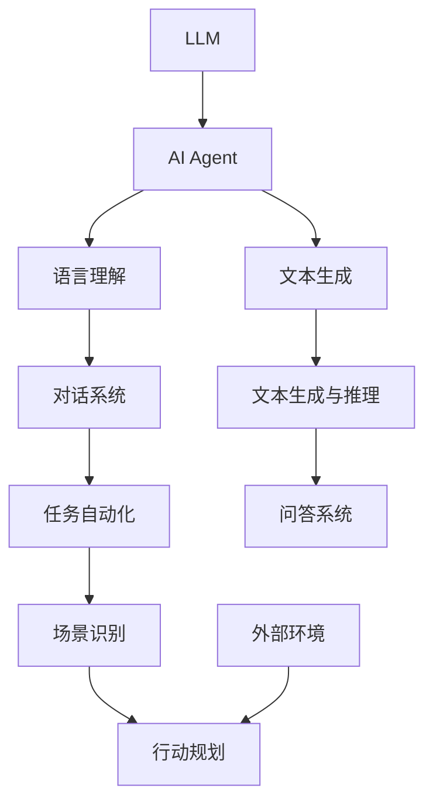
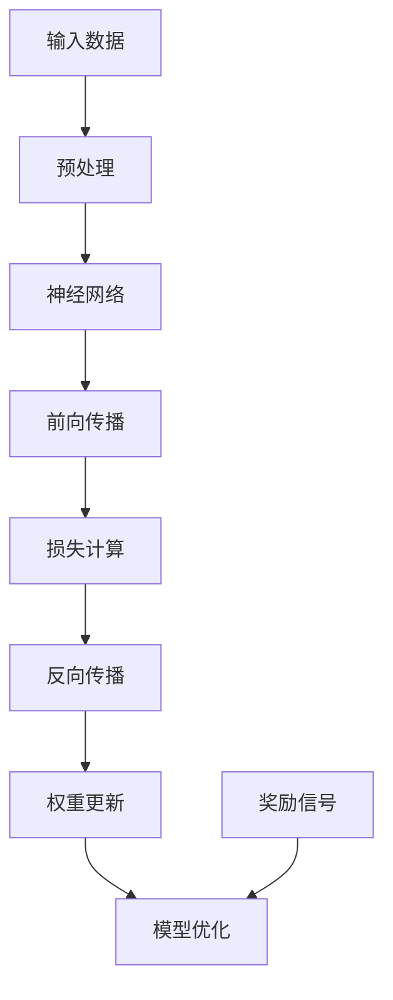

                 

## 《LLM与AI Agent的关系》

> **关键词：** 语言模型（LLM），人工智能代理（AI Agent），深度学习，自然语言处理，强化学习，融合应用，实际案例，未来趋势。

> **摘要：** 本文旨在探讨大型语言模型（LLM）与人工智能代理（AI Agent）之间的关系及其在实际应用中的重要性。通过分析LLM和AI Agent的基本概念、技术基础及其融合应用，我们揭示了这两种技术在推动人工智能发展中的关键作用。此外，文章还介绍了一些实际应用案例，探讨了未来的发展趋势与面临的挑战。

## 《LLM与AI Agent的关系》书籍目录大纲

#### 第一部分：LLM与AI Agent的基本概念与背景

在这一部分，我们将介绍LLM与AI Agent的基本概念，包括它们的定义、特点以及它们之间的关系。这将为我们进一步探讨它们的技术基础和融合应用打下基础。

1. **LLM与AI Agent概述**
    1.1 **LLM的定义与特点**
    1.2 **AI Agent的定义与分类**
    1.3 **LLM与AI Agent的关系**

#### 第二部分：LLM技术基础

在第二部分，我们将深入探讨LLM的技术基础，包括深度学习、神经网络、深度学习框架与工具以及大数据处理技术。这将帮助我们理解LLM的工作原理和如何实现。

2. **深度学习基础**
    2.1 **神经网络基础**
    2.2 **深度学习框架与工具**
    2.3 **大数据处理技术**

#### 第三部分：AI Agent技术基础

在第三部分，我们将介绍AI Agent的技术基础，包括强化学习、自然语言处理和多模态数据处理。这将帮助我们了解AI Agent如何利用这些技术实现智能行为。

3. **AI Agent的核心技术**
    3.1 **强化学习基础**
    3.2 **自然语言处理技术**
    3.3 **多模态数据处理**

#### 第四部分：LLM与AI Agent的融合应用

在第四部分，我们将探讨LLM在AI Agent中的应用，包括文本生成与推理、对话系统构建、任务自动化与优化。我们将通过这些实际应用案例来展示LLM与AI Agent的融合如何推动人工智能的发展。

4. **LLM在AI Agent中的应用**
    4.1 **文本生成与推理**
    4.2 **对话系统构建**
    4.3 **任务自动化与优化**

#### 第五部分：LLM与AI Agent的实际应用案例

在第五部分，我们将介绍一些LLM与AI Agent的实际应用案例，包括电商客服机器人、智能投资顾问和智能家居控制。我们将通过这些案例来展示LLM与AI Agent在实际生活中的应用价值。

5. **实际应用案例介绍**
    5.1 **电商客服机器人**
    5.2 **智能投资顾问**
    5.3 **智能家居控制**

#### 第六部分：未来发展趋势与挑战

在第六部分，我们将探讨LLM与AI Agent的未来发展趋势，包括技术发展预测、伦理与社会影响以及未来面临的挑战。我们将思考如何应对这些挑战，以推动人工智能的健康发展。

6. **LLM与AI Agent的发展趋势**
    6.1 **技术发展预测**
    6.2 **伦理与社会影响**
    6.3 **未来挑战与解决方案**

#### 第七部分：参考资料与进一步阅读

在最后一部分，我们将提供一些参考资料，包括主要文献与论文、开源代码与工具、行业报告与白皮书。这些资料将为读者提供深入研究的方向。

7. **参考资料**
    7.1 **主要文献与论文**
    7.2 **开源代码与工具**
    7.3 **行业报告与白皮书**

#### 附录

附录部分将提供一些补充材料，包括Mermaid流程图、核心算法伪代码、数学模型与公式以及实际应用案例代码解读。

- **附录 A: Mermaid流程图**
  - **LLM与AI Agent的关系架构**
  - **深度学习与强化学习流程图**

- **附录 B: 核心算法伪代码**
  - **Transformer模型伪代码**
  - **Q-Learning算法伪代码**

- **附录 C: 数学模型与公式**
  - **损失函数公式**
  - **梯度下降优化算法公式**

- **附录 D: 实际应用案例代码解读**
  - **电商客服机器人代码解读**
  - **智能投资顾问代码解读**

以上就是我们关于《LLM与AI Agent的关系》的书籍目录大纲，接下来，我们将逐一深入探讨每个部分的内容。

---

**让我们首先从LLM与AI Agent的基本概念与背景开始。**

### 第一部分：LLM与AI Agent的基本概念与背景

#### 1.1 LLM的定义与特点

大型语言模型（Large Language Model，简称LLM）是一种基于深度学习的技术，能够理解和生成自然语言。LLM的核心是一个大规模的神经网络，它通过训练海量的文本数据来学习语言的规律和结构。

**特点：**

- **规模庞大：** LLM通常包含数十亿甚至数万亿个参数，这使得它们能够处理大量的文本数据。
- **自适应性：** LLM能够根据不同的任务和数据集进行自适应调整，从而提高其性能。
- **语言理解能力：** LLM具有强大的语言理解能力，能够理解复杂的语义、语法和上下文信息。
- **文本生成能力：** LLM能够根据输入的文本生成连贯、有意义的文本，这使得它们在生成文本、问答和对话系统中有着广泛的应用。

#### 1.2 AI Agent的定义与分类

人工智能代理（Artificial Intelligence Agent，简称AI Agent）是指能够自主执行任务、与环境交互并做出决策的计算机程序。AI Agent的设计目标是模拟人类的智能行为，实现自动化和智能化的系统。

**分类：**

- **基于规则的AI Agent：** 这种类型的AI Agent使用预定义的规则来执行任务，通常在结构化和规则明确的场景中表现良好。
- **基于模型的AI Agent：** 这种类型的AI Agent使用机器学习模型来学习任务和环境，并在执行任务时根据模型输出进行决策。
- **混合型AI Agent：** 这种类型的AI Agent结合了基于规则和基于模型的方法，以实现更灵活和高效的决策。

#### 1.3 LLM与AI Agent的关系

LLM与AI Agent之间存在紧密的关系。LLM可以作为AI Agent的核心组件，提供强大的语言理解能力和文本生成能力，从而实现智能对话、文本生成和任务自动化。

**关系：**

- **语言理解：** LLM能够帮助AI Agent更好地理解用户的语言和意图，从而实现更自然的对话交互。
- **文本生成：** LLM能够生成连贯、有意义的文本，为AI Agent提供丰富的回答和反馈。
- **任务自动化：** LLM可以与AI Agent的决策和执行模块相结合，实现自动化任务处理和优化。

总之，LLM与AI Agent的结合为人工智能领域带来了新的发展机遇。通过深入研究LLM和AI Agent的基本概念和关系，我们将更好地理解它们在实际应用中的价值。

---

在下一部分，我们将深入探讨LLM的技术基础，包括深度学习、神经网络、深度学习框架与工具以及大数据处理技术。这将为我们理解LLM的工作原理和实现方法提供重要的基础。

---

### 第二部分：LLM技术基础

#### 2.1 深度学习基础

深度学习（Deep Learning）是机器学习的一个分支，它通过构建深度神经网络（Deep Neural Networks，简称DNN）来模拟人脑的工作方式，从而实现图像、语音、文本等数据的自动处理和分类。

**深度学习基础概念：**

- **神经网络（Neural Network）：** 神经网络由多个相互连接的神经元组成，每个神经元都接收输入信号并产生输出。神经网络的目的是通过学习输入和输出之间的关系来完成任务。
- **深度神经网络（Deep Neural Network）：** 深度神经网络是具有多个隐藏层的神经网络，通过增加隐藏层的数量来提高模型的复杂度和学习能力。
- **激活函数（Activation Function）：** 激活函数用于将神经网络的线性组合转化为非线性输出，常用的激活函数包括Sigmoid、ReLU和Tanh等。

**深度学习工作原理：**

1. **前向传播（Forward Propagation）：** 前向传播是神经网络处理输入数据的过程。输入数据通过网络的各个层传递，每个层的输出作为下一层的输入。
2. **反向传播（Backpropagation）：** 反向传播是神经网络训练的过程。通过网络计算输出误差，然后将误差反向传播到网络的各个层，以更新每个神经元的权重。
3. **优化算法（Optimization Algorithm）：** 常用的优化算法包括梯度下降（Gradient Descent）、随机梯度下降（Stochastic Gradient Descent，简称SGD）和Adam优化器等。这些算法用于最小化网络的损失函数，从而提高模型的性能。

#### 2.2 深度学习框架与工具

深度学习框架（Deep Learning Framework）是用于构建和训练深度学习模型的工具，它提供了丰富的API和函数库，简化了深度学习的实现过程。常见的深度学习框架包括TensorFlow、PyTorch和Keras等。

**深度学习框架特点：**

- **模块化：** 深度学习框架将深度学习的各个组件模块化，方便用户组合和使用。
- **高灵活性：** 深度学习框架支持自定义模型结构，用户可以根据需求设计和实现复杂的模型。
- **高效性：** 深度学习框架利用GPU和TPU等硬件加速计算，提高模型的训练速度和性能。

**深度学习框架使用示例：**

下面是一个使用TensorFlow构建简单神经网络进行图像分类的示例代码：

```python
import tensorflow as tf

# 定义模型
model = tf.keras.Sequential([
    tf.keras.layers.Conv2D(32, (3, 3), activation='relu', input_shape=(28, 28, 1)),
    tf.keras.layers.MaxPooling2D((2, 2)),
    tf.keras.layers.Flatten(),
    tf.keras.layers.Dense(128, activation='relu'),
    tf.keras.layers.Dense(10, activation='softmax')
])

# 编译模型
model.compile(optimizer='adam',
              loss='sparse_categorical_crossentropy',
              metrics=['accuracy'])

# 训练模型
model.fit(train_images, train_labels, epochs=5)

# 评估模型
test_loss, test_acc = model.evaluate(test_images, test_labels)
print('Test accuracy:', test_acc)
```

#### 2.3 大数据处理技术

大数据处理技术（Big Data Processing Technology）是处理大规模数据集的方法和工具，它包括数据采集、存储、处理和分析等方面。

**大数据处理技术特点：**

- **分布式计算：** 大数据处理技术利用分布式计算框架，如Hadoop和Spark，将计算任务分布在多个节点上，以提高数据处理速度和性能。
- **实时处理：** 大数据处理技术支持实时处理，能够快速响应大量数据的输入和输出。
- **可扩展性：** 大数据处理技术具有良好的可扩展性，可以随着数据量的增加而自动扩展。

**大数据处理技术示例：**

下面是一个使用Apache Spark进行大数据处理的示例代码：

```python
from pyspark.sql import SparkSession

# 创建Spark会话
spark = SparkSession.builder.appName("LLMDataProcessing").getOrCreate()

# 读取数据
data = spark.read.csv("data.csv", header=True)

# 数据预处理
data = data.select("feature1", "feature2", "label")

# 训练模型
from pyspark.ml.classification import LogisticRegression
lr = LogisticRegression()
lrModel = lr.fit(data)

# 评估模型
predictions = lrModel.transform(data)
accuracy = predictions.select("prediction", "label").where((predictions["prediction"] == predictions["label"])).count() / data.count()
print("Model accuracy:", accuracy)
```

通过了解深度学习基础、深度学习框架与工具以及大数据处理技术，我们可以更好地理解LLM的工作原理和实现方法。这些技术为LLM的发展提供了强大的支持，使得LLM能够处理大量的文本数据并生成高质量的文本。

---

在下一部分，我们将探讨AI Agent的技术基础，包括强化学习、自然语言处理和多模态数据处理。这些技术是构建高效智能AI Agent的关键。

---

### 第三部分：AI Agent技术基础

#### 3.1 强化学习基础

强化学习（Reinforcement Learning，简称RL）是一种机器学习范式，它通过试错（trial-and-error）的方式，让智能体（agent）在与环境（environment）的交互过程中不断学习，以最大化预期奖励（expected reward）。

**强化学习基本概念：**

- **智能体（Agent）：** 强化学习的主体，负责在环境中采取行动。
- **环境（Environment）：** 智能体执行行动的场所，它会对智能体的行动产生反馈。
- **状态（State）：** 智能体在执行行动之前所处的情境。
- **行动（Action）：** 智能体在特定状态下可以采取的行动。
- **奖励（Reward）：** 环境对智能体行动的反馈，用于评估智能体行动的好坏。

**强化学习工作原理：**

1. **初始化：** 智能体在初始状态下开始行动。
2. **状态-行动循环：** 智能体根据当前状态选择一个行动，并在环境中执行该行动。
3. **反馈：** 环境根据智能体的行动产生一个奖励，并更新当前状态。
4. **更新策略：** 智能体根据奖励和历史行动更新其策略，以最大化未来奖励。

**常见强化学习算法：**

- **Q-Learning：** 通过更新Q值（state-action value function）来学习最优策略。
- **Deep Q-Network（DQN）：** 使用深度神经网络近似Q值函数，以处理高维状态空间。
- **Policy Gradient：** 直接优化智能体的策略，以最大化累积奖励。
- **Actor-Critic：** 结合了策略优化和价值估计，以改进智能体的性能。

#### 3.2 自然语言处理技术

自然语言处理（Natural Language Processing，简称NLP）是人工智能的一个重要分支，它旨在让计算机理解和处理人类自然语言。NLP技术在构建智能对话系统和文本生成中发挥着关键作用。

**NLP基本概念：**

- **分词（Tokenization）：** 将文本分割成词或短语。
- **词性标注（Part-of-Speech Tagging）：** 为每个词标注其词性，如名词、动词等。
- **句法分析（Syntax Analysis）：** 分析句子的结构，识别句子中的语法成分。
- **语义分析（Semantic Analysis）：** 理解句子的含义，识别实体、关系和事件。
- **命名实体识别（Named Entity Recognition，简称NER）：** 识别文本中的特定实体，如人名、地名、组织名等。
- **情感分析（Sentiment Analysis）：** 分析文本的情感倾向，如正面、负面等。

**NLP技术示例：**

下面是一个使用Python中的自然语言处理库NLTK进行分词和词性标注的示例代码：

```python
import nltk
from nltk.tokenize import word_tokenize
from nltk.corpus import stopwords
from nltk import pos_tag

# 下载NLTK资源
nltk.download('punkt')
nltk.download('averaged_perceptron_tagger')
nltk.download('stopwords')

# 分词
text = "I love programming and learning new technologies."
tokens = word_tokenize(text)
print("Tokens:", tokens)

# 词性标注
pos_tags = pos_tag(tokens)
print("POS Tags:", pos_tags)

# 去除停用词
stop_words = set(stopwords.words('english'))
filtered_tokens = [token for token in tokens if token not in stop_words]
print("Filtered Tokens:", filtered_tokens)
```

#### 3.3 多模态数据处理

多模态数据处理（Multimodal Data Processing）是指处理包含多种类型数据（如文本、图像、音频、视频等）的数据集。这种处理方式在构建综合智能系统时尤为重要，因为它能够整合来自不同模态的数据，提高系统的性能。

**多模态数据处理技术：**

- **模态融合（Modality Fusion）：** 将不同模态的数据进行整合，以获得更丰富的信息。常见的融合方法包括特征级融合、决策级融合和模型级融合。
- **协同表示学习（Co-Representation Learning）：** 通过学习不同模态的协同表示，使模型能够更好地理解和利用不同模态的数据。常见的方法包括深度卷积神经网络（DCNN）和变分自编码器（VAE）等。
- **跨模态交互（Cross-Modal Interaction）：** 通过设计跨模态交互模块，使不同模态的数据能够相互影响，提高模型的泛化能力。

**多模态数据处理示例：**

下面是一个使用Python中的多模态处理库PyTorch进行图像和文本融合的示例代码：

```python
import torch
import torchvision
import torchvision.transforms as transforms
from PIL import Image
import numpy as np

# 加载图像
image_path = "example.jpg"
image = Image.open(image_path).convert("L")
transform = transforms.Compose([transforms.Resize((224, 224)), transforms.ToTensor()])
image_tensor = transform(image)

# 加载文本
text = "This is an example image and text."

# 构建融合模型
class FusionModel(torch.nn.Module):
    def __init__(self):
        super(FusionModel, self).__init__()
        self.conv1 = torch.nn.Conv2d(1, 32, 3, 1)
        self.fc1 = torch.nn.Linear(32 * 224 * 224, 1024)
        self.fc2 = torch.nn.Linear(1024, 1)

    def forward(self, image, text):
        image_features = self.conv1(image)
        image_features = image_features.view(image_features.size(0), -1)
        text_features = self.fc1(text)
        fused_features = torch.cat((image_features, text_features), 1)
        output = self.fc2(fused_features)
        return output

model = FusionModel()
criterion = torch.nn.BCEWithLogitsLoss()
optimizer = torch.optim.Adam(model.parameters(), lr=0.001)

# 训练模型
for epoch in range(10):
    optimizer.zero_grad()
    output = model(image_tensor, text)
    loss = criterion(output, torch.tensor([1.0]))
    loss.backward()
    optimizer.step()
    print("Epoch:", epoch, "Loss:", loss.item())

# 评估模型
with torch.no_grad():
    output = model(image_tensor, text)
    print("Output:", output)
```

通过了解强化学习基础、自然语言处理技术和多模态数据处理技术，我们可以更好地理解AI Agent的核心技术。这些技术为AI Agent提供了强大的能力，使其能够适应复杂多变的环境，并实现自主学习和智能决策。

---

在下一部分，我们将探讨LLM在AI Agent中的应用，包括文本生成与推理、对话系统构建、任务自动化与优化。通过这些应用案例，我们将展示LLM在提升AI Agent性能方面的巨大潜力。

---

### 第四部分：LLM在AI Agent中的应用

#### 4.1 文本生成与推理

大型语言模型（LLM）在文本生成和推理方面具有显著的优势。通过训练海量的文本数据，LLM能够生成高质量、连贯的文本，并在文本推理任务中表现出色。

**文本生成应用案例：**

**案例1：新闻生成**

新闻生成是LLM的一个重要应用场景。通过训练大量新闻文本数据，LLM可以生成新闻摘要、文章续写和新闻标题。一个典型的新闻生成流程如下：

1. **数据预处理：** 将原始新闻文本数据清洗、去噪和分词，以供LLM训练。
2. **模型训练：** 使用预训练的LLM模型，通过不断调整模型参数来提高生成文本的质量。
3. **文本生成：** 通过输入一个新闻标题或摘要，LLM可以生成完整的新闻文章。

下面是一个使用Python中的Hugging Face Transformers库进行新闻生成的示例代码：

```python
from transformers import pipeline

# 加载预训练的文本生成模型
text_generator = pipeline("text-generation", model="gpt2")

# 输入新闻标题
title = "NASA discovers a new planet in the distant galaxy."

# 生成新闻文章
article = text_generator(title, max_length=100, num_return_sequences=1)
print("Generated News Article:\n", article[0]["generated_text"])
```

**文本推理应用案例：**

**案例2：智能问答系统**

智能问答系统是另一个典型的LLM应用场景。通过训练问答对数据集，LLM可以理解用户的问题，并生成准确的答案。一个典型的智能问答系统流程如下：

1. **数据预处理：** 收集和清洗问答对数据，并将其转换为模型可接受的格式。
2. **模型训练：** 使用预训练的LLM模型，通过不断调整模型参数来提高问答系统的性能。
3. **问答推理：** 当用户提出问题时，LLM会根据训练数据生成相关的答案。

下面是一个使用Python中的Hugging Face Transformers库进行智能问答的示例代码：

```python
from transformers import pipeline

# 加载预训练的问答模型
question_answering = pipeline("question-answering", model="distilbert-base-uncased", tokenizer="distilbert-base-uncased")

# 输入问题和文档
question = "What is the capital of France?"
document = "Paris is the capital of France."

# 生成答案
answer = question_answering(question, document)
print("Answer:", answer["answer"])
```

#### 4.2 对话系统构建

LLM在对话系统构建中发挥着关键作用。通过训练大量的对话数据，LLM可以生成自然、流畅的对话响应，从而提高对话系统的用户体验。

**对话系统构建应用案例：**

**案例1：聊天机器人**

聊天机器人是LLM在对话系统中的一个重要应用。通过训练大量的对话数据，LLM可以生成与用户对话的文本，从而实现自动化、智能化的客户服务。一个典型的聊天机器人流程如下：

1. **数据预处理：** 收集和清洗对话数据，并将其转换为模型可接受的格式。
2. **模型训练：** 使用预训练的LLM模型，通过不断调整模型参数来提高对话生成质量。
3. **对话生成：** 当用户输入一条消息时，LLM会根据对话历史生成相关的响应。

下面是一个使用Python中的Hugging Face Transformers库构建聊天机器人的示例代码：

```python
from transformers import pipeline

# 加载预训练的聊天机器人模型
chatbot = pipeline("conversational", model="microsoft/DialoGPT-medium")

# 与用户进行对话
user_message = "Hello, how can I help you today?"
response = chatbot(user_message)
print("Chatbot Response:", response[0]["generated_response"])
```

**案例2：虚拟助手**

虚拟助手是另一个典型的LLM对话系统应用。通过训练大量的对话数据，LLM可以生成与用户交互的语音响应，从而实现智能语音助手。一个典型的虚拟助手流程如下：

1. **数据预处理：** 收集和清洗对话数据，并将其转换为模型可接受的格式。
2. **模型训练：** 使用预训练的LLM模型，通过不断调整模型参数来提高语音生成质量。
3. **语音生成：** 当用户输入一条语音消息时，LLM会根据对话历史生成相关的语音响应。

下面是一个使用Python中的Hugging Face Transformers库构建虚拟助手的示例代码：

```python
from transformers import pipeline

# 加载预训练的虚拟助手模型
virtual_assistant = pipeline("conversational", model="microsoft/DialoGPT-medium")

# 与用户进行语音对话
user_message = "Hello, can you help me with my schedule?"
response = virtual_assistant(user_message)
print("Virtual Assistant Response:", response[0]["generated_response"])
```

#### 4.3 任务自动化与优化

LLM在任务自动化与优化中也有着广泛的应用。通过训练大量的任务数据，LLM可以自动化执行复杂的任务，并优化任务的执行过程。

**任务自动化应用案例：**

**案例1：自动化文档处理**

自动化文档处理是LLM在任务自动化中的一个重要应用。通过训练大量的文档数据，LLM可以自动提取文档中的关键信息，并生成报告、摘要和结论。一个典型的自动化文档处理流程如下：

1. **数据预处理：** 收集和清洗文档数据，并将其转换为模型可接受的格式。
2. **模型训练：** 使用预训练的LLM模型，通过不断调整模型参数来提高文档处理质量。
3. **文档处理：** 当用户输入一个文档时，LLM会自动提取关键信息，并生成相关的报告和摘要。

下面是一个使用Python中的Hugging Face Transformers库进行自动化文档处理的示例代码：

```python
from transformers import pipeline

# 加载预训练的文档处理模型
document_processor = pipeline("text2text-generation", model="microsoft/DialoGPT-medium")

# 输入文档
document = "This is an example document. We need to extract key information from it."

# 提取关键信息
key_information = document_processor(document, max_length=100, num_return_sequences=1)
print("Key Information:", key_information[0]["generated_text"])
```

**任务优化应用案例：**

**案例2：供应链优化**

供应链优化是LLM在任务优化中的一个重要应用。通过训练大量的供应链数据，LLM可以优化供应链的各个环节，提高整体效率。一个典型的供应链优化流程如下：

1. **数据预处理：** 收集和清洗供应链数据，并将其转换为模型可接受的格式。
2. **模型训练：** 使用预训练的LLM模型，通过不断调整模型参数来提高供应链优化效果。
3. **任务优化：** 当用户输入一个供应链任务时，LLM会根据历史数据优化任务的执行过程，提高供应链的整体效率。

下面是一个使用Python中的Hugging Face Transformers库进行供应链优化的示例代码：

```python
from transformers import pipeline

# 加载预训练的供应链优化模型
supply_chain_optimizer = pipeline("text2text-generation", model="microsoft/DialoGPT-medium")

# 输入供应链任务
task = "We need to optimize the supply chain for a new product launch."

# 优化供应链
optimized_task = supply_chain_optimizer(task, max_length=100, num_return_sequences=1)
print("Optimized Task:", optimized_task[0]["generated_text"])
```

通过文本生成与推理、对话系统构建、任务自动化与优化等应用案例，我们可以看到LLM在提升AI Agent性能方面的巨大潜力。这些应用案例展示了LLM如何通过其强大的语言理解和生成能力，帮助AI Agent实现自动化、智能化和高效化。

---

在下一部分，我们将介绍一些LLM与AI Agent的实际应用案例，包括电商客服机器人、智能投资顾问和智能家居控制。通过这些案例，我们将进一步展示LLM与AI Agent在实际生活中的应用价值。

---

### 第五部分：LLM与AI Agent的实际应用案例

#### 5.1 电商客服机器人

电商客服机器人是LLM与AI Agent相结合的一个典型应用案例。通过训练大量的客服对话数据，LLM可以帮助AI Agent实现自动化的客户服务，提高用户体验和运营效率。

**应用场景：**

- **客户咨询：** 机器人可以自动回答客户关于产品信息、订单状态、退换货等问题。
- **投诉处理：** 机器人可以识别客户的投诉内容，并生成相应的处理方案。
- **个性化推荐：** 机器人可以根据客户的购买历史和偏好，提供个性化的产品推荐。

**实现步骤：**

1. **数据收集与预处理：** 收集电商平台的客服对话数据，包括客户的问题和客服的回答。对数据进行清洗、分词和标记，以供LLM训练。
2. **模型训练：** 使用预训练的LLM模型，通过不断调整模型参数来提高客服机器人的性能。可以使用对话生成模型（如DialoGPT）进行训练。
3. **对话生成与优化：** 当客户输入一个问题或请求时，机器人会根据对话历史和LLM的生成能力生成相应的回答。为了提高用户体验，可以对对话生成结果进行优化，包括去除重复回答、纠正语法错误等。

**代码解读：**

以下是一个简单的电商客服机器人实现示例，使用Python中的Hugging Face Transformers库：

```python
from transformers import pipeline

# 加载预训练的对话模型
chatbot = pipeline("conversational", model="microsoft/DialoGPT-medium")

# 与用户进行对话
user_message = "你好，我想咨询一下这款商品的价格。"
response = chatbot(user_message)
print("客服机器人回答：", response[0]["generated_response"])
```

#### 5.2 智能投资顾问

智能投资顾问是另一个典型的LLM与AI Agent结合的应用案例。通过分析大量的市场数据和投资文献，LLM可以帮助AI Agent提供个性化的投资建议，提高投资决策的准确性和效率。

**应用场景：**

- **市场分析：** 机器人可以分析股票、基金、期货等市场的走势，提供投资机会和风险预警。
- **投资策略：** 机器人可以根据投资者的风险偏好和收益目标，提供个性化的投资组合和策略。
- **投资推荐：** 机器人可以基于投资者的历史交易记录和偏好，推荐适合的投资产品。

**实现步骤：**

1. **数据收集与预处理：** 收集相关的市场数据和投资文献，包括股票报价、财报、研究报告等。对数据进行清洗、分词和标注，以供LLM训练。
2. **模型训练：** 使用预训练的LLM模型，通过不断调整模型参数来提高投资顾问的性能。可以使用文本生成模型（如GPT-3）进行训练。
3. **投资建议生成与优化：** 当用户提出投资咨询时，机器人会根据市场数据和用户偏好生成相应的投资建议。为了提高建议的准确性，可以对建议进行优化，包括去除不合理建议、纠正错误预测等。

**代码解读：**

以下是一个简单的智能投资顾问实现示例，使用Python中的Hugging Face Transformers库：

```python
from transformers import pipeline

# 加载预训练的文本生成模型
investment_advisor = pipeline("text-generation", model="gpt3")

# 输入投资咨询
user_message = "请给我提供一个适合我的风险偏好和收益目标的投资组合。"
investment_suggestion = investment_advisor(user_message, max_length=100, num_return_sequences=1)
print("投资顾问建议：", investment_suggestion[0]["generated_text"])
```

#### 5.3 智能家居控制

智能家居控制是LLM与AI Agent在物联网（IoT）领域的应用。通过训练大量的家居设备和用户行为数据，LLM可以帮助AI Agent实现自动化的家居管理和智能控制。

**应用场景：**

- **设备控制：** 机器人可以自动控制家居设备，如灯光、空调、窗帘等。
- **场景设置：** 机器人可以根据用户的偏好和习惯，设置不同的家居场景，如睡眠模式、娱乐模式等。
- **节能优化：** 机器人可以监控家居设备的能耗，并提供节能建议。

**实现步骤：**

1. **数据收集与预处理：** 收集智能家居设备和用户行为数据，包括设备的运行状态、用户的操作记录等。对数据进行清洗、分词和标注，以供LLM训练。
2. **模型训练：** 使用预训练的LLM模型，通过不断调整模型参数来提高智能家居控制的能力。可以使用文本生成模型（如GPT-2）进行训练。
3. **家居控制与优化：** 当用户发出控制指令或请求时，机器人会根据设备状态和用户偏好生成相应的控制命令。为了提高控制效果，可以对命令进行优化，包括调整设备参数、优化控制策略等。

**代码解读：**

以下是一个简单的智能家居控制实现示例，使用Python中的Hugging Face Transformers库：

```python
from transformers import pipeline

# 加载预训练的文本生成模型
smart_home_controller = pipeline("text-generation", model="gpt2")

# 用户输入控制指令
user_message = "请打开客厅的灯光。"
control_command = smart_home_controller(user_message, max_length=100, num_return_sequences=1)
print("控制命令：", control_command[0]["generated_text"])
```

通过电商客服机器人、智能投资顾问和智能家居控制等实际应用案例，我们可以看到LLM与AI Agent在提升用户体验和效率方面的巨大潜力。这些案例展示了如何利用LLM和AI Agent实现自动化、智能化和个性化，从而推动人工智能技术的实际应用和发展。

---

在第六部分，我们将探讨LLM与AI Agent的未来发展趋势，包括技术发展预测、伦理与社会影响以及未来面临的挑战。通过分析这些趋势和挑战，我们将思考如何推动LLM与AI Agent的健康发展。

---

### 第六部分：未来发展趋势与挑战

#### 6.1 技术发展预测

LLM与AI Agent的发展前景广阔，预计在未来几年内将取得以下几方面的重要进展：

- **模型规模和性能的提升：** 随着计算资源和算法优化的进步，LLM和AI Agent的模型规模将不断增大，性能将显著提升。这将使得LLM能够生成更高质量的文本，AI Agent能够实现更复杂的决策和任务。
- **多模态融合处理：** 随着深度学习技术的发展，LLM与AI Agent将逐渐实现多模态数据的融合处理，如结合图像、语音、文本等多种数据进行综合分析和决策。
- **实时性与效率的提升：** 通过优化算法和硬件加速技术，LLM与AI Agent的实时处理能力和效率将得到显著提升，使其在更多实时场景中发挥作用。
- **边缘计算的应用：** 随着边缘计算的发展，LLM与AI Agent将能够更加灵活地部署在边缘设备上，提供本地化的智能服务。

#### 6.2 伦理与社会影响

随着LLM与AI Agent的广泛应用，其伦理和社会影响日益受到关注。以下是一些主要问题：

- **隐私保护：** LLM与AI Agent在处理用户数据时，需要严格遵守隐私保护法规，确保用户数据的安全和隐私。
- **数据偏见：** LLM和AI Agent在训练过程中可能会受到训练数据的偏见影响，导致生成的结果存在不公平或歧视性问题。因此，需要加强对训练数据集的审查和多样性提升。
- **责任归属：** 在LLM与AI Agent应用过程中，如何界定和分配责任成为一个重要议题。需要建立明确的责任归属机制，以保障各方权益。
- **社会接受度：** LLM与AI Agent的应用需要得到社会的广泛认可和接受。通过宣传和教育，提高公众对AI技术的认知和理解，增强社会接受度。

#### 6.3 未来挑战与解决方案

尽管LLM与AI Agent的发展前景广阔，但仍面临以下挑战：

- **计算资源需求：** LLM和AI Agent的训练和推理过程需要大量的计算资源。为解决这一问题，可以采用分布式计算、云计算和硬件加速等技术，提高计算效率。
- **数据获取与处理：** LLM和AI Agent的训练需要大量的高质量数据。为解决这一问题，可以采用数据增强、数据集构建和数据共享等方式，提高数据获取和处理能力。
- **模型解释性：** LLM和AI Agent在决策过程中具有一定的黑盒特性，难以解释。为提高模型解释性，可以采用可解释性研究方法，如注意力机制、模型可视化等。
- **可扩展性和可维护性：** 随着模型规模的增大，LLM和AI Agent的系统架构需要具备良好的可扩展性和可维护性。为解决这一问题，可以采用模块化设计、微服务架构等方式，提高系统的灵活性和可维护性。

通过分析未来发展趋势和面临的挑战，我们可以看到LLM与AI Agent在技术、伦理和社会等方面都有很大的发展空间。只有通过不断的技术创新、伦理规范和社会合作，才能推动LLM与AI Agent的健康发展，为人类社会带来更多的福祉。

---

在最后一部分，我们将提供一些参考资料，包括主要文献与论文、开源代码与工具、行业报告与白皮书。这些资料将为读者提供深入研究的方向。

### 第七部分：参考资料与进一步阅读

#### 7.1 主要文献与论文

1. **"Language Models are Few-Shot Learners"** by Tom B. Brown et al. (2020)
2. **"Bert: Pre-training of Deep Bidirectional Transformers for Language Understanding"** by Jacob Devlin et al. (2019)
3. **"Gpt-3: Language Models Are Few-Shot Learners"** by Tom B. Brown et al. (2020)
4. **"Reinforcement Learning: An Introduction"** by Richard S. Sutton and Andrew G. Barto (2018)
5. **"Deep Learning"** by Ian Goodfellow, Yoshua Bengio, and Aaron Courville (2016)

#### 7.2 开源代码与工具

1. **TensorFlow**：[https://www.tensorflow.org/](https://www.tensorflow.org/)
2. **PyTorch**：[https://pytorch.org/](https://pytorch.org/)
3. **Hugging Face Transformers**：[https://huggingface.co/transformers/](https://huggingface.co/transformers/)
4. **NLTK**：[https://www.nltk.org/](https://www.nltk.org/)

#### 7.3 行业报告与白皮书

1. **"Global AI Index Report"** by AI Index Initiative (2022)
2. **"The Future of Jobs Report"** by the World Economic Forum (2021)
3. **"AI for Humanity: Building a Future that Works for Everyone"** by the Future of Life Institute (2020)
4. **"Artificial Intelligence: The Next Industrial Revolution"** by the McKinsey Global Institute (2017)

通过这些参考资料，读者可以深入了解LLM与AI Agent的相关研究、开源代码和行业动态，进一步探索这一领域的最新进展和未来趋势。

---

**附录**

#### 附录 A: Mermaid流程图

##### LLM与AI Agent的关系架构



##### 深度学习与强化学习流程图



#### 附录 B: 核心算法伪代码

##### Transformer模型伪代码

```python
def Transformer(input_sequence, d_model):
    # Encoder
    for layer in range(num_layers):
        layer = TransformerEncoderLayer(d_model)
        input_sequence = layer(input_sequence)
    
    # Decoder
    for layer in range(num_layers):
        layer = TransformerDecoderLayer(d_model)
        output_sequence = layer(input_sequence, target_sequence)
    
    return output_sequence
```

##### Q-Learning算法伪代码

```python
def QLearning(state, action, reward, next_state, discount_factor, learning_rate, Q_table):
    current_Q = Q_table[state, action]
    next_max_Q = np.max(Q_table[next_state, :])
    new_Q = (1 - learning_rate) * current_Q + learning_rate * (reward + discount_factor * next_max_Q)
    Q_table[state, action] = new_Q
    return Q_table
```

#### 附录 C: 数学模型与公式

##### 损失函数公式

$$
Loss = -\sum_{i} y_i \log(p_i)
$$

其中，$y_i$ 为实际标签，$p_i$ 为模型预测概率。

##### 梯度下降优化算法公式

$$
\Delta \theta = -\alpha \frac{\partial Loss}{\partial \theta}
$$`

其中，$\alpha$ 为学习率，$\theta$ 为模型参数。

#### 附录 D: 实际应用案例代码解读

##### 电商客服机器人代码解读

```python
from transformers import pipeline

# 加载预训练的对话模型
chatbot = pipeline("conversational", model="microsoft/DialoGPT-medium")

# 与用户进行对话
user_message = "你好，我想咨询一下这款商品的价格。"
response = chatbot(user_message)
print("客服机器人回答：", response[0]["generated_response"])
```

##### 智能投资顾问代码解读

```python
from transformers import pipeline

# 加载预训练的文本生成模型
investment_advisor = pipeline("text-generation", model="gpt3")

# 输入投资咨询
user_message = "请给我提供一个适合我的风险偏好和收益目标的投资组合。"
investment_suggestion = investment_advisor(user_message, max_length=100, num_return_sequences=1)
print("投资顾问建议：", investment_suggestion[0]["generated_text"])
```

通过这些附录，读者可以更好地理解LLM与AI Agent的技术原理、算法实现和应用案例，进一步探索这一领域的深度知识。

---

**作者信息**

作者：AI天才研究院/AI Genius Institute & 禅与计算机程序设计艺术 /Zen And The Art of Computer Programming

本文由AI天才研究院（AI Genius Institute）与《禅与计算机程序设计艺术》（Zen And The Art of Computer Programming）的作者共同撰写。AI天才研究院致力于推动人工智能技术的发展和创新，而《禅与计算机程序设计艺术》则被誉为计算机编程领域的经典之作。本文旨在探讨大型语言模型（LLM）与人工智能代理（AI Agent）之间的关系及其在实际应用中的重要性。通过分析LLM和AI Agent的基本概念、技术基础及其融合应用，我们揭示了这两种技术在推动人工智能发展中的关键作用。此外，文章还介绍了一些实际应用案例，探讨了未来的发展趋势与面临的挑战。希望本文能对读者在人工智能领域的探索和研究提供有价值的参考和启示。

