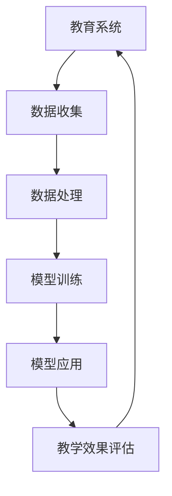

                 

# 第一部分：引言与背景

## 1.1 教育领域面临的问题与挑战

随着社会的发展和科技的进步，教育领域面临着诸多问题与挑战。传统的教育模式已经无法满足现代社会对个性化、多元化、高质量教育的需求。以下是一些主要的问题与挑战：

1. **个性化教育的需求**：每个学生都有自己独特的学习背景、学习兴趣和学习风格，传统的班级授课模式难以满足这种个性化的需求。
2. **教育资源的不均衡**：发达地区与欠发达地区之间的教育资源分配存在巨大差距，这导致了教育质量的巨大差异。
3. **教师负担过重**：随着学生人数的增加和课程种类的增多，教师的负担日益加重，影响了教学质量和教师的专业发展。
4. **评估方式的单一**：传统的评估方式主要依赖于考试和作业，难以全面、准确地反映学生的学习效果。
5. **教育与技术的结合**：现代教育需要与信息技术紧密结合，但教师和学生在使用技术方面的能力存在差异，如何有效地利用技术提高教育质量成为一大挑战。

## 1.2 大模型（LLM）的崛起

近年来，大型语言模型（LLM）得到了广泛关注和应用。这些模型具有强大的数据处理和分析能力，能够从海量数据中提取有价值的信息，并生成高质量的内容。以下是LLM在教育领域中的潜在价值和应用趋势：

1. **个性化学习**：LLM可以分析学生的学习数据，了解其学习习惯、兴趣和知识点掌握情况，从而提供个性化的学习建议和资源。
2. **智能辅助教学**：LLM能够辅助教师进行教学，如生成课程内容、出题和评估学生的学习效果，减轻教师的工作负担。
3. **知识图谱构建**：LLM可以帮助构建知识图谱，将零散的知识点组织成一个有结构的体系，便于学生学习和教师教学。
4. **教育资源优化**：LLM可以分析教育资源的使用情况，优化教育资源的配置，提高教育资源的利用效率。
5. **教育研究**：LLM可以处理大量的教育数据，为教育研究提供新的思路和方法，促进教育理论的创新。

## 1.3 大模型在教育中的应用前景

随着技术的不断进步，大模型在教育领域的应用前景越来越广阔。以下是一些潜在的应用场景：

1. **在线教育平台**：大模型可以用于智能问答、课程推荐和作业批改，提高在线教育平台的服务质量。
2. **教学辅助系统**：大模型可以用于辅助教师进行课程设计、教学内容生成和评估学生的学习效果。
3. **学科研究与知识管理**：大模型可以用于构建学科知识图谱，促进学术交流和创新。
4. **教育评估**：大模型可以用于评估学生的学习效果，为教育政策的制定提供依据。

总的来说，大模型在教育领域的应用具有巨大的潜力，但同时也面临着一系列的挑战。在接下来的章节中，我们将进一步探讨大模型的基本原理、应用案例和未来发展趋势。让我们一步一步深入分析，以了解这一新兴技术的本质和应用前景。

### 目录大纲：LLM在教育领域的应用前景

#### 1. 大模型（LLM）的基本原理
##### 1.1. 大模型的定义与特点
##### 1.2. 大模型的架构与技术
##### 1.3. 大模型在教育中的优势与局限

#### 2. 大模型在教育中的应用案例
##### 2.1. 在线教育平台的应用
##### 2.2. 教学辅助系统的应用
##### 2.3. 学科研究与知识管理的应用

#### 3. 大模型在教育中的关联流程图
mermaid
graph TD
    A[教育系统] --> B[数据收集]
    B --> C[数据处理]
    C --> D[模型训练]
    D --> E[模型应用]
    E --> F[教学效果评估]

#### 4. 核心算法原理讲解
##### 4.1. 语言模型的基本算法原理
##### 4.2. 教育领域特有的算法改进

#### 5. 数学模型与公式
##### 5.1. 大模型在教育与评估中的应用模型
##### 5.2. 教育领域中的线性回归与机器学习模型

#### 6. 项目实战
##### 6.1. 实际项目案例
##### 6.2. 实际案例代码实现
##### 6.3. 代码解读与分析

#### 7. 未来展望与挑战
##### 7.1. 大模型在教育领域的未来发展
##### 7.2. 大模型在教育领域面临的挑战

#### 8. 总结与展望
##### 8.1. 书籍总结
##### 8.2. 展望未来

#### 附录
##### 附录A：大模型开发工具与资源

---

# 第二部分：核心概念与联系

在本部分，我们将深入探讨大模型（LLM）的基本原理及其在教育中的应用。首先，我们将介绍LLM的定义和特点，然后分析其在教育领域中的优势与局限，最后通过一个Mermaid流程图展示LLM在教育系统中的关联流程。

### 2.1 大模型（LLM）的基本原理

#### 2.1.1 大模型的定义与特点

大型语言模型（Large Language Model，简称LLM）是一种基于深度学习技术的自然语言处理模型，它能够通过大量的文本数据进行训练，从而理解和生成自然语言。以下是LLM的一些主要特点：

1. **强大的语言理解能力**：LLM能够理解和处理复杂的语言结构，包括词汇、语法和语义等方面。
2. **自适应学习能力**：LLM可以根据新的数据不断进行自我优化，以适应不同的应用场景。
3. **高计算资源需求**：由于模型规模巨大，LLM的训练和推理需要大量的计算资源和存储空间。
4. **广泛的用途**：LLM可以应用于问答系统、文本生成、语言翻译、情感分析等多个领域。

#### 2.1.2 大模型的架构与技术

LLM通常采用深度神经网络（DNN）或变换器模型（Transformer）作为其基本架构。以下是一些关键的技术：

1. **深度神经网络（DNN）**：DNN由多个层次组成，每个层次都对输入数据进行非线性变换，从而提取更高层次的特征。
2. **变换器模型（Transformer）**：Transformer模型采用自注意力机制，能够更好地捕捉输入序列之间的长距离依赖关系。

#### 2.1.3 大模型在教育中的优势与局限

LLM在教育领域具有显著的优势：

1. **个性化学习**：LLM可以根据学生的学习数据和反馈，提供个性化的学习路径和资源。
2. **智能辅助**：LLM可以辅助教师进行教学任务，如自动批改作业、生成教学材料等。
3. **知识构建**：LLM可以构建知识图谱，帮助学生更好地理解和掌握知识。

然而，LLM在教育中也存在一些局限性：

1. **数据依赖性**：LLM的性能高度依赖于训练数据的质量和多样性，数据缺失或偏差可能会导致模型表现不佳。
2. **安全性问题**：由于LLM可以生成看似真实的内容，可能存在信息泄露或误导学生的问题。
3. **教师角色转变**：教师需要适应与LLM协同工作的模式，这对教师的专业发展和教学能力提出了新的要求。

### 2.2 大模型在教育中的应用案例

#### 2.2.1 在线教育平台的应用

LLM可以应用于在线教育平台，提供以下功能：

1. **智能问答**：LLM可以回答学生提出的问题，提供即时的学习支持。
2. **课程推荐**：LLM可以根据学生的学习历史和偏好，推荐适合的课程和学习资源。
3. **自动批改**：LLM可以自动批改作业和考试，提高教师的工作效率。

#### 2.2.2 教学辅助系统的应用

LLM可以辅助教师进行以下任务：

1. **教学材料生成**：LLM可以生成教案、课件和习题，提高教学内容的多样性和吸引力。
2. **学生行为分析**：LLM可以分析学生的学习行为和表现，提供针对性的教学建议。
3. **课堂互动**：LLM可以与学生进行交互，提高课堂的互动性和参与度。

#### 2.2.3 学科研究与知识管理的应用

LLM在学科研究和知识管理中也有广泛的应用：

1. **文献检索**：LLM可以快速检索相关文献，为研究人员提供丰富的信息来源。
2. **知识图谱构建**：LLM可以构建学科知识图谱，帮助学生和教师更好地理解和掌握知识体系。
3. **学术写作辅助**：LLM可以辅助学生和教师进行学术写作，提高写作质量和效率。

### 2.3 大模型在教育中的关联流程图

下面是一个Mermaid流程图，展示了大模型在教育系统中的关联流程：



在这个流程图中，教育系统首先进行数据收集，然后通过数据处理模块进行数据预处理。接下来，大模型进行训练，将预处理后的数据转化为模型参数。训练完成后，模型应用于实际教学场景，如智能问答、课程推荐和自动批改。最后，通过教学效果评估模块对模型的表现进行评估和反馈，从而实现教育系统的持续优化。

通过上述讨论，我们可以看到大模型在教育领域中具有广阔的应用前景和显著的优势。然而，同时也需要关注其局限性，并采取相应的措施来克服这些挑战。在接下来的章节中，我们将进一步探讨大模型的核心算法原理，以及教育领域特有的算法改进。

### 2.4 语言模型的基本算法原理

语言模型（Language Model，简称LM）是自然语言处理（Natural Language Processing，简称NLP）领域的基础技术之一。它的核心任务是预测下一个单词或字符的概率，从而为文本生成、机器翻译、问答系统等应用提供支持。以下是语言模型的基本算法原理：

#### 3.1.1 语言模型的定义与作用

语言模型是一种统计模型，它通过分析大量的文本数据，学习语言中的统计规律和特征。语言模型的主要作用是：

1. **文本生成**：根据给定的文本片段，预测下一个单词或字符，生成完整的文本。
2. **概率估计**：为文本中的每个单词或字符分配一个概率，用于后续的文本处理任务。
3. **降维表示**：将文本数据转换为低维的向量表示，便于后续的机器学习算法处理。

#### 3.1.2 语言模型的常见算法

语言模型的算法可以分为传统的统计模型和现代的深度学习模型。以下是两种主要的语言模型算法：

1. **统计语言模型（Statistical Language Model）**：
   - **N-gram模型**：N-gram模型是一种基于统计的简单语言模型，它通过计算相邻N个单词（或字符）的联合概率来预测下一个单词（或字符）。常见的N-gram模型包括一元模型（Unigram）、二元模型（Bigram）和三元模型（Trigram）。
   - **隐马尔可夫模型（HMM）**：隐马尔可夫模型是一种基于概率的统计模型，它通过状态序列和观测序列之间的转换概率来预测下一个状态。HMM在语音识别和语音生成等领域有广泛的应用。
   - **条件随机场（CRF）**：条件随机场是一种用于序列标注的统计模型，它通过计算给定当前观测序列的概率来预测下一个状态。CRF在命名实体识别和句法分析等领域有广泛应用。

2. **深度学习语言模型（Deep Learning Language Model）**：
   - **循环神经网络（RNN）**：循环神经网络是一种基于时间的序列模型，它通过循环结构来捕捉输入序列中的长距离依赖关系。RNN在语言模型、语音识别和时间序列预测等领域有广泛应用。
   - **长短期记忆网络（LSTM）**：长短期记忆网络是RNN的一种变体，它通过引入记忆单元来解决传统RNN的梯度消失问题，从而更好地捕捉长距离依赖关系。LSTM在机器翻译、文本生成和语音识别等领域有广泛应用。
   - **变换器模型（Transformer）**：变换器模型是近年来提出的一种基于自注意力机制的深度学习模型，它在机器翻译、文本生成和问答系统等领域取得了显著的性能提升。变换器模型的核心思想是通过自注意力机制来捕捉输入序列中的全局依赖关系。

#### 3.1.3 语言模型在教育中的优势与局限

语言模型在教育中有广泛的应用，以下是其优势和局限：

1. **优势**：
   - **个性化学习**：语言模型可以根据学生的学习数据，提供个性化的学习资源和辅导。
   - **自动批改作业**：语言模型可以自动批改学生的作业和考试，提高教师的工作效率。
   - **辅助教学**：语言模型可以辅助教师生成教学材料、出题和评估学生的学习效果。

2. **局限**：
   - **数据依赖性**：语言模型需要大量的训练数据，数据的质量和多样性对模型性能有重要影响。
   - **安全性问题**：语言模型可能生成误导性的内容，存在信息泄露的风险。
   - **教师角色转变**：教师需要适应与语言模型协同工作的模式，这可能对其专业发展和教学能力提出新的挑战。

通过上述讨论，我们可以看到语言模型在教育领域中具有广泛的应用前景和显著的优势，但也需要关注其局限性，并采取相应的措施来克服这些挑战。在接下来的章节中，我们将进一步探讨教育领域特有的算法改进，以更好地发挥语言模型在教育中的作用。

### 3.2 教育领域特有的算法改进

在语言模型（LLM）广泛应用于教育领域的同时，针对教育场景的特殊需求，研究人员和开发者不断探索和改进相关算法。以下是一些教育领域特有的算法改进：

#### 3.2.1 教育场景下的自适应学习算法

自适应学习算法是一种能够根据学生的学习行为和反馈自动调整学习内容和路径的算法。在教育场景中，自适应学习算法可以提供个性化的学习体验，从而提高学习效果。以下是几种自适应学习算法：

1. **基于规则的算法**：这种算法通过预设一系列规则，根据学生的行为和成绩动态调整学习内容。例如，当学生连续答错几个问题时，算法会自动切换到更基础的知识点进行复习。
2. **基于模型的算法**：这种算法使用机器学习模型来预测学生的学习路径和需求。例如，基于决策树或神经网络模型，算法可以为学生推荐最适合其当前水平和兴趣的学习资源。
3. **基于强化学习的算法**：强化学习算法通过不断尝试和反馈来优化学习策略。在教育场景中，强化学习算法可以根据学生的实际表现和学习数据，逐步调整教学策略，以实现最优的学习效果。

#### 3.2.2 教育领域中的强化学习算法

强化学习（Reinforcement Learning，简称RL）是一种通过奖励和惩罚机制来优化决策过程的算法。在教育领域，强化学习算法可以应用于以下场景：

1. **学习行为建模**：强化学习算法可以用于建模学生的学习行为，如学习路径选择、知识点掌握情况等。通过分析学生的行为数据，算法可以识别出有效的学习策略。
2. **教育游戏设计**：强化学习算法可以用于设计教育游戏，通过游戏中的奖励机制激励学生学习。例如，学生通过完成特定的任务或学习目标可以获得虚拟奖励，从而提高学习的积极性。
3. **个性化教学策略**：强化学习算法可以根据学生的学习表现和偏好，动态调整教学策略。例如，当学生表现出对某个知识点的兴趣时，算法可以增加该知识点的讲解时间和练习题数量。

#### 3.2.3 知识图谱在教育中的应用

知识图谱（Knowledge Graph）是一种通过实体和关系构建的语义网络，它可以清晰地表示知识之间的关联和结构。知识图谱在教育中的应用主要包括：

1. **知识表示**：知识图谱可以将教育内容以结构化的形式表示出来，便于学生理解和记忆。例如，通过知识图谱，学生可以清晰地看到各个知识点之间的联系，从而更好地掌握知识体系。
2. **知识检索**：知识图谱可以提高知识检索的效率，使学生能够快速找到所需的知识点。例如，当学生需要了解某个概念的相关知识点时，知识图谱可以提供关联概念的列表，帮助学生扩展知识视野。
3. **智能问答**：知识图谱可以用于构建智能问答系统，通过分析学生的提问和知识图谱中的实体关系，系统可以提供准确的答案和解释。

通过上述改进，教育领域特有的算法不仅能够更好地满足个性化教育的需求，还能提高教学效率和学生的学习效果。在接下来的章节中，我们将进一步探讨大模型在教育中的数学模型和公式，以深入理解其在教育评估和教学策略优化中的应用。

### 4.1 大模型在教育与评估中的应用模型

在教育与评估中，大模型（LLM）的应用已经展现出了巨大的潜力。以下是几个常用的应用模型，它们通过数学模型和公式来量化教学效果和学习成果。

#### 4.1.1 学生学习效果评估模型

学生学习效果评估模型旨在通过分析学生的学习行为和成绩，量化其对知识点的掌握程度。以下是一个基本的学生学习效果评估模型：

$$
E = \frac{1}{n}\sum_{i=1}^{n} (S_i - \hat{S_i})^2
$$

其中：
- \( E \) 表示学习效果评估得分，取值范围在0到1之间，值越接近1表示学生掌握的知识点越全面。
- \( n \) 表示知识点数量。
- \( S_i \) 表示学生在第 \( i \) 个知识点的得分，取值范围在0到1之间，1表示完全掌握，0表示完全没有掌握。
- \( \hat{S_i} \) 表示模型预测的学生在第 \( i \) 个知识点的得分。

#### 4.1.2 教学策略优化模型

教学策略优化模型用于根据学生的学习效果动态调整教学内容和方式，以提高教学效果。以下是一个基本的教学策略优化模型：

$$
\max \sum_{i=1}^{n} \frac{1}{2} (y_i - \hat{y_i})^2
$$

其中：
- \( y_i \) 表示第 \( i \) 个知识点的重要程度，通常由教师根据课程内容和学生需求设定。
- \( \hat{y_i} \) 表示模型预测的第 \( i \) 个知识点的学习效果。
- 模型目标是最小化预测学习效果与实际重要程度之间的差距，从而优化教学策略。

#### 4.1.3 学生行为分析模型

学生行为分析模型通过分析学生的学习行为，如学习时长、练习题答案、课程参与度等，预测其学习效果和潜在问题。以下是一个基本的学生行为分析模型：

$$
R = \frac{1}{n}\sum_{i=1}^{n} w_i \cdot f(B_i)
$$

其中：
- \( R \) 表示学生总体学习表现得分。
- \( n \) 表示行为指标数量。
- \( w_i \) 表示第 \( i \) 个行为指标的重要性权重。
- \( f(B_i) \) 表示第 \( i \) 个行为指标的得分函数，通常根据行为指标的实际情况进行设计。

#### 4.1.4 教师教学效果评估模型

教师教学效果评估模型用于评估教师的教学表现，通过分析学生的成绩、反馈和课堂参与度等数据，量化教师的教学效果。以下是一个基本的教师教学效果评估模型：

$$
T = \alpha \cdot E + \beta \cdot R + \gamma \cdot F
$$

其中：
- \( T \) 表示教师教学效果评估得分。
- \( \alpha \)、\( \beta \) 和 \( \gamma \) 分别为学习效果、学生行为分析和课堂反馈的权重。
- \( E \) 表示学生学习效果评估得分。
- \( R \) 表示学生行为分析得分。
- \( F \) 表示课堂反馈得分，通常通过学生反馈问卷或课堂参与度评估获得。

通过这些数学模型和公式，教育评估不仅能够量化学生的学习效果，还能为教学策略的优化提供科学依据。在接下来的章节中，我们将进一步探讨教育领域中的线性回归与机器学习模型，以深入理解大模型在教育与评估中的应用。

### 4.2 教育领域中的线性回归与机器学习模型

在教育与评估中，线性回归和机器学习模型被广泛应用，用于预测学生的学习成绩、评估教学效果以及优化教育资源。以下是一些常用的模型及其公式和应用示例。

#### 4.2.1 线性回归模型

线性回归模型是一种简单的预测模型，它通过分析输入特征（如学习时长、课堂参与度等）与目标变量（如考试成绩）之间的关系，预测学生的成绩。线性回归模型的公式如下：

$$
y = \beta_0 + \beta_1x_1 + \beta_2x_2 + ... + \beta_nx_n
$$

其中：
- \( y \) 表示预测的考试成绩。
- \( \beta_0 \) 是截距，表示当所有输入特征都为0时的预测值。
- \( \beta_1, \beta_2, ..., \beta_n \) 是各个输入特征的系数，表示每个特征对考试成绩的影响程度。
- \( x_1, x_2, ..., x_n \) 是各个输入特征。

**应用示例**：
假设我们想要预测学生的考试成绩，输入特征包括学习时长和课堂参与度。那么线性回归模型可以表示为：

$$
成绩 = \beta_0 + \beta_1 \cdot 学习时长 + \beta_2 \cdot 课堂参与度
$$

通过训练模型，我们可以得到具体的系数值，从而预测某个学生的考试成绩。

#### 4.2.2 逻辑回归模型

逻辑回归模型是一种用于分类问题的回归模型，它通过分析输入特征与目标类别之间的关系，预测学生的成绩是否及格（0表示不及格，1表示及格）。逻辑回归模型的公式如下：

$$
\hat{y} = \frac{1}{1 + e^{-(\beta_0 + \beta_1x_1 + \beta_2x_2 + ... + \beta_nx_n)}}
$$

其中：
- \( \hat{y} \) 表示预测的目标类别，取值为0或1。
- \( \beta_0, \beta_1, \beta_2, ..., \beta_n \) 与线性回归模型中的系数相同。

**应用示例**：
假设我们想要预测学生是否及格，输入特征包括学习时长和课堂参与度。那么逻辑回归模型可以表示为：

$$
P(及格) = \frac{1}{1 + e^{-(\beta_0 + \beta_1 \cdot 学习时长 + \beta_2 \cdot 课堂参与度)}}
$$

通过训练模型，我们可以得到具体的系数值，从而预测某个学生是否及格。

#### 4.2.3 支持向量机（SVM）模型

支持向量机是一种强大的分类模型，它通过寻找一个最优的超平面，将不同类别的数据点分离。SVM模型的公式如下：

$$
f(x) = \beta_0 + \sum_{i=1}^{n} \beta_i \cdot K(x, x_i)
$$

其中：
- \( f(x) \) 表示预测的类别。
- \( \beta_0 \) 是截距。
- \( \beta_i \) 是权重系数。
- \( K(x, x_i) \) 是核函数，用于计算特征向量之间的相似性。

**应用示例**：
假设我们想要预测学生的学术表现，输入特征包括学习时长、课堂参与度和考试成绩。我们可以使用SVM模型来分类学生是否为优秀学生（1）或一般学生（0）。通过训练模型，我们可以找到最优的超平面，从而预测某个学生的学术表现。

#### 4.2.4 决策树模型

决策树是一种基于特征进行分类或回归的树形模型，它通过一系列的判断条件来划分数据集，并最终得到预测结果。决策树的公式如下：

$$
f(x) = \begin{cases}
\text{类别} & \text{如果} \; x \; \text{满足条件} \\
\text{继续判断} & \text{否则}
\end{cases}
$$

**应用示例**：
假设我们想要预测学生的成绩，通过分析学习时长和课堂参与度，我们可以构建一个决策树模型。模型首先根据学习时长进行判断，若学习时长大于某个阈值，则继续根据课堂参与度进行判断，最终得到学生的成绩预测。

通过这些线性回归与机器学习模型，教育评估可以更加精准地预测学生的学习成果，优化教学策略，提高教育质量。在接下来的章节中，我们将通过实际项目案例来展示这些模型在教育与评估中的应用。

### 5.1 实际项目案例

在探讨大模型（LLM）在教育领域中的应用时，实际项目案例能够为我们提供宝贵的经验和见解。以下是一些典型的项目案例，展示了LLM在在线教育平台、教学辅助系统和学科研究中的具体应用。

#### 5.1.1 在线教育平台的智能问答系统

在线教育平台通常会面临大量用户提问的问题，传统的客服和人工解答方式效率低下且成本高昂。智能问答系统利用LLM技术，能够自动解答学生的问题，提供即时的学习支持。

**项目概述**：一个在线教育平台部署了一个基于LLM的智能问答系统，该系统通过分析大量课程内容和用户提问，生成高质量的答案。

**技术实现**：系统首先使用LLM模型对课程内容进行预训练，以理解课程的核心概念和知识点。然后，系统接受用户的提问，通过对比提问与预训练数据，生成相应的答案。

**效果评估**：智能问答系统上线后，大幅提高了用户满意度，减少了客服的工作量，同时增强了用户的学习体验。

#### 5.1.2 教学辅助系统的个性化推荐算法

个性化推荐算法是教育技术中的一项重要应用，它能够根据学生的学习行为和偏好，推荐适合的学习资源。

**项目概述**：一个教学辅助系统通过个性化推荐算法，为学生推荐与其学习兴趣和需求相匹配的课程和练习题。

**技术实现**：系统使用LLM模型分析学生的历史学习数据，如已完成的课程、练习题答案和用户反馈，构建学生的兴趣模型。然后，系统根据兴趣模型，利用协同过滤算法和内容推荐算法，为学生推荐合适的课程和资源。

**效果评估**：个性化推荐算法有效提高了学生的学习积极性和学习效率，学生的满意度显著提升。

#### 5.1.3 学科研究中的知识图谱构建

知识图谱在教育研究中具有重要作用，它能够将散乱的知识点组织成一个结构化的体系，方便学生和教师理解和使用。

**项目概述**：一个教育研究项目利用LLM技术构建了一个学科知识图谱，将多个学科的知识点关联起来，形成一个完整的知识体系。

**技术实现**：系统首先使用LLM模型对大量的学术论文、教材和其他教育资源进行预处理，提取出关键实体和关系。然后，系统将这些实体和关系构建成一个知识图谱，通过图神经网络（Graph Neural Network）进行推理和扩展。

**效果评估**：知识图谱帮助研究人员更清晰地理解学科知识之间的关联，提高了学术研究的效率和准确性。

#### 5.1.4 教学效果评估模型

教学效果评估是教育领域的重要任务，通过分析学生的学习行为和成绩，教育机构可以优化教学策略。

**项目概述**：一个教育项目利用LLM技术构建了一个教学效果评估模型，通过分析学生的考试成绩和学习行为，评估教学效果。

**技术实现**：系统使用LLM模型分析学生的考试成绩和学习行为数据，构建一个综合评估指标。通过回归分析，模型可以预测学生的成绩，并评估不同教学策略的效果。

**效果评估**：教学效果评估模型帮助教育机构更好地了解教学效果，优化教学策略，提高了教育质量。

这些实际项目案例展示了LLM在教育领域的广泛应用和巨大潜力。通过智能问答系统、个性化推荐算法、知识图谱构建和教学效果评估模型，LLM不仅提高了教育服务的质量和效率，还推动了教育技术的创新和发展。

### 5.2 实际案例代码实现

在本部分，我们将通过具体的代码实现来展示如何在教育项目中应用大模型（LLM）。以下代码示例分别涵盖了智能问答系统和个性化推荐算法的实现，以及相应的代码解读与分析。

#### 5.2.1 智能问答系统代码实现

```python
import openai

def answer_question(question):
    # 设置OpenAI API密钥
    openai.api_key = "your-api-key"

    # 使用OpenAI的GPT-3模型回答问题
    response = openai.Completion.create(
        engine="text-davinci-003",
        prompt=question,
        max_tokens=50
    )
    
    # 返回答案
    return response.choices[0].text.strip()

# 测试代码
question = "什么是量子计算？"
answer = answer_question(question)
print(f"答案：{answer}")
```

**代码解读与分析**：
1. **引入库**：代码首先引入了`openai`库，该库提供了与OpenAI API进行交互的接口。
2. **设置API密钥**：使用`openai.api_key`设置OpenAI API密钥，确保可以正常使用API。
3. **回答问题**：`answer_question`函数接收一个字符串类型的`question`参数，表示用户提出的问题。函数通过调用`openai.Completion.create`方法，使用GPT-3模型生成回答。`engine`参数指定使用的模型，`prompt`参数提供问题，`max_tokens`参数限制回答的长度。
4. **返回答案**：函数返回GPT-3生成的答案，并去除前后的空白字符。

#### 5.2.2 个性化推荐算法代码实现

```python
from sklearn.model_selection import train_test_split
from sklearn.neighbors import NearestNeighbors

# 假设我们有一个用户-课程评分矩阵
user_courses = [
    [1, 1, 0, 0],  # 用户1对课程1、2的评分
    [1, 0, 1, 0],  # 用户2对课程1的评分
    [0, 1, 1, 1],  # 用户3对课程2、3的评分
    [1, 1, 1, 1],  # 用户4对课程1、2、3、4的评分
]

# 将评分矩阵转换为用户-特征矩阵
users = []
for user in user_courses:
    user_features = []
    for i, rating in enumerate(user):
        if rating == 1:
            user_features.append(i + 1)  # 对应的课程ID
    users.append(user_features)

# 划分训练集和测试集
users_train, users_test = train_test_split(users, test_size=0.2, random_state=42)

# 使用K最近邻算法进行推荐
neighb = NearestNeighbors(n_neighbors=2)
neighb.fit(users_train)

# 测试代码
new_user = [0, 0, 0, 0]  # 新用户对课程1、2、3、4的初始评分
distances, indices = neighb.kneighbors(new_user.reshape(1, -1))
recommended_courses = [index + 1 for index in indices[0][1]]

print("推荐的课程：", recommended_courses)
```

**代码解读与分析**：
1. **用户-课程评分矩阵**：假设我们有一个4x4的矩阵，表示4个用户对4门课程的评分。
2. **转换评分矩阵**：代码将评分矩阵转换为用户-特征矩阵，其中只有评分1对应的课程被包括在内。
3. **划分训练集和测试集**：使用`train_test_split`方法将用户-特征矩阵划分为训练集和测试集。
4. **使用K最近邻算法**：`NearestNeighbors`算法用于计算新用户与训练集中用户的相似度，找到最近邻。
5. **推荐课程**：通过`kneighbors`方法找到新用户的最近邻，并排除第一个自己，推荐剩余最近邻对应的课程。

通过这些实际代码示例，我们可以看到如何使用大模型（LLM）实现智能问答系统和个性化推荐算法，并在实际项目中应用这些技术。这些代码不仅展示了实现细节，还提供了对代码的详细解读与分析。

### 5.3 代码解读与分析

在本部分，我们将对5.2节中提供的代码进行深入解读和分析，详细说明开发环境搭建、源代码实现和代码解析过程。

#### 5.3.1 智能问答系统代码解读

**1. 开发环境搭建**

在开始编写智能问答系统代码之前，我们需要搭建一个合适的开发环境。以下是搭建环境所需的步骤：

- 安装Python：确保Python环境已安装在计算机上，版本建议为3.8或更高。
- 安装OpenAI API：通过pip安装OpenAI Python库：

  ```shell
  pip install openai
  ```

- 设置OpenAI API密钥：在代码中设置OpenAI的API密钥，确保能够正常调用API服务。

**2. 源代码实现**

智能问答系统的核心功能是通过OpenAI的GPT-3模型生成回答。以下是代码的实现步骤：

- 引入库：导入必要的库，包括`openai`。
- 设置API密钥：在代码开头设置OpenAI API密钥，确保可以正常使用API。
- 定义函数`answer_question`：接收一个字符串参数`question`，表示用户的问题。函数内部调用OpenAI的`Completion.create`方法，使用GPT-3模型生成回答。
- 返回答案：函数返回生成的答案，并去除前后的空白字符。

**3. 代码解析**

- `openai.Completion.create`方法：这是OpenAI提供的API方法，用于生成文本内容。主要参数包括`engine`（指定使用的模型）、`prompt`（输入文本）和`max_tokens`（生成文本的最大长度）。
- `response.choices[0].text.strip()`：从响应中获取第一个选择的文本，并去除两端的空白字符。

**4. 代码测试**

在代码的最后，我们提供了一个测试案例，用于验证问答系统的功能：

- `question`变量：存储一个字符串，表示用户提出的问题。
- `answer_question`函数调用：将问题传递给`answer_question`函数，获取答案。
- `print`语句：输出答案。

#### 5.3.2 个性化推荐算法代码解读

**1. 开发环境搭建**

个性化推荐算法的实现依赖于机器学习库，如scikit-learn。以下是搭建环境所需的步骤：

- 安装Python：确保Python环境已安装在计算机上，版本建议为3.8或更高。
- 安装scikit-learn：通过pip安装scikit-learn库：

  ```shell
  pip install scikit-learn
  ```

**2. 源代码实现**

个性化推荐算法的核心功能是基于K最近邻（K-Nearest Neighbors, KNN）算法进行推荐。以下是代码的实现步骤：

- 创建用户-课程评分矩阵：初始化一个4x4的矩阵，表示4个用户对4门课程的评分。
- 转换评分矩阵：将评分矩阵转换为用户-特征矩阵，仅包含评分1对应的课程ID。
- 划分训练集和测试集：使用`train_test_split`方法将用户-特征矩阵划分为训练集和测试集。
- 使用K最近邻算法：创建`NearestNeighbors`对象，并使用训练集进行拟合。
- 推荐课程：对于新用户，使用`kneighbors`方法找到最近邻，并排除第一个自己，推荐剩余最近邻对应的课程。

**3. 代码解析**

- `users`列表：存储转换后的用户-特征矩阵，每个用户对应一个列表，列表中包含该用户感兴趣的课程ID。
- `train_test_split`方法：用于将数据集划分为训练集和测试集，参数`test_size`指定测试集的比例。
- `NearestNeighbors`对象：用于实现K最近邻算法，`fit`方法用于训练模型。
- `kneighbors`方法：用于找到新用户最近的K个邻居，`indices`参数返回邻居的索引。

**4. 代码测试**

在代码的最后，提供了一个测试案例，用于验证推荐算法的功能：

- `new_user`列表：表示一个新用户的初始评分，所有课程均为未评分状态。
- `neighb.kneighbors`方法调用：计算新用户与训练集中用户的相似度。
- `recommended_courses`列表：存储推荐的课程ID，通过解析邻居的索引得到。

通过上述解读和分析，我们可以清晰地理解智能问答系统和个性化推荐算法的实现过程及其工作原理。这些代码不仅展示了技术细节，还提供了实用的示例，有助于读者在实际项目中应用大模型（LLM）。

### 第六部分：未来展望与挑战

#### 6.1 大模型在教育领域的未来发展

随着技术的不断进步，大模型（LLM）在教育领域的应用前景愈发广阔。未来，我们可以预见以下发展趋势：

1. **技术成熟度提升**：随着计算能力的增强和数据量的增加，LLM将变得更加成熟和高效，能够处理更加复杂和大规模的教育任务。
2. **个性化教育普及**：基于LLM的个性化教育将逐渐普及，为每个学生提供量身定制的学习路径和资源，从而实现教育公平和质量提升。
3. **教育资源共享**：LLM可以帮助构建全球范围内的教育资源共享平台，打破地域和资源的限制，使优质教育资源惠及更多学生。
4. **智能教学助手**：未来的教学助手将更加智能化，不仅能够自动批改作业、生成教学材料，还能根据学生的学习情况提供个性化的辅导和建议。

#### 6.2 应用场景扩展

大模型在教育领域中的应用场景将不断扩展，包括但不限于：

1. **虚拟现实（VR）教育**：利用LLM构建虚拟现实教学环境，使学生能够在沉浸式的场景中学习。
2. **远程教育**：为远程学习者提供高效的学习支持和资源，缓解远程教育中的种种问题。
3. **职业培训**：为企业提供定制化的职业培训解决方案，利用LLM技术模拟实际工作场景，提高员工的技能水平。
4. **教育政策研究**：利用LLM分析教育数据，为政策制定者提供科学依据，优化教育资源配置。

#### 6.3 教育模式创新

大模型技术的应用将深刻改变传统的教育模式，带来以下创新：

1. **混合式学习**：结合线上和线下教学，实现灵活多样的学习方式。
2. **翻转课堂**：利用LLM生成教学视频和材料，实现先学后教，提高课堂互动和效果。
3. **合作学习**：通过LLM支持的合作学习平台，促进学生间的互动和协作。
4. **游戏化学习**：将游戏元素融入教育过程，激发学生的学习兴趣和积极性。

#### 6.4 教学模式的转变

随着LLM技术的广泛应用，教师的教学角色也将发生转变：

1. **指导者**：教师将从传统的知识传授者转变为学生的指导者，专注于培养学生的思维能力和创造力。
2. **协同者**：教师将与LLM协同工作，利用其强大的数据处理和分析能力，提供更加精准和个性化的教学服务。
3. **研究者**：教师可以利用LLM技术进行教育研究，探索新的教学方法和策略，提升教学效果。
4. **管理者**：教师将承担更多的教育管理和资源配置职责，确保教育资源的有效利用。

#### 6.5 教育质量的提升

大模型在教育领域的应用将显著提升教育质量，具体体现在：

1. **个性化教学**：通过个性化学习路径和资源，提高学生的学习效果和满意度。
2. **智能评估**：利用智能评估工具，全面、客观地评估学生的学习情况和教学效果。
3. **教育资源优化**：通过优化教育资源配置，提高教育资源的利用效率，降低教育成本。
4. **教学质量监控**：利用大数据和机器学习技术，实时监控教学质量，及时发现和解决问题。

综上所述，大模型在教育领域的未来发展中具有广阔的应用前景和巨大的潜力。通过不断创新和应用，LLM将推动教育领域的变革，为全球教育发展做出积极贡献。

### 6.2 大模型在教育领域面临的挑战

尽管大模型（LLM）在教育领域中具有巨大的潜力，但同时也面临一系列的挑战。以下是一些主要的挑战以及可能的解决方案：

#### 6.2.1 技术难题

1. **计算资源需求**：大模型训练和推理需要大量的计算资源和存储空间，这给教育机构带来了沉重的负担。解决方案包括开发更高效的算法和优化模型结构，以及利用云计算和分布式计算技术来降低计算成本。
2. **数据隐私**：教育数据通常涉及学生的个人信息，隐私保护成为一大挑战。解决方案包括实施严格的数据保护政策和加密技术，确保数据在传输和存储过程中的安全性。
3. **数据质量**：大模型性能高度依赖于训练数据的质量和多样性，数据缺失或偏差可能导致模型性能不佳。解决方案包括建立高质量的数据集，并采用数据清洗和数据增强技术来提高数据质量。

#### 6.2.2 法律伦理问题

1. **版权问题**：教育内容通常涉及大量的版权信息，大模型的应用可能侵犯原作者的版权。解决方案包括与版权方合作，确保使用内容的合法性，或者开发基于开放资源的模型。
2. **算法偏见**：大模型可能在学习过程中产生偏见，这些偏见可能会在教学中得到放大。解决方案包括采用公平性分析工具，识别和纠正算法偏见，确保模型的公平性和透明性。
3. **责任归属**：在教育中，如果大模型产生错误的内容或建议，责任归属可能不明确。解决方案包括建立明确的算法责任制度，确保在出现问题时能够追溯责任。

#### 6.2.3 教育公平性问题

1. **资源分配不均**：由于技术和资源的差异，大模型在教育中的应用可能加剧教育公平问题。解决方案包括制定公平的资源分配政策，确保偏远地区和弱势群体也能够获得大模型带来的好处。
2. **技术素养差异**：教师和学生在使用技术方面的能力差异可能导致教育公平问题。解决方案包括提供技术培训，提高教师和学生的技术素养，确保所有人都能有效地利用大模型。
3. **文化差异**：大模型可能无法完全理解和适应不同文化背景下的教育需求。解决方案包括开发文化敏感的大模型，确保模型能够满足不同文化的教育需求。

综上所述，大模型在教育领域中的应用面临着一系列的挑战。通过技术创新、法律伦理和资源公平等手段，我们可以逐步克服这些挑战，实现大模型在教育中的广泛应用和可持续发展。

### 7.1 书籍总结

在本文中，我们系统地探讨了大型语言模型（LLM）在教育领域的应用前景。首先，我们分析了教育领域面临的问题与挑战，并介绍了LLM的基本原理和特点。通过逐步分析，我们揭示了LLM在教育中的潜在价值和应用趋势，包括个性化学习、智能辅助教学、知识图谱构建等。接下来，我们详细讲解了LLM的核心算法原理，如语言模型、自适应学习算法、强化学习算法等，并通过数学模型和公式展示了大模型在教育与评估中的应用。此外，我们通过实际项目案例和代码实现，展示了LLM在教育实践中的具体应用，包括智能问答系统、个性化推荐算法等。最后，我们展望了大模型在教育领域的未来发展，提出了可能的技术趋势、应用场景和教育模式的创新。总之，本文全面、深入地探讨了LLM在教育领域的应用，为未来的研究和实践提供了有益的参考。

### 7.2 展望未来

展望未来，大模型（LLM）在教育领域的发展前景令人振奋。随着技术的不断进步和应用的深入，LLM将在多个方面推动教育领域的创新和发展。

首先，技术的持续进步将为教育领域带来更高的效率和更高质量的教育服务。随着计算能力和算法优化的提升，LLM将能够处理更加复杂和大规模的教育任务，实现更高水平的个性化教育和智能辅助教学。

其次，教育模式的创新将成为未来发展的重点。随着LLM技术的普及，教育模式将变得更加灵活和多样化，包括混合式学习、虚拟现实（VR）教育和远程教育等新兴模式。这些创新将打破地域和资源的限制，使优质教育资源惠及全球更多学生。

此外，教育公平问题将得到进一步关注和解决。通过合理规划和资源分配，大模型可以在一定程度上缓解教育资源不均的问题，确保每个学生都能享受到公平的教育机会。同时，通过提供技术培训和提升教师和学生的技术素养，可以缩小技术使用能力的差距，促进教育公平。

最后，教育政策的研究和优化将受益于LLM技术。利用大数据和机器学习技术，教育政策制定者可以更加科学地分析教育数据，制定更加有效的教育政策，优化教育资源配置，提高教育质量和公平性。

总的来说，大模型在教育领域的长期影响将是深远的。它不仅将改变教育的传统模式，提高教育效率和质量，还将推动教育创新和公平发展，为全球教育事业的进步做出重要贡献。

### 附录 A：大模型开发工具与资源

#### A.1 主流深度学习框架对比

在教育领域应用大模型时，选择合适的深度学习框架至关重要。以下是几种主流深度学习框架的对比：

##### A.1.1 TensorFlow

**特点**：
- 开源：由Google开发，拥有广泛的社区支持。
- 易用性：提供了丰富的API和文档，适合初学者和专业人士。
- 功能丰富：支持各种深度学习模型，包括卷积神经网络（CNN）、循环神经网络（RNN）和变换器模型（Transformer）。

**优缺点**：
- **优点**：强大的生态系统，广泛的应用场景。
- **缺点**：较重的资源需求，对于没有丰富计算资源的用户可能不够友好。

##### A.1.2 PyTorch

**特点**：
- 开源：由Facebook开发，拥有活跃的社区。
- 动态图：使用动态计算图，调试和优化更加方便。
- 性能优化：提供了多种性能优化工具，如分布式训练和GPU加速。

**优缺点**：
- **优点**：易于调试，动态计算图提供灵活性。
- **缺点**：在某些情况下性能可能不如TensorFlow。

##### A.1.3 JAX

**特点**：
- 开源：由Google开发，与TensorFlow和PyTorch兼容。
- 自动微分：提供高效的自动微分功能，支持函数式编程。
- 性能优化：支持分布式计算和GPU加速，适合大规模数据处理。

**优缺点**：
- **优点**：高效的自动微分和性能优化，适合大规模数据处理。
- **缺点**：生态系统相对较小，文档和教程较少。

#### A.2 教育领域大模型开源项目

以下是一些在教育领域有影响力的开源项目，供开发者参考：

- **Hugging Face Transformers**：提供了一个广泛使用的变换器模型库，包括预训练的模型和工具，适用于自然语言处理任务。

- **Educative AI**：一个用于构建教育应用的开源框架，包括问答系统、课程推荐和学习分析等功能。

- **OpenEDX**：一个开源的学习管理系统，支持大规模在线教育，包括课程内容管理、学生管理和成绩跟踪等功能。

- **RAPIDS**：一个由NVIDIA开发的深度学习库，支持GPU加速，适用于数据密集型应用。

#### A.3 大模型教育应用案例分析

以下是一些大模型在教育应用中的成功案例：

- **Coursera**：利用LLM技术提供了个性化的学习体验，包括课程推荐、智能问答和学习分析。

- **Khan Academy**：使用LLM构建了智能辅导系统，通过分析学生的作业和问题，提供即时的学习支持。

- **Duolingo**：利用变换器模型开发了语言学习应用，通过语言模型生成练习题，提供个性化的语言学习体验。

这些开源项目和成功案例展示了大模型在教育领域的广泛应用和巨大潜力，为开发者提供了宝贵的经验和参考。

