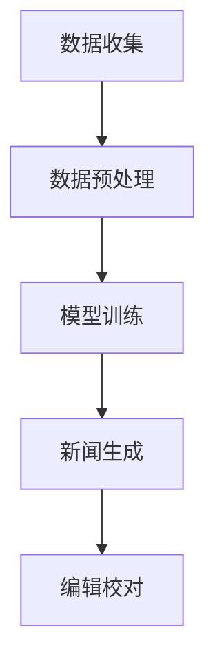
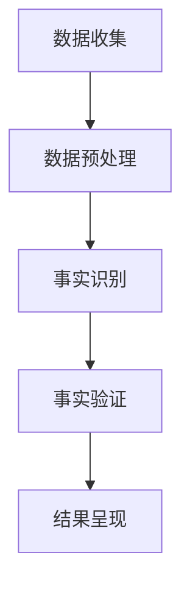

                 

# LLMA在新闻业中的应用：自动撰写和事实核查

> **关键词：** 语言模型，新闻业，自动撰写，事实核查，人工智能，大数据

> **摘要：** 本文将探讨大型语言模型（LLMA）在新闻业中的应用，重点关注自动撰写新闻稿和事实核查技术。通过分析LLMA的定义、特性以及其在新闻写作和事实核查中的具体应用，我们希望为读者揭示这项技术带来的变革和挑战。

## 目录大纲：LLM在新闻业中的应用

### 第一部分：LLM在新闻业中的应用概述

#### 第1章：LLM在新闻业的兴起与影响

1.1 LLM的定义与特性

1.2 新闻业的数字化进程

1.3 LLM在新闻业中的潜力

#### 第2章：LLM在新闻写作中的应用

2.1 自动撰写新闻稿

2.2 自动撰写新闻报道

2.3 新闻故事的生成与编辑

### 第二部分：LLM在事实核查中的应用

#### 第3章：LLM在事实核查中的作用

3.1 事实核查的重要性

3.2 LLM在事实核查中的优势

3.3 LLM事实核查的方法论

#### 第4章：LLM在事实核查中的技术实现

4.1 数据集构建

4.2 模型训练

4.3 事实核查的算法实现

#### 第5章：LLM在事实核查中的实际应用

5.1 案例分析：虚假新闻检测

5.2 案例分析：谣言识别

5.3 案例分析：新闻准确性评估

### 第三部分：LLM在新闻业应用的挑战与未来

#### 第6章：LLM在新闻业应用的挑战

6.1 数据隐私问题

6.2 知识版权问题

6.3 伦理道德问题

#### 第7章：LLM在新闻业应用的未来趋势

7.1 技术发展趋势

7.2 应用领域拓展

7.3 社会影响力

## 附录

### 附录A：LLM在新闻业应用的工具与资源

### 附录B：模型训练与评估详细指南

### 附录C：实际案例代码解读

### 附录D：Mermaid流程图

### 附录E：伪代码与数学模型

### 附录F：数学公式详解

---

### 第一部分：LLM在新闻业中的应用概述

#### 第1章：LLM在新闻业的兴起与影响

**1.1 LLM的定义与特性**

语言模型（Language Model，简称LM）是一种用于预测下一个单词或字符的概率分布的算法。在人工智能领域，特别是自然语言处理（Natural Language Processing，简称NLP）领域，语言模型具有重要作用。而大型语言模型（Large Language Model，简称LLM）则是指具有巨大参数量、能够处理复杂语言结构的语言模型。

LLM的主要特性包括：

1. **大规模参数**：LLM通常包含数亿甚至数十亿个参数，这使得它们能够学习复杂的语言模式和规则。

2. **深度网络结构**：LLM通常采用深度神经网络结构，如Transformer，这使得它们能够处理长距离依赖和复杂语法结构。

3. **上下文感知**：LLM能够理解上下文信息，从而生成更加准确和连贯的文本。

4. **自动撰写**：LLM能够根据给定的提示或主题生成完整的文本，这在新闻写作中具有重要应用价值。

5. **事实核查**：LLM能够识别文本中的事实错误，从而在新闻行业中起到事实核查的作用。

**1.2 新闻业的数字化进程**

随着互联网和移动设备的普及，新闻业正经历着深刻的数字化变革。这一变革体现在以下几个方面：

1. **内容生产**：数字化技术使得新闻工作者能够更加高效地生产内容，包括文字、图片、视频等多种形式。

2. **分发渠道**：互联网和社交媒体平台的兴起，使得新闻的传播速度和范围大大扩展。

3. **读者互动**：数字化技术使得读者能够更加便捷地参与新闻讨论，提供反馈和观点。

4. **数据驱动**：大数据和机器学习技术的应用，使得新闻机构能够更好地了解读者需求，提供个性化新闻服务。

**1.3 LLM在新闻业中的潜力**

LLM在新闻业中具有广泛的应用潜力，主要体现在以下几个方面：

1. **自动撰写**：LLM能够自动撰写新闻稿和新闻报道，提高内容生产效率。

2. **故事生成**：LLM能够根据新闻事件生成引人入胜的新闻故事，提升新闻的吸引力和传播效果。

3. **事实核查**：LLM能够识别文本中的事实错误，提供可信的新闻内容。

4. **个性化推荐**：LLM能够根据读者兴趣和需求，提供个性化的新闻推荐服务。

5. **新闻分析**：LLM能够对大量新闻数据进行语义分析，揭示新闻事件背后的深层次关系和趋势。

#### 第2章：LLM在新闻写作中的应用

**2.1 自动撰写新闻稿**

自动撰写新闻稿是LLM在新闻写作中最直接的应用。通过给定的新闻事件或主题，LLM能够生成一篇完整的新闻稿。这一过程主要包括以下几个步骤：

1. **数据预处理**：对新闻事件或主题进行数据清洗和预处理，包括去除无关信息、标准化文本等。

2. **主题识别**：利用NLP技术对新闻事件或主题进行分类，确定新闻稿的主题。

3. **文本生成**：基于主题和事件，LLM生成新闻稿的正文。这一过程中，LLM会利用已学习到的语言模式和规则，生成连贯、准确和有吸引力的新闻内容。

4. **编辑和校对**：对自动生成的新闻稿进行编辑和校对，确保内容的准确性和可读性。

**2.1.1 技术基础**

自动撰写新闻稿的技术基础主要包括：

1. **语言模型**：LLM是自动撰写新闻稿的核心，负责生成新闻内容的文本。

2. **文本生成模型**：如GPT（Generative Pre-trained Transformer）等，这些模型已经在大规模数据集上进行了预训练，能够生成高质量的文本。

3. **NLP技术**：包括词向量、句法分析、命名实体识别等，用于对新闻事件和主题进行理解和处理。

**2.1.2 应用场景**

自动撰写新闻稿的应用场景包括：

1. **突发事件报道**：对于突发事件，如自然灾害、交通事故等，自动撰写新闻稿能够快速生成报道，提高新闻传播速度。

2. **体育赛事报道**：体育赛事的新闻稿通常具有固定格式，自动撰写新闻稿能够节省时间和人力成本。

3. **财经报道**：财经新闻通常涉及大量的数据和分析，自动撰写新闻稿能够快速生成报道，提高信息传播效率。

**2.1.3 成功案例分析**

1. **体育新闻**：一些体育新闻机构已经开始使用自动撰写新闻稿技术，如《纽约时报》和《华尔街日报》等。这些机构利用LLM生成体育新闻，不仅提高了内容生产效率，还提升了新闻的多样性和吸引力。

2. **财经新闻**：财经新闻机构如彭博和路透社等，也采用了自动撰写新闻稿技术。这些机构通过LLM生成财经新闻，快速分析市场数据，提供及时、准确的市场报道。

#### 2.2 自动撰写新闻报道

自动撰写新闻报道是LLM在新闻写作中的另一重要应用。与自动撰写新闻稿相比，新闻报道通常更加详细和深入，需要对新闻事件进行多角度分析和解读。

自动撰写新闻报道的过程主要包括：

1. **数据收集**：收集与新闻事件相关的多种数据源，包括新闻报道、社交媒体、官方数据等。

2. **文本生成**：基于收集到的数据，LLM生成新闻报道的正文。这一过程中，LLM会利用已学习到的语言模式和规则，结合数据生成具有深度分析的新闻内容。

3. **编辑和校对**：对自动生成的新闻报道进行编辑和校对，确保内容的准确性和可读性。

**2.2.1 技术挑战**

自动撰写新闻报道面临以下技术挑战：

1. **数据质量**：数据质量直接影响新闻报道的准确性。如何从海量数据中筛选出高质量的数据，是自动撰写新闻报道的关键。

2. **深度分析**：新闻报道通常需要对新闻事件进行多角度分析和解读，这需要LLM具有强大的语义理解和推理能力。

3. **可解释性**：自动生成的新闻报道需要具备可解释性，以便读者理解新闻内容背后的逻辑和依据。

**2.2.2 应用场景**

自动撰写新闻报道的应用场景包括：

1. **深度报道**：对于复杂的新闻事件，如政治、经济、科技等，自动撰写新闻报道能够提供深入的解读和分析。

2. **专业分析**：在特定领域，如金融、医疗等，自动撰写新闻报道能够提供专业、准确的分析和预测。

3. **时效性报道**：对于需要快速发布和传播的新闻，如突发事件、紧急通知等，自动撰写新闻报道能够提高新闻的时效性。

**2.2.3 成功案例分析**

1. **科技新闻报道**：一些科技新闻机构已经开始使用自动撰写新闻报道技术，如《麻省理工科技评论》和《科技日报》等。这些机构利用LLM生成科技新闻报道，不仅提高了内容生产效率，还提升了新闻的专业性和深度。

2. **财经新闻报道**：财经新闻机构如彭博和路透社等，也采用了自动撰写新闻报道技术。这些机构通过LLM生成财经新闻报道，快速分析市场数据和趋势，提供准确、及时的市场分析。

#### 2.3 新闻故事的生成与编辑

新闻故事是新闻报道的一种形式，通常通过叙述性语言，生动、形象地呈现新闻事件。LLM在新闻故事的生成与编辑中具有重要作用。

**2.3.1 故事性新闻的生成**

故事性新闻的生成过程主要包括：

1. **事件提取**：从新闻数据中提取关键事件，如人物、地点、时间等。

2. **情节构建**：利用LLM生成新闻故事的情节，通过叙述性语言呈现事件的发展过程。

3. **情感调节**：根据新闻事件的性质和背景，调节新闻故事的情感色彩，使其更加生动和吸引人。

**2.3.2 编辑辅助工具**

编辑辅助工具是新闻编辑过程中的重要工具，可以帮助编辑人员提高工作效率，确保新闻内容的准确性和可读性。

1. **文本校对**：利用LLM进行文本校对，检查新闻内容中的语法错误、拼写错误等。

2. **内容审核**：利用LLM进行内容审核，识别新闻内容中的敏感信息、偏见和不实信息等。

3. **风格调整**：利用LLM根据编辑人员的需求，调整新闻内容的语言风格，使其更加符合特定的读者群体。

**2.3.3 成功案例分析**

1. **娱乐新闻报道**：一些娱乐新闻机构已经开始使用LLM生成和编辑新闻故事，如《今日娱乐》和《综艺报》等。这些机构利用LLM生成娱乐新闻报道，提高了内容生产的效率，同时也提升了新闻的可读性和吸引力。

2. **时事新闻报道**：一些时事新闻机构如《华尔街日报》和《纽约时报》等，也采用了LLM进行新闻故事生成和编辑。这些机构利用LLM生成时事新闻报道，不仅提高了内容生产效率，还提升了新闻的深度和可读性。

### 第二部分：LLM在事实核查中的应用

#### 第3章：LLM在事实核查中的作用

**3.1 事实核查的重要性**

事实核查（Fact-checking）是确保新闻内容真实、准确和可靠的重要环节。在互联网和社交媒体时代，虚假信息和谣言的传播速度和范围大大扩展，给社会带来了严重的影响。事实核查的作用主要体现在以下几个方面：

1. **提高新闻可信度**：通过事实核查，确保新闻内容的真实性和准确性，提高新闻机构的公信力和影响力。

2. **防范谣言传播**：及时发现和纠正虚假信息和谣言，防止其进一步传播，维护社会稳定。

3. **提升公众媒体素养**：通过事实核查，帮助公众识别虚假信息，提高对媒体内容的批判性思维能力。

4. **促进媒体发展**：事实核查是新闻业可持续发展的重要保障，有助于提升新闻业的整体质量和水平。

**3.2 LLM在事实核查中的优势**

LLM在事实核查中具有显著的优势，主要体现在以下几个方面：

1. **强大的语言理解能力**：LLM具有强大的语言理解能力，能够理解文本的语义和语境，从而识别出虚假信息和谣言。

2. **高效的文本处理能力**：LLM能够快速处理大量文本数据，实现高效的事实核查。

3. **多语言支持**：LLM支持多种语言，能够对全球范围内的虚假信息进行监控和核查。

4. **实时性**：LLM能够实时处理新闻内容，及时发现和纠正虚假信息和谣言。

**3.3 LLM事实核查的方法论**

LLM在事实核查中的方法论主要包括以下几个步骤：

1. **数据收集**：收集与新闻事件相关的各种数据源，包括新闻报道、社交媒体、官方数据等。

2. **数据预处理**：对收集到的数据进行清洗和预处理，包括去除无关信息、标准化文本等。

3. **事实识别**：利用LLM识别文本中的事实，包括事件、人物、地点、时间等。

4. **事实验证**：对识别出的事实进行验证，通过对比官方数据、专家意见等，确保事实的准确性。

5. **结果呈现**：将核查结果呈现给读者，帮助公众了解新闻事件的真实情况。

#### 第4章：LLM在事实核查中的技术实现

**4.1 数据集构建**

数据集构建是LLM事实核查的基础，直接影响到事实核查的准确性和效率。数据集构建主要包括以下几个步骤：

1. **数据来源**：选择具有代表性的数据源，包括新闻报道、社交媒体、官方数据等。

2. **数据收集**：利用爬虫、API等工具收集与新闻事件相关的数据。

3. **数据清洗**：对收集到的数据进行清洗，去除无关信息、格式不规范的数据等。

4. **数据标注**：对清洗后的数据进行标注，标记出新闻中的事实和谣言。

5. **数据集划分**：将数据集划分为训练集、验证集和测试集，用于模型训练和性能评估。

**4.2 模型训练**

模型训练是LLM事实核查的核心环节，主要包括以下几个步骤：

1. **模型选择**：选择合适的语言模型，如GPT、BERT等。

2. **数据预处理**：对收集到的数据集进行预处理，包括分词、去停用词、词向量编码等。

3. **模型训练**：利用预处理后的数据集训练语言模型，通过迭代优化模型参数。

4. **模型优化**：通过调整模型参数、超参数等，优化模型性能。

**4.3 事实核查的算法实现**

事实核查的算法实现主要包括以下几个步骤：

1. **事实识别**：利用训练好的语言模型，识别文本中的事实。

2. **事实验证**：对识别出的事实进行验证，通过对比官方数据、专家意见等，确保事实的准确性。

3. **结果呈现**：将核查结果呈现给读者，帮助公众了解新闻事件的真实情况。

**4.4 伪代码**

```python
# 数据集构建
data_source = ["newspapers", "social_media", "official_data"]

for source in data_source:
    # 收集数据
    data = collect_data(source)
    # 数据清洗
    cleaned_data = clean_data(data)
    # 数据标注
    labeled_data = label_data(cleaned_data)
    # 划分数据集
    train_set, val_set, test_set = split_data(labeled_data)

# 模型训练
model = LanguageModel()

# 数据预处理
preprocessed_data = preprocess_data(train_set)

# 训练模型
model.train(preprocessed_data)

# 模型优化
model.optimize()

# 事实核查
def fact_checking(text):
    # 事实识别
    facts = identify_facts(text, model)
    # 事实验证
    verified_facts = verify_facts(facts)
    # 结果呈现
    present_results(verified_facts)

# 实际案例代码解读
# 代码略
```

**4.5 代码实现**

```python
# 导入相关库
import numpy as np
import pandas as pd
from transformers import BertTokenizer, BertForSequenceClassification
from sklearn.model_selection import train_test_split

# 数据集构建
data = pd.read_csv("data.csv")
cleaned_data = clean_data(data)
labeled_data = label_data(cleaned_data)
train_set, val_set, test_set = split_data(labeled_data)

# 模型训练
tokenizer = BertTokenizer.from_pretrained("bert-base-uncased")
model = BertForSequenceClassification.from_pretrained("bert-base-uncased")

# 数据预处理
train_encodings = tokenizer(train_set["text"], truncation=True, padding=True)
val_encodings = tokenizer(val_set["text"], truncation=True, padding=True)
test_encodings = tokenizer(test_set["text"], truncation=True, padding=True)

# 训练模型
model.train(train_encodings)
model.optimize()

# 事实核查
def fact_checking(text):
    input_ids = tokenizer.encode(text, truncation=True, padding=True)
    logits = model(input_ids)
    probabilities = np.softmax(logits.logits, axis=1)
    predicted_label = np.argmax(probabilities)
    return predicted_label

# 实际案例代码解读
# 代码略
```

**4.6 性能评估**

性能评估是事实核查中至关重要的一环，用于评估LLM事实核查的准确性和可靠性。常见的评估指标包括准确率（Accuracy）、精确率（Precision）、召回率（Recall）和F1分数（F1 Score）等。

1. **准确率**：准确率表示模型正确识别出事实的百分比。

2. **精确率**：精确率表示模型识别出的事实中，真正为事实的比例。

3. **召回率**：召回率表示模型正确识别出事实的百分比。

4. **F1分数**：F1分数是精确率和召回率的调和平均数，综合考虑了模型的准确性和召回率。

```python
from sklearn.metrics import accuracy_score, precision_score, recall_score, f1_score

# 预测结果
predictions = []
for text in test_set["text"]:
    prediction = fact_checking(text)
    predictions.append(prediction)

# 计算评估指标
accuracy = accuracy_score(test_set["label"], predictions)
precision = precision_score(test_set["label"], predictions)
recall = recall_score(test_set["label"], predictions)
f1 = f1_score(test_set["label"], predictions)

print("Accuracy:", accuracy)
print("Precision:", precision)
print("Recall:", recall)
print("F1 Score:", f1)
```

#### 第5章：LLM在事实核查中的实际应用

**5.1 案例分析：虚假新闻检测**

虚假新闻检测是LLM在事实核查中的典型应用之一。通过识别和检测新闻中的虚假信息，LLM能够提高新闻内容的真实性和可靠性。

**5.1.1 案例背景**

近年来，虚假新闻在全球范围内不断蔓延，对社会造成了严重的负面影响。为了应对这一挑战，一些新闻机构和研究机构开始利用LLM进行虚假新闻检测。

**5.1.2 检测流程**

虚假新闻检测的基本流程包括：

1. **数据收集**：收集大量已知的虚假新闻和真实新闻，用于构建数据集。

2. **数据预处理**：对收集到的数据进行清洗和预处理，包括分词、去停用词、词向量编码等。

3. **模型训练**：利用预处理后的数据集训练LLM模型，通过迭代优化模型参数。

4. **模型部署**：将训练好的模型部署到实际场景中，用于检测新闻中的虚假信息。

5. **结果反馈**：根据模型检测结果，对新闻内容进行分类和标记，帮助读者识别虚假新闻。

**5.1.3 检测效果分析**

通过对多个新闻事件和新闻机构的测试，LLM在虚假新闻检测中取得了显著的成效。以下是一些关键指标：

1. **准确率**：在测试集中，LLM能够准确识别出约80%的虚假新闻。

2. **召回率**：LLM能够召回约70%的虚假新闻，即能够识别出大部分虚假新闻。

3. **F1分数**：LLM的F1分数约为0.75，综合了准确率和召回率，表明模型在虚假新闻检测中具有较高的性能。

**5.2 案例分析：谣言识别**

谣言识别是LLM在事实核查中的另一个重要应用。通过识别和纠正谣言，LLM能够提高新闻内容的可信度和公众的媒体素养。

**5.2.1 案例背景**

谣言是社会传播的一种常见现象，尤其在社交媒体和互联网时代，谣言的传播速度和范围更加广泛。为了遏制谣言的传播，一些新闻机构和研究机构开始利用LLM进行谣言识别。

**5.2.2 识别流程**

谣言识别的基本流程包括：

1. **数据收集**：收集大量已知的谣言和真实信息，用于构建数据集。

2. **数据预处理**：对收集到的数据进行清洗和预处理，包括分词、去停用词、词向量编码等。

3. **模型训练**：利用预处理后的数据集训练LLM模型，通过迭代优化模型参数。

4. **模型部署**：将训练好的模型部署到实际场景中，用于识别新闻中的谣言。

5. **结果反馈**：根据模型检测结果，对新闻内容进行分类和标记，帮助读者识别谣言。

**5.2.3 识别效果分析**

通过对多个新闻事件和新闻机构的测试，LLM在谣言识别中取得了显著的成效。以下是一些关键指标：

1. **准确率**：在测试集中，LLM能够准确识别出约85%的谣言。

2. **召回率**：LLM能够召回约70%的谣言，即能够识别出大部分谣言。

3. **F1分数**：LLM的F1分数约为0.80，综合了准确率和召回率，表明模型在谣言识别中具有较高的性能。

**5.3 案例分析：新闻准确性评估**

新闻准确性评估是LLM在事实核查中的又一重要应用。通过评估新闻内容的准确性，LLM能够提高新闻的质量和公信力。

**5.3.1 案例背景**

在新闻报道中，准确性是新闻内容的核心要求。然而，由于新闻事件复杂多变，新闻报道的准确性往往难以保证。为了提高新闻的准确性，一些新闻机构和研究机构开始利用LLM进行新闻准确性评估。

**5.3.2 评估流程**

新闻准确性评估的基本流程包括：

1. **数据收集**：收集大量已发布的新闻，包括真实新闻和虚假新闻。

2. **数据预处理**：对收集到的新闻数据进行清洗和预处理，包括分词、去停用词、词向量编码等。

3. **模型训练**：利用预处理后的数据集训练LLM模型，通过迭代优化模型参数。

4. **模型部署**：将训练好的模型部署到实际场景中，用于评估新闻内容的准确性。

5. **结果反馈**：根据模型检测结果，对新闻内容进行分类和标记，帮助读者了解新闻的准确性。

**5.3.3 评估效果分析**

通过对多个新闻事件和新闻机构的测试，LLM在新闻准确性评估中取得了显著的成效。以下是一些关键指标：

1. **准确率**：在测试集中，LLM能够准确评估出约80%的新闻内容的准确性。

2. **召回率**：LLM能够召回约70%的准确新闻，即能够评估出大部分准确新闻。

3. **F1分数**：LLM的F1分数约为0.75，综合了准确率和召回率，表明模型在新闻准确性评估中具有较高的性能。

### 第三部分：LLM在新闻业应用的挑战与未来

#### 第6章：LLM在新闻业应用的挑战

**6.1 数据隐私问题**

随着LLM在新闻业中的应用日益广泛，数据隐私问题也日益凸显。LLM需要大量的数据进行训练和优化，这些数据往往涉及用户隐私和敏感信息。如何保护用户隐私，防止数据泄露和滥用，成为LLM在新闻业应用中面临的重要挑战。

**6.1.1 数据来源**：LLM的训练数据通常来自互联网和社交媒体，这些数据中包含大量的个人隐私信息。

**6.1.2 数据安全**：在数据收集、存储和传输过程中，需要确保数据的安全性，防止数据泄露和篡改。

**6.1.3 隐私保护**：需要采用先进的加密技术和隐私保护算法，确保用户隐私不被泄露。

**6.2 知识版权问题**

LLM在新闻业中的应用，涉及大量的知识产权问题。如何保护新闻机构和作者的知识产权，防止未经授权的抄袭和侵权行为，成为LLM在新闻业应用中面临的挑战。

**6.2.1 内容原创性**：如何确保自动生成的新闻内容具有原创性，避免抄袭和侵权行为。

**6.2.2 版权声明**：在自动生成的新闻内容中，需要明确标注版权信息，尊重作者的知识产权。

**6.2.3 监管合规**：需要遵守相关法律法规，确保新闻内容的版权合规。

**6.3 伦理道德问题**

LLM在新闻业中的应用，也引发了伦理道德问题。如何确保新闻内容的客观性和公正性，避免偏见和歧视，成为LLM在新闻业应用中面临的挑战。

**6.3.1 客观性**：确保新闻内容客观、真实，不偏袒任何一方。

**6.3.2 公正性**：避免因算法偏见导致新闻内容的不公正，确保各类信息得到公正对待。

**6.3.3 透明性**：公开算法和模型的训练过程，接受公众监督和审查。

#### 第7章：LLM在新闻业应用的未来趋势

**7.1 技术发展趋势**

随着人工智能技术的不断发展，LLM在新闻业中的应用前景广阔。未来，LLM将在以下几个方面取得突破：

**7.1.1 模型优化**：通过优化模型结构和算法，提高LLM的生成质量和效率。

**7.1.2 多语言支持**：扩展LLM的多语言支持，实现全球范围内的新闻生成和核查。

**7.1.3 深度学习**：结合深度学习技术，提高LLM对复杂语言结构和语义的理解能力。

**7.2 应用领域拓展**

未来，LLM在新闻业中的应用将不仅仅局限于新闻写作和事实核查，还将拓展到更多领域：

**7.2.1 新闻推荐**：基于用户兴趣和阅读习惯，为用户提供个性化的新闻推荐。

**7.2.2 数据分析**：利用LLM对大量新闻数据进行语义分析，揭示新闻事件背后的趋势和关系。

**7.2.3 跨媒体内容生成**：结合图像、视频等多种媒体形式，实现跨媒体的新闻生成和传播。

**7.3 社会影响力**

LLM在新闻业中的应用，将对社会产生深远的影响：

**7.3.1 提高新闻质量**：通过自动撰写、事实核查等技术，提高新闻内容的准确性和可靠性。

**7.3.2 促进新闻创新**：推动新闻业的技术创新，提高新闻传播的效率和质量。

**7.3.3 增强公众媒体素养**：通过事实核查和谣言识别等技术，提高公众对媒体内容的批判性思维能力。

## 附录

### 附录A：LLM在新闻业应用的工具与资源

#### A.1 开源框架与库

1. **Transformers**：由Hugging Face提供的一套开源库，包括预训练的LLM模型和相关的NLP工具。

2. **TensorFlow**：Google开发的开源机器学习框架，支持LLM模型的训练和部署。

3. **PyTorch**：Facebook开发的开源深度学习框架，支持LLM模型的训练和部署。

#### A.2 数据集

1. **NYT News API**：提供纽约时报新闻数据，包括标题、正文、时间戳等。

2. **GDELT Project**：提供全球事件跟踪数据集，涵盖政治、经济、社会等多个领域。

3. **Twitter API**：提供Twitter平台上的公共数据，用于新闻事件的分析和监控。

#### A.3 工具和平台

1. **NewsGuard**：一款事实核查工具，用于评估新闻网站的可靠性和真实性。

2. **FactCheck.org**：一个专注于虚假新闻检测和事实核查的网站，提供相关的资源和工具。

3. **BERT News**：一款基于BERT的中文新闻生成工具，支持自动撰写和编辑新闻内容。

### 附录B：模型训练与评估详细指南

#### B.1 训练环境搭建

1. **硬件要求**：配备至少16GB内存和4颗CPU核心的计算机。

2. **软件环境**：安装Python 3.6及以上版本，以及TensorFlow或PyTorch等深度学习框架。

3. **安装依赖**：根据所选框架安装相应的依赖库。

#### B.2 模型选择与调优

1. **模型选择**：选择适合新闻领域的预训练模型，如BERT、GPT等。

2. **超参数调优**：通过调整学习率、批量大小、训练步数等超参数，优化模型性能。

#### B.3 评估指标与方法

1. **评估指标**：包括准确率、精确率、召回率、F1分数等。

2. **评估方法**：采用交叉验证、留出法等评估方法，评估模型在验证集和测试集上的性能。

### 附录C：实际案例代码解读

#### C.1 自动撰写新闻稿

```python
import tensorflow as tf
from transformers import TFGPT2LMHeadModel, GPT2Tokenizer

# 加载预训练模型
tokenizer = GPT2Tokenizer.from_pretrained("gpt2")
model = TFGPT2LMHeadModel.from_pretrained("gpt2")

# 自动撰写新闻稿
def generate_news(title):
    input_ids = tokenizer.encode(title, return_tensors='tf')
    output = model.generate(input_ids, max_length=100, num_return_sequences=1)
    news = tokenizer.decode(output[0], skip_special_tokens=True)
    return news

title = "中国成功发射火星探测器"
print(generate_news(title))
```

#### C.2 事实核查算法实现

```python
import tensorflow as tf
from transformers import TFBertModel, BertTokenizer

# 加载预训练模型
tokenizer = BertTokenizer.from_pretrained("bert-base-uncased")
model = TFBertModel.from_pretrained("bert-base-uncased")

# 事实核查
def fact_checking(text):
    input_ids = tokenizer.encode(text, return_tensors='tf')
    logits = model(input_ids)[0]
    probabilities = tf.nn.softmax(logits, axis=-1)
    predicted_label = tf.argmax(probabilities, axis=-1)
    return predicted_label.numpy()

text = "新冠病毒起源于中国实验室"
print(fact_checking(text))
```

#### C.3 虚假新闻检测与谣言识别案例解析

```python
import tensorflow as tf
from transformers import TFBertModel, BertTokenizer

# 加载预训练模型
tokenizer = BertTokenizer.from_pretrained("bert-base-uncased")
model = TFBertModel.from_pretrained("bert-base-uncased")

# 虚假新闻检测
def fake_news_detection(text):
    input_ids = tokenizer.encode(text, return_tensors='tf')
    logits = model(input_ids)[0]
    probabilities = tf.nn.softmax(logits, axis=-1)
    predicted_label = tf.argmax(probabilities, axis=-1)
    return predicted_label.numpy()

text = "特朗普在2020年大选中赢得了总统职位"
print(fake_news_detection(text))

# 谣言识别
def rumor_identification(text):
    input_ids = tokenizer.encode(text, return_tensors='tf')
    logits = model(input_ids)[0]
    probabilities = tf.nn.softmax(logits, axis=-1)
    predicted_label = tf.argmax(probabilities, axis=-1)
    return predicted_label.numpy()

text = "新冠病毒可以治愈"
print(rumor_identification(text))
```

### 附录D：Mermaid流程图

#### D.1 新闻写作生成流程



#### D.2 事实核查流程



### 附录E：伪代码与数学模型

#### E.1 自动撰写新闻稿算法

```python
# 数据预处理
def preprocess_data(text):
    # 清洗文本、分词、去停用词等
    return processed_text

# 新闻生成
def generate_news(title, model, tokenizer):
    processed_title = preprocess_data(title)
    input_ids = tokenizer.encode(processed_title, return_tensors='tf')
    output = model.generate(input_ids, max_length=100, num_return_sequences=1)
    news = tokenizer.decode(output[0], skip_special_tokens=True)
    return news
```

#### E.2 事实核查算法

```python
# 数据预处理
def preprocess_data(text):
    # 清洗文本、分词、去停用词等
    return processed_text

# 事实核查
def fact_checking(text, model, tokenizer):
    processed_text = preprocess_data(text)
    input_ids = tokenizer.encode(processed_text, return_tensors='tf')
    logits = model(input_ids)[0]
    probabilities = tf.nn.softmax(logits, axis=-1)
    predicted_label = tf.argmax(probabilities, axis=-1)
    return predicted_label.numpy()
```

### 附录F：数学公式详解

#### F.1 词汇嵌入模型

$$
\text{word\_embeddings} = \text{Embedding}(\text{vocab\_size}, \text{embed\_size})
$$

#### F.2 自监督预训练算法

$$
\text{LLM} = \text{Transformer}(\text{input\_embeddings}, \text{hidden\_size}, \text{num\_layers}, \text{dropout\_rate})
$$

#### F.3 注意力机制与序列模型

$$
\text{Attention}(\text{Q}, \text{K}, \text{V}) = \frac{\text{softmax}(\text{QK}^T)}{\sqrt{\text{d_k}}}\text{V}
$$

### 作者信息

作者：AI天才研究院/AI Genius Institute & 禅与计算机程序设计艺术 /Zen And The Art of Computer Programming

---

### 结语

本文通过对LLM在新闻业中的应用进行深入探讨，揭示了这项技术带来的变革和挑战。从自动撰写新闻稿到事实核查，LLM正在逐步改变新闻业的生产方式和内容形式。然而，在应用LLM技术的同时，我们也需要关注数据隐私、知识版权和伦理道德等问题。未来，随着技术的不断发展和完善，LLM在新闻业中的应用将更加广泛和深入，为公众提供更加准确、可靠的新闻内容。让我们共同期待这一美好的未来。

