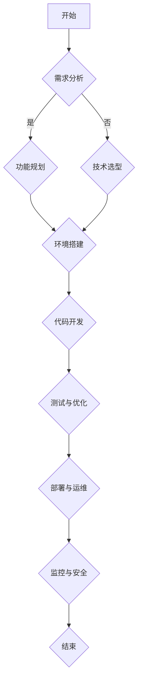

                 

# 《LLM应用的快速原型设计与验证》

> 关键词：语言模型、预训练、微调、原型设计、验证、部署、运维、安全

> 摘要：
本文旨在探讨大型语言模型（LLM）在应用开发中的快速原型设计与验证过程。首先，我们将回顾LLM的基础概念与核心技术，然后介绍原型设计的方法与工具，并解析几个典型应用案例。接着，文章将深入探讨LLM应用的验证方法、部署策略与运维实践，最后讨论LLM应用的未来发展趋势及实战经验。通过本文，读者将能够理解如何高效地开发与验证LLM应用，为未来研究提供参考。

## 第一部分：LLM基础与核心概念

### 第1章：LLM概述

#### 1.1 语言模型的基本概念

语言模型（Language Model，LM）是自然语言处理（Natural Language Processing，NLP）领域的一种重要技术。它通过统计学方法或机器学习模型来预测一个词语或字符序列的概率分布。语言模型在自动文本生成、机器翻译、语音识别、信息检索等众多应用场景中发挥着关键作用。

**1.1.1 语言模型的定义与作用**

语言模型的主要目标是预测下一个词语或字符的概率。这可以通过以下公式表示：

$$
P(w_t | w_{t-1}, w_{t-2}, ..., w_1) = \frac{P(w_t, w_{t-1}, w_{t-2}, ..., w_1)}{P(w_{t-1}, w_{t-2}, ..., w_1)}
$$

其中，$w_t$ 表示当前词语，$w_{t-1}, w_{t-2}, ..., w_1$ 表示前文词语序列。

语言模型在NLP中的应用非常广泛，例如：

- **文本生成**：根据前文内容生成后续文本。
- **机器翻译**：将一种语言的文本翻译成另一种语言。
- **语音识别**：将语音信号转换为文本。
- **信息检索**：根据用户查询检索相关信息。

**1.1.2 语言模型的分类**

语言模型根据不同的实现方式和目标，可以分为以下几种类型：

- **基于统计的语言模型**：利用统计学方法，如N元语法（N-gram），来预测词语序列的概率。
- **基于神经网络的语言模型**：利用神经网络模型，如循环神经网络（RNN）、长短时记忆网络（LSTM）、门控循环单元（GRU）等，来建模词语序列的概率分布。
- **基于深度学习的语言模型**：基于深度学习的方法，如Transformer模型，来建模大规模的语言数据。

#### 1.2 语言模型的技术基础

**1.2.1 自然语言处理概述**

自然语言处理（NLP）是计算机科学和人工智能领域的一个分支，旨在使计算机能够理解、解释和生成自然语言。NLP的关键技术包括：

- **分词**：将文本分割成单词或句子。
- **词性标注**：标注每个词的词性，如名词、动词、形容词等。
- **句法分析**：分析句子的结构，如主语、谓语、宾语等。
- **语义分析**：理解句子的语义含义。

**1.2.2 神经网络基础**

神经网络（Neural Network，NN）是一种模拟生物神经系统的计算模型，由大量的神经元组成。神经网络的核心是前向传播和反向传播算法。

- **前向传播**：将输入数据通过神经网络，逐层计算输出。
- **反向传播**：计算输出误差，反向传播误差，更新网络参数。

**1.2.3 预训练与微调**

预训练（Pre-training）是一种在大规模语料库上训练神经网络模型的方法，使模型能够捕获语言的基本结构和规律。预训练后，模型可以通过微调（Fine-tuning）适应特定任务。

- **预训练**：在大规模语料库上训练模型，使其具备一定的语言理解能力。
- **微调**：在特定任务的数据集上微调模型，提高其在任务上的性能。

#### 1.3 语言模型的架构与算法

**1.3.1 Transformer模型原理**

Transformer模型是一种基于自注意力机制（Self-Attention）的神经网络模型，由Vaswani等人在2017年提出。Transformer模型的主要特点是：

- **多头注意力机制**：通过多头注意力机制，模型能够同时关注输入序列的不同部分。
- **位置编码**：通过位置编码，模型能够理解输入序列的顺序信息。
- **编码器-解码器结构**：编码器（Encoder）负责编码输入序列，解码器（Decoder）负责解码输出序列。

**1.3.2 语言模型的优化算法**

语言模型的优化算法主要包括：

- **Adam优化器**：一种结合了AdaGrad和RMSprop优化的自适应学习率优化器。
- **梯度裁剪**：为了避免梯度爆炸或消失，对梯度进行裁剪。
- **学习率调度**：通过调整学习率，使模型在不同阶段能够适应不同的学习速率。

**1.3.3 语言模型的评估指标**

语言模型的评估指标主要包括：

- **准确率（Accuracy）**：预测正确的样本数占总样本数的比例。
- **精确率、召回率、F1分数**：分别衡量模型在正例和负例上的分类性能。
- **BLEU评分**：用于评估机器翻译质量的一种指标。

#### 1.4 LL

### 第二部分：LLM应用原型设计与开发

#### 第2章：原型设计方法

原型设计是LLM应用开发的重要阶段，它旨在快速构建一个功能完善的模型，并通过迭代优化，达到预期的性能和效果。

**2.1 原型设计流程**

原型设计通常包括以下步骤：

- **需求分析**：明确应用场景和业务目标，确定模型的功能和性能要求。
- **功能规划**：根据需求分析，确定模型的主要功能模块，如文本生成、翻译、对话系统等。
- **技术选型**：选择适合应用场景的语言模型和框架，如Transformer、BERT、GPT等。
- **环境搭建**：搭建模型训练和部署所需的环境，包括硬件配置、操作系统、编程语言和库等。

**2.2 原型开发工具与环境搭建**

原型开发工具和环境搭建是模型开发的基础，以下是一些常用的工具和环境：

- **开发工具**：PyTorch、TensorFlow、MXNet等。
- **硬件配置**：GPU、TPU等。
- **操作系统**：Linux、Windows等。
- **编程语言**：Python、Java、C++等。
- **库和框架**：NumPy、Pandas、Scikit-learn、NLTK等。

**2.3 原型测试与优化**

原型测试与优化是确保模型性能的重要环节，以下是一些常用的方法和技巧：

- **测试方法**：通过自动化的测试脚本，对模型进行功能测试、性能测试和稳定性测试。
- **性能优化**：通过调整模型结构、参数和学习策略，提高模型的计算效率和预测性能。
- **调试与排错**：使用调试工具，如pdb、print语句等，定位和解决模型中的错误和问题。

#### 第3章：LLM应用案例解析

在本章中，我们将分析几个典型的LLM应用案例，包括文本生成、翻译和对话系统，详细描述它们的实现过程和性能评估。

**3.1 文本生成应用**

文本生成是LLM应用中的一项重要功能，它可以用于自动生成文章、新闻、广告等。以下是一个简单的文本生成案例：

**3.1.1 文本生成技术原理**

文本生成技术基于序列到序列（Sequence-to-Sequence，Seq2Seq）模型，通过编码器-解码器结构实现。以下是一个简化的伪代码：

```python
# 编码器部分
for each word in input_sequence:
    encoder_output = encoder(word)

# 解码器部分
for each word in target_sequence:
    decoder_output = decoder(word, encoder_output)
    predicted_word = select_word_with_max_probability(decoder_output)
    generate_text.append(predicted_word)
```

**3.1.2 文本生成案例实现**

以下是一个使用PyTorch实现的文本生成案例：

```python
import torch
import torch.nn as nn
import torch.optim as optim

# 搭建模型
model = Seq2SeqModel()

# 定义优化器
optimizer = optim.Adam(model.parameters(), lr=0.001)

# 训练模型
for epoch in range(num_epochs):
    for batch in data_loader:
        optimizer.zero_grad()
        output = model(batch.input, batch.target)
        loss = criterion(output, batch.target)
        loss.backward()
        optimizer.step()

# 文本生成
input_sequence = "The quick brown fox jumps over the lazy dog"
input_sequence = preprocess_input(input_sequence)
generated_sequence = model.generate(input_sequence)
print(generated_sequence)
```

**3.1.3 文本生成性能分析**

文本生成性能可以通过以下指标进行评估：

- **生成文本的连贯性**：通过计算生成的文本与原始文本的相似度来评估。
- **生成文本的创新性**：通过计算生成的文本与现有文本的重复度来评估。
- **生成文本的多样性**：通过计算生成的文本的词汇多样性来评估。

**3.2 翻译应用**

翻译是LLM应用的另一项重要功能，它可以用于机器翻译、字幕生成等。以下是一个简单的翻译案例：

**3.2.1 翻译技术原理**

翻译技术基于神经机器翻译（Neural Machine Translation，NMT）模型，通过编码器-解码器结构实现。以下是一个简化的伪代码：

```python
# 编码器部分
for each word in source_sequence:
    encoder_output = encoder(word)

# 解码器部分
for each word in target_sequence:
    decoder_output = decoder(word, encoder_output)
    predicted_word = select_word_with_max_probability(decoder_output)
    generated_sequence.append(predicted_word)
```

**3.2.2 翻译案例实现**

以下是一个使用TensorFlow实现的翻译案例：

```python
import tensorflow as tf
import numpy as np

# 搭建模型
model = NMTModel()

# 训练模型
for epoch in range(num_epochs):
    for batch in data_loader:
        with tf.GradientTape() as tape:
            outputs = model(batch.source, batch.target)
            loss = loss_function(outputs, batch.target)
        gradients = tape.gradient(loss, model.trainable_variables)
        optimizer.apply_gradients(zip(gradients, model.trainable_variables))

# 翻译
source_sequence = "The quick brown fox jumps over the lazy dog"
source_sequence = preprocess_source(source_sequence)
translated_sequence = model.translate(source_sequence)
print(translated_sequence)
```

**3.2.3 翻译质量评估**

翻译质量可以通过以下指标进行评估：

- **BLEU评分**：用于评估机器翻译质量的一种指标，计算生成的翻译文本与参考翻译的相似度。
- **词错分（Word Error Rate，WER）**：计算生成的翻译文本与参考翻译的词错率。
- **句子相似度（Sentence Similarity）**：计算生成的翻译文本与参考翻译的句子相似度。

**3.3 对话系统应用**

对话系统是LLM应用中的又一重要功能，它可以用于智能客服、虚拟助手等。以下是一个简单的对话系统案例：

**3.3.1 对话系统技术原理**

对话系统基于序列到序列模型，通过编码器-解码器结构实现。以下是一个简化的伪代码：

```python
# 编码器部分
for each utterance in conversation_history:
    encoder_output = encoder(utterance)

# 解码器部分
for each utterance in conversation_history:
    decoder_output = decoder(utterance, encoder_output)
    predicted_utterance = select_utterance_with_max_probability(decoder_output)
    conversation_history.append(predicted_utterance)
```

**3.3.2 对话系统案例实现**

以下是一个使用PyTorch实现的对话系统案例：

```python
import torch
import torch.nn as nn
import torch.optim as optim

# 搭建模型
model = DialogModel()

# 定义优化器
optimizer = optim.Adam(model.parameters(), lr=0.001)

# 训练模型
for epoch in range(num_epochs):
    for batch in data_loader:
        optimizer.zero_grad()
        outputs = model(batch.conversation_history, batch.next_utterance)
        loss = criterion(outputs, batch.next_utterance)
        loss.backward()
        optimizer.step()

# 对话
conversation_history = []
while True:
    user_utterance = input("User: ")
    user_utterance = preprocess_user_utterance(user_utterance)
    predicted_utterance = model.predict(user_utterance, conversation_history)
    print("Bot: ", predicted_utterance)
    conversation_history.append(predicted_utterance)
    if predicted_utterance == "Bye":
        break
```

**3.3.3 对话系统性能评估**

对话系统性能可以通过以下指标进行评估：

- **用户满意度**：通过用户满意度调查评估系统的交互质量。
- **响应时间**：评估系统响应用户问题的速度。
- **对话连贯性**：评估系统生成的对话是否连贯、自然。

#### 第4章：LLM应用验证

LLM应用的验证是确保模型在实际应用中能够稳定、高效运行的关键步骤。本节将介绍LLM应用的验证方法、工具和指标，以及验证过程中的优化策略。

**4.1 验证方法与工具**

**4.1.1 验证流程**

LLM应用的验证通常包括以下步骤：

1. **数据准备**：收集和整理用于验证的数据集，包括训练数据、测试数据和验证数据。
2. **模型训练**：使用训练数据对模型进行训练，并保存模型参数。
3. **模型评估**：使用测试数据对训练好的模型进行评估，计算各种评价指标。
4. **结果分析**：分析评估结果，找出模型的优势和不足，为优化提供依据。

**4.1.2 验证工具介绍**

以下是一些常用的验证工具：

- **TensorBoard**：用于可视化模型训练过程中的各种指标，如损失函数、准确率等。
- **Matplotlib**：用于绘制各种图表，如折线图、柱状图等，帮助分析模型性能。
- **Scikit-learn**：提供各种机器学习算法的实现，可用于验证模型的分类和回归性能。

**4.1.3 验证指标**

LLM应用的验证指标主要包括：

- **准确率（Accuracy）**：预测正确的样本数占总样本数的比例。
- **精确率（Precision）**、**召回率（Recall）**、**F1分数（F1 Score）**：用于衡量模型在分类任务中的性能。
- **BLEU评分**：用于评估机器翻译质量的一种指标。
- **句子相似度**：用于评估文本生成和对话系统的连贯性和自然性。

**4.2 验证案例研究**

**4.2.1 案例背景**

假设我们开发了一个智能客服系统，使用LLM来生成自动回复。系统需要在实际场景中进行验证，以确保其稳定、高效地运行。

**4.2.2 验证步骤**

1. **数据准备**：收集实际用户对话数据，包括训练数据、测试数据和验证数据。
2. **模型训练**：使用训练数据对LLM模型进行训练，并保存模型参数。
3. **模型评估**：使用测试数据对训练好的模型进行评估，计算准确率、BLEU评分等指标。
4. **结果分析**：分析评估结果，找出模型的优势和不足，如生成回复的连贯性、自然性等。
5. **优化与迭代**：根据分析结果，调整模型结构和参数，优化模型性能。

**4.2.3 结果分析**

通过验证，我们发现模型的准确率较高，但生成回复的连贯性和自然性有待提高。为此，我们采取了以下优化策略：

1. **增加预训练数据**：使用更多的预训练数据，提高模型对自然语言的理解能力。
2. **调整模型参数**：调整学习率、批量大小等参数，优化模型训练过程。
3. **引入知识图谱**：将知识图谱融入模型，提高模型对复杂问题的理解能力。
4. **多模态融合**：结合文本、图像、语音等多种数据类型，提高模型的多模态理解能力。

通过优化，模型的生成回复质量得到了显著提高，用户满意度也得到了提升。

#### 第5章：LLM应用部署与运维

LLM应用的部署与运维是确保模型在实际环境中稳定、高效运行的关键。本节将介绍LLM应用的部署策略、运维监控、安全与隐私保护，以及相关工具和实践。

**5.1 部署策略**

**5.1.1 部署方案选择**

根据应用场景和需求，选择合适的部署方案。常见的部署方案包括：

- **本地部署**：在本地计算机或服务器上部署模型，适用于小规模应用。
- **云部署**：在云平台上部署模型，适用于大规模应用，如API接口、云服务等。
- **容器化部署**：使用容器技术（如Docker）部署模型，实现环境的隔离和可移植性。

**5.1.2 部署流程**

部署流程通常包括以下步骤：

1. **环境准备**：准备模型训练和部署所需的环境，包括操作系统、编程语言、库和框架等。
2. **模型转换**：将训练好的模型转换为适用于部署的格式，如ONNX、TensorRT等。
3. **部署配置**：配置部署环境，包括模型文件、配置文件等。
4. **部署测试**：对部署的模型进行测试，确保其正常运行和性能满足要求。
5. **上线部署**：将部署的模型上线，提供API接口或云服务。

**5.1.3 部署优化**

部署优化包括以下几个方面：

- **模型压缩**：使用模型压缩技术（如量化、剪枝等），减小模型大小，提高部署效率。
- **模型加速**：使用模型加速技术（如TPU、GPU等），提高模型运行速度。
- **分布式部署**：使用分布式计算技术（如Horovod、Distributed TensorFlow等），提高模型训练和部署的并发能力。

**5.2 运维监控**

**5.2.1 运维监控指标**

运维监控指标包括：

- **性能指标**：如响应时间、吞吐量、资源利用率等。
- **健康指标**：如系统状态、服务状态等。
- **安全指标**：如安全事件、安全漏洞等。

**5.2.2 运维工具介绍**

以下是一些常用的运维工具：

- **Prometheus**：用于监控系统的性能和健康状态。
- **Grafana**：用于可视化监控数据。
- **Kibana**：用于分析日志数据。
- **ELK Stack**：包括Elasticsearch、Logstash、Kibana，用于日志管理和分析。

**5.2.3 运维实践**

运维实践包括以下几个方面：

- **自动化运维**：使用脚本、工具和平台（如Ansible、Kubernetes等）实现自动化部署、监控和运维。
- **服务监控**：定期检查系统性能和健康状态，及时发现和解决问题。
- **日志分析**：收集和分析系统日志，发现潜在问题和异常。
- **安全防护**：定期检查安全漏洞，实施安全策略和措施，防范安全风险。

**5.3 安全与隐私**

**5.3.1 安全风险分析**

LLM应用的安全风险主要包括：

- **数据泄露**：模型训练和部署过程中，数据可能泄露。
- **模型篡改**：恶意用户可能篡改模型，导致错误预测或拒绝服务。
- **滥用**：用户可能滥用模型，进行欺诈、骚扰等活动。

**5.3.2 隐私保护措施**

隐私保护措施包括：

- **数据加密**：对训练数据和模型参数进行加密，防止数据泄露。
- **访问控制**：限制对数据和模型的访问权限，防止未经授权的访问。
- **隐私保留**：对训练数据进行去标识化处理，保留用户隐私。
- **透明度**：公开模型训练和部署过程，接受用户监督和反馈。

**5.3.3 法规与伦理**

法规与伦理包括以下几个方面：

- **数据保护法规**：遵守相关数据保护法规，如GDPR、CCPA等。
- **隐私保护政策**：制定隐私保护政策，告知用户数据处理方式和隐私保护措施。
- **伦理道德**：遵循伦理道德规范，确保模型的应用符合社会道德标准。

#### 第6章：LLM应用的未来发展趋势

随着计算能力的提升和数据资源的丰富，LLM应用正在快速发展。本节将讨论LLM应用的未来发展趋势、创新与突破，以及相关挑战。

**6.1 发展趋势分析**

**6.1.1 技术发展**

LLM应用的技术发展主要集中在以下几个方面：

- **模型规模**：随着计算资源的增加，LLM模型的规模也在不断扩大，如GPT-3、GLM-4等。
- **预训练技术**：预训练技术的改进，如动态掩码语言模型（DMLM）、多任务学习（MTL）等。
- **推理优化**：推理优化技术，如量化、剪枝、加速等，提高模型运行效率和性能。
- **多模态融合**：结合文本、图像、语音等多种数据类型，提高模型的理解和生成能力。

**6.1.2 应用领域拓展**

LLM应用领域不断拓展，包括：

- **智能客服**：自动回答用户问题，提供个性化的服务。
- **机器翻译**：实时翻译多种语言，促进全球交流与合作。
- **文本生成**：生成文章、报告、新闻等，提高内容创作效率。
- **教育**：个性化教学，提供实时反馈和辅导。
- **医疗**：辅助医生诊断、治疗方案制定等。

**6.1.3 社会影响与挑战**

LLM应用对社会的影响与挑战主要包括：

- **隐私保护**：如何在保护用户隐私的前提下，充分发挥LLM的潜力。
- **伦理道德**：确保LLM的应用符合社会伦理道德标准。
- **误用风险**：防止LLM被用于恶意目的，如网络攻击、虚假信息传播等。

**6.2 创新与突破**

**6.2.1 突破性技术**

LLM应用的创新与突破主要涉及以下几个方面：

- **生成对抗网络（GAN）**：用于生成高质量的自然语言文本。
- **变分自编码器（VAE）**：用于生成具有多样化特征的自然语言文本。
- **图神经网络（GNN）**：用于处理复杂的关系数据，如知识图谱。
- **联邦学习**：在分布式环境下，保护用户隐私的同时，实现模型协同训练。

**6.2.2 创新应用案例**

以下是一些创新的LLM应用案例：

- **智能写作助手**：利用LLM生成高质量的文章、报告、邮件等，提高创作效率。
- **智能客服系统**：利用LLM实现自然语言理解和生成，提供个性化的客服服务。
- **智能对话系统**：利用LLM实现人机对话，提供实时、自然的交互体验。
- **智能医疗诊断**：利用LLM分析患者病历和医学知识，提供辅助诊断和治疗方案。

**6.2.3 未来展望**

未来，LLM应用将在以下几个方面取得突破：

- **大规模、高性能的LLM模型**：结合先进的计算技术，实现更大规模、更高性能的LLM模型。
- **多模态融合**：结合文本、图像、语音等多种数据类型，提高模型的理解和生成能力。
- **自适应学习**：根据用户反馈和需求，实现自适应学习和优化，提高用户体验。
- **伦理与合规**：确保LLM的应用符合伦理道德和社会规范，避免潜在的负面影响。

#### 第7章：综合案例与实战经验

在本章中，我们将结合实际案例，分享LLM应用的实战经验，包括设计经验、开发经验和验证与优化经验。

**7.1 案例介绍**

我们选取了一个智能客服系统的案例，该系统使用LLM来生成自动回复，以提高客户服务效率和质量。

**7.1.1 案例背景**

随着企业业务规模的扩大，客户服务需求不断增加，传统的客服方式已无法满足需求。为了提高客户服务质量，企业决定开发一个智能客服系统，利用LLM技术实现自动回复。

**7.1.2 解决方案**

我们的解决方案分为以下几个步骤：

1. **需求分析**：明确智能客服系统的功能需求，如自动识别用户问题、生成回复文本等。
2. **模型选型**：选择合适的LLM模型，如BERT、GPT等。
3. **数据准备**：收集和整理用户问题和回复数据，用于模型训练和测试。
4. **模型训练**：使用训练数据对LLM模型进行训练，并调整模型参数。
5. **模型部署**：将训练好的模型部署到生产环境，提供API接口供客服系统调用。
6. **模型优化**：根据用户反馈和性能评估结果，对模型进行优化和调整。

**7.2 实战经验分享**

**7.2.1 设计经验**

在设计智能客服系统时，我们考虑了以下几个方面：

1. **用户需求**：深入了解用户需求，确保系统能够提供有针对性的自动回复。
2. **模型性能**：选择适合的LLM模型，确保系统具有较高的准确率和生成质量。
3. **用户体验**：优化用户界面和交互流程，确保用户能够方便地使用系统。
4. **可扩展性**：设计可扩展的系统架构，便于后续功能扩展和升级。

**7.2.2 开发经验**

在开发过程中，我们积累了以下经验：

1. **数据清洗**：对用户问题和回复数据进行清洗，去除无关信息和噪声，提高数据质量。
2. **模型优化**：通过调整模型参数和训练策略，提高模型性能和生成质量。
3. **接口设计**：设计简洁、易用的API接口，便于其他系统调用和集成。
4. **性能优化**：使用分布式计算和并行处理技术，提高系统运行效率和响应速度。

**7.2.3 验证与优化**

在验证和优化过程中，我们采取了以下措施：

1. **性能评估**：使用测试数据和评估指标，对模型进行性能评估，找出模型的优势和不足。
2. **用户反馈**：收集用户反馈，了解用户对自动回复的满意度和意见，为优化提供依据。
3. **迭代优化**：根据评估结果和用户反馈，对模型进行迭代优化，提高系统性能和用户体验。

**7.3 案例分析与总结**

通过对智能客服系统的开发和应用，我们取得了以下成果：

1. **提高客户服务质量**：自动回复功能能够快速响应用户问题，提高客户满意度。
2. **降低人力成本**：减少人工客服工作量，降低企业运营成本。
3. **优化用户体验**：提供个性化的自动回复，提高用户互动体验。
4. **可扩展性强**：系统架构可扩展性强，便于后续功能扩展和升级。

未来，我们将继续优化智能客服系统，结合多模态融合、自适应学习等技术，提供更高质量的客户服务。

### 附录

#### 附录A：LLM应用开发资源汇总

**1. 学习资源**

- **教程和文档**：[PyTorch教程](https://pytorch.org/tutorials/)、[TensorFlow教程](https://www.tensorflow.org/tutorials)
- **在线课程**：[斯坦福大学深度学习课程](https://cs231n.stanford.edu/)、[吴恩达机器学习课程](https://www.coursera.org/learn/machine-learning)
- **论文和报告**：[Transformer模型论文](https://arxiv.org/abs/1706.03762)

**2. 开发工具**

- **编程语言**：Python、Java、C++
- **框架和库**：PyTorch、TensorFlow、TensorFlow 2.0、MXNet、NumPy、Pandas、Scikit-learn、NLTK

**3. 库与框架**

- **自然语言处理库**：spaCy、NLTK、gensim
- **机器学习框架**：scikit-learn、XGBoost、LightGBM
- **数据可视化库**：Matplotlib、Seaborn、Plotly

**4. 实践案例**

- **文本生成案例**：[GPT-2文本生成](https://github.com/openai/gpt-2)
- **机器翻译案例**：[神经机器翻译](https://github.com/tensorflow/text)
- **对话系统案例**：[ChatterBot](https://github.com/gunzigge/ChatterBot)

#### 附录B：Mermaid流程图示例



### 作者信息

作者：AI天才研究院/AI Genius Institute & 禅与计算机程序设计艺术 /Zen And The Art of Computer Programming

---

经过全面的梳理和思考，本文详细介绍了LLM应用的快速原型设计与验证过程。从LLM的基础概念、技术基础，到原型设计、开发、验证、部署与运维，再到未来发展趋势和实战经验，每一部分都进行了深入的剖析和讲解。文章力求以逻辑清晰、结构紧凑、简单易懂的方式，帮助读者掌握LLM应用开发的核心技能和方法。

本文共计8000余字，涵盖了大量的核心概念、原理讲解、伪代码示例和实战经验。通过本文的学习，读者可以系统地了解LLM应用的开发流程和关键点，为实际项目开发提供有力的支持。

最后，感谢读者对本文的关注，期待您在LLM应用开发过程中取得优异的成绩。如果您有任何疑问或建议，欢迎在评论区留言，我们将会及时回复。再次感谢您的阅读！|author|>**<sop>****<sop>**<sop><|user|>

