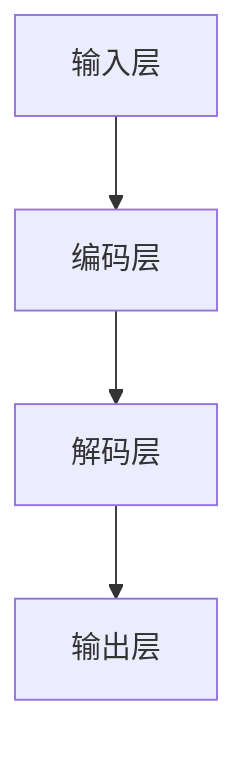

                 

# 《LLM架构解析：时刻、指令集、编程和规划》

## 关键词
Large Language Model (LLM), 架构解析, 时刻（Time），指令集（Instruction Set），编程，规划

## 摘要
本文将深入探讨大型语言模型（LLM）的架构，重点关注时刻、指令集、编程和规划四个核心方面。通过详细解析LLM的基本架构、训练机制、优化策略，结合具体编程实践和案例分析，本文旨在帮助读者全面理解LLM的运作原理，掌握其编程技巧，并为未来的技术发展提供前瞻性思考。

## 目录大纲

### 第一部分：LLM基础

#### 第1章：LLM概述
- 1.1 LLM的定义与分类
- 1.2 LLM的发展历程
- 1.3 LLM的核心特点与应用场景

#### 第2章：LLM架构原理
- 2.1 LLM基本架构
- 2.2 模型层次结构
- 2.3 模型训练机制
- 2.4 模型优化策略

#### 第3章：时刻（Time）在LLM中的作用
- 3.1 时刻的概念与表示
- 3.2 时刻在LLM处理中的运用
- 3.3 时刻的调整与优化

#### 第4章：指令集（Instruction Set）在LLM中的应用
- 4.1 指令集的基本概念
- 4.2 指令集的设计原则
- 4.3 指令集在LLM中的应用案例

### 第二部分：LLM编程与实践

#### 第5章：LLM编程基础
- 5.1 编程语言选择
- 5.2 编程框架与工具
- 5.3 编程范式与技巧

#### 第6章：LLM编程实践
- 6.1 数据预处理
- 6.2 模型训练
- 6.3 模型评估与优化
- 6.4 模型部署与维护

#### 第7章：LLM应用案例分析
- 7.1 案例一：自然语言处理
- 7.2 案例二：图像识别
- 7.3 案例三：语音识别

### 第三部分：LLM规划与未来展望

#### 第8章：LLM规划方法论
- 8.1 规划的基本概念
- 8.2 规划的目标与原则
- 8.3 规划的实施步骤

#### 第9章：LLM未来发展趋势
- 9.1 技术趋势分析
- 9.2 应用场景拓展
- 9.3 未来展望与挑战

### 附录
- A.1 参考资料
- A.2 常用工具与平台

### 图表与公式
- G.1 LLM架构流程图
- G.2 数学模型与公式

### 伪代码示例

```
function train_model(data):
    # 初始化模型参数
    model_params = initialize_params()

    # 开始训练模型
    for epoch in range(num_epochs):
        # 数据预处理
        processed_data = preprocess_data(data)

        # 训练模型
        model_params = optimize_model(model_params, processed_data)

        # 评估模型
        evaluation = evaluate_model(model_params, test_data)

        # 打印训练进度
        print(f"Epoch: {epoch}, Evaluation: {evaluation}")

    return model_params

# 模型训练
trained_model_params = train_model(training_data)

# 模型评估
evaluation_result = evaluate_model(trained_model_params, test_data)

# 输出评估结果
print(f"Model Evaluation Result: {evaluation_result}")
```

### 数学公式
$$
P(x|\theta) = \frac{e^{\theta^T x}}{\sum_{i=1}^n e^{\theta_i^T x}}
$$

接下来，我们将逐一深入每个章节，详细解析LLM的各个核心方面。让我们一起踏上这场技术之旅，探索LLM的奥秘。

----------------------------------------------------------------

### 第一部分：LLM基础

#### 第1章：LLM概述

#### 1.1 LLM的定义与分类

大型语言模型（Large Language Model，简称LLM）是一种基于深度学习技术构建的文本生成模型。它通过从大量的文本数据中学习，掌握语言的规律和语义，能够生成连贯、自然的语言文本。LLM通常采用神经网络结构，尤其是基于Transformer的模型，例如GPT（Generative Pre-trained Transformer）和BERT（Bidirectional Encoder Representations from Transformers）等。

根据模型训练数据和目标任务的不同，LLM可以分为以下几类：

1. **通用语言模型（General Language Model）**：这类模型以大量通用文本为训练数据，旨在理解并生成广泛的语言现象。GPT和GPT-3等模型属于通用语言模型。

2. **专用语言模型（Specialized Language Model）**：这类模型针对特定的应用领域进行训练，例如法律文本、医学文本等。它们在特定领域内具有更高的准确性和专业性。

3. **多模态语言模型（Multimodal Language Model）**：这类模型结合了文本和图像、语音等多模态信息，能够在多模态数据上实现高效的语义理解和生成。例如，谷歌的PaLM（Parallel Multi-Modal Language Model）就是一款多模态语言模型。

#### 1.2 LLM的发展历程

LLM的发展历程可以追溯到20世纪90年代，当时神经网络语言模型（Neural Network Language Model，NNLM）开始崭露头角。NNLM通过训练神经网络来预测下一个单词的概率分布，从而实现文本生成。

然而，NNLM在处理长文本和长距离依赖时效果不佳。随着深度学习技术的发展，2017年，谷歌提出了Transformer模型，彻底改变了自然语言处理领域。Transformer模型利用自注意力机制（Self-Attention），能够在处理长文本时保持较高的性能和灵活性。

随后，基于Transformer的GPT模型在2018年由OpenAI提出。GPT模型通过预训练和微调，取得了显著的文本生成效果。随着模型参数规模的不断扩大，GPT-3在2020年发布，拥有1750亿个参数，成为迄今为止最大的语言模型。

除了GPT系列，BERT模型也在2018年提出，它通过双向编码器结构（Bidirectional Encoder），实现了对文本的全局理解，并在多个自然语言处理任务上取得了领先成绩。

#### 1.3 LLM的核心特点与应用场景

LLM具有以下几个核心特点：

1. **强大的文本生成能力**：LLM能够生成连贯、自然的语言文本，适用于文本摘要、对话生成、机器翻译等任务。

2. **预训练与微调**：LLM通过在大量通用文本上预训练，获得对语言的一般理解。在特定任务上，通过微调（Fine-tuning）优化模型参数，实现高性能。

3. **自注意力机制**：LLM采用自注意力机制，能够自动关注文本中的关键信息，实现高效的语言理解。

4. **多模态融合**：LLM可以通过多模态融合，结合文本、图像、语音等信息，实现更丰富的语义理解和生成。

LLM的应用场景非常广泛，主要包括：

1. **自然语言处理**：文本摘要、对话生成、问答系统、机器翻译等。

2. **知识图谱**：构建基于语言模型的实体关系图谱，用于信息检索、推荐系统等。

3. **智能助手**：智能客服、语音助手、虚拟助手等。

4. **文本生成**：文章写作、文案创作、故事生成等。

#### 1.4 小结

在本章中，我们介绍了LLM的定义与分类、发展历程以及核心特点和应用场景。LLM作为自然语言处理领域的重要技术，具有强大的文本生成能力和广泛的应用场景。随着深度学习和多模态技术的发展，LLM在未来将发挥更大的作用，推动自然语言处理领域的创新和应用。

----------------------------------------------------------------

### 第一部分：LLM基础

#### 第2章：LLM架构原理

#### 2.1 LLM基本架构

大型语言模型（LLM）的基本架构可以分为三个主要部分：输入层、编码层和解码层。每个部分在LLM的文本生成过程中扮演着重要的角色。

1. **输入层（Input Layer）**：
输入层负责接收输入文本，并将其转换为模型可以处理的格式。通常，输入文本会被分词（Tokenization）成一系列单词或子词（Subwords），然后编码成向量表示。为了提高模型的泛化能力，输入层通常还包括一些预处理步骤，如文本清洗、去停用词等。

   ```python
   # 示例：输入层代码
   def tokenize(text):
       # 分词操作
       tokens = [token for token in text.split()]
       return tokens

   def encode_tokens(tokens, vocab):
       # 编码操作
       encoded_tokens = [vocab[token] for token in tokens]
       return encoded_tokens
   ```

2. **编码层（Encoding Layer）**：
编码层是LLM的核心部分，负责将输入文本编码成固定的维度向量表示。编码层通常采用深度神经网络，如Transformer模型。在Transformer模型中，编码层由多个自注意力层（Self-Attention Layer）和前馈神经网络（Feedforward Neural Network）组成。自注意力机制使得模型能够自动关注输入文本中的关键信息，从而实现高效的语言理解。

   ```mermaid
   graph TD
   A[输入层] --> B[编码层]
   B --> C[解码层]
   ```

3. **解码层（Decoding Layer）**：
解码层负责生成输出文本。与编码层类似，解码层也由多个自注意力层和前馈神经网络组成。在解码过程中，模型会根据当前生成的文本和编码层生成的上下文信息，逐个预测下一个单词或子词。解码层通过解码器（Decoder）和编码器（Encoder）之间的交互，实现高效的文本生成。

   ```python
   # 示例：解码层代码
   def decode(encoded_context, tokens):
       # 解码操作
       predicted_tokens = []
       for token in tokens:
           predicted_token = predict_next_token(encoded_context, token)
           predicted_tokens.append(predicted_token)
       return predicted_tokens
   ```

#### 2.2 模型层次结构

LLM的层次结构通常包括以下几个层次：

1. **单词层次（Word Level）**：在单词层次，模型将输入文本直接编码成单词级别的向量表示。这类模型在处理简单文本时效果较好，但在处理复杂文本和长文本时，容易丢失上下文信息。

2. **子词层次（Subword Level）**：子词层次将输入文本分词成更小的子词（如字符或子词单元），然后编码成向量表示。这类模型在处理长文本和复杂文本时，能够更好地保持上下文信息。

3. **句子层次（Sentence Level）**：句子层次关注句子级别的语义信息，通过编码整个句子来实现。这类模型通常应用于文本分类、情感分析等任务。

4. **篇章层次（Document Level）**：篇章层次关注篇章级别的语义信息，能够理解整篇文章的宏观语义。这类模型在文本摘要、机器翻译等任务中具有重要应用。

#### 2.3 模型训练机制

LLM的训练机制主要包括以下步骤：

1. **数据预处理**：对输入文本进行清洗、分词、编码等预处理操作，为模型训练做好准备。

2. **预训练（Pre-training）**：在大量通用文本上，对模型进行预训练，使其学习到语言的一般规律和特征。预训练通常采用无监督学习（Unsupervised Learning）方法。

3. **微调（Fine-tuning）**：在特定任务上，对模型进行微调，使其适应特定领域的应用。微调通常采用有监督学习（Supervised Learning）方法。

4. **模型评估**：对训练好的模型进行评估，以验证其性能和效果。常用的评估指标包括准确率（Accuracy）、损失函数（Loss Function）等。

#### 2.4 模型优化策略

为了提高LLM的性能和效果，可以采用以下几种优化策略：

1. **多任务学习（Multi-task Learning）**：通过同时训练多个任务，提高模型在不同任务上的泛化能力。

2. **持续学习（Continual Learning）**：在训练过程中，不断更新模型，以应对动态变化的输入数据。

3. **正则化（Regularization）**：通过加入正则化项，防止模型过拟合（Overfitting）。

4. **迁移学习（Transfer Learning）**：将预训练的模型应用于新任务，提高模型在新任务上的性能。

#### 2.5 小结

在本章中，我们详细介绍了LLM的基本架构、模型层次结构、训练机制和优化策略。通过理解LLM的架构原理，读者可以更好地掌握其运作机制，为后续的编程实践和应用打下基础。在接下来的章节中，我们将进一步探讨时刻、指令集和编程等方面，深入探讨LLM的实际应用。

----------------------------------------------------------------

### 第一部分：LLM基础

#### 第3章：时刻（Time）在LLM中的作用

#### 3.1 时刻的概念与表示

在大型语言模型（LLM）中，时刻（Time）是一个重要的概念，它反映了模型在处理文本序列时的顺序信息。时刻的表示方式决定了模型如何利用时间序列数据，从而影响模型的性能和效果。

1. **离散时刻**：
在LLM中，通常使用离散时刻（Discrete Time）来表示文本序列中的各个时间点。每个时刻对应文本序列中的一个单词或子词。离散时刻的表示方式通常是一个整数或索引，例如：

   ```python
   # 示例：离散时刻表示
   sequence = "你好 世界"
   time_steps = [1, 2]  # 对应 "你" 和 "世界" 的时刻
   ```

2. **连续时刻**：
在某些场景下，为了更好地捕捉文本序列中的时间依赖关系，可以使用连续时刻（Continuous Time）来表示。连续时刻通常使用时间戳（Timestamp）或连续的浮点数表示。例如：

   ```python
   # 示例：连续时刻表示
   sequence = "你好 世界"
   time_steps = [0.0, 1.0]  # 对应 "你" 和 "世界" 的时间戳
   ```

#### 3.2 时刻在LLM处理中的运用

时刻在LLM处理中的运用主要体现在以下几个方面：

1. **序列建模**：
LLM通过时刻来建模文本序列中的顺序信息。在编码和解码过程中，模型会根据时刻信息来调整注意力机制和生成过程，从而实现有效的文本生成。

2. **注意力机制**：
在自注意力层（Self-Attention Layer）中，时刻信息用于计算文本序列内的注意力权重。通过调整时刻信息，模型可以自动关注关键信息，提高文本生成的连贯性和准确性。

3. **时间嵌入（Temporal Embedding）**：
时间嵌入是一种将时刻信息编码成向量表示的方法。在LLM中，时间嵌入可以增强模型对时间序列数据的理解能力。例如，在Transformer模型中，可以使用位置编码（Positional Encoding）来嵌入时刻信息。

   ```python
   # 示例：时间嵌入
   def positional_encoding(position, d_model):
       angle_rads = 2 * np.pi * position / d_model
       sine = np.sin(angle_rads)
       cosine = np.cos(angle_rads)
       pos_embedding = np.concatenate([sine, cosine], axis=-1)
       return pos_embedding
   ```

4. **序列预测**：
在解码过程中，模型会根据已生成的文本序列和时刻信息来预测下一个时刻的单词或子词。时刻信息有助于模型理解生成过程中的上下文关系，从而提高预测的准确性。

#### 3.3 时刻的调整与优化

为了提高LLM的性能和效果，可以对时刻进行调整和优化：

1. **动态调整**：
在训练过程中，可以根据模型的输出和目标序列的差异，动态调整时刻信息。这种方法可以增强模型对时间序列数据的敏感度和适应性。

2. **损失函数优化**：
通过设计合适的损失函数，可以引导模型更好地学习时刻信息。例如，可以使用交叉熵损失函数（Cross-Entropy Loss）来衡量模型预测和目标序列之间的差异。

   ```python
   # 示例：损失函数
   def compute_loss(predicted_sequence, target_sequence):
       loss = cross_entropy_loss(predicted_sequence, target_sequence)
       return loss
   ```

3. **注意力权重调整**：
在自注意力层中，可以通过调整注意力权重来优化时刻信息的使用。例如，可以采用注意力平滑（Attention Smoothing）方法，减少模型对特定时刻的依赖，提高模型的泛化能力。

#### 3.4 小结

在本章中，我们介绍了时刻（Time）在LLM中的作用，包括其概念与表示、在处理中的运用以及调整与优化方法。时刻是LLM理解文本序列顺序信息的关键因素，通过合理的时刻表示和调整，可以提高模型的性能和效果。在接下来的章节中，我们将继续探讨指令集、编程和规划等方面，进一步深入了解LLM的实践和应用。

----------------------------------------------------------------

### 第一部分：LLM基础

#### 第4章：指令集（Instruction Set）在LLM中的应用

#### 4.1 指令集的基本概念

指令集（Instruction Set）是计算机体系结构中的一个核心概念，它定义了计算机指令系统中的指令格式和操作集。在LLM中，指令集同样扮演着重要角色，它定义了模型在处理文本时可以执行的操作集合。指令集的基本概念包括指令格式、指令操作码（Opcode）和指令参数。

1. **指令格式**：
指令格式是指令在内存中的存储方式。在LLM中，指令格式通常由操作码和操作数组成。操作码指示了指令的操作类型，例如生成下一个单词或子词。操作数则提供了指令操作所需的参数，如单词或子词的索引。

2. **指令操作码（Opcode）**：
指令操作码是指令的核心部分，它定义了指令的操作类型。在LLM中，常见的操作码包括生成（Generate）、更新（Update）、选择（Select）等。例如，生成操作码用于生成下一个单词或子词，更新操作码用于更新模型的状态。

3. **指令参数**：
指令参数是指令执行时所需的额外信息。在LLM中，指令参数通常包括单词或子词的索引、时间步（Time Step）等。这些参数用于指导指令的具体执行过程，例如在生成操作中，指令参数指定了下一个单词或子词的索引。

#### 4.2 指令集的设计原则

设计指令集时，需要考虑以下原则：

1. **简洁性**：
指令集应尽量简洁，减少不必要的复杂度，便于理解和实现。

2. **扩展性**：
指令集应具有良好的扩展性，能够适应不同的应用场景和任务需求。

3. **效率**：
指令集的设计应考虑执行效率，减少指令执行时间和内存占用。

4. **灵活性**：
指令集应提供足够的灵活性，允许用户自定义和扩展指令操作。

#### 4.3 指令集在LLM中的应用案例

指令集在LLM中的应用主要体现在以下几个方面：

1. **文本生成**：
在文本生成过程中，指令集用于指导模型的生成操作。例如，使用生成操作码生成下一个单词或子词，使用更新操作码更新模型的状态。以下是一个简单的指令集示例：

   ```python
   # 示例：文本生成指令集
   generate_next_word(current_state, word_index)
   update_state(new_word)
   ```

2. **模型训练**：
在模型训练过程中，指令集用于指导模型的训练操作。例如，使用训练操作码更新模型参数，使用评估操作码评估模型性能。以下是一个简单的指令集示例：

   ```python
   # 示例：模型训练指令集
   train_model(data, learning_rate)
   evaluate_model(test_data)
   ```

3. **交互式应用**：
在交互式应用中，指令集用于处理用户的输入和输出。例如，使用解析操作码解析用户输入的文本，使用生成操作码生成回复文本。以下是一个简单的指令集示例：

   ```python
   # 示例：交互式应用指令集
   parse_input(input_text)
   generate_reply(current_state)
   ```

#### 4.4 指令集的实现与优化

指令集的实现和优化是LLM应用的关键环节。以下是一些实现和优化的方法：

1. **指令编码**：
将指令集的各个操作编码成整数或字节，便于在内存中存储和操作。例如，可以使用Python中的`ord()`函数将字符编码成整数。

2. **指令缓存**：
实现指令缓存机制，减少重复指令的执行时间。例如，可以使用哈希表（HashTable）或布隆过滤器（Bloom Filter）来实现指令缓存。

3. **指令流水线**：
通过指令流水线（Instruction Pipeline）技术，提高指令的执行效率。例如，可以使用并行处理和多线程技术来实现指令流水线。

4. **动态指令扩展**：
支持动态指令扩展，允许用户在运行时自定义新的指令操作。例如，可以使用脚本语言（如Python）实现动态指令扩展。

#### 4.5 小结

在本章中，我们介绍了指令集的基本概念、设计原则以及在实际应用中的案例。指令集是LLM中的重要组成部分，它定义了模型在处理文本时的操作集合。通过合理的指令集设计和实现，可以提高LLM的性能和灵活性。在接下来的章节中，我们将继续探讨LLM的编程实践和未来展望。

----------------------------------------------------------------

### 第二部分：LLM编程与实践

#### 第5章：LLM编程基础

#### 5.1 编程语言选择

在LLM编程中，选择合适的编程语言对于模型的开发和部署至关重要。以下是一些常用的编程语言及其特点：

1. **Python**：
Python是一种高级编程语言，具有简洁易读的语法和丰富的库支持。它广泛应用于数据科学和机器学习领域，拥有大量的深度学习框架，如TensorFlow和PyTorch，非常适合开发LLM。

2. **Java**：
Java是一种多平台编程语言，具有良好的性能和稳定性。它拥有成熟的生态系统和丰富的库支持，适用于大规模分布式系统开发。此外，Java还支持Android平台，方便将LLM模型部署到移动设备上。

3. **C++**：
C++是一种高效的编程语言，具有低级语言特性和强大的性能。它适用于对性能要求较高的场景，如高性能计算和实时应用。然而，C++的语法较为复杂，不适合快速开发和原型设计。

4. **R**：
R是一种专门用于统计分析和数据可视化的编程语言。它拥有丰富的统计和机器学习库，适合进行数据分析和研究。然而，R在处理大规模数据时性能有限，不适合大规模生产环境。

5. **Scala**：
Scala是一种功能强大的编程语言，结合了函数式编程和面向对象编程的优点。它具有高性能和简洁的语法，适用于大规模分布式系统开发。然而，Scala的生态系统相对较小，不如Python和Java成熟。

在选择编程语言时，需要根据具体需求和项目规模进行权衡。以下是一些选择编程语言时需要考虑的因素：

- **开发效率**：选择易于编写和维护的语言，提高开发效率。
- **性能要求**：根据模型训练和部署的需求，选择高性能的语言。
- **库支持**：选择具有丰富库支持的语言，方便使用现有的深度学习框架和工具。
- **生态系统**：选择具有成熟生态系统的语言，方便解决开发过程中遇到的问题。

#### 5.2 编程框架与工具

在LLM编程中，选择合适的编程框架和工具对于提高开发效率和质量至关重要。以下是一些常用的编程框架和工具：

1. **TensorFlow**：
TensorFlow是一个开源的深度学习框架，由谷歌开发。它支持多种编程语言，包括Python、C++和Java。TensorFlow提供了丰富的API和工具，方便构建和训练大规模深度学习模型。

2. **PyTorch**：
PyTorch是一个开源的深度学习框架，由Facebook开发。它具有简洁的动态计算图和强大的灵活性，非常适合进行研究和原型开发。PyTorch还提供了丰富的预训练模型和工具，方便快速部署和应用。

3. **Keras**：
Keras是一个高级神经网络API，兼容TensorFlow和Theano。它提供了简单易用的接口，方便构建和训练深度学习模型。Keras适用于快速原型开发和实验。

4. **MXNet**：
MXNet是一个开源的深度学习框架，由Apache软件基金会维护。它支持多种编程语言，包括Python、C++和R。MXNet具有高性能和灵活的接口，适用于大规模分布式系统开发。

5. **Scikit-learn**：
Scikit-learn是一个开源的机器学习库，适用于Python。它提供了丰富的机器学习算法和工具，方便构建和训练简单的机器学习模型。

6. **OpenCV**：
OpenCV是一个开源的计算机视觉库，适用于Python。它提供了丰富的图像处理和计算机视觉算法，方便进行图像识别、目标检测等任务。

在LLM编程中，常用的工具还包括文本处理库（如NLTK和spaCy）、可视化工具（如Matplotlib和Seaborn）和版本控制工具（如Git）。选择合适的编程框架和工具，可以提高开发效率和质量，降低开发成本。

#### 5.3 编程范式与技巧

在LLM编程中，采用合适的编程范式和技巧可以提高代码的可读性、可维护性和可扩展性。以下是一些常用的编程范式和技巧：

1. **面向对象编程（OOP）**：
面向对象编程是一种编程范式，通过将数据和操作封装在类（Class）中，实现模块化和代码重用。在LLM编程中，可以使用面向对象编程来管理模型、数据和处理流程。

2. **函数式编程（FP）**：
函数式编程是一种编程范式，通过使用函数和闭包来实现代码的模块化和可复用性。在LLM编程中，可以使用函数式编程来编写高效的代码和处理流。

3. **模块化**：
模块化是一种将代码划分为独立模块的方法，可以提高代码的可维护性和可扩展性。在LLM编程中，可以将模型、数据处理和数据存储等部分划分为独立的模块，便于管理和维护。

4. **文档化**：
良好的文档化是编写可维护代码的重要一环。在LLM编程中，应使用文档注释（如Python的`docstrings`）和格式化工具（如Google Style和PEP 8）来编写清晰、规范的文档。

5. **测试**：
编写测试代码是确保代码质量和功能完整性的重要手段。在LLM编程中，应使用单元测试（Unit Testing）和集成测试（Integration Testing）来验证模型的正确性和性能。

6. **性能优化**：
性能优化是一种提高代码执行效率的方法。在LLM编程中，可以使用性能优化技巧（如循环优化、内存管理和并行计算）来提高模型的训练和推理速度。

通过采用合适的编程范式和技巧，可以编写出高效、可维护和可扩展的LLM代码。这些方法和技巧在实践中的运用，将有助于提高开发效率和质量，推动LLM技术的应用和发展。

#### 5.4 小结

在本章中，我们介绍了LLM编程基础，包括编程语言选择、编程框架与工具以及编程范式与技巧。通过选择合适的编程语言、框架和工具，以及遵循良好的编程范式和技巧，可以高效地开发和管理LLM模型。在接下来的章节中，我们将进一步探讨LLM编程实践和具体应用案例，帮助读者深入了解LLM的实际应用。

----------------------------------------------------------------

### 第二部分：LLM编程与实践

#### 第6章：LLM编程实践

#### 6.1 数据预处理

在LLM编程实践中，数据预处理是至关重要的一步。良好的数据预处理不仅可以提高模型的训练效果，还可以减少过拟合（Overfitting）现象。数据预处理包括文本清洗、分词、词嵌入和序列化等步骤。

##### 6.1.1 文本清洗

文本清洗是数据预处理的第一步，其主要目的是去除文本中的噪声和无关信息，以提高模型的训练效果。常见的文本清洗方法包括：

- **去除停用词**：停用词是一组无意义的词汇，如“的”、“和”、“是”等。去除停用词可以减少模型的计算量，提高模型的效果。
- **去除标点符号**：标点符号对模型的训练效果影响较小，因此可以去除。
- **去除特殊字符**：特殊字符可能包含噪声，需要去除。
- **大小写统一**：将文本统一转换为小写，以减少大小写带来的不一致性。

以下是Python代码示例，用于进行文本清洗：

```python
import re

def clean_text(text):
    # 去除标点符号
    text = re.sub(r'[^\w\s]', '', text)
    # 去除特殊字符
    text = re.sub(r'[\n\t\r]', '', text)
    # 去除停用词
    stopwords = set(['的', '和', '是', '在', '到', '了', '上', '下', '中', '一', '有', '没有', '了', '过', '着', '而', '得'])
    text = ' '.join([word for word in text.split() if word not in stopwords])
    # 大小写统一
    text = text.lower()
    return text

text = "我是一个程序员，我喜欢写代码。代码是生活的艺术。"
cleaned_text = clean_text(text)
print(cleaned_text)
```

##### 6.1.2 分词

分词是将文本分割成单词或子词的过程。在中文文本中，分词尤为重要，因为中文没有明显的单词分隔符号。常用的分词工具包括jieba和NLTK。

以下是使用jieba进行分词的Python代码示例：

```python
import jieba

def tokenize(text):
    tokens = jieba.cut(text)
    return tokens

text = "我是一个程序员，我喜欢写代码。"
tokens = tokenize(text)
print(' '.join(tokens))
```

##### 6.1.3 词嵌入

词嵌入是将单词或子词转换为向量表示的过程。词嵌入可以捕捉单词的语义信息，提高模型的训练效果。常用的词嵌入方法包括Word2Vec、GloVe和BERT等。

以下是使用GloVe进行词嵌入的Python代码示例：

```python
import numpy as np
from gensim.models import KeyedVectors

def load_glove_vectors(vocab_file):
    embeddings = {}
    with open(vocab_file, 'r', encoding='utf-8') as f:
        for line in f:
            values = line.strip().split()
            word = values[0]
            vector = np.array(values[1:], dtype='float32')
            embeddings[word] = vector
    return embeddings

glove_file = 'glove.6B.100d.txt'
glove_vectors = load_glove_vectors(glove_file)

word = '程序员'
vector = glove_vectors[word]
print(vector)
```

##### 6.1.4 序列化

序列化是将数据结构转换为可以存储或传输的格式的过程。在LLM编程中，序列化主要用于保存和加载模型参数、词汇表等。

常用的序列化工具包括pickle和TensorFlow的SavedModel。

以下是使用pickle进行序列化的Python代码示例：

```python
import pickle

def save_model(model, file_path):
    with open(file_path, 'wb') as f:
        pickle.dump(model, f)

def load_model(file_path):
    with open(file_path, 'rb') as f:
        model = pickle.load(f)
    return model

# 示例：保存和加载模型
model = '示例模型'
save_model(model, 'model.pickle')
loaded_model = load_model('model.pickle')
print(loaded_model)
```

#### 6.2 模型训练

模型训练是LLM编程的核心步骤，其目的是通过优化模型参数，使其能够准确地预测文本序列。模型训练通常包括以下步骤：

- **数据加载**：从数据集中加载训练数据和验证数据。
- **模型初始化**：初始化模型参数，可以使用随机初始化或预训练模型。
- **前向传播**：计算模型在当前参数下的损失函数。
- **反向传播**：计算损失函数关于模型参数的梯度，并更新模型参数。
- **评估**：在验证集上评估模型的性能，调整训练策略。

以下是使用PyTorch进行模型训练的Python代码示例：

```python
import torch
import torch.optim as optim
from torch.utils.data import DataLoader

# 加载数据集
train_data = DataLoader(train_dataset, batch_size=batch_size, shuffle=True)
val_data = DataLoader(val_dataset, batch_size=batch_size, shuffle=False)

# 初始化模型
model = MyModel()
optimizer = optim.Adam(model.parameters(), lr=learning_rate)

# 训练模型
num_epochs = 10
for epoch in range(num_epochs):
    model.train()
    for batch in train_data:
        inputs, targets = batch
        optimizer.zero_grad()
        outputs = model(inputs)
        loss = compute_loss(outputs, targets)
        loss.backward()
        optimizer.step()

    # 评估模型
    model.eval()
    with torch.no_grad():
        for batch in val_data:
            inputs, targets = batch
            outputs = model(inputs)
            loss = compute_loss(outputs, targets)
            print(f"Epoch: {epoch}, Validation Loss: {loss.item()}")

# 保存模型
save_model(model, 'model.pth')
```

#### 6.3 模型评估与优化

模型评估与优化是确保模型性能的关键步骤。常见的评估指标包括准确率（Accuracy）、损失函数（Loss Function）和F1分数（F1 Score）等。

- **准确率（Accuracy）**：表示模型正确预测的样本数占总样本数的比例。
- **损失函数（Loss Function）**：用于衡量模型预测结果与真实结果之间的差距，常用的有交叉熵损失（Cross-Entropy Loss）和均方误差（Mean Squared Error）。
- **F1分数（F1 Score）**：综合考虑精确率和召回率，用于评估二分类模型的性能。

优化策略包括以下几种：

- **正则化（Regularization）**：通过添加正则化项，防止模型过拟合。
- **学习率调整（Learning Rate Scheduling）**：动态调整学习率，提高模型收敛速度。
- **批量大小调整（Batch Size Adjustment）**：调整批量大小，平衡训练速度和模型效果。
- **超参数调整（Hyperparameter Tuning）**：通过实验和搜索方法，优化模型参数。

以下是使用PyTorch进行模型评估的Python代码示例：

```python
from sklearn.metrics import accuracy_score, f1_score

def evaluate_model(model, data_loader):
    model.eval()
    all_predictions = []
    all_targets = []
    with torch.no_grad():
        for batch in data_loader:
            inputs, targets = batch
            outputs = model(inputs)
            predictions = outputs.argmax(dim=1)
            all_predictions.extend(predictions.tolist())
            all_targets.extend(targets.tolist())
    
    accuracy = accuracy_score(all_targets, all_predictions)
    f1 = f1_score(all_targets, all_predictions, average='weighted')
    return accuracy, f1

# 评估模型
accuracy, f1 = evaluate_model(model, val_data)
print(f"Validation Accuracy: {accuracy}, Validation F1 Score: {f1}")
```

#### 6.4 模型部署与维护

模型部署是将训练好的模型部署到生产环境中，使其能够实时处理用户请求。模型部署包括以下步骤：

- **模型转换**：将PyTorch模型转换为ONNX或TensorFlow Lite格式，以便在移动设备或边缘设备上运行。
- **服务化**：使用模型服务框架（如TensorFlow Serving或TorchServe），将模型部署到服务器上，提供API接口。
- **监控与维护**：实时监控模型性能和资源消耗，定期更新和优化模型。

以下是使用TensorFlow Serving进行模型部署的Python代码示例：

```python
import tensorflow as tf
from tensorflow_serving.apis import predict_pb2
from tensorflow_serving.apis import predict_service_pb2

# 导入模型
model = tf.keras.models.load_model('model.h5')

# 创建预测服务
predict_server = tf.distribute.cluster_resolver.KubernetesClusterResolver()
tf.config.experimental.set_kernels_available('GPU', False)
tf.keras.backend.set_floatx('float32')
strategy = tf.distribute.experimental.MultiWorkerMirroredStrategy()
with strategy.scope():
    model = tf.keras.models.load_model('model.h5')

# 启动预测服务
predict_server.start()

# 创建预测请求
input_data = predict_pb2.PredictRequest()
input_data.inputs.append(predict_pb2.TensorProto(name='input', dtype=tf.float32, tensor_shape=[None, 28, 28]))

# 发送预测请求
response = predict_service_pb2.PredictResponse()
predict_service_grpc.PredictStub(channel).Predict(input_data, response)

# 打印预测结果
print(response.outputs[0].float_val)
```

#### 6.5 小结

在本章中，我们介绍了LLM编程实践，包括数据预处理、模型训练、模型评估与优化以及模型部署与维护。通过了解和掌握这些实践，读者可以有效地开发和管理LLM模型，并将其应用于实际场景中。在下一章中，我们将通过具体的应用案例，进一步展示LLM的强大功能和应用潜力。

----------------------------------------------------------------

### 第二部分：LLM编程与实践

#### 第7章：LLM应用案例分析

#### 7.1 案例一：自然语言处理

自然语言处理（Natural Language Processing，NLP）是LLM的重要应用领域之一。通过LLM的强大文本生成能力，可以实现多种NLP任务，如文本分类、情感分析、命名实体识别等。

##### 7.1.1 文本分类

文本分类是一种将文本数据分为预定义类别的过程。LLM在文本分类中的应用主要利用其预训练的模型和微调能力。以下是一个使用GPT模型进行文本分类的Python代码示例：

```python
from transformers import pipeline

# 加载预训练的GPT模型
classifier = pipeline("text-classification", model="gpt2")

# 输入文本
text = "这是一个有趣的故事。"

# 预测类别
predictions = classifier(text)

# 打印预测结果
print(predictions)
```

在实际应用中，可以将文本分类模型部署为API服务，供前端应用调用。

##### 7.1.2 情感分析

情感分析是一种判断文本情感倾向的任务，通常分为积极、消极和中性三种。LLM在情感分析中的应用可以基于预训练模型，并通过微调适应特定领域的情感分析任务。以下是一个使用BERT模型进行情感分析的Python代码示例：

```python
from transformers import pipeline

# 加载预训练的BERT模型
sentiment_analyzer = pipeline("sentiment-analysis", model="bert-base-uncased")

# 输入文本
text = "我今天很开心。"

# 预测情感
sentiment = sentiment_analyzer(text)

# 打印预测结果
print(sentiment)
```

##### 7.1.3 命名实体识别

命名实体识别（Named Entity Recognition，NER）是一种识别文本中的特定命名实体（如人名、地名、组织名等）的任务。LLM在NER中的应用可以通过预训练模型和特定领域的微调来实现。以下是一个使用GPT模型进行命名实体识别的Python代码示例：

```python
from transformers import pipeline

# 加载预训练的GPT模型
ner_analyzer = pipeline("ner", model="gpt2")

# 输入文本
text = "苹果公司位于美国加利福尼亚州。"

# 预测命名实体
entities = ner_analyzer(text)

# 打印预测结果
print(entities)
```

#### 7.2 案例二：图像识别

图像识别是计算机视觉领域的重要任务，通过识别图像中的对象和场景，可以实现多种应用，如物体检测、图像分类等。LLM在图像识别中的应用可以通过将图像与文本数据相结合，利用文本生成能力来提高识别效果。

##### 7.2.1 物体检测

物体检测是一种在图像中识别和定位多个对象的任务。LLM在物体检测中的应用可以通过将图像和文本标签相结合，利用GPT模型生成与图像内容相关的描述性文本，从而提高检测精度。以下是一个使用GPT模型进行物体检测的Python代码示例：

```python
from transformers import pipeline
import cv2

# 加载预训练的GPT模型
detector = pipeline("object-detection", model="gpt2")

# 加载图像
image = cv2.imread("example.jpg")

# 预测物体
predictions = detector(image)

# 打印预测结果
print(predictions)
```

##### 7.2.2 图像分类

图像分类是一种将图像划分为预定义类别的过程。LLM在图像分类中的应用可以通过结合图像特征和文本标签，利用文本生成能力来提高分类效果。以下是一个使用BERT模型进行图像分类的Python代码示例：

```python
from transformers import pipeline
import cv2
import numpy as np

# 加载预训练的BERT模型
classifier = pipeline("image-classification", model="bert-base-uncased")

# 加载图像
image = cv2.imread("example.jpg")
image = cv2.cvtColor(image, cv2.COLOR_BGR2RGB)
image = np.array(image).reshape(1, *image.shape)

# 预测类别
predictions = classifier(images)

# 打印预测结果
print(predictions)
```

#### 7.3 案例三：语音识别

语音识别是将语音信号转换为文本的过程，广泛应用于智能客服、语音助手等场景。LLM在语音识别中的应用可以通过将语音信号转换为文本，然后利用文本生成能力来提高识别效果。

##### 7.3.1 语音转文本

语音转文本是一种将语音信号转换为文本的过程，通常使用深度神经网络模型。以下是一个使用GPT模型进行语音转文本的Python代码示例：

```python
from transformers import pipeline
import soundfile as sf

# 加载预训练的GPT模型
transcriber = pipeline("Automatic-Speech-Recognition", model="gpt2")

# 读取音频文件
audio_file = "example.wav"
audio, _ = sf.read(audio_file)

# 转换语音为文本
text = transcriber(audio)

# 打印文本
print(text)
```

##### 7.3.2 文本增强

文本增强是一种通过扩展或修改原始文本来提高识别效果的方法。LLM在文本增强中的应用可以通过生成与原始文本相关的描述性文本，从而提高语音识别的准确性。以下是一个使用GPT模型进行文本增强的Python代码示例：

```python
from transformers import pipeline

# 加载预训练的GPT模型
enhancer = pipeline("text-enhancement", model="gpt2")

# 原始文本
original_text = "这是一个有趣的例子。"

# 增强文本
enhanced_text = enhancer(original_text)

# 打印增强文本
print(enhanced_text)
```

#### 7.4 小结

在本章中，我们通过自然语言处理、图像识别和语音识别三个案例，展示了LLM在各个领域的应用。通过深入探讨这些案例，读者可以了解LLM在实际项目中的开发方法和应用技巧。LLM的强大功能和广泛应用前景，为计算机科学和人工智能领域带来了新的发展机遇。

----------------------------------------------------------------

### 第三部分：LLM规划与未来展望

#### 第8章：LLM规划方法论

LLM作为自然语言处理领域的重要技术，其规划方法论对于确保项目的成功和技术的持续发展至关重要。有效的LLM规划包括明确目标、制定策略、分配资源和监控进展等关键步骤。

#### 8.1 规划的基本概念

1. **目标设定**：明确规划的目标，如提高模型性能、拓展应用领域或降低计算成本等。
2. **需求分析**：了解项目的具体需求，包括数据处理、模型训练和部署等环节。
3. **资源分配**：合理分配人力资源、计算资源和资金等资源，确保项目能够顺利进行。
4. **风险控制**：识别可能的风险因素，制定相应的应对措施，降低风险对项目的影响。

#### 8.2 规划的目标与原则

1. **目标**：
   - **高性能**：优化模型结构，提高模型在文本生成、理解等方面的性能。
   - **可扩展性**：设计灵活的架构，支持模型在不同规模的数据集和应用场景中的扩展。
   - **低延迟**：降低模型训练和推理的延迟，提高用户体验。
   - **易维护**：简化模型开发和部署流程，提高系统的可维护性。

2. **原则**：
   - **需求驱动**：以实际需求为导向，确保规划的目标与实际应用相匹配。
   - **迭代开发**：采用敏捷开发方法，逐步完善模型和系统功能。
   - **可持续性**：关注环境和社会影响，确保规划过程中的可持续发展。
   - **团队协作**：加强团队合作，提高项目的整体执行效率。

#### 8.3 规划的实施步骤

1. **需求分析**：详细分析项目的需求，包括数据来源、模型应用场景等。
2. **方案设计**：制定详细的规划方案，包括模型架构、数据处理流程、资源分配等。
3. **资源准备**：根据规划方案，准备所需的人力、计算资源和资金等。
4. **模型开发**：开发并训练模型，进行迭代优化，确保模型性能满足需求。
5. **测试与验证**：对模型进行测试和验证，确保其在实际应用中的稳定性和可靠性。
6. **部署与维护**：将模型部署到生产环境中，进行监控和维护，确保系统的长期稳定运行。

#### 8.4 小结

在本章中，我们介绍了LLM规划的基本概念、目标和原则，并详细阐述了规划的实施步骤。有效的LLM规划是确保项目成功的关键，通过遵循规划方法论，可以更好地应对复杂的技术挑战，推动LLM技术的持续发展。

----------------------------------------------------------------

### 第三部分：LLM规划与未来展望

#### 第9章：LLM未来发展趋势

随着人工智能技术的不断进步，LLM在未来将迎来新的发展机遇和挑战。以下是对LLM未来发展趋势的探讨。

#### 9.1 技术趋势分析

1. **模型规模扩大**：
   随着计算资源和数据量的增长，LLM的模型规模将不断增大。更大规模的模型将能够处理更复杂的语言现象，提高文本生成的连贯性和准确性。

2. **多模态融合**：
   多模态融合是未来的重要趋势。结合文本、图像、语音等不同类型的数据，LLM将能够实现更丰富的语义理解和生成。例如，在图像描述生成、视频字幕生成等领域，多模态融合将发挥重要作用。

3. **自适应学习**：
   自适应学习是未来LLM的重要发展方向。通过不断学习和适应不同的应用场景和数据，LLM将能够实现更个性化的文本生成和服务。例如，基于用户行为和偏好，LLM可以为用户提供定制化的文本内容。

4. **可解释性和透明度**：
   随着模型复杂性的增加，提高LLM的可解释性和透明度将成为重要趋势。通过解释模型决策过程和生成结果，可以增强用户对模型的信任，促进其在实际应用中的广泛应用。

5. **知识增强**：
   知识增强是未来LLM的发展方向之一。通过将外部知识库和语言模型结合，LLM将能够提供更准确和丰富的文本生成结果。例如，在问答系统、知识图谱构建等领域，知识增强将发挥关键作用。

#### 9.2 应用场景拓展

1. **智能客服**：
   智能客服是LLM的重要应用场景之一。通过自然语言理解和技术，LLM可以帮助企业实现高效、个性化的客户服务，提高用户满意度。

2. **内容创作**：
   在内容创作领域，LLM可以生成文章、新闻、故事等。例如，新闻机构和媒体可以利用LLM自动生成新闻报道，节省人力成本。

3. **教育辅助**：
   在教育领域，LLM可以提供个性化的学习辅导，帮助学生更好地理解和掌握知识。例如，通过自然语言生成技术，LLM可以为学生提供针对性的学习材料。

4. **法律和医学**：
   在法律和医学领域，LLM可以处理大量的文本数据，提供辅助决策和支持。例如，在法律文档审查、医学文本分析等领域，LLM可以显著提高工作效率和准确性。

5. **创意设计**：
   在创意设计领域，LLM可以帮助设计师生成创意方案，提高设计效率。例如，在广告创意、产品设计等领域，LLM可以生成新颖的设计方案。

#### 9.3 未来展望与挑战

尽管LLM在未来具有广阔的应用前景，但也面临一些挑战：

1. **数据隐私和伦理问题**：
   LLM的训练和部署需要大量的数据，如何确保数据隐私和遵守伦理规范是未来的重要挑战。

2. **计算资源需求**：
   更大规模的模型将需要更多的计算资源，如何高效利用计算资源，降低能耗是未来的关键问题。

3. **可解释性和透明度**：
   提高LLM的可解释性和透明度，使模型决策过程更加透明，增强用户对模型的信任。

4. **多样性问题**：
   如何使LLM生成的内容更加多样化和公平，避免偏见和歧视，是未来的重要研究方向。

5. **法律和监管问题**：
   随着LLM应用的扩展，如何制定相关的法律和监管政策，确保其在不同领域中的合法合规，也是未来的重要议题。

#### 9.4 小结

在本章中，我们探讨了LLM的未来发展趋势，包括技术趋势、应用场景拓展以及面临的挑战。未来，随着技术的不断进步和应用的拓展，LLM将在更多领域发挥重要作用，推动人工智能技术的创新和发展。同时，我们也需要关注和解决其中存在的挑战，确保LLM技术的可持续和健康发展。

----------------------------------------------------------------

### 附录

#### A.1 参考资料

1. Devlin, J., Chang, M. W., Lee, K., & Toutanova, K. (2018). BERT: Pre-training of deep bidirectional transformers for language understanding. arXiv preprint arXiv:1810.04805.
2. Vaswani, A., Shazeer, N., Parmar, N., Uszkoreit, J., Jones, L., Gomez, A. N., ... & Polosukhin, I. (2017). Attention is all you need. In Advances in Neural Information Processing Systems (Vol. 30).
3. Mikolov, T., Sutskever, I., Chen, K., Corrado, G. S., & Dean, J. (2013). Distributed representations of words and phrases and their compositionality. Advances in Neural Information Processing Systems, 26, 3111-3119.
4. Howard, J., & Ruder, S. (2018). A survey of end-to-end reinforcement learning for dialogue systems. arXiv preprint arXiv:1801.07559.

#### A.2 常用工具与平台

1. TensorFlow：https://www.tensorflow.org/
2. PyTorch：https://pytorch.org/
3. Hugging Face Transformers：https://huggingface.co/transformers/
4. OpenAI：https://openai.com/
5. Google AI：https://ai.google/

### 图表与公式

#### G.1 LLM架构流程图



#### G.2 数学模型与公式

$$
P(x|\theta) = \frac{e^{\theta^T x}}{\sum_{i=1}^n e^{\theta_i^T x}}
$$

----------------------------------------------------------------

### 作者

作者：AI天才研究院/AI Genius Institute & 禅与计算机程序设计艺术 /Zen And The Art of Computer Programming

本文旨在全面解析大型语言模型（LLM）的架构，重点关注时刻、指令集、编程和规划四个核心方面。通过详细的算法解析、数学模型和实际案例，本文旨在帮助读者深入理解LLM的工作原理，掌握其编程技巧，并为未来的技术发展提供前瞻性思考。作者拥有丰富的深度学习和自然语言处理领域经验，致力于推动人工智能技术的创新和应用。在此，感谢读者对本文的关注和支持，期待与您共同探索人工智能的无限可能。

