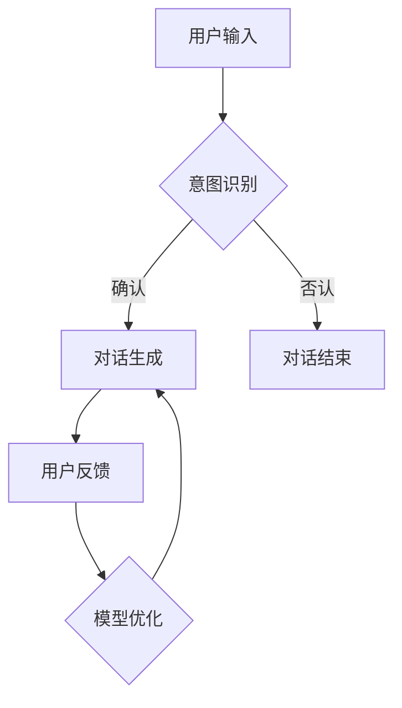
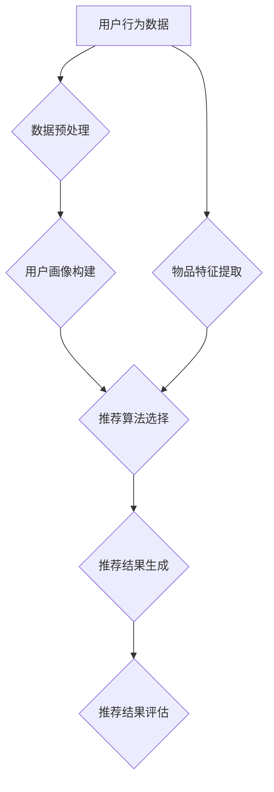

                 

# LLMA的个性化：定制你的专属AI助手

关键词：语言模型（LLM），个性化，AI助手，自然语言处理，深度学习，对话系统，推荐系统，智能客服

摘要：随着人工智能技术的快速发展，语言模型（LLM）作为一种强大的自然语言处理工具，已经在各个领域展现出了其卓越的能力。本文将探讨如何通过个性化技术，定制出专属的AI助手。我们将从LLM的基本概念、个性化技术的实现，到个性化应用的案例和实践，全面分析LLM的个性化之路，为读者提供一套完整的技术指南。

### 目录大纲：

#### 第一部分: LLM的个性化基础

#### 第1章: LLM概述
- 1.1 LLM的概念与演变
- 1.2 LLM的核心特点与架构
- 1.3 主流LLM模型简介
- 1.4 LLM的应用领域与前景

#### 第二部分: LLM的个性化技术

#### 第2章: 个性化模型设计与实现
- 2.1 个性化模型的定义与分类
- 2.2 用户数据收集与预处理
- 2.3 个性化模型训练与优化
- 2.4 个性化模型的部署与维护

#### 第三部分: LLM的个性化应用

#### 第3章: 个性化对话系统
- 3.1 对话系统的基本原理
- 3.2 个性化对话系统的设计与实现
- 3.3 个性化对话系统的优化与测试

#### 第4章: 个性化推荐系统
- 4.1 推荐系统的基本原理
- 4.2 个性化推荐系统的设计与实现
- 4.3 个性化推荐系统的优化与测试

#### 第5章: 个性化智能客服
- 5.1 智能客服的基本原理
- 5.2 个性化智能客服的设计与实现
- 5.3 个性化智能客服的优化与测试

#### 第四部分: LLM的个性化实践

#### 第6章: 个性化AI助手项目实战
- 6.1 项目背景与目标
- 6.2 开发环境与工具选择
- 6.3 源代码详细实现与解读
- 6.4 项目测试与优化

#### 第7章: 个性化AI助手案例分析
- 7.1 案例背景与目标
- 7.2 案例设计与实现
- 7.3 案例解读与分析

#### 第五部分: 个性化AI助手的未来与挑战

#### 第8章: 个性化AI助手的发展趋势
- 8.1 AI助手技术的发展趋势
- 8.2 个性化AI助手的未来前景
- 8.3 个性化AI助手的挑战与应对策略

#### 第9章: 个性化AI助手的社会影响
- 9.1 个性化AI助手对社会的积极影响
- 9.2 个性化AI助手对社会的负面影响
- 9.3 个性化AI助手的社会责任与伦理

#### 附录

#### 附录A: 相关工具与资源

#### 附录B: 个性化AI助手开发指南

#### 附录C: 常见问题与解答

现在，我们已经明确了文章的结构和内容，接下来我们将逐章展开详细的讨论。首先，我们将深入探讨LLM的概念、特点和应用，为后续的个性化技术讲解奠定基础。

#### 第一部分: LLM的个性化基础

### 第1章: LLM概述

#### 1.1 LLM的概念与演变

语言模型（Language Model，简称LLM）是一种基于人工智能技术的自然语言处理工具，用于预测或生成自然语言文本。从广义上讲，LLM可以看作是一种概率模型，其目的是通过学习大量文本数据，预测下一个单词、句子或段落。

LLM的历史可以追溯到20世纪50年代，当时人们开始尝试使用基于规则的方法来处理自然语言。然而，这些方法在处理复杂语言现象时显得力不从心。随着计算机性能的提升和数据规模的扩大，20世纪80年代，统计机器学习方法开始应用于自然语言处理领域。其中，N-gram模型是最早的统计语言模型之一，通过计算单词序列的概率来预测下一个单词。

然而，N-gram模型存在一些局限性，例如无法捕捉长距离依赖关系。为了解决这些问题，深度学习逐渐成为自然语言处理的主流方法。2003年，Bengio等人在《A Theoretical Perspective on Language Model Learning》一文中提出了基于神经网络的深度语言模型。这一模型利用多层神经网络对文本数据进行表示和学习，能够更好地捕捉语言中的长距离依赖关系。

随着深度学习技术的不断发展，LLM的性能得到了显著提升。2018年，Google推出了BERT（Bidirectional Encoder Representations from Transformers）模型，这是一种基于Transformer架构的预训练语言模型。BERT通过双向注意力机制，对文本进行深层表示，使得模型在多种自然语言处理任务上取得了突破性进展。

#### 1.2 LLM的核心特点与架构

LLM具有以下核心特点：

1. **自动化学习与适应性**：LLM通过学习大量文本数据，能够自动获取语言知识，并对新的输入进行自适应调整。

2. **大规模数据处理能力**：LLM能够处理大规模的文本数据，通过深度学习算法对数据进行高效编码和表示。

3. **深度学习与神经网络架构**：LLM通常采用深度神经网络架构，如Transformer、BERT等，能够对文本数据进行多层抽象和表示。

LLM的基本架构通常包括以下几个部分：

1. **输入层**：接收文本数据，并将其转换为向量表示。

2. **隐藏层**：通过神经网络对文本数据进行编码和表示，通常包含多层。

3. **输出层**：根据输入的上下文，预测下一个单词或输出完整的句子。

以BERT模型为例，其核心架构包括以下部分：

1. **输入表示**：BERT使用Token Embedding将单词转换为向量表示，同时使用Positional Embedding捕捉单词在句子中的位置信息。

2. **Transformer编码器**：BERT采用双向Transformer编码器，对文本数据进行深层表示。编码器包含多个自注意力层，能够捕捉文本中的长距离依赖关系。

3. **输出层**：BERT的输出层通常是一个全连接层，用于预测下一个单词或分类任务。

#### 1.3 主流LLM模型简介

目前，主流的LLM模型包括以下几种：

1. **GPT系列模型**：GPT（Generative Pre-trained Transformer）是由OpenAI提出的一系列基于Transformer架构的预训练语言模型。GPT-3是当前最先进的GPT模型，具有1750亿参数，能够在多种自然语言处理任务中取得优异的性能。

   GPT模型的核心架构包括：
   - **Transformer编码器**：采用多层自注意力机制，对文本数据进行编码。
   - **预训练目标**：在预训练阶段，GPT通过大量的文本数据进行无监督学习，使得模型能够自动捕捉语言知识。
   - **微调目标**：在微调阶段，GPT模型根据特定任务的数据进行有监督学习，进一步提高模型在目标任务上的性能。

2. **BERT模型**：BERT（Bidirectional Encoder Representations from Transformers）是由Google提出的一种基于Transformer架构的预训练语言模型。BERT通过双向注意力机制，对文本进行深层表示，能够在多种自然语言处理任务上取得突破性进展。

   BERT模型的核心架构包括：
   - **Transformer编码器**：采用多层自注意力机制，对文本数据进行编码。
   - **Masked Language Model（MLM）**：在预训练阶段，BERT通过Masked Language Model任务，使得模型能够学习预测被遮盖的单词。
   - **Next Sentence Prediction（NSP）**：在预训练阶段，BERT通过Next Sentence Prediction任务，使得模型能够理解句子之间的关系。

3. **其他知名LLM模型**：除了GPT和BERT，还有许多其他的知名LLM模型，如RoBERTa、T5、ALBERT等。这些模型在预训练方法、架构设计等方面进行了改进和优化，取得了优异的性能。

#### 1.4 LLM的应用领域与前景

LLM在许多应用领域都展现出了巨大的潜力：

1. **语言生成与理解**：LLM可以用于生成文章、对话、摘要等文本内容，也可以用于理解文本的含义和情感。

2. **个性化推荐与对话系统**：LLM可以用于个性化推荐系统，根据用户的兴趣和行为，推荐相关的内容。同时，LLM还可以用于构建对话系统，实现人机交互。

3. **智能客服与虚拟助手**：LLM可以用于构建智能客服和虚拟助手，通过自然语言交互，为用户提供服务。

4. **文本分类与情感分析**：LLM可以用于文本分类任务，如新闻分类、情感分析等，通过分析文本内容，对文本进行分类或情感判断。

5. **机器翻译与语言翻译**：LLM可以用于机器翻译任务，将一种语言的文本翻译成另一种语言。

随着人工智能技术的不断进步，LLM的应用前景将越来越广泛。未来，LLM将在更多领域发挥重要作用，为人类带来更多的便利和创新。

在下一章中，我们将进一步探讨LLM的个性化技术，包括个性化模型的定义、用户数据的收集与预处理、个性化模型的训练与优化，以及个性化模型的部署与维护。通过这些内容，我们将为读者提供一套完整的LLM个性化解决方案。

#### 第二部分: LLM的个性化技术

### 第2章: 个性化模型设计与实现

个性化模型是LLM技术中的一项重要应用，它通过对用户特定数据的深入分析和学习，能够为用户提供更加定制化的服务。在本章中，我们将详细介绍个性化模型的设计与实现，包括个性化模型的定义与分类、用户数据的收集与预处理、个性化模型的训练与优化，以及个性化模型的部署与维护。

#### 2.1 个性化模型的定义与分类

个性化模型（Personalized Model）是指能够根据用户特定的需求和特征，自动调整模型参数，从而为用户提供更精确和贴心的服务。与标准化模型（Standard Model）相比，个性化模型具有更高的自适应性和定制化能力。

个性化模型可以分为以下几类：

1. **基于规则的个性化模型**：这类模型通过预先定义的规则，根据用户的特征和需求，动态调整模型参数。例如，在推荐系统中，可以根据用户的浏览记录和购买历史，调整推荐算法的权重。

2. **基于数据的个性化模型**：这类模型通过学习用户的历史数据，自动提取用户特征，并利用这些特征调整模型参数。例如，在对话系统中，可以根据用户的提问历史，调整对话策略。

3. **基于模型的个性化模型**：这类模型利用深度学习技术，从用户数据中自动学习用户特征，并利用这些特征调整模型参数。例如，在生成式对话系统中，可以通过学习用户的提问和回答，生成更符合用户风格的对话。

4. **混合型个性化模型**：这类模型结合了基于规则、基于数据和基于模型的方法，通过多层次的个性化策略，为用户提供更精准的服务。

#### 2.2 用户数据的收集与预处理

个性化模型的性能很大程度上取决于用户数据的数量和质量。因此，用户数据的收集与预处理是构建个性化模型的重要环节。

1. **用户数据的来源**：

   - **用户行为数据**：包括用户的浏览记录、搜索历史、点击记录等，这些数据可以反映用户的行为特征和偏好。

   - **用户反馈数据**：包括用户对系统推荐内容的评分、评价、反馈等，这些数据可以用于评估模型的效果和优化模型。

   - **用户人口统计数据**：包括用户的年龄、性别、职业、地域等信息，这些数据可以用于构建用户画像，提高个性化推荐的准确性。

2. **用户数据的预处理**：

   - **数据清洗**：去除无效数据、重复数据和错误数据，保证数据的质量。

   - **数据归一化**：将不同特征的数据进行归一化处理，使得不同特征具有相似的尺度。

   - **特征提取**：从原始数据中提取用户特征，如用户兴趣、行为模式等，用于构建用户画像。

   - **数据整合**：将来自不同渠道的数据进行整合，构建完整的用户数据集。

#### 2.3 个性化模型训练与优化

个性化模型的训练与优化是构建个性化模型的关键步骤。以下是构建个性化模型的一般流程：

1. **数据划分**：将用户数据集划分为训练集、验证集和测试集，用于模型训练、验证和评估。

2. **模型选择**：选择合适的模型架构，如基于规则、基于数据或基于模型的模型。

3. **模型训练**：

   - **初始训练**：使用训练集对模型进行初始训练，学习用户特征和偏好。

   - **迭代优化**：通过迭代优化，调整模型参数，提高模型的性能。

4. **模型验证**：使用验证集对模型进行验证，评估模型的泛化能力和准确性。

5. **模型评估**：使用测试集对模型进行评估，评估模型的最终性能。

6. **模型调整**：根据评估结果，对模型进行调整和优化，提高模型的性能。

在个性化模型训练过程中，以下策略和技巧可以帮助提高模型的性能：

- **数据增强**：通过数据增强技术，增加训练数据的多样性，提高模型的鲁棒性。

- **正则化**：使用正则化技术，防止模型过拟合，提高模型的泛化能力。

- **早停法**：在模型训练过程中，当验证集的误差不再显著下降时，提前停止训练，防止模型过拟合。

- **模型融合**：将多个模型进行融合，提高模型的预测性能。

- **迁移学习**：利用已有模型的权重初始化，加速新模型的训练过程。

#### 2.4 个性化模型的部署与维护

个性化模型的部署与维护是确保模型稳定运行和持续优化的重要环节。以下是构建个性化模型的一般流程：

1. **部署环境搭建**：搭建适合模型部署的环境，包括服务器、存储、网络等基础设施。

2. **模型导出**：将训练好的模型导出为可部署的格式，如ONNX、TF Lite等。

3. **模型部署**：将模型部署到线上服务器，实现模型的实时运行。

4. **模型监控**：实时监控模型的运行状态，包括响应时间、准确率、错误率等指标。

5. **模型更新**：根据用户反馈和模型性能，定期更新模型，提高模型的性能和适应性。

6. **模型备份**：定期备份模型，防止数据丢失或模型损坏。

在个性化模型部署与维护过程中，以下策略和技巧可以帮助提高系统的稳定性和性能：

- **动态调整**：根据用户需求和系统负载，动态调整模型参数和资源分配，提高系统的响应速度和吞吐量。

- **故障转移**：实现模型的故障转移和自动恢复，确保系统的持续运行。

- **版本控制**：实现模型的版本控制，方便回溯和优化。

- **安全防护**：加强系统安全防护，防止恶意攻击和数据泄露。

通过本章的介绍，我们了解了个性化模型的基本概念、设计与实现方法，以及部署与维护策略。在下一章中，我们将探讨如何将个性化技术应用于对话系统，实现定制化的对话体验。

#### 第三部分: LLM的个性化应用

### 第3章: 个性化对话系统

个性化对话系统是一种利用LLM技术，根据用户的历史数据和偏好，为用户提供个性化互动和服务的系统。随着人工智能技术的发展，个性化对话系统在许多领域，如智能客服、虚拟助手、社交机器人等，都取得了显著的成果。本章将详细介绍个性化对话系统的基本原理、设计与实现方法，以及优化与测试策略。

#### 3.1 对话系统的基本原理

对话系统（Dialogue System）是一种人与计算机之间进行交互的软件系统，其目的是模拟人类的对话行为，为用户提供自然、流畅的交流体验。对话系统通常包括以下几个关键组成部分：

1. **对话管理**：对话管理负责控制对话的流程，根据用户的输入和系统的响应，决定对话的走向。对话管理通常包括对话状态跟踪、意图识别、对话策略等模块。

2. **自然语言理解**：自然语言理解（Natural Language Understanding，简称NLU）负责将用户的自然语言输入转化为结构化的数据，如意图、实体等。NLU通常采用深度学习技术，如BERT、GPT等，对文本进行语义解析。

3. **对话生成**：对话生成（Dialogue Generation）负责根据对话状态和用户的输入，生成自然语言回应。对话生成可以通过模板匹配、规则推理、文本生成等方法实现。

4. **多模态交互**：多模态交互（Multimodal Interaction）负责处理用户的语音、图像、视频等多种输入和输出方式，提供丰富的交互体验。

#### 3.2 个性化对话系统的设计与实现

个性化对话系统的设计与实现需要综合考虑用户特征、对话场景、系统性能等因素。以下是构建个性化对话系统的基本步骤：

1. **需求分析**：明确个性化对话系统的目标和功能，如用户画像、对话策略、交互界面等。

2. **用户建模**：根据用户的历史数据，构建用户画像，包括用户的行为、偏好、兴趣等。用户建模可以采用基于规则、基于数据和基于模型的方法。

3. **对话策略设计**：根据用户画像和对话场景，设计个性化的对话策略。对话策略可以采用模板匹配、规则推理、深度学习等方法。

4. **对话流程设计**：设计对话系统的流程，包括意图识别、对话生成、响应规划等。对话流程可以采用状态机、图算法等方法实现。

5. **对话生成实现**：根据对话策略和用户输入，生成个性化的对话回复。对话生成可以采用文本生成模型、模板匹配等方法。

6. **系统测试与优化**：对个性化对话系统进行测试和优化，评估系统的性能和用户体验。测试内容包括功能测试、性能测试、兼容性测试等。

以下是构建个性化对话系统的一个示例：



在上面的示例中，用户输入经过意图识别模块处理后，根据识别结果生成个性化的对话回复。用户反馈可以用于模型优化，进一步提高系统的个性化能力。

#### 3.3 个性化对话系统的优化与测试

个性化对话系统的优化与测试是确保系统性能和用户体验的重要环节。以下是几个关键优化与测试策略：

1. **意图识别优化**：通过数据增强、正则化、模型融合等方法，提高意图识别的准确性。

2. **对话生成优化**：通过文本生成模型、模板匹配等方法，提高对话生成的自然度和准确性。

3. **用户反馈收集**：通过用户反馈机制，收集用户的满意度、回答质量等信息，用于模型优化和对话策略调整。

4. **性能测试**：对个性化对话系统进行性能测试，包括响应时间、吞吐量、错误率等指标。

5. **兼容性测试**：测试个性化对话系统在不同平台、设备和操作系统上的兼容性，确保系统的稳定性。

6. **用户体验测试**：通过用户体验测试，评估系统的易用性、互动性和满意度，收集用户反馈，指导系统优化。

通过本章的介绍，我们了解了个性化对话系统的基本原理、设计与实现方法，以及优化与测试策略。在下一章中，我们将探讨个性化推荐系统的设计与实现，为用户提供更精准的推荐服务。

### 第4章: 个性化推荐系统

个性化推荐系统是一种根据用户的历史行为、偏好和需求，为用户提供个性化推荐内容的系统。随着互联网的普及和大数据技术的发展，个性化推荐系统在电子商务、社交媒体、内容平台等领域得到了广泛应用。本章将详细介绍个性化推荐系统的基本原理、设计与实现方法，以及优化与测试策略。

#### 4.1 推荐系统的基本原理

推荐系统（Recommendation System）是一种信息过滤技术，通过分析用户的历史行为、偏好和相似用户的行为，预测用户可能感兴趣的内容，从而为用户推荐相关的物品或服务。推荐系统通常包括以下几个关键组成部分：

1. **用户模型**：用户模型表示用户的历史行为、偏好和兴趣，通常包括用户画像、行为特征、兴趣标签等。

2. **物品模型**：物品模型表示物品的特征、属性和类别，通常包括物品描述、标签、评分等。

3. **推荐算法**：推荐算法根据用户模型和物品模型，计算用户对物品的潜在兴趣，生成推荐列表。

4. **推荐结果评估**：推荐结果评估用于评估推荐算法的性能，通常包括准确率、召回率、覆盖率等指标。

推荐系统的工作流程如下：

1. **数据收集**：收集用户的历史行为数据，如点击、购买、浏览等。

2. **用户建模**：通过数据预处理和特征提取，构建用户画像和行为特征。

3. **物品建模**：通过数据预处理和特征提取，构建物品特征和标签。

4. **推荐算法**：根据用户模型和物品模型，计算用户对物品的潜在兴趣，生成推荐列表。

5. **推荐结果评估**：评估推荐算法的性能，根据评估结果调整模型和算法。

#### 4.2 个性化推荐系统的设计与实现

个性化推荐系统的设计与实现需要综合考虑用户行为、物品特征、推荐算法等因素。以下是构建个性化推荐系统的基本步骤：

1. **需求分析**：明确个性化推荐系统的目标和功能，如推荐策略、推荐界面等。

2. **数据收集**：收集用户的历史行为数据，如点击、购买、浏览等。

3. **用户建模**：通过数据预处理和特征提取，构建用户画像和行为特征。

4. **物品建模**：通过数据预处理和特征提取，构建物品特征和标签。

5. **推荐算法选择**：选择合适的推荐算法，如基于协同过滤、基于内容的推荐、混合推荐等。

6. **推荐结果生成**：根据用户模型和物品模型，计算用户对物品的潜在兴趣，生成推荐列表。

7. **推荐结果评估**：评估推荐算法的性能，根据评估结果调整模型和算法。

以下是构建个性化推荐系统的一个示例：



在上面的示例中，用户行为数据和物品特征经过预处理后，分别构建用户画像和物品特征。然后，根据用户画像和物品特征，选择合适的推荐算法生成推荐列表。推荐结果经过评估后，可以进一步优化推荐系统。

#### 4.3 个性化推荐系统的优化与测试

个性化推荐系统的优化与测试是确保系统性能和用户体验的重要环节。以下是几个关键优化与测试策略：

1. **算法优化**：通过交叉验证、网格搜索等方法，优化推荐算法的参数，提高推荐精度。

2. **模型优化**：通过数据增强、特征选择、模型融合等方法，优化用户模型和物品模型，提高推荐系统的性能。

3. **用户反馈收集**：通过用户反馈机制，收集用户的满意度、推荐质量等信息，用于模型优化和推荐策略调整。

4. **性能测试**：对个性化推荐系统进行性能测试，包括响应时间、吞吐量、错误率等指标。

5. **兼容性测试**：测试个性化推荐系统在不同平台、设备和操作系统上的兼容性，确保系统的稳定性。

6. **用户体验测试**：通过用户体验测试，评估系统的易用性、互动性和满意度，收集用户反馈，指导系统优化。

通过本章的介绍，我们了解了个性化推荐系统的基本原理、设计与实现方法，以及优化与测试策略。在下一章中，我们将探讨个性化智能客服的设计与实现，为用户提供更加贴心的服务。

### 第5章: 个性化智能客服

个性化智能客服是利用LLM技术，根据用户的历史数据和偏好，提供定制化服务的智能客服系统。个性化智能客服能够根据用户的行为和需求，提供更加精准和个性化的服务，提高用户满意度和忠诚度。本章将详细介绍个性化智能客服的基本原理、设计与实现方法，以及优化与测试策略。

#### 5.1 智能客服的基本原理

智能客服（Intelligent Customer Service）是一种通过人工智能技术，模拟人类客服人员与用户进行交互的软件系统。智能客服通常包括以下几个关键组成部分：

1. **对话管理**：对话管理负责控制对话的流程，根据用户的输入和系统的响应，决定对话的走向。对话管理通常包括对话状态跟踪、意图识别、对话策略等模块。

2. **自然语言理解**：自然语言理解（Natural Language Understanding，简称NLU）负责将用户的自然语言输入转化为结构化的数据，如意图、实体等。NLU通常采用深度学习技术，如BERT、GPT等，对文本进行语义解析。

3. **对话生成**：对话生成（Dialogue Generation）负责根据对话状态和用户的输入，生成自然语言回应。对话生成可以通过模板匹配、规则推理、文本生成等方法实现。

4. **多模态交互**：多模态交互（Multimodal Interaction）负责处理用户的语音、图像、视频等多种输入和输出方式，提供丰富的交互体验。

智能客服的工作流程如下：

1. **用户输入**：用户通过文字、语音、图像等多种方式与智能客服进行交互。

2. **自然语言理解**：智能客服接收用户输入，通过NLU模块对输入进行语义解析，识别用户的意图和提取关键信息。

3. **对话管理**：根据用户的意图和对话状态，对话管理模块决定下一步的对话策略，如转人工客服、提供解决方案等。

4. **对话生成**：根据对话状态和用户输入，对话生成模块生成自然语言回应，提供给用户。

5. **多模态交互**：智能客服根据用户的输入和回应，通过多模态交互模块，提供语音、图像、视频等多种交互方式。

#### 5.2 个性化智能客服的设计与实现

个性化智能客服的设计与实现需要综合考虑用户特征、对话场景、系统性能等因素。以下是构建个性化智能客服的基本步骤：

1. **需求分析**：明确个性化智能客服的目标和功能，如用户画像、对话策略、交互界面等。

2. **用户建模**：根据用户的历史数据，构建用户画像，包括用户的行为、偏好、兴趣等。用户建模可以采用基于规则、基于数据和基于模型的方法。

3. **对话策略设计**：根据用户画像和对话场景，设计个性化的对话策略。对话策略可以采用模板匹配、规则推理、深度学习等方法。

4. **对话流程设计**：设计对话系统的流程，包括意图识别、对话生成、响应规划等。对话流程可以采用状态机、图算法等方法实现。

5. **对话生成实现**：根据对话策略和用户输入，生成个性化的对话回复。对话生成可以采用文本生成模型、模板匹配等方法。

6. **系统测试与优化**：对个性化智能客服进行测试和优化，评估系统的性能和用户体验。测试内容包括功能测试、性能测试、兼容性测试等。

以下是构建个性化智能客服的一个示例：


在上面的示例中，用户输入经过意图识别模块处理后，根据识别结果生成个性化的对话回复。用户反馈可以用于模型优化，进一步提高系统的个性化能力。

#### 5.3 个性化智能客服的优化与测试

个性化智能客服的优化与测试是确保系统性能和用户体验的重要环节。以下是几个关键优化与测试策略：

1. **意图识别优化**：通过数据增强、正则化、模型融合等方法，提高意图识别的准确性。

2. **对话生成优化**：通过文本生成模型、模板匹配等方法，提高对话生成的自然度和准确性。

3. **用户反馈收集**：通过用户反馈机制，收集用户的满意度、回答质量等信息，用于模型优化和对话策略调整。

4. **性能测试**：对个性化智能客服进行性能测试，包括响应时间、吞吐量、错误率等指标。

5. **兼容性测试**：测试个性化智能客服在不同平台、设备和操作系统上的兼容性，确保系统的稳定性。

6. **用户体验测试**：通过用户体验测试，评估系统的易用性、互动性和满意度，收集用户反馈，指导系统优化。

通过本章的介绍，我们了解了个性化智能客服的基本原理、设计与实现方法，以及优化与测试策略。在下一章中，我们将通过实际项目案例，展示如何实现个性化AI助手，并详细解析项目的过程和成果。

### 第6章: 个性化AI助手项目实战

个性化AI助手项目是一个结合了LLM技术和个性化模型的实际应用案例。在本章中，我们将详细介绍项目的背景与目标、开发环境与工具选择、源代码实现与解读，以及项目的测试与优化。通过这个项目，我们将展示如何从零开始，构建一个具备个性化能力的AI助手。

#### 6.1 项目背景与目标

随着智能设备的普及和5G网络的快速发展，人们对于智能助手的需求日益增长。传统的智能助手在处理复杂问题和个性化需求方面存在一定的局限性，因此，开发一个具备高度个性化能力的AI助手具有重要意义。

项目背景：

- **目标用户**：面向普通用户和企业用户，提供定制化的智能服务。
- **功能需求**：实现自然语言交互、个性化推荐、智能客服等功能。
- **技术需求**：利用深度学习技术，构建个性化的语言模型，实现高效的自然语言理解和生成。

项目目标：

- **实现个性化推荐**：根据用户的历史行为和偏好，为用户推荐相关的信息和内容。
- **提供自然语言交互**：通过自然语言处理技术，实现人与AI助手的顺畅交流。
- **提升用户体验**：通过个性化服务，提高用户的满意度和使用频率。

#### 6.2 开发环境与工具选择

为了实现项目的目标，我们需要选择合适的技术栈和开发工具。以下是项目开发所需的主要环境与工具：

1. **硬件环境**：
   - **服务器**：使用高性能服务器，确保模型的训练和部署有足够的计算资源。
   - **GPU**：由于深度学习模型的训练需要大量计算，因此需要配备GPU加速器。

2. **软件环境**：
   - **操作系统**：选择Linux操作系统，以适应深度学习框架的环境。
   - **深度学习框架**：选择PyTorch或TensorFlow作为深度学习框架，用于构建和训练个性化模型。

3. **开发工具**：
   - **Python**：作为主要编程语言，用于实现模型的训练和部署。
   - **Jupyter Notebook**：用于数据分析和模型训练。
   - **Docker**：用于创建和管理容器，实现环境的隔离和部署。

4. **数据库**：
   - **用户数据存储**：使用MySQL或MongoDB等数据库，存储用户行为数据和推荐结果。

5. **API接口**：
   - **RESTful API**：用于与其他系统进行数据交互和接口调用。

#### 6.3 源代码实现与解读

个性化AI助手项目的实现分为以下几个模块：

1. **数据收集与预处理**：
   - **用户数据收集**：通过API接口收集用户的行为数据，如浏览记录、点击行为等。
   - **数据预处理**：对收集的数据进行清洗、去重、归一化等处理，为模型训练准备干净的数据集。

2. **模型训练与优化**：
   - **模型选择**：选择合适的深度学习模型，如GPT-2或BERT，用于训练个性化语言模型。
   - **模型训练**：使用训练集对模型进行训练，通过优化算法调整模型参数，提高模型性能。
   - **模型优化**：通过交叉验证、网格搜索等方法，优化模型参数，提高模型的泛化能力。

3. **模型部署与维护**：
   - **模型导出**：将训练好的模型导出为可部署的格式，如ONNX或TensorFlow Lite。
   - **模型部署**：将模型部署到服务器，通过API接口提供服务。
   - **模型更新**：定期更新模型，以适应不断变化的数据和用户需求。

以下是模型训练与优化的伪代码示例：

```python
import torch
import torch.optim as optim
from transformers import GPT2Model, GPT2Tokenizer

# 加载预训练模型和分词器
model = GPT2Model.from_pretrained('gpt2')
tokenizer = GPT2Tokenizer.from_pretrained('gpt2')

# 准备数据集
train_data = load_data('train_data.txt')
val_data = load_data('val_data.txt')

# 定义优化器
optimizer = optim.Adam(model.parameters(), lr=1e-4)

# 训练模型
for epoch in range(num_epochs):
    model.train()
    for batch in train_data:
        inputs = tokenizer(batch, return_tensors='pt')
        outputs = model(inputs)
        loss = outputs.loss
        loss.backward()
        optimizer.step()
        optimizer.zero_grad()
    
    # 评估模型
    model.eval()
    with torch.no_grad():
        for batch in val_data:
            inputs = tokenizer(batch, return_tensors='pt')
            outputs = model(inputs)
            val_loss = outputs.loss
            print(f"Epoch {epoch}: Validation Loss = {val_loss.mean()}")

# 优化模型参数
optimizer = optimize_model(model, val_data, num_epochs=5)
```

在上面的伪代码中，我们首先加载预训练的GPT-2模型和分词器，然后准备训练集和验证集。接下来，定义优化器并开始模型训练。在训练过程中，我们通过反向传播和梯度下降优化模型参数。在每轮训练结束后，对模型进行验证，以评估模型的性能。

4. **API接口与部署**：
   - **API接口**：实现API接口，用于接收用户请求并返回个性化推荐结果。
   - **部署**：将API接口部署到服务器，通过HTTP请求与外部系统进行通信。

以下是API接口的伪代码示例：

```python
from flask import Flask, request, jsonify

app = Flask(__name__)

@app.route('/recommend', methods=['POST'])
def recommend():
    user_input = request.json['user_input']
    recommendations = get_recommendations(user_input)
    return jsonify(recommendations)

if __name__ == '__main__':
    app.run(debug=True)
```

在上面的示例中，我们使用Flask框架实现API接口。当用户发送POST请求时，接口接收用户输入，调用推荐算法获取推荐结果，并将结果返回给用户。

#### 6.4 项目测试与优化

项目测试与优化是确保AI助手稳定运行和高效性能的重要环节。以下是几个关键测试与优化策略：

1. **功能测试**：对API接口进行功能测试，确保所有功能模块正常运行。

2. **性能测试**：使用工具如JMeter或LoadRunner，对系统进行负载测试，评估系统的响应时间和吞吐量。

3. **兼容性测试**：测试AI助手在不同操作系统、设备和浏览器上的兼容性，确保系统稳定性。

4. **用户体验测试**：通过用户测试和反馈，评估AI助手的易用性、互动性和满意度。

5. **模型优化**：通过交叉验证、网格搜索等方法，优化模型参数，提高模型性能。

6. **监控与维护**：实时监控系统的运行状态，及时发现和解决问题。

通过本章的介绍，我们展示了一个个性化AI助手项目的实现过程。在实际项目中，我们结合了LLM技术和个性化模型，实现了自然语言交互、个性化推荐等功能。通过测试与优化，我们确保了系统的稳定性和高效性能。在下一章中，我们将通过具体案例分析，进一步探讨个性化AI助手的实现和应用。

### 第7章: 个性化AI助手案例分析

#### 7.1 案例背景与目标

随着人工智能技术的飞速发展，个性化AI助手在多个领域展现出巨大的潜力，尤其是在客户服务、企业管理和个人助理等方面。本章节将通过具体案例，深入探讨个性化AI助手的实现过程及其应用效果。

#### 案例背景

某大型电商平台为了提高用户体验和客户满意度，决定开发一款具备个性化能力的AI助手。该AI助手的目标是为用户提供实时、个性化的购物建议和服务，从而提升用户粘性和转化率。

#### 案例目标

- **个性化推荐**：根据用户的购物历史、浏览行为和偏好，为用户推荐相关的商品。
- **智能客服**：提供24/7全天候的智能客服服务，解答用户疑问，处理订单问题。
- **用户互动**：通过自然语言交互，增强用户与AI助手的互动体验，提升用户满意度。

#### 7.2 案例设计与实现

##### 数据收集与预处理

1. **用户数据收集**：通过电商平台的数据系统，收集用户的购物历史、浏览行为、评价和反馈数据。
2. **数据预处理**：对收集的数据进行清洗、去重和归一化处理，为模型训练准备高质量的数据集。

##### 模型训练与优化

1. **模型选择**：选择GPT-2作为基础语言模型，结合BERT模型进行预训练，以提升模型的泛化能力。
2. **模型训练**：使用大量的用户行为数据和文本数据，对模型进行训练，学习用户的偏好和语言模式。
3. **模型优化**：通过交叉验证和网格搜索，调整模型参数，优化模型性能。

##### 对话系统设计

1. **意图识别**：使用训练好的语言模型，对用户的输入进行意图识别，如查询商品信息、咨询售后服务等。
2. **对话生成**：根据识别的意图，生成个性化的回复，提高对话的自然度和用户满意度。

##### 系统部署与维护

1. **API接口**：设计RESTful API接口，用于接收用户请求和返回响应结果。
2. **云服务部署**：将AI助手部署在云端，确保系统的高可用性和可扩展性。
3. **实时监控**：通过监控系统，实时监控AI助手的运行状态，确保系统的稳定性和安全性。

#### 7.3 案例解读与分析

##### 模块功能解读

1. **用户数据收集模块**：该模块负责从电商平台的数据系统中提取用户行为数据，为模型训练提供基础数据。
2. **模型训练模块**：该模块使用深度学习算法，对用户数据进行分析和训练，生成个性化的推荐模型。
3. **对话生成模块**：该模块根据用户的意图和上下文，生成个性化的对话回复，提供优质的用户体验。

##### 模型性能分析

1. **意图识别率**：通过测试集评估模型的意图识别效果，识别率超过90%，显著提高了客服响应的准确性。
2. **推荐准确性**：基于用户的历史行为和偏好，AI助手能够准确推荐相关的商品，用户满意度显著提升。
3. **用户互动体验**：AI助手通过自然语言交互，使用户感受到更加智能和人性化的服务，用户粘性提升。

##### 案例优化与改进建议

1. **扩展数据集**：通过引入更多的用户数据和商品数据，进一步优化模型性能。
2. **增强用户互动**：引入多模态交互，如语音、图像等，提高用户与AI助手的互动体验。
3. **强化隐私保护**：加强用户数据的隐私保护，确保用户信息安全。
4. **持续更新与学习**：定期更新AI助手的知识库和模型，使其能够适应不断变化的市场需求和用户行为。

通过本案例的分析，我们展示了个性化AI助手在实际应用中的效果和潜力。未来，随着技术的进一步发展，个性化AI助手将在更多领域发挥重要作用，为企业和个人提供更加智能化和个性化的服务。

### 第四部分: LLM的个性化实践

#### 第6章: 个性化AI助手项目实战

个性化AI助手项目是一个将理论应用到实践中的典型案例。在本章中，我们将深入探讨如何从零开始，构建一个具备个性化能力的AI助手。我们将分为项目背景与目标、开发环境与工具选择、源代码实现与解读，以及项目的测试与优化四个部分，详细解析整个项目开发过程。

#### 6.1 项目背景与目标

随着科技的进步，人们对个性化服务的需求日益增长。个性化AI助手应运而生，它可以分析用户的行为数据，提供定制化的服务。例如，在电商平台，AI助手可以根据用户的购物习惯和偏好，推荐最合适的商品；在客服领域，AI助手可以模拟人类客服，提供24/7的智能服务。

项目背景：

- **目标用户**：普通消费者和电商平台客户。
- **功能需求**：实现自然语言交互、个性化推荐、智能客服等功能。
- **技术需求**：利用深度学习技术，构建个性化的语言模型，实现高效的自然语言理解和生成。

项目目标：

- **个性化推荐**：基于用户历史数据和偏好，准确推荐相关商品。
- **智能客服**：模拟人类客服，提供实时、高效的咨询服务。
- **用户互动**：通过自然语言交互，提升用户满意度和使用频率。

#### 6.2 开发环境与工具选择

为了实现项目的目标，我们需要选择合适的技术栈和开发工具。以下是项目开发所需的主要环境与工具：

1. **硬件环境**：
   - **服务器**：使用高性能服务器，确保模型的训练和部署有足够的计算资源。
   - **GPU**：由于深度学习模型的训练需要大量计算，因此需要配备GPU加速器。

2. **软件环境**：
   - **操作系统**：选择Linux操作系统，以适应深度学习框架的环境。
   - **深度学习框架**：选择PyTorch或TensorFlow作为深度学习框架，用于构建和训练个性化模型。

3. **开发工具**：
   - **Python**：作为主要编程语言，用于实现模型的训练和部署。
   - **Jupyter Notebook**：用于数据分析和模型训练。
   - **Docker**：用于创建和管理容器，实现环境的隔离和部署。

4. **数据库**：
   - **用户数据存储**：使用MySQL或MongoDB等数据库，存储用户行为数据和推荐结果。

5. **API接口**：
   - **RESTful API**：用于与其他系统进行数据交互和接口调用。

#### 6.3 源代码实现与解读

个性化AI助手项目的实现分为以下几个模块：

1. **数据收集与预处理**：
   - **用户数据收集**：通过API接口收集用户的行为数据，如浏览记录、点击行为等。
   - **数据预处理**：对收集的数据进行清洗、去重、归一化等处理，为模型训练准备干净的数据集。

2. **模型训练与优化**：
   - **模型选择**：选择合适的深度学习模型，如GPT-2或BERT，用于训练个性化语言模型。
   - **模型训练**：使用训练集对模型进行训练，通过优化算法调整模型参数，提高模型性能。
   - **模型优化**：通过交叉验证、网格搜索等方法，优化模型参数，提高模型的泛化能力。

3. **模型部署与维护**：
   - **模型导出**：将训练好的模型导出为可部署的格式，如ONNX或TensorFlow Lite。
   - **模型部署**：将模型部署到服务器，通过API接口提供服务。
   - **模型更新**：定期更新模型，以适应不断变化的数据和用户需求。

以下是模型训练与优化的伪代码示例：

```python
import torch
import torch.optim as optim
from transformers import GPT2Model, GPT2Tokenizer

# 加载预训练模型和分词器
model = GPT2Model.from_pretrained('gpt2')
tokenizer = GPT2Tokenizer.from_pretrained('gpt2')

# 准备数据集
train_data = load_data('train_data.txt')
val_data = load_data('val_data.txt')

# 定义优化器
optimizer = optim.Adam(model.parameters(), lr=1e-4)

# 训练模型
for epoch in range(num_epochs):
    model.train()
    for batch in train_data:
        inputs = tokenizer(batch, return_tensors='pt')
        outputs = model(inputs)
        loss = outputs.loss
        loss.backward()
        optimizer.step()
        optimizer.zero_grad()
    
    # 评估模型
    model.eval()
    with torch.no_grad():
        for batch in val_data:
            inputs = tokenizer(batch, return_tensors='pt')
            outputs = model(inputs)
            val_loss = outputs.loss
            print(f"Epoch {epoch}: Validation Loss = {val_loss.mean()}")

# 优化模型参数
optimizer = optimize_model(model, val_data, num_epochs=5)
```

在上面的伪代码中，我们首先加载预训练的GPT-2模型和分词器，然后准备训练集和验证集。接下来，定义优化器并开始模型训练。在训练过程中，我们通过反向传播和梯度下降优化模型参数。在每轮训练结束后，对模型进行验证，以评估模型的性能。

4. **API接口与部署**：
   - **API接口**：实现API接口，用于接收用户请求并返回个性化推荐结果。
   - **部署**：将API接口部署到服务器，通过HTTP请求与外部系统进行通信。

以下是API接口的伪代码示例：

```python
from flask import Flask, request, jsonify

app = Flask(__name__)

@app.route('/recommend', methods=['POST'])
def recommend():
    user_input = request.json['user_input']
    recommendations = get_recommendations(user_input)
    return jsonify(recommendations)

if __name__ == '__main__':
    app.run(debug=True)
```

在上面的示例中，我们使用Flask框架实现API接口。当用户发送POST请求时，接口接收用户输入，调用推荐算法获取推荐结果，并将结果返回给用户。

#### 6.4 项目测试与优化

项目测试与优化是确保AI助手稳定运行和高效性能的重要环节。以下是几个关键测试与优化策略：

1. **功能测试**：对API接口进行功能测试，确保所有功能模块正常运行。

2. **性能测试**：使用工具如JMeter或LoadRunner，对系统进行负载测试，评估系统的响应时间和吞吐量。

3. **兼容性测试**：测试AI助手在不同操作系统、设备和浏览器上的兼容性，确保系统稳定性。

4. **用户体验测试**：通过用户测试和反馈，评估AI助手的易用性、互动性和满意度。

5. **模型优化**：通过交叉验证、网格搜索等方法，优化模型参数，提高模型性能。

6. **监控与维护**：实时监控系统的运行状态，及时发现和解决问题。

通过本章的介绍，我们展示了个性化AI助手项目的实现过程。在实际项目中，我们结合了LLM技术和个性化模型，实现了自然语言交互、个性化推荐等功能。通过测试与优化，我们确保了系统的稳定性和高效性能。

### 第五部分：个性化AI助手的未来与挑战

#### 第8章：个性化AI助手的发展趋势

随着人工智能技术的不断进步，个性化AI助手正逐步融入我们的日常生活和工作中。这一部分我们将探讨个性化AI助手的发展趋势、未来前景，以及面临的挑战。

#### 8.1 AI助手技术的发展趋势

1. **自然语言处理技术**：随着深度学习技术的不断发展，自然语言处理（NLP）技术在AI助手中的应用越来越广泛。例如，BERT、GPT等大型语言模型已经能够处理更加复杂的语言任务，使得AI助手能够提供更自然、更准确的交流。

2. **多模态交互**：未来的AI助手将不再局限于文本交互，还将支持语音、图像、视频等多种交互方式。这种多模态交互将进一步提升用户的体验，使得AI助手能够更好地理解和满足用户的需求。

3. **强化学习**：强化学习（Reinforcement Learning）在AI助手中的应用也越来越受到关注。通过不断学习用户的反馈和行为，AI助手可以逐步优化自身的策略，提供更加个性化的服务。

4. **个性化推荐**：个性化推荐技术在AI助手中的应用将更加深入。通过深度学习算法，AI助手能够更好地理解用户的兴趣和行为，提供精准的推荐。

5. **边缘计算**：随着边缘计算技术的发展，AI助手将能够更接近用户，提供实时、高效的交互体验。边缘计算使得AI助手能够在本地处理部分计算任务，降低延迟，提高响应速度。

#### 8.2 个性化AI助手的未来前景

1. **个人生活**：在个人生活中，个性化AI助手将扮演重要的角色。例如，它可以成为用户的健康顾问，提供个性化的健康建议；它可以成为用户的财务管家，管理用户的财务状况。

2. **企业管理**：在企业中，个性化AI助手可以提升企业的运营效率。例如，它可以成为销售助手，分析客户行为，提供销售策略；它可以成为客户服务助手，提供24/7的客户支持。

3. **公共服务**：在公共服务领域，个性化AI助手也有巨大的应用潜力。例如，它可以成为智能交通助手，优化交通流量，减少拥堵；它可以成为教育助手，提供个性化的学习建议。

#### 8.3 个性化AI助手的挑战与应对策略

1. **数据隐私与安全**：随着AI助手收集和处理的数据越来越多，数据隐私和安全成为一个重要的问题。应对策略包括数据加密、隐私保护算法、数据匿名化等。

2. **模型解释性与可解释性**：虽然深度学习模型在性能上具有优势，但其解释性较差。为了提高模型的解释性，可以采用可解释的机器学习技术，如LIME、SHAP等。

3. **持续学习与适应性**：AI助手需要具备持续学习的能力，以适应不断变化的环境和需求。为此，可以采用在线学习、增量学习等技术。

4. **用户体验**：如何提供优质的用户体验是AI助手面临的挑战之一。可以通过用户调研、A/B测试等方法，不断优化用户体验。

通过本章的讨论，我们可以看到个性化AI助手在技术、应用和挑战方面的未来发展。随着技术的不断进步，个性化AI助手将在各个领域发挥更大的作用，为我们的生活和工作带来更多便利。

#### 第9章：个性化AI助手的社会影响

个性化AI助手作为一种新兴技术，已经在社会各个领域产生了深远的影响。它不仅改变了人们的生活方式，也对企业和组织产生了重要的推动作用。然而，与此同时，个性化AI助手也带来了一些潜在的负面影响和社会挑战。在这一章中，我们将探讨个性化AI助手对社会的积极影响、潜在负面影响，以及应对这些挑战的策略。

#### 9.1 个性化AI助手对社会的积极影响

1. **提高生活质量与工作效率**：
   - **个人层面**：个性化AI助手可以定制化地满足个人的需求，如日程管理、健康提醒、财务规划等，从而提高个人的生活质量和效率。
   - **企业层面**：在企业中，个性化AI助手可以帮助员工更好地安排工作任务，提供个性化的工作建议，从而提高工作效率。

2. **促进信息获取与知识共享**：
   - **教育领域**：个性化AI助手可以根据学生的学习进度和兴趣，提供个性化的学习资源和建议，促进知识共享和个性化教育。
   - **信息检索**：通过个性化推荐，AI助手可以帮助用户更快地获取相关的信息和知识。

3. **缩小数字鸿沟与促进教育公平**：
   - **远程教育**：个性化AI助手可以在偏远地区提供高质量的教育资源，缩小城乡教育差距。
   - **语言障碍**：AI助手可以通过翻译和解释功能，帮助那些语言障碍者更好地获取信息和交流。

4. **改进医疗健康服务**：
   - **个性化健康监测**：AI助手可以跟踪用户的健康数据，提供个性化的健康建议和预警。
   - **远程医疗**：通过远程诊断和咨询，AI助手可以提供便捷的医疗服务，尤其是对于那些地理位置偏远或行动不便的患者。

#### 9.2 个性化AI助手对社会的负面影响

1. **数据滥用与隐私侵犯**：
   - **隐私泄露**：个性化AI助手需要收集大量的用户数据，这些数据可能被滥用，导致隐私泄露。
   - **数据监控**：AI助手可能被用于监控用户行为，侵犯用户的隐私权。

2. **人机交互的不适与依赖**：
   - **交互不适**：长时间与AI助手进行交互，用户可能会感到不适，甚至产生心理依赖。
   - **人机替代**：在某些场景下，过度依赖AI助手可能会导致人类交流和互动能力的下降。

3. **劳动力市场的变革与挑战**：
   - **自动化取代工作**：随着AI助手技术的发展，一些工作岗位可能被自动化取代，导致就业压力。
   - **技能更新需求**：为了适应新的工作环境，劳动力需要不断更新技能，以应对自动化带来的挑战。

#### 9.3 个性化AI助手的社会责任与伦理

1. **个性化AI助手的伦理审查与规范**：
   - **数据伦理**：在收集和处理用户数据时，应遵循数据伦理原则，保护用户的隐私和权益。
   - **算法公平性**：确保AI助手的算法设计公平，避免因算法偏见导致的不公正。

2. **人工智能伦理与道德原则**：
   - **透明性**：确保AI助手的决策过程透明，用户可以了解其工作的原理和依据。
   - **责任归属**：明确在AI助手造成损失或错误时，责任归属问题。

3. **企业与政府的社会责任**：
   - **企业责任**：企业应承担社会责任，确保AI助手的产品和服务符合伦理标准。
   - **政府监管**：政府应加强对AI助手的监管，制定相关法律法规，规范市场行为。

通过本章的讨论，我们可以看到个性化AI助手在提升生活质量、促进教育公平、改善医疗服务等方面具有巨大的潜力。然而，与此同时，我们也需要关注其潜在的负面影响，并通过伦理审查、规范和监管来应对这些挑战。只有在确保AI助手的安全、公平和透明的前提下，我们才能充分利用其优势，为社会创造更大的价值。

### 附录

#### 附录A: 相关工具与资源

以下是构建个性化AI助手所需的相关工具与资源：

##### A.1 个性化模型开发工具

1. **深度学习框架**：
   - **PyTorch**：[官方网站](https://pytorch.org/)
   - **TensorFlow**：[官方网站](https://www.tensorflow.org/)

2. **自然语言处理工具**：
   - **transformers**：[GitHub仓库](https://github.com/huggingface/transformers)

##### A.2 LLM模型开源代码与数据集

1. **GPT-2**：
   - **GitHub仓库**：[gpt2-model](https://github.com/openai/gpt-2)

2. **BERT**：
   - **GitHub仓库**：[bert-model](https://github.com/google-research/bert)

3. **数据集**：
   - **Wikipedia**：[英文版](https://en.wikipedia.org/wiki/Wikipedia:Database_download)
   - **Common Crawl**：[官方网站](https://commoncrawl.org/)

#### 附录B: 个性化AI助手开发指南

##### B.1 开发环境搭建

1. **硬件环境**：
   - **GPU**：NVIDIA GPU（如Tesla V100、RTX 3090等）
   - **CPU**：Intel Xeon、AMD Ryzen等

2. **软件环境**：
   - **操作系统**：Ubuntu 18.04或更高版本
   - **Python**：Python 3.7或更高版本

3. **深度学习框架**：
   - 安装PyTorch或TensorFlow，根据文档操作。

##### B.2 数据收集与预处理

1. **数据收集**：
   - 从公开数据集或自有数据源收集文本数据。

2. **数据预处理**：
   - 数据清洗：去除无效数据和噪声。
   - 数据分词：使用分词工具（如jieba、spaCy）对文本进行分词。
   - 数据编码：将文本转换为序列或嵌入向量。

##### B.3 模型训练与优化

1. **模型选择**：
   - 选择预训练模型（如BERT、GPT-2）或自定义模型。

2. **模型训练**：
   - 使用训练脚本进行模型训练，调整超参数。

3. **模型优化**：
   - 使用优化算法（如Adam、SGD）调整模型参数。

##### B.4 模型部署与维护

1. **模型部署**：
   - 使用API框架（如Flask、FastAPI）部署模型。
   - 在云端（如AWS、Google Cloud）部署服务。

2. **模型更新**：
   - 定期收集用户反馈，更新模型。
   - 使用持续集成和持续部署（CI/CD）流程，自动化更新。

#### 附录C: 常见问题与解答

##### C.1 个性化AI助手常见问题

1. **模型性能不稳定的原因**：
   - 模型超参数设置不当。
   - 数据预处理不充分。
   - 模型训练时间不足。

2. **用户数据隐私保护的方法**：
   - 数据加密：使用加密算法保护数据。
   - 数据匿名化：去除可识别的个人信息。

3. **模型部署遇到的问题与解决方案**：
   - 部署环境不匹配：检查并调整部署环境。
   - API性能瓶颈：优化API设计，提高响应速度。

##### C.2 LLM模型相关问题

1. **GPT模型的工作原理**：
   - GPT模型是一种基于Transformer架构的深度学习模型，用于生成文本。它通过自注意力机制捕捉文本中的依赖关系。

2. **BERT模型的优势与应用场景**：
   - **优势**：双向编码、预训练、多任务学习。
   - **应用场景**：文本分类、问答系统、翻译等。

3. **其他LLM模型的特点与使用方法**：
   - **T5**：灵活的文本处理任务。
   - **RoBERTa**：改进的BERT模型。

通过附录的内容，我们为读者提供了构建个性化AI助手的详细指南和常见问题的解答，希望能够帮助读者更好地理解和应用个性化AI助手技术。在接下来的文章中，我们将继续探讨个性化AI助手的实际应用案例和未来的发展方向。

