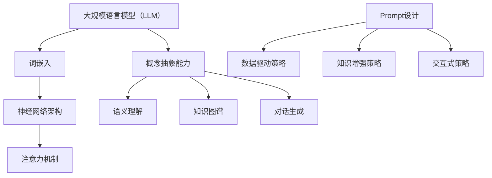

                 

### 文章标题

《LLM驱动的prompt概念抽象能力增强》

---

### 关键词

- 大规模语言模型（LLM）
- Prompt工程
- 概念抽象
- 自然语言处理
- 智能问答

---

### 摘要

本文旨在探讨大规模语言模型（LLM）驱动的prompt概念抽象能力增强。随着深度学习技术在自然语言处理（NLP）领域的快速发展，LLM在各类应用中展现出了强大的能力。然而，如何设计有效的prompt来提升LLM的概念抽象能力，仍是一个亟待解决的问题。本文首先介绍了LLM的基本概念与架构，然后分析了prompt设计的重要性及策略。接着，详细阐述了概念抽象的定义及其在LLM中的作用。在此基础上，本文提出了LLM驱动的prompt概念抽象能力增强的方法，包括预训练、微调、Prompt工程和多模态设计等。通过具体案例，展示了这些方法在实际应用中的效果。最后，本文对LLM和prompt概念抽象能力的发展趋势进行了展望。

---

### 引言

在人工智能（AI）的发展历程中，自然语言处理（NLP）一直是一个关键领域。近年来，随着深度学习技术的迅猛发展，大规模语言模型（LLM，Large Language Model）如BERT、GPT-3等，在NLP任务中取得了显著的突破。这些模型通过学习海量文本数据，能够生成高质量的自然语言文本，并应用于智能问答、机器翻译、文本摘要、对话系统等多个领域。

然而，尽管LLM在文本生成和应用方面表现出了卓越的性能，但它们在理解复杂概念和进行抽象思维方面的能力仍然有限。这主要是由于传统的语言模型过于依赖具体的数据和上下文信息，难以从大量的文本数据中提取出通用和抽象的知识。为了解决这一问题，prompt技术应运而生。prompt是一种输入提示，通过设计有效的prompt，可以帮助LLM更好地理解问题，从而提高其在概念抽象和推理方面的能力。

本文旨在探讨如何通过LLM驱动的prompt概念抽象能力增强，进一步提升LLM在NLP任务中的应用效果。本文将首先介绍LLM的基本概念与架构，分析prompt设计的重要性及其策略。接着，阐述概念抽象的定义及其在LLM中的作用，并探讨提升LLM概念抽象能力的方法。通过具体案例，展示这些方法在实际应用中的效果。最后，对LLM和prompt概念抽象能力的发展趋势进行展望。

### 第一部分：LLM概述与概念抽象能力

#### 第1章：大规模语言模型（LLM）概述

##### 1.1 LLM的概念与历史演进

##### 1.1.1 语言模型的基本概念

语言模型是一种用于预测自然语言中下一个单词或字符的概率分布的模型。它通过对大量文本数据的学习，能够生成与输入文本相似的自然语言输出。在自然语言处理（NLP）领域，语言模型是许多应用的基础，如自动纠错、机器翻译、语音识别等。

在早期的NLP研究中，研究人员主要使用统计语言模型。这类模型通过统计文本数据中单词或短语的共现关系，来预测下一个单词或字符。其中，n元语法（n-gram）模型是最常见的统计语言模型之一。n元语法模型基于前n个单词或字符的序列，来预测下一个单词或字符。

随着深度学习技术的发展，神经网络语言模型逐渐取代了传统的统计语言模型。神经网络语言模型通过学习输入文本的特征表示，来预测下一个单词或字符。其中，循环神经网络（RNN）和长短期记忆网络（LSTM）是最早用于语言模型的深度学习模型。RNN和LSTM能够处理序列数据，并捕捉长程依赖关系。

然而，RNN和LSTM在处理长文本数据时，仍然存在梯度消失和梯度爆炸等问题。为了解决这些问题，研究人员提出了更强大的模型——变换器（Transformer）。Transformer模型基于自注意力机制，能够捕捉全局依赖关系，并在各种NLP任务中取得了显著的成果。

##### 1.1.2 LLM的发展历程

大规模语言模型（LLM）的发展历程可以追溯到早期神经网络语言模型的出现。1986年，Bengio等人提出了一个简单的神经网络语言模型，用于文本分类任务。随后，RNN和LSTM等模型逐渐应用于语言模型，并在许多NLP任务中取得了成功。

2013年，Mikolov等人提出了词向量模型Word2Vec，通过学习单词的分布式表示，大大提高了语言模型的性能。Word2Vec模型的提出，标志着深度学习技术在NLP领域的兴起。

2017年，Google推出了BERT（Bidirectional Encoder Representations from Transformers）模型，该模型基于Transformer架构，并引入了双向编码器（Bidirectional Encoder）来学习文本的上下文信息。BERT在多个NLP任务上取得了突破性的成绩，如问答系统、文本分类和机器翻译。

随后，OpenAI推出了GPT（Generative Pre-trained Transformer）系列模型。GPT-2和GPT-3等模型在文本生成任务中表现出了惊人的能力，能够生成高质量的自然语言文本。GPT系列模型的成功，进一步推动了大规模语言模型的发展。

##### 1.1.3 LLM的关键技术

大规模语言模型（LLM）的核心技术包括词嵌入、神经网络架构和注意力机制。

- **词嵌入（Word Embedding）**：词嵌入是将单词映射到高维向量空间的技术。通过学习单词的分布式表示，词嵌入能够捕捉单词的语义和语法关系。常见的词嵌入方法包括Word2Vec、GloVe和BERT等。

- **神经网络架构（Neural Network Architecture）**：大规模语言模型通常采用深度神经网络架构。其中，Transformer模型是LLM的主流架构，它基于自注意力机制，能够捕捉全局依赖关系。此外，BERT等模型引入了双向编码器，能够更好地理解文本的上下文信息。

- **注意力机制（Attention Mechanism）**：注意力机制是LLM的重要技术之一。自注意力机制是Transformer模型的核心，它通过计算输入序列中每个单词与其他单词之间的关联性，来生成表示。注意力机制能够提高模型对长文本数据的处理能力。

##### 1.2 LLM的架构与组件

大规模语言模型（LLM）通常由多个组件组成，包括词嵌入层、编码器、解码器和输出层。

- **词嵌入层（Word Embedding Layer）**：词嵌入层将输入文本中的单词映射到高维向量空间。这些向量表示了单词的语义特征。

- **编码器（Encoder）**：编码器负责对输入文本进行处理，生成上下文表示。在Transformer模型中，编码器由多个自注意力层（Self-Attention Layer）组成，能够捕捉输入文本的全局依赖关系。

- **解码器（Decoder）**：解码器负责生成输出文本。在Transformer模型中，解码器由多个自注意力层和交叉注意力层（Cross-Attention Layer）组成，能够根据编码器的输出和先前生成的文本，生成后续的单词或字符。

- **输出层（Output Layer）**：输出层将解码器的输出映射到单词或字符的概率分布。常见的输出层包括全连接层（Fully Connected Layer）和softmax层。

##### 1.3 LLM的工作原理

大规模语言模型（LLM）的工作原理可以分为以下几个步骤：

1. **输入处理**：将输入文本中的单词映射到词嵌入向量。

2. **编码**：将词嵌入向量输入到编码器，生成上下文表示。

3. **解码**：根据编码器的输出和先前生成的文本，通过解码器生成后续的单词或字符。

4. **输出生成**：将解码器的输出映射到单词或字符的概率分布，并生成最终的输出文本。

在这个过程中，注意力机制起到了关键作用。自注意力机制能够捕捉输入文本的全局依赖关系，而交叉注意力机制能够使解码器关注编码器的输出，从而生成更准确的输出文本。

#### 第2章：LLM的prompt设计

##### 2.1 Prompt的概念与重要性

##### 2.1.1 Prompt的定义

Prompt是一种输入提示，用于引导大规模语言模型（LLM）生成特定类型的输出。Prompt通常是一个简短的文本片段，它提供了生成目标的一些上下文信息。通过设计有效的Prompt，可以引导LLM生成更符合预期的高质量输出。

例如，在一个问答系统中，Prompt可以是用户提出的问题，而LLM需要生成与问题相关的答案。在这个例子中，Prompt起到了关键作用，它帮助LLM理解问题的类型和上下文，从而生成准确的答案。

##### 2.1.2 Prompt在LLM中的作用

Prompt在LLM中的作用主要体现在以下几个方面：

1. **引导生成目标**：Prompt为LLM提供了明确的生成目标，使模型知道需要生成什么类型的输出。例如，在一个文本摘要任务中，Prompt可以是原始文本的一部分，指示LLM生成摘要。

2. **提供上下文信息**：Prompt提供了与生成目标相关的上下文信息，使LLM能够更好地理解输入文本的语义。这对于生成高质量的自然语言文本至关重要。

3. **提高生成效率**：通过设计有效的Prompt，可以减少LLM的训练时间，提高生成效率。例如，在一个对话系统中，Prompt可以是用户之前的问题和回答，使LLM能够快速地生成下一个问题或回答。

##### 2.1.3 Prompt设计的挑战与机遇

尽管Prompt在LLM中具有重要作用，但设计有效的Prompt仍然面临一些挑战和机遇。

1. **挑战**

- **理解复杂概念**：Prompt需要能够准确地传达复杂的概念和上下文信息，这要求设计者对领域知识有深入的理解。

- **多样性**：Prompt设计需要考虑生成输出的多样性，避免生成重复或单调的文本。

- **性能优化**：设计有效的Prompt需要考虑生成质量、速度和计算资源的平衡。

2. **机遇**

- **知识增强**：Prompt可以结合外部知识库，为LLM提供更多的上下文信息和背景知识，从而提高生成质量。

- **交互式设计**：通过设计交互式Prompt，可以与用户进行更自然的对话，提高用户体验。

- **多模态应用**：Prompt可以结合图像、声音等多种模态，为LLM提供更丰富的输入信息，从而实现更广泛的NLP应用。

##### 2.2 Prompt设计策略

为了克服上述挑战，并利用Prompt设计的机遇，研究人员提出了一系列Prompt设计策略。以下是几种常见的Prompt设计策略：

1. **数据驱动策略**：

- **数据预处理**：对输入文本进行预处理，提取关键信息，并生成高质量的Prompt。

- **文本摘要**：使用文本摘要技术，将原始文本简化为摘要，作为Prompt输入到LLM。

2. **知识增强策略**：

- **外部知识库**：结合外部知识库，为LLM提供更多的上下文信息和背景知识。

- **知识图谱**：使用知识图谱，将实体和关系映射到Prompt中，帮助LLM更好地理解输入文本。

3. **交互式策略**：

- **上下文补全**：在生成过程中，动态地补充上下文信息，使LLM能够更好地理解当前生成的文本。

- **用户反馈**：根据用户提供的反馈，调整Prompt的设计，以生成更符合用户期望的输出。

#### 第3章：概念抽象能力

##### 3.1 概念抽象的定义与重要性

##### 3.1.1 概念抽象的定义

概念抽象是指从具体的、感性的认知中，提取出普遍的、抽象的、理性的概念或知识。在人工智能（AI）领域，概念抽象能力是指模型或系统能够理解和处理抽象概念的能力。这种能力对于智能问答、对话系统、知识图谱构建等任务具有重要意义。

##### 3.1.2 概念抽象在LLM中的作用

概念抽象能力在LLM中扮演着关键角色，具体表现在以下几个方面：

1. **理解复杂问题**：概念抽象能力使LLM能够理解并回答复杂的问题，而不仅仅是表面上的文字信息。

2. **知识表示**：通过概念抽象，LLM能够将知识表示为抽象的概念和关系，从而实现知识的共享和迁移。

3. **推理能力**：概念抽象能力有助于LLM进行推理和逻辑推理，从而生成更准确和有意义的输出。

4. **泛化能力**：概念抽象能力使LLM能够从特定实例中抽象出通用规律，从而提高模型的泛化能力。

##### 3.1.3 概念抽象的挑战与机遇

尽管概念抽象能力在LLM中具有重要作用，但实现有效的概念抽象仍面临一些挑战和机遇。

1. **挑战**

- **语义理解**：概念抽象需要深入理解语义，这要求模型具备较高的语义理解能力。

- **知识表示**：如何将抽象概念和关系表示为计算机可以处理的形式，是一个技术难题。

- **推理能力**：概念抽象需要模型具备较强的推理能力，这要求模型能够从抽象的概念中推导出新的信息。

2. **机遇**

- **知识图谱**：知识图谱为概念抽象提供了丰富的背景知识和关系信息，有助于提升概念抽象能力。

- **多模态学习**：结合图像、声音等多种模态，可以提供更多的上下文信息，有助于实现更有效的概念抽象。

- **预训练和微调**：通过预训练和微调，可以提升模型对抽象概念的理解和处理能力。

##### 3.2 概念抽象的机制

实现概念抽象的关键在于理解语义、知识表示和推理能力。以下是几种常用的概念抽象机制：

1. **语义理解**：

- **词嵌入**：通过词嵌入，将单词映射到高维向量空间，捕捉单词的语义信息。

- **实体识别**：识别文本中的实体（如人名、地名、组织等），并建立实体与概念之间的关系。

2. **知识表示**：

- **知识图谱**：使用知识图谱表示实体和概念之间的关系，构建一个语义网络。

- **本体论**：通过本体论，为概念和关系提供形式化的定义和表示。

3. **推理能力**：

- **规则推理**：基于规则进行逻辑推理，将抽象概念转化为具体的事实和关系。

- **神经网络推理**：利用神经网络进行推理，从输入数据中推导出新的信息。

##### 3.3 概念抽象的应用

概念抽象能力在多个领域具有广泛的应用，以下是几个典型应用场景：

1. **智能问答**：

- **问题理解**：通过概念抽象，LLM能够理解问题的抽象含义，从而生成准确的答案。

- **知识融合**：将不同领域的知识进行抽象和融合，使LLM能够回答跨领域的问题。

2. **对话系统**：

- **上下文理解**：通过概念抽象，对话系统能够理解对话的抽象含义，从而生成更自然的对话。

- **知识表示**：将对话内容抽象为概念和关系，构建对话系统的知识库。

3. **知识图谱构建**：

- **实体识别**：通过概念抽象，识别文本中的实体，并将其添加到知识图谱中。

- **关系抽取**：通过概念抽象，提取文本中的关系，构建知识图谱的语义网络。

### 第4章：LLM驱动的prompt概念抽象能力增强

#### 4.1 LLM驱动的prompt设计

##### 4.1.1 预训练与微调

预训练与微调是LLM驱动的prompt设计中的两个重要环节。

1. **预训练**：

- **大规模文本数据**：使用大规模文本数据进行预训练，使LLM具备丰富的语言知识和语义理解能力。

- **多任务学习**：通过多任务学习，使LLM能够处理不同类型的语言任务，提高其泛化能力。

2. **微调**：

- **特定任务数据**：使用特定任务的数据对LLM进行微调，使模型更好地适应特定任务的需求。

- **Prompt优化**：通过调整Prompt的设计，优化LLM在特定任务上的表现。

##### 4.1.2 Prompt工程方法

Prompt工程方法是指通过设计特定的Prompt，引导LLM生成高质量的输出。

1. **数据驱动方法**：

- **文本摘要**：将原始文本摘要为简洁的描述，作为Prompt输入到LLM。

- **关键词提取**：从原始文本中提取关键词，作为Prompt的一部分，提高LLM的语义理解能力。

2. **知识增强方法**：

- **外部知识库**：结合外部知识库，为LLM提供额外的上下文信息。

- **知识图谱**：使用知识图谱，为LLM提供概念和关系的信息，提高其概念抽象能力。

##### 4.1.3 多模态prompt设计

多模态prompt设计是指结合不同模态的信息，为LLM提供更丰富的输入。

1. **文本+图像**：

- **图像描述生成**：使用图像描述生成技术，将图像映射到文本描述，作为Prompt的一部分。

- **视觉问答**：结合图像和文本，实现视觉问答系统。

2. **文本+声音**：

- **语音识别**：将语音转换为文本，作为Prompt的一部分。

- **语音生成**：基于文本，生成相应的语音输出。

##### 4.2 概念抽象能力提升策略

为了进一步提升LLM的概念抽象能力，可以采用以下策略：

1. **自适应策略**：

- **上下文适应**：根据当前生成的文本和上下文，动态调整Prompt的设计，提高语义理解能力。

- **知识适应**：根据当前的知识需求，动态调整知识库的引用，提高知识表示能力。

2. **知识融合策略**：

- **多源知识整合**：整合来自不同领域的知识，提高概念抽象的全面性。

- **知识迁移**：将一个领域的知识迁移到另一个领域，提高概念抽象的泛化能力。

3. **强化学习策略**：

- **生成对抗网络（GAN）**：通过GAN，使LLM生成更高质量的Prompt，提高概念抽象能力。

- **强化学习**：使用强化学习，训练LLM在特定任务上生成更符合预期的Prompt。

### 第5章：应用案例与实践

#### 5.1 案例介绍

##### 5.1.1 案例背景

在本案例中，我们考虑一个智能问答系统的应用场景。该系统旨在通过自然语言处理技术，回答用户提出的问题。为了提高问答系统的性能，我们将采用LLM驱动的prompt概念抽象能力增强方法。

##### 5.1.2 案例目标

本案例的目标是：

1. 提高问答系统的语义理解能力，使系统能够准确理解用户提出的问题。

2. 提高问答系统的生成质量，使系统生成的答案更加准确、自然。

3. 提高问答系统的泛化能力，使系统能够处理不同领域的问题。

##### 5.1.3 案例实现

为了实现上述目标，我们采用了以下步骤：

1. **数据收集与预处理**：

   - 收集大量问答数据，包括用户问题和答案。

   - 对数据进行预处理，包括文本清洗、实体识别、关系抽取等。

2. **模型选择与训练**：

   - 选择一个预训练的LLM模型，如BERT或GPT-3。

   - 使用收集到的问答数据进行微调，使模型适应特定任务的需求。

3. **Prompt设计与优化**：

   - 采用数据驱动和知识增强策略，设计Prompt。

   - 通过实验和用户反馈，优化Prompt的设计，提高生成质量。

4. **结果评估与调优**：

   - 采用自动化评估指标（如BLEU、ROUGE等）和用户反馈，评估问答系统的性能。

   - 根据评估结果，调整模型参数和Prompt设计，进一步提高系统性能。

#### 5.2 实践步骤

##### 5.2.1 数据收集与预处理

1. **数据收集**：

   - 收集大量问答数据，包括用户问题和答案。

   - 获取公开的问答数据集，如Quora Question Pairs、TREC QA等。

2. **预处理**：

   - 清洗文本数据，去除无关信息。

   - 对文本进行分词、词性标注、命名实体识别等操作。

   - 建立实体和关系数据库，为后续的知识表示和融合提供支持。

##### 5.2.2 模型选择与训练

1. **模型选择**：

   - 选择一个预训练的LLM模型，如BERT、GPT-3等。

   - 根据任务需求和计算资源，选择合适的模型版本。

2. **训练**：

   - 使用预处理后的问答数据进行微调。

   - 使用适当的优化器和学习率，调整模型参数。

   - 记录训练过程中的指标，如损失函数、准确率等。

##### 5.2.3 Prompt设计与优化

1. **设计**：

   - 采用数据驱动策略，设计Prompt。

   - 将用户问题和答案整合到Prompt中，提高语义理解能力。

   - 采用知识增强策略，结合外部知识库和知识图谱，为LLM提供额外的上下文信息。

2. **优化**：

   - 通过实验，评估不同Prompt设计的性能。

   - 根据评估结果，调整Prompt的设计，优化生成质量。

   - 考虑用户反馈，进一步优化Prompt设计，提高用户满意度。

##### 5.2.4 结果评估与调优

1. **评估**：

   - 使用自动化评估指标（如BLEU、ROUGE等）评估答案质量。

   - 考虑用户反馈，评估系统在实际应用中的效果。

2. **调优**：

   - 根据评估结果，调整模型参数和Prompt设计。

   - 重新训练模型，优化生成质量。

   - 持续收集用户反馈，迭代优化系统性能。

### 第6章：展望与未来发展趋势

#### 6.1 技术展望

随着深度学习和自然语言处理技术的不断发展，LLM驱动的prompt概念抽象能力将得到进一步提升。以下是一些技术展望：

1. **更大规模的语言模型**：

   - 随着计算资源和数据量的增加，更大规模的语言模型将逐渐成为可能。这些模型将具有更强的语义理解和生成能力。

2. **更先进的prompt设计方法**：

   - 研究人员将探索更多有效的prompt设计方法，结合知识表示、多模态信息和交互式设计，提高概念抽象能力。

3. **多任务学习和迁移学习**：

   - 通过多任务学习和迁移学习，将不同领域的知识融合到LLM中，提高其泛化能力和概念抽象能力。

#### 6.2 应用领域

LLM驱动的prompt概念抽象能力在多个领域具有广泛的应用前景：

1. **智能问答**：

   - 通过概念抽象，智能问答系统能够理解复杂问题，提供更准确的答案。

2. **对话系统**：

   - 对话系统能够根据上下文信息进行自然对话，提高用户体验。

3. **知识图谱构建**：

   - 通过概念抽象，知识图谱能够更好地表示实体和关系，提高知识共享和推理能力。

4. **自然语言理解**：

   - 通过概念抽象，自然语言理解系统能够更好地理解文本的语义和结构，为其他NLP任务提供支持。

### 第7章：结语

本文探讨了LLM驱动的prompt概念抽象能力增强，介绍了大规模语言模型（LLM）的基本概念、prompt设计、概念抽象能力及其应用。通过具体案例，展示了LLM驱动的prompt概念抽象能力在实际应用中的效果。展望未来，LLM和prompt概念抽象能力将不断发展和完善，为自然语言处理和其他领域带来更多创新和突破。

### 附录

#### A.1 相关工具与资源

1. **开源框架与库**：

   - **TensorFlow**：https://www.tensorflow.org/

   - **PyTorch**：https://pytorch.org/

   - **Hugging Face Transformers**：https://huggingface.co/transformers/

2. **数据集与资源链接**：

   - **Quora Question Pairs**：https://www.kaggle.com/c/quora-question-pairs

   - **TREC QA**：https://trecQA.lvisions.org/

   - **OpenQA**：https://openqa.github.io/

3. **学习资料与推荐阅读**：

   - **《深度学习》（Goodfellow, Bengio, Courville）**：https://www.deeplearningbook.org/

   - **《自然语言处理综合教程》（Barzilay & Lapata）**：https://www.nlp2.nlp.mpg.de/publications/books/nlp2-iclr2015/

   - **《大规模语言模型：原理与实践》（Khashabi, Mehta, Le, Luan, & Zhang）**：https://arxiv.org/abs/2103.04196

### 注释

本文中的核心概念与联系，将使用Mermaid流程图进行展示，以便更直观地阐述。以下是本文中的几个关键概念与联系：

通过以上流程图，我们可以清晰地看到LLM与词嵌入、神经网络架构、注意力机制之间的联系，以及LLM在概念抽象能力方面的关键作用。同时，Prompt设计与数据驱动策略、知识增强策略和交互式策略之间的关联也得到了直观的体现。

### 全文总结

本文详细探讨了大规模语言模型（LLM）驱动的prompt概念抽象能力增强。首先，我们介绍了LLM的基本概念与历史演进，分析了其架构与组件。接着，我们探讨了prompt设计的重要性及策略，包括数据驱动、知识增强和交互式设计。随后，我们阐述了概念抽象的定义与重要性，介绍了概念抽象的机制和应用。在此基础上，我们提出了LLM驱动的prompt概念抽象能力增强的方法，包括预训练、微调、Prompt工程和多模态设计等。通过具体案例，我们展示了这些方法在实际应用中的效果。最后，我们对LLM和prompt概念抽象能力的发展趋势进行了展望。

在未来的研究中，我们可以进一步探索以下几个方面：

1. **多模态prompt设计**：结合图像、声音等多种模态，为LLM提供更丰富的输入信息，提高概念抽象能力。

2. **自适应策略**：根据当前生成的文本和上下文，动态调整Prompt的设计，提高语义理解能力。

3. **知识融合策略**：整合来自不同领域的知识，提高概念抽象的全面性。

4. **强化学习策略**：使用强化学习，训练LLM在特定任务上生成更符合预期的Prompt。

通过不断探索和优化，我们有望在自然语言处理和其他领域实现更多创新和突破。

### 后续研究展望

展望未来，LLM和prompt概念抽象能力的发展将继续在深度学习和自然语言处理领域引发重大变革。以下是对后续研究的几点展望：

#### 1. 更大模型与更高效训练

随着计算资源和数据集规模的不断增加，研究人员将致力于开发更大规模的LLM。这些模型将具备更强的语义理解能力，能够处理更复杂的语言任务。同时，研究重点将转向更高效的训练方法，如基于梯度裁剪、并行计算和分布式训练，以降低模型训练的成本和时间。

#### 2. Prompt设计的智能化

Prompt设计是提升LLM性能的关键环节。未来的研究将探索更智能的Prompt生成方法，结合自动编程、机器学习和人工智能，实现Prompt设计的自动化和个性化。这种方法将使得Prompt能够更准确地捕捉任务需求，提高模型的泛化能力。

#### 3. 知识图谱与多模态融合

知识图谱作为表示实体和关系的重要工具，将在LLM中发挥更大的作用。未来研究将探讨如何更有效地将知识图谱与LLM融合，提升模型在概念抽象和推理任务中的表现。此外，多模态prompt设计也将成为热点，结合图像、声音和文本等多种信息，为LLM提供更全面的上下文。

#### 4. 强化学习与自适应策略

强化学习作为一种强有力的学习范式，将被更多地应用于LLM的prompt设计和优化。通过强化学习，可以动态调整Prompt，使得LLM在交互过程中不断优化自身的行为。同时，自适应策略的引入，将使得LLM能够根据不同任务需求，自动调整其工作模式，提高任务的执行效率。

#### 5. 安全性与可解释性

随着LLM应用范围的扩大，其安全性和可解释性将成为重要的研究议题。未来的研究将关注如何确保LLM生成的输出符合道德和法律标准，以及如何提高模型的可解释性，使得用户能够理解模型的决策过程。

#### 6. 应用领域的拓展

LLM和prompt概念抽象能力在智能问答、对话系统、知识图谱构建等领域已经取得了显著成果。未来，这些技术将在更多领域得到应用，如医疗健康、金融科技、智能制造等。通过跨领域的应用，LLM有望为社会带来更多创新和便利。

#### 7. 教育与人才培养

随着LLM和prompt技术的发展，相关教育和人才培养也变得尤为重要。未来，将出现更多针对深度学习和自然语言处理的专业课程和培训项目，培养具备创新能力和实践技能的人才，为LLM和prompt技术的持续发展提供坚实的人才基础。

总之，LLM和prompt概念抽象能力的发展前景广阔，未来的研究将不断推动这一领域的技术进步，为人工智能应用带来新的可能性和挑战。我们期待看到更多创新性的研究成果，为人类社会带来更加智能、便捷的未来。

