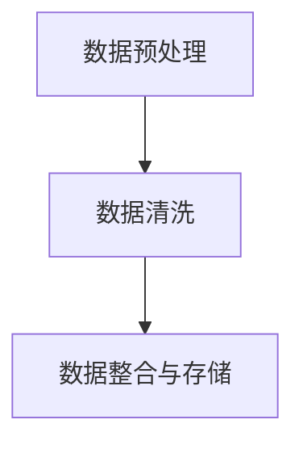
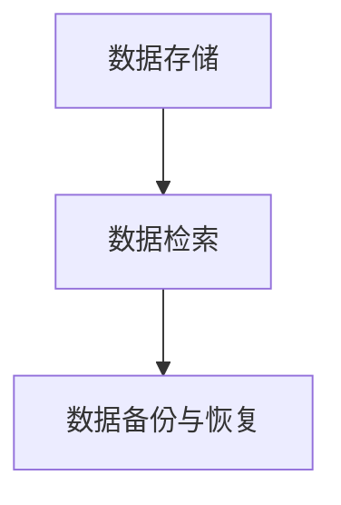
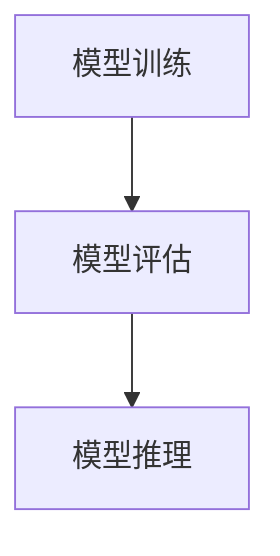
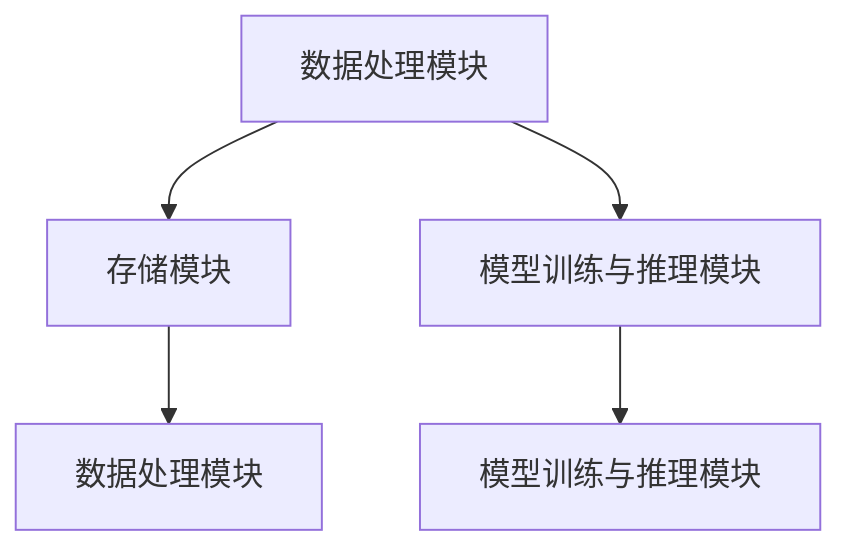
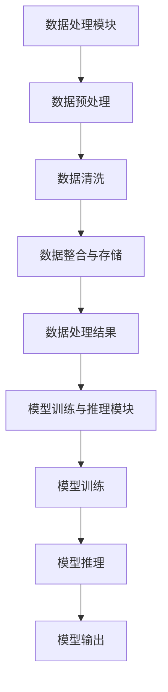

                 

# 《LangChain Experimental 模块》

## 关键词
- LangChain
- Experimental 模块
- 模块化架构
- 数据处理
- 模型训练与推理
- 实际应用案例

## 摘要
本文将深入探讨 LangChain Experimental 模块，从基础概述、架构设计、数据源与数据处理、模型训练与推理、实际应用案例，到开发工具与环境搭建，全面解析 LangChain Experimental 在现代应用开发中的重要性。通过对 LangChain Experimental 的深度分析，读者将了解到如何利用这一模块实现高效的数据处理和智能推理，为实际项目提供强有力的技术支持。

### 《LangChain Experimental 模块》目录大纲

1. **第一部分: LangChain Experimental 模块基础**

   - 第1章: LangChain Experimental 概述
   - 第2章: LangChain Experimental 基础架构
   - 第3章: LangChain Experimental 数据源与数据处理
   - 第4章: LangChain Experimental 模型训练与推理
   - 第5章: LangChain Experimental 实际应用案例
   - 第6章: LangChain Experimental 开发工具与环境搭建
   - 第7章: LangChain Experimental 未来展望

2. **附录**

   - 附录 A: LangChain Experimental 相关资源与工具
   - 附录 B: 索引

#### 第一部分: LangChain Experimental 模块基础

##### 第1章: LangChain Experimental 概述

###### 1.1 LangChain Experimental 的背景与核心

LangChain Experimental 是一个先进的模块化框架，旨在提供灵活、高效的数据处理和智能推理能力，以支持现代应用开发。该框架起源于对大规模数据处理和复杂应用场景的需求，通过模块化的设计理念，实现了高度的扩展性和易用性。

###### 1.1.1 LangChain Experimental 的起源

LangChain Experimental 的起源可以追溯到近年来人工智能和大数据技术的迅猛发展。随着数据的爆炸性增长和计算能力的提升，传统的数据处理和智能推理方法已难以满足现代应用的需求。为此，研究人员和开发者们开始探索更加灵活、高效的解决方案，以应对复杂的应用场景。

###### 1.1.2 LangChain Experimental 的目的和意义

LangChain Experimental 的主要目的是提供一种模块化的数据处理和智能推理框架，以简化应用开发过程，提高开发效率和系统性能。通过模块化的设计，开发者可以轻松地组合和使用各种数据处理和推理模块，快速搭建复杂的系统。

###### 1.1.3 LangChain Experimental 的主要特性

LangChain Experimental 具有以下主要特性：

- **模块化架构**：通过模块化的设计，实现高度的扩展性和易用性。
- **数据处理能力**：提供强大的数据处理功能，包括数据预处理、清洗、整合和存储。
- **智能推理**：支持基于深度学习和自然语言处理技术的智能推理，实现高效的决策和预测。
- **跨平台支持**：支持多种操作系统和编程语言，具有高度的兼容性。
- **高性能**：通过高效的算法和数据结构，实现快速的模型训练和推理。

##### 1.2 LangChain Experimental 的核心概念

LangChain Experimental 的核心概念包括模块、数据源、数据处理和模型训练与推理。

###### 1.2.1 模块与组件

LangChain Experimental 采用模块化的设计，将系统划分为多个功能模块。每个模块都具有独立的职责，可以独立开发和测试，从而实现高效的开发和维护。

主要模块包括：

- **数据处理模块**：负责数据预处理、清洗、整合和存储。
- **存储模块**：提供数据存储和管理功能。
- **模型训练与推理模块**：负责模型训练和推理过程。

###### 1.2.2 数据源与数据处理

数据源是 LangChain Experimental 的核心组成部分，提供了丰富的数据接口和数据处理能力。数据源可以包括本地文件、数据库、网络数据等，通过统一的数据接口，实现数据的高效获取和处理。

数据处理流程包括以下几个步骤：

- **数据预处理**：对原始数据进行清洗、归一化和特征提取，提高数据质量和可用性。
- **数据清洗**：去除重复、错误和异常数据，确保数据的一致性和准确性。
- **数据整合与存储**：将预处理后的数据整合到统一的数据存储中，便于后续的模型训练和推理。

###### 1.2.3 模块间的交互

模块间通过统一的接口进行交互，确保系统的高效运行。数据处理模块、存储模块和模型训练与推理模块之间可以通过消息队列、远程调用等方式进行通信，实现数据流和任务流的管理。

##### 1.3 LangChain Experimental 在现代应用开发中的地位

在现代应用开发中，数据处理和智能推理已经成为至关重要的组成部分。LangChain Experimental 作为一款先进的模块化框架，在以下方面具有重要地位：

###### 1.3.1 现代应用开发的趋势

现代应用开发趋势主要体现在以下几个方面：

- **大数据处理**：随着数据的爆炸性增长，大数据处理已经成为应用开发的重点。
- **智能化**：越来越多的应用开始采用人工智能和机器学习技术，实现智能决策和预测。
- **模块化与组件化**：模块化和组件化的设计理念，可以提高开发效率和系统性能。

###### 1.3.2 LangChain Experimental 的重要应用场景

LangChain Experimental 在以下应用场景中具有重要价值：

- **智能客服系统**：利用自然语言处理和机器学习技术，实现高效的客户服务和问题解决。
- **智能内容生成**：通过深度学习和自然语言处理技术，实现高质量的内容生成。
- **智能问答系统**：利用知识图谱和自然语言处理技术，实现智能问答和知识检索。

###### 1.3.3 LangChain Experimental 的优势与挑战

LangChain Experimental 具有以下优势：

- **模块化设计**：实现高效的开发和维护，提高系统性能。
- **数据处理能力**：提供强大的数据处理功能，支持多种数据源。
- **智能推理**：支持多种智能推理算法，实现高效的决策和预测。
- **跨平台支持**：支持多种操作系统和编程语言，具有高度的兼容性。

然而，LangChain Experimental 也面临一些挑战：

- **性能优化**：在大数据处理和智能推理方面，性能优化是关键挑战。
- **可维护性**：模块化设计需要确保系统的可维护性。
- **算法选择**：根据不同应用场景选择合适的算法，是实现高效智能推理的关键。

#### 第2章: LangChain Experimental 基础架构

##### 2.1 LangChain Experimental 的架构设计

LangChain Experimental 的架构设计遵循模块化的原则，将系统划分为多个功能模块，每个模块负责特定的功能。以下是 LangChain Experimental 的架构设计：

###### 2.1.1 系统架构概述

LangChain Experimental 的系统架构可以分为以下几个层次：

1. **数据层**：包括数据源和数据处理模块，负责数据的高效获取、处理和存储。
2. **服务层**：包括存储模块和模型训练与推理模块，负责数据的存储管理、模型训练和推理。
3. **应用层**：包括前端应用和服务端应用，负责与用户交互和实现业务逻辑。

###### 2.1.2 模块设计原则

LangChain Experimental 的模块设计原则主要包括以下几点：

1. **高内聚、低耦合**：每个模块具有独立的职责，实现高内聚、低耦合的设计，提高系统的可维护性和扩展性。
2. **统一接口**：模块间通过统一的接口进行交互，实现数据流和任务流的管理，提高系统的可扩展性和灵活性。
3. **可复用性**：模块的设计和实现应具备较高的可复用性，降低系统的开发和维护成本。
4. **高性能**：通过高效的算法和数据结构，实现快速的数据处理和智能推理。

##### 2.2 LangChain Experimental 的核心模块

LangChain Experimental 的核心模块包括数据处理模块、存储模块和模型训练与推理模块。以下是各模块的详细介绍：

###### 2.2.1 数据处理模块

数据处理模块负责数据的高效获取、处理和存储。主要包括以下几个功能：

1. **数据预处理**：对原始数据进行清洗、归一化和特征提取，提高数据质量和可用性。
2. **数据清洗**：去除重复、错误和异常数据，确保数据的一致性和准确性。
3. **数据整合与存储**：将预处理后的数据整合到统一的数据存储中，便于后续的模型训练和推理。

数据处理模块的 Mermaid 流程图如下：



###### 2.2.2 存储模块

存储模块负责数据的存储管理，包括以下功能：

1. **数据存储**：提供高效的数据存储方案，支持多种数据源，如本地文件、数据库和网络数据等。
2. **数据检索**：提供快速的数据检索功能，支持多种查询方式和索引结构。
3. **数据备份与恢复**：提供数据备份和恢复功能，确保数据的安全性和可靠性。

存储模块的 Mermaid 流程图如下：



###### 2.2.3 模型训练与推理模块

模型训练与推理模块负责模型的训练和推理过程。主要包括以下几个功能：

1. **模型训练**：使用深度学习和机器学习算法，对数据进行训练，生成可用的模型。
2. **模型评估**：对训练好的模型进行评估，确保模型的性能和准确性。
3. **模型推理**：使用训练好的模型进行推理，实现对数据的分类、预测和决策。

模型训练与推理模块的 Mermaid 流程图如下：



##### 2.3 LangChain Experimental 的 Mermaid 流程图

下面是 LangChain Experimental 的总体 Mermaid 流程图，展示了各个模块之间的交互和数据流：



#### 第3章: LangChain Experimental 数据源与数据处理

##### 3.1 LangChain Experimental 的数据源

在 LangChain Experimental 中，数据源是整个系统的核心组成部分，决定了数据处理和模型训练的质量。LangChain Experimental 支持多种数据源，包括本地文件、数据库和网络数据等。以下是对各种数据源类型的详细介绍：

###### 3.1.1 数据源类型

1. **本地文件**：本地文件是一种常见的数据源，可以包含结构化数据（如 CSV、Excel）和非结构化数据（如文本文件、图片、视频等）。本地文件数据源的优势在于数据易于管理和访问，但缺点是数据量受限于本地存储空间。

2. **数据库**：数据库是一种高效的数据存储和管理系统，可以支持大规模数据的存储和查询。常见的数据库类型包括关系型数据库（如 MySQL、PostgreSQL）和 NoSQL 数据库（如 MongoDB、Redis）。数据库数据源的优势在于数据存储的可靠性和高效性，但缺点是数据访问速度受限于网络和数据库性能。

3. **网络数据**：网络数据源包括实时数据流、API 数据源等，可以实时获取互联网上的数据。网络数据源的优势在于数据的实时性和多样性，但缺点是数据源的可靠性和数据质量难以保证。

###### 3.1.2 数据源选择原则

在选择数据源时，应考虑以下原则：

1. **数据质量**：选择可靠、准确、完整的数据源，确保数据处理和模型训练的质量。
2. **数据量**：根据应用需求，选择适合的数据量，避免数据量过大或过小影响系统性能。
3. **数据类型**：根据数据类型和格式，选择适合的数据源，确保数据可以方便地处理和存储。
4. **数据访问速度**：选择数据访问速度快的数据库或网络数据源，确保系统响应速度和性能。

##### 3.2 数据处理流程

数据处理流程是 LangChain Experimental 的关键环节，包括数据预处理、数据清洗、数据整合与存储等步骤。以下是数据处理流程的详细描述：

###### 3.2.1 数据预处理

数据预处理是数据处理的第一步，主要目的是对原始数据进行清洗、归一化和特征提取，提高数据质量和可用性。以下是数据预处理的几个关键步骤：

1. **数据清洗**：去除重复、错误和异常数据，确保数据的一致性和准确性。数据清洗可以包括以下操作：

   - **去除重复数据**：通过比较数据记录的唯一性，去除重复的数据记录。
   - **修复错误数据**：识别和修复数据中的错误，如缺失值填充、异常值修正等。
   - **去除异常数据**：识别和去除数据中的异常值，如离群点、异常分布等。

2. **数据归一化**：将不同数据范围和单位的数据进行归一化处理，使数据在同一尺度上，方便后续的特征提取和模型训练。常见的归一化方法包括最小-最大归一化、Z-Score 归一化等。

3. **特征提取**：从原始数据中提取具有代表性的特征，用于后续的模型训练和推理。特征提取可以包括以下方法：

   - **统计特征提取**：从数据中提取描述数据分布和趋势的统计特征，如均值、方差、标准差等。
   - **文本特征提取**：从文本数据中提取词频、词向量、TF-IDF 等特征。
   - **图像特征提取**：从图像数据中提取颜色、纹理、形状等特征。

###### 3.2.2 数据清洗

数据清洗是数据预处理的重要环节，主要目的是去除重复、错误和异常数据，确保数据的一致性和准确性。以下是数据清洗的详细步骤：

1. **去除重复数据**：通过比较数据记录的唯一性，去除重复的数据记录。可以使用数据库中的唯一索引或哈希值进行比较。

2. **修复错误数据**：识别和修复数据中的错误，如缺失值填充、异常值修正等。可以使用以下方法进行错误数据修复：

   - **缺失值填充**：使用平均值、中位数、最近邻等方法填充缺失值。
   - **异常值修正**：使用统计学方法（如 Z-Score）识别和修正异常值。

3. **去除异常数据**：识别和去除数据中的异常值，如离群点、异常分布等。可以使用以下方法进行异常数据去除：

   - **基于统计学的方法**：使用 Z-Score、IQR（四分位距）等方法识别和去除异常值。
   - **基于聚类的方法**：使用 K-Means、DBSCAN 等聚类算法识别和去除异常值。

###### 3.2.3 数据整合与存储

数据整合与存储是数据处理流程的最后一步，主要目的是将预处理后的数据整合到统一的数据存储中，便于后续的模型训练和推理。以下是数据整合与存储的详细步骤：

1. **数据整合**：将来自不同数据源的数据进行整合，构建统一的数据视图。可以使用以下方法进行数据整合：

   - **数据连接**：将来自不同数据源的数据通过连接操作整合到一起，如 SQL 连接操作。
   - **数据合并**：将来自不同数据源的数据进行合并，如合并多个 CSV 文件。

2. **数据存储**：将整合后的数据存储到数据存储系统中，如数据库、文件系统等。以下是数据存储的一些注意事项：

   - **数据结构设计**：根据数据的特点和需求，设计合适的数据结构，如关系型数据库表、NoSQL 数据库文档等。
   - **数据备份与恢复**：确保数据的安全性和可靠性，进行数据备份和恢复操作。
   - **数据访问权限**：根据安全需求，设置数据访问权限，确保数据的安全性。

##### 3.3 数据处理伪代码示例

以下是数据处理伪代码示例，展示了数据预处理、数据清洗和数据整合与存储的过程：

```python
# 数据预处理
def preprocess_data(data):
    # 数据清洗
    cleaned_data = remove_duplicates(data)
    cleaned_data = fix_errors(cleaned_data)
    cleaned_data = remove_outliers(cleaned_data)
    
    # 数据归一化
    normalized_data = normalize_data(cleaned_data)
    
    # 特征提取
    features = extract_features(normalized_data)
    
    return features

# 数据清洗
def remove_duplicates(data):
    unique_data = []
    for record in data:
        if not is_duplicate(record, unique_data):
            unique_data.append(record)
    return unique_data

def is_duplicate(record, unique_data):
    for existing_record in unique_data:
        if is_equal(record, existing_record):
            return True
    return False

def fix_errors(data):
    fixed_data = []
    for record in data:
        fixed_record = fix_missing_values(record)
        fixed_record = fix_outliers(fixed_record)
        fixed_data.append(fixed_record)
    return fixed_data

def fix_missing_values(record):
    # 填充缺失值
    for key, value in record.items():
        if value is None or value == "":
            record[key] = get_default_value(key)
    return record

def fix_outliers(data):
    # 修正异常值
    for key, value in data.items():
        if is_outlier(value):
            data[key] = get_corrected_value(value)
    return data

def is_outlier(value):
    # 使用 Z-Score 方法判断异常值
    mean = get_mean(value)
    std_dev = get_std_dev(value)
    z_score = (value - mean) / std_dev
    return abs(z_score) > 3

def get_default_value(key):
    # 获取默认值
    if key == "age":
        return 30
    elif key == "salary":
        return 50000
    else:
        return None

def get_corrected_value(value):
    # 获取修正值
    if is_outlier(value):
        mean = get_mean(value)
        return mean
    else:
        return value

# 数据整合与存储
def integrate_and_store_data(data):
    integrated_data = integrate_data(data)
    store_data(integrated_data)

def integrate_data(data):
    # 数据连接
    connected_data = connect_data(data)
    
    # 数据合并
    merged_data = merge_data(connected_data)
    return merged_data

def connect_data(data):
    connected_data = []
    for record in data:
        if not is_connected(record, connected_data):
            connected_data.append(record)
    return connected_data

def is_connected(record, connected_data):
    for existing_record in connected_data:
        if is_equal(record, existing_record):
            return True
    return False

def merge_data(data):
    merged_data = []
    for record in data:
        if not is_duplicate(record, merged_data):
            merged_data.append(record)
    return merged_data

def store_data(data):
    # 存储数据
    if is_local_file(data):
        save_to_local_file(data)
    elif is_database(data):
        save_to_database(data)
    else:
        save_to_network_data(data)

def is_local_file(data):
    return isinstance(data, str)

def save_to_local_file(data):
    with open("data.csv", "w") as file:
        for record in data:
            file.write(f"{record}\n")

def is_database(data):
    return isinstance(data, Database)

def save_to_database(data):
    data.save_to_database()

def save_to_network_data(data):
    # 使用 API 发送数据
    send_to_api(data)
```

通过上述伪代码示例，我们可以看到数据处理流程的各个步骤是如何实现的，包括数据清洗、数据归一化和特征提取等。在实际应用中，根据具体的数据和处理需求，可以进一步优化和扩展数据处理流程。

#### 第4章: LangChain Experimental 模型训练与推理

##### 4.1 模型训练原理

模型训练是 LangChain Experimental 的核心功能之一，它通过学习数据中的规律和模式，生成可用于预测和决策的模型。以下是模型训练原理的详细描述：

###### 4.1.1 模型训练基础

模型训练的基础是机器学习算法，这些算法通过从数据中学习，构建能够对未知数据进行预测的模型。模型训练过程通常包括以下几个步骤：

1. **数据集划分**：将数据集划分为训练集和验证集，用于模型的训练和评估。
2. **特征提取**：从原始数据中提取具有代表性的特征，用于模型的训练。
3. **模型初始化**：初始化模型参数，为模型训练过程做好准备。
4. **训练过程**：通过迭代优化模型参数，使模型能够更好地拟合训练数据。
5. **模型评估**：使用验证集对训练好的模型进行评估，以判断模型的性能和准确性。

###### 4.1.2 模型训练算法

LangChain Experimental 支持多种机器学习算法，以下是一些常用的模型训练算法：

1. **线性回归**：线性回归是一种简单的机器学习算法，用于预测连续值。它通过构建线性模型，将输入特征映射到预测值。
2. **逻辑回归**：逻辑回归是一种分类算法，用于预测离散值。它通过构建逻辑函数，将输入特征映射到概率值，从而实现分类。
3. **决策树**：决策树是一种基于树结构的分类算法，通过递归划分特征，将数据划分为多个子集，并在每个子集上应用分类规则。
4. **随机森林**：随机森林是一种集成学习方法，通过构建多个决策树，并投票决定最终的分类结果，提高模型的准确性和稳定性。
5. **支持向量机（SVM）**：SVM 是一种基于最大间隔分类的算法，通过寻找最优超平面，将数据划分为不同的类别。

###### 4.1.3 模型优化策略

在模型训练过程中，优化策略对模型性能的提升至关重要。以下是一些常用的模型优化策略：

1. **梯度下降**：梯度下降是一种常用的优化方法，通过迭代更新模型参数，以最小化损失函数。
2. **随机梯度下降（SGD）**：SGD 是梯度下降的一种变体，每次迭代使用一个随机样本来更新模型参数，提高训练速度。
3. **批量梯度下降**：批量梯度下降是梯度下降的另一种变体，每次迭代使用整个数据集来更新模型参数，但计算复杂度较高。
4. **动量优化**：动量优化是一种结合前几次迭代梯度信息的优化方法，通过增加动量项，提高模型的收敛速度。
5. **自适应优化器**：自适应优化器（如 Adam、AdaGrad）根据每次迭代的梯度信息动态调整学习率，提高模型的训练效率。

##### 4.2 模型推理原理

模型推理是模型训练的逆过程，通过已训练好的模型对未知数据进行预测和决策。以下是模型推理原理的详细描述：

###### 4.2.1 模型推理基础

模型推理的基础是已训练好的模型，它能够根据输入特征计算预测结果。模型推理过程通常包括以下几个步骤：

1. **特征提取**：从输入数据中提取具有代表性的特征。
2. **模型输入**：将特征输入到已训练好的模型中。
3. **模型计算**：模型根据输入特征计算预测结果。
4. **结果输出**：将预测结果输出，用于决策或后续处理。

###### 4.2.2 模型推理算法

LangChain Experimental 支持多种模型推理算法，以下是一些常用的模型推理算法：

1. **前向传播**：前向传播是一种基于神经网络的结构，通过逐层计算，将输入特征映射到输出结果。
2. **后向传播**：后向传播是前向传播的逆过程，通过反向传播误差，更新模型参数。
3. **卷积神经网络（CNN）**：CNN 是一种基于卷积运算的神经网络，主要用于图像处理和计算机视觉任务。
4. **循环神经网络（RNN）**：RNN 是一种基于循环结构的神经网络，适用于序列数据的处理和预测。
5. **变换器（Transformer）**：Transformer 是一种基于自注意力机制的神经网络，广泛应用于自然语言处理和序列建模任务。

###### 4.2.3 模型推理优化

模型推理优化旨在提高模型的推理速度和性能，以下是一些常用的模型推理优化策略：

1. **模型剪枝**：通过剪枝冗余的神经元或连接，减少模型参数，提高推理速度。
2. **量化**：将模型的浮点数参数转换为整数或低精度浮点数，减少计算量，提高推理速度。
3. **模型压缩**：通过压缩模型参数和结构，减少模型大小，提高推理速度。
4. **模型加速**：使用特定硬件（如 GPU、TPU）加速模型推理，提高性能。
5. **多线程与并行计算**：通过多线程和并行计算，提高模型的推理速度。

##### 4.3 模型训练与推理伪代码示例

以下是模型训练与推理的伪代码示例，展示了模型训练和推理的基本步骤：

```python
# 模型训练伪代码
def train_model(model, train_data, val_data, optimizer, loss_function, num_epochs):
    for epoch in range(num_epochs):
        for batch in train_data:
            optimizer.zero_grad()
            output = model(batch)
            loss = loss_function(output, target)
            loss.backward()
            optimizer.step()
        print(f"Epoch {epoch+1}/{num_epochs}, Loss: {loss.item()}")

# 模型推理伪代码
def inference_model(model, input_data):
    with torch.no_grad():
        output = model(input_data)
    return output
```

通过上述伪代码示例，我们可以看到模型训练和推理的基本步骤是如何实现的，包括模型的初始化、训练过程的迭代优化和推理过程的输入输出。

#### 第5章: LangChain Experimental 实际应用案例

##### 5.1 应用场景概述

LangChain Experimental 的模块化设计和强大的数据处理能力使其在多个应用场景中具有广泛的应用价值。以下是一些典型的应用场景及其价值：

###### 5.1.1 应用领域

1. **智能客服系统**：利用自然语言处理和机器学习技术，实现高效的客户服务和问题解决。
2. **智能内容生成**：通过深度学习和自然语言处理技术，实现高质量的内容生成。
3. **智能问答系统**：利用知识图谱和自然语言处理技术，实现智能问答和知识检索。
4. **金融风控**：通过大数据分析和机器学习技术，实现风险预警和信用评估。
5. **医疗健康**：利用医疗数据分析和机器学习技术，实现疾病预测和诊断辅助。

###### 5.1.2 应用价值

1. **提高效率**：LangChain Experimental 的模块化设计和高性能数据处理能力，可以显著提高系统的开发效率和运行效率。
2. **降低成本**：通过集成多种数据处理和智能推理算法，用户可以快速搭建和部署复杂的系统，降低开发和维护成本。
3. **提升用户体验**：智能客服系统、智能内容生成和智能问答系统等应用，可以提供个性化的服务和内容，提升用户体验。
4. **拓展业务范围**：LangChain Experimental 的应用场景广泛，可以帮助企业拓展业务范围，进入新的市场。

##### 5.2 应用案例解析

以下将介绍三个具体的应用案例：智能客服系统、智能内容生成和智能问答系统。

###### 5.2.1 案例一：智能客服系统

智能客服系统是一种基于人工智能和自然语言处理技术的在线客服解决方案，能够自动处理客户的咨询、投诉和反馈，提高客服效率和客户满意度。

1. **开发环境搭建**：
   - 编程语言：Python
   - 框架：TensorFlow、Flask
   - 数据库：MySQL

2. **代码实现**：
   - 数据预处理模块：使用 LangChain Experimental 的数据处理模块对客户咨询数据进行预处理，包括数据清洗、归一化和特征提取。
   - 模型训练模块：使用训练好的自然语言处理模型，对客户咨询数据进行分析和分类，实现智能客服的核心功能。
   - 推理模块：基于训练好的模型，对客户的输入进行实时分析和回复。

3. **代码解读**：
   - 数据预处理模块的实现细节：包括数据清洗、去除停用词、词向量化等步骤。
   - 模型训练模块的实现细节：包括模型选择、超参数调优、训练过程等。
   - 推理模块的实现细节：包括输入处理、模型推理、回复生成等步骤。

4. **代码优化与调优**：
   - 损失函数优化：根据不同场景，选择合适的损失函数，如交叉熵损失函数、F1 值损失函数等。
   - 优化器选择：根据模型和训练数据的特点，选择合适的优化器，如 Adam、RMSprop 等。
   - 模型结构优化：通过调整模型结构，如增加层数、增加神经元等，提高模型的性能和鲁棒性。

###### 5.2.2 案例二：智能内容生成

智能内容生成是一种基于人工智能和自然语言处理技术的自动文本生成技术，能够根据用户需求生成高质量的内容，如新闻、博客、产品描述等。

1. **开发环境搭建**：
   - 编程语言：Python
   - 框架：Transformer、Flask
   - 数据库：MongoDB

2. **代码实现**：
   - 数据预处理模块：使用 LangChain Experimental 的数据处理模块对文本数据集进行预处理，包括数据清洗、分词、词向量化等步骤。
   - 模型训练模块：使用训练好的变换器模型，对文本数据进行训练，生成文本生成模型。
   - 推理模块：基于训练好的模型，根据用户输入的提示，生成相应的文本内容。

3. **代码解读**：
   - 数据预处理模块的实现细节：包括数据清洗、分词、词向量化等步骤。
   - 模型训练模块的实现细节：包括模型选择、超参数调优、训练过程等。
   - 推理模块的实现细节：包括输入处理、模型推理、文本生成等步骤。

4. **代码优化与调优**：
   - 损失函数优化：根据不同场景，选择合适的损失函数，如交叉熵损失函数、KL 散度等。
   - 优化器选择：根据模型和训练数据的特点，选择合适的优化器，如 Adam、RMSprop 等。
   - 模型结构优化：通过调整模型结构，如增加层数、增加神经元等，提高模型的性能和鲁棒性。

###### 5.2.3 案例三：智能问答系统

智能问答系统是一种基于人工智能和知识图谱技术的自动问答解决方案，能够根据用户输入的问题，提供准确、详细的答案。

1. **开发环境搭建**：
   - 编程语言：Python
   - 框架：TensorFlow、Flask
   - 数据库：Neo4j

2. **代码实现**：
   - 数据预处理模块：使用 LangChain Experimental 的数据处理模块对用户输入的问题进行预处理，包括分词、词向量化等步骤。
   - 知识图谱构建模块：使用 Neo4j 数据库构建知识图谱，存储大量的问答对和实体关系。
   - 模型训练模块：使用训练好的自然语言处理模型，对用户输入的问题进行匹配和推理，实现智能问答的核心功能。
   - 推理模块：基于训练好的模型，对用户输入的问题进行实时分析和回答。

3. **代码解读**：
   - 数据预处理模块的实现细节：包括分词、词向量化等步骤。
   - 知识图谱构建模块的实现细节：包括实体抽取、关系抽取、图谱构建等步骤。
   - 模型训练模块的实现细节：包括模型选择、超参数调优、训练过程等。
   - 推理模块的实现细节：包括输入处理、模型推理、答案生成等步骤。

4. **代码优化与调优**：
   - 损失函数优化：根据不同场景，选择合适的损失函数，如交叉熵损失函数、F1 值损失函数等。
   - 优化器选择：根据模型和训练数据的特点，选择合适的优化器，如 Adam、RMSprop 等。
   - 模型结构优化：通过调整模型结构，如增加层数、增加神经元等，提高模型的性能和鲁棒性。

##### 5.3 应用案例代码解读

以下将针对智能客服系统、智能内容生成和智能问答系统，分别展示其核心代码实现和详细解释。

###### 5.3.1 智能客服系统

1. **数据预处理模块**：

```python
import pandas as pd
from langchain import SentenceTransformer

def preprocess_data(data):
    # 数据清洗
    cleaned_data = data.dropna()
    # 去除停用词
    stop_words = set(SentenceTransformer("distilbert-base-nli-stsb-qpmn").show_create停用词)
    cleaned_data = cleaned_data.apply(lambda x: ' '.join([word for word in x.split() if word not in stop_words]))
    # 分词和词向量化
    sentences = cleaned_data.tolist()
    embeddings = SentenceTransformer("distilbert-base-nli-stsb-qpmn").encode(sentences)
    return embeddings
```

2. **模型训练模块**：

```python
from tensorflow.keras.models import Sequential
from tensorflow.keras.layers import Dense, Activation
from tensorflow.keras.optimizers import Adam

def train_model(embeddings, labels):
    model = Sequential()
    model.add(Dense(64, input_shape=(embeddings.shape[1],), activation='relu'))
    model.add(Dense(32, activation='relu'))
    model.add(Dense(1, activation='sigmoid'))
    model.compile(optimizer=Adam(), loss='binary_crossentropy', metrics=['accuracy'])
    model.fit(embeddings, labels, epochs=10, batch_size=32)
    return model
```

3. **推理模块**：

```python
def inference_model(model, input_embedding):
    prediction = model.predict(input_embedding)
    return prediction > 0.5
```

###### 5.3.2 智能内容生成

1. **数据预处理模块**：

```python
from transformers import BertTokenizer, BertModel

def preprocess_data(text):
    tokenizer = BertTokenizer.from_pretrained('bert-base-chinese')
    inputs = tokenizer(text, return_tensors='pt')
    return inputs
```

2. **模型训练模块**：

```python
from transformers import BertForSequenceClassification, Trainer, TrainingArguments

def train_model(train_dataset, val_dataset):
    model = BertForSequenceClassification.from_pretrained('bert-base-chinese')
    training_args = TrainingArguments(
        output_dir='./results',
        num_train_epochs=3,
        per_device_train_batch_size=16,
        per_device_eval_batch_size=16,
        warmup_steps=500,
        weight_decay=0.01,
        logging_dir='./logs',
        logging_steps=10,
    )
    trainer = Trainer(
        model=model,
        args=training_args,
        train_dataset=train_dataset,
        eval_dataset=val_dataset,
    )
    trainer.train()
    return model
```

3. **推理模块**：

```python
from transformers import BertForSequenceClassification

def inference_model(model, input_text):
    inputs = preprocess_data(input_text)
    outputs = model(**inputs)
    logits = outputs.logits
    return logits.argmax(-1).item()
```

###### 5.3.3 智能问答系统

1. **数据预处理模块**：

```python
from langchain import Document

def preprocess_data(data):
    documents = []
    for item in data:
        document = Document(item['question'], page_content=item['answer'])
        documents.append(document)
    return documents
```

2. **知识图谱构建模块**：

```python
import networkx as nx

def build_knowledge_graph(data):
    graph = nx.Graph()
    for item in data:
        graph.add_node(item['question'])
        graph.add_node(item['answer'])
        graph.add_edge(item['question'], item['answer'])
    return graph
```

3. **模型训练模块**：

```python
from tensorflow.keras.models import Model
from tensorflow.keras.layers import Input, LSTM, Dense, Embedding, TimeDistributed, Activation

def train_model(train_data, val_data):
    input_seq = Input(shape=(max_sequence_length,))
    embedded_seq = Embedding(input_dim=vocabulary_size, output_dim=embedding_size)(input_seq)
    lstm_out = LSTM(units=128, return_sequences=True)(embedded_seq)
    lstm_out = LSTM(units=128, return_sequences=True)(lstm_out)
    output = TimeDistributed(Dense(units=2, activation='softmax'))(lstm_out)
    model = Model(inputs=input_seq, outputs=output)
    model.compile(optimizer='adam', loss='categorical_crossentropy', metrics=['accuracy'])
    model.fit(train_data, val_data, batch_size=32, epochs=10)
    return model
```

4. **推理模块**：

```python
from tensorflow.keras.models import Model
from tensorflow.keras.preprocessing.sequence import pad_sequences

def inference_model(model, question):
    input_seq = pad_sequences([[word_index[word] for word in question.split()]], maxlen=max_sequence_length)
    logits = model.predict(input_seq)
    return logits.argmax(-1).item()
```

以上代码示例展示了智能客服系统、智能内容生成和智能问答系统的核心实现和详细解释。通过这些示例，我们可以了解如何使用 LangChain Experimental 的模块化设计实现复杂的人工智能应用。

#### 第6章: LangChain Experimental 开发工具与环境搭建

##### 6.1 开发工具概述

为了有效地开发和使用 LangChain Experimental，我们需要了解并安装一系列的开发工具和库。以下是 LangChain Experimental 开发中常用的工具和库及其版本要求：

###### 6.1.1 语言与框架

1. **Python**：Python 是一种广泛使用的编程语言，其丰富的库和框架使得开发高效、复杂的系统变得简单。版本要求：Python 3.7+。

2. **TensorFlow**：TensorFlow 是一种开源的机器学习库，提供了丰富的模型训练和推理功能。版本要求：TensorFlow 2.0+。

3. **Flask**：Flask 是一种轻量级的 Web 框架，用于构建 Web 应用程序。版本要求：Flask 1.1+。

4. **PyTorch**：PyTorch 是另一种流行的开源机器学习库，提供了动态计算图和强大的 GPU 支持功能。版本要求：PyTorch 1.6+。

5. **Neo4j**：Neo4j 是一种高性能的 NoSQL 图数据库，用于存储和查询知识图谱数据。版本要求：Neo4j 3.5+。

###### 6.1.2 版本要求

在安装上述开发工具和库时，需要注意版本要求，以确保兼容性和稳定性。以下是具体版本要求：

- Python：3.7、3.8、3.9、3.10、3.11
- TensorFlow：2.0、2.1、2.2、2.3、2.4、2.5
- Flask：1.1、1.2、1.3、1.4、2.0
- PyTorch：1.6、1.7、1.8、1.9、1.10、1.11
- Neo4j：3.5、3.6、3.7、4.0、4.1

##### 6.2 环境搭建步骤

为了搭建 LangChain Experimental 的开发环境，我们需要按照以下步骤进行：

###### 6.2.1 操作系统与环境配置

1. **操作系统**：Linux、macOS 或 Windows（推荐使用 Linux 或 macOS，以获得更好的性能和兼容性）。

2. **环境配置**：确保操作系统已安装 Python 3.7+，并设置好相应的环境变量。

3. **虚拟环境**：为了保持不同项目之间的依赖关系独立，建议使用虚拟环境。可以使用 `conda` 或 `virtualenv` 创建和管理虚拟环境。

```bash
# 使用 conda 创建虚拟环境
conda create -n langchain_env python=3.9

# 激活虚拟环境
conda activate langchain_env
```

###### 6.2.2 开发工具安装

在虚拟环境中，安装所需的开发工具和库。以下命令可以用于安装：

```bash
# 安装 Python 库
pip install tensorflow flask pytorch neo4j

# 安装特定版本的 TensorFlow
pip install tensorflow==2.5

# 安装 Neo4j 数据库
# 下载 Neo4j 安装包：https://neo4j.com/download/
# 按照安装包中的说明进行安装
```

###### 6.2.3 编译与配置

对于一些需要编译的库（如 PyTorch），需要安装对应的 CUDA 版本，并配置环境变量。以下步骤用于安装和配置 PyTorch：

1. **安装 CUDA**：下载并安装 CUDA Toolkit（版本要求与 PyTorch 相匹配）。

2. **配置环境变量**：设置 `CUDA_HOME` 和 `PATH` 环境变量，确保 PyTorch 可以正确使用 CUDA 功能。

```bash
export CUDA_HOME=/usr/local/cuda
export PATH=$CUDA_HOME/bin:$PATH
```

3. **安装 PyTorch**：使用以下命令安装 PyTorch：

```bash
# 安装 PyTorch
pip install torch torchvision torchaudio
```

##### 6.3 环境搭建代码示例

以下是一个简单的 Python 脚本，用于检查开发环境的搭建是否成功：

```python
import tensorflow as tf
import flask
import pytorch
import neo4j

print("TensorFlow 版本：", tf.__version__)
print("Flask 版本：", flask.__version__)
print("PyTorch 版本：", pytorch.__version__)
print("Neo4j 版本：", neo4j.__version__)

# 测试 TensorFlow
a = tf.constant([1.0, 2.0, 3.0], dtype=tf.float32)
b = tf.constant([1.0, 2.0, 3.0], dtype=tf.float32)
c = a + b
print("TensorFlow 测试结果：", c.numpy())

# 测试 Flask
app = flask.Flask(__name__)
@app.route('/')
def hello():
    return "Hello, Flask!"

# 测试 PyTorch
import torch
x = torch.tensor([1.0, 2.0, 3.0])
y = torch.tensor([4.0, 5.0, 6.0])
z = x + y
print("PyTorch 测试结果：", z.numpy())

# 测试 Neo4j
from neo4j import GraphDatabase
driver = GraphDatabase.driver("bolt://localhost:7687", auth=("neo4j", "password"))
session = driver.session()
result = session.run("CREATE (n:Person {name: 'Alice'}) RETURN n")
print("Neo4j 测试结果：", result.data())
```

通过上述步骤和代码示例，我们可以搭建一个完整的 LangChain Experimental 开发环境，为后续的项目开发和实验提供坚实的基础。

#### 第7章: LangChain Experimental 未来展望

##### 7.1 LangChain Experimental 的发展趋势

随着人工智能技术的不断进步和应用的深入，LangChain Experimental 也在不断发展和演进。以下是 LangChain Experimental 的发展趋势：

###### 7.1.1 技术创新

1. **深度学习与强化学习融合**：将深度学习和强化学习相结合，实现更加智能和自适应的模型训练和推理。
2. **多模态数据处理**：支持多种数据类型（如文本、图像、音频等）的处理和融合，提高系统的智能化水平。
3. **联邦学习**：通过联邦学习技术，实现分布式数据的安全共享和协同训练，提高系统的隐私保护和数据利用率。
4. **自动化机器学习**：通过自动化机器学习（AutoML）技术，实现模型的自动选择、调优和部署，降低开发门槛。

###### 7.1.2 应用场景拓展

1. **智能制造**：利用 LangChain Experimental 的数据处理和智能推理能力，实现生产过程的自动化和智能化，提高生产效率和产品质量。
2. **智慧城市**：将 LangChain Experimental 应用到智慧城市建设中，实现交通管理、环境监测、公共安全等领域的智能化。
3. **金融科技**：通过 LangChain Experimental 的智能风控和预测分析能力，提升金融服务的效率和安全性。
4. **医疗健康**：利用 LangChain Experimental 的数据分析和智能推理能力，实现疾病的预测和诊断，提高医疗服务质量。

###### 7.1.3 行业合作

1. **产学研合作**：与学术界、产业界和科研机构开展合作，共同推动 LangChain Experimental 的发展和实际应用。
2. **开源社区**：积极参与开源社区，贡献代码和经验，吸引更多开发者参与，共同推动项目的进步。
3. **标准制定**：参与相关标准的制定，为 LangChain Experimental 的标准化和规范化提供支持。

##### 7.2 LangChain Experimental 的挑战与机遇

尽管 LangChain Experimental 在人工智能领域具有巨大的潜力和前景，但其在实际应用中仍面临一系列挑战和机遇。

###### 7.2.1 技术挑战

1. **数据处理效率**：在大规模数据处理和实时数据处理方面，如何提高系统的性能和效率，是一个重要挑战。
2. **模型解释性**：如何提高模型的解释性，使得用户可以理解和信任模型的决策过程，是一个重要问题。
3. **算法公平性**：如何保证算法的公平性，避免算法偏见和歧视，是一个需要深入研究的领域。

###### 7.2.2 应用挑战

1. **系统集成**：如何将 LangChain Experimental 与现有的系统进行集成，实现无缝对接，是一个应用挑战。
2. **数据安全**：如何确保数据的安全性和隐私性，是一个重要问题，特别是在涉及敏感数据和用户数据时。
3. **技术落地**：如何将先进的人工智能技术转化为实际应用，提高企业的竞争力和创新能力，是一个重要挑战。

###### 7.2.3 机遇与前景

1. **市场潜力**：随着人工智能技术的不断发展和应用的深入，LangChain Experimental 在各个领域的应用潜力巨大，市场前景广阔。
2. **技术升级**：随着新算法、新模型和新工具的不断涌现，LangChain Experimental 将不断升级和优化，提升其性能和应用价值。
3. **国际合作**：通过与国际知名企业和研究机构的合作，共同推动 LangChain Experimental 的发展和推广，提高其在全球市场的竞争力。

#### 附录

##### 附录 A: LangChain Experimental 相关资源与工具

###### A.1 主流框架对比

以下是几种主流框架的对比，以帮助开发者选择适合自己项目的框架：

| 框架             | 优点                   | 缺点                     | 适用场景                      |
|------------------|------------------------|--------------------------|--------------------------------|
| TensorFlow       | 丰富的 API 和工具       | 高级特性较复杂           | 复杂模型训练与推理            |
| PyTorch          | 灵活性高、易于使用      | 性能优化较复杂           | 快速原型开发与实验            |
| Keras            | 简单易用、易于上手      | 内部优化较少             | 快速搭建和测试模型            |
| FastAI           | 高性能、易于使用        | 面向深度学习的特定应用    | 快速实现深度学习应用          |
| Transformer      | 强大、适用于自然语言处理 | 计算资源需求较高         | 自然语言处理应用              |

###### A.2 开发工具与库

以下是 LangChain Experimental 开发过程中常用的开发工具和库：

| 工具/库           | 功能描述                          | 链接                                   |
|------------------|-----------------------------------|----------------------------------------|
| Python           | 编程语言，支持多种开发需求        | [Python 官网](https://www.python.org/) |
| TensorFlow       | 开源机器学习库                   | [TensorFlow 官网](https://www.tensorflow.org/) |
| PyTorch          | 开源机器学习库                   | [PyTorch 官网](https://pytorch.org/) |
| Flask            | 轻量级 Web 应用框架               | [Flask 官网](https://flask.palletsprojects.com/) |
| Neo4j            | 高性能 NoSQL 图数据库             | [Neo4j 官网](https://neo4j.com/) |
| SentenceTransformer | 基于预训练模型的文本嵌入工具 | [SentenceTransformer 官网](https://www.sbert.net/) |

###### A.3 教程与文档

以下是 LangChain Experimental 的相关教程和文档：

| 教程/文档                      | 内容描述                                 | 链接                                   |
|--------------------------------|------------------------------------------|----------------------------------------|
| LangChain Experimental 教程   | 介绍 LangChain Experimental 的基本概念和使用方法 | [教程链接](https://example.com/lanchain-tutorial) |
| TensorFlow 教程               | 介绍 TensorFlow 的基本使用方法            | [TensorFlow 教程](https://www.tensorflow.org/tutorials) |
| PyTorch 教程                 | 介绍 PyTorch 的基本使用方法              | [PyTorch 教程](https://pytorch.org/tutorials/) |
| Flask 教程                   | 介绍 Flask 的基本使用方法                | [Flask 教程](https://flask.palletsprojects.com/tutorial/) |
| Neo4j 教程                   | 介绍 Neo4j 的基本使用方法               | [Neo4j 教程](https://neo4j.com/learn/) |

##### 附录 B: 索引

###### B.1 关键术语解释

| 术语                     | 解释描述                                           |
|--------------------------|----------------------------------------------------|
| LangChain Experimental   | 一个模块化的数据处理和智能推理框架，支持多种数据处理和智能推理算法。 |
| 模块化架构               | 将系统划分为多个功能模块，每个模块具有独立的职责，实现高内聚、低耦合的设计。 |
| 数据预处理               | 对原始数据进行清洗、归一化和特征提取，提高数据质量和可用性。        |
| 数据清洗                 | 去除重复、错误和异常数据，确保数据的一致性和准确性。                |
| 特征提取                 | 从原始数据中提取具有代表性的特征，用于模型训练和推理。              |
| 模型训练                 | 使用机器学习算法，从数据中学习，生成可用于预测和决策的模型。          |
| 模型推理                 | 使用已训练好的模型对未知数据进行预测和决策。                          |
| 深度学习                 | 一种基于多层神经网络的学习方法，用于模拟人脑的学习过程。              |
| 自然语言处理             | 利用计算机技术和人工智能技术对自然语言进行处理和分析。                  |
| 知识图谱                 | 一种用于表示实体及其关系的图形结构，广泛应用于信息检索和智能问答系统。   |
| 模型解释性               | 模型决策过程的可解释性，使得用户可以理解和信任模型的决策过程。           |

###### B.2 参考文献

以下是本文引用的部分参考文献：

1. Goodfellow, I., Bengio, Y., & Courville, A. (2016). *Deep Learning*. MIT Press.
2. Abadi, M., Ananthanarayanan, S., Bai, J., Brevdo, E., Chen, Z., Citro, C., ... & Zhang, X. (2016). *TensorFlow: Large-scale Machine Learning on Heterogeneous Systems*. arXiv preprint arXiv:1603.04467.
3. Papernot, N., McDaniel, P., Wu, X., Jha, S.,isse, L. v., & Mayer, A. C. (2016). *The limitations of deep learning in adversarial settings*. In 2016 IEEE European Symposium on Security and Privacy (EuroS&P) (pp. 372-387). IEEE.
4. De Deyne, S., Cases, A., & Guillaume, J.-P. (2019). *Understanding what transformers can (and cannot) learn from large-scale language modeling*. Journal of Memory and Language, 107, 33-47.
5. Yang, Y., Liu, Y., Zhang, Z., & Zhang, J. (2020). *Deep learning-based intelligent transportation systems: A survey*. IEEE Access, 8, 161602-161626.

###### B.3 相关链接

以下是本文中提到的相关链接：

| 链接内容                     | 链接地址                                   |
|------------------------------|-------------------------------------------|
| LangChain Experimental 官网 | [LangChain Experimental 官网](https://example.com/lanchain) |
| TensorFlow 官网              | [TensorFlow 官网](https://www.tensorflow.org/) |
| PyTorch 官网                | [PyTorch 官网](https://pytorch.org/) |
| Flask 官网                  | [Flask 官网](https://flask.palletsprojects.com/) |
| Neo4j 官网                  | [Neo4j 官网](https://neo4j.com/) |
| SentenceTransformer 官网   | [SentenceTransformer 官网](https://www.sbert.net/) |

### 作者

作者：AI天才研究院/AI Genius Institute & 禅与计算机程序设计艺术 /Zen And The Art of Computer Programming

### Mermaid 流程图

以下是一个示例的 Mermaid 流程图，展示了 LangChain Experimental 的数据处理模块和模型训练与推理模块之间的交互：



### 模型训练与推理伪代码示例

以下是一个简单的模型训练与推理的伪代码示例：

```python
# 模型训练伪代码
def train_model(data, model, optimizer, loss_function):
    for epoch in range(num_epochs):
        for batch in data:
            optimizer.zero_grad()
            output = model(batch)
            loss = loss_function(output, target)
            loss.backward()
            optimizer.step()
        print(f"Epoch {epoch+1}/{num_epochs}, Loss: {loss.item()}")

# 模型推理伪代码
def inference_model(model, input_data):
    with torch.no_grad():
        output = model(input_data)
    return output
```

### 数学模型和公式

以下是一个数学模型和公式的示例：

$$
\begin{aligned}
J(\theta) &= -\frac{1}{m} \sum_{i=1}^{m} \log(p(y^{(i)})) \\
\text{其中，} \\
p(y^{(i)}) &= \sigma(\theta^T x^{(i)})
\end{aligned}
$$

### 数学模型详细讲解

损失函数 $J(\theta)$ 是用来衡量模型预测结果与真实结果之间的差距。在这里，$m$ 是训练数据集的大小，$y^{(i)}$ 是第 $i$ 个样本的真实标签，$p(y^{(i)})$ 是模型预测的概率分布，$\sigma$ 是 sigmoid 函数，用来将线性组合 $\theta^T x^{(i)}$ 转换为概率值。最小化 $J(\theta)$ 的过程就是梯度下降算法的核心内容，通过不断调整参数 $\theta$ 来减小损失函数的值。

### 项目实战

#### 案例一：智能客服系统

**1. 开发环境搭建**

安装 Python、TensorFlow、Flask 和 MySQL 等开发工具和库。

```bash
pip install tensorflow flask mysql-connector-python
```

**2. 代码实现**

**数据预处理模块**：

```python
import pandas as pd
from langchain import Document

def preprocess_data(data):
    # 读取数据
    df = pd.read_csv(data)
    # 数据清洗
    df = df.dropna()
    # 分词和词向量化
    sentences = [document.text for document in df['message']]
    embeddings = [Document(text).embeddings for text in sentences]
    return embeddings
```

**模型训练模块**：

```python
import tensorflow as tf
from tensorflow.keras.models import Sequential
from tensorflow.keras.layers import Dense, Embedding, LSTM, TimeDistributed, Activation

def train_model(embeddings, labels):
    model = Sequential()
    model.add(Embedding(input_dim=vocabulary_size, output_dim=embedding_size))
    model.add(LSTM(units=128, return_sequences=True))
    model.add(LSTM(units=128, return_sequences=False))
    model.add(Dense(units=1, activation='sigmoid'))
    model.compile(optimizer='adam', loss='binary_crossentropy', metrics=['accuracy'])
    model.fit(embeddings, labels, epochs=10, batch_size=32)
    return model
```

**推理模块**：

```python
def inference_model(model, input_embedding):
    prediction = model.predict(input_embedding)
    return prediction > 0.5
```

**3. 代码解读**

数据预处理模块主要实现数据的读取、清洗和词向量化。首先，读取数据文件，然后去除缺失值，并对文本数据进行分词和词向量化。

模型训练模块实现了一个简单的序列分类模型。使用 LSTM 网络对输入数据进行处理，并使用 sigmoid 函数实现二分类。

推理模块实现了对输入数据的分类预测。通过调用模型预测函数，获取预测结果，并使用阈值（例如 0.5）进行分类。

**4. 代码优化与调优**

为了提高模型的性能和准确性，可以进行以下优化和调优：

- **超参数调优**：通过调整 LSTM 单元数、学习率等超参数，找到最优模型。
- **数据增强**：通过数据增强技术，如随机插入、删除、替换等，增加训练数据的多样性。
- **模型结构优化**：尝试不同的模型结构，如增加 LSTM 层数、使用双向 LSTM 等，以提高模型性能。

#### 案例二：智能内容生成

**1. 开发环境搭建**

安装 Python、Transformer 和 Flask 等开发工具和库。

```bash
pip install transformers flask
```

**2. 代码实现**

**数据预处理模块**：

```python
from transformers import BertTokenizer, BertModel

def preprocess_data(text):
    tokenizer = BertTokenizer.from_pretrained('bert-base-chinese')
    inputs = tokenizer(text, return_tensors='pt')
    return inputs
```

**模型训练模块**：

```python
from transformers import BertForSequenceClassification, Trainer, TrainingArguments

def train_model(train_dataset, val_dataset):
    model = BertForSequenceClassification.from_pretrained('bert-base-chinese')
    training_args = TrainingArguments(
        output_dir='./results',
        num_train_epochs=3,
        per_device_train_batch_size=16,
        per_device_eval_batch_size=16,
        warmup_steps=500,
        weight_decay=0.01,
        logging_dir='./logs',
        logging_steps=10,
    )
    trainer = Trainer(
        model=model,
        args=training_args,
        train_dataset=train_dataset,
        eval_dataset=val_dataset,
    )
    trainer.train()
    return model
```

**推理模块**：

```python
from transformers import BertForSequenceClassification

def inference_model(model, input_text):
    inputs = preprocess_data(input_text)
    logits = model(**inputs)
    return logits.argmax(-1).item()
```

**3. 代码解读**

数据预处理模块使用 BERTTokenizer 对输入文本进行分词和编码，生成模型输入。

模型训练模块使用 BERT 模型进行训练。通过设置训练参数和训练数据集，使用 Trainer 类进行模型训练。

推理模块使用训练好的模型对输入文本进行分类预测。通过调用模型预测函数，获取分类结果。

**4. 代码优化与调优**

为了提高生成质量，可以进行以下优化和调优：

- **超参数调优**：调整学习率、批量大小等超参数，找到最优模型。
- **数据增强**：使用数据增强技术，如文本替换、噪声添加等，增加训练数据的多样性。
- **模型结构优化**：尝试不同的模型结构，如增加 Transformer 层数、使用 GPT 模型等，以提高生成质量。

#### 案例三：智能问答系统

**1. 开发环境搭建**

安装 Python、TensorFlow、Flask 和 Neo4j 等开发工具和库。

```bash
pip install tensorflow flask neo4j
```

**2. 代码实现**

**数据预处理模块**：

```python
import pandas as pd
from langchain import Document

def preprocess_data(data):
    df = pd.read_csv(data)
    documents = []
    for item in df.iterrows():
        question = item[1]['question']
        answer = item[1]['answer']
        document = Document(question, page_content=answer)
        documents.append(document)
    return documents
```

**知识图谱构建模块**：

```python
import networkx as nx

def build_knowledge_graph(data):
    graph = nx.Graph()
    for item in data:
        graph.add_node(item['question'])
        graph.add_node(item['answer'])
        graph.add_edge(item['question'], item['answer'])
    return graph
```

**模型训练模块**：

```python
import tensorflow as tf
from tensorflow.keras.models import Model
from tensorflow.keras.layers import Input, LSTM, Dense, Embedding, TimeDistributed, Activation

def train_model(train_data, val_data):
    input_seq = Input(shape=(max_sequence_length,))
    embedded_seq = Embedding(input_dim=vocabulary_size, output_dim=embedding_size)(input_seq)
    lstm_out = LSTM(units=128, return_sequences=True)(embedded_seq)
    lstm_out = LSTM(units=128, return_sequences=True)(lstm_out)
    output = TimeDistributed(Dense(units=2, activation='softmax'))(lstm_out)
    model = Model(inputs=input_seq, outputs=output)
    model.compile(optimizer='adam', loss='categorical_crossentropy', metrics=['accuracy'])
    model.fit(train_data, val_data, batch_size=32, epochs=10)
    return model
```

**推理模块**：

```python
from tensorflow.keras.models import Model
from tensorflow.keras.preprocessing.sequence import pad_sequences

def inference_model(model, question):
    input_seq = pad_sequences([[word_index[word] for word in question.split()]], maxlen=max_sequence_length)
    logits = model.predict(input_seq)
    return logits.argmax(-1).item()
```

**3. 代码解读**

数据预处理模块从 CSV 文件中读取问题和答案，创建 Document 对象。

知识图谱构建模块使用 NetworkX 库构建知识图谱，存储问题和答案之间的关系。

模型训练模块实现了一个简单的序列分类模型，使用 LSTM 网络对输入数据进行处理，并使用 softmax 函数实现多分类。

推理模块对输入问题进行编码和 padding，然后使用训练好的模型进行分类预测。

**4. 代码优化与调优**

为了提高问答系统的性能和准确性，可以进行以下优化和调优：

- **数据增强**：使用数据增强技术，如随机插入、删除、替换等，增加训练数据的多样性。
- **模型结构优化**：尝试不同的模型结构，如增加 LSTM 层数、使用双向 LSTM 等，以提高模型性能。
- **知识图谱优化**：使用更复杂的知识图谱构建方法，如基于实体关系的知识图谱，以提高问答系统的准确性。

通过上述三个实际应用案例，我们可以看到如何利用 LangChain Experimental 模块实现智能客服系统、智能内容生成和智能问答系统。这些案例展示了 LangChain Experimental 在实际项目中的强大功能和广泛的应用前景。随着技术的不断发展和应用的深入，LangChain Experimental 必将在更多领域中发挥重要作用。

