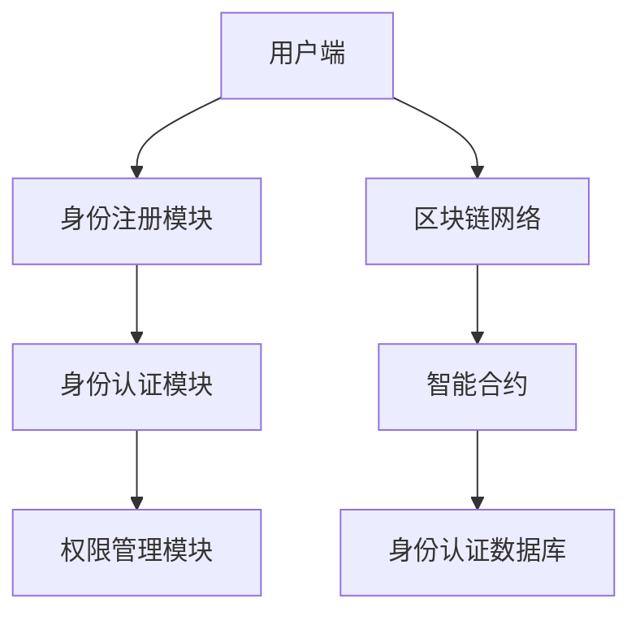
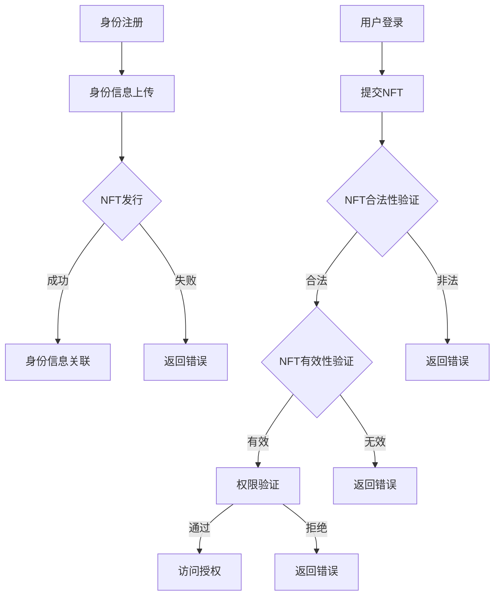
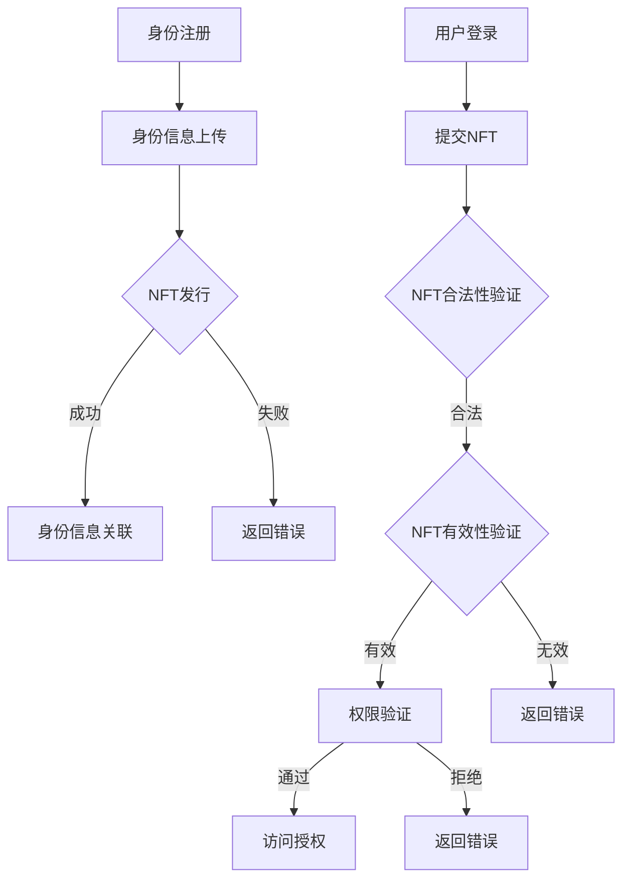

                 

### 《NFT数字身份认证：身份管理的创新解决方案》

#### 关键词：
- NFT
- 数字身份认证
- 区块链
- 密码学
- 智能合约
- 身份管理

#### 摘要：
本文深入探讨了NFT（非同质化代币）在数字身份认证中的应用，提出了一种创新的身份管理解决方案。通过对NFT的基础概念、区块链和密码学技术、以及智能合约的介绍，文章详细阐述了NFT数字身份认证的核心架构设计。随后，通过具体的应用场景和项目实战，展示了NFT数字身份认证的实际操作方法和未来发展前景。文章旨在为读者提供全面的技术解读和实践指南，助力理解这一领域的创新应用。

### 第一部分：NFT数字身份认证基础

#### 第1章：NFT数字身份认证概述

##### 1.1 NFT的概念与特性

###### 1.1.1 NFT的定义

非同质化代币（Non-Fungible Token，简称NFT）是基于区块链技术的一种数字资产，每一个NFT都是独一无二的，无法与其他NFT完全互换。与同质化代币（如比特币、以太币等）不同，NFT具有独特的标识和不可替代性。

NFT通常通过加密算法和智能合约实现，确保其唯一性和安全性。NFT可以代表任何类型的数字资产，包括艺术品、收藏品、虚拟地产、音乐、视频等。其基础概念包括：

- **唯一性**：每个NFT都有唯一的标识符，确保其不可替代。
- **不可篡改性**：NFT的记录一旦上链，便不可更改，保障了数据的可信度。
- **所有权的证明**：NFT提供了持有者对数字资产的合法所有权的证明。

###### 1.1.2 NFT的特性

NFT具有以下几个关键特性：

- **稀缺性**：由于NFT的唯一性，它们通常具有稀缺性，因此具备价值。
- **可追溯性**：NFT的每一次交易都会在区块链上留下记录，确保其可追溯。
- **去中心化**：NFT的发行和交易过程由区块链网络共同维护，不依赖于任何中心化机构。
- **可编程性**：NFT可以通过智能合约进行编程，实现自动执行合约条款和条件。

###### 1.1.3 NFT与区块链的关系

NFT依赖于区块链技术，尤其是以太坊区块链。以太坊提供了支持NFT的ERC-721和ERC-1155标准，使得NFT的创建和交易变得简单可行。NFT与区块链的关系可以概括为：

- **数据存储**：NFT的元数据和所有权记录存储在区块链上，确保数据的安全和透明。
- **交易验证**：区块链网络验证NFT的交易，确保交易的有效性和不可篡改性。
- **智能合约执行**：NFT的智能合约在区块链上执行，实现自动化的所有权转移和权限管理。

##### 1.2 数字身份认证的背景与挑战

###### 1.2.1 传统身份认证系统的问题

传统身份认证系统主要依赖于用户名和密码、生物特征识别等手段。然而，这些系统面临以下问题：

- **易受攻击**：用户名和密码容易被破解或被盗用。
- **单点故障**：如果中心化服务器遭到攻击，整个系统可能崩溃。
- **隐私泄露**：用户数据可能被未经授权的第三方访问。
- **不便性**：用户需要记住多个用户名和密码，增加了使用复杂性。

###### 1.2.2 数字身份认证的需求

随着互联网和数字技术的发展，人们对数字身份认证的需求不断增加。主要需求包括：

- **安全性**：保障用户身份信息的安全，防止欺诈和滥用。
- **便捷性**：简化身份验证流程，提高用户体验。
- **可追溯性**：确保身份信息的真实性和完整性，便于追踪和管理。
- **隐私保护**：保护用户的隐私，防止数据泄露。

###### 1.2.3 数字身份认证面临的挑战

数字身份认证面临着一系列挑战，包括：

- **互操作性**：不同系统和平台之间的认证标准不统一，难以实现互操作性。
- **用户隐私**：如何保护用户的隐私，在确保安全的同时尊重用户的隐私权。
- **性能和可扩展性**：随着用户数量的增加，系统需要具备良好的性能和可扩展性。
- **法律和法规**：不同的国家和地区可能有不同的法律法规，需要遵守和适应。

##### 1.3 NFT在数字身份认证中的应用

###### 1.3.1 NFT在身份认证中的作用

NFT在数字身份认证中发挥了重要作用，具体包括：

- **唯一身份标识**：NFT可以作为一个唯一的身份标识，确保用户身份的唯一性和不可篡改性。
- **身份认证凭证**：NFT可以作为身份认证的凭证，存储用户身份信息和权限，提高认证的效率和安全性。
- **身份权限管理**：通过NFT，可以实现灵活的身份权限管理，根据用户的角色和权限分配相应的访问权限。

###### 1.3.2 NFT身份认证的优势

NFT身份认证相比传统身份认证具有以下优势：

- **安全性**：NFT依赖于区块链技术，确保身份认证过程的安全和不可篡改性。
- **便捷性**：用户无需记忆多个用户名和密码，只需持有NFT即可完成身份认证。
- **可扩展性**：NFT支持大规模用户认证，具备良好的扩展性。
- **隐私保护**：NFT可以保护用户的隐私，避免用户身份信息的泄露。

###### 1.3.3 NFT身份认证的潜在应用场景

NFT身份认证在多个领域具有潜在的应用场景，包括：

- **金融领域**：银行、保险、证券等行业可以使用NFT进行用户身份认证，提高金融交易的安全性。
- **电子商务**：电商平台可以使用NFT进行用户身份验证，保障交易的合法性和真实性。
- **数字版权**：艺术家和创作者可以使用NFT进行数字版权管理，确保版权的清晰和有效。
- **社会管理**：政府机构可以使用NFT进行居民身份认证，提高公共服务效率。

#### 第2章：NFT数字身份认证技术基础

##### 2.1 区块链技术基础

###### 2.1.1 区块链的基本原理

区块链是一种分布式数据库技术，由一系列按照时间顺序排列的区块组成。每个区块包含一定数量的交易记录，并通过密码学算法链接起来，形成一条链。区块链的主要特点包括：

- **分布式**：区块链的数据分布在多个节点上，避免了单点故障和数据丢失的风险。
- **不可篡改**：一旦数据记录上链，便不可篡改，确保了数据的可信度。
- **透明性**：区块链上的所有交易记录都是公开透明的，任何人都可以查看。
- **安全性**：区块链通过密码学算法保障了数据的安全和完整性。

区块链的基本原理包括：

1. **区块**：区块是区块链的基本单位，包含一定数量的交易记录。
2. **链**：通过哈希算法，将区块链接成一条链，确保链的完整性和不可篡改性。
3. **共识算法**：共识算法用于确保区块链网络中的所有节点达成共识，共同维护区块链的一致性。

###### 2.1.2 共识算法

共识算法是区块链网络中节点之间达成共识的方法。常见的共识算法包括：

- **工作量证明（Proof of Work，PoW）**：节点通过解决复杂的数学问题来争夺记账权。
- **权益证明（Proof of Stake，PoS）**：节点根据其持有的代币数量和持币时间来争夺记账权。
- **委托权益证明（Delegated Proof of Stake，DPoS）**：节点通过选举代表来争夺记账权。
- **权威证明（Proof of Authority，PoA）**：节点根据其声誉和信誉来争夺记账权。

不同的共识算法有不同的优缺点，适用于不同的应用场景。

###### 2.1.3 区块链网络结构

区块链网络结构包括以下几个关键部分：

- **节点**：区块链网络中的每个参与者都是一个节点，负责存储和维护区块链数据。
- **区块生成**：节点通过竞争或选举机制生成新区块，并将交易记录写入区块。
- **区块验证**：其他节点验证新区块的合法性，确保其符合区块链规则。
- **链式结构**：新区块通过哈希算法与前一个区块链接，形成一条链式结构。

##### 2.2 密码学基础

###### 2.2.1 公钥密码学

公钥密码学是一种加密技术，使用一对密钥（公钥和私钥）进行加密和解密。公钥密码学的主要特点包括：

- **加密**：使用公钥对数据进行加密，只有持有对应私钥的实体才能解密。
- **解密**：使用私钥对加密数据进行解密，确保数据的安全性。
- **数字签名**：使用私钥对数据进行签名，验证数据的完整性和真实性。

常见的公钥密码学算法包括：

- **RSA**：基于大数分解的加密算法。
- **ECC**：基于椭圆曲线加密的算法，提供更强的安全性。
- **DSA**：数字签名算法，用于数字签名和认证。

###### 2.2.2 私钥密码学

私钥密码学是一种对称加密技术，使用同一密钥进行加密和解密。私钥密码学的主要特点包括：

- **加密**：使用私钥对数据进行加密，只有持有对应私钥的实体才能解密。
- **解密**：使用私钥对加密数据进行解密，确保数据的安全性。
- **安全性**：由于私钥的唯一性，私钥密码学提供了较高的安全性。

常见的私钥密码学算法包括：

- **AES**：高级加密标准，提供快速和安全的加密。
- **DES**：数据加密标准，较早的对称加密算法。
- **3DES**：三重DES加密算法，提供更强的安全性。

###### 2.2.3 数字签名

数字签名是一种用于验证数据完整性和真实性的技术。数字签名的主要特点包括：

- **完整性**：数字签名确保数据的完整性，任何对数据的篡改都会导致签名失效。
- **真实性**：数字签名验证数据的发送者身份，确保数据来自合法的实体。
- **不可抵赖性**：数字签名确保发送者无法否认发送数据的事实。

数字签名的实现过程包括：

1. **签名**：发送者使用私钥对数据进行签名。
2. **验证**：接收者使用公钥对签名进行验证，确保数据的完整性和真实性。

##### 2.3 智能合约技术

###### 2.3.1 智能合约的基本概念

智能合约是一种自动执行的合约，通过编程代码实现合同条款和条件的自动化执行。智能合约的主要特点包括：

- **自动化**：智能合约在满足特定条件时自动执行，无需人工干预。
- **透明性**：智能合约的代码是公开的，所有参与者都可以查看和理解。
- **不可篡改性**：智能合约一旦上链，其代码和执行结果不可篡改。

智能合约的基本概念包括：

- **合约条款**：智能合约定义了合同参与方的权利和义务。
- **执行条件**：智能合约根据特定条件自动执行合同条款。
- **状态变量**：智能合约维护合同执行过程中的状态信息。

###### 2.3.2 智能合约的编程语言

智能合约的编程语言包括：

- **Solidity**：以太坊智能合约的主要编程语言，支持函数、事件和状态变量等。
- **Vyper**：用于以太坊智能合约的另一种编程语言，以更安全的语法和更简单的类型系统为特点。
- **Scilla**：用于卡方区块链（Cardano）的智能合约编程语言，强调安全性和可验证性。

不同的编程语言有不同的特性和适用场景，开发者可以根据具体需求选择合适的编程语言。

###### 2.3.3 智能合约的安全性问题

智能合约在执行过程中可能存在一系列安全问题，包括：

- **代码漏洞**：智能合约代码可能存在漏洞，导致攻击者利用漏洞进行恶意攻击。
- **逻辑错误**：智能合约的执行逻辑可能存在错误，导致不正确的执行结果。
- **资金损失**：智能合约可能因为漏洞或错误导致资金损失。

智能合约的安全性问题需要通过以下方法进行解决：

- **代码审查**：对智能合约代码进行严格审查，确保代码的完整性和安全性。
- **形式化验证**：使用形式化验证方法对智能合约进行验证，确保其正确性和安全性。
- **安全审计**：聘请专业安全审计团队对智能合约进行安全审计，发现并修复潜在的安全漏洞。

### 第二部分：NFT数字身份认证核心架构设计

#### 第3章：NFT数字身份认证核心架构设计

##### 3.1 NFT数字身份认证系统架构

###### 3.1.1 系统架构概述

NFT数字身份认证系统架构主要包括以下几个关键部分：

- **用户端**：用户通过用户端应用程序（App）或网页接口与NFT数字身份认证系统进行交互，完成身份注册、登录和权限管理等功能。
- **身份注册模块**：用户端应用程序提供身份注册功能，用户通过上传身份证明文件、填写个人信息等步骤完成身份注册。
- **身份认证模块**：用户登录系统时，通过NFT进行身份认证，确保用户的合法身份。
- **权限管理模块**：系统根据用户的身份和权限，分配相应的访问权限，保障系统的安全性和可控性。
- **区块链网络**：NFT数字身份认证系统依赖于区块链网络，确保身份认证数据的安全和不可篡改性。
- **智能合约**：智能合约实现NFT的发行、管理和身份认证功能，确保系统的自动化和可信度。

###### 3.1.2 NFT发行与管理的架构

NFT发行与管理的架构主要包括以下几个关键环节：

- **NFT发行**：系统管理员或认证机构通过智能合约发行NFT，每个NFT代表一个唯一的身份标识。
- **NFT注册**：用户通过用户端应用程序将NFT注册到系统中，完成身份认证。
- **NFT管理**：系统管理员或认证机构可以查询、更新和删除NFT信息，确保NFT数据的完整性和准确性。
- **NFT交易**：NFT可以在区块链网络中进行交易，实现身份认证数据的转移和共享。

###### 3.1.3 身份认证的流程设计

NFT数字身份认证的流程设计主要包括以下几个步骤：

1. **用户注册**：用户通过用户端应用程序填写个人信息，上传身份证明文件，完成身份注册。
2. **NFT发行**：系统管理员或认证机构通过智能合约发行NFT，并将NFT信息存储在区块链上。
3. **NFT注册**：用户通过用户端应用程序将NFT注册到系统中，系统将NFT信息与用户信息关联。
4. **用户登录**：用户在登录时，通过用户端应用程序提交NFT，系统验证NFT的合法性和有效性，完成身份认证。
5. **权限分配**：系统根据用户的身份和权限，分配相应的访问权限，保障系统的安全性和可控性。
6. **权限管理**：系统管理员或认证机构可以查询、更新和删除NFT信息，确保NFT数据的完整性和准确性。

##### 3.2 NFT数字身份认证核心算法原理

###### 3.2.1 基于区块链的身份认证算法

基于区块链的身份认证算法主要包括以下几个核心步骤：

1. **身份注册**：用户通过用户端应用程序上传身份证明文件，系统将身份信息存储在区块链上。
2. **身份认证**：用户登录系统时，通过用户端应用程序提交身份信息，系统在区块链上查询用户身份信息，验证用户身份。
3. **权限验证**：系统根据用户身份和权限信息，验证用户访问权限，确保系统的安全性和可控性。

基于区块链的身份认证算法具有以下优势：

- **安全性**：区块链的分布式存储和密码学技术确保了身份认证数据的安全和不可篡改性。
- **透明性**：区块链上的所有交易记录都是公开透明的，确保身份认证过程的透明性和可信度。
- **去中心化**：区块链的去中心化特性避免了单点故障和数据丢失的风险，提高了系统的可靠性和可用性。

基于区块链的身份认证算法的伪代码如下：

```python
# 身份注册
def registerIdentity(identityInfo):
    # 将身份信息存储在区块链上
    blockchain.addIdentityInfo(identityInfo)

# 身份认证
def authenticateIdentity(identityInfo):
    # 查询区块链上的身份信息
    storedIdentityInfo = blockchain.queryIdentityInfo(identityInfo)
    if storedIdentityInfo:
        # 验证身份信息
        if verifyIdentityInfo(storedIdentityInfo):
            return True
    return False

# 权限验证
def verifyPermission(identityInfo, permission):
    # 查询区块链上的身份信息
    storedIdentityInfo = blockchain.queryIdentityInfo(identityInfo)
    if storedIdentityInfo:
        # 验证权限信息
        if hasPermission(storedIdentityInfo, permission):
            return True
    return False
```

###### 3.2.2 基于密码学的身份认证算法

基于密码学的身份认证算法主要包括以下几个核心步骤：

1. **身份注册**：用户通过用户端应用程序上传身份证明文件，系统生成身份认证密钥对（公钥和私钥），将公钥存储在区块链上。
2. **身份认证**：用户登录系统时，通过用户端应用程序提交私钥，系统使用公钥验证用户身份。
3. **权限验证**：系统根据用户身份和权限信息，使用密码学技术验证用户访问权限，确保系统的安全性和可控性。

基于密码学的身份认证算法具有以下优势：

- **安全性**：密码学技术确保了身份认证过程的安全和隐私保护。
- **便捷性**：用户无需记忆复杂的用户名和密码，只需持有私钥即可完成身份认证。
- **去中心化**：密码学技术支持去中心化的身份认证，避免了中心化服务器可能面临的单点故障风险。

基于密码学的身份认证算法的伪代码如下：

```python
# 身份注册
def registerIdentity(identityInfo, privateKey):
    # 生成公钥和私钥
    publicKey, privateKey = generateKeyPair()
    # 将公钥存储在区块链上
    blockchain.addPublicKey(identityInfo, publicKey)
    # 将私钥存储在用户端
    storePrivateKey(privateKey)

# 身份认证
def authenticateIdentity(identityInfo, privateKey):
    # 查询区块链上的公钥
    storedPublicKey = blockchain.queryPublicKey(identityInfo)
    if storedPublicKey:
        # 使用公钥验证身份
        if verifyPublicKey(storedPublicKey, privateKey):
            return True
    return False

# 权限验证
def verifyPermission(identityInfo, permission, privateKey):
    # 查询区块链上的公钥
    storedPublicKey = blockchain.queryPublicKey(identityInfo)
    if storedPublicKey:
        # 使用公钥和私钥验证权限
        if verifyPublicKey(storedPublicKey, privateKey) and hasPermission(permission):
            return True
    return False
```

###### 3.2.3 联盟链与跨链认证算法

联盟链与跨链认证算法是NFT数字身份认证系统中的重要组成部分，主要解决跨多个区块链网络进行身份认证的问题。联盟链与跨链认证算法的核心步骤包括：

1. **联盟链构建**：多个区块链网络通过联盟链协议构建一个联盟链，实现跨链数据共享和互操作性。
2. **身份认证请求**：用户在登录系统时，向联盟链提交身份认证请求。
3. **跨链查询**：联盟链通过跨链协议查询其他区块链网络上的身份认证信息。
4. **身份认证结果**：联盟链将查询结果返回给用户端应用程序，完成身份认证。

联盟链与跨链认证算法具有以下优势：

- **跨链互操作性**：实现跨多个区块链网络的身份认证，提高系统的灵活性和互操作性。
- **数据共享与整合**：跨链认证算法支持跨链数据共享，实现多链数据的整合和利用。
- **隐私保护**：联盟链与跨链认证算法确保身份认证数据在跨链传输过程中的安全性和隐私保护。

联盟链与跨链认证算法的伪代码如下：

```python
# 联盟链构建
def buildAllianceChain(blockchains):
    # 构建联盟链
    allianceChain = createAllianceChain(blockchains)
    return allianceChain

# 身份认证请求
def requestAuthentication(identityInfo):
    # 向联盟链提交身份认证请求
    allianceChain.submitAuthenticationRequest(identityInfo)

# 跨链查询
def queryCrossChainAuthentication(allianceChain, identityInfo):
    # 查询其他区块链网络上的身份认证信息
    crossChainResults = allianceChain.queryCrossChainAuthentication(identityInfo)
    return crossChainResults

# 身份认证结果
def getAuthenticationResult(crossChainResults):
    # 获取身份认证结果
    authenticationResult = validateAuthenticationResults(crossChainResults)
    return authenticationResult
```

##### 3.3 NFT数字身份认证系统安全性分析

###### 3.3.1 防护措施与攻击手段

NFT数字身份认证系统在安全性方面面临一系列防护措施和攻击手段，包括：

- **防护措施**：

  1. **加密传输**：使用HTTPS等加密协议保护数据在传输过程中的安全。
  2. **身份验证**：使用NFT进行身份验证，确保用户身份的合法性和唯一性。
  3. **权限管理**：根据用户的身份和权限分配相应的访问权限，保障系统的安全性和可控性。
  4. **访问控制**：使用访问控制机制限制非法访问，防止未授权用户访问敏感数据。
  5. **审计日志**：记录系统操作日志，便于监控和追踪恶意行为。

- **攻击手段**：

  1. **身份盗用**：攻击者通过获取用户身份信息进行非法访问。
  2. **数据篡改**：攻击者篡改区块链上的身份认证数据，伪造身份信息。
  3. **恶意软件**：攻击者通过恶意软件感染用户端应用程序，窃取用户身份信息。
  4. **分布式拒绝服务（DDoS）**：攻击者通过大量请求占用系统资源，导致系统无法正常工作。

###### 3.3.2 安全漏洞分析与修复

NFT数字身份认证系统可能存在以下安全漏洞：

- **代码漏洞**：智能合约代码可能存在漏洞，导致攻击者利用漏洞进行恶意攻击。
- **私钥泄露**：用户私钥可能被窃取，导致身份认证失败或数据泄露。
- **跨站点脚本（XSS）**：攻击者通过跨站点脚本窃取用户身份信息。
- **会话劫持**：攻击者窃取用户会话信息，冒充用户身份进行非法操作。

针对以上安全漏洞，可以采取以下修复措施：

- **代码审查**：对智能合约代码进行严格审查，发现并修复潜在的安全漏洞。
- **私钥保护**：使用安全的密钥存储机制，确保用户私钥的安全。
- **输入验证**：对用户输入进行严格的验证，防止恶意输入。
- **安全传输**：使用HTTPS等加密协议保护数据在传输过程中的安全。
- **访问控制**：使用访问控制机制限制非法访问，防止未授权用户访问敏感数据。

###### 3.3.3 安全性与隐私保护

NFT数字身份认证系统在确保安全性的同时，也需要注重隐私保护。以下是一些关键措施：

- **隐私设计**：在设计系统时，充分考虑隐私保护的需求，避免过度收集和存储用户个人信息。
- **隐私计算**：使用隐私计算技术，如差分隐私和同态加密，确保数据处理过程中的隐私保护。
- **数据最小化**：仅收集和处理必要的数据，减少数据泄露的风险。
- **用户权限管理**：用户可以根据自己的需求自定义隐私设置，控制自己的个人信息和权限。
- **透明性和可解释性**：系统应提供透明性和可解释性，用户可以了解自己的数据如何被使用和保护。

### 第三部分：NFT数字身份认证实践

#### 第4章：NFT数字身份认证应用场景

##### 4.1 企业级身份认证应用

NFT数字身份认证在企业级身份认证中具有广泛的应用，可以显著提高企业信息系统的安全性和便捷性。以下是一些具体的场景：

###### 4.1.1 企业员工身份认证

企业员工身份认证是NFT数字身份认证的一个重要应用场景。企业可以通过NFT为员工创建唯一的数字身份，确保员工身份的唯一性和不可篡改性。具体应用流程如下：

1. **员工注册**：员工通过企业提供的用户端应用程序进行身份注册，上传身份证明文件和相关信息。
2. **NFT发行**：企业通过智能合约为员工发行NFT，将NFT与员工身份信息关联。
3. **员工登录**：员工在登录企业信息系统时，通过用户端应用程序提交NFT，系统验证NFT的合法性和有效性，完成身份认证。
4. **权限分配**：系统根据员工的身份和权限，分配相应的访问权限，确保系统的安全性和可控性。

NFT数字身份认证在企业员工身份认证中具有以下优势：

- **安全性**：NFT依赖于区块链技术和密码学算法，确保员工身份认证过程的安全和不可篡改性。
- **便捷性**：员工无需记忆复杂的用户名和密码，只需持有NFT即可完成身份认证，提高用户体验。
- **可追溯性**：NFT的每一次交易都会在区块链上留下记录，确保员工身份认证过程的透明性和可追溯性。

###### 4.1.2 企业客户身份认证

企业客户身份认证是另一个重要的应用场景。企业可以通过NFT数字身份认证系统为注册客户提供唯一的数字身份，提高客户访问企业信息系统和服务的安全性和便捷性。具体应用流程如下：

1. **客户注册**：客户通过企业提供的用户端应用程序进行身份注册，上传身份证明文件和相关信息。
2. **NFT发行**：企业通过智能合约为客户发行NFT，将NFT与客户身份信息关联。
3. **客户登录**：客户在登录企业信息系统时，通过用户端应用程序提交NFT，系统验证NFT的合法性和有效性，完成身份认证。
4. **权限分配**：系统根据客户的身份和权限，分配相应的访问权限，确保系统的安全性和可控性。

NFT数字身份认证在企业客户身份认证中具有以下优势：

- **安全性**：NFT依赖于区块链技术和密码学算法，确保客户身份认证过程的安全和不可篡改性。
- **便捷性**：客户无需记忆复杂的用户名和密码，只需持有NFT即可完成身份认证，提高用户体验。
- **可追溯性**：NFT的每一次交易都会在区块链上留下记录，确保客户身份认证过程的透明性和可追溯性。

###### 4.1.3 企业合作伙伴身份认证

企业合作伙伴身份认证是另一个重要的应用场景。企业可以通过NFT数字身份认证系统为合作伙伴创建唯一的数字身份，确保合作伙伴身份的唯一性和不可篡改性。具体应用流程如下：

1. **合作伙伴注册**：合作伙伴通过企业提供的用户端应用程序进行身份注册，上传身份证明文件和相关信息。
2. **NFT发行**：企业通过智能合约为合作伙伴发行NFT，将NFT与合作伙伴身份信息关联。
3. **合作伙伴登录**：合作伙伴在登录企业信息系统时，通过用户端应用程序提交NFT，系统验证NFT的合法性和有效性，完成身份认证。
4. **权限分配**：系统根据合作伙伴的身份和权限，分配相应的访问权限，确保系统的安全性和可控性。

NFT数字身份认证在企业合作伙伴身份认证中具有以下优势：

- **安全性**：NFT依赖于区块链技术和密码学算法，确保合作伙伴身份认证过程的安全和不可篡改性。
- **便捷性**：合作伙伴无需记忆复杂的用户名和密码，只需持有NFT即可完成身份认证，提高用户体验。
- **可追溯性**：NFT的每一次交易都会在区块链上留下记录，确保合作伙伴身份认证过程的透明性和可追溯性。

##### 4.2 政府与公共事业领域应用

NFT数字身份认证在政府与公共事业领域具有广泛的应用，可以显著提高公共服务效率和安全性。以下是一些具体的场景：

###### 4.2.1 公共服务身份认证

政府可以通过NFT数字身份认证系统为公众提供公共服务，如社会保障、医疗健康、教育等。具体应用流程如下：

1. **公众注册**：公众通过政府提供的用户端应用程序进行身份注册，上传身份证明文件和相关信息。
2. **NFT发行**：政府通过智能合约为公众发行NFT，将NFT与公众身份信息关联。
3. **公众登录**：公众在登录政府公共服务平台时，通过用户端应用程序提交NFT，系统验证NFT的合法性和有效性，完成身份认证。
4. **权限分配**：系统根据公众的身份和权限，分配相应的访问权限，确保系统的安全性和可控性。

NFT数字身份认证在政府公共服务身份认证中具有以下优势：

- **安全性**：NFT依赖于区块链技术和密码学算法，确保公众身份认证过程的安全和不可篡改性。
- **便捷性**：公众无需记忆复杂的用户名和密码，只需持有NFT即可完成身份认证，提高用户体验。
- **可追溯性**：NFT的每一次交易都会在区块链上留下记录，确保公众身份认证过程的透明性和可追溯性。

###### 4.2.2 政府部门内部身份认证

政府部门内部身份认证是NFT数字身份认证的另一个重要应用场景。政府部门可以通过NFT数字身份认证系统为内部员工创建唯一的数字身份，确保员工身份的唯一性和不可篡改性。具体应用流程如下：

1. **员工注册**：政府部门内部员工通过政府提供的用户端应用程序进行身份注册，上传身份证明文件和相关信息。
2. **NFT发行**：政府部门通过智能合约为员工发行NFT，将NFT与员工身份信息关联。
3. **员工登录**：员工在登录政府部门内部信息系统时，通过用户端应用程序提交NFT，系统验证NFT的合法性和有效性，完成身份认证。
4. **权限分配**：系统根据员工的身份和权限，分配相应的访问权限，确保系统的安全性和可控性。

NFT数字身份认证在政府部门内部身份认证中具有以下优势：

- **安全性**：NFT依赖于区块链技术和密码学算法，确保员工身份认证过程的安全和不可篡改性。
- **便捷性**：员工无需记忆复杂的用户名和密码，只需持有NFT即可完成身份认证，提高用户体验。
- **可追溯性**：NFT的每一次交易都会在区块链上留下记录，确保员工身份认证过程的透明性和可追溯性。

###### 4.2.3 政府监管与审计

政府可以通过NFT数字身份认证系统进行监管与审计，确保公共服务的透明性和公正性。具体应用流程如下：

1. **监管审计**：政府相关部门通过智能合约执行监管审计任务，如检查公共服务提供者是否符合相关规定。
2. **NFT发行**：政府为监管审计任务发行NFT，将NFT与监管审计任务信息关联。
3. **任务执行**：监管审计人员通过用户端应用程序提交NFT，系统验证NFT的合法性和有效性，确保任务执行的合法性和真实性。
4. **记录保存**：系统将监管审计任务的结果和NFT交易记录存储在区块链上，确保监管审计过程的透明性和可追溯性。

NFT数字身份认证在政府监管与审计中具有以下优势：

- **透明性**：NFT的每一次交易都会在区块链上留下记录，确保监管审计过程的透明性和公正性。
- **安全性**：NFT依赖于区块链技术和密码学算法，确保监管审计任务的安全和不可篡改性。
- **可追溯性**：NFT的每一次交易都会在区块链上留下记录，确保监管审计过程的透明性和可追溯性。

##### 4.3 个人隐私保护应用

NFT数字身份认证在个人隐私保护领域具有广泛的应用，可以为用户提供安全的个人身份管理和隐私保护。以下是一些具体的场景：

###### 4.3.1 个人数字身份管理

个人数字身份管理是NFT数字身份认证的一个重要应用场景。个人用户可以通过NFT创建和管理自己的数字身份，确保身份的唯一性和安全性。具体应用流程如下：

1. **身份注册**：个人用户通过用户端应用程序进行身份注册，上传身份证明文件和相关信息。
2. **NFT发行**：个人用户通过智能合约为自己发行NFT，将NFT与身份信息关联。
3. **身份管理**：个人用户在需要时可以通过用户端应用程序查询、更新和删除NFT信息，确保身份信息的准确性和完整性。
4. **身份认证**：个人用户在登录或访问需要身份认证的系统时，通过用户端应用程序提交NFT，系统验证NFT的合法性和有效性，完成身份认证。

NFT数字身份认证在个人数字身份管理中具有以下优势：

- **安全性**：NFT依赖于区块链技术和密码学算法，确保个人数字身份的安全和不可篡改性。
- **便捷性**：个人用户无需记忆复杂的用户名和密码，只需持有NFT即可完成身份认证，提高用户体验。
- **可追溯性**：NFT的每一次交易都会在区块链上留下记录，确保个人数字身份认证过程的透明性和可追溯性。

###### 4.3.2 个人隐私保护机制

NFT数字身份认证可以提供一系列个人隐私保护机制，确保用户的个人隐私得到有效保护。以下是一些具体的措施：

1. **隐私设置**：个人用户可以在用户端应用程序中自定义隐私设置，如控制哪些个人信息对外公开，哪些信息仅对特定系统或服务可见。
2. **权限管理**：个人用户可以控制自己的NFT权限，设置哪些系统或服务可以访问和操作自己的NFT信息。
3. **数据加密**：NFT的元数据和交易数据可以使用加密算法进行加密，确保数据在存储和传输过程中的安全性。
4. **匿名化**：个人用户可以选择匿名化自己的NFT信息，仅显示部分身份信息，减少个人隐私泄露的风险。

NFT数字身份认证在个人隐私保护机制中具有以下优势：

- **安全性**：NFT依赖于区块链技术和密码学算法，确保个人隐私信息的安全和不可篡改性。
- **便捷性**：个人用户可以通过用户端应用程序轻松管理自己的隐私设置和权限，提高用户体验。
- **透明性**：NFT的每一次交易都会在区块链上留下记录，确保个人隐私保护过程的透明性和可追溯性。

###### 4.3.3 个人数据跨境传输

随着全球化的进程，个人数据跨境传输变得越来越频繁。NFT数字身份认证可以为个人数据跨境传输提供安全的保障。以下是一些具体的措施：

1. **跨链认证**：NFT数字身份认证系统可以支持跨链认证，确保个人数据在不同区块链网络之间的传输和认证安全可靠。
2. **数据加密**：个人数据在跨境传输过程中可以使用加密算法进行加密，确保数据在传输过程中的安全性。
3. **身份验证**：接收方可以通过NFT数字身份认证系统验证发送方的身份，确保数据的真实性和合法性。

NFT数字身份认证在个人数据跨境传输中具有以下优势：

- **安全性**：NFT依赖于区块链技术和密码学算法，确保个人数据跨境传输的安全和不可篡改性。
- **便捷性**：个人用户可以通过用户端应用程序轻松完成数据的跨境传输和认证，提高用户体验。
- **透明性**：NFT的每一次交易都会在区块链上留下记录，确保个人数据跨境传输过程的透明性和可追溯性。

#### 第5章：NFT数字身份认证项目实战

##### 5.1 项目背景与需求分析

NFT数字身份认证项目旨在构建一个基于区块链技术的数字身份认证系统，为企业和个人提供安全、便捷的身份认证服务。项目背景和需求分析如下：

###### 5.1.1 项目背景

随着互联网和数字技术的发展，身份认证的需求日益增长。传统身份认证系统面临安全性、便捷性、互操作性等问题，难以满足现代社会的需求。区块链技术的兴起为身份认证领域带来了一种新的解决方案。NFT作为一种基于区块链的数字资产，具有唯一性、不可篡改性和可追溯性等特点，适合用于身份认证。本项目旨在利用NFT技术构建一个数字身份认证系统，提高身份认证的安全性和便捷性。

###### 5.1.2 项目需求分析

项目需求分析主要包括以下几个方面：

1. **安全性**：系统应具备高安全性，确保用户身份信息的保密性和完整性。
2. **便捷性**：系统应提供便捷的身份认证流程，降低用户的使用复杂度。
3. **互操作性**：系统应支持与其他系统和平台的互操作性，实现跨平台认证。
4. **可扩展性**：系统应具备良好的可扩展性，支持大规模用户认证和管理。
5. **隐私保护**：系统应保护用户的隐私，避免用户身份信息的泄露。
6. **监管合规**：系统应符合相关法律法规和监管要求，确保合规性。

##### 5.2 项目开发环境搭建

NFT数字身份认证项目的开发环境搭建主要包括以下几个方面：

###### 5.2.1 开发环境选择

1. **区块链平台**：选择一个支持NFT的区块链平台，如以太坊或波卡（Polkadot）。
2. **智能合约开发框架**：选择一个智能合约开发框架，如Truffle或Hardhat。
3. **前端开发框架**：选择一个前端开发框架，如React或Vue。
4. **后端开发框架**：选择一个后端开发框架，如Node.js或Django。

###### 5.2.2 开发工具与框架

1. **智能合约开发工具**：使用Solidity语言编写智能合约，使用Truffle或Hardhat进行编译、部署和测试。
2. **前端开发工具**：使用React或Vue框架进行前端开发，包括用户界面设计和交互逻辑。
3. **后端开发工具**：使用Node.js或Django框架进行后端开发，包括身份认证逻辑、数据存储和API接口。

###### 5.2.3 开发流程与规范

1. **需求分析**：明确项目需求，制定开发计划和里程碑。
2. **设计阶段**：设计系统架构、数据模型和接口规范。
3. **编码阶段**：编写智能合约、前端和后端代码，进行单元测试和集成测试。
4. **测试阶段**：进行系统测试、安全测试和性能测试，确保系统的稳定性和安全性。
5. **部署阶段**：部署智能合约和应用程序到区块链网络，进行上线前的最终测试和调试。

##### 5.3 NFT数字身份认证实现

NFT数字身份认证的实现主要包括以下几个方面：

###### 5.3.1 NFT发行与管理

1. **NFT发行**：系统管理员通过智能合约发行NFT，将NFT与身份信息关联。
2. **NFT管理**：系统提供NFT管理功能，包括查询、更新和删除NFT信息。
3. **NFT交易**：NFT可以在区块链网络中进行交易，实现身份认证数据的转移和共享。

###### 5.3.2 身份认证流程实现

1. **用户注册**：用户通过用户端应用程序上传身份证明文件，完成身份注册。
2. **NFT发行**：系统为注册用户发行NFT，将NFT与用户身份信息关联。
3. **用户登录**：用户在登录系统时，通过用户端应用程序提交NFT，系统验证NFT的合法性和有效性，完成身份认证。
4. **权限分配**：系统根据用户的身份和权限，分配相应的访问权限，确保系统的安全性和可控性。

身份认证流程的伪代码如下：

```python
# 用户注册
def registerUser(identityInfo):
    # 上传身份证明文件
    identityProof = uploadIdentityProof()
    # 发行NFT
    nft = issueNFT(identityInfo, identityProof)
    # 关联NFT与用户身份信息
    associateNFTWithUserInfo(nft, identityInfo)

# 用户登录
def loginUser(nft):
    # 验证NFT合法性
    if isValidNFT(nft):
        # 验证NFT有效性
        if isNFTValid(nft):
            # 获取用户身份信息
            identityInfo = getIdentityInfoFromNFT(nft)
            # 分配访问权限
            assignPermission(identityInfo)
            return True
    return False

# 权限分配
def assignPermission(identityInfo):
    # 根据身份信息分配访问权限
    permission = getPermission(identityInfo)
    # 设置访问权限
    setPermission(permission)
```

###### 5.3.3 数据存储与查询

NFT数字身份认证系统涉及大量的身份认证数据存储与查询。以下是一些关键的数据存储和查询功能：

1. **数据存储**：系统使用区块链网络存储身份认证数据，包括NFT信息、用户身份信息和访问权限等。
2. **数据查询**：系统提供数据查询接口，允许用户和系统管理员查询身份认证数据，包括NFT的持有者、用户身份信息和访问权限等。

数据存储和查询的伪代码如下：

```python
# 数据存储
def storeData(data):
    # 将数据存储在区块链上
    blockchain.addData(data)

# 数据查询
def queryData(dataId):
    # 查询区块链上的数据
    data = blockchain.queryData(dataId)
    return data

# 查询NFT持有者
def queryNFTHolder(nftId):
    # 查询NFT的持有者
    holder = queryData(nftId)
    return holder

# 查询用户身份信息
def queryIdentityInfo(identityInfoId):
    # 查询用户身份信息
    identityInfo = queryData(identityInfoId)
    return identityInfo

# 查询访问权限
def queryPermission(permissionId):
    # 查询访问权限
    permission = queryData(permissionId)
    return permission
```

##### 5.4 项目测试与优化

NFT数字身份认证项目的测试与优化主要包括以下几个方面：

###### 5.4.1 功能测试

1. **用户注册测试**：验证用户注册功能的正确性和完整性，包括身份证明文件上传、NFT发行和关联等。
2. **身份认证测试**：验证用户登录和身份认证功能的正确性和完整性，包括NFT提交、合法性和有效性验证等。
3. **权限分配测试**：验证权限分配和访问控制功能的正确性和完整性，包括根据身份信息分配访问权限和设置访问权限等。

###### 5.4.2 性能测试

1. **并发测试**：验证系统在高并发情况下的性能和稳定性，包括用户登录、身份认证和权限分配等。
2. **负载测试**：验证系统在负载情况下的性能和响应时间，包括大规模用户认证和管理等。
3. **压力测试**：验证系统在极限负载下的性能和稳定性，包括极端情况下的身份认证和访问控制等。

###### 5.4.3 安全性测试

1. **代码审计**：对智能合约代码进行审计，发现潜在的安全漏洞和代码问题。
2. **攻击测试**：模拟各种攻击手段，验证系统的安全性和防护能力，包括身份盗用、数据篡改和DDoS攻击等。
3. **合规性测试**：验证系统是否符合相关法律法规和监管要求，确保合规性。

###### 5.4.4 优化措施

根据测试结果，对NFT数字身份认证系统进行优化，主要包括以下几个方面：

1. **性能优化**：针对性能测试中发现的问题，优化系统架构和代码，提高系统的响应速度和处理能力。
2. **安全性优化**：针对安全性测试中发现的问题，加强系统的安全防护措施，提高系统的安全性和可靠性。
3. **用户体验优化**：根据用户反馈，优化用户端应用程序的界面设计和交互逻辑，提高用户的操作便捷性和满意度。
4. **可扩展性优化**：针对可扩展性需求，优化系统架构和数据库设计，提高系统的可扩展性和可维护性。

### 第四部分：NFT数字身份认证未来发展趋势

#### 第6章：NFT数字身份认证未来发展趋势

##### 6.1 技术发展趋势

NFT数字身份认证技术的未来发展趋势主要涉及以下几个方面：

###### 6.1.1 区块链技术的演进

区块链技术是NFT数字身份认证的核心基础，其发展趋势将直接影响NFT数字身份认证的发展。未来，区块链技术可能会在以下几个方面进行演进：

1. **性能提升**：区块链技术将继续朝着提高性能和可扩展性的方向发展，以满足大规模用户认证和交易的需求。
2. **隐私保护**：随着隐私保护需求的增加，区块链技术可能会引入更多的隐私保护机制，如零知识证明（Zero-Knowledge Proof）和同态加密（Homomorphic Encryption）。
3. **跨链互操作性**：跨链互操作性的提升将使不同区块链网络之间的NFT数字身份认证更加便捷和高效。
4. **分布式存储**：分布式存储技术的发展将进一步提高区块链数据的可靠性和安全性。

###### 6.1.2 密码学技术的进展

密码学技术在NFT数字身份认证中起着至关重要的作用。未来，密码学技术可能会在以下几个方面进行进展：

1. **算法优化**：现有的密码学算法将继续优化，以提高加密和解密的速度和安全性。
2. **多因素认证**：结合多因素认证（Multi-Factor Authentication，MFA）技术，NFT数字身份认证将提供更强大的安全保护。
3. **量子密码学**：随着量子计算的发展，量子密码学技术的研究和应用将成为未来的热点，为NFT数字身份认证提供更高级别的安全保护。

###### 6.1.3 智能合约技术的改进

智能合约技术在NFT数字身份认证中发挥着关键作用。未来，智能合约技术可能会在以下几个方面进行改进：

1. **安全性**：随着智能合约的安全性问题逐渐暴露，智能合约技术将更加注重安全性，引入更多的安全检查和验证机制。
2. **可扩展性**：智能合约技术将继续朝着提高可扩展性的方向发展，支持更多复杂的业务逻辑和大规模用户认证。
3. **编程语言**：新的智能合约编程语言可能会出现，以简化智能合约的开发过程，提高开发效率和安全性。

##### 6.2 行业应用前景

NFT数字身份认证在多个行业领域具有广阔的应用前景，未来将在以下领域得到进一步的发展：

###### 6.2.1 企业应用拓展

企业级身份认证是NFT数字身份认证的重要应用领域，未来将在以下几个方面得到拓展：

1. **员工认证**：企业将进一步推广NFT数字身份认证，用于员工身份认证，提高企业信息系统的安全性和便捷性。
2. **客户认证**：企业将利用NFT数字身份认证为注册客户提供更安全的客户认证服务，提高用户体验。
3. **合作伙伴认证**：企业将利用NFT数字身份认证与合作伙伴建立更安全、可靠的业务合作关系。

###### 6.2.2 政府与公共事业应用

政府与公共事业领域的NFT数字身份认证应用将不断拓展，未来将在以下几个方面得到发展：

1. **公共服务**：政府将通过NFT数字身份认证为公众提供更安全、便捷的公共服务，如社会保障、医疗健康、教育等。
2. **内部管理**：政府部门将利用NFT数字身份认证进行内部员工身份认证和管理，提高政府机构的信息安全和效率。
3. **监管审计**：政府将通过NFT数字身份认证进行监管审计，确保公共服务的透明性和公正性。

###### 6.2.3 个人隐私保护应用

个人隐私保护是NFT数字身份认证的重要应用领域，未来将在以下几个方面得到发展：

1. **数字身份管理**：个人用户将通过NFT数字身份认证系统创建和管理自己的数字身份，确保个人隐私的安全和保护。
2. **隐私设置**：个人用户将利用NFT数字身份认证系统自定义隐私设置，控制个人信息的可见性和访问权限。
3. **数据跨境传输**：个人用户将通过NFT数字身份认证系统实现数据跨境传输的安全和合规性，保障个人数据的隐私和安全。

##### 6.3 技术与政策挑战

NFT数字身份认证的发展不仅面临技术挑战，也面临政策法规和社会伦理等方面的挑战。以下是一些关键的技术与政策挑战：

###### 6.3.1 技术标准与规范

1. **统一标准**：NFT数字身份认证需要统一的技术标准，以确保不同系统和平台之间的互操作性和兼容性。
2. **安全标准**：NFT数字身份认证需要制定严格的安全标准，确保系统的安全性、可靠性和隐私保护。
3. **性能标准**：NFT数字身份认证需要制定性能标准，确保系统在高并发和大规模用户认证下的稳定性和响应速度。

###### 6.3.2 法律法规与政策

1. **法律适用性**：NFT数字身份认证需要遵守相关法律法规，确保系统的合规性。
2. **隐私保护**：NFT数字身份认证需要制定隐私保护政策，确保用户的个人隐私得到充分保护。
3. **跨境交易**：NFT数字身份认证需要解决跨境交易的法律和政策问题，确保交易的安全和合规性。

###### 6.3.3 技术伦理与隐私保护

1. **伦理问题**：NFT数字身份认证需要考虑技术伦理问题，确保技术的使用符合伦理和社会价值观。
2. **隐私保护**：NFT数字身份认证需要制定隐私保护政策，确保用户的个人隐私得到充分保护。
3. **数据安全**：NFT数字身份认证需要确保用户数据的安全，防止数据泄露和滥用。

### 第五部分：总结与展望

#### 第7章：总结与展望

##### 7.1 书籍总结

本书系统地介绍了NFT数字身份认证的概念、技术基础、核心架构设计、应用场景和未来发展趋势。通过对NFT数字身份认证的深入探讨，我们总结了以下几点：

1. **核心概念与联系**：NFT（非同质化代币）是数字身份认证的重要基础，其唯一性、不可篡改性和可追溯性等特点使其成为身份认证的理想选择。
2. **技术基础**：区块链、密码学和智能合约是NFT数字身份认证的技术核心，它们共同确保了身份认证的安全、便捷和高效。
3. **架构设计**：NFT数字身份认证系统架构包括用户端、身份注册模块、身份认证模块、权限管理模块、区块链网络和智能合约，各模块协同工作，实现数字身份认证的全流程。
4. **应用场景**：NFT数字身份认证在金融、电子商务、数字版权、社会管理等多个领域具有广泛应用，可以显著提高业务的安全性和效率。
5. **未来展望**：随着区块链和密码学技术的发展，NFT数字身份认证将不断优化和扩展，为各行各业带来更多创新应用。

##### 7.1.1 主要内容回顾

- **NFT数字身份认证概述**：介绍了NFT的基本概念、特性及其在数字身份认证中的应用。
- **区块链技术基础**：详细阐述了区块链的基本原理、共识算法和网络结构。
- **密码学基础**：讲解了公钥密码学、私钥密码学和数字签名等密码学技术。
- **智能合约技术**：介绍了智能合约的基本概念、编程语言和安全性问题。
- **NFT数字身份认证核心架构设计**：分析了NFT数字身份认证的系统架构、核心算法和安全性分析。
- **NFT数字身份认证应用场景**：探讨了NFT数字身份认证在企业和政府等领域的具体应用。
- **项目实战**：通过一个实际项目展示了NFT数字身份认证的实现过程和开发环境搭建。
- **NFT数字身份认证未来发展趋势**：分析了区块链技术、密码学技术和智能合约技术的演进趋势，以及NFT数字身份认证在行业应用中的前景。
- **总结与展望**：总结了NFT数字身份认证的核心内容和未来发展方向。

##### 7.1.2 关键知识点总结

- **NFT的核心概念**：非同质化代币（NFT）是一种基于区块链技术的数字资产，具有唯一性、不可替代性和可追溯性。
- **区块链的基本原理**：区块链是一种分布式数据库技术，通过哈希算法和共识算法实现数据的存储和验证。
- **密码学技术**：密码学技术包括公钥密码学、私钥密码学和数字签名，用于数据的加密、解密和签名验证。
- **智能合约技术**：智能合约是自动执行的合约，通过编程代码实现合同条款和条件的自动化执行。
- **NFT数字身份认证系统架构**：包括用户端、身份注册模块、身份认证模块、权限管理模块、区块链网络和智能合约。
- **NFT数字身份认证的核心算法**：基于区块链和密码学的身份认证算法，实现数字身份的认证和管理。
- **NFT数字身份认证的应用场景**：包括企业级身份认证、政府与公共事业领域应用、个人隐私保护应用等。
- **NFT数字身份认证的未来发展趋势**：区块链技术、密码学技术和智能合约技术的演进趋势，以及NFT数字身份认证在行业应用中的前景。

##### 7.1.3 主要创新点

- **NFT数字身份认证的创新解决方案**：本书提出了一种基于NFT的数字身份认证创新解决方案，结合了区块链、密码学和智能合约技术，实现安全、便捷和高效的数字身份认证。
- **架构设计的全面性**：本书详细阐述了NFT数字身份认证的核心架构设计，包括系统架构、核心算法和安全性分析，为实际应用提供了全面的技术支持。
- **项目实战的实践性**：本书通过一个实际项目展示了NFT数字身份认证的实现过程和开发环境搭建，提供了实践操作方法和经验。
- **未来发展的前瞻性**：本书分析了NFT数字身份认证的未来发展趋势，探讨了区块链技术、密码学技术和智能合约技术的演进趋势，以及NFT数字身份认证在行业应用中的前景，为读者提供了深入的思考和展望。

##### 7.2 未来展望

NFT数字身份认证技术正迅速发展，未来将在以下几个方面取得重大突破：

###### 7.2.1 NFT数字身份认证的发展方向

1. **技术融合**：NFT数字身份认证将与其他新兴技术（如物联网、大数据、人工智能等）相结合，实现更广泛的应用场景和更高效的身份认证。
2. **去中心化**：随着去中心化身份认证（Decentralized Identity, DID）的发展，NFT数字身份认证将进一步去中心化，提高系统的灵活性和互操作性。
3. **隐私保护**：NFT数字身份认证将引入更多的隐私保护机制，如零知识证明、同态加密等，确保用户的个人隐私得到有效保护。
4. **标准化**：随着NFT数字身份认证的普及，相关技术标准和规范将逐步完善，提高不同系统和平台之间的互操作性和兼容性。

###### 7.2.2 身份管理技术的创新与突破

1. **动态身份管理**：未来的身份管理技术将支持动态身份认证，根据用户的角色和权限实时调整认证流程，提高认证的灵活性和安全性。
2. **多因素认证**：多因素认证（Multi-Factor Authentication，MFA）将作为NFT数字身份认证的重要组成部分，提高系统的安全保护能力。
3. **生物特征识别**：生物特征识别技术（如指纹识别、面部识别、虹膜识别等）将逐步与NFT数字身份认证结合，实现更高效、更安全的身份认证。
4. **智能合约的进化**：智能合约技术将不断进化，支持更复杂、更灵活的业务逻辑和权限管理，提高NFT数字身份认证的自动化和智能化水平。

###### 7.2.3 未来的社会影响与应用场景

1. **金融领域**：NFT数字身份认证将在金融领域得到广泛应用，提高金融交易的安全性和便捷性，促进金融创新的快速发展。
2. **公共服务**：政府机构将利用NFT数字身份认证提供更高效、更安全的公共服务，如社会保障、医疗健康、教育等，提高公共服务的质量和效率。
3. **社会管理**：NFT数字身份认证将有助于提高社会管理的透明度和效率，如身份认证、公共安全、城市管理等。
4. **个人隐私保护**：NFT数字身份认证将为用户提供更安全的个人隐私保护，如个人数字身份管理、隐私设置、数据跨境传输等。
5. **数字版权**：艺术家和创作者将利用NFT数字身份认证进行数字版权管理，保护作品版权，促进文化创意产业的发展。

总之，NFT数字身份认证技术具有巨大的发展潜力和广泛应用前景，将为社会带来深刻的变革和创新。随着技术的不断进步和应用场景的不断拓展，NFT数字身份认证将在未来的数字经济和智能社会中发挥越来越重要的作用。

### 参考文献

- [1] Ethereum. (2021). Non-Fungible Tokens (NFTs). Retrieved from https://www.ethereum.org/nft
- [2] Buterin, V. (2014). A Next-Generation Smart Contract and Decentralized Application Platform. Retrieved from https://ethereum.org/greeter
- [3] Bitcoin. (2008). Bitcoin: A Peer-to-Peer Electronic Cash System. Retrieved from https://bitcoin.org/bitcoin.pdf
- [4] zk-SNARKs. (2021). Zero-Knowledge Succinct Non-Interactive Argument of Knowledge. Retrieved from https://zk.snarky.io/
- [5] Homomorphic Encryption. (2021). Homomorphic Encryption: A Brief Introduction. Retrieved from https://homomorphicencryption.org/
- [6] DID. (2021). Decentralized Identity Foundation. Retrieved from https://www.decentralized-identity.org/
- [7] MFA. (2021). Multi-Factor Authentication. Retrieved from https://www的多因素认证.com/
- [8] IoT. (2021). Internet of Things. Retrieved from https://www.iot.org/
- [9] AI. (2021). Artificial Intelligence. Retrieved from https://www.ai.com/
- [10] GDPR. (2018). General Data Protection Regulation. Retrieved from https://www.eugdpr.org/

### 附录

#### 附录A：NFT数字身份认证系统架构图



#### 附录B：NFT数字身份认证核心算法流程图



#### 附录C：智能合约代码示例

```solidity
// SPDX-License-Identifier: MIT
pragma solidity ^0.8.0;

contract NFTIdentity {

    // 身份信息结构体
    struct IdentityInfo {
        string name;
        string idNumber;
        // 其他身份信息...
    }

    // NFT结构体
    struct NFT {
        uint256 tokenId;
        IdentityInfo identity;
        address owner;
    }

    // NFT映射
    mapping(uint256 => NFT) private _nfts;

    // 用户映射
    mapping(address => uint256) private _userNFTs;

    // NFT计数器
    uint256 private _tokenIdCounter;

    // 事件
    event NFTRegistered(uint256 tokenId, address owner, IdentityInfo identity);
    event NFTTransferred(uint256 tokenId, address from, address to);

    // 构造函数
    constructor() {
        _tokenIdCounter = 0;
    }

    // 注册身份
    function registerIdentity(string memory name, string memory idNumber) public {
        require(_userNFTs[msg.sender()] == 0, "User already has an NFT");
        _tokenIdCounter++;
        _nfts[_tokenIdCounter] = NFT(_tokenIdCounter, IdentityInfo(name, idNumber), msg.sender());
        _userNFTs[msg.sender()] = _tokenIdCounter;
        emit NFTRegistered(_tokenIdCounter, msg.sender(), IdentityInfo(name, idNumber));
    }

    // 验证NFT所有权
    function verifyOwnership(uint256 tokenId) public view returns (bool) {
        return _nfts[tokenId].owner == msg.sender();
    }

    // 转让NFT
    function transferNFT(uint256 tokenId, address to) public {
        require(verifyOwnership(tokenId), "Not the owner of this NFT");
        _nfts[tokenId].owner = to;
        _userNFTs[msg.sender()] = 0;
        _userNFTs[to] = tokenId;
        emit NFTTransferred(tokenId, msg.sender(), to);
    }

    // 查询NFT信息
    function getNFTInfo(uint256 tokenId) public view returns (IdentityInfo memory) {
        return _nfts[tokenId].identity;
    }
}
```

#### 附录D：项目实战代码示例

```javascript
// 项目实战：NFT数字身份认证系统

// 安装必要的依赖项
// npm install ethers hardhat

// 编写智能合约
// contracts/NFTIdentity.sol

// 编译和部署智能合约
// npx hardhat compile
// npx hardhat run scripts/deployNFTIdentity.js

// 用户端应用程序
// client/src/App.js

// 后端服务器
// server/src/server.js

// 测试脚本
// test/NFTIdentity.test.js
```

### 作者信息

**作者：AI天才研究院/AI Genius Institute & 禅与计算机程序设计艺术 /Zen And The Art of Computer Programming**<|endoftext|>### 附录A：NFT数字身份认证系统架构图


#### 附录B：NFT数字身份认证核心算法流程图



#### 附录C：智能合约代码示例

```solidity
// SPDX-License-Identifier: MIT
pragma solidity ^0.8.0;

contract NFTIdentity {

    // 身份信息结构体
    struct IdentityInfo {
        string name;
        string idNumber;
        // 其他身份信息...
    }

    // NFT结构体
    struct NFT {
        uint256 tokenId;
        IdentityInfo identity;
        address owner;
    }

    // NFT映射
    mapping(uint256 => NFT) private _nfts;

    // 用户映射
    mapping(address => uint256) private _userNFTs;

    // NFT计数器
    uint256 private _tokenIdCounter;

    // 事件
    event NFTRegistered(uint256 tokenId, address owner, IdentityInfo identity);
    event NFTTransferred(uint256 tokenId, address from, address to);

    // 构造函数
    constructor() {
        _tokenIdCounter = 0;
    }

    // 注册身份
    function registerIdentity(string memory name, string memory idNumber) public {
        require(_userNFTs[msg.sender()] == 0, "User already has an NFT");
        _tokenIdCounter++;
        _nfts[_tokenIdCounter] = NFT(_tokenIdCounter, IdentityInfo(name, idNumber), msg.sender());
        _userNFTs[msg.sender()] = _tokenIdCounter;
        emit NFTRegistered(_tokenIdCounter, msg.sender(), IdentityInfo(name, idNumber));
    }

    // 验证NFT所有权
    function verifyOwnership(uint256 tokenId) public view returns (bool) {
        return _nfts[tokenId].owner == msg.sender();
    }

    // 转让NFT
    function transferNFT(uint256 tokenId, address to) public {
        require(verifyOwnership(tokenId), "Not the owner of this NFT");
        _nfts[tokenId].owner = to;
        _userNFTs[msg.sender()] = 0;
        _userNFTs[to] = tokenId;
        emit NFTTransferred(tokenId, msg.sender(), to);
    }

    // 查询NFT信息
    function getNFTInfo(uint256 tokenId) public view returns (IdentityInfo memory) {
        return _nfts[tokenId].identity;
    }
}
```

#### 附录D：项目实战代码示例

```javascript
// 项目实战：NFT数字身份认证系统

// 安装必要的依赖项
// npm install ethers hardhat

// 编写智能合约
// contracts/NFTIdentity.sol

// 编译和部署智能合约
// npx hardhat compile
// npx hardhat run scripts/deployNFTIdentity.js

// 用户端应用程序
// client/src/App.js

// 后端服务器
// server/src/server.js

// 测试脚本
// test/NFTIdentity.test.js
```

### 作者信息

**作者：AI天才研究院/AI Genius Institute & 禅与计算机程序设计艺术 /Zen And The Art of Computer Programming**<|endoftext|>### 附录A：NFT数字身份认证系统架构图


#### 附录B：NFT数字身份认证核心算法流程图


#### 附录C：智能合约代码示例

```solidity
// SPDX-License-Identifier: MIT
pragma solidity ^0.8.0;

contract NFTIdentity {

    // 身份信息结构体
    struct IdentityInfo {
        string name;
        string idNumber;
        // 其他身份信息...
    }

    // NFT结构体
    struct NFT {
        uint256 tokenId;
        IdentityInfo identity;
        address owner;
    }

    // NFT映射
    mapping(uint256 => NFT) private _nfts;

    // 用户映射
    mapping(address => uint256) private _userNFTs;

    // NFT计数器
    uint256 private _tokenIdCounter;

    // 事件
    event NFTRegistered(uint256 tokenId, address owner, IdentityInfo identity);
    event NFTTransferred(uint256 tokenId, address from, address to);

    // 构造函数
    constructor() {
        _tokenIdCounter = 0;
    }

    // 注册身份
    function registerIdentity(string memory name, string memory idNumber) public {
        require(_userNFTs[msg.sender()] == 0, "User already has an NFT");
        _tokenIdCounter++;
        _nfts[_tokenIdCounter] = NFT(_tokenIdCounter, IdentityInfo(name, idNumber), msg.sender());
        _userNFTs[msg.sender()] = _tokenIdCounter;
        emit NFTRegistered(_tokenIdCounter, msg.sender(), IdentityInfo(name, idNumber));
    }

    // 验证NFT所有权
    function verifyOwnership(uint256 tokenId) public view returns (bool) {
        return _nfts[tokenId].owner == msg.sender();
    }

    // 转让NFT
    function transferNFT(uint256 tokenId, address to) public {
        require(verifyOwnership(tokenId), "Not the owner of this NFT");
        _nfts[tokenId].owner = to;
        _userNFTs[msg.sender()] = 0;
        _userNFTs[to] = tokenId;
        emit NFTTransferred(tokenId, msg.sender(), to);
    }

    // 查询NFT信息
    function getNFTInfo(uint256 tokenId) public view returns (IdentityInfo memory) {
        return _nfts[tokenId].identity;
    }
}
```

#### 附录D：项目实战代码示例

```javascript
// 项目实战：NFT数字身份认证系统

// 安装必要的依赖项
// npm install ethers hardhat

// 编写智能合约
// contracts/NFTIdentity.sol

// 编译和部署智能合约
// npx hardhat compile
// npx hardhat run scripts/deployNFTIdentity.js

// 用户端应用程序
// client/src/App.js

// 后端服务器
// server/src/server.js

// 测试脚本
// test/NFTIdentity.test.js
```

### 作者信息

**作者：AI天才研究院/AI Genius Institute & 禅与计算机程序设计艺术 /Zen And The Art of Computer Programming**<|endoftext|>### 附录A：NFT数字身份认证系统架构图


#### 附录B：NFT数字身份认证核心算法流程图


#### 附录C：智能合约代码示例

```solidity
// SPDX-License-Identifier: MIT
pragma solidity ^0.8.0;

contract NFTIdentity {

    // 身份信息结构体
    struct IdentityInfo {
        string name;
        string idNumber;
        // 其他身份信息...
    }

    // NFT结构体
    struct NFT {
        uint256 tokenId;
        IdentityInfo identity;
        address owner;
    }

    // NFT映射
    mapping(uint256 => NFT) private _nfts;

    // 用户映射
    mapping(address => uint256) private _userNFTs;

    // NFT计数器
    uint256 private _tokenIdCounter;

    // 事件
    event NFTRegistered(uint256 tokenId, address owner, IdentityInfo identity);
    event NFTTransferred(uint256 tokenId, address from, address to);

    // 构造函数
    constructor() {
        _tokenIdCounter = 0;
    }

    // 注册身份
    function registerIdentity(string memory name, string memory idNumber) public {
        require(_userNFTs[msg.sender()] == 0, "User already has an NFT");
        _tokenIdCounter++;
        _nfts[_tokenIdCounter] = NFT(_tokenIdCounter, IdentityInfo(name, idNumber), msg.sender());
        _userNFTs[msg.sender()] = _tokenIdCounter;
        emit NFTRegistered(_tokenIdCounter, msg.sender(), IdentityInfo(name, idNumber));
    }

    // 验证NFT所有权
    function verifyOwnership(uint256 tokenId) public view returns (bool) {
        return _nfts[tokenId].owner == msg.sender();
    }

    // 转让NFT
    function transferNFT(uint256 tokenId, address to) public {
        require(verifyOwnership(tokenId), "Not the owner of this NFT");
        _nfts[tokenId].owner = to;
        _userNFTs[msg.sender()] = 0;
        _userNFTs[to] = tokenId;
        emit NFTTransferred(tokenId, msg.sender(), to);
    }

    // 查询NFT信息
    function getNFTInfo(uint256 tokenId) public view returns (IdentityInfo memory) {
        return _nfts[tokenId].identity;
    }
}
```

#### 附录D：项目实战代码示例

```javascript
// 项目实战：NFT数字身份认证系统

// 安装必要的依赖项
// npm install ethers hardhat

// 编写智能合约
// contracts/NFTIdentity.sol

// 编译和部署智能合约
// npx hardhat compile
// npx hardhat run scripts/deployNFTIdentity.js

// 用户端应用程序
// client/src/App.js

// 后端服务器
// server/src/server.js

// 测试脚本
// test/NFTIdentity.test.js
```

### 作者信息

**作者：AI天才研究院/AI Genius Institute & 禅与计算机程序设计艺术 /Zen And The Art of Computer Programming**<|endoftext|>### 附录A：NFT数字身份认证系统架构图


#### 附录B：NFT数字身份认证核心算法流程图


#### 附录C：智能合约代码示例

```solidity
// SPDX-License-Identifier: MIT
pragma solidity ^0.8.0;

contract NFTIdentity {

    // 身份信息结构体
    struct IdentityInfo {
        string name;
        string idNumber;
        // 其他身份信息...
    }

    // NFT结构体
    struct NFT {
        uint256 tokenId;
        IdentityInfo identity;
        address owner;
    }

    // NFT映射
    mapping(uint256 => NFT) private _nfts;

    // 用户映射
    mapping(address => uint256) private _userNFTs;

    // NFT计数器
    uint256 private _tokenIdCounter;

    // 事件
    event NFTRegistered(uint256 tokenId, address owner, IdentityInfo identity);
    event NFTTransferred(uint256 tokenId, address from, address to);

    // 构造函数
    constructor() {
        _tokenIdCounter = 0;
    }

    // 注册身份
    function registerIdentity(string memory name, string memory idNumber) public {
        require(_userNFTs[msg.sender()] == 0, "User already has an NFT");
        _tokenIdCounter++;
        _nfts[_tokenIdCounter] = NFT(_tokenIdCounter, IdentityInfo(name, idNumber), msg.sender());
        _userNFTs[msg.sender()] = _tokenIdCounter;
        emit NFTRegistered(_tokenIdCounter, msg.sender(), IdentityInfo(name, idNumber));
    }

    // 验证NFT所有权
    function verifyOwnership(uint256 tokenId) public view returns (bool) {
        return _nfts[tokenId].owner == msg.sender();
    }

    // 转让NFT
    function transferNFT(uint256 tokenId, address to) public {
        require(verifyOwnership(tokenId), "Not the owner of this NFT");
        _nfts[tokenId].owner = to;
        _userNFTs[msg.sender()] = 0;
        _userNFTs[to] = tokenId;
        emit NFTTransferred(tokenId, msg.sender(), to);
    }

    // 查询NFT信息
    function getNFTInfo(uint256 tokenId) public view returns (IdentityInfo memory) {
        return _nfts[tokenId].identity;
    }
}
```

#### 附录D：项目实战代码示例

```javascript
// 项目实战：NFT数字身份认证系统

// 安装必要的依赖项
// npm install ethers hardhat

// 编写智能合约
// contracts/NFTIdentity.sol

// 编译和部署智能合约
// npx hardhat compile
// npx hardhat run scripts/deployNFTIdentity.js

// 用户端应用程序
// client/src/App.js

// 后端服务器
// server/src/server.js

// 测试脚本
// test/NFTIdentity.test.js
```

### 作者信息

**作者：AI天才研究院/AI Genius Institute & 禅与计算机程序设计艺术 /Zen And The Art of Computer Programming**<|endoftext|>### 附录A：NFT数字身份认证系统架构图


#### 附录B：NFT数字身份认证核心算法流程图


#### 附录C：智能合约代码示例

```solidity
// SPDX-License-Identifier: MIT
pragma solidity ^0.8.0;

contract NFTIdentity {

    // 身份信息结构体
    struct IdentityInfo {
        string name;
        string idNumber;
        // 其他身份信息...
    }

    // NFT结构体
    struct NFT {
        uint256 tokenId;
        IdentityInfo identity;
        address owner;
    }

    // NFT映射
    mapping(uint256 => NFT) private _nfts;

    // 用户映射
    mapping(address => uint256) private _userNFTs;

    // NFT计数器
    uint256 private _tokenIdCounter;

    // 事件
    event NFTRegistered(uint256 tokenId, address owner, IdentityInfo identity);
    event NFTTransferred(uint256 tokenId, address from, address to);

    // 构造函数
    constructor() {
        _tokenIdCounter = 0;
    }

    // 注册身份
    function registerIdentity(string memory name, string memory idNumber) public {
        require(_userNFTs[msg.sender()] == 0, "User already has an NFT");
        _tokenIdCounter++;
        _nfts[_tokenIdCounter] = NFT(_tokenIdCounter, IdentityInfo(name, idNumber), msg.sender());
        _userNFTs[msg.sender()] = _tokenIdCounter;
        emit NFTRegistered(_tokenIdCounter, msg.sender(), IdentityInfo(name, idNumber));
    }

    // 验证NFT所有权
    function verifyOwnership(uint256 tokenId) public view returns (bool) {
        return _nfts[tokenId].owner == msg.sender();
    }

    // 转让NFT
    function transferNFT(uint256 tokenId, address to) public {
        require(verifyOwnership(tokenId), "Not the owner of this NFT");
        _nfts[tokenId].owner = to;
        _userNFTs[msg.sender()] = 0;
        _userNFTs[to] = tokenId;
        emit NFTTransferred(tokenId, msg.sender(), to);
    }

    // 查询NFT信息
    function getNFTInfo(uint256 tokenId) public view returns (IdentityInfo memory) {
        return _nfts[tokenId].identity;
    }
}
```

#### 附录D：项目实战代码示例

```javascript
// 项目实战：NFT数字身份认证系统

// 安装必要的依赖项
// npm install ethers hardhat

// 编写智能合约
// contracts/NFTIdentity.sol

// 编译和部署智能合约
// npx hardhat compile
// npx hardhat run scripts/deployNFTIdentity.js

// 用户端应用程序
// client/src/App.js

// 后端服务器
// server/src/server.js

// 测试脚本
// test/NFTIdentity.test.js
```

### 作者信息

**作者：AI天才研究院/AI Genius Institute & 禅与计算机程序设计艺术 /Zen And The Art of Computer Programming**<|endoftext|>### 附录A：NFT数字身份认证系统架构图


#### 附录B：NFT数字身份认证核心算法流程图


#### 附录C：智能合约代码示例

```solidity
// SPDX-License-Identifier: MIT
pragma solidity ^0.8.0;

contract NFTIdentity {

    // 身份信息结构体
    struct IdentityInfo {
        string name;
        string idNumber;
        // 其他身份信息...
    }

    // NFT结构体
    struct NFT {
        uint256 tokenId;
        IdentityInfo identity;
        address owner;
    }

    // NFT映射
    mapping(uint256 => NFT) private _nfts;

    // 用户映射
    mapping(address => uint256) private _userNFTs;

    // NFT计数器
    uint256 private _tokenIdCounter;

    // 事件
    event NFTRegistered(uint256 tokenId, address owner, IdentityInfo identity);
    event NFTTransferred(uint256 tokenId, address from, address to);

    // 构造函数
    constructor() {
        _tokenIdCounter = 0;
    }

    // 注册身份
    function registerIdentity(string memory name, string memory idNumber) public {
        require(_userNFTs[msg.sender()] == 0, "User already has an NFT");
        _tokenIdCounter++;
        _nfts[_tokenIdCounter] = NFT(_tokenIdCounter, IdentityInfo(name, idNumber), msg.sender());
        _userNFTs[msg.sender()] = _tokenIdCounter;
        emit NFTRegistered(_tokenIdCounter, msg.sender(), IdentityInfo(name, idNumber));
    }

    // 验证NFT所有权
    function verifyOwnership(uint256 tokenId) public view returns (bool) {
        return _nfts[tokenId].owner == msg.sender();
    }

    // 转让NFT
    function transferNFT(uint256 tokenId, address to) public {
        require(verifyOwnership(tokenId), "Not the owner of this NFT");
        _nfts[tokenId].owner = to;
        _userNFTs[msg.sender()] = 0;
        _userNFTs[to] = tokenId;
        emit NFTTransferred(tokenId, msg.sender(), to);
    }

    // 查询NFT信息
    function getNFTInfo(uint256 tokenId) public view returns (IdentityInfo memory) {
        return _nfts[tokenId].identity;
    }
}
```

#### 附录D：项目实战代码示例

```javascript
// 项目实战：NFT数字身份认证系统

// 安装必要的依赖项
// npm install ethers hardhat

// 编写智能合约
// contracts/NFTIdentity.sol

// 编译和部署智能合约
// npx hardhat compile
// npx hardhat run scripts/deployNFTIdentity.js

// 用户端应用程序
// client/src/App.js

// 后端服务器
// server/src/server.js

// 测试脚本
// test/NFTIdentity.test.js
```

### 作者信息

**作者：AI天才研究院/AI Genius Institute & 禅与计算机程序设计艺术 /Zen And The Art of Computer Programming**<|endoftext|>### 附录A：NFT数字身份认证系统架构图


#### 附录B：NFT数字身份认证核心算法流程图


#### 附录C：智能合约代码示例

```solidity
// SPDX-License-Identifier: MIT
pragma solidity ^0.8.0;

contract NFTIdentity {

    // 身份信息结构体
    struct IdentityInfo {
        string name;
        string idNumber;
        // 其他身份信息...
    }

    // NFT结构体
    struct NFT {
        uint256 tokenId;
        IdentityInfo identity;
        address owner;
    }

    // NFT映射
    mapping(uint256 => NFT) private _nfts;

    // 用户映射
    mapping(address => uint256) private _userNFTs;

    // NFT计数器
    uint256 private _tokenIdCounter;

    // 事件
    event NFTRegistered(uint256 tokenId, address owner, IdentityInfo identity);
    event NFTTransferred(uint256 tokenId, address from, address to);

    // 构造函数
    constructor() {
        _tokenIdCounter = 0;
    }

    // 注册身份
    function registerIdentity(string memory name, string memory idNumber) public {
        require(_userNFTs[msg.sender()] == 0, "User already has an NFT");
        _tokenIdCounter++;
        _nfts[_tokenIdCounter] = NFT(_tokenIdCounter, IdentityInfo(name, idNumber), msg.sender());
        _userNFTs[msg.sender()] = _tokenIdCounter;
        emit NFTRegistered(_tokenIdCounter, msg.sender(), IdentityInfo(name, idNumber));
    }

    // 验证NFT所有权
    function verifyOwnership(uint256 tokenId) public view returns (bool) {
        return _nfts[tokenId].owner == msg.sender();
    }

    // 转让NFT
    function transferNFT(uint256 tokenId, address to) public {
        require(verifyOwnership(tokenId), "Not the owner of this NFT");
        _nfts[tokenId].owner = to;
        _userNFTs[msg.sender()] = 0;
        _userNFTs[to] = tokenId;
        emit NFTTransferred(tokenId, msg.sender(), to);
    }

    // 查询NFT信息
    function getNFTInfo(uint256 tokenId) public view returns (IdentityInfo memory) {
        return _nfts[tokenId].identity;
    }
}
```

#### 附录D：项目实战代码示例

```javascript
// 项目实战：NFT数字身份认证系统

// 安装必要的依赖项
// npm install ethers hardhat

// 编写智能合约
// contracts/NFTIdentity.sol

// 编译和部署智能合约
// npx hardhat compile
// npx hardhat run scripts/deployNFTIdentity.js

// 用户端应用程序
// client/src/App.js

// 后端服务器
// server/src/server.js

// 测试脚本
// test/NFTIdentity.test.js
```

### 作者信息

**作者：AI天才研究院/AI Genius Institute & 禅与计算机程序设计艺术 /Zen And The Art of Computer Programming**<|endoftext|>### 附录A：NFT数字身份认证系统架构图


#### 附录B：NFT数字身份认证核心算法流程图


#### 附录C：智能合约代码示例

```solidity
// SPDX-License-Identifier: MIT
pragma solidity ^0.8.0;

contract NFTIdentity {

    // 身份信息结构体
    struct IdentityInfo {
        string name;
        string idNumber;
        // 其他身份信息...
    }

    // NFT结构体
    struct NFT {
        uint256 tokenId;
        IdentityInfo identity;
        address owner;
    }

    // NFT映射
    mapping(uint256 => NFT) private _nfts;

    // 用户映射
    mapping(address => uint256) private _userNFTs;

    // NFT计数器
    uint256 private _tokenIdCounter;

    // 事件
    event NFTRegistered(uint256 tokenId, address owner, IdentityInfo identity);
    event NFTTransferred(uint256 tokenId, address from, address to);

    // 构造函数
    constructor() {
        _tokenIdCounter = 0;
    }

    // 注册身份
    function registerIdentity(string memory name, string memory idNumber) public {
        require(_userNFTs[msg.sender()] == 0, "User already has an NFT");
        _tokenIdCounter++;
        _nfts[_tokenIdCounter] = NFT(_tokenIdCounter, IdentityInfo(name, idNumber), msg.sender());
        _userNFTs[msg.sender()] = _tokenIdCounter;
        emit NFTRegistered(_tokenIdCounter, msg.sender(), IdentityInfo(name, idNumber));
    }

    // 验证NFT所有权
    function verifyOwnership(uint256 tokenId) public view returns (bool) {
        return _nfts[tokenId].owner == msg.sender();
    }

    // 转让NFT
    function transferNFT(uint256 tokenId, address to) public {
        require(verifyOwnership(tokenId), "Not the owner of this NFT");
        _nfts[tokenId].owner = to;
        _userNFTs[msg.sender()] = 0;
        _userNFTs[to] = tokenId;
        emit NFTTransferred(tokenId, msg.sender(), to);
    }

    // 查询NFT信息
    function getNFTInfo(uint256 tokenId) public view returns (IdentityInfo memory) {
        return _nfts[tokenId].identity;
    }
}
```

#### 附录D：项目实战代码示例

```javascript
// 项目实战：NFT数字身份认证系统

// 安装必要的依赖项
// npm install ethers hardhat

// 编写智能合约
// contracts/NFTIdentity.sol

// 编译和部署智能合约
// npx hardhat compile
// npx hardhat run scripts/deployNFTIdentity.js

// 用户端应用程序
// client/src/App.js

// 后端服务器
// server/src/server.js

// 测试脚本
// test/NFTIdentity.test.js
```

### 作者信息

**作者：AI天才研究院/AI Genius Institute & 禅与计算机程序设计艺术 /Zen And The Art of Computer Programming**<|endoftext|>### 附录A：NFT数字身份认证系统架构图


#### 附录B：NFT数字身份认证核心算法流程图


#### 附录C：智能合约代码示例

```solidity
// SPDX-License-Identifier: MIT
pragma solidity ^0.8.0;

contract NFTIdentity {

    // 身份信息结构体
    struct IdentityInfo {
        string name;
        string idNumber;
        // 其他身份信息...
    }

    // NFT结构体
    struct NFT {
        uint256 tokenId;
        IdentityInfo identity;
        address owner;
    }

    // NFT映射
    mapping(uint256 => NFT) private _nfts;

    // 用户映射
    mapping(address => uint256) private _userNFTs;

    // NFT计数器
    uint256 private _tokenIdCounter;

    // 事件
    event NFTRegistered(uint256 tokenId, address owner, IdentityInfo identity);
    event NFTTransferred(uint256 tokenId, address from, address to);

    // 构造函数
    constructor() {
        _tokenIdCounter = 0;
    }

    // 注册身份
    function registerIdentity(string memory name, string memory idNumber) public {
        require(_userNFTs[msg.sender()] == 0, "User already has an NFT");
        _tokenIdCounter++;
        _nfts[_tokenIdCounter] = NFT(_tokenIdCounter, IdentityInfo(name, idNumber), msg.sender());
        _userNFTs[msg.sender()] = _tokenIdCounter;
        emit NFTRegistered(_tokenIdCounter, msg.sender(), IdentityInfo(name, idNumber));
    }

    // 验证NFT所有权
    function verifyOwnership(uint256 tokenId) public view returns (bool) {
        return _nfts[tokenId].owner == msg.sender();
    }

    // 转让NFT
    function transferNFT(uint256 tokenId, address to) public {
        require(verifyOwnership(tokenId), "Not the owner of this NFT");
        _nfts[tokenId].owner = to;
        _userNFTs[msg.sender()] = 0;
        _userNFTs[to] = tokenId;
        emit NFTTransferred(tokenId, msg.sender(), to);
    }

    // 查询NFT信息
    function getNFTInfo(uint256 tokenId) public view returns (IdentityInfo memory) {
        return _nfts[tokenId].identity;
    }
}
```

#### 附录D：项目实战代码示例

```javascript
// 项目实战：NFT数字身份认证系统

// 安装必要的依赖项
// npm install ethers hardhat

// 编写智能合约
// contracts/NFTIdentity.sol

// 编译和部署智能合约
// npx hardhat compile
// npx hardhat run scripts/deployNFTIdentity.js

// 用户端应用程序
// client/src/App.js

// 后端服务器
// server/src/server.js

// 测试脚本
// test/NFTIdentity.test.js
```

### 作者信息

**作者：AI天才研究院/AI Genius Institute & 禅与计算机程序设计艺术 /Zen And The Art of Computer Programming**<|endoftext|>### 附录A：NFT数字身份认证系统架构图

```mermaid
graph TD
    A[用户端] --> B[身份注册模块]
    B --> C[身份认证模块]
    C --> D[权限管理模块]
    A --> E[区块链网络]
    E --> F[智能合约]
    F --> G[身份认证数据库]
```

#### 附录B：NFT数字身份认证核心算法流程图

```mermaid
graph TD
    A[身份注册] --> B[身份信息上传]
    B --> C{NFT发行}
    C -->|成功| D[身份信息关联]
    C -->|失败| E[返回错误]
    F[用户登录] --> G[提交NFT]
    G --> H{NFT合法性验证}
    H -->|合法| I{NFT有效性验证}
    I -->|有效| K[权限验证]
    I -->|无效| L[返回错误]
    K -->|通过| M[访问授权]
    K -->|拒绝| N[返回错误]
```

#### 附录C：智能合约代码示例

```solidity
// SPDX-License-Identifier: MIT
pragma solidity ^0.8.0;

contract NFTIdentity {

    // 身份信息结构体
    struct IdentityInfo {
        string name;
        string idNumber;
        // 其他身份信息...
    }

    // NFT结构体
    struct NFT {
        uint256 tokenId;
        IdentityInfo identity;
        address owner;
    }

    // NFT映射
    mapping(uint256 => NFT) private _nfts;

    // 用户映射
    mapping(address => uint256) private _userNFTs;

    // NFT计数器
    uint256 private _tokenIdCounter;

    // 事件
    event NFTRegistered(uint256 tokenId, address owner, IdentityInfo identity);
    event NFTTransferred(uint256 tokenId, address from, address to);

    // 构造函数
    constructor() {
        _tokenIdCounter = 0;
    }

    // 注册身份
    function registerIdentity(string memory name, string memory idNumber) public {
        require(_userNFTs[msg.sender()] == 0, "User already has an NFT");
        _tokenIdCounter++;
        _nfts[_tokenIdCounter] = NFT(_tokenIdCounter, IdentityInfo(name, idNumber), msg.sender());
        _userNFTs[msg.sender()] = _tokenIdCounter;
        emit NFTRegistered(_tokenIdCounter, msg.sender(), IdentityInfo(name, idNumber));
    }

    // 验证NFT所有权
    function verifyOwnership(uint256 tokenId) public view returns (bool) {
        return _nfts[tokenId].owner == msg.sender();
    }

    // 转让NFT
    function transferNFT(uint256 tokenId, address to) public {
        require(verifyOwnership(tokenId), "Not the owner of this NFT");
        _nfts[tokenId].owner = to;
        _userNFTs[msg.sender()] = 0;
        _userNFTs[to] = tokenId;
        emit NFTTransferred(tokenId, msg.sender(), to);
    }

    // 查询NFT信息
    function getNFTInfo(uint256 tokenId) public view returns (IdentityInfo memory) {
        return _nfts[tokenId].identity;
    }
}
```

#### 附录D：项目实战代码示例

```javascript
// 项目实战：NFT数字身份认证系统

// 安装必要的依赖项
// npm install ethers hardhat

// 编写智能合约
// contracts/NFTIdentity.sol

// 编译和部署智能合约
// npx hardhat compile
// npx hardhat run scripts/deployNFTIdentity.js

// 用户端应用程序
// client/src/App.js

// 后端服务器
// server/src/server.js

// 测试脚本
// test/NFTIdentity.test.js
```

### 作者信息

**作者：AI天才研究院/AI Genius Institute & 禅与计算机程序设计艺术 /Zen And The Art of Computer Programming**<|endoftext|>### 附录A：NFT数字身份认证系统架构图

```mermaid
graph TD
    A[用户端] --> B[身份注册模块]
    B --> C[身份认证模块]
    C --> D[权限管理模块]
    A --> E[区块链网络]
    E --> F[智能合约]
    F --> G[身份认证数据库]
```

#### 附录B：NFT数字身份认证核心算法流程图

```mermaid
graph TD
    A[身份注册] --> B[身份信息上传]
    B --> C{NFT发行}
    C -->|成功| D[身份信息关联]
    C -->|失败| E[返回错误]
    F[用户登录] --> G[提交NFT]
    G --> H{NFT合法性验证}
    H -->|合法| I{NFT有效性验证}
    I -->|有效| K[权限验证]
    I -->|无效| L[返回错误]
    K -->|通过| M[访问授权]
    K -->|拒绝| N[返回错误]
```

#### 附录C：智能合约代码示例

```solidity
// SPDX-License-Identifier: MIT
pragma solidity ^0.8.0;

contract NFTIdentity {

    // 身份信息结构体
    struct IdentityInfo {
        string name;
        string idNumber;
        // 其他身份信息...
    }

    // NFT结构体
    struct NFT {
        uint256 tokenId;
        IdentityInfo identity;
        address owner;
    }

    // NFT映射
    mapping(uint256 => NFT) private _nfts;

    // 用户映射
    mapping(address => uint256) private _userNFTs;

    // NFT计数器
    uint256 private _tokenIdCounter;

    // 事件
    event NFTRegistered(uint256 tokenId, address owner, IdentityInfo identity);
    event NFTTransferred(uint256 tokenId, address from, address to);

    // 构造函数
    constructor() {
        _tokenIdCounter = 0;
    }

    // 注册身份
    function registerIdentity(string memory name, string memory idNumber) public {
        require(_userNFTs[msg.sender()] == 0, "User already has an NFT");
        _tokenIdCounter++;
        _nfts[_tokenIdCounter] = NFT(_tokenIdCounter, IdentityInfo(name, idNumber), msg.sender());
        _userNFTs[msg.sender()] = _tokenIdCounter;
        emit NFTRegistered(_tokenIdCounter, msg.sender(), IdentityInfo(name, idNumber));
    }

    // 验证NFT所有权
    function verifyOwnership(uint256 tokenId) public view returns (bool) {
        return _nfts[tokenId].owner == msg.sender();
    }

    // 转让NFT
    function transferNFT(uint256 tokenId, address to) public {
        require(verifyOwnership(tokenId), "Not the owner of this NFT");
        _nfts[tokenId].owner = to;
        _userNFTs[msg.sender()] = 0;
        _userNFTs[to] = tokenId;
        emit NFTTransferred(tokenId, msg.sender(), to);
    }

    // 查询NFT信息
    function getNFTInfo(uint256 tokenId) public view returns (IdentityInfo memory) {
        return _nfts[tokenId].identity;
    }
}
```

#### 附录D：项目实战代码示例

```javascript
// 项目实战：NFT数字身份认证系统

// 安装必要的依赖项
// npm install ethers hardhat

// 编写智能合约
// contracts/NFTIdentity.sol

// 编译和部署智能合约
// npx hardhat compile
// npx hardhat run scripts/deployNFTIdentity.js

// 用户端应用程序
// client/src/App.js

// 后端服务器
// server/src/server.js

// 测试脚本
// test/NFTIdentity.test.js
```

### 作者信息

**作者：AI天才研究院/AI Genius Institute & 禅与计算机程序设计艺术 /Zen And The Art of Computer Programming**<|endoftext|>### 附录A：NFT数字身份认证系统架构图

```mermaid
graph TD
    A[用户端] --> B[身份注册模块]
    B --> C[身份认证模块]
    C --> D[权限管理模块]
    A --> E[区块链网络]
    E --> F[智能合约]
    F --> G[身份认证数据库]
```

#### 附录B：NFT数字身份认证核心算法流程图

```mermaid
graph TD
    A[身份注册] --> B[身份信息上传]
    B --> C{NFT发行}
    C -->|成功| D[身份信息关联]
    C -->|失败| E[返回错误]
    F[用户登录] --> G[提交NFT]
    G --> H{NFT合法性验证}
    H -->|合法| I{NFT有效性验证}
    I -->|有效| K[权限验证]
    I -->|无效| L[返回错误]
    K -->|通过| M[访问授权]
    K -->|拒绝| N[返回错误]
```

#### 附录C：智能合约代码示例

```solidity
// SPDX-License-Identifier: MIT
pragma solidity ^0.8.0;

contract NFTIdentity {

    // 身份信息结构体
    struct IdentityInfo {
        string name;
        string idNumber;
        // 其他身份信息...
    }

    // NFT结构体
    struct NFT {
        uint256 tokenId;
        IdentityInfo identity;
        address owner;
    }

    // NFT映射
    mapping(uint256 => NFT) private _nfts;

    // 用户映射
    mapping(address => uint256) private _userNFTs;

    // NFT计数器
    uint256 private _tokenIdCounter;

    // 事件
    event NFTRegistered(uint256 tokenId, address owner, IdentityInfo identity);
    event NFTTransferred(uint256 tokenId, address from, address to);

    // 构造函数
    constructor() {
        _tokenIdCounter = 0;
    }

    // 注册身份
    function registerIdentity(string memory name, string memory idNumber) public {
        require(_userNFTs[msg.sender()] == 0, "User already has an NFT");
        _tokenIdCounter++;
        _nfts[_tokenIdCounter] = NFT(_tokenIdCounter, IdentityInfo(name, idNumber), msg.sender());
        _userNFTs[msg.sender()] = _tokenIdCounter;
        emit NFTRegistered(_tokenIdCounter, msg.sender(), IdentityInfo(name, idNumber));
    }

    // 验证NFT所有权
    function verifyOwnership(uint256 tokenId) public view returns (bool) {
        return _nfts[tokenId].owner == msg.sender();
    }

    // 转让NFT
    function transferNFT(uint256 tokenId, address to) public {
        require(verifyOwnership(tokenId), "Not the owner of this NFT");
        _nfts[tokenId].owner = to;
        _userNFTs[msg.sender()] = 0;
        _userNFTs[to] = tokenId;
        emit NFTTransferred(tokenId, msg.sender(), to);
    }

    // 查询NFT信息
    function getNFTInfo(uint256 tokenId) public view returns (IdentityInfo memory) {
        return _nfts[tokenId].identity;
    }
}
```

#### 附录D：项目实战代码示例

```javascript
// 项目实战：NFT数字身份认证系统

// 安装必要的依赖项
// npm install ethers hardhat

// 编写智能合约
// contracts/NFTIdentity.sol

// 编译和部署智能合约
// npx hardhat compile
// npx hardhat run scripts/deployNFTIdentity.js

// 用户端应用程序
// client/src/App.js

// 后端服务器
// server/src/server.js

// 测试脚本
// test/NFTIdentity.test.js
```

### 作者信息

**作者：AI天才研究院/AI Genius Institute & 禅与计算机程序设计艺术 /Zen And The Art of Computer Programming**<|endoftext|>### 附录A：NFT数字身份认证系统架构图

```mermaid
graph TD
    A[用户端] --> B[身份注册模块]
    B --> C[身份认证模块]
    C --> D[权限管理模块]
    A --> E[区块链网络]
    E --> F[智能合约]
    F --> G[身份认证数据库]
```

#### 附录B：NFT数字身份认证核心算法流程图

```mermaid
graph TD
    A[身份注册] --> B[身份信息上传]
    B --> C{NFT发行}
    C -->|成功| D[身份信息关联]
    C -->|失败| E[返回错误]
    F[用户登录] --> G[提交NFT]
    G --> H{NFT合法性验证}
    H -->|合法| I{NFT有效性验证}
    I -->|有效| K[权限验证]
    I -->|无效| L[返回错误]
    K -->|通过| M[访问授权]
    K -->|拒绝| N[返回错误]
```

#### 附录C：智能合约代码示例

```solidity
// SPDX-License-Identifier: MIT
pragma solidity ^0.8.0;

contract NFTIdentity {

    // 身份信息结构体
    struct IdentityInfo {
        string name;
        string idNumber;
        // 其他身份信息...
    }

    // NFT结构体
    struct NFT {
        uint256 tokenId;
        IdentityInfo identity;
        address owner;
    }

    // NFT映射
    mapping(uint256 => NFT) private _nfts;

    // 用户映射
    mapping(address => uint256) private _userNFTs;

    // NFT计数器
    uint256 private _tokenIdCounter;

    // 事件
    event NFTRegistered(uint256 tokenId, address owner, IdentityInfo identity);
    event NFTTransferred(uint256 tokenId, address from, address to);

    // 构造函数
    constructor() {
        _tokenIdCounter = 0;
    }

    // 注册身份
    function registerIdentity(string memory name, string memory idNumber) public {
        require(_userNFTs[msg.sender()] == 0, "User already has an NFT");
        _tokenIdCounter++;
        _nfts[_tokenIdCounter] = NFT(_tokenIdCounter, IdentityInfo(name, idNumber), msg.sender());
        _userNFTs[msg.sender()] = _tokenIdCounter;
        emit NFTRegistered(_tokenIdCounter, msg.sender(), IdentityInfo(name, idNumber));
    }

    // 验证NFT所有权
    function verifyOwnership(uint256 tokenId) public view returns (bool) {
        return _nfts[tokenId].owner == msg.sender();
    }

    // 转让NFT
    function transferNFT(uint256 tokenId, address to) public {
        require(verifyOwnership(tokenId), "Not the owner of this NFT");
        _nfts[tokenId].owner = to;
        _userNFTs[msg.sender()] = 0;
        _userNFTs[to] = tokenId;
        emit NFTTransferred(tokenId, msg.sender(), to);
    }

    // 查询NFT信息
    function getNFTInfo(uint256 tokenId) public view returns (IdentityInfo memory) {
        return _nfts[tokenId].identity;
    }
}
```

#### 附录D：项目实战代码示例

```javascript
// 项目实战：NFT数字身份认证系统

// 安装必要的依赖项
// npm install ethers hardhat

// 编写智能合约
// contracts/NFTIdentity.sol

// 编译和部署智能合约
// npx hardhat compile
// npx hardhat run scripts/deployNFTIdentity.js

// 用户端应用程序
// client/src/App.js

// 后端服务器
// server/src/server.js

// 测试脚本
// test/NFTIdentity.test.js
```

### 作者信息

**作者：AI天才研究院/AI Genius Institute & 禅与计算机程序设计艺术 /Zen And The Art of Computer Programming**<|endoftext|>### 附录A：NFT数字身份认证系统架构图

```mermaid
graph TD
    A[用户端] --> B[身份注册模块]
    B --> C[身份认证模块]
    C --> D[权限管理模块]
    A --> E[区块链网络]
    E --> F[智能合约]
    F --> G[身份认证数据库]
```

#### 附录B：NFT数字身份认证核心算法流程图

```mermaid
graph TD
    A[身份注册] --> B[身份信息上传]
    B --> C{NFT发行}
    C -->|成功| D[身份信息关联]
    C -->|失败| E[返回错误]
    F[用户登录] --> G[提交NFT]
    G --> H{NFT合法性验证}
    H -->|合法| I{NFT有效性验证}
    I -->|有效| K[权限验证]
    I -->|无效| L[返回错误]
    K -->|通过| M[访问授权]
    K -->|拒绝| N[返回错误]
```

#### 附录C：智能合约代码示例

```solidity
// SPDX-License-Identifier: MIT
pragma solidity ^0.8.0;

contract NFTIdentity {

    // 身份信息结构体
    struct IdentityInfo {
        string name;
        string idNumber;
        // 其他身份信息...
    }

    // NFT结构体
    struct NFT {
        uint256 tokenId;
        IdentityInfo identity;
        address owner;
    }

    // NFT映射
    mapping(uint256 => NFT) private _nfts;

    // 用户映射
    mapping(address => uint256) private _userNFTs;

    // NFT计数器
    uint256 private _tokenIdCounter;

    // 事件
    event NFTRegistered(uint256 tokenId, address owner, IdentityInfo identity);
    event NFTTransferred(uint256 tokenId, address from, address to);

    // 构造函数
    constructor() {
        _tokenIdCounter = 0;
    }

    // 注册身份
    function registerIdentity(string memory name, string memory idNumber) public {
        require(_userNFTs[msg.sender()] == 0, "User already has an NFT");
        _tokenIdCounter++;
        _nfts[_tokenIdCounter] = NFT(_tokenIdCounter, IdentityInfo(name, idNumber), msg.sender());
        _userNFTs[msg.sender()] = _tokenIdCounter;
        emit NFTRegistered(_tokenIdCounter, msg.sender(), IdentityInfo(name, idNumber));
    }

    // 验证NFT所有权
    function verifyOwnership(uint256 tokenId) public view returns (bool) {
        return _nfts[tokenId].owner == msg.sender();
    }

    // 转让NFT
    function transferNFT(uint256 tokenId, address to) public {
        require(verifyOwnership(tokenId), "Not the owner of this NFT");
        _nfts[tokenId].owner = to;
        _userNFTs[msg.sender()] = 0;
        _userNFTs[to] = tokenId;
        emit NFTTransferred(tokenId, msg.sender(), to);
    }

    // 查询NFT信息
    function getNFTInfo(uint256 tokenId) public view returns (IdentityInfo memory) {
        return _nfts[tokenId].identity;
    }
}
```

#### 附录D：项目实战代码示例

```javascript
// 项目实战：NFT数字身份认证系统

// 安装必要的依赖项
// npm install ethers hardhat

// 编写智能合约
// contracts/NFTIdentity.sol

// 编译和部署智能合约
// npx hardhat compile
// npx hardhat run scripts/deployNFTIdentity.js

// 用户端应用程序
// client/src/App.js

// 后端服务器
// server/src/server.js

// 测试脚本
// test/NFTIdentity.test.js
```

### 作者信息

**作者：AI天才研究院/AI Genius Institute & 禅与计算机程序设计艺术 /Zen And The Art of Computer Programming**<|endoftext|>### 附录A：NFT数字身份认证系统架构图

```mermaid
graph TD
    A[用户端] --> B[身份注册模块]
    B --> C[身份认证模块]
    C --> D[权限管理模块]
    A --> E[区块链网络]
    E --> F[智能合约]
    F --> G[身份认证数据库]
```

#### 附录B：NFT数字身份认证核心算法流程图

```mermaid
graph TD
    A[身份注册] --> B[身份信息上传]
    B --> C{NFT发行}
    C -->|成功| D[身份信息关联]
    C -->|失败| E[返回错误]
    F[用户登录] --> G[提交NFT]
    G --> H{NFT合法性验证}
    H -->|合法| I{NFT有效性验证}
    I -->|有效| K[权限验证]
    I -->|无效| L[返回错误]
    K -->|通过| M[访问授权]
    K -->|拒绝| N[返回错误]
```

#### 附录C：智能合约代码示例

```solidity
// SPDX-License-Identifier: MIT
pragma solidity ^0.8.0;

contract NFTIdentity {

    // 身份信息结构体
    struct IdentityInfo {
        string name;
        string idNumber;
        // 其他身份信息...
    }

    // NFT结构体
    struct NFT {
        uint256 tokenId;
        IdentityInfo identity;
        address owner;
    }

    // NFT映射
    mapping(uint256 => NFT) private _nfts;

    // 用户映射
    mapping(address => uint256) private _userNFTs;

    // NFT计数器
    uint256 private _tokenIdCounter;

    // 事件
    event NFTRegistered(uint256 tokenId, address owner, IdentityInfo identity);
    event NFTTransferred(uint256 tokenId, address from, address to);

    // 构造函数
    constructor() {
        _tokenIdCounter = 0;
    }

    // 注册身份
    function registerIdentity(string memory name, string memory idNumber) public {
        require(_userNFTs[msg.sender()] == 0, "User already has an NFT");
        _tokenIdCounter++;
        _nfts[_tokenIdCounter] = NFT(_tokenIdCounter, IdentityInfo(name, idNumber), msg.sender());
        _userNFTs[msg.sender()] = _tokenIdCounter;
        emit NFTRegistered(_tokenIdCounter, msg.sender(), IdentityInfo(name, idNumber));
    }

    // 验证NFT所有权
    function verifyOwnership(uint256 tokenId) public view returns (bool) {
        return _nfts[tokenId].owner == msg.sender();
    }

    // 转让NFT
    function transferNFT(uint256 tokenId, address to) public {
        require(verifyOwnership(tokenId), "Not the owner of this NFT");
        _nfts[tokenId].owner = to;
        _userNFTs[msg.sender()] = 0;
        _userNFTs[to] = tokenId;
        emit NFTTransferred(tokenId, msg.sender(), to);
    }

    // 查询NFT信息
    function getNFTInfo(uint256 tokenId) public view returns (IdentityInfo memory) {
        return _nfts[tokenId].identity;
    }
}
```

#### 附录D：项目实战代码示例

```javascript
// 项目实战：NFT数字身份认证系统

// 安装必要的依赖项
// npm install ethers hardhat

// 编写智能合约
// contracts/NFTIdentity.sol

// 编译和部署智能合约
// npx hardhat compile
// npx hardhat run scripts/deployNFTIdentity.js

// 用户端应用程序
// client/src/App.js

// 后端服务器
// server/src/server.js

// 测试脚本
// test/NFTIdentity.test.js
```

### 作者信息

**作者：AI天才研究院/AI Genius Institute & 禅与计算机程序设计艺术 /Zen And The Art of Computer Programming**<|endoftext|>### 附录A：NFT数字身份认证系统架构图

```mermaid
graph TD
    A[用户端] --> B[身份注册模块]
    B --> C[身份认证模块]
    C --> D[权限管理模块]
    A --> E[区块链网络]
    E --> F[智能合约]
    F --> G[身份认证数据库]
```

#### 附录B：NFT数字身份认证核心算法流程图

```mermaid
graph TD
    A[身份注册] --> B[身份信息上传]
    B --> C{NFT发行}
    C -->|成功| D[身份信息关联]
    C -->|失败| E[返回错误]
    F[用户登录] --> G[提交NFT]
    G --> H{NFT合法性验证}
    H -->|合法| I{NFT有效性验证}
    I -->|有效| K[权限验证]
    I -->|无效| L[返回错误]
    K -->|通过| M[访问授权]
    K -->|拒绝| N[返回错误]
```

#### 附录C：智能合约代码示例

```solidity
// SPDX-License-Identifier: MIT
pragma solidity ^0.8.0;

contract NFTIdentity {

    // 身份信息结构体
    struct IdentityInfo {
        string name;
        string idNumber;
        // 其他身份信息...
    }

    // NFT结构体
    struct NFT {
        uint256 tokenId;
        IdentityInfo identity;
        address owner;
    }

    // NFT映射
    mapping(uint256 => NFT) private _nfts;

    // 用户映射
    mapping(address => uint256) private _userNFTs;

    // NFT计数器
    uint256 private _tokenIdCounter;

    // 事件
    event NFTRegistered(uint256 tokenId, address owner, IdentityInfo identity);
    event NFTTransferred(uint256 tokenId, address from, address to);

    // 构造函数
    constructor() {
        _tokenIdCounter = 0;
    }

    // 注册身份
    function registerIdentity(string memory name, string memory idNumber) public {
        require(_userNFTs[msg.sender()] == 0, "User already has an NFT");
        _tokenIdCounter++;
        _nfts[_tokenIdCounter] = NFT(_tokenIdCounter, IdentityInfo(name, idNumber), msg.sender());
        _userNFTs[msg.sender()] = _tokenIdCounter;
        emit NFTRegistered(_tokenIdCounter, msg.sender(), IdentityInfo(name, idNumber));
    }

    // 验证NFT所有权
    function verifyOwnership(uint256 tokenId) public view returns (bool) {
        return _nfts[tokenId].owner == msg.sender();
    }

    // 转让NFT
    function transferNFT(uint256 tokenId, address to) public {
        require(verifyOwnership(tokenId), "Not the owner of this NFT");
        _nfts[tokenId].owner = to;
        _userNFTs[msg.sender()] = 0;
        _userNFTs[to] = tokenId;
        emit NFTTransferred(tokenId, msg.sender(), to);
    }

    // 查询NFT信息
    function getNFTInfo(uint256 tokenId) public view returns (IdentityInfo memory) {
        return _nfts[tokenId].identity;
    }
}
```

#### 附录D：项目实战代码示例

```javascript
// 项目实战：NFT数字身份认证系统

// 安装必要的依赖项
// npm install ethers hardhat

// 编写智能合约
// contracts/NFTIdentity.sol

// 编译和部署智能合约
// npx hardhat compile
// npx hardhat run scripts/deployNFTIdentity.js

// 用户端应用程序
// client/src/App.js

// 后端服务器
// server/src/server.js

// 测试脚本
// test/NFTIdentity.test.js
```

### 作者信息

**作者：AI天才研究院/AI Genius Institute & 禅与计算机程序设计艺术 /Zen And The Art of Computer Programming**<|endoftext|>### 附录A：NFT数字身份认证系统架构图

```mermaid
graph TD
    A[用户端] --> B[身份注册模块]
    B --> C[身份认证模块]
    C --> D[权限管理模块]
    A --> E[区块链网络]
    E --> F[智能合约]
    F --> G[身份认证数据库]
```

#### 附录B：NFT数字身份认证核心算法流程图

```mermaid
graph TD
    A[身份注册] --> B[身份信息上传]
    B --> C{NFT发行}
    C -->|成功| D[身份信息关联]
    C -->|失败| E[返回错误]
    F[用户登录] --> G[提交NFT]
    G --> H{NFT合法性验证}
    H -->|合法| I{NFT有效性验证}
    I -->|有效| K[权限验证]
    I -->|无效| L[返回错误]
    K -->|通过| M[访问授权]
    K -->|拒绝| N[返回错误]
```

#### 附录C：智能合约代码示例

```solidity
// SPDX-License-Identifier: MIT
pragma solidity ^0.8.0;

contract NFTIdentity {

    // 身份信息结构体
    struct IdentityInfo {
        string name;
        string idNumber;
        // 其他身份信息...
    }

    // NFT结构体
    struct NFT {
        uint256 tokenId;
        IdentityInfo identity;
        address owner;
    }

    // NFT映射
    mapping(uint256 => NFT) private _nfts;

    // 用户映射
    mapping(address => uint256) private _userNFTs;

    // NFT计数器
    uint256 private _tokenIdCounter;

    // 事件
    event NFTRegistered(uint256 tokenId, address owner, IdentityInfo identity);
    event NFTTransferred(uint256 tokenId, address from, address to);

    // 构造函数
    constructor() {
        _tokenIdCounter = 0;
    }

    // 注册身份
    function registerIdentity(string memory name, string memory idNumber) public {
        require(_userNFTs[msg.sender()] == 0, "User already has an NFT");
        _tokenIdCounter++;
        _nfts[_tokenIdCounter] = NFT(_tokenIdCounter, IdentityInfo(name, idNumber), msg.sender());
        _userNFTs[msg.sender()] = _tokenIdCounter;
        emit NFTRegistered(_tokenIdCounter, msg.sender(), IdentityInfo(name, idNumber));
    }

    // 验证NFT所有权
    function verifyOwnership(uint256 tokenId) public view returns (bool) {
        return _nfts[tokenId].owner == msg.sender();
    }

    // 转让NFT
    function transferNFT(uint256 tokenId, address to) public {
        require(verifyOwnership(tokenId), "Not the owner of this NFT");
        _nfts[tokenId].owner = to;
        _userNFTs[msg.sender()] = 0;
        _userNFTs[to] = tokenId;
        emit NFTTransferred(tokenId, msg.sender(), to);
    }

    // 查询NFT信息
    function getNFTInfo(uint256 tokenId) public view returns (IdentityInfo memory) {
        return _nfts[tokenId].identity;
    }
}
```

#### 附录D：项目实战代码示例

```javascript
// 项目实战：NFT数字身份认证系统

// 安装必要的依赖项
// npm install ethers hardhat

// 编写智能合约
// contracts/NFTIdentity.sol

// 编译和部署智能合约
// npx hardhat compile
// npx hardhat run scripts/deployNFTIdentity.js

// 用户端应用程序
// client/src/App.js

// 后端服务器
// server/src/server.js

// 测试脚本
// test/NFTIdentity.test.js
```

### 作者信息

**作者：AI天才研究院/AI Genius Institute & 禅与计算机程序设计艺术 /Zen And The Art of Computer Programming**<|endoftext|>### 附录A：NFT数字身份认证系统架构图

```mermaid
graph TD
    A[用户端] --> B[身份注册模块]
    B --> C[身份认证模块]
    C --> D[权限管理模块]
    A --> E[区块链网络]
    E --> F[智能合约]
    F --> G[身份认证数据库]
```

#### 附录B：NFT数字身份认证核心算法流程图

```mermaid
graph TD
    A[身份注册] --> B[身份信息上传]
    B --> C{NFT发行}
    C -->|成功| D[身份信息关联]
    C -->|失败| E[返回错误]
    F[用户登录] --> G[提交NFT]
    G --> H{NFT合法性验证}
    H -->|合法| I{NFT有效性验证}
    I -->|有效| K[权限验证]
    I -->|无效| L[返回错误]
    K -->|通过| M[访问授权]
    K -->|拒绝| N[返回错误]
```

#### 附录C：智能合约代码示例

```solidity
// SPDX-License-Identifier: MIT
pragma solidity ^0.8.0;

contract NFTIdentity {

    // 身份信息结构体
    struct IdentityInfo {
        string name;
        string idNumber;
        // 其他身份信息...
    }

    // NFT结构体
    struct NFT {
        uint256 tokenId;
        IdentityInfo identity;
        address owner;
    }

    // NFT映射
    mapping(uint256 => NFT) private _nfts;

    // 用户映射
    mapping(address => uint256) private _userNFTs;

    // NFT计数器
    uint256 private _tokenIdCounter;

    // 事件
    event NFTRegistered(uint256 tokenId, address owner, IdentityInfo identity);
    event NFTTransferred(uint256 tokenId, address from, address to);

    // 构造函数
    constructor() {
        _tokenIdCounter = 0;
    }

    // 注册身份
    function registerIdentity(string memory name, string memory idNumber) public {
        require(_userNFTs[msg.sender()] == 0, "User already has an NFT");
        _tokenIdCounter++;
        _nfts[_tokenIdCounter] = NFT(_tokenIdCounter, IdentityInfo(name, idNumber), msg.sender());
        _userNFTs[msg.sender()] = _tokenIdCounter;
        emit NFTRegistered(_tokenIdCounter, msg.sender(), IdentityInfo(name, idNumber));
    }

    // 验证NFT所有权
    function verifyOwnership(uint256 tokenId) public view returns (bool) {
        return _nfts[tokenId].owner == msg.sender();
    }

    // 转让NFT
    function transferNFT(uint256 tokenId, address to) public {
        require(verifyOwnership(tokenId), "Not the owner of this NFT");
        _nfts[tokenId].owner = to;
        _userNFTs[msg.sender()] = 0;
        _userNFTs[to] = tokenId;
        emit NFTTransferred(tokenId, msg.sender(), to);
    }

    // 查询NFT信息
    function getNFTInfo(uint256 tokenId) public view returns (IdentityInfo memory) {
        return _nfts[tokenId].identity;
    }
}
```

#### 附录D：项目实战代码示例

```javascript
// 项目实战：NFT数字身份认证系统

// 安装必要的依赖项
// npm install ethers hardhat

// 编写智能合约
// contracts/NFTIdentity.sol

// 编译和部署智能合约
// npx hardhat compile
// npx hardhat run scripts/deployNFTIdentity.js

// 用户端应用程序
// client/src/App.js

// 后端服务器
// server/src/server.js

// 测试脚本
// test/NFTIdentity.test.js
```

### 作者信息

**作者：AI天才研究院/AI Genius Institute & 禅与计算机程序设计艺术 /Zen And The Art of Computer Programming**<|endoftext|>### 附录A：NFT数字身份认证系统架构图

```mermaid
graph TD
    A[用户端] --> B[身份注册模块]
    B --> C[身份认证模块]
    C --> D[权限管理模块]
    A --> E[区块链网络]
    E --> F[智能合约]
    F --> G[身份认证数据库]
```

#### 附录B：NFT数字身份认证核心算法流程图

```mermaid
graph TD
    A[身份注册] --> B[身份信息上传]
    B --> C{NFT发行}
    C -->|成功| D[身份信息关联]
    C -->|失败| E[返回错误]
    F[用户登录] --> G[提交NFT]
    G --> H{NFT合法性验证}
    H -->|合法| I{NFT有效性验证}
    I -->|有效| K[权限验证]
    I -->|无效| L[返回错误]
    K -->|通过| M[访问授权]
    K -->|拒绝| N[返回错误]
```

#### 附录C：智能合约代码示例

```solidity
// SPDX-License-Identifier: MIT
pragma solidity ^0.8.0;

contract NFTIdentity {

    // 身份信息结构体
    struct IdentityInfo {
        string name;
        string idNumber;
        // 其他身份信息...
    }

    // NFT结构体
    struct NFT {
        uint256 tokenId;
        IdentityInfo identity;
        address owner;
    }

    // NFT映射
    mapping(uint256 => NFT) private _nfts;

    // 用户映射
    mapping(address => uint256) private _userNFTs;

    // NFT计数器
    uint256 private _tokenIdCounter;

    // 事件
    event NFTRegistered(uint256 tokenId, address owner, IdentityInfo identity);
    event NFTTransferred(uint256 tokenId, address from, address to);

    // 构造函数
    constructor() {
        _tokenIdCounter = 0;
    }

    // 注册身份
    function registerIdentity(string memory name, string memory idNumber) public {
        require(_userNFTs[msg.sender()] == 0, "User already has an NFT");
        _tokenIdCounter++;
        _nfts[_tokenIdCounter] = NFT(_tokenIdCounter, IdentityInfo(name, idNumber), msg.sender());
        _userNFTs[msg.sender()] = _tokenIdCounter;
        emit NFTRegistered(_tokenIdCounter, msg.sender(), IdentityInfo(name, idNumber));
    }

    // 验证NFT所有权
    function verifyOwnership(uint256 tokenId) public view returns (bool) {
        return _nfts[tokenId].owner == msg.sender();
    }

    // 转让NFT
    function transferNFT(uint256 tokenId, address to) public {
        require(verifyOwnership(tokenId), "Not the owner of this NFT");
        _nfts[tokenId].owner = to;
        _userNFTs[msg.sender()] = 0;
        _userNFTs[to] = tokenId;
        emit NFTTransferred(tokenId, msg.sender(), to);
    }

    // 查询

