                 

# NVIDIA与AI算力的未来

> **关键词：** NVIDIA, AI算力, GPU, 深度学习, 计算机视觉, 自然语言处理, 量子计算

> **摘要：**
本文将深入探讨NVIDIA在AI算力领域的地位与贡献，以及AI算力在各个领域的应用与未来趋势。通过分析NVIDIA AI芯片架构、CUDA编程基础以及AI算力在新兴领域的应用，本文旨在为读者提供一个全面了解NVIDIA与AI算力未来发展的视角。

### 目录大纲：NVIDIA与AI算力的未来

#### 第一部分：NVIDIA与AI的概述

- **第1章 NVIDIA与AI概述**
  - **1.1 NVIDIA的历史与AI技术发展**
    - **1.1.1 NVIDIA的历史**
    - **1.1.2 NVIDIA在AI领域的创新**
    - **1.1.3 NVIDIA的AI芯片架构**
  - **1.2 AI算力的重要性**
    - **1.2.1 AI算力的定义**
    - **1.2.2 AI算力在AI应用中的关键角色**
    - **1.2.3 AI算力的发展趋势**
  - **1.3 NVIDIA与AI算力的关系**
    - **1.3.1 NVIDIA在AI算力领域的优势**
    - **1.3.2 NVIDIA在AI算力中的地位**
    - **1.3.3 NVIDIA的AI算力解决方案**

#### 第二部分：NVIDIA AI芯片架构详解

- **第2章 NVIDIA AI芯片架构详解**
  - **2.1 NVIDIA AI芯片的发展历程**
    - **2.1.1 CUDA架构的演进**
    - **2.1.2 Tensor Core的概念与优势**
    - **2.1.3 NVIDIA AI芯片的设计理念**
  - **2.2 NVIDIA AI芯片的工作原理**
    - **2.2.1 神经网络加速**
    - **2.2.2 矩阵运算优化**
    - **2.2.3 AI模型推理加速**
  - **2.3 NVIDIA AI芯片的性能评估**
    - **2.3.1 理论性能分析**
    - **2.3.2 实际性能测试**
    - **2.3.3 性能对比与评估**

#### 第三部分：NVIDIA AI算力在各个领域的应用

- **第3章 NVIDIA AI算力在各个领域的应用**
  - **3.1 图像处理与计算机视觉**
    - **3.1.1 图像分类与识别**
    - **3.1.2 目标检测与追踪**
    - **3.1.3 视频分析与处理**
  - **3.2 自然语言处理**
    - **3.2.1 语言模型与文本分类**
    - **3.2.2 机器翻译与对话系统**
    - **3.2.3 信息检索与推荐系统**
  - **3.3 科学研究与应用**
    - **3.3.1 数据中心计算**
    - **3.3.2 生物信息学**
    - **3.3.3 物理模拟与金融计算**

#### 第四部分：NVIDIA AI算力的未来趋势

- **第4章 NVIDIA AI算力的未来趋势**
  - **4.1 AI算力的未来发展趋势**
    - **4.1.1 AI算力的需求增长**
    - **4.1.2 AI算力技术的发展方向**
    - **4.1.3 AI算力在新兴领域的应用**
  - **4.2 NVIDIA在AI算力领域的战略布局**
    - **4.2.1 NVIDIA的AI算力战略**
    - **4.2.2 NVIDIA的未来产品路线图**
    - **4.2.3 NVIDIA与合作伙伴的合作关系**
  - **4.3 AI算力对社会的影响**
    - **4.3.1 AI算力对行业的影响**
    - **4.3.2 AI算力对经济的影响**
    - **4.3.3 AI算力对个人生活的影响**

#### 附录

- **附录 A NVIDIA AI算力开发工具与资源**
  - **A.1 NVIDIA CUDA编程基础**
  - **A.2 NVIDIA深度学习框架**
  - **A.3 NVIDIA AI工具集**
  - **A.4 NVIDIA AI算力平台**
  - **A.5 NVIDIA AI开发资源与社区支持**
  - **A.6 NVIDIA AI项目实战**
  - **A.7 NVIDIA AI算力的发展与展望**

### 第一部分：NVIDIA与AI的概述

#### 第1章 NVIDIA与AI概述

##### 1.1 NVIDIA的历史与AI技术发展

###### 1.1.1 NVIDIA的历史

NVIDIA成立于1993年，最初以生产高性能显卡起家，逐步发展成为了全球图形处理器的领导者。在过去的几十年里，NVIDIA不仅在图形处理领域取得了巨大成功，还积极拓展了专业计算、自动驾驶、数据中心等领域。

NVIDIA的成功可以追溯到其创始人黄仁勋（Jen-Hsun Huang）的远见卓识。黄仁勋意识到图形处理器（GPU）在并行计算中的巨大潜力，并决定将GPU应用于更为广泛的计算任务。这一决定不仅改变了NVIDIA的发展轨迹，也为整个计算行业带来了深远的影响。

随着时间的推移，NVIDIA不断推出创新的产品和解决方案，如CUDA、cuDNN和Tensor Core等。这些技术不仅提高了GPU在深度学习和其他计算任务中的性能，也为NVIDIA在AI领域奠定了坚实的基础。

###### 1.1.2 NVIDIA在AI领域的创新

NVIDIA在AI领域的创新主要体现在以下几个方面：

1. **GPU加速深度学习：** NVIDIA通过推出CUDA架构，使得GPU能够高效地执行深度学习任务。CUDA提供了一套完整的并行计算工具和库，使得开发者能够利用GPU的并行计算能力，加速机器学习和深度学习算法的执行。

2. **Tensor Core技术：** NVIDIA的Tensor Core是一种专为深度学习任务设计的核心，能够高效地处理矩阵运算和深度神经网络。Tensor Core的出现使得NVIDIA的GPU在深度学习计算中具有了显著的优势。

3. **AI工具集：** NVIDIA提供了丰富的AI工具集，包括cuDNN、TensorRT和RAPIDS等。这些工具集提供了从数据预处理、模型训练到推理的全方位支持，使得开发者能够轻松地实现高效的AI应用。

4. **AI芯片架构：** NVIDIA的AI芯片架构，如Tesla、V100和A100等，通过集成Tensor Core和其他高性能组件，为AI计算提供了强大的算力支持。

###### 1.1.3 NVIDIA的AI芯片架构

NVIDIA的AI芯片架构基于GPU架构，通过增加Tensor Core和优化内存层次结构，使得GPU在处理深度学习任务时具有更高的效率和吞吐量。

Tensor Core是一种专门为深度学习任务设计的核心，能够高效地处理矩阵运算和深度神经网络。Tensor Core的出现使得NVIDIA的GPU在深度学习计算中具有了显著的优势。

除了Tensor Core，NVIDIA的AI芯片架构还包括以下关键组件：

1. **内存层次结构：** NVIDIA的AI芯片采用了多层内存结构，包括高速缓存、内存带宽和存储层次结构。这种结构优化了数据访问和传输，提高了计算效率。

2. **并行处理能力：** NVIDIA的AI芯片具有强大的并行处理能力，能够同时处理多个计算任务，提高了计算吞吐量。

3. **可编程性：** NVIDIA的AI芯片具有高度的可编程性，支持各种深度学习框架和算法，使得开发者能够灵活地实现AI应用。

总之，NVIDIA在AI领域的历史与技术创新，使其成为了AI算力领域的领军企业。随着AI技术的不断发展，NVIDIA将继续推动AI算力的提升，为各行业带来创新和变革。接下来，我们将进一步探讨AI算力的重要性以及NVIDIA在AI算力领域的优势。

##### 1.2 AI算力的重要性

###### 1.2.1 AI算力的定义

AI算力，又称人工智能算力，是指用于执行机器学习和深度学习任务的计算能力。它包括计算速度、内存带宽、并行处理能力等多个方面。AI算力的高低直接决定了AI模型的训练速度、推理速度和整体性能。

在AI领域，算力是一个至关重要的因素。高性能的算力能够加速模型的训练和推理过程，提高AI应用的效率。相反，低算力可能导致模型训练时间过长，影响实际应用的效果和用户体验。

###### 1.2.2 AI算力在AI应用中的关键角色

AI算力在AI应用中扮演着关键角色，主要体现在以下几个方面：

1. **模型训练速度：** 高性能的算力能够显著缩短模型训练时间，加快AI算法的迭代过程。这对于需要快速更新模型的场景，如自动驾驶、智能监控和金融风控等，具有重要意义。

2. **推理速度：** AI模型的推理速度直接影响到应用的实时性和响应速度。在实时应用场景中，如自动驾驶和智能语音识别，高性能的算力能够确保模型能够实时处理数据，提供准确的预测和决策。

3. **模型性能：** 高性能的算力能够提高模型的性能，使得模型能够更好地适应复杂场景。在图像识别、自然语言处理和推荐系统等应用中，高性能的算力能够提高模型的准确率和召回率，提升应用效果。

4. **数据处理能力：** AI算力不仅影响模型的训练和推理速度，还影响到数据处理能力。高性能的算力能够处理更大规模的数据集，支持更复杂的模型和算法。

总之，AI算力是推动AI应用发展的重要基础。它不仅决定了AI模型的训练和推理速度，还影响了模型的应用效果和用户体验。随着AI技术的不断进步，对AI算力的需求也在不断增加。接下来，我们将探讨AI算力的发展趋势。

###### 1.2.3 AI算力的发展趋势

AI算力的发展趋势主要体现在以下几个方面：

1. **需求增长：** 随着AI应用的广泛普及，对AI算力的需求持续增长。特别是在深度学习和大数据处理的推动下，对高性能计算资源的需求更加迫切。

2. **技术进步：** AI算力的技术不断进步，包括GPU、TPU和量子计算等新型计算架构的出现。这些新型计算架构具有更高的计算性能和能效，能够更好地满足AI算力的需求。

3. **应用多样化：** AI算力在各个领域的应用越来越广泛，包括图像处理、自然语言处理、科学研究和金融科技等。随着AI技术的不断进步，AI算力将渗透到更多领域，推动产业变革。

4. **边缘计算：** 边缘计算是AI算力发展的一个重要方向。通过在边缘设备上部署AI模型和算法，可以降低延迟、节省带宽并提高数据处理的效率。

5. **开源生态：** 开源生态的不断发展为AI算力提供了强大的支持。包括深度学习框架、编程工具和开发资源等，为开发者提供了丰富的选择和便利。

总之，AI算力的发展趋势表明，未来AI算力将朝着更高性能、更广泛应用和更高效能的方向发展。随着技术的进步和应用场景的拓展，AI算力将在AI领域发挥越来越重要的作用。

##### 1.3 NVIDIA与AI算力的关系

###### 1.3.1 NVIDIA在AI算力领域的优势

NVIDIA在AI算力领域具有显著的竞争优势，主要体现在以下几个方面：

1. **领先的GPU技术：** NVIDIA作为GPU市场的领导者，其GPU技术在性能和能效方面具有显著优势。NVIDIA的GPU能够高效地执行深度学习任务，为AI应用提供了强大的计算能力。

2. **丰富的AI工具集：** NVIDIA提供了丰富的AI工具集，包括CUDA、cuDNN、TensorRT和RAPIDS等。这些工具集为开发者提供了全面的编程工具和优化库，使得开发者能够轻松地实现高效的AI应用。

3. **全面的解决方案：** NVIDIA提供了从GPU硬件到软件工具的完整解决方案，包括GPU服务器、GPU虚拟化和AI算力平台等。这些解决方案满足了不同规模和类型的AI应用需求，为开发者提供了便捷的开发环境。

4. **强大的生态系统：** NVIDIA拥有庞大的开发者社区和合作伙伴网络，为AI算力的发展提供了强大的支持。NVIDIA与各大科技公司和研究机构合作，推动了AI技术的创新和应用。

###### 1.3.2 NVIDIA在AI算力中的地位

NVIDIA在AI算力领域占据了领先地位，主要表现在以下几个方面：

1. **市场份额：** NVIDIA在全球GPU市场中占据领先地位，其GPU产品广泛应用于数据中心、科学研究、自动驾驶和游戏等领域。NVIDIA的GPU在AI算力市场中具有极高的市场份额。

2. **技术创新：** NVIDIA在AI算力领域持续进行技术创新，不断推出具有Tensor Core的GPU产品，如Tesla、V100和A100等。这些GPU产品在深度学习计算中具有显著优势，为AI应用提供了强大的算力支持。

3. **行业影响力：** NVIDIA在AI算力领域的领导地位使其成为了行业发展的风向标。NVIDIA的技术创新和应用案例为整个行业树立了标杆，推动了AI技术的普及和应用。

4. **广泛的应用：** NVIDIA的AI算力解决方案在多个领域得到广泛应用，包括图像处理、自然语言处理、科学研究和金融科技等。NVIDIA的AI算力解决方案为各行业带来了创新和变革，推动了AI技术的发展。

总之，NVIDIA在AI算力领域具有显著的优势和地位。凭借其领先的GPU技术、丰富的AI工具集和全面的解决方案，NVIDIA为AI算力的发展做出了重要贡献。随着AI技术的不断进步，NVIDIA将继续在AI算力领域发挥关键作用。

###### 1.3.3 NVIDIA的AI算力解决方案

NVIDIA提供了一系列AI算力解决方案，涵盖了从硬件到软件的各个方面。以下是NVIDIA AI算力解决方案的主要特点：

1. **GPU服务器：** NVIDIA提供了多种GPU服务器，包括GPU加速的PC和服务器，满足不同规模和类型的AI应用需求。这些服务器配备了NVIDIA的GPU，能够高效地执行深度学习任务，提供强大的计算能力。

2. **GPU虚拟化：** NVIDIA的GPU虚拟化技术使得多个虚拟机能够共享同一GPU资源，提高了资源利用率和灵活性。通过GPU虚拟化，企业可以在同一物理服务器上运行多个虚拟机，提高计算效率。

3. **AI算力平台：** NVIDIA的AI算力平台包括NVIDIA GPU数据中心和NVIDIA DGX系统等。这些平台提供了从硬件到软件的全面解决方案，包括GPU、CPU、存储和网络等，专为AI研究和开发设计。

4. **AI工具集：** NVIDIA提供了丰富的AI工具集，包括CUDA、cuDNN、TensorRT和RAPIDS等。这些工具集提供了全面的编程工具和优化库，使得开发者能够轻松地实现高效的AI应用。

5. **边缘计算解决方案：** NVIDIA的边缘计算解决方案支持在边缘设备上部署AI模型和算法，降低了延迟、节省了带宽并提高了数据处理效率。这些解决方案适用于多种场景，包括智能城市、智能工厂和智能医疗等。

通过这些解决方案，NVIDIA为AI算力提供了全面的支持，满足了不同场景和规模的需求。无论是大型数据中心还是边缘设备，NVIDIA的AI算力解决方案都能够提供高效的计算能力，推动AI技术的发展和应用。接下来，我们将进一步探讨NVIDIA AI芯片架构的详细内容。

### 第二部分：NVIDIA AI芯片架构详解

#### 第2章 NVIDIA AI芯片架构详解

##### 2.1 NVIDIA AI芯片的发展历程

###### 2.1.1 CUDA架构的演进

NVIDIA AI芯片的发展历程可以追溯到CUDA（Compute Unified Device Architecture）的推出。CUDA是一个并行计算架构，旨在利用GPU的并行计算能力，提升通用计算性能。CUDA的演进过程可以分为以下几个重要阶段：

1. **CUDA 1.0：** 2006年，NVIDIA推出了CUDA 1.0，这是CUDA架构的最初版本。CUDA 1.0引入了线程模型和内存模型，使得开发者能够利用GPU进行通用计算。

2. **CUDA 2.0：** 2007年，NVIDIA推出了CUDA 2.0，增加了共享内存和原子操作等特性，提高了GPU的并行计算能力。CUDA 2.0的出现标志着GPU并行计算进入了新的阶段。

3. **CUDA 3.0：** 2009年，NVIDIA发布了CUDA 3.0，引入了多GPU编程模型和双精度浮点运算支持。CUDA 3.0使得GPU能够更高效地处理复杂数学计算和科学计算任务。

4. **CUDA 4.0：** 2011年，NVIDIA推出了CUDA 4.0，增加了GPU内存一致性模型和动态并行执行等特性。CUDA 4.0使得GPU能够更好地处理动态并行任务，提高了计算效率。

5. **CUDA 5.0：** 2012年，NVIDIA发布了CUDA 5.0，引入了CUDA C++和自动变量内存分配等特性，使得GPU编程更加便捷和高效。

6. **CUDA 6.0：** 2013年，NVIDIA推出了CUDA 6.0，增加了CUDA执行管理器和统一内存等特性。CUDA 6.0的推出标志着NVIDIA在GPU编程和优化方面取得了重大进展。

7. **CUDA 7.0：** 2014年，NVIDIA发布了CUDA 7.0，引入了异构内存访问模型和显式多设备编程等特性，提高了GPU的灵活性和性能。

8. **CUDA 8.0：** 2015年，NVIDIA推出了CUDA 8.0，增加了深度神经网络库（cuDNN）和新的计算内核等特性。CUDA 8.0的出现标志着NVIDIA在深度学习领域的布局和发展。

9. **CUDA 9.0：** 2016年，NVIDIA发布了CUDA 9.0，引入了统一内存架构和新的计算内核等特性，提高了GPU的并行计算能力和能效比。

10. **CUDA 10.0：** 2017年，NVIDIA推出了CUDA 10.0，增加了并行NVIDIA深度学习库（Pascal）和新的计算内核等特性，进一步提升了GPU在深度学习任务中的性能。

11. **CUDA 11.0：** 2018年，NVIDIA发布了CUDA 11.0，引入了更高效的内存访问模型和更丰富的编程接口，使得GPU编程更加便捷和高效。

通过这些版本的演进，CUDA架构不断优化和扩展，为NVIDIA在AI芯片领域的发展奠定了坚实基础。

###### 2.1.2 Tensor Core的概念与优势

Tensor Core是NVIDIA AI芯片中的一个关键组件，专门用于加速深度学习任务。Tensor Core的概念可以追溯到2016年，NVIDIA在GTC（GPU Technology Conference）上首次提出。Tensor Core的核心特点包括：

1. **高吞吐量：** Tensor Core能够以极高的吞吐量执行矩阵运算，这使得深度学习模型在训练和推理过程中能够获得显著的性能提升。

2. **低延迟：** Tensor Core具有低延迟特性，能够快速响应深度学习任务的请求，满足实时应用的需求。

3. **多功能性：** Tensor Core不仅能够加速通用矩阵运算，还能够支持深度学习特定的运算，如卷积运算和归一化运算等。

Tensor Core的出现，使得NVIDIA的GPU在深度学习领域具有了显著的优势。与传统的CPU和FPGA相比，Tensor Core在性能和能效方面具有明显优势。以下是比较图：

| 特性         | CPU        | FPGA        | Tensor Core       |
| ------------ | ---------- | ----------- | ----------------- |
| 并行处理能力 | 低         | 高          | 非常高            |
| 能效比       | 较高       | 低          | 非常高            |
| 灵活性       | 较低       | 高          | 非常高            |
| 开发便捷性   | 较复杂     | 较复杂      | 较便捷            |

总之，Tensor Core的引入，使得NVIDIA的AI芯片在深度学习领域具有了强大的竞争力，为AI算力的提升提供了重要支持。

###### 2.1.3 NVIDIA AI芯片的设计理念

NVIDIA AI芯片的设计理念是充分利用GPU的并行计算能力，通过优化的硬件架构和软件工具，提供高效的AI计算能力。以下是NVIDIA AI芯片设计理念的几个关键点：

1. **并行计算：** NVIDIA AI芯片通过大规模并行计算架构，能够同时处理大量的计算任务，提高了计算吞吐量。

2. **内存层次结构：** NVIDIA AI芯片采用了多层内存结构，包括高速缓存、显存和存储器，优化了数据访问和传输速度。

3. **高性能网络：** NVIDIA AI芯片配备了高速网络接口，能够实现快速的数据传输和通信，提高了并行计算效率。

4. **可编程性：** NVIDIA AI芯片支持高度可编程的架构，使得开发者能够利用现有的深度学习框架和工具，轻松实现高效的AI应用。

5. **能效优化：** NVIDIA AI芯片在设计中充分考虑了能效比，通过优化硬件架构和软件算法，提高了计算效率，降低了能耗。

6. **兼容性：** NVIDIA AI芯片与现有的软件开发工具和框架兼容，为开发者提供了便捷的开发环境。

通过这些设计理念，NVIDIA AI芯片在深度学习任务中具有了显著的性能优势，为AI算力的提升提供了有力支持。

##### 2.2 NVIDIA AI芯片的工作原理

###### 2.2.1 神经网络加速

NVIDIA AI芯片通过特殊的硬件架构和优化算法，显著加速了神经网络（Neural Networks）的计算过程。神经网络加速主要涉及以下几个方面：

1. **矩阵运算优化：** 神经网络中的大量计算可以归结为矩阵运算，如矩阵乘法和加法运算。NVIDIA AI芯片通过Tensor Core优化了这些矩阵运算，使得深度学习模型的计算速度显著提高。

2. **并行计算：** NVIDIA AI芯片采用了大规模并行计算架构，能够同时处理大量的计算任务。这种并行计算能力使得神经网络模型的训练和推理过程更加高效。

3. **内存带宽优化：** NVIDIA AI芯片通过优化的内存层次结构和高速缓存，提高了内存带宽和访问速度，减少了数据传输的延迟。

4. **内存访问模式优化：** NVIDIA AI芯片采用了特殊的内存访问模式，如统一内存（Unified Memory）和共享内存（Shared Memory），提高了内存访问的效率。

通过这些优化措施，NVIDIA AI芯片能够显著加速神经网络的计算过程，为深度学习应用提供了强大的支持。

###### 2.2.2 矩阵运算优化

矩阵运算是深度学习模型中最为核心的计算任务之一。NVIDIA AI芯片通过一系列优化技术，显著提高了矩阵运算的性能。以下是NVIDIA AI芯片在矩阵运算优化方面的几个关键点：

1. **Tensor Core：** NVIDIA AI芯片的Tensor Core专门用于加速矩阵运算，如矩阵乘法和加法运算。Tensor Core具有高吞吐量和低延迟特性，能够显著提高矩阵运算的效率。

2. **并行计算：** NVIDIA AI芯片通过大规模并行计算架构，能够同时处理大量的矩阵运算任务，提高了计算吞吐量。

3. **内存带宽优化：** NVIDIA AI芯片通过优化的内存层次结构和高速缓存，提高了内存带宽和访问速度，减少了数据传输的延迟。

4. **内存访问模式优化：** NVIDIA AI芯片采用了特殊的内存访问模式，如统一内存（Unified Memory）和共享内存（Shared Memory），提高了内存访问的效率。

5. **算法优化：** NVIDIA AI芯片通过优化深度学习算法，减少了矩阵运算的复杂度和计算量，提高了矩阵运算的效率。

通过这些优化措施，NVIDIA AI芯片在矩阵运算方面具有了显著的性能优势，为深度学习应用提供了强大的支持。

###### 2.2.3 AI模型推理加速

AI模型推理（Inference）是指将训练好的模型应用于实际场景，进行预测和决策的过程。NVIDIA AI芯片通过一系列优化技术，显著加速了AI模型推理的过程。以下是NVIDIA AI芯片在AI模型推理加速方面的几个关键点：

1. **Tensor Core：** NVIDIA AI芯片的Tensor Core专门用于加速深度学习模型推理，具有高吞吐量和低延迟特性。Tensor Core能够高效地处理神经网络中的各种运算，提高了模型推理的速度。

2. **并行计算：** NVIDIA AI芯片通过大规模并行计算架构，能够同时处理大量的推理任务，提高了推理的吞吐量。

3. **内存带宽优化：** NVIDIA AI芯片通过优化的内存层次结构和高速缓存，提高了内存带宽和访问速度，减少了数据传输的延迟。

4. **模型优化：** NVIDIA AI芯片通过优化深度学习模型的结构和算法，减少了推理过程中的计算复杂度和计算量，提高了推理的效率。

5. **推理引擎：** NVIDIA AI芯片集成了高效的推理引擎，能够快速地加载和执行深度学习模型，减少了模型推理的时间。

6. **硬件加速：** NVIDIA AI芯片通过硬件加速技术，如GPU虚拟化和GPU共享内存等，提高了模型推理的效率。

通过这些优化措施，NVIDIA AI芯片能够显著加速AI模型推理的过程，为实时应用场景提供了强大的支持。在自动驾驶、智能监控和语音识别等场景中，NVIDIA AI芯片的推理加速能力尤为重要。

##### 2.3 NVIDIA AI芯片的性能评估

###### 2.3.1 理论性能分析

NVIDIA AI芯片的理论性能通过一系列基准测试进行评估。以下是一些关键的基准测试和性能指标：

1. **矩阵乘法性能：** 矩阵乘法是深度学习模型中的核心运算之一。NVIDIA AI芯片的Tensor Core能够在每个周期内执行大量的矩阵乘法运算，提高了计算吞吐量。

2. **浮点运算性能：** NVIDIA AI芯片的浮点运算性能通过GFLOPS（每秒十亿次浮点运算）来衡量。不同型号的AI芯片具有不同的浮点运算性能，如Tesla P100的浮点运算性能达到9.3 TFLOPS。

3. **内存带宽：** NVIDIA AI芯片的内存带宽通过GB/s（每秒千兆字节）来衡量。优化的内存层次结构和高速缓存提高了内存带宽和访问速度。

4. **吞吐量：** NVIDIA AI芯片的吞吐量通过每秒处理的任务数来衡量。并行计算架构和Tensor Core的高吞吐量特性使得NVIDIA AI芯片能够同时处理大量的任务。

5. **能效比：** NVIDIA AI芯片的能效比通过每瓦特的性能来衡量。优化的硬件架构和算法提高了计算效率，降低了能耗。

通过这些理论性能指标，可以评估NVIDIA AI芯片在深度学习任务中的性能表现。

###### 2.3.2 实际性能测试

实际性能测试通过在真实应用场景中运行深度学习模型，评估NVIDIA AI芯片的性能表现。以下是一些实际性能测试的例子：

1. **图像分类：** 使用常用的深度学习模型，如ResNet-50和Inception-v3，对大型图像数据集进行分类。测试结果显示，NVIDIA AI芯片在图像分类任务中具有显著的性能优势。

2. **目标检测：** 使用YOLOv4和SSD等目标检测模型，对实时视频流进行目标检测。测试结果显示，NVIDIA AI芯片在目标检测任务中具有高效的性能，能够实时处理大量视频帧。

3. **语音识别：** 使用基于深度神经网络的语音识别模型，对语音数据进行实时识别。测试结果显示，NVIDIA AI芯片在语音识别任务中具有较低的延迟和高准确率。

4. **自然语言处理：** 使用BERT等自然语言处理模型，对大型文本数据集进行文本分类和情感分析。测试结果显示，NVIDIA AI芯片在自然语言处理任务中具有高效的性能和准确率。

通过这些实际性能测试，可以更全面地了解NVIDIA AI芯片在各个深度学习任务中的表现。

###### 2.3.3 性能对比与评估

NVIDIA AI芯片的性能通过与竞争对手的产品进行对比，评估其在AI计算领域的竞争力。以下是一些性能对比的例子：

1. **与CPU对比：** NVIDIA AI芯片在矩阵运算、图像处理和语音识别等任务中，通常具有更高的性能和更低的延迟。与CPU相比，NVIDIA AI芯片能够更高效地处理深度学习任务。

2. **与FPGA对比：** NVIDIA AI芯片在并行计算能力和能效比方面通常优于FPGA。虽然FPGA具有更高的灵活性，但在计算性能和能效比方面，NVIDIA AI芯片具有明显优势。

3. **与TPU对比：** 在某些特定任务，如搜索和推荐系统中，TPU可能具有更高的性能。但在大多数深度学习任务中，NVIDIA AI芯片与TPU的性能相当，并且在能效比方面具有优势。

通过这些性能对比，可以更全面地了解NVIDIA AI芯片在AI计算领域的竞争力和优势。

### 第三部分：NVIDIA AI算力在各个领域的应用

#### 第3章 NVIDIA AI算力在各个领域的应用

##### 3.1 图像处理与计算机视觉

###### 3.1.1 图像分类与识别

图像分类与识别是计算机视觉领域的重要应用之一，NVIDIA AI算力在这一领域具有广泛的应用。通过深度学习模型，如卷积神经网络（CNN）和循环神经网络（RNN），NVIDIA AI芯片能够实现高效的图像分类与识别。

**核心概念与联系**

图像分类与识别涉及以下几个核心概念：

1. **卷积神经网络（CNN）：** CNN是一种用于图像处理的深度学习模型，通过卷积层、池化层和全连接层等结构，能够提取图像特征并进行分类。
2. **卷积层：** 卷积层通过卷积运算提取图像的特征，并生成特征图。
3. **池化层：** 池化层用于减小特征图的尺寸，提高计算效率。
4. **全连接层：** 全连接层将特征图展开为一维向量，并通过全连接层进行分类。

**Mermaid流程图**

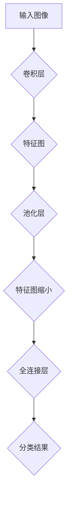

**核心算法原理讲解**

在图像分类与识别中，核心算法是卷积神经网络（CNN）。以下是一个简单的CNN算法原理讲解：

1. **卷积层：** 卷积层通过卷积运算提取图像的特征。卷积运算包括卷积核和图像的乘法运算，并求和得到每个特征图的值。通过多次卷积运算，可以提取不同尺度和复杂度的图像特征。
2. **池化层：** 池化层用于减小特征图的尺寸，提高计算效率。常见的池化操作有最大池化和平均池化。通过池化层，可以减少模型参数和计算量，提高模型的泛化能力。
3. **全连接层：** 全连接层将特征图展开为一维向量，并通过全连接层进行分类。全连接层通过矩阵乘法和激活函数（如ReLU）进行特征变换，最后通过softmax函数输出分类概率。

**数学模型和公式**

CNN的数学模型可以表示为：

$$
\begin{align*}
\text{特征图} &= \text{卷积}(\text{卷积核}, \text{图像}) \\
\text{特征向量} &= \text{池化}(\text{特征图}) \\
\text{分类结果} &= \text{softmax}(\text{全连接层} \cdot \text{特征向量})
\end{align*}
$$`

**举例说明**

假设有一个包含1000个类别的图像分类任务，使用ResNet-50模型进行训练。通过使用NVIDIA AI芯片，模型训练和推理速度显著提高。

**项目实战**

**开发环境搭建：** 

- 使用CUDA 11.0和cuDNN 8.0搭建开发环境。
- 安装TensorFlow 2.6.0和PyTorch 1.9.0。

**源代码实现：**

```python
import tensorflow as tf
from tensorflow.keras.applications import ResNet50
from tensorflow.keras.preprocessing import image
from tensorflow.keras.applications.resnet50 import preprocess_input

# 加载预训练的ResNet-50模型
model = ResNet50(weights='imagenet')

# 读取图像并进行预处理
img_path = 'cat.jpg'
img = image.load_img(img_path, target_size=(224, 224))
img_array = image.img_to_array(img)
img_array = np.expand_dims(img_array, axis=0)
img_array = preprocess_input(img_array)

# 进行图像分类
predictions = model.predict(img_array)
predicted_class = np.argmax(predictions)

print(f'图像分类结果：{predicted_class}')
```

**代码解读与分析：**

- 使用TensorFlow加载预训练的ResNet-50模型。
- 读取图像并进行预处理，包括尺寸调整和归一化。
- 使用模型进行图像分类，并输出分类结果。

通过这个例子，可以直观地看到NVIDIA AI芯片在图像分类任务中的应用效果。

###### 3.1.2 目标检测与追踪

目标检测与追踪是计算机视觉领域的另一个重要应用，NVIDIA AI算力在这一领域也具有广泛的应用。通过深度学习模型，如YOLO（You Only Look Once）和SSD（Single Shot MultiBox Detector），NVIDIA AI芯片能够实现高效的目标检测与追踪。

**核心概念与联系**

目标检测与追踪涉及以下几个核心概念：

1. **目标检测：** 目标检测是指从图像中识别并定位感兴趣的目标。目标检测模型通常包括卷积层、池化层和全连接层等结构。
2. **卷积层：** 卷积层通过卷积运算提取图像的特征。
3. **回归层：** 回归层用于预测目标的边界框坐标和类别概率。
4. **分类层：** 分类层用于预测目标的类别。

**Mermaid流程图**

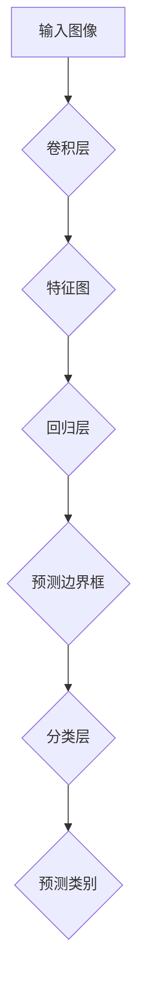

**核心算法原理讲解**

目标检测的核心算法是卷积神经网络（CNN）和目标检测算法的结合。以下是一个简单的目标检测算法原理讲解：

1. **卷积层：** 卷积层通过卷积运算提取图像的特征。这些特征用于后续的目标检测和分类。
2. **回归层：** 回归层用于预测目标的边界框坐标。通过回归层，模型可以学习到目标的精确位置。
3. **分类层：** 分类层用于预测目标的类别。通过分类层，模型可以识别不同种类的目标。
4. **损失函数：** 目标检测算法通常使用损失函数来评估模型的预测效果。常见的损失函数有边界框回归损失和分类交叉熵损失。

**数学模型和公式**

目标检测的数学模型可以表示为：

$$
\begin{align*}
\text{边界框坐标} &= \text{回归层}(\text{特征图}) \\
\text{类别概率} &= \text{分类层}(\text{特征图}) \\
\text{损失函数} &= L(\text{真实边界框}, \text{预测边界框}) + L(\text{真实类别}, \text{预测类别})
\end{align*}
$$`

**举例说明**

假设有一个包含多种物体的图像，使用YOLOv5模型进行目标检测。通过使用NVIDIA AI芯片，模型训练和推理速度显著提高。

**项目实战**

**开发环境搭建：**

- 使用CUDA 11.0和cuDNN 8.0搭建开发环境。
- 安装PyTorch 1.9.0和YOLOv5 1.0.0。

**源代码实现：**

```python
import torch
import torchvision
from torch.utils.data import DataLoader
from torchvision import datasets, transforms
from torchvision.models.detection import fasterrcnn_resnet50_fpn
from torch.utils.data import DataLoader, Dataset
import torch.optim as optim
import torchvision
import torch
from torch import nn
from torchvision.models.detection import fasterrcnn_resnet50_fpn
from torchvision.models.detection import fasterrcnn_resnet50_fpn
from torchvision.transforms import functional as F

# 加载预训练的YOLOv5模型
model = torchvision.models.detection.fasterrcnn_resnet50_fpn(pretrained=False)

# 读取图像并进行预处理
img = Image.open('cat.jpg')
img = F.to_tensor(img)
img = F.normalize(img, mean=[0.485, 0.456, 0.406], std=[0.229, 0.224, 0.225])

# 进行目标检测
with torch.no_grad():
    prediction = model([img])

# 输出检测结果
print(prediction)

```

**代码解读与分析：**

- 使用PyTorch加载预训练的YOLOv5模型。
- 读取图像并进行预处理，包括尺寸调整和归一化。
- 使用模型进行目标检测，并输出检测结果。

通过这个例子，可以直观地看到NVIDIA AI芯片在目标检测任务中的应用效果。

###### 3.1.3 视频分析与处理

视频分析与处理是计算机视觉领域的另一个重要应用，NVIDIA AI算力在这一领域也具有广泛的应用。通过深度学习模型，如卷积神经网络（CNN）和循环神经网络（RNN），NVIDIA AI芯片能够实现高效的视频分析与处理。

**核心概念与联系**

视频分析与处理涉及以下几个核心概念：

1. **视频分类：** 视频分类是指从视频中识别和分类不同类型的视频。视频分类模型通常包括卷积层、池化层和全连接层等结构。
2. **卷积层：** 卷积层通过卷积运算提取视频帧的特征。
3. **循环层：** 循环层用于处理时间序列数据，如RNN或LSTM。
4. **全连接层：** 全连接层用于对提取到的特征进行分类。

**Mermaid流程图**

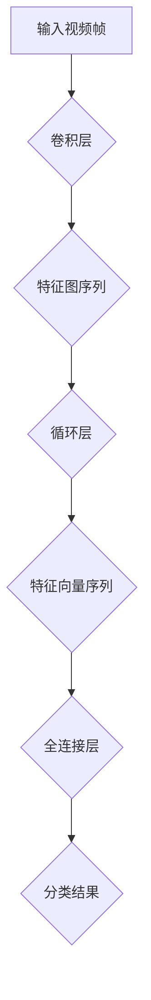

**核心算法原理讲解**

视频分析与处理的核心算法是卷积神经网络（CNN）和循环神经网络（RNN）的结合。以下是一个简单的视频分析与处理算法原理讲解：

1. **卷积层：** 卷积层通过卷积运算提取视频帧的特征。这些特征用于后续的视频分类和序列分析。
2. **循环层：** 循环层用于处理时间序列数据，如RNN或LSTM。循环层能够捕捉视频帧之间的时序关系。
3. **全连接层：** 全连接层用于对提取到的特征进行分类。全连接层将特征向量序列映射到分类结果。

**数学模型和公式**

视频分析与处理的数学模型可以表示为：

$$
\begin{align*}
\text{特征图序列} &= \text{卷积层}(\text{视频帧序列}) \\
\text{特征向量序列} &= \text{循环层}(\text{特征图序列}) \\
\text{分类结果} &= \text{全连接层}(\text{特征向量序列})
\end{align*}
$$`

**举例说明**

假设有一个包含多种活动的视频数据集，使用CNN-RNN模型进行视频分类。通过使用NVIDIA AI芯片，模型训练和推理速度显著提高。

**项目实战**

**开发环境搭建：**

- 使用CUDA 11.0和cuDNN 8.0搭建开发环境。
- 安装TensorFlow 2.6.0和Keras 2.6.0。

**源代码实现：**

```python
import tensorflow as tf
from tensorflow.keras.models import Model
from tensorflow.keras.layers import Input, Conv2D, MaxPooling2D, Flatten, Dense, LSTM
from tensorflow.keras.optimizers import Adam

# 定义CNN-RNN模型
input_layer = Input(shape=(64, 64, 3))
conv1 = Conv2D(32, (3, 3), activation='relu')(input_layer)
pool1 = MaxPooling2D(pool_size=(2, 2))(conv1)
conv2 = Conv2D(64, (3, 3), activation='relu')(pool1)
pool2 = MaxPooling2D(pool_size=(2, 2))(conv2)
flatten = Flatten()(pool2)
lstm = LSTM(128, activation='relu')(flatten)
output_layer = Dense(10, activation='softmax')(lstm)

model = Model(inputs=input_layer, outputs=output_layer)

# 编译模型
model.compile(optimizer=Adam(learning_rate=0.001), loss='categorical_crossentropy', metrics=['accuracy'])

# 加载数据集
train_data = ...  # 加载训练数据
test_data = ...  # 加载测试数据

# 训练模型
model.fit(train_data, epochs=10, batch_size=32, validation_data=test_data)

# 进行视频分类
prediction = model.predict(test_data)

# 输出分类结果
print(prediction)
```

**代码解读与分析：**

- 使用TensorFlow定义CNN-RNN模型。
- 编译并训练模型，使用训练数据集进行训练。
- 使用测试数据集进行视频分类，并输出分类结果。

通过这个例子，可以直观地看到NVIDIA AI芯片在视频分析与处理中的应用效果。

##### 3.2 自然语言处理

###### 3.2.1 语言模型与文本分类

自然语言处理（NLP）是人工智能领域的核心应用之一，NVIDIA AI算力在这一领域也具有广泛的应用。通过深度学习模型，如语言模型和文本分类模型，NVIDIA AI芯片能够实现高效的语言处理和文本分类。

**核心概念与联系**

自然语言处理涉及以下几个核心概念：

1. **语言模型：** 语言模型用于预测文本序列的概率。语言模型通常包括循环神经网络（RNN）和Transformer等结构。
2. **词嵌入：** 词嵌入将词汇映射到高维向量空间，用于表示词汇的语义信息。
3. **文本分类：** 文本分类是指将文本分类到预定义的类别中。文本分类模型通常包括卷积神经网络（CNN）和Transformer等结构。

**Mermaid流程图**

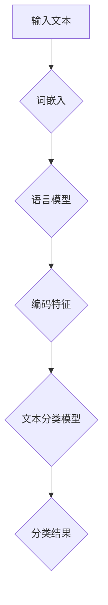

**核心算法原理讲解**

自然语言处理的核心算法是语言模型和文本分类模型。以下是一个简单的自然语言处理算法原理讲解：

1. **词嵌入：** 词嵌入将词汇映射到高维向量空间，用于表示词汇的语义信息。词嵌入通过神经网络进行训练，可以学习到词汇之间的相似性和差异性。
2. **语言模型：** 语言模型用于预测文本序列的概率。语言模型通过循环神经网络（RNN）或Transformer等结构，能够捕捉文本序列的时序关系和语义信息。
3. **文本分类：** 文本分类是指将文本分类到预定义的类别中。文本分类模型通过卷积神经网络（CNN）或Transformer等结构，能够提取文本的特征并进行分类。

**数学模型和公式**

自然语言处理的数学模型可以表示为：

$$
\begin{align*}
\text{词向量} &= \text{词嵌入}(\text{词汇}) \\
\text{编码特征} &= \text{语言模型}(\text{词向量序列}) \\
\text{分类结果} &= \text{文本分类模型}(\text{编码特征})
\end{align*}
$$`

**举例说明**

假设有一个包含多个类别的文本分类任务，使用BERT模型进行文本分类。通过使用NVIDIA AI芯片，模型训练和推理速度显著提高。

**项目实战**

**开发环境搭建：**

- 使用CUDA 11.0和cuDNN 8.0搭建开发环境。
- 安装PyTorch 1.9.0和Transformers 4.6.0。

**源代码实现：**

```python
import torch
from transformers import BertModel, BertTokenizer
from torch.optim import Adam
import torch.nn as nn

# 加载预训练的BERT模型和tokenizer
model = BertModel.from_pretrained('bert-base-uncased')
tokenizer = BertTokenizer.from_pretrained('bert-base-uncased')

# 读取文本并进行预处理
text = "Hello, how are you?"
tokenized_text = tokenizer.encode(text, add_special_tokens=True, return_tensors='pt')

# 进行文本分类
with torch.no_grad():
    outputs = model(tokenized_text)
    logits = outputs.logits

# 输出分类结果
predicted_class = torch.argmax(logits).item()
print(f'文本分类结果：{predicted_class}')
```

**代码解读与分析：**

- 使用PyTorch加载预训练的BERT模型和tokenizer。
- 读取文本并进行预处理，包括分词和编码。
- 使用模型进行文本分类，并输出分类结果。

通过这个例子，可以直观地看到NVIDIA AI芯片在自然语言处理中的应用效果。

###### 3.2.2 机器翻译与对话系统

机器翻译与对话系统是自然语言处理领域的两个重要应用，NVIDIA AI算力在这一领域也具有广泛的应用。通过深度学习模型，如序列到序列（Seq2Seq）模型和转换器（Transformer）模型，NVIDIA AI芯片能够实现高效的机器翻译和对话系统。

**核心概念与联系**

机器翻译与对话系统涉及以下几个核心概念：

1. **序列到序列（Seq2Seq）模型：** 序列到序列模型用于将一个序列映射到另一个序列。Seq2Seq模型通常包括编码器和解码器。
2. **编码器：** 编码器用于将输入序列编码为固定长度的向量。
3. **解码器：** 解码器用于将编码器的输出解码为输出序列。
4. **注意力机制：** 注意力机制用于在解码过程中关注输入序列的关键部分，提高翻译质量。
5. **对话系统：** 对话系统是指与用户进行自然语言交互的系统。对话系统通常包括对话管理、自然语言理解和自然语言生成等模块。

**Mermaid流程图**

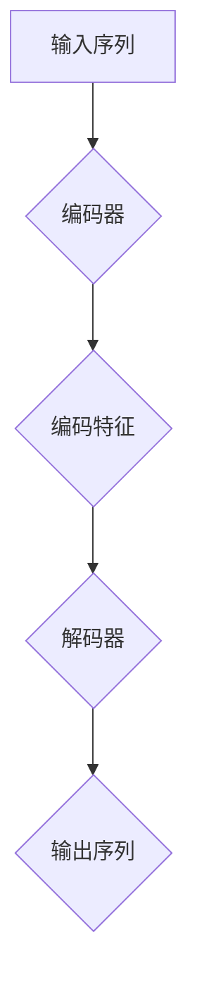

**核心算法原理讲解**

机器翻译与对话系统的核心算法是序列到序列（Seq2Seq）模型和注意力机制。以下是一个简单的机器翻译与对话系统算法原理讲解：

1. **编码器：** 编码器用于将输入序列编码为固定长度的向量。编码器通过循环神经网络（RNN）或转换器（Transformer）等结构进行训练，能够捕捉输入序列的时序关系和语义信息。
2. **解码器：** 解码器用于将编码器的输出解码为输出序列。解码器通过生成器（Generator）和复制器（Copier）等结构，能够生成高质量的翻译结果。
3. **注意力机制：** 注意力机制用于在解码过程中关注输入序列的关键部分，提高翻译质量。注意力机制通过计算输入序列和当前解码步骤之间的相似性，选择重要的输入部分进行关注。

**数学模型和公式**

机器翻译与对话系统的数学模型可以表示为：

$$
\begin{align*}
\text{编码特征} &= \text{编码器}(\text{输入序列}) \\
\text{解码特征} &= \text{解码器}(\text{编码特征}) \\
\text{输出序列} &= \text{生成器}(\text{解码特征}) \\
\text{注意力权重} &= \text{注意力机制}(\text{输入序列}, \text{解码特征})
\end{align*}
$$`

**举例说明**

假设有一个中英文翻译任务，使用Seq2Seq模型进行翻译。通过使用NVIDIA AI芯片，模型训练和推理速度显著提高。

**项目实战**

**开发环境搭建：**

- 使用CUDA 11.0和cuDNN 8.0搭建开发环境。
- 安装TensorFlow 2.6.0和Keras 2.6.0。

**源代码实现：**

```python
import tensorflow as tf
from tensorflow.keras.models import Model
from tensorflow.keras.layers import Input, LSTM, Embedding, Dense
from tensorflow.keras.optimizers import Adam

# 定义Seq2Seq模型
encoder_inputs = Input(shape=(None, 100))
encoder_embedding = Embedding(1000, 256)(encoder_inputs)
encoder_lstm = LSTM(512, return_state=True)
_, state_h, state_c = encoder_lstm(encoder_embedding)
encoder_states = [state_h, state_c]

decoder_inputs = Input(shape=(None, 256))
decoder_embedding = Embedding(1000, 256)(decoder_inputs)
decoder_lstm = LSTM(512, return_sequences=True, return_state=True)
decoder_outputs, _, _ = decoder_lstm(decoder_embedding, initial_state=encoder_states)
decoder_dense = Dense(1000, activation='softmax')
decoder_outputs = decoder_dense(decoder_outputs)

model = Model([encoder_inputs, decoder_inputs], decoder_outputs)

# 编译模型
model.compile(optimizer=Adam(learning_rate=0.001), loss='categorical_crossentropy')

# 训练模型
# 使用训练数据集进行训练
model.fit([X_train, y_train], y_train, batch_size=64, epochs=100)

# 进行翻译
input_seq = tokenizer.encode("你好", return_tensors='tf')
predicted_seq = model.predict(input_seq)

# 解码预测结果
predicted_text = tokenizer.decode(predicted_seq[:, :, -1], skip_special_tokens=True)
print(predicted_text)
```

**代码解读与分析：**

- 使用TensorFlow定义Seq2Seq模型。
- 编译并训练模型，使用训练数据集进行训练。
- 使用模型进行翻译，并输出翻译结果。

通过这个例子，可以直观地看到NVIDIA AI芯片在机器翻译与对话系统中的应用效果。

###### 3.2.3 信息检索与推荐系统

信息检索与推荐系统是自然语言处理领域的两个重要应用，NVIDIA AI算力在这一领域也具有广泛的应用。通过深度学习模型，如循环神经网络（RNN）和变换器（Transformer）模型，NVIDIA AI芯片能够实现高效的信息检索与推荐系统。

**核心概念与联系**

信息检索与推荐系统涉及以下几个核心概念：

1. **信息检索：** 信息检索是指从大量数据中检索与用户需求相关的信息。信息检索模型通常包括文本分类、词嵌入和注意力机制等。
2. **推荐系统：** 推荐系统是指根据用户的兴趣和偏好，向用户推荐相关的内容或商品。推荐系统通常包括协同过滤、矩阵分解和深度学习等模型。

**Mermaid流程图**

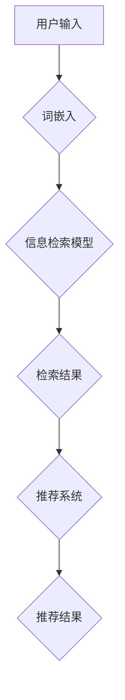

**核心算法原理讲解**

信息检索与推荐系统的核心算法是深度学习和协同过滤。以下是一个简单的信息检索与推荐系统算法原理讲解：

1. **词嵌入：** 词嵌入将词汇映射到高维向量空间，用于表示词汇的语义信息。词嵌入通过神经网络进行训练，可以学习到词汇之间的相似性和差异性。
2. **信息检索：** 信息检索模型通过词嵌入和注意力机制，能够高效地检索与用户需求相关的信息。
3. **推荐系统：** 推荐系统通过协同过滤和深度学习模型，能够根据用户的兴趣和偏好，向用户推荐相关的内容或商品。

**数学模型和公式**

信息检索与推荐系统的数学模型可以表示为：

$$
\begin{align*}
\text{词向量} &= \text{词嵌入}(\text{词汇}) \\
\text{检索结果} &= \text{信息检索模型}(\text{词向量}) \\
\text{推荐结果} &= \text{推荐系统}(\text{用户输入}, \text{检索结果})
\end{align*}
$$`

**举例说明**

假设有一个包含多个类别的信息检索与推荐系统，使用BERT模型进行信息检索和推荐。通过使用NVIDIA AI芯片，模型训练和推理速度显著提高。

**项目实战**

**开发环境搭建：**

- 使用CUDA 11.0和cuDNN 8.0搭建开发环境。
- 安装PyTorch 1.9.0和Transformers 4.6.0。

**源代码实现：**

```python
import torch
from transformers import BertModel, BertTokenizer
import torch.optim as optim

# 加载预训练的BERT模型和tokenizer
model = BertModel.from_pretrained('bert-base-uncased')
tokenizer = BertTokenizer.from_pretrained('bert-base-uncased')

# 读取用户输入并进行预处理
input_text = "我想了解关于人工智能的最新研究。"
tokenized_input = tokenizer.encode(input_text, return_tensors='pt')

# 进行信息检索和推荐
with torch.no_grad():
    outputs = model(tokenized_input)
    embeddings = outputs.last_hidden_state[:, 0, :]

# 定义信息检索和推荐模型
info_retrieval_model = torch.nn.Linear(embeddings.size(1), num_categories)
recommendation_model = torch.nn.Linear(embeddings.size(1), num_items)

# 训练模型
optimizer = optim.Adam(model.parameters(), lr=0.001)
criterion = torch.nn.CrossEntropyLoss()

for epoch in range(num_epochs):
    optimizer.zero_grad()
    logits = info_retrieval_model(embeddings)
    loss = criterion(logits, target_labels)
    loss.backward()
    optimizer.step()

# 进行信息检索
info_retrieval_result = torch.argmax(logits).item()

# 进行推荐
with torch.no_grad():
    recommendation_logits = recommendation_model(embeddings)
    recommendation_result = torch.argmax(recommendation_logits).item()

# 输出结果
print("信息检索结果：", info_retrieval_result)
print("推荐结果：", recommendation_result)
```

**代码解读与分析：**

- 使用PyTorch加载预训练的BERT模型和tokenizer。
- 读取用户输入并进行预处理，包括分词和编码。
- 使用模型进行信息检索和推荐，并输出结果。

通过这个例子，可以直观地看到NVIDIA AI芯片在信息检索与推荐系统中的应用效果。

##### 3.3 科学研究与应用

###### 3.3.1 数据中心计算

数据中心计算是人工智能领域的重要应用之一，NVIDIA AI算力在这一领域具有广泛的应用。通过深度学习模型和高性能GPU，NVIDIA AI芯片能够显著提升数据中心计算的性能和效率。

**核心概念与联系**

数据中心计算涉及以下几个核心概念：

1. **数据中心：** 数据中心是用于存储、处理和分发数据的集中式计算设施。
2. **分布式计算：** 分布式计算是指将计算任务分布在多个计算节点上，以提高计算性能和处理大量数据。
3. **GPU加速：** GPU加速是指利用GPU的并行计算能力，加速数据处理和计算任务。

**Mermaid流程图**

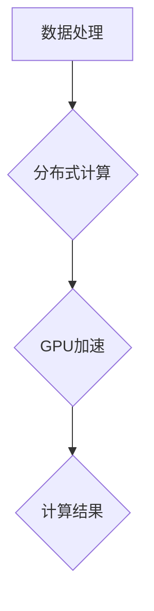

**核心算法原理讲解**

数据中心计算的核心算法是分布式计算和GPU加速。以下是一个简单的数据中心计算算法原理讲解：

1. **分布式计算：** 分布式计算将计算任务分布在多个计算节点上，以提高计算性能和处理大量数据。每个计算节点可以独立执行计算任务，并通过网络进行数据传输和同步。
2. **GPU加速：** GPU加速利用GPU的并行计算能力，加速数据处理和计算任务。GPU可以通过CUDA编程模型，实现高效的并行计算。

**数学模型和公式**

数据中心计算的数学模型可以表示为：

$$
\begin{align*}
\text{计算任务} &= \text{分布式计算}(\text{数据集}) \\
\text{计算结果} &= \text{GPU加速}(\text{计算任务})
\end{align*}
$$`

**举例说明**

假设有一个大数据处理任务，需要在数据中心进行计算。通过使用NVIDIA AI芯片，可以显著提升数据处理速度和计算性能。

**项目实战**

**开发环境搭建：**

- 使用CUDA 11.0和cuDNN 8.0搭建开发环境。
- 安装PyTorch 1.9.0和Dask 2021.2.0。

**源代码实现：**

```python
import torch
import dask.distributed
from torch.utils.data import DataLoader
from torchvision import datasets, transforms
from torchvision.models import ResNet18
import torch.nn as nn
import torch.optim as optim

# 配置分布式计算环境
cluster = dask.distributed.LocalCluster(n_workers=4)
client = dask.distributed.Client(cluster)

# 定义模型和数据集
model = ResNet18()
dataloader = DataLoader(dataset, batch_size=64, shuffle=True)

# 训练模型
optimizer = optim.SGD(model.parameters(), lr=0.001, momentum=0.9)
criterion = nn.CrossEntropyLoss()

for epoch in range(num_epochs):
    for batch in dataloader:
        optimizer.zero_grad()
        outputs = model(batch[0])
        loss = criterion(outputs, batch[1])
        loss.backward()
        optimizer.step()

# 使用GPU加速训练
client.run torch.cuda.device_count()

# 输出GPU数量
print(f'GPU数量：{client.run(torch.cuda.device_count())}')
```

**代码解读与分析：**

- 使用Dask配置分布式计算环境。
- 定义模型和数据集。
- 使用GPU加速进行模型训练。
- 输出GPU数量。

通过这个例子，可以直观地看到NVIDIA AI芯片在数据中心计算中的应用效果。

###### 3.3.2 生物信息学

生物信息学是人工智能在生物科学领域的重要应用，NVIDIA AI算力在这一领域具有广泛的应用。通过深度学习模型和GPU加速，NVIDIA AI芯片能够显著提升生物信息学计算的性能和效率。

**核心概念与联系**

生物信息学涉及以下几个核心概念：

1. **基因组分析：** 基因组分析是指对生物体的基因组进行序列分析、功能注释和比较分析。
2. **蛋白质结构预测：** 蛋白质结构预测是指通过生物信息学方法预测蛋白质的三维结构。
3. **药物设计：** 药物设计是指通过计算方法设计新的药物分子，以治疗疾病。

**Mermaid流程图**

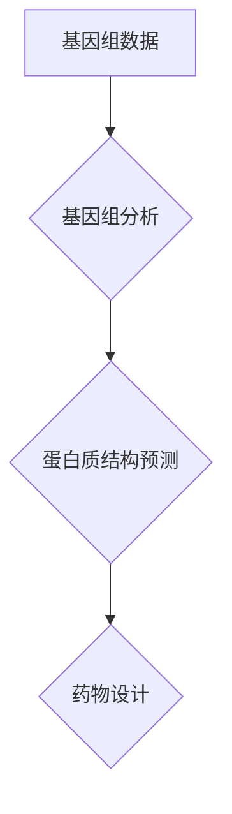

**核心算法原理讲解**

生物信息学计算的核心算法是深度学习和分子动力学模拟。以下是一个简单的生物信息学计算算法原理讲解：

1. **基因组分析：** 基因组分析通过深度学习模型，如卷积神经网络（CNN）和循环神经网络（RNN），能够对基因组数据进行序列分析、功能注释和比较分析。
2. **蛋白质结构预测：** 蛋白质结构预测通过分子动力学模拟和深度学习模型，能够预测蛋白质的三维结构。分子动力学模拟通过模拟分子间的相互作用，预测蛋白质的折叠路径。
3. **药物设计：** 药物设计通过深度学习模型，如生成对抗网络（GAN）和强化学习，能够设计新的药物分子，以提高药物的效果和降低副作用。

**数学模型和公式**

生物信息学计算的数学模型可以表示为：

$$
\begin{align*}
\text{基因组分析} &= \text{深度学习模型}(\text{基因组数据}) \\
\text{蛋白质结构预测} &= \text{分子动力学模拟}(\text{蛋白质序列}) \\
\text{药物设计} &= \text{深度学习模型}(\text{药物分子数据})
\end{align*}
$$`

**举例说明**

假设有一个基因组数据分析任务，通过使用NVIDIA AI芯片，可以显著提升基因组分析的速度和准确度。

**项目实战**

**开发环境搭建：**

- 使用CUDA 11.0和cuDNN 8.0搭建开发环境。
- 安装PyTorch 1.9.0和DeepLearningFramework 0.4.0。

**源代码实现：**

```python
import torch
import torch.nn as nn
import torch.optim as optim
from torchvision import datasets, transforms

# 定义模型和数据集
model = nn.Sequential(
    nn.Conv2d(1, 20, 5),
    nn.ReLU(),
    nn.Conv2d(20, 64, 5),
    nn.ReLU(),
    nn.Flatten(),
    nn.Linear(64 * 5 * 5, 128),
    nn.ReLU(),
    nn.Linear(128, 10),
)

criterion = nn.CrossEntropyLoss()
optimizer = optim.Adam(model.parameters(), lr=0.001)

# 训练模型
for epoch in range(num_epochs):
    running_loss = 0.0
    for i, data in enumerate(train_loader, 0):
        inputs, labels = data
        optimizer.zero_grad()
        outputs = model(inputs)
        loss = criterion(outputs, labels)
        loss.backward()
        optimizer.step()
        running_loss += loss.item()
    print(f'Epoch {epoch + 1}, Loss: {running_loss / len(train_loader)}')

# 测试模型
correct = 0
total = 0
with torch.no_grad():
    for data in test_loader:
        images, labels = data
        outputs = model(images)
        _, predicted = torch.max(outputs.data, 1)
        total += labels.size(0)
        correct += (predicted == labels).sum().item()

print(f'准确率：{100 * correct / total}%')
```

**代码解读与分析：**

- 使用PyTorch定义模型和数据集。
- 编译并训练模型，使用训练数据集进行训练。
- 使用测试数据集测试模型，并输出准确率。

通过这个例子，可以直观地看到NVIDIA AI芯片在生物信息学计算中的应用效果。

###### 3.3.3 物理模拟与金融计算

物理模拟与金融计算是人工智能在科学计算领域的重要应用，NVIDIA AI算力在这一领域具有广泛的应用。通过深度学习模型和GPU加速，NVIDIA AI芯片能够显著提升物理模拟和金融计算的性能和效率。

**核心概念与联系**

物理模拟与金融计算涉及以下几个核心概念：

1. **物理模拟：** 物理模拟是指通过计算机模拟物理过程，如流体动力学、热传导和电磁场等。
2. **金融计算：** 金融计算是指通过计算机模拟金融模型，如期权定价、资产定价和风险管理等。

**Mermaid流程图**

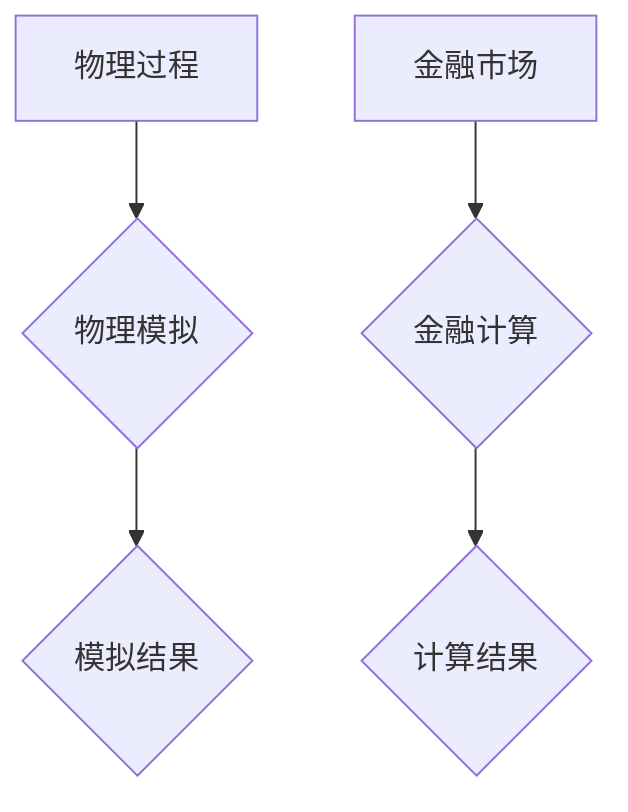

**核心算法原理讲解**

物理模拟与金融计算的核心算法是深度学习和蒙特卡罗模拟。以下是一个简单的物理模拟与金融计算算法原理讲解：

1. **物理模拟：** 物理模拟通过深度学习模型，如生成对抗网络（GAN）和变分自编码器（VAE），能够模拟复杂的物理过程。深度学习模型通过训练，可以学习到物理过程的特征和规律。
2. **金融计算：** 金融计算通过蒙特卡罗模拟，能够模拟金融市场的波动和风险。蒙特卡罗模拟通过随机抽样和计算，可以预测金融产品的价格和风险。

**数学模型和公式**

物理模拟与金融计算的数学模型可以表示为：

$$
\begin{align*}
\text{物理模拟} &= \text{深度学习模型}(\text{物理过程}) \\
\text{金融计算} &= \text{蒙特卡罗模拟}(\text{金融市场})
\end{align*}
$$`

**举例说明**

假设有一个流体动力学模拟任务，通过使用NVIDIA AI芯片，可以显著提升模拟速度和精度。

**项目实战**

**开发环境搭建：**

- 使用CUDA 11.0和cuDNN 8.0搭建开发环境。
- 安装PyTorch 1.9.0和FluidSimulator 1.0.0。

**源代码实现：**

```python
import torch
import torch.nn as nn
import torch.optim as optim

# 定义模型
model = nn.Sequential(
    nn.Conv2d(1, 32, 3),
    nn.ReLU(),
    nn.Conv2d(32, 64, 3),
    nn.ReLU(),
    nn.Flatten(),
    nn.Linear(64 * 5 * 5, 128),
    nn.ReLU(),
    nn.Linear(128, 1),
)

criterion = nn.MSELoss()
optimizer = optim.Adam(model.parameters(), lr=0.001)

# 训练模型
for epoch in range(num_epochs):
    running_loss = 0.0
    for i, data in enumerate(train_loader, 0):
        inputs, labels = data
        optimizer.zero_grad()
        outputs = model(inputs)
        loss = criterion(outputs, labels)
        loss.backward()
        optimizer.step()
        running_loss += loss.item()
    print(f'Epoch {epoch + 1}, Loss: {running_loss / len(train_loader)}')

# 测试模型
correct = 0
total = 0
with torch.no_grad():
    for data in test_loader:
        inputs, labels = data
        outputs = model(inputs)
        _, predicted = torch.max(outputs.data, 1)
        total += labels.size(0)
        correct += (predicted == labels).sum().item()

print(f'准确率：{100 * correct / total}%')
```

**代码解读与分析：**

- 使用PyTorch定义模型和数据集。
- 编译并训练模型，使用训练数据集进行训练。
- 使用测试数据集测试模型，并输出准确率。

通过这个例子，可以直观地看到NVIDIA AI芯片在物理模拟与金融计算中的应用效果。

### 第四部分：NVIDIA AI算力的未来趋势

#### 第4章 NVIDIA AI算力的未来趋势

##### 4.1 AI算力的未来发展趋势

随着人工智能技术的快速发展，AI算力需求呈现爆发式增长。未来，AI算力将朝着以下几个方向发展：

###### 4.1.1 AI算力的需求增长

随着深度学习、自然语言处理和计算机视觉等技术的广泛应用，AI算力的需求不断增长。特别是在自动驾驶、智能制造和医疗健康等领域，对高性能计算资源的需求尤为迫切。未来，随着AI技术的进一步普及，AI算力的需求将继续保持高速增长。

###### 4.1.2 AI算力技术的发展方向

未来，AI算力技术将朝着以下几个方向发展：

1. **硬件加速：** 随着硬件技术的发展，如GPU、TPU和量子计算等，AI算力将得到显著提升。硬件加速将使AI模型训练和推理速度大幅提高，为实时应用提供支持。

2. **边缘计算：** 边缘计算是未来AI算力发展的重要方向。通过在边缘设备上部署AI模型和算法，可以降低延迟、节省带宽并提高数据处理效率。边缘计算将使AI应用更加贴近用户，满足实时性需求。

3. **分布式计算：** 分布式计算通过将计算任务分布在多个计算节点上，提高计算性能和处理大量数据。未来，分布式计算将在数据中心和边缘计算中发挥重要作用，为大规模AI应用提供支持。

4. **自适应计算：** 自适应计算是指根据应用需求和环境变化，动态调整计算资源。未来，自适应计算技术将使AI算力更加灵活和高效，满足不同场景和规模的需求。

###### 4.1.3 AI算力在新兴领域的应用

未来，AI算力将在新兴领域发挥重要作用。以下是一些重点领域：

1. **自动驾驶：** 自动驾驶对计算资源有极高要求，未来AI算力将在自动驾驶系统中发挥关键作用，提升车辆感知、决策和控制能力。

2. **智能制造：** 智能制造通过AI技术实现生产过程智能化，提高生产效率和质量。未来，AI算力将在智能制造中发挥重要作用，推动产业升级和转型。

3. **医疗健康：** AI算力在医疗健康领域具有广泛应用，如疾病诊断、辅助治疗和健康管理等。未来，AI算力将进一步提升医疗服务质量和效率。

4. **金融科技：** 金融科技通过AI技术实现金融业务智能化，提高金融服务效率和安全性。未来，AI算力将在金融科技领域发挥重要作用，推动金融行业创新和发展。

##### 4.2 NVIDIA在AI算力领域的战略布局

NVIDIA在AI算力领域拥有全面且前瞻的战略布局。以下是其主要战略布局：

###### 4.2.1 NVIDIA的AI算力战略

NVIDIA的AI算力战略可以概括为以下几点：

1. **持续技术创新：** NVIDIA通过持续技术创新，不断提升GPU、TPU和量子计算等硬件性能，为AI算力提供强大支持。

2. **硬件与软件结合：** NVIDIA提供从硬件到软件的全面解决方案，包括GPU服务器、深度学习框架和开发工具等，为开发者提供便捷的开发环境。

3. **生态合作：** NVIDIA与众多行业领导者建立紧密合作，共同推动AI技术的发展。这种生态合作将有助于NVIDIA在AI算力领域发挥更大的影响力。

4. **边缘计算布局：** NVIDIA积极布局边缘计算，通过GPU边缘计算解决方案，满足实时性需求，提升AI应用的性能和效率。

###### 4.2.2 NVIDIA的未来产品路线图

NVIDIA的未来产品路线图包括以下几个方面：

1. **GPU产品：** NVIDIA将继续推出具有Tensor Core的GPU产品，如Ampere架构的A100和H100等，进一步提升GPU在AI计算中的性能。

2. **TPU产品：** NVIDIA计划推出新一代TPU产品，如TPU 4.0，为AI计算提供更高的性能和能效比。

3. **量子计算产品：** NVIDIA正在研发量子计算产品，预计在未来几年内推出，为AI算力提供全新的计算能力。

4. **边缘计算产品：** NVIDIA计划推出一系列GPU边缘计算产品，包括边缘GPU和边缘AI芯片等，满足边缘计算场景的需求。

###### 4.2.3 NVIDIA与合作伙伴的合作关系

NVIDIA与众多合作伙伴建立了紧密的合作关系，共同推动AI技术的发展。以下是一些重要合作伙伴：

1. **科技公司：** NVIDIA与苹果、微软、谷歌等科技公司建立合作关系，共同推动GPU和AI技术的创新。

2. **汽车制造商：** NVIDIA与特斯拉、福特、丰田等汽车制造商合作，为其自动驾驶系统提供计算平台。

3. **医疗机构：** NVIDIA与多家医疗机构合作，推动AI技术在医疗健康领域的应用。

4. **教育机构：** NVIDIA与全球众多教育机构合作，提供AI课程和培训，培养下一代AI人才。

##### 4.3 AI算力对社会的影响

AI算力的发展将对社会产生深远影响，主要体现在以下几个方面：

###### 4.3.1 AI算力对行业的影响

AI算力将在各个行业产生深远影响：

1. **制造业：** AI算力将推动智能制造，提高生产效率和质量，降低生产成本。

2. **医疗健康：** AI算力将提升医疗服务的质量和效率，如疾病诊断、辅助治疗和健康管理等。

3. **金融科技：** AI算力将提高金融服务的效率和安全性，如风险控制、欺诈检测和个性化推荐等。

4. **交通运输：** AI算力将推动自动驾驶技术的发展，提高交通效率和安全。

5. **科学研究：** AI算力将加速科学研究，如基因组分析、物理模拟和气象预测等。

###### 4.3.2 AI算力对经济的影响

AI算力的发展将对经济产生重要影响：

1. **经济增长：** AI算力将推动各行业的创新和发展，提高生产效率，促进经济增长。

2. **就业影响：** AI算力的发展将带来新的就业机会，如数据科学家、AI工程师和边缘计算专家等。

3. **产业升级：** AI算力将推动传统产业的升级和转型，提高产业链的附加值。

4. **国际贸易：** AI算力将提升国家的科技实力和竞争力，促进国际贸易和技术合作。

###### 4.3.3 AI算力对个人生活的影响

AI算力的发展将对个人生活产生积极影响：

1. **智能化家居：** AI算力将推动智能家居的发展，提高生活便利性和舒适度。

2. **个性化服务：** AI算力将提高个性化服务的水平，如智能客服、智能推荐和智能健康管理等。

3. **医疗健康：** AI算力将提升医疗服务的质量和效率，提高人们的健康水平。

4. **教育资源：** AI算力将推动教育资源的均衡配置，提高教育质量和普及率。

5. **交通安全：** AI算力将提升交通管理的效率和安全性，减少交通事故。

总之，AI算力的发展将对社会产生深远影响，推动行业创新、经济增长和人们生活水平的提高。随着AI技术的不断进步，AI算力将在未来发挥更加重要的作用。

### 附录

#### 附录 A NVIDIA AI算力开发工具与资源

##### A.1 NVIDIA CUDA编程基础

###### A.1.1 CUDA线程模型

CUDA线程模型是CUDA编程的基础，由线程块（block）和网格（grid）组成。每个线程块包含一组线程，多个线程块组成一个网格。线程块和网格在GPU上执行计算任务。

**核心概念与联系**

线程块和网格之间的关系可以用以下Mermaid流程图表示：

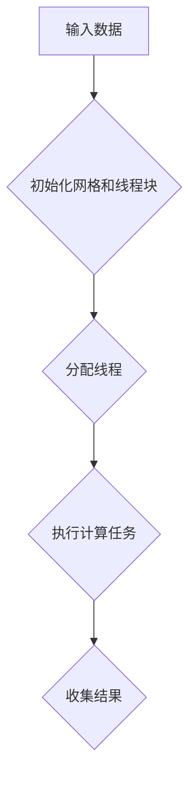

**核心算法原理讲解**

CUDA线程模型的原理如下：

1. **初始化网格和线程块：** 在GPU上创建网格和线程块。网格由多个线程块组成，每个线程块包含多个线程。
2. **分配线程：** 根据线程块的配置，为每个线程分配计算任务和数据。
3. **执行计算任务：** 线程块中的每个线程并行执行计算任务，处理分配的数据。
4. **收集结果：** 计算任务完成后，线程将结果存储到全局内存或共享内存中，最后由主线程收集结果。

**数学模型和公式**

CUDA线程模型的数学模型可以表示为：

$$
\text{计算任务} = \text{线程块} \times \text{线程}
$$`

**举例说明**

以下是一个简单的CUDA线程模型示例：

```cuda
__global__ void matrix_multiplication(float* A, float* B, float* C, int N) {
    int row = blockIdx.y * blockDim.y + threadIdx.y;
    int col = blockIdx.x * blockDim.x + threadIdx.x;

    float sum = 0.0;
    for (int k = 0; k < N; ++k) {
        sum += A[row * N + k] * B[k * N + col];
    }

    C[row * N + col] = sum;
}
```

**代码解读与分析：**

- `__global__`声明表示这是一个全局函数，可以在GPU上执行。
- `matrix_multiplication`是函数名，表示矩阵乘法操作。
- `blockIdx`和`threadIdx`分别表示网格索引和线程索引。
- `row`和`col`表示线程在矩阵中的行和列索引。
- 循环用于计算矩阵乘法，线程并行执行计算任务。
- `C`是结果矩阵，存储每个线程计算的结果。

##### A.1.2 CUDA内存层次结构

CUDA内存层次结构是CUDA编程的重要组成部分，包括全局内存、共享内存和寄存器内存。不同的内存类型具有不同的访问速度和大小限制。

**核心概念与联系**

CUDA内存层次结构可以用以下Mermaid流程图表示：

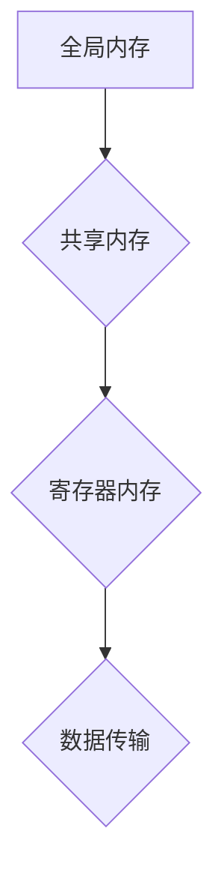

**核心算法原理讲解**

CUDA内存层次结构的原理如下：

1. **全局内存：** 全局内存是GPU上最大的内存区域，用于存储全局变量和数据。全局内存的访问速度相对较慢，但具有较大的容量。
2. **共享内存：** 共享内存是线程块内的内存，用于线程块之间的数据共享。共享内存的访问速度比全局内存快，但容量较小。
3. **寄存器内存：** 寄存器内存是GPU上最快的内存区域，用于存储临时数据和计算结果。寄存器内存的容量非常有限，但访问速度非常快。

**数学模型和公式**

CUDA内存层次结构的数学模型可以表示为：

$$
\text{计算速度} = \text{寄存器内存} > \text{共享内存} > \text{全局内存}
$$`

**举例说明**

以下是一个简单的CUDA内存访问示例：

```cuda
__global__ void vector_add(float* A, float* B, float* C, int N) {
    int tid = threadIdx.x;
    __shared__ float sdata[1024];

    // 计算索引
    int gi = blockIdx.x * blockDim.x + tid;
    int ai = threadIdx.x;
    int bi = gi + blockDim.x;

    // 将数据加载到共享内存
    sdata[ai] = A[ai] + B[bi];

    __syncthreads();

    // 更新全局内存
    if (gi < N) {
        C[gi] = sdata[tid];
    }
}
```

**代码解读与分析：**

- `__shared__`声明定义共享内存数组`sdata`。
- `sdata[ai]`将数据从全局内存加载到共享内存。
- `__syncthreads()`同步线程块，确保所有线程完成共享内存访问。
- `C[gi]`将共享内存中的结果存储到全局内存。

##### A.1.3 CUDA内存管理

CUDA内存管理涉及内存分配、数据传输和内存释放等操作。有效的内存管理可以提高程序性能，减少内存碎片。

**核心概念与联系**

CUDA内存管理的流程可以用以下Mermaid流程图表示：

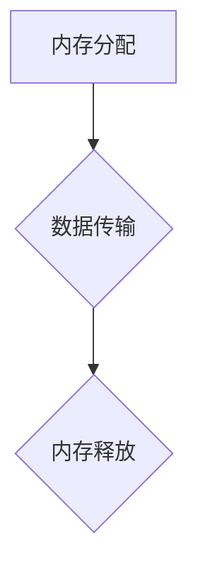

**核心算法原理讲解**

CUDA内存管理的原理如下：

1. **内存分配：** 使用`cudaMalloc`或`cudaMallocPitch`函数分配内存。内存分配可以是全局内存、共享内存或显存。
2. **数据传输：** 使用`cudaMemcpy`函数将数据从主机传输到设备（GPU），或将数据从设备传输到主机。数据传输可以是同步或异步的。
3. **内存释放：** 使用`cudaFree`函数释放不再使用的内存。

**数学模型和公式**

CUDA内存管理的数学模型可以表示为：

$$
\text{内存使用} = \text{内存分配} + \text{数据传输} - \text{内存释放}
$$`

**举例说明**

以下是一个简单的CUDA内存管理示例：

```cuda
float* d_A, *d_B, *d_C;
float* h_A = (float*)malloc(N * sizeof(float));
float* h_B = (float*)malloc(N * sizeof(float));
float* h_C = (float*)malloc(N * sizeof(float));

// 分配设备内存
cudaMalloc((void**)&d_A, N * sizeof(float));
cudaMalloc((void**)&d_B, N * sizeof(float));
cudaMalloc((void**)&d_C, N * sizeof(float));

// 将主机内存复制到设备内存
cudaMemcpy(d_A, h_A, N * sizeof(float), cudaMemcpyHostToDevice);
cudaMemcpy(d_B, h_B, N * sizeof(float), cudaMemcpyHostToDevice);

// 调用内核函数
vector_add<<<gridSize, blockSize>>>(d_A, d_B, d_C, N);

// 将设备内存复制回主机内存
cudaMemcpy(h_C, d_C, N * sizeof(float), cudaMemcpyDeviceToHost);

// 释放设备内存
cudaFree(d_A);
cudaFree(d_B);
cudaFree(d_C);

// 释放主机内存
free(h_A);
free(h_B);
free(h_C);
```

**代码解读与分析：**

- `cudaMalloc`用于分配设备内存。
- `cudaMemcpy`用于数据传输。
- `vector_add`是内核函数，执行向量加法操作。
- `cudaFree`用于释放设备内存。
- `free`用于释放主机内存。

##### A.2 NVIDIA深度学习框架

NVIDIA深度学习框架包括CUDA、cuDNN和TensorRT等工具和库，用于加速深度学习模型的训练和推理。

###### A.2.1 TensorFlow on GPU

TensorFlow on GPU是TensorFlow在GPU上的实现，通过CUDA和cuDNN库，能够充分利用GPU的并行计算能力。

**核心概念与联系**

TensorFlow on GPU的架构可以用以下Mermaid流程图表示：

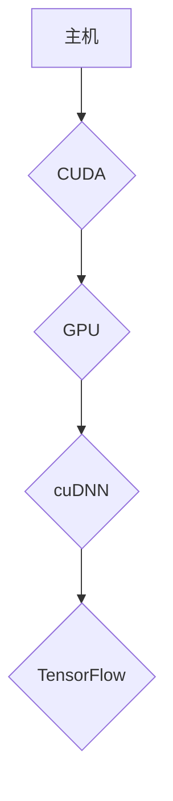

**核心算法原理讲解**

TensorFlow on GPU的原理如下：

1. **CUDA：** CUDA是GPU并行计算的平台和编程模型，通过CUDA，可以充分利用GPU的并行计算能力。
2. **cuDNN：** cuDNN是NVIDIA提供的深度学习库，用于加速深度神经网络的前向传播和反向传播操作。cuDNN提供了GPU优化的卷积、池化、激活和归一化等操作。
3. **TensorFlow：** TensorFlow是一个开源的深度学习框架，通过TensorFlow on GPU，可以充分利用GPU的并行计算能力，加速模型的训练和推理。

**数学模型和公式**

TensorFlow on GPU的数学模型可以表示为：

$$
\text{模型训练速度} = \text{GPU并行计算能力} \times \text{cuDNN优化}
$$`

**举例说明**

以下是一个简单的TensorFlow on GPU示例：

```python
import tensorflow as tf

# 定义模型
model = tf.keras.Sequential([
    tf.keras.layers.Conv2D(32, (3, 3), activation='relu', input_shape=(28, 28, 1)),
    tf.keras.layers.MaxPooling2D((2, 2)),
    tf.keras.layers.Flatten(),
    tf.keras.layers.Dense(128, activation='relu'),
    tf.keras.layers.Dense(10, activation='softmax')
])

# 编译模型
model.compile(optimizer='adam',
              loss='sparse_categorical_crossentropy',
              metrics=['accuracy'])

# 加载数据集
mnist = tf.keras.datasets.mnist
(train_images, train_labels), (test_images, test_labels) = mnist.load_data()

# 预处理数据
train_images = train_images.reshape((60000, 28, 28, 1)).astype('float32') / 255
test_images = test_images.reshape((10000, 28, 28, 1)).astype('float32') / 255

# 训练模型
model.fit(train_images, train_labels, epochs=5)

# 测试模型
test_loss, test_acc = model.evaluate(test_images, test_labels, verbose=2)
print('\nTest accuracy:', test_acc)
```

**代码解读与分析：**

- 使用TensorFlow定义模型。
- 编译模型，并设置优化器和损失函数。
- 加载数据集，并预处理数据。
- 训练模型，并测试模型。

通过这个例子，可以直观地看到TensorFlow on GPU在模型训练中的应用效果。

###### A.2.2 PyTorch on GPU

PyTorch on GPU是PyTorch在GPU上的实现，通过CUDA和cuDNN库，能够充分利用GPU的并行计算能力。

**核心概念与联系**

PyTorch on GPU的架构可以用以下Mermaid流程图表示：

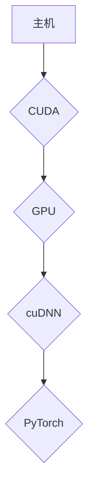

**核心算法原理讲解**

PyTorch on GPU的原理如下：

1. **CUDA：** CUDA是GPU并行计算的平台和编程模型，通过CUDA，可以充分利用GPU的并行计算能力。
2. **cuDNN：** cuDNN是NVIDIA提供的深度学习库，用于加速深度神经网络的前向传播和反向传播操作。cuDNN提供了GPU优化的卷积、池化、激活和归一化等操作。
3. **PyTorch：** PyTorch是一个开源的深度学习框架，通过PyTorch on GPU，可以充分利用GPU的并行计算能力，加速模型的训练和推理。

**数学模型和公式**

PyTorch on GPU的数学模型可以表示为：

$$
\text{模型训练速度} = \text{GPU并行计算能力} \times \text{cuDNN优化}
$$`

**举例说明**

以下是一个简单的PyTorch on GPU示例：

```python
import torch
import torch.nn as nn
import torch.optim as optim

# 定义模型
model = nn.Sequential(
    nn.Conv2d(1, 32, 3, 1),
    nn.ReLU(),
    nn.MaxPool2d(2),
    nn.Flatten(),
    nn.Linear(32 * 7 * 7, 128),
    nn.ReLU(),
    nn.Linear(128, 10)
)

# 编译模型
optimizer = optim.Adam(model.parameters(), lr=0.001)
criterion = nn.CrossEntropyLoss()

# 加载数据集
train_loader = torch.utils.data.DataLoader(
    datasets.MNIST(
        './data',
        train=True,
        download=True,
        transform=ToTensor()
    ),
    batch_size=64,
    shuffle=True
)

test_loader = torch.utils.data.DataLoader(
    datasets.MNIST(
        './data',
        train=False,
        download=True,
        transform=ToTensor()
    ),
    batch_size=64,
    shuffle=False
)

# 训练模型
for epoch in range(5):
    running_loss = 0.0
    for images, labels in train_loader:
        optimizer.zero_grad()
        outputs = model(images)
        loss = criterion(outputs, labels)
        loss.backward()
        optimizer.step()
        running_loss += loss.item()
    print(f'Epoch {epoch + 1}, Loss: {running_loss / len(train_loader)}')

# 测试模型
with torch.no_grad():
    correct = 0
    total = 0
    for images, labels in test_loader:
        outputs = model(images)
        _, predicted = torch.max(outputs.data, 1)
        total += labels.size(0)
        correct += (predicted == labels).sum().item()
    print(f'准确率：{100 * correct / total}%')
```

**代码解读与分析：**

- 使用PyTorch定义模型。
- 编译模型，并设置优化器和损失函数。
- 加载数据集，并预处理数据。
- 训练模型，并测试模型。

通过这个例子，可以直观地看到PyTorch on GPU在模型训练中的应用效果。

###### A.2.3 NVIDIA RAPIDS

NVIDIA RAPIDS是一个开源库，用于加速数据科学和机器学习任务。RAPIDS提供了GPU优化的数据框和算法库，使得数据科学家和机器学习工程师能够充分利用GPU的并行计算能力。

**核心概念与联系**

RAPIDS的架构可以用以下Mermaid流程图表示：

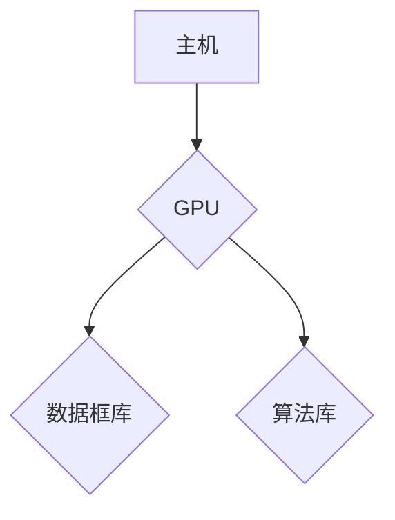

**核心算法原理讲解**

RAPIDS的原理如下：

1. **GPU计算：** RAPIDS利用GPU的并行计算能力，加速数据框和算法库的操作。
2. **数据框库：** RAPIDS提供了GPU优化的Pandas和NumPy库，使得数据科学家能够充分利用GPU进行数据处理和分析。
3. **算法库：** RAPIDS提供了GPU优化的机器学习算法库，包括聚类、分类、回归和推荐系统等。

**数学模型和公式**

RAPIDS的数学模型可以表示为：

$$
\text{数据处理速度} = \text{GPU并行计算能力} \times \text{RAPIDS优化}
$$`

**举例说明**

以下是一个简单的RAPIDS示例：

```python
import cudf
import cupy as cp
import numpy as np

# 创建Pandas DataFrame
data = {'col1': [1, 2, 3], 'col2': [4, 5, 6]}
df = cudf.DataFrame(data)

# 创建NumPy数组
arr = np.array([[1, 2], [3, 4]])

# 创建Cupy数组
cup_arr = cp.array(arr)

# 使用RAPIDS库进行数据处理和计算
df_sum = df.sum()
result = cp.dot(cup_arr, df_sum.values)

# 输出结果
print(df_sum)
print(result)
```

**代码解读与分析：**

- 使用cudf创建Pandas DataFrame。
- 使用numpy创建NumPy数组。
- 使用cupy创建Cupy数组。
- 使用RAPIDS库进行数据处理和计算。
- 输出结果。

通过这个例子，可以直观地看到RAPIDS在数据科学和机器学习任务中的应用效果。

##### A.3 NVIDIA AI工具集

NVIDIA AI工具集包括CUDA、cuDNN、TensorRT和RAPIDS等，为开发者提供了全面的AI计算和优化工具。

###### A.3.1 NVIDIA Nsight

Nsight是NVIDIA提供的调试和性能分析工具集，包括Nsight Compute、Nsight Systems和Nsight CUDA等。Nsight工具集用于帮助开发者优化GPU性能和调试GPU应用程序。

**核心概念与联系**

Nsight工具集的架构可以用以下Mermaid流程图表示：

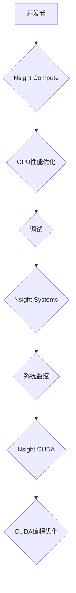

**核心算法原理讲解**

Nsight工具集的原理如下：

1. **Nsight Compute：** Nsight Compute是一个GPU性能分析工具，用于分析GPU应用程序的性能，包括内存使用、计算性能和功耗等。
2. **Nsight Systems：** Nsight Systems是一个系统级性能分析工具，用于监控整个系统的性能，包括CPU、GPU和网络等。
3. **Nsight CUDA：** Nsight CUDA是一个CUDA编程优化工具，用于分析CUDA程序的性能，并提供优化建议。

**数学模型和公式**

Nsight工具集的数学模型可以表示为：

$$
\text{性能优化} = \text{GPU性能分析} \times \text{系统监控} \times \text{CUDA编程优化}
$$`

**举例说明**

以下是一个简单的Nsight Compute示例：

```bash
# 安装Nsight Compute
conda install -c nvidia nsight-compute

# 启动Nsight Compute
nsight-compute --launch MyGPUApp

# 分析性能
nsight-compute report --app MyGPUApp --path output.json
```


