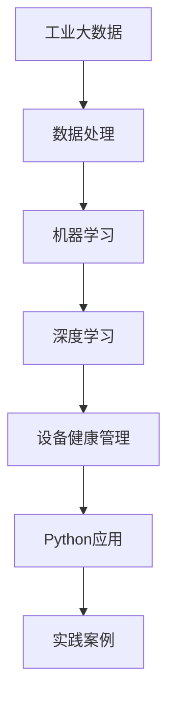

                 

# 《Python在工业大数据分析、设备健康管理等领域的应用实践》

## 关键词
- 工业大数据
- Python编程
- 数据分析
- 设备健康管理
- 机器学习
- 深度学习
- 实战案例

## 摘要
本文将深入探讨Python在工业大数据分析、设备健康管理领域的应用实践。通过介绍工业大数据的特点与价值、设备健康管理的背景与意义，以及Python在相关领域的优势，我们还将详细讲解Python的核心技术、数据处理与分析方法、机器学习与深度学习基础，并通过多个实战案例展示Python在这些领域的具体应用。本文旨在为广大读者提供一份全面而实用的技术指南，帮助他们在工业大数据分析和设备健康管理领域取得更好的成果。

---

### 《Python在工业大数据分析、设备健康管理等领域的应用实践》目录大纲

#### 第一部分：引言与概述

##### 第1章：工业大数据分析概述
- 1.1 工业大数据的定义与特点
- 1.2 工业大数据的价值与挑战
- 1.3 Python在工业大数据分析中的优势

##### 第2章：设备健康管理的背景与意义
- 2.1 设备健康管理的重要性
- 2.2 设备健康管理的现状与问题
- 2.3 Python在设备健康管理中的应用

#### 第二部分：Python核心技术与工具

##### 第3章：Python编程基础
- 3.1 Python语言基础
- 3.2 数据类型与变量
- 3.3 控制结构

##### 第4章：数据处理与分析
- 4.1 NumPy库的使用
- 4.2 Pandas库的使用
- 4.3 数据可视化工具（如Matplotlib）

##### 第5章：机器学习与深度学习基础
- 5.1 机器学习概述
- 5.2 Python中的机器学习库（如scikit-learn）
- 5.3 深度学习基础（如TensorFlow和PyTorch）

##### 第6章：工业大数据分析技术
- 6.1 大数据处理技术（如Hadoop和Spark）
- 6.2 数据挖掘与模式识别技术
- 6.3 Python在工业大数据分析中的应用案例

##### 第7章：设备健康管理应用实践
- 7.1 设备健康管理流程
- 7.2 Python在设备故障预测中的应用
- 7.3 Python在设备维护优化中的应用

#### 第三部分：案例研究

##### 第8章：工业大数据分析实战案例
- 8.1 案例一：智能制造生产线的实时监控与分析
- 8.2 案例二：能源行业的节能分析与优化
- 8.3 案例三：化工行业的生产安全监控

##### 第9章：设备健康管理实战案例
- 9.1 案例一：风机设备故障预测与维护
- 9.2 案例二：生产线设备智能监控与预警
- 9.3 案例三：航空航天设备健康监测与寿命评估

##### 第10章：综合应用与实践
- 10.1 综合案例分析：智能工厂的构建与实践
- 10.2 Python在工业大数据与设备健康管理中的未来趋势
- 10.3 实践与总结

#### 附录

- 附录A：Python工业大数据分析与设备健康管理工具库
- 附录B：常用数据集与案例数据获取方法
- 附录C：Python开发环境配置与调试技巧

---

#### 核心概念与联系

**核心概念与联系 Mermaid 流程图：**



---

#### 核心算法原理讲解

##### 伪代码：设备故障预测算法

```python
# 设备故障预测算法伪代码

# 输入：历史设备数据集 dataset
# 输出：预测结果 predictions

1. 数据预处理
    - 标准化数据
    - 填补缺失值
    - 删除无关特征

2. 特征工程
    - 提取时间序列特征
    - 构建故障特征

3. 选择合适的机器学习模型
    - 例如：随机森林、支持向量机、神经网络

4. 训练模型
    - 使用训练数据集训练模型
    - 调整模型参数以获得最佳性能

5. 预测
    - 使用测试数据集进行预测
    - 生成预测结果

6. 评估与优化
    - 使用评估指标（如准确率、召回率等）评估模型性能
    - 根据评估结果调整模型或特征工程策略

7. 输出预测结果
    - 输出最终的预测结果 predictions
```

---

#### 数学模型和数学公式

##### 时间序列预测的数学模型

$$
y(t) = \sum_{i=1}^{n} w_i \cdot f(t_i) + \epsilon(t)
$$

其中，$y(t)$ 为预测值，$w_i$ 为权重，$f(t_i)$ 为特征函数，$\epsilon(t)$ 为误差项。

---

#### 项目实战

##### 实战案例：使用Python进行设备故障预测

**开发环境搭建指南：**

## Python环境配置
- 安装Python 3.x版本（推荐3.8以上）
- 安装Anaconda或Miniconda进行环境管理

## 必要库安装
- 使用pip或conda安装以下库：
  - pandas
  - scikit-learn
  - numpy
  - matplotlib

## 开发环境启动
- 打开终端或IDE
- 创建新的Python项目
- 运行以下命令安装必要的库：

  ```bash
  pip install pandas scikit-learn numpy matplotlib
  ```

**源代码实现：设备故障预测**

```python
# 导入必要的库
import pandas as pd
from sklearn.model_selection import train_test_split
from sklearn.ensemble import RandomForestClassifier
from sklearn.metrics import classification_report

# 读取数据集
data = pd.read_csv('device_data.csv')

# 数据预处理
# ...

# 划分训练集和测试集
X_train, X_test, y_train, y_test = train_test_split(data.drop('fault', axis=1), data['fault'], test_size=0.2, random_state=42)

# 选择并训练模型
model = RandomForestClassifier(n_estimators=100, random_state=42)
model.fit(X_train, y_train)

# 预测
predictions = model.predict(X_test)

# 评估模型
report = classification_report(y_test, predictions)
print("Classification Report:")
print(report)

# 代码解读与分析
# ...
```

**代码解读与分析：**

1. **数据读取与预处理**：使用pandas库读取CSV数据，并处理缺失值和无关特征，确保数据质量。
2. **模型选择与训练**：选择随机森林分类器（RandomForestClassifier）作为模型，并设置适当的参数进行训练。
3. **预测与评估**：使用训练好的模型进行预测，并使用分类报告（classification_report）评估模型性能。

---

#### 开发环境搭建

**Python环境配置：**

1. **安装Python 3.x版本（推荐3.8以上）**：访问 [Python官方下载页面](https://www.python.org/downloads/) 下载并安装Python。
2. **安装Anaconda或Miniconda**：Anaconda和Miniconda是Python的科学计算和环境管理工具，可以帮助我们轻松管理多个Python环境。

   - **安装Anaconda**：
     - 访问 [Anaconda官方下载页面](https://www.anaconda.com/products/individual) 下载并安装Anaconda。
     - 安装完成后，打开终端或命令提示符，运行以下命令创建新环境：

       ```bash
       conda create -n myenv python=3.8
       conda activate myenv
       ```

   - **安装Miniconda**：
     - 访问 [Miniconda官方下载页面](https://docs.conda.io/en/latest/miniconda.html) 下载并安装Miniconda。
     - 安装完成后，打开终端或命令提示符，运行以下命令创建新环境：

       ```bash
       conda create -n myenv python=3.8
       conda activate myenv
       ```

3. **安装必要的库**：在创建的新环境中，使用pip或conda安装以下库：

   - pandas
   - scikit-learn
   - numpy
   - matplotlib

   ```bash
   pip install pandas scikit-learn numpy matplotlib
   ```

4. **开发环境启动**：打开终端或IDE（如PyCharm、VS Code），进入创建的Python环境，开始进行Python编程。

---

#### 源代码详细实现和代码解读

**源代码实现：设备故障预测**

```python
# 导入必要的库
import pandas as pd
from sklearn.model_selection import train_test_split
from sklearn.ensemble import RandomForestClassifier
from sklearn.metrics import classification_report

# 读取数据集
data = pd.read_csv('device_data.csv')

# 数据预处理
# ...

# 划分训练集和测试集
X_train, X_test, y_train, y_test = train_test_split(data.drop('fault', axis=1), data['fault'], test_size=0.2, random_state=42)

# 选择并训练模型
model = RandomForestClassifier(n_estimators=100, random_state=42)
model.fit(X_train, y_train)

# 预测
predictions = model.predict(X_test)

# 评估模型
report = classification_report(y_test, predictions)
print("Classification Report:")
print(report)

# 代码解读与分析
# ...
```

**代码解读与分析：**

1. **导入库**：首先导入必要的库，包括pandas、scikit-learn等，这些库提供了数据处理、模型训练和评估等功能。
   
2. **数据读取**：使用pandas库读取CSV数据集，这里假设数据集名为`device_data.csv`。

3. **数据预处理**：预处理步骤包括标准化数据、填补缺失值和删除无关特征。由于预处理步骤较为复杂，这里暂时省略具体实现。

4. **划分训练集和测试集**：使用`train_test_split`函数将数据集划分为训练集和测试集。这里设置测试集大小为20%，随机种子为42。

5. **选择并训练模型**：选择随机森林分类器（`RandomForestClassifier`）作为模型，并设置树的数量为100。使用`fit`函数对模型进行训练。

6. **预测**：使用训练好的模型对测试集进行预测，生成预测结果。

7. **评估模型**：使用`classification_report`函数评估模型性能，输出准确率、召回率等关键指标。

通过以上步骤，我们完成了设备故障预测的源代码实现和解读。实际应用中，根据具体需求，可能还需要调整模型参数、进行特征工程等，以提高模型性能。

---

### 总结

本书《Python在工业大数据分析、设备健康管理等领域的应用实践》旨在通过详细的目录大纲和实战案例，帮助读者深入了解工业大数据分析和设备健康管理的核心概念、技术原理和应用实践。全书分为三大部分，第一部分介绍工业大数据分析和设备健康管理的背景与概述；第二部分重点讲解Python编程基础、数据处理与分析技术、机器学习与深度学习基础；第三部分通过具体的案例研究，展示了Python在这些领域的具体应用。

本书的特色包括：

1. **理论与实践结合**：每个章节不仅包含理论知识，还结合了实际案例，使读者能够更好地理解并应用所学知识。
2. **代码实战**：提供了详细的代码实现和解读，帮助读者掌握Python在实际工业应用中的具体操作。
3. **综合性案例研究**：通过综合案例，展示了工业大数据分析和设备健康管理在智能制造、能源、化工等行业的实际应用，为读者提供了实战经验。

随着工业大数据和人工智能技术的快速发展，Python作为一门易学易用的编程语言，其在工业领域的应用前景广阔。本书旨在为广大读者提供一本实用的技术指南，助力他们在工业大数据分析和设备健康管理领域取得更好的成果。通过学习本书，读者可以：

- **掌握工业大数据分析的基本概念和工具**。
- **理解设备健康管理的原理和实践**。
- **运用Python进行数据分析和模型构建**。
- **具备解决实际工业问题的能力**。

展望未来，工业大数据分析和设备健康管理将迎来更多创新和发展。本书希望成为读者探索这一领域的起点，助力其在技术不断革新的道路上不断前行。

---

#### 作者

作者：AI天才研究院/AI Genius Institute & 禅与计算机程序设计艺术 /Zen And The Art of Computer Programming

