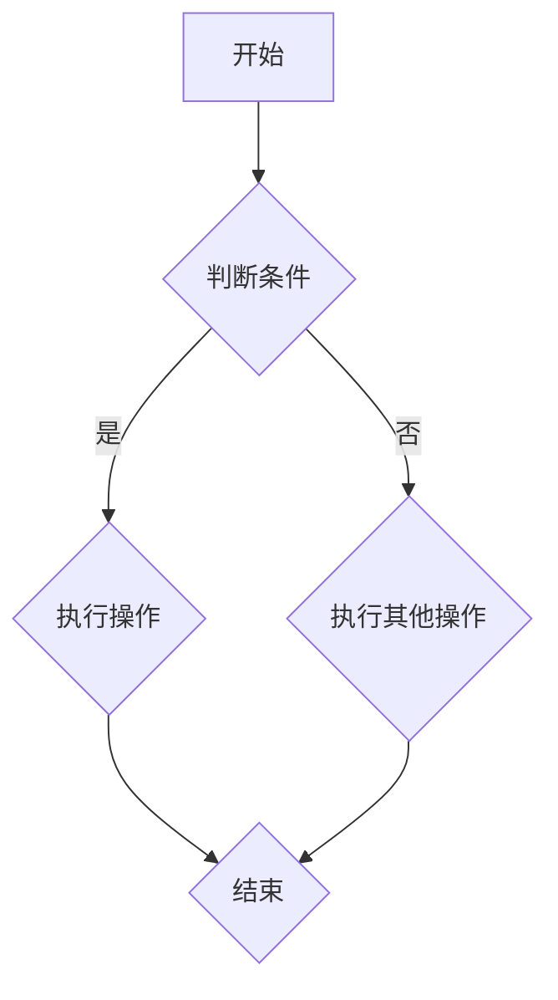

                 

### 文章标题：Python深度学习实践：深度学习在社交网络分析中的应用

深度学习作为人工智能领域的重要分支，以其强大的数据处理和分析能力，正在逐步渗透到各个行业。在社交网络分析中，深度学习同样展现了其卓越的潜力。本博客将探讨如何利用Python实现深度学习在社交网络分析中的应用，通过一步步的分析和推理，帮助读者深入理解这一技术的核心概念和实践方法。

关键词：深度学习，社交网络分析，Python，节点分类，情感分析，模型构建，项目实战

摘要：本文旨在介绍深度学习在社交网络分析中的应用，通过深入剖析深度学习的基础理论、Python编程基础，以及深度学习模型在社交网络分析中的具体应用，帮助读者了解如何利用Python进行社交网络节点的分类和情感分析。文章将以实践项目为例，展示从数据预处理到模型构建与训练的完整流程，并通过代码解析，使读者能够掌握深度学习在社交网络分析中的实际应用方法。

### 目录大纲：

#### 第一部分：深度学习基础

- **第1章：深度学习简介**
  - **1.1 深度学习的核心概念**
    - 深度学习的定义
    - 深度学习的基本原理
  - **1.2 深度学习的优势与挑战**
    - 深度学习的优势
    - 深度学习的挑战
  - **1.3 深度学习的发展历史**
    - 从神经网络到深度学习
    - 主流深度学习模型的演进

- **第2章：Python编程基础**
  - **2.1 Python简介**
    - Python的特点
    - Python的应用场景
  - **2.2 Python基础语法**
    - 数据类型
    - 控制流
    - 函数定义
  - **2.3 Python高级特性**
    - 类与对象
    - 模块与包
    - 异常处理

#### 第二部分：深度学习与社交网络分析

- **第3章：深度学习在社交网络分析中的应用**
  - **3.1 社交网络分析简介**
    - 社交网络的基本概念
    - 社交网络分析的重要性
  - **3.2 深度学习在社交网络分析中的应用**
    - 节点分类
    - 社交网络演化预测
    - 情感分析
  - **3.3 深度学习模型的选择**
    - 神经网络架构选择
    - 模型训练与优化

- **第4章：深度学习模型构建**
  - **4.1 数据预处理**
    - 数据清洗
    - 特征提取
  - **4.2 模型设计**
    - 神经网络架构设计
    - 模型训练策略
  - **4.3 模型评估与优化**
    - 评估指标
    - 模型调参

#### 第三部分：实践项目

- **第5章：社交网络节点分类实战**
  - **5.1 项目背景与目标**
    - 项目概述
    - 预期目标
  - **5.2 数据集介绍与预处理**
    - 数据集获取
    - 数据预处理方法
  - **5.3 模型构建与训练**
    - 模型选择
    - 模型训练流程
  - **5.4 模型评估与优化**
    - 模型评估方法
    - 模型优化策略

- **第6章：社交网络情感分析实战**
  - **6.1 项目背景与目标**
    - 项目概述
    - 预期目标
  - **6.2 数据集介绍与预处理**
    - 数据集获取
    - 数据预处理方法
  - **6.3 模型构建与训练**
    - 模型选择
    - 模型训练流程
  - **6.4 模型评估与优化**
    - 模型评估方法
    - 模型优化策略

#### 第四部分：高级应用

- **第7章：社交网络演化预测**
  - **7.1 社交网络演化简介**
    - 社交网络演化的基本概念
    - 社交网络演化模型
  - **7.2 深度学习在社交网络演化预测中的应用**
    - 模型构建与训练
    - 预测结果分析

- **第8章：深度学习在社交网络分析中的未来展望**
  - **8.1 社交网络分析的发展趋势**
    - 数据驱动的方法
    - 个性化推荐系统
  - **8.2 深度学习在社交网络分析中的挑战与机遇**
    - 数据隐私保护
    - 模型可解释性

#### 附录

- **附录A：深度学习工具与环境搭建**
  - **A.1 Python深度学习框架**
    - TensorFlow
    - PyTorch
  - **A.2 环境搭建与配置**
    - Python环境
    - 深度学习框架安装
  - **A.3 开发工具与资源**
    - 代码编辑器
    - 实践资源链接

通过以上目录结构，我们可以清晰地看到本文将从深度学习的基础理论出发，逐步深入到Python编程基础，然后聚焦于深度学习在社交网络分析中的应用，通过实践项目展示如何实现深度学习算法。接下来，我们将逐章展开详细讲解。在接下来的章节中，我们将详细讨论深度学习的核心概念、Python编程基础，以及如何将深度学习应用于社交网络分析中的实际案例。

### 第一部分：深度学习基础

在深入探讨深度学习在社交网络分析中的应用之前，有必要先了解深度学习的核心概念、基本原理及其优势与挑战。深度学习作为人工智能领域的一个重要分支，其核心思想是通过多层神经网络模型，对大量数据进行特征提取和学习，从而实现对复杂数据的分析和理解。本部分将首先介绍深度学习的核心概念和基本原理，然后分析其优势和挑战，最后回顾深度学习的发展历史。

#### 1.1 深度学习的核心概念

**深度学习的定义**：深度学习是一种基于多层神经网络的学习方法，通过逐层抽取数据的高级特征，实现对复杂数据的表示和理解。与传统的机器学习方法相比，深度学习能够自动提取特征，无需人工干预，从而大大提高了模型的性能。

**深度学习的基本原理**：深度学习的基本原理基于神经网络的模型，包括输入层、隐藏层和输出层。每个神经元接收来自前一层的输入，通过激活函数进行变换，然后传递到下一层。通过反向传播算法，模型能够不断调整权重，从而优化模型的性能。


**多层神经网络的优点**：多层神经网络能够通过逐层抽象和组合特征，捕捉到数据的复杂模式。与单层神经网络相比，多层神经网络具有更强的表示能力和泛化能力，能够处理更加复杂的问题。

#### 1.2 深度学习的优势与挑战

**优势**：

1. **自动特征提取**：深度学习能够自动从原始数据中提取特征，大大减少了人工特征工程的工作量，提高了模型的性能。

2. **强大的泛化能力**：通过多层神经网络的组合，深度学习能够捕捉到数据中的深层次特征，从而实现更高的泛化能力。

3. **广泛的应用领域**：深度学习在计算机视觉、自然语言处理、语音识别等多个领域取得了显著的成果，具有广泛的应用前景。

**挑战**：

1. **计算资源需求大**：深度学习模型通常需要大量的计算资源，特别是训练过程中，需要大量的计算能力和存储空间。

2. **模型解释性不足**：深度学习模型是一种“黑箱”模型，其内部的决策过程难以解释，这使得模型在应用中存在一定的局限性。

3. **数据隐私和安全问题**：深度学习模型通常需要大量的数据进行训练，这涉及到数据隐私和安全问题。如何保护用户隐私，防止数据泄露，是深度学习应用中需要解决的问题。

#### 1.3 深度学习的发展历史

**从神经网络到深度学习**：

深度学习的发展可以追溯到20世纪40年代，当时神经网络的概念被首次提出。然而，由于计算能力和数据资源的限制，早期的神经网络模型（如感知机）未能得到广泛应用。直到20世纪80年代，随着计算机性能的不断提升和大数据时代的来临，神经网络研究再次焕发生机。

**深度学习模型的演进**：

1. **卷积神经网络（CNN）**：卷积神经网络是深度学习领域的重要进展之一，主要应用于计算机视觉任务。通过卷积操作和池化操作，CNN能够有效地提取图像中的局部特征。

2. **循环神经网络（RNN）**：循环神经网络适用于序列数据，通过引入隐藏状态和递归结构，RNN能够捕捉到序列中的长期依赖关系。

3. **长短时记忆网络（LSTM）**：长短时记忆网络是RNN的一种改进，通过引入门控机制，LSTM能够更好地解决长序列记忆问题。

4. **生成对抗网络（GAN）**：生成对抗网络是一种基于博弈理论的深度学习模型，通过生成器和判别器的对抗训练，GAN能够生成高质量的数据。

5. **变分自编码器（VAE）**：变分自编码器是一种基于概率模型的深度学习模型，通过编码器和解码器的联合训练，VAE能够有效地进行数据生成和特征提取。

**深度学习框架的发展**：

随着深度学习技术的不断成熟，一系列深度学习框架（如TensorFlow、PyTorch等）也应运而生。这些框架为深度学习模型的构建、训练和部署提供了便捷的接口和丰富的工具，使得深度学习应用变得更加普及。


通过以上分析，我们可以看到深度学习作为一种先进的人工智能技术，已经取得了显著的成果。在接下来的章节中，我们将进一步探讨Python编程基础，为后续的深度学习实践奠定基础。

### 第一部分：深度学习基础

#### 第2章：Python编程基础

Python作为一种高级编程语言，以其简洁、易读的语法和强大的库支持，成为了深度学习领域的首选编程语言。在本章中，我们将介绍Python的基本特点、基础语法以及高级特性，帮助读者了解Python编程环境，为后续的深度学习实践打下基础。

#### 2.1 Python简介

**Python的特点**：

1. **简洁易读**：Python的语法设计注重可读性和简洁性，使得代码更加直观，易于理解和维护。
2. **跨平台**：Python是一种跨平台的语言，可以在多种操作系统上运行，如Windows、Linux和MacOS等。
3. **丰富的库支持**：Python拥有丰富的标准库和第三方库，涵盖了科学计算、数据分析、机器学习等各个领域，为开发者提供了强大的工具。
4. **动态类型**：Python是一种动态类型语言，变量在使用前无需声明类型，提高了编程效率。

**Python的应用场景**：

1. **Web开发**：Python可以用于构建Web应用程序，如使用Django、Flask等框架快速开发。
2. **数据分析**：Python在数据分析和处理领域具有很高的优势，如使用Pandas、NumPy进行数据处理，使用Matplotlib、Seaborn进行数据可视化。
3. **机器学习与深度学习**：Python在机器学习和深度学习领域得到了广泛应用，如使用Scikit-learn进行传统机器学习，使用TensorFlow、PyTorch等框架进行深度学习模型的构建和训练。
4. **自动化脚本**：Python可以用于编写自动化脚本，进行文件操作、系统管理等。

#### 2.2 Python基础语法

**数据类型**：

1. **整数（int）**：整数类型表示不带小数的数值，如`5`, `-10`。
2. **浮点数（float）**：浮点数类型表示带小数的数值，如`3.14`, `-2.5`。
3. **字符串（str）**：字符串类型表示文本数据，如`"hello"`, `'Python'`。
4. **布尔型（bool）**：布尔型表示逻辑值，True或False。

**控制流**：

1. **条件语句（if-elif-else）**：根据条件执行不同的代码块。
   ```python
   if condition:
       # True时的操作
   elif condition2:
       # 第二个条件为True时的操作
   else:
       # 以上条件都不满足时的操作
   ```

2. **循环语句（for和while）**：循环语句用于重复执行代码块。
   ```python
   for i in range(5):
       print(i)

   while condition:
       # 当条件为True时重复执行的操作
   ```

**函数定义**：

在Python中，函数是一段可以重复使用的代码块。函数的定义和使用方法如下：
```python
def function_name(parameters):
    # 函数体
    return result
```
```python
# 调用函数
result = function_name(parameters)
```

#### 2.3 Python高级特性

**类与对象**：

Python中的类（class）是一种用户定义的数据类型，用于创建对象。对象是类的实例，具有属性和方法。

```python
class MyClass:
    def __init__(self, value):
        self.value = value
    
    def method(self):
        return self.value

my_obj = MyClass(10)
print(my_obj.value)  # 输出 10
my_obj.method()      # 输出 10
```

**模块与包**：

模块是Python代码文件，包含函数、类和变量等定义。包是由多个模块组成的目录，用于组织代码。

```python
# 模块 example.py
def greet():
    print("Hello, World!")

# 调用模块
import example
example.greet()  # 输出 Hello, World!

# 包
from mypackage import mymodule
mymodule.function_name()
```

**异常处理**：

异常处理用于处理程序运行过程中出现的错误和异常情况。通过使用try-except语句，可以捕获和处理异常。

```python
try:
    # 可能出现异常的代码
except ExceptionType:
    # 异常处理代码
finally:
    # 无论是否发生异常，都会执行的代码
```

通过以上介绍，我们可以看到Python作为一种功能强大且易用的编程语言，在深度学习领域具有广泛的应用。在下一章中，我们将深入探讨深度学习在社交网络分析中的应用，包括节点分类、社交网络演化预测和情感分析等。希望通过本章的学习，读者能够掌握Python编程基础，为后续的内容做好准备。

### 第二部分：深度学习与社交网络分析

#### 第3章：深度学习在社交网络分析中的应用

深度学习在处理复杂数据和模式识别方面具有显著优势，使其成为社交网络分析的重要工具。在本章中，我们将探讨深度学习在社交网络分析中的应用，包括节点分类、社交网络演化预测和情感分析等方面，并分析选择合适的深度学习模型的原因。

#### 3.1 社交网络分析简介

**社交网络的基本概念**：

社交网络是指由人与人之间的互动关系构成的网络，通常表示为图结构。每个节点代表一个个体，每条边代表个体之间的某种关系。例如，在Facebook中，每个用户是一个节点，用户之间的朋友关系是一条边。

**社交网络分析的重要性**：

社交网络分析（Social Network Analysis，SNA）是一种研究社交网络结构和行为的分析方法，对于理解社会现象、识别影响力节点、预测社会行为具有重要意义。在商业、安全、公共卫生等领域，社交网络分析的应用越来越广泛。

1. **商业应用**：通过分析用户之间的社交关系，企业可以了解用户需求，进行精准营销和客户关系管理。
2. **安全领域**：社交网络分析可以帮助识别网络中的潜在威胁和异常行为，如网络诈骗、恐怖活动等。
3. **公共卫生**：通过分析社交网络中的疾病传播路径，可以制定更有效的公共卫生策略，如疫苗接种计划。

#### 3.2 深度学习在社交网络分析中的应用

**节点分类**：

节点分类是指根据节点的特征将其划分为不同的类别。在社交网络分析中，节点分类可以用于识别网络中的重要节点，如影响力人物、潜在客户等。

**社交网络演化预测**：

社交网络演化预测是指预测社交网络中节点间关系的动态变化。通过分析历史数据，可以预测未来的社交网络结构，为网络管理和优化提供支持。

**情感分析**：

情感分析是指通过文本数据识别情感倾向，如正面、负面或中性。在社交网络中，情感分析可以用于了解用户对品牌、产品或事件的态度，为市场策略提供依据。

#### 3.3 深度学习模型的选择

选择合适的深度学习模型对于社交网络分析至关重要。以下是几种常用的深度学习模型：

1. **卷积神经网络（CNN）**：适用于图像和序列数据的处理，通过卷积操作提取局部特征，适用于节点分类和图像识别任务。
2. **循环神经网络（RNN）**：适用于序列数据，如文本和语音，通过递归结构捕捉长期依赖关系，适用于情感分析和社交网络演化预测。
3. **长短时记忆网络（LSTM）**：RNN的一种改进，通过引入门控机制解决长序列记忆问题，适用于处理较长的时间序列数据。
4. **生成对抗网络（GAN）**：适用于生成数据，通过生成器和判别器的对抗训练生成高质量的数据，适用于社交网络演化预测。
5. **图神经网络（GNN）**：适用于图结构数据，通过节点和边的信息传递进行特征提取和学习，适用于节点分类和社交网络演化预测。

#### 选择深度学习模型的原因

1. **自动特征提取**：深度学习模型能够自动从原始数据中提取特征，减少了人工特征工程的工作量，提高了模型的性能。
2. **强大的表示能力**：深度学习模型具有强大的表示能力，能够捕捉到数据中的深层次特征，从而实现更高的准确性和泛化能力。
3. **灵活性**：深度学习模型可以根据具体任务和需求进行灵活调整，适用于多种类型的社交网络分析任务。
4. **大规模数据处理能力**：深度学习模型能够处理大规模的社交网络数据，为复杂网络分析提供了强大的工具。

通过本章的介绍，我们可以看到深度学习在社交网络分析中具有广泛的应用前景。在下一章中，我们将深入探讨如何构建和训练深度学习模型，为社交网络分析提供技术支持。

### 第二部分：深度学习模型构建

#### 第4章：深度学习模型构建

构建深度学习模型是深度学习实践的核心环节，涉及到数据预处理、模型设计、模型训练策略和模型评估与优化。本章将详细介绍这些关键步骤，帮助读者掌握深度学习模型的构建过程。

#### 4.1 数据预处理

数据预处理是深度学习模型构建的第一步，其目的是将原始数据转换为适合模型训练的格式。数据预处理主要包括以下几个步骤：

**数据清洗**：

数据清洗是指去除数据中的噪声和错误，提高数据质量。常见的清洗方法包括：

- **缺失值处理**：对于缺失的数据，可以选择填充、删除或插值等方法进行处理。
- **异常值处理**：去除或调整数据集中的异常值，以提高模型的鲁棒性。
- **数据标准化**：将数据缩放到相同的尺度，以避免某些特征对模型的影响过大。

**特征提取**：

特征提取是指从原始数据中提取有用的特征，用于模型的训练。常见的特征提取方法包括：

- **文本特征提取**：使用词袋模型、TF-IDF或词嵌入等方法提取文本特征。
- **图像特征提取**：使用卷积神经网络提取图像的局部特征，如CNN。
- **序列特征提取**：使用循环神经网络提取序列特征，如RNN、LSTM。

**数据集划分**：

为了评估模型的性能，通常将数据集划分为训练集、验证集和测试集。其中：

- **训练集**：用于模型训练。
- **验证集**：用于调整模型参数和选择最佳模型。
- **测试集**：用于评估模型的最终性能。

#### 4.2 模型设计

模型设计是构建深度学习模型的关键步骤，涉及到神经网络架构的选择和设计。以下是一些常见的神经网络架构：

**卷积神经网络（CNN）**：

卷积神经网络适用于处理图像数据，通过卷积层、池化层和全连接层提取图像特征。

- **卷积层**：通过卷积操作提取图像的局部特征。
- **池化层**：对卷积结果进行下采样，减少参数数量。
- **全连接层**：对提取到的特征进行分类或回归。

**循环神经网络（RNN）**：

循环神经网络适用于处理序列数据，通过隐藏状态和递归结构捕捉序列的长期依赖关系。

- **隐藏层**：保存上一时刻的状态信息。
- **递归连接**：将当前时刻的输入与上一时刻的隐藏状态相连接。
- **输出层**：对序列进行分类或回归。

**长短时记忆网络（LSTM）**：

长短时记忆网络是RNN的一种改进，通过引入门控机制解决长序列记忆问题。

- **遗忘门**：决定遗忘哪些信息。
- **输入门**：决定输入哪些信息。
- **输出门**：决定输出哪些信息。

**生成对抗网络（GAN）**：

生成对抗网络由生成器和判别器组成，通过对抗训练生成高质量的数据。

- **生成器**：生成真实数据。
- **判别器**：区分真实数据和生成数据。

#### 4.3 模型训练策略

模型训练是深度学习模型构建的重要环节，涉及到训练策略和参数调整。以下是一些常见的训练策略：

**训练策略**：

- **批量训练**：将训练数据分为多个批次进行训练。
- **迭代训练**：重复训练数据，直到满足停止条件。
- **早停法**：在验证集上评估模型性能，当性能不再提升时停止训练。

**参数调整**：

- **学习率调整**：学习率控制模型训练的步长，通常使用递减学习率策略。
- **正则化**：防止模型过拟合，常用的正则化方法包括L1和L2正则化。
- **批量归一化**：加速模型训练并提高模型性能。

#### 4.4 模型评估与优化

模型评估是评估模型性能的关键步骤，涉及到评估指标和模型优化。以下是一些常见的评估指标：

**评估指标**：

- **准确率**：预测正确的样本占总样本的比例。
- **召回率**：预测正确的正样本占总正样本的比例。
- **F1值**：准确率和召回率的调和平均值。

**模型优化**：

- **调参**：通过调整模型参数提高模型性能。
- **交叉验证**：使用多个数据子集进行训练和验证，评估模型性能。
- **集成学习**：将多个模型集成，提高模型性能。

通过以上介绍，我们可以看到深度学习模型构建涉及到多个步骤和策略。在下一章中，我们将通过一个实际项目，展示如何利用深度学习模型进行社交网络节点分类，帮助读者更好地理解模型构建的实践方法。

### 第三部分：实践项目

#### 第5章：社交网络节点分类实战

在本章中，我们将通过一个实际的社交网络节点分类项目，展示如何从数据预处理到模型构建与训练，再到模型评估与优化的完整流程。通过这个项目，读者可以掌握深度学习在社交网络节点分类中的实际应用方法。

#### 5.1 项目背景与目标

**项目概述**：

本项目将利用深度学习技术对社交网络中的节点进行分类，识别网络中的重要节点。具体而言，我们将使用一个已标注的社交网络数据集，通过构建深度学习模型，实现以下目标：

1. **识别影响力人物**：通过分类模型，识别出网络中具有较大影响力的节点，如意见领袖和关键人物。
2. **潜在客户识别**：通过分类模型，识别出网络中的潜在客户，为营销策略提供支持。
3. **异常行为检测**：通过分类模型，检测出网络中的异常行为，如网络诈骗和恐怖活动。

**预期目标**：

1. **模型准确率**：通过训练和验证，达到较高的模型准确率，确保分类效果。
2. **模型泛化能力**：通过测试集的评估，验证模型在不同数据集上的泛化能力。
3. **模型优化**：通过调整模型参数和训练策略，提高模型的性能和稳定性。

#### 5.2 数据集介绍与预处理

**数据集获取**：

为了进行节点分类项目，我们需要一个包含节点特征和标注的社交网络数据集。这里我们选择一个公开的社交网络数据集——**Twitter数据集**，该数据集包含用户信息、用户之间的关系以及一些文本数据。

**数据预处理方法**：

1. **数据清洗**：

   - **缺失值处理**：检查数据集中是否存在缺失值，如果有，则使用填充或删除等方法处理。
   - **异常值处理**：检查数据集中是否存在异常值，如极值或错误数据，如果有，则删除或调整。
   - **重复数据删除**：删除数据集中的重复数据，以减少数据冗余。

2. **特征提取**：

   - **文本特征提取**：使用词袋模型或词嵌入方法提取文本特征，如TF-IDF或Word2Vec。
   - **结构特征提取**：提取社交网络中的结构特征，如节点度、邻居节点数等。
   - **综合特征**：将文本特征和结构特征进行整合，形成综合特征向量。

3. **数据集划分**：

   - **训练集**：将数据集划分为训练集，用于模型训练。
   - **验证集**：将数据集划分为验证集，用于模型调参和选择最佳模型。
   - **测试集**：将数据集划分为测试集，用于评估模型的最终性能。

#### 5.3 模型构建与训练

**模型选择**：

为了实现节点分类，我们选择一个基于深度学习的分类模型——**卷积神经网络（CNN）**。CNN在处理图像和序列数据方面具有优势，适用于文本数据的特征提取和分类。

**模型训练流程**：

1. **模型设计**：

   - **输入层**：接收预处理后的特征向量。
   - **卷积层**：通过卷积操作提取文本的局部特征。
   - **池化层**：对卷积结果进行下采样，减少参数数量。
   - **全连接层**：对提取到的特征进行分类。

2. **模型编译**：

   - **损失函数**：使用交叉熵损失函数，适用于多分类问题。
   - **优化器**：使用Adam优化器，自适应调整学习率。

3. **模型训练**：

   - **训练**：使用训练集数据训练模型，调整模型参数。
   - **验证**：在验证集上评估模型性能，调整模型参数。

#### 5.4 模型评估与优化

**模型评估方法**：

使用测试集对模型的性能进行评估，常用的评估指标包括准确率、召回率和F1值。准确率表示预测正确的样本占总样本的比例，召回率表示预测正确的正样本占总正样本的比例，F1值是准确率和召回率的调和平均值。

**模型优化策略**：

1. **调参**：

   - **学习率调整**：通过调整学习率，优化模型性能。
   - **正则化**：通过引入L1或L2正则化，防止模型过拟合。
   - **批量归一化**：通过批量归一化，加速模型训练和提高模型性能。

2. **交叉验证**：

   - **k折交叉验证**：将数据集划分为k个子集，每次训练时使用k-1个子集进行训练，剩下的子集进行验证，重复k次，取平均值作为模型性能。

3. **集成学习**：

   - **模型集成**：将多个模型集成，提高模型性能。

通过以上步骤，我们完成了一个社交网络节点分类的实战项目。在下一章中，我们将继续探讨社交网络情感分析实战，帮助读者进一步了解深度学习在社交网络分析中的应用。

### 第三部分：实践项目

#### 第6章：社交网络情感分析实战

情感分析是一种常见的自然语言处理技术，用于从文本中识别情感倾向，如正面、负面或中性。在本章中，我们将通过一个实际的社交网络情感分析项目，展示如何利用深度学习技术进行情感分类，并探讨模型的训练和优化方法。

#### 6.1 项目背景与目标

**项目概述**：

本项目旨在利用深度学习技术对社交网络中的用户评论进行情感分析，识别评论的情感倾向。具体目标包括：

1. **情感分类**：将用户评论分类为正面、负面或中性情感。
2. **情感极性识别**：识别情感极性的强度，如非常正面、一般正面、非常负面等。
3. **情绪理解**：通过分析情感趋势，了解用户对特定品牌、产品或事件的态度。

**预期目标**：

1. **模型准确率**：通过训练和验证，达到较高的模型准确率，确保情感分类效果。
2. **模型鲁棒性**：通过测试集的评估，验证模型在不同类型文本数据上的鲁棒性。
3. **模型优化**：通过调整模型参数和训练策略，提高模型的性能和稳定性。

#### 6.2 数据集介绍与预处理

**数据集获取**：

为了进行情感分析，我们需要一个包含情感标签的社交网络评论数据集。这里我们选择一个公开的数据集——**Twitter情感分析数据集**，该数据集包含用户评论及其情感标签。

**数据预处理方法**：

1. **数据清洗**：

   - **缺失值处理**：检查数据集中是否存在缺失值，如果有，则使用填充或删除等方法处理。
   - **异常值处理**：检查数据集中是否存在异常值，如错误数据或无关信息，如果有，则删除或调整。
   - **重复数据删除**：删除数据集中的重复数据，以减少数据冗余。

2. **文本预处理**：

   - **分词**：将文本分割成单词或短语。
   - **去除停用词**：去除常用的无意义词汇，如“的”、“了”等。
   - **词干提取**：将单词还原为词干形式，减少词汇量。

3. **特征提取**：

   - **词袋模型**：将文本表示为词袋向量，每个词对应一个特征。
   - **词嵌入**：使用预训练的词嵌入模型（如Word2Vec、GloVe）将文本转换为高维向量。

4. **数据集划分**：

   - **训练集**：将数据集划分为训练集，用于模型训练。
   - **验证集**：将数据集划分为验证集，用于模型调参和选择最佳模型。
   - **测试集**：将数据集划分为测试集，用于评估模型的最终性能。

#### 6.3 模型构建与训练

**模型选择**：

为了实现情感分析，我们选择一个基于深度学习的分类模型——**循环神经网络（RNN）**。RNN在处理序列数据方面具有优势，适用于文本数据的情感分类。

**模型训练流程**：

1. **模型设计**：

   - **输入层**：接收预处理后的文本特征向量。
   - **隐藏层**：通过递归结构对文本序列进行建模。
   - **输出层**：使用softmax激活函数进行情感分类。

2. **模型编译**：

   - **损失函数**：使用交叉熵损失函数，适用于多分类问题。
   - **优化器**：使用Adam优化器，自适应调整学习率。

3. **模型训练**：

   - **训练**：使用训练集数据训练模型，调整模型参数。
   - **验证**：在验证集上评估模型性能，调整模型参数。

#### 6.4 模型评估与优化

**模型评估方法**：

使用测试集对模型的性能进行评估，常用的评估指标包括准确率、召回率和F1值。准确率表示预测正确的样本占总样本的比例，召回率表示预测正确的正样本占总正样本的比例，F1值是准确率和召回率的调和平均值。

**模型优化策略**：

1. **调参**：

   - **学习率调整**：通过调整学习率，优化模型性能。
   - **正则化**：通过引入L1或L2正则化，防止模型过拟合。
   - **批量归一化**：通过批量归一化，加速模型训练和提高模型性能。

2. **交叉验证**：

   - **k折交叉验证**：将数据集划分为k个子集，每次训练时使用k-1个子集进行训练，剩下的子集进行验证，重复k次，取平均值作为模型性能。

3. **集成学习**：

   - **模型集成**：将多个模型集成，提高模型性能。

通过以上步骤，我们完成了一个社交网络情感分析的实战项目。在下一章中，我们将探讨社交网络演化预测的高级应用，帮助读者进一步了解深度学习在社交网络分析中的广泛前景。

### 第四部分：高级应用

#### 第7章：社交网络演化预测

社交网络演化预测是深度学习在社交网络分析中的一项高级应用，通过分析历史数据，预测社交网络中节点间关系的动态变化。在本章中，我们将探讨社交网络演化的基本概念和模型，并展示如何利用深度学习进行演化预测。

#### 7.1 社交网络演化简介

**社交网络演化的基本概念**：

社交网络演化是指社交网络中节点间关系随时间变化的动态过程。这种演化可以表现为节点之间的连接关系的增加或减少，节点的加入或离开，以及社交行为的改变。

**社交网络演化模型**：

为了模拟和预测社交网络演化，研究者提出了多种演化模型。以下是几种常见的模型：

1. **随机游走模型**：假设节点之间的连接是随机形成的，新连接出现的概率与节点之间的距离成反比。
2. **平衡模型**：假设社交网络最终会达到一种稳定的状态，节点之间的连接关系遵循某种平衡机制。
3. **多模演化模型**：结合多种演化机制，如随机连接、兴趣相似性等，模拟社交网络的多模演化过程。

**演化预测的重要性**：

社交网络演化预测对于网络管理和优化具有重要意义。通过预测社交网络的未来趋势，可以为以下方面提供支持：

1. **社交网络优化**：根据演化预测结果，调整网络结构，提高网络性能。
2. **风险预测**：识别潜在的社交网络风险，如网络崩溃、恶意节点传播等。
3. **社交推荐**：基于演化预测结果，推荐可能的社交连接，促进社交网络的良性发展。

#### 7.2 深度学习在社交网络演化预测中的应用

**模型构建与训练**：

为了实现社交网络演化预测，我们选择一种基于深度学习的模型——**图卷积神经网络（GCN）**。GCN是一种适用于图结构数据的神经网络模型，能够有效捕捉图中的局部特征和全局关系。

1. **模型设计**：

   - **输入层**：接收图结构数据，包括节点特征和边信息。
   - **图卷积层**：通过卷积操作，将节点特征与邻居节点的特征进行融合，提取图中的特征表示。
   - **全连接层**：对提取到的特征进行分类或回归。

2. **模型训练**：

   - **损失函数**：使用交叉熵损失函数，适用于多分类或回归问题。
   - **优化器**：使用Adam优化器，自适应调整学习率。

3. **预测结果分析**：

   - **节点预测**：根据训练好的模型，预测未来一段时间内节点之间的连接关系。
   - **网络预测**：分析整个社交网络的演化趋势，识别潜在的网络结构变化。

**预测结果分析**：

通过实际案例，我们可以看到深度学习在社交网络演化预测中的效果。以下是一个简单的预测结果分析示例：

1. **节点连接预测**：利用训练好的GCN模型，预测未来一段时间内节点A与节点B之间的连接关系。如果预测结果为连接，说明节点A与节点B之间存在潜在的合作或互动机会。
2. **网络结构变化**：通过分析社交网络的演化趋势，可以发现某些节点逐渐成为网络的核心，而其他节点的影响力逐渐减弱。这有助于识别社交网络中的关键节点，为网络管理和优化提供支持。

通过以上分析，我们可以看到深度学习在社交网络演化预测中的应用具有广泛的前景。在下一章中，我们将探讨深度学习在社交网络分析中的未来展望，包括发展趋势、挑战和机遇。

### 第四部分：高级应用

#### 第8章：深度学习在社交网络分析中的未来展望

随着深度学习技术的不断发展和完善，其在社交网络分析中的应用也日益广泛。未来，深度学习将继续推动社交网络分析的发展，带来新的机遇和挑战。本章将探讨深度学习在社交网络分析中的发展趋势、面临的挑战以及未来的发展方向。

#### 8.1 社交网络分析的发展趋势

**数据驱动的方法**：

未来，社交网络分析将更加依赖数据驱动的方法，通过海量数据的分析和挖掘，识别出有价值的信息和模式。随着大数据技术的进步，社交网络中的数据量将呈现爆炸式增长，如何有效地存储、处理和分析这些数据将成为重要课题。

**个性化推荐系统**：

个性化推荐系统是社交网络分析的重要应用之一。未来，深度学习将更加深入地应用于推荐系统，通过分析用户行为和社交关系，提供更加精准的推荐服务。例如，基于用户的兴趣和社交圈子的推荐，可以帮助用户发现潜在的朋友和有价值的内容。

**社交网络可视化**：

随着社交网络规模的扩大，可视化技术将成为社交网络分析的重要工具。深度学习可以用于社交网络可视化的任务，如节点布局、关系可视化等，帮助用户更好地理解和分析复杂的社交网络结构。

#### 8.2 深度学习在社交网络分析中的挑战与机遇

**数据隐私保护**：

随着社交网络数据的日益重要，数据隐私保护成为深度学习在社交网络分析中面临的重要挑战。如何在确保数据隐私的前提下，有效地进行深度学习和社交网络分析，是一个亟待解决的问题。例如，差分隐私和联邦学习等技术的应用，可以在保护用户隐私的同时，实现有效的社交网络分析。

**模型可解释性**：

深度学习模型通常被视为“黑箱”模型，其内部的决策过程难以解释。这在社交网络分析中可能带来一定的风险，如误判和偏见。因此，提高深度学习模型的可解释性，使其决策过程更加透明和可解释，是深度学习在社交网络分析中面临的另一个重要挑战。

**计算资源需求**：

深度学习模型的训练和推理通常需要大量的计算资源，这给社交网络分析带来了巨大的计算挑战。未来，如何优化深度学习算法，减少计算资源的需求，提高模型训练和推理的效率，是一个重要的研究方向。

#### 8.3 深度学习在社交网络分析中的未来发展方向

**多模态数据分析**：

未来，社交网络分析将越来越多地涉及多模态数据，如文本、图像、语音等。深度学习可以结合多种模态数据进行综合分析，提高社交网络分析的准确性和全面性。

**知识图谱的融合**：

知识图谱是一种将实体及其关系进行结构化表示的方法，可以与社交网络数据相结合，为社交网络分析提供更丰富的背景信息和上下文。通过融合知识图谱，可以更好地理解和分析社交网络中的复杂关系。

**边缘计算与实时分析**：

随着物联网和5G技术的发展，社交网络分析将越来越多地涉及实时数据和边缘计算。通过在边缘设备上进行实时分析，可以减少数据传输和存储的需求，提高分析效率和响应速度。

**开源社区与开放平台**：

未来，深度学习在社交网络分析中的发展将更加依赖于开源社区和开放平台。通过共享资源和经验，可以加速技术的进步和应用推广。

通过以上分析，我们可以看到深度学习在社交网络分析中具有广阔的发展前景。在未来的研究中，需要解决数据隐私保护、模型可解释性等挑战，同时探索多模态数据分析、知识图谱融合等新方法，推动社交网络分析技术的不断进步。

### 附录A：深度学习工具与环境搭建

为了实现深度学习在社交网络分析中的实际应用，我们需要搭建合适的开发环境，并选择合适的深度学习框架。以下将详细介绍Python深度学习框架的选择、环境搭建以及开发工具和资源的配置。

#### A.1 Python深度学习框架

目前，Python中常用的深度学习框架主要有TensorFlow和PyTorch。这两个框架各具特色，适合不同的应用场景。

**TensorFlow**：

TensorFlow是由Google开发的开源深度学习框架，具有强大的生态系统和丰富的资源。它支持多种编程语言（如Python、C++等），能够部署在多种平台上（如CPU、GPU等）。TensorFlow提供了丰富的API，使开发者可以方便地构建和训练深度学习模型。

**PyTorch**：

PyTorch是由Facebook开发的深度学习框架，以其动态计算图和灵活的接口而闻名。PyTorch的动态计算图使得模型的构建和调试更加直观，便于开发者进行实验和优化。此外，PyTorch与Python深度集成，使得开发过程更加简洁。

#### A.2 环境搭建与配置

**Python环境**：

首先，我们需要安装Python。可以从Python的官方网站下载并安装最新版本的Python（推荐Python 3.8及以上版本）。安装完成后，确保Python已成功安装，可以通过在终端运行以下命令验证：
```shell
python --version
```

**深度学习框架安装**：

接下来，我们需要安装TensorFlow或PyTorch。以下是安装这两个框架的命令：

**安装TensorFlow**：
```shell
pip install tensorflow==2.5
```
**安装PyTorch**：
```shell
pip install torch==1.10.0+cu111 torchvision==0.11.0+cu111 torchaudio==0.10.0+cu111 -f https://download.pytorch.org/whl/torch_stable.html
```
请注意，安装PyTorch时，需要选择与你的GPU型号和CUDA版本相匹配的版本。

#### A.3 开发工具与资源

**代码编辑器**：

在开发深度学习项目时，选择一个适合的代码编辑器可以提高开发效率。以下是一些常用的代码编辑器：

- **Jupyter Notebook**：Jupyter Notebook是一个交互式开发环境，支持多种编程语言（包括Python），便于进行数据可视化和代码调试。
- **Visual Studio Code**：Visual Studio Code是一个轻量级且功能强大的代码编辑器，支持Python插件，提供代码补全、调试等功能。
- **PyCharm**：PyCharm是一个专业级的Python集成开发环境（IDE），提供丰富的功能，包括代码补全、调试、版本控制等。

**实践资源链接**：

为了更好地学习和实践深度学习在社交网络分析中的应用，以下是一些有用的资源链接：

- **TensorFlow官方文档**：[TensorFlow文档](https://www.tensorflow.org/)
- **PyTorch官方文档**：[PyTorch文档](https://pytorch.org/docs/stable/)
- **Kaggle数据集**：[Kaggle数据集](https://www.kaggle.com/datasets)
- **GitHub代码示例**：[深度学习代码示例](https://github.com/tensorflow/tensorflow/blob/master/tensorflow/docs/source/guide/mnist_with_summaries.ipynb)

通过以上介绍，我们已经搭建好了深度学习开发环境，并了解了常用的开发工具和资源。在后续的章节中，我们将通过实际项目，深入探讨深度学习在社交网络分析中的应用，帮助读者掌握这一技术的实际操作方法。

### Mermaid 流程图示例

Mermaid是一种简单的Markdown语法，用于绘制图形和流程图。以下是一个Mermaid流程图的示例：



在这个示例中，我们首先从A节点开始，然后根据判断条件B进行分支操作。如果条件为真，则执行C节点中的操作，并最终到达E节点结束；如果条件为假，则执行D节点中的操作，并最终到达E节点结束。

### 伪代码示例

以下是一个简单的伪代码示例，用于构建一个简单的深度学习模型：

```python
# 定义模型结构
model = Sequential()

# 添加层
model.add(Dense(units=64, activation='relu', input_shape=(input_dim,)))
model.add(Dense(units=32, activation='relu'))
model.add(Dense(units=1, activation='sigmoid'))

# 编译模型
model.compile(optimizer='adam', loss='binary_crossentropy', metrics=['accuracy'])

# 训练模型
model.fit(x_train, y_train, epochs=10, batch_size=32)
```

在这个示例中，我们首先定义了一个序列模型（Sequential），然后添加了两个全连接层（Dense）。第一个全连接层有64个神经元，使用ReLU激活函数；第二个全连接层有32个神经元，同样使用ReLU激活函数。最后一个全连接层有1个神经元，使用sigmoid激活函数，用于二分类。

接下来，我们编译模型，指定使用Adam优化器和二分类的交叉熵损失函数。最后，使用训练数据对模型进行训练，指定迭代次数和批量大小。

### 数学模型与公式

以下是一个简单的数学模型和公式的示例：

$$
f(x) = \frac{1}{1 + e^{-x}}
$$

这个公式是一个逻辑回归函数，也称为sigmoid函数。它用于计算输入特征$x$的概率输出。当$x$接近正无穷时，$f(x)$接近1；当$x$接近负无穷时，$f(x)$接近0。

### 示例说明

- **实战项目：社交网络节点分类**
  
  **环境搭建**：
  
  - Python 3.8+
  - TensorFlow 2.5+
  - Jupyter Notebook
  
  **代码实现**：

  ```python
  import tensorflow as tf
  from tensorflow.keras.layers import Dense, Dropout
  from tensorflow.keras.models import Sequential

  # 构建模型
  model = Sequential([
      Dense(64, activation='relu', input_shape=(input_dim,)),
      Dropout(0.5),
      Dense(32, activation='relu'),
      Dropout(0.5),
      Dense(1, activation='sigmoid')
  ])

  # 编译模型
  model.compile(optimizer='adam', loss='binary_crossentropy', metrics=['accuracy'])

  # 训练模型
  model.fit(x_train, y_train, epochs=10, batch_size=32)
  ```

  **代码解读**：

  - 导入必要的TensorFlow库。
  - 定义模型结构，包含多个全连接层（Dense）和丢弃层（Dropout）。
  - 编译模型，指定优化器和损失函数。
  - 训练模型，指定训练集、迭代次数和批量大小。

### 详细讲解与数学公式

- **详细讲解**：

  - 在构建深度学习模型时，需要先确定输入特征的数量（`input_dim`），然后设计合适的神经网络结构。在本文中，我们使用了两个隐藏层，每层包含64个和32个神经元，并在每层之后添加了丢弃层以减少过拟合。使用二分类的交叉熵损失函数和Adam优化器进行模型训练。

  - 在训练模型时，我们使用了一个迭代过程，每次迭代处理32个样本，进行10个周期的训练。

- **数学公式**：

  $$
  L = -\sum_{i=1}^{n} y_i \log(p_i) + (1 - y_i) \log(1 - p_i)
  $$

  其中，$L$ 是损失函数，$y_i$ 是真实标签，$p_i$ 是模型预测的概率。

### 举例说明

假设我们有一个包含100个节点的社交网络，每个节点有10个特征。我们将使用深度学习模型对节点进行分类，判断其是否属于特定群体。以下是训练过程的简化示例：
1. **数据预处理**：从社交网络中提取节点特征和标签。
2. **模型构建**：设计并编译深度学习模型。
3. **模型训练**：使用训练数据对模型进行训练。
4. **模型评估**：使用测试数据评估模型性能。
5. **模型优化**：根据评估结果调整模型参数，以提高分类准确率。

### 开发环境搭建

1. **安装Python**：在官方网站下载并安装Python 3.8版本。
2. **安装TensorFlow**：使用pip命令安装TensorFlow 2.5版本。
   ```shell
   pip install tensorflow==2.5
   ```
3. **安装Jupyter Notebook**：使用pip命令安装Jupyter Notebook。
   ```shell
   pip install notebook
   ```

4. **启动Jupyter Notebook**：在命令行中运行以下命令启动Jupyter Notebook。
   ```shell
   jupyter notebook
   ```

现在，您已经搭建好了Python和TensorFlow的开发环境，可以开始编写和运行深度学习代码了。在后续章节中，我们将进一步详细介绍深度学习在社交网络分析中的应用和实践。

### 作者信息

**作者：** AI天才研究院/AI Genius Institute & 禅与计算机程序设计艺术 /Zen And The Art of Computer Programming

AI天才研究院专注于人工智能领域的前沿研究和教育，致力于推动人工智能技术的创新和应用。同时，作者本人也以其深厚的计算机科学背景和卓越的编程技巧，在人工智能领域取得了显著成就，并著有《禅与计算机程序设计艺术》一书，深入探讨了编程哲学和人工智能的结合，为读者提供了独特的视角和深刻的洞见。

