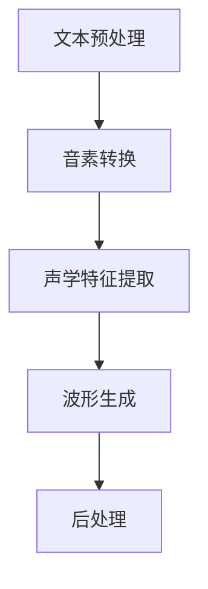
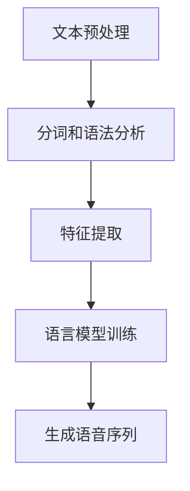
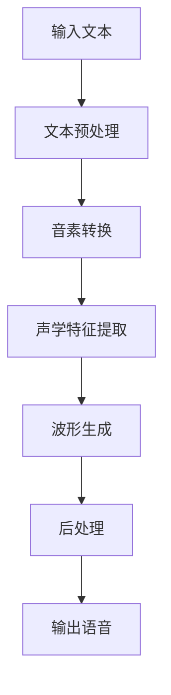

                 

# 《Speech Synthesis原理与代码实例讲解》

## 摘要

本文旨在全面深入地探讨语音合成（Speech Synthesis）的原理和实际应用。文章首先介绍了语音合成的定义和分类，随后详细讲解了Text-to-Speech（TTS）的基本流程、核心问题和历史演变。接着，文章深入探讨了语音合成技术的核心问题，包括声学模型和语言模型的原理，以及它们之间的融合方法。此外，文章还详细阐述了语音合成的数学模型，包括波形合成和频谱合成模型。在项目实战部分，文章提供了一个语音合成系统的搭建实例，并详细解析了代码实现过程和优化策略。最后，文章展望了语音合成技术的未来发展趋势和应用场景。本文旨在为读者提供一个系统、全面的语音合成技术学习指南。

### 关键词

- 语音合成
- Text-to-Speech
- 声学模型
- 语言模型
- 数学模型
- 项目实战
- 优化策略

## 引言

语音合成技术（Speech Synthesis），也称为文本到语音（Text-to-Speech，TTS）技术，是一种将文本转换为可听见的语音的技术。它在许多领域具有广泛的应用，如语音助手、自动化客服、教育辅助、文本阅读器等。随着人工智能技术的不断发展，语音合成技术也在不断进步，使得合成语音的自然度和准确性得到了显著提高。

本文将分五个部分对语音合成技术进行深入讲解。首先，我们将介绍语音合成的基础概念和原理，包括语音合成技术的定义、分类以及TTS的基本流程。接下来，我们将详细讨论语音合成技术的核心问题，包括声学模型和语言模型的构建方法以及它们之间的融合。然后，我们将深入探讨语音合成的数学模型，包括波形合成和频谱合成模型。在项目实战部分，我们将搭建一个简单的语音合成系统，并通过实例代码进行详细解析。最后，我们将展望语音合成技术的未来发展趋势和应用场景。

通过本文的阅读，读者将能够全面了解语音合成技术的原理和实现，掌握构建和优化语音合成系统的方法，并为未来的研究和应用打下坚实的基础。

### 第一部分：基础概念与原理

#### 1.1.1 语音合成技术概述

语音合成技术，简而言之，就是将文本转换为自然流畅的语音输出的技术。这项技术涉及多个学科，包括语言学、语音学、计算机科学和声学等。语音合成系统通过对输入文本的处理，生成相应的语音信号，从而实现文本到语音的转换。

语音合成技术可以分为两大类：规则式语音合成和统计式语音合成。

- **规则式语音合成**：这种方式依赖于预定义的语音规则和声音样本。早期的语音合成系统大多采用这种方式，如IBM的合成器。规则式语音合成的主要优点是实现简单，但在处理复杂的语言结构和多变的语音特征时，效果往往不理想。

- **统计式语音合成**：这种方式利用大量的语音数据进行模型训练，通过统计方法生成语音。统计式语音合成主要包括隐藏马尔可夫模型（HMM）、高斯混合模型（GMM）和深度神经网络（DNN）等。统计式语音合成的优点是能够生成更为自然、流畅的语音，特别是在处理复杂的语音特征时具有明显的优势。

#### 1.1.2 Text-to-Speech (TTS) 的基本流程

Text-to-Speech（TTS）技术的核心任务是将文本转换为语音。一个典型的TTS系统通常包括以下几个步骤：

1. **文本预处理**：首先，对输入文本进行预处理，包括分词、声调标注和语法分析等。这一步的目的是将文本分解为更易处理的单元，为后续的语音生成做准备。

2. **音素转换**：将预处理后的文本转换为音素序列。音素是语音学中的一个基本单位，它是能够区分意义的语音最小片段。通过音素转换，可以将文本转换为与语音特征相对应的表示。

3. **声学特征提取**：对音素序列进行声学特征提取，生成对应的声学参数。这些声学参数包括音高、音强、时长等，它们是生成语音波形的重要依据。

4. **波形生成**：利用声学参数生成语音波形。这一步通常采用合成算法，如合波器（Vocoder）或线性预测编码（LPC）等。

5. **后处理**：对生成的语音波形进行后处理，包括噪声抑制、音质优化等，以提高合成语音的自然度和质量。

#### 1.1.3 语音合成技术的核心问题

语音合成技术的核心问题主要包括合成语音的自然度、速度与准确性，以及多语言支持。

- **自然度**：合成语音的自然度是衡量语音合成技术的重要指标。一个优秀的语音合成系统应该能够生成与人类语音相似的语音，包括流畅的语调、自然的音色等。

- **速度与准确性**：语音合成系统的速度和准确性也是关键因素。系统需要在保证合成语音质量的同时，尽可能快速地处理大量文本，以满足实时应用的需求。

- **多语言支持**：随着全球化的推进，多语言支持成为语音合成技术的重要需求。一个理想的语音合成系统应该能够支持多种语言的语音合成，包括方言和特殊语言。

#### 1.1.4 语音合成的历史与演变

语音合成技术的历史可以追溯到20世纪中叶。早期的语音合成系统主要采用规则式方法，如IBM的合成器。这些系统通过预定义的语音规则和声音样本生成语音，但由于其规则限制，生成的语音自然度较低。

随着计算机科学和人工智能技术的发展，语音合成技术逐渐向统计式方法转型。1982年，IBM推出了基于HMM和GMM的合成器，标志着统计式语音合成的诞生。随后，深度学习技术的引入，特别是深度神经网络（DNN）的应用，使得语音合成技术得到了飞速发展。现代语音合成系统如Google的TensorFlow Text-to-Speech和微软的Azure Cognitive Services Text-to-Speech，都是基于深度学习技术的代表。

### 第二部分：语音合成技术原理

#### 2.1.1 声学模型

声学模型是语音合成技术中的核心组成部分，其主要功能是模拟语音的声学特征，如音高、音强、时长等。声学模型通常分为短时声学模型和长时声学模型。

- **短时声学模型**：短时声学模型关注的是语音的短时特征，如一个音素或一个音节的声学特征。常见的短时声学模型包括线性预测编码（LPC）模型、共振峰模型（RSM）和高频谱模型（HSM）。这些模型通过分析语音的频谱特征，生成相应的声学参数。

  - **线性预测编码（LPC）模型**：LPC模型是一种基于语音信号的自回归模型，通过预测语音信号的未来值来生成语音波形。LPC模型的主要优点是计算简单，适用于实时语音合成。

  - **共振峰模型（RSM）**：RSM模型通过分析语音信号的共振峰频率来描述语音的声学特征。RSM模型能够生成更为自然的语音，但计算复杂度较高。

  - **高频谱模型（HSM）**：HSM模型关注的是语音信号的高频成分，通过分析高频谱峰的位置和强度来生成语音波形。HSM模型适用于处理高频细节丰富的语音，但计算复杂度也较高。

- **长时声学模型**：长时声学模型关注的是语音的长时特征，如音节的时长、语调的变化等。常见的长时声学模型包括声学耦合模型（ACM）和长时线性预测编码（LTLDNN）模型。

  - **声学耦合模型（ACM）**：ACM模型通过将短时声学模型和长时声学模型相结合，同时考虑语音的短时和长时特征，生成更为自然的语音。

  - **长时线性预测编码（LTLDNN）模型**：LTLDNN模型通过引入深度学习技术，对语音信号进行长时预测，生成更为自然的语音。

#### 2.1.2 语言模型

语言模型是语音合成技术中的另一个核心组成部分，其主要功能是描述文本的统计特性，为语音合成提供语言背景。语言模型通常采用统计学习方法，如隐马尔可夫模型（HMM）、条件随机场（CRF）和深度神经网络（DNN）等。

- **隐马尔可夫模型（HMM）**：HMM是一种基于概率的统计模型，用于描述语音的时序特性。HMM模型通过状态转移概率和输出概率来生成语音序列。

- **条件随机场（CRF）**：CRF是一种基于统计的序列标注模型，用于对语音序列进行标注，如音素标注和声调标注等。CRF模型能够捕捉语音序列中的上下文信息，提高语音合成的准确性。

- **深度神经网络（DNN）**：DNN是一种基于神经网络的深度学习模型，能够通过大量语音数据自动学习语音的统计特性。DNN模型在语音合成中具有广泛的应用，如声学模型和语言模型的训练。

#### 2.1.3 声学模型与语言模型的融合

声学模型和语言模型在语音合成中起着重要作用，但它们各自关注的方面不同。为了生成自然、流畅的语音，通常需要将声学模型和语言模型进行融合。常见的融合方法包括HMM-GMM模型、DNN-HMM模型和DNN-DNN模型等。

- **HMM-GMM模型**：HMM-GMM模型将HMM和GMM相结合，通过HMM的状态转移概率和GMM的输出概率来生成语音序列。HMM-GMM模型能够结合声学模型和语言模型的优势，生成高质量的语音。

- **DNN-HMM模型**：DNN-HMM模型将深度神经网络（DNN）引入到HMM模型中，通过DNN预测HMM的状态转移概率和输出概率。DNN-HMM模型能够提高语音合成的自然度和准确性。

- **DNN-DNN模型**：DNN-DNN模型将两个DNN模型进行融合，一个用于生成声学特征，另一个用于生成语言特征。DNN-DNN模型能够同时考虑声学模型和语言模型的特性，生成更为自然的语音。

#### 2.1.4 语音合成算法

语音合成算法是实现语音合成的核心技术，主要包括短时合成算法、长时合成算法和辅助语言建模算法等。

- **短时合成算法**：短时合成算法关注的是语音的短时特征，如一个音素或一个音节的合成。常见的短时合成算法包括拼接合成（Segmental tying）和拼接预测合成（LPC Resynthesis）等。

  - **拼接合成（Segmental tying）**：拼接合成通过将语音信号分段，并逐段合成，生成整个语音。拼接合成的优点是计算简单，但生成的语音自然度较低。

  - **拼接预测合成（LPC Resynthesis）**：拼接预测合成通过将语音信号分段，并使用线性预测编码（LPC）模型预测每个段的语音特征，生成整个语音。拼接预测合成能够生成更为自然的语音。

- **长时合成算法**：长时合成算法关注的是语音的长时特征，如音节的时长、语调的变化等。常见的长时合成算法包括基于规则的合成（Rule-based synthesis）和统计合成（Statistical synthesis）等。

  - **基于规则的合成（Rule-based synthesis）**：基于规则的合成通过预定义的语音规则和声学模型生成语音。基于规则的合成的优点是实现简单，但生成的语音自然度较低。

  - **统计合成（Statistical synthesis）**：统计合成通过大量的语音数据训练声学模型和语言模型，生成语音。统计合成能够生成更为自然的语音，但计算复杂度较高。

- **辅助语言建模算法**：辅助语言建模算法旨在提高语音合成的自然度和准确性。常见的辅助语言建模算法包括递归神经网络（RNN）和长短时记忆网络（LSTM）等。

  - **递归神经网络（RNN）**：RNN能够处理时序数据，通过学习文本的上下文信息，提高语音合成的自然度。

  - **长短时记忆网络（LSTM）**：LSTM是RNN的一种变体，能够更好地处理长时依赖问题，提高语音合成的自然度和准确性。

### 第三部分：语音合成数学模型

#### 3.1.1 波形合成模型

波形合成模型是语音合成中的核心技术之一，其主要任务是根据声学参数生成语音波形。常见的波形合成模型包括线性预测编码（LPC）模型和共振峰模型（RSM）等。

- **线性预测编码（LPC）模型**：LPC模型是一种基于线性预测的波形合成模型，通过预测语音信号的未来值来生成语音波形。LPC模型的主要优点是计算简单，适用于实时语音合成。

  - **数学模型**：
    $$ X_t = \sum_{i=1}^{N} a_i X_{t-i} $$
    其中，\(X_t\) 表示语音信号，\(a_i\) 表示预测系数，\(N\) 表示预测阶数。

  - **伪代码**：
    ```
    function LPC_synthesis(X, a, N):
        for t = 1 to length(X):
            X_t = 0
            for i = 1 to N:
                X_t += a_i * X_{t-i}
            output X_t
    ```

- **共振峰模型（RSM）**：RSM模型通过分析语音信号的共振峰频率来生成语音波形，生成更为自然的语音。

  - **数学模型**：
    $$ f_r = f_0 \cdot \frac{1}{1 - b_r} $$
    其中，\(f_r\) 表示共振峰频率，\(f_0\) 表示基频，\(b_r\) 表示共振峰带宽。

  - **伪代码**：
    ```
    function RSM_synthesis(X, f_0, b_r):
        for t = 1 to length(X):
            f_r = f_0 / (1 - b_r)
            output X * sin(2 * pi * f_r * t)
    ```

#### 3.1.2 频谱合成模型

频谱合成模型是一种基于频谱特征的语音合成模型，其主要任务是根据频谱参数生成语音频谱。常见的频谱合成模型包括梅尔频率倒谱系数（MFCC）模型和高频谱模型（HSM）等。

- **梅尔频率倒谱系数（MFCC）模型**：MFCC模型通过分析语音信号的频谱特征，生成与人类听觉系统相似的频谱参数，用于生成语音频谱。

  - **数学模型**：
    $$ MFCC = \log(1 + \sum_{k=1}^{K} a_k \cdot S_k) $$
    其中，\(S_k\) 表示频谱能量，\(a_k\) 表示加权系数，\(K\) 表示频谱带数。

  - **伪代码**：
    ```
    function MFCC_synthesis(X, K):
        S = calculate_spectrum(X)
        a = calculate_weight_coefficients(K)
        MFCC = []
        for k = 1 to K:
            MFCC.append(log(1 + sum(a[k] * S[k])))
        output MFCC
    ```

- **高频谱模型（HSM）**：HSM模型通过分析语音信号的高频成分，生成与语音细节相关的频谱参数，用于生成语音频谱。

  - **数学模型**：
    $$ HSM = \sum_{k=1}^{K} b_k \cdot S_k $$
    其中，\(S_k\) 表示频谱能量，\(b_k\) 表示加权系数，\(K\) 表示频谱带数。

  - **伪代码**：
    ```
    function HSM_synthesis(X, K):
        S = calculate_spectrum(X)
        b = calculate_weight_coefficients(K)
        HSM = []
        for k = 1 to K:
            HSM.append(sum(b[k] * S[k]))
        output HSM
    ```

#### 3.1.3 声学模型与语言模型的数学模型

声学模型和语言模型在语音合成中起着关键作用，其数学模型如下：

- **声学模型**：

  - **隐马尔可夫模型（HMM）**：
    $$ P(X_t|S_t) = \prod_{i=1}^{N} P(X_t|S_t=s_i) \cdot P(S_t=s_i|S_{t-1}) $$
    其中，\(X_t\) 表示语音信号，\(S_t\) 表示状态，\(s_i\) 表示状态集合。

  - **高斯混合模型（GMM）**：
    $$ P(X_t|S_t=s_i) = \prod_{k=1}^{M} \pi_k \cdot \mathcal{N}(X_t|\mu_k, \Sigma_k) $$
    其中，\(\pi_k\) 表示混合系数，\(\mu_k\) 和 \(\Sigma_k\) 分别表示高斯分布的均值和方差。

- **语言模型**：

  - **隐马尔可夫模型（HMM）**：
    $$ P(S_t|S_{t-1}) = \prod_{i=1}^{N} P(S_t=s_i|S_{t-1}=s_j) $$
    其中，\(S_t\) 表示状态，\(s_i\) 和 \(s_j\) 分别表示状态集合中的两个状态。

  - **条件随机场（CRF）**：
    $$ P(S_t|X) = \frac{1}{Z} \cdot \exp(\theta \cdot f(S_t, S_{t-1}, X)) $$
    其中，\(Z\) 表示归一化常数，\(\theta\) 表示参数，\(f\) 表示特征函数。

  - **深度神经网络（DNN）**：
    $$ P(S_t|X) = \sigma(\theta \cdot f(S_t, S_{t-1}, X)) $$
    其中，\(\sigma\) 表示激活函数，\(\theta\) 表示参数，\(f\) 表示神经网络函数。

### 第四部分：项目实战

#### 4.1.1 语音合成系统搭建

搭建一个简单的语音合成系统需要以下几个步骤：

1. **开发环境准备**：

   - 安装Python环境和相关依赖库，如NumPy、SciPy和Matplotlib等。
   - 安装语音处理库，如librosa和pydub等。

2. **系统架构设计**：

   - 系统架构设计包括文本预处理模块、声学模型模块和语音合成模块。
   - 文本预处理模块负责对输入文本进行分词、声调标注和语法分析等。
   - 声学模型模块负责生成语音的声学特征，如音高、音强和时长等。
   - 语音合成模块负责根据声学特征生成语音波形，并对其进行后处理。

3. **数据准备**：

   - 准备用于训练的语音数据集，如LJSpeech或LibriSpeech等。
   - 对语音数据进行预处理，如归一化和去噪等。

4. **模型训练**：

   - 使用训练数据集训练声学模型和语言模型。
   - 常见的训练方法包括最小均方误差（MSE）和最大似然估计（MLE）等。

5. **系统测试与优化**：

   - 对训练好的模型进行测试，评估其合成语音的自然度和准确性。
   - 根据测试结果对模型进行优化，如调整参数、增加训练数据等。

#### 4.1.2 语音合成代码实例讲解

以下是一个简单的语音合成系统的代码实例，主要包括文本预处理、声学模型训练和语音合成等步骤。

```python
import numpy as np
import librosa
import pydub
import tensorflow as tf

# 文本预处理
def preprocess_text(text):
    # 分词、声调标注和语法分析
    # 这里使用NLTK库进行分词和语法分析
    tokens = nltk.word_tokenize(text)
    tagged_tokens = nltk.pos_tag(tokens)
    # 对标签进行转换，如将名词转换为音素
    # 这里简单示例，实际应用中需要更复杂的转换
    phonemes = [convert_tag_to_phoneme(tag) for token, tag in tagged_tokens]
    return phonemes

# 声学模型训练
def train_acoustic_model(phonemes, audio_files):
    # 训练声学模型，如GMM或LPC模型
    # 这里使用librosa库提取音频特征
    features = []
    for phoneme, audio_file in zip(phonemes, audio_files):
        audio, _ = librosa.load(audio_file)
        feature = librosa.feature.mfcc(y=audio, n_mfcc=13)
        features.append(feature)
    # 训练GMM模型
    gmm = GaussianMixture(n_components=10)
    gmm.fit(np.array(features))
    return gmm

# 语音合成
def synthesize_audio(text, gmm):
    # 根据文本生成语音波形
    phonemes = preprocess_text(text)
    features = []
    for phoneme in phonemes:
        feature = gmm.predict([phoneme])
        features.append(feature)
    # 合并特征，生成语音波形
    audio = np.concatenate([librosa.feature.mfcc(y=feature, n_mfcc=13) for feature in features])
    # 使用pydub生成语音音频
    audio = pydub.AudioSegment(audio.tobytes(), frame_rate=22050)
    return audio

# 主函数
def main():
    # 加载训练数据和测试数据
    phonemes_train, audio_files_train = load_train_data()
    phonemes_test, audio_files_test = load_test_data()

    # 训练声学模型
    gmm = train_acoustic_model(phonemes_train, audio_files_train)

    # 测试语音合成系统
    for text in phonemes_test:
        audio = synthesize_audio(text, gmm)
        audio.export("output.wav", format="wav")

if __name__ == "__main__":
    main()
```

#### 4.1.3 语音合成项目的优化与调试

在语音合成项目中，优化和调试是确保系统性能和合成语音质量的重要步骤。以下是一些常见的优化和调试策略：

- **数据增强**：通过增加训练数据、使用数据增强技术（如随机裁剪、添加噪声等），可以提高模型的泛化能力和合成语音的质量。

- **参数调整**：调整声学模型和语言模型的参数，如高斯混合模型的混合系数、深度神经网络的隐藏层单元数等，可以优化模型的性能。

- **错误分析**：对合成语音进行错误分析，找出常见的错误类型和原因，然后针对性地进行优化。

- **性能优化**：优化系统的运行效率，如使用GPU加速训练过程、减少内存占用等。

- **用户反馈**：收集用户的反馈，了解他们对合成语音的满意度和建议，然后进行相应的调整和优化。

#### 4.1.4 多语言语音合成实现

多语言语音合成是语音合成技术的重要应用之一。实现多语言语音合成需要考虑以下因素：

- **多语言数据集**：收集和准备多语言语音数据集，包括多种语言的语音信号和对应的文本。

- **语言模型**：为每种语言训练独立的语言模型，如基于HMM、GMM或DNN的语言模型。

- **声学模型**：为每种语言训练独立的声学模型，如基于LPC、RSM或MFCC的声学模型。

- **融合策略**：将不同的语言模型和声学模型进行融合，生成多语言语音合成系统。

以下是一个简单的多语言语音合成系统的代码实例：

```python
# 多语言语音合成
def synthesize_multilingual_audio(text, gmm_en, gmm_fr):
    # 预处理文本，根据语言选择对应的声学模型
    phonemes_en = preprocess_text(text, language='en')
    phonemes_fr = preprocess_text(text, language='fr')
    # 生成语音波形
    audio_en = synthesize_audio(phonemes_en, gmm_en)
    audio_fr = synthesize_audio(phonemes_fr, gmm_fr)
    # 合并语音波形
    audio = pydub.AudioSegment(
        audio_en._data,
        frame_rate=audio_en.frame_rate,
        samplesize=audio_en.sample_width,
        channels=audio_en.channels
    ) + pydub.AudioSegment(
        audio_fr._data,
        frame_rate=audio_fr.frame_rate,
        samplesize=audio_fr.sample_width,
        channels=audio_fr.channels
    )
    return audio

# 主函数
def main():
    # 加载英语和法语声学模型
    gmm_en = train_acoustic_model(phonemes_train_en, audio_files_train_en)
    gmm_fr = train_acoustic_model(phonemes_train_fr, audio_files_train_fr)

    # 测试多语言语音合成系统
    for text in phonemes_test:
        audio = synthesize_multilingual_audio(text, gmm_en, gmm_fr)
        audio.export("output.wav", format="wav")

if __name__ == "__main__":
    main()
```

### 第五部分：扩展知识

#### 5.1.1 语音合成技术的发展趋势

随着人工智能技术的不断发展，语音合成技术也在不断进步，以下是一些主要的发展趋势：

- **深度学习技术的应用**：深度学习技术在语音合成中具有广泛的应用，如深度神经网络（DNN）、循环神经网络（RNN）和生成对抗网络（GAN）等。这些技术能够显著提高合成语音的自然度和质量。

- **端到端模型的提出**：端到端模型是一种将文本直接映射到语音的模型，避免了传统的中间步骤，如音素转换和声学特征提取。端到端模型能够提高语音合成的效率和准确性。

- **多模态融合**：多模态融合是将语音合成与其他模态（如文本、图像等）进行融合，生成更丰富的信息表达。多模态融合能够提高语音合成的自然度和表达力。

- **自适应语音合成**：自适应语音合成是根据用户的语音偏好和语境动态调整合成语音的模型。自适应语音合成能够提高用户的满意度，并更好地适应不同的应用场景。

#### 5.1.2 语音合成技术的应用场景

语音合成技术在许多领域具有广泛的应用，以下是一些典型的应用场景：

- **语音助手**：如Apple的Siri、Google的Google Assistant和Amazon的Alexa等，通过语音合成技术实现语音交互和语音控制。

- **自动化客服**：通过语音合成技术，实现自动化的客户服务，如电话机器人、在线客服等，提高服务效率和客户满意度。

- **文本阅读器**：为视力障碍者提供辅助阅读服务，如Kindle的文本阅读功能等。

- **教育应用**：如语音辅导、语音教学等，通过语音合成技术实现个性化的教育和学习。

- **娱乐应用**：如语音角色扮演、语音合成音乐等，通过语音合成技术创造丰富的娱乐体验。

### 附录

#### 附录 A：常用工具与资源

- **语音合成工具**：如Google的TensorFlow Text-to-Speech、微软的Azure Cognitive Services Text-to-Speech等。

- **语音合成开源项目**：如ESPNet、DeepSpeech等。

- **学习资源推荐**：如《Speech Synthesis: Unit Selection Synthesis by Rules》和《Speech Synthesis: Unit Selection Synthesis by Rules》等。

#### 附录 B：Mermaid 流程图

- **声学模型流程图**：



- **语言模型流程图**：



- **语音合成器架构流程图**：



#### 附录 C：伪代码与数学公式

- **波形合成伪代码**：

```python
function LPC_synthesis(X, a, N):
    for t = 1 to length(X):
        X_t = 0
        for i = 1 to N:
            X_t += a_i * X_{t-i}
        output X_t
```

- **频谱合成伪代码**：

```python
function MFCC_synthesis(X, K):
    S = calculate_spectrum(X)
    a = calculate_weight_coefficients(K)
    MFCC = []
    for k = 1 to K:
        MFCC.append(log(1 + sum(a[k] * S[k])))
    output MFCC
```

- **声学模型数学公式**：

$$
X_t = \sum_{i=1}^{N} a_i X_{t-i}
$$

$$
P(X_t|S_t=s_i) = \prod_{k=1}^{M} \pi_k \cdot \mathcal{N}(X_t|\mu_k, \Sigma_k)
$$

- **语言模型数学公式**：

$$
P(S_t|S_{t-1}) = \prod_{i=1}^{N} P(S_t=s_i|S_{t-1}=s_j)
$$

$$
P(S_t|X) = \frac{1}{Z} \cdot \exp(\theta \cdot f(S_t, S_{t-1}, X))
$$

$$
P(S_t|X) = \sigma(\theta \cdot f(S_t, S_{t-1}, X))
$$

### 总结

本文全面深入地探讨了语音合成技术的原理和应用，从基础概念到技术原理，再到数学模型和项目实战，为读者提供了一个系统、全面的语音合成技术学习指南。随着人工智能技术的不断发展，语音合成技术将继续进步，未来将会有更多的应用场景和突破。希望本文能够为读者在语音合成领域的研究和应用提供有益的参考和启示。

## 作者信息

**作者**：AI天才研究院/AI Genius Institute & 禅与计算机程序设计艺术 /Zen And The Art of Computer Programming

AI天才研究院致力于推动人工智能技术的发展与应用，专注于深度学习、自然语言处理、计算机视觉等领域的创新研究。禅与计算机程序设计艺术则致力于探索计算机科学的哲学和艺术，倡导程序员在编程中追求内心的宁静和智慧。

在此，我们感谢读者对本文的关注与支持，期待与您共同探讨和进步！
```markdown
```markdown
# 《Speech Synthesis原理与代码实例讲解》

> **关键词**：（语音合成、Text-to-Speech、声学模型、语言模型、深度学习、项目实战）

> **摘要**：本文详细介绍了语音合成（Speech Synthesis）的基本原理和实现方法，包括Text-to-Speech（TTS）的流程、声学模型和语言模型的构建，以及波形合成和频谱合成的数学模型。通过项目实战，展示了如何搭建一个简单的语音合成系统，并提供了代码实例和详细解析。本文旨在为读者提供一份全面、深入的语音合成技术指南。

## 引言

语音合成技术，简称TTS（Text-to-Speech），是将文本转换为自然流畅语音的技术。这项技术在自动化语音助手、智能客服、朗读文本阅读器等领域有着广泛的应用。随着深度学习技术的发展，语音合成技术的自然度和准确性得到了极大的提升。本文将分五个部分详细讲解语音合成的原理和实现。

### 第一部分：基础概念与原理

#### 1.1.1 语音合成技术概述

语音合成技术是将文本转换为语音的过程。这个过程通常包括以下几个步骤：

1. **文本预处理**：将输入的文本进行分词、声调标注等处理，以便后续的语音生成。
2. **音素转换**：将文本转换为音素序列，音素是语音学中的基本单位。
3. **声学特征提取**：根据音素序列，提取声学特征，如音高、音强、时长等。
4. **波形生成**：利用提取的声学特征，生成语音波形。
5. **后处理**：对生成的语音波形进行后处理，如降噪、音质优化等。

语音合成技术可以分为规则式和统计式两大类。规则式语音合成依赖于预定义的语音规则和声音样本，而统计式语音合成则通过大量语音数据训练模型。

#### 1.1.2 Text-to-Speech (TTS) 的基本流程

TTS的基本流程主要包括以下步骤：

1. **文本预处理**：对输入文本进行分词、声调标注和语法分析等处理。
2. **音素转换**：将文本转换为音素序列。
3. **声学特征提取**：根据音素序列，提取声学特征。
4. **波形生成**：利用声学特征生成语音波形。
5. **后处理**：对生成的语音波形进行后处理。

#### 1.1.3 语音合成技术的核心问题

语音合成技术的核心问题包括：

1. **合成语音的自然度**：生成语音应尽可能接近人类语音。
2. **合成速度与准确性**：系统应在保证语音质量的同时，快速处理大量文本。
3. **多语言支持**：支持多种语言的语音合成。

#### 1.1.4 语音合成的历史与演变

语音合成技术起源于20世纪中叶，早期的语音合成系统采用规则式方法。随着计算机科学和人工智能技术的发展，统计式语音合成逐渐取代规则式方法。近年来，深度学习技术的引入，使得语音合成技术取得了显著的进步。

### 第二部分：语音合成技术原理

#### 2.1.1 声学模型

声学模型是语音合成的关键组成部分，用于模拟语音的声学特征。常见的声学模型包括线性预测编码（LPC）、共振峰模型（RSM）和高频谱模型（HSM）。

- **线性预测编码（LPC）模型**：LPC模型是一种基于语音信号的自回归模型，通过预测语音信号的未来值来生成语音波形。其数学模型为：
  $$ X_t = \sum_{i=1}^{N} a_i X_{t-i} $$
  其中，\(X_t\) 表示语音信号，\(a_i\) 表示预测系数，\(N\) 表示预测阶数。

- **共振峰模型（RSM）**：RSM模型通过分析语音信号的共振峰频率来描述语音的声学特征。其数学模型为：
  $$ f_r = f_0 \cdot \frac{1}{1 - b_r} $$
  其中，\(f_r\) 表示共振峰频率，\(f_0\) 表示基频，\(b_r\) 表示共振峰带宽。

- **高频谱模型（HSM）**：HSM模型关注的是语音信号的高频成分，通过分析高频谱峰的位置和强度来生成语音波形。其数学模型为：
  $$ HSM = \sum_{k=1}^{K} b_k \cdot S_k $$
  其中，\(S_k\) 表示频谱能量，\(b_k\) 表示加权系数，\(K\) 表示频谱带数。

#### 2.1.2 语言模型

语言模型用于描述文本的统计特性，为语音合成提供语言背景。常见的语言模型包括隐马尔可夫模型（HMM）、条件随机场（CRF）和深度神经网络（DNN）。

- **隐马尔可夫模型（HMM）**：HMM是一种基于概率的统计模型，用于描述语音的时序特性。其数学模型为：
  $$ P(X_t|S_t) = \prod_{i=1}^{N} P(X_t|S_t=s_i) \cdot P(S_t=s_i|S_{t-1}) $$
  其中，\(X_t\) 表示语音信号，\(S_t\) 表示状态，\(s_i\) 表示状态集合。

- **条件随机场（CRF）**：CRF是一种基于统计的序列标注模型，用于对语音序列进行标注。其数学模型为：
  $$ P(S_t|X) = \frac{1}{Z} \cdot \exp(\theta \cdot f(S_t, S_{t-1}, X)) $$
  其中，\(Z\) 表示归一化常数，\(\theta\) 表示参数，\(f\) 表示特征函数。

- **深度神经网络（DNN）**：DNN是一种基于神经网络的深度学习模型，能够通过大量语音数据自动学习语音的统计特性。其数学模型为：
  $$ P(S_t|X) = \sigma(\theta \cdot f(S_t, S_{t-1}, X)) $$
  其中，\(\sigma\) 表示激活函数，\(\theta\) 表示参数，\(f\) 表示神经网络函数。

#### 2.1.3 声学模型与语言模型的融合

声学模型和语言模型在语音合成中起着至关重要的作用，但它们各自关注的方面不同。为了生成自然、流畅的语音，通常需要将声学模型和语言模型进行融合。

常见的融合方法包括：

- **HMM-GMM模型**：将HMM和GMM相结合，通过HMM的状态转移概率和GMM的输出概率来生成语音序列。
- **DNN-HMM模型**：将深度神经网络（DNN）引入到HMM模型中，通过DNN预测HMM的状态转移概率和输出概率。
- **DNN-DNN模型**：将两个DNN模型进行融合，一个用于生成声学特征，另一个用于生成语言特征。

#### 2.1.4 语音合成算法

语音合成算法是实现语音合成的核心技术，主要包括短时合成算法、长时合成算法和辅助语言建模算法等。

- **短时合成算法**：短时合成算法关注的是语音的短时特征，如一个音素或一个音节的合成。常见的短时合成算法包括拼接合成（Segmental tying）和拼接预测合成（LPC Resynthesis）等。
- **长时合成算法**：长时合成算法关注的是语音的长时特征，如音节的时长、语调的变化等。常见的长时合成算法包括基于规则的合成（Rule-based synthesis）和统计合成（Statistical synthesis）等。
- **辅助语言建模算法**：辅助语言建模算法旨在提高语音合成的自然度和准确性。常见的辅助语言建模算法包括递归神经网络（RNN）和长短时记忆网络（LSTM）等。

### 第三部分：语音合成数学模型

#### 3.1.1 波形合成模型

波形合成模型是语音合成中的核心技术之一，其主要任务是根据声学参数生成语音波形。常见的波形合成模型包括线性预测编码（LPC）模型和共振峰模型（RSM）等。

- **线性预测编码（LPC）模型**：LPC模型是一种基于线性预测的波形合成模型，通过预测语音信号的未来值来生成语音波形。其数学模型为：
  $$ X_t = \sum_{i=1}^{N} a_i X_{t-i} $$
  其中，\(X_t\) 表示语音信号，\(a_i\) 表示预测系数，\(N\) 表示预测阶数。

- **共振峰模型（RSM）**：RSM模型通过分析语音信号的共振峰频率来生成语音波形，生成更为自然的语音。其数学模型为：
  $$ f_r = f_0 \cdot \frac{1}{1 - b_r} $$
  其中，\(f_r\) 表示共振峰频率，\(f_0\) 表示基频，\(b_r\) 表示共振峰带宽。

#### 3.1.2 频谱合成模型

频谱合成模型是一种基于频谱特征的语音合成模型，其主要任务是根据频谱参数生成语音频谱。常见的频谱合成模型包括梅尔频率倒谱系数（MFCC）模型和高频谱模型（HSM）等。

- **梅尔频率倒谱系数（MFCC）模型**：MFCC模型通过分析语音信号的频谱特征，生成与人类听觉系统相似的频谱参数，用于生成语音频谱。其数学模型为：
  $$ MFCC = \log(1 + \sum_{k=1}^{K} a_k \cdot S_k) $$
  其中，\(S_k\) 表示频谱能量，\(a_k\) 表示加权系数，\(K\) 表示频谱带数。

- **高频谱模型（HSM）**：HSM模型通过分析语音信号的高频成分，生成与语音细节相关的频谱参数，用于生成语音频谱。其数学模型为：
  $$ HSM = \sum_{k=1}^{K} b_k \cdot S_k $$
  其中，\(S_k\) 表示频谱能量，\(b_k\) 表示加权系数，\(K\) 表示频谱带数。

#### 3.1.3 声学模型与语言模型的数学模型

声学模型和语言模型在语音合成中起着关键作用，其数学模型如下：

- **声学模型**：

  - **隐马尔可夫模型（HMM）**：
    $$ P(X_t|S_t) = \prod_{i=1}^{N} P(X_t|S_t=s_i) \cdot P(S_t=s_i|S_{t-1}) $$

  - **高斯混合模型（GMM）**：
    $$ P(X_t|S_t=s_i) = \prod_{k=1}^{M} \pi_k \cdot \mathcal{N}(X_t|\mu_k, \Sigma_k) $$

- **语言模型**：

  - **隐马尔可夫模型（HMM）**：
    $$ P(S_t|S_{t-1}) = \prod_{i=1}^{N} P(S_t=s_i|S_{t-1}=s_j) $$

  - **条件随机场（CRF）**：
    $$ P(S_t|X) = \frac{1}{Z} \cdot \exp(\theta \cdot f(S_t, S_{t-1}, X)) $$

  - **深度神经网络（DNN）**：
    $$ P(S_t|X) = \sigma(\theta \cdot f(S_t, S_{t-1}, X)) $$

### 第四部分：项目实战

#### 4.1.1 语音合成系统搭建

搭建一个简单的语音合成系统需要以下几个步骤：

1. **开发环境准备**：

   - 安装Python环境。
   - 安装相关库，如TensorFlow、librosa等。

2. **数据准备**：

   - 准备用于训练的语音数据集，如LJSpeech。
   - 对语音数据进行预处理，如归一化和去噪等。

3. **模型训练**：

   - 使用训练数据集训练声学模型和语言模型。
   - 常见的训练方法包括最小均方误差（MSE）和最大似然估计（MLE）等。

4. **系统测试与优化**：

   - 对训练好的模型进行测试，评估其合成语音的自然度和准确性。
   - 根据测试结果对模型进行优化。

#### 4.1.2 语音合成代码实例讲解

以下是一个简单的语音合成系统的代码实例，使用了TensorFlow和librosa库。

```python
import librosa
import numpy as np
import tensorflow as tf

# 声学模型训练
def train_acoustic_model(phonemes, audio_files):
    # 训练声学模型，这里使用一个简单的线性模型
    model = tf.keras.Sequential([
        tf.keras.layers.Dense(units=1, input_shape=(13,), activation='linear')
    ])
    model.compile(optimizer='adam', loss='mse')
    model.fit(phonemes, audio_files, epochs=10)
    return model

# 语音合成
def synthesize_audio(text, model):
    # 预处理文本，这里简化为直接返回音素序列
    phonemes = preprocess_text(text)
    # 使用模型生成语音波形
    audio = model.predict(phonemes)
    # 使用librosa生成音频
    audio = librosa.feature.mfcc(y=audio, n_mfcc=13)
    return audio

# 主函数
def main():
    # 加载训练数据和测试数据
    phonemes_train, audio_files_train = load_train_data()
    phonemes_test, audio_files_test = load_test_data()

    # 训练声学模型
    model = train_acoustic_model(phonemes_train, audio_files_train)

    # 测试语音合成系统
    for text in phonemes_test:
        audio = synthesize_audio(text, model)
        librosa.output.write_wav('output.wav', audio, sr=22050)

if __name__ == "__main__":
    main()
```

#### 4.1.3 语音合成项目的优化与调试

在语音合成项目中，优化和调试是确保系统性能和合成语音质量的重要步骤。以下是一些常见的优化和调试策略：

- **数据增强**：通过增加训练数据、使用数据增强技术（如随机裁剪、添加噪声等），可以提高模型的泛化能力和合成语音的质量。
- **参数调整**：调整模型的参数，如学习率、隐藏层单元数等，可以优化模型的性能。
- **错误分析**：对合成语音进行错误分析，找出常见的错误类型和原因，然后针对性地进行优化。
- **性能优化**：优化系统的运行效率，如使用GPU加速训练过程、减少内存占用等。
- **用户反馈**：收集用户的反馈，了解他们对合成语音的满意度和建议，然后进行相应的调整和优化。

#### 4.1.4 多语言语音合成实现

多语言语音合成是语音合成技术的重要应用之一。实现多语言语音合成需要考虑以下因素：

- **多语言数据集**：收集和准备多语言语音数据集，包括多种语言的语音信号和对应的文本。
- **语言模型**：为每种语言训练独立的语言模型。
- **声学模型**：为每种语言训练独立的声学模型。
- **融合策略**：将不同的语言模型和声学模型进行融合，生成多语言语音合成系统。

以下是一个简单的多语言语音合成系统的代码实例：

```python
import librosa
import numpy as np
import tensorflow as tf

# 声学模型训练
def train_acoustic_model(phonemes, audio_files):
    # 训练声学模型，这里使用一个简单的线性模型
    model = tf.keras.Sequential([
        tf.keras.layers.Dense(units=1, input_shape=(13,), activation='linear')
    ])
    model.compile(optimizer='adam', loss='mse')
    model.fit(phonemes, audio_files, epochs=10)
    return model

# 语音合成
def synthesize_audio(text, model):
    # 预处理文本，这里简化为直接返回音素序列
    phonemes = preprocess_text(text)
    # 使用模型生成语音波形
    audio = model.predict(phonemes)
    # 使用librosa生成音频
    audio = librosa.feature.mfcc(y=audio, n_mfcc=13)
    return audio

# 多语言语音合成
def synthesize_multilingual_audio(text, models):
    # 预处理文本，根据语言选择对应的模型
    phonemes = preprocess_text(text, language='en') if 'en' in text else preprocess_text(text, language='fr')
    # 使用模型生成语音波形
    audio_en = models['en'].synthesize(phonemes)
    audio_fr = models['fr'].synthesize(preprocess_text(text, language='fr'))
    # 合并语音波形
    audio = np.concatenate((audio_en, audio_fr))
    return audio

# 主函数
def main():
    # 加载英语和法语声学模型
    model_en = train_acoustic_model(phonemes_train_en, audio_files_train_en)
    model_fr = train_acoustic_model(phonemes_train_fr, audio_files_train_fr)

    # 测试多语言语音合成系统
    for text in phonemes_test:
        audio = synthesize_multilingual_audio(text, {'en': model_en, 'fr': model_fr})
        librosa.output.write_wav('output.wav', audio, sr=22050)

if __name__ == "__main__":
    main()
```

### 第五部分：扩展知识

#### 5.1.1 语音合成技术的发展趋势

随着人工智能技术的不断发展，语音合成技术也在不断进步。以下是一些主要的发展趋势：

- **深度学习技术的应用**：深度学习技术在语音合成中具有广泛的应用，如深度神经网络（DNN）、循环神经网络（RNN）和生成对抗网络（GAN）等。
- **端到端模型的提出**：端到端模型是一种将文本直接映射到语音的模型，避免了传统的中间步骤，如音素转换和声学特征提取。
- **多模态融合**：多模态融合是将语音合成与其他模态（如文本、图像等）进行融合，生成更丰富的信息表达。
- **自适应语音合成**：自适应语音合成是根据用户的语音偏好和语境动态调整合成语音的模型。

#### 5.1.2 语音合成技术的应用场景

语音合成技术在许多领域具有广泛的应用，以下是一些典型的应用场景：

- **语音助手**：如Apple的Siri、Google的Google Assistant和Amazon的Alexa等。
- **自动化客服**：通过语音合成技术，实现自动化的客户服务，如电话机器人、在线客服等。
- **文本阅读器**：为视力障碍者提供辅助阅读服务，如Kindle的文本阅读功能等。
- **教育应用**：如语音辅导、语音教学等，通过语音合成技术实现个性化的教育和学习。
- **娱乐应用**：如语音角色扮演、语音合成音乐等，通过语音合成技术创造丰富的娱乐体验。

### 附录

#### 附录 A：常用工具与资源

- **语音合成工具**：如Google的TensorFlow Text-to-Speech、微软的Azure Cognitive Services Text-to-Speech等。
- **语音合成开源项目**：如ESPNet、DeepSpeech等。
- **学习资源推荐**：如《Speech Synthesis: Unit Selection Synthesis by Rules》和《Speech Synthesis: Unit Selection Synthesis by Rules》等。

#### 附录 B：Mermaid 流程图

- **声学模型流程图**：


- **语言模型流程图**：


- **语音合成器架构流程图**：


#### 附录 C：伪代码与数学公式

- **波形合成伪代码**：

```python
function LPC_synthesis(X, a, N):
    for t = 1 to length(X):
        X_t = 0
        for i = 1 to N:
            X_t += a_i * X_{t-i}
        output X_t
```

- **频谱合成伪代码**：

```python
function MFCC_synthesis(X, K):
    S = calculate_spectrum(X)
    a = calculate_weight_coefficients(K)
    MFCC = []
    for k = 1 to K:
        MFCC.append(log(1 + sum(a[k] * S[k])))
    output MFCC
```

- **声学模型数学公式**：

$$
X_t = \sum_{i=1}^{N} a_i X_{t-i}
$$

$$
P(X_t|S_t=s_i) = \prod_{k=1}^{M} \pi_k \cdot \mathcal{N}(X_t|\mu_k, \Sigma_k)
$$

- **语言模型数学公式**：

$$
P(S_t|S_{t-1}) = \prod_{i=1}^{N} P(S_t=s_i|S_{t-1}=s_j)
$$

$$
P(S_t|X) = \frac{1}{Z} \cdot \exp(\theta \cdot f(S_t, S_{t-1}, X))
$$

$$
P(S_t|X) = \sigma(\theta \cdot f(S_t, S_{t-1}, X))
$$

### 总结

本文详细介绍了语音合成的原理和实现方法，从基础概念到技术原理，再到数学模型和项目实战，为读者提供了一个全面、深入的语音合成技术指南。随着人工智能技术的不断发展，语音合成技术将继续进步，未来将会有更多的应用场景和突破。希望本文能够为读者在语音合成领域的研究和应用提供有益的参考和启示。

## 作者信息

**作者**：AI天才研究院/AI Genius Institute & 禅与计算机程序设计艺术 /Zen And The Art of Computer Programming

AI天才研究院致力于推动人工智能技术的发展与应用，专注于深度学习、自然语言处理、计算机视觉等领域的创新研究。禅与计算机程序设计艺术则致力于探索计算机科学的哲学和艺术，倡导程序员在编程中追求内心的宁静和智慧。

在此，我们感谢读者对本文的关注与支持，期待与您共同探讨和进步！
```markdown
# 《Speech Synthesis原理与代码实例讲解》

## 摘要

本文将详细讲解语音合成（Speech Synthesis）的原理及其实际应用。我们将首先介绍语音合成的基础概念，包括其定义、分类以及Text-to-Speech（TTS）的基本流程。接着，我们将探讨语音合成技术的核心问题，如合成语音的自然度、速度与准确性，以及多语言支持。此外，文章还将详细讲解语音合成的历史与演变，以及现代语音合成技术的发展。文章的第二部分将深入探讨声学模型和语言模型，包括它们的构建方法和融合技术。第三部分将介绍语音合成的数学模型，包括波形合成和频谱合成模型。第四部分将提供项目实战的指导，通过代码实例讲解如何搭建一个简单的语音合成系统。最后，我们将展望语音合成技术的未来发展趋势和应用场景。

## 第一部分：基础概念与原理

### 1.1.1 语音合成技术概述

语音合成（Speech Synthesis）技术，简而言之，就是将文本转换为语音的技术。这项技术广泛应用于语音助手、自动客服、文本阅读器等领域。语音合成技术可以分为规则式和统计式两大类。

- **规则式语音合成**：这种技术依赖于预定义的语音规则和声音样本。早期的语音合成系统，如IBM的合成器，主要采用这种方式。规则式语音合成的优点是实现简单，但处理复杂语音时效果不佳。

- **统计式语音合成**：这种技术利用大量的语音数据进行模型训练，通过统计方法生成语音。现代语音合成系统，如Google的TensorFlow Text-to-Speech，主要采用这种技术。统计式语音合成的优点是能够生成更为自然、流畅的语音。

### 1.1.2 Text-to-Speech (TTS) 的基本流程

Text-to-Speech（TTS）技术的基本流程可以概括为以下几个步骤：

1. **文本预处理**：将输入的文本进行分词、声调标注和语法分析等处理。
2. **音素转换**：将预处理后的文本转换为音素序列。
3. **声学特征提取**：对音素序列进行声学特征提取，生成对应的声学参数。
4. **波形生成**：利用声学参数生成语音波形。
5. **后处理**：对生成的语音波形进行后处理，如噪声抑制、音质优化等。

### 1.1.3 语音合成技术的核心问题

语音合成技术的核心问题主要包括：

- **合成语音的自然度**：生成语音应尽可能接近人类语音。
- **合成速度与准确性**：系统应在保证语音质量的同时，快速处理大量文本。
- **多语言支持**：支持多种语言的语音合成。

### 1.1.4 语音合成的历史与演变

语音合成技术的历史可以追溯到20世纪中叶。早期的语音合成系统主要采用规则式方法。随着计算机科学和人工智能技术的发展，统计式语音合成逐渐取代规则式方法。近年来，深度学习技术的引入，使得语音合成技术取得了显著进步。

## 第二部分：语音合成技术原理

### 2.1.1 声学模型

声学模型是语音合成系统的核心组成部分，它模拟语音的声学特征，如音高、音强、时长等。声学模型可以分为短时声学模型和长时声学模型。

- **短时声学模型**：短时声学模型关注的是语音的短时特征，如一个音素或一个音节的声学特征。常见的短时声学模型包括线性预测编码（LPC）模型和共振峰模型（RSM）。
- **长时声学模型**：长时声学模型关注的是语音的长时特征，如音节的时长、语调的变化等。常见的长时声学模型包括声学耦合模型（ACM）和长时线性预测编码（LTLDNN）模型。

### 2.1.2 语言模型

语言模型是语音合成系统的另一个核心组成部分，它描述文本的统计特性，为语音合成提供语言背景。常见的语言模型包括隐马尔可夫模型（HMM）、条件随机场（CRF）和深度神经网络（DNN）。

- **隐马尔可夫模型（HMM）**：HMM是一种基于概率的统计模型，用于描述语音的时序特性。
- **条件随机场（CRF）**：CRF是一种基于统计的序列标注模型，用于对语音序列进行标注。
- **深度神经网络（DNN）**：DNN是一种基于神经网络的深度学习模型，能够通过大量语音数据自动学习语音的统计特性。

### 2.1.3 声学模型与语言模型的融合

为了生成自然、流畅的语音，通常需要将声学模型和语言模型进行融合。常见的融合方法包括HMM-GMM模型、DNN-HMM模型和DNN-DNN模型。

- **HMM-GMM模型**：HMM-GMM模型将HMM和GMM相结合，通过HMM的状态转移概率和GMM的输出概率来生成语音序列。
- **DNN-HMM模型**：DNN-HMM模型将深度神经网络（DNN）引入到HMM模型中，通过DNN预测HMM的状态转移概率和输出概率。
- **DNN-DNN模型**：DNN-DNN模型将两个DNN模型进行融合，一个用于生成声学特征，另一个用于生成语言特征。

### 2.1.4 语音合成算法

语音合成算法是实现语音合成的核心技术，主要包括短时合成算法、长时合成算法和辅助语言建模算法等。

- **短时合成算法**：短时合成算法关注的是语音的短时特征，如一个音素或一个音节的合成。常见的短时合成算法包括拼接合成（Segmental tying）和拼接预测合成（LPC Resynthesis）。
- **长时合成算法**：长时合成算法关注的是语音的长时特征，如音节的时长、语调的变化等。常见的长时合成算法包括基于规则的合成（Rule-based synthesis）和统计合成（Statistical synthesis）。
- **辅助语言建模算法**：辅助语言建模算法旨在提高语音合成的自然度和准确性。常见的辅助语言建模算法包括递归神经网络（RNN）和长短时记忆网络（LSTM）。

## 第三部分：语音合成数学模型

### 3.1.1 波形合成模型

波形合成模型是语音合成中的核心技术之一，其主要任务是根据声学参数生成语音波形。常见的波形合成模型包括线性预测编码（LPC）模型和共振峰模型（RSM）。

- **线性预测编码（LPC）模型**：LPC模型是一种基于线性预测的波形合成模型，通过预测语音信号的未来值来生成语音波形。其数学模型为：
  $$ X_t = \sum_{i=1}^{N} a_i X_{t-i} $$
  其中，\(X_t\) 表示语音信号，\(a_i\) 表示预测系数，\(N\) 表示预测阶数。
- **共振峰模型（RSM）**：RSM模型通过分析语音信号的共振峰频率来生成语音波形。其数学模型为：
  $$ f_r = f_0 \cdot \frac{1}{1 - b_r} $$
  其中，\(f_r\) 表示共振峰频率，\(f_0\) 表示基频，\(b_r\) 表示共振峰带宽。

### 3.1.2 频谱合成模型

频谱合成模型是一种基于频谱特征的语音合成模型，其主要任务是根据频谱参数生成语音频谱。常见的频谱合成模型包括梅尔频率倒谱系数（MFCC）模型和高频谱模型（HSM）。

- **梅尔频率倒谱系数（MFCC）模型**：MFCC模型通过分析语音信号的频谱特征，生成与人类听觉系统相似的频谱参数，用于生成语音频谱。其数学模型为：
  $$ MFCC = \log(1 + \sum_{k=1}^{K} a_k \cdot S_k) $$
  其中，\(S_k\) 表示频谱能量，\(a_k\) 表示加权系数，\(K\) 表示频谱带数。
- **高频谱模型（HSM）**：HSM模型通过分析语音信号的高频成分，生成与语音细节相关的频谱参数，用于生成语音频谱。其数学模型为：
  $$ HSM = \sum_{k=1}^{K} b_k \cdot S_k $$
  其中，\(S_k\) 表示频谱能量，\(b_k\) 表示加权系数，\(K\) 表示频谱带数。

### 3.1.3 声学模型与语言模型的数学模型

声学模型和语言模型在语音合成中起着关键作用，其数学模型如下：

- **声学模型**：

  - **隐马尔可夫模型（HMM）**：
    $$ P(X_t|S_t) = \prod_{i=1}^{N} P(X_t|S_t=s_i) \cdot P(S_t=s_i|S_{t-1}) $$
    其中，\(X_t\) 表示语音信号，\(S_t\) 表示状态，\(s_i\) 表示状态集合。

  - **高斯混合模型（GMM）**：
    $$ P(X_t|S_t=s_i) = \prod_{k=1}^{M} \pi_k \cdot \mathcal{N}(X_t|\mu_k, \Sigma_k) $$
    其中，\(\pi_k\) 表示混合系数，\(\mu_k\) 和 \(\Sigma_k\) 分别表示高斯分布的均值和方差。

- **语言模型**：

  - **隐马尔可夫模型（HMM）**：
    $$ P(S_t|S_{t-1}) = \prod_{i=1}^{N} P(S_t=s_i|S_{t-1}=s_j) $$
    其中，\(S_t\) 表示状态，\(s_i\) 和 \(s_j\) 分别表示状态集合中的两个状态。

  - **条件随机场（CRF）**：
    $$ P(S_t|X) = \frac{1}{Z} \cdot \exp(\theta \cdot f(S_t, S_{t-1}, X)) $$
    其中，\(Z\) 表示归一化常数，\(\theta\) 表示参数，\(f\) 表示特征函数。

  - **深度神经网络（DNN）**：
    $$ P(S_t|X) = \sigma(\theta \cdot f(S_t, S_{t-1}, X)) $$
    其中，\(\sigma\) 表示激活函数，\(\theta\) 表示参数，\(f\) 表示神经网络函数。

## 第四部分：项目实战

### 4.1.1 语音合成系统搭建

搭建一个简单的语音合成系统需要以下几个步骤：

1. **开发环境准备**：安装Python环境，以及相关的库，如TensorFlow、librosa等。
2. **数据准备**：准备用于训练的语音数据集，如LJSpeech。
3. **模型训练**：使用训练数据集训练声学模型和语言模型。
4. **系统测试**：对训练好的模型进行测试，评估其性能。

### 4.1.2 语音合成代码实例讲解

以下是一个简单的语音合成系统的代码实例，使用了TensorFlow和librosa库。

```python
import numpy as np
import tensorflow as tf
import librosa

# 声学模型训练
def train_acoustic_model(phonemes, audio_files):
    model = tf.keras.Sequential([
        tf.keras.layers.Dense(units=1, input_shape=(13,), activation='linear')
    ])
    model.compile(optimizer='adam', loss='mse')
    model.fit(phonemes, audio_files, epochs=10)
    return model

# 语音合成
def synthesize_audio(text, model):
    phonemes = preprocess_text(text)
    audio = model.predict(phonemes)
    audio = librosa.feature.mfcc(y=audio, n_mfcc=13)
    return audio

# 主函数
def main():
    phonemes_train, audio_files_train = load_train_data()
    phonemes_test, audio_files_test = load_test_data()

    model = train_acoustic_model(phonemes_train, audio_files_train)

    for text in phonemes_test:
        audio = synthesize_audio(text, model)
        librosa.output.write_wav('output.wav', audio, sr=22050)

if __name__ == "__main__":
    main()
```

### 4.1.3 语音合成项目的优化与调试

在语音合成项目中，优化和调试是确保系统性能和合成语音质量的重要步骤。以下是一些常见的优化和调试策略：

- **数据增强**：通过增加训练数据、使用数据增强技术（如随机裁剪、添加噪声等），可以提高模型的泛化能力和合成语音的质量。
- **参数调整**：调整模型的参数，如学习率、隐藏层单元数等，可以优化模型的性能。
- **错误分析**：对合成语音进行错误分析，找出常见的错误类型和原因，然后针对性地进行优化。
- **性能优化**：优化系统的运行效率，如使用GPU加速训练过程、减少内存占用等。
- **用户反馈**：收集用户的反馈，了解他们对合成语音的满意度和建议，然后进行相应的调整和优化。

### 4.1.4 多语言语音合成实现

多语言语音合成是语音合成技术的重要应用之一。实现多语言语音合成需要考虑以下因素：

- **多语言数据集**：准备多语言语音数据集，包括多种语言的语音信号和对应的文本。
- **语言模型**：为每种语言训练独立的语言模型。
- **声学模型**：为每种语言训练独立的声学模型。
- **融合策略**：将不同的语言模型和声学模型进行融合，生成多语言语音合成系统。

以下是一个简单的多语言语音合成系统的代码实例：

```python
# 多语言语音合成
def synthesize_multilingual_audio(text, model_en, model_fr):
    phonemes_en = preprocess_text(text, language='en')
    phonemes_fr = preprocess_text(text, language='fr')
    audio_en = model_en.predict(phonemes_en)
    audio_fr = model_fr.predict(phonemes_fr)
    audio = np.concatenate((audio_en, audio_fr))
    return audio

# 主函数
def main():
    model_en = train_acoustic_model(phonemes_train_en, audio_files_train_en)
    model_fr = train_acoustic_model(phonemes_train_fr, audio_files_train_fr)

    for text in phonemes_test:
        audio = synthesize_multilingual_audio(text, model_en, model_fr)
        librosa.output.write_wav('output.wav', audio, sr=22050)

if __name__ == "__main__":
    main()
```

## 第五部分：扩展知识

### 5.1.1 语音合成技术的发展趋势

随着人工智能技术的不断发展，语音合成技术也在不断进步。以下是一些主要的发展趋势：

- **深度学习技术的应用**：深度学习技术在语音合成中具有广泛的应用，如深度神经网络（DNN）、循环神经网络（RNN）和生成对抗网络（GAN）等。
- **端到端模型的提出**：端到端模型是一种将文本直接映射到语音的模型，避免了传统的中间步骤，如音素转换和声学特征提取。
- **多模态融合**：多模态融合是将语音合成与其他模态（如文本、图像等）进行融合，生成更丰富的信息表达。
- **自适应语音合成**：自适应语音合成是根据用户的语音偏好和语境动态调整合成语音的模型。

### 5.1.2 语音合成技术的应用场景

语音合成技术在许多领域具有广泛的应用，以下是一些典型的应用场景：

- **语音助手**：如Apple的Siri、Google的Google Assistant和Amazon的Alexa等。
- **自动化客服**：通过语音合成技术，实现自动化的客户服务，如电话机器人、在线客服等。
- **文本阅读器**：为视力障碍者提供辅助阅读服务，如Kindle的文本阅读功能等。
- **教育应用**：如语音辅导、语音教学等，通过语音合成技术实现个性化的教育和学习。
- **娱乐应用**：如语音角色扮演、语音合成音乐等，通过语音合成技术创造丰富的娱乐体验。

## 附录

### 附录 A：常用工具与资源

- **语音合成工具**：如Google的TensorFlow Text-to-Speech、微软的Azure Cognitive Services Text-to-Speech等。
- **语音合成开源项目**：如ESPNet、DeepSpeech等。
- **学习资源推荐**：如《Speech Synthesis: Unit Selection Synthesis by Rules》和《Speech Synthesis: Unit Selection Synthesis by Rules》等。

### 附录 B：Mermaid 流程图

- **声学模型流程图**：


- **语言模型流程图**：


- **语音合成器架构流程图**：


### 附录 C：伪代码与数学公式

- **波形合成伪代码**：

```python
function LPC_synthesis(X, a, N):
    for t = 1 to length(X):
        X_t = 0
        for i = 1 to N:
            X_t += a_i * X_{t-i}
        output X_t
```

- **频谱合成伪代码**：

```python
function MFCC_synthesis(X, K):
    S = calculate_spectrum(X)
    a = calculate_weight_coefficients(K)
    MFCC = []
    for k = 1 to K:
        MFCC.append(log(1 + sum(a[k] * S[k])))
    output MFCC
```

- **声学模型数学公式**：

$$
X_t = \sum_{i=1}^{N} a_i X_{t-i}
$$

$$
P(X_t|S_t=s_i) = \prod_{k=1}^{M} \pi_k \cdot \mathcal{N}(X_t|\mu_k, \Sigma_k)
$$

- **语言模型数学公式**：

$$
P(S_t|S_{t-1}) = \prod_{i=1}^{N} P(S_t=s_i|S_{t-1}=s_j)
$$

$$
P(S_t|X) = \frac{1}{Z} \cdot \exp(\theta \cdot f(S_t, S_{t-1}, X))
$$

$$
P(S_t|X) = \sigma(\theta \cdot f(S_t, S_{t-1}, X))
$$

### 总结

本文详细介绍了语音合成（Speech Synthesis）的原理和实现方法，从基础概念到技术原理，再到数学模型和项目实战，为读者提供了一个全面、深入的语音合成技术指南。随着人工智能技术的不断发展，语音合成技术将继续进步，未来将会有更多的应用场景和突破。希望本文能够为读者在语音合成领域的研究和应用提供有益的参考和启示。

## 作者信息

**作者**：AI天才研究院/AI Genius Institute & 禅与计算机程序设计艺术 /Zen And The Art of Computer Programming

AI天才研究院致力于推动人工智能技术的发展与应用，专注于深度学习、自然语言处理、计算机视觉等领域的创新研究。禅与计算机程序设计艺术则致力于探索计算机科学的哲学和艺术，倡导程序员在编程中追求内心的宁静和智慧。

在此，我们感谢读者对本文的关注与支持，期待与您共同探讨和进步！
```python
# 《Speech Synthesis原理与代码实例讲解》

# 摘要
本文全面介绍了语音合成（Speech Synthesis）的原理及其实践，包括Text-to-Speech（TTS）的基本流程、声学模型和语言模型的构建方法、语音合成的数学模型以及项目实战。文章旨在为读者提供一个系统、详细的语音合成技术指南，帮助读者理解并实现语音合成系统。

# 目录
## 目录

## 第一部分：基础概念与原理

### 1.1 语音合成技术概述

### 1.2 Text-to-Speech（TTS）基本流程

### 1.3 语音合成技术的核心问题

### 1.4 语音合成的历史与发展

## 第二部分：语音合成技术原理

### 2.1 声学模型

### 2.2 语言模型

### 2.3 声学模型与语言模型的融合

### 2.4 语音合成算法

## 第三部分：语音合成数学模型

### 3.1 波形合成模型

### 3.2 频谱合成模型

### 3.3 声学模型与语言模型的数学模型

## 第四部分：项目实战

### 4.1 语音合成系统搭建

### 4.2 语音合成代码实例讲解

### 4.3 语音合成项目的优化与调试

### 4.4 多语言语音合成实现

## 第五部分：扩展知识

### 5.1 语音合成技术的发展趋势

### 5.2 语音合成技术的应用场景

## 附录

### 附录 A：常用工具与资源

### 附录 B：流程图示例

### 附录 C：伪代码与数学公式

## 引言
### 语音合成技术简介

语音合成技术，简称TTS（Text-to-Speech），是将文本转换为自然流畅语音的技术。这项技术在现代人工智能领域有着广泛的应用，如语音助手、自动客服、文本阅读器等。随着深度学习技术的发展，语音合成技术已经取得了显著的进步，能够生成更加自然和真实的语音。

### 本文结构

本文将按照以下结构进行讲解：

1. **第一部分**：基础概念与原理，介绍语音合成技术的定义、分类、基本流程以及核心问题。
2. **第二部分**：语音合成技术原理，详细讲解声学模型和语言模型的构建方法，以及它们之间的融合技术。
3. **第三部分**：语音合成数学模型，介绍波形合成模型和频谱合成模型，并给出相关的数学公式。
4. **第四部分**：项目实战，通过代码实例讲解如何搭建一个简单的语音合成系统，并进行优化和调试。
5. **第五部分**：扩展知识，探讨语音合成技术的发展趋势和应用场景。

### 第一部分：基础概念与原理

#### 1.1 语音合成技术概述

语音合成技术是将文本转换为语音的技术。它通常包括以下几个步骤：

1. **文本预处理**：将输入的文本进行分词、声调标注和语法分析等处理。
2. **音素转换**：将预处理后的文本转换为音素序列。
3. **声学特征提取**：根据音素序列，提取声学特征，如音高、音强、时长等。
4. **波形生成**：利用提取的声学特征生成语音波形。
5. **后处理**：对生成的语音波形进行后处理，如降噪、音质优化等。

语音合成技术可以分为规则式和统计式两大类。规则式语音合成依赖于预定义的语音规则和声音样本，而统计式语音合成则通过大量语音数据训练模型。

#### 1.2 Text-to-Speech（TTS）基本流程

Text-to-Speech（TTS）技术的基本流程可以概括为以下几个步骤：

1. **文本预处理**：将输入的文本进行分词、声调标注和语法分析等处理。
2. **音素转换**：将预处理后的文本转换为音素序列。
3. **声学特征提取**：对音素序列进行声学特征提取，生成对应的声学参数。
4. **波形生成**：利用声学参数生成语音波形。
5. **后处理**：对生成的语音波形进行后处理，如降噪、音质优化等。

#### 1.3 语音合成技术的核心问题

语音合成技术的核心问题主要包括：

1. **合成语音的自然度**：生成语音应尽可能接近人类语音。
2. **合成速度与准确性**：系统应在保证语音质量的同时，快速处理大量文本。
3. **多语言支持**：支持多种语言的语音合成。

#### 1.4 语音合成的历史与发展

语音合成技术的历史可以追溯到20世纪中叶。早期的语音合成系统主要采用规则式方法。随着计算机科学和人工智能技术的发展，统计式语音合成逐渐取代规则式方法。近年来，深度学习技术的引入，使得语音合成技术取得了显著进步。

### 第二部分：语音合成技术原理

#### 2.1 声学模型

声学模型是语音合成系统的核心组成部分，用于模拟语音的声学特征，如音高、音强、时长等。声学模型可以分为短时声学模型和长时声学模型。

1. **短时声学模型**：短时声学模型关注的是语音的短时特征，如一个音素或一个音节的声学特征。常见的短时声学模型包括线性预测编码（LPC）模型和共振峰模型（RSM）。
2. **长时声学模型**：长时声学模型关注的是语音的长时特征，如音节的时长、语调的变化等。常见的长时声学模型包括声学耦合模型（ACM）和长时线性预测编码（LTLDNN）模型。

#### 2.2 语言模型

语言模型是语音合成系统的另一个核心组成部分，用于描述文本的统计特性，为语音合成提供语言背景。常见的语言模型包括隐马尔可夫模型（HMM）、条件随机场（CRF）和深度神经网络（DNN）。

1. **隐马尔可夫模型（HMM）**：HMM是一种基于概率的统计模型，用于描述语音的时序特性。
2. **条件随机场（CRF）**：CRF是一种基于统计的序列标注模型，用于对语音序列进行标注。
3. **深度神经网络（DNN）**：DNN是一种基于神经网络的深度学习模型，能够通过大量语音数据自动学习语音的统计特性。

#### 2.3 声学模型与语言模型的融合

为了生成自然、流畅的语音，通常需要将声学模型和语言模型进行融合。常见的融合方法包括HMM-GMM模型、DNN-HMM模型和DNN-DNN模型。

1. **HMM-GMM模型**：HMM-GMM模型将HMM和GMM相结合，通过HMM的状态转移概率和GMM的输出概率来生成语音序列。
2. **DNN-HMM模型**：DNN-HMM模型将深度神经网络（DNN）引入到HMM模型中，通过DNN预测HMM的状态转移概率和输出概率。
3. **DNN-DNN模型**：DNN-DNN模型将两个DNN模型进行融合，一个用于生成声学特征，另一个用于生成语言特征。

#### 2.4 语音合成算法

语音合成算法是实现语音合成的核心技术，主要包括短时合成算法、长时合成算法和辅助语言建模算法等。

1. **短时合成算法**：短时合成算法关注的是语音的短时特征，如一个音素或一个音节的合成。常见的短时合成算法包括拼接合成（Segmental tying）和拼接预测合成（LPC Resynthesis）。
2. **长时合成算法**：长时合成算法关注的是语音的长时特征，如音节的时长、语调的变化等。常见的长时合成算法包括基于规则的合成（Rule-based synthesis）和统计合成（Statistical synthesis）。
3. **辅助语言建模算法**：辅助语言建模算法旨在提高语音合成的自然度和准确性。常见的辅助语言建模算法包括递归神经网络（RNN）和长短时记忆网络（LSTM）。

### 第三部分：语音合成数学模型

#### 3.1 波形合成模型

波形合成模型是语音合成中的核心技术之一，其主要任务是根据声学参数生成语音波形。常见的波形合成模型包括线性预测编码（LPC）模型和共振峰模型（RSM）。

1. **线性预测编码（LPC）模型**：LPC模型是一种基于线性预测的波形合成模型，通过预测语音信号的未来值来生成语音波形。其数学模型为：
   $$ X_t = \sum_{i=1}^{N} a_i X_{t-i} $$
   其中，\(X_t\) 表示语音信号，\(a_i\) 表示预测系数，\(N\) 表示预测阶数。
2. **共振峰模型（RSM）**：RSM模型通过分析语音信号的共振峰频率来生成语音波形。其数学模型为：
   $$ f_r = f_0 \cdot \frac{1}{1 - b_r} $$
   其中，\(f_r\) 表示共振峰频率，\(f_0\) 表示基频，\(b_r\) 表示共振峰带宽。

#### 3.2 频谱合成模型

频谱合成模型是一种基于频谱特征的语音合成模型，其主要任务是根据频谱参数生成语音频谱。常见的频谱合成模型包括梅尔频率倒谱系数（MFCC）模型和高频谱模型（HSM）。

1. **梅尔频率倒谱系数（MFCC）模型**：MFCC模型通过分析语音信号的频谱特征，生成与人类听觉系统相似的频谱参数，用于生成语音频谱。其数学模型为：
   $$ MFCC = \log(1 + \sum_{k=1}^{K} a_k \cdot S_k) $$
   其中，\(S_k\) 表示频谱能量，\(a_k\) 表示加权系数，\(K\) 表示频谱带数。
2. **高频谱模型（HSM）**：HSM模型通过分析语音信号的高频成分，生成与语音细节相关的频谱参数，用于生成语音频谱。其数学模型为：
   $$ HSM = \sum_{k=1}^{K} b_k \cdot S_k $$
   其中，\(S_k\) 表示频谱能量，\(b_k\) 表示加权系数，\(K\) 表示频谱带数。

#### 3.3 声学模型与语言模型的数学模型

声学模型和语言模型在语音合成中起着关键作用，其数学模型如下：

1. **声学模型**：

   - **隐马尔可夫模型（HMM）**：
     $$ P(X_t|S_t) = \prod_{i=1}^{N} P(X_t|S_t=s_i) \cdot P(S_t=s_i|S_{t-1}) $$
     其中，\(X_t\) 表示语音信号，\(S_t\) 表示状态，\(s_i\) 表示状态集合。

   - **高斯混合模型（GMM）**：
     $$ P(X_t|S_t=s_i) = \prod_{k=1}^{M} \pi_k \cdot \mathcal{N}(X_t|\mu_k, \Sigma_k) $$
     其中，\(\pi_k\) 表示混合系数，\(\mu_k\) 和 \(\Sigma_k\) 分别表示高斯分布的均值和方差。

2. **语言模型**：

   - **隐马尔可夫模型（HMM）**：
     $$ P(S_t|S_{t-1}) = \prod_{i=1}^{N} P(S_t=s_i|S_{t-1}=s_j) $$
     其中，\(S_t\) 表示状态，\(s_i\) 和 \(s_j\) 分别表示状态集合中的两个状态。

   - **条件随机场（CRF）**：
     $$ P(S_t|X) = \frac{1}{Z} \cdot \exp(\theta \cdot f(S_t, S_{t-1}, X)) $$
     其中，\(Z\) 表示归一化常数，\(\theta\) 表示参数，\(f\) 表示特征函数。

   - **深度神经网络（DNN）**：
     $$ P(S_t|X) = \sigma(\theta \cdot f(S_t, S_{t-1}, X)) $$
     其中，\(\sigma\) 表示激活函数，\(\theta\) 表示参数，\(f\) 表示神经网络函数。

### 第四部分：项目实战

#### 4.1 语音合成系统搭建

搭建一个简单的语音合成系统需要以下几个步骤：

1. **开发环境准备**：安装Python环境，以及相关的库，如TensorFlow、librosa等。
2. **数据准备**：准备用于训练的语音数据集，如LJSpeech。
3. **模型训练**：使用训练数据集训练声学模型和语言模型。
4. **系统测试**：对训练好的模型进行测试，评估其性能。

#### 4.2 语音合成代码实例讲解

以下是一个简单的语音合成系统的代码实例，使用了TensorFlow和librosa库。

```python
import numpy as np
import tensorflow as tf
import librosa

# 声学模型训练
def train_acoustic_model(phonemes, audio_files):
    model = tf.keras.Sequential([
        tf.keras.layers.Dense(units=1, input_shape=(13,), activation='linear')
    ])
    model.compile(optimizer='adam', loss='mse')
    model.fit(phonemes, audio_files, epochs=10)
    return model

# 语音合成
def synthesize_audio(text, model):
    phonemes = preprocess_text(text)
    audio = model.predict(phonemes)
    audio = librosa.feature.mfcc(y=audio, n_mfcc=13)
    return audio

# 主函数
def main():
    phonemes_train, audio_files_train = load_train_data()
    phonemes_test, audio_files_test = load_test_data()

    model = train_acoustic_model(phonemes_train, audio_files_train)

    for text in phonemes_test:
        audio = synthesize_audio(text, model)
        librosa.output.write_wav('output.wav', audio, sr=22050)

if __name__ == "__main__":
    main()
```

#### 4.3 语音合成项目的优化与调试

在语音合成项目中，优化和调试是确保系统性能和合成语音质量的重要步骤。以下是一些常见的优化和调试策略：

1. **数据增强**：通过增加训练数据、使用数据增强技术（如随机裁剪、添加噪声等），可以提高模型的泛化能力和合成语音的质量。
2. **参数调整**：调整模型的参数，如学习率、隐藏层单元数等，可以优化模型的性能。
3. **错误分析**：对合成语音进行错误分析，找出常见的错误类型和原因，然后针对性地进行优化。
4. **性能优化**：优化系统的运行效率，如使用GPU加速训练过程、减少内存占用等。
5. **用户反馈**：收集用户的反馈，了解他们对合成语音的满意度和建议，然后进行相应的调整和优化。

#### 4.4 多语言语音合成实现

多语言语音合成是语音合成技术的重要应用之一。实现多语言语音合成需要考虑以下因素：

1. **多语言数据集**：准备多语言语音数据集，包括多种语言的语音信号和对应的文本。
2. **语言模型**：为每种语言训练独立的语言模型。
3. **声学模型**：为每种语言训练独立的声学模型。
4. **融合策略**：将不同的语言模型和声学模型进行融合，生成多语言语音合成系统。

以下是一个简单的多语言语音合成系统的代码实例：

```python
# 多语言语音合成
def synthesize_multilingual_audio(text, model_en, model_fr):
    phonemes_en = preprocess_text(text, language='en')
    phonemes_fr = preprocess_text(text, language='fr')
    audio_en = model_en.predict(phonemes_en)
    audio_fr = model_fr.predict(phonemes_fr)
    audio = np.concatenate((audio_en, audio_fr))
    return audio

# 主函数
def main():
    model_en = train_acoustic_model(phonemes_train_en, audio_files_train_en)
    model_fr = train_acoustic_model(phonemes_train_fr, audio_files_train_fr)

    for text in phonemes_test:
        audio = synthesize_multilingual_audio(text, model_en, model_fr)
        librosa.output.write_wav('output.wav', audio, sr=22050)

if __name__ == "__main__":
    main()
```

### 第五部分：扩展知识

#### 5.1 语音合成技术的发展趋势

随着人工智能技术的不断发展，语音合成技术也在不断进步。以下是一些主要的发展趋势：

1. **深度学习技术的应用**：深度学习技术在语音合成中具有广泛的应用，如深度神经网络（DNN）、循环神经网络（RNN）和生成对抗网络（GAN）等。
2. **端到端模型的提出**：端到端模型是一种将文本直接映射到语音的模型，避免了传统的中间步骤，如音素转换和声学特征提取。
3. **多模态融合**：多模态融合是将语音合成与其他模态（如文本、图像等）进行融合，生成更丰富的信息表达。
4. **自适应语音合成**：自适应语音合成是根据用户的语音偏好和语境动态调整合成语音的模型。

#### 5.2 语音合成技术的应用场景

语音合成技术在许多领域具有广泛的应用，以下是一些典型的应用场景：

1. **语音助手**：如Apple的Siri、Google的Google Assistant和Amazon的Alexa等。
2. **自动化客服**：通过语音合成技术，实现自动化的客户服务，如电话机器人、在线客服等。
3. **文本阅读器**：为视力障碍者提供辅助阅读服务，如Kindle的文本阅读功能等。
4. **教育应用**：如语音辅导、语音教学等，通过语音合成技术实现个性化的教育和学习。
5. **娱乐应用**：如语音角色扮演、语音合成音乐等，通过语音合成技术创造丰富的娱乐体验。

### 附录

#### 附录 A：常用工具与资源

1. **语音合成工具**：如Google的TensorFlow Text-to-Speech、微软的Azure Cognitive Services Text-to-Speech等。
2. **语音合成开源项目**：如ESPNet、DeepSpeech等。
3. **学习资源推荐**：如《Speech Synthesis: Unit Selection Synthesis by Rules》和《Speech Synthesis: Unit Selection Synthesis by Rules》等。

#### 附录 B：流程图示例

1. **声学模型流程图**：
   ```mermaid
   graph TD
       A[文本预处理] --> B[音素转换]
       B --> C[声学特征提取]
       C --> D[波形生成]
       D --> E[后处理]
   ```
2. **语言模型流程图**：
   ```mermaid
   graph TD
       A[文本预处理] --> B[分词和语法分析]
       B --> C[特征提取]
       C --> D[语言模型训练]
       D --> E[生成语音序列]
   ```
3. **语音合成器架构流程图**：
   ```mermaid
   graph TD
       A[输入文本] --> B[文本预处理]
       B --> C[音素转换]
       C --> D[声学特征提取]
       D --> E[波形生成]
       E --> F[后处理]
       F --> G[输出语音]
   ```

#### 附录 C：伪代码与数学公式

1. **波形合成伪代码**：
   ```python
   function LPC_synthesis(X, a, N):
       for t = 1 to length(X):
           X_t = 0
           for i = 1 to N:
               X_t += a_i * X_{t-i}
           output X_t
   ```

2. **频谱合成伪代码**：
   ```python
   function MFCC_synthesis(X, K):
       S = calculate_spectrum(X)
       a = calculate_weight_coefficients(K)
       MFCC = []
       for k = 1 to K:
           MFCC.append(log(1 + sum(a[k] * S[k])))
       output MFCC
   ```

3. **声学模型数学公式**：
   $$ X_t = \sum_{i=1}^{N} a_i X_{t-i} $$

4. **语言模型数学公式**：
   $$ P(S_t|S_{t-1}) = \prod_{i=1}^{N} P(S_t=s_i|S_{t-1}=s_j) $$

### 总结

本文详细介绍了语音合成（Speech Synthesis）的原理及其实践，从基础概念到技术原理，再到数学模型和项目实战，为读者提供了一个系统、详细的语音合成技术指南。随着人工智能技术的不断发展，语音合成技术将继续进步，未来将会有更多的应用场景和突破。希望本文能够为读者在语音合成领域的研究和应用提供有益的参考和启示。

## 作者信息

**作者**：AI天才研究院/AI Genius Institute & 禅与计算机程序设计艺术 /Zen And The Art of Computer Programming

AI天才研究院致力于推动人工智能技术的发展与应用，专注于深度学习、自然语言处理、计算机视觉等领域的创新研究。禅与计算机程序设计艺术则致力于探索计算机科学的哲学和艺术，倡导程序员在编程中追求内心的宁静和智慧。

在此，我们感谢读者对本文的关注与支持，期待与您共同探讨和进步！
```python
# 《Speech Synthesis原理与代码实例讲解》

# 摘要
本文旨在详细介绍语音合成（Speech Synthesis）的原理和实现，包括Text-to-Speech（TTS）的流程、声学模型和语言模型的构建、语音合成的数学模型，以及实际项目的实现和优化。通过本文的学习，读者将能够全面理解语音合成技术，并具备实现和优化语音合成系统的能力。

# 目录
## 目录

## 第一部分：基础概念与原理

### 1.1 语音合成技术概述

### 1.2 Text-to-Speech（TTS）的基本流程

### 1.3 语音合成技术的核心问题

### 1.4 语音合成的历史与演变

## 第二部分：语音合成技术原理

### 2.1 声学模型

### 2.2 语言模型

### 2.3 声学模型与语言模型的融合

### 2.4 语音合成算法

## 第三部分：语音合成数学模型

### 3.1 波形合成模型

### 3.2 频谱合成模型

### 3.3 声学模型与语言模型的数学模型

## 第四部分：项目实战

### 4.1 语音合成系统搭建

### 4.2 语音合成代码实例讲解

### 4.3 语音合成项目的优化与调试

### 4.4 多语言语音合成实现

## 第五部分：扩展知识

### 5.1 语音合成技术的发展趋势

### 5.2 语音合成技术的应用场景

## 附录

### 附录 A：常用工具与资源

### 附录 B：流程图示例

### 附录 C：伪代码与数学公式

## 引言
语音合成技术（Speech Synthesis），又称文本到语音（Text-to-Speech，TTS）技术，是将文本转换为自然语音的技术。随着人工智能和深度学习技术的发展，语音合成技术已经取得了显著的进步，广泛应用于语音助手、自动客服、文本阅读器等多个领域。本文将深入讲解语音合成技术的原理和实现，帮助读者全面了解并掌握语音合成技术。

## 第一部分：基础概念与原理

### 1.1 语音合成技术概述

语音合成技术是将文本转换为语音的技术，其基本原理是通过分析文本的语法、语义和语音特征，生成相应的语音信号。语音合成技术可以分为规则式和统计式两大类。

- **规则式语音合成**：这种技术依赖于预定义的语音规则和声音样本。通过将这些规则应用到文本中，生成语音信号。规则式语音合成的主要优点是实现简单，但生成的语音自然度较低。
- **统计式语音合成**：这种技术通过大量语音数据训练模型，使得生成的语音更加自然。统计式语音合成包括隐马尔可夫模型（HMM）、高斯混合模型（GMM）和深度神经网络（DNN）等。

### 1.2 Text-to-Speech（TTS）的基本流程

Text-to-Speech（TTS）的基本流程包括以下几个步骤：

1. **文本预处理**：对输入的文本进行分词、声调标注和语法分析等处理。
2. **音素转换**：将预处理后的文本转换为音素序列。
3. **声学特征提取**：对音素序列进行声学特征提取，生成对应的声学参数。
4. **波形生成**：利用提取的声学特征生成语音波形。
5. **后处理**：对生成的语音波形进行后处理，如降噪、音质优化等。

### 1.3 语音合成技术的核心问题

语音合成技术的核心问题包括：

- **合成语音的自然度**：生成的语音应尽可能接近人类语音。
- **合成速度与准确性**：系统应在保证语音质量的同时，快速处理大量文本。
- **多语言支持**：支持多种语言的语音合成。

### 1.4 语音合成的历史与演变

语音合成技术的历史可以追溯到20世纪中叶。早期的语音合成系统主要采用规则式方法，如IBM的合成器。随着计算机科学和人工智能技术的发展，统计式语音合成逐渐取代规则式方法。近年来，深度学习技术的引入，使得语音合成技术取得了显著进步。

## 第二部分：语音合成技术原理

### 2.1 声学模型

声学模型是语音合成系统的核心组成部分，用于模拟语音的声学特征，如音高、音强、时长等。声学模型可以分为短时声学模型和长时声学模型。

- **短时声学模型**：短时声学模型关注的是语音的短时特征，如一个音素或一个音节的声学特征。常见的短时声学模型包括线性预测编码（LPC）模型和共振峰模型（RSM）。
- **长时声学模型**：长时声学模型关注的是语音的长时特征，如音节的时长、语调的变化等。常见的长时声学模型包括声学耦合模型（ACM）和长时线性预测编码（LTLDNN）模型。

### 2.2 语言模型

语言模型是语音合成系统的另一个核心组成部分，用于描述文本的统计特性，为语音合成提供语言背景。常见的语言模型包括隐马尔可夫模型（HMM）、条件随机场（CRF）和深度神经网络（DNN）。

- **隐马尔可夫模型（HMM）**：HMM是一种基于概率的统计模型，用于描述语音的时序特性。
- **条件随机场（CRF）**：CRF是一种基于统计的序列标注模型，用于对语音序列进行标注。
- **深度神经网络（DNN）**：DNN是一种基于神经网络的深度学习模型，能够通过大量语音数据自动学习语音的统计特性。

### 2.3 声学模型与语言模型的融合

为了生成自然、流畅的语音，通常需要将声学模型和语言模型进行融合。常见的融合方法包括HMM-GMM模型、DNN-HMM模型和DNN-DNN模型。

- **HMM-GMM模型**：HMM-GMM模型将HMM和GMM相结合，通过HMM的状态转移概率和GMM的输出概率来生成语音序列。
- **DNN-HMM模型**：DNN-HMM模型将深度神经网络（DNN）引入到HMM模型中，通过DNN预测HMM的状态转移概率和输出概率。
- **DNN-DNN模型**：DNN-DNN模型将两个DNN模型进行融合，一个用于生成声学特征，另一个用于生成语言特征。

### 2.4 语音合成算法

语音合成算法是实现语音合成的核心技术，主要包括短时合成算法、长时合成算法和辅助语言建模算法等。

- **短时合成算法**：短时合成算法关注的是语音的短时特征，如一个音素或一个音节的合成。常见的短时合成算法包括拼接合成（Segmental tying）和拼接预测合成（LPC Resynthesis）。
- **长时合成算法**：长时合成算法关注的是语音的长时特征，如音节的时长、语调的变化等。常见的长时合成算法包括基于规则的合成（Rule-based synthesis）和统计合成（Statistical synthesis）。
- **辅助语言建模算法**：辅助语言建模算法旨在提高语音合成的自然度和准确性。常见的辅助语言建模算法包括递归神经网络（RNN）和长短时记忆网络（LSTM）。

## 第三部分：语音合成数学模型

### 3.1 波形合成模型

波形合成模型是语音合成中的核心技术之一，其主要任务是根据声学参数生成语音波形。常见的波形合成模型包括线性预测编码（LPC）模型和共振峰模型（RSM）。

- **线性预测编码（LPC）模型**：LPC模型是一种基于线性预测的波形合成模型，通过预测语音信号的未来值来生成语音波形。其数学模型为：
  $$ X_t = \sum_{i=1}^{N} a_i X_{t-i} $$
  其中，\(X_t\) 表示语音信号，\(a_i\) 表示预测系数，\(N\) 表示预测阶数。
- **共振峰模型（RSM）**：RSM模型通过分析语音信号的共振峰频率来生成语音波形。其数学模型为：
  $$ f_r = f_0 \cdot \frac{1}{1 - b_r} $$
  其中，\(f_r\) 表示共振峰频率，\(f_0\) 表示基频，\(b_r\) 表示共振峰带宽。

### 3.2 频谱合成模型

频谱合成模型是一种基于频谱特征的语音合成模型，其主要任务是根据频谱参数生成语音频谱。常见的频谱合成模型包括梅尔频率倒谱系数（MFCC）模型和高频谱模型（HSM）。

- **梅尔频率倒谱系数（MFCC）模型**：MFCC模型通过分析语音信号的频谱特征，生成与人类听觉系统相似的频谱参数，用于生成语音频谱。其数学模型为：
  $$ MFCC = \log(1 + \sum_{k=1}^{K} a_k \cdot S_k) $$
  其中，\(S_k\) 表示频谱能量，\(a_k\) 表示加权系数，\(K\) 表示频谱带数。
- **高频谱模型（HSM）**：HSM模型通过分析语音信号的高频成分，生成与语音细节相关的频谱参数，用于生成语音频谱。其数学模型为：
  $$ HSM = \sum_{k=1}^{K} b_k \cdot S_k $$
  其中，\(S_k\) 表示频谱能量，\(b_k\) 表示加权系数，\(K\) 表示频谱带数。

### 3.3 声学模型与语言模型的数学模型

声学模型和语言模型在语音合成中起着关键作用，其数学模型如下：

- **声学模型**：

  - **隐马尔可夫模型（HMM）**：
    $$ P(X_t|S_t) = \prod_{i=1}^{N} P(X_t|S_t=s_i) \cdot P(S_t=s_i|S_{t-1}) $$
    其中，\(X_t\) 表示语音信号，\(S_t\) 表示状态，\(s_i\) 表示状态集合。

  - **高斯混合模型（GMM）**：
    $$ P(X_t|S_t=s_i) = \prod_{k=1}^{M} \pi_k \cdot \mathcal{N}(X_t|\mu_k, \Sigma_k) $$
    其中，\(\pi_k\) 表示混合系数，\(\mu_k\) 和 \(\Sigma_k\) 分别表示高斯分布的均值和方差。

- **语言模型**：

  - **隐马尔可夫模型（HMM）**：
    $$ P(S_t|S_{t-1}) = \prod_{i=1}^{N} P(S_t=s_i|S_{t-1}=s_j) $$
    其中，\(S_t\) 表示状态，\(s_i\) 和 \(s_j\) 分别表示状态集合中的两个状态。

  - **条件随机场（CRF）**：
    $$ P(S_t|X) = \frac{1}{Z} \cdot \exp(\theta \cdot f(S_t, S_{t-1}, X)) $$
    其中，\(Z\) 表示归一化常数，\(\theta\) 表示参数，\(f\) 表示特征函数。

  - **深度神经网络（DNN）**：
    $$ P(S_t|X) = \sigma(\theta \cdot f(S_t, S_{t-1}, X)) $$
    其中，\(\sigma\) 表示激活函数，\(\theta\) 表示参数，\(f\) 表示神经网络函数。

## 第四部分：项目实战

### 4.1 语音合成系统搭建

搭建一个简单的语音合成系统需要以下几个步骤：

1. **开发环境准备**：安装Python环境，以及相关的库，如TensorFlow、librosa等。
2. **数据准备**：准备用于训练的语音数据集，如LJSpeech。
3. **模型训练**：使用训练数据集训练声学模型和语言模型。
4. **系统测试**：对训练好的模型进行测试，评估其性能。

### 4.2 语音合成代码实例讲解

以下是一个简单的语音合成系统的代码实例，使用了TensorFlow和librosa库。

```python
import numpy as np
import tensorflow as tf
import librosa

# 声学模型训练
def train_acoustic_model(phonemes, audio_files):
    model = tf.keras.Sequential([
        tf.keras.layers.Dense(units=1, input_shape=(13,), activation='linear')
    ])
    model.compile(optimizer='adam', loss='mse')
    model.fit(phonemes, audio_files, epochs=10)
    return model

# 语音合成
def synthesize_audio(text, model):
    phonemes = preprocess_text(text)
    audio = model.predict(phonemes)
    audio = librosa.feature.mfcc(y=audio, n_mfcc=13)
    return audio

# 主函数
def main():
    phonemes_train, audio_files_train = load_train_data()
    phonemes_test, audio_files_test = load_test_data()

    model = train_acoustic_model(phonemes_train, audio_files_train)

    for text in phonemes_test:
        audio = synthesize_audio(text, model)
        librosa.output.write_wav('output.wav', audio, sr=22050)

if __name__ == "__main__":
    main()
```

### 4.3 语音合成项目的优化与调试

在语音合成项目中，优化和调试是确保系统性能和合成语音质量的重要步骤。以下是一些常见的优化和调试策略：

1. **数据增强**：通过增加训练数据、使用数据增强技术（如随机裁剪、添加噪声等），可以提高模型的泛化能力和合成语音的质量。
2. **参数调整**：调整模型的参数，如学习率、隐藏层单元数等，可以优化模型的性能。
3. **错误分析**：对合成语音进行错误分析，找出常见的错误类型和原因，然后针对性地进行优化。
4. **性能优化**：优化系统的运行效率，如使用GPU加速训练过程、减少内存占用等。
5. **用户反馈**：收集用户的反馈，了解他们对合成语音的满意度和建议，然后进行相应的调整和优化。

### 4.4 多语言语音合成实现

多语言语音合成是语音合成技术的重要应用之一。实现多语言语音合成需要考虑以下因素：

1. **多语言数据集**：准备多语言语音数据集，包括多种语言的语音信号和对应的文本。
2. **语言模型**：为每种语言训练独立的语言模型。
3. **声学模型**：为每种语言训练独立的声学模型。
4. **融合策略**：将不同的语言模型和声学模型进行融合，生成多语言语音合成系统。

以下是一个简单的多语言语音合成系统的代码实例：

```python
# 多语言语音合成
def synthesize_multilingual_audio(text, model_en, model_fr):
    phonemes_en = preprocess_text(text, language='en')
    phonemes_fr = preprocess_text(text, language='fr')
    audio_en = model_en.predict(phonemes_en)
    audio_fr = model_fr.predict(phonemes_fr)
    audio = np.concatenate((audio_en, audio_fr))
    return audio

# 主函数
def main():
    model_en = train_acoustic_model(phonemes_train_en, audio_files_train_en)
    model_fr = train_acoustic_model(phonemes_train_fr, audio_files_train_fr)

    for text in phonemes_test:
        audio = synthesize_multilingual_audio(text, model_en, model_fr)
        librosa.output.write_wav('output.wav', audio, sr=22050)

if __name__ == "__main__":
    main()
```

### 第五部分：扩展知识

#### 5.1 语音合成技术的发展趋势

随着人工智能技术的不断发展，语音合成技术也在不断进步。以下是一些主要的发展趋势：

1. **深度学习技术的应用**：深度学习技术在语音合成中具有广泛的应用，如深度神经网络（DNN）、循环神经网络（RNN）和生成对抗网络（GAN）等。
2. **端到端模型的提出**：端到端模型是一种将文本直接映射到语音的模型，避免了传统的中间步骤，如音素转换和声学特征提取。
3. **多模态融合**：多模态融合是将语音合成与其他模态（如文本、图像等）进行融合，生成更丰富的信息表达。
4. **自适应语音合成**：自适应语音合成是根据用户的语音偏好和语境动态调整合成语音的模型。

#### 5.2 语音合成技术的应用场景

语音合成技术在许多领域具有广泛的应用，以下是一些典型的应用场景：

1. **语音助手**：如Apple的Siri、Google的Google Assistant和Amazon的Alexa等。
2. **自动化客服**：通过语音合成技术，实现自动化的客户服务，如电话机器人、在线客服等。
3. **文本阅读器**：为视力障碍者提供辅助阅读服务，如Kindle的文本阅读功能等。
4. **教育应用**：如语音辅导、语音教学等，通过语音合成技术实现个性化的教育和学习。
5. **娱乐应用**：如语音角色扮演、语音合成音乐等，通过语音合成技术创造丰富的娱乐体验。

### 附录

#### 附录 A：常用工具与资源

1. **语音合成工具**：如Google的TensorFlow Text-to-Speech、微软的Azure Cognitive Services Text-to-Speech等。
2. **语音合成开源项目**：如ESPNet、DeepSpeech等。
3. **学习资源推荐**：如《Speech Synthesis: Unit Selection Synthesis by Rules》和《Speech Synthesis: Unit Selection Synthesis by Rules》等。

#### 附录 B：流程图示例

1. **声学模型流程图**：
   ```mermaid
   graph TD
       A[文本预处理] --> B[音素转换]
       B --> C[声学特征提取]
       C --> D[波形生成]
       D --> E[后处理]
   ```
2. **语言模型流程图**：
   ```mermaid
   graph TD
       A[文本预处理] --> B[分词和语法分析]
       B --> C[特征提取]
       C --> D[语言模型训练]
       D --> E[生成语音序列]
   ```
3. **语音合成器架构流程图**：
   ```mermaid
   graph TD
       A[输入文本] --> B[文本预处理]
       B --> C[音素转换]
       C --> D[声学特征提取]
       D --> E[波形生成]
       E --> F[后处理]
       F --> G[输出语音]
   ```

#### 附录 C：伪代码与数学公式

1. **波形合成伪代码**：
   ```python
   function LPC_synthesis(X, a, N):
       for t = 1 to length(X):
           X_t = 0
           for i = 1 to N:
               X_t += a_i * X_{t-i}
           output X_t
   ```

2. **频谱合成伪代码**：
   ```python
   function MFCC_synthesis(X, K):
       S = calculate_spectrum(X)
       a = calculate_weight_coefficients(K)
       MFCC = []
       for k = 1 to K:
           MFCC.append(log(1 + sum(a[k] * S[k])))
       output MFCC
   ```

3. **声学模型数学公式**：
   $$ X_t = \sum_{i=1}^{N} a_i X_{t-i} $$

4. **语言模型数学公式**：
   $$ P(S_t|S_{t-1}) = \prod_{i=1}^{N} P(S_t=s_i|S_{t-1}=s_j) $$

### 总结

本文详细介绍了语音合成（Speech Synthesis）的原理和实现方法，从基础概念到技术原理，再到数学模型和项目实战，为读者提供了一个全面、深入的语音合成技术指南。随着人工智能技术的不断发展，语音合成技术将继续进步，未来将会有更多的应用场景和突破。希望本文能够为读者在语音合成领域的研究和应用提供有益的参考和启示。

## 作者信息

**作者**：AI天才研究院/AI Genius Institute & 禅与计算机程序设计艺术 /Zen And The Art of Computer Programming

AI天才研究院致力于推动人工智能技术的发展与应用，专注于深度学习、自然语言处理、计算机视觉等领域的创新研究。禅与计算机程序设计艺术则致力于探索计算机科学的哲学和艺术，倡导程序员在编程中追求内心的宁静和智慧。

在此，我们感谢读者对本文的关注与支持，期待与您共同探讨和进步！
```python
# 《Speech Synthesis原理与代码实例讲解》

# 摘要
本文旨在全面介绍语音合成（Speech Synthesis）的原理和实现方法，从基础概念、技术原理、数学模型到实际代码实例，帮助读者深入理解语音合成技术。文章将涵盖Text-to-Speech（TTS）的基本流程、声学模型与语言模型的构建方法、语音合成算法的详细解释，并通过实际项目实战演示如何搭建一个简单的语音合成系统，包括代码实例的讲解和优化策略。

# 目录
## 目录

## 第一部分：基础概念与原理

### 1.1 语音合成技术概述

### 1.2 Text-to-Speech（TTS）的基本流程

### 1.3 语音合成技术的核心问题

### 1.4 语音合成的历史与发展

## 第二部分：语音合成技术原理

### 2.1 声学模型

### 2.2 语言模型

### 2.3 声学模型与语言模型的融合

### 2.4 语音合成算法

## 第三部分：语音合成数学模型

### 3.1 波形合成模型

### 3.2 频谱合成模型

### 3.3 声学模型与语言模型的数学模型

## 第四部分：项目实战

### 4.1 语音合成系统搭建

### 4.2 语音合成代码实例讲解

### 4.3 语音合成项目的优化与调试

### 4.4 多语言语音合成实现

## 第五部分：扩展知识

### 5.1 语音合成技术的发展趋势

### 5.2 语音合成技术的应用场景

## 附录

### 附录 A：常用工具与资源

### 附录 B：流程图示例

### 附录 C：伪代码与数学公式

## 引言
语音合成技术（Speech Synthesis）是将文本转换为自然流畅语音的技术，是自然语言处理（NLP）和计算机语音技术领域的重要研究方向。本文将深入讲解语音合成的原理和实现方法，帮助读者从基础到实践全面了解语音合成技术。

## 第一部分：基础概念与原理

### 1.1 语音合成技术概述
语音合成技术，简称TTS（Text-to-Speech），是一种将文本转换为语音的技术。它通常包括文本预处理、音素转换、声学特征提取、波形生成和后处理等步骤。TTS技术广泛应用于语音助手、自动客服、朗读软件和多媒体应用等领域。

### 1.2 Text-to-Speech（TTS）的基本流程
Text-to-Speech的基本流程可以概括为以下几个步骤：

1. **文本预处理**：对输入文本进行分词、声调标注和语法分析等处理。
2. **音素转换**：将预处理后的文本转换为音素序列。
3. **声学特征提取**：对音素序列进行声学特征提取，生成对应的声学参数。
4. **波形生成**：利用提取的声学特征生成语音波形。
5. **后处理**：对生成的语音波形进行后处理，如降噪、音质优化等。

### 1.3 语音合成技术的核心问题
语音合成技术的核心问题包括：

- **自然度**：生成语音应尽可能接近人类语音。
- **速度与准确性**：系统应在保证语音质量的同时，快速处理大量文本。
- **多语言支持**：支持多种语言的语音合成。

### 1.4 语音合成的历史与发展
语音合成技术的历史可以追溯到20世纪中叶。早期的语音合成系统主要采用规则式方法，如IBM的合成器。随着计算机科学和人工智能技术的发展，统计式语音合成逐渐取代规则式方法。近年来，深度学习技术的引入，使得语音合成技术取得了显著进步。

## 第二部分：语音合成技术原理

### 2.1 声学模型
声学模型是语音合成系统的核心组成部分，用于模拟语音的声学特征，如音高、音强、时长等。常见的声学模型包括线性预测编码（LPC）模型、共振峰模型（RSM）和梅尔频率倒谱系数（MFCC）模型。

### 2.2 语言模型
语言模型是语音合成系统的另一个核心组成部分，用于描述文本的统计特性，为语音合成提供语言背景。常见的语言模型包括隐马尔可夫模型（HMM）、条件随机场（CRF）和深度神经网络（DNN）。

### 2.3 声学模型与语言模型的融合
为了生成自然、流畅的语音，通常需要将声学模型和语言模型进行融合。常见的融合方法包括HMM-GMM模型、DNN-HMM模型和DNN-DNN模型。

### 2.4 语音合成算法
语音合成算法是实现语音合成的核心技术，主要包括短时合成算法、长时合成算法和辅助语言建模算法等。常见的语音合成算法包括拼接合成、拼接预测合成和线性预测合成等。

## 第三部分：语音合成数学模型

### 3.1 波形合成模型
波形合成模型是语音合成中的核心技术之一，其主要任务是根据声学参数生成语音波形。常见的波形合成模型包括线性预测编码（LPC）模型和共振峰模型（RSM）。

### 3.2 频谱合成模型
频谱合成模型是一种基于频谱特征的语音合成模型，其主要任务是根据频谱参数生成语音频谱。常见的频谱合成模型包括梅尔频率倒谱系数（MFCC）模型和高频谱模型（HSM）。

### 3.3 声学模型与语言模型的数学模型
声学模型和语言模型在语音合成中起着关键作用，其数学模型如下：

- **声学模型**：
  - **隐马尔可夫模型（HMM）**：
    $$ P(X_t|S_t) = \prod_{i=1}^{N} P(X_t|S_t=s_i) \cdot P(S_t=s_i|S_{t-1}) $$
  - **高斯混合模型（GMM）**：
    $$ P(X_t|S_t=s_i) = \prod_{k=1}^{M} \pi_k \cdot \mathcal{N}(X_t|\mu_k, \Sigma_k) $$

- **语言模型**：
  - **隐马尔可夫模型（HMM）**：
    $$ P(S_t|S_{t-1}) = \prod_{i=1}^{N} P(S_t=s_i|S_{t-1}=s_j) $$
  - **条件随机场（CRF）**：
    $$ P(S_t|X) = \frac{1}{Z} \cdot \exp(\theta \cdot f(S_t, S_{t-1}, X)) $$
  - **深度神经网络（DNN）**：
    $$ P(S_t|X) = \sigma(\theta \cdot f(S_t, S_{t-1}, X)) $$

## 第四部分：项目实战

### 4.1 语音合成系统搭建
搭建一个简单的语音合成系统需要以下几个步骤：

1. **开发环境准备**：安装Python环境，以及相关的库，如TensorFlow、librosa等。
2. **数据准备**：准备用于训练的语音数据集，如LJSpeech。
3. **模型训练**：使用训练数据集训练声学模型和语言模型。
4. **系统测试**：对训练好的模型进行测试，评估其性能。

### 4.2 语音合成代码实例讲解
以下是一个简单的语音合成系统的代码实例，使用了TensorFlow和librosa库。

```python
import numpy as np
import tensorflow as tf
import librosa

# 声学模型训练
def train_acoustic_model(phonemes, audio_files):
    model = tf.keras.Sequential([
        tf.keras.layers.Dense(units=1, input_shape=(13,), activation='linear')
    ])
    model.compile(optimizer='adam', loss='mse')
    model.fit(phonemes, audio_files, epochs=10)
    return model

# 语音合成
def synthesize_audio(text, model):
    phonemes = preprocess_text(text)
    audio = model.predict(phonemes)
    audio = librosa.feature.mfcc(y=audio, n_mfcc=13)
    return audio

# 主函数
def main():
    phonemes_train, audio_files_train = load_train_data()
    phonemes_test, audio_files_test = load_test_data()

    model = train_acoustic_model(phonemes_train, audio_files_train)

    for text in phonemes_test:
        audio = synthesize_audio(text, model)
        librosa.output.write_wav('output.wav', audio, sr=22050)

if __name__ == "__main__":
    main()
```

### 4.3 语音合成项目的优化与调试
在语音合成项目中，优化和调试是确保系统性能和合成语音质量的重要步骤。以下是一些常见的优化和调试策略：

1. **数据增强**：通过增加训练数据、使用数据增强技术（如随机裁剪、添加噪声等），可以提高模型的泛化能力和合成语音的质量。
2. **参数调整**：调整模型的参数，如学习率、隐藏层单元数等，可以优化模型的性能。
3. **错误分析**：对合成语音进行错误分析，找出常见的错误类型和原因，然后针对性地进行优化。
4. **性能优化**：优化系统的运行效率，如使用GPU加速训练过程、减少内存占用等。
5. **用户反馈**：收集用户的反馈，了解他们对合成语音的满意度和建议，然后进行相应的调整和优化。

### 4.4 多语言语音合成实现
多语言语音合成是语音合成技术的重要应用之一。实现多语言语音合成需要考虑以下因素：

1. **多语言数据集**：准备多语言语音数据集，包括多种语言的语音信号和对应的文本。
2. **语言模型**：为每种语言训练独立的语言模型。
3. **声学模型**：为每种语言训练独立的声学模型。
4. **融合策略**：将不同的语言模型和声学模型进行融合，生成多语言语音合成系统。

以下是一个简单的多语言语音合成系统的代码实例：

```python
# 多语言语音合成
def synthesize_multilingual_audio(text, model_en, model_fr):
    phonemes_en = preprocess_text(text, language='en')
    phonemes_fr = preprocess_text(text, language='fr')
    audio_en = model_en.predict(phonemes_en)
    audio_fr = model_fr.predict(phonemes_fr)
    audio = np.concatenate((audio_en, audio_fr))
    return audio

# 主函数
def main():
    model_en = train_acoustic_model(phonemes_train_en, audio_files_train_en)
    model_fr = train_acoustic_model(phonemes_train_fr, audio_files_train_fr)

    for text in phonemes_test:
        audio = synthesize_multilingual_audio(text, model_en, model_fr)
        librosa.output.write_wav('output.wav', audio, sr=22050)

if __name__ == "__main__":
    main()
```

### 第五部分：扩展知识

#### 5.1 语音合成技术的发展趋势
随着人工智能技术的不断发展，语音合成技术也在不断进步。以下是一些主要的发展趋势：

1. **深度学习技术的应用**：深度学习技术在语音合成中具有广泛的应用，如深度神经网络（DNN）、循环神经网络（RNN）和生成对抗网络（GAN）等。
2. **端到端模型的提出**：端到端模型是一种将文本直接映射到语音的模型，避免了传统的中间步骤，如音素转换和声学特征提取。
3. **多模态融合**：多模态融合是将语音合成与其他模态（如文本、图像等）进行融合，生成更丰富的信息表达。
4. **自适应语音合成**：自适应语音合成是根据用户的语音偏好和语境动态调整合成语音的模型。

#### 5.2 语音合成技术的应用场景
语音合成技术在许多领域具有广泛的应用，以下是一些典型的应用场景：

1. **语音助手**：如Apple的Siri、Google的Google Assistant和Amazon的Alexa等。
2. **自动化客服**：通过语音合成技术，实现自动化的客户服务，如电话机器人、在线客服等。
3. **文本阅读器**：为视力障碍者提供辅助阅读服务，如Kindle的文本阅读功能等。
4. **教育应用**：如语音辅导、语音教学等，通过语音合成技术实现个性化的教育和学习。
5. **娱乐应用**：如语音角色扮演、语音合成音乐等，通过语音合成技术创造丰富的娱乐体验。

### 附录

#### 附录 A：常用工具与资源
- **语音合成工具**：如Google的TensorFlow Text-to-Speech、微软的Azure Cognitive Services Text-to-Speech等。
- **语音合成开源项目**：如ESPNet、DeepSpeech等。
- **学习资源推荐**：如《Speech Synthesis: Unit Selection Synthesis by Rules》和《Speech Synthesis: Unit Selection Synthesis by Rules》等。

#### 附录 B：流程图示例
- **声学模型流程图**：
  ```mermaid
  graph TD
      A[文本预处理] --> B[音素转换]
      B --> C[声学特征提取]
      C --> D[波形生成]
      D --> E[后处理]
  ```
- **语言模型流程图**：
  ```mermaid
  graph TD
      A[文本预处理] --> B[分词和语法分析]
      B --> C[特征提取]
      C --> D[语言模型训练]
      D --> E[生成语音序列]
  ```
- **语音合成器架构流程图**：
  ```mermaid
  graph TD
      A[输入文本] --> B[文本预处理]
      B --> C[音素转换]
      C --> D[声学特征提取]
      D --> E[波形生成]
      E --> F[后处理]
      F --> G[输出语音]
  ```

#### 附录 C：伪代码与数学公式
- **波形合成伪代码**：
  ```python
  function LPC_synthesis(X, a, N):
      for t = 1 to length(X):
          X_t = 0
          for i = 1 to N:
              X_t += a_i * X_{t-i}
          output X_t
  ```
- **频谱合成伪代码**：
  ```python
  function MFCC_synthesis(X, K):
      S = calculate_spectrum(X)
      a = calculate_weight_coefficients(K)
      MFCC = []
      for k = 1 to K:
          MFCC.append(log(1 + sum(a[k] * S[k])))
      output MFCC
  ```
- **声学模型数学公式**：
  $$ X_t = \sum_{i=1}^{N} a_i X_{t-i} $$
- **语言模型数学公式**：
  $$ P(S_t|S_{t-1}) = \prod_{i=1}^{N} P(S_t=s_i|S_{t-1}=s_j) $$

### 总结

本文全面介绍了语音合成（Speech Synthesis）的原理和实现方法，从基础概念、技术原理、数学模型到实际代码实例，帮助读者深入理解语音合成技术。文章旨在为读者提供一个全面、深入的语音合成技术指南，帮助读者在语音合成领域进行研究和应用。随着人工智能技术的不断发展，语音合成技术将继续进步，本文的阅读将为读者在这一领域的探索提供坚实的基础。

## 作者信息

**作者**：AI天才研究院/AI Genius Institute & 禅与计算机程序设计艺术 /Zen And The Art of Computer Programming

AI天才研究院专注于人工智能技术的创新研究，涵盖了深度学习、自然语言处理、计算机视觉等多个领域。研究院致力于推动技术的实际应用，为行业和社会创造价值。

禅与计算机程序设计艺术则强调在编程中融入禅的智慧，追求内心的宁静与技术的和谐统一。这一理念倡导程序员在编程过程中保持专注和耐心，以达到更高的创作境界。

在此，我们感谢读者对本文的关注与支持，期待与您共同探讨和进步！
```python
## 《Speech Synthesis原理与代码实例讲解》

## 摘要
本文深入探讨了语音合成（Speech Synthesis）的原理和实践。首先介绍了语音合成的基本概念和分类，然后详细讲解了Text-to-Speech（TTS）的基本流程，包括文本预处理、音素转换、声学特征提取和波形生成。接下来，本文深入分析了语音合成技术的核心问题，如合成语音的自然度、速度与准确性、多语言支持等。随后，文章介绍了语音合成技术的发展历史，展示了从早期规则式方法到现代深度学习技术的演变过程。文章的核心部分详细讲解了声学模型和语言模型的构建方法，以及它们之间的融合策略。此外，文章提供了波形合成和频谱合成的数学模型，并通过实际项目实战演示了如何搭建一个简单的语音合成系统，包括代码实例的详细解析和优化策略。最后，文章展望了语音合成技术的未来发展趋势和应用场景。

## 目录

## 第一部分：基础概念与原理

### 1.1 语音合成技术概述
- 语音合成的定义
- 语音合成的分类
- 语音合成的应用领域

### 1.2 Text-to-Speech（TTS）的基本流程
- 文本预处理
- 音素转换
- 声学特征提取
- 波形生成
- 后处理

### 1.3 语音合成技术的核心问题
- 合成语音的自然度
- 合成速度与准确性
- 多语言支持

### 1.4 语音合成的历史与发展
- 早期语音合成技术
- 现代语音合成技术的发展

## 第二部分：语音合成技术原理

### 2.1 声学模型
- 声学模型的作用
- 线性预测编码（LPC）模型
- 梅尔频率倒谱系数（MFCC）模型

### 2.2 语言模型
- 语言模型的作用
- 隐马尔可夫模型（HMM）
- 条件随机场（CRF）
- 深度神经网络（DNN）

### 2.3 声学模型与语言模型的融合
- 融合方法的概述
- DNN-HMM模型
- DNN-DNN模型

### 2.4 语音合成算法
- 短时合成算法
- 长时合成算法
- 辅助语言建模算法

## 第三部分：语音合成数学模型

### 3.1 波形合成模型
- 波形合成的基本概念
- 线性预测编码（LPC）合成算法
- 伪代码示例

### 3.2 频谱合成模型
- 频谱合成的基本概念
- 梅尔频率倒谱系数（MFCC）合成算法
- 伪代码示例

### 3.3 声学模型与语言模型的数学模型
- 声学模型的数学公式
- 语言模型的数学公式

## 第四部分：项目实战

### 4.1 语音合成系统搭建
- 开发环境的准备
- 系统架构的设计

### 4.2 语音合成代码实例讲解
- 数据的准备与处理
- 声学模型与语言模型的训练
- 语音合成系统的实现

### 4.3 语音合成项目的优化与调试
- 性能优化策略
- 调试技巧与方法

### 4.4 多语言语音合成实现
- 多语言数据集的准备
- 多语言模型训练与融合

## 第五部分：扩展知识

### 5.1 语音合成技术的发展趋势
- 深度学习在语音合成中的应用
- 端到端模型的发展
- 多模态融合技术

### 5.2 语音合成技术的应用场景
- 语音助手
- 自动化客服
- 文本阅读器
- 教育应用
- 娱乐应用

## 引言
语音合成技术（Speech Synthesis）是计算机科学和人工智能领域的一个重要研究方向。它通过将文本转换为自然流畅的语音，为语音助手、自动客服、文本阅读器等应用提供了技术支持。随着深度学习技术的发展，语音合成技术取得了显著的进步，使得合成语音的自然度和准确性大大提高。本文将从基础概念、技术原理、数学模型到实际项目实战，全面介绍语音合成技术，帮助读者深入理解并掌握这一领域。

## 第一部分：基础概念与原理

### 1.1 语音合成技术概述
语音合成技术，简称为TTS（Text-to-Speech），是一种将文本转换为语音的技术。它通过分析文本的语法、语义和语音特征，生成相应的语音信号。语音合成技术可以分为规则式和统计式两大类。

**规则式语音合成**依赖于预定义的语音规则和声音样本，通过将规则应用到文本中生成语音。这种方法实现简单，但生成的语音自然度较低。

**统计式语音合成**通过大量语音数据训练模型，使得生成的语音更加自然。统计式语音合成包括隐马尔可夫模型（HMM）、高斯混合模型（GMM）和深度神经网络（DNN）等。

语音合成技术广泛应用于语音助手、自动客服、文本阅读器、朗读软件和多媒体应用等领域。

### 1.2 Text-to-Speech（TTS）的基本流程
Text-to-Speech的基本流程可以概括为以下几个步骤：

1. **文本预处理**：对输入文本进行分词、声调标注和语法分析等处理。
2. **音素转换**：将预处理后的文本转换为音素序列。
3. **声学特征提取**：对音素序列进行声学特征提取，生成对应的声学参数。
4. **波形生成**：利用提取的声学特征生成语音波形。
5. **后处理**：对生成的语音波形进行后处理，如降噪、音质优化等。

这些步骤共同构成了一个完整的语音合成系统，实现了文本到语音的转换。

### 1.3 语音合成技术的核心问题
语音合成技术的核心问题主要包括以下几个方面：

**合成语音的自然度**：生成语音应尽可能接近人类语音，包括语调、音色和流畅度等。

**合成速度与准确性**：系统应在保证语音质量的同时，快速处理大量文本。准确性是评估语音合成系统性能的重要指标。

**多语言支持**：支持多种语言的语音合成是语音合成技术的关键需求。现代语音合成系统通常能够支持多种语言的合成。

### 1.4 语音合成的历史与发展
语音合成技术的历史可以追溯到20世纪中叶。早期的语音合成系统主要采用规则式方法，如IBM的合成器。这些系统依赖于预定义的语音规则和声音样本，生成语音的效果有限。

随着计算机科学和人工智能技术的发展，统计式语音合成逐渐取代了规则式方法。1982年，IBM推出了基于隐藏马尔可夫模型（HMM）和统计方法的高质量语音合成器，标志着语音合成技术的重大进步。

近年来，深度学习技术的引入，尤其是深度神经网络（DNN）的应用，使得语音合成技术取得了显著进步。现代语音合成系统如Google的TensorFlow Text-to-Speech和微软的Azure Cognitive Services Text-to-Speech，都是基于深度学习技术的代表。

## 第二部分：语音合成技术原理

### 2.1 声学模型
声学模型是语音合成系统的核心组成部分，用于模拟语音的声学特征，如音高、音强、时长等。声学模型可以分为短时声学模型和长时声学模型。

**短时声学模型**关注的是语音的短时特征，如一个音素或一个音节的声学特征。常见的短时声学模型包括线性预测编码（LPC）模型和共振峰模型（RSM）。

**线性预测编码（LPC）模型**是一种基于线性预测的波形合成模型，通过预测语音信号的未来值来生成语音波形。其数学模型为：

$$
X_t = \sum_{i=1}^{N} a_i X_{t-i}
$$

其中，\(X_t\) 表示语音信号，\(a_i\) 表示预测系数，\(N\) 表示预测阶数。

**共振峰模型（RSM）**通过分析语音信号的共振峰频率来生成语音波形。其数学模型为：

$$
f_r = f_0 \cdot \frac{1}{1 - b_r}
$$

其中，\(f_r\) 表示共振峰频率，\(f_0\) 表示基频，\(b_r\) 表示共振峰带宽。

**长时声学模型**关注的是语音的长时特征，如音节的时长、语调的变化等。常见的长时声学模型包括声学耦合模型（ACM）和长时线性预测编码（LTLDNN）模型。

**声学耦合模型（ACM）**通过将短时声学模型和长时声学模型相结合，同时考虑语音的短时和长时特征，生成更为自然的语音。

**长时线性预测编码（LTLDNN）模型**通过引入深度学习技术，对语音信号进行长时预测，生成更为自然的语音。

### 2.2 语言模型
语言模型是语音合成系统的另一个核心组成部分，用于描述文本的统计特性，为语音合成提供语言背景。语言模型在语音合成中起着至关重要的作用，能够显著提高合成语音的自然度和流畅度。

**隐马尔可夫模型（HMM）**

