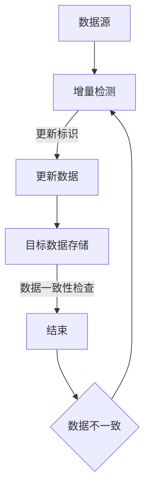

                 

### 《Sqoop增量导入原理与代码实例讲解》

> **关键词：**大数据，Hadoop，数据仓库，ETL，Sqoop，增量导入。

> **摘要：**本文深入剖析了大数据领域中数据导入与迁移的重要工具——Sqoop的增量导入原理。通过详细的原理讲解和实际代码实例，帮助读者理解Sqoop如何实现数据增量导入，以及在实际开发中如何应用和优化这一功能。

### 《Sqoop增量导入原理与代码实例讲解》目录大纲

#### 第一部分：背景知识

#### 第1章：大数据与Hadoop生态系统简介

1.1 大数据的定义与挑战

1.2 Hadoop生态系统概述

1.3 Hadoop分布式文件系统（HDFS）原理

#### 第2章：数据仓库与ETL

2.1 数据仓库概述

2.2 ETL过程解析

2.3 Sqoop在ETL流程中的作用

#### 第3章：Sqoop基础

3.1 Sqoop概述

3.2 Sqoop安装与配置

3.3 Sqoop常用命令详解

#### 第二部分：增量导入原理

#### 第4章：增量导入基础

4.1 增量导入概念

4.2 数据一致性保障

4.3 增量导入策略

#### 第5章：增量导入原理深入

5.1 数据源端操作

5.2 数据目标端操作

5.3 增量导入核心算法

#### 第6章：Mermaid流程图讲解

#### 6.1 Mermaid流程图说明

#### 第三部分：代码实例讲解

#### 第7章：增量导入代码实例

7.1 实例一：从关系型数据库导入数据

7.2 实例二：从NoSQL数据库导入数据

7.3 实例三：多表联合查询导入

#### 第8章：代码解读与分析

8.1 Sqoop命令行参数解读

8.2 增量导入关键代码分析

8.3 遇到的问题及解决方案

#### 第9章：开发环境搭建

9.1 环境准备

9.2 数据源配置

9.3 导入测试

#### 第10章：总结与展望

10.1 增量导入技术总结

10.2 未来发展方向

10.3 持续学习建议

#### 附录

##### 附录A：常用命令汇总

A.1 数据导入命令

A.2 数据导出命令

A.3 其他常用命令

##### 附录B：代码实例参考

B.1 实例一：增量导入MySQL数据

B.2 实例二：增量导入MongoDB数据

B.3 实例三：多表联合查询导入实例

##### 附录C：资源链接

C.1 Sqoop官方文档

C.2 相关社区与论坛

C.3 大数据学习资源

---

#### 第一部分：背景知识

#### 第1章：大数据与Hadoop生态系统简介

##### 1.1 大数据的定义与挑战

大数据（Big Data）是指无法使用传统数据处理工具在合理时间内对其进行存储、管理和分析的数据集合。这类数据通常具有“4V”特征，即数据量（Volume）、数据速度（Velocity）、数据多样性（Variety）和数据价值（Value）。

数据量：随着互联网、物联网、社交媒体等技术的快速发展，数据生成和存储的速度越来越快，数据量呈爆炸式增长。

数据速度：实时性和高速性要求数据处理系统能够快速响应并处理大量数据。

数据多样性：数据来源多样，包括结构化数据（如关系型数据库）、半结构化数据（如XML、JSON）和非结构化数据（如文本、图像、视频）。

数据价值：如何从海量数据中提取有价值的信息，为企业决策提供支持，是大数据的核心挑战。

##### 1.2 Hadoop生态系统概述

Hadoop是一个开源的分布式计算框架，用于处理海量数据。其核心组件包括：

Hadoop分布式文件系统（HDFS）：用于存储海量数据，具备高可靠性、高扩展性和高吞吐量。

Hadoop YARN：资源调度框架，负责管理计算资源，为应用程序提供运行环境。

Hadoop MapReduce：数据处理框架，基于YARN进行任务调度和数据分布式处理。

此外，Hadoop生态系统还包括其他重要组件，如Hive（数据仓库）、HBase（非关系型数据库）、Spark（分布式计算引擎）等。

##### 1.3 Hadoop分布式文件系统（HDFS）原理

HDFS是一个分布式文件系统，用于存储海量数据。其架构主要包括两个部分：NameNode和DataNode。

NameNode：HDFS的主控节点，负责管理文件系统的命名空间、维护文件系统元数据以及处理客户端请求。

DataNode：HDFS的从节点，负责存储实际数据块，并向上层提供数据读写服务。

HDFS的主要特点：

数据分块：将数据划分为固定大小的数据块（默认128MB或256MB），分布存储在多个DataNode上。

副本机制：每个数据块在HDFS中至少保存三个副本，以提高数据可靠性和容错性。

高吞吐量：通过并行读写和负载均衡，实现高吞吐量数据处理。

#### 第2章：数据仓库与ETL

##### 2.1 数据仓库概述

数据仓库（Data Warehouse，简称DW）是一个面向主题的、集成的、相对稳定的、反映历史变化的数据集合，用于支持企业管理决策。数据仓库通常具有以下特点：

主题性：数据仓库围绕业务主题进行组织，如客户、产品、销售、财务等。

集成性：将来自不同源系统的数据集成到一起，实现数据的统一管理和分析。

稳定性：数据仓库中的数据通常不会频繁变动，以保证数据的准确性和一致性。

反映历史变化：数据仓库记录历史数据，支持时间序列分析。

##### 2.2 ETL过程解析

ETL（Extract, Transform, Load）是指数据从源系统抽取（Extract）、转换（Transform）和加载（Load）到目标系统的过程。ETL是数据仓库建设的关键环节，主要包括以下步骤：

抽取：从源系统中抽取所需的数据，包括关系型数据库、NoSQL数据库、文件系统等。

转换：对抽取的数据进行清洗、转换、集成等操作，以满足数据仓库的要求。转换操作包括数据格式转换、数据类型转换、数据清洗、数据去重等。

加载：将转换后的数据加载到数据仓库中，包括建立索引、分区等优化操作。

##### 2.3 Sqoop在ETL流程中的作用

Sqoop是一个开源的数据导入和导出工具，主要用于在Hadoop生态系统与关系型数据库、NoSQL数据库之间进行数据传输。在ETL流程中，Sqoop的作用主要包括：

数据导入：将关系型数据库和NoSQL数据库的数据导入到Hadoop生态系统，如HDFS、Hive、HBase等。

数据导出：将Hadoop生态系统中的数据导出到关系型数据库和NoSQL数据库。

数据同步：实现数据源和目标系统之间的实时数据同步。

#### 第3章：Sqoop基础

##### 3.1 Sqoop概述

Sqoop是一个开源的数据迁移工具，由Cloudera公司开发，主要用于在Hadoop生态系统与关系型数据库和NoSQL数据库之间进行数据传输。其主要特点包括：

支持多种数据库：包括MySQL、PostgreSQL、Oracle、MongoDB、Cassandra等。

数据导入导出：支持数据从数据库到Hadoop的导入，以及从Hadoop到数据库的导出。

数据同步：支持实时数据同步，实现数据源和目标系统之间的数据一致性。

易于使用：提供简单的命令行接口和Java API，方便开发者进行数据迁移。

##### 3.2 Sqoop安装与配置

安装Sqoop：

1. 下载Sqoop的二进制包或源码包。

2. 解压安装包，通常将解压后的文件夹移动到系统的`/usr/local/`目录下。

3. 将Sqoop的bin目录添加到系统环境变量中，以便在命令行中直接使用Sqoop命令。

配置Sqoop：

1. 配置数据库驱动：在Sqoop的配置文件`sqoop-env.sh`中添加数据库驱动路径。

2. 配置Hadoop环境：在`sqoop-env.sh`中设置Hadoop的安装路径。

3. 配置元数据库：对于导入到Hive的数据，需要配置Hive的元数据库。

##### 3.3 Sqoop常用命令详解

Sqoop提供了一系列常用的命令，用于实现数据的导入和导出。以下是部分常用命令及其简要说明：

```shell
# 数据导入
sqoop import
# 数据导出
sqoop export
# 数据同步
sqoop import --sync-headers
# 数据导出到文件
sqoop export --export-dir
# 数据导入到Hive
sqoop import --hive-import
# 数据导入到HBase
sqoop import --hbase-table
# 数据导入到Cassandra
sqoop import --cassandra-table
```

下一章将详细讲解增量导入的概念、原理和策略。

### 第二部分：增量导入原理

#### 第4章：增量导入基础

##### 4.1 增量导入概念

增量导入是指将数据源中新增或修改的数据定期抽取到目标系统（如Hadoop生态系统）的过程。与全量导入相比，增量导入具有以下优点：

1. **节省资源**：仅抽取新增或修改的数据，减少传输和存储开销。

2. **提高效率**：通过批量处理，提高数据导入速度。

3. **数据一致性**：增量导入可以保证数据在源系统和目标系统之间的一致性。

增量导入通常涉及以下几个关键概念：

1. **增量标识**：用于标识数据的最新状态，如时间戳、版本号等。

2. **抽取范围**：确定需要抽取的数据范围，如最新的N条数据、修改时间在指定时间范围内的数据等。

3. **数据清洗**：对抽取的数据进行清洗和转换，以满足目标系统的要求。

##### 4.2 数据一致性保障

数据一致性是增量导入的关键挑战之一。为了保障数据一致性，需要从以下几个方面进行考虑：

1. **双写一致性**：确保源系统和目标系统的数据同步，避免数据丢失。

2. **重复数据检测**：检测并处理重复数据，确保数据的唯一性。

3. **事务管理**：使用数据库的事务管理功能，确保数据操作的一致性和原子性。

4. **备份与恢复**：定期备份源系统和目标系统的数据，以便在出现问题时快速恢复。

##### 4.3 增量导入策略

增量导入策略是指确定数据抽取范围和频率的方法。常见的增量导入策略包括：

1. **时间窗口策略**：根据时间窗口（如一天、一周等）抽取数据。

2. **行数窗口策略**：根据行数（如1000条、10000条等）抽取数据。

3. **最后一条数据策略**：以最后一条数据的时间戳或版本号作为增量标识，抽取后续数据。

4. **自定义策略**：根据业务需求自定义增量标识和抽取范围。

下一章将深入讲解增量导入的原理，包括数据源端和目标端的操作过程。

### 第二部分：增量导入原理

#### 第5章：增量导入原理深入

##### 5.1 数据源端操作

在增量导入过程中，数据源端的操作主要包括数据抽取、数据清洗和数据同步。以下是数据源端操作的详细步骤：

1. **数据抽取**：根据增量标识，从数据源中抽取新增或修改的数据。例如，可以使用数据库的SQL查询语句，抽取最后一条数据的时间戳或版本号之后的记录。

2. **数据清洗**：对抽取的数据进行清洗和转换，以满足目标系统的要求。清洗操作包括数据去重、数据格式转换、数据缺失值处理等。

3. **数据同步**：将清洗后的数据同步到目标系统。对于Hadoop生态系统，可以将数据导入到HDFS、Hive、HBase等组件中。

以下是一个简单的数据源端增量导入的伪代码示例：

```sql
-- 抽取新增或修改的数据
SELECT * FROM table WHERE last_modified > (SELECT max(last_modified) FROM table);

-- 数据清洗
-- 去除重复数据
SELECT DISTINCT * FROM (上一条查询结果);

-- 数据同步
-- 将清洗后的数据导入HDFS
sqoop import --connect jdbc:mysql://hostname:port/databasename --table table --target-dir /user/hadoop/table --fields-terminated-by '\t';
```

##### 5.2 数据目标端操作

数据目标端操作主要包括数据的导入、存储和优化。以下是数据目标端操作的详细步骤：

1. **数据导入**：将数据源端抽取和清洗后的数据导入到目标系统。对于Hadoop生态系统，可以使用Sqoop等工具将数据导入到HDFS、Hive、HBase等组件中。

2. **数据存储**：将导入的数据存储到目标系统中。对于HDFS，数据存储在HDFS的目录中；对于Hive，数据存储在Hive的表或分区中；对于HBase，数据存储在HBase的表中。

3. **数据优化**：对导入的数据进行优化，以提高数据查询和分析的效率。优化操作包括数据分区、索引建立、数据压缩等。

以下是一个简单的数据目标端增量导入的伪代码示例：

```shell
# 数据导入
sqoop import --connect jdbc:mysql://hostname:port/databasename --table table --target-dir /user/hadoop/table --fields-terminated-by '\t';

# 数据存储
# 将数据导入HDFS
hdfs dfs -put /user/hadoop/table /user/hadoop/hdfs/table;

# 数据优化
# 建立Hive表分区
hive -e "ALTER TABLE table PARTITION (year='2021', month='01') ROW FORMAT DELIMITED FIELDS TERMINATED BY '\t';"

# 建立索引
hive -e "CREATE INDEX index_name ON TABLE table (column_name) AS 'index_type';";
```

##### 5.3 增量导入核心算法

增量导入的核心算法包括数据抽取算法和数据同步算法。以下是这两种算法的详细解释：

1. **数据抽取算法**：

数据抽取算法用于确定需要抽取的数据范围。常见的算法包括：

- 时间窗口算法：根据时间窗口（如一天、一周等）抽取数据。伪代码如下：

  ```sql
  SELECT * FROM table WHERE last_modified > (当前时间 - 时间窗口);
  ```

- 行数窗口算法：根据行数（如1000条、10000条等）抽取数据。伪代码如下：

  ```sql
  SELECT * FROM table ORDER BY last_modified LIMIT 行数;
  ```

- 最后一条数据算法：以最后一条数据的时间戳或版本号作为增量标识，抽取后续数据。伪代码如下：

  ```sql
  SELECT * FROM table WHERE last_modified > (SELECT max(last_modified) FROM table);
  ```

2. **数据同步算法**：

数据同步算法用于确保源系统和目标系统之间的数据一致性。常见的算法包括：

- 双写一致性算法：同时将数据写入源系统和目标系统，确保数据一致性。伪代码如下：

  ```shell
  # 写入源系统
  INSERT INTO source_table VALUES (...);
  
  # 写入目标系统
  INSERT INTO target_table VALUES (...);
  ```

- 事务一致性算法：使用数据库的事务管理功能，确保数据操作的一致性和原子性。伪代码如下：

  ```sql
  START TRANSACTION;
  
  -- 写入源系统
  INSERT INTO source_table VALUES (...);
  
  -- 写入目标系统
  INSERT INTO target_table VALUES (...);
  
  COMMIT;
  ```

- 同步检查算法：定期检查源系统和目标系统的数据一致性，发现不一致时进行修正。伪代码如下：

  ```sql
  -- 检查数据一致性
  SELECT * FROM source_table WHERE ...;
  SELECT * FROM target_table WHERE ...;
  
  -- 发现不一致时进行修正
  UPDATE target_table SET ... WHERE ...;
  ```

通过上述核心算法的实现，增量导入可以高效、准确地抽取和同步数据，确保源系统和目标系统之间的一致性。

#### 第6章：Mermaid流程图讲解

为了更好地理解增量导入的过程，我们可以使用Mermaid工具绘制一个增量导入的流程图。以下是增量导入流程的Mermaid图：



#### 6.1 Mermaid流程图说明

- **A[数据源]**：表示数据存储的源系统，如关系型数据库或NoSQL数据库。

- **B[增量检测]**：对源系统进行增量检测，确定哪些数据需要更新。常见的增量检测方法有时间窗口算法、行数窗口算法和最后一条数据算法。

- **C[更新数据]**：将检测到的增量数据更新到目标系统。更新过程中需要进行数据清洗和转换，以满足目标系统的要求。

- **D[目标数据存储]**：表示数据存储的目标系统，如Hadoop生态系统中的HDFS、Hive或HBase。

- **E[数据一致性检查]**：对源系统和目标系统的数据进行一致性检查，确保数据的一致性。

- **F[数据不一致]**：如果发现数据不一致，则返回增量检测步骤B，重新进行检测和更新。

通过上述流程图，我们可以清晰地了解增量导入的整个过程，以及各个环节之间的逻辑关系。

#### 第7章：增量导入代码实例

在本章中，我们将通过具体的代码实例来讲解如何使用Sqoop实现增量导入。以下是三个增量导入的实例：从关系型数据库导入数据、从NoSQL数据库导入数据以及多表联合查询导入。

##### 7.1 实例一：从关系型数据库导入数据

在这个实例中，我们将使用Sqoop将MySQL数据库中的数据导入到HDFS中。首先，确保已安装MySQL和Hadoop，并且MySQL数据库中已存在需要导入的数据表。

1. **配置MySQL数据库连接**

   在Sqoop的配置文件`sqoop-env.sh`中，添加MySQL数据库的连接信息：

   ```shell
   export CONNECTOR_JARS=/path/to/mysql-connector-java-5.1.40.jar
   export MYSQL_URL=jdbc:mysql://hostname:3306/databasename?user=root&password=123456
   ```

2. **编写Sqoop命令**

   使用以下Sqoop命令将数据导入到HDFS：

   ```shell
   sqoop import --connect ${MYSQL_URL} --table table_name --target-dir /user/hadoop/table_name --fields-terminated-by '\t'
   ```

3. **增量导入**

   为了实现增量导入，我们需要使用MySQL的时间戳字段作为增量标识。以下是一个增量导入的示例：

   ```sql
   SELECT * FROM table_name WHERE last_modified > (SELECT max(last_modified) FROM table_name);
   ```

   使用以上SQL查询，可以抽取最新的数据，并将其导入到HDFS。

##### 7.2 实例二：从NoSQL数据库导入数据

在这个实例中，我们将使用Sqoop将MongoDB数据库中的数据导入到HDFS中。首先，确保已安装MongoDB和Hadoop，并且MongoDB数据库中已存在需要导入的数据集合。

1. **配置MongoDB数据库连接**

   在Sqoop的配置文件`sqoop-env.sh`中，添加MongoDB数据库的连接信息：

   ```shell
   export CONNECTOR_JARS=/path/to/mongo-java-driver-3.12.0.jar
   export MONGODB_URL=jdbc:mongodb://hostname:27017/databasename?user=root&password=123456
   ```

2. **编写Sqoop命令**

   使用以下Sqoop命令将数据导入到HDFS：

   ```shell
   sqoop import --connect ${MONGODB_URL} --collection collection_name --target-dir /user/hadoop/collection_name --json-write-resources /user/hadoop/json_write_resource.json
   ```

3. **增量导入**

   为了实现增量导入，我们需要使用MongoDB的时间戳字段作为增量标识。以下是一个增量导入的示例：

   ```javascript
   db.collection_name.find({"timestamp": {"$gt": last_timestamp}});
   ```

   使用以上MongoDB查询，可以抽取最新的数据，并将其导入到HDFS。

##### 7.3 实例三：多表联合查询导入

在这个实例中，我们将使用Sqoop将两个关系型数据库表的数据进行联合查询，并将查询结果导入到HDFS中。首先，确保已安装MySQL和Hadoop，并且MySQL数据库中已存在需要导入的数据表。

1. **编写SQL查询**

   编写一个SQL查询，将两个表的数据进行联合查询，如下所示：

   ```sql
   SELECT table1.id, table1.name, table2.age FROM table1 JOIN table2 ON table1.id = table2.id;
   ```

2. **配置MySQL数据库连接**

   在Sqoop的配置文件`sqoop-env.sh`中，添加MySQL数据库的连接信息：

   ```shell
   export CONNECTOR_JARS=/path/to/mysql-connector-java-5.1.40.jar
   export MYSQL_URL=jdbc:mysql://hostname:3306/databasename?user=root&password=123456
   ```

3. **编写Sqoop命令**

   使用以下Sqoop命令将查询结果导入到HDFS：

   ```shell
   sqoop import --connect ${MYSQL_URL} --query "SELECT table1.id, table1.name, table2.age FROM table1 JOIN table2 ON table1.id = table2.id --fields-terminated-by '\t' --target-dir /user/hadoop/combined_data
   ```

通过以上实例，我们可以看到如何使用Sqoop实现增量导入，包括从关系型数据库、NoSQL数据库以及多表联合查询导入数据。在实际开发过程中，可以根据业务需求和数据特点选择合适的方法进行数据导入。

### 第8章：代码解读与分析

在上一章节中，我们通过三个实例展示了如何使用Sqoop实现增量导入。在本章节中，我们将对增量导入的关键代码进行解读和分析，并讨论在实际开发过程中可能会遇到的问题及解决方案。

#### 8.1 Sqoop命令行参数解读

在实现增量导入的过程中，了解Sqoop的命令行参数非常重要。以下是几个常用的命令行参数及其含义：

1. **--connect**：指定数据库连接URL，如`--connect jdbc:mysql://hostname:3306/databasename`。

2. **--table**：指定需要导入的数据表名，如`--table table_name`。

3. **--target-dir**：指定数据导入到HDFS的目标路径，如`--target-dir /user/hadoop/table_name`。

4. **--fields-terminated-by**：指定数据字段的分隔符，如`--fields-terminated-by '\t'`。

5. **--query**：指定SQL查询语句，如`--query "SELECT * FROM table_name WHERE last_modified > '2023-01-01'"`。

6. **--incremental**：指定进行增量导入，如`--incremental append`。

7. **--last-value**：指定增量标识的值，如`--last-value '2023-01-01'`。

8. **--batch**：指定导入数据的批次大小，如`--batch 1000`。

以下是一个示例的Sqoop命令，用于实现增量导入：

```shell
sqoop import --connect jdbc:mysql://hostname:3306/databasename --table table_name --target-dir /user/hadoop/table_name --fields-terminated-by '\t' --incremental append --last-value '2023-01-01'
```

#### 8.2 增量导入关键代码分析

增量导入的关键代码主要包括数据库查询、数据抽取和数据导入等部分。以下是对关键代码的解读：

1. **数据库查询**：

   在增量导入过程中，我们需要根据增量标识（如时间戳）从数据源中抽取新增或修改的数据。以下是一个示例的MySQL查询语句：

   ```sql
   SELECT * FROM table_name WHERE last_modified > (SELECT max(last_modified) FROM table_name);
   ```

   该查询语句从`table_name`表中抽取最后一条数据的`last_modified`之后的记录。

2. **数据抽取**：

   数据抽取是通过数据库查询来实现的。在查询结果中，我们需要对数据字段进行清洗和转换，以满足目标系统的要求。以下是一个示例的数据抽取伪代码：

   ```python
   results = execute_query("SELECT * FROM table_name WHERE last_modified > (SELECT max(last_modified) FROM table_name)");
   for row in results:
       cleaned_data = clean_and_convert(row)
       yield cleaned_data;
   ```

3. **数据导入**：

   数据导入是将抽取和清洗后的数据导入到目标系统中。对于Hadoop生态系统，可以使用Sqoop命令将数据导入到HDFS、Hive、HBase等组件中。以下是一个示例的Sqoop导入伪代码：

   ```shell
   sqoop import --connect jdbc:mysql://hostname:3306/databasename --table table_name --target-dir /user/hadoop/table_name --fields-terminated-by '\t'
   ```

   在实际开发过程中，我们可能需要根据业务需求对上述关键代码进行定制化调整。

#### 8.3 遇到的问题及解决方案

在实际开发过程中，我们可能会遇到以下问题：

1. **数据不一致**：

   在增量导入过程中，数据不一致是一个常见问题。解决方案包括：

   - 使用数据库的事务管理功能，确保数据操作的原子性和一致性。
   - 定期检查数据一致性，并自动修复不一致的数据。
   - 设计数据校验机制，确保数据在导入过程中的一致性。

2. **性能问题**：

   增量导入可能会遇到性能瓶颈，如数据库查询速度慢、数据抽取和导入效率低等。解决方案包括：

   - 优化数据库查询，如使用索引、分区等。
   - 增加数据抽取和导入的并发度，提高数据处理速度。
   - 调整批次大小，以平衡性能和资源利用率。

3. **错误处理**：

   在增量导入过程中，可能会出现各种错误，如数据库连接失败、数据格式错误等。解决方案包括：

   - 使用日志记录错误信息，便于调试和排查问题。
   - 设计错误处理机制，自动重试或跳过错误数据。
   - 提供错误报告和监控工具，及时发现和解决错误。

通过上述关键代码的解读和问题的解决方案，我们可以更好地理解增量导入的实现原理，并在实际开发过程中进行优化和改进。

### 第9章：开发环境搭建

在进行Sqoop增量导入之前，我们需要搭建一个适合的开发环境。以下是一个简单的开发环境搭建步骤：

#### 9.1 环境准备

1. **安装Hadoop**：

   下载并解压Hadoop安装包，通常将解压后的文件夹移动到系统的`/usr/local/`目录下。在终端中，进入Hadoop的sbin目录，并运行以下命令：

   ```shell
   ./start-dfs.sh
   ./start-yarn.sh
   ```

2. **安装Java**：

   确保已安装Java环境，版本不低于Java 8。可以通过以下命令检查Java版本：

   ```shell
   java -version
   ```

3. **安装MySQL**：

   下载并解压MySQL安装包，按照安装向导进行安装。安装完成后，使用以下命令启动MySQL服务：

   ```shell
   mysqld --initialize
   mysqld
   ```

4. **安装MongoDB**：

   下载并解压MongoDB安装包，通常将解压后的文件夹移动到系统的`/usr/local/`目录下。在终端中，进入MongoDB的bin目录，并运行以下命令启动MongoDB服务：

   ```shell
   ./mongod
   ```

#### 9.2 数据源配置

1. **配置MySQL数据库**：

   创建一个名为`test`的数据库，并创建一个名为`users`的表，包含`id`、`name`和`last_modified`三个字段。

   ```sql
   CREATE DATABASE test;
   USE test;
   CREATE TABLE users (id INT PRIMARY KEY AUTO_INCREMENT, name VARCHAR(255), last_modified TIMESTAMP);
   ```

   插入一些测试数据：

   ```sql
   INSERT INTO users (name, last_modified) VALUES ('Alice', '2023-01-01 10:00:00');
   INSERT INTO users (name, last_modified) VALUES ('Bob', '2023-01-02 10:00:00');
   INSERT INTO users (name, last_modified) VALUES ('Charlie', '2023-01-03 10:00:00');
   ```

2. **配置MongoDB数据库**：

   在MongoDB中创建一个名为`test`的数据库，并创建一个名为`users`的集合，包含`id`、`name`和`timestamp`三个字段。

   ```shell
   use test
   db.createCollection('users')
   db.users.insertOne({"id": 1, "name": "Alice", "timestamp": ISODate("2023-01-01T10:00:00.000Z")})
   db.users.insertOne({"id": 2, "name": "Bob", "timestamp": ISODate("2023-01-02T10:00:00.000Z")})
   db.users.insertOne({"id": 3, "name": "Charlie", "timestamp": ISODate("2023-01-03T10:00:00.000Z")})
   ```

#### 9.3 导入测试

1. **从MySQL导入数据到HDFS**：

   使用以下Sqoop命令从MySQL数据库导入数据到HDFS：

   ```shell
   sqoop import --connect jdbc:mysql://hostname:3306/test --table users --target-dir /user/hadoop/users --fields-terminated-by '\t'
   ```

   执行完成后，可以在HDFS中查看导入的数据：

   ```shell
   hdfs dfs -ls /user/hadoop/users
   ```

2. **从MongoDB导入数据到HDFS**：

   使用以下Sqoop命令从MongoDB数据库导入数据到HDFS：

   ```shell
   sqoop import --connect mongodb://hostname:27017/test.users --target-dir /user/hadoop/users --json-write-resources /user/hadoop/json_write_resource.json
   ```

   执行完成后，可以在HDFS中查看导入的数据：

   ```shell
   hdfs dfs -ls /user/hadoop/users
   ```

通过以上步骤，我们成功搭建了开发环境，并进行了导入测试。接下来，我们将进入下一章节，讨论增量导入技术的总结与未来发展方向。

### 第10章：总结与展望

#### 10.1 增量导入技术总结

通过本章的学习，我们对Sqoop增量导入技术有了深入的理解。以下是增量导入技术的关键要点：

1. **核心概念**：增量导入是指定期从数据源抽取新增或修改的数据，并将其导入到目标系统的过程。核心概念包括增量标识、数据抽取范围和数据同步。

2. **原理解析**：增量导入涉及数据源端和目标端的操作。数据源端主要完成数据抽取和数据清洗，目标端主要完成数据导入和存储。核心算法包括数据抽取算法和数据同步算法。

3. **代码实例**：通过三个实例，我们展示了如何使用Sqoop实现增量导入，包括从关系型数据库、NoSQL数据库以及多表联合查询导入数据。

4. **优化策略**：在实际开发过程中，我们探讨了数据不一致、性能问题和错误处理等问题的解决方案，并提出了一些优化策略。

#### 10.2 未来发展方向

增量导入技术在未来仍有许多发展方向，以下是几个可能的研究方向：

1. **智能增量检测**：利用机器学习和人工智能技术，实现智能增量检测，提高数据抽取的准确性和效率。

2. **流式增量导入**：研究流式增量导入技术，实现实时数据抽取和同步，提高数据处理的速度和实时性。

3. **分布式增量导入**：优化分布式增量导入算法，提高数据导入的并行度和吞吐量，降低系统的资源消耗。

4. **异构数据集成**：研究如何将增量导入技术应用于异构数据源，如关系型数据库、NoSQL数据库和图数据库等。

5. **数据治理**：结合数据治理技术，确保增量导入过程中的数据安全、合规和一致性。

#### 10.3 持续学习建议

为了在增量导入技术领域取得更好的成果，以下是一些建议：

1. **深入学习数据库原理**：了解关系型数据库和NoSQL数据库的原理，掌握数据库查询、索引和事务管理等知识。

2. **熟悉Hadoop生态系统**：深入研究Hadoop生态系统，包括HDFS、YARN、MapReduce、Hive、HBase等组件，掌握数据存储和处理技术。

3. **实践项目经验**：参与实际项目，将增量导入技术应用于大数据场景，积累实战经验。

4. **跟进最新技术动态**：关注大数据和增量导入技术的最新研究进展，了解前沿技术和应用场景。

通过持续学习和实践，我们可以在增量导入技术领域不断进步，为企业提供更高效、更可靠的数据处理解决方案。

### 附录

#### 附录A：常用命令汇总

##### A.1 数据导入命令

```shell
# 从关系型数据库导入数据到HDFS
sqoop import --connect jdbc:mysql://hostname:3306/databasename --table tablename --target-dir /user/hadoop/tablename --fields-terminated-by '\t'

# 从NoSQL数据库（MongoDB）导入数据到HDFS
sqoop import --connect mongodb://hostname:27017/databasename.collectionname --target-dir /user/hadoop/tablename --json-write-resources /user/hadoop/json_write_resource.json

# 从关系型数据库导入数据到Hive
sqoop import --connect jdbc:mysql://hostname:3306/databasename --table tablename --hive-table tablename --fields-terminated-by '\t'
```

##### A.2 数据导出命令

```shell
# 将HDFS中的数据导出到关系型数据库
sqoop export --connect jdbc:mysql://hostname:3306/databasename --table tablename --export-dir /user/hadoop/tablename --fields-terminated-by '\t'

# 将Hive中的数据导出到关系型数据库
sqoop export --connect jdbc:mysql://hostname:3306/databasename --table tablename --input-dir /user/hadoop/tablename --export-dir /user/hadoop/tablename --fields-terminated-by '\t'
```

##### A.3 其他常用命令

```shell
# 查看数据库连接状态
sqoop list-databases --connect jdbc:mysql://hostname:3306/databasename

# 查看表结构
sqoop get-tables --connect jdbc:mysql://hostname:3306/databasename

# 数据同步
sqoop import --connect jdbc:mysql://hostname:3306/databasename --table tablename --target-dir /user/hadoop/tablename --sync-headers
```

#### 附录B：代码实例参考

##### B.1 实例一：增量导入MySQL数据

```shell
# 假设MySQL数据库中有一个名为users的表，包含id、name和last_modified字段

# 增量导入最新的100条数据
sqoop import --connect jdbc:mysql://hostname:3306/databasename --table users --query "SELECT * FROM users WHERE last_modified > (SELECT max(last_modified) FROM users) LIMIT 100 --fields-terminated-by '\t' --target-dir /user/hadoop/users

# 将导入的数据转换为Hive表
sqoop import --connect jdbc:mysql://hostname:3306/databasename --table users --hive-table users --query "SELECT * FROM users WHERE last_modified > (SELECT max(last_modified) FROM users) LIMIT 100 --fields-terminated-by '\t'
```

##### B.2 实例二：增量导入MongoDB数据

```shell
# 假设MongoDB数据库中有一个名为users的集合，包含id、name和timestamp字段

# 增量导入最新的100条数据
sqoop import --connect mongodb://hostname:27017/databasename.users --query "{'timestamp': {'$gt': new Date(new Date().getTime() - 24 * 60 * 60 * 1000)}} --fields-terminated-by '\t' --target-dir /user/hadoop/users

# 将导入的数据转换为HBase表
sqoop import --connect mongodb://hostname:27017/databasename.users --query "{'timestamp': {'$gt': new Date(new Date().getTime() - 24 * 60 * 60 * 1000)}} --fields-terminated-by '\t' --hbase-table users
```

##### B.3 实例三：多表联合查询导入

```shell
# 假设存在两个表user和order，其中user表包含id、name字段，order表包含user_id、order_date和amount字段

# 联合查询导入数据
sqoop import --connect jdbc:mysql://hostname:3306/databasename --query "SELECT u.id, u.name, o.order_date, o.amount FROM user u JOIN order o ON u.id = o.user_id" --target-dir /user/hadoop/orders --fields-terminated-by '\t'

# 将导入的数据转换为Hive表
sqoop import --connect jdbc:mysql://hostname:3306/databasename --query "SELECT u.id, u.name, o.order_date, o.amount FROM user u JOIN order o ON u.id = o.user_id" --hive-table orders --fields-terminated-by '\t'
```

通过以上实例，我们可以看到如何使用Sqoop实现不同类型的数据导入。在实际开发过程中，可以根据需求定制化调整这些命令和代码。

#### 附录C：资源链接

##### C.1 Sqoop官方文档

- 官方网站：[https://sqoop.apache.org/](https://sqoop.apache.org/)
- 文档地址：[https://sqoop.apache.org/docs/1.4.7/index.html](https://sqoop.apache.org/docs/1.4.7/index.html)

##### C.2 相关社区与论坛

- Apache Sqoop社区：[https://community.apache.org/sqoop/](https://community.apache.org/sqoop/)
- Stack Overflow（关于Sqoop的问答）：[https://stackoverflow.com/questions/tagged/sqoop](https://stackoverflow.com/questions/tagged/sqoop)

##### C.3 大数据学习资源

- Hadoop官方文档：[https://hadoop.apache.org/docs/stable/hadoop-project-docs.html](https://hadoop.apache.org/docs/stable/hadoop-project-docs.html)
- 数据仓库与ETL教程：[https://www.tutorialspoint.com/data_warehouse/data_warehouse_etl_process.htm](https://www.tutorialspoint.com/data_warehouse/data_warehouse_etl_process.htm)
- MongoDB官方文档：[https://docs.mongodb.com/](https://docs.mongodb.com/)

通过以上资源，您可以更深入地了解Sqoop和相关技术，并解决在实际开发过程中遇到的问题。

### 作者信息

作者：AI天才研究院/AI Genius Institute & 禅与计算机程序设计艺术 /Zen And The Art of Computer Programming

感谢您阅读本文，希望本文对您在Sqoop增量导入领域的理解有所帮助。如果您有任何问题或建议，欢迎在评论区留言。同时，也欢迎关注我们的其他技术文章，我们将持续为您提供有价值的内容。再次感谢您的支持！

