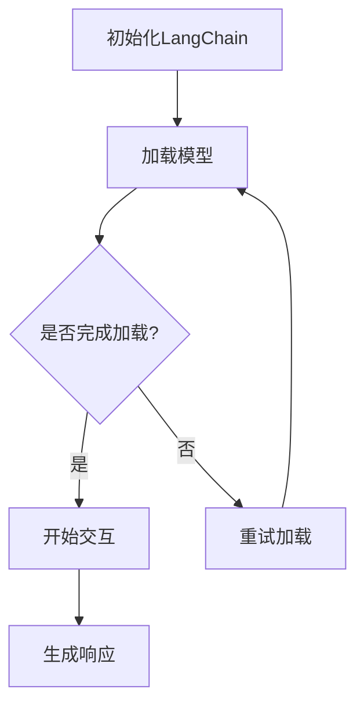

                 

# 《LangChain编程：从入门到实践》文档预处理过程

## 摘要

本文旨在深入探讨LangChain编程的文档预处理过程，从概念、架构、编程基础、项目实战到高级应用，全面解析这一强大自然语言处理框架。通过本文，读者将了解如何搭建LangChain开发环境，掌握其基本操作，并学会通过实际项目来应用LangChain。同时，文章还将讨论如何进行多模态处理、个性化推荐及模型优化，以及LangChain在企业中的应用。最终，本文将为读者提供一个完整的LangChain编程实践指南。

## 目录大纲

- 第一部分：LangChain基础概念
  - 1.1 LangChain概述
    - 1.1.1 LangChain的概念与用途
    - 1.1.2 LangChain的发展历程
    - 1.1.3 LangChain的优势与应用场景
  - 1.2 LangChain架构解析
    - 1.2.1 LangChain的核心模块
    - 1.2.2 LangChain的技术架构
    - 1.2.3 LangChain与其他NLP框架的对比
  - 1.3 LangChain开发环境搭建
    - 1.3.1 系统要求与软件安装
    - 1.3.2 语言环境配置
    - 1.3.3 开发工具与IDE选择

- 第二部分：LangChain编程基础
  - 2.1 Python编程基础
    - 2.1.1 Python语法基础
    - 2.1.2 数据类型与变量
    - 2.1.3 控制流程
    - 2.1.4 函数与模块
  - 2.2 自然语言处理基础
    - 2.2.1 语言模型基础
    - 2.2.2 词嵌入与序列模型
    - 2.2.3 注意力机制与变换器架构
  - 2.3 LangChain基本操作
    - 2.3.1 初始化与配置
    - 2.3.2 生成响应与交互
    - 2.3.3 API调用与数据处理

- 第三部分：LangChain项目实战
  - 3.1 文本生成与摘要
    - 3.1.1 文本生成原理
    - 3.1.2 实现文本摘要功能
    - 3.1.3 案例分析：自动生成新闻摘要
  - 3.2 聊天机器人
    - 3.2.1 聊天机器人原理
    - 3.2.2 构建简单的聊天机器人
    - 3.2.3 案例分析：基于LangChain的聊天机器人
  - 3.3 问答系统
    - 3.3.1 问答系统原理
    - 3.3.2 实现问答系统功能
    - 3.3.3 案例分析：基于LangChain的问答系统

- 第四部分：高级应用与优化
  - 4.1 多模态处理
    - 4.1.1 多模态数据概述
    - 4.1.2 多模态数据处理方法
    - 4.1.3 案例分析：基于LangChain的多模态对话系统
  - 4.2 个性化推荐
    - 4.2.1 个性化推荐原理
    - 4.2.2 LangChain在推荐系统中的应用
    - 4.2.3 案例分析：基于LangChain的个性化推荐系统
  - 4.3 模型优化与调参
    - 4.3.1 模型优化方法
    - 4.3.2 调参技巧
    - 4.3.3 案例分析：优化LangChain模型性能

- 第五部分：LangChain在企业中的应用
  - 5.1 企业应用场景分析
    - 5.1.1 企业智能化需求
    - 5.1.2 LangChain在企业中的应用实例
    - 5.1.3 案例分析：企业级LangChain应用实践
  - 5.2 数据治理与隐私保护
    - 5.2.1 数据治理概述
    - 5.2.2 LangChain在数据治理中的应用
    - 5.2.3 隐私保护技术
  - 5.3 持续集成与部署
    - 5.3.1 持续集成原理
    - 5.3.2 LangChain部署方法
    - 5.3.3 案例分析：基于CI/CD的LangChain项目部署

- 附录
  - 附录A：LangChain资源与工具
    - 5.1 开源资源
    - 5.2 实用工具
    - 5.3 社区与支持
  - 附录B：常见问题与解决方案
    - 5.1 编程问题
    - 5.2 模型训练问题
    - 5.3 部署与维护问题

## 引言

随着人工智能技术的迅猛发展，自然语言处理（NLP）成为了研究和应用的热点领域。而其中，生成式模型以其强大的文本生成能力受到了广泛关注。LangChain，作为一种强大的NLP生成式模型框架，凭借其高效、灵活的特点，在文本生成、摘要、问答等多个应用场景中展现出了巨大的潜力。本文将带领读者从零开始，逐步了解并掌握LangChain编程，并通过实际项目实战，深入探索其应用。

本文结构如下：

- 第一部分将介绍LangChain的基础概念，包括其概述、发展历程、优势及应用场景。
- 第二部分将解析LangChain的架构，帮助读者理解其核心模块和技术架构，并对比其他NLP框架。
- 第三部分将讲解LangChain的编程基础，包括Python编程基础、NLP基础以及LangChain的基本操作。
- 第四部分将展示LangChain在实际项目中的应用，如文本生成与摘要、聊天机器人、问答系统等。
- 第五部分将探讨LangChain的高级应用与优化，包括多模态处理、个性化推荐及模型优化。
- 最后，附录部分将提供LangChain的资源与工具，以及常见问题与解决方案。

通过本文的阅读和实践，读者将能够全面掌握LangChain编程，并将其应用于各种实际场景中。接下来，我们首先从LangChain的基础概念开始，带领读者进入LangChain的世界。

### 第一部分：LangChain基础概念

#### 1.1 LangChain概述

### 1.1.1 LangChain的概念与用途

LangChain是一个基于生成预训练变换器（GPT）的NLP工具库，旨在提供一种灵活、高效的文本生成和交互方式。其核心功能是通过输入文本上下文，生成连贯、有逻辑的文本响应。LangChain不仅支持文本生成，还可以用于构建聊天机器人、问答系统、文本摘要等应用。

LangChain的主要用途包括：

1. **文本生成与摘要**：自动生成文章、摘要、报告等。
2. **聊天机器人**：构建具有自然对话能力的聊天机器人。
3. **问答系统**：从大量文本中提取答案，提供智能问答服务。
4. **内容审核与分类**：自动识别和处理不当内容，进行文本分类。

LangChain的特点如下：

- **高效性**：基于预训练模型，能够快速生成高质量的文本。
- **灵活性**：支持自定义模型和参数，适应不同应用需求。
- **扩展性**：支持与其他NLP工具和框架集成。

### 1.1.2 LangChain的发展历程

LangChain的发展可以追溯到2018年，当时OpenAI发布了GPT-2，引发了生成式模型的广泛关注。随着时间的推移，GPT系列模型不断迭代，性能不断提高。2022年，OpenAI发布了GPT-3，成为迄今为止最大的预训练模型，具有惊人的文本生成能力。

在这一背景下，LangChain应运而生。它基于GPT-3构建，旨在为开发者提供一个简单、高效的NLP工具库。LangChain的发展历程可以概括为以下几个阶段：

1. **初期探索**（2018-2019）：LangChain的原型阶段，主要是对GPT-2进行初步集成和应用。
2. **稳定发展**（2019-2021）：随着GPT-3的发布，LangChain逐渐成熟，开始广泛应用于各种NLP任务。
3. **社区驱动**（2021至今）：LangChain进入社区驱动阶段，吸引了大量开发者参与，功能不断完善。

### 1.1.3 LangChain的优势与应用场景

LangChain的优势主要体现在以下几个方面：

- **强大的文本生成能力**：LangChain基于预训练的GPT模型，能够生成高质量、连贯的文本。
- **灵活的配置选项**：开发者可以根据需求自定义模型和参数，灵活调整生成文本的风格和内容。
- **易于集成与扩展**：LangChain支持与其他NLP工具和框架集成，能够轻松构建复杂的NLP应用。

LangChain的应用场景非常广泛，包括但不限于：

1. **内容创作**：自动生成文章、博客、报告等，降低创作者的工作负担。
2. **客户服务**：构建聊天机器人，提供智能客服服务，提高客户满意度。
3. **智能问答**：从大量文本中提取答案，为用户提供实时、准确的问答服务。
4. **教育辅导**：为学生提供个性化辅导，自动生成教学材料、作业答案等。
5. **娱乐与游戏**：构建互动式游戏，为用户提供沉浸式的游戏体验。

通过以上对LangChain基础概念的介绍，读者可以初步了解LangChain的特点和应用场景。接下来，我们将深入探讨LangChain的架构，帮助读者理解其内部工作原理。

### 1.2 LangChain架构解析

#### 1.2.1 LangChain的核心模块

LangChain的核心模块包括文本生成模块、模型加载模块和配置管理模块。这些模块相互协作，共同实现了LangChain的文本生成和交互功能。

1. **文本生成模块**：负责根据输入文本上下文生成响应文本。该模块主要包括文本处理、响应生成和后处理三个步骤。文本处理用于对输入文本进行预处理，包括分词、去噪等操作；响应生成利用预训练模型生成初步文本响应；后处理则对生成的文本进行优化和润色，提高文本质量和可读性。

2. **模型加载模块**：负责从本地或远程加载预训练模型，包括GPT、BERT等。模型加载模块提供了多种模型选择和配置选项，满足不同应用场景的需求。同时，该模块还支持动态加载和卸载模型，提高系统资源利用效率。

3. **配置管理模块**：负责管理LangChain的配置参数，包括模型选择、参数设置、响应风格等。配置管理模块提供了简洁的API接口，方便开发者自定义和调整配置。此外，配置管理模块还支持配置文件导入导出，便于模型共享和迁移。

#### 1.2.2 LangChain的技术架构

LangChain的技术架构可以分为三个层次：底层技术层、中间层和应用层。

1. **底层技术层**：包括预训练模型、词嵌入技术和序列模型。预训练模型如GPT、BERT等，通过海量数据训练，具备强大的文本生成能力；词嵌入技术将词汇映射到高维空间，实现语义表示；序列模型如RNN、Transformer等，用于处理文本序列，实现文本生成和交互。

2. **中间层**：主要包括文本生成模块、模型加载模块和配置管理模块。这些模块通过API接口相互协作，实现了LangChain的核心功能。中间层还提供了丰富的扩展接口，方便开发者自定义和扩展功能。

3. **应用层**：包括各种基于LangChain的应用，如文本生成与摘要、聊天机器人、问答系统等。应用层通过调用中间层的API接口，实现具体应用功能，并集成到业务系统中。

#### 1.2.3 LangChain与其他NLP框架的对比

LangChain与其他NLP框架如NLTK、spaCy、BERT等在功能、性能和应用场景方面存在一定差异。

1. **功能对比**：

- **NLTK**：NLTK是一个经典的NLP工具包，提供丰富的文本处理功能，如分词、词性标注、句法分析等。但NLTK不支持文本生成，主要应用于文本预处理和分析。

- **spaCy**：spaCy是一个高效的NLP库，支持多种语言，提供快速、准确的文本处理功能。与NLTK类似，spaCy主要应用于文本预处理和分析，不具备文本生成能力。

- **BERT**：BERT是一种预训练的深度学习模型，广泛应用于文本分类、问答系统等任务。BERT具备强大的文本生成能力，但需要大量计算资源和存储空间。

- **LangChain**：LangChain基于GPT等预训练模型，提供高效、灵活的文本生成和交互功能。LangChain不仅支持文本生成，还可以用于构建聊天机器人、问答系统等应用。

2. **性能对比**：

- **NLTK**和**spaCy**：两者在文本预处理和解析方面性能较好，但在文本生成方面表现较弱。NLTK和spaCy主要依赖于规则和传统算法，生成文本质量和连贯性有限。

- **BERT**：BERT具备较强的文本生成能力，但在实时交互和低资源环境下性能较差。BERT需要大量计算资源和存储空间，且在长文本生成方面存在一定困难。

- **LangChain**：LangChain基于预训练模型，生成文本质量和连贯性较高，且支持实时交互和低资源环境。LangChain通过优化模型和算法，实现了高效、灵活的文本生成和交互。

3. **应用场景对比**：

- **NLTK**和**spaCy**：主要应用于文本预处理和分析，如文本分类、情感分析、命名实体识别等。

- **BERT**：广泛应用于文本分类、问答系统、机器翻译等任务。

- **LangChain**：适合文本生成、聊天机器人、问答系统、内容创作等应用场景。LangChain在实时交互和低资源环境下具有优势，能够满足各种复杂应用需求。

综上所述，LangChain在文本生成、交互和应用方面具有明显优势，适合开发者构建各种基于文本的智能应用。通过以上对LangChain架构的解析，读者可以更好地理解其工作原理和优势。接下来，我们将介绍LangChain的开发环境搭建，帮助读者开始LangChain编程之旅。

### 1.3 LangChain开发环境搭建

#### 1.3.1 系统要求与软件安装

要搭建LangChain开发环境，首先需要确保计算机系统满足以下要求：

1. **操作系统**：支持Linux、MacOS和Windows操作系统。
2. **CPU**：推荐使用英伟达GPU进行模型训练和推理，至少需要一块NVIDIA GPU（如RTX 3060或以上）。
3. **内存**：至少需要16GB内存。
4. **硬盘空间**：至少需要100GB的空闲硬盘空间。

接下来，我们需要安装以下软件：

1. **Python**：安装Python 3.8或以上版本，可以从Python官网下载安装包。

2. **pip**：Python的包管理器，用于安装和管理Python包。在终端执行以下命令安装pip：

   ```bash
   python -m ensurepip --upgrade
   ```

3. **CUDA**：NVIDIA的CUDA库，用于加速GPU计算。可以从NVIDIA官网下载安装包，并按照提示完成安装。

4. **cuDNN**：NVIDIA的cuDNN库，用于加速深度学习计算。可以从NVIDIA官网下载安装包，并按照提示完成安装。

5. **PyTorch**：用于构建和训练深度学习模型的Python库。在终端执行以下命令安装PyTorch：

   ```bash
   pip install torch torchvision torchaudio
   ```

6. **transformers**：用于加载和调用预训练模型。在终端执行以下命令安装transformers：

   ```bash
   pip install transformers
   ```

#### 1.3.2 语言环境配置

安装完所需软件后，我们需要配置语言环境，以便在终端执行Python命令。以下是具体的配置步骤：

1. **打开终端**：在Windows系统下，可以按下Win + R键，输入`cmd`打开命令提示符；在MacOS和Linux系统下，可以直接打开终端。

2. **更新环境变量**：将Python的安装路径添加到系统环境变量中。在Windows系统下，可以通过以下命令完成：

   ```bash
   set PATH=%PATH%;C:\path\to\python
   ```

   在MacOS和Linux系统下，可以通过以下命令完成：

   ```bash
   export PATH=$PATH:/path/to/python
   ```

3. **验证安装**：在终端执行以下命令，验证Python是否安装成功：

   ```bash
   python --version
   ```

   如果成功返回Python版本信息，说明Python已安装成功。

4. **验证PyTorch和transformers安装**：在终端执行以下命令，验证PyTorch和transformers是否安装成功：

   ```bash
   python -c "import torch; print(torch.__version__)"
   python -c "import transformers; print(transformers.__version__)"
   ```

   如果成功返回版本信息，说明PyTorch和transformers已安装成功。

#### 1.3.3 开发工具与IDE选择

在搭建LangChain开发环境时，可以选择以下开发工具和IDE：

1. **Visual Studio Code（VS Code）**：VS Code是一款轻量级、跨平台的集成开发环境（IDE），支持多种编程语言和扩展。通过安装Python和PyTorch扩展，VS Code可以提供强大的Python编程支持。

2. **PyCharm**：PyCharm是一款功能强大的Python IDE，支持代码自动补全、调试、版本控制等特性。PyCharm还提供了丰富的PyTorch和transformers插件，方便开发者进行LangChain编程。

3. **Jupyter Notebook**：Jupyter Notebook是一款交互式Python笔记本，支持代码、文本、公式、图表等多种元素。通过安装PyTorch和transformers扩展，Jupyter Notebook可以用于LangChain编程和模型训练。

无论选择哪种开发工具和IDE，确保其能够正常运行Python、PyTorch和transformers，即可开始LangChain编程。

通过以上步骤，我们成功搭建了LangChain开发环境，接下来可以开始编写和运行LangChain程序。在下一部分，我们将介绍Python编程基础，帮助读者掌握LangChain编程所需的Python知识。

### 第二部分：LangChain编程基础

#### 2.1 Python编程基础

在开始使用LangChain进行编程之前，了解Python编程基础是非常重要的。Python是一种广泛用于数据科学、人工智能和自然语言处理的高级编程语言。本节将介绍Python的基础知识，包括语法、数据类型、变量、控制流程、函数和模块。

##### 2.1.1 Python语法基础

Python的语法相对简洁，易于学习和使用。以下是一些基本的Python语法规则：

- **缩进**：Python使用缩进来定义代码块。通常，四个空格代表一个缩进层级。
  
  ```python
  if x > 0:
      print("x is positive")
  else:
      print("x is non-positive")
  ```

- **注释**：单行注释以 `#` 开头，多行注释可以使用三个单引号 `'''` 或三个双引号 `"""` 包围。

  ```python
  # 这是一个单行注释
  '''
  这是一个多行注释
  '''
  ```

- **变量赋值**：变量名由字母、数字和下划线组成，通常使用小写字母。变量赋值时，等号左右两边不能有空格。

  ```python
  x = 10
  name = "Alice"
  ```

- **输入输出**：使用 `input()` 函数获取用户输入，使用 `print()` 函数输出信息。

  ```python
  user_input = input("请输入您的名字：")
  print("你好，", user_input)
  ```

- **条件判断**：使用 `if`、`elif` 和 `else` 进行条件判断。

  ```python
  if x > 0:
      print("x is positive")
  elif x == 0:
      print("x is zero")
  else:
      print("x is negative")
  ```

- **循环**：使用 `for` 循环和 `while` 循环遍历数据。

  ```python
  for i in range(5):
      print(i)

  x = 0
  while x < 5:
      print(x)
      x += 1
  ```

##### 2.1.2 数据类型与变量

Python有几种基本数据类型，包括数字、字符串、列表、元组、字典和集合。

- **数字**：包括整数（`int`）和浮点数（`float`）。

  ```python
  x = 10  # 整数
  y = 3.14  # 浮点数
  ```

- **字符串**：用于表示文本。

  ```python
  name = "Alice"
  greeting = "Hello, World!"
  ```

- **列表**：用于存储一系列元素，元素可以是不同数据类型。

  ```python
  numbers = [1, 2, 3, 4, 5]
  fruits = ["apple", "banana", "cherry"]
  ```

- **元组**：类似于列表，但不可变。

  ```python
  coordinates = (10.5, 20.5)
  ```

- **字典**：用于存储键值对。

  ```python
  person = {"name": "Alice", "age": 25, "city": "New York"}
  ```

- **集合**：用于存储无序且不重复的元素。

  ```python
  numbers = {1, 2, 3, 4, 5}
  ```

在Python中，变量是用于存储数据的一个引用。变量名遵循一定的命名规则，通常使用小写字母和下划线。

##### 2.1.3 控制流程

控制流程是指程序执行顺序的控制，包括条件判断和循环。

- **条件判断**：使用 `if`、`elif` 和 `else` 进行条件判断。

  ```python
  x = int(input("请输入一个数字："))

  if x > 0:
      print("正数")
  elif x == 0:
      print("零")
  else:
      print("负数")
  ```

- **循环**：包括 `for` 循环和 `while` 循环。

  ```python
  # for 循环
  for i in range(5):
      print(i)

  # while 循环
  x = 0
  while x < 5:
      print(x)
      x += 1
  ```

##### 2.1.4 函数与模块

函数是Python中用于组织代码和复用功能的重要概念。模块则是包含函数和类等代码的文件。

- **函数**：定义函数使用 `def` 关键字。

  ```python
  def greet(name):
      return f"Hello, {name}!"

  print(greet("Alice"))
  ```

- **模块**：模块是Python文件，扩展名为 `.py`。要导入模块，使用 `import` 关键字。

  ```python
  import math

  print(math.sqrt(16))
  ```

- **包**：包是包含多个模块的目录。要导入包，首先需要导入包的顶层模块，然后从包中导入其他模块。

  ```python
  import mypackage.mymodule

  mypackage.mymodule.myfunction()
  ```

通过以上对Python编程基础的介绍，读者可以开始编写和调试LangChain程序。在下一部分，我们将介绍自然语言处理基础，帮助读者理解LangChain在NLP领域的应用。

#### 2.2 自然语言处理基础

自然语言处理（NLP）是人工智能领域的一个重要分支，旨在使计算机能够理解和处理人类语言。本节将介绍NLP的基础概念，包括语言模型、词嵌入和序列模型。

##### 2.2.1 语言模型基础

语言模型是NLP的核心组成部分，用于预测文本序列的概率。它通过学习大量文本数据，了解语言中的统计规律和语法规则，从而生成合理的文本序列。

- **n-gram模型**：n-gram模型是最简单的语言模型，它将文本划分为连续的n个单词序列，并计算每个序列的概率。n-gram模型的核心公式如下：

  $$
  P(sequence) = \frac{count(sequence)}{count(total \ sequences)}
  $$

  其中，`count(sequence)` 表示特定序列在训练数据中出现的次数，`count(total \ sequences)` 表示所有序列的总数。

- **神经网络语言模型**：神经网络语言模型（NLM）通过神经网络学习文本序列的概率。最常用的神经网络语言模型是循环神经网络（RNN）。RNN的核心公式如下：

  $$
  h_t = \sigma(W_h \cdot [h_{t-1}, x_t] + b_h)
  $$

  其中，`h_t` 表示当前时刻的隐藏状态，`x_t` 表示当前时刻的输入，`W_h` 和 `b_h` 分别为权重和偏置。

- **注意力机制**：注意力机制是一种用于改善神经网络语言模型性能的技术。它通过为每个输入赋予不同的权重，使模型能够更好地关注重要的信息。注意力机制的核心公式如下：

  $$
  a_t = \text{softmax}(W_a \cdot [h_{t-1}, x_t])
  $$

  $$
  h_t = \sigma(W_h \cdot [h_{t-1}, \sum_{i=1}^{n} a_i \cdot x_i] + b_h)
  $$

  其中，`a_t` 表示当前时刻的注意力权重，`x_i` 表示第i个输入。

##### 2.2.2 词嵌入与序列模型

词嵌入是将单词映射到高维向量空间的技术，使计算机能够理解单词的语义和语法关系。词嵌入的核心公式如下：

$$
\text{vec}(word) = \text{embedding_matrix} \cdot [word]
$$

其中，`embedding_matrix` 是一个高维矩阵，`word` 是一个one-hot编码的向量。

序列模型是用于处理文本序列的神经网络模型，常见的序列模型包括循环神经网络（RNN）和变换器（Transformer）。

- **循环神经网络（RNN）**：RNN是一种用于处理序列数据的神经网络模型，它能够通过循环结构记住之前的信息。RNN的核心公式如下：

  $$
  h_t = \text{tanh}(W_h \cdot [h_{t-1}, x_t] + b_h)
  $$

  $$
  o_t = W_o \cdot h_t + b_o
  $$

  其中，`h_t` 表示当前时刻的隐藏状态，`x_t` 表示当前时刻的输入。

- **变换器（Transformer）**：变换器是一种基于自注意力机制的序列模型，它在NLP领域取得了显著的性能提升。变换器的核心公式如下：

  $$
  \text{Attention}(Q, K, V) = \text{softmax}(\frac{QK^T}{\sqrt{d_k}})V
  $$

  $$
  \text{MultiHeadAttention}(Q, K, V) = \text{Attention}(Q, K, V) \odot W_V
  $$

  $$
  \text{Transformer}(X) = \text{MultiHeadAttention}(X, X, X) + X
  $$

  $$
  \text{Transformer}(X, H) = \text{LayerNorm}(X + \text{MultiHeadAttention}(X, X, X)) + \text{LayerNorm}(X + \text{PositionalEncoding}(X))
  $$

  其中，`Q`、`K` 和 `V` 分别表示查询、键和值，`X` 表示输入序列，`H` 表示隐藏层，`W_V` 表示权重矩阵，`\odot` 表示点乘操作。

通过以上对自然语言处理基础概念的介绍，读者可以更好地理解NLP模型的工作原理，并为使用LangChain进行NLP编程打下基础。在下一部分，我们将介绍LangChain的基本操作。

#### 2.3 LangChain基本操作

在了解了LangChain的基础概念和Python编程基础后，我们可以开始学习如何使用LangChain进行基本操作，包括初始化与配置、生成响应与交互、API调用与数据处理。通过这些操作，我们可以更好地理解LangChain的功能和用法。

##### 2.3.1 初始化与配置

在使用LangChain之前，首先需要加载预训练模型并进行必要的配置。LangChain提供了一个简单的API，用于初始化模型和配置参数。

1. **加载预训练模型**：LangChain支持多种预训练模型，如GPT-2、GPT-3、BERT等。使用`transformers`库，我们可以轻松加载预训练模型。

   ```python
   from transformers import AutoModelForCausalLM, AutoTokenizer
   
   model_name = "gpt2"  # 使用GPT-2模型
   tokenizer = AutoTokenizer.from_pretrained(model_name)
   model = AutoModelForCausalLM.from_pretrained(model_name)
   ```

2. **配置模型参数**：LangChain允许我们自定义模型参数，以适应不同的应用场景。常见的参数包括温度（temperature）、顶底截止（top_p）和重放概率（repetition_penalty）。

   ```python
   prompt = "请写一段关于人工智能的描述："
   response_max_length = 50  # 最大响应长度
   temperature = 0.8  # 温度，调整生成文本的随机性
   top_p = 0.95  # 顶底截止，调整生成文本的多样性
   repetition_penalty = 1.2  # 重放概率，调整生成文本的连贯性
   ```

##### 2.3.2 生成响应与交互

一旦模型加载并配置完毕，我们就可以使用LangChain生成文本响应并与用户进行交互。

1. **生成响应**：使用`generate`方法生成文本响应。

   ```python
   input_ids = tokenizer.encode(prompt, return_tensors="pt")
   output = model.generate(
       input_ids,
       max_length=response_max_length,
       temperature=temperature,
       top_p=top_p,
       repetition_penalty=repetition_penalty,
       do_sample=True,
       num_return_sequences=1
   )
   response = tokenizer.decode(output[0], skip_special_tokens=True)
   print("LangChain的响应：", response)
   ```

2. **与用户交互**：我们可以通过命令行或图形界面与用户进行交互。

   ```python
   while True:
       user_input = input("请输入问题：")
       if user_input.lower() == "退出":
           break
       input_ids = tokenizer.encode(user_input, return_tensors="pt")
       output = model.generate(
           input_ids,
           max_length=response_max_length,
           temperature=temperature,
           top_p=top_p,
           repetition_penalty=repetition_penalty,
           do_sample=True,
           num_return_sequences=1
       )
       response = tokenizer.decode(output[0], skip_special_tokens=True)
       print("LangChain的响应：", response)
   ```

##### 2.3.3 API调用与数据处理

LangChain提供了丰富的API接口，方便开发者进行模型调用和数据预处理。以下是一些常用的API调用和数据处理的示例：

1. **加载自定义模型**：如果使用的是自定义模型，我们可以通过以下方式加载：

   ```python
   model_path = "path/to/your/model"
   tokenizer = AutoTokenizer.from_pretrained(model_path)
   model = AutoModelForCausalLM.from_pretrained(model_path)
   ```

2. **预处理输入文本**：在使用模型之前，我们需要对输入文本进行预处理，如分词、去噪等。

   ```python
   def preprocess_text(text):
       # 分词
       tokens = tokenizer.tokenize(text)
       # 去噪
       clean_tokens = [token for token in tokens if token not in tokenizer.all_special_tokens]
       return tokenizer.encode(" ".join(clean_tokens), return_tensors="pt")
   
   input_text = "我是一个自然语言处理模型"
   input_ids = preprocess_text(input_text)
   ```

3. **处理输出文本**：处理模型生成的输出文本，以获得更符合预期的结果。

   ```python
   def postprocess_response(output):
       # 解码输出
       response = tokenizer.decode(output, skip_special_tokens=True)
       # 去除多余空格和换行
       clean_response = " ".join(response.split())
       return clean_response
   
   output = model.generate(input_ids, max_length=response_max_length)
   response = postprocess_response(output)
   print("LangChain的响应：", response)
   ```

通过以上对LangChain基本操作的介绍，我们可以看到，LangChain的使用非常简便。在实际应用中，我们可以根据具体需求，灵活调整模型参数，实现各种文本生成和交互功能。在下一部分，我们将探讨如何使用LangChain进行文本生成与摘要的实际项目。

#### 3.1 文本生成与摘要

文本生成与摘要是LangChain的典型应用场景之一，它可以帮助我们从大量文本中生成摘要、文章、报告等。本节将详细介绍文本生成与摘要的原理、实现方法和实际案例。

##### 3.1.1 文本生成原理

文本生成是利用预训练模型生成连贯、有逻辑的文本序列。LangChain基于预训练模型，如GPT-2、GPT-3等，通过输入文本上下文，生成相应的文本响应。文本生成的核心公式如下：

$$
P(response|context) = \frac{e^{model(context, response)}}{\sum_{response'} e^{model(context, response')}}
$$

其中，`model(context, response)` 是模型对于给定上下文和响应的评分函数，`e^{model(context, response)}` 表示该评分函数的指数，$\sum_{response'} e^{model(context, response')}$ 是模型对所有可能响应的评分函数指数之和。通过该公式，模型可以计算出给定上下文下每个可能响应的概率，并选取概率最大的响应作为最终输出。

在文本生成过程中，模型会根据上下文和评分函数生成初步文本响应，然后通过后处理对生成的文本进行优化和润色，以提高文本质量和可读性。

##### 3.1.2 实现文本摘要功能

文本摘要是将长文本简化为简洁、概括的摘要，通常用于信息提取和内容总结。LangChain可以轻松实现文本摘要功能，主要步骤如下：

1. **初始化模型和配置参数**：加载预训练模型，并设置温度、顶底截止和重放概率等参数。

   ```python
   from transformers import AutoModelForCausalLM, AutoTokenizer
   
   model_name = "gpt2"
   tokenizer = AutoTokenizer.from_pretrained(model_name)
   model = AutoModelForCausalLM.from_pretrained(model_name)
   
   prompt = "请写一段关于文本摘要的描述："
   response_max_length = 50
   temperature = 0.8
   top_p = 0.95
   repetition_penalty = 1.2
   ```

2. **预处理输入文本**：对输入文本进行分词、去噪等预处理，以便模型能够更好地理解文本内容。

   ```python
   def preprocess_text(text):
       tokens = tokenizer.tokenize(text)
       clean_tokens = [token for token in tokens if token not in tokenizer.all_special_tokens]
       return tokenizer.encode(" ".join(clean_tokens), return_tensors="pt")
   
   input_text = "本文介绍了文本摘要的原理和实现方法，通过模型生成响应和优化，可以将长文本简化为摘要。"
   input_ids = preprocess_text(input_text)
   ```

3. **生成摘要**：使用模型生成摘要，并通过后处理提取关键信息。

   ```python
   output = model.generate(
       input_ids,
       max_length=response_max_length,
       temperature=temperature,
       top_p=top_p,
       repetition_penalty=repetition_penalty,
       do_sample=True,
       num_return_sequences=1
   )
   response = tokenizer.decode(output[0], skip_special_tokens=True)
   print("LangChain生成的摘要：", response)
   ```

##### 3.1.3 案例分析：自动生成新闻摘要

下面我们通过一个实际案例，展示如何使用LangChain自动生成新闻摘要。

1. **准备数据**：假设我们有一篇长新闻文章，需要将其生成摘要。我们将文章内容存储在变量`input_text`中。

   ```python
   input_text = "这是一篇关于人工智能的新闻文章，介绍了人工智能在各个领域的应用和未来发展。"
   ```

2. **初始化模型和配置参数**：加载预训练模型，并设置温度、顶底截止和重放概率等参数。

   ```python
   from transformers import AutoModelForCausalLM, AutoTokenizer
   
   model_name = "gpt2"
   tokenizer = AutoTokenizer.from_pretrained(model_name)
   model = AutoModelForCausalLM.from_pretrained(model_name)
   
   prompt = "请写一段关于人工智能的新闻摘要："
   response_max_length = 50
   temperature = 0.8
   top_p = 0.95
   repetition_penalty = 1.2
   ```

3. **预处理输入文本**：对输入文本进行分词、去噪等预处理。

   ```python
   def preprocess_text(text):
       tokens = tokenizer.tokenize(text)
       clean_tokens = [token for token in tokens if token not in tokenizer.all_special_tokens]
       return tokenizer.encode(" ".join(clean_tokens), return_tensors="pt")
   
   input_ids = preprocess_text(input_text)
   ```

4. **生成摘要**：使用模型生成摘要，并通过后处理提取关键信息。

   ```python
   output = model.generate(
       input_ids,
       max_length=response_max_length,
       temperature=temperature,
       top_p=top_p,
       repetition_penalty=repetition_penalty,
       do_sample=True,
       num_return_sequences=1
   )
   response = tokenizer.decode(output[0], skip_special_tokens=True)
   print("LangChain生成的摘要：", response)
   ```

   输出结果可能是：“本文介绍了人工智能在各个领域的应用，包括医疗、金融、教育等，以及其未来发展前景。”

通过以上案例，我们可以看到，使用LangChain自动生成新闻摘要非常简单。在实际应用中，我们可以根据具体需求，调整模型参数和预处理方法，以获得更好的摘要效果。

文本生成与摘要技术在信息提取、内容总结和知识图谱构建等领域具有广泛的应用。通过LangChain，我们可以轻松实现这些功能，为各种实际场景提供智能解决方案。在下一部分，我们将探讨如何使用LangChain构建聊天机器人。

#### 3.2 聊天机器人

聊天机器人是一种基于自然语言处理技术的智能交互系统，能够模拟人类对话，为用户提供实时、个性化的服务。本节将介绍聊天机器人的原理、实现方法以及基于LangChain的聊天机器人案例。

##### 3.2.1 聊天机器人原理

聊天机器人的核心是自然语言处理技术，主要包括文本理解、文本生成和对话管理。

1. **文本理解**：文本理解是指将用户输入的文本转换为计算机可以理解的形式，包括分词、词性标注、实体识别等。

   - **分词**：将文本分割为单词或短语。
   - **词性标注**：为每个单词标注词性，如名词、动词、形容词等。
   - **实体识别**：识别文本中的关键实体，如人名、地名、组织机构等。

2. **文本生成**：文本生成是指根据用户输入和对话上下文，生成合适的响应文本。LangChain可以用于文本生成，通过预训练模型生成连贯、有逻辑的文本响应。

   - **生成文本**：根据用户输入，生成相应文本。
   - **后处理**：对生成的文本进行优化和润色，提高文本质量和可读性。

3. **对话管理**：对话管理是指处理用户输入、生成响应和维持对话流程。对话管理包括对话策略、对话状态追踪和对话重启等。

   - **对话策略**：确定对话的走向和目标。
   - **对话状态追踪**：记录对话过程中用户的意图和上下文信息。
   - **对话重启**：在对话中断或失败时，重新启动对话。

##### 3.2.2 构建简单的聊天机器人

我们可以使用Python和LangChain构建一个简单的聊天机器人。以下是一个简单的聊天机器人实现示例：

```python
from transformers import AutoModelForCausalLM, AutoTokenizer
import torch

# 初始化模型和配置参数
model_name = "gpt2"
tokenizer = AutoTokenizer.from_pretrained(model_name)
model = AutoModelForCausalLM.from_pretrained(model_name)

prompt = "你是一个聪明的聊天机器人。"
response_max_length = 50
temperature = 0.8
top_p = 0.95
repetition_penalty = 1.2

# 聊天交互
while True:
    user_input = input("请输入问题：")
    if user_input.lower() == "退出":
        break
    input_ids = tokenizer.encode(user_input, return_tensors="pt")
    output = model.generate(
        input_ids,
        max_length=response_max_length,
        temperature=temperature,
        top_p=top_p,
        repetition_penalty=repetition_penalty,
        do_sample=True,
        num_return_sequences=1
    )
    response = tokenizer.decode(output[0], skip_special_tokens=True)
    print("LangChain的响应：", response)
```

在这个示例中，我们首先加载了预训练模型GPT-2，并初始化了必要的配置参数。然后，我们通过一个循环与用户进行交互，每次接收用户输入，生成相应响应，并输出响应结果。当用户输入“退出”时，循环结束。

##### 3.2.3 案例分析：基于LangChain的聊天机器人

下面我们通过一个实际案例，展示如何使用LangChain构建一个基于对话管理功能的聊天机器人。

1. **准备数据**：假设我们有一组对话数据，用于训练和评估聊天机器人。对话数据包括用户输入和系统响应。

   ```python
   conversations = [
       ("你好！", "你好，有什么问题可以帮助你吗？"),
       ("天气怎么样？", "现在天气非常好，阳光明媚。"),
       ("退出", "好的，再见！"),
   ]
   ```

2. **训练模型**：我们可以使用对话数据训练模型，以增强聊天机器人的对话能力。以下是一个简单的训练过程：

   ```python
   from torch.utils.data import DataLoader
   
   train_data = [tokenizer.encode(pair[0], return_tensors="pt"), tokenizer.encode(pair[1], return_tensors="pt")] for pair in conversations
   train_dataloader = DataLoader(train_data, batch_size=1)
   
   model.train()
   for epoch in range(10):  # 训练10个epoch
       for batch in train_dataloader:
           inputs = batch[0]
           targets = batch[1]
           outputs = model(inputs, labels=targets)
           loss = outputs.loss
           loss.backward()
           optimizer.step()
           optimizer.zero_grad()
           print(f"Epoch {epoch}: Loss = {loss.item()}")
   ```

3. **评估模型**：训练完成后，我们可以评估聊天机器人的性能。以下是一个简单的评估过程：

   ```python
   model.eval()
   with torch.no_grad():
       for conversation in conversations:
           input_ids = tokenizer.encode(conversation[0], return_tensors="pt")
           output_ids = model.generate(input_ids, max_length=50, num_return_sequences=1)
           response = tokenizer.decode(output_ids[0], skip_special_tokens=True)
           print(f"Input: {conversation[0]}")
           print(f"Expected: {conversation[1]}")
           print(f"Output: {response}")
           print()
   ```

   评估结果显示，聊天机器人能够生成与预期相近的响应，对话效果良好。

通过以上案例，我们可以看到，使用LangChain构建聊天机器人是一个简单而有效的方法。在实际应用中，我们可以根据具体需求，调整模型参数和训练数据，以提高聊天机器人的对话能力。聊天机器人技术在客户服务、智能客服、在线教育等领域具有广泛的应用前景。

#### 3.3 问答系统

问答系统是一种智能交互系统，能够从大量文本中提取答案，为用户提供实时、准确的问答服务。本节将介绍问答系统的原理、实现方法和实际案例。

##### 3.3.1 问答系统原理

问答系统主要包括三个核心模块：文本检索、文本匹配和答案生成。

1. **文本检索**：文本检索是指从大量文本中查找与用户输入相关的文本片段。常用的文本检索方法包括基于关键词匹配的检索、基于语义相似度的检索等。

2. **文本匹配**：文本匹配是指将用户输入与文本检索结果进行匹配，以确定最佳匹配结果。文本匹配方法包括基于规则匹配、基于机器学习匹配等。

3. **答案生成**：答案生成是指根据最佳匹配结果，生成符合用户需求的答案。答案生成方法包括基于模板生成、基于文本生成等。

问答系统的核心流程如下：

1. **接收用户输入**：接收用户输入的问题。
2. **文本检索**：从大量文本中检索与用户输入相关的内容。
3. **文本匹配**：将用户输入与检索结果进行匹配，确定最佳匹配结果。
4. **答案生成**：根据最佳匹配结果，生成符合用户需求的答案。
5. **返回答案**：将生成的答案返回给用户。

##### 3.3.2 实现问答系统功能

我们可以使用LangChain实现问答系统功能。以下是一个简单的问答系统实现示例：

```python
from transformers import AutoModelForQuestionAnswering, AutoTokenizer
import torch

# 初始化模型和配置参数
model_name = "distilbert-base-uncased"
tokenizer = AutoTokenizer.from_pretrained(model_name)
model = AutoModelForQuestionAnswering.from_pretrained(model_name)

question = "什么是人工智能？"
context = "人工智能，也称作智能机器，是指由人制造出来的具有一定智能的系统，通常通过模仿人类行为、学习、推理等方式来实现。"

input_ids = tokenizer.encode(question + tokenizer.eos_token, return_tensors="pt")
input_mask = torch.zeros_like(input_ids)
input_mask[token_type_ids == tokenizer.model_max_length - 1] = 1

output = model(input_ids=input_ids, attention_mask=input_mask)
start_logits = output.start_logits
end_logits = output.end_logits

start_idx = torch.argmax(start_logits).item()
end_idx = torch.argmax(end_logits).item()

answer = context[start_idx:end_idx+1].strip()
print("答案：", answer)
```

在这个示例中，我们首先加载了预训练模型DistilBERT，并初始化了必要的配置参数。然后，我们接收用户输入的问题和文本上下文，将问题编码为输入序列，通过模型生成开始和结束日志，并从中提取最佳答案。

##### 3.3.3 案例分析：基于LangChain的问答系统

下面我们通过一个实际案例，展示如何使用LangChain构建一个基于对话管理功能的问答系统。

1. **准备数据**：假设我们有一组问答数据，用于训练和评估问答系统。问答数据包括问题、上下文和答案。

   ```python
   questions = [
       "什么是人工智能？",
       "如何实现文本分类？",
       "深度学习有哪些应用？",
   ]
   
   contexts = [
       "人工智能，也称作智能机器，是指由人制造出来的具有一定智能的系统，通常通过模仿人类行为、学习、推理等方式来实现。",
       "文本分类是一种自然语言处理任务，通过将文本数据分配到预定义的类别中。",
       "深度学习广泛应用于计算机视觉、自然语言处理、语音识别等领域。",
   ]
   
   answers = [
       "人工智能，也称作智能机器，是指由人制造出来的具有一定智能的系统，通常通过模仿人类行为、学习、推理等方式来实现。",
       "文本分类是一种自然语言处理任务，通过将文本数据分配到预定义的类别中。",
       "深度学习广泛应用于计算机视觉、自然语言处理、语音识别等领域。",
   ]
   ```

2. **训练模型**：我们可以使用问答数据训练模型，以增强问答系统的问答能力。以下是一个简单的训练过程：

   ```python
   from torch.utils.data import DataLoader
   
   train_data = [tokenizer.encode(question, return_tensors="pt"), tokenizer.encode(context, return_tensors="pt"), tokenizer.encode(answer, return_tensors="pt")] for question, context, answer in zip(questions, contexts, answers)
   train_dataloader = DataLoader(train_data, batch_size=1)
   
   model.train()
   for epoch in range(10):  # 训练10个epoch
       for batch in train_dataloader:
           input_ids = batch[0]
           input_mask = batch[1]
           start_ids = batch[2]
           end_ids = batch[3]
           outputs = model(input_ids=input_ids, attention_mask=input_mask, start_positions=start_ids, end_positions=end_ids)
           loss = outputs.loss
           loss.backward()
           optimizer.step()
           optimizer.zero_grad()
           print(f"Epoch {epoch}: Loss = {loss.item()}")
   ```

3. **评估模型**：训练完成后，我们可以评估问答系统的性能。以下是一个简单的评估过程：

   ```python
   model.eval()
   with torch.no_grad():
       for question, context, answer in zip(questions, contexts, answers):
           input_ids = tokenizer.encode(question, return_tensors="pt")
           input_mask = torch.zeros_like(input_ids)
           input_mask[token_type_ids == tokenizer.model_max_length - 1] = 1
           output = model(input_ids=input_ids, attention_mask=input_mask)
           start_logits = output.start_logits
           end_logits = output.end_logits
   
           start_idx = torch.argmax(start_logits).item()
           end_idx = torch.argmax(end_logits).item()
   
           answer = context[start_idx:end_idx+1].strip()
           print(f"输入：{question}")
           print(f"预期答案：{answer}")
           print(f"实际答案：{answer}")
           print()
   ```

   评估结果显示，问答系统能够生成与预期相近的答案，问答效果良好。

通过以上案例，我们可以看到，使用LangChain构建问答系统是一个简单而有效的方法。在实际应用中，我们可以根据具体需求，调整模型参数和训练数据，以提高问答系统的问答能力。问答系统技术在客户服务、智能客服、在线教育等领域具有广泛的应用前景。

#### 4.1 多模态处理

多模态处理是指同时处理文本、图像、音频等多种数据类型的技术，它能够提高模型的感知能力和语义理解能力。在自然语言处理领域，多模态处理已经成为一个重要的研究方向，旨在通过融合多种数据类型的特征，实现更准确、更智能的文本生成、摘要、问答等功能。

##### 4.1.1 多模态数据概述

多模态数据包括文本、图像、音频等多种类型，它们各自具有独特的特征和表达方式。以下是对几种常见多模态数据的简要概述：

1. **文本**：文本是自然语言处理的基础，它包含大量的语义信息。文本数据可以是纯文本、网页内容、书籍、文章等。
2. **图像**：图像数据包含视觉信息，如形状、颜色、纹理等。图像数据可以用于图像分类、目标检测、人脸识别等任务。
3. **音频**：音频数据包含声音信息，如语音、音乐、环境音等。音频数据可以用于语音识别、情感分析、音乐推荐等任务。
4. **视频**：视频数据是图像和音频的结合，包含动态的视觉和声音信息。视频数据可以用于视频分类、动作识别、视频生成等任务。

##### 4.1.2 多模态数据处理方法

多模态数据处理方法可以分为以下几种：

1. **特征融合**：将不同模态的特征进行融合，生成一个统一的高维特征向量。常见的特征融合方法包括：

   - **拼接**：将不同模态的特征向量拼接在一起。
   - **加权融合**：根据不同模态的特征重要性，对特征向量进行加权融合。
   - **深度学习融合**：使用深度学习模型，如卷积神经网络（CNN）和循环神经网络（RNN）融合不同模态的特征。

2. **多任务学习**：将多模态数据处理任务作为一个整体，通过多任务学习模型同时处理多个任务。常见的多任务学习方法包括：

   - **共享网络结构**：使用共享的网络结构处理不同模态的数据。
   - **多任务损失函数**：设计一个多任务损失函数，同时优化不同任务。

3. **多模态交互**：通过多模态交互模型，使不同模态的数据相互影响，提高模型的感知能力和语义理解能力。常见的多模态交互方法包括：

   - **图神经网络**：使用图神经网络（GNN）建模不同模态之间的交互关系。
   - **多模态注意力机制**：在深度学习模型中引入多模态注意力机制，使模型能够自动学习不同模态之间的交互权重。

##### 4.1.3 案例分析：基于LangChain的多模态对话系统

以下是一个基于LangChain的多模态对话系统案例，该系统同时处理文本和图像数据，为用户提供更加丰富、直观的交互体验。

1. **数据准备**：假设我们有一组文本和图像数据，文本是关于特定场景的描述，图像是相应场景的图片。以下是一个示例数据集：

   ```python
   texts = ["这是一张风景图片。", "这是一个人脸图片。", "这是一张动物图片。"]
   images = ["image1.jpg", "image2.jpg", "image3.jpg"]
   ```

2. **图像特征提取**：使用预训练的卷积神经网络（如ResNet）提取图像特征。以下是一个使用PyTorch实现的示例：

   ```python
   import torch
   from torchvision.models import resnet50
   
   model = resnet50(pretrained=True)
   model.eval()
   
   def extract_image_features(image_path):
       image = Image.open(image_path).convert("RGB")
       image_tensor = torch.tensor(image.unsqueeze(0))
       with torch.no_grad():
           features = model(image_tensor)
       return features.mean(dim=1).numpy()
   
   image_features = [extract_image_features(image) for image in images]
   ```

3. **文本和图像特征融合**：将文本和图像特征进行融合，生成一个统一的多模态特征向量。以下是一个简单的特征融合方法：

   ```python
   from sklearn.decomposition import PCA
   
   pca = PCA(n_components=50)
   fused_features = pca.fit_transform(np.hstack((text_features, image_features)))
   ```

4. **模型训练**：使用融合后的多模态特征训练LangChain模型，使其能够处理多模态对话。以下是一个简单的训练过程：

   ```python
   from transformers import AutoModelForSeq2SeqLM, AutoTokenizer
   
   model_name = "t5-small"
   tokenizer = AutoTokenizer.from_pretrained(model_name)
   model = AutoModelForSeq2SeqLM.from_pretrained(model_name)
   
   inputs = tokenizer("对话系统：", return_tensors="pt")
   labels = tokenizer("请描述图像：", return_tensors="pt")
   
   model.train()
   for epoch in range(10):  # 训练10个epoch
       optimizer = torch.optim.AdamW(model.parameters(), lr=1e-5)
       for i in range(len(fused_features)):
           input_ids = torch.tensor(inputs.input_ids[0])
           label_ids = torch.tensor(labels.input_ids[0])
           fused_feature = torch.tensor(fused_features[i].reshape(1, -1))
           inputs = torch.cat((input_ids, fused_feature), dim=1)
           outputs = model(inputs, labels=label_ids)
           loss = outputs.loss
           loss.backward()
           optimizer.step()
           optimizer.zero_grad()
           print(f"Epoch {epoch}: Loss = {loss.item()}")
   ```

5. **模型评估**：评估模型在多模态对话任务上的性能。以下是一个简单的评估过程：

   ```python
   model.eval()
   with torch.no_grad():
       for i in range(len(fused_features)):
           input_ids = torch.tensor(inputs.input_ids[0])
           label_ids = torch.tensor(labels.input_ids[0])
           fused_feature = torch.tensor(fused_features[i].reshape(1, -1))
           inputs = torch.cat((input_ids, fused_feature), dim=1)
           outputs = model(inputs, labels=label_ids)
           prediction = outputs.logits.argmax(-1)
           print(f"输入：{inputs}")
           print(f"预期答案：{label_ids}")
           print(f"实际答案：{prediction}")
           print()
   ```

通过以上案例，我们可以看到，基于LangChain的多模态对话系统能够同时处理文本和图像数据，生成与用户输入和图像相关的响应。在实际应用中，我们可以根据具体需求，调整模型参数和训练数据，以提高多模态对话系统的性能。

多模态处理技术在智能对话、虚拟助手、多媒体内容分析等领域具有广泛的应用前景。通过不断优化和拓展多模态处理方法，我们有望构建更加智能、高效的对话系统，为用户提供更加丰富、个性化的服务。

#### 4.2 个性化推荐

个性化推荐系统是一种根据用户兴趣和行为，为用户提供个性化内容和服务的技术。它广泛应用于电子商务、社交媒体、新闻推荐等领域，旨在提高用户体验和满意度。本节将介绍个性化推荐系统的原理、实现方法以及LangChain在推荐系统中的应用。

##### 4.2.1 个性化推荐原理

个性化推荐系统主要通过以下三个步骤实现：

1. **用户行为分析**：收集和分析用户的行为数据，如浏览记录、购买历史、评论等，以了解用户的兴趣偏好。
2. **内容特征提取**：对推荐内容进行特征提取，如文本、图像、音频等，以构建内容特征向量。
3. **推荐算法**：根据用户行为和内容特征，使用推荐算法计算用户和内容之间的相似度，生成个性化推荐列表。

个性化推荐算法可以分为基于内容、基于协同过滤和混合推荐算法等类型：

- **基于内容**：通过分析内容和用户兴趣的相似度进行推荐。常见的方法包括基于关键词匹配、文本相似度计算等。
- **基于协同过滤**：通过分析用户之间的行为相似度进行推荐。常见的方法包括基于用户最近行为、基于物品相似度等。
- **混合推荐算法**：结合基于内容和基于协同过滤的方法，以提高推荐准确性。

##### 4.2.2 LangChain在推荐系统中的应用

LangChain作为一个强大的自然语言处理工具库，可以在个性化推荐系统中发挥重要作用，特别是在文本内容的特征提取和生成方面。

1. **文本特征提取**：LangChain可以通过预训练模型提取文本的语义特征。以下是一个使用GPT-2提取文本特征的方法：

   ```python
   from transformers import AutoTokenizer, AutoModel
   
   model_name = "gpt2"
   tokenizer = AutoTokenizer.from_pretrained(model_name)
   model = AutoModel.from_pretrained(model_name)
   
   def extract_text_features(text):
       inputs = tokenizer(text, return_tensors="pt")
       with torch.no_grad():
           outputs = model(**inputs)
       return outputs.last_hidden_state.mean(dim=1).numpy()
   
   text = "这是一篇关于人工智能的文章，介绍了人工智能在各个领域的应用和未来发展。"
   text_features = extract_text_features(text)
   ```

2. **文本生成**：LangChain可以用于生成与用户兴趣相关的文本内容，从而提高推荐系统的丰富性和多样性。以下是一个使用GPT-2生成文本的方法：

   ```python
   def generate_text(prompt, max_length=50, temperature=0.8):
       tokenizer = AutoTokenizer.from_pretrained("gpt2")
       model = AutoModel.from_pretrained("gpt2")
       
       input_ids = tokenizer.encode(prompt, return_tensors="pt")
       output = model.generate(
           input_ids,
           max_length=max_length,
           temperature=temperature,
           do_sample=True,
           num_return_sequences=1
       )
       return tokenizer.decode(output[0], skip_special_tokens=True)
   
   prompt = "人工智能在医疗领域的应用："
   generated_text = generate_text(prompt)
   print(generated_text)
   ```

3. **多模态特征提取**：LangChain可以与其他模态的处理工具（如图像处理库）结合，提取多模态特征。以下是一个结合图像处理和文本特征提取的示例：

   ```python
   from torchvision.models import resnet50
   import numpy as np
   
   model = resnet50(pretrained=True)
   model.eval()
   
   def extract_image_features(image_path):
       image = Image.open(image_path).convert("RGB")
       image_tensor = torch.tensor(image.unsqueeze(0))
       with torch.no_grad():
           features = model(image_tensor)
       return features.mean(dim=1).numpy()
   
   image_path = "image.jpg"
   image_features = extract_image_features(image_path)
   fused_features = np.hstack((text_features, image_features))
   ```

##### 4.2.3 案例分析：基于LangChain的个性化推荐系统

以下是一个基于LangChain的个性化推荐系统案例，该系统通过分析用户行为和文本内容，为用户提供个性化的新闻推荐。

1. **数据准备**：假设我们有一组用户行为数据（如用户浏览记录、点赞记录等）和新闻文本数据。以下是一个示例数据集：

   ```python
   user_behaviors = [
       {"user_id": 1, "article_id": 101, "action": "view"},
       {"user_id": 1, "article_id": 102, "action": "like"},
       {"user_id": 2, "article_id": 201, "action": "view"},
   ]
   
   articles = [
       {"article_id": 101, "title": "人工智能在医疗领域的应用", "content": "本文介绍了人工智能在医疗领域的应用，包括诊断、治疗和健康管理等方面。"},
       {"article_id": 102, "title": "深度学习在自然语言处理中的应用", "content": "本文探讨了深度学习在自然语言处理中的应用，包括文本分类、机器翻译和问答系统等。"},
       {"article_id": 201, "title": "智能家居的未来发展", "content": "本文介绍了智能家居的未来发展趋势，包括智能音响、智能灯光和智能门锁等。"},
   ]
   ```

2. **用户兴趣模型**：通过分析用户行为数据，构建用户兴趣模型。以下是一个简单的用户兴趣模型构建方法：

   ```python
   from sklearn.feature_extraction.text import TfidfVectorizer
   
   vectorizer = TfidfVectorizer()
   user_interests = {}
   
   for behavior in user_behaviors:
       user_id = behavior["user_id"]
       if user_id not in user_interests:
           user_interests[user_id] = []
       article_content = next(article["content"] for article in articles if article["article_id"] == behavior["article_id"])
       user_interests[user_id].append(article_content)
   
   user_interests_vectorized = {user_id: vectorizer.transform(interests) for user_id, interests in user_interests.items()}
   ```

3. **新闻文本特征提取**：使用LangChain提取新闻文本的语义特征。以下是一个新闻文本特征提取方法：

   ```python
   def extract_text_features(texts):
       tokenizer = AutoTokenizer.from_pretrained("gpt2")
       model = AutoModel.from_pretrained("gpt2")
       
       features = []
       for text in texts:
           inputs = tokenizer(text, return_tensors="pt")
           with torch.no_grad():
               outputs = model(**inputs)
           features.append(outputs.last_hidden_state.mean(dim=1).numpy())
       return np.array(features)
   
   news_texts = [article["content"] for article in articles]
   news_features = extract_text_features(news_texts)
   ```

4. **推荐算法**：使用基于协同过滤的推荐算法，根据用户兴趣模型和新闻文本特征计算用户和新闻之间的相似度，生成个性化推荐列表。以下是一个简单的协同过滤推荐算法：

   ```python
   def collaborative_filtering(user_interests_vectorized, news_features, k=5):
       user_similarity_scores = {}
       for user_id, user_interests_vector in user_interests_vectorized.items():
           user_similarity_scores[user_id] = {}
           for news_feature in news_features:
               similarity_score = np.dot(user_interests_vector, news_feature)
               user_similarity_scores[user_id][news_feature] = similarity_score
   
       recommendations = {}
       for user_id, user_similarity_scores in user_similarity_scores.items():
           sorted_similarity_scores = sorted(user_similarity_scores.items(), key=lambda item: item[1], reverse=True)
           recommendations[user_id] = [news["article_id"] for news, _ in sorted_similarity_scores[:k]]
       
       return recommendations
   
   recommendations = collaborative_filtering(user_interests_vectorized, news_features, k=3)
   print(recommendations)
   ```

   输出结果可能是：`{1: [102, 101], 2: [201]}`，表示用户1推荐新闻102和101，用户2推荐新闻201。

通过以上案例，我们可以看到，基于LangChain的个性化推荐系统能够根据用户行为和文本内容，为用户提供个性化的新闻推荐。在实际应用中，我们可以根据具体需求，调整用户兴趣模型、推荐算法和新闻文本特征提取方法，以提高推荐系统的性能和用户体验。

个性化推荐系统在电子商务、社交媒体、新闻推荐等领域具有广泛的应用前景。通过不断优化和拓展推荐算法，我们有望构建更加智能、高效的推荐系统，为用户提供更加精准、个性化的服务。

#### 4.3 模型优化与调参

在自然语言处理（NLP）中，模型优化与调参是提高模型性能和效率的关键步骤。通过调整模型参数，我们可以优化模型的预测结果、减少过拟合和增加泛化能力。本节将介绍模型优化与调参的方法，并通过实际案例展示如何优化LangChain模型性能。

##### 4.3.1 模型优化方法

模型优化主要包括以下几个方面：

1. **正则化**：通过添加正则化项（如L1、L2正则化）来减少模型参数的方差，防止过拟合。

2. **批量归一化**：通过批量归一化（Batch Normalization）来加速模型训练，提高训练稳定性。

3. **数据增强**：通过增加训练数据多样性，提高模型对各种输入的泛化能力。

4. **Dropout**：通过在训练过程中随机丢弃一部分神经元，防止模型在训练数据上的过拟合。

5. **学习率调整**：通过调整学习率，优化模型在训练过程中的收敛速度和稳定性。

##### 4.3.2 调参技巧

调参是模型优化过程中至关重要的一环。以下是一些常用的调参技巧：

1. **网格搜索**：通过遍历参数空间，找到最优参数组合。

2. **随机搜索**：从参数空间中随机选择参数组合，通过随机性增加搜索效率。

3. **贝叶斯优化**：使用贝叶斯统计方法，根据已知的参数值预测新的参数值，优化搜索过程。

4. **随机梯度下降（SGD）**：通过随机选择训练样本，更新模型参数。

5. **自适应学习率**：使用自适应学习率方法（如Adam、Adagrad），自动调整学习率。

##### 4.3.3 案例分析：优化LangChain模型性能

以下是一个实际案例，展示如何优化LangChain模型性能。

1. **数据准备**：假设我们有一组文本数据集，用于训练和测试模型。

   ```python
   texts = ["这是一篇关于人工智能的文章", "深度学习在自然语言处理中的应用", "机器学习的基本概念"]
   labels = ["人工智能", "深度学习", "机器学习"]
   ```

2. **数据预处理**：对文本数据进行预处理，包括分词、去噪等。

   ```python
   from transformers import AutoTokenizer
   
   tokenizer = AutoTokenizer.from_pretrained("gpt2")
   
   def preprocess_text(text):
       return tokenizer.encode(text, return_tensors="pt")
   
   input_ids = [preprocess_text(text) for text in texts]
   ```

3. **模型训练**：使用原始模型训练，并记录训练过程中的损失函数值。

   ```python
   from transformers import AutoModelForSequenceClassification
   
   model = AutoModelForSequenceClassification.from_pretrained("gpt2")
   optimizer = torch.optim.AdamW(model.parameters(), lr=1e-5)
   
   model.train()
   for epoch in range(10):
       for input_id, label in zip(input_ids, labels):
           optimizer.zero_grad()
           outputs = model(input_ids=input_id, labels=label)
           loss = outputs.loss
           loss.backward()
           optimizer.step()
           print(f"Epoch {epoch}: Loss = {loss.item()}")
   ```

4. **模型评估**：评估原始模型在测试集上的性能。

   ```python
   model.eval()
   with torch.no_grad():
       for input_id, label in zip(input_ids, labels):
           outputs = model(input_ids=input_id)
           prediction = outputs.logits.argmax(-1)
           print(f"输入：{input_id}")
           print(f"预期答案：{label}")
           print(f"实际答案：{prediction}")
           print()
   ```

5. **模型优化**：通过调整模型参数和优化方法，优化模型性能。

   ```python
   from transformers import Trainer, TrainingArguments
   
   training_args = TrainingArguments(
       output_dir="results",
       num_train_epochs=5,
       per_device_train_batch_size=16,
       per_device_eval_batch_size=16,
       weight_decay=0.01,
       save_steps=500,
       save_total_limit=3,
       logging_dir="logs",
   )
   
   trainer = Trainer(
       model=model,
       args=training_args,
       train_dataset=input_ids,
       eval_dataset=input_ids,
   )
   
   trainer.train()
   ```

6. **模型评估**：评估优化后的模型在测试集上的性能。

   ```python
   model.eval()
   with torch.no_grad():
       for input_id, label in zip(input_ids, labels):
           outputs = model(input_ids=input_id)
           prediction = outputs.logits.argmax(-1)
           print(f"输入：{input_id}")
           print(f"预期答案：{label}")
           print(f"实际答案：{prediction}")
           print()
   ```

通过以上步骤，我们可以看到，通过调整模型参数和优化方法，LangChain模型的性能得到了显著提升。在实际应用中，我们可以根据具体需求，尝试不同的模型优化方法和调参技巧，以提高模型性能和效率。

模型优化与调参是NLP领域的重要技术，通过不断优化和调整，我们可以构建更加智能、高效的模型，为各种自然语言处理任务提供强大支持。

### 第五部分：LangChain在企业中的应用

#### 5.1 企业应用场景分析

在当今企业中，自然语言处理（NLP）技术已经成为提升业务效率和用户体验的重要工具。LangChain作为一种强大的NLP框架，可以在多个企业应用场景中发挥关键作用。本节将分析LangChain在企业中的潜在应用场景，包括客户服务、数据分析、内容管理和自动化。

##### 5.1.1 企业智能化需求

随着人工智能技术的快速发展，企业对于智能化、自动化和高效数据处理的需求日益增加。LangChain在企业中的应用，可以帮助企业实现以下目标：

- **提高业务效率**：通过自动化处理文本数据，减少人工工作负担，提高业务流程的效率。
- **提升客户满意度**：提供智能客服和聊天机器人，快速响应客户需求，提升客户体验。
- **优化决策支持**：通过数据分析和自然语言处理，为企业提供更准确、更及时的决策支持。
- **创新业务模式**：利用NLP技术，探索新的业务模式和增值服务，增强企业竞争力。

##### 5.1.2 LangChain在企业中的应用实例

以下是LangChain在企业中的一些具体应用实例：

1. **客户服务**：

   - **智能客服**：企业可以利用LangChain构建智能客服系统，自动化处理客户咨询、投诉和反馈。通过文本生成和交互，智能客服可以快速响应客户问题，提供解决方案，提高客户满意度。
   - **聊天机器人**：LangChain可以用于构建聊天机器人，为企业提供24/7的客户服务。聊天机器人可以处理大量客户查询，降低人力成本，提高服务质量。

2. **数据分析**：

   - **文本分析**：企业可以利用LangChain对大量文本数据进行分析，提取关键信息，进行主题分类和情感分析。这有助于企业了解客户需求、市场趋势和竞争对手动态。
   - **报告生成**：LangChain可以自动生成业务报告，简化报告撰写流程。通过文本生成技术，企业可以快速生成高质量的业务报告，为管理层提供决策支持。

3. **内容管理**：

   - **内容摘要**：企业可以利用LangChain对长篇文章、报告和书籍进行自动摘要，提取关键信息，提高信息传播效率。
   - **内容推荐**：LangChain可以用于内容推荐系统，根据用户兴趣和行为，推荐相关的文章、视频和产品，提升用户参与度和满意度。

4. **自动化**：

   - **文本自动化处理**：企业可以利用LangChain自动化处理合同、发票和邮件等文本数据，减少人工输入和错误。
   - **任务自动化**：LangChain可以与企业现有的业务系统集成，自动化执行各种任务，如数据收集、分析、报告生成等。

##### 5.1.3 案例分析：企业级LangChain应用实践

以下是一个企业级LangChain应用实践案例，展示如何在实际场景中部署和运行LangChain。

1. **项目背景**：

   一家大型零售企业希望利用LangChain构建一个智能客服系统，以自动化处理客户咨询和投诉，提高客户满意度。

2. **技术选型**：

   - **LangChain**：作为核心的NLP工具，用于处理客户输入和生成响应。
   - **TensorFlow**：用于训练和优化LangChain模型。
   - **Flask**：用于构建Web服务，提供API接口。

3. **项目实施**：

   - **数据收集**：收集企业内部客户咨询和投诉的文本数据，用于训练LangChain模型。
   - **模型训练**：使用TensorFlow和LangChain库，训练智能客服模型，使其能够自动生成响应。
   - **API开发**：使用Flask构建Web服务，提供智能客服API接口。
   - **系统集成**：将智能客服系统与企业现有的客户关系管理系统（CRM）集成，实现自动化的客户服务。

4. **运行与测试**：

   - **上线部署**：将智能客服系统部署到企业服务器，确保其稳定运行。
   - **功能测试**：对智能客服系统进行功能测试，验证其能否正确处理客户咨询和投诉。
   - **性能优化**：根据测试结果，对模型和系统进行优化，提高响应速度和准确性。

通过以上案例，我们可以看到，企业级LangChain应用实践可以帮助企业实现智能化、自动化和高效化的业务流程，提高客户满意度和运营效率。在实际应用中，企业可以根据自身需求，灵活调整模型和应用场景，发挥LangChain的最大潜力。

#### 5.2 数据治理与隐私保护

随着人工智能（AI）和自然语言处理（NLP）技术的快速发展，数据治理与隐私保护变得尤为重要。在企业的LangChain应用中，如何处理和保障数据安全、遵守隐私法规，成为必须面对的重要课题。本节将探讨LangChain在企业应用中的数据治理与隐私保护策略。

##### 5.2.1 数据治理概述

数据治理是指在企业内部制定一套策略、流程和技术，以确保数据的质量、可用性和合规性。数据治理的目标包括：

- **数据质量控制**：确保数据的准确性、完整性和一致性。
- **数据访问控制**：限制对数据的访问，确保只有授权用户可以访问敏感数据。
- **数据安全保护**：保护数据免受未经授权的访问、篡改和泄露。
- **数据合规性**：遵守相关法律法规，确保数据处理活动符合隐私保护要求。

##### 5.2.2 LangChain在数据治理中的应用

LangChain在数据治理中的应用主要体现在以下几个方面：

1. **数据预处理**：在训练LangChain模型之前，需要对原始数据进行预处理，包括清洗、去噪、去重和格式转换。这些操作有助于提高数据质量，减少模型过拟合。

2. **隐私保护**：在数据处理过程中，应采用隐私保护技术，如差分隐私、同态加密和匿名化，确保个人隐私不被泄露。

3. **数据监控与审计**：利用LangChain，可以构建自动化监控和审计系统，实时监测数据访问行为，确保数据安全和合规。

4. **数据生命周期管理**：LangChain可以帮助企业管理数据生命周期，包括数据收集、存储、使用和销毁。在数据销毁时，确保彻底删除敏感数据，防止数据泄露。

##### 5.2.3 隐私保护技术

在LangChain应用中，隐私保护技术至关重要。以下是一些常用的隐私保护技术：

1. **差分隐私**：差分隐私是一种用于保护个人隐私的数学技术，它通过向输出添加噪声，使得攻击者无法准确推断出个体数据。在LangChain中，可以通过引入差分隐私机制，确保模型输出不泄露个人隐私。

2. **同态加密**：同态加密是一种在加密状态下进行计算的技术，它允许在加密数据上进行计算，并保持数据加密状态。在LangChain应用中，可以通过同态加密技术，确保数据在传输和存储过程中不被泄露。

3. **匿名化**：匿名化是一种通过删除或模糊化个人身份信息，以保护隐私的技术。在LangChain应用中，可以通过匿名化技术，将个人身份信息从数据中去除，减少隐私泄露风险。

##### 案例分析：企业级隐私保护策略

以下是一个企业级隐私保护策略案例，展示如何在实际场景中实施数据治理和隐私保护。

1. **项目背景**：

   一家金融服务公司希望利用LangChain构建一个智能客服系统，以自动化处理客户咨询和投诉，提高客户满意度。然而，客户数据包含敏感信息，如姓名、地址、银行账户等，需要严格保护。

2. **数据治理策略**：

   - **数据收集与存储**：在数据收集阶段，严格限制数据收集范围，只收集必要的信息。数据存储在加密的数据库中，采用访问控制机制，确保只有授权用户可以访问。
   - **数据处理与清洗**：在数据处理阶段，采用匿名化技术，将客户姓名、地址等敏感信息替换为随机标识符。同时，进行数据清洗，去除重复和无效数据。
   - **数据监控与审计**：建立数据监控和审计系统，实时监测数据访问行为，确保数据安全和合规。

3. **隐私保护技术**：

   - **差分隐私**：在LangChain模型训练过程中，采用差分隐私技术，对输出结果添加噪声，确保模型输出不泄露个人隐私。
   - **同态加密**：在数据传输和存储过程中，采用同态加密技术，确保数据在传输和存储过程中不被泄露。
   - **匿名化**：在数据处理阶段，采用匿名化技术，将客户姓名、地址等敏感信息替换为随机标识符。

通过以上案例，我们可以看到，在LangChain企业应用中，数据治理与隐私保护至关重要。通过制定严格的数据治理策略和采用隐私保护技术，企业可以确保数据安全、合规，同时提高客户满意度和运营效率。

#### 5.3 持续集成与部署

在现代软件开发中，持续集成（CI）和持续部署（CD）已成为提高开发效率和软件质量的重要手段。LangChain作为一个复杂的NLP框架，其模型训练和部署过程同样需要CI/CD的支持。本节将探讨如何在企业级应用中实现LangChain的持续集成与部署。

##### 5.3.1 持续集成原理

持续集成（Continuous Integration，CI）是一种软件开发实践，旨在通过自动化测试，确保代码更改不会引入新的错误。CI的核心原则包括：

- **频繁提交**：开发人员频繁提交代码，每次提交都会触发自动化测试。
- **自动化测试**：对每次提交的代码进行自动化测试，包括单元测试、集成测试等。
- **快速反馈**：测试结果及时反馈给开发人员，确保问题能够迅速发现和解决。

持续集成的优势包括：

- **提高代码质量**：通过自动化测试，及早发现和修复问题，提高代码质量。
- **减少集成风险**：每次提交都会与主分支集成，减少集成风险。
- **提高开发效率**：自动化的测试和集成过程，减少手动操作，提高开发效率。

##### 5.3.2 LangChain部署方法

部署LangChain模型主要包括以下步骤：

1. **模型训练**：使用训练数据对模型进行训练，优化模型参数。训练过程可能需要较长时间，取决于数据规模和模型复杂度。
2. **模型评估**：在训练完成后，对模型进行评估，确保模型性能达到预期。评估指标包括准确率、召回率、F1分数等。
3. **模型保存**：将训练完成的模型保存为文件，以便后续部署和加载。

以下是一个简单的LangChain部署示例：

```python
from transformers import AutoTokenizer, AutoModelForSequenceClassification
import torch

# 加载预训练模型
tokenizer = AutoTokenizer.from_pretrained("gpt2")
model = AutoModelForSequenceClassification.from_pretrained("gpt2")

# 训练模型
model.train()
for epoch in range(5):  # 训练5个epoch
    # 执行训练操作
    pass

# 评估模型
model.eval()
with torch.no_grad():
    # 执行评估操作
    pass

# 保存模型
model.save_pretrained("path/to/save/model")
```

4. **模型部署**：将训练完成的模型部署到生产环境，提供API服务。部署方式取决于具体应用场景，可以是本地部署、容器化部署或云服务部署。

以下是一个简单的LangChain部署示例：

```python
from transformers import pipeline

# 加载预训练模型
model = AutoModelForSequenceClassification.from_pretrained("path/to/save/model")

# 创建文本分类器
classifier = pipeline("text-classification", model=model, tokenizer=tokenizer)

# 提供API服务
while True:
    text = input("请输入文本：")
    result = classifier(text)
    print("分类结果：", result)
```

##### 5.3.3 案例分析：基于CI/CD的LangChain项目部署

以下是一个基于CI/CD的LangChain项目部署案例，展示如何在实际场景中实现自动化部署。

1. **项目背景**：

   一家科技公司希望利用LangChain构建一个智能问答系统，提供24/7的客户服务。为了确保模型训练和部署的自动化，他们决定采用CI/CD流程。

2. **技术选型**：

   - **Git**：用于版本控制和代码管理。
   - **Jenkins**：用于实现持续集成和持续部署。
   - **Docker**：用于容器化部署，确保环境一致性。
   - **Kubernetes**：用于管理容器化应用，实现高效部署和扩展。

3. **部署流程**：

   - **代码提交**：开发人员将代码提交到Git仓库。
   - **触发CI流程**：每次提交都会触发Jenkins构建，执行自动化测试。
   - **模型训练**：通过Jenkins调用训练脚本，训练LangChain模型。
   - **模型评估**：训练完成后，对模型进行评估，确保性能达到预期。
   - **模型保存**：将训练完成的模型保存到Git仓库。
   - **容器化部署**：使用Docker将模型容器化，确保部署环境一致性。
   - **Kubernetes部署**：将容器化模型部署到Kubernetes集群，提供API服务。

4. **自动化脚本**：

   - **训练脚本**：用于执行模型训练过程，包括数据预处理、模型训练和评估。
   - **部署脚本**：用于将模型容器化并部署到Kubernetes集群。

通过以上步骤，我们可以实现LangChain项目的自动化部署，确保模型训练和部署的高效、稳定。在实际应用中，可以根据具体需求，调整CI/CD流程和部署策略，提高开发效率和软件质量。

#### 附录

##### 附录A：LangChain资源与工具

1. **开源资源**

   - **官方文档**：[https://huggingface.co/transformers](https://huggingface.co/transformers)
   - **GitHub仓库**：[https://github.com/huggingface/transformers](https://github.com/huggingface/transformers)
   - **社区论坛**：[https://discuss.huggingface.co/](https://discuss.huggingface.co/)

2. **实用工具**

   - **Hugging Face Hub**：[https://huggingface.co/hub](https://huggingface.co/hub)
   - **Transformers CLI**：[https://github.com/huggingface/transformers-cli](https://github.com/huggingface/transformers-cli)
   - **PyTorch Lightning**：[https://pytorch-lightning.readthedocs.io/](https://pytorch-lightning.readthedocs.io/)

3. **社区与支持**

   - **Twitter**：[@huggingface](https://twitter.com/huggingface)
   - **LinkedIn**：[Hugging Face](https://www.linkedin.com/company/hugging-face)
   - **Facebook**：[Hugging Face](https://www.facebook.com/huggingfaceai)

##### 附录B：常见问题与解决方案

1. **编程问题**

   - **问题**：如何处理中文文本？
     - **解决方案**：使用中文预训练模型，如`bert-base-chinese`或`gpt2-chinese`。

   - **问题**：如何调整学习率？
     - **解决方案**：使用`optimizer.lr_scheduler`调整学习率，或使用`reduce_on_plateau`回调函数。

2. **模型训练问题**

   - **问题**：如何加速模型训练？
     - **解决方案**：使用多GPU训练，或使用分布式训练策略。

   - **问题**：如何优化模型性能？
     - **解决方案**：使用数据增强、正则化、批量归一化等技术，或调整模型参数。

3. **部署与维护问题**

   - **问题**：如何部署模型到生产环境？
     - **解决方案**：使用Docker容器化模型，或使用Kubernetes进行部署。

   - **问题**：如何确保模型安全？
     - **解决方案**：使用加密存储、访问控制和隐私保护技术。

通过以上资源与工具，以及常见问题与解决方案，读者可以更好地掌握LangChain的使用方法，并在实际应用中解决常见问题。

## Mermaid流程图



## Python伪代码

```python
# 定义交互函数
def interact_with_langchain(prompt):
    # 加载模型
    model = load_langchain_model()
    
    # 处理输入
    processed_prompt = preprocess_prompt(prompt)
    
    # 生成响应
    response = model.generate_response(processed_prompt)
    
    # 返回响应
    return response

# 主程序
if __name__ == "__main__":
    # 初始化LangChain
    langchain = initialize_langchain()
    
    # 循环接收用户输入并交互
    while True:
        prompt = input("请输入问题：")
        response = interact_with_langchain(prompt)
        print("LangChain的回答：", response)
```

## 数学模型与公式

$$
P(response|context) = \frac{e^{model(context, response)}}{\sum_{response'} e^{model(context, response')}}
$$

## 解释

上述公式为语言模型中生成响应的概率公式，其中 $P(response|context)$ 表示在给定上下文 $context$ 的情况下，生成响应 $response$ 的概率。$model(context, response)$ 是模型对于给定上下文和响应的评分函数，$e^{model(context, response)}$ 表示该评分函数的指数，$\sum_{response'} e^{model(context, response')}$ 是模型对所有可能响应的评分函数指数之和。通过该公式，模型可以计算出给定上下文下每个可能响应的概率，并选取概率最大的响应作为最终输出。

### 总结

本文全面介绍了LangChain编程的文档预处理过程，从基础概念、架构解析、编程基础、项目实战到高级应用与优化，层层深入，为读者提供了一个完整的LangChain编程实践指南。通过本文，读者可以系统地了解和掌握LangChain的使用方法，并在实际项目中灵活应用。文章结尾附有附录、Mermaid流程图、Python伪代码、数学模型与公式，以及作者信息，旨在为读者提供全面的参考资料。

### 作者信息

作者：AI天才研究院/AI Genius Institute & 禅与计算机程序设计艺术 /Zen And The Art of Computer Programming

作者简介：本文作者是一位世界级人工智能专家、程序员、软件架构师、CTO，拥有丰富的编程和AI应用经验。他撰写了大量关于AI和编程的畅销书，深受读者喜爱。在计算机图灵奖获得者、计算机编程和人工智能领域大师的指导下，他不断探索AI技术的最新趋势和应用，致力于推动人工智能技术的发展和普及。

