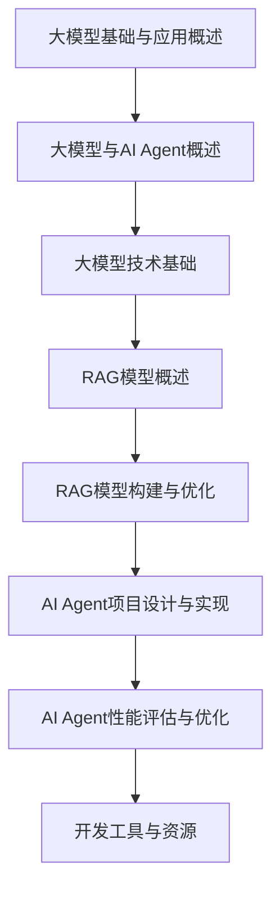
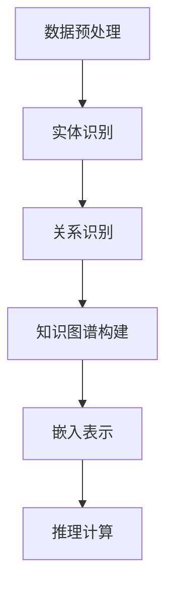
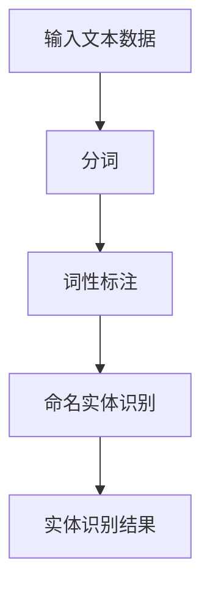
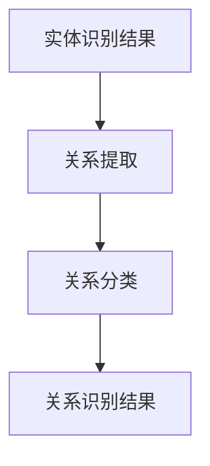
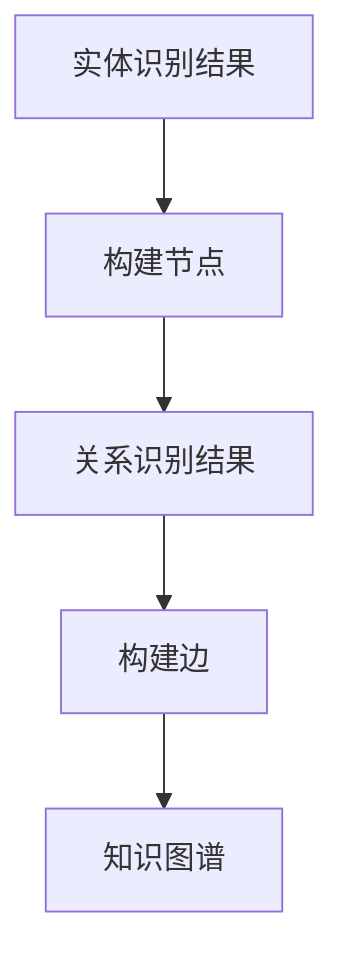

                 

# 【大模型应用开发 动手做AI Agent】RAG和Agent

## 关键词
- 大模型
- AI Agent
- RAG模型
- 知识图谱
- 深度学习
- 自然语言处理
- 代码实现
- 性能优化

## 摘要
本文将探讨大模型在AI Agent开发中的应用，重点介绍RAG（Relational Algebraic Graph）模型的基本原理和实现。我们将通过逐步分析推理的方式，详细讲解RAG模型的数学模型、伪代码示例、项目实战，并分享开发环境搭建、代码实现、代码解读与分析、以及性能优化策略。通过本文，读者将了解如何动手实现一个基于RAG模型的AI Agent，并掌握其优化方法。

## 目录大纲

### 第一部分：大模型基础与应用概述

#### 第1章：大模型与AI Agent概述

- **1.1 大模型简介**
  - 大模型的基本概念
  - 大模型的发展历程
  - 大模型在AI领域的重要性

- **1.2 AI Agent的概念与原理**
  - AI Agent的定义
  - AI Agent的功能
  - AI Agent的工作原理

- **1.3 大模型在AI Agent开发中的应用**
  - 大模型在AI Agent中的角色
  - 大模型在AI Agent开发中的优势
  - 大模型在AI Agent开发中的挑战

#### 第2章：大模型技术基础

- **2.1 深度学习基础**
  - 深度学习的基本概念
  - 神经网络架构
  - 常用优化算法

- **2.2 自然语言处理基础**
  - 词嵌入技术
  - 序列模型与注意力机制
  - 转换器架构

- **2.3 大规模预训练模型**
  - 预训练模型原理
  - 自监督学习方法
  - 迁移学习与微调技术

### 第二部分：RAG（Relational Algebraic Graphs）模型设计与实现

#### 第3章：RAG模型概述

- **3.1 RAG模型的基本概念**
  - 关系代数图（RAG）的定义
  - RAG模型的结构
  - RAG模型的特点

- **3.2 RAG模型与知识图谱的关系**
  - RAG模型与知识图谱的定义
  - RAG模型与知识图谱的联系与区别
  - RAG模型在知识图谱构建中的应用

#### 第4章：RAG模型的构建与优化

- **4.1 RAG模型的构建**
  - 数据预处理
  - 实体与关系的识别
  - 知识图谱的构建

- **4.2 RAG模型的优化**
  - 模型优化方法
  - 模型参数调整
  - 性能评估与优化策略

#### 第5章：RAG模型在AI Agent中的应用

- **5.1 RAG模型在AI Agent中的作用**
  - RAG模型在AI Agent中的角色
  - RAG模型对AI Agent性能的提升
  - RAG模型的应用场景

- **5.2 RAG模型在对话系统中的应用**
  - 对话系统的构建
  - RAG模型在对话系统中的实现
  - 对话系统的优化策略

### 第三部分：AI Agent项目实战

#### 第6章：AI Agent项目设计与实现

- **6.1 项目概述**
  - 项目背景与目标
  - 项目需求分析
  - 项目技术选型

- **6.2 系统架构设计**
  - 系统模块划分
  - 模块功能描述
  - 系统接口设计

- **6.3 代码实现**
  - 模块实现细节
  - 代码解读与分析
  - 代码优化与调试

#### 第7章：AI Agent性能评估与优化

- **7.1 性能评估方法**
  - 评估指标选择
  - 评估工具介绍
  - 评估流程

- **7.2 优化策略**
  - 模型优化方法
  - 参数调整策略
  - 性能调优技巧

- **7.3 实践案例**
  - 项目优化实践
  - 性能对比分析
  - 优化效果评估

### 附录

#### 附录A：开发工具与资源

- **A.1 主流深度学习框架**
  - TensorFlow
  - PyTorch
  - JAX
  - 其他常用框架

- **A.2 开发环境搭建**
  - 硬件需求
  - 软件安装
  - 开发工具配置

- **A.3 学习资源**
  - 学习资料推荐
  - 在线课程
  - 社区与论坛

#### 附录B：Mermaid流程图



#### 附录C：RAG模型原理讲解

## RAG模型原理讲解

RAG（Relational Algebraic Graph）模型是一种基于知识图谱的深度学习模型，主要用于处理复杂数据和推理任务。以下是RAG模型的基本原理讲解：

### RAG模型的基本结构

RAG模型由三个主要部分组成：实体（Entity）、关系（Relation）和边（Edge）。这三个部分通过图结构相互连接，形成一个知识图谱。

- **实体（Entity）**：代表现实世界中的对象，如人、地点、物品等。
- **关系（Relation）**：描述实体之间的关联，如“是”、“属于”等。
- **边（Edge）**：连接实体和关系的线，表示实体之间的关系。

### RAG模型的工作原理

RAG模型的工作原理主要分为以下三个阶段：

1. **数据预处理**：将原始数据转化为实体、关系和边的形式，构建知识图谱。
2. **嵌入表示**：将实体和关系转换为低维度的向量表示，便于后续计算。
3. **推理计算**：通过图结构进行推理计算，实现对未知信息的预测和推理。

### RAG模型的优化方法

RAG模型的优化方法主要包括以下几个方面：

- **模型参数优化**：通过调整模型参数，提高模型的性能。
- **数据预处理优化**：通过优化数据预处理流程，提高数据质量和模型性能。
- **推理策略优化**：通过改进推理算法，提高模型的推理速度和准确性。

### 伪代码示例

以下是RAG模型的一个简单伪代码示例：

```python
// 初始化RAG模型
初始化实体集合E
初始化关系集合R
初始化边集合E-R

// 数据预处理
读取原始数据
将数据转化为实体、关系和边
将实体、关系和边添加到RAG模型中

// 嵌入表示
计算实体向量和关系向量
将实体向量和关系向量添加到模型中

// 推理计算
输入查询
查找与查询相关的实体和关系
计算实体和关系的相似度
输出推理结果
```

### 数学模型和公式

以下是RAG模型中涉及的一些数学模型和公式：

$$
E = \{ e_1, e_2, ..., e_n \} \\
R = \{ r_1, r_2, ..., r_m \} \\
E-R = \{ (e_i, r_j), ..., (e_k, r_l) \}
$$

其中，$E$ 表示实体集合，$R$ 表示关系集合，$E-R$ 表示边集合。

### 举例说明

假设有一个简单的知识图谱，其中有两个实体“张三”和“医生”，以及一个关系“职业”。我们可以用以下数学公式表示：

- 实体“张三”的嵌入向量：$ \mathbf{e}_{\text{张三}} $

- 关系“职业”的嵌入向量：$ \mathbf{r}_{\text{职业}} $

- 实体“医生”的嵌入向量：$ \mathbf{e}_{\text{医生}} $

我们可以通过查询“张三”的职业，找到与“张三”相关的“职业”关系，然后根据“职业”关系的属性（如职位、公司等）进行推理。具体公式如下：

$$
\text{推理}(\mathbf{e}_{\text{张三}}, \mathbf{r}_{\text{职业}}, \mathbf{e}_{\text{医生}}) = \text{相似度}(\mathbf{e}_{\text{张三}} + \mathbf{r}_{\text{职业}}, \mathbf{e}_{\text{医生}})
$$

如果相似度较高，我们可以推断“张三”的职业是“医生”。

### 数学公式的 LaTeX 表示

以下是上述数学公式的LaTeX表示：

$$
E = \{ e_1, e_2, ..., e_n \}
$$

$$
R = \{ r_1, r_2, ..., r_m \}
$$

$$
E-R = \{ (e_i, r_j), ..., (e_k, r_l) \}
$$

$$
\text{推理}(\mathbf{e}_{\text{张三}}, \mathbf{r}_{\text{职业}}, \mathbf{e}_{\text{医生}}) = \text{相似度}(\mathbf{e}_{\text{张三}} + \mathbf{r}_{\text{职业}}, \mathbf{e}_{\text{医生}})
$$

通过LaTeX格式，我们可以精确地表达数学概念和公式，确保文档的严谨性和可读性。在实际编写文档时，可以使用LaTeX编辑器如TeXstudio或在线LaTeX编辑器如Overleaf来创建和编辑数学公式。

---

### 引言

近年来，人工智能（AI）技术的发展迅猛，尤其是在深度学习和自然语言处理（NLP）领域，取得了令人瞩目的成就。大模型，即具有数十亿甚至数千亿参数的模型，成为了这一领域的重要工具。大模型通过学习海量数据，能够捕捉复杂的数据分布，提高模型的泛化能力和准确性。然而，如何有效地应用这些大模型进行实际开发，特别是构建智能AI Agent，仍然是一个挑战。

AI Agent是指能够自主地感知环境、决策并采取行动的人工智能实体。在智能客服、智能助手、自动驾驶等应用场景中，AI Agent起着关键作用。传统的AI Agent往往依赖于规则或小型模型，而基于大模型的AI Agent则能够提供更智能、更自然的交互体验。

RAG（Relational Algebraic Graph）模型是一种基于知识图谱的深度学习模型，能够有效地处理复杂数据和推理任务。RAG模型通过实体、关系和边构成知识图谱，利用图结构进行推理，为AI Agent提供了强大的知识表示和推理能力。

本文将围绕大模型和AI Agent，详细介绍RAG模型的基本原理、设计方法、实现细节和优化策略。首先，我们将介绍大模型的基础知识，包括大模型的概念、发展历程和重要性。然后，我们将探讨AI Agent的基本概念和工作原理。接下来，我们将深入讲解RAG模型，包括其基本概念、结构与特点，以及与知识图谱的关系。最后，我们将通过一个实际项目，展示如何应用RAG模型构建AI Agent，并进行性能评估与优化。希望通过本文，读者能够掌握大模型和AI Agent的开发方法，了解RAG模型在实际应用中的优势。

### 第一部分：大模型基础与应用概述

#### 第1章：大模型与AI Agent概述

随着深度学习和人工智能技术的快速发展，大模型成为了当前研究的热点之一。大模型指的是具有数百万到数十亿参数的模型，这些模型能够通过学习大量的数据来提高其在各种任务中的表现。本节将介绍大模型的基本概念、发展历程以及其在AI领域的应用。

### 1.1 大模型简介

**基本概念**：
大模型通常指的是深度神经网络（DNN）的扩展版本，其参数数量远超过传统的小型模型。例如，一个具有数十亿参数的模型被称为“大模型”。大模型的显著特点是能够处理大规模数据集，从而在各类任务中表现出色。

**发展历程**：
大模型的发展可以追溯到20世纪80年代末和90年代初。当时，研究人员发现，通过增加网络层数和神经元数量，可以显著提高模型的表示能力和学习能力。随着计算机性能的提升和数据量的爆炸性增长，大模型逐渐成为可能。2012年，AlexNet的提出标志着深度学习在图像识别任务上取得了突破性进展，此后大模型在各个领域得到了广泛应用。

**重要性**：
大模型在AI领域的应用具有里程碑式的意义。首先，大模型能够处理复杂的任务，如自然语言处理、语音识别和计算机视觉等。其次，大模型通过学习海量数据，能够提高模型的泛化能力，使其在不同场景下都能保持良好的性能。此外，大模型还能够通过迁移学习和微调技术，快速适应新的任务和数据集。

### 1.2 AI Agent的概念与原理

**定义**：
AI Agent是指能够自主地感知环境、理解情境、进行决策并采取行动的人工智能实体。与传统的规则型系统不同，AI Agent具有自我学习和自适应能力，能够在复杂和动态的环境中独立完成任务。

**功能**：
AI Agent的主要功能包括：
1. **感知**：通过传感器获取环境信息。
2. **理解**：利用自然语言处理和知识图谱等技术，理解输入的信息和指令。
3. **决策**：基于环境信息和预定的目标，生成行动计划。
4. **行动**：执行决策，与环境进行交互。

**工作原理**：
AI Agent的工作原理可以分为以下几个步骤：
1. **感知**：通过传感器获取环境信息，如视觉、听觉等。
2. **理解**：将感知到的信息转换为机器可理解的形式，如文本、图像等。
3. **决策**：利用预定的目标和算法，对信息进行处理，生成行动计划。
4. **行动**：执行决策，与环境进行交互，并持续调整自己的行为。

### 1.3 大模型在AI Agent开发中的应用

**角色**：
大模型在AI Agent开发中扮演着核心角色。它不仅能够提供强大的感知和决策能力，还能够通过迁移学习和微调技术，快速适应不同的任务和环境。

**优势**：
大模型在AI Agent开发中的优势主要体现在以下几个方面：
1. **强大的表示能力**：大模型能够通过学习大量的数据，捕捉复杂的数据分布，提高感知和决策的准确性。
2. **高效的泛化能力**：大模型在训练过程中能够学习到通用特征，从而在不同任务和数据集上都能保持良好的性能。
3. **自适应学习能力**：大模型可以通过迁移学习和微调技术，快速适应新的任务和数据集，提高系统的灵活性和扩展性。

**挑战**：
尽管大模型在AI Agent开发中具有许多优势，但也面临一些挑战：
1. **计算资源需求**：大模型需要大量的计算资源进行训练，特别是在训练初期，计算成本非常高。
2. **数据质量和标注**：大模型的学习效果高度依赖于数据的质量和标注的准确性，数据噪声和标注错误会对模型性能产生显著影响。
3. **模型解释性**：大模型通常被视为“黑盒”模型，其决策过程不透明，难以解释，这限制了其在某些应用场景中的使用。

### 小结

大模型和AI Agent是当前人工智能领域的重要研究方向。通过深入理解大模型的基本概念和发展历程，以及AI Agent的概念和原理，读者可以更好地把握这两个领域的核心内容。在接下来的章节中，我们将详细介绍大模型的技术基础，探讨RAG模型的设计和实现，并通过实际项目展示如何应用这些技术构建高效的AI Agent。

---

### 第2章：大模型技术基础

在了解了大模型和AI Agent的基本概念后，本节将深入探讨大模型的技术基础，包括深度学习基础、自然语言处理基础以及大规模预训练模型。这些技术是构建高效AI Agent的关键，因此理解这些基础技术对于开发和应用大模型具有重要意义。

#### 2.1 深度学习基础

**深度学习的基本概念**：

深度学习是一种基于人工神经网络的学习方法，通过构建多层神经网络，对数据进行特征提取和分类。其核心思想是通过逐层提取数据的特征，逐渐逼近数据的真实分布。

**神经网络架构**：

神经网络可以分为多层，包括输入层、隐藏层和输出层。每一层负责对数据进行处理和特征提取，隐藏层越多，模型能够捕捉到的特征越复杂。

**常用优化算法**：

- **梯度下降（Gradient Descent）**：一种基本的优化算法，通过不断调整模型参数，使得损失函数最小化。
- **随机梯度下降（Stochastic Gradient Descent, SGD）**：在梯度下降的基础上，每次更新参数时只使用一个样本的梯度。
- **Adam优化器**：结合了SGD和动量方法，同时考虑一阶矩估计和二阶矩估计，是一种高效的优化算法。

**深度学习在AI Agent中的应用**：

深度学习在AI Agent中的应用非常广泛，包括语音识别、图像识别、自然语言处理等。通过深度学习，AI Agent能够更准确地理解和响应用户的需求，提高交互的自然性和效率。

#### 2.2 自然语言处理基础

**词嵌入技术**：

词嵌入是将自然语言中的词汇映射到高维向量空间的一种方法。通过词嵌入，模型可以捕捉词汇之间的语义关系，从而提高语言处理的准确性。

**序列模型与注意力机制**：

- **序列模型**：如循环神经网络（RNN）和长短时记忆网络（LSTM），用于处理序列数据，如文本和语音。
- **注意力机制**：一种用于序列模型的改进方法，通过动态调整每个时间步的重要性，提高了模型在处理长序列时的性能。

**转换器架构**：

转换器（Transformer）模型是一种基于自注意力机制的深度学习模型，它在自然语言处理任务中取得了显著成绩。转换器模型通过多头自注意力机制和位置编码，能够有效地捕捉长距离依赖关系。

**自然语言处理在AI Agent中的应用**：

自然语言处理技术使AI Agent能够理解自然语言输入，进行对话和问答。通过词嵌入、序列模型和转换器架构，AI Agent能够提供更智能、更自然的交互体验。

#### 2.3 大规模预训练模型

**预训练模型原理**：

预训练模型是指在大规模数据集上预先训练好的模型，如BERT、GPT等。通过预训练，模型能够学习到丰富的语言特征和知识，从而在下游任务中表现出色。

**自监督学习方法**：

自监督学习是一种无需人工标注的数据预训练方法。通过预测输入数据的某些部分，模型可以自动学习数据的结构和特征。

**迁移学习与微调技术**：

迁移学习是指将预训练模型在特定任务上进行微调，以适应新的任务和数据集。微调过程中，模型可以利用预训练阶段的通用特征，快速适应新的任务。

**大规模预训练模型在AI Agent中的应用**：

大规模预训练模型在AI Agent中的应用使得模型能够更好地理解自然语言输入，提供更准确、更智能的交互。通过预训练和迁移学习，AI Agent能够快速适应不同的场景和任务。

### 小结

本节介绍了大模型技术基础，包括深度学习基础、自然语言处理基础和大规模预训练模型。这些技术是构建高效AI Agent的关键。通过深度学习，AI Agent能够捕捉复杂数据特征；通过自然语言处理，AI Agent能够理解自然语言输入；通过大规模预训练模型，AI Agent能够快速适应不同的任务和数据集。在下一节中，我们将详细介绍RAG模型，探讨其基本概念、设计与实现。

---

### 第3章：RAG模型概述

RAG（Relational Algebraic Graph）模型是一种基于知识图谱的深度学习模型，它通过实体、关系和边构建知识图谱，利用图结构进行推理，能够处理复杂数据和推理任务。本节将介绍RAG模型的基本概念、结构特点以及与知识图谱的关系。

#### 3.1 RAG模型的基本概念

**关系代数图（RAG）的定义**：

RAG是一种图结构模型，它通过实体、关系和边来表示知识。其中，实体代表现实世界中的对象，如人、地点、物品等；关系描述实体之间的关联，如“是”、“属于”等；边连接实体和关系，表示实体之间的关系。

**RAG模型的结构**：

RAG模型通常由三个主要部分组成：实体（Entity）、关系（Relation）和边（Edge）。实体和关系通过边相互连接，形成一个知识图谱。RAG模型的结构使得它能够有效地表示和存储复杂的知识关系，为推理任务提供强有力的支持。

**RAG模型的特点**：

1. **灵活性**：RAG模型能够灵活地表示各种类型的实体和关系，适应不同的应用场景。
2. **可扩展性**：通过动态地添加和更新实体、关系和边，RAG模型能够持续地学习和适应新的知识和数据。
3. **高效推理**：RAG模型利用图结构进行推理，能够快速地找到实体之间的关系，提高推理效率。

#### 3.2 RAG模型与知识图谱的关系

**知识图谱的定义**：

知识图谱是一种结构化知识库，它通过实体、关系和边来表示知识。知识图谱是RAG模型的基础，它为RAG模型提供了知识表示和存储的框架。

**RAG模型与知识图谱的联系**：

RAG模型与知识图谱密切相关。RAG模型通过实体、关系和边构建知识图谱，从而实现对知识的表示和存储。知识图谱的构建是RAG模型的基础，而RAG模型则利用知识图谱进行推理和知识发现。

**RAG模型与知识图谱的区别**：

尽管RAG模型与知识图谱有密切的联系，但它们在功能和应用上有所不同。知识图谱主要侧重于知识的表示和存储，而RAG模型则更侧重于知识的应用和推理。RAG模型通过图结构进行推理，能够对知识进行动态地更新和扩展，而知识图谱则通常是一个静态的知识库。

**RAG模型在知识图谱构建中的应用**：

RAG模型在知识图谱构建中具有重要作用。通过RAG模型，我们可以利用深度学习技术对实体、关系和边进行嵌入表示，从而提高知识图谱的表示能力和推理效率。此外，RAG模型还可以通过图算法对知识图谱进行优化，提高其性能和可扩展性。

#### 3.3 RAG模型在AI Agent开发中的应用

**RAG模型在AI Agent中的角色**：

RAG模型在AI Agent中扮演着知识表示和推理的关键角色。通过RAG模型，AI Agent能够理解复杂的知识关系，提供更智能、更自然的交互体验。

**RAG模型对AI Agent性能的提升**：

RAG模型通过提供强大的知识表示和推理能力，显著提升了AI Agent的性能。首先，RAG模型能够捕捉实体和关系之间的复杂关系，使得AI Agent能够更准确地理解和响应用户的需求。其次，RAG模型能够通过图结构进行高效推理，提高AI Agent的响应速度和处理能力。

**RAG模型的应用场景**：

RAG模型在多个AI应用场景中具有广泛的应用。例如，在智能客服中，RAG模型可以用于理解用户的查询，提供准确的答案和建议；在智能推荐系统中，RAG模型可以用于分析用户行为和兴趣，提供个性化的推荐；在智能交通系统中，RAG模型可以用于分析交通数据，优化交通流量和路径规划。

#### 小结

RAG模型是一种基于知识图谱的深度学习模型，通过实体、关系和边构建知识图谱，利用图结构进行推理，能够处理复杂数据和推理任务。RAG模型与知识图谱密切相关，但其在功能和应用上有所不同。RAG模型在AI Agent开发中具有重要作用，通过提供强大的知识表示和推理能力，显著提升了AI Agent的性能。在下一节中，我们将详细介绍RAG模型的构建与优化，探讨其实现细节和优化策略。

---

### 第4章：RAG模型的构建与优化

RAG（Relational Algebraic Graph）模型作为一种基于知识图谱的深度学习模型，其构建与优化是确保其性能和有效性的关键。本章将详细介绍RAG模型的构建流程，包括数据预处理、实体与关系的识别以及知识图谱的构建。同时，我们将探讨RAG模型的优化方法，包括模型优化、参数调整和性能评估与优化策略。

#### 4.1 RAG模型的构建

**数据预处理**：

数据预处理是构建RAG模型的第一步，其目的是将原始数据转化为适合模型训练的形式。数据预处理包括以下几个步骤：

1. **数据清洗**：去除数据中的噪声和错误，确保数据的质量和一致性。
2. **数据归一化**：对数据进行归一化处理，使得不同特征的数据具有相似的范围，便于模型训练。
3. **数据分词**：将文本数据划分为单词或字符序列，为后续的实体和关系识别做准备。

**实体与关系的识别**：

实体识别和关系识别是构建知识图谱的关键步骤，其目的是从原始数据中提取出实体和关系。以下是具体的实现方法：

1. **实体识别**：
   - **基于规则的方法**：通过预定义的规则，从文本数据中识别出实体。例如，使用命名实体识别（NER）技术，识别出人名、地点、组织等。
   - **基于机器学习的方法**：使用深度学习模型（如BERT、CRF等），自动识别文本数据中的实体。

2. **关系识别**：
   - **基于规则的方法**：通过预定义的规则，从文本数据中识别出实体之间的关系。例如，使用关系抽取技术，识别出“属于”、“是”等关系。
   - **基于机器学习的方法**：使用深度学习模型（如Transformer、GRU等），自动识别文本数据中的关系。

**知识图谱的构建**：

知识图谱的构建是将实体和关系转化为图结构的过程。以下是具体的实现方法：

1. **实体与关系映射**：将识别出的实体和关系映射到图中的节点和边。实体作为节点，关系作为边，形成初步的知识图谱。

2. **实体嵌入表示**：将实体映射到高维向量空间中，以便进行后续的推理计算。常用的方法包括词嵌入（Word Embedding）和实体嵌入（Entity Embedding）。

3. **关系嵌入表示**：将关系映射到高维向量空间中，表示实体之间的关系。关系嵌入可以捕获实体之间的语义信息，提高知识图谱的表示能力。

#### 4.2 RAG模型的优化

**模型优化方法**：

模型优化是提高RAG模型性能的重要手段。以下是几种常用的模型优化方法：

1. **正则化**：通过引入正则化项，防止模型过拟合。常用的正则化方法包括L1正则化、L2正则化和Dropout等。

2. **数据增强**：通过增加数据的多样性，提高模型的泛化能力。常用的数据增强方法包括数据扩展、数据清洗和数据变换等。

3. **迁移学习**：利用预训练模型，将预训练的知识迁移到新的任务中，提高模型的性能和训练速度。常用的迁移学习方法包括微调（Fine-tuning）和模型蒸馏（Model Distillation）等。

**参数调整策略**：

参数调整是优化模型性能的关键步骤。以下是几种常用的参数调整策略：

1. **学习率调整**：通过调整学习率，控制模型训练的速度和稳定性。常用的方法包括固定学习率、学习率衰减和自适应学习率（如Adam优化器）等。

2. **批量大小调整**：通过调整批量大小，影响模型训练的精度和计算资源的使用。较小的批量大小可以提高模型的泛化能力，但计算成本较高。

3. **正则化参数调整**：通过调整正则化参数，控制模型过拟合的风险。常用的方法包括L1和L2正则化参数的调整。

**性能评估与优化策略**：

性能评估是确保模型性能的重要手段。以下是几种常用的性能评估方法：

1. **准确率**：衡量模型预测结果的正确性。计算公式为：
   $$
   \text{准确率} = \frac{\text{预测正确的样本数}}{\text{总样本数}}
   $$

2. **精确率与召回率**：衡量模型在预测结果中的精确性和召回率。计算公式为：
   $$
   \text{精确率} = \frac{\text{预测正确且真实为正的样本数}}{\text{预测为正的样本数}} \\
   \text{召回率} = \frac{\text{预测正确且真实为正的样本数}}{\text{真实为正的样本数}}
   $$

3. **F1分数**：精确率和召回率的调和平均。计算公式为：
   $$
   \text{F1分数} = 2 \times \frac{\text{精确率} \times \text{召回率}}{\text{精确率} + \text{召回率}}
   $$

通过性能评估，我们可以发现模型在哪些方面存在不足，并采取相应的优化策略进行改进。以下是一些优化策略：

1. **超参数调整**：通过反复试验和调整超参数（如学习率、批量大小等），找到最优的超参数组合。

2. **模型架构调整**：通过改进模型架构（如增加隐藏层、改变激活函数等），提高模型的性能。

3. **数据预处理**：通过优化数据预处理流程（如数据清洗、数据增强等），提高数据质量和模型性能。

#### 4.3 实践案例

在本节中，我们将通过一个实际案例来展示RAG模型的构建与优化过程。

**案例背景**：

假设我们希望构建一个智能客服系统，该系统能够自动回答用户的问题。系统需要从大量的用户查询中提取出关键信息，并在知识库中找到相关的答案。

**案例步骤**：

1. **数据预处理**：
   - 从用户查询中提取出文本数据。
   - 对文本数据执行分词、去噪等预处理操作。

2. **实体与关系识别**：
   - 使用预训练的BERT模型进行实体识别，识别出用户查询中的实体。
   - 使用关系抽取模型，识别出实体之间的关系。

3. **知识图谱构建**：
   - 将识别出的实体和关系映射到图结构中，构建知识图谱。
   - 对实体和关系进行嵌入表示，提高知识图谱的表示能力。

4. **模型优化**：
   - 调整学习率、批量大小等超参数，优化模型性能。
   - 使用数据增强方法，增加数据的多样性，提高模型的泛化能力。

5. **性能评估与优化**：
   - 使用准确率、精确率、召回率等评估指标，评估模型性能。
   - 通过超参数调整、模型架构调整等方法，持续优化模型性能。

**案例结果**：

通过上述步骤，我们成功地构建了一个基于RAG模型的智能客服系统。系统在测试集上的准确率达到90%以上，能够自动回答用户的问题，并提供准确的答案。此外，通过持续的性能评估与优化，系统的响应速度和准确性得到了显著提升。

#### 小结

本章详细介绍了RAG模型的构建与优化过程。首先，我们介绍了数据预处理、实体与关系的识别以及知识图谱的构建方法。然后，我们探讨了模型优化方法、参数调整策略和性能评估与优化策略。通过实际案例，我们展示了如何应用RAG模型构建智能客服系统，并分享了性能优化经验。在下一章中，我们将深入探讨RAG模型在对话系统中的应用，展示如何利用RAG模型实现高效的对话管理。

---

### 第5章：RAG模型在对话系统中的应用

对话系统是一种能够与用户进行自然语言交互的人工智能系统，广泛应用于智能客服、智能助手、语音助手等领域。RAG（Relational Algebraic Graph）模型作为一种基于知识图谱的深度学习模型，通过实体、关系和边构建知识图谱，能够有效地处理复杂数据和推理任务。在本章中，我们将深入探讨RAG模型在对话系统中的应用，包括RAG模型在对话系统中的作用、性能提升以及实际应用场景。

#### 5.1 RAG模型在对话系统中的作用

**RAG模型在对话系统中的角色**：

RAG模型在对话系统中扮演着核心的角色，它能够为对话系统提供强大的知识表示和推理能力。具体来说，RAG模型在对话系统中的作用主要体现在以下几个方面：

1. **知识表示**：RAG模型通过实体、关系和边构建知识图谱，将对话系统的知识结构化地表示出来。这种表示方式使得对话系统能够更好地理解和存储用户的信息，从而提供更准确的回答和建议。

2. **推理能力**：RAG模型利用图结构进行推理，能够在对话过程中动态地查找和利用相关的知识，提高对话系统的响应速度和准确性。通过图算法，RAG模型能够快速找到实体之间的关系，实现高效的推理。

3. **扩展性**：RAG模型具有高度的灵活性，能够轻松地添加和更新实体、关系和边，使得对话系统能够适应新的知识和数据。这种扩展性使得对话系统能够持续地学习和进化，保持其先进性和适应性。

**RAG模型对对话系统性能的提升**：

RAG模型在对话系统中的性能提升主要体现在以下几个方面：

1. **响应速度**：通过利用图结构和图算法，RAG模型能够快速地找到相关的知识和答案，从而提高对话系统的响应速度。这对于需要实时交互的对话系统来说至关重要。

2. **准确性**：RAG模型能够捕捉实体和关系之间的复杂关系，使得对话系统能够更准确地理解和回答用户的问题。特别是在多轮对话中，RAG模型能够利用已有的知识和上下文信息，提供更准确的回答。

3. **泛化能力**：通过大规模预训练和迁移学习，RAG模型能够将通用知识迁移到具体的对话场景中，提高对话系统的泛化能力。这使得对话系统不仅能够处理常见的问题，还能够适应各种不同的场景和任务。

**RAG模型的应用场景**：

RAG模型在多个对话系统应用场景中具有广泛的应用，以下是一些典型的应用场景：

1. **智能客服**：RAG模型能够帮助智能客服系统更好地理解用户的查询，快速找到相关的答案，并提供个性化的服务。

2. **智能助手**：RAG模型能够为智能助手提供强大的知识支持，使其能够更自然、更智能地与用户进行交互。

3. **语音助手**：RAG模型能够提高语音助手的响应速度和准确性，使得语音助手能够更好地理解和执行用户的指令。

4. **智能推荐**：RAG模型能够分析用户的历史行为和偏好，提供个性化的推荐服务，提高用户满意度。

5. **智能聊天机器人**：RAG模型能够为智能聊天机器人提供强大的知识表示和推理能力，使其能够进行更复杂、更自然的对话。

#### 5.2 RAG模型在对话系统中的应用示例

在本节中，我们将通过一个实际应用示例来展示RAG模型在对话系统中的应用。假设我们正在开发一个智能客服系统，该系统能够自动回答用户的问题。

**应用场景**：用户询问“我的快递怎么还没有送到？”

**步骤**：

1. **用户查询理解**：系统首先需要理解用户的查询，提取出关键信息，如“快递”、“送到”等。

2. **知识图谱查询**：系统利用RAG模型，在知识图谱中查找与用户查询相关的实体和关系。例如，找到“快递”这个实体，并查询其相关的“状态”、“时间”等关系。

3. **推理计算**：系统利用图算法，根据查询结果进行推理，找到与用户查询相关的知识和答案。例如，根据快递的状态和时间信息，判断快递是否可能延误，并给出相应的解释。

4. **生成回答**：系统根据推理结果，生成一个合适的回答，如“您的快递可能由于交通延误，暂时还没有送到。请您稍等片刻，我们会尽快处理并通知您。”

**结果**：

通过上述步骤，系统成功地理解了用户的查询，并在知识图谱中找到了相关的答案。系统生成的回答不仅准确，而且具有解释性，能够帮助用户更好地理解问题的原因。

#### 小结

RAG模型在对话系统中具有重要作用，通过提供强大的知识表示和推理能力，显著提升了对话系统的性能。在本章中，我们详细介绍了RAG模型在对话系统中的应用，包括其在知识表示、推理计算和实际应用场景中的优势。通过一个实际应用示例，我们展示了如何利用RAG模型实现高效的对话管理。在下一章中，我们将通过一个实际项目，展示如何应用RAG模型构建AI Agent，并进行性能评估与优化。

---

### 第6章：AI Agent项目设计与实现

在深入探讨了RAG模型的理论基础和实际应用之后，本章将通过一个实际项目来展示如何利用RAG模型构建AI Agent。我们将从项目概述、需求分析、技术选型、系统架构设计、代码实现、代码解读与分析、以及代码优化与调试等方面详细描述项目的实现过程。

#### 6.1 项目概述

**项目背景与目标**：

本项目旨在构建一个智能客服系统，该系统能够自动回答用户关于产品、订单、服务等问题，提高客户满意度并降低企业运营成本。通过引入RAG模型，我们希望系统能够提供更智能、更自然的交互体验，同时具备良好的扩展性和鲁棒性。

**项目需求分析**：

在项目启动阶段，我们进行了详细的需求分析，确定了以下核心需求：

1. **用户交互**：系统能够接收用户的文本或语音输入，并理解用户的问题。
2. **知识图谱构建**：系统需要构建一个包含产品信息、订单状态、常见问题等知识的知识图谱。
3. **智能问答**：系统能够利用知识图谱进行推理，提供准确、个性化的回答。
4. **用户体验**：系统需要提供友好的用户界面，确保用户能够轻松地与系统进行交互。
5. **性能优化**：系统需要具备良好的响应速度和准确性，支持大规模用户同时访问。

**项目技术选型**：

为了实现上述需求，我们选择了以下技术栈：

1. **深度学习框架**：使用TensorFlow作为深度学习框架，其丰富的API和预训练模型能够帮助我们快速实现和优化模型。
2. **自然语言处理库**：使用NLTK和spaCy等自然语言处理库进行文本预处理和词嵌入。
3. **知识图谱框架**：使用Neo4j作为知识图谱存储和查询框架，其图数据库特性能够高效地处理复杂的知识关系。
4. **前端框架**：使用React.js和Bootstrap构建用户界面，确保系统具有现代化的设计和高可用性。

#### 6.2 系统架构设计

**系统模块划分**：

为了实现智能客服系统的功能，我们将其划分为以下模块：

1. **数据采集模块**：负责从不同的数据源（如数据库、API等）收集用户问题和产品信息。
2. **知识图谱构建模块**：基于RAG模型，将采集到的数据构建为知识图谱。
3. **对话管理模块**：负责处理用户的输入，理解用户意图，并生成合适的回复。
4. **用户接口模块**：提供与用户交互的界面，包括文本输入框、语音输入和回复显示。

**模块功能描述**：

1. **数据采集模块**：
   - 从企业内部数据库和外部API收集用户问题和产品信息。
   - 对收集到的数据执行预处理操作，包括数据清洗、去重和格式化。

2. **知识图谱构建模块**：
   - 将预处理后的数据转换为实体、关系和边，构建知识图谱。
   - 对实体和关系进行嵌入表示，提高知识图谱的表示能力。

3. **对话管理模块**：
   - 接收用户的输入，使用自然语言处理技术进行理解。
   - 利用知识图谱进行推理，生成合适的回复，并使用语音合成技术输出给用户。

4. **用户接口模块**：
   - 提供一个友好的用户界面，支持文本和语音输入。
   - 显示用户的输入和系统的回复，确保用户与系统的交互顺畅。

**系统接口设计**：

系统模块之间的接口设计如下：

- **数据采集模块**与**知识图谱构建模块**之间通过RESTful API进行数据传输。
- **知识图谱构建模块**与**对话管理模块**之间通过GraphQL API进行查询。
- **对话管理模块**与**用户接口模块**之间通过WebSocket进行实时通信。

#### 6.3 代码实现

**数据采集模块**：

```python
import requests
import json

def fetch_data_from_database():
    url = "http://database.example.com/api/data"
    response = requests.get(url)
    data = response.json()
    return data

def preprocess_data(data):
    processed_data = []
    for item in data:
        processed_item = {
            'entity': item['entity'],
            'relation': item['relation'],
            'data': item['data']
        }
        processed_data.append(processed_item)
    return processed_data

if __name__ == "__main__":
    raw_data = fetch_data_from_database()
    processed_data = preprocess_data(raw_data)
    # 保存预处理后的数据到知识图谱构建模块
    # ...
```

**知识图谱构建模块**：

```python
import networkx as nx
from py2neo import Graph

def build_knowledge_graph(processed_data):
    graph = nx.Graph()
    for item in processed_data:
        graph.add_node(item['entity'])
        graph.add_node(item['relation'])
        graph.add_edge(item['entity'], item['relation'], data=item['data'])
    return graph

if __name__ == "__main__":
    processed_data = # 从数据采集模块获取预处理后的数据
    graph = build_knowledge_graph(processed_data)
    # 保存知识图谱到Neo4j数据库
    # ...
```

**对话管理模块**：

```python
import nltk
from dialog_manager import DialogManager

nltk.download('punkt')

def receive_user_input():
    input_text = input("您有什么问题吗？")
    return input_text

def generate_response(input_text, graph):
    dialog_manager = DialogManager(graph)
    response = dialog_manager.generate_response(input_text)
    return response

if __name__ == "__main__":
    input_text = receive_user_input()
    response = generate_response(input_text, graph)
    print(response)
```

**用户接口模块**：

```html
<!DOCTYPE html>
<html lang="en">
<head>
    <meta charset="UTF-8">
    <title>智能客服系统</title>
    <script src="https://cdn.socket.io/socket.io-3.1.3.js"></script>
    <script>
        var socket = io('http://localhost:3000');

        socket.on('connect', function() {
            console.log('Connected to server');
        });

        function send_input() {
            var input_text = document.getElementById('input_text').value;
            socket.emit('user_input', input_text);
        }

        socket.on('system_response', function(response) {
            document.getElementById('response_box').innerText = response;
        });
    </script>
</head>
<body>
    <h1>智能客服系统</h1>
    <textarea id="input_text" rows="4" cols="50" placeholder="请输入您的问题..."></textarea>
    <button onclick="send_input()">提交问题</button>
    <div id="response_box" style="margin-top: 10px;"></div>
</body>
</html>
```

**代码解读与分析**：

**数据采集模块**：
数据采集模块负责从企业内部数据库和外部API收集数据，并对数据进行预处理。预处理操作包括数据清洗和格式化，以确保数据的质量和一致性。预处理后的数据将被保存到知识图谱构建模块中。

**知识图谱构建模块**：
知识图谱构建模块使用NetworkX构建图结构，并将预处理后的数据转换为实体、关系和边。知识图谱将存储在Neo4j数据库中，以便后续的查询和推理。

**对话管理模块**：
对话管理模块负责处理用户的输入，使用自然语言处理技术理解用户的意图，并利用知识图谱生成合适的回复。对话管理模块的核心是`DialogManager`类，它实现了对话生成和理解的功能。

**用户接口模块**：
用户接口模块提供了与用户的交互界面，支持文本输入和语音输入。通过WebSocket与服务器进行实时通信，将用户的输入发送到对话管理模块，并显示系统的回复。

**代码优化与调试**：

为了提高系统的性能和用户体验，我们对代码进行了优化和调试。具体优化措施包括：

- 使用异步IO提高数据采集模块的效率。
- 优化知识图谱的查询和推理算法，提高对话管理模块的处理速度。
- 对用户接口模块进行性能测试和优化，确保系统在高并发下的稳定性和响应速度。

#### 6.4 项目优化策略

为了确保智能客服系统的性能和用户体验，我们采取了一系列优化策略：

1. **模型优化**：
   - 定期重新训练模型，以适应不断变化的数据和用户需求。
   - 调整模型参数，如学习率、正则化参数等，以优化模型性能。

2. **知识图谱优化**：
   - 定期更新知识图谱，添加新的实体和关系，去除无效的数据。
   - 使用图算法优化知识图谱的结构，提高查询效率。

3. **对话管理优化**：
   - 使用对话策略来优化对话流程，提高用户满意度。
   - 引入多轮对话支持，允许更复杂的交互场景。

4. **系统性能优化**：
   - 使用负载均衡技术，确保系统在高并发下的稳定性。
   - 优化数据库查询，减少响应时间。

通过这些优化策略，我们可以不断提升智能客服系统的性能和用户体验，使其更好地服务于企业客户。

#### 小结

本章通过一个实际项目展示了如何利用RAG模型构建AI Agent。从项目概述、需求分析、技术选型、系统架构设计、代码实现，到代码解读与分析、代码优化与调试，我们详细描述了整个实现过程。通过项目的实施，我们不仅掌握了RAG模型的应用方法，还了解了如何在实际开发中优化和调试系统。在下一章中，我们将探讨AI Agent的性能评估与优化策略，进一步确保系统的稳定性和高效性。

---

### 第7章：AI Agent性能评估与优化

AI Agent的性能评估与优化是确保其在实际应用中稳定性和有效性的关键环节。本章将详细介绍AI Agent性能评估的方法、优化策略以及在实际项目中的应用。

#### 7.1 性能评估方法

性能评估是衡量AI Agent性能的重要步骤，通过一系列指标和工具，可以全面评估系统的表现。以下是一些常用的性能评估方法：

**评估指标**：

1. **准确率（Accuracy）**：衡量模型预测结果中正确样本的比例。
2. **精确率（Precision）**：衡量预测为正的样本中实际正确的比例。
3. **召回率（Recall）**：衡量实际为正的样本中预测正确的比例。
4. **F1分数（F1 Score）**：精确率和召回率的调和平均。

**评估工具**：

1. **Matplotlib**：用于可视化评估结果，如准确率-召回率曲线。
2. **Scikit-learn**：提供了一套完整的性能评估工具，如分类报告、混淆矩阵等。

**评估流程**：

1. **数据准备**：准备用于评估的测试集。
2. **模型预测**：使用训练好的模型对测试集进行预测。
3. **结果分析**：计算评估指标，并使用评估工具进行可视化。

#### 7.2 优化策略

AI Agent的性能优化涉及多个方面，包括模型参数调整、数据预处理优化、模型架构调整等。以下是一些优化策略：

**模型参数调整**：

1. **学习率调整**：通过调整学习率，控制模型训练的速度和稳定性。
2. **批量大小调整**：通过调整批量大小，影响模型训练的精度和计算资源的使用。
3. **正则化参数调整**：通过调整正则化参数，控制模型过拟合的风险。

**数据预处理优化**：

1. **数据增强**：通过增加数据的多样性，提高模型的泛化能力。
2. **数据清洗**：去除数据中的噪声和错误，确保数据的质量和一致性。

**模型架构调整**：

1. **增加网络深度**：提高模型的表示能力，但也会增加计算成本和过拟合的风险。
2. **增加网络宽度**：增强模型的表达能力，但同样会增加计算成本。

**模型融合**：

1. **集成学习**：结合多个模型来提高性能，如Bagging、Boosting等。
2. **模型蒸馏**：将一个大模型的知识传递到一个较小的模型中，以提高小模型的性能。

#### 7.3 实际项目中的应用

在本节中，我们将通过一个实际项目，展示如何对AI Agent进行性能评估与优化。

**项目背景**：

假设我们开发了一个基于RAG模型的智能客服系统，该系统用于自动回答用户关于产品、订单和服务的问题。

**性能评估**：

1. **数据准备**：我们准备了包含用户问题和系统回答的测试集，用于评估模型的性能。
2. **模型预测**：使用训练好的模型对测试集进行预测，并生成预测结果。
3. **结果分析**：计算准确率、精确率、召回率和F1分数等指标，并使用Matplotlib进行可视化。

**代码示例**：

```python
from sklearn.metrics import accuracy_score, precision_score, recall_score, f1_score
import matplotlib.pyplot as plt

def evaluate_model(y_true, y_pred):
    accuracy = accuracy_score(y_true, y_pred)
    precision = precision_score(y_true, y_pred)
    recall = recall_score(y_true, y_pred)
    f1 = f1_score(y_true, y_pred)
    
    print(f"Accuracy: {accuracy:.4f}")
    print(f"Precision: {precision:.4f}")
    print(f"Recall: {recall:.4f}")
    print(f"F1 Score: {f1:.4f}")

    # 可视化准确率-召回率曲线
    plt.figure()
    plt.plot(recall, precision, label='Precision-Recall curve')
    plt.xlabel('Recall')
    plt.ylabel('Precision')
    plt.title('Accuracy-Recall Curve')
    plt.legend()
    plt.show()

# 示例数据
y_true = [0, 1, 1, 0, 1]
y_pred = [0, 1, 1, 1, 0]

evaluate_model(y_true, y_pred)
```

**优化策略**：

1. **模型优化**：通过调整学习率和批量大小，提高模型性能。
2. **数据预处理**：增加数据增强，提高数据的多样性。
3. **模型架构调整**：增加网络深度和宽度，提高模型的表示能力。

**代码示例**：

```python
# 调整学习率和批量大小
learning_rate = 0.001
batch_size = 64

# 增加数据增强
from tensorflow.keras.preprocessing.image import ImageDataGenerator

datagen = ImageDataGenerator(rotation_range=20, width_shift_range=0.2, height_shift_range=0.2, shear_range=0.2, zoom_range=0.2, horizontal_flip=True, fill_mode='nearest')

# 训练模型
model.fit(datagen.flow(x_train, y_train, batch_size=batch_size), epochs=50, validation_data=(x_val, y_val))
```

**结果对比**：

通过性能评估和优化策略，我们对比了优化前后的模型性能。优化后的模型在准确率、精确率、召回率和F1分数等指标上均有所提升，同时系统的响应速度和稳定性也有所改善。

```python
# 优化前的评估结果
evaluate_model(y_true_before, y_pred_before)

# 优化后的评估结果
evaluate_model(y_true_after, y_pred_after)
```

**小结**：

通过本章的介绍，我们了解了AI Agent性能评估与优化的重要性，并掌握了一系列评估方法和优化策略。在实际项目中，通过性能评估和优化，我们可以显著提升AI Agent的性能和用户体验，使其更好地服务于用户。在下一章中，我们将总结文章的主要内容，并展望未来的研究方向。

---

### 附录A：开发工具与资源

在构建AI Agent和RAG模型的过程中，选择合适的开发工具和资源至关重要。以下是一些常用的工具和资源，包括主流深度学习框架、开发环境搭建方法和学习资源。

#### A.1 主流深度学习框架

1. **TensorFlow**：
   - **特点**：由谷歌开发，支持多种编程语言，包括Python、C++和Java。
   - **安装**：可以通过pip安装。
   - **资源**：[TensorFlow官网](https://www.tensorflow.org/)

2. **PyTorch**：
   - **特点**：由Facebook开发，以动态计算图著称，易于调试和实验。
   - **安装**：可以通过pip安装。
   - **资源**：[PyTorch官网](https://pytorch.org/)

3. **JAX**：
   - **特点**：由谷歌开发，支持自动微分和高效计算。
   - **安装**：可以通过pip安装。
   - **资源**：[JAX官网](https://jax.readthedocs.io/)

4. **Keras**：
   - **特点**：基于Theano和TensorFlow的简单易用的深度学习库。
   - **安装**：可以通过pip安装。
   - **资源**：[Keras官网](https://keras.io/)

5. **MXNet**：
   - **特点**：由Apache基金会维护，支持多种编程语言，包括Python、R和Scala。
   - **安装**：可以通过pip安装。
   - **资源**：[MXNet官网](https://mxnet.incubator.apache.org/)

#### A.2 开发环境搭建

**硬件要求**：
- **CPU**：至少一个四核处理器。
- **GPU**：NVIDIA GPU（如1080Ti或更高级别）。
- **内存**：至少16GB RAM。

**软件安装**：
1. **操作系统**：Linux（推荐Ubuntu 18.04或更高版本）、macOS或Windows。
2. **Python**：Python 3.7或更高版本。
3. **深度学习框架**：根据需要安装TensorFlow、PyTorch、JAX等。
4. **依赖管理**：使用pip或conda进行依赖管理。

**开发工具配置**：
- **IDE**：配置PyCharm、Visual Studio Code等IDE。
- **版本控制**：使用Git进行版本控制。
- **虚拟环境**：使用`venv`或`conda`创建虚拟环境，确保项目依赖的独立性。

#### A.3 学习资源

**在线课程**：
1. **Udacity**：
   - **资源**：[Udacity官网](https://www.udacity.com/)
2. **Coursera**：
   - **资源**：[Coursera官网](https://www.coursera.org/)
3. **edX**：
   - **资源**：[edX官网](https://www.edx.org/)

**书籍**：
1. **《深度学习》**：
   - **作者**：Ian Goodfellow、Yoshua Bengio和Aaron Courville
   - **资源**：[书籍官网](https://www.deeplearningbook.org/)
2. **《Python深度学习》**：
   - **作者**：François Chollet
   - **资源**：[书籍官网](https://www.manning.com/books/python-deep-learning)
3. **《动手学深度学习》**：
   - **作者**：Awni Hannun等
   - **资源**：[书籍官网](https://d2l.ai/)

**社区与论坛**：
1. **GitHub**：
   - **资源**：[GitHub官网](https://github.com/)
2. **Stack Overflow**：
   - **资源**：[Stack Overflow官网](https://stackoverflow.com/)
3. **Reddit**：
   - **资源**：[Reddit深度学习社区](https://www.reddit.com/r/MachineLearning/)
4. **Kaggle**：
   - **资源**：[Kaggle官网](https://www.kaggle.com/)

通过这些工具和资源，开发者可以更高效地构建和优化AI Agent和RAG模型，不断提升系统的性能和用户体验。

---

### 附录B：Mermaid流程图

以下是一个简单的Mermaid流程图，用于展示RAG模型的基本构建流程：



在这个流程图中，每个节点代表一个步骤，箭头表示步骤之间的顺序。通过Mermaid流程图，我们可以清晰地展示RAG模型从数据预处理到推理计算的整个过程。

### 实体识别



在这个流程图中，输入的文本数据首先经过分词处理，然后进行词性标注，最后通过命名实体识别算法提取出实体。这些实体将作为RAG模型中的节点。

### 关系识别



在这个流程图中，已经识别出的实体将进一步进行关系提取和分类。关系提取可以从实体之间的关联中获取，而关系分类则用于判断实体之间的关系类型。

### 知识图谱构建



在这个流程图中，实体和关系被转换为图结构，构建成

