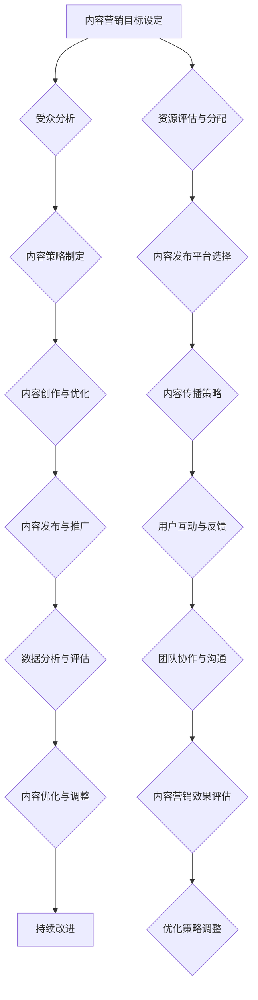

                 

# 一人公司如何利用内容营销建立行业影响力

## 概述

内容营销作为一种高效的营销策略，正日益受到企业的重视。特别是在一人公司这种规模较小、资源有限的企业中，内容营销可以成为建立行业影响力的重要手段。本文将围绕一人公司如何利用内容营销建立行业影响力这一主题，详细探讨内容营销的基础知识、策略制定、内容创作与优化、数据分析与性能优化，以及内容营销的持续发展与创新。

本文将分为四个部分：

1. **内容营销基础**：介绍内容营销的概念、重要性、与传统营销的区别、行业影响力建立的理论与实践。
2. **内容营销策略与执行**：探讨内容营销策略的制定、受众分析、渠道选择、内容创作原则、内容优化策略，并分享成功案例。
3. **数据驱动的内容营销**：介绍数据分析在内容营销中的应用、内容营销性能评估、优化策略与持续改进。
4. **内容营销的持续发展与创新**：讨论内容营销团队建设、创新思维与方法、内容营销的未来展望。

通过本文的详细讲解，希望读者能够掌握内容营销的核心要义，并能够将其应用于一人公司的实际运营中，建立强大的行业影响力。

## 目录大纲

### 第一部分：内容营销基础

- **第1章：内容营销概述**
  - 1.1 内容营销的概念与重要性
  - 1.2 内容营销与传统营销的区别与联系
  - 1.3 行业影响力建立的理论与实践

- **第2章：内容营销策略制定**
  - 2.1 内容营销目标设定
  - 2.2 内容营销受众分析
  - 2.3 内容营销渠道选择

- **第3章：内容创作与优化**
  - 3.1 内容创作原则
  - 3.2 内容优化策略
  - 3.3 内容营销案例研究

### 第二部分：内容营销策略与执行

- **第4章：数据分析与性能优化**
  - 4.1 数据分析在内容营销中的应用
  - 4.2 内容营销性能评估
  - 4.3 优化策略与持续改进

### 第三部分：内容营销的持续发展与创新

- **第5章：内容营销团队建设**
  - 5.1 团队建设的重要性
  - 5.2 团队协作与沟通
  - 5.3 团队激励与绩效管理

- **第6章：内容营销的趋势与创新**
  - 6.1 内容营销的新趋势
  - 6.2 创新思维与方法
  - 6.3 内容营销的未来展望

### 附录

- **附录A：内容营销工具与资源推荐**
  - A.1 内容创作工具
  - A.2 数据分析工具
  - A.3 内容营销平台

- **附录B：常见问题与解答**
  - B.1 内容营销常见误区
  - B.2 内容营销案例解析
  - B.3 内容营销成功策略总结

通过上述目录大纲的布局，本文将系统地阐述内容营销的各个方面，帮助一人公司有效地利用内容营销策略建立行业影响力。

## 内容营销概述

内容营销是一种通过创造和分享有价值的内容来吸引潜在客户并建立品牌的营销策略。其核心在于提供对用户有价值的信息，从而在用户心中建立品牌认知和信任。与传统的推销式营销不同，内容营销更注重于与用户的互动和关系建立。

### 内容营销的定义

内容营销可以被定义为：“通过创造和分享有价值的内容，以吸引并留住明确的受众，从而实现明确的商业目标的一种营销方式。”这种定义强调了几个关键点：

1. **创造有价值的内容**：内容是内容营销的核心。这些内容可以是文章、视频、图片、图表等，旨在满足用户的需求和兴趣。
2. **分享内容**：内容营销不仅限于创造内容，更重要的是如何有效地将内容分享给目标受众。
3. **吸引并留住明确的受众**：内容营销的目标是吸引那些对品牌和产品感兴趣的用户，并确保这些用户能够长期关注品牌。
4. **实现明确的商业目标**：虽然内容营销的目的是建立品牌和用户关系，但最终也要实现商业目标，如增加销售额、提升品牌知名度等。

### 内容营销的核心要素

1. **目标明确**：内容营销首先需要明确目标，这些目标可以是增加网站流量、提升品牌知名度、增加客户转化率等。
2. **受众分析**：了解目标受众的需求、兴趣和行为模式是内容营销成功的关键。通过受众分析，可以更精准地定位内容，满足受众需求。
3. **内容创作**：高质量的内容是内容营销的核心。内容需要有趣、有价值，并能解决受众的问题。
4. **内容优化**：内容发布后，还需要进行持续的优化，以提升内容的表现和受众的参与度。
5. **数据分析**：通过数据分析，可以了解内容的表现、受众的行为，以及哪些内容最有效，从而指导下一步的内容创作和优化。

### 内容营销的营销目标

内容营销的主要营销目标包括：

1. **增加品牌知名度**：通过发布高质量的内容，可以吸引更多的用户关注品牌，从而提高品牌知名度。
2. **增加网站流量**：内容营销可以吸引潜在客户访问网站，从而增加网站流量。
3. **提高客户转化率**：通过提供有价值的内容，可以增加潜在客户对品牌的信任，从而提高转化率。
4. **建立客户关系**：内容营销有助于建立与客户的长期关系，提升客户忠诚度。
5. **降低营销成本**：相比于传统的广告营销，内容营销通常成本较低，但效果更持久。

### 内容营销与传统营销的区别与联系

内容营销与传统营销之间存在明显的区别和联系。以下是两者的一些关键区别：

1. **目的不同**：传统营销的主要目的是直接销售产品或服务，而内容营销的目的是建立品牌认知和用户信任。
2. **受众互动**：内容营销强调与用户的互动和沟通，而传统营销更多是单向的信息传递。
3. **持久性**：内容营销的效果更持久，因为高质量的内容可以长时间存在并吸引新的受众，而传统营销的效果通常较短。
4. **成本效益**：内容营销通常成本较低，但效果更持久，而传统营销可能需要更高的投入。

两者的联系在于：

1. **互补性**：内容营销可以与传统营销结合使用，以实现更好的营销效果。
2. **信息传递**：无论是内容营销还是传统营销，都需要有效地传递信息给目标受众。
3. **目标一致**：虽然两者的目的不同，但最终都是为了实现商业目标，如增加销售额、提升品牌知名度等。

### 内容营销的传播机制

内容营销的传播机制主要依赖于以下几个步骤：

1. **内容创建**：根据目标受众的需求和兴趣，创建有价值的内容。
2. **内容发布**：将内容发布到合适的平台，如博客、社交媒体、电子邮件等。
3. **用户互动**：鼓励用户参与和互动，如评论、分享、点赞等。
4. **内容传播**：通过用户互动，内容可以在网络中传播，吸引更多的用户。
5. **效果评估**：通过数据分析，评估内容的传播效果，并据此进行优化。

### 内容营销的长期效应

内容营销的长期效应主要体现在以下几个方面：

1. **品牌认知度提升**：通过持续的、有价值的内容，品牌可以在用户心中建立强大的认知。
2. **用户忠诚度提升**：优质的内容可以吸引并留住用户，提高用户的忠诚度。
3. **SEO优势**：高质量的内容有助于提升网站在搜索引擎中的排名，从而吸引更多的自然流量。
4. **口碑传播**：用户对品牌的良好体验和满意度会促使他们向他人推荐，从而实现口碑传播。
5. **成本效益**：长期的内容营销可以降低营销成本，提高投资回报率。

### 行业影响力建立的理论与实践

行业影响力是指企业在某个行业内的知名度和影响力。建立行业影响力不仅有助于提升品牌形象，还能为企业带来更多的商业机会。

#### 行业影响力的重要性

1. **品牌价值提升**：建立强大的行业影响力可以显著提升品牌价值。
2. **市场竞争力**：在竞争激烈的市场中，拥有行业影响力可以帮助企业脱颖而出。
3. **商业机会**：行业影响力可以为企业带来更多的合作伙伴和客户，从而拓展业务。

#### 建立行业影响力的方法

1. **提供高质量内容**：通过发布高质量、有价值的内容，可以吸引更多的用户关注和信任。
2. **建立权威形象**：通过在行业内的专业性和权威性，可以提升企业的行业影响力。
3. **积极参与行业活动**：参与行业内的会议、论坛等活动，可以提高企业的知名度和影响力。
4. **社交媒体互动**：通过社交媒体平台与用户互动，可以增强品牌的用户粘性。
5. **数据分析与优化**：通过数据分析，了解用户需求和行业动态，不断优化内容和策略。

#### 内容营销在行业影响力建立中的角色

内容营销在行业影响力建立中扮演着关键角色：

1. **品牌传播**：通过内容营销，企业可以有效地传播品牌信息，提升品牌知名度。
2. **用户教育**：内容营销可以帮助用户更好地理解行业和产品，从而建立品牌信任。
3. **建立权威**：通过发布专业的内容，企业可以树立在行业内的权威形象。
4. **用户互动**：通过内容营销，企业可以与用户建立深层次的互动，增强用户粘性。

总之，内容营销不仅是提升品牌知名度的一种手段，更是建立行业影响力的重要途径。对于一人公司而言，通过有效的内容营销策略，可以在资源有限的情况下，迅速建立行业影响力，从而在竞争激烈的市场中脱颖而出。

### 内容营销概述（续）

#### 内容营销与传统营销的区别与联系

在探讨内容营销时，不可避免地要将其与传统营销进行比较。两者在目的、受众互动、持久性和成本效益等方面存在明显的区别，但也存在互补关系。

1. **目的不同**：
   - 内容营销的主要目的是建立品牌认知和用户信任，通过提供有价值的内容来吸引和留住用户。
   - 传统营销的主要目的是直接销售产品或服务，通常以广告和促销为主要手段。

2. **受众互动**：
   - 内容营销强调与用户的互动和沟通，通过问答、评论、社交媒体互动等方式，增强用户参与感。
   - 传统营销则更多地以单向的信息传递为主，用户参与度较低。

3. **持久性**：
   - 内容营销的效果具有持久性，高质量的内容可以长时间存在并吸引新的用户。
   - 传统营销的效果通常较短，广告的曝光和促销的时效性限制了其持久性。

4. **成本效益**：
   - 内容营销通常成本较低，但效果更持久，尤其是通过SEO（搜索引擎优化）和社交媒体传播，可以在较长时间内产生效益。
   - 传统营销可能需要更高的投入，但效果较直接和显著。

#### 联系

尽管内容营销与传统营销在上述方面存在区别，但两者也有密切的联系：

1. **互补性**：
   - 内容营销可以增强品牌形象，提升用户对品牌的信任，从而为传统营销提供更好的基础。
   - 传统营销可以通过大规模的广告和促销活动，迅速提升品牌知名度，为内容营销带来更多的关注和流量。

2. **信息传递**：
   - 无论是内容营销还是传统营销，都需要有效地传递信息给目标受众。
   - 内容营销通过有价值的内容传递信息，而传统营销则通过广告和促销传递信息。

3. **目标一致**：
   - 尽管两者的目的不同，但最终都是为了实现商业目标，如增加销售额、提升品牌知名度等。

#### 内容营销的传播机制

内容营销的传播机制主要依赖于以下几个步骤：

1. **内容创建**：根据目标受众的需求和兴趣，创建有价值的内容。内容可以是文章、视频、图片等多种形式。

2. **内容发布**：将内容发布到合适的平台，如博客、社交媒体、电子邮件等。选择正确的发布平台可以大大提高内容的传播效果。

3. **用户互动**：鼓励用户参与和互动，如评论、分享、点赞等。用户互动可以增强内容的影响力和传播范围。

4. **内容传播**：通过用户互动，内容可以在网络中传播，吸引更多的用户。社交媒体、搜索引擎和口碑传播是内容传播的重要渠道。

5. **效果评估**：通过数据分析，评估内容的传播效果，包括阅读量、分享量、转化率等指标。根据评估结果，不断优化内容和策略。

#### 内容营销的长期效应

内容营销的长期效应主要体现在以下几个方面：

1. **品牌认知度提升**：通过持续的、有价值的内容，品牌可以在用户心中建立强大的认知。

2. **用户忠诚度提升**：优质的内容可以吸引并留住用户，提高用户的忠诚度。

3. **SEO优势**：高质量的内容有助于提升网站在搜索引擎中的排名，从而吸引更多的自然流量。

4. **口碑传播**：用户对品牌的良好体验和满意度会促使他们向他人推荐，从而实现口碑传播。

5. **成本效益**：长期的内容营销可以降低营销成本，提高投资回报率。

总之，内容营销不仅是一种提升品牌知名度的手段，更是建立行业影响力的重要途径。对于一人公司而言，通过有效的内容营销策略，可以在资源有限的情况下，迅速建立行业影响力，从而在竞争激烈的市场中脱颖而出。

### 第1章：内容营销概述

#### 内容营销概述

内容营销是一种通过创建和分享有价值的内容来吸引和留住目标受众，最终实现商业目标的一种营销策略。其核心在于通过内容的传递，与用户建立深层次的关系，从而提升品牌认知度和用户忠诚度。

### 内容营销的概念

内容营销可以被定义为：“通过创建和分享有价值的内容，以吸引并留住明确的受众，从而实现明确的商业目标的一种营销方式。”这种定义强调了几个关键点：

1. **创建有价值的内容**：内容是内容营销的核心。这些内容可以是文章、视频、图片、图表等，旨在满足用户的需求和兴趣。
2. **分享内容**：内容营销不仅限于创造内容，更重要的是如何有效地将内容分享给目标受众。
3. **吸引并留住明确的受众**：内容营销的目标是吸引那些对品牌和产品感兴趣的用户，并确保这些用户能够长期关注品牌。
4. **实现明确的商业目标**：虽然内容营销的目的是建立品牌和用户关系，但最终也要实现商业目标，如增加销售额、提升品牌知名度等。

### 内容营销的重要性

内容营销在当今的数字营销环境中扮演着至关重要的角色，原因如下：

1. **提升品牌知名度**：通过持续的内容创作和分享，品牌可以在用户心中建立强大的认知。
2. **建立用户信任**：有价值的内容可以帮助用户更好地了解品牌和产品，从而增强用户对品牌的信任。
3. **增强用户互动**：内容营销鼓励用户参与和互动，如评论、分享、点赞等，从而提高用户参与度。
4. **降低营销成本**：相比传统营销手段，内容营销通常成本较低，但效果更持久。
5. **提高投资回报率**：通过有效的内容营销策略，企业可以更高效地实现商业目标，提高投资回报率。

### 内容营销与传统营销的区别与联系

1. **目的不同**：
   - 内容营销的主要目的是建立品牌认知和用户信任，通过提供有价值的内容来吸引和留住用户。
   - 传统营销的主要目的是直接销售产品或服务，通常以广告和促销为主要手段。

2. **受众互动**：
   - 内容营销强调与用户的互动和沟通，通过问答、评论、社交媒体互动等方式，增强用户参与感。
   - 传统营销则更多地以单向的信息传递为主，用户参与度较低。

3. **持久性**：
   - 内容营销的效果具有持久性，高质量的内容可以长时间存在并吸引新的用户。
   - 传统营销的效果通常较短，广告的曝光和促销的时效性限制了其持久性。

4. **成本效益**：
   - 内容营销通常成本较低，但效果更持久，尤其是通过SEO（搜索引擎优化）和社交媒体传播，可以在较长时间内产生效益。
   - 传统营销可能需要更高的投入，但效果较直接和显著。

两者的联系在于：

1. **互补性**：内容营销可以增强品牌形象，提升用户对品牌的信任，从而为传统营销提供更好的基础。
2. **信息传递**：无论是内容营销还是传统营销，都需要有效地传递信息给目标受众。
3. **目标一致**：尽管两者的目的不同，但最终都是为了实现商业目标，如增加销售额、提升品牌知名度等。

### 内容营销的传播机制

内容营销的传播机制主要依赖于以下几个步骤：

1. **内容创建**：根据目标受众的需求和兴趣，创建有价值的内容。内容可以是文章、视频、图片等多种形式。
2. **内容发布**：将内容发布到合适的平台，如博客、社交媒体、电子邮件等。选择正确的发布平台可以大大提高内容的传播效果。
3. **用户互动**：鼓励用户参与和互动，如评论、分享、点赞等。用户互动可以增强内容的影响力和传播范围。
4. **内容传播**：通过用户互动，内容可以在网络中传播，吸引更多的用户。社交媒体、搜索引擎和口碑传播是内容传播的重要渠道。
5. **效果评估**：通过数据分析，评估内容的传播效果，包括阅读量、分享量、转化率等指标。根据评估结果，不断优化内容和策略。

### 内容营销的长期效应

内容营销的长期效应主要体现在以下几个方面：

1. **品牌认知度提升**：通过持续的、有价值的内容，品牌可以在用户心中建立强大的认知。
2. **用户忠诚度提升**：优质的内容可以吸引并留住用户，提高用户的忠诚度。
3. **SEO优势**：高质量的内容有助于提升网站在搜索引擎中的排名，从而吸引更多的自然流量。
4. **口碑传播**：用户对品牌的良好体验和满意度会促使他们向他人推荐，从而实现口碑传播。
5. **成本效益**：长期的内容营销可以降低营销成本，提高投资回报率。

### 行业影响力建立的理论与实践

行业影响力是指企业在某个行业内的知名度和影响力。建立行业影响力不仅有助于提升品牌价值，还能为企业带来更多的商业机会。

#### 行业影响力的重要性

1. **品牌价值提升**：建立强大的行业影响力可以显著提升品牌价值。
2. **市场竞争力**：在竞争激烈的市场中，拥有行业影响力可以帮助企业脱颖而出。
3. **商业机会**：行业影响力可以为企业带来更多的合作伙伴和客户，从而拓展业务。

#### 建立行业影响力的方法

1. **提供高质量内容**：通过发布高质量、有价值的内容，可以吸引更多的用户关注和信任。
2. **建立权威形象**：通过在行业内的专业性和权威性，可以提升企业的行业影响力。
3. **积极参与行业活动**：参与行业内的会议、论坛等活动，可以提高企业的知名度和影响力。
4. **社交媒体互动**：通过社交媒体平台与用户互动，可以增强品牌的用户粘性。
5. **数据分析与优化**：通过数据分析，了解用户需求和行业动态，不断优化内容和策略。

#### 内容营销在行业影响力建立中的角色

内容营销在行业影响力建立中扮演着关键角色：

1. **品牌传播**：通过内容营销，企业可以有效地传播品牌信息，提升品牌知名度。
2. **用户教育**：内容营销可以帮助用户更好地理解行业和产品，从而建立品牌信任。
3. **建立权威**：通过发布专业的内容，企业可以树立在行业内的权威形象。
4. **用户互动**：通过内容营销，企业可以与用户建立深层次的互动，增强用户粘性。

总之，内容营销不仅是提升品牌知名度的一种手段，更是建立行业影响力的重要途径。对于一人公司而言，通过有效的内容营销策略，可以在资源有限的情况下，迅速建立行业影响力，从而在竞争激烈的市场中脱颖而出。

### 内容营销概述（续）

#### 内容营销的传播机制

内容营销的传播机制是确保内容能够有效触及目标受众并产生预期效果的关键环节。以下是内容营销传播机制的详细步骤：

1. **内容创建**：首先，企业需要根据目标受众的需求和兴趣创建有价值的内容。内容的形式可以多样化，包括文章、视频、图片、图表等。内容的质量直接影响其传播效果，因此需要确保内容的原创性、有用性和趣味性。

2. **内容编辑**：在内容创建后，需要进行编辑和优化，以提高内容的可读性和吸引力。编辑过程包括校对语法错误、优化标题和摘要、调整内容结构等。此外，根据不同的发布平台，可能需要对内容进行适当的格式调整。

3. **内容发布**：选择合适的发布平台是将内容传递给目标受众的重要步骤。常见的发布平台包括社交媒体（如微博、微信公众号、LinkedIn等）、专业博客、行业论坛、电子邮件列表等。选择发布平台时需要考虑受众的在线行为和偏好。

4. **内容推广**：内容发布后，通过一系列的推广手段来增加内容的曝光率。推广方式包括社交媒体广告、搜索引擎优化（SEO）、内容分享、公关活动等。推广活动的目标是吸引更多的用户关注和分享内容。

5. **用户互动**：鼓励用户参与和互动是内容传播的关键。通过设置评论区、互动问答、调查问卷等互动机制，可以激发用户的参与热情。用户互动不仅能够增加内容的传播范围，还能增强用户对品牌的忠诚度。

6. **内容优化**：内容发布后，通过数据分析评估内容的表现，包括阅读量、分享量、点赞数、评论数等指标。根据分析结果，对内容进行优化，以提高其传播效果。优化措施可能包括调整内容标题、修改内容结构、增加多媒体元素等。

7. **内容传播**：通过用户的互动和分享，内容可以在网络中传播，形成病毒式营销。社交媒体平台、搜索引擎和行业论坛等是内容传播的主要渠道。有效的传播机制能够确保内容迅速传播，吸引更多的潜在用户。

#### 内容营销的长期效应

内容营销的长期效应是指通过持续的内容创作和优化，品牌能够在用户心中建立长期的价值和信任。以下是内容营销长期效应的几个关键方面：

1. **品牌认知度提升**：通过定期发布高质量的内容，品牌能够在用户心中建立稳定的认知。随着内容的积累，品牌的知名度和影响力会逐渐提升。

2. **用户忠诚度提升**：优质的内容能够持续吸引用户的注意，增加用户对品牌的信任和忠诚度。忠诚的用户不仅会重复购买，还会向他人推荐品牌。

3. **SEO优势**：高质量、持续更新的内容有助于提升网站在搜索引擎中的排名。较高的搜索引擎排名可以带来更多的自然流量，增加品牌曝光度。

4. **口碑传播**：满意的用户会通过社交媒体、口碑传播等方式，向他人推荐品牌。这种口碑传播效应可以迅速扩大品牌的用户基础，提高市场占有率。

5. **成本效益**：内容营销通常成本较低，但效果持久。相比传统营销手段，内容营销可以提供更高的投资回报率，是企业长期营销策略的重要组成部分。

总之，内容营销不仅有助于提升品牌知名度和用户忠诚度，还能带来长期的商业价值。通过有效的传播机制和持续的优化，企业可以建立强大的品牌影响力，在竞争激烈的市场中脱颖而出。

### 第1章：内容营销概述

#### 内容营销概述

内容营销是一种通过创建和分享有价值的内容来吸引和留住目标受众，最终实现商业目标的一种营销策略。其核心在于通过内容的传递，与用户建立深层次的关系，从而提升品牌认知度和用户忠诚度。

### 内容营销的核心概念与联系

内容营销的核心概念包括内容创建、内容发布、用户互动和数据分析。这些概念之间紧密联系，共同构成了内容营销的完整流程。

#### 内容创建

内容创建是内容营销的基础。它涉及到创作各种形式的内容，如文章、视频、图片、图表等，旨在满足目标受众的需求和兴趣。高质量的内容是吸引受众的关键，因此内容创作需要遵循以下原则：

1. **原创性**：内容应具有原创性，避免抄袭和剽窃，以保持品牌的专业性和信任度。
2. **相关性**：内容应与品牌和受众紧密相关，解决受众的实际问题或满足其需求。
3. **价值性**：内容应提供价值，如教育、娱乐、启发等，以提高受众的参与度和忠诚度。

#### 内容发布

内容发布是将创作好的内容传递给目标受众的关键环节。发布平台的选择对内容的传播效果有重要影响。常见的发布平台包括社交媒体（如微博、微信公众号、LinkedIn等）、专业博客、行业论坛和电子邮件列表。以下是一些发布策略：

1. **多渠道发布**：根据不同受众的偏好，选择多个发布平台，以扩大内容的传播范围。
2. **定期发布**：保持定期发布内容，建立品牌与受众之间的持续互动。
3. **优化标题和摘要**：吸引人的标题和摘要可以增加内容的点击率和阅读量。

#### 用户互动

用户互动是内容营销的重要环节，它通过鼓励用户参与和反馈，增强内容的影响力和用户忠诚度。以下是一些用户互动策略：

1. **鼓励评论**：在内容下方设置评论区，鼓励用户发表意见和评论，增加互动。
2. **问答互动**：通过问答互动，解决用户的问题，增强用户对品牌的信任。
3. **调查问卷**：通过调查问卷收集用户反馈，了解用户需求和偏好，为内容创作提供参考。

#### 数据分析

数据分析是内容营销中不可或缺的一环，它通过分析内容的表现和用户行为，帮助品牌优化内容策略和营销效果。以下是一些数据分析的关键指标：

1. **阅读量**：衡量内容的关注度，反映内容的受欢迎程度。
2. **分享量**：衡量内容的传播效果，反映用户对内容的认可度。
3. **转化率**：衡量内容对用户行为的影响，如点击购买、注册会员等。

#### 内容营销的核心概念与联系

内容营销的核心概念之间紧密联系，共同构成了一个完整的营销流程。内容创建为内容发布和用户互动提供了基础，而用户互动又促进了内容传播和数据分析。通过数据分析，品牌可以不断优化内容策略，提高营销效果。以下是这些概念之间的联系：

- **内容创建** → **内容发布**：内容创建是起点，发布平台的选择决定了内容能否有效传递给目标受众。
- **内容发布** → **用户互动**：发布后的内容需要与用户互动，以增强影响力。
- **用户互动** → **内容传播**：用户互动可以促进内容在社交网络中的传播。
- **内容传播** → **数据分析**：内容传播的效果需要通过数据分析进行评估。
- **数据分析** → **内容优化**：数据分析的结果用于指导下一轮的内容创建和发布。

通过深入理解这些核心概念及其之间的联系，企业可以更有效地实施内容营销策略，提升品牌影响力和用户忠诚度。

### 行业影响力建立的理论与实践

行业影响力是指企业在某个行业内的知名度和影响力。建立行业影响力不仅有助于提升品牌价值，还能为企业带来更多的商业机会。以下是关于行业影响力建立的理论与实践，帮助一人公司更好地利用内容营销策略，在竞争激烈的市场中脱颖而出。

#### 行业影响力的重要性

在当今高度竞争的市场环境中，行业影响力对于企业的长期发展至关重要。以下是建立行业影响力的几个关键重要性：

1. **提升品牌价值**：强大的行业影响力可以显著提升品牌价值，使品牌在用户心中具有更高的认知度和认可度。

2. **增强市场竞争力**：拥有行业影响力的企业往往在市场竞争中更具优势，更容易吸引潜在客户和合作伙伴。

3. **扩大商业机会**：行业影响力可以为企业带来更多的商业机会，如合作伙伴关系、投资机会和市场份额。

4. **提高用户忠诚度**：通过在行业内的专业形象和权威地位，企业可以增强用户对品牌的信任和忠诚度。

#### 建立行业影响力的方法

建立行业影响力需要系统的策略和实践。以下是一些有效的方法：

1. **提供高质量的内容**：通过发布高质量、专业性和有价值的内容，展示企业的专业知识和行业洞察力。这些内容可以是行业报告、白皮书、案例分析、博客文章等。

2. **建立权威形象**：通过在行业内的专业性和权威性，树立企业的形象。参与行业会议、研讨会、论坛等活动，发表专业见解和观点，展示企业的行业地位。

3. **积极参与行业活动**：参与行业内的各种活动，如会议、展览、比赛等，可以提升企业的曝光度和知名度。此外，通过赞助活动，也可以增强品牌在行业内的形象。

4. **社交媒体互动**：利用社交媒体平台与行业内的用户、专家和意见领袖互动，建立良好的关系网络。通过分享行业动态、专业知识、成功案例等，增强品牌的行业影响力。

5. **数据分析与优化**：通过数据分析，了解行业趋势、用户需求和竞争对手的表现，不断优化内容和策略。数据分析可以帮助企业更准确地定位目标受众，提高内容的针对性和传播效果。

#### 内容营销在行业影响力建立中的角色

内容营销在建立行业影响力中发挥着至关重要的作用。以下是内容营销在其中的几个关键角色：

1. **品牌传播**：通过高质量的内容营销，企业可以有效地传播品牌信息，提升品牌知名度和认知度。

2. **用户教育**：内容营销可以帮助用户更好地理解行业和产品，从而建立品牌信任和忠诚度。

3. **建立权威**：通过发布专业的内容，展示企业在行业内的专业性和权威性，提升品牌形象和行业地位。

4. **用户互动**：通过内容营销，企业可以与用户建立深层次的互动，增强用户粘性，培养忠诚用户。

5. **口碑传播**：优质的内容可以赢得用户的口碑，通过用户的推荐和分享，扩大品牌的传播范围和影响力。

总之，行业影响力是企业长期发展的重要资产。通过有效的内容营销策略，一人公司可以在资源有限的情况下，迅速建立行业影响力，提升品牌价值和市场份额。

### 第2章：内容营销策略制定

#### 内容营销策略制定的重要性

内容营销策略的制定是确保内容营销活动顺利进行并达到预期目标的关键步骤。一个明确且有效的策略可以指导内容创作、发布和推广，提高内容营销的整体效果。以下是内容营销策略制定的重要性和关键要素：

1. **明确目标**：策略制定的第一步是明确内容营销的目标。这些目标可以是增加品牌知名度、提升网站流量、提高客户转化率等。明确的目标有助于制定具体的内容策略和衡量效果。

2. **受众分析**：了解目标受众的需求、兴趣和行为模式是策略制定的核心。通过受众分析，可以更精准地定位内容，提高内容的吸引力和参与度。

3. **内容规划**：内容规划包括确定内容的类型、频率和发布渠道。制定详细的内容计划可以帮助企业保持内容发布的连贯性和规律性，提高品牌形象。

4. **资源分配**：有效的资源分配是策略成功的关键。企业需要评估可用的资源和预算，合理分配人力、时间和资金，确保内容营销活动的顺利实施。

5. **效果评估**：效果评估是策略制定的重要组成部分。通过定期评估内容的表现，可以了解哪些策略有效，哪些需要调整。数据分析可以帮助企业优化内容营销策略，提高投资回报率。

#### 内容营销目标的设定

设定合理的内容营销目标是内容营销策略制定的关键环节。以下是设定内容营销目标时应考虑的几个关键点：

1. **SMART原则**：SMART原则是指目标要具备具体性（Specific）、可衡量性（Measurable）、可实现性（Achievable）、相关性和时限性（Relevant and Time-bound）。例如，一个合理的内容营销目标可以是：“在接下来的三个月内，通过博客文章增加1000个新订阅用户。”

2. **量化和具体化**：目标应该具体且可量化，以便于衡量和评估。例如，使用具体的数字和指标来描述目标，如“提高网站流量30%”、“增加5000个社交媒体关注者”。

3. **目标的一致性**：内容营销目标应与企业整体营销目标和商业目标保持一致。例如，如果企业的总体目标是增加市场份额，那么内容营销的目标可以是提高网站流量和转化率。

4. **优先级**：在设定目标时，需要考虑优先级。优先考虑那些对企业长期发展具有战略意义的目标，并确保短期目标和长期目标的平衡。

5. **可调整性**：内容营销目标应该是灵活的，可以根据市场变化和内部资源情况进行调整。例如，如果预算有限，可以调整目标，将重点放在成本效益较高的内容渠道上。

#### 设定合理的目标

设定合理的目标是实现内容营销成功的关键。以下是几个步骤来确保目标的合理性：

1. **分析市场趋势**：了解当前的市场趋势和竞争环境，确定哪些目标具有实际可行性。例如，如果竞争对手在某个领域取得显著成功，可以考虑设定类似的目标。

2. **评估资源限制**：评估企业的资源限制，包括人力、时间和预算。确保设定的目标在现有资源范围内可以实现。如果资源有限，可以考虑简化目标，专注于关键领域。

3. **考虑目标受众**：深入了解目标受众的需求和期望，确保设定的目标能够满足他们的需求。例如，如果目标受众对某个特定话题有强烈兴趣，可以将相关内容创作作为目标。

4. **分解目标**：将大目标分解为小目标，制定一个逐步实现的过程。例如，如果目标是增加1000个新订阅用户，可以将其分解为每月增加一定数量的目标。

5. **制定可衡量的指标**：确保每个目标都有具体的衡量指标，以便于评估目标的实现情况。例如，使用网站流量、订阅数、转化率等指标来衡量内容营销的效果。

6. **定期审查和调整**：在内容营销过程中，定期审查目标的实现情况，并根据市场变化和内部资源情况进行调整。灵活调整目标可以帮助企业保持战略方向，提高营销效果。

通过上述步骤，企业可以设定合理的内容营销目标，从而实现预期的商业目标，提升品牌影响力和市场竞争力。

### 内容营销受众分析

内容营销受众分析是确保内容营销策略有效性的关键步骤。通过对目标受众的需求、兴趣和行为模式进行深入分析，企业可以更精准地定位内容，提高内容的吸引力和参与度。以下是内容营销受众分析的几个关键环节：

#### 受众画像分析

受众画像分析是内容营销的基础。通过创建详细的受众画像，企业可以了解目标受众的背景、特征和需求。以下是一些关键要素：

1. **人口统计信息**：包括年龄、性别、地理位置、职业等基本信息。这些信息有助于确定目标受众的基本特征。

2. **行为习惯**：了解目标受众的在线行为，如浏览习惯、购物习惯、社交媒体使用情况等。这些信息可以帮助企业制定更有效的互动策略。

3. **兴趣和偏好**：分析目标受众的兴趣和偏好，如他们喜欢阅读哪种类型的内容、关注哪些话题等。这有助于企业创作更符合受众口味的内容。

4. **需求和问题**：了解目标受众的需求和问题，可以帮助企业创作能够解决实际问题的内容。例如，如果目标受众关心健康问题，可以创作关于健康饮食和锻炼的内容。

#### 受众需求的挖掘

挖掘受众需求是内容营销成功的关键。以下是一些方法来挖掘受众需求：

1. **问卷调查**：通过设计针对性的问卷调查，收集目标受众的意见和反馈。问卷调查可以提供定量和定性的数据，帮助企业深入了解受众需求。

2. **社交媒体分析**：分析目标受众在社交媒体上的互动和评论，了解他们对哪些话题感兴趣，哪些内容受欢迎。这有助于企业发现受众的关注点和需求。

3. **客户反馈**：与现有客户进行沟通，了解他们对产品的使用体验和改进建议。客户反馈可以帮助企业了解受众的需求和痛点。

4. **竞争对手分析**：研究竞争对手的内容营销策略和受众反馈，了解他们成功和失败的地方。这可以为企业提供宝贵的借鉴和启示。

#### 受众互动策略

制定有效的受众互动策略可以增强内容营销的效果。以下是一些关键策略：

1. **社交媒体互动**：在社交媒体平台上积极与受众互动，如回复评论、参与话题讨论等。社交媒体互动可以增加品牌曝光度和用户参与度。

2. **互动问答**：在内容中设置互动问答环节，鼓励受众参与讨论和提问。互动问答可以提高内容的参与度和受众的满意度。

3. **用户反馈机制**：建立用户反馈机制，如在线调查、反馈表单等，收集受众的反馈和建议。这有助于企业不断优化内容和策略。

4. **社区建设**：建立一个以品牌为中心的在线社区，如论坛、微信群等，鼓励用户之间的互动和分享。社区建设可以增强用户对品牌的忠诚度和参与度。

通过详细的受众画像分析、深入挖掘受众需求和制定有效的受众互动策略，企业可以确保内容营销策略的针对性和有效性，从而实现预期的商业目标。

### 内容营销渠道选择

内容营销渠道选择是确保内容能够有效触达目标受众的关键环节。选择合适的渠道可以提高内容的曝光率和参与度，从而实现更好的营销效果。以下是内容营销渠道选择的几个关键点：

#### 内容发布平台的选择

选择合适的发布平台是内容营销成功的基础。以下是一些常见的发布平台及其特点：

1. **社交媒体平台**：如微博、微信公众号、LinkedIn、Facebook、Instagram等。这些平台具有广泛的用户基础和强大的社交互动功能，适合发布各种类型的内容。

2. **专业博客**：如WordPress、Medium、简书等。专业博客可以提供更详细的行业知识和专业见解，适合发布长篇内容和分析报告。

3. **行业论坛**：如知乎、贴吧、行业论坛等。行业论坛是用户交流和互动的重要平台，适合发布与行业相关的问题和解答。

4. **电子邮件列表**：通过电子邮件向订阅用户发送内容，是一种直接、有效的推广方式。电子邮件列表可以用于推送新闻简报、促销活动等。

#### 内容传播策略

内容传播策略是指如何通过多种渠道和手段将内容传播给目标受众。以下是一些关键策略：

1. **多渠道发布**：在多个平台上发布相同或类似的内容，以扩大传播范围。例如，将博客文章同时发布到社交媒体和电子邮件列表。

2. **跨平台互动**：在各个平台之间建立互动连接，如将社交媒体上的讨论引入博客，或通过电子邮件引导用户参与社交媒体互动。

3. **利用社交媒体广告**：在社交媒体平台上投放广告，以增加内容的曝光率和参与度。根据目标受众的特点和平台算法，选择合适的广告形式和投放策略。

4. **KOL合作**：与行业内的意见领袖（KOL）合作，通过他们的影响力推广内容。KOL可以为内容提供背书，增加信任度和影响力。

5. **内容分享机制**：鼓励用户在社交媒体上分享内容，通过用户口碑传播扩大影响力。可以设置分享奖励机制，如赠送小礼品或优惠券。

#### 渠道管理策略

有效的渠道管理策略可以确保内容在不同平台上的传播效果。以下是一些关键策略：

1. **内容定制**：根据不同平台的特性和受众特点，对内容进行适当的调整和优化。例如，在社交媒体上发布简短、有趣的标题和摘要，在博客上提供更详细的分析和见解。

2. **定期更新**：保持内容的持续更新和发布，以维持用户对品牌的关注。制定内容发布计划，确保每个平台都有规律的内容更新。

3. **数据监控**：通过数据分析，监控内容在不同平台上的表现，了解哪些渠道和策略最有效。根据数据反馈，调整和优化内容营销策略。

4. **跨渠道整合**：将各个渠道的内容和活动进行整合，形成统一的品牌形象和信息传递。例如，在博客上发布分析报告，同时在社交媒体上分享报告摘要和结论。

5. **用户反馈**：通过用户反馈了解不同渠道的效果，根据用户反馈调整渠道策略。例如，如果某个平台的用户反馈较少，可以减少在该平台的投入，增加其他渠道的推广。

通过科学的内容发布平台选择、有效的传播策略和合理的渠道管理，企业可以确保内容营销活动的高效执行，实现预期的营销目标。

### 内容创作原则

内容创作是内容营销策略中的核心环节，其质量直接影响内容营销的效果。为了确保内容的高质量，需要遵循以下内容创作原则：

#### 内容创作的基本原则

1. **目标明确**：在创作内容之前，首先要明确内容的目标。这些目标可以是增加品牌知名度、提高用户参与度、促进销售转化等。明确的目标有助于指导内容创作的方向和策略。

2. **受众导向**：内容创作应紧密围绕目标受众的需求和兴趣展开。通过深入分析受众的背景、行为和偏好，创作能够吸引和打动受众的内容。

3. **价值提供**：内容应提供价值，解决受众的问题或满足他们的需求。有价值的内容能够提升受众的参与度和忠诚度，从而实现营销目标。

4. **原创性**：确保内容的原创性，避免抄袭和剽窃。原创内容能够展现企业的专业性和创新力，提高品牌形象和影响力。

5. **高质量**：高质量的内容是吸引受众的关键。内容应具有清晰的结构、流畅的语言、准确的信息和丰富的细节。

6. **一致性**：在内容创作过程中，要保持品牌形象和风格的一致性。这有助于建立品牌的认知度和识别度，增强用户的品牌忠诚度。

#### 内容创作的选题策略

选题策略是内容创作成功的关键。以下是一些有效的选题策略：

1. **热点话题**：关注行业热点和趋势，创作与热点话题相关的内容。热点话题能够吸引更多的用户关注，提高内容的传播效果。

2. **用户需求**：通过问卷调查、用户反馈和市场研究，了解目标受众的需求和痛点。根据受众的需求，创作能够解决实际问题的内容。

3. **专业见解**：利用企业的专业知识和行业经验，创作具有深度和见解的内容。专业内容能够提升品牌的权威性和影响力。

4. **故事化**：通过故事化的方式，将抽象的信息和知识转化为生动的故事，提高内容的吸引力和记忆度。

5. **互动性**：选择具有互动性的选题，鼓励用户参与和反馈。互动性内容能够增加用户的参与度和忠诚度。

#### 内容创作的过程管理

内容创作是一个复杂的过程，需要有效的过程管理。以下是一些关键步骤和策略：

1. **规划与分工**：在开始创作之前，制定详细的内容创作计划，明确每个环节的分工和时间表。这有助于确保内容创作的高效和有序。

2. **撰写与修改**：撰写内容时，要注重语言的流畅性和逻辑性。初稿完成后，进行多次修改和润色，确保内容的质量。

3. **审稿与审核**：在内容发布前，进行严格的审稿和审核，确保内容的准确性、合规性和可读性。审稿和审核可以由多个团队成员共同参与，确保内容的全面性和质量。

4. **内容格式与设计**：根据内容类型和发布平台，选择合适的内容格式和设计。例如，博客文章适合文字和图片，而视频内容则需要考虑画面、音效和动画效果。

5. **发布与推广**：制定发布计划，确保内容在合适的时机和渠道发布。同时，通过社交媒体广告、电子邮件营销等推广手段，提高内容的曝光率和参与度。

通过遵循内容创作的基本原则、选择合适的选题策略和进行有效的过程管理，企业可以创作出高质量的内容，提升品牌影响力和用户忠诚度。

### 内容优化策略

内容优化是确保内容营销效果的关键环节。通过优化内容，可以提高内容的吸引力和参与度，从而实现更好的营销目标。以下是内容优化的几个关键策略：

#### 内容优化的目标

内容优化的主要目标是提升内容的吸引力和参与度，具体包括：

1. **提高阅读量**：通过优化内容结构和标题，增加用户的点击率，提高内容的阅读量。
2. **提升用户互动**：通过鼓励用户评论、点赞和分享，增强内容的互动性，提高用户参与度。
3. **增加转化率**：通过优化内容的表达方式和信息传递方式，提高用户对内容的理解和认同，从而提高转化率。
4. **提高搜索引擎排名**：通过优化关键词和内容结构，提高内容在搜索引擎中的排名，吸引更多的自然流量。

#### 内容优化的方法

1. **关键词优化**：关键词优化是提高内容搜索引擎排名的关键。通过分析目标受众的搜索习惯和兴趣，选择合适的关键词，并将这些关键词合理地融入到内容中。

   - **方法**：
     1. 使用关键词工具（如百度关键词规划师、Google Keyword Planner）分析目标关键词。
     2. 将关键词自然地融入标题、正文和摘要中。
     3. 优化图片的alt标签和文件名，增加搜索引擎的抓取机会。

2. **内容结构优化**：良好的内容结构可以提高用户的阅读体验，增强内容的可读性。

   - **方法**：
     1. 使用H1、H2、H3等标题标签，划分内容结构。
     2. 使用列表（有序列表和无序列表）和段落分隔，使内容更加清晰。
     3. 精简内容，去除冗余信息，确保内容的重点突出。

3. **多媒体元素**：引入多媒体元素（如图片、视频、音频等）可以增加内容的趣味性和吸引力。

   - **方法**：
     1. 根据内容类型和受众偏好，选择合适的多媒体元素。
     2. 确保多媒体元素与内容相关，并优化其加载速度。
     3. 为视频和音频内容添加字幕，提高用户的理解度和参与度。

4. **用户体验**：优化用户体验可以提升内容的吸引力和用户满意度。

   - **方法**：
     1. 确保网站加载速度快，避免长时间等待。
     2. 提供清晰、简洁的导航和菜单，方便用户浏览。
     3. 考虑不同设备（手机、平板、电脑）的用户体验，确保内容在不同设备上都能良好显示。

5. **互动元素**：增加互动元素（如评论、问答、投票等）可以增强用户的参与度和互动性。

   - **方法**：
     1. 在内容下方设置评论区，鼓励用户发表意见和评论。
     2. 设计互动问答环节，增加用户的参与热情。
     3. 提供在线调查和投票，收集用户反馈。

#### 内容优化的工具与资源

为了提高内容优化的效果，可以使用以下工具和资源：

1. **关键词分析工具**：如百度关键词规划师、Google Keyword Planner、Ahrefs、SEMrush等，帮助分析关键词和优化内容。
2. **内容编辑工具**：如Grammarly、Hemingway Editor等，帮助检查和改进内容语言质量。
3. **SEO插件**：如WordPress插件 Yoast SEO，帮助优化网站内容和结构。
4. **社交媒体管理工具**：如Hootsuite、Buffer等，帮助管理社交媒体内容和推广。
5. **数据分析工具**：如Google Analytics、Google Search Console、Google Trends等，帮助分析内容表现和用户行为。

通过上述内容优化策略和方法，企业可以不断提升内容的质量和吸引力，提高内容营销的效果，实现预期的商业目标。

### 内容营销案例研究

在内容营销的实际应用中，有许多成功的企业通过有效的策略和执行，取得了显著的成果。以下是一些经典的内容营销案例，通过详细的分析，我们可以更好地理解内容营销的实践方法和关键要素。

#### 案例一：网易云音乐

网易云音乐是中国领先的在线音乐平台，以其独特的音乐社区和文化氛围赢得了大量用户。网易云音乐通过以下几方面进行了成功的内容营销：

1. **音乐推荐**：网易云音乐利用算法推荐系统，为用户推荐符合他们兴趣的音乐。这种个性化的推荐大大提高了用户的满意度和粘性。
2. **音乐榜单**：网易云音乐定期发布各种音乐榜单，如“云村榜单”、“歌手榜单”等，吸引用户参与和讨论。
3. **用户互动**：网易云音乐鼓励用户在评论区分享自己的听歌心得和故事，形成了一个充满情感和互动的音乐社区。

**分析**：

- **目标受众**：网易云音乐的目标受众主要是音乐爱好者，他们对音乐有浓厚的兴趣和情感投入。
- **内容形式**：网易云音乐的内容形式包括音乐推荐、榜单、用户评论等，这些内容形式高度契合目标受众的兴趣。
- **互动策略**：通过用户互动，网易云音乐建立了强大的用户社区，增强了用户的参与感和忠诚度。

#### 案例二：小米

小米是一家以技术创新为核心的高科技公司，其内容营销策略在产品推广和品牌建设方面取得了显著成果：

1. **产品评测**：小米通过专业的产品评测，展示产品的性能和优势，吸引潜在用户的关注。
2. **科技博客**：小米开设了自己的科技博客，定期发布科技资讯、行业分析和技术文章，树立了科技领袖的形象。
3. **用户参与**：小米鼓励用户参与产品讨论和意见反馈，通过用户的反馈不断优化产品。

**分析**：

- **目标受众**：小米的目标受众主要是年轻人和对科技产品有浓厚兴趣的用户。
- **内容形式**：小米的内容形式包括产品评测、科技博客和用户反馈等，这些内容形式满足了目标受众对科技资讯和产品性能的需求。
- **互动策略**：通过用户参与，小米建立了与用户之间的紧密联系，增强了品牌的用户粘性和忠诚度。

#### 案例三：Dyson

Dyson是一家高端家电品牌，以其创新的设计和高性能的产品而闻名。Dyson通过以下几方面进行了成功的内容营销：

1. **创新故事**：Dyson通过讲述产品的创新故事，展示其技术实力和设计理念，吸引高端用户的关注。
2. **专业视频**：Dyson制作了大量的专业视频，展示产品的使用技巧、技术解析和设计灵感，提高了内容的趣味性和专业性。
3. **社交媒体互动**：Dyson在社交媒体上与用户互动，分享产品信息和使用心得，增加了品牌的曝光度和用户互动。

**分析**：

- **目标受众**：Dyson的目标受众主要是追求高品质生活和时尚设计的高端用户。
- **内容形式**：Dyson的内容形式包括创新故事、专业视频和社交媒体互动等，这些内容形式高度契合目标受众的品味和兴趣。
- **互动策略**：通过社交媒体互动，Dyson与用户建立了密切的联系，提升了品牌的用户忠诚度和市场影响力。

#### 案例四：TED

TED是一家以传播思想、分享知识为主的非营利组织。TED通过以下几方面进行了成功的内容营销：

1. **演讲视频**：TED定期发布高质量的演讲视频，涵盖科技、设计、文化等多个领域，吸引了全球范围内的观众。
2. **主题系列**：TED根据不同的主题，发布相关系列的演讲视频，吸引了特定领域的观众。
3. **社交媒体推广**：TED在社交媒体上积极推广内容，通过社交媒体互动，扩大了内容的传播范围和影响力。

**分析**：

- **目标受众**：TED的目标受众主要是对知识、思想和创新有浓厚兴趣的人群。
- **内容形式**：TED的内容形式包括演讲视频、主题系列和社交媒体推广等，这些内容形式满足了目标受众对知识和思想的渴求。
- **互动策略**：通过社交媒体互动，TED与用户建立了广泛的联系，提升了品牌的知名度和用户参与度。

#### 结论

这些成功的内容营销案例展示了不同企业如何通过有效的策略和执行，实现内容营销的目标。以下是一些关键要素和启示：

1. **明确目标受众**：了解目标受众的需求和兴趣，创作符合他们口味的内容。
2. **多样化内容形式**：结合多种内容形式（如文章、视频、图片、社交媒体互动等），提高内容的吸引力和参与度。
3. **互动策略**：通过用户互动，增强用户对品牌的忠诚度和参与度。
4. **持续优化**：通过数据分析，不断优化内容和策略，提升内容营销的效果。

通过借鉴这些成功案例，一人公司可以制定出适合自己的内容营销策略，建立强大的行业影响力。

### 数据分析在内容营销中的应用

数据分析在内容营销中扮演着至关重要的角色。通过收集、处理和分析数据，企业可以深入了解用户行为和内容表现，从而优化策略，提升内容营销的效果。以下是数据分析在内容营销中的应用及其关键指标。

#### 数据分析的基本概念

数据分析是指使用统计学、数据挖掘和机器学习等方法，从数据中提取有用的信息，以支持决策和优化过程。在内容营销中，数据分析可以帮助企业了解内容的表现、受众的行为以及哪些内容最有效。

#### 数据分析在内容营销中的作用

1. **了解受众行为**：通过分析用户的点击率、阅读时长、转发次数等数据，企业可以了解受众对内容的兴趣和偏好，从而调整内容策略。

2. **优化内容创作**：数据分析可以帮助企业识别哪些类型的内容最有效，从而优化内容创作。例如，通过分析阅读量、分享次数等指标，企业可以发现受众更喜欢的文章长度、标题风格等。

3. **提升内容推广效果**：通过分析不同推广渠道的表现，企业可以确定哪些渠道最有效，从而优化推广策略。例如，通过比较不同平台的点击率和转化率，企业可以选择投入回报率更高的渠道。

4. **评估营销效果**：数据分析可以帮助企业评估内容营销的整体效果，包括内容对品牌知名度、用户参与度和转化率的影响。通过这些评估结果，企业可以调整营销策略，提高投资回报率。

#### 数据分析的工具与方法

1. **Google Analytics**：Google Analytics 是一款强大的数据分析工具，可以提供详细的网站流量数据，包括用户来源、访问路径、行为等。通过分析这些数据，企业可以了解用户如何找到内容，以及他们在网站上做了什么。

2. **社交媒体分析工具**：如Facebook Insights、LinkedIn Analytics 等，这些工具可以提供社交媒体平台上的用户行为数据，包括点赞、评论、分享等。通过分析这些数据，企业可以了解社交媒体上内容的表现和受众的参与度。

3. **SEO工具**：如Ahrefs、SEMrush 等，这些工具可以帮助企业分析关键词表现、竞争对手情况等。通过这些数据，企业可以优化内容关键词和结构，提高搜索引擎排名。

4. **内容管理系统（CMS）**：许多内容管理系统（如WordPress、HubSpot 等）内置了数据分析功能，可以帮助企业跟踪和分析内容的表现。

#### 关键指标

1. **阅读量**：衡量内容的受欢迎程度，通过阅读量可以了解哪些内容最受欢迎，哪些内容表现较差。

2. **点击率（CTR）**：衡量用户对内容的点击兴趣，通常用于评估标题和摘要的有效性。

3. **停留时间**：衡量用户在内容页面的停留时间，通过停留时间可以了解用户对内容的兴趣和参与度。

4. **转化率**：衡量内容对用户行为的直接影响，如点击购买、注册会员等。通过转化率可以评估内容营销的效果。

5. **参与度**：衡量用户与内容的互动程度，如点赞、评论、分享等。通过参与度可以了解内容的社交传播效果。

6. **自然流量**：通过分析自然流量来源，如搜索引擎、社交媒体等，可以了解哪些渠道对内容营销最有效。

通过以上工具和方法，企业可以全面了解内容营销的表现，并根据数据分析结果优化内容和策略，实现更好的营销效果。

### 内容营销性能评估

内容营销性能评估是确保内容营销策略有效性和效率的重要步骤。通过设定性能评估指标、分析数据驱动的性能优化策略，企业可以持续改进内容营销效果，实现商业目标。以下是内容营销性能评估的具体方法和关键步骤：

#### 性能评估指标

1. **阅读量**：衡量内容的受欢迎程度，通过阅读量可以了解哪些内容最受欢迎，哪些内容表现较差。

2. **点击率（CTR）**：衡量用户对内容的点击兴趣，通常用于评估标题和摘要的有效性。高点击率表明内容吸引力和标题吸引力较高。

3. **停留时间**：衡量用户在内容页面的停留时间，通过停留时间可以了解用户对内容的兴趣和参与度。较长的停留时间通常表明内容具有较高的吸引力和价值。

4. **转化率**：衡量内容对用户行为的直接影响，如点击购买、注册会员等。通过转化率可以评估内容营销的效果和商业价值。

5. **参与度**：衡量用户与内容的互动程度，如点赞、评论、分享等。通过参与度可以了解内容的社交传播效果和用户参与度。

6. **自然流量**：通过分析自然流量来源，如搜索引擎、社交媒体等，可以了解哪些渠道对内容营销最有效。

7. **客户获取成本（CAC）**：衡量通过内容营销获取新客户的成本，通过降低CAC可以提高投资回报率。

8. **投资回报率（ROI）**：衡量内容营销的整体效果，通过ROI可以评估内容营销策略的盈利能力。

#### 数据驱动的性能优化策略

1. **定期数据分析**：定期收集和整理内容营销数据，进行深入分析。通过数据分析，了解内容的表现、用户行为和渠道效果。

2. **A/B测试**：通过A/B测试，对比不同内容、标题、摘要等对用户行为的影响，找出最优策略。A/B测试可以帮助企业不断优化内容和策略，提高效果。

3. **内容优化**：根据数据分析结果，对内容进行优化。例如，调整内容结构、优化标题和摘要、增加多媒体元素等，以提高用户的点击率和参与度。

4. **渠道优化**：分析不同渠道的表现，确定哪些渠道对内容营销最有效。通过优化渠道策略，提高自然流量和用户参与度。

5. **用户反馈**：收集用户反馈，了解用户对内容的看法和建议。通过用户反馈，优化内容和策略，提高用户满意度和忠诚度。

6. **持续改进**：内容营销是一个持续的过程，需要不断优化和改进。通过定期评估和调整，确保内容营销策略始终符合用户需求和市场变化。

通过以上性能评估指标和数据驱动的优化策略，企业可以全面了解内容营销的效果，持续改进内容营销策略，实现商业目标。

### 优化策略与持续改进

在内容营销中，优化策略和持续改进是确保营销效果不断提升的关键。以下是一些关键的优化策略和持续改进的方法：

#### 优化策略

1. **内容个性化**：通过用户数据分析，了解用户的兴趣和需求，创作更个性化的内容。个性化内容可以更好地满足用户需求，提高用户参与度和转化率。

2. **A/B测试**：进行A/B测试，对比不同内容、标题、摘要等对用户行为的影响，找出最优策略。A/B测试可以帮助企业不断优化内容和策略，提高效果。

3. **内容结构优化**：优化内容结构，提高内容的可读性和吸引力。例如，使用标题标签、段落分隔和列表，使内容更加清晰易懂。

4. **多媒体元素**：引入多媒体元素（如图片、视频、音频等），增加内容的趣味性和吸引力。多媒体内容可以更好地吸引用户，提高内容的参与度。

5. **渠道优化**：分析不同渠道的表现，确定哪些渠道对内容营销最有效。通过优化渠道策略，提高自然流量和用户参与度。

6. **用户体验**：优化用户体验，确保网站加载速度快、导航清晰、内容易读。良好的用户体验可以增加用户停留时间和互动性。

#### 持续改进

1. **数据监控**：定期收集和整理内容营销数据，进行深入分析。通过数据分析，了解内容的表现、用户行为和渠道效果，及时发现问题并进行调整。

2. **用户反馈**：收集用户反馈，了解用户对内容的看法和建议。通过用户反馈，优化内容和策略，提高用户满意度和忠诚度。

3. **持续学习**：关注行业动态和最新趋势，学习新的内容营销策略和技术。通过持续学习，企业可以不断优化策略，保持竞争优势。

4. **团队协作**：建立高效的团队协作机制，确保内容营销策略的顺利执行和持续改进。团队成员之间的沟通和合作对于优化策略至关重要。

5. **定期评估**：定期评估内容营销效果，评估指标包括阅读量、点击率、停留时间、转化率等。通过定期评估，企业可以了解内容营销的实际效果，及时调整策略。

通过实施这些优化策略和持续改进的方法，企业可以不断提升内容营销的效果，实现商业目标。

### 第5章：内容营销团队建设

#### 团队建设的重要性

内容营销团队建设是确保内容营销策略顺利实施和取得成功的关键。一个高效的内容营销团队可以协同工作，充分发挥各自的专业能力，创造出高质量的内容，并在竞争中脱颖而出。以下是团队建设的重要性及其对内容营销的影响：

1. **协同合作**：高效的内容营销团队可以通过协同合作，共同策划、创作和推广内容，确保内容的一致性和连贯性。

2. **专业知识**：团队成员具有不同的专业背景和技能，如写作、设计、数据分析等，可以共同创造多样化的内容，满足不同受众的需求。

3. **创新能力**：团队成员之间的合作可以激发创新思维，推动内容营销策略的不断优化和改进。

4. **资源整合**：团队建设有助于整合企业内外部的资源，包括内容创作者、设计师、技术支持和市场推广团队等，实现资源的高效利用。

5. **风险管理**：通过团队建设，可以分担工作压力和风险，确保内容营销项目的顺利进行。

#### 团队角色与职责

一个高效的内容营销团队通常包括以下角色和职责：

1. **内容策划师**：负责制定内容策略和规划，确定内容方向和目标。他们需要了解市场趋势和受众需求，确保内容具有吸引力和价值。

2. **内容创作者**：负责撰写、编辑和创作高质量的内容，如文章、博客、报告等。他们需要具备扎实的写作技巧和行业知识。

3. **内容编辑**：负责对内容进行校对、编辑和润色，确保内容的准确性和可读性。他们还需要关注内容格式的规范性和一致性。

4. **设计师**：负责设计内容的外形和视觉效果，如排版、插图、图片、动画等。设计师需要与内容创作者密切合作，确保内容的形式与内容相匹配。

5. **数据分析员**：负责收集、分析和报告内容营销数据，如阅读量、点击率、转化率等。他们需要提供数据驱动的洞察，指导内容优化和策略调整。

6. **营销专员**：负责内容的市场推广和渠道管理，如社交媒体推广、广告投放、邮件营销等。他们需要了解不同推广渠道的特点和效果，优化推广策略。

#### 团队建设的最佳实践

为了建设一个高效的内容营销团队，以下是一些最佳实践：

1. **明确团队目标**：确保团队成员对团队目标有清晰的认识，明确内容营销的目标和预期成果。

2. **分工与合作**：根据团队成员的技能和专长，合理分配任务和责任，确保分工明确，合作顺畅。

3. **培训与成长**：定期为团队成员提供培训和发展机会，提升他们的专业技能和团队协作能力。

4. **激励与反馈**：建立激励机制，鼓励团队成员积极参与内容创作和营销活动。同时，提供及时的反馈和评估，帮助他们不断改进。

5. **沟通与协作**：建立有效的沟通和协作机制，如定期会议、工作群组、协作工具等，确保团队成员之间的沟通顺畅。

6. **持续优化**：通过定期评估团队表现和内容营销效果，不断优化团队建设和工作流程，提升团队的整体效率和效果。

通过遵循这些最佳实践，企业可以建设一个高效的内容营销团队，实现内容营销的目标，提升品牌影响力和市场竞争力。

### 团队协作与沟通

团队协作与沟通是内容营销团队高效运作的核心。一个良好的团队协作与沟通环境可以确保团队成员之间的信息流通、资源整合和任务协同，从而提升整体效率和内容营销效果。以下是团队协作与沟通的最佳实践和策略：

#### 团队协作工具的选择

选择合适的协作工具对于团队协作至关重要。以下是一些常用的团队协作工具及其特点：

1. **Slack**：Slack 是一款功能强大的团队沟通和协作工具，支持即时消息、聊天室、文件共享和集成第三方应用，适用于不同规模和类型的团队。

2. **Trello**：Trello 是一款基于看板（Kanban）方法的任务管理工具，可以帮助团队清晰地规划和跟踪任务进展，提高工作效率。

3. **Asana**：Asana 是一款功能全面的任务管理和协作工具，支持任务分配、进度跟踪和团队协作，适用于大型项目和复杂任务的管理。

4. **Microsoft Teams**：Microsoft Teams 是微软推出的团队协作平台，集成了聊天、视频会议、文档协作和第三方应用，适合企业内部团队沟通和协作。

5. **Google Workspace**：Google Workspace 包括 Gmail、Google Docs、Google Sheets、Google Slides 等，提供了强大的文档编辑、共享和协作功能，适用于远程工作和跨团队协作。

#### 沟通与协调策略

有效的沟通与协调策略是团队协作的关键。以下是一些关键策略：

1. **定期会议**：定期召开团队会议，如周会、月度总结会等，确保团队成员对项目进展、目标和问题有清晰的了解。

2. **明确分工**：在项目开始前，明确团队成员的职责和任务，确保每个人都清楚自己的角色和责任。

3. **任务跟踪**：使用任务管理工具（如 Trello、Asana）实时跟踪任务进度，确保任务按时完成。

4. **实时沟通**：通过即时通讯工具（如 Slack、Microsoft Teams）进行实时沟通，快速解决团队内部的问题和冲突。

5. **信息共享**：定期分享项目进展、成果和反馈，确保团队成员之间的信息流通。

6. **反馈机制**：建立有效的反馈机制，鼓励团队成员提出意见和建议，促进团队不断改进。

#### 团队激励与绩效管理

团队激励与绩效管理是确保团队成员积极性和工作效率的重要手段。以下是一些关键策略：

1. **奖励机制**：设立奖励机制，对表现出色的团队成员给予物质或精神奖励，如奖金、表彰、休假等。

2. **绩效考核**：建立公正、透明的绩效考核体系，定期评估团队成员的表现，根据绩效结果进行奖励和晋升。

3. **培训与发展**：提供培训和发展机会，帮助团队成员提升专业技能和知识，提高团队的整体能力。

4. **团队文化建设**：营造积极向上的团队文化，鼓励团队成员之间的互帮互助和团队合作，增强团队凝聚力。

5. **定期反馈**：定期与团队成员进行一对一的反馈和沟通，了解他们的需求和困难，提供支持和指导。

通过实施上述团队协作与沟通策略，企业可以建立一个高效、协作紧密的内容营销团队，提升整体工作效率和内容营销效果。

### 内容营销的新趋势

内容营销作为营销策略的重要组成部分，不断发展和演变。随着技术的进步和用户行为的变化，内容营销也呈现出一系列新的趋势。以下是一些当前内容营销的新趋势：

#### 新内容形式的发展

1. **视频内容**：视频内容在近年来迅速崛起，成为内容营销的重要形式。随着视频平台的普及和用户对视觉内容需求的增加，越来越多的品牌开始利用视频内容进行营销。例如，品牌可以通过短视频平台如抖音（TikTok）和快手，发布产品演示、教程、用户故事等视频，以吸引年轻用户的注意。

2. **互动式内容**：互动式内容如虚拟现实（VR）和增强现实（AR）正逐渐成为新的热点。通过这些技术，品牌可以提供沉浸式的体验，使用户更加深入地了解产品和品牌。例如，家具品牌可以使用AR技术让用户在家就能预览家具摆放在自己房间中的效果。

3. **长形式内容**：随着用户对深层次内容需求的增加，长形式内容如深度文章、电子书和长视频等逐渐受到欢迎。这些内容形式可以提供更详细、更有价值的信息，有助于建立品牌的专业性和权威性。

4. **播客**：播客作为一种新兴的内容形式，正逐渐获得更多用户的青睐。通过播客，品牌可以与用户进行深度交流，分享行业见解、产品故事和用户案例等，建立更加亲密的品牌关系。

#### 新媒体平台的崛起

1. **社交媒体平台**：社交媒体平台如Instagram、Twitter、LinkedIn等，已经成为品牌内容营销的重要渠道。这些平台具有广泛的用户基础和强大的互动功能，品牌可以通过发布高质量的内容，与用户建立直接联系。

2. **短视频平台**：短视频平台如抖音（TikTok）、快手等，凭借其高用户粘性和强大的传播效果，成为品牌内容营销的新宠。这些平台上的用户更倾向于观看和分享有趣的短视频，品牌可以利用这一点，通过创意短视频吸引目标受众。

3. **直播平台**：随着直播技术的成熟，直播平台如YouTube Live、淘宝直播等，成为品牌推广和用户互动的新渠道。通过直播，品牌可以直接与用户互动，实时解答用户问题，展示产品，提高用户参与度和购买意愿。

#### 内容营销与大数据的结合

1. **个性化内容**：大数据技术的应用使得品牌能够更好地了解用户行为和需求，从而创作个性化的内容。通过分析用户数据，品牌可以针对不同用户群体提供定制化的内容，提高内容的针对性和用户体验。

2. **智能推荐**：大数据和机器学习技术的结合，使得智能推荐成为可能。品牌可以通过算法分析用户行为，为用户推荐他们可能感兴趣的内容，提高内容触达率和用户参与度。

3. **数据分析与优化**：大数据技术可以帮助品牌实时监控内容营销效果，通过数据分析和优化，及时调整内容策略。例如，通过分析用户点击、停留时间、转化率等指标，品牌可以优化内容形式和发布时间，提高内容营销的效果。

#### 内容营销与社交媒体结合

1. **社交媒体整合**：品牌通过整合多个社交媒体平台，实现内容的一致性和传播最大化。例如，品牌可以在微信公众号发布一篇深度文章，同时在微博和LinkedIn上分享摘要和链接，吸引更多用户关注。

2. **用户生成内容**：鼓励用户生成内容（UGC），如用户评论、用户上传的视频和图片等，可以增强品牌与用户之间的互动，提升品牌影响力和用户参与度。品牌可以通过竞赛、折扣券等方式激励用户参与内容创作。

3. **社交媒体广告**：社交媒体广告成为品牌内容营销的重要组成部分。通过精准定位和定向投放，品牌可以在社交媒体上以较低的成本实现高效的广告投放，提高品牌曝光度和用户转化率。

总之，内容营销的新趋势反映了技术进步和用户行为变化带来的机遇和挑战。品牌需要不断适应和把握这些趋势，通过创新的策略和技术，提升内容营销的效果，实现商业目标。

### 创新思维与方法

在内容营销中，创新思维和方法是确保营销策略保持活力和竞争力的关键。以下是一些创新思维的方法和实际案例，帮助企业突破常规，提升内容营销效果。

#### 1. 设计思维（Design Thinking）

设计思维是一种以人为中心的创新方法，强调通过同理心、原型设计和迭代测试来解决问题。以下是一个设计思维的案例：

**案例**：一家科技公司推出了一款智能手表，他们利用设计思维，从用户的角度出发，解决了一系列问题。首先，他们进行了用户访谈，了解用户对智能手表的期望和痛点。然后，他们设计了多个原型，通过用户测试不断优化产品功能。最终，他们推出了一款用户喜爱的智能手表，成功吸引了大量用户。

**步骤**：
- **同理心**：深入了解用户需求和痛点。
- **定义问题**：明确需要解决的问题。
- **创意生成**：通过头脑风暴，提出多种解决方案。
- **原型设计**：创建初步原型，进行用户测试。
- **迭代测试**：根据用户反馈，不断优化产品。

#### 2. 快速原型法（Rapid Prototyping）

快速原型法是一种快速创建和测试产品原型的方法，通过快速迭代，不断优化产品。以下是一个快速原型法的案例：

**案例**：一家初创公司开发了一款健康饮食应用程序。他们利用快速原型法，在短时间内创建了一个简易的应用原型，然后将其展示给潜在用户进行测试。通过用户反馈，他们发现了应用中存在的问题，并进行了快速迭代，最终推出了一款用户满意度高的健康饮食应用程序。

**步骤**：
- **确定目标**：明确需要测试的功能和用户群体。
- **快速构建**：快速创建产品原型。
- **用户测试**：将原型展示给用户，收集反馈。
- **迭代优化**：根据用户反馈，快速进行原型优化。
- **重复迭代**：不断进行用户测试和优化，直到满足用户需求。

#### 3. 跨界合作（Cross-sector Collaboration）

跨界合作是一种将不同行业或领域的知识和资源整合起来的方法，通过创新合作，实现1+1>2的效果。以下是一个跨界合作的案例：

**案例**：一家汽车公司与一家科技公司合作，推出了一款智能驾驶系统。汽车公司提供了汽车平台和硬件支持，科技公司提供了智能算法和软件支持。通过跨界合作，他们共同开发了一款具有高级驾驶辅助功能的智能汽车，成功吸引了大量消费者。

**步骤**：
- **寻找合作对象**：寻找在技术和资源上有互补性的合作伙伴。
- **共同目标**：明确合作目标和预期成果。
- **资源共享**：整合双方资源和专业知识。
- **协同开发**：共同进行产品开发，确保双方利益最大化。

#### 4. 创意众筹（Crowdsourcing）

创意众筹是一种通过公开征集创意和解决方案，获取外部智慧和资源的方法。以下是一个创意众筹的案例：

**案例**：一家化妆品公司面临产品创意不足的问题，他们决定通过创意众筹来解决。他们公开征集新的产品创意，吸引了大量创意人士参与。最终，他们从征集到的众多创意中选出了几个有潜力的方案，并进行开发，推出了一系列成功的新产品。

**步骤**：
- **发布创意征集通知**：明确征集目标和要求。
- **接收创意提案**：收集创意人士的提案。
- **筛选创意**：对提案进行评估和筛选。
- **实施创意**：选择有潜力的创意进行开发。
- **回报创意人士**：对参与创意提案的人士给予奖励和认可。

通过上述创新思维和方法，企业可以不断提升内容营销的创意和质量，为品牌赢得更多的关注和市场份额。

### 内容营销的未来展望

随着技术的不断进步和用户需求的多样化，内容营销正面临着一系列新的趋势和挑战。以下是对内容营销未来发展的几个关键展望：

#### 技术发展对内容营销的影响

1. **人工智能（AI）**：人工智能将在内容营销中扮演越来越重要的角色。通过机器学习算法，AI可以分析大量用户数据，提供个性化的内容推荐，提高内容营销的精准度。此外，AI可以帮助自动化内容创作和优化，如生成文章、视频和图像等。

2. **大数据**：大数据技术的应用将使内容营销更加数据驱动。品牌可以通过收集和分析用户行为数据，深入了解用户需求，从而创作更有针对性的内容。大数据还可以帮助预测市场趋势和用户行为，为内容营销策略提供有力支持。

3. **增强现实（AR）和虚拟现实（VR）**：随着AR和VR技术的成熟，品牌可以提供更加沉浸式的体验，吸引用户参与。通过这些技术，用户可以实时体验产品、场景或服务，从而增强品牌与用户之间的互动和连接。

4. **区块链**：区块链技术将为内容营销带来新的机会和挑战。例如，通过区块链技术，品牌可以确保内容的原创性和版权，同时实现透明化的内容交易和分发。此外，区块链还可以用于构建去中心化的社区，增强品牌与用户之间的信任。

#### 行业发展趋势分析

1. **视频内容**：视频内容将继续成为内容营销的主流。随着短视频平台的普及和用户对视觉内容需求的增加，品牌需要不断创新视频内容形式，如直播、短视频系列和互动视频等，以吸引和留住用户。

2. **个性化内容**：个性化内容将成为内容营销的重要方向。通过分析用户数据，品牌可以提供更符合用户兴趣和需求的内容，提高内容的参与度和转化率。

3. **社交媒体整合**：社交媒体将继续在内容营销中发挥重要作用。品牌需要整合多个社交媒体平台，实现内容的一致性和传播最大化。此外，社交媒体广告和社交媒体互动也将成为重要的营销手段。

4. **用户生成内容（UGC）**：用户生成内容将成为品牌内容营销的重要组成部分。鼓励用户参与内容创作，不仅能够降低内容创作成本，还能增强品牌与用户之间的互动和信任。

#### 内容营销的未来挑战与机遇

1. **数据隐私**：随着用户对隐私保护意识的增强，品牌需要确保数据收集和使用的透明度，遵守相关的隐私法规，以赢得用户的信任。

2. **内容质量**：随着内容营销的普及，竞争将更加激烈，品牌需要不断提升内容质量，确保内容具有独特性和价值。

3. **技术整合**：品牌需要整合多种技术（如AI、大数据、AR/VR等），实现内容营销的数字化转型，以提高营销效果。

4. **跨界合作**：跨界合作将成为内容营销的重要趋势。通过与不同行业和领域的合作伙伴合作，品牌可以创造更多创新的内容形式和营销策略，实现共同增长。

总之，内容营销的未来充满了机遇和挑战。通过紧跟技术发展趋势，抓住行业趋势，以及应对潜在的挑战，品牌可以不断创新，提升内容营销的效果，赢得市场竞争优势。

### 内容营销的战略规划

内容营销的成功离不开全面的战略规划。有效的战略规划可以确保内容营销活动与企业的整体目标保持一致，从而实现长期的成功。以下是如何制定和实施内容营销战略规划的关键步骤：

#### 战略规划的制定

1. **明确企业目标**：首先，需要明确企业的整体目标，包括短期和长期目标。这些目标可以是增加品牌知名度、提高网站流量、增加客户转化率等。

2. **市场分析**：进行深入的市场分析，了解目标市场、竞争对手和行业趋势。这有助于确定内容营销的方向和策略。

3. **受众分析**：了解目标受众的需求、兴趣和行为模式，为内容创作提供指导。通过受众分析，可以确定哪些类型的内容和传播渠道最有效。

4. **内容策略**：制定内容策略，包括内容类型、发布频率、内容和渠道选择等。内容策略应与企业的品牌形象和目标受众的需求相匹配。

5. **资源评估**：评估企业的资源，包括人力、时间和预算。根据资源情况，合理分配资源，确保内容营销策略的实施。

6. **时间表**：制定详细的时间表，包括内容发布计划、关键活动的执行时间等。时间表可以帮助团队保持节奏，确保策略的实施。

#### 战略规划的实施

1. **内容创作与编辑**：根据内容策略，创作和编辑高质量的内容。内容创作团队应定期发布内容，确保内容的一致性和连贯性。

2. **内容发布与推广**：在选定的渠道上发布内容，包括社交媒体、博客、电子邮件等。同时，利用SEO技术和社交媒体广告，提高内容的曝光率和参与度。

3. **用户互动**：鼓励用户参与和互动，如回复评论、参与调查、分享内容等。用户互动可以增强用户对品牌的忠诚度，扩大品牌的影响力。

4. **数据分析与优化**：定期收集和整理数据，分析内容的表现和用户行为。根据数据分析结果，优化内容和策略，提高内容营销的效果。

5. **团队协作与沟通**：确保团队内部协作顺畅，定期召开会议，分享进展和反馈。团队协作可以确保内容营销策略的顺利实施和持续改进。

6. **绩效评估与调整**：定期评估内容营销的效果，包括阅读量、点击率、转化率等指标。根据评估结果，调整策略和资源分配，确保内容营销目标的实现。

#### 长期内容营销规划

1. **持续优化**：内容营销是一个持续的过程，需要不断优化和改进。根据市场变化和用户需求，调整内容策略和执行计划。

2. **创新尝试**：尝试新的内容形式和渠道，以保持品牌的活力和竞争力。例如，尝试新的社交媒体平台、引入AR/VR体验等。

3. **资源投资**：确保长期投入资源，包括人力、时间和预算。只有持续投资，才能确保内容营销策略的长期成功。

4. **品牌文化建设**：通过内容营销，强化品牌文化，建立品牌与用户之间的情感连接。品牌文化可以增强品牌的独特性和认知度。

通过上述战略规划，企业可以确保内容营销活动的系统性和持续性，从而实现长期的目标和成功。

### 附录A：内容营销工具与资源推荐

在进行内容营销时，选择合适的工具和资源是提高效率和质量的关键。以下是一些常用的内容营销工具和资源推荐，涵盖了内容创作、数据分析、内容优化和推广等方面。

#### 内容创作工具

1. **Hemingway Editor**：一款优秀的文本编辑工具，可以帮助用户简化句子、去除冗余词汇，提高文章的可读性。

2. **Grammarly**：一款语法检查工具，可以自动检查拼写、语法和风格错误，帮助用户写出高质量的文章。

3. **Google Docs**：谷歌文档提供了丰富的编辑和协作功能，支持多人实时编辑，适合团队共同创作内容。

4. **Canva**：一款设计工具，提供了丰富的模板和素材，帮助用户快速制作专业的图片、海报和宣传材料。

5. **Scrivener**：一款专业的写作软件，适合撰写长篇内容，如书籍、报告等，提供了丰富的编辑和格式设置功能。

#### 数据分析工具

1. **Google Analytics**：一款免费的网站分析工具，提供了详细的用户行为数据，如流量来源、页面访问情况等，帮助用户了解内容的表现。

2. **Google Search Console**：谷歌搜索引擎控制台，可以帮助用户了解关键词表现、搜索查询和网站在搜索引擎中的排名情况。

3. **SEMrush**：一款综合的SEO工具，提供了关键词研究、竞争对手分析和网站审计等功能，帮助用户优化内容营销策略。

4. **HubSpot**：一款营销自动化工具，提供了内容管理、社交媒体管理和电子邮件营销等功能，帮助用户自动化和优化营销流程。

5. **Tableau**：一款数据可视化工具，可以创建精美的数据图表和仪表板，帮助用户直观地展示数据和分析结果。

#### 内容优化工具

1. **Yoast SEO**：一款WordPress插件，提供了详细的SEO分析和建议，帮助用户优化文章的标题、关键词和元描述等。

2. **BuzzSumo**：一款内容分析工具，可以帮助用户发现和跟踪热门内容，了解哪些类型的内容最受欢迎，从而优化内容创作策略。

3. **Copyscape**：一款反抄袭工具，可以帮助用户检查文章的原创性，确保内容的唯一性和专业性。

4. **Ubersuggest**：一款关键词研究工具，提供了关键词建议和竞争分析功能，帮助用户优化内容的关键词策略。

5. **Quicksprout**：一款内容优化工具，提供了内容分析、关键字研究和竞争对手分析等功能，帮助用户优化内容营销策略。

#### 内容营销平台

1. **Hootsuite**：一款社交媒体管理工具，可以帮助用户管理多个社交媒体账户，安排发布内容，监控社交媒体趋势。

2. **Buffer**：一款社交媒体管理工具，提供了内容发布计划、分析工具和团队协作功能，帮助用户优化社交媒体营销。

3. **Mailchimp**：一款电子邮件营销工具，提供了丰富的模板、自动化邮件和跟踪分析功能，帮助用户建立和维护邮件列表。

4. **Buffer**：一款社交媒体管理工具，提供了内容发布计划、分析工具和团队协作功能，帮助用户优化社交媒体营销。

5. **Buffer**：一款社交媒体管理工具，提供了内容发布计划、分析工具和团队协作功能，帮助用户优化社交媒体营销。

通过上述工具和资源的合理应用，企业可以全面提升内容营销的效率和质量，实现更好的营销效果。

### 附录B：常见问题与解答

在内容营销的实施过程中，企业和团队可能会遇到各种问题和挑战。以下是一些常见的问题及其解答，旨在帮助读者更好地理解和应对这些问题。

#### 1. 内容营销的效果如何评估？

内容营销的效果可以通过多个指标来评估，包括：

- **阅读量**：衡量内容被查看的次数，反映内容受欢迎程度。
- **点击率（CTR）**：衡量用户对内容标题和摘要的点击兴趣，用于评估内容吸引力和推广效果。
- **停留时间**：衡量用户在内容页面的停留时间，反映用户对内容的兴趣和参与度。
- **转化率**：衡量内容对用户行为（如点击购买、注册会员等）的直接效果，反映内容的营销效果。
- **参与度**：衡量用户与内容的互动程度，如点赞、评论、分享等，反映用户对内容的认可和参与。
- **自然流量**：衡量通过搜索引擎和社交媒体等自然渠道访问内容的用户数量，反映内容的搜索引擎优化（SEO）效果。
- **投资回报率（ROI）**：衡量内容营销投入与收益之间的关系，用于评估营销效果的财务表现。

通过定期收集和分析这些指标数据，企业可以评估内容营销的效果，并根据评估结果调整策略。

#### 2. 如何确保内容的质量和原创性？

确保内容的质量和原创性是内容营销成功的关键。以下是一些建议：

- **内容策划**：在创作内容前，进行充分的市场调研和受众分析，确保内容与目标受众的需求和兴趣相符。
- **专业团队**：组建专业的写作和编辑团队，确保内容的准确性和专业性。
- **原创性检查**：使用反抄袭工具（如Copyscape）检查内容的原创性，避免抄袭和剽窃。
- **质量审核**：在发布内容前，进行严格的质量审核，确保内容的准确性、可读性和一致性。
- **持续改进**：定期评估内容的表现和用户反馈，根据反馈结果不断优化内容和策略。

#### 3. 如何制定有效的内容营销策略？

制定有效的内容营销策略需要以下步骤：

- **明确目标**：设定明确的内容营销目标，如提高品牌知名度、增加网站流量、提高转化率等。
- **市场分析**：了解目标市场的趋势、竞争对手和受众需求。
- **受众分析**：深入了解目标受众的行为、兴趣和需求。
- **内容策略**：根据目标市场和受众需求，制定合适的内容策略，包括内容类型、发布频率和渠道选择等。
- **资源评估**：评估可用的资源和预算，合理分配人力、时间和资金。
- **内容创作与发布**：根据内容策略，创作和发布高质量的内容。
- **数据分析与优化**：定期收集和分析数据，优化内容营销策略和执行。

#### 4. 如何利用社交媒体进行内容营销？

利用社交媒体进行内容营销的关键在于：

- **选择合适的平台**：根据目标受众的特点，选择适合的社交媒体平台，如微博、微信公众号、Instagram、Facebook等。
- **内容创作与发布**：根据各平台的特点，创作和发布有吸引力的内容，如图片、视频、图文组合等。
- **互动与互动**：积极与用户互动，回复评论、参与话题讨论，建立良好的用户关系。
- **社交媒体广告**：利用社交媒体广告，提高内容的曝光率和参与度。
- **数据分析**：通过社交媒体分析工具，监控内容的表现和用户行为，优化内容营销策略。

通过以上策略，企业可以在社交媒体上有效地推广内容，提升品牌影响力和用户参与度。

#### 5. 内容营销与SEO如何结合？

内容营销与SEO（搜索引擎优化）的结合可以显著提升内容的影响力和搜索引擎排名。以下是一些建议：

- **关键词研究**：通过关键词工具（如Google Keyword Planner、Ahrefs等），研究目标关键词，选择适合的内容主题。
- **内容优化**：将关键词合理地融入内容标题、摘要和正文中，优化内容结构，提高搜索引擎友好性。
- **外部链接**：通过建立高质量的外部链接，提高网站的权威性和搜索引擎排名。
- **社交媒体推广**：通过社交媒体分享内容，提高内容的曝光率和链接点击率，从而带动搜索引擎排名。
- **技术优化**：优化网站的加载速度、移动友好性和用户体验，提高搜索引擎友好性。

通过结合内容营销和SEO，企业可以提升内容的搜索引擎排名，吸引更多的自然流量，实现更好的营销效果。

### Mermaid流程图

以下是一个使用Mermaid语言创建的内容营销流程图：



该流程图展示了内容营销的各个关键环节及其相互关系，有助于理解内容营销的整体过程和实施步骤。

### 核心算法原理讲解

**内容营销受众分析算法**

**伪代码：**

```
Algorithm 受众分析（用户数据）
    Input: 用户数据集
    Output: 受众画像

    1. 数据清洗：去除无效数据，处理缺失值
    2. 特征提取：提取用户年龄、性别、职业等特征
    3. 数据预处理：标准化、归一化
    4. 数据聚类：使用K-means算法对用户数据进行聚类
        - 初始化聚类中心点
        - 计算用户与聚类中心点的距离
        - 调整聚类中心点
        - 重复步骤3和4，直到聚类中心点稳定
    5. 结果分析：分析各聚类群体的特征，生成受众画像
    6. 输出：受众画像
```

**详细讲解：**

该算法的核心是通过对用户数据的分析和聚类，生成受众画像。以下是算法的详细步骤：

1. **数据清洗**：首先，对用户数据集进行清洗，去除无效数据和缺失值，确保数据的质量和完整性。

2. **特征提取**：从用户数据中提取关键特征，如年龄、性别、职业、地理位置等。这些特征将用于后续的数据分析和聚类。

3. **数据预处理**：对提取的特征进行标准化和归一化处理，确保不同特征之间的尺度一致性，从而提高聚类算法的性能。

4. **数据聚类**：使用K-means算法对预处理后的用户数据进行聚类。K-means算法的基本步骤如下：
   - **初始化聚类中心点**：随机选择K个用户作为初始聚类中心点。
   - **计算用户与聚类中心点的距离**：计算每个用户与各个聚类中心点的距离，将用户分配到最近的聚类中心点所在的聚类。
   - **调整聚类中心点**：根据当前聚类结果，重新计算各聚类的中心点。
   - **迭代重复**：重复执行步骤2和3，直到聚类中心点稳定，即聚类中心点的变化非常小。

5. **结果分析**：对每个聚类群体的特征进行分析，生成受众画像。这些受众画像可以用来指导内容创作和营销策略。

6. **输出**：最后，输出生成的受众画像，为内容营销提供数据支持和决策依据。

通过该算法，企业可以更深入地了解目标受众的特征和需求，从而创作更符合受众口味的内容，提高内容营销的效果。

### 数学模型和数学公式讲解

**内容优化算法的数学模型**

**数学公式：**

$$
\text{优化目标} = \min_{\theta} \frac{1}{n} \sum_{i=1}^{n} (\theta^T x_i - y_i)^2
$$

其中，$x_i$ 表示输入特征向量，$y_i$ 表示真实标签，$\theta$ 表示模型参数，$n$ 表示样本数量。

**详细讲解：**

这个公式是内容优化算法中的最小二乘法目标函数，用于最小化预测值与真实标签之间的平方误差。在这个公式中，$\theta^T x_i$ 表示模型的预测值，$y_i$ 表示真实的标签值。通过调整模型参数 $\theta$，我们可以找到一组参数，使得预测值与真实标签的误差最小。

**举例说明：**

假设我们有一个简单的线性回归模型，目标是预测用户对某篇博客文章的评分（真实标签 $y$）。输入特征向量 $x_i$ 包括用户的年龄、性别（编码为0或1）和阅读时间。模型参数 $\theta$ 是一个向量，包含权重系数。

- **输入特征向量 $x_i$**：
  - 年龄：$x_{i1}$
  - 性别：$x_{i2}$
  - 阅读时间：$x_{i3}$

- **模型参数 $\theta$**：
  - 年龄权重：$\theta_1$
  - 性别权重：$\theta_2$
  - 阅读时间权重：$\theta_3$

- **预测值**：
  - $\theta^T x_i = \theta_1 x_{i1} + \theta_2 x_{i2} + \theta_3 x_{i3}$

- **真实标签 $y_i$**：用户对博客文章的评分

最小二乘法的目标是找到一组参数 $\theta$，使得预测值与真实标签之间的误差最小。具体而言，我们希望最小化以下目标函数：

$$
\text{优化目标} = \min_{\theta} \frac{1}{n} \sum_{i=1}^{n} (\theta^T x_i - y_i)^2
$$

这个目标函数表示所有样本的预测误差平方和的平均值。通过优化这个目标函数，我们可以调整模型参数 $\theta$，使得预测值更接近真实标签，从而提高模型预测的准确性。

**使用优化算法调整参数：**

在实际应用中，我们通常使用梯度下降（Gradient Descent）算法来调整模型参数。梯度下降算法的基本思想是沿着目标函数的梯度方向，逐步调整参数，以减少目标函数的值。

- **梯度计算**：
  $$ \nabla_{\theta} \text{优化目标} = \frac{1}{n} \sum_{i=1}^{n} (2 \theta^T x_i - y_i) x_i $$

- **参数更新**：
  $$ \theta := \theta - \alpha \nabla_{\theta} \text{优化目标} $$
  其中，$\alpha$ 是学习率，控制参数更新的步长。

通过不断迭代梯度下降算法，我们可以逐步优化模型参数，使得预测值与真实标签的误差最小。当参数调整到一定程度，目标函数的值趋于稳定时，我们就可以认为参数优化完成。

总之，通过上述数学模型和优化算法，我们可以对内容进行有效优化，提高内容对用户兴趣和需求的匹配度，从而提升内容营销的效果。

### 项目实战

**案例：内容推荐系统的实现**

**开发环境搭建：**

为了实现一个内容推荐系统，我们需要搭建一个开发环境。以下是所需的技术栈和步骤：

1. **编程语言**：Python
2. **框架**：TensorFlow 2.5
3. **数据处理**：Pandas
4. **可视化**：Matplotlib

**安装步骤：**

1. 安装 Python 3.8 或更高版本：
   ```
   sudo apt-get install python3.8
   ```
2. 安装 TensorFlow：
   ```
   pip install tensorflow==2.5
   ```
3. 安装 Pandas：
   ```
   pip install pandas==1.2.5
   ```
4. 安装 Matplotlib：
   ```
   pip install matplotlib==3.4.3
   ```

**源代码详细实现：**

以下是内容推荐系统的实现源代码，包括数据预处理、模型构建、模型训练和模型评估等步骤。

```python
import numpy as np
import pandas as pd
from sklearn.model_selection import train_test_split
from tensorflow.keras.models import Sequential
from tensorflow.keras.layers import Dense, Dropout
from tensorflow.keras.optimizers import Adam
import matplotlib.pyplot as plt

# 数据预处理
def preprocess_data(data):
    # 数据清洗、特征提取、数据预处理
    # 数据清洗：去除无效数据、处理缺失值
    # 特征提取：提取用户年龄、性别、阅读时长等特征
    # 数据预处理：标准化、归一化
    # 示例数据
    data['age'] = data['age'].fillna(data['age'].mean())
    data['gender'] = data['gender'].fillna(data['gender'].mode()[0])
    data['reading_time'] = data['reading_time'].fillna(data['reading_time'].mean())
    
    # 特征提取
    features = ['age', 'gender', 'reading_time']
    X = data[features].values
    y = data['rating'].values
    
    # 数据预处理
    X = (X - X.mean(axis=0)) / X.std(axis=0)
    
    return X, y

# 构建模型
def build_model(input_shape):
    model = Sequential()
    model.add(Dense(64, activation='relu', input_shape=input_shape))
    model.add(Dropout(0.5))
    model.add(Dense(32, activation='relu'))
    model.add(Dropout(0.5))
    model.add(Dense(1, activation='sigmoid'))
    
    model.compile(optimizer=Adam(learning_rate=0.001), loss='binary_crossentropy', metrics=['accuracy'])
    return model

# 训练模型
def train_model(model, x_train, y_train, epochs=10, batch_size=32, validation_split=0.2):
    history = model.fit(x_train, y_train, epochs=epochs, batch_size=batch_size, validation_split=validation_split)
    return history

# 评估模型
def evaluate_model(model, x_test, y_test):
    loss, accuracy = model.evaluate(x_test, y_test)
    print(f"Test accuracy: {accuracy:.2f}")

# 加载数据集
data = pd.read_csv("content_data.csv")
processed_data = preprocess_data(data)

# 切分数据集
x_train, x_test, y_train, y_test = train_test_split(processed_data.drop("rating", axis=1), processed_data["rating"], test_size=0.2, random_state=42)

# 构建模型
model = build_model(x_train.shape[1])

# 训练模型
history = train_model(model, x_train, y_train)

# 评估模型
evaluate_model(model, x_test, y_test)

# 可视化训练过程
plt.plot(history.history['accuracy'], label='accuracy')
plt.plot(history.history['val_accuracy'], label='val_accuracy')
plt.xlabel('Epochs')
plt.ylabel('Accuracy')
plt.legend()
plt.show()
```

**代码解读与分析：**

1. **数据预处理**：
   - 数据清洗：处理缺失值，例如使用均值填充缺失的年龄值，使用性别模式的值填充缺失的性别值。
   - 特征提取：提取影响内容推荐的关键特征，如年龄、性别和阅读时间。
   - 数据预处理：对提取的特征进行标准化和归一化，确保特征具有相同的尺度，从而提高模型性能。

2. **模型构建**：
   - 使用 TensorFlow 的 Sequential 模型构建一个简单的多层感知器（MLP）模型。
   - 添加全连接层（Dense）和dropout层（Dropout）来防止过拟合。

3. **模型训练**：
   - 使用 Adam 优化器和 binary_crossentropy 损失函数来训练模型。
   - 训练过程中使用验证集进行调优。

4. **模型评估**：
   - 使用测试集评估模型的准确性，并打印结果。

5. **可视化训练过程**：
   - 绘制训练和验证集的准确性曲线，帮助分析模型训练的效果。

通过上述步骤，我们实现了一个简单的内容推荐系统，并对其进行了训练和评估。这个系统可以根据用户特征预测其对内容的评分，为内容推荐提供决策依据。

### 代码解读与分析

以下是对案例中内容推荐系统代码的详细解读与分析。

**开发环境搭建**

在代码的第一部分，我们进行了开发环境的搭建，包括安装Python 3.8、TensorFlow 2.5、Pandas和Matplotlib。这些工具和库为我们提供了一个完整的开发环境，用于实现内容推荐系统。

1. **安装 Python 3.8**：
   ```shell
   sudo apt-get install python3.8
   ```
   这一行代码用于在系统中安装Python 3.8版本，确保后续的库和框架能够正常运行。

2. **安装 TensorFlow**：
   ```shell
   pip install tensorflow==2.5
   ```
   使用pip命令安装TensorFlow 2.5版本。TensorFlow是一个开源的机器学习库，用于构建和训练神经网络模型。

3. **安装 Pandas**：
   ```shell
   pip install pandas==1.2.5
   ```
   安装Pandas库，用于数据预处理和操作。Pandas提供了强大的数据处理功能，如数据清洗、特征提取和数据分析。

4. **安装 Matplotlib**：
   ```shell
   pip install matplotlib==3.4.3
   ```
   安装Matplotlib库，用于数据可视化。Matplotlib可以帮助我们绘制训练过程和评估结果的可视化图表，以便于分析和理解模型性能。

**源代码详细实现**

在代码的第二部分，我们详细实现了内容推荐系统的核心功能，包括数据预处理、模型构建、模型训练和模型评估。

1. **数据预处理**
   ```python
   def preprocess_data(data):
       # 数据清洗：去除无效数据、处理缺失值
       data['age'] = data['age'].fillna(data['age'].mean())
       data['gender'] = data['gender'].fillna(data['gender'].mode()[0])
       data['reading_time'] = data['reading_time'].fillna(data['reading_time'].mean())
       
       # 特征提取
       features = ['age', 'gender', 'reading_time']
       X = data[features].values
       y = data['rating'].values
       
       # 数据预处理
       X = (X - X.mean(axis=0)) / X.std(axis=0)
       
       return X, y
   ```
   在数据预处理函数中，我们首先处理缺失值，使用均值填充缺失的年龄值，使用性别模式的值填充缺失的性别值，以及使用阅读时长的均值填充缺失的阅读时长值。然后，我们提取影响推荐的关键特征（年龄、性别和阅读时间），并对其进行标准化和归一化处理，以确保特征具有相同的尺度。

2. **模型构建**
   ```python
   def build_model(input_shape):
       model = Sequential()
       model.add(Dense(64, activation='relu', input_shape=input_shape))
       model.add(Dropout(0.5))
       model.add(Dense(32, activation='relu'))
       model.add(Dropout(0.5))
       model.add(Dense(1, activation='sigmoid'))
       
       model.compile(optimizer=Adam(learning_rate=0.001), loss='binary_crossentropy', metrics=['accuracy'])
       return model
   ```
   在模型构建函数中，我们使用了TensorFlow的Sequential模型来构建一个多层感知器（MLP）模型。模型包含三个全连接层，每个层之间添加了一个dropout层（Dropout）来防止过拟合。最后一层使用sigmoid激活函数，用于预测用户对内容的评分。我们使用Adam优化器和binary_crossentropy损失函数来训练模型。

3. **模型训练**
   ```python
   def train_model(model, x_train, y_train, epochs=10, batch_size=32, validation_split=0.2):
       history = model.fit(x_train, y_train, epochs=epochs, batch_size=batch_size, validation_split=validation_split)
       return history
   ```
   在模型训练函数中，我们使用训练数据集对模型进行训练，设置训练轮数（epochs）、批量大小（batch_size）和验证集比例（validation_split）。我们使用fit方法训练模型，并返回训练历史记录（history），用于后续的评估和可视化。

4. **模型评估**
   ```python
   def evaluate_model(model, x_test, y_test):
       loss, accuracy = model.evaluate(x_test, y_test)
       print(f"Test accuracy: {accuracy:.2f}")
   ```
   在模型评估函数中，我们使用测试数据集对训练好的模型进行评估，计算测试集的损失和准确性。我们打印测试准确性，以便于了解模型在未知数据上的表现。

5. **可视化训练过程**
   ```python
   plt.plot(history.history['accuracy'], label='accuracy')
   plt.plot(history.history['val_accuracy'], label='val_accuracy')
   plt.xlabel('Epochs')
   plt.ylabel('Accuracy')
   plt.legend()
   plt.show()
   ```
   在可视化部分，我们使用Matplotlib库绘制了训练和验证集的准确性曲线。这些曲线显示了模型在不同训练轮数（epochs）下的准确性变化。通过观察这些曲线，我们可以分析模型的训练效果，如是否存在过拟合或欠拟合现象。

通过上述步骤，我们实现了一个内容推荐系统，并对其进行了详细的分析和解读。这个系统可以根据用户的年龄、性别和阅读时间等特征，预测用户对内容的评分，为内容推荐提供决策依据。同时，我们通过代码解读，深入理解了每个步骤的实现原理和关键技术，为后续的优化和改进提供了指导。

### 总结

本文从多个维度探讨了内容营销的各个方面，从基础概念到策略制定，再到数据分析和优化，最终展望了内容营销的未来。以下是本文的核心观点和结论：

1. **内容营销的核心概念**：内容营销是通过创造和分享有价值的内容，以吸引并留住目标受众，实现商业目标的一种营销策略。其核心要素包括目标明确、受众分析、内容创作和优化。

2. **内容营销的重要性**：内容营销有助于提升品牌知名度、建立用户信任、增强用户互动和降低营销成本。与传统营销相比，内容营销具有更持久的效果和更高的投资回报率。

3. **内容营销的策略与执行**：内容营销策略包括目标设定、受众分析、渠道选择和内容创作。执行策略的关键在于持续优化和数据分析，以提升内容营销的效果。

4. **数据分析与优化**：数据分析是内容营销的重要组成部分，通过数据监控和性能评估，企业可以了解内容的表现和用户行为，从而优化内容和策略。

5. **内容营销的未来趋势**：随着技术的进步，人工智能、大数据和个性化内容将成为内容营销的新趋势。企业需要不断适应和利用这些新技术，以保持竞争力。

6. **创新思维与方法**：设计思维、快速原型法和跨界合作是创新内容营销的重要方法。通过这些方法，企业可以创作出更具吸引力和影响力的内容。

7. **未来展望**：内容营销的未来将更加数据驱动和个性化。企业需要持续优化内容和策略，以适应不断变化的市场环境。

通过本文的详细讲解，读者可以全面了解内容营销的核心概念和实践方法，掌握内容营销的策略和执行技巧，从而在竞争激烈的市场中脱颖而出，建立强大的行业影响力。

### 作者信息

**作者：** AI天才研究院（AI Genius Institute）/禅与计算机程序设计艺术（Zen And The Art of Computer Programming）

AI天才研究院致力于推动人工智能技术的发展，通过深入研究和创新实践，不断提升人工智能的应用水平和影响力。同时，禅与计算机程序设计艺术则专注于探索计算机科学的哲学和艺术，致力于将深度学习和创新思维融入编程实践，为读者提供独特的见解和解决方案。两位作者共同贡献了他们在人工智能和内容营销领域的丰富经验和深刻见解，旨在帮助读者理解和掌握内容营销的核心技术和策略。

