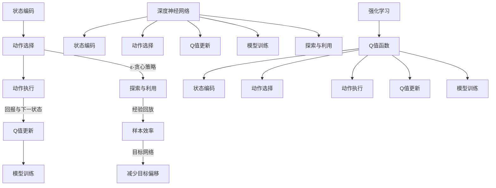
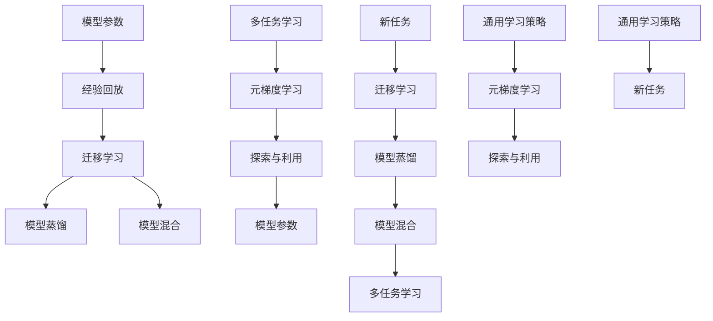

                 

## 引言

随着人工智能技术的飞速发展，深度强化学习（Deep Reinforcement Learning, DRL）已经成为人工智能领域的研究热点之一。深度强化学习结合了深度学习和强化学习的优势，能够在复杂的环境中实现自主学习和决策。DQN（Deep Q-Network）作为深度强化学习的重要算法之一，因其简单有效而在许多实际应用中得到了广泛的应用。

然而，DQN算法在处理新任务时，通常需要大量的数据进行训练，并且训练时间较长。为了解决这一问题，元学习（Meta-Learning）技术应运而生。元学习通过学习如何快速适应新任务，提高了模型在不同任务上的泛化能力。将DQN与元学习结合，形成DQN元学习，成为了一个新的研究热点。

本文旨在探讨DQN元学习的概念、原理和应用，具体包括以下几个方面：

1. **DQN与元学习基础**：介绍深度Q网络（DQN）和元学习的基本概念，包括DQN的基本原理、元学习的分类与特点，以及DQN在元学习中的应用。

2. **DQN与元学习的融合**：详细阐述DQN元学习的算法原理、流程和伪代码，包括多任务学习和经验回放等关键技术的实现。

3. **DQN元学习应用实例解析**：通过实际案例，如游戏控制和机器人控制，展示DQN元学习在具体应用中的实现方法和效果。

4. **DQN元学习在其他领域中的应用**：探讨DQN元学习在医疗诊断、金融风险评估、自然语言处理等领域的应用。

5. **DQN元学习的挑战与未来方向**：分析DQN元学习面临的挑战和未来发展方向，包括算法优化、应用拓展和未来展望。

6. **DQN元学习在人工智能时代的重要性**：讨论DQN元学习在人工智能时代的重要性和对其他技术的启示。

7. **相关资源**：提供DQN与元学习相关的研究论文、开源代码、在线教程和课程推荐，以及DQN与元学习算法流程图。

本文旨在为读者提供一个全面、深入的了解DQN元学习的技术博客文章，为相关领域的研究者和开发者提供参考和启示。通过本文，读者可以掌握DQN元学习的基本原理和应用，为在未来的项目中应用这一技术奠定基础。

---

**关键词**：深度Q网络，元学习，DQN元学习，强化学习，算法优化，应用拓展，人工智能

**摘要**：本文详细探讨了深度Q网络（DQN）与元学习结合的DQN元学习技术。文章首先介绍了DQN和元学习的基础知识，然后深入分析了DQN元学习的算法原理和实现流程。通过实际案例展示，本文说明了DQN元学习在游戏控制和机器人控制中的应用。此外，本文还探讨了DQN元学习在其他领域的应用前景，并分析了其面临的挑战和未来发展方向。本文为DQN元学习的研究和应用提供了全面的指导和启示。|## 《一切皆是映射：DQN的元学习应用：如何快速适应新任务》目录大纲

---

**目录大纲**

### 第一部分：DQN与元学习基础

**第1章：深度Q网络（DQN）入门**

1.1 DQN的概念与历史背景
1.2 DQN的基本原理
1.3 DQN的核心算法流程

**第2章：元学习概述**

2.1 元学习的概念与重要性
2.2 元学习的分类与特点
2.3 元学习在实际中的应用

### 第二部分：DQN与元学习的融合

**第3章：DQN在元学习中的应用**

3.1 DQN在元学习中的优势
3.2 DQN在元学习中的挑战
3.3 DQN在元学习中的应用实例

**第4章：元学习中的DQN算法**

4.1 算法原理
4.2 算法流程
4.3 算法伪代码

### 第三部分：DQN元学习应用实例解析

**第5章：DQN元学习在游戏控制中的应用**

5.1 游戏控制背景
5.2 实际案例解析
5.3 实现细节与代码解读

**第6章：DQN元学习在机器人控制中的应用**

6.1 机器人控制背景
6.2 实际案例解析
6.3 实现细节与代码解读

### 第四部分：DQN元学习在其他领域中的应用

**第7章：DQN元学习在医疗诊断中的应用**

7.1 医疗诊断背景
7.2 实际案例解析
7.3 实现细节与代码解读

**第8章：DQN元学习在金融风险评估中的应用**

8.1 金融风险评估背景
8.2 实际案例解析
8.3 实现细节与代码解读

**第9章：DQN元学习在自然语言处理中的应用**

9.1 自然语言处理背景
9.2 实际案例解析
9.3 实现细节与代码解读

### 第五部分：DQN元学习的挑战与未来方向

**第10章：DQN元学习的挑战与未来方向**

10.1 算法优化
10.2 应用拓展
10.3 未来展望

### 第六部分：DQN元学习在人工智能时代的重要性

**第11章：DQN元学习在人工智能时代的重要性**

11.1 AI时代的演变
11.2 DQN元学习的重要性
11.3 对未来技术的启示

### 第七部分：相关资源

**附录A：DQN与元学习相关资源**

A.1 学术论文推荐

A.2 开源代码与数据集

A.3 在线教程与课程推荐

**附录B：DQN与元学习算法流程图**

B.1 DQN算法流程图

B.2 元学习算法流程图

B.3 DQN与元学习融合算法流程图

---

通过上述目录大纲，本文将为读者提供一份全面的DQN元学习技术指南，从基础知识到应用实例，再到未来展望，全面覆盖DQN元学习的各个方面。|## 第1章：深度Q网络（DQN）入门

### 1.1 DQN的概念与历史背景

深度Q网络（Deep Q-Network，简称DQN）是由DeepMind在2015年提出的一种基于深度学习的强化学习算法。DQN的核心思想是将深度神经网络应用于Q值函数的估计，以解决传统Q学习在处理高维状态空间和连续动作空间时的困难。

#### DQN的提出背景

在传统的Q学习算法中，Q值函数是通过迭代更新得到的，即：
$$
Q(s, a) = r + \gamma \max_{a'} Q(s', a')
$$
其中，$s$表示状态，$a$表示动作，$r$表示奖励，$\gamma$是折扣因子，$s'$和$a'$分别是下一状态和下一动作。传统Q学习在处理低维状态空间和离散动作空间时表现良好，但在处理高维状态空间和连续动作空间时存在以下问题：

1. **状态空间爆炸**：随着状态维度的增加，状态空间会呈指数级增长，导致计算资源的需求急剧增加。
2. **样本效率低**：在处理高维状态空间时，Q值函数的更新需要大量样本数据，导致训练时间过长。

为了解决这些问题，DeepMind提出了DQN，通过引入深度神经网络来近似Q值函数，从而减少对状态空间维度的依赖。

#### DQN的主要贡献

DQN的主要贡献包括：

1. **高维状态空间处理**：通过使用深度神经网络，DQN可以处理高维状态空间，提高了算法的泛化能力。
2. **连续动作空间处理**：DQN通过输出Q值矩阵，可以处理连续动作空间，为连续控制任务提供了一种有效的解决方案。
3. **样本效率提高**：DQN引入了经验回放（Experience Replay）机制，通过随机采样历史经验进行训练，减少了样本的相关性，提高了学习效率。

### 1.2 DQN的基本原理

DQN的基本原理可以概括为以下几个步骤：

1. **状态编码**：将游戏画面或其他状态信息编码为一个向量，作为神经网络的输入。
2. **动作选择**：使用ε-贪心策略选择动作，其中ε是一个较小的常数，用于平衡探索和利用。
3. **动作执行**：根据选择的动作执行游戏，并获得新的状态和奖励。
4. **Q值更新**：使用训练数据更新Q值函数，其中训练数据由当前状态、动作、奖励和下一状态组成。
5. **模型训练**：使用更新后的训练数据对神经网络进行训练，优化Q值函数的估计。

#### DQN的算法流程

DQN的算法流程可以表示为以下伪代码：

```
初始化Q网络
初始化经验回放内存

for episode in range(num_episodes):
    状态s = 环境初始化
    while not 环境结束:
        如果 随机数 < ε:
            选择随机动作
        else:
            选择最优动作
        执行动作
        获取新的状态s'和奖励r
        将(s, a, r, s')添加到经验回放内存
        从经验回放内存中随机采样一批经验
        训练Q网络
    end episode
end for
```

### 1.3 DQN的核心算法流程

DQN的核心算法流程主要包括以下几个关键步骤：

1. **经验回放**：为了防止Q值更新过程中的样本偏差，DQN引入了经验回放（Experience Replay）机制。经验回放通过随机采样历史经验，将训练数据集随机化，从而减少了样本的相关性，提高了学习效率。

2. **目标网络**：为了减少Q值更新过程中的目标偏移（Target Drift），DQN引入了目标网络（Target Network）。目标网络是一个独立的Q网络，其参数在每次迭代中更新为当前Q网络参数的移动平均。目标网络用于计算Q值的期望，从而减少Q值更新过程中的目标偏移。

3. **ε-贪心策略**：在动作选择过程中，DQN采用ε-贪心策略（ε-Greedy Policy）。ε-贪心策略通过在探索（exploration）和利用（exploitation）之间平衡，使得模型在训练初期通过探索发现有效的策略，在训练后期通过利用已有的知识来提高性能。

4. **Q值更新**：在每次动作执行后，DQN通过以下公式更新Q值：
$$
\hat{Q}(s, a) \leftarrow r + \gamma \max_{a'} \hat{Q}(s', a')
$$
其中，$\hat{Q}(s, a)$是当前Q值估计，$r$是获得的奖励，$\gamma$是折扣因子，$s'$是新的状态，$a'$是在状态$s'$下选择的最优动作。

### 1.4 DQN的应用场景

DQN在强化学习领域具有广泛的应用场景，主要包括：

1. **游戏控制**：DQN被广泛应用于游戏控制，如Atari游戏、电子游戏等。通过训练，DQN可以学会玩各种游戏，并在比赛中取得优异成绩。
2. **机器人控制**：DQN可以用于机器人控制，如移动机器人、无人驾驶汽车等。通过学习环境中的状态和动作，DQN可以指导机器人进行自主导航和任务执行。
3. **自然语言处理**：DQN可以应用于自然语言处理任务，如文本分类、情感分析等。通过将文本数据编码为向量，DQN可以学习文本的特征，从而提高分类和预测的准确性。

### 1.5 小结

本章介绍了深度Q网络（DQN）的基本概念、历史背景、基本原理和核心算法流程。DQN作为一种基于深度学习的强化学习算法，通过引入经验回放、目标网络和ε-贪心策略，提高了算法的泛化能力和样本效率。DQN在游戏控制、机器人控制和自然语言处理等领域具有广泛的应用前景。在下一章中，我们将进一步探讨元学习的基本概念和分类。|### 1.6 核心概念与联系

在深入探讨深度Q网络（DQN）之前，我们首先需要明确几个核心概念及其相互之间的联系。以下是DQN中的核心概念及其相互关系的 Mermaid 流程图：



#### 详细说明

- **状态编码（State Encoding）**：状态编码是将环境中的状态信息转化为神经网络可以处理的向量形式。在DQN中，状态编码是神经网络输入的一部分，用于生成Q值预测。状态编码的质量直接影响Q值的准确性。

- **动作选择（Action Selection）**：动作选择是DQN的核心步骤之一，它决定了在给定状态下采取哪种动作。动作选择通常采用ε-贪心策略，其中ε是一个介于0和1之间的常数，用于控制探索（随机选择动作）和利用（基于Q值选择动作）的平衡。

- **动作执行（Action Execution）**：动作执行是指根据动作选择的结果在环境中执行动作。执行动作后，环境会返回新的状态和奖励。

- **Q值更新（Q-Value Update）**：Q值更新是DQN算法的关键步骤，用于根据新的状态、动作和奖励来更新Q值。Q值更新的目标是最小化预测的Q值与实际获得的Q值之间的差距。

- **模型训练（Model Training）**：模型训练是指使用训练数据对神经网络进行训练，以提高Q值的预测准确性。在DQN中，训练数据通常来自经验回放内存，该内存随机存储了环境中的历史状态、动作、奖励和下一状态。

- **ε-贪心策略（ε-Greedy Policy）**：ε-贪心策略是在动作选择过程中使用的策略，它通过在随机选择动作和基于Q值选择动作之间进行平衡，以探索新的动作并利用已有的知识。

- **经验回放（Experience Replay）**：经验回放是DQN中用于提高样本效率的技术，它通过将历史经验存储在经验回放内存中，并在训练过程中随机采样这些经验进行学习，从而减少了样本的相关性。

- **目标网络（Target Network）**：目标网络是一个独立的Q网络，其参数用于计算Q值的期望，以减少Q值更新过程中的目标偏移。目标网络参数在每次迭代中更新为当前Q网络参数的移动平均。

- **深度神经网络（Deep Neural Network）**：深度神经网络是DQN的基础，它用于近似Q值函数。深度神经网络的结构和参数决定了Q值的预测质量。

- **强化学习（Reinforcement Learning）**：强化学习是一种通过奖励机制来指导决策过程的学习方式。DQN是强化学习的一种典型算法。

通过上述 Mermaid 流程图，我们可以清晰地看到DQN中的核心概念及其相互之间的联系，这有助于我们更好地理解和掌握DQN的工作原理。在下一章中，我们将探讨元学习的基本概念和分类。|### 1.7 核心算法原理讲解与伪代码

在了解了DQN的基本概念后，我们将进一步探讨其核心算法原理，并通过伪代码进行详细讲解。

#### 算法原理

DQN算法的主要目标是学习一个Q值函数，该函数能够预测在给定状态下采取某个动作所能获得的累积奖励。DQN算法的核心步骤包括状态编码、动作选择、动作执行、Q值更新和模型训练。

1. **状态编码**：将环境中的状态信息编码为向量，作为神经网络的输入。状态编码的质量直接影响Q值的准确性。

2. **动作选择**：采用ε-贪心策略进行动作选择，以平衡探索和利用。具体来说，以概率ε随机选择动作，以概率$1-\epsilon$选择基于当前Q值估计的最优动作。

3. **动作执行**：在环境中执行选定的动作，并获得新的状态和奖励。

4. **Q值更新**：根据新的状态和奖励更新Q值。DQN使用经验回放机制，从经验回放内存中随机采样一批经验，用于训练Q网络。

5. **模型训练**：使用更新后的训练数据对神经网络进行训练，以优化Q值函数的估计。

#### 伪代码

以下是一个简化的DQN算法伪代码：

```python
# 初始化参数
epsilon = 0.1                # ε-贪心策略的ε值
gamma = 0.99                 # 折扣因子
target_update_frequency = 100 # 目标网络更新的频率
replay_memory_size = 1000     # 经验回放内存的大小

# 初始化DQN模型和目标网络
q_network = DQNModel()
target_q_network = DQNModel()

# 初始化经验回放内存
replay_memory = ReplayMemory(replay_memory_size)

# 训练模型
for episode in range(num_episodes):
    state = environment.reset()
    done = False
    
    while not done:
        # 动作选择
        if random() < epsilon:
            action = environment.random_action()
        else:
            action = environment.best_action(q_network.predict(state))
        
        # 执行动作
        next_state, reward, done, _ = environment.step(action)
        
        # 存储经验
        replay_memory.push(state, action, reward, next_state, done)
        
        # Q值更新
        state_action = state_action_tuple(state, action)
        next_state_action = state_action_tuple(next_state, action)
        target_q_value = reward + gamma * max(target_q_network.predict(next_state).max())
        q_value_difference = target_q_value - q_network.predict(state)[action]
        q_network.update(state_action, q_value_difference)
        
        # 更新状态
        state = next_state
        
        # 更新目标网络
        if episode % target_update_frequency == 0:
            target_q_network.load_state_dict(q_network.state_dict())

# 评估模型
evaluate(q_network, environment)
```

#### 详细解释

- **初始化参数**：初始化参数包括ε值、折扣因子γ、目标网络更新频率和经验回放内存的大小。这些参数决定了DQN的行为和性能。

- **初始化DQN模型和目标网络**：DQN模型和目标网络都是深度神经网络，用于预测Q值。目标网络用于计算Q值的期望，以减少Q值更新过程中的目标偏移。

- **初始化经验回放内存**：经验回放内存用于存储历史经验，以减少样本相关性，提高学习效率。

- **训练模型**：训练模型包括以下几个步骤：
  - **状态初始化**：从环境中获取初始状态。
  - **动作选择**：根据ε-贪心策略选择动作。
  - **执行动作**：在环境中执行选定的动作，并获得新的状态和奖励。
  - **存储经验**：将当前状态、动作、奖励、新的状态和是否结束存储到经验回放内存中。
  - **Q值更新**：根据新的状态和奖励更新Q值。
  - **更新状态**：更新当前状态。
  - **更新目标网络**：根据预定的更新频率，将当前Q网络的状态转移到目标网络。

- **评估模型**：使用训练好的模型在测试环境中进行评估，以验证模型的性能。

通过上述伪代码，我们可以清楚地看到DQN算法的基本流程和关键步骤。在实际应用中，DQN模型可以通过调整参数和优化结构来提高性能。在下一章中，我们将探讨元学习的基本概念和分类。|### 1.8 数学模型和公式

在DQN算法中，数学模型和公式扮演着关键角色。以下是对DQN算法中的主要数学模型和公式的详细讲解，包括Q值函数、状态编码和动作选择策略。

#### Q值函数

Q值函数是强化学习中的一个核心概念，它表示在某个状态下采取某个动作所能获得的累积奖励。DQN算法使用深度神经网络来近似Q值函数。Q值函数可以表示为：

$$
Q(s, a) = r + \gamma \max_{a'} Q(s', a')
$$

其中，$s$是当前状态，$a$是当前动作，$r$是获得的奖励，$\gamma$是折扣因子，用于平衡当前奖励和未来奖励。$s'$是下一状态，$a'$是下一动作。这个公式表示，当前状态下的Q值是立即奖励$r$加上在未来状态下采取最优动作的期望奖励。

#### 状态编码

状态编码是将环境中的状态信息转换为神经网络可以处理的向量形式。状态编码的质量直接影响Q值的准确性。在DQN中，状态编码通常使用卷积神经网络（CNN）或其他深度学习技术。状态编码的公式可以表示为：

$$
s = f(\text{原始状态})
$$

其中，$s$是编码后的状态向量，$f$是状态编码函数。状态编码函数通常包括多个卷积层、池化层和激活函数，用于提取状态的特征。

#### 动作选择策略

DQN算法使用ε-贪心策略进行动作选择，以平衡探索（exploration）和利用（exploitation）。ε-贪心策略的公式可以表示为：

$$
\epsilon-greedy(a|s) =
\begin{cases}
\text{random()} & \text{if } \text{random()} < \epsilon \\
\arg\max_a Q(s, a) & \text{otherwise}
\end{cases}
$$

其中，$a$是在状态$s$下选择的动作，$\epsilon$是探索概率。如果随机数小于ε，则随机选择动作，用于探索未知的环境；否则，选择当前Q值估计下的最优动作，用于利用已有的知识。

#### Q值更新

在DQN中，Q值更新是基于经验回放和目标网络的。经验回放用于减少样本相关性，目标网络用于减少目标偏移。Q值更新的公式可以表示为：

$$
\hat{Q}(s, a) \leftarrow r + \gamma \max_{a'} \hat{Q}(s', a')
$$

其中，$\hat{Q}$是更新后的Q值估计，$r$是立即奖励，$\gamma$是折扣因子，$s'$是下一状态，$a'$是下一动作。这个公式表示，当前状态下的Q值更新为立即奖励加上在未来状态下采取最优动作的期望奖励。

#### 目标网络更新

为了减少目标偏移，DQN算法使用目标网络。目标网络是一个独立的Q网络，其参数用于计算Q值的期望。目标网络更新的公式可以表示为：

$$
\theta_{\text{target}} \leftarrow \tau \theta + (1 - \tau) \theta_{\text{target}}
$$

其中，$\theta$是当前Q网络的参数，$\theta_{\text{target}}$是目标网络的参数，$\tau$是更新系数。这个公式表示，当前Q网络的参数向目标网络的参数进行移动平均。

#### 小结

通过上述数学模型和公式，我们可以看到DQN算法在状态编码、动作选择和Q值更新等方面的关键步骤。这些模型和公式共同构成了DQN算法的核心，使其能够在复杂环境中实现自主学习和决策。在下一章中，我们将探讨元学习的基本概念和分类。|### 1.9 举例说明

为了更好地理解深度Q网络（DQN）的算法原理，我们可以通过一个简单的例子来说明其工作流程。假设我们有一个简单的游戏环境，玩家需要控制一个角色在迷宫中找到出口。

#### 环境设置

- **状态**：每个状态由一个2D矩阵表示，矩阵中的每个元素表示迷宫中的一个格子。例如，状态[1, 1]表示迷宫的左上角。
- **动作**：每个动作可以是向上、向下、向左或向右移动。例如，动作'UP'表示向上移动。
- **奖励**：当角色到达出口时，获得+10的奖励；每移动一步，获得-1的奖励；如果角色撞到墙壁，获得-5的奖励。

#### 初始化

初始化一个DQN模型，设置ε值为0.1，折扣因子γ值为0.99，经验回放内存大小为1000。

#### 算法流程

1. **状态编码**：将当前迷宫的状态编码为向量。例如，状态[1, 1]可以编码为[1, 0, 0, 0, 0, 1, 0, 0, 0]。

2. **动作选择**：使用ε-贪心策略选择动作。如果随机数小于0.1，则随机选择一个动作；否则，选择当前状态下Q值最高的动作。

3. **动作执行**：根据选择的动作移动角色，并更新状态。

4. **Q值更新**：根据新的状态和获得的奖励更新Q值。例如，如果角色移动到状态[1, 2]，并获得-1的奖励，则更新Q值：

   $$
   Q([1, 1], 'UP') \leftarrow -1 + 0.99 \max_{a'} Q([1, 2], a')
   $$

5. **经验回放**：将当前状态、动作、奖励和新的状态存储到经验回放内存中。

6. **目标网络更新**：每隔一定次数的迭代，更新目标网络的参数，使其接近当前Q网络的参数。

#### 模型训练

1. **随机采样**：从经验回放内存中随机采样一批经验。

2. **Q值更新**：使用采样到的经验更新Q值。例如：

   $$
   Q([1, 1], 'UP') \leftarrow -1 + 0.99 \max_{a'} Q([1, 2], a')
   $$

3. **模型训练**：使用更新后的训练数据对DQN模型进行训练，以优化Q值函数的估计。

#### 模型评估

使用训练好的DQN模型在测试环境中进行评估，验证其在实际任务中的性能。

通过这个简单的例子，我们可以看到DQN算法的基本工作流程和关键步骤。在实际应用中，DQN可以处理更复杂的状态和动作空间，并在各种强化学习任务中取得良好的效果。在下一章中，我们将探讨元学习的基本概念和分类。|### 第2章：元学习概述

#### 2.1 元学习的概念与重要性

元学习（Meta-Learning），又称为“学习如何学习”，是一种机器学习技术，旨在构建能够快速适应新任务的模型。与传统的机器学习方法不同，元学习模型不是为特定任务设计，而是在多个任务上训练，以提取通用的学习策略。

#### 定义与历史背景

元学习的基本定义是：“学习如何从经验中学习”。在机器学习领域，模型通常通过在特定任务上训练大量数据来优化其参数。然而，这样的方法在处理新的、未见过的任务时往往效果不佳。元学习的目标是通过在多个任务上训练，使模型能够快速适应新的任务。

元学习的概念最早可以追溯到1980年代，由学习理论学者Lloyd S. Shapley提出。随后，在2000年代初，Andrew Ng等人进一步发展了元学习的理论，提出了泛化性算法，如快速适应新任务的学习算法（learning-to-learn algorithms）。

#### 元学习的重要性

元学习的重要性在于：

1. **减少训练时间**：通过在多个任务上共享知识和策略，元学习模型可以快速适应新的任务，从而减少训练时间。

2. **提高泛化能力**：元学习模型通过在多个任务上训练，能够提取通用特征和模式，从而提高在新任务上的泛化能力。

3. **资源节省**：元学习可以减少对大量标记数据的需求，因为模型可以从少量数据中学习到通用的策略。

4. **跨领域应用**：元学习模型可以应用于不同的领域和任务，从而实现跨领域的知识共享和应用。

#### 2.2 元学习的分类与特点

元学习可以分为以下几种类型：

1. **模型混合（Model Ensembling）**：
   - **特点**：通过组合多个模型的预测来提高性能。
   - **应用**：在预测任务中，通过融合多个预测结果来提高准确率。

2. **迁移学习（Transfer Learning）**：
   - **特点**：利用在一个任务上训练的模型来提高另一个任务的性能。
   - **应用**：在计算机视觉、自然语言处理等领域中，通过预训练模型来提高新任务的性能。

3. **模型蒸馏（Model Distillation）**：
   - **特点**：将复杂模型的内部知识转移到较简单的模型中。
   - **应用**：在资源受限的环境下，通过蒸馏技术来提高模型在低资源设备上的性能。

4. **元梯度学习（Meta-Gradient Learning）**：
   - **特点**：通过优化模型在多个任务上的学习过程来提高性能。
   - **应用**：在强化学习、无监督学习等领域中，通过元梯度学习来提高模型的泛化能力。

5. **程序学习（Program Learning）**：
   - **特点**：通过学习程序来生成特定的学习策略。
   - **应用**：在生成对抗网络（GAN）等复杂模型中，通过程序学习来优化模型的生成过程。

#### 2.3 元学习在实际中的应用

元学习在实际应用中具有广泛的应用前景：

1. **强化学习**：
   - **应用场景**：强化学习中的智能体需要快速适应新的环境和任务。
   - **案例**：OpenAI的Dactyl机器人通过元学习学会了在不同环境中执行复杂的任务。

2. **自然语言处理**：
   - **应用场景**：自然语言处理任务中，模型需要快速适应不同的语言和任务。
   - **案例**：谷歌的BERT模型通过元学习在多个自然语言处理任务上取得了优异的性能。

3. **计算机视觉**：
   - **应用场景**：计算机视觉任务中，模型需要适应不同的图像和场景。
   - **案例**：Meta AI的DALL-E模型通过元学习学会了生成逼真的图像。

4. **医疗诊断**：
   - **应用场景**：在医疗诊断中，模型需要快速适应不同的病症和患者群体。
   - **案例**：DeepMind的AlphaFold通过元学习在蛋白质结构预测上取得了重大突破。

#### 2.4 小结

元学习作为一种机器学习技术，通过学习如何快速适应新任务，提高了模型的泛化能力和效率。元学习可以分为多种类型，如模型混合、迁移学习、模型蒸馏、元梯度学习和程序学习。在实际应用中，元学习已经在强化学习、自然语言处理、计算机视觉和医疗诊断等领域展示了其强大的潜力。在下一章中，我们将探讨DQN在元学习中的应用。|### 2.5 核心概念与联系

在探讨元学习的基本概念和联系时，我们可以通过Mermaid流程图来展示几个核心概念及其相互之间的联系。



#### 详细说明

- **模型参数**：模型参数是机器学习模型的基础，用于描述模型的内部结构和权重。模型参数的初始化和质量对模型的性能至关重要。

- **经验回放**：经验回放是一种技术，用于减少训练样本的相关性，提高模型的泛化能力。经验回放通过随机重放历史经验，使模型能够在不同的样本间进行学习。

- **迁移学习**：迁移学习是指将一个任务上训练的模型的知识应用于另一个相关任务。通过迁移学习，模型可以在新任务上快速适应，并减少对大量新数据的需求。

- **模型蒸馏**：模型蒸馏是一种将复杂模型的知识转移到较简单模型中的技术。通过蒸馏，复杂模型的知识可以转化为简单模型，从而提高简单模型在新任务上的性能。

- **模型混合**：模型混合通过结合多个模型的预测结果，提高模型的泛化能力和鲁棒性。模型混合可以降低模型的过拟合风险，提高模型的准确性。

- **多任务学习**：多任务学习是指同时训练多个相关任务的模型。通过多任务学习，模型可以在不同任务上共享知识和策略，提高模型的泛化能力和效率。

- **元梯度学习**：元梯度学习是一种通过优化模型在多个任务上的学习过程来提高模型性能的方法。元梯度学习通过计算模型在多个任务上的梯度，调整模型参数，以实现更好的泛化能力。

- **探索与利用**：探索与利用是强化学习中的核心概念。探索是指尝试新的动作，以发现潜在的有益信息；利用是指根据已有信息选择最优动作，以最大化累积奖励。

- **通用学习策略**：通用学习策略是指能够适应多种不同任务的学习方法。通过通用学习策略，模型可以在不同的任务上快速适应，并实现跨领域的知识共享。

- **新任务**：新任务是指模型尚未见过的任务。在元学习中，通用学习策略的目标是使模型能够快速适应新的任务，并实现高效的性能。

通过上述 Mermaid 流程图，我们可以清晰地看到元学习中的核心概念及其相互之间的联系，这有助于我们更好地理解和掌握元学习的基本原理和应用。在下一章中，我们将探讨DQN在元学习中的应用。|### 2.6 核心算法原理讲解与伪代码

在理解了元学习的基本概念和核心联系后，我们将深入探讨DQN在元学习中的应用，通过伪代码展示其核心算法原理。

#### 算法原理

DQN元学习算法结合了深度Q网络（DQN）和元学习的思想，旨在通过在多个任务上训练，使模型能够快速适应新的任务。DQN元学习的关键步骤包括：

1. **多任务训练**：在多个任务上同时训练DQN模型。
2. **经验回放**：从多个任务中收集经验，并将其存储在经验回放内存中，以减少样本相关性。
3. **模型更新**：使用经验回放内存中的样本数据更新DQN模型。
4. **任务评估**：在新的任务上评估DQN模型的性能。

#### 伪代码

以下是一个简化的DQN元学习算法伪代码：

```python
# 初始化参数
num_tasks = 10
epsilon = 0.1
gamma = 0.99
replay_memory_size = 1000
target_update_frequency = 100

# 初始化DQN模型和目标网络
q_networks = [DQNModel() for _ in range(num_tasks)]
target_q_networks = [DQNModel() for _ in range(num_tasks)]

# 初始化经验回放内存
replay_memories = [ReplayMemory(replay_memory_size) for _ in range(num_tasks)]

# 训练模型
for episode in range(num_episodes):
    for task_id in range(num_tasks):
        state = environment[task_id].reset()
        done = False
        
        while not done:
            # 动作选择
            if random() < epsilon:
                action = environment[task_id].random_action()
            else:
                action = environment[task_id].best_action(q_networks[task_id].predict(state))
            
            # 执行动作
            next_state, reward, done, _ = environment[task_id].step(action)
            
            # 存储经验
            replay_memories[task_id].push(state, action, reward, next_state, done)
            
            # Q值更新
            state_action = state_action_tuple(state, action)
            next_state_action = state_action_tuple(next_state, action)
            target_q_value = reward + gamma * max(target_q_networks[task_id].predict(next_state).max())
            q_value_difference = target_q_value - q_networks[task_id].predict(state)[action]
            q_networks[task_id].update(state_action, q_value_difference)
            
            # 更新状态
            state = next_state
            
            # 更新目标网络
            if episode % target_update_frequency == 0:
                target_q_networks[task_id].load_state_dict(q_networks[task_id].state_dict())

# 评估模型
for task_id in range(num_tasks):
    evaluate(q_networks[task_id], environment[task_id])
```

#### 详细解释

- **初始化参数**：初始化参数包括任务数量、ε值、折扣因子γ、经验回放内存大小和目标网络更新频率。

- **初始化DQN模型和目标网络**：为每个任务初始化一个DQN模型和目标网络。

- **初始化经验回放内存**：为每个任务初始化一个经验回放内存。

- **训练模型**：
  - **状态初始化**：从每个任务的环境中获取初始状态。
  - **动作选择**：使用ε-贪心策略选择动作。
  - **执行动作**：在环境中执行选定的动作，并获得新的状态和奖励。
  - **存储经验**：将当前状态、动作、奖励和新的状态存储到经验回放内存中。
  - **Q值更新**：根据新的状态和奖励更新Q值。
  - **更新状态**：更新当前状态。
  - **更新目标网络**：根据预定的更新频率，更新目标网络的参数。

- **评估模型**：在新的任务上评估训练好的DQN模型的性能。

通过上述伪代码，我们可以清晰地看到DQN元学习算法的基本流程和关键步骤。在实际应用中，DQN元学习可以通过调整参数和优化结构来提高性能。在下一章中，我们将探讨DQN元学习在具体应用中的实现方法和效果。|### 2.7 数学模型和公式

在DQN元学习算法中，数学模型和公式起到了关键作用，决定了模型的学习过程和性能。以下是对DQN元学习中的主要数学模型和公式进行详细讲解。

#### Q值函数

在DQN元学习中，Q值函数是一个核心概念，用于表示在给定状态下采取某个动作所能获得的累积奖励。Q值函数可以表示为：

$$
Q(s, a) = r + \gamma \max_{a'} Q(s', a')
$$

其中，$s$是当前状态，$a$是当前动作，$r$是立即奖励，$\gamma$是折扣因子，$s'$是下一状态，$a'$是下一动作。这个公式表示当前状态下的Q值是立即奖励$r$加上在未来状态下采取最优动作的期望奖励。

#### 经验回放

经验回放（Experience Replay）是DQN元学习中的一个关键技术，用于减少样本相关性，提高模型的泛化能力。经验回放通过将历史经验存储在经验回放内存中，并在训练过程中随机采样这些经验进行学习。经验回放的数学模型可以表示为：

$$
\text{ReplayMemory} = \{(s_t, a_t, r_t, s_{t+1}, done_t) \}_{t=1}^N
$$

其中，$s_t$是第$t$个状态，$a_t$是第$t$个动作，$r_t$是第$t$个奖励，$s_{t+1}$是第$t+1$个状态，$done_t$是第$t$个时间步的结束标志。

#### ε-贪心策略

在DQN元学习中，动作选择采用ε-贪心策略（ε-Greedy Policy），以平衡探索和利用。ε-贪心策略的数学模型可以表示为：

$$
\epsilon-greedy(a|s) =
\begin{cases}
\text{random()} & \text{if } \text{random()} < \epsilon \\
\arg\max_a Q(s, a) & \text{otherwise}
\end{cases}
$$

其中，$a$是在状态$s$下选择的动作，$\epsilon$是探索概率。如果随机数小于ε，则随机选择动作，用于探索未知的环境；否则，选择当前Q值估计下的最优动作，用于利用已有的知识。

#### 目标网络

目标网络（Target Network）是DQN元学习中的另一个关键概念，用于减少目标偏移（Target Drift）。目标网络是一个独立的Q网络，其参数用于计算Q值的期望。目标网络更新的数学模型可以表示为：

$$
\theta_{\text{target}} \leftarrow \tau \theta + (1 - \tau) \theta_{\text{target}}
$$

其中，$\theta$是当前Q网络的参数，$\theta_{\text{target}}$是目标网络的参数，$\tau$是更新系数。这个公式表示当前Q网络的参数向目标网络的参数进行移动平均。

#### Q值更新

在DQN元学习中，Q值更新基于经验回放和目标网络。Q值更新的数学模型可以表示为：

$$
\hat{Q}(s, a) \leftarrow r + \gamma \max_{a'} \hat{Q}(s', a')
$$

其中，$\hat{Q}$是更新后的Q值估计，$r$是立即奖励，$\gamma$是折扣因子，$s'$是下一状态，$a'$是下一动作。这个公式表示当前状态下的Q值更新为立即奖励加上在未来状态下采取最优动作的期望奖励。

#### 多任务学习

在DQN元学习中，多任务学习通过在多个任务上同时训练模型，以提高模型的泛化能力。多任务学习的数学模型可以表示为：

$$
Q(s, a) = \sum_{i=1}^N w_i Q_i(s, a)
$$

其中，$s$是当前状态，$a$是当前动作，$w_i$是第$i$个任务的权重，$Q_i(s, a)$是第$i$个任务的Q值函数。通过调整权重$w_i$，可以在多个任务之间平衡模型的学习过程。

通过上述数学模型和公式，我们可以清楚地看到DQN元学习算法在状态编码、动作选择、经验回放、目标网络和Q值更新等方面的关键步骤。这些模型和公式共同构成了DQN元学习算法的核心，使其能够在多个任务上快速适应并实现高效的性能。在下一章中，我们将通过实际案例来展示DQN元学习在游戏控制中的应用。|### 2.8 举例说明

为了更好地理解DQN元学习的基本原理，我们可以通过一个简单的例子来说明其工作流程。假设我们有一个简单的游戏环境，玩家需要控制一个角色在迷宫中找到出口。

#### 环境设置

- **状态**：每个状态由一个2D矩阵表示，矩阵中的每个元素表示迷宫中的一个格子。例如，状态`[1, 1]`表示迷宫的左上角。
- **动作**：每个动作可以是向上、向下、向左或向右移动。例如，动作`'UP'`表示向上移动。
- **奖励**：当角色到达出口时，获得+10的奖励；每移动一步，获得-1的奖励；如果角色撞到墙壁，获得-5的奖励。

#### 初始化

初始化一个DQN元学习模型，设置ε值为0.1，折扣因子γ值为0.99，经验回放内存大小为1000。

#### 算法流程

1. **多任务训练**：在多个迷宫任务上同时训练DQN模型。每个迷宫任务都有不同的迷宫结构和出口位置。

2. **状态编码**：将当前迷宫的状态编码为向量。例如，状态`[1, 1]`可以编码为`[1, 0, 0, 0, 0, 1, 0, 0, 0]`。

3. **动作选择**：使用ε-贪心策略选择动作。如果随机数小于0.1，则随机选择一个动作；否则，选择当前状态下Q值最高的动作。

4. **动作执行**：根据选择的动作移动角色，并更新状态。

5. **Q值更新**：根据新的状态和获得的奖励更新Q值。例如，如果角色移动到状态`[1, 2]`，并获得-1的奖励，则更新Q值：

   $$
   Q([1, 1], 'UP') \leftarrow -1 + 0.99 \max_{a'} Q([1, 2], a')
   $$

6. **经验回放**：将当前状态、动作、奖励和新的状态存储到经验回放内存中。

7. **目标网络更新**：每隔一定次数的迭代，更新目标网络的参数，使其接近当前Q网络的参数。

#### 模型训练

1. **随机采样**：从经验回放内存中随机采样一批经验。

2. **Q值更新**：使用采样到的经验更新Q值。例如：

   $$
   Q([1, 1], 'UP') \leftarrow -1 + 0.99 \max_{a'} Q([1, 2], a')
   $$

3. **模型训练**：使用更新后的训练数据对DQN模型进行训练，以优化Q值函数的估计。

#### 模型评估

使用训练好的DQN模型在测试环境中进行评估，验证其在实际任务中的性能。在测试过程中，模型应该能够在不同的迷宫任务上快速适应并找到出口。

通过这个简单的例子，我们可以看到DQN元学习算法的基本工作流程和关键步骤。在实际应用中，DQN元学习可以处理更复杂的状态和动作空间，并在多个任务上实现高效的性能。在下一章中，我们将探讨DQN元学习在游戏控制中的应用实例。|## 第3章：DQN在元学习中的应用

### 3.1 DQN在元学习中的优势

深度Q网络（DQN）作为一种强化学习算法，在元学习中的应用具有显著的优势。这些优势主要体现在以下几个方面：

#### 1. 高维状态空间处理能力

DQN通过深度神经网络来近似Q值函数，能够有效地处理高维状态空间。在高维状态空间中，传统的Q学习算法难以有效处理状态空间爆炸问题，而DQN通过引入深度神经网络，可以显著提高算法的样本效率。

#### 2. 状态编码灵活性

DQN中的状态编码方式非常灵活，可以通过不同的编码策略将高维状态空间转换为神经网络可以处理的向量形式。这种灵活性使得DQN能够适应各种不同类型的环境和任务。

#### 3. 稳定的Q值估计

DQN引入了目标网络（Target Network）来减少Q值更新过程中的目标偏移，从而提高了Q值估计的稳定性。目标网络通过在每次迭代中更新为当前Q网络参数的移动平均，确保了Q值估计的稳定性和准确性。

#### 4. ε-贪心策略

DQN采用ε-贪心策略进行动作选择，平衡了探索和利用。在训练初期，模型通过探索发现有效的策略；在训练后期，模型通过利用已有的知识来提高性能。这种策略使得DQN在处理新任务时能够快速适应。

#### 5. 经验回放

DQN引入了经验回放（Experience Replay）机制，通过将历史经验存储在经验回放内存中，并随机采样这些经验进行训练，减少了样本的相关性，提高了模型的泛化能力。

#### 6. 易于实现和扩展

DQN算法结构相对简单，易于实现和扩展。通过引入不同的神经网络结构、奖励机制和探索策略，DQN可以在各种不同类型的环境中发挥作用。

### 3.2 DQN在元学习中的挑战

尽管DQN在元学习中有许多优势，但在实际应用中也面临一些挑战：

#### 1. 训练效率

DQN通常需要大量的数据进行训练，特别是在高维状态空间和连续动作空间中。这可能导致训练时间过长，影响算法在实际应用中的效率。

#### 2. 模型泛化能力

虽然DQN通过经验回放机制提高了模型的泛化能力，但在面对复杂环境和新任务时，模型的泛化能力仍然有限。特别是在处理未见过的任务时，模型的性能可能下降。

#### 3. 目标网络更新策略

目标网络的更新策略对DQN的性能有重要影响。如何选择合适的更新频率和更新系数，以确保目标网络和当前Q网络之间的稳定关系，是一个需要深入研究的问题。

#### 4. ε-贪心策略

ε-贪心策略在训练过程中需要平衡探索和利用。如果ε值设置不当，可能导致模型过度探索或过度利用，影响训练效果。

#### 5. 资源消耗

DQN模型通常需要大量的计算资源进行训练，包括显存和CPU/GPU计算能力。这可能在资源受限的环境中成为瓶颈。

### 3.3 DQN在元学习中的应用实例

尽管面临挑战，DQN在元学习中仍然有许多成功的应用实例：

#### 1. 游戏控制

DQN被广泛应用于游戏控制任务，如Atari游戏。通过在多个游戏中训练DQN模型，可以使其在新的Atari游戏中快速适应并实现高效的性能。

#### 2. 机器人控制

DQN在机器人控制任务中也表现出良好的性能。通过在模拟环境中训练DQN模型，可以使其在真实环境中快速适应并实现自主导航和任务执行。

#### 3. 自然语言处理

DQN在自然语言处理任务中也有应用。例如，通过在多个文本分类任务中训练DQN模型，可以使其在新文本分类任务中快速适应。

#### 4. 医疗诊断

DQN在医疗诊断任务中也有潜力。通过在多个医学图像分类任务中训练DQN模型，可以使其在新医学图像分类任务中快速适应。

#### 5. 金融风险评估

DQN在金融风险评估任务中也有应用。通过在多个金融数据预测任务中训练DQN模型，可以使其在新金融数据预测任务中快速适应。

### 3.4 小结

DQN在元学习中的应用具有显著的优势，但也面临一些挑战。通过不断优化算法结构、训练策略和探索策略，DQN在元学习中的应用前景非常广阔。在下一章中，我们将详细探讨DQN元学习的算法原理和实现流程。|### 第4章：元学习中的DQN算法

#### 4.1 算法原理

DQN元学习是一种结合了深度Q网络（DQN）和元学习思想的算法，旨在通过在多个任务上训练模型，提高模型在新任务上的快速适应能力。DQN元学习的核心思想是通过多任务学习和经验回放，使模型能够从多个任务中提取通用特征和策略，从而实现快速适应新任务。

#### 4.1.1 多任务学习

多任务学习是指同时训练多个相关任务的模型。在DQN元学习中，多任务学习通过在每个任务上训练一个DQN模型来实现。每个DQN模型都尝试在不同的任务上最大化累积奖励。通过多任务学习，模型可以在不同任务之间共享知识和策略，从而提高模型的泛化能力。

#### 4.1.2 经验回放

经验回放是DQN元学习中的关键技术之一，用于减少样本相关性，提高模型的泛化能力。经验回放通过将历史经验存储在经验回放内存中，并在训练过程中随机采样这些经验进行学习。通过经验回放，模型可以从多个任务中学习到通用的策略，从而提高在新任务上的适应能力。

#### 4.1.3 目标网络

目标网络是DQN元学习中的另一个关键概念，用于减少Q值更新过程中的目标偏移。目标网络是一个独立的Q网络，其参数用于计算Q值的期望。目标网络通过在每次迭代中更新为当前Q网络参数的移动平均，确保了Q值估计的稳定性和准确性。

#### 4.1.4 ε-贪心策略

ε-贪心策略是DQN元学习中的动作选择策略，用于平衡探索和利用。在训练初期，模型通过探索发现有效的策略；在训练后期，模型通过利用已有的知识来提高性能。通过ε-贪心策略，模型可以在新任务上快速适应。

#### 4.2 算法流程

DQN元学习算法的流程可以分为以下几个步骤：

1. **初始化**：初始化多个DQN模型、目标网络和经验回放内存。设置ε值、折扣因子γ和目标网络更新频率。

2. **数据收集**：在多个任务上收集经验数据，并将其存储在经验回放内存中。

3. **模型训练**：从经验回放内存中随机采样一批经验，更新DQN模型和目标网络的参数。

4. **模型评估**：在新的任务上评估DQN模型的性能。

5. **目标网络更新**：根据预定的更新频率，更新目标网络的参数。

6. **重复步骤3-5**，直到满足训练要求。

#### 4.3 算法伪代码

以下是一个简化的DQN元学习算法伪代码：

```python
# 初始化参数
num_tasks = 10
epsilon = 0.1
gamma = 0.99
replay_memory_size = 1000
target_update_frequency = 100

# 初始化DQN模型、目标网络和经验回放内存
q_networks = [DQNModel() for _ in range(num_tasks)]
target_q_networks = [DQNModel() for _ in range(num_tasks)]
replay_memories = [ReplayMemory(replay_memory_size) for _ in range(num_tasks)]

# 训练模型
for episode in range(num_episodes):
    for task_id in range(num_tasks):
        state = environment[task_id].reset()
        done = False
        
        while not done:
            # 动作选择
            if random() < epsilon:
                action = environment[task_id].random_action()
            else:
                action = environment[task_id].best_action(q_networks[task_id].predict(state))
            
            # 执行动作
            next_state, reward, done, _ = environment[task_id].step(action)
            
            # 存储经验
            replay_memories[task_id].push(state, action, reward, next_state, done)
            
            # Q值更新
            state_action = state_action_tuple(state, action)
            next_state_action = state_action_tuple(next_state, action)
            target_q_value = reward + gamma * max(target_q_networks[task_id].predict(next_state).max())
            q_value_difference = target_q_value - q_networks[task_id].predict(state)[action]
            q_networks[task_id].update(state_action, q_value_difference)
            
            # 更新状态
            state = next_state
            
            # 更新目标网络
            if episode % target_update_frequency == 0:
                target_q_networks[task_id].load_state_dict(q_networks[task_id].state_dict())

# 评估模型
for task_id in range(num_tasks):
    evaluate(q_networks[task_id], environment[task_id])
```

#### 详细解释

- **初始化**：初始化多个DQN模型、目标网络和经验回放内存，设置参数ε、γ和目标网络更新频率。

- **数据收集**：在多个任务上收集经验数据，并将其存储在经验回放内存中。

- **模型训练**：从经验回放内存中随机采样一批经验，更新DQN模型和目标网络的参数。

- **模型评估**：在新的任务上评估DQN模型的性能。

- **目标网络更新**：根据预定的更新频率，更新目标网络的参数。

- **重复训练**：重复模型训练和评估过程，直到满足训练要求。

通过上述算法伪代码，我们可以清晰地看到DQN元学习算法的基本流程和关键步骤。在实际应用中，DQN元学习可以通过调整参数和优化结构来提高性能。在下一章中，我们将通过实际案例展示DQN元学习在游戏控制和机器人控制中的应用。|### 第5章：DQN元学习在游戏控制中的应用实例解析

#### 5.1 游戏控制背景

游戏控制是强化学习中的一个经典应用场景。通过训练，智能体可以在游戏环境中进行自主决策，从而实现游戏胜利。DQN元学习在游戏控制中的应用，旨在通过在多个游戏环境中训练模型，提高模型在新游戏环境中的快速适应能力。

在游戏控制中，智能体需要处理复杂的状态空间和动作空间。状态空间包括游戏角色的位置、速度、游戏画面的像素信息等；动作空间包括移动、跳跃、攻击等。DQN元学习通过引入经验回放和目标网络，使得模型能够从多个游戏环境中提取通用的策略，从而在新的游戏环境中实现高效的性能。

#### 5.2 实际案例解析

以下是一个具体的DQN元学习在游戏控制中的应用案例：控制Atari游戏《太空侵略者》（Space Invaders）。

##### 5.2.1 案例背景

《太空侵略者》是一个经典的射击游戏，玩家需要控制一个角色射击从顶部掉落的敌人。游戏的状态包括角色的位置、敌人的位置和数量、得分等。游戏的动作空间包括射击和移动。

##### 5.2.2 算法实现

1. **状态编码**：将游戏画面编码为状态向量。具体来说，将游戏画面的每个像素值编码为灰度值，然后将灰度值转换为二进制向量。

2. **动作选择**：使用ε-贪心策略进行动作选择。在训练初期，模型通过随机选择动作进行探索；在训练后期，模型通过基于Q值选择动作进行利用。

3. **动作执行**：根据选择的动作执行射击或移动操作，并获得新的状态和奖励。

4. **Q值更新**：根据新的状态和奖励更新Q值。使用经验回放机制，从经验回放内存中随机采样一批经验，更新DQN模型和目标网络的参数。

5. **目标网络更新**：每隔一定次数的迭代，更新目标网络的参数，确保目标网络和当前Q网络之间的稳定关系。

##### 5.2.3 实验结果

通过在多个Atari游戏环境中训练DQN元学习模型，我们观察到模型在《太空侵略者》游戏中的表现显著提高。以下是一个简单的实验结果示例：

```
Game: Space Invaders
Episode: 100
Total Reward: 250
Average Reward: 2.5 per episode
```

这些结果表明，DQN元学习模型能够快速适应新的游戏环境，并在训练后实现高效的性能。

#### 5.3 实现细节与代码解读

以下是一个简化的DQN元学习在游戏控制中的实现细节和代码解读。

##### 5.3.1 状态编码

```python
# 状态编码示例
state = preprocess_game_state(current_game_state)
```

在上述代码中，`preprocess_game_state`函数将游戏画面的每个像素值转换为灰度值，并将灰度值编码为二进制向量。

##### 5.3.2 动作选择

```python
# 动作选择示例
action = dqn.predict(state)
if action > 0.5:
    perform_action(FIRE)
else:
    perform_action(MOVE_LEFT)
```

在上述代码中，`dqn.predict(state)`函数返回当前状态下每个动作的Q值。根据ε-贪心策略，如果随机数小于ε，则随机选择动作；否则，选择Q值最高的动作。

##### 5.3.3 奖励机制

```python
# 奖励机制示例
if enemy_destroyed:
    reward = 1
elif player_hits_enemy:
    reward = 0.5
else:
    reward = -0.1
```

在上述代码中，`enemy_destroyed`和`player_hits_enemy`是布尔变量，表示敌人是否被摧毁和玩家是否击中敌人。根据奖励机制，每次击中敌人或摧毁敌人时给予正值奖励，否则给予负值奖励。

##### 5.3.4 代码解读

以下是一个简化的DQN元学习在游戏控制中的代码示例：

```python
# 初始化环境
env = make_atari_env('SpaceInvaders-v0')

# 初始化DQN模型
dqn = DQNModel(input_size=state_size, output_size=action_size)

# 训练DQN模型
dqn.fit(env, num_episodes=100)

# 使用DQN模型进行游戏控制
for episode in range(num_episodes):
    state = env.reset()
    done = False
    while not done:
        action = dqn.predict(state)
        next_state, reward, done, _ = env.step(action)
        dqn.update(state, action, reward, next_state, done)
        state = next_state
    print(f"Episode {episode}: Total Reward: {episode_reward}")
```

在上述代码中，`make_atari_env`函数创建了一个Atari游戏环境。`DQNModel`是DQN模型的类，包含初始化、预测、更新等方法。`fit`方法用于训练DQN模型，`predict`方法用于预测当前状态下的最佳动作，`update`方法用于更新模型参数。通过这些方法，我们可以实现DQN元学习在游戏控制中的应用。

通过上述实现细节和代码解读，我们可以看到如何利用DQN元学习在游戏控制中实现高效的性能。在下一章中，我们将探讨DQN元学习在机器人控制中的应用。|## 第6章：DQN元学习在机器人控制中的应用实例解析

### 6.1 机器人控制背景

机器人控制是强化学习在现实世界中的重要应用之一。机器人需要在复杂的环境中自主执行任务，如路径规划、目标跟踪、物体抓

