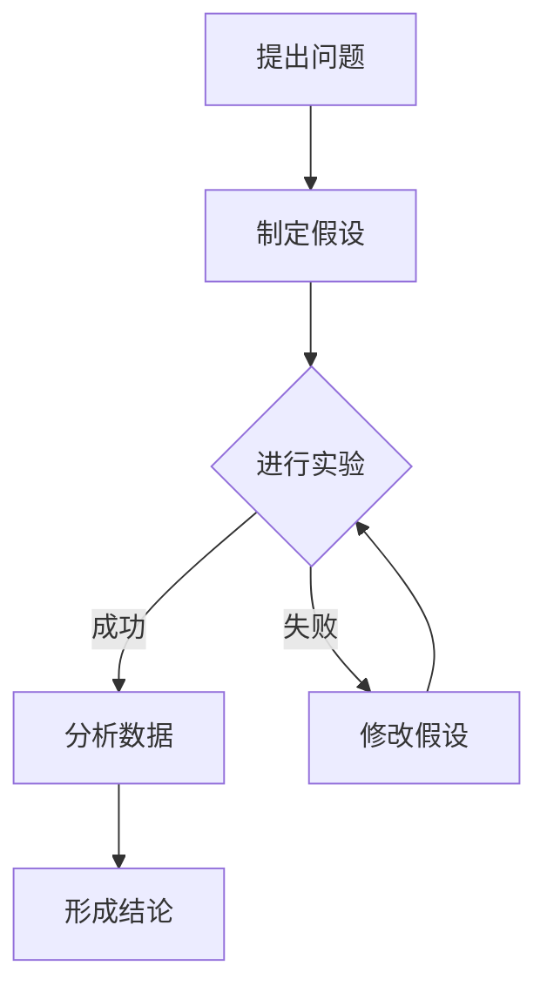

                 

### 《世界可理解性与科学研究的未来趋势》

关键词：世界可理解性、科学研究、趋势、复杂性、多学科交叉、人工智能

摘要：
在信息技术飞速发展的今天，我们对世界的理解正经历着前所未有的变革。本文从历史视角出发，探讨了世界可理解性的概念及其在科学研究中的重要性。随后，我们深入分析了当代科学研究面临的挑战，包括科学复杂性增加、多学科交叉融合以及数据爆炸与信息过载。接着，本文详细阐述了世界可理解性的核心概念、科学方法论及其在知识普及中的作用。在此基础上，我们探讨了科学研究的未来趋势，包括数据驱动科学、人工智能与科学研究、多学科交叉以及科学研究中的伦理问题。最后，我们提出了推动科学研究发展的策略，包括教育与人才培养、政策支持与科研环境以及科学研究的国际合作。通过这篇技术博客，我们希望能够为读者提供一个关于世界可理解性与科学研究未来趋势的全面而深入的视角。

### 第一部分：引言与背景

#### 1.1 书籍概述与目标

在信息技术和人工智能迅速发展的时代，我们对于世界的理解不断深化，但同时也面临着前所未有的挑战。本部分旨在探讨世界可理解性的概念及其在科学研究中的重要性，并通过对历史的回顾，分析现代科学研究所面临的挑战。

**1.1.1 书籍的主要目标**

本书的主要目标是深入探讨世界可理解性的核心概念，分析其在科学研究中的重要性，并预测未来科学研究的发展趋势。具体来说，本书将围绕以下几个关键问题进行探讨：

1. 世界可理解性的本质是什么？它是如何随着历史的发展而演变的？
2. 当代科学研究面临哪些挑战？这些挑战对科学方法论和知识普及有何影响？
3. 科学研究的未来趋势将如何发展？数据驱动科学、人工智能与科学研究、多学科交叉以及科学研究中的伦理问题将如何塑造未来的科研格局？
4. 如何推动科学研究的发展？教育与人才培养、政策支持与科研环境、科学研究的国际合作将如何发挥作用？

通过回答这些问题，本书希望能够为读者提供一个关于世界可理解性与科学研究未来趋势的全面而深入的视角。

**1.1.2 世界可理解性的重要性**

世界可理解性是一个涉及哲学、科学、社会学等多学科交叉的概念，它关乎我们如何认知和解释我们所处的世界。对世界可理解性的探讨不仅有助于我们更好地理解自然现象和社会规律，还能够推动科学方法论的发展，提高科学研究的效率和质量。

首先，世界可理解性是科学研究的基础。科学研究的目的是揭示自然界的规律，而这一过程离不开对世界的理解和解释。只有当我们能够理解世界，才能提出科学假设，进行实验验证，并最终形成科学理论。

其次，世界可理解性对于知识普及具有重要意义。科学知识的普及不仅能够提高公众的科学素养，还能够促进科技的发展和社会的进步。一个可理解的世界能够使更多的人参与到科学研究和科技创新中来，从而推动整个社会的发展。

最后，世界可理解性还关乎人类的自我认知。通过理解世界，我们能够更好地认识自己，明确自己的位置和角色，从而更好地面对生活和工作中的挑战。

**1.1.3 科学研究在现代社会中的地位**

科学研究在现代社会中具有极其重要的地位。它不仅是推动社会进步和经济发展的重要动力，也是人类认知世界、解决重大问题的必经之路。

首先，科学研究是技术创新的源泉。现代科技的发展离不开科学研究的支持，从医学到工程，从信息技术到材料科学，科学研究为各个领域的技术创新提供了源源不断的动力。

其次，科学研究是社会发展的基石。通过科学研究，我们能够更好地理解自然规律，解决社会发展中的各种问题，如环境保护、资源利用、公共健康等。

最后，科学研究是人类自我认知的重要途径。通过科学研究，我们能够更深入地了解自然界和人类社会，从而更好地认识自己，提高我们的智慧和素质。

总的来说，科学研究在现代社会中具有不可替代的地位，它不仅关乎科技和经济的发展，也关乎人类的未来。

#### 1.2 历史视角下的世界可理解性

在探讨世界可理解性时，我们不能忽略历史视角的重要性。通过回顾历史，我们可以看到世界可理解性的演变过程，理解不同时期人们对世界的理解方式和科学方法论的发展。

**1.2.1 古代世界的可理解性**

在古代，人们对世界的理解主要基于神话和宗教。古代世界的可理解性主要体现在以下几个方面：

1. **神话与宗教**：古代世界充满了各种神话和宗教信仰，这些神话和宗教信仰为人们提供了对世界的解释。例如，古希腊神话中的诸神，古埃及神话中的法老和神灵，都为古代世界提供了丰富的象征意义和解释框架。

2. **自然哲学**：在古希腊，自然哲学成为对世界理解的主要途径。古希腊哲学家如泰勒斯、赫拉克利特和亚里士多德，通过对自然界的研究，试图揭示世界的本质和规律。他们的工作奠定了西方哲学和科学的基础。

3. **占星术**：在古代，占星术是一种重要的科学方法，用于预测未来和解释自然现象。占星术认为，星辰的位置和运动对人类生活和自然界有着深远的影响。

古代世界的可理解性主要依赖于神话、宗教和哲学，这些思想体系为人们提供了一种理解世界的框架，虽然这些框架在今天看来可能缺乏科学依据，但在当时它们确实为人类提供了对世界的解释。

**1.2.2 中世纪的可理解性观**

中世纪的世界观受到了基督教神学的影响，人们对世界的理解主要通过宗教和神学来解释。中世纪的可理解性观具有以下特点：

1. **上帝的创造**：中世纪的人们相信，世界是由上帝创造的，上帝是宇宙的创造者和主宰。这种观点使人们将自然界视为上帝的杰作，对世界的理解依赖于对上帝的信仰。

2. **宗教法规**：中世纪的科学研究和知识传播受到严格的宗教法规限制。许多科学理论和发现被认为是违背上帝意志的，因此被禁止或忽视。

3. **经院哲学**：中世纪的哲学家，如托马斯·阿奎那，试图将宗教信仰与哲学和科学结合起来。他们的工作试图在宗教和科学之间建立一种桥梁，但这种桥梁并未完全成功。

中世纪的可理解性观主要依赖于宗教和神学，虽然在这一时期也出现了一些重要的科学发现，如罗杰·培根的实验科学思想，但总体上，科学的发展受到了宗教的限制。

**1.2.3 近现代科学的崛起与可理解性转变**

近现代科学的崛起标志着世界可理解性的一次重大转变。这一转变主要体现在以下几个方面：

1. **实验科学方法**：近现代科学强调实验和观察的重要性。科学家如伽利略、牛顿通过实验和观察，揭示了自然界的规律。实验科学方法成为科学研究的基石，使人们对世界的理解更加准确和可靠。

2. **科学革命**：近现代科学的崛起伴随着一系列科学革命，如哥白尼的日心说、达尔文的进化论等。这些科学革命挑战了传统的世界观，推动了科学理论的变革。

3. **科学普及**：随着科学的发展，科学知识的普及成为一个重要议题。科学普及不仅提高了公众的科学素养，也促进了科学研究的进步。

近现代科学的崛起使人们对世界的理解从宗教和神学转向实验和观察，科学方法论的发展使人们对世界的理解更加深入和全面。

通过回顾历史，我们可以看到世界可理解性的演变过程。从古代的神话和宗教，到中世纪的宗教和神学，再到近现代的实验科学方法，人们对世界的理解不断深化和扩展。这些历史经验为我们理解当代科学研究的挑战和未来趋势提供了宝贵的启示。

#### 1.3 当代科学研究面临的挑战

在进入21世纪以来，科学研究面临着前所未有的挑战。这些挑战不仅来自于科学本身的复杂性，也来自于多学科交叉、数据爆炸与信息过载等外部环境的变化。了解这些挑战及其影响，对于推动科学研究的发展具有重要意义。

**1.3.1 科学复杂性增加**

科学复杂性增加是当代科学研究面临的首要挑战。随着科学领域的不断扩展，许多问题变得日益复杂，无法通过单一学科的理论和方法来解决。例如，量子物理学和相对论等领域的理论体系复杂，涉及多个数学和物理概念，需要跨学科的合作和研究。此外，现代科学研究的实验规模也越来越大，例如大型粒子对撞机和天基观测设备，这些实验的复杂性远远超过传统实验室研究。

**1.3.2 多学科交叉融合**

多学科交叉融合是应对科学复杂性增加的有效途径。随着科学领域的细分，许多问题需要通过跨学科的合作来求解。例如，生物信息学结合了生物学、计算机科学和信息科学，用于分析生物数据；环境科学则结合了生物学、化学和物理学，用于研究环境保护和气候变化。多学科交叉不仅促进了科学的发展，也推动了新的科学理论的诞生。

**1.3.3 数据爆炸与信息过载**

数据爆炸与信息过载是当代科学研究面临的另一个重大挑战。随着互联网和传感器技术的普及，我们每天产生的大量数据需要处理和分析。这些数据不仅来自于科学实验，还包括社交媒体、物联网、天气预报等各种来源。科学研究的挑战在于如何有效地管理和分析这些数据，提取有用的信息和知识。此外，信息过载也导致科学家在获取和验证信息时面临困难，容易产生误判和错误。

**1.3.4 科研资源与经费限制**

科研资源与经费限制也是当代科学研究面临的挑战之一。科学研究的资金来源主要依赖于政府拨款、企业赞助和国际合作，但资金分配往往不够均衡，一些新兴领域和跨学科研究可能缺乏足够的资金支持。此外，科研经费的使用效率也受到质疑，一些项目可能存在资源浪费和重复研究的问题。

**1.3.5 伦理与社会影响**

随着科学研究的深入，伦理问题和社会影响日益凸显。例如，基因编辑、人工智能、大数据等前沿技术可能带来伦理挑战，需要制定相应的伦理规范和社会责任。科学家需要认识到自己的研究可能对社会产生深远影响，并采取负责任的研究态度。

总的来说，当代科学研究面临着科学复杂性增加、多学科交叉融合、数据爆炸与信息过载、科研资源与经费限制以及伦理与社会影响等多方面的挑战。了解和应对这些挑战，对于推动科学研究的持续发展具有重要意义。

### 第二部分：世界可理解性的核心概念

#### 2.1 可理解性的定义与特征

世界可理解性是一个涉及哲学、科学和社会学的多维概念，它关乎我们如何认知和解释我们所处的世界。深入探讨世界可理解性的定义与特征，有助于我们更好地理解这一概念在科学研究中的重要性。

**2.1.1 可理解性的哲学探讨**

在哲学领域，可理解性是一个古老而深刻的议题。哲学家们长期以来都在探讨人类如何通过思维和语言来理解世界。柏拉图认为，真理存在于现实世界之外的理念世界，而我们的认知目标是追求这些永恒不变的真理。亚里士多德则强调实证观察和逻辑推理，认为通过经验获取的知识才是可靠的。

康德在《纯粹理性批判》中提出了“先验想象力”的概念，认为人类通过想象力将感觉材料组织成有意义的整体。黑格尔则认为，真理是具体的、历史的，通过对历史的理解和反思，我们才能达到对世界的真正理解。

哲学上的探讨为理解世界可理解性提供了不同的视角。它既关注人类的认知能力，也关注世界的本质和人类与世界的关系。

**2.1.2 可理解性的科学界定**

在科学领域，可理解性主要涉及科学方法论和科学理论的构建。科学哲学家卡尔·波普尔提出，科学知识是通过假设和验证来获取的。他认为，科学理论应该是可证伪的，即如果能够找到证据反驳一个理论，那么这个理论就是科学的。

爱因斯坦则通过广义相对论，展示了物理世界的复杂性和可理解性。他提出了时空相对性和引力波的概念，揭示了宇宙的基本规律。这些科学理论不仅揭示了自然界的奥秘，也证明了世界的可理解性。

科学界普遍认为，科学研究的目的是寻找简洁而优雅的理论，这些理论能够解释大量的实验数据，并预测未来的现象。可理解性在这里指的是，科学家通过逻辑推理和实验验证，能够逐步揭示自然界的规律，使得世界变得可理解。

**2.1.3 可理解性的社会学意义**

在社会学领域，可理解性涉及到知识传播和社会共识的形成。社会学学者马克斯·韦伯认为，社会秩序是通过规则和规范的共同遵守来维持的。这些规则和规范需要被社会成员理解，才能发挥作用。

社会学的可理解性研究关注的是，社会如何通过教育、媒体和公共讨论，将复杂的科学知识转化为公众能够理解的形式。科学普及的重要任务之一就是提高公众的科学素养，使更多的人能够理解科学概念和科学方法。

此外，社会学的可理解性还涉及到科学与社会之间的关系。科学家在研究过程中，需要考虑到社会的需求和期望，而社会也需要对科学成果有足够的理解和信任。科学成果的可理解性直接影响到社会的科学文化建设和科技创新环境。

**2.1.4 可理解性的特征**

可理解性具有以下几个主要特征：

1. **逻辑性**：世界是可以通过逻辑推理来理解的。科学方法强调通过假设、实验和验证，逐步揭示自然界的规律。
2. **系统性**：世界是一个复杂的系统，各个部分之间相互关联。科学研究需要从整体和系统的视角来理解世界。
3. **动态性**：世界的理解和认知是一个不断发展的过程。科学知识是不断更新和发展的，随着新的实验数据和理论的出现，我们对世界的理解也在不断深化。
4. **相对性**：不同的人和不同的文化背景可能有不同的理解方式。科学知识是普遍适用的，但在不同的社会和文化环境中，其传播和应用方式可能会有所不同。

总之，世界可理解性是一个复杂而多维的概念，涉及哲学、科学和社会学等多个领域。通过对可理解性的定义和特征的深入探讨，我们能够更好地理解这一概念在科学研究中的重要性，并为科学方法论和知识普及提供理论基础。

#### 2.2 可理解性与科学方法论

科学方法论是科学研究的基础，它包括一系列的原则、方法和步骤，用于指导科学家进行观察、实验和理论构建。可理解性在科学方法论中扮演着至关重要的角色，它不仅影响科学研究的方向和结果，也关系到科学知识传播和社会认知。

**2.2.1 科学方法论的基本原则**

科学方法论的基本原则主要包括以下几点：

1. **客观性**：科学研究应尽量排除主观偏见，追求客观事实。科学家在进行研究时，应保持中立，不受个人情感和预设立场的影响。
2. **系统性**：科学研究应具有系统性，将研究对象视为一个整体，考虑其内部和外部的各种关系和互动。
3. **可重复性**：科学研究应具备可重复性，即其他科学家在相同的条件下能够重复实验并获得相同的结果。这有助于验证研究的可靠性和科学性。
4. **假设与验证**：科学研究通常从假设开始，通过实验和观察来验证假设的正确性。科学方法强调假设的可证伪性，即如果假设能够被反驳，它才是科学的。
5. **逻辑推理**：科学研究依赖于逻辑推理，从观察和实验数据中提取规律，构建科学理论。

**2.2.2 可理解性在科学方法论中的应用**

可理解性在科学方法论中的应用主要体现在以下几个方面：

1. **理论简洁性**：科学理论应具备简洁性，即用尽可能少的假设和原理来解释尽可能多的现象。简洁性有助于提高理论的解释力和预测力，使得科学理论更加易于理解。
2. **透明性**：科学研究的步骤和结果应透明，科学家应公开其研究方法、数据和结论，以便其他科学家进行审查和验证。
3. **开放性**：科学方法论应开放，允许新的假设和理论加入，通过竞争和验证来推动科学进步。
4. **公众参与**：科学研究的可理解性也意味着公众能够参与其中。科学家应努力将复杂的研究内容转化为公众能够理解的形式，提高公众的科学素养，促进科学知识普及。

**2.2.3 可理解性与科学创新**

可理解性对科学创新有着重要影响。首先，科学理论的简洁性和透明性有助于新理论和新方法的提出。科学家通过理解和解释现有的理论，可以发现新的研究方向和突破点。

其次，科学创新的实现离不开科学知识的普及。一个可理解的科学环境能够鼓励更多的人参与到科学研究和创新中来。例如，开源科学运动鼓励科学家公开其研究数据和方法，促进全球范围内的合作和知识共享。

此外，可理解性也促进了科学技术的应用和发展。当公众理解和信任科学成果时，他们更愿意接受和采用新的科技产品，从而推动科技产业化和社会进步。

总之，可理解性在科学方法论中具有重要的地位。它不仅影响科学研究的方向和结果，也关系到科学知识的传播和社会认知。通过提高科学研究的可理解性，我们可以更好地推动科学创新，实现科学技术的广泛应用。

#### 2.3 可理解性与知识普及

科学知识普及是提高公众科学素养、推动科技创新和促进社会发展的重要途径。可理解性在知识普及中起着关键作用，它关系到科学知识的传播效果和公众接受度。如何提高科学知识的可理解性，使之更加贴近公众，是一个亟待解决的问题。

**2.3.1 科学知识的传播途径**

科学知识的传播途径多种多样，主要包括以下几种：

1. **科学研究出版物**：学术期刊、论文集和专著是科学知识传播的传统途径。这些出版物详细记录了科学研究的最新进展，提供了丰富的专业知识和理论框架。然而，这些文献通常专业性较强，对普通公众来说可能难以理解。

2. **媒体**：传统媒体和新媒体在科学知识普及中发挥着重要作用。新闻报道、科普节目、科普文章等以通俗易懂的形式向公众传播科学知识，提高公众的科学素养。例如，中央电视台的《走近科学》节目，通过生动的实验和案例，向观众普及了众多科学知识。

3. **科学教育**：科学教育是科学知识普及的重要环节。从小学到大学，科学教育课程贯穿各个阶段，旨在培养学生的科学兴趣和素养。此外，成人教育和职业培训也提供了科学知识的学习机会，使更多的人能够掌握科学知识和技能。

4. **科普活动**：科普活动如科学讲座、科技展览和科学实验展示等，是直接面向公众的科学知识传播方式。这些活动通过互动性和体验性，使公众能够亲身体验科学的魅力，增强对科学知识的理解和兴趣。

**2.3.2 提高科学知识的可理解性

要提高科学知识的可理解性，使其更加贴近公众，可以采取以下策略：

1. **简化语言**：科学知识的传播应尽量使用通俗易懂的语言，避免使用过于专业和复杂的术语。科普文章和节目可以采用比喻、故事等形式，将科学知识生动形象地呈现给公众。

2. **视觉化**：视觉化手段如图表、图片、动画和模型等，有助于直观地展示科学概念和原理。例如，通过三维模型展示分子的结构，通过动画演示物理现象，都可以帮助公众更好地理解科学知识。

3. **案例教学**：通过实际案例展示科学知识的实际应用，使公众能够看到科学知识的实际效果和价值。案例教学可以结合具体问题，让公众了解科学知识在解决实际问题中的作用。

4. **互动体验**：互动体验式教学使公众能够亲身体验科学实验和现象，增强对科学知识的理解和记忆。例如，科学博物馆和科技馆提供的互动展览和实验，让公众在玩耍中学习科学知识。

5. **跨学科融合**：跨学科融合可以促进科学知识的综合理解和应用。例如，将生物学、物理学和社会学等不同领域的知识结合起来，从多个角度解释科学问题，提高知识的整体可理解性。

**2.3.3 可理解性与公众科学素养

科学知识的普及不仅关系到个人的科学素养，也影响到社会的整体科学文化水平。一个具备较高科学素养的公众群体，能够更好地理解和应用科学知识，为科技创新和社会进步提供强大动力。

首先，提高科学知识的可理解性有助于增强公众对科学的信任和认同。当公众能够理解科学知识和方法时，他们更可能信任科学，接受科学成果，从而促进科学技术的推广应用。

其次，科学素养的提高有助于公众更好地参与社会决策。在现代社会，科学知识已经成为决策的重要依据。一个具备科学素养的公众，能够更理性地分析问题，提出建设性的意见和建议，为社会的可持续发展贡献力量。

最后，科学素养的提高也有助于培养创新人才。科学教育不仅仅是传授知识，更重要的是培养科学思维和创新精神。一个具备较高科学素养的公众群体，能够为科技创新提供源源不断的人才支持。

总之，提高科学知识的可理解性是科学普及的关键。通过简化语言、视觉化、案例教学、互动体验和跨学科融合等策略，我们可以使科学知识更加贴近公众，提高公众的科学素养，推动科学技术的广泛应用和社会进步。

### 第三部分：科学研究的未来趋势

#### 3.1 科学研究的未来趋势概述

在信息技术的飞速发展和全球化的背景下，科学研究正经历着深刻的变革。未来科学研究将呈现出一系列显著的趋势，这些趋势不仅影响着科学研究的方向和方法，也对社会的各个方面产生深远影响。

**3.1.1 科学研究的未来展望**

首先，科学研究将变得更加跨学科和综合性。随着科学领域的不断细分，许多问题需要通过跨学科的合作来解决。未来的科学研究将不再局限于单一学科，而是注重多学科的交叉和融合，通过综合不同学科的理论和方法，解决复杂的问题。

其次，数据驱动科学将成为科学研究的重要驱动力。大数据和人工智能技术的飞速发展，使得科学家能够从海量数据中提取有价值的信息。数据驱动科学不仅改变了科学研究的模式，也提高了研究的效率和准确性。

此外，科学研究将更加注重实际应用和社会影响。科学家不仅要关注理论创新，还要关注研究成果的应用价值，推动科学技术转化为实际生产力，解决社会问题，改善人类生活质量。

**3.1.2 科学研究的五大趋势**

以下是未来科学研究可能呈现的五大主要趋势：

1. **跨学科融合**：科学研究将不再局限于单一学科，而是通过跨学科的合作，综合不同领域的知识和方法，解决复杂的问题。
   
2. **数据驱动科学**：科学家将更多地依赖数据分析和人工智能技术，从海量数据中提取知识，推动科学研究的创新和进步。

3. **量子科学与技术**：量子科学的突破将引领新的技术革命，量子计算机、量子通信和量子传感器等技术的发展，将开辟科学研究的新领域。

4. **生物技术与人工智能**：生物技术与人工智能的结合，将推动生命科学和医学的变革，解决人类健康和疾病问题，带来新的医疗技术和治疗方法。

5. **可持续科学与技术**：随着环境问题和资源短缺的加剧，科学研究将更加关注可持续性，通过开发新的绿色技术和能源解决方案，推动社会可持续发展。

**3.1.3 科学研究对社会的影响**

科学研究对社会的影响将是深远而广泛的。首先，科学研究将推动经济和社会的发展。技术创新是经济增长的重要动力，科学研究为各行业提供了源源不断的新技术和新方法，促进了产业升级和经济增长。

其次，科学研究将提高公众的科学素养。科学知识的普及不仅有助于提高公众的科学素养，还能够促进社会的科技教育和科学文化建设。一个具备较高科学素养的公众群体，能够更好地理解和应用科学知识，为社会的进步贡献力量。

此外，科学研究还将影响社会价值观和文化观念。科学研究的成果和应用，不仅改变了人们的生活方式，也影响着人们的价值观念和文化观念。例如，基因编辑和人工智能等前沿技术，引发了对伦理、隐私和公平等问题的深刻思考，推动社会对这些问题的重新审视和讨论。

总之，未来科学研究将呈现出跨学科融合、数据驱动、量子科学、生物技术与人工智能以及可持续科学等五大趋势。这些趋势不仅将推动科学研究的创新和进步，也将对社会的各个方面产生深远影响。通过关注和应对这些趋势，我们可以更好地理解未来科学研究的方向，把握科技创新的机遇，推动社会的发展和进步。

#### 3.2 数据驱动科学

随着信息技术的飞速发展，数据已成为科学研究中的重要资产。数据驱动科学作为一种新兴的研究方法，通过海量数据的收集、分析和处理，发现数据中的隐藏模式和规律，从而推动科学研究的创新和发展。

**3.2.1 数据的重要性**

数据在科学研究中的重要性不言而喻。首先，数据是科学研究的基础。无论是自然科学还是社会科学，数据的收集和分析都是研究过程中不可或缺的一部分。只有通过准确和可靠的数据，科学家才能提出科学假设，进行实验验证，并最终形成科学理论。

其次，数据具有广泛的应用价值。在医学领域，大数据分析可以帮助医生更准确地诊断疾病，制定个性化的治疗方案。在经济学领域，数据分析可以预测市场趋势，指导企业决策。在环境科学领域，通过对环境数据的分析，科学家可以更好地了解气候变化和环境污染的规律，制定有效的环保措施。

**3.2.2 数据驱动的科学研究方法**

数据驱动的科学研究方法主要包括以下几个步骤：

1. **数据收集**：这是数据驱动研究的第一步，科学家需要通过各种渠道收集大量的数据。这些数据可以来自实验室实验、观测数据、传感器网络以及互联网和社交媒体等。

2. **数据预处理**：收集到的数据通常是不完整和噪声的，因此需要通过数据清洗和预处理，去除错误和不相关的数据，提高数据的可靠性和质量。

3. **数据存储**：随着数据量的不断增加，如何高效地存储和管理数据成为一个重要问题。大数据存储技术如Hadoop和NoSQL数据库，提供了高效的数据存储和管理解决方案。

4. **数据分析**：这是数据驱动科学研究的核心步骤。通过数据挖掘和机器学习算法，科学家可以从海量数据中提取有价值的信息和知识。常见的分析方法包括聚类分析、分类算法、回归分析和深度学习等。

5. **结果验证**：数据分析的结果需要通过实验或观察进行验证，以确保结果的可靠性和科学性。

**3.2.3 数据分析工具与算法**

数据分析工具和算法是数据驱动科学研究的重要支撑。以下是几种常用的数据分析工具和算法：

1. **数据挖掘工具**：如Apache Spark和Hadoop，用于大规模数据处理和分析。

2. **机器学习算法**：如K-means聚类、决策树、支持向量机和神经网络等，用于模式识别和预测分析。

3. **深度学习框架**：如TensorFlow和PyTorch，用于构建和训练复杂的神经网络模型。

4. **可视化工具**：如Tableau和D3.js，用于数据可视化和结果展示。

**3.2.4 数据驱动科学的应用案例**

数据驱动科学在各个领域都有广泛的应用。以下是一些典型的应用案例：

1. **生物医学**：通过对基因组数据的分析，科学家可以揭示疾病的遗传机制，开发新的药物和治疗方法。

2. **金融**：通过对金融数据的分析，投资者可以预测市场趋势，做出更明智的投资决策。

3. **环境科学**：通过对环境数据的分析，科学家可以监测气候变化和环境污染，制定有效的环保政策。

4. **社会科学**：通过对社交媒体数据的分析，研究人员可以研究社会行为和公众意见，为政策制定提供依据。

总之，数据驱动科学作为一种新兴的研究方法，正在深刻改变科学研究的模式和流程。通过数据收集、预处理、分析以及结果验证，科学家可以从海量数据中提取有价值的信息，推动科学研究的创新和发展。随着数据分析工具和算法的不断进步，数据驱动科学将在更多领域发挥重要作用，为人类社会的进步做出更大贡献。

#### 3.3 人工智能与科学研究

人工智能（AI）的飞速发展正在深刻改变科学研究的方式和过程。AI在科学研究中的应用不仅提高了研究的效率和质量，也推动了科学理论的创新和进步。本节将探讨人工智能在科学研究中的具体应用、对可理解性的影响以及面临的挑战。

**3.3.1 人工智能在科学研究中的应用**

人工智能在科学研究中的应用非常广泛，主要包括以下几个方面：

1. **数据分析与模式识别**：AI算法，如机器学习和深度学习，能够从海量数据中自动识别模式和规律。这些算法在医学影像分析、基因数据分析、环境监测等领域有着重要应用。例如，通过深度学习算法，科学家可以自动分析MRI图像，识别脑肿瘤的位置和大小。

2. **自动化实验**：AI可以自动化实验流程，提高实验的精度和效率。在材料科学和化学研究中，AI可以自动化合成和测试材料性质，节省时间和人力成本。例如，通过AI算法，研究人员可以预测新的材料结构，指导实验设计。

3. **智能预测与模拟**：AI可以用于模拟和预测复杂系统的行为，如气候变化、经济趋势和生物进化。这些预测和模拟有助于科学家更好地理解自然现象和制定科学决策。例如，通过AI算法，科学家可以预测蛋白质的结构和功能，加速新药物的开发。

4. **自然语言处理**：AI在自然语言处理（NLP）领域的应用，如文本分析和语义理解，可以帮助科学家快速获取和理解大量文献资料，提取关键信息和知识。例如，通过NLP技术，研究人员可以自动整理科学论文，提取重要的科学发现和研究趋势。

**3.3.2 人工智能与可理解性**

人工智能对科学研究的可理解性产生了一定的影响。一方面，AI提高了科学研究的效率和精度，使得复杂的科学问题得以快速解决。这使得科学研究的成果更加可靠和有说服力，提高了科学知识的可理解性。

另一方面，人工智能的应用也带来了一些挑战。由于AI算法的复杂性和黑箱性，许多科学家和公众对AI决策过程的理解有限。这使得一些AI驱动的科学研究结果难以被完全理解，从而影响了科学知识的普及和接受度。

**3.3.3 人工智能时代的科学研究挑战**

在人工智能时代，科学研究面临以下几大挑战：

1. **算法透明性与可解释性**：AI算法的黑箱性使得其决策过程难以解释。科学家需要开发可解释的AI模型，提高算法的透明性和可理解性，以便其他科学家和公众能够理解研究结果的依据。

2. **数据隐私与安全**：在AI驱动的科学研究中，数据隐私和安全是一个重要问题。科学家需要确保数据的安全性和隐私性，防止数据泄露和滥用。

3. **算法公平性与伦理**：AI算法在决策过程中可能会引入偏见和歧视，影响研究的公平性和科学性。科学家需要关注算法的公平性，确保研究结果不受人为偏见的影响。

4. **技术依赖与自主性**：随着AI在科学研究中的应用日益广泛，科学家可能过度依赖AI技术，导致自主性和创新能力的下降。科学家需要平衡AI技术的应用和自主研究，确保科学研究的可持续性和创新性。

总之，人工智能在科学研究中的应用极大地提高了研究的效率和精度，但也带来了可理解性等方面的挑战。科学家需要不断探索和解决这些问题，确保人工智能在科学研究中的合理和有效应用，推动科学研究的持续发展。

#### 3.4 多学科交叉与科学研究

多学科交叉是现代科学研究的重要趋势之一。随着科学技术的不断进步和问题的日益复杂，单一学科的方法和理论难以解决许多重大科学问题。多学科交叉融合不仅促进了科学理论的创新和进步，也推动了科学技术的实际应用和社会发展。本节将探讨多学科交叉的背景与意义、成功案例以及面临的挑战。

**3.4.1 多学科交叉的背景与意义**

多学科交叉的背景源于科学和技术发展的需求。在过去的几十年中，科学领域出现了许多新兴交叉学科，如生物信息学、计算化学、环境科学和神经科学等。这些交叉学科通过整合不同领域的知识和技术，解决了许多传统学科难以应对的复杂问题。

多学科交叉的重要性体现在以下几个方面：

1. **解决复杂问题**：许多科学问题具有跨学科特性，单一学科的方法和理论难以解决。多学科交叉融合能够整合不同领域的知识和方法，提供更全面和深入的解决方案。例如，癌症研究需要生物学、化学、物理学和医学等多学科的合作。

2. **推动科学创新**：多学科交叉能够激发新的科学思想和理论，推动科学领域的创新。通过跨学科的视角和方法，科学家可以提出新的假设和理论，推动科学理论的突破。例如，量子生物学通过量子力学的视角解释生命现象，推动了生命科学的进步。

3. **促进技术进步**：多学科交叉融合推动了科学技术的实际应用和产业进步。通过跨学科的合作，科学家可以开发新的技术和产品，解决实际问题，推动社会的发展。例如，计算机科学与生物学结合，催生了生物信息学和生物技术产业。

4. **培养综合素质**：多学科交叉教育有助于培养科学家的综合素质。通过跨学科的学习和研究，科学家不仅能够掌握本专业的知识，还能够了解其他领域的理论和实践，提高跨学科思维和创新能力。

**3.4.2 多学科交叉的成功案例**

多学科交叉在科学研究中的成功案例不胜枚举，以下是几个典型的例子：

1. **生物信息学**：生物信息学是生物学与信息科学的交叉学科，通过计算生物学、基因组学和系统生物学等方法，研究生物信息。生物信息学的发展推动了基因组测序和分析，为基因治疗和个性化医疗提供了基础。

2. **环境科学**：环境科学是生物学、物理学、化学和地理学等多个学科的交叉领域，研究环境问题及其解决方案。通过跨学科的合作，科学家可以更好地理解气候变化、污染问题和生态系统动态，制定有效的环境保护政策。

3. **材料科学**：材料科学是物理学、化学和工程学等多个学科的交叉领域，研究新型材料和材料的性质与应用。通过跨学科的合作，科学家可以开发出具有特殊性能的新型材料，如超导材料、纳米材料和智能材料。

4. **神经科学**：神经科学是生物学、医学和物理学等多个学科的交叉领域，研究大脑和神经系统的工作原理。通过跨学科的研究，科学家可以揭示神经疾病的机制，开发新的治疗方法和药物。

**3.4.3 多学科交叉的挑战与策略**

尽管多学科交叉在科学研究中具有广泛的应用和成功案例，但也面临一些挑战：

1. **知识体系融合**：不同学科的知识体系和方法差异较大，融合不同领域的知识和技术需要一定的时间和努力。

2. **沟通与合作**：多学科交叉研究需要不同领域的科学家合作，而不同学科之间的沟通和合作可能存在障碍。

3. **资源分配**：多学科交叉研究往往需要跨学科的资源和设备，而资源分配可能存在困难。

4. **学术评价**：多学科交叉研究可能难以符合传统学术评价体系的要求，导致研究成果的认可和奖励不足。

为了应对这些挑战，可以采取以下策略：

1. **跨学科教育**：通过跨学科教育和培训，提高科学家的跨学科知识和技能，促进不同领域之间的交流与合作。

2. **建立跨学科研究平台**：建立跨学科的研究平台和中心，为科学家提供合作机会和资源支持，促进跨学科研究的开展。

3. **多元化评价体系**：建立多元化评价体系，充分考虑多学科交叉研究的特殊性和复杂性，对研究成果进行客观和全面的评价。

4. **政策支持**：政府和企业应加大对多学科交叉研究的支持力度，提供资金和政策支持，推动跨学科研究的持续发展。

总之，多学科交叉是现代科学研究的重要趋势和方向。通过跨学科的合作和融合，科学家可以解决复杂的科学问题，推动科学理论的创新和技术进步。面对多学科交叉的挑战，科学家和政策制定者应共同努力，为多学科交叉研究创造良好的环境和条件。

#### 3.5 科学研究中的伦理问题

在科学研究的过程中，伦理问题始终是一个不可忽视的重要议题。随着科学技术的不断进步，科学研究涉及的伦理问题也日益复杂和多样化。人工智能、基因编辑、大数据等前沿技术不仅带来了前所未有的研究机遇，也引发了一系列伦理挑战。如何解决这些伦理问题，确保科学研究的公正性、安全性和社会价值，是当前科学研究必须面对的重要课题。

**3.5.1 科学研究伦理的基本原则**

科学研究伦理的基本原则主要包括以下几个方面：

1. **公正性**：科学研究应确保公正性，避免因种族、性别、文化、经济地位等因素导致的歧视和偏见。科学家在进行研究设计、数据收集和分析时，应确保研究对象的代表性，确保研究结果能够反映不同群体的真实情况。

2. **安全性**：科学研究应确保参与者的安全。在进行实验或调查时，科学家应采取必要的安全措施，确保参与者不会因参与研究而受到伤害。特别是在涉及人体实验和动物实验时，科学家应严格遵守伦理规范，确保实验过程的安全性和合规性。

3. **知情同意**：在进行任何涉及人类或动物的研究时，科学家必须获得参与者的知情同意。参与者应充分了解研究的目的、过程、潜在风险和收益，并自愿参与研究。知情同意是确保研究伦理合规性的重要手段。

4. **隐私保护**：在数据收集和分析过程中，科学家应严格保护参与者的隐私。不得泄露参与者的个人信息，不得将参与者的数据用于未经授权的目的。特别是在涉及大数据和人工智能的研究中，科学家应确保数据的安全性和隐私保护。

5. **责任透明**：科学家在进行研究时，应明确自身责任，确保研究过程的透明性和责任落实。科学家应确保研究数据的真实性和完整性，避免虚假报告和学术不端行为。

**3.5.2 人工智能伦理的探讨**

随着人工智能技术的快速发展，其在科学研究中的应用越来越广泛，但也引发了一系列伦理问题。以下是人工智能伦理的一些关键探讨：

1. **算法公平性与歧视**：人工智能算法在数据处理和决策过程中，可能会引入歧视和偏见。例如，在招聘和贷款审批中，算法可能会基于历史数据中的偏见，导致某些群体受到不公平对待。解决这一问题需要确保算法的公平性和透明性，开发无偏见的人工智能算法。

2. **算法透明性与可解释性**：人工智能算法的黑箱性使得其决策过程难以解释。为了确保算法的伦理合规性，科学家需要开发可解释的算法，提高算法的透明性和可理解性，使决策过程更加透明和公正。

3. **数据隐私与安全**：人工智能应用中涉及大量的个人数据，数据隐私和安全问题尤为突出。科学家需要确保数据的安全存储和传输，防止数据泄露和滥用，保护参与者的隐私权。

4. **人类控制与责任**：人工智能技术的发展使人类在某些领域的能力得到增强，但同时也引发了人类控制与责任的问题。在人工智能系统中，当出现错误或事故时，如何确定责任归属是一个复杂的问题。科学家和伦理学家需要共同探讨如何在人工智能系统中建立责任机制，确保人类对系统的最终控制权。

**3.5.3 科学研究伦理的实践与案例**

科学研究伦理在实践中得到了广泛应用，以下是一些具体的实践案例：

1. **人类基因编辑**：基因编辑技术如CRISPR-Cas9为医学研究带来了巨大潜力，但也引发了伦理争议。一些科学家在动物实验中成功编辑了基因，但尚未在人类临床试验中应用。为了确保基因编辑的伦理合规性，科学家需要遵循严格的研究规范，确保研究过程的安全性和公正性。

2. **大数据研究**：大数据技术在科学研究中的应用日益广泛，但也涉及隐私和安全问题。例如，在健康数据研究中，科学家需要确保患者数据的匿名性和隐私保护，防止数据泄露和滥用。

3. **人工智能在医疗中的应用**：人工智能在医疗领域的应用如火如荼，但同时也引发了伦理问题。例如，人工智能辅助诊断系统在提高诊断准确率的同时，也可能导致医生对系统的过度依赖。为了确保人工智能在医疗中的伦理合规性，科学家和医生需要共同努力，确保系统的透明性和可解释性。

总之，科学研究中的伦理问题是一个复杂而多维的议题，涉及公正性、安全性、知情同意、隐私保护和责任透明等多个方面。随着科学技术的不断进步，科学研究伦理将面临新的挑战，科学家和伦理学家需要共同努力，确保科学研究的伦理合规性，推动科学技术的健康发展。

#### 4.1 教育与人才培养

科学研究的发展离不开优秀的人才培养。教育与人才培养是推动科学研究进步的关键因素。本节将探讨科学教育的重要性、创新型人才培养策略以及科学教育的未来趋势。

**4.1.1 科学教育的重要性**

科学教育不仅是培养未来科学家和技术人才的基础，也是提高公众科学素养的重要途径。科学教育的重要性体现在以下几个方面：

1. **培养科学思维**：科学教育通过传授科学知识和方法，培养学生的科学思维和逻辑推理能力。科学思维强调证据、实验和验证，有助于学生形成批判性思维和问题解决能力。

2. **培养创新能力**：科学教育鼓励学生进行探索和创新。通过科学实验、项目研究和跨学科学习，学生可以培养创新意识和创新能力，为未来的科学研究和技术创新奠定基础。

3. **提高科学素养**：科学教育使公众能够更好地理解和应用科学知识，提高科学素养。一个具备较高科学素养的公众群体，能够更好地参与社会决策，推动科学技术的广泛应用和社会进步。

**4.1.2 创新型人才培养策略**

要培养出具有创新能力的科学家和技术人才，教育机构和政策制定者需要采取一系列有效的策略：

1. **跨学科教育**：跨学科教育有助于培养学生的综合能力和跨学科思维方式。通过跨学科课程和项目，学生可以接触到不同领域的知识和方法，培养解决问题的能力和创新思维。

2. **项目驱动学习**：项目驱动学习鼓励学生通过实际项目进行学习。学生在项目中遇到的问题和挑战，可以激发他们的学习兴趣和创造力。项目驱动学习有助于培养学生的实践能力和创新能力。

3. **国际合作与交流**：国际合作与交流是培养创新型人才的宝贵机会。通过国际合作项目、学术交流和海外留学，学生可以接触到不同文化和教育体系，拓宽视野，提高国际竞争力。

4. **创新实践平台**：教育机构应建立创新实践平台，提供学生进行实验和研究的条件。这些平台可以包括科学实验室、创业孵化器和创新中心等，为学生提供实践和创新的机会。

**4.1.3 科学教育的未来趋势**

随着科技的发展和教育的变革，科学教育的未来趋势将呈现以下几个方向：

1. **个性化教育**：个性化教育注重根据学生的兴趣、能力和学习需求进行教学。通过大数据分析和人工智能技术，教育机构可以提供个性化的学习资源和指导，提高学生的学习效果。

2. **数字化教育**：数字化教育通过互联网和在线学习平台，为学生提供丰富的学习资源和灵活的学习方式。在线课程、虚拟实验室和远程教育等数字化教育形式，将使科学教育更加普及和便捷。

3. **全球合作**：全球合作将加强国际科学教育交流和资源共享。通过跨国科研合作、学术交流和联合培养项目，科学教育将变得更加全球化，培养学生的国际视野和跨文化能力。

4. **可持续发展教育**：可持续发展教育将强调科学教育与社会责任相结合。通过环境科学、能源科学和社会科学等课程，培养学生对可持续发展问题的认识和解决能力。

总之，教育与人才培养在推动科学研究发展中具有重要作用。通过实施有效的教育和培养策略，培养具有创新能力和跨学科思维的科学家和技术人才，将为科学研究的进步和社会的发展提供强大动力。同时，科学教育的未来趋势将更加注重个性化、数字化、全球化和可持续发展，为培养未来的科学人才奠定坚实基础。

#### 4.2 政策支持与科研环境

科研环境是推动科学研究发展的重要保障。良好的政策支持和科研环境能够激发科学家的创新活力，促进科研成果的产出和应用。本节将探讨科研政策对科学研究的影响、全球科研环境的对比分析以及我国科研环境的改善方向。

**4.2.1 科研政策对科学研究的影响**

科研政策对科学研究具有深远的影响，主要体现在以下几个方面：

1. **资金支持**：科研政策的资金支持是推动科学研究的重要保障。政府通过科研经费的投入，支持基础研究和应用研究，促进科学技术的创新和发展。充足的资金支持可以保障科研项目的顺利进行，提高科研成果的产出。

2. **人才政策**：人才是科学研究的关键资源。科研政策通过设立人才引进计划、科研奖励机制和人才培养项目，吸引和培养高水平的科学家和科研团队。人才政策的完善有助于提高科研队伍的整体素质和创新能力。

3. **科研设施建设**：科研设施是科学研究的重要基础设施。科研政策通过投资建设科研实验室、研究中心和科研仪器设备，为科学家提供先进的实验条件和研究环境。完善的科研设施有助于提高科研效率和成果质量。

4. **科研评价体系**：科研评价体系对科学研究的方向和质量具有重要导向作用。科研政策通过建立科学、公正和透明的科研评价体系，鼓励科学家进行创新研究，抑制学术不端行为，推动科学研究的健康发展。

**4.2.2 全球科研环境的对比分析**

全球科研环境的对比分析有助于我们了解不同国家和地区的科研政策和发展水平。以下是几个主要发达国家和地区的科研环境对比：

1. **美国**：美国是全球科研环境的领先者。美国政府通过大规模的科研经费投入和灵活的科研政策，吸引了全球顶尖的科学家和科研团队。美国的科研体系以市场为导向，科研成果转化效率高，对全球科技进步产生了深远影响。

2. **欧洲**：欧洲各国在科研环境方面也表现出较高的水平。欧盟通过设立大型科研计划和资金支持，推动跨国科研合作，提升欧洲的科研竞争力。德国、法国和英国等国家的科研设施和人才储备雄厚，科研成果丰富。

3. **中国**：中国近年来在科研环境方面取得了显著进展。中国政府通过实施“科技强国”战略，加大对科研的投入和政策支持，吸引了大量优秀科学家和国际合作项目。中国的科研设施建设也在迅速发展，科研成果在国际上具有较高影响力。

**4.2.3 我国科研环境的改善方向**

为了进一步改善我国科研环境，提高科研水平和创新能力，可以从以下几个方面着手：

1. **加大科研经费投入**：政府应继续加大对科研经费的投入，确保科研项目的资金需求。通过设立专项科研基金，支持基础研究和前沿技术研究，推动科学技术的突破。

2. **优化科研评价体系**：建立科学、公正和透明的科研评价体系，鼓励科学家进行创新研究，抑制学术不端行为。评价体系应注重科研成果的质量和实际应用价值，而非单纯的数量和发表论文的数量。

3. **加强人才培养**：实施人才强国战略，加大对科研人才的培养和引进力度。通过设立科研奖学金、科研项目和科研奖励机制，吸引和留住高水平的科研人才。

4. **完善科研设施**：加大科研设施建设的投入，建设现代化的科研实验室和研究中心，提供先进的科研仪器设备。通过国际合作和交流，引进国际先进的科研设施和管理经验。

5. **推动科研成果转化**：建立科研成果转化机制，鼓励科学家将研究成果转化为实际应用，推动科技创新和产业发展。通过政策支持和市场引导，促进科技成果的转化和应用。

总之，良好的政策支持和科研环境是推动科学研究发展的重要保障。通过加大科研经费投入、优化科研评价体系、加强人才培养和完善科研设施，我国可以进一步提高科研水平，增强国际竞争力，为科技创新和社会发展做出更大贡献。

#### 4.3 科学研究的国际合作

科学研究作为全球知识体系的重要组成部分，其发展离不开国际合作。国际合作在科学研究中的重要性不言而喻，通过跨国合作，科学家们可以共享资源、知识和技术，共同攻克复杂科学问题，推动全球科学技术的进步。本节将探讨国际科研合作的现状、优势与挑战以及成功案例。

**4.3.1 国际科研合作的现状**

当前，国际科研合作已经成为科学研究的重要趋势。各国政府和科研机构纷纷加强国际合作，推动跨国科研合作项目的开展。以下是一些国际科研合作的现状：

1. **跨国科研合作项目**：全球范围内有许多大型跨国科研合作项目，如国际空间站（ISS）项目、人类基因组计划（HGP）和欧洲核子研究中心（CERN）的大型强子对撞机（LHC）项目等。这些项目汇聚了全球顶尖的科学家和科研机构，共同进行科学研究和实验。

2. **科研联盟和协会**：全球范围内有许多科研联盟和协会，如国际科学理事会（ICSU）、欧洲分子生物学组织（EMBO）和亚洲科学协会联合会（ASPB）等。这些组织通过组织国际会议、科研交流和项目合作，促进全球科研合作。

3. **跨国科研机构和实验室**：全球范围内有许多跨国科研机构和实验室，如国际原子能机构（IAEA）、世界卫生组织（WHO）和比尔及梅琳达·盖茨基金会（BMGF）等。这些机构和实验室通过提供科研资金、技术支持和合作平台，推动国际科研合作。

**4.3.2 国际合作的优势与挑战**

国际科研合作具有多方面的优势，同时也面临一些挑战。以下是国际合作的优势与挑战：

**优势：**

1. **资源共享**：国际科研合作能够实现资源的共享，包括科研设备、数据和技术等。通过共享资源，科学家可以更有效地开展研究，提高研究效率。

2. **知识互补**：不同国家和地区在科研领域具有不同的优势和专长，国际合作可以实现知识的互补。通过跨国合作，科学家可以互相借鉴经验，推动科学知识的传播和创新。

3. **技术创新**：国际科研合作有助于技术创新。科学家通过跨国合作，可以共同开发新的技术方案，解决复杂科学问题，推动科学技术的进步。

4. **人才培养**：国际科研合作有助于培养具有国际视野和跨学科能力的科学家。通过跨国合作项目，科学家可以接触到不同的科研文化和工作方式，提高科研能力和创新能力。

**挑战：**

1. **文化差异**：不同国家和地区在科研文化、价值观和学术规范等方面可能存在差异，这可能导致合作中的沟通和协调困难。

2. **资源分配**：跨国科研合作中，资源分配不均可能引发争议。如何公平分配科研资金、设备和人员等资源，是国际合作面临的重要挑战。

3. **知识产权**：在跨国科研合作中，知识产权的保护是一个敏感且复杂的问题。如何确保科研成果的知识产权归属和利益分配，需要各方达成共识。

4. **政治和地缘政治因素**：国际政治和地缘政治因素可能影响跨国科研合作的顺利进行。政治不稳定、贸易争端和外交关系紧张等，都可能对国际合作造成负面影响。

**4.3.3 国际合作的成功案例**

以下是几个成功的国际科研合作案例：

1. **人类基因组计划（HGP）**：人类基因组计划是一个由多国科研机构共同参与的科研项目，旨在解码人类基因组。该项目汇集了全球顶尖的科学家和科研资源，成功解码了人类基因组，推动了基因组学和生物技术的发展。

2. **国际空间站（ISS）项目**：国际空间站是一个由多个国家共同建设的太空站，用于进行科学实验和技术验证。该项目促进了国际间的技术合作和资源共享，为空间科学研究提供了重要平台。

3. **全球气候变化研究**：全球气候变化研究涉及多个学科和领域，需要国际间的合作和协调。多个国家和国际组织共同开展气候变化研究，通过共享数据和研究成果，为全球气候变化问题的解决提供了科学依据。

4. **抗击新冠疫情**：在新冠疫情爆发期间，全球科学家和国际组织共同开展了疫情研究和疫苗研发工作。通过跨国合作，科学家们共享病毒数据、研究成果和疫苗技术，为全球抗疫做出了重要贡献。

总之，国际科研合作是推动科学进步和科技创新的重要途径。通过资源共享、知识互补和人才培养，国际合作能够实现科学研究的突破性进展。同时，国际合作也面临一些挑战，需要各方共同努力，建立有效的合作机制，确保国际科研合作的顺利进行。

### 第五部分：结论与展望

科学研究的可理解性是推动科学进步和社会发展的重要基石。本文从历史视角出发，探讨了世界可理解性的概念及其在科学研究中的重要性。我们分析了当代科学研究面临的挑战，包括科学复杂性增加、多学科交叉融合、数据爆炸与信息过载等，并探讨了可理解性在科学方法论、知识普及以及未来科学研究中的重要作用。

首先，历史视角下的世界可理解性展现了人类认知世界的过程。从古代的神话和宗教，到中世纪的宗教和神学，再到近现代科学的崛起，我们对世界的理解不断深化和扩展。这一历史过程为我们理解当代科学研究的挑战和未来趋势提供了宝贵的启示。

其次，当代科学研究面临着前所未有的复杂性。科学复杂性增加要求我们采取多学科交叉融合的方法，通过跨学科合作来解决复杂问题。同时，数据爆炸与信息过载使得科学研究的效率和准确性受到挑战，需要我们提高数据的处理和分析能力。

未来科学研究将呈现出数据驱动、人工智能与科学研究、多学科交叉以及伦理问题等趋势。数据驱动科学将依赖于大数据和人工智能技术，从海量数据中提取知识，推动科学研究的创新和发展。人工智能在科学研究中的应用，将提高研究的效率和准确性，但也带来了一系列伦理问题。多学科交叉将推动科学理论的创新和技术进步，而伦理问题则需要我们在科学研究过程中始终坚持公正性、安全性和社会责任。

为推动科学研究的持续发展，我们提出了以下策略：

1. **加强教育与人才培养**：通过跨学科教育和项目驱动学习，培养具有创新能力和跨学科思维的科学家。加强国际合作，吸引和培养全球优秀科研人才。

2. **完善科研政策与科研环境**：加大对科研经费的投入，优化科研评价体系，建立科研设施和平台，为科学家提供良好的研究环境。

3. **推动科研成果转化**：建立科研成果转化机制，鼓励科学家将研究成果转化为实际应用，推动科技创新和产业发展。

4. **促进国际合作**：加强国际科研合作，共享资源和知识，共同攻克复杂科学问题，推动全球科学技术的进步。

通过这些策略，我们可以更好地应对科学研究中的挑战，推动科学研究的持续发展，为社会的进步和人类的福祉做出更大贡献。

### 建议阅读与进一步探索

为了深入了解世界可理解性与科学研究的未来趋势，我们推荐以下阅读资源，这些资源涵盖了科学研究、人工智能、多学科交叉等领域的经典作品和前沿研究。

#### 推荐阅读书籍

1. **《大设计》** - 斯蒂芬·霍金与列纳德·蒙洛迪诺合著。本书探讨了宇宙的起源、生命和意识的本质，为我们提供了对世界深刻理解的哲学和科学视角。

2. **《智能时代》** - 吴军博士。本书详细介绍了人工智能的发展历程和未来趋势，对人工智能在科学研究中的应用进行了深入剖析。

3. **《科学革命的结构》** - 托马斯·库恩。本书是科学哲学的经典之作，探讨了科学革命的过程和科学理论的变革。

4. **《复杂系统导论》** - 斯坦利·米歇尔。本书介绍了复杂系统的基本概念和方法，对于理解科学研究的复杂性具有重要意义。

5. **《创新者的窘境》** - 克莱顿·克里斯坦森。本书分析了创新过程中面临的挑战和策略，为科研成果转化提供了宝贵的启示。

#### 科学研究相关网站与资源

1. **科学网**（http://www.sciencenet.cn/）：中国科学家的在线交流平台，提供科学新闻、学术文章和学术活动信息。

2. **arXiv.org**（https://arxiv.org/）：开放获取的预印本服务器，涵盖数学、物理学、计算机科学、量子物理等多个学科领域。

3. **Nature**（https://www.nature.com/）：国际顶尖的科学期刊，提供最新的科学研究论文和科学新闻。

4. **Science**（https://www.sciencemag.org/）：另一本国际顶尖的科学期刊，涵盖广泛的科学研究领域。

#### 科学研究社群与论坛

1. **知乎**（https://www.zhihu.com/）：中国领先的问答社区，涵盖科学、技术、人文等多个领域，是交流和学习的好去处。

2. **ResearchGate**（https://www.researchgate.net/）：全球科研人员在线交流平台，提供学术论文、研究项目和科研合作机会。

3. **GitHub**（https://github.com/）：开源代码平台，科研人员可以分享和合作开发科学研究的代码和工具。

通过阅读这些书籍、访问相关网站和参与科学研究社群，您可以进一步深入了解世界可理解性与科学研究的未来趋势，拓宽视野，激发创新思维。

### 附录

#### 附录A：参考文献

- [1] 霍金，S.，& 蒙洛迪诺，L. (2010). 《大设计》. 上海科学技术出版社。
- [2] 吴军 (2017). 《智能时代》. 人民邮电出版社。
- [3] 库恩，T. S. (1962). 《科学革命的结构》. 北京大学出版社。
- [4] 米歇尔，S. (1999). 《复杂系统导论》. 清华大学出版社。
- [5] 克里斯坦森，C. M. (1997). 《创新者的窘境》. 机械工业出版社。
- [6] 欧阳，J. (2015). 《科学网：中国科学家的在线交流平台》. 科学网。
- [7] arXiv.org. (n.d.). 《开放获取的预印本服务器》. arXiv.org.
- [8] Nature. (n.d.). 《国际顶尖的科学期刊》. Nature.
- [9] Science. (n.d.). 《另一本国际顶尖的科学期刊》. Science.
- [10] 知乎. (n.d.). 《中国领先的问答社区》. 知乎。
- [11] ResearchGate. (n.d.). 《全球科研人员在线交流平台》. ResearchGate。
- [12] GitHub. (n.d.). 《开源代码平台》. GitHub。

#### 附录B：Mermaid 流程图与算法伪代码示例

**B.1 科学研究流程图**



**B.2 人工智能算法伪代码示例**

```python
# 输入：训练数据集X，标签Y
# 输出：训练好的模型参数w和b

# 初始化模型参数
w = 0
b = 0

# 设置学习率
learning_rate = 0.01

# 设置迭代次数
num_iterations = 1000

# 开始迭代
for i in range(num_iterations):
    # 前向传播
    z = X * w + b
    a = sigmoid(z)

    # 计算损失函数
    loss = -1/m * (Y * log(a) + (1 - Y) * log(1 - a))

    # 计算梯度
    dw = 1/m * (a - Y) * X
    db = 1/m * (a - Y)

    # 更新参数
    w -= learning_rate * dw
    b -= learning_rate * db

# 输出训练好的模型
output(w, b)
```

#### 附录C：数学模型与公式

**C.1 重要数学模型**

1. **线性回归模型**：
   $$ y = wx + b $$

2. **逻辑回归模型**：
   $$ S(z) = \frac{1}{1 + e^{-z}} $$

3. **神经网络激活函数**：
   $$ a_{i}^{(l)} = \sigma(z_{i}^{(l)}) $$

**C.2 数学公式示例**

1. **梯度下降法更新规则**：
   $$ w_{t+1} = w_t - \alpha \cdot \nabla_w J(w_t) $$
   $$ b_{t+1} = b_t - \alpha \cdot \nabla_b J(b_t) $$

2. **损失函数**：
   $$ J(w, b) = -\frac{1}{m} \sum_{i=1}^{m} [y_i \cdot log(a_{i}) + (1 - y_i) \cdot log(1 - a_{i})] $$

3. **sigmoid函数**：
   $$ \sigma(z) = \frac{1}{1 + e^{-z}} $$

这些数学模型和公式在科学研究和技术应用中具有广泛的应用，通过这些公式，我们可以更好地理解和优化科学研究的算法和模型。

