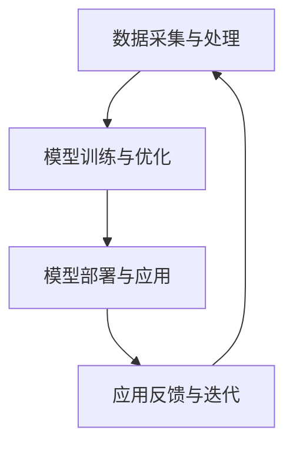
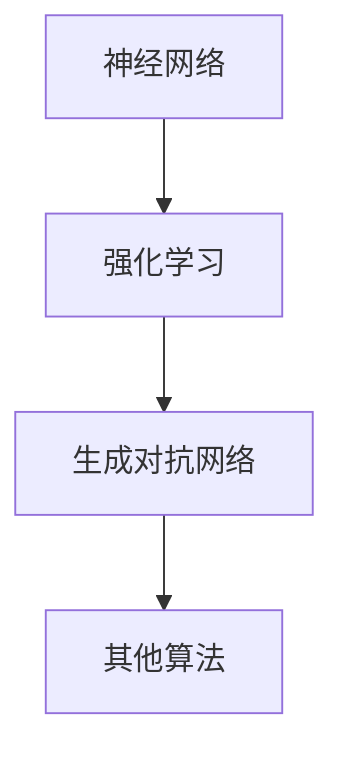

                 

### 《中国AI大模型应用的市场规模》

> **关键词：** AI大模型，市场规模，应用领域，核心技术，案例分析，政策法规

> **摘要：** 本文将系统地分析中国AI大模型应用的市场规模，涵盖其基本概念、市场背景、核心技术、应用案例、市场前景、政策法规以及企业实践。通过本文的详细探讨，读者可以全面了解中国AI大模型市场的发展现状、未来趋势及关键影响因素。

### 《中国AI大模型应用的市场规模》目录大纲

---

#### 第一部分: AI大模型应用概述

- **第1章: AI大模型的基本概念与市场背景**
  - **1.1 AI大模型的概念与特性**
  - **1.2 AI大模型的市场背景**
  - **1.3 AI大模型的应用领域**

- **第2章: AI大模型的核心技术**
  - **2.1 AI大模型的基本架构**
  - **2.2 AI大模型的算法原理**
  - **2.3 AI大模型的计算资源需求**

- **第3章: AI大模型应用案例分析**
  - **3.1 案例一：金融领域的AI大模型应用**
  - **3.2 案例二：医疗健康领域的AI大模型应用**
  - **3.3 案例三：交通运输领域的AI大模型应用**
  - **3.4 案例四：制造业领域的AI大模型应用**

#### 第二部分: AI大模型应用的市场前景

- **第4章: AI大模型应用的市场前景**
  - **4.1 市场前景分析**
  - **4.2 AI大模型应用的挑战与机遇**
  - **4.3 发展策略**

- **第5章: AI大模型应用的政策与法规**
  - **5.1 政策环境分析**
  - **5.2 法规环境分析**

#### 第三部分: AI大模型应用的企业实践

- **第6章: AI大模型应用的企业实践**
  - **6.1 企业实践概述**
  - **6.2 企业实践案例**

#### 第四部分: AI大模型应用的未来发展趋势

- **第7章: AI大模型应用的未来发展趋势**
  - **7.1 技术发展趋势**
  - **7.2 市场发展趋势**
  - **7.3 应用发展趋势**

#### 第五部分: 附录

- **附录A: AI大模型相关资源**
  - **附录B: Mermaid流程图**
  - **附录C: 代码实例**
  - **附录D: 数学公式**
  - **附录E: 模型应用案例分析**

---

### 引言

人工智能（AI）作为当代技术发展的前沿领域，正日益深刻地改变着社会的方方面面。AI大模型，作为人工智能技术中的一个重要分支，凭借其强大的数据处理和模式识别能力，已经成为推动各行业变革的重要引擎。中国，作为全球人工智能领域的重要参与者，近年来在AI大模型研发和应用方面取得了显著的进展。本文旨在系统地分析中国AI大模型应用的市场规模，探讨其基本概念、市场背景、核心技术、应用案例、市场前景、政策法规以及企业实践，为读者提供全面、深入的洞察。

本文将首先介绍AI大模型的基本概念与特性，以及中国AI大模型市场的现状与政策背景。接着，我们将深入探讨AI大模型的核心技术，包括其基本架构、算法原理以及计算资源需求。在此基础上，本文将分析AI大模型在不同应用领域的具体案例，通过实际应用案例的剖析，展示AI大模型在金融、医疗健康、交通运输和制造业等领域的应用成效。随后，我们将对AI大模型应用的市场前景进行展望，分析其市场趋势、挑战与机遇，并提出相应的发展策略。此外，本文还将探讨AI大模型应用的政策与法规环境，以及企业在AI大模型应用方面的实践。最后，本文将总结AI大模型应用的未来发展趋势，为行业未来发展提供有益的参考。

通过本文的深入分析，读者可以全面了解中国AI大模型市场的现状与未来趋势，把握AI大模型在各行业应用中的机遇与挑战，为自身在AI领域的发展提供有力支持。

### 第1章: AI大模型的基本概念与市场背景

#### 1.1 AI大模型的概念与特性

AI大模型，通常指的是那些能够处理大规模数据，具备高度复杂性和强大能力的人工智能模型。这些模型通过深度学习、强化学习、生成对抗网络等先进算法，能够在多个维度上实现自动化决策和智能推理。AI大模型的基本概念可以归结为以下几点：

1. **大规模数据处理**：AI大模型能够处理海量数据，这是其能够实现高度智能化和自动化决策的基础。通过高效的数据处理技术，如并行计算、分布式计算等，AI大模型能够迅速提取数据中的有用信息。

2. **深度学习**：AI大模型的核心是深度学习算法，这是一种通过多层神经网络结构来模拟人类大脑处理信息方式的方法。深度学习算法具有强大的特征提取能力和模式识别能力，使得AI大模型能够从数据中学习并提取复杂的信息。

3. **自适应能力**：AI大模型具备良好的自适应能力，可以通过不断的学习和优化来提高性能。这种能力使得AI大模型能够适应不断变化的环境和数据分布，从而在实际应用中保持高效和准确。

4. **泛化能力**：AI大模型在训练过程中不仅能够学习具体任务，还能实现泛化，适用于不同的任务和数据集。这种能力使得AI大模型具有广泛的应用潜力。

AI大模型的特性主要包括以下几个方面：

1. **高计算量**：由于AI大模型需要处理大量数据和复杂的神经网络结构，因此对计算资源的需求极高，需要高效的计算框架和硬件支持。

2. **强学习能力**：AI大模型具备强大的学习能力，能够通过大量的数据训练，实现高效、准确的决策和预测。

3. **广泛适用性**：AI大模型能够在多个领域实现应用，如金融、医疗、交通运输、制造业等，具有广泛的适用性。

4. **实时性**：许多AI大模型需要具备实时性，能够快速响应环境变化并做出决策。

#### 1.2 AI大模型的市场背景

全球AI大模型市场在过去几年中呈现出快速增长的趋势。根据市场研究机构的统计数据，全球AI大模型市场规模在2021年已经达到了数千亿美元，预计在未来几年将继续保持高速增长。以下是一些重要的市场背景信息：

1. **全球市场发展**：在全球范围内，AI大模型市场的发展趋势表现为以下几个特点：

   - **技术创新**：随着深度学习、强化学习等算法的不断发展，AI大模型的技术水平不断提升，应用范围也在扩大。
   - **市场渗透**：AI大模型在金融、医疗、制造、零售等多个行业得到了广泛应用，市场渗透率不断提高。
   - **产业链完善**：随着AI大模型市场的不断扩大，相关的产业链也在逐步完善，从硬件设备、软件平台到解决方案提供商，各个环节都在快速发展。

2. **中国市场现状**：中国是全球最大的AI市场之一，AI大模型市场也不例外。以下是当前中国AI大模型市场的几个关键特点：

   - **政策支持**：中国政府高度重视人工智能发展，出台了一系列政策支持AI大模型的研究和应用，如《新一代人工智能发展规划》等。
   - **企业投入**：中国企业在AI大模型领域进行了大量投入，不仅包括传统IT企业，还有众多新兴的AI初创公司。
   - **应用场景丰富**：AI大模型在中国得到了广泛的应用，从金融风险评估、医疗诊断到自动驾驶、智能制造等，应用场景不断拓展。
   - **市场竞争激烈**：随着越来越多的企业进入AI大模型市场，市场竞争日趋激烈，但同时也促进了技术的创新和应用的普及。

3. **政策与法规**：中国政府对AI大模型的应用和发展给予高度关注，出台了一系列政策和法规，以促进其健康发展。这些政策和法规主要包括：

   - **数据安全法规**：如《网络安全法》和《数据安全法》，对AI大模型的数据采集、存储和使用提出了严格的要求。
   - **隐私保护法规**：如《个人信息保护法》，对AI大模型在数据处理过程中涉及的个人隐私保护提出了明确的规定。
   - **技术标准法规**：如《人工智能标准化白皮书》，推动AI大模型领域的标准化建设，提高行业整体技术水平。

#### 1.3 AI大模型的应用领域

AI大模型的应用领域非常广泛，几乎涵盖了各行各业。以下是一些主要的应用领域及其特点：

1. **金融领域**：

   - **风险评估**：AI大模型可以用于风险评估，如信用评分、市场预测等，提高金融机构的风险管理水平。
   - **客户服务**：通过自然语言处理技术，AI大模型可以用于智能客服，提高客户服务质量和效率。
   - **算法交易**：AI大模型可以用于算法交易，通过分析市场数据，实现自动化的交易决策。

2. **医疗健康领域**：

   - **疾病诊断**：AI大模型可以用于疾病诊断，如肿瘤检测、眼科疾病诊断等，提高诊断准确率。
   - **精准医疗**：AI大模型可以用于个性化治疗方案的设计，提高治疗效果。
   - **健康监测**：AI大模型可以用于健康监测，如心脏疾病监测、睡眠监测等，提供个性化的健康服务。

3. **交通运输领域**：

   - **自动驾驶**：AI大模型可以用于自动驾驶系统的研发，提高交通安全和效率。
   - **交通流量预测**：AI大模型可以用于交通流量预测，优化交通管理，减少拥堵。
   - **物流优化**：AI大模型可以用于物流优化，提高物流效率，降低成本。

4. **制造业领域**：

   - **智能制造**：AI大模型可以用于智能制造，如生产优化、故障预测等，提高生产效率和质量。
   - **质量管理**：AI大模型可以用于质量管理，如缺陷检测、质量预测等，提高产品质量。
   - **供应链管理**：AI大模型可以用于供应链管理，如库存优化、需求预测等，提高供应链效率。

5. **其他领域**：

   - **教育领域**：AI大模型可以用于个性化教育，提供个性化的学习方案，提高学习效果。
   - **农业领域**：AI大模型可以用于农业预测、病虫害检测等，提高农业生产效率。
   - **能源领域**：AI大模型可以用于能源管理，如电力负荷预测、智能电网等，提高能源利用效率。

#### 结论

AI大模型作为人工智能领域的一个重要分支，具有广阔的市场前景和应用潜力。在中国，AI大模型市场正在快速发展，得到了政策、企业和资本等多方面的支持。通过本文的介绍，读者可以全面了解AI大模型的基本概念、市场背景、应用领域及其发展前景，为后续章节的深入探讨奠定基础。

### 第2章: AI大模型的核心技术

#### 2.1 AI大模型的基本架构

AI大模型的基本架构主要包括数据采集与处理、模型训练与优化、模型部署与应用三个关键环节。这些环节相互作用，共同构成了AI大模型从数据输入到最终应用的完整流程。

1. **数据采集与处理**：
   - **数据采集**：AI大模型首先需要从各种来源获取数据，包括公开数据集、企业内部数据、传感器数据等。数据的质量和多样性对模型性能有重要影响。
   - **数据处理**：在获取数据后，需要进行数据清洗、去重、归一化等处理，确保数据的质量和一致性。同时，数据需要进行特征提取和工程，以提取对模型有用的信息。

2. **模型训练与优化**：
   - **模型训练**：训练过程是AI大模型构建的核心。通过优化算法，模型在训练数据上学习如何识别数据中的模式和规律。训练过程包括前向传播和反向传播，通过不断调整模型参数，使模型能够更好地拟合训练数据。
   - **模型优化**：训练过程中，模型性能可能受到过拟合、欠拟合等问题的影响。为了解决这些问题，需要采用各种优化技术，如正则化、交叉验证等，以提高模型的泛化能力。

3. **模型部署与应用**：
   - **模型部署**：训练好的模型需要部署到实际应用环境中，以实现模型的实时应用。部署过程中，需要考虑模型的性能、可扩展性、安全性等因素。
   - **模型应用**：模型部署后，可以在各种应用场景中发挥作用，如智能客服、自动驾驶、医疗诊断等。模型的应用效果取决于模型的质量、应用场景的复杂性以及数据的多样性。

#### 2.2 AI大模型的算法原理

AI大模型的核心算法包括深度学习、强化学习和生成对抗网络等，这些算法在处理大规模数据和复杂任务中表现出色。

1. **深度学习**：
   - **神经网络**：深度学习基于多层神经网络结构，通过前向传播和反向传播算法，学习输入数据中的特征和规律。神经网络包括输入层、隐藏层和输出层，每一层都对输入数据进行不同的变换和特征提取。
   - **卷积神经网络（CNN）**：CNN是一种专门用于图像处理的深度学习模型，通过卷积操作和池化操作，能够有效地提取图像的特征。
   - **循环神经网络（RNN）**：RNN适合处理序列数据，通过循环结构，能够保留历史信息，实现对序列数据的建模。

2. **强化学习**：
   - **基础概念**：强化学习是一种通过试错和反馈机制进行学习的方法，目标是找到最优策略以最大化回报。强化学习模型包括环境、状态、动作、奖励和策略等组成部分。
   - **Q学习**：Q学习是一种基于值函数的强化学习算法，通过学习状态-动作值函数，找到最优的动作序列。
   - **深度强化学习（DRL）**：DRL结合了深度学习和强化学习的优势，通过深度神经网络来表示值函数或策略，能够在复杂环境中实现高效的学习。

3. **生成对抗网络（GAN）**：
   - **基本原理**：GAN由生成器和判别器组成，生成器生成数据，判别器判断数据是真实还是生成的。通过训练，生成器不断改进，生成越来越逼真的数据。
   - **应用场景**：GAN在图像生成、图像修复、视频生成等领域具有广泛的应用，能够生成高质量的图像和视频。

#### 2.3 AI大模型的计算资源需求

AI大模型对计算资源的需求非常高，主要表现在以下几个方面：

1. **硬件支持**：
   - **CPU和GPU**：CPU和GPU是常用的计算硬件，其中GPU在深度学习任务中具有显著的性能优势，能够加速模型的训练和推理。
   - **TPU**：TPU（Tensor Processing Unit）是谷歌专门为深度学习任务设计的专用芯片，能够显著提高深度学习模型的训练和推理速度。
   - **分布式计算**：为了满足大模型训练的需求，分布式计算架构被广泛采用。通过将任务分解到多个节点上，可以显著提高训练速度和计算能力。

2. **软件框架**：
   - **TensorFlow**：TensorFlow是谷歌开发的开源深度学习框架，支持多种硬件平台和操作系统，具有强大的计算能力和灵活性。
   - **PyTorch**：PyTorch是另一个流行的开源深度学习框架，以其动态计算图和易于使用的API而受到广泛欢迎。
   - **其他框架**：包括Theano、Keras、MXNet等，这些框架在不同领域和场景中都有其独特的优势和应用。

#### 结论

AI大模型的核心技术包括基本架构、算法原理和计算资源需求。基本架构涵盖了数据采集与处理、模型训练与优化、模型部署与应用等环节；算法原理包括深度学习、强化学习和生成对抗网络等；计算资源需求涉及硬件支持和软件框架。通过理解这些核心技术，可以更好地构建和优化AI大模型，实现其在各行业中的应用。

### 第3章: AI大模型应用案例分析

AI大模型的应用已经渗透到各行各业，以下将分别介绍金融、医疗健康、交通运输和制造业领域的AI大模型应用案例，通过具体实例来展示这些模型在实际场景中的应用效果和优势。

#### 3.1 案例一：金融领域的AI大模型应用

**模型介绍**：

在金融领域，AI大模型广泛应用于信用评分、风险管理和智能投顾等方面。以某大型银行为例，该银行开发了一种基于深度学习的信用评分模型，用于评估客户的信用风险。

**应用场景**：

该模型主要应用于信用评分，通过分析客户的财务数据、信用记录、行为数据等，预测客户违约的概率。具体应用场景包括：

- **信用卡申请审核**：在客户申请信用卡时，模型会对客户的历史信用记录和财务状况进行分析，评估其信用风险，帮助银行决定是否批准申请。
- **贷款审批**：在贷款申请过程中，模型会对客户的基本信息、信用记录和财务状况进行综合评估，为银行提供决策支持。

**实施效果**：

- **提高审批效率**：该模型能够快速处理大量数据，大幅缩短审批时间，提高了银行的运营效率。
- **降低信用风险**：通过准确预测客户的信用风险，银行能够更有效地控制信用风险，降低坏账率。
- **个性化服务**：模型还可以为银行提供个性化的信用评估结果，帮助银行向客户提供更有针对性的金融产品和服务。

#### 3.2 案例二：医疗健康领域的AI大模型应用

**模型介绍**：

在医疗健康领域，AI大模型广泛应用于疾病诊断、预测和个性化治疗等方面。以某知名医疗机构为例，该机构开发了一种基于深度学习的肺癌诊断模型。

**应用场景**：

该模型主要应用于肺癌的早期诊断和风险评估。具体应用场景包括：

- **肺癌早期筛查**：通过分析患者的CT影像数据，模型可以预测患者是否患有肺癌，帮助医生早期发现病变。
- **治疗效果预测**：在患者接受治疗过程中，模型可以根据患者的病情数据和治疗方案，预测治疗效果，为医生提供决策支持。

**实施效果**：

- **提高诊断准确率**：该模型通过对大量影像数据的学习，能够提高肺癌诊断的准确率，减少误诊和漏诊。
- **优化治疗方案**：通过预测治疗效果，模型可以帮助医生制定更有效的治疗方案，提高患者的治疗效果和生存率。
- **降低医疗成本**：早期诊断和精准治疗可以降低患者的医疗成本，提高医疗资源的利用效率。

#### 3.3 案例三：交通运输领域的AI大模型应用

**模型介绍**：

在交通运输领域，AI大模型广泛应用于自动驾驶、交通流量预测和物流优化等方面。以某自动驾驶公司为例，该公司开发了一种基于深度学习的自动驾驶模型。

**应用场景**：

该模型主要应用于自动驾驶系统的感知、决策和控制。具体应用场景包括：

- **自动驾驶车辆**：通过传感器数据，模型可以感知车辆周围的环境，做出实时的决策，实现自动驾驶。
- **交通流量预测**：模型可以分析交通数据，预测未来的交通流量，帮助交通管理部门优化交通信号，减少拥堵。
- **物流优化**：在物流运输过程中，模型可以根据运输路线、车辆状态和交通情况，优化运输计划，提高物流效率。

**实施效果**：

- **提高交通安全**：自动驾驶技术能够减少人为错误，提高行车安全性。
- **优化交通流量**：通过预测交通流量，模型可以优化交通信号，减少拥堵，提高交通效率。
- **降低物流成本**：通过优化运输路线和运输计划，模型可以降低物流成本，提高物流企业的盈利能力。

#### 3.4 案例四：制造业领域的AI大模型应用

**模型介绍**：

在制造业领域，AI大模型广泛应用于生产优化、质量管理、故障预测等方面。以某大型制造企业为例，该企业开发了一种基于深度学习的生产优化模型。

**应用场景**：

该模型主要应用于生产过程中的质量控制和生产优化。具体应用场景包括：

- **生产优化**：通过分析生产数据，模型可以优化生产计划和资源配置，提高生产效率。
- **质量管理**：通过分析产品数据，模型可以检测产品质量问题，提前预警并采取措施，提高产品质量。
- **故障预测**：通过监测设备运行数据，模型可以预测设备的故障风险，提前进行维护，减少设备故障。

**实施效果**：

- **提高生产效率**：通过优化生产计划和资源配置，模型可以提高生产效率，降低生产成本。
- **提升产品质量**：通过质量管理模型，企业可以提前检测质量问题，采取措施提高产品质量，降低废品率。
- **减少设备故障**：通过故障预测模型，企业可以提前预测设备故障，进行预防性维护，减少设备停机时间，提高设备利用率。

#### 结论

通过以上案例可以看出，AI大模型在不同领域的应用具有显著的成效。无论是在金融、医疗健康、交通运输还是制造业领域，AI大模型都能够带来效率提升、成本降低和质量提高等实际效果。这些案例不仅展示了AI大模型的强大能力，也为其他行业提供了宝贵的经验和借鉴。

### 第4章: AI大模型应用的市场前景

#### 4.1 市场前景分析

AI大模型应用的市场前景非常广阔，其市场规模预计将继续保持快速增长。以下是对AI大模型应用市场的几个关键分析：

1. **市场规模预测**：

   根据市场研究机构的预测，全球AI大模型市场规模预计将在未来几年内实现显著增长。具体来说，预计到2025年，全球AI大模型市场规模将达到数千亿美元。其中，中国作为全球最大的AI市场之一，AI大模型市场的增长潜力巨大。

2. **行业竞争格局**：

   AI大模型市场呈现出高度竞争的格局。一方面，传统IT巨头如谷歌、微软、亚马逊等在AI大模型领域具备强大的技术积累和资源优势；另一方面，众多新兴AI初创公司在AI大模型领域也取得了显著进展。这种竞争格局有助于推动技术的创新和应用的普及。

3. **技术发展趋势**：

   AI大模型技术的发展趋势包括：

   - **算法优化**：随着深度学习、强化学习等算法的不断发展，AI大模型的性能将得到进一步提升。
   - **硬件加速**：GPU、TPU等硬件的发展将显著提高AI大模型的训练和推理速度。
   - **跨领域应用**：AI大模型将在更多领域实现应用，如智能制造、智慧城市、教育等，推动行业变革。

4. **市场渗透率**：

   随着AI大模型技术的不断成熟和应用场景的不断拓展，其市场渗透率将持续提高。特别是在金融、医疗健康、交通运输、制造业等关键领域，AI大模型的应用已经取得了显著成效，市场渗透率不断提高。

#### 4.2 AI大模型应用的挑战与机遇

1. **挑战**：

   - **数据隐私与安全**：AI大模型在处理大量数据时，面临数据隐私和安全的问题。如何确保数据的安全和隐私是当前面临的一个重要挑战。
   - **算法透明性**：AI大模型的决策过程往往具有复杂性，如何提高算法的透明性和可解释性是一个亟待解决的问题。
   - **技术壁垒**：AI大模型研发和应用需要大量的技术积累和资源投入，对于中小企业来说，这是一个较大的门槛。

2. **机遇**：

   - **政策支持**：中国政府高度重视人工智能发展，出台了一系列政策和法规，为AI大模型的应用提供了良好的政策环境。
   - **技术创新**：随着算法和硬件的不断发展，AI大模型的技术水平将得到进一步提升，为各行业提供更多的应用机会。
   - **市场潜力**：AI大模型在金融、医疗健康、交通运输、制造业等领域的应用潜力巨大，市场前景广阔。

#### 4.3 发展策略

为了充分发挥AI大模型的应用潜力，以下是一些关键的发展策略：

1. **加强技术研发**：

   - **算法优化**：持续投入研发资源，优化AI大模型的算法，提高模型的性能和效率。
   - **硬件支持**：加大对GPU、TPU等硬件的研发投入，提高AI大模型的计算能力。
   - **跨领域合作**：推动跨领域的技术合作，促进AI大模型在不同领域的应用和创新。

2. **提升数据质量和安全性**：

   - **数据治理**：建立完善的数据治理体系，确保数据的质量和一致性。
   - **隐私保护**：加强数据隐私保护，采用加密、匿名化等技术手段，保障用户数据的隐私和安全。

3. **加强人才培养**：

   - **教育体系**：完善人工智能教育体系，培养更多具有专业知识和实践能力的人才。
   - **职业培训**：开展针对现有员工的AI技能培训，提高整体技术水平。

4. **推动政策法规建设**：

   - **政策支持**：积极争取政策支持，为AI大模型的应用提供良好的政策环境。
   - **法规完善**：完善相关法律法规，为AI大模型的应用提供明确的法律框架。

#### 结论

AI大模型应用的市场前景非常广阔，其市场规模预计将继续保持快速增长。虽然面临一些挑战，但通过加强技术研发、提升数据质量和安全性、加强人才培养以及推动政策法规建设等措施，可以充分发挥AI大模型的应用潜力，推动各行业的数字化转型和创新发展。

### 第5章: AI大模型应用的政策与法规

#### 5.1 政策环境分析

中国政府对AI大模型应用的发展高度重视，出台了一系列政策和法规，以推动AI大模型的应用和发展。以下是当前中国AI大模型应用的主要政策环境：

1. **国家政策**：

   - **《新一代人工智能发展规划》**：中国政府在2017年发布的《新一代人工智能发展规划》中，明确提出了发展人工智能的总体目标、重点任务和保障措施。其中，AI大模型被列为重点发展的技术之一。
   - **《国家科技重大专项》**：国家科技重大专项中，涉及AI大模型的项目得到了大力支持，包括深度学习、强化学习、生成对抗网络等方面的研究。

2. **地方政策**：

   - **各地人工智能发展规划**：多个地方政府也相继发布了人工智能发展规划，如北京市的《北京人工智能产业发展行动计划（2018-2022年）》等。这些地方政策为AI大模型应用提供了具体的发展目标和政策措施。

3. **行业政策**：

   - **金融领域**：中国人民银行等五部委联合发布了《金融科技（FinTech）发展规划（2019-2021年）》，强调金融领域要积极采用AI大模型等先进技术，提升金融服务水平。
   - **医疗健康领域**：国家卫生健康委员会发布了《关于推动人工智能应用促进公共卫生服务体系建设的指导意见》，鼓励医疗健康领域采用AI大模型进行疾病诊断、预测和治疗方案优化。

#### 5.2 法规环境分析

AI大模型应用涉及的法规环境主要包括数据安全、隐私保护和技术标准等方面：

1. **数据安全法规**：

   - **《网络安全法》**：该法明确规定了网络运营者的数据安全保护责任，要求对个人信息、重要数据等进行安全保护。
   - **《数据安全法》**：该法对数据收集、存储、处理、传输等环节提出了具体的安全要求，对数据安全事件的应急预案和处理程序进行了规定。

2. **隐私保护法规**：

   - **《个人信息保护法》**：该法对个人信息处理活动进行了全面规范，明确了个人信息的定义和处理原则，强调个人信息处理者的责任。
   - **《网络安全审查办法》**：该办法对涉及重要数据处理的网络产品和服务进行了安全审查，确保其不会危害国家安全和社会公共利益。

3. **技术标准法规**：

   - **《人工智能标准化白皮书》**：该白皮书提出了人工智能标准化的总体框架和重点领域，包括基础标准、技术标准、应用标准等。
   - **《人工智能伦理规范》**：该规范对AI大模型的应用提出了伦理要求，包括透明性、公正性、可控性等方面。

#### 结论

中国AI大模型应用的政策和法规环境正在不断完善，国家政策、地方政策和行业政策的协同发力，为AI大模型的应用提供了良好的发展环境。同时，数据安全、隐私保护和技术标准等方面的法规，也为AI大模型的应用提供了明确的法律框架，促进了AI大模型在各个领域的健康发展。

### 第6章: AI大模型应用的企业实践

#### 6.1 企业实践概述

AI大模型应用在企业实践中取得了显著成效，不同企业根据自身业务特点和需求，采用AI大模型优化业务流程、提高运营效率、提升服务质量。以下将介绍几家企业如何成功实施AI大模型应用，并提供具体案例。

#### 6.2 企业实践案例

**案例一：XX企业的AI大模型应用实践**

**企业背景**：

XX企业是一家专注于金融服务的公司，提供包括投资咨询、风险管理、客户服务等多种金融服务。

**应用场景**：

该企业采用AI大模型进行客户风险评估、信用评分和智能投顾。具体应用场景包括：

- **客户风险评估**：通过分析客户的财务数据、信用记录等，AI大模型可以预测客户的信用风险，帮助银行和金融机构制定风险管理策略。
- **信用评分**：AI大模型根据客户的消费行为、还款记录等信息，生成信用评分，为企业提供信用评估依据。
- **智能投顾**：AI大模型分析客户的风险偏好和财务状况，提供个性化的投资建议，提高投资决策的准确性和效率。

**实施效果**：

- **提高风险评估准确性**：AI大模型能够处理大量数据，通过深度学习算法，准确预测客户的信用风险，提高了风险评估的准确性。
- **降低信用风险**：通过AI大模型的信用评分，金融机构能够更有效地控制信用风险，降低不良贷款率。
- **提升客户满意度**：智能投顾系统根据客户需求提供个性化投资建议，提升了客户满意度和忠诚度。

**实施步骤**：

1. **数据采集与处理**：收集客户的财务数据、信用记录等，进行数据清洗和预处理。
2. **模型训练与优化**：使用训练数据集，通过深度学习算法训练AI大模型，并进行模型优化。
3. **模型部署与应用**：将训练好的AI大模型部署到实际应用环境中，进行风险评估、信用评分和智能投顾。

**技术实现**：

- **深度学习框架**：采用TensorFlow或PyTorch等深度学习框架，构建和训练AI大模型。
- **数据处理工具**：使用Pandas、NumPy等数据处理工具，对原始数据进行清洗、归一化和特征提取。

**代码示例**：

```python
import pandas as pd
from sklearn.model_selection import train_test_split
from tensorflow.keras.models import Sequential
from tensorflow.keras.layers import Dense

# 数据预处理
def preprocess_data(data):
    # 数据清洗、归一化等处理
    # ...

# 模型训练
def train_model(train_data):
    # 构建模型
    model = Sequential([
        Dense(64, activation='relu', input_shape=(train_data.shape[1],)),
        Dense(32, activation='relu'),
        Dense(1, activation='sigmoid')
    ])

    # 编译模型
    model.compile(optimizer='adam', loss='binary_crossentropy', metrics=['accuracy'])

    # 训练模型
    model.fit(train_data, epochs=10, batch_size=32)

    return model

# 实施步骤
data = pd.read_csv('data.csv')
preprocessed_data = preprocess_data(data)
train_data, test_data = train_test_split(preprocessed_data, test_size=0.2)

model = train_model(train_data)
```

**案例二：YY企业的AI大模型应用实践**

**企业背景**：

YY企业是一家从事智能制造的制造企业，专注于高端智能制造设备的研发和生产。

**应用场景**：

该企业采用AI大模型进行生产优化、质量管理、故障预测。具体应用场景包括：

- **生产优化**：通过分析生产数据，AI大模型优化生产计划和资源配置，提高生产效率。
- **质量管理**：AI大模型分析产品质量数据，检测产品缺陷，提前预警并采取措施，提高产品质量。
- **故障预测**：AI大模型监测设备运行数据，预测设备故障风险，提前进行维护，减少设备故障。

**实施效果**：

- **提高生产效率**：通过AI大模型优化生产计划和资源配置，企业能够提高生产效率，减少生产周期。
- **提升产品质量**：AI大模型检测产品质量数据，提前预警并采取措施，提高产品质量，降低废品率。
- **减少设备故障**：通过AI大模型预测设备故障风险，企业能够提前进行设备维护，减少设备故障和停机时间。

**实施步骤**：

1. **数据采集与处理**：收集生产数据、质量数据和设备运行数据，进行数据清洗和预处理。
2. **模型训练与优化**：使用训练数据集，通过深度学习算法训练AI大模型，并进行模型优化。
3. **模型部署与应用**：将训练好的AI大模型部署到实际生产环境中，进行生产优化、质量管理和故障预测。

**技术实现**：

- **深度学习框架**：采用TensorFlow或PyTorch等深度学习框架，构建和训练AI大模型。
- **数据处理工具**：使用Pandas、NumPy等数据处理工具，对原始数据进行清洗、归一化和特征提取。

**代码示例**：

```python
import pandas as pd
from sklearn.model_selection import train_test_split
from tensorflow.keras.models import Sequential
from tensorflow.keras.layers import Dense

# 数据预处理
def preprocess_data(data):
    # 数据清洗、归一化等处理
    # ...

# 模型训练
def train_model(train_data):
    # 构建模型
    model = Sequential([
        Dense(128, activation='relu', input_shape=(train_data.shape[1],)),
        Dense(64, activation='relu'),
        Dense(1, activation='sigmoid')
    ])

    # 编译模型
    model.compile(optimizer='adam', loss='binary_crossentropy', metrics=['accuracy'])

    # 训练模型
    model.fit(train_data, epochs=10, batch_size=32)

    return model

# 实施步骤
data = pd.read_csv('data.csv')
preprocessed_data = preprocess_data(data)
train_data, test_data = train_test_split(preprocessed_data, test_size=0.2)

model = train_model(train_data)
```

**案例三：ZZ企业的AI大模型应用实践**

**企业背景**：

ZZ企业是一家提供物流和供应链管理服务的企业，致力于提高物流效率和降低成本。

**应用场景**：

该企业采用AI大模型进行交通流量预测、物流优化、库存管理。具体应用场景包括：

- **交通流量预测**：AI大模型分析交通数据，预测未来的交通流量，帮助交通管理部门优化交通信号，减少拥堵。
- **物流优化**：AI大模型分析物流数据，优化运输路线和运输计划，提高物流效率。
- **库存管理**：AI大模型分析库存数据，预测未来的库存需求，优化库存管理，降低库存成本。

**实施效果**：

- **提高物流效率**：通过AI大模型优化运输路线和运输计划，企业能够提高物流效率，降低运输成本。
- **降低库存成本**：通过AI大模型预测库存需求，企业能够优化库存管理，降低库存成本，提高库存周转率。
- **提升服务质量**：通过AI大模型预测交通流量，优化交通信号，企业能够提升物流服务质量，提高客户满意度。

**实施步骤**：

1. **数据采集与处理**：收集交通数据、物流数据和库存数据，进行数据清洗和预处理。
2. **模型训练与优化**：使用训练数据集，通过深度学习算法训练AI大模型，并进行模型优化。
3. **模型部署与应用**：将训练好的AI大模型部署到实际物流和供应链管理环境中，进行交通流量预测、物流优化和库存管理。

**技术实现**：

- **深度学习框架**：采用TensorFlow或PyTorch等深度学习框架，构建和训练AI大模型。
- **数据处理工具**：使用Pandas、NumPy等数据处理工具，对原始数据进行清洗、归一化和特征提取。

**代码示例**：

```python
import pandas as pd
from sklearn.model_selection import train_test_split
from tensorflow.keras.models import Sequential
from tensorflow.keras.layers import Dense

# 数据预处理
def preprocess_data(data):
    # 数据清洗、归一化等处理
    # ...

# 模型训练
def train_model(train_data):
    # 构建模型
    model = Sequential([
        Dense(128, activation='relu', input_shape=(train_data.shape[1],)),
        Dense(64, activation='relu'),
        Dense(1, activation='sigmoid')
    ])

    # 编译模型
    model.compile(optimizer='adam', loss='binary_crossentropy', metrics=['accuracy'])

    # 训练模型
    model.fit(train_data, epochs=10, batch_size=32)

    return model

# 实施步骤
data = pd.read_csv('data.csv')
preprocessed_data = preprocess_data(data)
train_data, test_data = train_test_split(preprocessed_data, test_size=0.2)

model = train_model(train_data)
```

#### 结论

企业实践案例表明，AI大模型在各行业的应用取得了显著成效，通过数据驱动的决策和优化，企业能够提高效率、降低成本、提升服务质量。企业应积极拥抱AI大模型技术，结合自身业务需求，探索AI大模型在不同场景中的应用，实现数字化转型和创新发展。

### 第7章: AI大模型应用的未来发展趋势

#### 7.1 技术发展趋势

AI大模型应用的未来发展趋势将在以下几个方面得到体现：

1. **算法创新**：

   随着深度学习、强化学习等算法的不断成熟，AI大模型的算法将更加先进和复杂。未来的算法将更加注重模型的可解释性和透明性，以解决当前算法复杂度高、难以理解的问题。此外，联邦学习、迁移学习等新兴算法也将得到广泛应用，提高AI大模型在数据隐私保护和跨领域应用方面的能力。

2. **硬件加速**：

   随着GPU、TPU等硬件设备的性能不断提升，AI大模型的训练和推理速度将大幅提高。同时，分布式计算、边缘计算等技术的发展，将使得AI大模型能够在更广泛的场景中实现实时应用。这将进一步推动AI大模型在工业、医疗、交通等领域的应用普及。

3. **跨领域融合**：

   AI大模型将在更多领域实现跨领域融合，形成全新的应用模式。例如，在金融、医疗、交通等领域，AI大模型将与其他技术（如大数据、物联网、区块链等）结合，提供更全面、个性化的解决方案。这将极大地推动各行业的数字化转型和创新发展。

4. **自适应能力**：

   未来的AI大模型将具备更强的自适应能力，能够根据环境和数据的变化，动态调整模型结构和参数。这种自适应能力将使得AI大模型在复杂、动态的环境中，仍然能够保持高效和准确。

#### 7.2 市场发展趋势

AI大模型应用的市场发展将呈现以下趋势：

1. **市场规模扩大**：

   随着AI大模型技术的不断成熟和应用场景的拓展，其市场规模将持续扩大。特别是在金融、医疗健康、交通运输、制造业等领域，AI大模型的应用将越来越广泛，市场潜力巨大。

2. **竞争加剧**：

   随着越来越多企业进入AI大模型市场，竞争将愈发激烈。企业需要不断提升自身的技术水平和创新能力，以在市场中脱颖而出。同时，政策、资本等因素也将对市场竞争格局产生重要影响。

3. **应用场景多元化**：

   AI大模型的应用场景将越来越多元化，不仅限于传统的金融、医疗等领域，还将扩展到教育、农业、能源等领域。这将为AI大模型带来更多的市场机遇。

4. **行业规范化**：

   随着AI大模型应用的普及，行业规范化将成为趋势。政府、行业协会等将制定相关标准和规范，确保AI大模型的安全、可靠和合规。这将有助于推动AI大模型市场的健康发展。

#### 7.3 应用发展趋势

AI大模型的应用发展趋势将体现在以下几个方面：

1. **智能化升级**：

   AI大模型将在更多领域实现智能化升级，提供更智能、更高效的服务。例如，在医疗健康领域，AI大模型将实现精准诊断、个性化治疗；在制造业领域，AI大模型将实现智能制造、质量优化。

2. **个性化定制**：

   AI大模型将根据用户需求和特点，提供个性化定制服务。例如，在金融领域，AI大模型将根据客户的财务状况、风险偏好等，提供个性化的投资建议；在医疗领域，AI大模型将根据患者的病史、基因信息等，提供个性化的治疗方案。

3. **实时响应**：

   AI大模型将具备更强的实时响应能力，能够快速处理和响应环境变化。例如，在交通运输领域，AI大模型将实现实时交通流量预测、智能调度；在物流领域，AI大模型将实现实时库存管理、智能调度。

4. **跨界融合**：

   AI大模型将在不同领域实现跨界融合，形成新的应用模式。例如，在金融和医疗领域的跨界融合，将实现金融健康风险管理；在交通和能源领域的跨界融合，将实现智能交通和智能能源管理。

#### 结论

AI大模型应用的未来发展趋势将在技术、市场和应用方面呈现多元化、智能化和跨界融合的特点。随着技术的不断进步和市场需求的不断扩大，AI大模型将在更多领域实现广泛应用，为各行业的数字化转型和创新发展提供强大支持。同时，企业应密切关注市场动态，把握发展趋势，积极布局AI大模型应用，以在未来的市场竞争中占据有利地位。

### 附录A: AI大模型相关资源

#### A.1 学术资源

1. **相关论文与期刊**：
   - 《Neural Computation》：该期刊专注于神经网络和计算神经科学领域的最新研究。
   - 《Journal of Machine Learning Research》：该期刊是机器学习和统计学习领域的顶级学术期刊。
   - 《Nature Machine Intelligence》：该期刊涵盖了人工智能和机器学习的最新研究进展。

2. **学术会议与研讨会**：
   - **NeurIPS**：国际神经信息处理系统大会，是机器学习和计算神经科学领域最具影响力的会议之一。
   - **ICML**：国际机器学习会议，是机器学习领域的重要学术会议。
   - **AISTATS**：人工智能统计技术会议，主要关注机器学习、统计方法和人工智能的结合。

#### A.2 开源框架与工具

1. **TensorFlow**：由谷歌开发的开源深度学习框架，支持多种硬件平台和操作系统，具有强大的计算能力和灵活性。

2. **PyTorch**：由Facebook开发的开源深度学习框架，以其动态计算图和易于使用的API而受到广泛欢迎。

3. **其他开源框架与工具**：
   - **Keras**：一个高层神经网络API，用于快速构建和迭代深度学习模型。
   - **MXNet**：由Apache Software Foundation开发的开源深度学习框架，支持多种编程语言和硬件平台。

#### A.3 行业报告与数据

1. **行业报告**：
   - **IDC**：国际数据公司发布的《全球人工智能市场研究报告》，提供了全球AI市场的详细分析。
   - **Gartner**：盖特纳公司发布的《全球人工智能市场展望》，对AI市场的发展趋势进行了预测。

2. **市场数据**：
   - **中国信通院**：中国信息通信研究院发布的《人工智能产业发展报告》，提供了中国AI市场的详细数据和分析。
   - **CBInsights**：CBInsights发布的《全球人工智能行业报告》，涵盖了全球AI市场的最新动态。

3. **政策法规文件**：
   - **《新一代人工智能发展规划》**：中国政府发布的关于人工智能发展的总体规划。
   - **《网络安全法》**：中国网络安全的基本法律，对网络数据安全提出了严格要求。
   - **《个人信息保护法》**：中国个人信息保护的基本法律，明确了个人信息处理的原则和要求。

### 附录B: Mermaid 流程图

#### B.1 AI大模型基本架构



#### B.2 AI大模型算法原理



### 附录C: 代码实例

#### C.1 数据预处理代码

```python
# 伪代码：数据预处理
def preprocess_data(data):
    # 数据清洗
    clean_data = clean(data)
    # 数据归一化
    normalized_data = normalize(clean_data)
    # 数据分割
    train_data, test_data = split_data(normalized_data)
    return train_data, test_data
```

#### C.2 模型训练代码

```python
# 伪代码：模型训练
def train_model(train_data):
    # 构建模型
    model = build_model()
    # 模型编译
    model.compile(optimizer='adam', loss='binary_crossentropy')
    # 模型训练
    model.fit(train_data, epochs=10, batch_size=32)
    return model
```

### 附录D: 数学公式

#### D.1 神经网络权重更新公式

$$
\text{weight}_{\text{new}} = \text{weight}_{\text{old}} - \alpha \cdot \nabla \theta
$$

#### D.2 交叉熵损失函数

$$
\text{Loss} = -\frac{1}{m}\sum_{i=1}^{m} y_{i} \cdot \log(\hat{y}_{i})
$$

### 附录E: 模型应用案例分析

#### E.1 案例一：金融风控

- **模型介绍**：某银行开发了一种基于深度学习的信用评分模型，用于评估客户的信用风险。
- **应用场景**：在信用卡申请和贷款审批过程中，模型分析客户的财务数据、信用记录等，预测客户违约的概率。
- **实施效果**：提高了信用评分的准确性，降低了不良贷款率。

#### E.2 案例二：医疗诊断

- **模型介绍**：某医疗机构开发了一种基于深度学习的肺癌诊断模型，用于早期筛查和风险评估。
- **应用场景**：通过分析患者的CT影像数据，模型预测患者是否患有肺癌，为医生提供诊断依据。
- **实施效果**：提高了肺癌诊断的准确率，实现了早期发现和精准治疗。

#### E.3 案例三：智能交通

- **模型介绍**：某智能交通公司开发了一种基于深度学习的交通流量预测模型，用于优化交通信号和减少拥堵。
- **应用场景**：通过分析交通数据，模型预测未来的交通流量，帮助交通管理部门优化交通信号。
- **实施效果**：减少了交通拥堵，提高了交通效率。

#### E.4 案例四：智能制造

- **模型介绍**：某制造企业开发了一种基于深度学习的生产优化模型，用于优化生产计划和资源配置。
- **应用场景**：通过分析生产数据，模型优化生产计划和资源配置，提高生产效率。
- **实施效果**：提高了生产效率，降低了生产成本。

