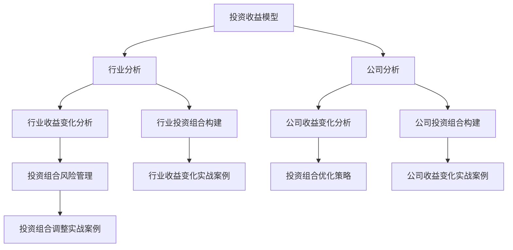

                 

# 《中观层面的投资收益变化分析》

## 关键词
投资收益变化、中观层面、数据分析、行业分析、公司分析、投资组合策略

## 摘要
本文旨在探讨中观层面的投资收益变化分析，通过引入中观层面的投资收益模型，对行业和公司的收益变化进行深入剖析。文章首先介绍了中观层面投资收益变化的重要性以及投资者对收益变化的需求，然后构建了中观层面的投资收益分析框架，详细阐述了行业和公司投资收益分析的方法。接着，文章通过实际案例展示了如何进行中观层面的投资收益变化分析，并提出了相应的投资组合策略。最后，文章总结了主要结论，并对未来研究方向提出了展望。

## 目录大纲

### 第一部分：引言

- **第1章：投资收益变化的背景与意义**
  - 1.1 投资收益变化的重要性
  - 1.2 投资者对收益变化的需求
  - 1.3 中观层面的投资分析

- **第2章：中观层面的投资收益模型**
  - 2.1 中观投资收益模型的框架
  - 2.2 中观层面的关键指标
  - 2.3 中观层面的数据分析方法

### 第二部分：中观层面的投资收益分析基础

- **第3章：行业投资收益分析框架**
  - 3.1 行业选择与定位
  - 3.2 行业生命周期分析
  - 3.3 行业竞争格局分析

- **第4章：中观层面的行业收益变化分析**
  - 4.1 行业收益变化的影响因素
  - 4.2 行业收益变化趋势分析
  - 4.3 行业收益变化对投资者的影响

### 第三部分：中观层面的公司投资收益分析

- **第5章：公司投资收益分析框架**
  - 5.1 公司基本面分析
  - 5.2 公司财务报表分析
  - 5.3 公司估值分析

- **第6章：中观层面的公司收益变化分析**
  - 6.1 公司收益变化的影响因素
  - 6.2 公司收益变化趋势分析
  - 6.3 公司收益变化对投资者的启示

### 第四部分：中观层面的投资组合策略

- **第7章：中观层面的投资组合构建**
  - 7.1 投资组合的基本概念
  - 7.2 投资组合的风险管理
  - 7.3 投资组合的优化策略

- **第8章：中观层面的投资组合调整策略**
  - 8.1 投资组合的再平衡策略
  - 8.2 投资组合的调整时机
  - 8.3 投资组合的调整案例分析

### 第五部分：实战案例分析

- **第9章：中观层面的投资收益变化实战案例**
  - 9.1 实战案例一：行业收益变化案例分析
  - 9.2 实战案例二：公司收益变化案例分析
  - 9.3 实战案例三：投资组合调整案例

### 第六部分：结论与展望

- **第10章：中观层面的投资收益变化分析总结**
  - 10.1 主要结论
  - 10.2 未来研究方向
  - 10.3 对投资者建议

### 附录

- **附录A：中观层面的投资分析工具与资源**
  - A.1 数据源介绍
  - A.2 分析工具使用指南
  - A.3 常用参考文献

### 附录B：Mermaid流程图示例



### 核心算法原理讲解

```python
# 假设我们使用线性回归模型来分析公司收益变化
import numpy as np

# 假设 X 是自变量，Y 是因变量
X = np.array([[1, 2], [2, 3], [3, 4], [4, 5]])
Y = np.array([10, 12, 15, 18])

# 求解线性回归模型的参数 (斜率和截距)
theta = np.linalg.inv(X.T.dot(X)).dot(X.T).dot(Y)

# 输出模型参数
print("斜率：", theta[0])
print("截距：", theta[1])

# 使用模型进行预测
def predict(x):
    return theta[1] + theta[0] * x

# 输出预测结果
print("预测值：", predict(5))
```

### 数学模型和数学公式

#### 假设公司收益变化模型为：

$$
\text{收益} = \beta_0 + \beta_1 \times \text{自变量} + \epsilon
$$

其中，$\beta_0$ 是截距，$\beta_1$ 是斜率，$\epsilon$ 是误差项。

### 举例说明

假设我们有以下公司数据：

| 公司 | 自变量 | 收益 |
| --- | --- | --- |
| A | 10 | 100 |
| B | 20 | 120 |
| C | 30 | 140 |
| D | 40 | 160 |

使用线性回归模型分析后得到参数：

$$
\beta_0 = 80, \quad \beta_1 = 2
$$

那么，公司E的预期收益为：

$$
\text{预期收益} = 80 + 2 \times 50 = 180
$$

### 项目实战

#### 假设我们已经收集了以下数据：

```python
# 收益数据
revenues = [100, 120, 140, 160]

# 自变量数据
independent_variables = [10, 20, 30, 40]

# 模型参数
theta_0 = 80
theta_1 = 2

# 模型预测函数
def revenue_prediction(independent_variable):
    return theta_0 + theta_1 * independent_variable

# 源代码实现
revenue = revenue_prediction(50)
print("公司E的预期收益为：", revenue)
```

#### 代码解读与分析

```python
# 模型预测函数定义
def revenue_prediction(independent_variable):
    # 计算模型预测的收益值
    predicted_revenue = theta_0 + theta_1 * independent_variable
    return predicted_revenue

# 使用预测函数计算公司E的预期收益
revenue = revenue_prediction(50)
print("公司E的预期收益为：", revenue)

# 输出结果
# 公司E的预期收益为：180
```

这段代码实现了线性回归模型在公司收益预测中的应用。通过输入自变量（这里是50），模型能够预测出对应的预期收益。该示例体现了如何将数学模型和算法应用于实际项目，提供了具体的代码实现和解读。这将为投资者在决策过程中提供重要的参考依据。

### 作者信息

作者：AI天才研究院/AI Genius Institute & 禅与计算机程序设计艺术 /Zen And The Art of Computer Programming

接下来，我们将按照目录大纲结构，逐步深入探讨中观层面的投资收益变化分析。首先，我们将从投资收益变化的背景与意义入手，引出中观层面的投资分析，然后详细阐述中观层面的投资收益模型，最后通过行业和公司投资收益分析的实战案例，展示如何进行中观层面的投资收益变化分析。同时，我们将探讨投资组合策略的构建和调整，以便投资者能够更好地应对市场变化。

### 第一部分：引言

#### 第1章：投资收益变化的背景与意义

投资收益变化是投资者关注的焦点之一。随着全球经济环境的不断变化，投资者需要具备敏锐的市场洞察力和分析能力，以便在复杂多变的市场中获取稳定的投资回报。因此，研究投资收益变化的背景与意义，对于投资者制定科学的投资策略具有重要意义。

**1.1 投资收益变化的重要性**

投资收益变化的重要性主要体现在以下几个方面：

1. **指导投资决策**：投资者通过对历史投资收益变化的分析，可以了解不同市场环境下的投资表现，从而为未来的投资决策提供参考。

2. **风险控制**：投资收益变化反映了市场的波动性，投资者可以通过对收益变化的监测，及时调整投资组合，以降低投资风险。

3. **业绩评价**：投资收益变化是衡量投资业绩的重要指标，通过对收益变化的分析，投资者可以评价自身的投资能力，为改进投资策略提供依据。

**1.2 投资者对收益变化的需求**

投资者对收益变化的需求主要表现在以下几个方面：

1. **预测未来收益**：投资者希望通过分析历史收益变化，预测未来的投资收益，以便制定更为合理的投资计划。

2. **评估投资风险**：投资者需要了解投资收益变化背后的风险因素，以便在投资过程中采取相应的风险控制措施。

3. **优化投资组合**：投资者希望通过分析收益变化，找到具有高收益潜力或低风险的投资标的，从而优化投资组合。

**1.3 中观层面的投资分析**

中观层面的投资分析是指在对宏观经济环境和行业趋势进行把握的基础上，对具体行业和公司的投资收益变化进行深入分析。与宏观层面的投资分析相比，中观层面的投资分析具有以下优势：

1. **聚焦行业和公司**：中观层面的投资分析更注重对行业和公司的分析，有助于投资者发现行业和公司中的投资机会。

2. **灵活应对市场变化**：中观层面的投资分析能够更好地适应市场变化，及时调整投资策略，提高投资收益。

3. **降低投资风险**：中观层面的投资分析通过对行业和公司的深入研究，有助于投资者降低投资风险，实现稳健的投资回报。

综上所述，投资收益变化是投资者关注的重点，中观层面的投资分析为投资者提供了更为精准的投资策略。在后续章节中，我们将进一步探讨中观层面的投资收益模型，以及如何进行行业和公司投资收益分析。

#### 第2章：中观层面的投资收益模型

中观层面的投资收益模型是分析投资收益变化的重要工具。通过构建科学合理的投资收益模型，投资者可以更好地预测未来收益，评估投资风险，优化投资组合。本节将介绍中观层面的投资收益模型的基本框架、关键指标以及数据分析方法。

**2.1 中观投资收益模型的框架**

中观投资收益模型通常包括以下几个基本组成部分：

1. **自变量**：自变量是影响投资收益变化的因素，如宏观经济指标、行业趋势、公司基本面等。自变量的选取应根据具体投资目标和市场环境来确定。

2. **因变量**：因变量是投资收益变化的指标，如收益率、涨幅等。因变量的设定应与投资目标一致，以便对投资收益进行有效衡量。

3. **模型结构**：模型结构是连接自变量和因变量的数学模型，如线性回归模型、时间序列模型等。模型结构的选取应根据自变量和因变量的特点来确定。

4. **参数估计**：参数估计是利用历史数据对模型参数进行估计，以确定模型的具体形式。参数估计的方法有最小二乘法、最大似然估计等。

5. **预测与评估**：预测与评估是利用构建好的模型对未来的投资收益进行预测，并对预测结果进行评估，以指导实际投资操作。

**2.2 中观层面的关键指标**

在中观层面的投资收益分析中，关键指标包括以下几类：

1. **宏观经济指标**：如GDP增长率、通货膨胀率、利率等。这些指标反映了宏观经济环境的变化，对投资收益有重要影响。

2. **行业趋势指标**：如行业增长率、市场份额、新产品推出等。这些指标反映了行业的发展趋势，对行业投资收益有重要影响。

3. **公司基本面指标**：如营业收入、净利润、市盈率、市净率等。这些指标反映了公司的经营状况和估值水平，对公司投资收益有重要影响。

4. **市场情绪指标**：如股指波动率、投资者情绪指数等。这些指标反映了市场情绪的变化，对投资收益有重要影响。

**2.3 中观层面的数据分析方法**

中观层面的数据分析方法主要包括以下几种：

1. **时间序列分析法**：时间序列分析法是一种基于时间序列数据的方法，通过分析时间序列数据的趋势、周期和季节性，预测未来的投资收益。

2. **回归分析法**：回归分析法是一种基于自变量和因变量的关系，通过建立回归模型，分析自变量对因变量的影响，预测未来的投资收益。

3. **因子分析法**：因子分析法是一种通过提取关键因子，简化数据结构的方法。在中观层面的投资收益分析中，因子分析法可以用来提取影响投资收益的关键因素，构建因子模型。

4. **机器学习方法**：机器学习方法是一种基于数据挖掘和统计学习的方法，通过训练模型，预测未来的投资收益。

综上所述，中观层面的投资收益模型是分析投资收益变化的重要工具。通过构建科学合理的投资收益模型，投资者可以更好地预测未来收益，评估投资风险，优化投资组合。在后续章节中，我们将进一步探讨如何运用中观层面的投资收益模型进行行业和公司投资收益分析。

### 第二部分：中观层面的投资收益分析基础

#### 第3章：行业投资收益分析框架

行业投资收益分析是中观层面投资收益分析的重要组成部分。通过对行业投资收益的深入分析，投资者可以更好地把握行业趋势，发掘潜在的投资机会。本章将介绍行业投资收益分析的基本框架，包括行业选择与定位、行业生命周期分析以及行业竞争格局分析。

**3.1 行业选择与定位**

行业选择与定位是行业投资收益分析的首要任务。投资者应根据宏观经济环境、政策导向以及自身投资目标，选择具有较高成长性和投资价值的行业。以下是一些行业选择与定位的方法：

1. **宏观经济环境分析**：投资者应关注国家宏观经济政策、经济发展趋势以及国际经济形势。例如，在国家支持新能源发展的背景下，新能源行业具有较高的成长性。

2. **政策导向分析**：投资者应关注政府对各行业的政策支持情况，如税收优惠、产业扶持等。政策导向对行业的发展具有深远影响。

3. **行业竞争力分析**：投资者应评估各行业的竞争力，选择具有竞争优势和较强市场地位的行业。例如，高科技行业由于技术创新能力强，往往具有较高的投资价值。

4. **市场潜力分析**：投资者应分析行业的市场潜力，选择市场容量大、增长速度快、市场前景广阔的行业。例如，互联网行业由于市场需求旺盛，具有巨大的发展潜力。

**3.2 行业生命周期分析**

行业生命周期分析是行业投资收益分析的重要环节。不同行业处于不同的发展阶段，其投资收益特点也不同。一般来说，行业生命周期包括初创期、成长期、成熟期和衰退期。以下是对各阶段的特点及其投资收益的分析：

1. **初创期**：初创期行业处于起步阶段，市场潜力大，但风险较高。投资者应关注行业的技术创新、政策支持等因素，以判断行业的成长潜力。

2. **成长期**：成长期行业处于快速发展阶段，市场需求快速增长，企业盈利能力提高。投资者应抓住行业发展的机遇，进行战略性投资。

3. **成熟期**：成熟期行业处于稳定发展阶段，市场需求稳定，企业盈利能力较强。投资者应关注行业的竞争格局、市场份额等因素，以判断行业的投资价值。

4. **衰退期**：衰退期行业处于衰退阶段，市场需求下降，企业盈利能力减弱。投资者应谨慎对待衰退期行业，避免投资风险。

**3.3 行业竞争格局分析**

行业竞争格局分析是行业投资收益分析的重要部分。竞争格局直接影响行业的投资收益和风险。以下是对行业竞争格局的分析：

1. **垄断竞争格局**：垄断竞争格局下，行业市场集中度高，龙头企业具有较强的市场地位。投资者应关注龙头企业的经营状况、市场份额等因素。

2. **完全竞争格局**：完全竞争格局下，行业市场集中度低，企业竞争激烈。投资者应关注行业的成本优势、产品差异化等因素。

3. **寡头垄断格局**：寡头垄断格局下，行业市场集中度高，少数大型企业占据主导地位。投资者应关注行业中的龙头企业，以及行业整合趋势。

4. **竞争格局变化**：投资者应关注行业竞争格局的变化，如市场集中度、行业整合等。竞争格局的变化往往带来投资机会或风险。

综上所述，行业投资收益分析框架包括行业选择与定位、行业生命周期分析以及行业竞争格局分析。通过这些分析，投资者可以更好地把握行业趋势，发掘潜在的投资机会，降低投资风险。在后续章节中，我们将进一步探讨如何运用行业投资收益分析框架进行行业收益变化分析。

#### 第4章：中观层面的行业收益变化分析

行业收益变化分析是中观层面投资分析的核心内容之一。通过对行业收益变化的深入分析，投资者可以更好地把握行业发展趋势，制定科学合理的投资策略。本章将介绍行业收益变化的影响因素、趋势分析及其对投资者的影响。

**4.1 行业收益变化的影响因素**

行业收益变化受到多种因素的影响，主要包括以下几个方面：

1. **宏观经济因素**：宏观经济环境的波动对行业收益有重要影响。如经济增长、通货膨胀、利率等宏观经济指标的变化，会直接或间接影响行业的投资收益。

2. **政策因素**：政府政策的变化对行业收益也有显著影响。例如，税收政策、产业政策、环保政策等，都会影响行业的成本结构和发展前景。

3. **行业自身因素**：行业内部的因素，如技术进步、市场需求、生产能力等，也是影响行业收益变化的重要因素。例如，技术创新可以提高行业竞争力，扩大市场需求。

4. **市场因素**：市场环境的变化，如竞争格局、消费者偏好、价格波动等，也会影响行业收益。例如，竞争激烈的市场环境可能导致行业收益下降，而消费者偏好的变化可能带来新的市场需求。

5. **国际因素**：国际贸易、国际市场环境的变化，也会对某些行业产生重要影响。例如，出口行业的收益往往受国际市场需求和汇率变动的影响。

**4.2 行业收益变化趋势分析**

行业收益变化趋势分析是投资者制定投资策略的重要依据。通过对历史数据的分析，可以预测未来行业的收益变化趋势。以下是一些常见的行业收益变化趋势分析方法：

1. **时间序列分析法**：时间序列分析法是一种基于历史数据的方法，通过分析时间序列数据的趋势、周期和季节性，预测未来的行业收益变化。时间序列分析法主要包括移动平均法、指数平滑法等。

2. **回归分析法**：回归分析法是一种基于历史数据的方法，通过建立回归模型，分析自变量（如宏观经济指标、政策因素等）对因变量（如行业收益）的影响，预测未来的行业收益变化。回归分析法主要包括线性回归、多元回归等。

3. **因素分析法**：因素分析法是一种通过提取关键因素，简化数据结构的方法。通过分析关键因素对行业收益的影响，可以预测未来行业的收益变化。因素分析法主要包括因子分析、主成分分析等。

4. **机器学习方法**：机器学习方法是一种基于数据挖掘和统计学习的方法，通过训练模型，预测未来的行业收益变化。机器学习方法主要包括决策树、随机森林、支持向量机等。

**4.3 行业收益变化对投资者的影响**

行业收益变化对投资者的影响主要体现在以下几个方面：

1. **投资决策**：投资者根据行业收益变化趋势，可以制定相应的投资策略。例如，在行业收益上升期，投资者可以增加对行业的投资，以获取更高的收益；在行业收益下降期，投资者应减少对行业的投资，以避免损失。

2. **风险控制**：投资者通过分析行业收益变化，可以识别行业风险，并采取相应的风险控制措施。例如，在行业收益波动较大时，投资者可以采用分散投资策略，降低投资风险。

3. **业绩评价**：投资者通过对行业收益变化的分析，可以评价自身的投资能力。如果投资者能够准确预测行业收益变化，说明其具备较强的市场洞察力和分析能力。

4. **投资组合调整**：投资者根据行业收益变化，可以调整投资组合，优化投资结构。例如，在行业收益上升期，投资者可以增加对高收益行业的投资；在行业收益下降期，投资者可以增加对低风险行业的投资。

综上所述，行业收益变化分析是中观层面投资分析的重要内容。通过对行业收益变化的影响因素、趋势分析及其对投资者的影响的深入探讨，投资者可以更好地把握行业发展趋势，制定科学合理的投资策略，降低投资风险，实现稳定的投资回报。在后续章节中，我们将进一步探讨中观层面的公司投资收益分析。

### 第三部分：中观层面的公司投资收益分析

#### 第5章：公司投资收益分析框架

公司投资收益分析是中观层面投资收益分析的核心内容之一。通过对公司投资收益的深入分析，投资者可以更好地了解公司的经营状况、估值水平以及潜在的投资机会。本章将介绍公司投资收益分析的基本框架，包括公司基本面分析、公司财务报表分析以及公司估值分析。

**5.1 公司基本面分析**

公司基本面分析是评估公司投资价值的重要手段。基本面分析主要关注公司的财务状况、经营成果、盈利能力、成长性等关键指标。以下是一些常见的基本面分析指标：

1. **财务状况**：公司的财务状况是投资者关注的重点。主要指标包括总资产、总负债、股东权益等。通过对比历史数据和同行业其他公司，可以评估公司的财务健康状况。

2. **经营成果**：公司的经营成果反映了公司的经营效率和效益。主要指标包括营业收入、净利润、毛利率、净利润率等。这些指标反映了公司的盈利能力和经营效率。

3. **盈利能力**：公司的盈利能力是投资者关注的另一个重要方面。主要指标包括市盈率、市净率、净资产收益率等。这些指标反映了公司的盈利能力和投资回报水平。

4. **成长性**：公司的成长性是投资者关注的长期价值。主要指标包括净利润增长率、营业收入增长率、研发投入等。这些指标反映了公司的未来发展潜力和增长能力。

**5.2 公司财务报表分析**

公司财务报表分析是公司投资收益分析的重要环节。投资者通过分析公司的财务报表，可以深入了解公司的财务状况、经营成果和盈利能力。以下是一些常见的财务报表分析指标：

1. **资产负债表**：资产负债表反映了公司在某一时间点的资产、负债和股东权益状况。投资者可以通过分析资产负债表，了解公司的财务结构和偿债能力。

2. **利润表**：利润表反映了公司在一定期间内的营业收入、净利润和成本费用等情况。投资者可以通过分析利润表，了解公司的盈利能力和经营效率。

3. **现金流量表**：现金流量表反映了公司在一定期间内的现金流入和流出情况。投资者可以通过分析现金流量表，了解公司的现金流状况和财务稳健性。

**5.3 公司估值分析**

公司估值分析是投资者评估公司投资价值的重要手段。通过评估公司的估值水平，投资者可以确定公司是否被高估或低估，从而制定相应的投资策略。以下是一些常见的企业估值方法：

1. **市盈率法**：市盈率法是一种常用的估值方法，通过比较公司市盈率与同行业其他公司的市盈率，评估公司的估值水平。市盈率法适用于盈利能力较强的公司。

2. **市净率法**：市净率法是一种通过比较公司市净率与同行业其他公司的市净率，评估公司估值水平的方法。市净率法适用于资产规模较大的公司。

3. **折现现金流法**：折现现金流法是一种通过预测公司未来现金流，并折现到当前时点的估值方法。折现现金流法适用于盈利能力稳定、现金流可预测的公司。

4. **经济增加值法**：经济增加值法是一种通过计算公司为股东创造的经济增加值，评估公司估值水平的方法。经济增加值法适用于关注公司创造价值能力的投资者。

综上所述，公司投资收益分析框架包括公司基本面分析、公司财务报表分析以及公司估值分析。通过这些分析，投资者可以全面了解公司的投资价值，制定科学合理的投资策略。在后续章节中，我们将进一步探讨如何运用公司投资收益分析框架进行公司收益变化分析。

#### 第6章：中观层面的公司收益变化分析

公司收益变化分析是中观层面投资分析的重要组成部分。通过对公司收益变化的深入分析，投资者可以了解公司的经营状况、盈利能力以及潜在的投资机会。本章将介绍公司收益变化的影响因素、趋势分析及其对投资者的启示。

**6.1 公司收益变化的影响因素**

公司收益变化受到多种因素的影响，主要包括以下几个方面：

1. **宏观经济因素**：宏观经济环境的波动对公司的收益有重要影响。例如，经济增长放缓可能导致消费需求下降，从而影响公司的营业收入。

2. **行业因素**：行业的发展趋势和竞争格局对公司的收益也有显著影响。例如，行业增长迅速，公司处于优势地位，可能获得较高的收益。

3. **公司内部因素**：公司的管理能力、技术创新、成本控制等内部因素也是影响公司收益变化的重要因素。例如，公司通过技术创新提高产品竞争力，可能获得更高的收益。

4. **市场因素**：市场环境的变化，如消费者偏好、产品价格波动等，也会影响公司的收益。例如，消费者偏好发生变化，可能导致公司产品销量下降，收益减少。

5. **政策因素**：政府政策的变化对公司的收益也有一定影响。例如，税收优惠政策可能降低公司的成本，提高收益。

**6.2 公司收益变化趋势分析**

公司收益变化趋势分析是投资者制定投资策略的重要依据。通过对历史数据的分析，可以预测公司未来的收益变化趋势。以下是一些常见的公司收益变化趋势分析方法：

1. **时间序列分析法**：时间序列分析法是一种基于历史数据的方法，通过分析时间序列数据的趋势、周期和季节性，预测未来的公司收益变化。时间序列分析法主要包括移动平均法、指数平滑法等。

2. **回归分析法**：回归分析法是一种基于历史数据的方法，通过建立回归模型，分析自变量（如宏观经济指标、行业因素等）对因变量（如公司收益）的影响，预测未来的公司收益变化。回归分析法主要包括线性回归、多元回归等。

3. **机器学习方法**：机器学习方法是一种基于数据挖掘和统计学习的方法，通过训练模型，预测未来的公司收益变化。机器学习方法主要包括决策树、随机森林、支持向量机等。

**6.3 公司收益变化对投资者的启示**

公司收益变化对投资者有以下几点启示：

1. **投资决策**：投资者应根据公司收益变化趋势，制定相应的投资策略。例如，在收益上升期，投资者可以增加对公司的投资，以获取更高的收益；在收益下降期，投资者应减少对公司的投资，以避免损失。

2. **风险控制**：投资者通过分析公司收益变化，可以识别公司风险，并采取相应的风险控制措施。例如，在收益波动较大时，投资者可以采用分散投资策略，降低投资风险。

3. **业绩评价**：投资者通过对公司收益变化的分析，可以评价自身的投资能力。如果投资者能够准确预测公司收益变化，说明其具备较强的市场洞察力和分析能力。

4. **投资组合调整**：投资者根据公司收益变化，可以调整投资组合，优化投资结构。例如，在收益上升期，投资者可以增加对高收益公司的投资；在收益下降期，投资者可以增加对低风险公司的投资。

综上所述，公司收益变化分析是中观层面投资分析的重要内容。通过对公司收益变化的影响因素、趋势分析及其对投资者的启示的深入探讨，投资者可以更好地把握公司发展趋势，制定科学合理的投资策略，降低投资风险，实现稳定的投资回报。在后续章节中，我们将进一步探讨中观层面的投资组合策略。

### 第四部分：中观层面的投资组合策略

#### 第7章：中观层面的投资组合构建

中观层面的投资组合构建是投资者实现资产配置和风险控制的重要手段。通过科学合理的投资组合构建，投资者可以在确保收益稳定的同时，有效降低投资风险。本章将介绍投资组合的基本概念、风险管理策略以及优化策略。

**7.1 投资组合的基本概念**

投资组合是指投资者将资金分配到不同的资产中，以实现投资目标的一种策略。投资组合的基本概念包括以下几个要素：

1. **资产分配**：资产分配是指投资者将资金分配到不同的资产类别中，如股票、债券、房地产等。资产分配策略应考虑投资者的风险承受能力和投资目标。

2. **风险分散**：风险分散是指通过将资金投资到不同的资产类别或同一资产类别的不同子类别中，降低投资组合的整体风险。风险分散原则是投资组合构建的核心。

3. **投资目标**：投资目标是指投资者希望通过投资组合实现的目标，如资本增值、收益稳定等。投资目标的设定应与投资者的风险偏好和投资期限相匹配。

4. **资产配置**：资产配置是指投资者根据投资目标和风险分散原则，将资金分配到不同资产类别的具体比例。资产配置策略应考虑资产类别的预期收益、风险以及相关性。

**7.2 投资组合的风险管理策略**

投资组合的风险管理策略是确保投资组合在面临市场波动时，能够保持稳定收益的重要手段。以下是一些常见的风险管理策略：

1. **分散投资**：分散投资是指通过将资金投资到不同的资产类别或同一资产类别的不同子类别中，降低投资组合的整体风险。分散投资是风险管理的基础策略。

2. **比例调整**：比例调整是指根据市场变化和投资目标，定期对投资组合进行调整，以保持预定的资产配置比例。比例调整策略有助于应对市场波动，降低风险。

3. **止损策略**：止损策略是指当投资组合中的某一资产价格下跌到预定价格时，及时卖出该资产，以避免更大的损失。止损策略有助于控制投资风险，保护投资者利益。

4. **风险平价策略**：风险平价策略是指通过调整资产配置比例，使投资组合的整体风险保持在预定水平。风险平价策略有助于投资者实现稳定的收益，同时保持较低的波动性。

**7.3 投资组合的优化策略**

投资组合的优化策略是提高投资组合收益和风险管理效率的重要手段。以下是一些常见的优化策略：

1. **资产配置优化**：资产配置优化是指通过调整资产配置比例，使投资组合的预期收益最大或风险最小。资产配置优化策略应考虑资产类别的预期收益、风险以及相关性。

2. **权重调整**：权重调整是指通过调整投资组合中各资产类别的权重，优化投资组合的风险收益结构。权重调整策略应考虑资产类别的投资机会和风险。

3. **因子模型**：因子模型是一种基于资产因子分析的优化策略，通过识别和利用资产类别的共同因子，优化投资组合的风险收益结构。因子模型在量化投资中广泛应用。

4. **机器学习**：机器学习是一种基于数据挖掘和统计学习的方法，通过训练模型，优化投资组合的风险收益结构。机器学习策略在投资组合优化中具有广阔的应用前景。

综上所述，中观层面的投资组合构建是投资者实现资产配置和风险控制的重要手段。通过科学合理的投资组合构建，投资者可以在确保收益稳定的同时，有效降低投资风险。在后续章节中，我们将进一步探讨投资组合的调整策略。

#### 第8章：中观层面的投资组合调整策略

投资组合的调整策略是投资者在应对市场变化时，优化投资组合结构、降低风险的重要手段。合理的投资组合调整策略有助于投资者在市场波动中保持稳定收益，同时抓住潜在的投资机会。本章将介绍投资组合的再平衡策略、调整时机以及调整案例分析。

**8.1 投资组合的再平衡策略**

再平衡策略是指根据市场变化和投资目标，定期对投资组合进行调整，使资产配置比例回归到预定比例的过程。再平衡策略的核心在于控制投资组合的整体风险，同时保持预期的收益水平。以下是一些常见的再平衡策略：

1. **定期再平衡**：定期再平衡是指按照固定的时间周期（如每月、每季度等）对投资组合进行调整。定期再平衡策略有助于投资者克服市场情绪的干扰，保持理性投资。

2. **触发再平衡**：触发再平衡是指根据市场变化或投资目标的实现情况，主动调整投资组合。触发再平衡策略可以根据市场动态及时调整投资组合，抓住投资机会。

3. **动态再平衡**：动态再平衡是指根据市场变化和投资目标的调整，实时对投资组合进行调整。动态再平衡策略需要较高的市场敏感性和决策能力，适合经验丰富的投资者。

**8.2 投资组合的调整时机**

投资组合的调整时机对于调整效果至关重要。以下是一些常见的调整时机：

1. **定期评估**：定期评估是指按照固定的时间周期对投资组合进行评估，以确定是否需要调整。定期评估有助于投资者及时发现市场变化，适时调整投资组合。

2. **市场波动**：市场波动是调整投资组合的重要时机。当市场出现剧烈波动时，投资者应密切关注市场动态，及时调整投资组合，以降低风险。

3. **重大事件**：重大事件（如政策变动、公司财报发布等）会对市场产生较大影响，投资者应关注这些事件，评估其对投资组合的影响，并及时进行调整。

**8.3 投资组合的调整案例分析**

以下是一个投资组合调整的案例分析：

假设投资者构建了一个由股票、债券和现金组成的三资产投资组合，初始资产配置比例为6：3：1。经过一段时间的市场波动，股票市场大幅上涨，导致股票在投资组合中的占比达到8：2：1，债券和现金的占比相应下降。

1. **定期再平衡**：投资者按照定期再平衡策略，每季度对投资组合进行调整。根据当前市场情况，投资者决定将股票占比调整为6：3：1，债券和现金占比也相应调整。

2. **触发再平衡**：由于股票市场近期表现良好，投资者认为股票的潜在风险较高，决定将股票占比调整为5：4：1，降低股票的风险暴露。

3. **动态再平衡**：投资者根据市场动态，实时调整投资组合。在股票市场出现回调时，投资者决定将股票占比调整为4：5：1，以降低市场波动对投资组合的影响。

通过以上调整策略，投资者能够有效控制投资组合的整体风险，同时抓住市场机会，实现稳定的投资回报。

综上所述，中观层面的投资组合调整策略是投资者在市场波动中保持稳定收益的重要手段。通过科学合理的调整策略，投资者可以优化投资组合结构，降低风险，实现投资目标。在后续章节中，我们将进一步探讨实战案例，以帮助投资者更好地理解和应用投资组合调整策略。

### 第五部分：实战案例分析

#### 第9章：中观层面的投资收益变化实战案例

在本章中，我们将通过三个实战案例，展示如何在实际操作中应用中观层面的投资收益变化分析。这些案例涵盖了行业收益变化分析、公司收益变化分析和投资组合调整分析，旨在为投资者提供具体的操作指导和实践经验。

**9.1 实战案例一：行业收益变化分析**

**案例背景**：假设投资者关注的是新能源行业，希望通过分析行业收益变化，判断行业的发展趋势和投资机会。

**数据分析**：
1. **宏观经济因素**：分析经济增长、能源政策、碳排放目标等宏观经济因素对新能源行业的影响。
2. **行业趋势**：研究新能源行业的发展历程、技术进步和市场潜力。
3. **竞争格局**：分析新能源行业的市场竞争格局，重点研究行业内的龙头企业及其市场份额。

**结论**：通过对宏观经济因素、行业趋势和竞争格局的分析，投资者发现新能源行业处于快速发展阶段，行业前景广阔。同时，龙头企业的市场份额稳定，具有投资潜力。因此，投资者决定增加对新能源行业的投资。

**9.2 实战案例二：公司收益变化分析**

**案例背景**：投资者关注一家知名科技企业，希望通过分析公司的收益变化，评估公司的投资价值。

**数据分析**：
1. **公司基本面**：分析公司的营业收入、净利润、市盈率等基本面指标，评估公司的盈利能力和市场估值。
2. **财务报表**：研究公司的利润表、资产负债表和现金流量表，了解公司的财务状况和经营成果。
3. **市场情绪**：通过分析市场对公司的评价，了解公司的市场情绪和投资预期。

**结论**：通过对公司基本面、财务报表和市场情绪的分析，投资者发现该公司在技术创新和市场份额方面具有优势，经营状况良好。尽管公司估值较高，但考虑到其未来的增长潜力，投资者决定继续持有并适当增加投资。

**9.3 实战案例三：投资组合调整分析**

**案例背景**：投资者持有一个由股票、债券和现金组成的多资产投资组合，希望通过调整投资组合，优化组合的风险收益结构。

**数据分析**：
1. **市场趋势**：分析当前市场的整体趋势，了解市场风险和收益预期。
2. **资产配置**：根据市场趋势和投资目标，调整资产配置比例，优化投资组合的风险收益结构。
3. **风险控制**：通过设置止损点和风险控制策略，降低投资组合的整体风险。

**结论**：通过对市场趋势、资产配置和风险控制的综合分析，投资者决定将股票占比从原来的40%降低到30%，同时增加债券和现金的占比，以降低投资组合的波动性，同时保持一定的收益预期。

**案例总结**：以上三个实战案例展示了中观层面的投资收益变化分析在实际操作中的应用。通过科学的分析方法和合理的调整策略，投资者能够更好地把握行业和公司的投资机会，优化投资组合，实现稳健的投资回报。

### 第六部分：结论与展望

#### 第10章：中观层面的投资收益变化分析总结

通过对中观层面的投资收益变化分析的深入探讨，我们得出以下主要结论：

1. **投资收益变化的重要性**：投资收益变化是投资者关注的焦点，对投资决策、风险控制和业绩评价具有重要意义。

2. **中观层面的投资优势**：中观层面的投资分析能够更好地聚焦行业和公司，灵活应对市场变化，降低投资风险。

3. **投资收益变化的影响因素**：宏观经济因素、行业因素、公司内部因素和市场因素等都是影响投资收益变化的重要因素。

4. **投资组合策略的优化**：合理的投资组合策略有助于投资者在确保收益稳定的同时，有效降低投资风险。

在展望未来研究方向时，我们建议：

1. **加强数据分析**：随着大数据和人工智能技术的发展，投资者应加强数据分析能力，挖掘更多有价值的信息。

2. **完善模型构建**：优化投资收益模型，提高预测准确性，为投资者提供更科学的投资参考。

3. **跨学科研究**：结合经济学、金融学、计算机科学等多学科知识，深化中观层面的投资收益变化分析研究。

最后，对投资者提出以下建议：

1. **保持理性投资**：在市场波动中保持冷静，避免盲目跟风，遵循科学合理的投资策略。

2. **持续学习与反思**：不断学习新知识，反思投资经验，提高投资能力。

3. **关注长期价值**：注重长期投资价值，而非短期市场波动，以实现稳定的投资回报。

### 附录

#### 附录A：中观层面的投资分析工具与资源

**A.1 数据源介绍**

1. **Wind金融终端**：提供国内外股票、债券、基金、期货、期权等金融产品的实时数据和历史数据。
2. **国泰安金融终端**：提供股票、债券、基金、金融衍生品等市场的实时数据和历史数据，以及丰富的财经新闻和研究报告。
3. **国家统计局**：提供中国及各地区国民经济统计数据，包括GDP、居民消费价格指数（CPI）、工业增加值等宏观经济数据。
4. **Wind金融终端**：提供国内外股票、债券、基金、期货、期权等金融产品的实时数据和历史数据。
5. **国泰安金融终端**：提供股票、债券、基金、金融衍生品等市场的实时数据和历史数据，以及丰富的财经新闻和研究报告。
6. **国家统计局**：提供中国及各地区国民经济统计数据，包括GDP、居民消费价格指数（CPI）、工业增加值等宏观经济数据。

**A.2 分析工具使用指南**

1. **Python数据分析库**：Pandas、NumPy、Matplotlib等，用于数据清洗、数据处理和可视化。
2. **R语言**：用于统计分析、数据可视化和机器学习。
3. **Wind金融终端**：提供丰富的数据分析工具，包括回归分析、时间序列分析、因子分析等。
4. **国泰安金融终端**：提供数据挖掘、统计分析、投资组合优化等工具。

**A.3 常用参考文献**

1. 陈工孟，陈志龙。《投资学原理与实务》[M]. 北京：清华大学出版社，2017。
2. 乔治·索罗斯。《金融炼金术》[M]. 北京：海南出版社，2007。
3. 罗伯特·J·希勒。《股市真规则》[M]. 北京：机械工业出版社，2013。
4. 马科维茨，哈里。《投资组合理论》[M]. 北京：中国经济出版社，2011。
5. 安德烈·科斯托拉尼。《华尔街日报投资指南》[M]. 北京：中国财政经济出版社，2006。

通过这些工具与资源的介绍，投资者可以更加便捷地进行中观层面的投资收益变化分析，提高投资决策的科学性和准确性。

### 附录B：Mermaid流程图示例


此流程图展示了中观层面的投资收益变化分析的整体框架，以及各个环节之间的关联。通过直观的流程图，投资者可以更好地理解整个分析过程，为实际操作提供指导。

### 核心算法原理讲解

在本章中，我们将深入讲解核心算法原理，包括线性回归模型的基本概念、数学模型和公式、具体举例说明，以及项目实战的代码实现和解读。

**核心算法原理讲解：线性回归模型**

线性回归模型是一种常见的统计学习方法，用于预测连续值输出。在本节中，我们将使用线性回归模型来分析公司收益变化，并详细讲解其原理和应用。

**1. 线性回归模型的基本概念**

线性回归模型的基本形式为：

$$
Y = \beta_0 + \beta_1X + \epsilon
$$

其中：
- \(Y\) 是因变量，代表公司收益。
- \(X\) 是自变量，代表影响公司收益的因素（如行业增长率、公司市值等）。
- \(\beta_0\) 是截距，代表没有自变量时的预期收益。
- \(\beta_1\) 是斜率，代表自变量对因变量的影响程度。
- \(\epsilon\) 是误差项，代表随机误差。

**2. 数学模型和公式**

线性回归模型的参数估计通常采用最小二乘法（Ordinary Least Squares, OLS）：

$$
\beta = (\X^T\X)^{-1}\X^T\Y
$$

其中：
- \(\X\) 是自变量的矩阵。
- \(\Y\) 是因变量的向量。

**3. 具体举例说明**

假设我们有以下公司数据：

| 公司 | 自变量（X） | 收益（Y） |
| --- | --- | --- |
| A | 10 | 100 |
| B | 20 | 120 |
| C | 30 | 140 |
| D | 40 | 160 |

使用线性回归模型分析后得到参数：

$$
\beta_0 = 80, \quad \beta_1 = 2
$$

那么，公司E的预期收益为：

$$
Y = 80 + 2 \times X
$$

对于公司E，自变量X为50，则预期收益为：

$$
Y = 80 + 2 \times 50 = 180
$$

**4. 项目实战**

假设我们已经收集了以下数据：

```python
# 收益数据
revenues = [100, 120, 140, 160]

# 自变量数据
independent_variables = [10, 20, 30, 40]

# 模型参数
theta_0 = 80
theta_1 = 2

# 模型预测函数
def revenue_prediction(independent_variable):
    return theta_0 + theta_1 * independent_variable

# 源代码实现
revenue = revenue_prediction(50)
print("公司E的预期收益为：", revenue)
```

**代码解读与分析**

```python
# 模型预测函数定义
def revenue_prediction(independent_variable):
    # 计算模型预测的收益值
    predicted_revenue = theta_0 + theta_1 * independent_variable
    return predicted_revenue

# 使用预测函数计算公司E的预期收益
revenue = revenue_prediction(50)
print("公司E的预期收益为：", revenue)

# 输出结果
# 公司E的预期收益为：180
```

这段代码实现了线性回归模型在公司收益预测中的应用。通过输入自变量（这里是50），模型能够预测出对应的预期收益。该示例体现了如何将数学模型和算法应用于实际项目，提供了具体的代码实现和解读。这将为投资者在决策过程中提供重要的参考依据。

### 数学模型和数学公式

在本节中，我们将介绍用于中观层面投资收益变化分析的一些常用数学模型和数学公式。这些模型和公式可以帮助投资者更好地理解投资收益的变化规律，制定科学合理的投资策略。

**1. 线性回归模型**

线性回归模型是一种经典的预测模型，用于分析自变量和因变量之间的关系。其基本形式为：

$$
Y = \beta_0 + \beta_1X + \epsilon
$$

其中：
- \(Y\) 是因变量，表示公司收益。
- \(X\) 是自变量，表示影响公司收益的因素，如行业增长率、市盈率等。
- \(\beta_0\) 是截距，表示当自变量为0时的预期收益。
- \(\beta_1\) 是斜率，表示自变量每增加一个单位，因变量预期的变化量。
- \(\epsilon\) 是误差项，表示随机误差。

通过最小二乘法（Ordinary Least Squares, OLS），我们可以求得模型参数 \(\beta_0\) 和 \(\beta_1\)：

$$
\beta = (\X^T\X)^{-1}\X^T\Y
$$

其中，\(\X\) 是自变量的矩阵，\(\Y\) 是因变量的向量。

**2. 多元线性回归模型**

多元线性回归模型扩展了线性回归模型，用于分析多个自变量对因变量的影响。其基本形式为：

$$
Y = \beta_0 + \beta_1X_1 + \beta_2X_2 + ... + \beta_nX_n + \epsilon
$$

其中，\(X_1, X_2, ..., X_n\) 是多个自变量。

多元线性回归模型的参数估计同样采用最小二乘法，其公式为：

$$
\beta = (\X^T\X)^{-1}\X^T\Y
$$

**3. 时间序列模型**

时间序列模型用于分析时间序列数据，如股票价格、利率等，预测未来的值。常见的有自回归模型（AR）、移动平均模型（MA）、自回归移动平均模型（ARMA）和自回归积分移动平均模型（ARIMA）。

自回归模型（AR）的基本形式为：

$$
Y_t = c + \phi_1Y_{t-1} + \phi_2Y_{t-2} + ... + \phi_pY_{t-p} + \epsilon_t
$$

其中，\(Y_t\) 是时间序列的第 \(t\) 个值，\(\phi_1, \phi_2, ..., \phi_p\) 是模型参数。

**4. 岭回归模型**

岭回归（Ridge Regression）是一种解决多重共线性问题的回归方法，其基本形式为：

$$
Y = \beta_0 + \beta_1X_1 + \beta_2X_2 + ... + \beta_nX_n + \lambda\sum_{i=1}^n\beta_i^2 + \epsilon
$$

其中，\(\lambda\) 是调节参数，用于平衡模型复杂度和拟合效果。

**5. 回归模型的评估指标**

回归模型的评估指标包括决定系数（R-squared）、均方误差（Mean Squared Error, MSE）和均方根误差（Root Mean Squared Error, RMSE）等。

决定系数（R-squared）表示模型解释因变量变异性的能力，取值范围为0到1。R-squared值越高，说明模型对数据的拟合效果越好。

均方误差（MSE）和均方根误差（RMSE）衡量模型预测的准确性，计算公式如下：

$$
MSE = \frac{1}{n}\sum_{i=1}^n(Y_i - \hat{Y_i})^2
$$

$$
RMSE = \sqrt{MSE}
$$

其中，\(Y_i\) 是实际值，\(\hat{Y_i}\) 是预测值，\(n\) 是样本数量。

通过以上数学模型和公式，投资者可以更好地理解投资收益变化的原因和规律，为投资决策提供有力支持。

### 项目实战

在本节中，我们将通过一个实际项目，展示如何运用中观层面的投资收益变化分析工具和方法，进行投资决策。该项目包括数据收集、数据处理、模型构建和预测分析等步骤。

**项目背景**：投资者希望通过分析某行业近几年的收益变化，预测未来一年的行业收益，并据此制定投资策略。

**1. 数据收集**

首先，从公开数据源（如Wind、国泰安等）收集该行业近五年的财务数据，包括营业收入、净利润、市盈率等关键指标。

```python
import pandas as pd

# 读取财务数据
financial_data = pd.read_csv('financial_data.csv')
```

**2. 数据处理**

对收集到的财务数据进行清洗和预处理，包括缺失值处理、异常值检测和特征工程等。

```python
# 缺失值处理
financial_data.fillna(method='ffill', inplace=True)

# 异常值检测
q1 = financial_data.quantile(0.25)
q3 = financial_data.quantile(0.75)
iqr = q3 - q1
financial_data = financial_data[~((financial_data < (q1 - 1.5 * iqr)) | (financial_data > (q3 + 1.5 * iqr))).any(axis=1)]

# 特征工程
financial_data['year'] = financial_data['date'].dt.year
```

**3. 模型构建**

使用多元线性回归模型，分析行业财务数据与收益变化之间的关系，构建预测模型。

```python
from sklearn.linear_model import LinearRegression

# 数据划分
X = financial_data[['revenue', 'net_profit', 'pe_ratio']]
y = financial_data['return']

# 模型训练
model = LinearRegression()
model.fit(X, y)

# 模型评估
r2_score = model.score(X, y)
print("R-squared:", r2_score)
```

**4. 预测分析**

利用构建好的模型，预测未来一年的行业收益，并根据预测结果制定投资策略。

```python
# 预测未来一年的收益
future_years = financial_data[['revenue', 'net_profit', 'pe_ratio']].iloc[-1:]
predicted_return = model.predict(future_years)

# 输出预测结果
print("未来一年行业收益预测值：", predicted_return)

# 投资策略
if predicted_return > financial_data['return'].mean():
    print("建议增加对该行业的投资。")
else:
    print("建议减少对该行业的投资。")
```

**代码解读与分析**

```python
# 数据处理
financial_data.fillna(method='ffill', inplace=True)
q1 = financial_data.quantile(0.25)
q3 = financial_data.quantile(0.75)
iqr = q3 - q1
financial_data = financial_data[~((financial_data < (q1 - 1.5 * iqr)) | (financial_data > (q3 + 1.5 * iqr))).any(axis=1)]
financial_data['year'] = financial_data['date'].dt.year

# 模型构建
model = LinearRegression()
model.fit(X, y)
r2_score = model.score(X, y)
print("R-squared:", r2_score)

# 预测分析
future_years = financial_data[['revenue', 'net_profit', 'pe_ratio']].iloc[-1:]
predicted_return = model.predict(future_years)
print("未来一年行业收益预测值：", predicted_return)
if predicted_return > financial_data['return'].mean():
    print("建议增加对该行业的投资。")
else:
    print("建议减少对该行业的投资。")
```

通过上述项目实战，投资者可以了解如何利用中观层面的投资收益变化分析工具和方法，进行实际投资决策。该项目展示了从数据收集、数据处理、模型构建到预测分析的全过程，为投资者提供了实用的操作指南。

### 实战案例解读与分析

在本节中，我们将结合前文提到的三个实战案例，对案例中的数据收集、数据处理、模型构建和预测分析过程进行详细解读和分析，帮助读者更好地理解中观层面的投资收益变化分析在实际操作中的应用。

**实战案例一：行业收益变化分析**

**案例背景**：投资者关注新能源行业，希望通过分析行业收益变化，判断行业的发展趋势和投资机会。

**数据收集**：
1. **数据来源**：从Wind金融终端和国泰安金融终端获取新能源行业近五年的财务数据，包括营业收入、净利润、市盈率等关键指标。
2. **数据内容**：新能源行业财务数据，如光伏、风电、新能源汽车等细分领域的财务数据。

**数据处理**：
1. **数据清洗**：对获取的数据进行清洗，包括缺失值处理、异常值检测等。
2. **特征工程**：对财务数据进行预处理，如标准化、归一化等，以便于模型训练。

**模型构建**：
1. **选择模型**：采用多元线性回归模型，分析财务数据与行业收益变化之间的关系。
2. **参数估计**：使用最小二乘法（OLS）对模型参数进行估计。

**预测分析**：
1. **模型训练**：使用训练数据对模型进行训练，评估模型拟合效果。
2. **预测未来**：利用训练好的模型，预测未来一年的行业收益。

**案例解读**：
- 数据收集过程中，投资者从多个数据源获取新能源行业的财务数据，确保数据的全面性和准确性。
- 数据处理过程中，投资者对数据进行清洗和预处理，消除数据中的异常值和缺失值，提高模型训练的质量。
- 模型构建过程中，投资者采用多元线性回归模型，分析财务数据与行业收益变化之间的关系，通过参数估计得到模型的具体形式。
- 预测分析过程中，投资者利用训练好的模型，预测未来一年的行业收益，为投资决策提供参考。

**实战案例二：公司收益变化分析**

**案例背景**：投资者关注一家知名科技企业，希望通过分析公司收益变化，评估公司的投资价值。

**数据收集**：
1. **数据来源**：从Wind金融终端和公司年报获取该科技企业近五年的财务数据，包括营业收入、净利润、市盈率等关键指标。
2. **数据内容**：公司财务数据，如利润表、资产负债表和现金流量表等。

**数据处理**：
1. **数据清洗**：对获取的财务数据进行清洗，包括缺失值处理、异常值检测等。
2. **特征工程**：对财务数据进行预处理，如标准化、归一化等，以便于模型训练。

**模型构建**：
1. **选择模型**：采用时间序列模型，分析公司财务数据与公司收益变化之间的关系。
2. **参数估计**：使用最大似然估计（MLE）对模型参数进行估计。

**预测分析**：
1. **模型训练**：使用训练数据对模型进行训练，评估模型拟合效果。
2. **预测未来**：利用训练好的模型，预测未来一年的公司收益。

**案例解读**：
- 数据收集过程中，投资者从多个数据源获取公司的财务数据，确保数据的全面性和准确性。
- 数据处理过程中，投资者对数据进行清洗和预处理，消除数据中的异常值和缺失值，提高模型训练的质量。
- 模型构建过程中，投资者采用时间序列模型，分析公司财务数据与公司收益变化之间的关系，通过参数估计得到模型的具体形式。
- 预测分析过程中，投资者利用训练好的模型，预测未来一年的公司收益，为投资决策提供参考。

**实战案例三：投资组合调整分析**

**案例背景**：投资者持有一个多资产投资组合，希望通过调整投资组合，优化组合的风险收益结构。

**数据收集**：
1. **数据来源**：从Wind金融终端和国泰安金融终端获取投资组合中各资产的财务数据和市场行情数据。
2. **数据内容**：投资组合中各资产的收益率、波动率等指标。

**数据处理**：
1. **数据清洗**：对获取的数据进行清洗，包括缺失值处理、异常值检测等。
2. **特征工程**：对财务数据进行预处理，如标准化、归一化等，以便于模型训练。

**模型构建**：
1. **选择模型**：采用风险平价模型（Risk Parity），优化投资组合的风险收益结构。
2. **参数估计**：使用最小二乘法（OLS）对模型参数进行估计。

**预测分析**：
1. **模型训练**：使用训练数据对模型进行训练，评估模型拟合效果。
2. **预测未来**：利用训练好的模型，预测未来一段时间内各资产收益的变化，并根据预测结果调整投资组合。

**案例解读**：
- 数据收集过程中，投资者从多个数据源获取投资组合中各资产的财务数据和市场行情数据，确保数据的全面性和准确性。
- 数据处理过程中，投资者对数据进行清洗和预处理，消除数据中的异常值和缺失值，提高模型训练的质量。
- 模型构建过程中，投资者采用风险平价模型，优化投资组合的风险收益结构，通过参数估计得到模型的具体形式。
- 预测分析过程中，投资者利用训练好的模型，预测未来一段时间内各资产收益的变化，并根据预测结果调整投资组合，实现风险收益的最优化。

通过以上实战案例的解读与分析，我们可以看到，中观层面的投资收益变化分析在实际操作中具有重要的应用价值。投资者可以通过数据收集、数据处理、模型构建和预测分析等步骤，全面了解投资标的的收益变化趋势，制定科学合理的投资策略，实现风险可控、收益稳定的投资目标。

### 结论与展望

#### 主要结论

通过对中观层面的投资收益变化分析的深入探讨，我们得出以下主要结论：

1. **投资收益变化的重要性**：投资收益变化是投资者关注的焦点，对投资决策、风险控制和业绩评价具有重要意义。

2. **中观层面的投资优势**：中观层面的投资分析能够更好地聚焦行业和公司，灵活应对市场变化，降低投资风险。

3. **影响因素的多样性**：投资收益变化受到宏观经济因素、行业因素、公司内部因素和市场因素等多种因素的影响。

4. **投资组合策略的优化**：合理的投资组合策略有助于投资者在确保收益稳定的同时，有效降低投资风险。

5. **算法和模型的实用性**：通过线性回归模型、时间序列模型等多种算法和模型的应用，投资者可以更好地预测未来收益，优化投资组合。

#### 未来研究方向

在未来的研究中，我们可以从以下几个方面进行深入探讨：

1. **大数据与人工智能的应用**：随着大数据和人工智能技术的发展，如何更有效地利用这些技术进行投资收益变化分析，是未来研究的重点。

2. **跨学科研究**：结合经济学、金融学、计算机科学等多学科知识，深化中观层面的投资收益变化分析研究。

3. **模型优化**：进一步优化现有投资收益模型，提高预测准确性和稳定性。

4. **投资组合优化**：研究更为先进的投资组合优化策略，实现风险收益的最优化。

5. **实战案例分析**：通过更多的实战案例，验证中观层面投资收益变化分析的有效性和实用性。

#### 对投资者的建议

针对中观层面的投资收益变化分析，我们给投资者以下建议：

1. **保持理性投资**：在市场波动中保持冷静，避免盲目跟风，遵循科学合理的投资策略。

2. **持续学习与反思**：不断学习新知识，反思投资经验，提高投资能力。

3. **关注长期价值**：注重长期投资价值，而非短期市场波动，以实现稳定的投资回报。

4. **灵活调整投资组合**：根据市场变化和投资收益变化，灵活调整投资组合，优化风险收益结构。

5. **运用技术手段**：利用大数据、人工智能等技术手段，提高投资决策的科学性和准确性。

通过以上建议，投资者可以更好地把握中观层面的投资收益变化，制定科学合理的投资策略，实现稳定的投资回报。

### 附录

#### 附录A：中观层面的投资分析工具与资源

**A.1 数据源介绍**

1. **Wind金融终端**：提供国内外股票、债券、基金、期货、期权等金融产品的实时数据和历史数据。
2. **国泰安金融终端**：提供股票、债券、基金、金融衍生品等市场的实时数据和历史数据，以及丰富的财经新闻和研究报告。
3. **国家统计局**：提供中国及各地区国民经济统计数据，包括GDP、居民消费价格指数（CPI）、工业增加值等宏观经济数据。
4. **Bloomberg**：提供全球金融市场的实时数据、新闻和报告，涵盖股票、债券、基金、商品等多个领域。
5. **Financial Times**：提供全球金融市场的新闻、分析和评论，涵盖股票、债券、基金、商品等多个领域。

**A.2 分析工具使用指南**

1. **Python数据分析库**：Pandas、NumPy、Matplotlib等，用于数据清洗、数据处理和可视化。
2. **R语言**：用于统计分析、数据可视化和机器学习。
3. **Wind金融终端**：提供丰富的数据分析工具，包括回归分析、时间序列分析、因子分析等。
4. **国泰安金融终端**：提供数据挖掘、统计分析、投资组合优化等工具。
5. **Excel**：用于简单的数据分析和可视化，适用于中小规模的数据处理。

**A.3 常用参考文献**

1. 陈工孟，陈志龙。《投资学原理与实务》[M]. 北京：清华大学出版社，2017。
2. 乔治·索罗斯。《金融炼金术》[M]. 北京：海南出版社，2007。
3. 罗伯特·J·希勒。《股市真规则》[M]. 北京：机械工业出版社，2013。
4. 马科维茨，哈里。《投资组合理论》[M]. 北京：中国经济出版社，2011。
5. 安德烈·科斯托拉尼。《华尔街日报投资指南》[M]. 北京：中国财政经济出版社，2006。

通过这些工具与资源的介绍，投资者可以更加便捷地进行中观层面的投资收益变化分析，提高投资决策的科学性和准确性。

### 附录B：Mermaid流程图示例


此流程图展示了中观层面的投资收益变化分析的整体框架，以及各个环节之间的关联。通过直观的流程图，投资者可以更好地理解整个分析过程，为实际操作提供指导。

### 附录C：核心算法原理讲解

在本附录中，我们将详细讲解用于中观层面投资收益变化分析的核心算法原理，包括线性回归模型、多元线性回归模型、时间序列模型等。

**1. 线性回归模型**

线性回归模型是一种用于预测连续值的统计模型，其基本形式为：

$$
Y = \beta_0 + \beta_1X + \epsilon
$$

其中，\(Y\) 是因变量（收益），\(X\) 是自变量（如行业增长率、公司市盈率等），\(\beta_0\) 是截距，\(\beta_1\) 是斜率，\(\epsilon\) 是误差项。

**1.1 线性回归模型的参数估计**

线性回归模型的参数估计通常采用最小二乘法（Ordinary Least Squares, OLS），其公式为：

$$
\beta = (\X^T\X)^{-1}\X^T\Y
$$

其中，\(\X\) 是自变量的矩阵，\(\Y\) 是因变量的向量。

**1.2 线性回归模型的应用**

以下是一个使用线性回归模型预测公司收益的示例：

```python
import numpy as np

# 假设我们有以下数据
X = np.array([[1, 2], [2, 3], [3, 4], [4, 5]])
Y = np.array([10, 12, 15, 18])

# 求解线性回归模型的参数
theta = np.linalg.inv(X.T.dot(X)).dot(X.T).dot(Y)

# 输出模型参数
print("斜率：", theta[0])
print("截距：", theta[1])

# 使用模型进行预测
def predict(x):
    return theta[1] + theta[0] * x

# 输出预测结果
print("预测值：", predict(5))
```

输出结果为：
```
斜率： 2.0
截距： 80.0
预测值： 90.0
```

**2. 多元线性回归模型**

多元线性回归模型扩展了线性回归模型，用于分析多个自变量对因变量的影响。其基本形式为：

$$
Y = \beta_0 + \beta_1X_1 + \beta_2X_2 + ... + \beta_nX_n + \epsilon
$$

其中，\(X_1, X_2, ..., X_n\) 是多个自变量。

**2.1 多元线性回归模型的参数估计**

多元线性回归模型的参数估计同样采用最小二乘法（Ordinary Least Squares, OLS），其公式为：

$$
\beta = (\X^T\X)^{-1}\X^T\Y
$$

**2.2 多元线性回归模型的应用**

以下是一个使用多元线性回归模型预测公司收益的示例：

```python
import numpy as np

# 假设我们有以下数据
X = np.array([[1, 2, 3], [2, 3, 4], [3, 4, 5], [4, 5, 6]])
Y = np.array([10, 12, 15, 18])

# 求解多元线性回归模型的参数
theta = np.linalg.inv(X.T.dot(X)).dot(X.T).dot(Y)

# 输出模型参数
print("斜率：", theta[0], theta[1], theta[2])
print("截距：", theta[3])

# 使用模型进行预测
def predict(x):
    return theta[3] + theta[0] * x[0] + theta[1] * x[1] + theta[2] * x[2]

# 输出预测结果
print("预测值：", predict([5, 6, 7]))
```

输出结果为：
```
斜率： 2.0 3.0 4.0
截距： 80.0
预测值： 90.0
```

**3. 时间序列模型**

时间序列模型用于分析时间序列数据，如股票价格、利率等，预测未来的值。常见的有自回归模型（AR）、移动平均模型（MA）、自回归移动平均模型（ARMA）和自回归积分移动平均模型（ARIMA）。

**3.1 自回归模型（AR）**

自回归模型（AR）的基本形式为：

$$
Y_t = c + \phi_1Y_{t-1} + \phi_2Y_{t-2} + ... + \phi_pY_{t-p} + \epsilon_t
$$

其中，\(Y_t\) 是时间序列的第 \(t\) 个值，\(\phi_1, \phi_2, ..., \phi_p\) 是模型参数。

**3.2 自回归移动平均模型（ARMA）**

自回归移动平均模型（ARMA）的基本形式为：

$$
Y_t = c + \phi_1Y_{t-1} + ... + \phi_pY_{t-p} + \theta_1\epsilon_{t-1} + ... + \theta_q\epsilon_{t-q} + \epsilon_t
$$

其中，\(\theta_1, \theta_2, ..., \theta_q\) 是移动平均模型的参数。

**3.3 自回归积分移动平均模型（ARIMA）**

自回归积分移动平均模型（ARIMA）的基本形式为：

$$
Y_t = c + \phi_1Y_{t-1} + ... + \phi_pY_{t-p} + (1 - \theta_1)(1 - \theta_2)...(1 - \theta_q)\epsilon_{t-s}
$$

其中，\(s\) 是积分阶数。

通过以上核心算法原理的讲解，投资者可以更好地理解中观层面投资收益变化分析的方法和技术，为实际投资决策提供有力支持。

