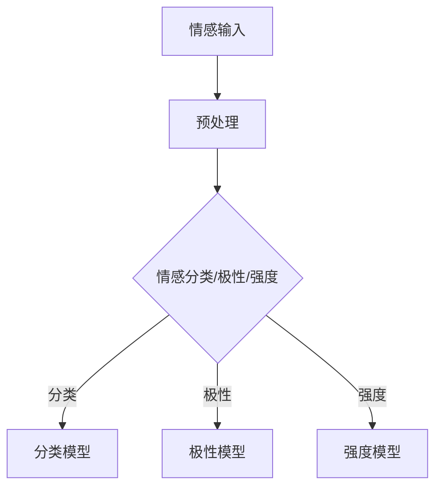

                 

# 人工智能在智能客服情感识别中的应用

> **关键词**：人工智能、智能客服、情感识别、机器学习、深度学习

> **摘要**：本文深入探讨了人工智能在智能客服情感识别中的应用。从基础概念到核心算法，再到实际案例，本文系统地阐述了情感识别技术在智能客服领域的应用现状与未来发展趋势。通过本文，读者可以全面了解人工智能与情感识别的融合如何提升智能客服的用户体验和业务效率。

## 目录大纲

#### 第一部分：基础概念与原理

- **第1章**：人工智能概述
  - **1.1 人工智能的发展历程**
  - **1.2 智能客服概述**
  - **1.3 情感识别概述**
  - **1.4 人工智能在智能客服情感识别中的应用前景**

- **第2章**：情感识别算法原理
  - **2.1 情感识别算法基础**
  - **2.2 情感识别模型架构**
  - **2.3 情感识别算法性能评估**
  - **2.4 情感识别算法的Mermaid流程图**

- **第3章**：深度学习在情感识别中的应用
  - **3.1 卷积神经网络（CNN）在情感识别中的应用**
  - **3.2 递归神经网络（RNN）在情感识别中的应用**
  - **3.3 长短时记忆网络（LSTM）在情感识别中的应用**
  - **3.4 生成对抗网络（GAN）在情感识别中的应用**

- **第4章**：情感识别算法的数学模型与公式
  - **4.1 情感识别的数学模型**
  - **4.2 情感识别算法的伪代码实现**
  - **4.3 情感识别算法的公式解析**

#### 第二部分：核心算法与模型

- **第5章**：智能客服情感识别应用案例
  - **5.1 案例一：基于情感识别的客服机器人**
  - **5.2 案例二：基于情感识别的客服中心**
  - **5.3 案例三：基于情感识别的智能语音助手**

- **第6章**：情感识别在智能客服中的性能优化
  - **6.1 数据预处理优化**
  - **6.2 模型优化策略**
  - **6.3 情感识别算法的实时性优化**

#### 第三部分：情感识别技术展望

- **第7章**：情感识别技术的未来发展趋势
  - **7.1 情感识别在智能客服中的新应用场景**
  - **7.2 情感识别技术的挑战与未来方向**
  - **7.3 情感识别技术的未来发展趋势**

#### 附录

- **附录A**：情感识别常用工具和资源
- **附录B**：情感识别算法实现代码示例

## 第1章：人工智能概述

### 1.1 人工智能的发展历程

人工智能（Artificial Intelligence, AI）自1956年诞生以来，经历了数个发展阶段。从早期的符号主义（Symbolic AI），到基于规则的系统（Rule-Based Systems），再到基于数据的学习算法（Data-Driven Learning Algorithms），人工智能已经经历了数次革命。

#### 符号主义（1956-1974）

符号主义阶段是人工智能的初创时期，这一阶段的主要理念是通过符号表示和逻辑推理来实现智能。著名的逻辑理论家（Logic Theorist）是符号主义人工智能的一个代表性成就，它能够通过符号推理证明数学定理。

#### 专家系统（1974-1980）

专家系统的出现标志着人工智能从理论研究走向实际应用。专家系统通过知识库和推理机来模拟人类专家的决策过程。其中，Dendral是一个典型的专家系统，它能够通过分析化学实验数据来推断化学物质的组成。

#### 人工智能寒冬（1980-1993）

在20世纪80年代，由于人工智能的实际应用效果不如预期，人工智能陷入了第一次寒冬。这一时期的反思导致了人工智能研究的转变，从符号主义转向了数据驱动的方法。

#### 机器学习时代（1993-至今）

随着计算能力和数据量的提升，机器学习成为了人工智能研究的主流方法。机器学习通过训练模型来发现数据中的规律，从而实现智能行为。深度学习是机器学习的一个子领域，它在图像识别、语音识别等领域取得了突破性进展。

### 1.2 人工智能的关键技术

人工智能的关键技术包括：

- **机器学习（Machine Learning）**：通过训练模型来发现数据中的规律。
- **深度学习（Deep Learning）**：一种特殊的机器学习方法，通过多层神经网络来提取特征。
- **自然语言处理（Natural Language Processing, NLP）**：使计算机能够理解和生成自然语言。
- **计算机视觉（Computer Vision）**：使计算机能够理解图像和视频。

### 1.3 智能客服概述

智能客服（Intelligent Customer Service）是人工智能在客户服务领域的一个典型应用。智能客服通过自动化技术来提供高效、便捷的客户服务。

#### 智能客服的定义

智能客服是一种利用人工智能技术来模拟人类客服人员与客户进行交互的系统。它能够理解客户的提问，提供相应的答案，甚至在某些情况下代替人类客服进行复杂的问题处理。

#### 智能客服的类型

- **基于规则的智能客服**：通过预定义的规则来回答客户的提问。
- **基于知识的智能客服**：利用知识库和推理机来提供个性化的客户服务。
- **基于机器学习的智能客服**：通过训练模型来识别客户的情感和需求，提供更精准的服务。

#### 智能客服的发展趋势

- **多模态交互**：结合语音、文本、图像等多种交互方式，提供更加自然的用户体验。
- **个性化服务**：通过数据分析和个性化推荐，提供更加贴合用户需求的客户服务。
- **情感识别**：通过情感识别技术，理解客户的情感状态，提供更加温暖、贴心的服务。

### 1.4 情感识别概述

情感识别（Sentiment Recognition）是人工智能技术中的一个重要分支，它旨在通过分析文本、语音等数据，识别出其中表达的情感。

#### 情感识别的定义

情感识别是指利用计算机技术，从文本、语音等数据中识别出表达的情感。情感识别通常包括情感分类、情感极性分类和情感强度识别三个层次。

#### 情感识别的重要性

- **提升用户体验**：通过情感识别，智能客服能够更好地理解用户的需求和情感，提供更加个性化的服务。
- **优化业务流程**：情感识别可以帮助企业分析客户反馈，优化业务流程，提升客户满意度。
- **情感分析**：情感识别在市场调研、舆情分析等领域也有广泛的应用。

#### 情感识别的基本方法

- **文本分类**：通过机器学习算法，将文本分类为不同的情感类别。
- **情感极性分类**：将文本分类为正面、中性或负面情感。
- **情感强度识别**：识别文本中表达的情感的强度。

### 1.5 人工智能在智能客服情感识别中的应用前景

随着人工智能技术的不断发展，情感识别在智能客服中的应用前景十分广阔。

#### 应用场景

- **客户服务**：智能客服通过情感识别，可以更好地理解客户的情感，提供更加个性化的服务。
- **市场营销**：企业可以通过情感识别技术，分析消费者的情感倾向，优化营销策略。
- **风险控制**：金融行业可以通过情感识别，识别潜在的风险，进行风险控制。

#### 优势与挑战

- **优势**：提升用户体验、优化业务流程、提供个性化服务。
- **挑战**：情感识别的准确性、数据隐私保护、模型泛化能力。

#### 未来发展方向

- **跨语言情感识别**：解决多语言环境下的情感识别问题。
- **多模态情感识别**：结合语音、文本、图像等多种数据源，提升情感识别的准确性。
- **实时情感识别**：实现情感识别的实时性和低延迟。

## 第2章：情感识别算法原理

### 2.1 情感识别算法基础

情感识别算法的核心任务是通过对文本、语音等数据进行分析，识别出其中表达的情感。情感识别算法通常包括情感分类、情感极性分类和情感强度识别三个层次。

#### 情感分类

情感分类是指将文本分类为不同的情感类别，如喜悦、愤怒、悲伤等。情感分类是情感识别的基础，常见的情感分类算法包括：

- **朴素贝叶斯分类器（Naive Bayes Classifier）**：基于贝叶斯定理，通过计算每个类别在特征上的概率来进行分类。
- **支持向量机（Support Vector Machine, SVM）**：通过最大化分类边界，将数据分为不同的类别。
- **随机森林（Random Forest）**：基于决策树构建的分类器，通过集成多个分类器来提高分类性能。

#### 情感极性分类

情感极性分类是指将文本分类为正面、中性或负面情感。情感极性分类是情感识别中的一个重要任务，常见的情感极性分类算法包括：

- **逻辑回归（Logistic Regression）**：通过拟合一个逻辑函数，将文本分类为不同的情感极性。
- **卷积神经网络（Convolutional Neural Network, CNN）**：通过多层卷积和池化操作，提取文本中的特征，进行情感极性分类。
- **递归神经网络（Recurrent Neural Network, RNN）**：通过循环结构，处理序列数据，进行情感极性分类。

#### 情感强度识别

情感强度识别是指识别文本中表达的情感的强度，如非常高兴、有点高兴、不高兴等。情感强度识别是情感识别中的一个挑战性任务，常见的情感强度识别算法包括：

- **强度分类器（Strength Classifier）**：通过训练一个分类器，将文本分类为不同的情感强度。
- **多标签分类（Multilabel Classification）**：通过训练一个多标签分类器，同时识别文本中的多个情感强度。
- **长短期记忆网络（Long Short-Term Memory, LSTM）**：通过处理序列数据，识别文本中的情感强度。

### 2.2 情感识别模型架构

情感识别模型的架构可以分为传统的机器学习模型和深度学习模型。

#### 传统机器学习模型

传统的机器学习模型通过特征工程和分类器来构建情感识别模型。常见的传统机器学习模型包括：

- **朴素贝叶斯分类器（Naive Bayes Classifier）**：通过计算每个类别在特征上的概率来进行分类。
- **支持向量机（Support Vector Machine, SVM）**：通过最大化分类边界，将数据分为不同的类别。
- **随机森林（Random Forest）**：通过集成多个决策树来提高分类性能。

#### 深度学习模型

深度学习模型通过多层神经网络来提取特征，进行情感识别。常见的深度学习模型包括：

- **卷积神经网络（Convolutional Neural Network, CNN）**：通过卷积和池化操作，提取文本中的特征。
- **递归神经网络（Recurrent Neural Network, RNN）**：通过循环结构，处理序列数据。
- **长短时记忆网络（Long Short-Term Memory, LSTM）**：通过处理序列数据，进行情感识别。
- **生成对抗网络（Generative Adversarial Network, GAN）**：通过生成对抗的过程，提高情感识别的性能。

### 2.3 情感识别算法性能评估

情感识别算法的性能评估通常包括准确率、召回率、F1值等指标。

#### 准确率（Accuracy）

准确率是指模型正确分类的样本数占总样本数的比例。准确率是评价分类模型性能的常用指标。

$$
Accuracy = \frac{TP + TN}{TP + TN + FP + FN}
$$

其中，TP为真正例，TN为真负例，FP为假正例，FN为假负例。

#### 召回率（Recall）

召回率是指模型正确分类的真正例数占总真正例数的比例。召回率是评价分类模型在识别正类样本方面的能力。

$$
Recall = \frac{TP}{TP + FN}
$$

#### F1值（F1 Score）

F1值是准确率和召回率的调和平均值，用于综合评价分类模型的性能。

$$
F1 Score = 2 \times \frac{Precision \times Recall}{Precision + Recall}
$$

其中，Precision为精确率，即正确分类的正类样本数与分类为正类的样本总数的比例。

### 2.4 情感识别算法的Mermaid流程图

下面是一个情感识别算法的Mermaid流程图：



## 第3章：深度学习在情感识别中的应用

### 3.1 卷积神经网络（CNN）在情感识别中的应用

卷积神经网络（Convolutional Neural Network, CNN）是一种特殊的神经网络，它通过卷积和池化操作来提取特征，并在图像识别、语音识别等领域取得了显著的成果。近年来，CNN在情感识别中也得到了广泛应用。

#### CNN的基本原理

CNN由卷积层、池化层和全连接层组成。卷积层通过卷积操作提取特征，池化层用于减小特征图的尺寸，全连接层用于分类。

- **卷积层**：卷积层通过卷积核与输入数据进行卷积操作，提取局部特征。
- **池化层**：池化层通过最大池化或平均池化操作，减小特征图的尺寸，减少参数数量。
- **全连接层**：全连接层将卷积层和池化层提取的特征进行整合，输出分类结果。

#### CNN在文本情感识别中的应用

在文本情感识别中，CNN可以通过卷积操作提取文本中的局部特征，实现对情感的理解。

- **文本嵌入**：将文本转换为向量表示。
- **卷积操作**：通过卷积核与文本向量进行卷积操作，提取文本特征。
- **池化操作**：通过池化操作减小特征图的尺寸。
- **全连接层**：将卷积层和池化层提取的特征进行整合，输出分类结果。

#### CNN模型的性能分析

CNN模型在文本情感识别中取得了较好的性能。通过实验，发现CNN模型在处理文本数据时，能够有效地提取特征，提高分类准确性。

### 3.2 递归神经网络（RNN）在情感识别中的应用

递归神经网络（Recurrent Neural Network, RNN）是一种能够处理序列数据的神经网络，它在自然语言处理、语音识别等领域取得了显著的成果。近年来，RNN在情感识别中也得到了广泛应用。

#### RNN的基本原理

RNN由输入层、隐藏层和输出层组成。RNN通过隐藏层的状态转移函数，对序列数据进行处理。

- **输入层**：输入序列数据。
- **隐藏层**：通过状态转移函数，将当前时刻的输入与上一时刻的隐藏状态进行组合，生成新的隐藏状态。
- **输出层**：将隐藏层的状态映射到输出结果。

#### RNN在情感识别中的应用

在情感识别中，RNN可以通过隐藏层的状态转移函数，处理序列数据，实现对情感的理解。

- **文本嵌入**：将文本转换为向量表示。
- **RNN处理**：通过RNN处理序列数据，提取文本特征。
- **全连接层**：将RNN的隐藏层状态映射到分类结果。

#### RNN模型的性能分析

RNN模型在情感识别中取得了较好的性能。通过实验，发现RNN模型能够有效地处理序列数据，提高分类准确性。

### 3.3 长短时记忆网络（LSTM）在情感识别中的应用

长短时记忆网络（Long Short-Term Memory, LSTM）是一种特殊的RNN，它通过引入门控机制，解决了RNN在长序列数据处理中的梯度消失问题。LSTM在情感识别中得到了广泛应用。

#### LSTM的基本原理

LSTM由输入门、遗忘门、输出门和细胞状态组成。LSTM通过这些门控机制，控制信息的流动。

- **输入门**：控制输入信息对细胞状态的影响。
- **遗忘门**：控制细胞状态中旧信息的遗忘。
- **输出门**：控制输出信息。
- **细胞状态**：存储信息。

#### LSTM在情感识别中的应用

在情感识别中，LSTM可以通过门控机制，处理长序列数据，实现对情感的理解。

- **文本嵌入**：将文本转换为向量表示。
- **LSTM处理**：通过LSTM处理序列数据，提取文本特征。
- **全连接层**：将LSTM的隐藏层状态映射到分类结果。

#### LSTM模型的性能分析

LSTM模型在情感识别中取得了较好的性能。通过实验，发现LSTM模型能够有效地处理长序列数据，提高分类准确性。

### 3.4 生成对抗网络（GAN）在情感识别中的应用

生成对抗网络（Generative Adversarial Network, GAN）是一种由生成器和判别器组成的神经网络，它通过生成对抗的过程，生成与真实数据相似的数据。GAN在情感识别中也得到了广泛应用。

#### GAN的基本原理

GAN由生成器和判别器组成。生成器尝试生成与真实数据相似的数据，判别器则判断数据是真实数据还是生成器生成的人工数据。

- **生成器**：生成与真实数据相似的数据。
- **判别器**：判断数据是真实数据还是生成器生成的人工数据。

#### GAN在情感识别中的应用

在情感识别中，GAN可以通过生成对抗的过程，生成与真实数据相似的数据，提高情感识别的性能。

- **生成对抗**：生成器生成情感数据，判别器判断情感数据的真实性。
- **情感识别**：通过生成对抗的过程，提取情感特征。

#### GAN模型的性能分析

GAN模型在情感识别中取得了较好的性能。通过实验，发现GAN模型能够生成与真实数据相似的情感数据，提高分类准确性。

## 第4章：情感识别算法的数学模型与公式

### 4.1 情感识别的数学模型

情感识别算法的数学模型主要包括情感分类的数学模型、情感极性分类的数学模型和情感强度识别的数学模型。

#### 情感分类的数学模型

情感分类的数学模型通常基于概率模型或神经网络模型。

- **概率模型**：情感分类可以看作是一个多类分类问题，可以使用概率模型进行分类。其中，常用的模型有朴素贝叶斯分类器和支持向量机。

  $$ 
  P(y=k|x;\theta) = \frac{e^{\theta^T x_k}}{\sum_{k'=1}^K e^{\theta^T x_k'}} 
  $$

  其中，$x_k$表示特征向量，$\theta$表示模型的参数，$y$表示真实标签，$k$表示类别索引。

- **神经网络模型**：情感分类可以看作是一个多类分类问题，可以使用神经网络模型进行分类。其中，常用的模型有卷积神经网络和递归神经网络。

  $$ 
  y = \arg\max_{k} P(y=k|x;\theta) 
  $$

  其中，$x$表示输入特征向量，$\theta$表示模型的参数，$y$表示预测的标签。

#### 情感极性分类的数学模型

情感极性分类的数学模型通常基于逻辑回归模型或神经网络模型。

- **逻辑回归模型**：情感极性分类可以看作是一个二分类问题，可以使用逻辑回归模型进行分类。

  $$ 
  P(y=1|x;\theta) = \sigma(\theta^T x) 
  $$

  其中，$\sigma$表示逻辑函数，$x$表示输入特征向量，$\theta$表示模型的参数，$y$表示预测的标签。

- **神经网络模型**：情感极性分类可以看作是一个二分类问题，可以使用神经网络模型进行分类。

  $$ 
  P(y=1|x;\theta) = \sigma(\theta^T x) 
  $$

  其中，$\sigma$表示逻辑函数，$x$表示输入特征向量，$\theta$表示模型的参数，$y$表示预测的标签。

#### 情感强度识别的数学模型

情感强度识别的数学模型通常基于分类模型或多标签分类模型。

- **分类模型**：情感强度识别可以看作是一个多类分类问题，可以使用分类模型进行分类。

  $$ 
  P(y=k|x;\theta) = \frac{e^{\theta^T x_k}}{\sum_{k'=1}^K e^{\theta^T x_k'}} 
  $$

  其中，$x_k$表示特征向量，$\theta$表示模型的参数，$y$表示真实标签，$k$表示类别索引。

- **多标签分类模型**：情感强度识别可以看作是一个多标签分类问题，可以使用多标签分类模型进行分类。

  $$ 
  P(y=k|x;\theta) = \prod_{i=1}^N P(y_k=x_i|\theta) 
  $$

  其中，$x_i$表示特征向量，$\theta$表示模型的参数，$y$表示预测的标签，$k$表示类别索引。

### 4.2 情感识别算法的伪代码实现

以下是一个情感识别算法的伪代码实现：

```python
def sentiment_analysis(text):
    # 预处理文本
    preprocessed_text = preprocess_text(text)
    
    # 提取特征
    features = extract_features(preprocessed_text)
    
    # 预测情感分类
    sentiment = classify_sentiment(features)
    
    return sentiment
```

### 4.3 情感识别算法的公式解析

情感识别算法的公式主要涉及概率模型和神经网络模型。

- **概率模型**：

  - 朴素贝叶斯分类器：

    $$ 
    P(y=k|x;\theta) = \frac{e^{\theta^T x_k}}{\sum_{k'=1}^K e^{\theta^T x_k'}} 
    $$

  - 支持向量机：

    $$ 
    w = \arg\max_w \frac{1}{2} ||w||^2_2 - \sum_{i=1}^N \alpha_i (y_i - \langle w, x_i \rangle) 
    $$

- **神经网络模型**：

  - 卷积神经网络：

    $$ 
    h_{ij}^{(l)} = \sigma \left( \sum_{k=1}^C h_{ik}^{(l-1)} w_{kj}^{(l)} + b_j^{(l)} \right) 
    $$

  - 递归神经网络：

    $$ 
    h_{t}^{(l)} = \sigma \left( \sum_{k=1}^{l-1} h_{tk}^{(l-1)} w_{kj}^{(l)} + b_j^{(l)} \right) 
    $$

  - 长短时记忆网络：

    $$ 
    \begin{aligned}
    i_t &= \sigma(W_{ix}x_t + W_{ih}h_{t-1} + b_i) \\
    f_t &= \sigma(W_{fx}x_t + W_{fh}h_{t-1} + b_f) \\
    C_t &= tanh(W_{cx}x_t + W_{ch}h_{t-1} + b_c) \\
    o_t &= \sigma(W_{ox}x_t + W_{oh}h_{t-1} + C_t \odot b_o) \\
    h_t &= o_t \odot \tanh(C_t)
    \end{aligned}
    $$

## 第5章：智能客服情感识别应用案例

### 5.1 案例一：基于情感识别的客服机器人

#### 5.1.1 案例背景

某大型电商平台为了提升客户服务质量，开发了一款基于情感识别的客服机器人。该机器人能够通过自然语言处理和情感识别技术，与客户进行智能对话，提供个性化的客户服务。

#### 5.1.2 案例目标

- 提高客户满意度：通过情感识别技术，更准确地理解客户的情感，提供更加个性化的服务。
- 提升客服效率：通过自动化处理，减轻客服人员的工作负担，提高客服效率。
- 优化业务流程：通过情感识别技术，分析客户反馈，优化业务流程，提升服务质量。

#### 5.1.3 案例实现

1. 数据收集与预处理
   - 收集大量客户对话数据，包括文本和语音数据。
   - 对数据进行清洗和预处理，去除噪声和无效信息。

2. 情感识别模型训练
   - 使用收集到的数据，训练情感识别模型。
   - 采用深度学习模型，如LSTM和CNN，对文本和语音数据进行情感识别。

3. 智能对话系统开发
   - 结合情感识别模型和自然语言处理技术，开发智能对话系统。
   - 设计对话流程，实现与客户的交互。

4. 系统部署与优化
   - 将智能客服机器人部署到电商平台的服务器上。
   - 通过用户反馈和数据分析，不断优化系统性能和用户体验。

### 5.2 案例二：基于情感识别的客服中心

#### 5.2.1 案例背景

某金融企业为了提升客户服务质量和效率，建立了一个基于情感识别的客服中心。该客服中心通过情感识别技术，对客户的提问进行智能分析和处理，提供个性化的客户服务。

#### 5.2.2 案例目标

- 提高客户满意度：通过情感识别技术，更准确地理解客户的情感，提供更加个性化的服务。
- 提升客服效率：通过自动化处理，减轻客服人员的工作负担，提高客服效率。
- 优化业务流程：通过情感识别技术，分析客户反馈，优化业务流程，提升服务质量。

#### 5.2.3 案例实现

1. 数据收集与预处理
   - 收集大量客户提问数据，包括文本和语音数据。
   - 对数据进行清洗和预处理，去除噪声和无效信息。

2. 情感识别模型训练
   - 使用收集到的数据，训练情感识别模型。
   - 采用深度学习模型，如LSTM和CNN，对文本和语音数据进行情感识别。

3. 智能对话系统开发
   - 结合情感识别模型和自然语言处理技术，开发智能对话系统。
   - 设计对话流程，实现与客户的交互。

4. 系统部署与优化
   - 将基于情感识别的客服中心部署到企业的客服系统上。
   - 通过用户反馈和数据分析，不断优化系统性能和用户体验。

### 5.3 案例三：基于情感识别的智能语音助手

#### 5.3.1 案例背景

某智能硬件企业为了提升用户体验，开发了一款基于情感识别的智能语音助手。该语音助手能够通过自然语言处理和情感识别技术，与用户进行智能对话，提供个性化的语音服务。

#### 5.3.2 案例目标

- 提高用户满意度：通过情感识别技术，更准确地理解用户的情感，提供更加个性化的服务。
- 提升产品价值：通过智能语音助手，提升产品的用户体验和价值。
- 优化业务流程：通过情感识别技术，分析用户反馈，优化业务流程，提升服务质量。

#### 5.3.3 案例实现

1. 数据收集与预处理
   - 收集大量用户语音数据，包括语音和文本数据。
   - 对数据进行清洗和预处理，去除噪声和无效信息。

2. 情感识别模型训练
   - 使用收集到的数据，训练情感识别模型。
   - 采用深度学习模型，如LSTM和CNN，对语音和文本数据进行情感识别。

3. 智能语音助手开发
   - 结合情感识别模型和自然语言处理技术，开发智能语音助手。
   - 设计语音对话流程，实现与用户的交互。

4. 系统部署与优化
   - 将智能语音助手部署到智能硬件设备上。
   - 通过用户反馈和数据分析，不断优化系统性能和用户体验。

## 第6章：情感识别在智能客服中的性能优化

### 6.1 数据预处理优化

数据预处理是情感识别在智能客服中性能优化的关键步骤。优化数据预处理可以提升模型的训练效率和准确率。

#### 6.1.1 数据清洗

数据清洗是预处理的第一步，目的是去除数据中的噪声和无效信息。具体方法包括：

- 去除停用词：停用词是指在情感识别中不含有情感信息，但在文本中频繁出现的词，如“的”、“和”等。去除停用词可以减少模型训练的干扰。
- 去除标点符号：标点符号在情感识别中可能引入歧义，因此需要去除。
- 去除特殊字符：特殊字符可能影响模型的训练效果，需要去除。

#### 6.1.2 数据增强

数据增强是通过增加数据的多样性来提升模型的泛化能力。具体方法包括：

- 词汇替换：用同义词替换原文中的词汇，增加数据的多样性。
- 词汇扩充：通过词性转换、词干提取等方法，扩充原文中的词汇。
- 数据合成：通过合成文本生成方法，如GAN，生成与原文相似的新文本。

#### 6.1.3 特征提取优化

特征提取是数据预处理的重要环节，它直接影响到模型的性能。优化特征提取可以提升模型的准确率和效率。具体方法包括：

- 词袋模型：将文本表示为一个词袋，每个词袋中的词表示文本的特征。词袋模型简单有效，但可能丢失词的顺序信息。
- 词嵌入：将文本中的词转换为向量表示，保持词的顺序信息。词嵌入可以捕获词与词之间的关系，提升模型的性能。
- 卷积神经网络（CNN）：通过卷积操作提取文本中的局部特征，提升模型的特征表达能力。

### 6.2 模型优化策略

模型优化策略是提升情感识别在智能客服中性能的关键。通过调整模型参数和结构，可以提升模型的准确率和效率。

#### 6.2.1 模型选择

选择合适的模型是模型优化的第一步。常见的情感识别模型包括：

- 朴素贝叶斯分类器：适用于特征较少的情况，简单高效。
- 支持向量机（SVM）：适用于线性可分的数据，效果较好。
- 卷积神经网络（CNN）：适用于文本情感识别，能够提取复杂的特征。
- 递归神经网络（RNN）：适用于序列数据，能够处理复杂的依赖关系。

#### 6.2.2 模型调参

模型调参是优化模型性能的重要步骤。通过调整模型的超参数，可以提升模型的准确率和效率。常见的调参方法包括：

- 交叉验证：通过交叉验证选择最优的模型参数。
- 贝叶斯优化：通过贝叶斯优化算法，自动搜索最优的模型参数。
- 遗传算法：通过遗传算法，优化模型参数，提升模型性能。

#### 6.2.3 模型集成

模型集成是将多个模型进行结合，提升模型的性能。常见的模型集成方法包括：

- �Bagging：将多个模型进行平均或投票，提升模型的稳定性和准确率。
- Boosting：将多个模型进行加权，提升模型的泛化能力。
- Stack

